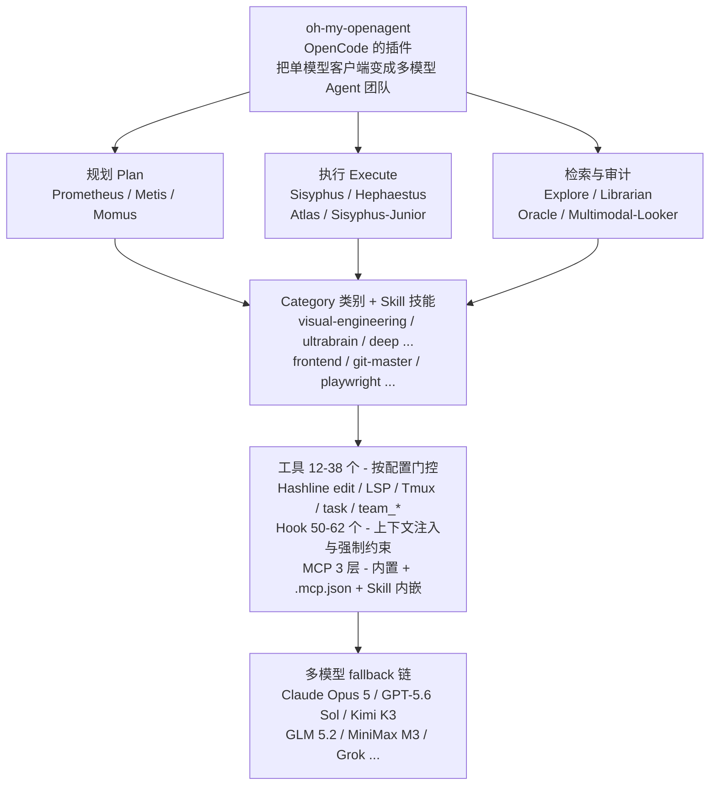

# 第一章：oh-my-openagent 项目简介与核心理念

## 1.1 oh-my-openagent 是什么

### 1.1.1 一句话介绍

[oh-my-openagent](https://github.com/code-yeongyu/oh-my-openagent)（曾用名 `oh-my-opencode`，社区习惯简称为 **OmO**）是一个面向 OpenCode 等 AI 编程终端的**多模型智能体编排骨架（Multi-Model Agent Orchestration Harness）**。

它不是一个新的大模型，也不是又一个 Claude Code 的克隆版。它的本质是把 OpenCode 这个开源 AI 编程客户端武装成一个**协同作战的开发团队**：让 Claude Opus 5 做总指挥（编排）、GPT-5.6 Sol 做深度推理、Kimi K3 当高性价比主力、Gemini 3.1 Pro 处理视觉备援……每个模型各司其职、并行运转，最终输出一段在生产环境里和资深工程师写出来无法区分的代码。

作者在 README 中给出的形象比喻是：

> If OpenCode is Debian/Arch, oh-my-openagent is Ubuntu/Omarchy.
>
> 如果说 OpenCode 是底层的 Debian / Arch，那么 oh-my-openagent 就是开箱即用的 Ubuntu / Omarchy。

它把作者烧掉 24,000 美元 LLM API 费用得出的最佳实践、最强模型组合、最稳健的工具链，全部硬编码到了一个插件中。你只需要装上它，敲下 `ultrawork`，就能享受到一支 AI 工程团队全力工作的体验。

### 1.1.2 三个发行版

OmO 目前以**三个发行版（edition）**发布，同一套产品、三种宿主形态：

| 发行版 | 宿主 | 安装命令 | 内容 |
| --- | --- | --- | --- |
| **Ultimate** | OpenCode 插件 | `bunx oh-my-openagent install` | 完整版：11 个 Agent、约 50–62 个生命周期 Hook、内置 MCP、全部斜杠命令、Team Mode、`/goal`、ultrawork |
| **Light**（又称 LazyCodex） | OpenAI Codex CLI 插件 | `npx lazycodex-ai install` | 可移植组件子集：rules、comment-checker、git-bash、LSP、ultrawork、ulw-loop 等；不含 OpenCode 的 Agent 注册表与 `team_*` 工具族 |
| **Senpi**（beta） | 独立版 | `npm i -g omo-ai@beta` | 原生 `omo` 命令，内置 OMO 扩展；注意必须带 `@beta` 标签，裸 `npm i -g omo-ai` 会故意失败 |

本系列以 **Ultimate（OpenCode 插件）** 为主线，Light 版在第三章安装时单独说明。

### 1.1.3 项目定位

为了避免误解，先把 OmO **不是什么**列清楚：

- 它**不是**一个独立的 IDE 或 CLI，Ultimate / Light 版必须运行在 OpenCode / Codex CLI 之上（Senpi 版除外，它自带引擎）；
- 它**不是**对单一模型（如 Claude）的封装，而是天然多模型、跨提供商；
- 它**不是**与 Anthropic / OpenAI / Google 有商业绑定的产品——作者公开声明"与文档中提及的任何框架/大模型供应商均无利益相关"。恰恰相反，Anthropic 因为这个项目的存在**直接屏蔽了 OpenCode 接入 Claude API 的权限**，作者把这段恩怨写进了 README，也把为 GPT 系列单独打造的智能体命名为"The Legitimate Craftsman"（正牌工匠，故意讽刺）。

它**是什么**：

- 一个**OpenCode 插件**：npm 包双名发布（`oh-my-opencode` 与 `oh-my-openagent`），`opencode.json` 的 `plugin` 数组优先写 `oh-my-openagent`，旧名仍能加载但会有警告；
- 一个**多模型编排骨架**：内置 11 个智能体、约 50–62 个生命周期 Hook（视配置而定）、12–38 个按配置门控注册的工具、三层 MCP（Model Context Protocol）系统（内置 MCP + `.mcp.json` 兼容层 + Skill 内嵌 MCP）、按内容哈希定位的 Hashline 编辑（opt-in）、IntentGate 模式注入器，以及完整的 Claude Code 兼容层；
- 一个**纪律军团（Discipline Agents）**：核心智能体 Sisyphus、Hephaestus、Prometheus、Atlas、Oracle、Metis、Momus、Librarian、Explore、Multimodal-Looker、Sisyphus-Junior，分工明确，永不停歇地把任务推进到 100% 完成。

### 1.1.4 项目体量

从官方文档的架构快照（Architecture Snapshot）能看出这个项目的工程级别：

- 特性模块 `packages/omo-opencode/src/features/` 有 23 个；
- 工具系统 `src/tools/` 有 14 个产工具的目录，注册表按配置门控暴露 **12–38 个工具**（8 个 LSP 别名由内置 `lsp` MCP 提供，不走工具注册表）；
- Hook 系统由 5 层 composer 定义 **58 个槽位**（Session 24 + Tool Guard 18 + Transform 7 + Continuation 7 + Skill 2），默认配置激活约 50–51 个，加上 Team Mode 的 4 个直接事件处理器最多 62 个；
- MCP 系统 3 层：3 个远程内置（websearch / context7 / grep_app）+ 2 个本地 stdio（lsp / codegraph）、`.mcp.json` 加载器、SKILL.md frontmatter 声明的 Skill 内嵌 MCP；
- 配置管线 6 个阶段依次装配：provider → plugin-components → agents → tools → MCPs → commands。

这意味着 OmO 不是"一段 Prompt 模板加几个工具"，而是一个被严肃维护、正在向多骨架（OpenCode、Codex、Pi、Claude Code 等）复用重构的开源系统。

---

## 1.2 OmO 想解决什么问题

### 1.2.1 单模型时代的瓶颈

绝大多数 AI 编程工具（包括官方的 Claude Code、Cursor、Codex CLI）都是**单模型架构**：用户的每一次请求都被发到同一个模型，由它一个人去阅读代码、写代码、跑测试、写注释。

这种架构有几个固有缺陷：

1. **没有任何模型在所有任务上都最强。** Claude 编排能力强、指令跟随好；GPT-5.6 系列推理硬核；Gemini 视觉与前端有独到之处；Haiku、Kimi 高速档快速便宜。强迫一个模型干所有事，等于让你的项目经理一个人同时做 UI、写 SQL 优化、画系统架构图。
2. **被供应商绑架。** 模型每个月都在变便宜、变聪明，但用户为了不切换工具，被迫继续给某一家供应商付订阅。当供应商出故障、限流、涨价、停服时，你的开发节奏就被卡死——Anthropic 屏蔽 OpenCode 这件事就是最直接的例证。
3. **上下文窗口被无情消耗。** 一个模型同时维护工程上下文、当前任务、工具调用历史、子任务结果，上下文很快爆掉，需要频繁压缩，质量随之下降。
4. **缺乏验证机制。** 模型说自己"做完了"——但谁来检查？同一个模型自我审查，本质上是让作弊的学生自己批改试卷。

### 1.2.2 OmO 的核心命题

OmO 给出的回答是 **"专业化分工 + 编排"**：

- **Sisyphus** 做总指挥，他不写最难的代码，但极其擅长拆解任务、并行调度其他智能体、把结果拼起来；
- **Hephaestus** 是深度匠人（GPT 原生），专门处理需要长链条推理和跨文件分析的硬骨头；
- **Prometheus** 是项目顾问，动手前以"访谈模式"反复盘问需求、识别歧义、产出战略级计划；
- **Atlas** 是执行指挥棒，拿着 Prometheus 的计划逐项落地，并独立验证；
- **Oracle / Metis / Momus** 是只读评审委员会，分别负责架构咨询、计划缺口分析、计划合规审查；
- **Explore / Librarian / Multimodal-Looker** 是检索/视觉小分队，负责快速 grep、文档查询、多媒体识别；
- **Sisyphus-Junior** 是被召唤的执行小弟，按类别（Category）匹配最合适的模型来执行单个任务。

这套结构带来几个直接收益：

- **每个模型用在它最强的地方**：多模型不是"花式炫技"，而是"该谁上谁上"；
- **永不被供应商锁定**：同一个角色都有多条 fallback 链，主模型挂了自动切换；
- **上下文清洁**：背景 Agent 并行做研究/检索，不污染主线对话；Skill 自带 MCP 用完即销毁；
- **强制验证**：Atlas 独立验证、Momus + Oracle 双评审、`lsp_diagnostics`、`comment-checker` 等多重 Hook 把"伪完成"挡在外面。

### 1.2.3 它和 Claude Code、Cursor、Codex CLI 的差异

可以用一句话概括：

> **OmO 把"单模型 + 单 Agent"升级为"多模型 + 多 Agent + Discipline"。**

具体来看：

| 对比维度 | Claude Code / Cursor / Codex CLI | oh-my-openagent |
| --- | --- | --- |
| 模型 | 单一模型 | 多模型并行，按 Category 路由 |
| 编排 | 单 Agent 一条龙 | 11 个 Agent 协同，Sisyphus 总指挥 |
| 后台并行 | 弱或无 | 后台 Agent 5+ 并行，Tmux 实时观看（Team Mode 更可 8 成员并行） |
| 编辑工具 | 文本 diff，依赖模型复述原文 | Hashline `LINE#ID` 哈希校验编辑（opt-in） |
| 计划/执行分离 | 一锅端 | Prometheus 计划，Atlas 执行（`/ulw-execute`） |
| Skill / MCP | 全局静态 | 按 Skill 内嵌按需启动 |
| Discipline | 模型自觉 | 数十个 Hook 强制约束 |
| 厂商锁定 | 高 | 中立、可自由替换 fallback |

OmO 作者 [@code-yeongyu](https://github.com/code-yeongyu) 自己的话：

> Stop agonizing over harness choices. I'll research, steal the best, and ship it here.
>
> 别再浪费时间到处对比选哪个框架好了。我会去市面上调研，把最强的特性全偷过来，然后在这更新。

---

## 1.3 OmO 的设计哲学

OmO 的所有功能都是从几条核心信念推导出来的，理解了哲学，就能理解每一个看起来"很卷"的特性。

### 1.3.1 人类介入是失败信号（Human Intervention is a Failure Signal）

作者在 [Manifesto](https://github.com/code-yeongyu/oh-my-openagent/blob/dev/docs/manifesto.md) 中开宗明义：

> 想想自动驾驶。当人类必须接管方向盘的时候，那不是一个特性，而是系统的失败。汽车没能自己处理这个场景。
>
> **那写代码为什么要不一样？**

如果你在用 AI 编程时反复出现下面任何一种情况，OmO 就视为**系统设计失败**：

- 你在帮 AI 收尾它没写完的代码；
- 你在手动纠正它明显的低级错误；
- 你在一步步教它怎么做某件事；
- 你在反复重申同样的需求。

OmO 的姿态是：**只要你描述清楚意图，剩下的全是 Agent 自己的事。** 这就解释了为什么它要在 Prometheus 里强制访谈、要在 Atlas 里做 Wisdom Accumulation、要用 `todo-continuation-enforcer` 强制 Agent 把所有 todo 跑完。

### 1.3.2 不可区分的代码（Indistinguishable Code）

> 目标：Agent 写出的代码，应该和资深工程师写的无法区分。

不是"AI 生成的需要人工清理一遍"，不是"一个不错的起点"，而是**直接可上线的最终成品**。

它要求：

- 严格遵循已有代码库模式；
- 默认就有合适的错误处理；
- 测试要测对的东西；
- 没有 AI slop（过度工程、不必要的抽象、无关 scope 蔓延）；
- 注释只在真正有价值时出现。

为此 OmO 内置了 `comment-checker` Hook，自动拦截冒着浓烈 AI 味的冗余注释（可以用 `// @allow` 逐行放行）；还内置了 `remove-ai-slops` 技能，专门用来在事后把 AI 痕迹抹掉。

### 1.3.3 Token 成本 vs 生产力

OmO 不追求"用最少的 Token 完成任务"，而是追求"在保证完成度的前提下让人类的认知负担最小"。

- 多个智能体并行检索、并行实现、独立验证——更费 Token，但能换来 10 倍、20 倍甚至 100 倍的人类效率提升，**值**；
- 简单任务用 `quick` 类别（Kimi highspeed、GPT-5.6 Luna Fast、MiniMax 高速档）——能省就省。

换句话说：**Token 成本是项目经理要操心的事，Agent 应该把它当成"为了让用户偷懒而花掉的预算"。**

### 1.3.4 最小化人类认知负担

OmO 提供几条把人类认知负担压到最小的路径：

1. **Ultrawork 模式**：你说 `ulw 加登录功能`，Agent 自己摸索方案、自己研究最佳实践、自己实现并验证，跑到 100% 完成才停。**你只提供意图，Agent 包办一切。**
2. **Prometheus 访谈模式**你说"我想加个登录功能"，Prometheus 自动调研代码库、提澄清问题、抛出你没想到的边界情况、形成一份完整工作计划，再由 `/ulw-execute` 交给 Atlas 落地。**你只提供意图，Agent 提供结构。**
3. **Goal 模式**：`/goal "构建一个带认证的 REST API"` 设定持久目标，Agent 空闲时自动续跑直到完成审计通过。
4. **Team Mode**：一个 lead 带最多 8 个成员真正并行干活，tmux 里实时观看。

无论哪条路径，人类的工作都只是**说出想要什么**，而不是**管理它怎么做**。

### 1.3.5 可预测、可持续、可委托（Predictable, Continuous, Delegatable）

理想中的 Agent 应该像编译器一样工作：**Markdown 文档进，可运行代码出。**

- **可预测**：相同代码库 + 相同需求 + 相同约束 → 输出一致，不要"创造性发挥"；
- **可持续**：会话崩溃？`/ulw-execute` 续上；要离开几小时？进度被 `.omo/boulder.json` 记录；多日项目？上下文被 notepad 与 memory 保存；
- **可委托**：像把任务交给一个能干的同事一样，给它一个明确目标 + 验收标准，它自己跑完、自己验证、只在真正需要时才升级到你这里。

OmO 的所有"看起来过度设计"的功能，本质上都在为这三个属性服务。

---

## 1.4 一个最小心智模型

读完本章你不需要立刻动手安装，但脑子里应该有这样一个**最小心智模型**：

如果你只能记住一句话：

> **OmO 是装在 OpenCode 上的一支自动化的多模型 AI 工程团队。它在你只说一句"做这个"时，会自己开会、自己拆任务、自己 debug、自己验收，并把成品交给你——而不是要你手把手教它写代码。**

---

## 1.5 你将在本教程中学到什么

后续章节会沿着"先理解，再上手，再精通"的递进路线展开：

- 第二章：整体架构与多模型编排机制——把多智能体协同、IntentGate、Category 路由讲清楚；
- 第三章：安装、订阅与环境配置——从零完成三种发行版的部署；
- 第四章：智能体（Agents）全景详解——11 个 Agent 各自的角色、模型、限制；
- 第五章：工作模式 Ultrawork、Prometheus、Atlas、Goal 与 Team Mode——各条主线工作流怎么用；
- 第六章：Category 与 Skill 系统——按需扩展、按需注入；
- 第七章：核心工具链 Hashline / LSP / AST-Grep / Tmux——为什么 Agent 改代码这么稳；
- 第八章：Hooks 与 MCP——理解 OmO 的"操作系统"；
- 第九章：命令、模型回退与配置参考——完整速查表；
- 第十章：实战案例、最佳实践与故障排除——把这一切串成生产力。

读完整本教程，你应该能够：

1. 在自己机器上把 OmO 装起来并跑通 `ultrawork`；
2. 根据手上有的订阅（Claude / ChatGPT / Gemini / Copilot / Z.ai / OpenCode Go / Kimi / MiniMax …）设计一份适合自己的模型配置；
3. 知道什么时候该用 Prometheus + Atlas 计划-执行流，什么时候直接 `ulw` 一把梭，什么时候开 Team Mode；
4. 看懂 OmO 的 fallback 链，并能在某个供应商挂掉时自己改配置救场；
5. 编写自定义 Skill、Category、Command，把 OmO 适配到自己的特定领域。

下一章我们将深入 OmO 的整体架构，看看这支"AI 工程团队"是怎么被组织起来的。
