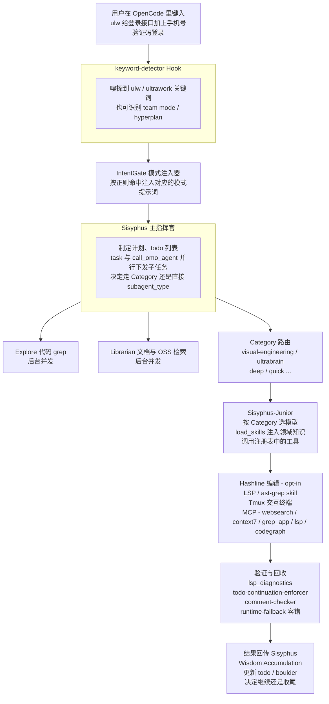
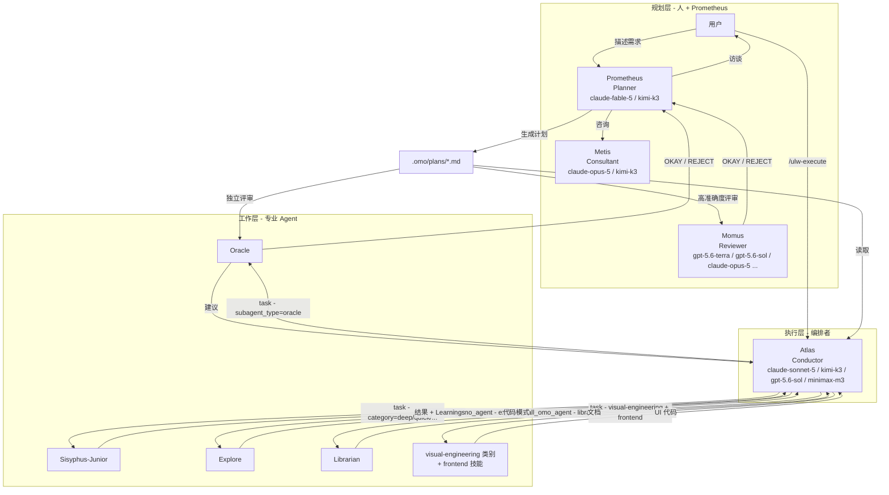

# 第二章：整体架构与多模型编排机制

本章把 oh-my-openagent（OmO）整体看一遍：从你按下回车那一刻开始，请求是怎么被关键词检测器捕获、交给 Sisyphus 拆解、转给 Category-based 子智能体、最后通过 Hashline 工具改到你的代码里的——同时还要兼顾后台 Agent、Skill 注入、数十个 Hook 拦截、MCP 调用，以及多模型 fallback 链。

理解完本章，你才能在后面看任何一个具体特性的时候，知道它在整张图里的位置。

---

## 2.1 从用户请求到完成代码：一次完整的请求流

OmO 的核心调用链可以画成下面这张管线总览图：



每一个方框背后都对应着 OmO 真实存在的一组源码模块：

- 特性模块在 `packages/omo-opencode/src/features/`（23 个）；
- 工具在 `src/tools/`（14 个产工具目录，注册表按配置门控暴露 12–38 个）；
- Hook 由 5 层 composer 组合成 58 个槽位；
- 11 个智能体分 primary（sisyphus / hephaestus / prometheus / atlas）与 subagent（oracle / librarian / explore / multimodal-looker / metis / momus / sisyphus-junior）两类；
- 内置 MCP（websearch / context7 / grep_app + 本地 stdio 的 lsp / codegraph）在 `src/mcp/`。

后续章节会逐一深入，本章只关心**整张地图**。

---

## 2.2 三层架构：Planning / Execution / Worker

如果把 OmO 抽象成组织结构，它本质上是一个**三层架构**：



这套三层架构刻意做了**规划与执行的物理隔离**：

- **规划层**：Prometheus（计划员）先和你访谈、调研代码库、产出 Markdown 计划；Metis 在计划落盘前做"缺口分析"（GAP analysis），防止 Prometheus 自己脑补的隐含信息没写出来；高准确度模式下 Momus 与 Oracle **并行双评审**，两位都批准才放行。
- **执行层**：Atlas 是"指挥棒"，自己不演奏乐器，负责读计划、拆 todo、累积经验（Wisdom Accumulation）、把任务派给最合适的子 Agent、独立验证结果。
- **工作层**：Sisyphus-Junior 是被 Category 召唤出来的执行小弟，**不能再继续用 `task()` 委派**；Oracle / Explore / Librarian / Multimodal-Looker 是只读的咨询/检索/视觉小组。

这种"计划员不写代码、执行员不亲自写代码、工作员不能再分包"的设计，看起来有点笨重，但带来一个非常重要的特性：**信息以计划文件 + 笔记本（notepad）为单位被持久化**，会话崩了、机器重启了、隔了一周才回来，进度都不会丢。

---

## 2.3 IntentGate：模式关键词注入器

OmO 的请求会先经过 IntentGate。当前版本的它做一件事：**用正则检测显式的模式关键词，命中后把对应的模式提示词注入会话**：

| 关键词 | 效果 |
| --- | --- |
| `ultrawork` / `ulw` | 进入 Ultrawork 模式，全员上阵 |
| `team mode` / `team-mode` / `team_mode` / `teammode` | 强制走 `team_*` 工具编排（需 `team_mode.enabled`；单独一个 `team` 词不会触发） |
| `hyperplan` | 对抗式规划（5 个"恶意评审"围攻计划） |
| `hyperplan ultrawork` | 两者同时开启 |

注意：**IntentGate 不做语义级的意图分类**（不判断这句话是"研究"还是"修复"）。没有命中这些关键词的提示词会正常走默认流程。它对应的源码实现就是 `keyword-detector` Hook。

---

## 2.4 Category 系统：按"任务种类"分配模型

### 2.4.1 为什么不直接选模型？

如果让 Sisyphus 在派任务时直接写"用 GPT-5.6 做这个"，会发生两件糟糕的事：

1. **认知偏差**：模型知道自己是"GPT-5.6"，会按它对自己的认知去回答，限制反而被强化；
2. **维护噩梦**：明天 GPT-5.7 出来了，你要把所有 `"gpt-5.6"` 字符串改一遍，还要改回退链。

OmO 的解决方法是引入**类别（Category）**：Sisyphus 只描述"我要哪种工作"，框架自动决定用什么模型。

### 2.4.2 内置 8 个类别

| Category | 默认模型 | 适用场景 |
| --- | --- | --- |
| `visual-engineering` | `anthropic/claude-opus-5` (max) | 前端、UI/UX、设计、动画 |
| `ultrabrain` | `openai/gpt-5.6-sol` (xhigh) | 复杂硬核逻辑、架构决策、需要深度推理的问题 |
| `deep` | `openai/gpt-5.6-sol` (medium) | 目标导向的自主调研与执行，"硬骨头"问题 |
| `artistry` | `anthropic/claude-fable-5` (xhigh) | 创意性/艺术性强的任务，需要新颖想法 |
| `quick` | `kimi-for-coding/kimi-for-coding-highspeed` | 单文件改动、修错字、简单修改 |
| `unspecified-low` | `xai/grok-4.6` (xhigh) | 不属于其他类别、低投入 |
| `unspecified-high` | `kimi-for-coding/k3` (max) | 不属于其他类别、高投入 |
| `writing` | `kimi-for-coding/k3` (low) | 文档、技术写作 |

每一个 Category 背后都是一条**多提供商 fallback 链**。以 `visual-engineering` 为例：`claude-opus-5`（anthropic / github-copilot / opencode / vercel 多提供商并行的第一档）→ `kimi-k3`（多提供商）→ `glm-5.2` → `gpt-5.6-sol`（medium）。`quick` 则是 Kimi highspeed → GPT-5.6 Luna Fast → DeepSeek v4 Flash → Qwen3.6 Flash → MiniMax M3/M2.7 → Grok → Haiku 一路向下，主打一个便宜够用。

> 提示：模型世界变化极快，上表的"默认模型"以官方文档为准，`bunx oh-my-openagent doctor --verbose` 能看到你本机每条链实际解析到了谁。

### 2.4.3 Category + Skill 组合的能力

Category 决定模型，Skill 决定**外挂的领域知识 + 工具**。两者组合后，等于"一个最优模型 + 一份领域专长"。例如：

- The Designer：`category = visual-engineering` + `load_skills = ["frontend", "playwright"]` → 用 Opus 5 max 写 UI，再用 Playwright 直接打开浏览器验证视觉效果；
- The Architect：`category = ultrabrain` + `load_skills = []` → 纯 GPT-5.6 Sol xhigh 推理，做架构评审；
- The Maintainer：`category = quick` + `load_skills = ["git-master"]` → 便宜快速的模型修小问题，git-master 自动拆原子提交。

---

## 2.5 多模型 fallback 链：每个 Agent 自己的"逃生通道"

OmO 没有"全局优先模型"这种东西。**每个 Agent 都有自己独立的回退链**，由 `model-requirements.ts` 定义。下面是核心 Agent 的默认链（`|` 分隔的是同一档内可并行的多个提供商）：

| Agent | Fallback 链（前几跳） |
| --- | --- |
| **Sisyphus** | `claude-opus-5 (max)`（anthropic\|github-copilot\|opencode\|vercel）→ `kimi-k3`（opencode-go\|kimi-for-coding\|moonshotai\|opencode\|vercel 等）→ `gpt-5.6-sol (medium)` → `glm-5.2` → `big-pickle` |
| **Hephaestus** | `gpt-5.6-sol (medium)`（openai\|github-copilot\|vercel\|opencode），仅此一档 |
| **Oracle** | `gpt-5.6-sol (xhigh)` → `gpt-5.6-sol (high)`（github-copilot）→ `gemini-3.1-pro (high)` → `claude-opus-5 (max)` → `glm-5.2` |
| **Atlas** | `claude-sonnet-5` → `kimi-k3` → `gpt-5.6-sol (medium)` → `minimax-m3` → `MiniMax-M3`（minimax 双计划）→ `minimax-m2.7` |
| **Explore / Librarian** | `gpt-5.6-luna-fast (low)` → `deepseek-v4-flash (max)` → `qwen3.7-plus` → `minimax-m2.7-highspeed` → `minimax-m3` → `MiniMax-M3` → `minimax-m2.7` → `claude-haiku-4-5` → `gpt-5.4-nano` |
| **Multimodal-Looker** | `gpt-5.6-sol (low)` → `kimi-k3` → `glm-4.6v` → `gpt-5-nano` |
| **Prometheus** | `claude-fable-5 (xhigh)` → `kimi-k3 (max)` |
| **Metis** | `claude-opus-5 (high)` → `kimi-k3 (low)` |
| **Momus** | `gpt-5.6-terra (high)` → `gpt-5.6-sol (xhigh)` → `claude-opus-5 (max)` → `gemini-3.1-pro (high)` → `glm-5.2` |
| **Sisyphus-Junior**（通用 fallback） | `claude-sonnet-5` → `kimi-k3` → `gpt-5.6-sol (medium)` → `minimax-m3` → `MiniMax-M3` → `minimax-m2.7` → `big-pickle` |

为什么这么排？回到第一章那条原则：**给每个角色配最适合它工作风格的模型，再准备一条全员能扛事的备胎链**。

- Sisyphus 是"社交型项目经理"，要 Claude / Kimi / GLM 这种擅长长链条多步指令的"机械驱动（mechanics-driven）"模型；
- Hephaestus 是"独行匠人"，要 GPT-5.6 Sol 这种"原则驱动（principle-driven）"的深度推理选手；
- Atlas 是节奏指挥棒，重在协调，Sonnet / Kimi 即可；
- Explore / Librarian 重速度而非智商，选 Luna Fast / DeepSeek Flash / Qwen / MiniMax 高速档；
- Oracle / Momus 做严谨审查，必须 GPT-5.6 / Opus / Terra 这种顶配。

当遇到可重试错误（429 / 500 / 502 / 503 / 504、提供商 Key 配置错误等）时，`runtime-fallback` 会按链条自动降级并给失败模型加冷却时间（该机制默认关闭，需在配置中开启 `runtime_fallback`）。

---

## 2.6 双提示词机制：Claude vs GPT 分别调优

Claude 和 GPT 的指令跟随风格本质不同：

- **Claude 系列**（Opus / Sonnet / Haiku，以及 Claude-like 的 Kimi / GLM）适合**机械驱动**的提示词：长长的检查表、模板、step-by-step 流程，规则越多越听话；
- **GPT 系列**（尤其是 5.2 以后）适合**原则驱动**的提示词：短、用 XML 结构、给出明确决策标准；规则越多反而互相冲突，越容易漂移。

OmO 对不同 Agent 采用了不同策略：

- **Sisyphus**：按模型族准备提示词——Claude 专用提示词、GPT-5.4 专用提示词、GPT-5.5 与 GPT-5.6 Sol 共享一套"模型感知"的 GPT 原生提示词，GLM 5.2 也有单独校准的版本（模型 ID 里含 GLM 就会命中）；
- **Prometheus**：**不再按模型切换提示词**。现在只用一份轻量基础提示词，由 `ulw-plan` 技能承载"Decision Complete"（计划零决策残留）的行为约束——换 fallback 模型只影响容量、成本与可用性，不影响提示词文本；
- **Hephaestus / Oracle / Momus**：GPT 系原生设计，强行配 Claude 反而劣化；
- **Atlas**：仍保留模型族相关的提示词路径（GPT 优化的 todo 管理路径）。

理解这点你才能看懂第三章的安装问题为什么要挨个问"你有没有 Claude 订阅、有没有 OpenAI 订阅"——它在为你自动调配每个 Agent 的模型与提示词路径。

---

## 2.7 后台 Agent：并行的"幽灵团队"

OmO 的 `task()` 工具支持 `run_in_background=true`。这一招把单线程对话变成"幽灵团队"：

```text
# 主对话里下发 5 个后台 Agent
task(subagent_type="explore", prompt="找所有 auth 实现", run_in_background=true)
task(subagent_type="librarian", prompt="查 OAuth2 PKCE 标准", run_in_background=true)
task(category="visual-engineering", prompt="设计登录卡片 UI", run_in_background=true)
task(category="deep", prompt="分析 token 续期边界", run_in_background=true)
task(subagent_type="oracle", prompt="评审整体架构", run_in_background=true)

# 主线程继续干活，完成时被通知
background_output(task_id="bg_abc123")  # 取结果
background_cancel(task_id="bg_def456")  # 撤销
```

后台并发默认上限 5，可按提供商/模型分别设置（`background_task.providerConcurrency` / `modelConcurrency`）。如果你启用了 Tmux 集成（`tmux.enabled = true`），这些后台 Agent 会**真的开 Tmux Pane 在你眼前实时跑**，跑完自动关闭。这是 OmO 区别于绝大多数单线程 Agent 工具的标志特性之一。

---

## 2.8 三层 MCP 系统

MCP（Model Context Protocol）是模型对接外部工具的标准协议。OmO 的 MCP 体系分**三层**：

1. **内置 MCP**（运行时注入）：
   - `websearch`（基于 Exa AI 的实时网络搜索）
   - `context7`（任何库/框架的官方文档查询）
   - `grep_app`（公共 GitHub 仓库代码极速搜索）
   - `lsp`（本地 stdio，提供 8 个 LSP 工具别名）
   - `codegraph`（本地代码图 stdio 服务，可用 `codegraph.enabled: false` 关闭）
2. **`.mcp.json` 兼容层**：完全兼容 Claude Code 的 `.mcp.json`、`~/.claude.json`、`.claude/.mcp.json`、`~/.config/opencode/.mcp.json`；支持环境变量 `${VAR}` 展开。
3. **Skill 内嵌 MCP**：每个 Skill 在 SKILL.md 的 frontmatter 里声明自己的 MCP，**只在该 Skill 被加载时启动，任务完成立即销毁**，按 `${sessionID}:${skillName}:${serverName}` 键做会话级隔离。极大节省上下文窗口，避免一堆全局 MCP 把对话挤爆。

一个容易踩坑的知识点：内置 MCP 是插件**运行时注入**的，`opencode mcp list` 只读 OpenCode 静态配置，**看不到它们**——这是预期行为不是 bug。想看插件实际提供了哪些 MCP，用 `bunx oh-my-openagent doctor --verbose`。

Skill 内嵌 MCP 还原生支持 OAuth 2.1（RFC 9728 / 8414 / 8707 / 7591），含 PKCE（Proof Key for Code Exchange）、动态客户端注册、自动刷新。令牌缓存在 `~/.config/opencode/mcp-oauth.json`（权限 0600）。

---

## 2.9 Hashline 编辑：消灭"改错行"

Anthropic / OpenAI 的官方 IDE Edit 工具有个老问题——**Harness 问题**：

> 几乎所有 Edit 工具都没办法给模型一个稳定、可验证的行定位标识……它们都依赖模型一字不差复述刚看到的原文。模型只要写错（这很常见），用户就会怪罪大模型太蠢。
>
> —— Can Bölük, *The Harness Problem*

OmO 借鉴 [oh-my-pi](https://github.com/can1357/oh-my-pi) 提出的 **Hashline 技术**（**opt-in**，需在配置中设 `hashline_edit: true`）：每行代码读出来时尾部都打上一个绑定内容的哈希，形如：

```text
11#VK| function hello() {
22#XJ|   return "world";
33#MB| }
```

模型修改时必须引用 `LINE#ID`。如果文件已被修改、缩进变了、内容变了——**哈希校验失败，编辑直接被驳回**。

效果：在 Grok Code Fast 1 上，仅靠这个工具升级，编辑成功率从 6.7% 飙升到 68.3%。开启后 `hashline-read-enhancer` Hook 会自动配套激活，给 read 输出追加哈希标记。

---

## 2.10 IDE 级别的"长出手脚"：LSP + AST-Grep + Tmux

仅有 Hashline 还不够，OmO 还把 IDE 的核心能力下放给 Agent：

- **LSP（Language Server Protocol，语言服务器协议）工具**（由内置 `lsp` MCP 提供 8 个别名）：`lsp_status`、`lsp_diagnostics`（构建前诊断）、`lsp_rename`（工作区级重命名）、`lsp_goto_definition`（跳定义）、`lsp_find_references`（找引用）、`lsp_symbols`（文件大纲 / 符号搜索）、`lsp_prepare_rename`（重命名前校验）、`lsp_install_decision`（语言服务器安装决策）；
- **AST-Grep**：基于语法树的模式匹配 + 替换，覆盖 25 种编程语言。注意它现在以 **`ast-grep` 技能**的形式提供（配套 `sg` 二进制），需要时通过 `skill` 工具加载，而不是常驻工具；
- **Tmux 集成**：真实的交互式终端环境，Agent 可以跑 REPL、用 GDB / pudb 调试、操作 vim / htop 等 TUI 工具，会话持久化；也支持 cmux 兼容层。

加起来，OmO 的 Agent 拥有"看到全工程符号 + 重命名安全 + 改完就跑诊断 + 还能交互式调试"的能力，**而不是只会 read/write/sed**。

---

## 2.11 Hook 系统：OmO 的"操作系统"

Hook 系统是 OmO 真正的核心。所有"看起来很黑魔法"的特性，几乎都是某个 Hook 在偷偷工作。它们覆盖：

- **PreToolUse / PostToolUse**：工具执行前后；
- **Message / Transform**：消息处理 / 上下文注入；
- **Event**：会话生命周期、错误恢复、外部通知；
- **Params**：调整模型 reasoning 等运行时参数。

物理上由 5 层 composer 组合成 58 个槽位：**Session 24 + Tool Guard 18 + Transform 7 + Continuation 7 + Skill 2**；默认配置激活约 50–51 个，加上 Team Mode 的 4 个直接事件处理器最多 62 个。按用途分组：

- 上下文与注入（`directory-agents-injector` / `rules-injector` / `preemptive-compaction` 等）；
- 生产力与控制（`keyword-detector` / `think-mode` / `goal` / `ulw-execute` / `category-skill-reminder`）；
- 质量与安全（`comment-checker` / `write-existing-file-guard` / `tool-pair-validator` / `prometheus-md-only`）；
- 容错与稳定（`runtime-fallback` / `model-fallback` / `json-error-recovery` / 上下文超限恢复）；
- 截断与上下文管理（`tool-output-truncator`）；
- 通知与 UX（`auto-update-checker` / `background-notification` / `session-notification`）；
- 任务管理（`delegate-task-retry` / `empty-task-response-detector` / `tasks-todowrite-disabler`）；
- 持续机制（`todo-continuation-enforcer` / `compaction-todo-preserver` / `unstable-agent-babysitter`）；
- 集成与专用（`claude-code-hooks` / `atlas` / `interactive-bash-session` / `team-tool-gating` 等）。

这套 Hook 系统的**威力**在于：它把"Agent 总爱偷懒、瞎写、报错就崩"的脆弱性，变成了"Agent 想偷懒？`todo-continuation-enforcer` 直接拽回来；写注释太啰嗦？`comment-checker` 拦截；编辑出错？`edit-error-recovery` 救场；429？`runtime-fallback` 切换备胎"。

---

## 2.12 Claude Code 兼容层

OmO 内置完整的 Claude Code 兼容层，意味着：

- **Commands**：`~/.config/opencode/commands/`、`.claude/commands/` 中的命令直接生效；
- **Skills**：`~/.config/opencode/skills/*/SKILL.md`、`.claude/skills/*/SKILL.md`；
- **Agents**：`~/.config/opencode/agents/*.md`、`.claude/agents/*.md`；
- **MCPs**：`~/.claude.json`、`.mcp.json`、`.claude/.mcp.json`、`~/.config/opencode/.mcp.json`；
- **Hooks**：`~/.claude/settings.json`、`./.claude/settings.json`、`./.claude/settings.local.json` 中的 PreToolUse/PostToolUse 命令式 Hook；
- **Plugins**：连 Claude Code 插件市场的插件都能加载。

迁移时几乎不需要改任何配置。如果你想分项关闭兼容，可以在配置里：

```json
{
  "claude_code": {
    "mcp": false,
    "commands": false,
    "skills": false,
    "agents": false,
    "hooks": false,
    "plugins": false,
    "plugins_override": {
      "claude-mem@thedotmack": false
    }
  }
}
```

这意味着对于已经在 Claude Code 上有大量自定义的开发者，**OmO 的"上手成本"几乎为零**。

---

## 2.13 一张表把"OmO 全貌"压缩起来

最后用一张速记表把整章压缩起来：

| 层级 | 关键组件 | 作用 |
| --- | --- | --- |
| 入口 | OpenCode CLI / TUI | 用户与 Agent 的交互界面 |
| 关键词 | `keyword-detector` Hook | 识别 ulw / team mode / hyperplan |
| 模式 | IntentGate | 按关键词注入模式提示词 |
| 编排 | Sisyphus | 主指挥官、todo、并行调度 |
| 计划 | Prometheus + Metis + Momus + Oracle | 访谈、缺口分析、双评审 |
| 执行 | Atlas | 读计划、派任务、独立验证（`/ulw-execute`） |
| 工作 | Sisyphus-Junior（按 Category） | 单任务执行、不可再 `task()` 委派 |
| 顾问 | Oracle / Librarian / Explore / Multimodal-Looker | 只读咨询、检索、视觉 |
| 工具 | 12–38 个（Hashline / LSP / Tmux / task / background / team_* …） | Agent 的"手脚" |
| Hook | 约 50–62 个（5 层 composer，58 槽位） | 上下文、约束、容错、通知、续作 |
| MCP | 3 层（内置 5 个 + `.mcp.json` + Skill 内嵌） | 外部能力扩展 |
| 模型 | 每个 Agent 独立 fallback 链 | 多模型路由 + 抗故障 |

下一章我们将放下抽象，进入**第三章：安装、订阅与环境配置**——把这套架构在你自己的电脑上搭起来。
