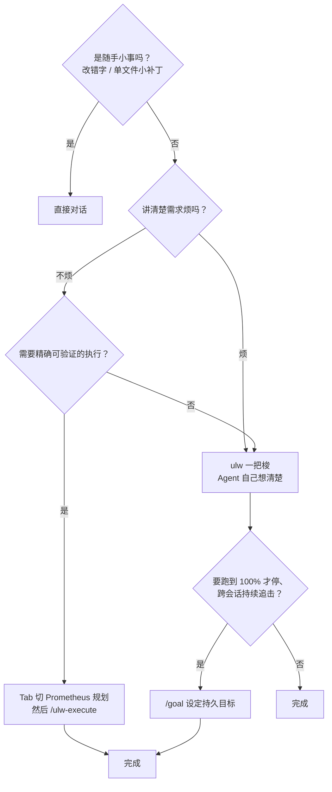
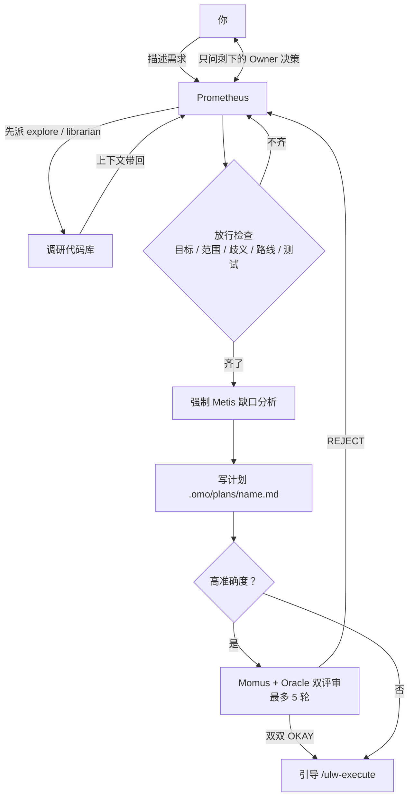
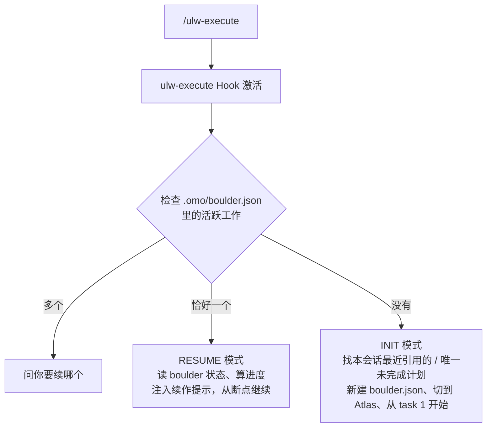
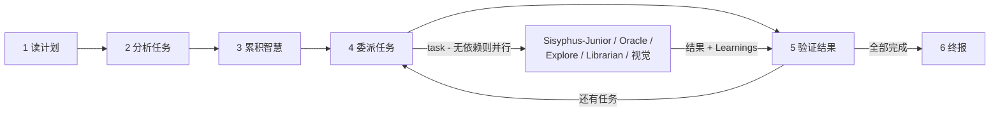

# 第五章：工作模式——Ultrawork、Prometheus、Atlas、Goal 与 Team Mode

oh-my-openagent（OmO）日常使用可以归纳为四条主线工作流：

- **Ultrawork（懒人模式）**：扔出意图，让全员上阵；
- **Prometheus + Atlas（规划-执行模式）**：先访谈、再规划，`/ulw-execute` 逐项落地；
- **Goal（目标追击模式）**：`/goal` 设定持久目标，空闲自动续跑直到完成；
- **Team Mode（团队模式，opt-in）**：一个 lead 带最多 8 个成员真并行，配 `hyperplan` / `security-research` 两个王牌技能。

理解了这几条模式怎么协作，就掌握了 OmO 90% 的使用场景。

---

## 5.1 模式决策流



更精确地：

| 复杂度 | 路径 | 适用场景 |
| --- | --- | --- |
| 简单 | 直接对话 | 改错字、小补丁、单文件改动 |
| 复杂 + 懒 | `ulw` / `ultrawork` | 复杂但不想写需求文档 |
| 复杂 + 严谨 | Prometheus → `/ulw-execute` | 多步骤、需可验证的执行、关键改动 |
| 长期目标 | `/goal` | "做到完成为止"的持续追击 |
| 真并行团队 | Team Mode | 多成员并行探索 / 重构 / 安全审计 |

---

## 5.2 Ultrawork 模式：懒人福音

### 5.2.1 触发方式

在和 Sisyphus（默认 Agent）对话时，prompt 里出现 `ultrawork` 或 `ulw` 关键词即可：

```text
ulw 给登录接口加一段手机号验证码登录的流程
ultrawork 修复 CI 中所有 eslint 警告
ulw fix the failing tests
```

`keyword-detector` Hook（即 IntentGate 的实现）会嗅到关键词并注入 Ultrawork 模式提示词：

- Sisyphus 进入"激进并行 + 永不停歇"状态；
- `todo-continuation-enforcer` 全程保护，不让 Agent 偷停；
- 后台 Agent（Explore / Librarian）默认开闸。

`ulw` 模式是**自主探索**流：如果当前项目 `.omo/plans/` 里已有 Prometheus 计划，想接着推计划请用 `/ulw-execute`，`ulw` 不会自动续计划。

### 5.2.2 何时不用 Ultrawork

- **关键产线变更**（数据库迁移、支付链路）：先走 Prometheus 计划；
- **多人协作 / 需要文档留痕**：Atlas 模式输出可审计的进度与 notepad；
- **真正只是改一行错字**：直接对话即可，没必要打开 ulw 这架机关枪。

> 历史包袱提示：旧版的 `/ulw-loop`、`/ralph-loop`、`/cancel-ralph`（来自 Anthropic Ralph Wiggum 插件灵感的"通宵循环"）**已被移除**，持续追击职责整体移交给了 `/goal`。

---

## 5.3 Prometheus 模式：先想清楚再写

### 5.3.1 心智图



### 5.3.2 进入 Prometheus 的两种姿势

| 场景 | 推荐方式 |
| --- | --- |
| 新会话、专心规划 | Tab → Prometheus（或 `/agent`） |
| 要对抗式、高严谨度的计划 | `/hyperplan`（5 个"恶意评审"多 Agent 互撕，需 Team Mode） |

两条路最终都产出 `.omo/plans/{name}.md` 计划。

### 5.3.3 访谈过程中要做什么

Prometheus 会按你的"意图类型"调整提问风格：

| Intent | 关注点 | 典型提问 |
| --- | --- | --- |
| 重构 | 安全 - 行为不变 | "什么测试验证当前行为？""回滚方案？" |
| 从零搭建 | 发现 - 模式优先 | "代码库里发现模式 X，跟还是偏？" |
| 中等任务 | 边界 - 精确护栏 | "什么必须不在内？硬约束是？" |
| 架构 | 战略 - 长期影响 | "预期寿命？规模？" |

### 5.3.4 Prometheus 的硬约束

- **READ-ONLY**：只能写 `.omo/*.md`（`prometheus-md-only` Hook 强制），也不能借 subagent 之手写代码；
- **强制咨询 Metis** 做缺口分析；
- **等你明确批准**才落盘计划——没有"make it a plan"之类的触发暗号；
- 高准确度模式进双评审循环，最多 5 轮（除非你要求继续）。

---

## 5.4 Atlas 模式：让计划落地

### 5.4.1 启动方式

```text
/ulw-execute                          # 自动选计划
/ulw-execute refactor-auth            # 指定计划名
/ulw-execute --worktree ../wt-auth    # 在专属 git worktree 里干
/ulw-execute --make-pr                # 交付为 Pull Request
/ulw-execute --ship                   # --make-pr 并一直干到 PR 合并
```

`--make-pr` 隐含 worktree 模式（没给 `--worktree` 会自动建任务专属 worktree）；`--ship` 隐含 `--make-pr`，并持续工作到 PR 通过 CI / 评审并合并后才清理 worktree。

### 5.4.2 `/ulw-execute` 的两条分支



`boulder.json` 现在是**多工作注册表**（`works` + `active_work_id`），每个被跟踪的工作记录：`active_plan`（计划文件路径）、`session_ids`（参与过的所有会话）、`started_at`、`plan_name`、可选 `worktree_path`。

### 5.4.3 Atlas 的执行循环



Atlas 自己不写代码（提示词纪律 + 警告级执法）。启动后的第一批动作是 `create_goal`（Goal 工具启用时）与注册 todo，**不是**立刻写代码。

### 5.4.4 Wisdom Accumulation：经验滚雪球

每次 Junior 跑完，Atlas 把回应中可提取的经验分类到：

- **Conventions**：项目里的既定模式；
- **Successes**：成功做法；
- **Failures**：失败和原因；
- **Gotchas**：意外的坑；
- **Commands**：可复用的具体命令。

这些经验会被传递给所有后续 Junior。笔记本默认目录：

```text
.omo/notepads/{plan-name}/
├── learnings.md
├── decisions.md
├── issues.md
└── problems.md
```

### 5.4.5 会话连续性

举个真实时间线：

```text
周一 9:00
└─ Tab 切 Prometheus："构建用户认证"
└─ Prometheus 访谈生成计划
└─ /ulw-execute
└─ Atlas 开干，建立 boulder.json
└─ 完成 task 1，task 2 进行中
└─ [机器崩溃 / 你下班]

周一 14:00（新会话）
└─ 默认进入 Sisyphus
└─ /ulw-execute
└─ ulw-execute Hook 读 boulder.json
└─ "Resuming 'Build user authentication' - 3 of 8 tasks complete"
└─ Atlas 继续 task 3，上下文一点没丢
```

### 5.4.6 中途叫停 / 切换

- **`/stop-continuation`**：一键停掉本会话所有持续机制——todo continuation、Goal、boulder 状态全部清掉；
- **`/handoff`**：生成结构化交接文档（当前状态 / 已做 / 未做 / 相关路径），发到新会话开头几乎无缝接上；
- 没有 `exit` 之类的命令——想回普通模式就开新会话或用 agent 选择器切回 Sisyphus；
- 想放弃当前工作开新一轮，直接处理 `.omo/boulder.json`。

---

## 5.5 Goal 模式：持久目标追击

`/goal` 是"Ralph 循环"精神的继任者：**给会话设一个持久目标，Agent 每次空闲（idle）就自动注入续跑提示，直到完成审计通过才停**。

```text
/goal "Build a REST API with authentication"   # 设定目标
/goal                    # 查看当前目标
/goal pause              # 暂停空闲续跑（不清除目标）
/goal resume             # 恢复
/goal clear              # 清除目标
```

行为细节：

- 目标在会话内持久，并显示在 TUI（Terminal User Interface，终端用户界面）上；
- 每次空闲续跑提示会带上 `tokensUsed` / `timeUsedSeconds` 用量字段；
- Agent 只有在**完成审计**确认目标达成后才能调 `update_goal({ status: "complete" })`；
- 目标状态存 `.omo/goal/<sessionID>.json`，会话删除时自动清除；
- **默认关闭**：需要 `goal.enabled: true` 开启（`auto_start` 字段目前未接线，首消息自动建目标还不生效）；
- 配套工具 `create_goal` / `update_goal` / `get_goal` 也只在启用后注册；
- 旧顶层 `ralph_loop` 配置会自动迁移为 `goal` 并打弃用警告。

```jsonc
{
  "goal": {
    "enabled": true,
    "auto_start": false,
    "default_max_iterations": 100
  }
}
```

---

## 5.6 Team Mode：真正的多 Agent 团队（opt-in）

一个 Agent 再能干也是单线。Team Mode 把 OmO 从"一个 Agent 带子 Agent"升级为**lead + 最多 8 个成员的真并行团队**，成员之间通过专属 `team_*` 工具通信。**默认关闭**，开启：

```jsonc
{
  "team_mode": {
    "enabled": true,
    "max_parallel_members": 4,     // 1..8
    "max_members": 8,
    "tmux_visualization": false
    // 还有 max_messages_per_run=10000、max_wall_clock_minutes=120、
    // max_member_turns=500、message_payload_max_bytes=32KB 等边界项
  }
}
```

重启 OpenCode 后解锁 **12 个工具**：`team_create` / `team_delete` / `team_shutdown_request` / `team_approve_shutdown` / `team_reject_shutdown` / `team_send_message` / `team_task_create` / `team_task_list` / `team_task_update` / `team_task_get` / `team_status` / `team_list`。

### 5.6.1 团队怎么定义

团队规格放在 `~/.omo/teams/{name}/config.json`（用户级）或 `<project>/.omo/teams/{name}/config.json`（项目级，重名时项目胜）：

```json
{
  "name": "ccapi-explorers",
  "description": "Explore the ccapi project structure.",
  "lead": { "kind": "subagent_type", "subagent_type": "sisyphus" },
  "members": [
    { "kind": "category", "name": "scout-1", "category": "deep",  "prompt": "Scout the source directory for auth patterns." },
    { "kind": "category", "name": "scout-2", "category": "quick", "prompt": "Scout tests for auth coverage." }
  ]
}
```

成员两种 `kind`：`subagent_type`（直接 Agent，prompt 可选）与 `category`（经 Sisyphus-Junior 按 Category 路由，prompt 必填）。

**谁能入队**：`sisyphus` / `atlas` / `sisyphus-junior` 可以；`hephaestus` 有条件（需 `teammate: "allow"` 权限，OpenCode 默认授予）；`oracle` / `librarian` / `explore` / `multimodal-looker` / `metis` / `momus` / `prometheus` **硬拒绝**（只读或受限角色写不了邮箱状态，用 `task` 委派它们）。

### 5.6.2 生命周期与边界

`team_create` 拉起团队 → lead 用 `team_send_message` / `team_task_create` 派活 → 成员认领任务（`team_task_update` 置 `claimed`）、回信 → `team_shutdown_request` + `team_approve_shutdown` 收尾 → `team_delete` 清场（有活跃成员时须 `force: true`）。

内置边界：8 成员上限、4 并行在飞、单消息 32 KB、每收件人未读 256 KB、每轮 1 万条消息、120 分钟墙钟、每成员 500 轮。不支持嵌套团队，`team_send_message` 是发后即忘（无同步等回复）。

成员可选 `"worktreePath": "../wt-scout"` 各用各的 git worktree 互不踩脚；`tmux_visualization: true` 时每个成员一个专属 tmux pane，跑完整的 OpenCode TUI 实时观看。

### 5.6.3 骑在 Team Mode 上的两个王牌技能

- **`hyperplan`**：5 个立场互斥的"恶意评审"从不同角度围攻你的计划，代码写之前先把方案撕碎重拼；
- **`security-research`**：3 个漏洞猎手 + 2 个 PoC 工程师并行审计代码库，严重度按**实际可利用性**校准。

---

## 5.7 几种模式的对比

| 维度 | Ultrawork | Prometheus + Atlas | Goal | Team Mode |
| --- | --- | --- | --- | --- |
| 计划 | 内部 todo + 自主探索 | 外显 Markdown 计划 | 一个持久目标 | 共享任务列表 |
| 并行 | 后台 Agent | Atlas 委派 | 单会话续跑 | 最多 8 成员真并行 |
| 适合 | 通用复杂任务 | 多日 / 关键改动 | "做到完成为止" | 并行探索 / 安全审计 |
| 续作 | 中（todo 累积） | 强（boulder + notepad） | 中（goal 状态文件） | 强（runtime 状态 + 邮箱） |
| 开关 | 关键词即用 | 命令即用 | 需 `goal.enabled` | 需 `team_mode.enabled` |

实战经验（官方口径）：

- **大多数任务**用 Ultrawork（`ulw`）；
- **多日工程、关键变更、跨多模块重构**用 Prometheus + `/ulw-execute`；
- **"通宵跑完"型目标**用 `/goal`；
- **明确要并行分工**或要 `hyperplan` / `security-research` 时开 Team Mode。

### 老项目护身符：Brownfield / KISS 模式

对成熟代码库，最安全的默认不是"最好的架构"，而是"**符合现状的最小正确改动**"。潜在会引发大清理/大重写的任务，先让 Prometheus 出一份带边界的约束计划：

```text
Fix <problem> in this existing codebase.
Preserve the current architecture and public behavior.
Use the smallest viable change.
Follow local patterns in <files or areas>.
Do not refactor, rename, reorganize, or clean up unrelated code.
List exact files in scope and exact verification commands.
```

然后 `/ulw-execute` 按写死的范围执行。目标已经很窄时才直接 `ulw`，并在 prompt 里写明"不做无关清理"。

---

## 5.8 实战示例

### 5.8.1 改一行错字

```text
README.md 第 12 行打字错了：把 "intall" 改成 "install"
```

直接对话就好，别用 `ulw`。

### 5.8.2 实现一个新接口（懒人）

```text
ulw 在 services/auth.ts 加一个 sendOtp(phone) 方法，调用 Twilio Verify API；带超时 / 重试；用现有 logger，写单测
```

Sisyphus 会自己：Explore 找现有 service 模式 → Librarian 查 Twilio 文档 → Junior 实现 + 写测试 → `lsp_diagnostics` / 测试全过 → `comment-checker` 清理 AI 套话注释。

### 5.8.3 实现一个新功能（严谨流）

```text
（Tab 切到 Prometheus）
我想实现"邀请用户加入工作区"的功能：邮件 + 链接，链接 7 天有效，必须支持取消邀请
```

Prometheus 访谈（"邀请取消后，已使用的邀请要不要 revoke？""支持批量吗？"）→ Metis 缺口分析 → 计划落到 `.omo/plans/invite-users.md` →（可选高准确度双评审）→ 你审 → `/ulw-execute` → Atlas 派 Junior 一项项做。要交付 PR 就 `/ulw-execute --make-pr`。

### 5.8.4 长链条架构改造

```text
（Tab 切 Hephaestus）
把 src/store 从 MobX 迁到 Zustand，不破坏任何现有组件
```

Hephaestus（GPT-5.6 Sol）会自主探索每个 store 的引用、生成迁移策略、跨多文件改写——你只用看产出。

### 5.8.5 通宵追击一个目标

```text
/goal "把支付模块从 PayPal 切换到 Stripe，所有测试通过为止"
```

Agent 空闲即续跑，完成审计通过才停；期间 429 由 `runtime-fallback` 切备胎，`preemptive-compaction` 提前压缩上下文。

---

## 5.9 工作模式中的常见疑问

**Q1：我切到 Prometheus，但它什么都没做？**
Prometheus 先探索代码库；意图清晰时只问剩余的 Owner 决策，含糊时采用默认值。**明确批准**后它才把计划写到 `.omo/plans/`。不存在"make it a plan"触发词。

**Q2：`/ulw-execute` 报 "No Plans Found"？**
`.omo/plans/` 是空 → 先让 Prometheus 建计划；有多个活跃工作 → 用 `/ulw-execute {plan-name}` 指名。**不要**上来就删 `boulder.json`——不匹配的 boulder 状态会被自动忽略。

**Q3：我在 Atlas 里想切回普通模式？**
开新会话，或用 agent 选择器切回 Sisyphus。没有 `exit` 命令。

**Q4：`@plan` 快捷方式还存在吗？**
当前入口是 Tab / `/agent` 切 Prometheus，以及 `/hyperplan` 对抗式规划。

**Q5：用 Hephaestus 还是 `ulw`？**
绝大多数情况用 `ulw`。只有当你**就是要 GPT 原生推理风格**或"AmpCode 深度模式"体验时切 Hephaestus。

**Q6：`ulw` 会自动续 Prometheus 的计划吗？**
不会。`ulw` 是自主探索流；续计划用 `/ulw-execute`。

**Q7：Atlas 会不会自己写代码？**
当前是 warn-only：直接写非 `.omo` 文件会收到警告而非硬拦截，纪律主要靠提示词。发现 Atlas 频繁亲自写代码，检查是否覆盖了相关提示词或禁用了 `atlas` Hook。

**Q8：boulder.json 有什么用？**
Atlas 的工作锚点——多工作注册表（哪个 plan、进度、哪些 session 参与过、worktree 在哪）。删掉对应工作记录等于"放弃这份进度"。

**Q9：Team Mode 开了但没有 `team_*` 工具？**
重启 OpenCode；还不行看日志 `oh-my-opencode.log` 里的 `[tool-registry] Built tool registry` 条目，`bunx oh-my-openagent doctor` 有专门的 team-mode 检查。

---

## 5.10 四种模式的极简记忆

- **Ultrawork**：`ulw <description>` ── 一句话扔出去，Sisyphus 全员上阵；
- **Prometheus**：Tab → Prometheus ── 访谈 + Decision Complete 计划文档；
- **Atlas**：`/ulw-execute [plan] [--worktree] [--make-pr] [--ship]` ── 拿计划落地，永不丢上下文；
- **Goal**：`/goal "..."` ── 持久目标，空闲即续跑，审计通过才算完；
- **Team Mode**：`team_create` ── lead + 8 成员真并行，tmux 里看团战。

下一章我们将进入 **Category 与 Skill 系统**——理解 OmO 是怎么把"模型 + 工具 + 领域知识"打包成一个可重用单元的。
