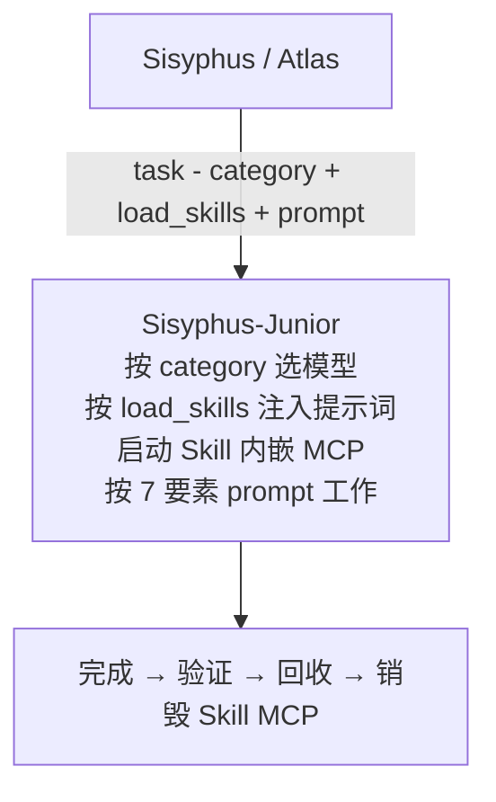

# 第六章：类别（Category）与技能（Skill）系统

oh-my-openagent（OmO）做对的一件事，是把"挑模型"和"装领域知识"分开。前者是 **Category**（类别）——它回答"这是什么种类的活儿？"；后者是 **Skill**（技能）——它回答"这件事需要什么专业知识和工具？"。两者组合起来，能在不到一秒内把一个普通子 Agent 装备成"前端工程师 + 浏览器测试员 + Git 提交艺术家"。

本章把 Category 与 Skill 系统讲透：8 个内置类别、内置技能注册表、自定义方式、组合策略、最佳实践。

---

## 6.1 为什么是 Category，而不是直接选模型

直接让 Agent 在调用时写 `model: "gpt-5.6-sol"` 有两个致命问题：

1. **认知偏差**：模型知道自己被叫做 "GPT-5.6-Sol"，会按它对自己的认知去回答，反而把限制强化；而 Category（`ultrabrain`、`deep`、`quick`）是描述意图的词，模型会更自然地把自己当成"被叫来做这种工作的专家"。
2. **维护噩梦**：明天 GPT-5.7 出来了，全代码库改 `gpt-5.6` 字符串？运行时哪个 Agent 哪个 reasoning 档落到哪个 fallback？类别让这一切**和模型解耦**。

```typescript
// 旧思路：模型名带来分布偏差
task({ agent: "gpt-5.6-sol", prompt: "..." });

// 新思路：类别描述意图
task({ category: "ultrabrain", prompt: "..." });          // "深度思考"
task({ category: "visual-engineering", prompt: "..." });  // "设计得漂亮"
task({ category: "quick", prompt: "..." });               // "快点搞完"
```

---

## 6.2 8 个内置 Category

| Category | 默认模型 | 适用 |
| --- | --- | --- |
| `visual-engineering` | `anthropic/claude-opus-5` (max) | 前端、UI/UX、设计、样式、动画 |
| `ultrabrain` | `openai/gpt-5.6-sol` (xhigh) | 复杂硬核逻辑、架构决策 |
| `deep` | `openai/gpt-5.6-sol` (medium) | 目标导向自主调研与执行 |
| `artistry` | `anthropic/claude-fable-5` (xhigh) | 创意 / 艺术性强、追求新颖 |
| `quick` | `kimi-for-coding/kimi-for-coding-highspeed` | 改字、单文件、小修改 |
| `unspecified-low` | `xai/grok-4.6` (xhigh) | 不属于其他类别、低投入 |
| `unspecified-high` | `kimi-for-coding/k3` (max) | 不属于其他类别、高投入 |
| `writing` | `kimi-for-coding/k3` (low) | 文档、技术写作 |

每条类别背后都是一条**多提供商 fallback 链**（权威定义在 `packages/model-core/src/category-model-requirements.ts`）。两个值得品味的排布：

- `visual-engineering` 的头三档全是 Claude-like：Opus 5 (max) → Kimi K3 (max) → GLM 5.2 (max)，最后才轮到 GPT-5.6 Sol——前端要的是"听话的审美执行"而非"发散推理"；
- `quick` 一路向下全是便宜高速档：Kimi highspeed → GPT-5.6 Luna Fast → DeepSeek v4 Flash → Qwen3.6 Flash → MiniMax M3/M2.7 → Grok → Haiku。

> 注意：链上**主档的 reasoning 档位**可能与类别配置默认值不同（例如 `ultrabrain` 配置默认 xhigh，链的主档跑 max）。

### 6.2.1 调用方式

通过 `task` 工具的 `category` 参数（与 `subagent_type` 互斥，二选一）：

```typescript
task({
  category: "visual-engineering",
  load_skills: ["frontend", "playwright"],
  prompt: "为 dashboard 页面加一个响应式图表组件"
});
```

OmO 会自动启动一个 Sisyphus-Junior，配上对应的模型 + fallback 链 + 默认参数，注入 Skill，然后跑你给的 prompt。

### 6.2.2 设计原则

- **频谱化**：从 `quick` / `unspecified-low`（极便宜）到 `unspecified-high` / `ultrabrain`（极贵）；
- **风格化**：`visual-engineering` / `artistry` 偏 Claude 系；`ultrabrain` / `deep` 偏 GPT-5.6 Sol；`writing` 偏 Kimi K3 低档；
- **类别即 reasoning / 温度偏好**：例如 `ultrabrain` 默认高档推理，`writing` 用 low 档控制废话量。

---

## 6.3 自定义 Category

在 `~/.omo/omo.jsonc` 的 `[opencode]` 块里直接覆盖或新建。主要字段：

| 字段 | 类型 | 描述 |
| --- | --- | --- |
| `description` | string | 类别描述，显示在 task 工具的 prompt 里 |
| `model` | string | 模型 ID（如 `anthropic/claude-opus-5`） |
| `models` | array | 有序模型链（字符串或对象混排） |
| `fallback_models` | string\|array | 兼容字段：回退链（字符串/对象混排） |
| `reasoning` | string | 规范推理档（取代旧 `variant` / `reasoningEffort`） |
| `temperature` / `top_p` | number | 采样参数 |
| `prompt_append` | string | 追加到系统提示词（支持 `file://` URI） |
| `tools` | object | 工具开关：`{ "tool_name": false }` |
| `max_tokens` | number | 最大响应 token（旧 `maxTokens` 兼容） |
| `max_prompt_tokens` | number | 委派任务的最大 prompt token |
| `is_unstable_agent` | boolean | 强制后台执行 + 监控（模型 ID 含 gemini / minimax 时自动开启） |
| `disable` | boolean | 从委派中排除该类别 |

### 6.3.1 三个实用配置示例

```jsonc
{
  "[opencode]": {
    "categories": {
      // 1. 新建一个"中文技术作家"类别
      "chinese-writer": {
        "model": "google/gemini-3.6-flash",
        "temperature": 0.5,
        "prompt_append": "你是一位中文技术作家，保持友好清晰的语气。"
      },

      // 2. 覆盖已有类别（把 visual-engineering 换成 GPT-5.6 Sol）
      "visual-engineering": {
        "model": "openai/gpt-5.6-sol",
        "temperature": 0.8
      },

      // 3. 自定义 git 操作类别：便宜模型 + 领域约束
      "git": {
        "model": "opencode/gpt-5-nano",
        "description": "All git operations",
        "prompt_append": "Focus on atomic commits, clear messages, and safe operations."
      }
    }
  }
}
```

### 6.3.2 Sisyphus-Junior 是它的执行人

记住：**所有 Category 都是通过 Sisyphus-Junior 执行的**。Junior 的核心限制：

- 不能再 `task()`（避免无限委派）；`call_omo_agent` 仍可用于 explore / librarian；
- 必须通过 `lsp_diagnostics` 验证才能完成；
- 拿到的任务说明自带 MUST DO / MUST NOT DO 约束。

---

## 6.4 内置 Skill 注册表

Skill 比 Category 更"模板化"：每个 Skill 是一个 SKILL.md 文件，包含：

- frontmatter：`description` / 内嵌 `mcp` 依赖；
- markdown 主体：被注入到 Agent 系统 prompt 里的"专业知识"。

**技能按描述自动匹配触发**，你不需要预加载；想强制用某个，就在 prompt、斜杠命令或 `load_skills` 列表里点名。

内置注册表共 14 个：`agent-browser`、`debugging`、`dev-browser`、`frontend`、`git-master`、`init-deep`、`playwright`、`playwright-cli`、`remove-ai-slops`、`review-work`、`security-research`、`security-review`、`team-mode`、`visual-qa`（`team-mode` 仅在 Team Mode 开启时出现）。重点几个：

| Skill | 触发关键词 | 描述 |
| --- | --- | --- |
| **git-master** | commit / rebase / squash / "who wrote" / "when was X added" | Git 专家三专长：原子提交、Rebase 手术、历史考古 |
| **playwright** | 浏览器任务、测试、截图 | 通过 Playwright MCP 做浏览器自动化（默认引擎） |
| **agent-browser** | 浏览器任务（agent-browser CLI） | Vercel agent-browser CLI：导航、快照、截图、网络监听、脚本交互 |
| **dev-browser** | 状态化浏览器脚本 | 持久页面状态，迭代式工作流和带身份的会话 |
| **frontend** | UI/UX、样式 | 设计师转开发者人格：审美方向、特色字体、和谐配色（前身叫 `frontend-ui-ux`） |
| **review-work** | "review work" / "QA my work" | 落地后审查协调器：并行启动 5 个后台子 Agent——目标验证、代码质量、安全、人工 QA、上下文挖掘，全 PASS 才算过 |
| **ulw-research** | `ulw-research` | 最大饱和度研究：explore/librarian 蜂群并行扫代码/文档/网络/OSS，争议论断跑代码验证，产出带引用的综合报告 |
| **remove-ai-slops** | "remove AI slop" / "de-AI" / "humanize" | 保留功能的前提下剔除 AI 痕迹：冗长注释、过度错误处理、过度抽象、AI 套话（前身叫 `ai-slop-remover`） |

另外 **`init-deep` 现在是技能而非命令**：通过 `skill` 表面调用（支持 `--create-new` / `--max-depth=N` 参数），生成层级化 AGENTS.md 知识库。

### 6.4.1 git-master 核心法则

git-master 是 OmO 体验里最显眼的 Skill 之一。三条核心原则：

**多次提交是默认行为**：

```text
3+ 个文件 → 必须 ≥ 2 次提交
5+ 个文件 → 必须 ≥ 3 次提交
10+ 个文件 → 必须 ≥ 5 次提交
```

**自动检测风格**：分析最近 30 个 commit，推断语言与风格（语义化 / 普通 / 简短），自动匹配你这个仓库的提交习惯。

**用法**：

```text
/git-master commit these changes
/git-master rebase onto main
/git-master who wrote this authentication code?
```

它会按你的仓库风格把"这个 PR 的 17 处改动"切成 5 个原子提交，依赖关系正确，commit message 看起来像你自己写的。可以配 `git_master.commit_footer` 与 `include_co_authored_by` 控制页脚。

### 6.4.2 frontend 设计哲学

这个 Skill 把"UI/UX"提升成一个完整的设计师人格：

- **设计流程**：Purpose → Tone → Constraints → Differentiation；
- **审美方向**：选一个极致——brutalist / maximalist / retro-futuristic / luxury / playful；
- **字体**：用有特色的字体，避开 Inter / Roboto / Arial；
- **配色**：和谐配色 + 锋利点缀，避免"紫白搭"AI slop；
- **动效**：高冲击错位呈现、滚动触发、出乎意料的 hover；
- **反模式**：通用字体、可预测布局、模板化设计。

### 6.4.3 浏览器自动化四选一

通过 `browser_automation_engine.provider` 切换：

| Provider | 接口 | 安装 |
| --- | --- | --- |
| `playwright`（默认） | MCP 工具 | npx 自动装 |
| `agent-browser` | Bash CLI | `bun add -g agent-browser && agent-browser install` |
| `dev-browser` | Skill | 持久 dev-browser 状态 |
| `playwright-cli` | Bash CLI | token 效率更高的 `@playwright/cli` |

```jsonc
{ "browser_automation_engine": { "provider": "agent-browser" } }
```

```text
/playwright Navigate to example.com and take a screenshot
Use agent-browser to navigate to example.com and extract the main heading
```

四者能力面接近（导航 / 交互 / 截图 PDF / 表单 / 等网络 / 抓内容），区别在稳定标准（Playwright MCP）与灵活性（agent-browser、playwright-cli 的 CLI 形态）。

---

## 6.5 自定义 Skill：写一个 SKILL.md

把这个文件丢到 `.opencode/skills/my-skill/SKILL.md`：

```markdown
---
name: my-skill
description: My special custom skill
mcp:
  my-mcp:
    command: npx
    args: ["-y", "my-mcp-server"]
---

# My Skill Prompt

This content will be injected into the agent's system prompt.
...
```

OmO 在加载 Skill 时按以下优先级扫描（高 → 低）：

1. `.opencode/skills/*/SKILL.md`（项目，OpenCode 原生）
2. `~/.config/opencode/skills/*/SKILL.md`（用户，OpenCode 原生）
3. `.claude/skills/*/SKILL.md`（项目，Claude Code 兼容）
4. `.agents/skills/*/SKILL.md`（项目，Agents 约定）
5. `~/.agents/skills/*/SKILL.md`（用户，Agents 约定）

**同名 Skill** 高优先级覆盖低优先级；已加载技能的**展示优先级**为 `project > user > opencode > builtin/plugin`。关闭内置 Skill：

```jsonc
{ "disabled_skills": ["playwright"] }
```

还可以在 `skills.sources` 里挂额外来源（本地目录递归 / 远程 URL），并用 `skills.enable` / `disable` / 逐技能配置（`description`、`template`、`model`、`allowed-tools` 等）精细管理。

---

## 6.6 Skill 内嵌 MCP 与 OAuth

Skill 的 frontmatter 可以声明自己的 MCP（Model Context Protocol）服务，**只在该 Skill 被调用时启动，结束即销毁**——这是 OmO 控制上下文窗口的关键技术。客户端按 `${sessionID}:${skillName}:${serverName}` 键做会话级隔离，同一技能并发使用也不会串状态。

OAuth-protected Skill MCP（OAuth 2.1 全合规）示例：

```yaml
---
description: My API skill
mcp:
  my-api:
    url: https://api.example.com/mcp
    oauth:
      clientId: ${CLIENT_ID}
      scopes: ["read", "write"]
---
```

OmO 自动处理：

- **自动发现**：先查 `/.well-known/oauth-protected-resource`（RFC 9728），不行回退 `/.well-known/oauth-authorization-server`（RFC 8414）；
- **动态客户端注册**：支持 RFC 7591（clientId 可选）；
- **PKCE（Proof Key for Code Exchange）**：所有流必须；
- **Resource Indicators**：根据 MCP URL 自动按 RFC 8707 生成；
- **Token 存储**：`~/.config/opencode/mcp-oauth.json`（权限 0600）；
- **自动刷新**：401 自动刷新；403 + WWW-Authenticate 走 step-up authorization；
- **动态端口**：OAuth 回调用自动端口。

预先认证：

```bash
bunx oh-my-openagent mcp oauth login <server-name> --server-url https://api.example.com
```

---

## 6.7 Category + Skill：王牌组合

### 6.7.1 The Designer：UI 实现专家

```text
category: visual-engineering
load_skills: ["frontend", "playwright"]
```

效果：用 Opus 5 max 写带美感的 UI，再用 Playwright 直接打开浏览器验证渲染效果——闭环。

### 6.7.2 The Architect：设计评审

```text
category: ultrabrain
load_skills: []
```

效果：GPT-5.6 Sol 高档推理做架构评审，纯思考、不做无关动作。

### 6.7.3 The Maintainer：快修 + 干净提交

```text
category: quick
load_skills: ["git-master"]
```

效果：便宜高速的模型快速修小问题，git-master 自动按风格切成多个原子提交。

### 6.7.4 The Validator：QA 我的工作

`review-work` Skill 本身就是组合策略——被触发时一次性并行启动 5 个后台子 Agent：

- 目标验证 Agent：检查是否实现了原始需求；
- 代码质量 Agent：lint / 风格 / 复杂度；
- 安全 Agent：审查潜在漏洞；
- 人工 QA Agent：实际跑、点、验；
- 上下文挖掘 Agent：检查相关文件 / 测试是否被同步更新。

**5 个全 PASS 才算通过**。这是 OmO 区别于"AI 写完就吹自己写完了"的硬手段。

---

## 6.8 task 委派的 7 要素 prompt

任何时候你想给子 Agent 派任务，都建议照下面 7 个要素写——清晰具体的 prompt 是组合发挥的前提：

1. **TASK**：单一目标；
2. **EXPECTED OUTCOME**：交付物是什么；
3. **REQUIRED SKILLS**：要 `load_skills` 哪些；
4. **REQUIRED TOOLS**：必须用的工具白名单；
5. **MUST DO**：硬性要求；
6. **MUST NOT DO**：硬性禁止；
7. **CONTEXT**：相关文件路径、模式、参考资料。

**坏例子**：

> "Fix this"

**好例子**：

> **TASK**：修复 `LoginButton.tsx` 在移动端的布局崩坏。
> **CONTEXT**：`packages/web/components/LoginButton.tsx`，使用 Tailwind CSS。
> **MUST DO**：在 `md:` 断点改 flex-direction。
> **MUST NOT DO**：不要改桌面端布局。
> **EXPECTED**：移动端按钮垂直排列。

---

## 6.9 Category-Skill 工作机制小结



下一章我们把视角从"高层抽象"切回"工具实现层"，看 OmO 是怎么用 Hashline、LSP、AST-Grep、Tmux 把 Agent 变成有 IDE 级精度的开发者。
