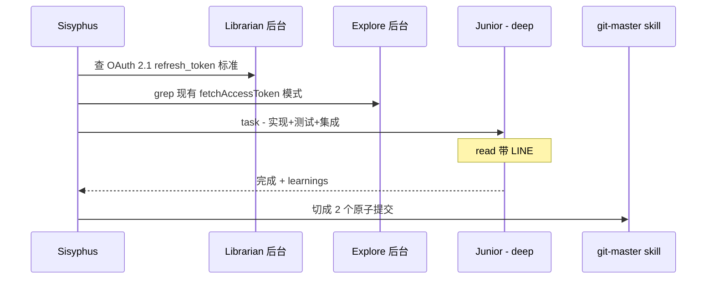

# 第七章：核心工具链 Hashline、LSP、AST-Grep 与 Tmux

oh-my-openagent（OmO）配给 Agent 的不是简单的"读 / 写 / sed"三件套，而是一整套**IDE 级别的工具链**。理解这些工具是怎么工作的，你才能明白为什么 OmO 改代码"能不出错"——以及为什么有些第三方 Agent 工具改完动不动就需要你回滚。

本章涵盖 4 大核心工具体系：

1. **Hashline 编辑**——`LINE#ID` 哈希校验编辑（opt-in）；
2. **LSP 工具集**——把 IDE 的语义能力交给 Agent（内置 `lsp` MCP 提供 8 个别名）；
3. **AST-Grep 技能**——基于语法树的安全搜替（`ast-grep` skill + `sg`）；
4. **Tmux 交互式终端**——长时存活的终端环境，跑 REPL / TUI / 调试器。

外加 OmO 的工具注册表速查。**工具注册是按配置门控的：注册表实际暴露 12–38 个工具**，开了 Hashline、任务系统、Team Mode 就多，全关就少。

---

## 7.1 Hashline 编辑：消灭"改错行"

### 7.1.1 Harness 问题

研究者 Can Bölük 在 [oh-my-pi](https://github.com/can1357/oh-my-pi) / [The Harness Problem](https://blog.can.ac/2026/02/12/the-harness-problem/) 中指出：

> 几乎所有 Edit 工具都没办法给模型一个稳定、可验证的行定位标识……它们都依赖模型一字不差复述刚看到的原文。模型只要写错（这非常常见），用户就会怪罪大模型太蠢。

OpenAI 的 IDE Edit / Anthropic 的 IDE Edit 都有这个问题。模型记住的"原始行"并不一定和当前行一致——文件被另一个 Agent 修过、被 Lint 处理过、行号变了……结果就是 patch 打到了错的位置。

### 7.1.2 Hashline 怎么解决

**当前版本 Hashline 是 opt-in**，在配置里开启：

```jsonc
{ "hashline_edit": true }
```

开启后，每行代码读出来时尾部都打上一个**绑定内容的哈希码**（哈希字符取自集合 `ZPMQVRWSNKTXJBYH`），形如：

```text
11#VK| function hello() {
22#XJ|   return "world";
33#MB| }
```

格式：`<行号><两位 hash>| <内容>`。

模型修改时**必须**引用 `LINE#ID`。校验流程：

1. 编辑工具收到 `22#XJ`；
2. 重新计算第 22 行内容的哈希；
3. 哈希一致 → 应用；不一致 → **拒绝**编辑，返回错误，让模型重读、再编辑。

效果：在 Grok Code Fast 1 上，仅这一改进就把编辑成功率从 6.7% 飙到 68.3%。开启 `hashline_edit` 的同时会自动激活配套的 `hashline-read-enhancer` Hook（给 read 输出追加哈希标记）；想保留旧行为用 `hashline_edit.enabled: false` 关闭。

---

## 7.2 LSP 工具集：把 IDE 交给 Agent

### 7.2.1 8 个 LSP 工具

LSP（Language Server Protocol）工具由**内置 `lsp` MCP**（Model Context Protocol，本地 stdio 服务）提供，不走工具注册表：

| 工具 | 描述 |
| --- | --- |
| **lsp_status** | 列出已配置与活跃的 LSP 服务器 |
| **lsp_diagnostics** | 取错误 / 警告（构建前预检） |
| **lsp_prepare_rename** | 校验某个符号是否可重命名 |
| **lsp_rename** | 在工作区范围内安全重命名符号 |
| **lsp_goto_definition** | 跳到定义 |
| **lsp_find_references** | 找所有引用 |
| **lsp_symbols** | 文件大纲 / 工作区符号搜索 |
| **lsp_install_decision** | 记录语言服务器"装/不装"的决策 |

### 7.2.2 实战用法

```text
# Agent 在改完代码后必须做的最后一步：
lsp_diagnostics(path="src/auth.ts")
# 0 errors, 0 warnings → ok

# Agent 想重命名 logger 为 log：
lsp_prepare_rename(path="src/log.ts", line=12, character=10)
# valid → 然后:
lsp_rename(symbol="logger", newName="log")
# 工作区所有 logger 引用一次性替换
```

为什么这套很重要：

- **Agent 不再瞎搜瞎改**：用 grep 找 `logger` 会误命中字符串、注释、文档；用 LSP 走的是 AST 级符号引用，精度近乎 100%；
- **Sisyphus-Junior 必须 `lsp_diagnostics` 通过才算完成**；
- **配合 Hashline**：先用 LSP 找位置，再用 Hashline 改，几乎不出错。

### 7.2.3 自定义语言服务器

在项目根放 `.opencode/lsp.json`、`.omo/lsp.json` 或 `.omo/lsp-client.json`，MCP 服务会带 `LSP_TOOLS_MCP_PROJECT_CONFIG` 环境变量启动并读取第一个命中的配置（schema 见 [code-yeongyu/lsp-tools-mcp](https://github.com/code-yeongyu/lsp-tools-mcp)）。整体禁用：`disabled_mcps: ["lsp"]`。

遇到没装的语言服务器，LSP 工具会问一次"装不装"，答案持久化在 `lsp-install-decisions.json`；拒绝过的服务器后续诊断折叠成一行提示。想重新被问：删掉该文件或对应条目。

---

## 7.3 AST-Grep：语法树级别的搜替

**重要变化：AST-Grep 不再是常驻工具，改为 `ast-grep` 技能**。需要结构化匹配时用 `skill` 工具加载它，然后使用配套的 `sg` 命令（Light 版还会自动 provision 一个校验和固定的 `sg` 二进制；也可用 `OMO_AST_GREP_SG_PATH` 指定已有安装）。

与 grep / sed 的差异：

```bash
grep "console.log"                 # 命中字符串、注释里的、变量名 console_log_x
ast-grep "console.log($A)"         # 只匹配实际的函数调用 console.log(...)

sed -i 's/foo/bar/g' file.ts       # 字符串替换，会乱伤
ast-grep replace 'foo($A)' 'bar($A)' --lang ts   # 只换函数调用 foo(x) → bar(x)
```

在 OmO 里的角色：

- 大规模重构（"把所有 `console.log` 替换成 `logger.debug`"）；
- 模式迁移（"把所有 `Class extends React.Component` 迁到 functional"）；
- 跨文件批量整理；
- 与 git-master 配合做精确的重构提交切片。

---

## 7.4 Tmux 交互式终端

### 7.4.1 interactive_bash 工具

OmO 提供 `interactive_bash` 工具，本质是封装了 tmux 子命令——使 Agent 能跑**长时存活的交互式进程**：

```bash
# 创建新会话
interactive_bash(tmux_command="new-session -d -s dev-app")

# 给会话发按键
interactive_bash(tmux_command="send-keys -t dev-app 'vim main.py' Enter")

# 抓取屏幕输出
interactive_bash(tmux_command="capture-pane -p -t dev-app")
```

注意：

- 命令是 tmux 子命令，不要带 `tmux` 前缀；
- 适合 vim / htop / pudb / GDB / mysql shell / Python REPL 这种 TUI 应用；
- 一次性命令用普通 bash；必须在后台长跑的用受管的 monitor 机制（`monitor_start`），别依赖 shell `&`。

### 7.4.2 多 Agent Tmux 集成

打开 `tmux.enabled`（要求 OpenCode 跑在 tmux 会话内并带 `--port` 启动），后台 Agent 会真的开新 tmux pane 在你眼前跑：

```jsonc
{
  "tmux": {
    "enabled": true,
    "layout": "main-vertical",
    "main_pane_size": 60,
    "main_pane_min_width": 120,
    "agent_pane_min_width": 40,
    "isolation": "inline"
  }
}
```

`layout` 可选 `main-vertical / main-horizontal / tiled / even-horizontal / even-vertical`；`isolation` 可选 `inline / window / session`。跑在 cmux（`cmux omo-agent-toolkit`）里时，同样的 pane 集成会路由到 cmux 的 tmux 兼容命令——没装真 tmux 也能用。

---

## 7.5 OmO 工具地图

按用途归组（加粗为核心，其余按配置门控注册）：

### 7.5.1 代码搜索

| 工具 | 描述 |
| --- | --- |
| **grep** | 内容搜索（正则），可按文件模式过滤 |
| **glob** | 文件名模式匹配 |

### 7.5.2 编辑

| 工具 | 描述 |
| --- | --- |
| **edit** | Hashline `LINE#ID` 哈希校验编辑（`hashline_edit: true` 时注册） |

### 7.5.3 LSP（内置 lsp MCP 提供）

`lsp_status` / `lsp_diagnostics` / `lsp_prepare_rename` / `lsp_rename` / `lsp_goto_definition` / `lsp_find_references` / `lsp_symbols` / `lsp_install_decision`——见 7.2。

### 7.5.4 委派

| 工具 | 描述 |
| --- | --- |
| **call_omo_agent** | 调起 explore / librarian 等，支持 `run_in_background` |
| **task** | 按 Category 委派，或直接 `subagent_type` 委派（两者互斥） |
| **background_output** | 取后台任务结果 |
| **background_cancel** | 取消后台任务 |

### 7.5.5 视觉

| 工具 | 描述 |
| --- | --- |
| **look_at** | 通过 Multimodal-Looker 分析 PDF / 图片 / 图表 |

### 7.5.6 Skill

| 工具 | 描述 |
| --- | --- |
| **skill** | 按名加载 Skill / 执行斜杠命令，返回带上下文的详细指令 |
| **skill_mcp** | 调用 Skill 内嵌 MCP 的操作（全 schema 发现） |

### 7.5.7 会话

| 工具 | 描述 |
| --- | --- |
| **session_list** | 列项目会话（可按日期 / 数量过滤） |
| **session_read** | 读会话消息 / 历史 |
| **session_search** | 全文搜索会话消息 |
| **session_info** | 会话元数据 + 统计 |

一个实用技巧：OpenCode 自带的 `/sessions` 选择器可能漏掉旧会话，用 `session_list` 找到 ID 后在 TUI 里 `/continue <session_id>` 接着聊；只记得内容不记得日期就先 `session_search` 再 `session_read`。

### 7.5.8 任务系统（`experimental.task_system: true`）

| 工具 | 描述 |
| --- | --- |
| **task_create** | 创建任务（自动生成 `T-{uuid}` 形式 ID） |
| **task_get** | 取任务 |
| **task_list** | 列所有活跃任务 |
| **task_update** | 更新任务 |

任务字段对齐 Claude Code 的内部 Task 工具（`subject` / `status` / `blocks` / `blockedBy` / `owner` / `metadata` / `threadID` 等）。空 `blockedBy` 的任务并行执行；有依赖的等 blocker 完成。存储默认在 **OpenCode 配置目录的 `tasks/<list-id>`**（JSON 文件，重启不丢），可用 `sisyphus.tasks.storage_path` 覆盖——这是它和 TodoWrite 的主要区别（TodoWrite 是会话内存）。启用后 `tasks-todowrite-disabler` Hook 会自动禁掉 TodoWrite 避免双轨。

### 7.5.9 交互式终端

| 工具 | 描述 |
| --- | --- |
| **interactive_bash** | tmux 封装，TUI / 持久会话 |

### 7.5.10 Team Mode（`team_mode.enabled: true`）

12 个 `team_*` 工具：`team_create` / `team_delete` / `team_shutdown_request` / `team_approve_shutdown` / `team_reject_shutdown` / `team_send_message` / `team_task_create` / `team_task_list` / `team_task_update` / `team_task_get` / `team_status` / `team_list`。

---

## 7.6 工具与 Hook 的协同

工具不是孤立工作的，OmO 给关键工具都配了 Pre/Post Hook 加固：

| 工具类 | 关键 Hook |
| --- | --- |
| edit / write | `write-existing-file-guard`（防覆盖）、`hashline-read-enhancer`、`edit-error-recovery`、`comment-checker`、`notepad-write-guard` |
| read | `directory-agents-injector`、`directory-readme-injector`、`rules-injector`、`read-image-resizer` |
| grep / glob / lsp / interactive_bash / skill_mcp / webfetch | `tool-output-truncator`（按上下文窗口动态截断） |
| task / call_omo_agent | `delegate-task-retry`、`empty-task-response-detector`、`task-resume-info`、`category-skill-reminder` |
| interactive_bash | `interactive-bash-session`（管理 tmux 会话） |

---

## 7.7 一个真实的"工具链协同"场景

任务："给 `src/auth.ts` 添加 OAuth Refresh 逻辑，然后切原子提交"。



整个过程：Hashline 保证编辑不写错行；LSP 保证语义正确；AST-Grep 在大规模重构时上场；Tmux 在你想要看 vim / 调试器时给 Agent 长存的终端；Hooks 全程偷偷把质量警卫加上。

下一章我们要讲 OmO 的"操作系统"：**Hooks 与 MCP 系统**。这是把上面所有看似零散的工具粘合成一个稳健流水线的关键。
