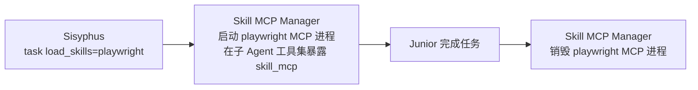

# 第八章：Hooks 钩子流水线与 MCP 系统

到这一章为止，前面讲到的"Sisyphus 自动并行、Atlas 强制委派、Junior 不能偷停、编辑改不错行、429 自动 fallback"——背后真正在干活的，是 **Hooks**。

OmO 的 Hook 体系可以当成 OmO 的**操作系统**来理解：模型只是 CPU，Hooks 才是调度器、内存管理、容错恢复、I/O 拦截、安全护栏。

本章把 Hook 系统和 MCP（Model Context Protocol）系统全面盘一遍。

---

## 8.1 Hook 体系全景

### 8.1.1 六个拦截事件点

| 事件 | 触发时机 | 能做 |
| --- | --- | --- |
| **PreToolUse** | 工具执行前 | 阻断 / 修改输入 / 注入上下文 |
| **PostToolUse** | 工具执行后 | 加警告 / 改输出 / 注入消息 |
| **Message** | 消息处理时 | 内容变换 / 关键词识别 / 模式激活 |
| **Event** | 会话生命周期变更时 | 容错 / fallback / 通知 |
| **Transform** | 上下文变换期间 | 注入上下文 / 校验块 |
| **Params** | API 参数下发时 | 调整模型设置 / reasoning 档位 |

### 8.1.2 五层 composer 结构

当前 Hook 系统由 5 层 composer 组合成 **58 个槽位**：

| 层 | 槽位数 | 职责 |
| --- | --- | --- |
| Session | 24 | 会话生命周期、上下文注入、通知 |
| Tool Guard | 18 | 工具级守卫（含 `teamToolGating`） |
| Transform | 7 | 消息/上下文变换校验 |
| Continuation | 7 | 专治"Agent 偷停 / 半途而废" |
| Skill | 2 | Skill 加载与 Skill MCP 编排 |

默认配置激活约 **50–51** 个；加上 Team Mode 的 4 个直接事件处理器最多 **62** 个。（旧文档"52 个 Hook"的说法已经过时。）

---

## 8.2 Hook 分组速查

### 8.2.1 上下文与注入

| Hook | 事件 | 描述 |
| --- | --- | --- |
| `directory-agents-injector` | Post + Event | 读文件时自动注入路径上的所有 AGENTS.md。OpenCode 1.1.37+ 自带原生注入时该 Hook 自动停用 |
| `directory-readme-injector` | Post + Event | 自动注入目录 README.md 作为上下文 |
| `rules-injector` | Pre + Post | 条件匹配时注入 `.claude/rules/`（支持 globs 和 alwaysApply） |
| `compaction-context-injector` | Event | 压缩会话时保留关键上下文 |
| `preemptive-compaction` | Event | 主动在临 token 上限前压缩 |

### 8.2.2 生产力与控制

| Hook | 事件 | 描述 |
| --- | --- | --- |
| `keyword-detector` | Message | IntentGate 检测器：`ultrawork`/`ulw`、Team Mode 各拼法、`hyperplan` 及组合 |
| `think-mode` | Message | 消息含 "think" / "ultrathink" 时把变体提到 high 档 |
| `goal` | Event | 目标活跃时在 session.idle 注入续跑提示；会话删除时清目标 |
| `ulw-execute` | Message + 命令前 | 展开 `/ulw-execute` 后：选计划、初始化 boulder、搭 notepad、切 Atlas、注入计划上下文 |
| `auto-slash-command` | Message + 命令前 | 把识别到的斜杠命令展开成命令模板 |
| `stop-continuation-guard` | Event + Message | 守护停止机制 |
| `category-skill-reminder` | Post + Transform + Event | 提醒 Agent 善用 Category 与 Skill 委派 |

### 8.2.3 质量与安全

| Hook | 事件 | 描述 |
| --- | --- | --- |
| `comment-checker` | Post | 跑 `@code-yeongyu/comment-checker` 拦截 AI slop 注释；`// @allow` 逐行放行、`// comment-checker-disable-file` 整文件放行 |
| `tool-pair-validator` | Transform | 校验工具调用/结果配对 |
| `edit-error-recovery` | Post | 编辑工具失败时自动恢复（含哈希不匹配引导重读） |
| `write-existing-file-guard` | Pre | 阻止未读先写覆盖 |
| `hashline-read-enhancer` | Post | 给 read 输出加 `LINE#ID` |
| `notepad-write-guard` / `bash-file-read-guard` / `webfetch-redirect-guard` / `plan-format-validator` | Pre/Post | notepad 写入守卫、bash 读文件守卫、webfetch 重定向守卫、计划格式校验 |

### 8.2.4 容错与稳定

| Hook | 事件 | 描述 |
| --- | --- | --- |
| `anthropic-context-window-limit-recovery` | Event | 优雅处理 Claude 上下文窗口超限 |
| `runtime-fallback` | Event + Message | 可重试 API 错误（429/500/502/503/504）、Key 配置错误、重试信号时按链切换备胎模型（行为由 `runtime_fallback` 配置控制，**默认关闭**） |
| `model-fallback` | Message | 把排队中的 fallback 链应用到下一条消息 |
| `json-error-recovery` | Post | 工具输出 JSON 解析错误恢复 |

### 8.2.5 截断与上下文管理

| Hook | 事件 | 描述 |
| --- | --- | --- |
| `tool-output-truncator` | Post | 截断 grep / glob / lsp_diagnostics / interactive_bash / skill_mcp / webfetch 输出，按上下文窗口动态调整 |

### 8.2.6 通知与 UX

| Hook | 事件 | 描述 |
| --- | --- | --- |
| `auto-update-checker` | Event | 会话创建时查版本，启动 toast 显示版本与 Sisyphus 状态（`startup-toast` 可单独禁） |
| `background-notification` | Event | 后台 Agent 完成时通知 |
| `session-notification` | Event | Agent idle 时 OS 级通知（macOS / Linux / Windows） |
| `agent-usage-reminder` | Post + Event | 提醒善用专长 Agent |
| `question-label-truncator` | Pre | 截断 Question 工具 UI 里过长的 label |

### 8.2.7 任务管理

| Hook | 事件 | 描述 |
| --- | --- | --- |
| `task-resume-info` | Post | 提供任务续作信息 |
| `delegate-task-retry` | Post + Event | 委派失败时自动重试 |
| `empty-task-response-detector` | Post | 检测被委派任务的空回应 |
| `tasks-todowrite-disabler` | Pre | 任务系统启用时禁用 TodoWrite |

### 8.2.8 持续机制（Continuation 七子）

| Hook | 事件 | 描述 |
| --- | --- | --- |
| `todo-continuation-enforcer` | Event | 揪回偷停的 Agent，强制把 todo 跑完 |
| `compaction-todo-preserver` | Event | 压缩时保留 todo 状态 |
| `unstable-agent-babysitter` | Event | 处理不稳定 Agent，加恢复策略 |

（其余 4 个是 Atlas / ulw-execute / goal 等模块的内部子 Hook。）

### 8.2.9 集成

| Hook | 事件 | 描述 |
| --- | --- | --- |
| `claude-code-hooks` | Message + Pre + Post | 执行 Claude Code `settings.json` 里的 Hook（只覆盖 chat.message 与 tool.execute 前后，不是所有 OmO 事件） |
| `atlas` | Multiple | Atlas 编排核心逻辑（todo 驱动的工作会话） |
| `interactive-bash-session` | Post + Event | 管理交互 tmux 会话 |
| `non-interactive-env` | Pre | 处理非交互环境约束 |
| `codegraph-bootstrap` / `ast-grep-sg-provision` | Event | CodeGraph 初始化 / `sg` 二进制供给 |

### 8.2.10 专用

| Hook | 事件 | 描述 |
| --- | --- | --- |
| `prometheus-md-only` | Pre | 强制 Prometheus 只写 `.omo/*.md` 计划文件 |
| `no-sisyphus-gpt` | Message | 阻止 Sisyphus 跑在不兼容的 GPT 模型（放行 5.4 / 5.5 / 5.6 Sol 的专用提示词路径）——**官方点名不要禁** |
| `no-hephaestus-non-gpt` | Message | 阻止 Hephaestus 跑在非 GPT 模型 |
| `sisyphus-junior-notepad` | Pre | 管理 Junior 的 notepad 状态 |
| `team-tool-gating` | Tool Guard | Team Mode 工具门控 |

---

## 8.3 Hook 的实战意义：3 个例子

### 8.3.1 场景 1：你写了 `ulw 修登录 bug`

```text
keyword-detector(Message)
  → 识别 "ulw"，注入 ultrawork 模式提示词
think-mode(Params)
  → 检测到 "ulw" 提到 high 档
agent-usage-reminder(Post)
  → 第一轮回应里提醒："建议派 explore 找现有 auth 代码"
runtime-fallback(Event)
  → 期间如果 Claude 429，且 runtime_fallback 已开启，秒切 Kimi K3
todo-continuation-enforcer(Event)
  → Agent 想说"完成"但还有 todo 未勾时，把它拽回来
```

你只敲了 7 个字，背后一串 Hook 在工作。

### 8.3.2 场景 2：你让它编辑 src/foo.ts

```text
write-existing-file-guard(Pre)
  → 强制先 read，再 edit
hashline-read-enhancer(Post on read)
  → read 输出末尾加 LINE#ID（hashline_edit 开启时）
edit-error-recovery(Post on edit)
  → 哈希校验失败时自动让模型重试
comment-checker(Post on edit)
  → 检查并拦截 AI slop 注释
tool-output-truncator(Post on grep / lsp)
  → 把搜索 / 诊断输出截断在合理大小
```

近乎"AI 改代码不出错"流水线。

### 8.3.3 场景 3：跑了一半 Claude 限流了

```text
runtime-fallback(Event)：   需配置开启。收到 429 → 给该模型加冷却 → 按链切 kimi-k3 → toast 告知
model-fallback(Message)：   把切换应用到下一条消息
anthropic-context-window-limit-recovery(Event)： 换回 Anthropic 遇到超限 → 自动智能压缩
preemptive-compaction(Event)： 临近 token 上限前提前压缩
```

整套流水线对用户**完全透明**——你只看到任务在继续。

---

## 8.4 Claude Code Hooks 兼容

OmO 内置 `claude-code-hooks`，可以直接执行 Claude Code `settings.json` 里的命令式 Hook。例如：

```json
{
  "hooks": {
    "PostToolUse": [
      {
        "matcher": "Write|Edit",
        "hooks": [
          { "type": "command", "command": "eslint --fix $FILE" }
        ]
      }
    ]
  }
}
```

可以放在：

- `~/.claude/settings.json`（全局用户）
- `./.claude/settings.json`（项目）
- `./.claude/settings.local.json`（本地、git-ignored）

意味着如果你已经在 Claude Code 里搭了一套自定义 Hook 流水线（保存自动 lint、写文件触发 build 等），**直接搬来 OmO 即可**。

---

## 8.5 关掉 / 替换 Hook

```jsonc
{
  "disabled_hooks": ["comment-checker", "agent-usage-reminder", "startup-toast"]
}
```

适合关掉跟你团队风格冲突的 Hook（例如团队就是要写大量注释，可禁 `comment-checker`，或用 `// @allow` 精细放行）。

**Guard 类 Hook（`team-tool-gating`、`write-existing-file-guard`、`bash-file-read-guard`、`webfetch-redirect-guard`、`prometheus-md-only`、`rules-injector`、`tool-pair-validator`）保护的是安全、权限或协议正确性**，官方建议只在可信环境下做过审计的本地调试才禁用。尤其：

- `prometheus-md-only`：关掉后 Prometheus 可能写代码，破坏 READ-ONLY 规划；
- `no-sisyphus-gpt` / `no-hephaestus-non-gpt`：关掉后模型错配崩坏；
- 容错类（`runtime-fallback` / `model-fallback` / 各 recovery）：关掉后稳定性下降。

---

## 8.6 MCP 系统：Agent 接外部能力的桥梁

### 8.6.1 三层 MCP 架构

| 层 | 来源 | `opencode mcp list` 可见？ |
| --- | --- | --- |
| 1 内置 | 插件运行时注入：`websearch` / `context7` / `grep_app`（远程）+ `lsp` / `codegraph`（本地 stdio） | 否 |
| 2 `.mcp.json` 兼容层 | OmO 运行时合并 `~/.claude.json`、`~/.config/opencode/.mcp.json`、`.mcp.json`、`.claude/.mcp.json`，支持 `${VAR}` 展开 | 否 |
| 3 Skill 内嵌 | SKILL.md frontmatter 声明，按会话按需启停 | 否 |
| — 原生 OpenCode | 你自己在 `opencode.json` 的 `mcp` 键里配的 | 是 |

> **常见误会**：`opencode mcp list` 显示 "No MCP servers configured" 不代表 OmO 的 MCP 没生效——插件注入的 MCP 本来就不在静态配置里。用 `bunx oh-my-openagent doctor --verbose` 查实际清单。

内置 MCP 一览：

| MCP | 描述 |
| --- | --- |
| **websearch** | 实时网络搜索（Exa AI） |
| **context7** | 任何库 / 框架的官方文档查询 |
| **grep_app** | 公共 GitHub 仓库极速代码搜索，找实现示例必备 |
| **lsp** | 本地 LSP 工具（诊断 / 符号 / 引用 / 重命名） |
| **codegraph** | 本地代码图 stdio 服务（可用 `codegraph.enabled: false` 关闭） |

选择性关闭：

```jsonc
{ "disabled_mcps": ["websearch", "grep_app"] }
```

### 8.6.2 Skill 内嵌 MCP：用完即销

每个 Skill 在 SKILL.md frontmatter 声明自己的 MCP，**只在调用该 Skill 时启动，结束销毁**。这是 OmO 控制上下文窗口的关键武器——不会出现"装了 30 个全局 MCP，每次调用都把 30 个工具描述塞进 prompt"。



客户端按 `${sessionID}:${skillName}:${serverName}` 键隔离，并发使用同一技能也不会串状态。优点：**上下文清洁**（用完即删）、**安全**（每次 OAuth 流程独立）、**资源**（长会话不堆积无用进程）。

### 8.6.3 OAuth 2.1 全合规（Skill MCP）

OmO 实现了完整的 RFC 合规：

- **自动发现**：`/.well-known/oauth-protected-resource`（RFC 9728），回退 `/.well-known/oauth-authorization-server`（RFC 8414）；
- **动态客户端注册**：RFC 7591；
- **PKCE（Proof Key for Code Exchange）**：所有流；
- **Resource Indicators**：RFC 8707；
- **Token 持久化**：`~/.config/opencode/mcp-oauth.json`（权限 0600）；
- **自动刷新**：401 自动 refresh；403 + WWW-Authenticate 走 step-up；
- **动态端口**：OAuth 回调端口自动选取。

预先认证：

```bash
bunx oh-my-openagent mcp oauth login <server-name> --server-url https://api.example.com
```

---

## 8.7 模型能力刷新

OmO 的所有 Hook / 工具决策都依赖"这个模型的能力是什么"——支不支持 reasoning、是不是多模态、上下文窗口多大、是不是 Claude-like。这份元数据来自 `models.dev` 的快照 + 可刷新缓存 + 提供商运行时元数据 + 启发式回退：

```bash
bunx oh-my-openagent refresh-model-capabilities
```

```jsonc
{
  "model_capabilities": {
    "enabled": true,
    "auto_refresh_on_start": true,
    "refresh_timeout_ms": 5000,
    "source_url": "https://models.dev/api.json"
  }
}
```

`doctor` 的能力诊断会告诉你：每个 Agent / Category 实际跑在哪个模型上、配置是否落到了兼容性回退、覆盖参数是否与模型能力兼容。

---

## 8.8 Hook + MCP 共同保障的几条"软规则"

OmO 不是用提示词去乞求模型守规矩，而是用 Hook + 工具权限把规矩**写死**。几条值得记住的"被强制执行的纪律"：

1. **Sisyphus / Atlas / Junior 不能让 todo 半途而废**——`todo-continuation-enforcer`；
2. **Edit 只能改你刚读过的内容**——`write-existing-file-guard` + Hashline；
3. **Prometheus 只能写 `.omo` 下的 Markdown**——`prometheus-md-only`；
4. **Sisyphus 不能跑老 GPT，Hephaestus 不能跑非 GPT**——`no-sisyphus-gpt` / `no-hephaestus-non-gpt`；
5. **可重试 API 错误自动切备胎**（需开启 `runtime_fallback`）——`runtime-fallback` / `model-fallback`；
6. **关键上下文不会被压掉**——`compaction-context-injector` + `compaction-todo-preserver`；
7. **Agent 不写 AI 风格的冗余注释**——`comment-checker`；
8. **Skill 的 MCP 用完即销、会话隔离**——Skill MCP Manager。

理解了这些，你就理解了 OmO 工程师常说的那句话："这不是 prompt engineering，这是 OS-level discipline。"

下一章我们会把命令、配置文件、模型回退等"高级配置参考"集中盘点一遍，作为速查手册。
