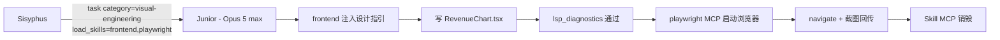

# 第十章：实战案例、最佳实践与故障排除

把前面 9 章的概念串起来，最好的方式是看几段真实的工作流。本章用 6 个典型场景演示 OmO 的完整调用链，再总结一份最佳实践速查，最后给一份"卡住时怎么办"的故障排除手册。

---

## 10.1 实战案例

### 10.1.1 案例 1：小补丁——修个文档错字

**场景**：README.md 里一处英文错字。

**做法**：直接和 Sisyphus 对话即可。

```text
README.md 第 12 行 "intall" 是错字，正确是 "install"
```

Sisyphus 不会 over-engineer，直接 read → edit。这种情况**不要用** `ulw`，会浪费一堆并行任务。

---

### 10.1.2 案例 2：实现一个新接口（懒人模式）

**场景**：给 `services/auth.ts` 添加 `sendOtp(phone)` 方法，调用 Twilio Verify，带超时与重试，写单测。

**做法**：

```text
ulw 在 services/auth.ts 添加 sendOtp(phone) 方法：
- 调用 Twilio Verify API 发送验证码；
- 5 秒超时，3 次重试；
- 用现有 logger；
- 写完整的单测覆盖正常 + 超时 + 重试用尽 + Twilio 4xx 用例。
```

**OmO 内部发生了什么**：

```text
keyword-detector → 注入 ultrawork 模式提示词
Sisyphus
  ├─ 后台 call_omo_agent(librarian) → 查 Twilio Verify 文档（内置 context7 MCP）
  ├─ 后台 call_omo_agent(explore)   → grep services/ 现有 service 模式
  ├─ task(category="deep")           → Junior 实现 sendOtp
  └─ task(category="unspecified-low") → Junior 写 vitest 测试
post:
  - lsp_diagnostics 通过
  - vitest 通过
  - comment-checker 拦下 4 处 AI 套话注释
  - todo-continuation-enforcer 检查 todo 全部 ✅
最终：交付 services/auth.ts + services/auth.test.ts
```

如果没特别折腾，整套流程自己就跑完。

---

### 10.1.3 案例 3：多日工程——重构 auth 系统

**场景**：把整个 auth 模块从 session-based 重构到 JWT + Refresh Token，估计 5+ 个文件 / 多日。

**做法**：

**Day 1，规划阶段**：

```text
（Tab 切到 Prometheus）
我想把 auth 模块从 session-based 迁到 JWT + Refresh Token。要求：
- 渐进迁移，不破坏现有 session 用户；
- token 存 httpOnly cookie；
- refresh token 服务端可吊销。
```

Prometheus 先派 explore / librarian 调研，然后访谈：

- 现有 session 表是哪个？
- 如何识别已迁用户 vs 未迁用户？
- token 过期时长？refresh 多长？
- 黑名单（吊销）用 Redis 还是数据库？
- 灰度计划？测试策略？回滚方案？

访谈完成 → 自动 Metis 缺口分析 →（高准确度）Momus + Oracle 双评审 → 你批准 → 计划落地 `.omo/plans/jwt-migration.md`。

**Day 1，执行阶段**：

```text
/ulw-execute --make-pr
```

触发：创建 boulder 工作记录 → 切到 Atlas → 注册 todo、设 Goal → 从 task 1 开始派活：

```text
task(category="deep")             → 实现 jwt utils
task(category="deep")             → 实现 refresh-token store（Redis）
task(category="visual-engineering") → 修登录页 cookie 切 httpOnly（load_skills=["frontend"]）
task(category="unspecified-low")   → 写迁移测试
```

中途机器崩了？新会话再 `/ulw-execute`，从 boulder.json 续作，notepad 里累积的 wisdom 全在。做完直接以 PR 交付；用 `--ship` 则一路干到 PR 过 CI、评审、合并。

**Day 3 收尾**：

```text
@oracle 评审一下整套 auth 实现，看有没有架构问题
```

Oracle（GPT-5.6 Sol xhigh）做只读评审，给改进建议。Sisyphus 接收建议 → 决定哪些改、哪些不改。

---

### 10.1.4 案例 4：UI 闭环——前端 + 浏览器验证

**场景**：给 dashboard 加一个新的图表卡片，要求设计感强。

**做法**：

```text
ulw 在 src/pages/Dashboard 加一个"营收趋势"卡片：
- 用 Recharts；
- 颜色与现有主题协调；
- 移动端响应式；
- 加 hover 微交互；
- 完成后用浏览器截图截一张主页给我看。
```

OmO 内部：



你拿到代码 + 截图 + 一份"我做了什么"的总结。

---

### 10.1.5 案例 5：通宵追击——SaaS 化老应用

**场景**：把一个 45k 行的 Tauri 桌面应用改造成 SaaS Web 应用。这种活儿一句话 prompt 是不可能的。

**做法**（旧版 `/ulw-loop` 已移除，现在两条路）：

路线 A：先规划再执行（推荐）：

```text
（Tab 切到 Prometheus）
把这个 Tauri 桌面应用迁移到 Next.js + Supabase 的 SaaS 形态：
- 复用 src/core 业务逻辑；
- 桌面文件操作改成 Supabase Storage；
- 用户管理用 Supabase Auth；
- 多租户隔离用 Postgres RLS。

/ulw-execute --worktree ../wt-saas
```

路线 B：Goal 持续追击：

```text
/goal "完成 Tauri → Next.js + Supabase 的迁移，全部测试通过、首页可登录为止"
```

期间：空闲自动续跑；429 由 `runtime-fallback` 切 Kimi K3 / GPT-5.6 Sol（需开启）；`preemptive-compaction` 提前压缩；各 recovery Hook 修中断。要真并行分工就开 Team Mode 建个迁移小队。

---

### 10.1.6 案例 6：Git 提交艺术家

**场景**：你刚 ulw 完了一个改了 17 个文件的功能，想提交。

**做法**：

```text
/git-master commit these changes
```

git-master 内部：

1. 分析最近 30 个 commit → 推断出你这个仓库用中文 + 语义化（feat/fix/docs）；
2. 17 个文件 → 必须 ≥5 次提交（3+/5+/10+ 法则）；
3. 用 LSP / AST-Grep 分析改动依赖关系；
4. 切成 5 个原子提交：
   - `feat(auth): 添加 JWT 工具函数`
   - `feat(auth): 实现 RefreshToken 仓储`
   - `feat(auth): cookie 切到 httpOnly`
   - `test(auth): 补 JWT 迁移测试`
   - `docs(auth): 更新 README`
5. 输出每个 commit 的 hash 和描述给你确认。

想 rebase：`/git-master rebase onto main`——按依赖顺序 rebase，冲突走结构化解决。

---

## 10.2 最佳实践速查

### 10.2.1 模式选择

| 任务规模 | 推荐 |
| --- | --- |
| 改字 / 单文件单点 | 直接对话 |
| 几小时内能完成的功能 | `ulw <task>` |
| 多日工程 / 关键改动 | Tab → Prometheus，然后 `/ulw-execute`（要 PR 就 `--make-pr` / `--ship`） |
| "做到完成为止"的目标 | `/goal "..."`（先开 `goal.enabled`） |
| 深度推理 / 跨域硬骨头 | Tab → Hephaestus |
| 对抗式规划 / 安全审计 | `/hyperplan` / `security-research`（需 Team Mode） |
| 设计审查 | `@oracle` |
| 找代码 / 找文档 | `@explore` / `@librarian`，能后台就后台 |

### 10.2.2 prompt 7 要素

每次给子 Agent 派任务（或在 ulw 写需求时）尽量包含：TASK、EXPECTED、SKILLS、TOOLS、MUST DO、MUST NOT DO、CONTEXT——即任务、期望产出、所需技能、工具白名单、硬性要求、硬性禁止与相关上下文。

### 10.2.3 模型选择

- 不要给 Hephaestus 配 Claude，不要给 Sisyphus 配不支持的 GPT 老模型；
- Explore / Librarian 不需要顶级模型，别浪费 Opus；
- `ultrabrain` 贵但值，硬骨头才用；
- `quick` / `unspecified-low` 真的便宜，能省就省。

### 10.2.4 多模型阵容建议

- **预算紧（官方低保组合）**：ChatGPT 订阅（$20）+ Kimi Code 订阅（$19）+ GLM Coding Plan（$10）——`ultrawork` 也能跑得好；
- **追求质量**：Claude Max + ChatGPT + Gemini + Z.ai；
- **国内偏好**：Claude（API 中转）+ Kimi for Coding + Z.ai / Bailian；
- **完全免费试水**：只装 OpenCode Go 或 OpenCode Zen。

### 10.2.5 项目侧约定

- 项目根放 `AGENTS.md`，写清"这个项目是干嘛的、风格是什么、必须遵守什么"——`directory-agents-injector` 自动注入；用 `init-deep` 技能生成层级化 AGENTS.md；
- `.claude/rules/*.md` 放语言级规则，`globs` 限定生效范围；
- `.opencode/skills/` 放仓库自定义 Skill，可随 git 版本管理；
- `.omo/` 目录（plans / notepads / boulder / goal / teams）按需加入 `.gitignore`。

### 10.2.6 安全最佳实践

- 不要把 API Key 写进配置文件——用 `${VAR}` 环境变量或 provider auth 流程；
- Skill MCP 的 OAuth token 已按权限 0600 存好；
- `.claude/settings.local.json`（git-ignored）放本地 Hook；
- 团队共用配置时：个人偏好放 `~/.omo/omo.jsonc`，项目共识放项目 `.omo/omo.jsonc`（就近覆盖）；
- guard 类 Hook（文件守卫、重定向守卫、md-only 等）别乱禁。

### 10.2.7 上下文窗口管理

- 开 `model_capabilities.auto_refresh_on_start`，让 OmO 知道每个模型的窗口大小；
- 不在主对话粘贴超长日志——丢到 `tmp/run.log` 让 Agent 自己 read（触发 `tool-output-truncator`）；
- 长会话靠 `preemptive-compaction` 提前压缩、`compaction-context-injector` 保关键上下文；
- 试开 `experimental.dynamic_context_pruning` 自动修剪旧工具输出；
- memory 默认开启：反思、事实抽取、空闲"梦境整理"都会帮你积累跨会话经验，嫌吵可按 Agent 关掉 dream；
- 离开很久再回来 → `/handoff` 生成交接文档，新会话粘贴。

---

## 10.3 故障排除手册

### 10.3.1 安装阶段

**Q：`bunx oh-my-openagent install` 报 "Cannot find module"？**
A：确认 Bun 已装（`curl -fsSL https://bun.com/install | bash`）并重开终端；务必用 `bunx`，不要全局安装。

**Q：装完在 OpenCode 里看不到 OmO？**
A：`jq '.plugin' ~/.config/opencode/opencode.json` 应包含 `"oh-my-openagent"`（旧名 `"oh-my-opencode"` 也能加载但有警告）。没有就手动加上，再 `bunx oh-my-openagent doctor`。

**Q：Doctor 提示 legacy 名 / Deprecated Reasoning Keys？**
A：plugin 数组改成新名；把旧 `variant` / `reasoningEffort` / `thinking` 写法换成 `reasoning`。

**Q：OpenCode 启动失败，提示版本太低？**
A：`opencode --version` 必须 ≥ 1.4.0，去 [opencode.ai/docs](https://opencode.ai/docs) 升级。

**Q：改了旧配置文件（`oh-my-openagent.json`）没生效？**
A：那是预期行为——旧文件只在迁移时读一次。改统一配置 `~/.omo/omo.jsonc`；不确定就跑 `bunx oh-my-openagent config migrate --dry-run` 看迁移状态。

**Q：装 Senpi 报 EEXIST？**
A：机器上还有 ≤4.19.4 的旧全局包占着 `omo` bin 名，先卸载旧包再 `npm i -g omo-ai@beta`。

### 10.3.2 Auth & 模型解析

**Q：doctor 显示某 Agent 落到 "compatibility fallback"？**
A：跑 `bunx oh-my-openagent refresh-model-capabilities` 刷新 models.dev 缓存；还不行说明所配模型在 models.dev 无记录（OmO 用启发式回退），换成已知模型 ID。`doctor --verbose` 看解析细节。

**Q：Sisyphus 说"我不能在这个 GPT 上跑"？**
A：`no-sisyphus-gpt` Hook 拦截（只放行 5.4 / 5.5 / 5.6 Sol 的专用路径）。换 Claude / Kimi / GLM，或老老实实给 GPT 走 Hephaestus。

**Q：Hephaestus 说"我不能在 Claude 上跑"？**
A：`no-hephaestus-non-gpt` 触发。**不要硬改提示词去试**，给它一个 GPT 系提供商。

**Q：Gemini / Antigravity 模型不出现？**
A：确认装了 `opencode-antigravity-auth` 插件并合并了它的模型配置；用基础模型名 + variant（如 `antigravity-gemini-3-pro` + `--variant=high`），别用旧的 `-high` 后缀名。

**Q：`prompt is too long ... > 200000`？**
A：该 Agent 走的是 Antigravity 的 200k 稳定车道。长上下文需求把它切到直连 `anthropic/*`（1M 车道）。

### 10.3.3 运行时错误

**Q：突然 `429 / rate_limit_exceeded`？**
A：默认配置下 OmO **不会**自动切——`runtime_fallback` 默认关闭。想要自动切备胎，在配置里开 `"runtime_fallback": true`（细节可调冷却/超时/错误码）。开了之后切模型会有 toast 提示。

**Q：`Context window exceeded`？**
A：`anthropic-context-window-limit-recovery` 应自动压缩。没生效就开 `preemptive-compaction`，或 `/handoff` 后开新会话。

**Q：编辑工具老报 hash mismatch？**
A：说明文件在读取后被外部改过（正常保护行为），让 Agent 重新 `read` 一次再 `edit`。真不想要这个行为，关掉 `hashline_edit`。

**Q：Ollama 本地模型报 `JSON Parse error: Unexpected EOF`？**
A：Ollama 默认 NDJSON 流，必须关流式——在 **OpenCode 的 provider 设置**（不是 OmO 的 agent 配置）里配 `stream: false`。详见 [ollama 故障排除文档](https://github.com/code-yeongyu/oh-my-openagent/blob/dev/docs/troubleshooting/ollama.md)。

### 10.3.4 行为异常

**Q：Agent 总爱写 AI 风格的注释？**
A：`comment-checker` 默认拦截。个别必要注释用 `// @allow` 放行，整文件用 `// comment-checker-disable-file`；团队确实要多注释就把它加进 `disabled_hooks`，或用 `/remove-ai-slops` 事后清理。

**Q：Agent 老说"完成了"但 todo 还有半数没勾？**
A：`todo-continuation-enforcer` 会拽回来。没生效就检查它是否进了 `disabled_hooks`。

**Q：Atlas 自己写代码了？**
A：当前对 Atlas 是 warn-only 执法（警告而非硬拦截），纪律主要在提示词。频繁发生时检查是否覆盖了 Atlas 提示词或禁用了 `atlas` Hook。

**Q：Prometheus 写了代码而不是 Markdown？**
A：`prometheus-md-only` 失效——检查是否被禁（强烈不建议禁）。

**Q：想暂停 Agent 的自动推进？**
A：`/stop-continuation` 一键停掉 todo continuation、Goal、boulder。

### 10.3.5 多 Agent 协同

**Q：后台 Agent 跑完没通知？**
A：`background-notification` 默认开。Linux 装好 `notify-send`；macOS / Windows 自带通知。或用 `background_output(task_id=...)` 主动取。

**Q：Tmux pane 没自动出现？**
A：需要 OpenCode **运行在 tmux 会话内**且带 `--port` 启动，并且 `tmux.enabled = true`。检查 `echo $TMUX` 非空。跑在 cmux 里也行（无需真 tmux）。

**Q：`/ulw-execute` 提示 "No Plans Found"？**
A：`.omo/plans/` 是空 → 先让 Prometheus 建计划；多个活跃工作 → `/ulw-execute {plan-name}` 指名。别急着删 boulder.json。

**Q：Team Mode 开了但 `team_*` 工具没出现？**
A：重启 OpenCode；看日志 `oh-my-opencode.log`（OS 临时目录，50MB 轮转）里的 `[tool-registry] Built tool registry`；`doctor` 的 Team Mode 检查看 tmux/git 可用性。

**Q：Codex Light 版 Hook 报 MODULE_NOT_FOUND / 哈希不匹配？**
A：重跑 `npx lazycodex-ai install`（幂等，重算信任哈希、重建组件 dist）；`command not found: omo-*` 就把 `~/.local/bin` 加进 PATH。

### 10.3.6 Skill / Category

**Q：Skill 不生效？**
A：依次查：SKILL.md 路径是否在 5 个扫描位置之一（`.opencode/skills`、`~/.config/opencode/skills`、`.claude/skills`、`.agents/skills`、`~/.agents/skills`）；是否进了 `disabled_skills`；frontmatter 是否合法 YAML；是否被同名高优先级 Skill 覆盖。

**Q：Skill 的 MCP（Model Context Protocol）服务启动失败？**
A：看 `~/.config/opencode/mcp-oauth.json` 是否有过期 token；`bunx oh-my-openagent mcp oauth login <name>` 重登；检查 `command` / `args` 路径。

**Q：Category 不生效（Junior 还是用了默认模型）？**
A：确认写的是 `task({ category: "..." })` 而不是 `subagent_type`（两者互斥）；`doctor --verbose` 看 Category 解析是否落到 fallback；改配置后重启 OpenCode。

### 10.3.7 性能与成本

**Q：感觉烧钱很快？**
A：

- Explore / Librarian 别配 Opus；
- 简单任务别用 `ulw`，更别开 Goal 长跑；
- 用 `session_search` / `session_info` 看会话 token 去向；
- 用 `background_task.providerConcurrency` / `modelConcurrency` 给贵模型限流（如 `anthropic/claude-opus-5: 2`）；
- 范围卡不死的任务先 `@plan`（Prometheus）再执行。

**Q：响应慢？**
A：给 Atlas / Junior 走 Sonnet / Kimi K3 这类快档；需要时用 `reasoning: "low"` 降推理档；网络问题切镜像 / 中转。

---

## 10.4 OmO 学习路径建议

如果你刚装好 OmO，下面这条路径会比较顺：

1. **第 1–2 天**：跟着第三章装好，跑一遍 `ulw 给 README 加一段中文简介`；顺手 `/init-deep`（用 `skill` 调用）生成项目 AGENTS.md。
2. **第 3–7 天**：真实用 `ulw` 干日常活儿——修小 Bug、补单测、写新接口；翻第四、五章，把 11 个 Agent 和各条工作模式心里有底。
3. **第 2 周**：碰到第一个"复杂多日活儿"，强制自己走 Prometheus → `/ulw-execute`，体会计划-执行分离与 boulder + notepad 续作。
4. **第 3 周**：用 git-master 切提交、`/refactor` 做重构、review-work 自查；学会写 7 要素 prompt。
5. **第 1 个月底**：开 `hashline_edit`、`runtime_fallback`、Goal、Team Mode 里你需要的；写自定义 Skill / Category / Rules / 命令，把 OmO 调成你的"定制开发助手"。
6. **持续**：关注 [oh-my-openagent](https://github.com/code-yeongyu/oh-my-openagent) 的 dev 分支与 release（官方文档站 [omo.dev/docs](https://omo.dev/docs)）——OmO 迭代极快，保持升级可获得新模型支持与新特性。

---

## 10.5 总结

读完整本教程，回头再看第一章那句话：

> **OmO 是装在 OpenCode 上的一支自动化的多模型 AI 工程团队。**

它不是某种神奇的提示词，也不是某家供应商的预配置工具集。它是：

- **多模型编排**——把每个模型用在它最强的地方，谁家便宜谁家强用谁；
- **专业化分工**——Sisyphus / Hephaestus / Prometheus / Atlas / Oracle / Metis / Momus / Librarian / Explore / Multimodal-Looker / Junior，11 位选手各司其职；
- **强制纪律**——数十个 Hook 把"AI 偷懒、瞎写、报错就崩"的脆弱性彻底压住；
- **稳健工具**——Hashline + LSP + AST-Grep + Tmux + 三层 MCP，让 Agent 拥有 IDE 级精度；
- **多条主线**——Ultrawork、Prometheus + Atlas、Goal、Team Mode，覆盖绝大多数工作场景；
- **Discipline > Prompt Engineering**——你不需要调提示词，OmO 把"工程师纪律"焊死在系统里；
- **作者中立**——和任何模型供应商无利益绑定。

把它装上，敲下第一个 `ulw`，剩下的，让 Agent 替你完成。

> **The agent should be invisible. You flip the switch. The light turns on.**
>
> 那才是终点。

—— 完。
