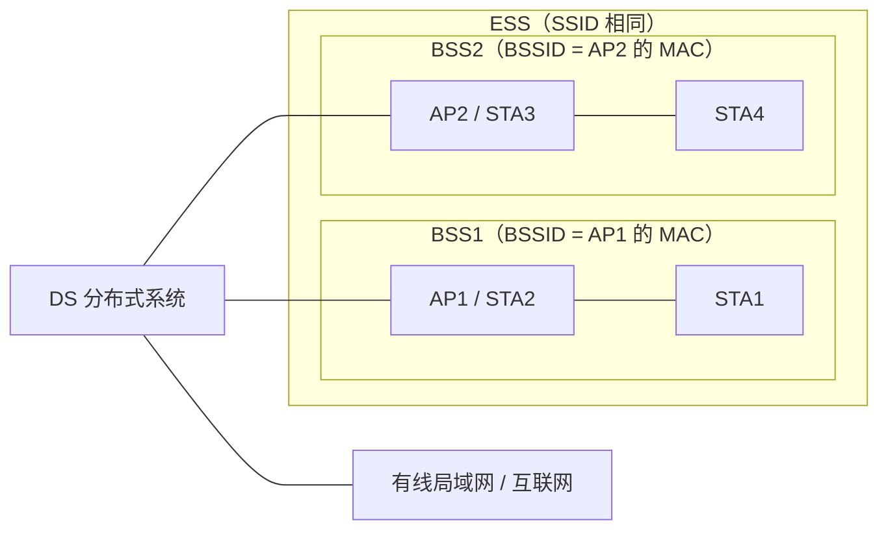
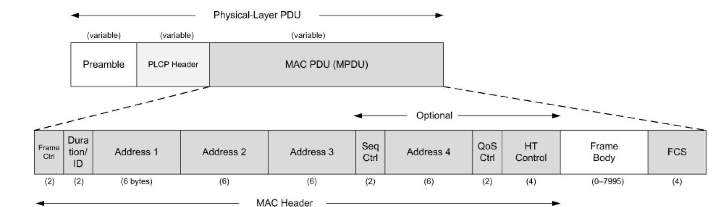
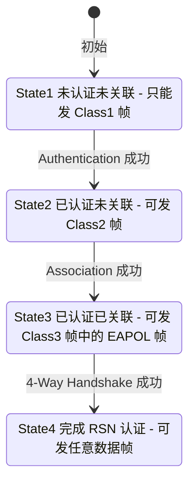

本篇对应原书第 3 章「Wi-Fi 基础知识」的主体（频谱、802.11 协议族、组件与网络结构、Service、MAC 帧、CSMA/CA、MLME 管理实体）；该章的无线安全与 Linux Wi-Fi 编程 API 内容较多，独立成后续两篇。本篇主线一句话：**802.11 只定义 MAC 层与 PHY 层的规范——STA 经「扫描发现 → 认证 → 关联 → 密钥协商」四步加入一个 BSS，之后所有数据帧经 AP 所在的 DS 转发，而信道访问用 CSMA/CA 避免冲突。** 掌握这些概念是阅读 wpa_supplicant、WifiService 源码的前提。

> 版本注意：原书协议部分基于 802.11-2012 版规范。后续 802.11ac/ax（Wi-Fi 5/6）、WPA3 等均已并入 802.11-2020 版，概念框架未变；涉及新版本特性处正文单独标注。

> 摘编声明：协议原语、参数列表为规范原文的摘编，保留主干参数，完整列表可对照 802.11 规范第 6、10 章。

## 1.1 Wi-Fi 与 IEEE 802.11

**Wi-Fi**（Wireless Fidelity）是无线网络通信技术的品牌，由 Wi-Fi 联盟（Wi-Fi Alliance，WFA）拥有，WFA 负责 Wi-Fi 认证与商标授权。严格地说，Wi-Fi 是一个认证名称，用于测试无线网络设备是否符合 IEEE 802.11 系列协议规范，通过认证的设备被授予 Wi-Fi CERTIFIED 商标。由于获得认证的设备高度普及，人们习惯把无线网络统称为 Wi-Fi 网络。IEEE 802.11 是无线网络技术的官方标准，WFA 参考 802.11 规范制订测试方案（Test Plan），两者内容并不完全重合——可以把 Wi-Fi 理解为「802.11 规范子集的扩展」。

IEEE（Institute of Electrical and Electronics Engineers，电气电子工程师协会）中，802 委员会专门制定局域网标准，也称 LMSC（LAN/MAN Standards Committee，局域网/城域网标准委员会）。委员会按工作组（Working Group）划分，**802.11 就是第 11 工作组**，负责制订无线局域网（Wireless LAN）的 MAC（Medium Access Control，介质访问控制）与 PHY（Physical Layer，物理层）技术规范。工作组内部再细分任务组（Task Group，TG），编号为字母：

- 小写字母：在该标准上的修订，不能独立存在，如 802.11b、802.11g；
- 大写字母：体系完备的独立标准，如 802.1X（安全认证标准）。

## 1.2 无线电频谱与信道

### 频谱管制与 ISM 频段

无线电频谱资源按频率高低划分，由各国管制机构管理：美国 FCC（Federal Communications Commission，联邦通信委员会）、中国工信部无线电管理局、国际电信联盟 ITU（International Telecommunication Union）。部分频段须经授权才能使用；无须授权的频段大部分集中在 **ISM**（Industrial Scientific Medical，工业科学医疗）国际共用频段。ISM 由 FCC 最早定义，各国范围不完全一致，例如美国的三个 ISM 频段为 902~908MHz、2400~2483.5MHz、5725~5850MHz。各国都将 2.4GHz 频段划入 ISM，所以 Wi-Fi、蓝牙等均可工作于此。虽然无须授权，但管制机构对设备的发射功率有要求——无线频谱易被污染，大功率会干扰周围其他设备。

### 2.4GHz 频段

共 14 个信道，总频率范围 2400（2.4GHz）~2483.5MHz，共 83.5MHz 带宽。信道 N 的中心频率为 `2407 + 5 × N` MHz。不同国家支持信道不同：北美仅支持 1~11，欧洲支持 1~13，日本允许使用 14。

- 信道 1：中心频率 2412MHz，范围 2402~2422MHz；
- 信道 6：中心频率 2437MHz，范围 2427~2447MHz；
- 信道 11：中心频率 2462MHz，范围 2457~2477MHz。

每个信道占 20MHz（802.11b/g/n 20MHz 模式），相邻信道中心频率间隔仅 5MHz，彼此重叠。1、6、11 是 2.4GHz 频段仅有的三个互不重叠的信道，这就是家庭路由器常选这三个信道的原因。

### 5GHz 频段

工作在 5.150~5.925GHz 的无线局域网（IEEE 802.11a/n/ac/ax）。信道以 5MHz 为单位编号：信道 N 的中心频率为 `5000 + 5 × N` MHz，如信道 36 为 5180MHz、信道 40 为 5200MHz、信道 149 为 5745MHz。实际可用带宽按 20/40/80/160MHz 聚合。

| 子频段 | 频率范围 | 信道号 | 区域限制 | 特性 |
| --- | --- | --- | --- | --- |
| UNII-1 | 5.150~5.250 GHz | 36、40、44、48 | 全球通用 | 室内低功率，无需 DFS |
| UNII-2 | 5.250~5.350 GHz | 52、56、60、64 | 需 DFS | 雷达避让，部分国家禁用 |
| UNII-2 Extended | 5.470~5.725 GHz | 100~144 | 需 DFS，部分国家开放 | 高功率，适用于室外 |
| UNII-3 | 5.725~5.925 GHz | 149~165 | 部分国家允许（美国、中国等） | 无需 DFS，高功率 |

DFS（Dynamic Frequency Selection，动态频率选择）指设备检测到雷达信号时自动切换信道的机制，因为 UNII-2 频段与部分雷达频段共用。中国（MIIT 标准）允许信道 36、40、44、48、149、153、157、161、165，其中 52~64 需 DFS，UNII-2 Extended（100~144）部分信道禁用。

## 1.3 802.11 版本演进

802.11 标准历经多个版本，各主要版本的速率与关键技术（表中数据为该版本在 20MHz 单流下的典型速率）：

| 版本 | 发布年份 | 频段 | 最大速率 | 关键技术 |
| --- | --- | --- | --- | --- |
| 802.11-1997 | 1997 | 2.4GHz | 2Mbps | FHSS / DSSS / 红外 |
| 802.11b | 1999 | 2.4GHz | 11Mbps | DSSS 与 CCK |
| 802.11a | 1999 | 5GHz | 54Mbps | OFDM |
| 802.11g | 2003 | 2.4GHz | 54Mbps | OFDM（兼容 b） |
| 802.11n（Wi-Fi 4） | 2009 | 2.4/5GHz | 72Mbps/流 | MIMO、40MHz、帧聚合、短 GI |
| 802.11ac（Wi-Fi 5） | 2013 | 5GHz | 433Mbps/流 | 波束赋形、MU-MIMO（下行）、80/160MHz |
| 802.11ax（Wi-Fi 6） | 2021 | 2.4/5GHz（6E 含 6GHz） | 143Mbps/流@20MHz | OFDMA、上下行 MU-MIMO、BSS Coloring、TWT |

除速率版本外，几个功能性修订同样重要：802.11e（QoS，WMM 的基础）、802.11i（安全，WPA2 的基础）、802.11w（管理帧保护 PMF）、802.11s（Mesh 网络）。历代修订已滚动合并为 802.11-2020 单一文档。

## 1.4 OSI 参考模型与 802.11 的位置

### OSI 七层模型

OSI/RM（Open Systems Interconnection Reference Model，开放式系统互联基本参考模型）将网络划分为七层，由上到下：

| 层 | 数据单位 | 职责与常见协议 |
| --- | --- | --- |
| 应用层（Application Layer） | APDU | 与应用程序界面沟通，如 HTTP、FTP、SMTP |
| 表示层（Presentation Layer） | PPDU | 语法转换、压缩解压、加密解密，如 GIF/JPEG 格式支持 |
| 会话层（Session Layer） | SPDU | 为通信双方制定通信方式、创建和注销会话 |
| 传输层（Transport Layer） | TPDU | 数据分段、流量控制、差错处理，如 TCP、UDP |
| 网络层（Network Layer） | Packet / Datagram | 寻址与选路，如 IP、IPv6；常见设备路由器 |
| 数据链路层（Data Link Layer） | Frame | 相邻节点间成帧、物理寻址、差错控制；常见设备二层交换机、网桥 |
| 物理层（Physical Layer） | bit | 定义机械、电气、功能和过程特性，建立维护拆除物理链路 |

实际工程中更常用 TCP/IP 模型，可视为 OSI/RM 的简化版本（应用层 / 传输层 / 网络层 / 网络接口层）。

### LLC 与 MAC 子层

数据链路层可再划分为两个子层（ISO/IEC 8802 规范）：

- **MAC**（Medium Access Control SubLayer，媒介访问控制子层）：解决局域网中共用信道的竞争问题——信道的使用权如何分配；
- **LLC**（Logic Link Control SubLayer，逻辑链路控制子层）：实现两个站点之间端到端无差错的帧传输、应答与流量控制。

802.11 只涉及 MAC 层。由于物理介质不同，无线与有线的 MAC 方法差别很大：以太网用 CSMA/CD（Carrier Sense Multiple Access / Collision Detect，载波监听多路访问/冲突检测），发送时边发边监听，冲突则停发并随机重试；无线网络采用 CSMA/CA（冲突避免）——冲突检测要求设备能同时收发信号，对无线设备性价比太低。

### Service、Entity 与原语

规范对每层的交互方式也有定义：

- **Service**：每层对外提供的功能集合，如 MAC Service；
- **Entity**：层内封装一组功能的模块，Service 由 Entity 提供；
- **SAP**（Service Access Point，服务访问点）：第 N+1 层使用第 N 层服务必须经由的入口，MAC 的 SAP 缩写为 MSAP；
- **原语**（primitives）与参数：与编程中的「接口函数 + 参数」对应，如 `M_UNITDATA.request`（发送数据）与 `M_UNITDATA.indication`（通知收端上层处理数据）。

### SDU 与 PDU

上一层交给本层处理的数据称为本层的 **SDU**（Service Data Unit）；本层封装头部后形成的整体称为 **PDU**（Protocol Data Unit）。对 MAC 层来说，来自 LLC 的数据是 **MSDU**（MAC SDU，即载荷 Payload），加上 MAC 帧头后成为 **MPDU**。802.11n 起还支持把多个 MSDU 聚合成一个 MPDU 发送（帧聚合 A-MSDU，提升效率）。

### MIB

MIB（Management Information Base，管理信息库）是虚拟数据库，存储设备信息供查询修改，内部为树形结构，每个管理条目通过 OID（Object Identifier）访问。802.11 定义的 MIB 属性集合在 802.11mib.txt 中，可用 JMIBBrowser 等工具加载查看。分析 wpa_supplicant 源码时会碰到 802.11 MIB 定义的属性（如 dot11RSNAOptionImplemented）。

## 1.5 802.11 组件与网络结构

### 四种物理组件

- **WM**（Wireless Medium，无线媒介）：传输无线 MAC 帧数据的物理层。规范最早定义了射频和红外两种物理层，目前使用最多的是射频物理层。
- **STA**（Station）："A logical entity that is a singly addressable instance of a MAC and PHY interface to the WM"。STA 是指携带无线网卡的设备，例如笔记本、智能手机。无线网卡和有线网卡的 MAC 地址均分配自同一个地址池以确保唯一性。
- **AP**（Access Point，接入点）："An entity that contains one STA and provides access to the distribution services, via the WM for associated STAs"。AP 本身也是一个 STA，只不过它还能为已关联的（associated）STA 提供分布式服务（DS）。
- **DS**（Distribution System，分布式系统）："A system used to interconnect a set of basic service sets (BSSs) and integrated local area networks (LANs) to create an extended service set (ESS)"。绝大部分情况下 DS 就是指有线网络（通过它接入互联网）。

以家用无线路由器为例：路由器一端通过有线接入互联网（整合了 LAN），另一端通过天线提供无线网络；手机（STA）与路由器（AP）之间的小无线网络就是一个 BSS，将 BSS 和 LAN 结合构成 ESS 的就是 DS。规范还定义了 portal 逻辑模块，用于在 WLAN 和 LAN 之间转换 MAC 帧格式（两种网络帧格式不同），目前该功能由 AP 实现。

### BSS 与 ESS

基本服务集 **BSS**（Basic Service Set）是无线网络的基本构建组件（Basic Building Block），分两种类型：

- **独立型 BSS**（Independent BSS，**IBSS**）：不需要 AP 参与，各 STA 直接交互，也叫 ad-hoc BSS（自组网络或对等网络）；
- **基础结构型 BSS**（Infrastructure BSS）：所有 STA 之间的交互必须经过 AP，AP 是中控台——家庭与工作中最常见的架构。STA 必须完成关联、授权等步骤才能加入，且一个 STA 一次只能属于一个 BSS。

**ESS**（Extended Service Set，扩展服务集）："A set of one or more interconnected BSSs that appears as a single BSS to the LLC layer at any STA associated with one of those BSSs"。ESS 中的 BSS 拥有相同的 SSID 并协同工作，STA 从 BSS2 移动到 BSS1 的覆盖范围内可无感切换（无需手动切换网络）；跨 ESS 的切换则需要用户手动选择。



两个标识：

- **BSSID**（BSS Identification）：每个 BSS 的唯一编号。基础结构型网络中 BSSID 就是 AP 的 MAC 地址（真实地址）；IBSS 中 BSSID 也是 MAC 地址，但由随机生成。
- **SSID**（Service Set Identification）：网络名，可读字符串（0~32 字节），比 MAC 地址更方便人们记忆。ESS 对外的编号就由 SSID 表达——内部各 BSS 设置为同一 SSID 即可。

## 1.6 802.11 Service

802.11 规范定义的 Service 分两大类：

- **SS**（Station Service）：STA 应具有的功能；
- **DSS**（Distribution System Service）：DS 应具有的功能。

各服务之间的逻辑关系：DSS 完成数据传输；数据要传到有线网络时由 Integration Service 做转换；存在 transition 时为保证 DSS 找到对应 STA，需要 association / reassociation 服务；STA 不再使用 DSS 时通过 disassociation 离开。

### 数据传输服务

- **Distribution Service**（分布式服务）与 **Integration Service**（整合服务）：STA 数据的传输与跨网络整合。

### 关联类服务

**Transition Type** 将 STA 在无线网络中的移动分为三类：

- **No-Transition**：没有移动，包括固定不动以及在某个 AP 覆盖范围内移动；
- **BSS-Transition**：从 ESS 中的一个 BSS 切换到另一个 BSS，希望不影响网络使用；
- **ESS-Transition**：从一个 ESS 中的 BSS 切换到另一个 ESS 中的 BSS，极有可能导致网络中断。

对应的三个服务：

- **association**（关联）：DS 传输数据时需要知道和哪个 AP 建立联系，因此规范要求 STA 传输数据前必须和一个 AP 建立关联关系——关联服务的目的是为 AP 和 STA 建立映射关系；
- **reassociation**（重新关联）：STA 进行 transition（如 BSS-Transition）时使用——之前与 BSS1 关联，此后要与 BSS2 关联。reassociation 只能由 STA 发起；
- **disassociation**（取消关联）：STA 不再使用 DSS，或 AP 不再为某个 STA 服务时调用。

### 访问控制与数据机密性

Access Control and Data Confidentiality 服务解决无线网络安全防护：

- **Authentication / Deauthentication**：身份验证与解除身份验证（用于 Access Control）；
- **Confidentiality**：私密性服务，规范中的数据加密方法有 WEP、TKIP、CCMP。

### 其他服务

- 频谱管理服务：TPC（Transmit Power Control，传输功率控制）与 DFS（Dynamic Frequency Selection，动态频率选择）；
- QoS 与时间同步服务；
- 无线电测量（Radio Measurement）服务。

## 1.7 802.11 MAC 帧

MAC 帧由 **MAC Header**（帧头）、**Frame Body**（帧体）和 **FCS**（校验）三部分组成：



| 字段 | 长度 | 说明 |
| --- | --- | --- |
| Frame Control | 2 字节 | 帧控制：协议版本、类型/子类型、ToDS/FromDS 等标志位 |
| Duration/ID | 2 字节 | 多数帧中为持续时间（微秒），供其他站点做虚拟载波侦听（NAV） |
| Address1~4 | 各 6 字节 | 四个地址字段，含义随帧类型与 ToDS/FromDS 变化（见下表） |
| Sequence Control | 2 字节 | 序列号（12bit）+ 分片号（4bit），用于去重与分片重组 |
| QoS Control | 2 字节 | 仅 QoS 数据帧有，携带优先级等 |
| Frame Body | 0~2312 字节 | 帧体：管理帧的信息元素（SSID、速率、RSN 等）或数据帧的 LLC 报文 |
| FCS | 4 字节 | CRC-32 校验 |

Frame Control 中的关键标志位：

- **Type / Subtype**：帧类型与子类型；
- **ToDS / FromDS**：标志帧的去向（去往/来自分布式系统），决定地址字段的含义；
- **More Fragments**：还有后续分片；
- **Retry**：该帧是重传帧；
- **More Data**：AP 缓存中还有发给省电 STA 的数据；
- **Protected Frame**：帧体已加密（WEP / TKIP / CCMP / GCMP）。

### 三类帧

| 类型 | 说明 | 常见子类型 |
| --- | --- | --- |
| 管理帧（Management） | 负责链路的建立与维护 | Beacon、Probe Request / Response、Authentication / Deauthentication、Association Request / Response、Disassociation、Action |
| 控制帧（Control） | 配合数据帧收发 | RTS、CTS、ACK、PS-Poll、Block ACK |
| 数据帧（Data） | 承载上层报文 | Data、QoS Data、Null Function（无数据的空帧，用于省电轮询） |

几个常用帧的典型场景：

- **Beacon**：AP 周期性广播（默认 100ms 一次），携带 SSID、支持的速率、信道、安全能力（RSN IE）、TIM（通知处于省电模式的 STA 来取缓存数据）——被动扫描监听的就是它；
- **Probe Request / Response**：STA 主动扫描时发出，内容与 Beacon 类似；
- **Authentication / Association**：接入的两步曲——先认证、再关联。

### 四个地址字段的含义

Addr1 总是接收方（RA），Addr2 总是发送方（TA）：

| ToDS | FromDS | Addr1（RA） | Addr2（TA） | Addr3 | Addr4 | 场景 |
| --- | --- | --- | --- | --- | --- | --- |
| 0 | 0 | DA（常为 BSSID） | SA | BSSID | 不用 | IBSS（Ad-hoc）内直接通信 |
| 0 | 1 | DA（接收 STA） | BSSID（AP） | SA | 不用 | AP → STA（下行） |
| 1 | 0 | BSSID（AP） | SA（发送 STA） | DA | 不用 | STA → AP（上行） |
| 1 | 1 | RA | TA | DA | SA | WDS 无线桥接 |

上行帧中 BSSID 位于 Addr1、下行帧中位于 Addr2，第三个地址则放真正的源/目的——这就是 802.11 用多个地址字段实现「经 AP 转发」的方式。

## 1.8 CSMA/CA：无线介质访问控制

无线网络没有沿用有线的 CSMA/CD，原因有二：

- 无线网卡要同时收发（全双工）成本高，冲突难以在发送时检测；
- **隐藏节点**（Hidden Node）：STA A、C 都能与 AP 通信，但彼此互相听不到；两者同时发送时冲突发生在 AP 处，发送方却检测不到。

因此 802.11 采用 **CSMA/CA**（Carrier Sense Multiple Access with Collision Avoidance，冲突避免）：

1. 发送前先**载波侦听**：物理载波侦听（检测信道能量）+ 虚拟载波侦听（NAV——其他帧的 Duration 字段通告的信道占用时长）；
2. 信道需空闲满 DIFS 才能发送；若信道忙，进入**随机退避**（Backoff）：从竞争窗口 CW 中取随机数，每过一个时隙递减，减到 0 才发送；冲突后 CW 翻倍（指数退避），降低再次冲突概率；
3. 单播帧发送后等待 **ACK**，超时未收到则置 Retry 位重传。

帧间间隔（IFS）决定发送优先级，间隔越短优先级越高：

| 间隔 | 用途 |
| --- | --- |
| SIFS | 最短，用于已获得介质控制权的帧：ACK、CTS、分片续帧 |
| PIFS | AP 发送 Beacon 等管理帧 |
| DIFS | 普通异步数据帧发送前要求的最小空闲时间 |

针对隐藏节点可开启 **RTS/CTS**：发送方先发 RTS（Request To Send），AP 回 CTS（Clear To Send），两者都携带 Duration，周围站点听到任意一个都会设置 NAV 让出信道——这样即使「听不到对方」（隐藏节点）也能互相避让。以站 A 向站 B 发数据为例：站 C 能听到 A 的 RTS 但听不到 B 的 CTS，因此 C 可以同时发送而不干扰 B 接收（C 与 B 互相听不到）；站 D 听不到 RTS 但能听到 CTS，于是关闭发送避免干扰 B；站 E 两者都能听到，全程静默。RTS/CTS 帧本身很短（分别为 20 和 14 字节，数据帧最长可达 2346 字节），开销不大，802.11 提供三种策略供选择：始终使用、超过阈值才使用、不使用。

协议具体运作由协调功能（Coordination Function，CF）控制，共四种：DCF（Distributed CF，分布式协调功能）、PCF（Point CF，点协调功能）、HCF（Hybrid CF，混合协调功能）与用于 Mesh 网络的 MCF。CSMA/CA 属于 DCF 的内容，信道利用率低于有线的 CSMA/CD——802.11b 在 1Mbps 速率时最高信道利用率可达 90%，11Mbps 时只有 65%。

## 1.9 MLME：MAC 层管理实体与 STA 状态机

### 管理实体与 SAP

802.11 的管理层有几个实体，后续读驱动和 wpa_supplicant 源码时会反复碰到：

- **MLME**（MAC Sublayer Management Entity）：MAC 子层中负责管理的 Entity，对外接口为 MLME_SAP；
- **PLME**（PHY Sublayer Management Entity）：物理层管理实体，对应 PLME_SAP（PHY 层还可细分为 PLCP 和 PMD 两个子层）；
- **SME**（Station Management Entity）：独立于 MAC 和 PHY 之外，供使用者统一操作 MAC 层和 PHY 层的各个 SAP。

规范为 MLME_SAP 定义了 82 个原语。**从编程角度理解：MLME_SAP 相当于定义了一套接口函数，wpa_supplicant 本质上就是对它们的实现。** 三个最常用的原语：

### Scan：扫描

`MLME-SCAN.request` 的主要参数（加粗为关键项）：

```text
MLME-SCAN.request(
  BSSType,            // INFRASTRUCTURE / INDEPENDENT / MESH / ANY_BSS
  BSSID,              // 指定 BSSID 或广播 BSSID
  SSID,               // 0~32 字节，长度 0 则为 wild ssid
  ScanType,           // ACTIVE（主动） / PASSIVE（被动）
  ProbeDelay,         // 微秒，仅 ACTIVE 模式使用
  ChannelList,        // 有序信道列表
  MinChannelTime, MaxChannelTime   // 每信道等待的最小/最大时间，单位 TU
)
```

两种扫描模式：

- **ACTIVE（主动扫描）**：STA 调整到某个信道，等待来帧指示（表明信道有人使用）或超时 ProbeDelay，二者满足其一即发送 Probe Request 帧，然后在该信道等待最少 MinChannelTime（期间信道一直空闲则提前结束）、最多 MaxChannelTime；
- **PASSIVE（被动扫描）**：不发送任何信号，在 ChannelList 各信道间切换并等待 Beacon 帧。

扫描结果由 `MLME-SCAN.confirm` 返回，核心是 BSSDescriptionSet——每个 BSSDescription 描述一个发现的无线网络（BSSID、SSID、信道、支持的速率、信号强度等）。

### Authenticate：认证

关联到某个 AP 前，STA 必须通过身份验证。由于涉及两端（STA 与 AP），Authenticate 共有 4 个原语：request / confirm（STA 侧）与 indication / response（AP 侧）：

```text
MLME-AUTHENTICATE.request(
  PeerSTAAddress,        // 对端（AP）的 MAC 地址
  AuthenticationType,    // OPEN_SYSTEM / SHARED_KEY / FAST_BSS_TRANSITION / SAE
  AuthenticateFailureTimeout   // 认证超时时间，单位 TU
)
```

### Associate：关联

认证通过后 STA 与 AP 关联，关联成功才正式成为网络一员。原语同样四条，request 的关键参数：

```text
MLME-ASSOCIATE.request(
  PeerSTAAddress,        // AP 的 MAC 地址
  CapabilityInformation, // STA 的能力信息
  ListenInterval,        // 告知 AP：STA 进入省电模式后监听 Beacon 的间隔
  RSN                    // STA 选择的安全信息（RSNE）
)
// confirm 关键返回：
MLME-ASSOCIATE.confirm(
  ResultCode, AssociationID, SupportedRates, ...
)
```

confirm 中 AP 返回 **AssociationID（AID）** 与支持的速率列表（以 500kbps 为单位）。对 RSN 网络而言，关联成功后还需通过 802.1X 身份验证与四次握手才能传数据。

### STA 状态机

上述原语操作成功后，STA 状态随之变化。规范按「能发什么帧」定义了 MAC 帧的三个类别（Class）与四个状态：



- **State1**：未认证未关联，只能发送 Class1 帧（控制帧、探测等基础帧）；
- **State2**：已认证未关联，可发 Class2 帧（Association 相关）；
- **State3**：已认证已关联，但未通过 RSN（Robust Security Network，强健安全网络）认证，只能发送 Class3 帧中处理认证的数据（四次握手的 EAPOL-Key 帧）；
- **State4**：四次握手成功，完全加入网络，所有数据帧正常传输。

帧类别与状态的对应关系本质上就是网络安全控制：没有通过身份验证的 STA 不允许传输数据。MLME 的原语与 API 类似、每个参数都有明确解释——分析 wpa_supplicant 时对照本节，很多代码就是在实现这些原语。

## 1.10 扫描与接入全流程

STA 加入一个基础结构型 BSS 的完整过程（把前文概念串起来）：

1. **扫描**：发现周围的 BSS——被动扫描逐信道监听 Beacon，主动扫描逐信道广播 Probe Request 等待 Probe Response；
2. **认证**（Authentication）：与选定的 AP 完成身份认证（早期的 Open System / Shared Key 已被淘汰，现在由 WPA2/WPA3 的机制承担）；
3. **关联**（Association）：交换双方能力（速率、QoS 等），获得 AID，此后才能经 AP 收发数据；
4. **密钥协商**：WPA2-PSK 为四次握手（EAPOL-Key 帧）派生 PTK / GTK；
5. **DHCP 与数据通信**：拿到 IP 后由系统完成网络配置与路由。

之后的数据传输：STA 的上行帧发给 AP（Addr1 为 BSSID），AP 经 DS 转发或经 Integration Service 送入有线网络；下行帧由 AP 送到 STA。整个过程在 Android 平台上由 Framework 发起、wpa_supplicant 完成协议工作、netd 完成网络配置——这三层的实现分别在本系列后续篇章展开。

## 1.11 参考来源

- 《深入理解Android：Wi-Fi、NFC和GPS卷》邓凡平著，机械工业出版社，第 3 章；
- IEEE 802.11 规范（[官方标准页面](https://standards.ieee.org/ieee/802.11/7028/)，现行合并版 802.11-2020）；
- 802.11 MIB 定义：802.11mib.txt（ieee802.org）。
