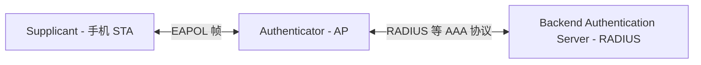
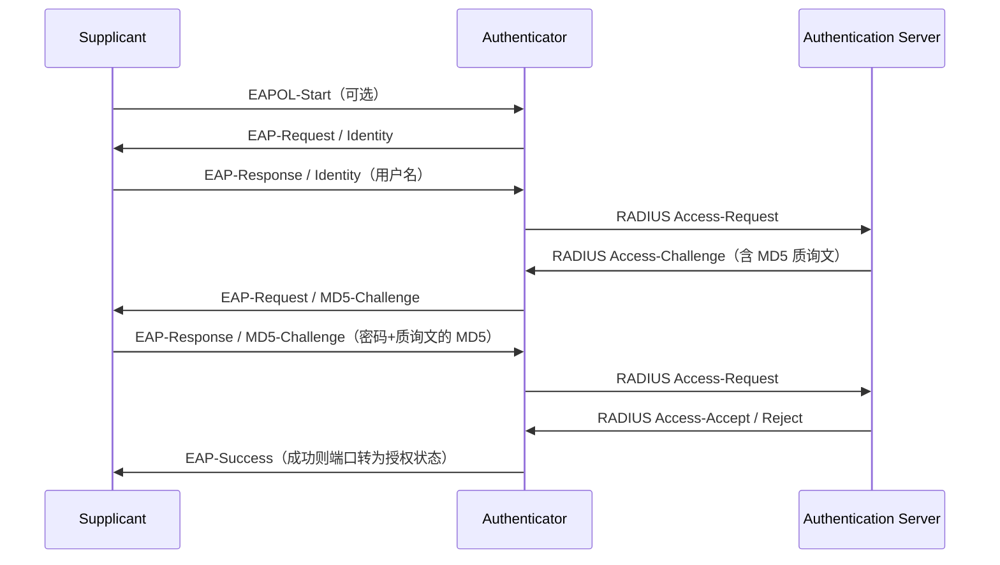
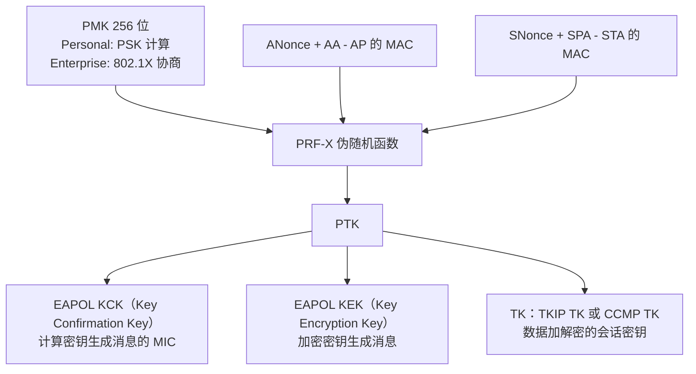

本篇对应原书 3.3.7 节「无线网络安全技术知识点」，是 802.11 基础篇中安全部分的展开。本篇主线一句话：**无线安全的三个保护点——数据完整性、机密性、身份验证与访问控制——分别由「加密与完整性校验算法（WEP → TKIP → CCMP）」和「认证与密钥派生体系（EAP / 802.1X → RSNA 的 PMK/PTK/GTK 与四次握手）」两条线解决，WPA2 = 802.1X/PSK + CCMP + 四次握手。** wpa_supplicant 很大一部分代码就是在实现本篇的内容。

> 版本注意：原书本节基于 802.11-2012 规范。WPA3（SAE）、OWE、PMF 强制启用等是成书后的演进，本篇 1.8 节基于规范与公开资料补充，超出原书范围。本篇只介绍加密与校验的大致工作流程，算法本身的数学细节不展开。

> 术语约定：安全知识点中经常见到 **Key**（密钥）与 **Password / Passphrase**（密码）——本质相同，Password 指人可读的内容（字符串、数字），Key 指由算法生成的不可读内容（二进制、十六进制数据）。

## 1.1 三个保护点与演进历程

无线安全主要保护三点：

- **数据完整性**（Integrity）：检查数据在传输过程中是否被修改；
- **数据机密性**（Confidentiality）：确保数据不会被泄露；
- **身份验证与访问控制**（Authentication and Access Control）：检查受访者的身份。

其中身份验证在无线网络中尤为突出：Wi-Fi 以空气为传播媒介，任何人用 AirPcap 这类工具就能抓取周围的无线通信数据；以太网虽然也是广播发送，但需要物理接入网口才能监听，无线网络天然没有这种物理隔离。

安全机制的演进脉络：

| 时代 | 方案 | 提出者 | 说明 |
| --- | --- | --- | --- |
| 1999 起 | WEP（Wired Equivalent Privacy，有线等效加密） | 802.11 规范 | 元老方案，后被证明很容易破解 |
| 2003 | WPA（Wi-Fi Protected Access） | WFA | 802.11i 出台前的中间方案，采用 TKIP |
| 2004 | RSN（Robust Security Network，强健安全网络） | 802.11i | 最终方案，WFA 称之为 WPA2 |
| 2018 | WPA3 | WFA | 基于 SAE，见 1.8 节 |

## 1.2 WEP：流加密的元老方案

### 流密码原理

WEP 采用**流密码**（Stream Cipher）加密数据：

- 源数据与 **KeyStream**（密钥流）做异或（XOR）得到密文；
- 接收端用相同的 KeyStream 再做一次异或即还原出源数据（两次异或、KeyStream 相同，结果即原文）；
- 只要 KeyStream 足够随机，不知道它的人理论上无法破解密文。

KeyStream 的生成：用户输入 SecretKey 作为种子，送入 PRNG（Pseudo Random Number Generator，伪随机数生成器）输出密钥流。**流密码的安全性完全依赖 KeyStream 的随机性。**

### WEP 的加密与解密

WEP 加密过程：

1. PRNG 的输入（随机数种子）= **IV**（Initialization Vector，初始向量，24 位，由设备厂商负责生成）+ **WEP Key**（长度有 40、104、128 位），输出 KeyStream；
2. 待加密数据 = Data + **ICV**（Integrity Check Value，完整性校验值，32 位，由 CRC-32 对 Data 计算得到）；
3. KeyStream 与「Data + ICV」异或得到密文；
4. 最终帧载荷 = IV + 密文。

解密为逆过程：IV + WEP Key 生成同一 KeyStream，与密文异或得到明文与 ICV；接收端对明文重新计算 CRC-32 得 ICV′，比对 ICV 与 ICV′ 判断数据正确性。

**WEP 最主要的问题：所有数据都使用同一个 WEP Key 加密**，加上 IV 只有 24 位（不可避免地重复使用），密钥流被重复使用的概率随流量增大而上升，攻击者借此可恢复明文甚至密钥。

### WEP 的两种身份验证

规范（802.11-2012）中其正式名称是 Pre-RSNA Authentication：

- **开放系统身份验证**（Open System Authentication）：等同于没有验证，谁来都通过。它的价值在于：规范规定要使用更先进的 RSNA 验证时，STA 发起 Authentication 请求必须用开放系统验证——因为它总是成功，STA 才能接着完成 Association 进入 State3，再开展 RSNA 验证；
- **共享密钥身份验证**（Shared Key Authentication）：四次帧交互——STA 发 Authentication 请求 → AP 回 128 字节质询明文（Challenge Text）→ STA 用 WEP 方法加密质询文再发 Authentication 请求 → AP 解密并校验 ICV 与质询文是否一致，一致则验证通过。看似比开放系统强，实际恰恰相反：**使用共享密钥验证就不能再使用更安全的 RSNA 机制**，且交互过程泄露了「明文-密文对」，反而有助于破解 WEP Key。

## 1.3 TKIP：WPA 的过渡方案

WPA 是 802.11i 正式发布前替代 WEP 的中间产物，相对 WEP 做了两处改动：

- 采用新的 MIC（Message Integrity Check，消息完整性校验）算法 **Michael** 替代 WEP 的 CRC 校验——CRC 是线性运算，攻击者可篡改数据后同步修改校验值，Michael 则是密码学意义的校验；
- 采用 **TKIP**（Temporal Key Integrity Protocol，临时密钥完整性协议）为**每一个 MAC 帧生成不同的 Key**，这一过程称为密钥混合（Key Mixing）。

TKIP 加密流程：

1. **完整性计算**：Michael 的输入 = MIC Key +（DA、SA、Priority、MAC 帧数据），输出 Data + MIC；
2. **Phase 1 密钥混合**：输入 TA（Transmitter Address）、TK（Temporal Key，128 位）、TSC（TKIP Sequence Counter，48 位序列号计数器，此处取前 32 位），产出 TTAK（TKIP-mixed Transmit Address and Key，80 位）；
3. **Phase 2 密钥混合**：输入 TTAK 与 TSC 后 16 位，产出 WEP 种子（一个 128 位 ARC4 密钥与 IV）；
4. **加密**：用 WEP 的流密码方法加密「Data + MIC」。

由于每个帧的 TSC 递增，每次送入 PRNG 的输入都不同，**每帧都用不同的密钥流加密**——这是 TKIP 比 WEP 安全的根本原因。同时密钥计算把 DA、SA、TA 等 MAC 信息都考虑进去，可抵抗重放等几类攻击。不过从加密本质看，TKIP 与 WEP 一样属于流密码，2012 年规范已将 TKIP 列为废弃。

## 1.4 CCMP：WPA2 的正式方案

CCMP（Counter Mode with CBC-MAC Protocol，计数器模块及密码块链消息认证码协议）出现在 WPA2 中，是基于 **AES**（Advanced Encryption Standard，高级加密标准）的块安全协议，比 TKIP 更强健。加密流程：

1. **构造 CCMP 头**：PN（Packet Number，帧编号，48 位，每帧累加，重传帧不累加）与 Key Id 共同构成 8 字节 CCMP Header；
2. **构造 Nonce 与 AAD**：明文是完整的 MPDU（不是 MSDU），其中 A2（Address2）、Priority、PN 共同构成 **Nonce**（一次性的临时随机数，用后即弃）；MAC 头信息构成 **AAD**（Additional Authentication Data，附加认证数据）；
3. **加密**：AAD、Nonce、MPDU 载荷与 TK（Temporal Key）共同作为 AES 算法输入，得到加密数据与 MIC；
4. **组帧**：MAC Header + CCMP Header + 加密后的 Data + MIC 构成最终 MPDU。

实际加解密由硬件完成，软件侧只需理解概念与密钥的来源——这正是 RSNA 要解决的问题。

## 1.5 EAP：可扩展认证协议

从本节起关注身份验证。EAP（Extensible Authentication Protocol，RFC 3748）不仅是一种协议，更是一个**协议框架**——各种认证方法都能基于它得到支持。基本角色：

- **Supplicant**（验证申请者）：发起验证请求的实体，无线网络中就是手机等 STA；
- **Authenticator**（验证者）：响应认证请求的实体，无线网络中是 AP；
- **BAS**（Backend Authentication Server，后端认证服务器）：企业级应用中 Authenticator 不真正处理验证，只把请求转发给后台服务器——这种架构拓展了 EAP 的适用范围；
- **AAA**（Authentication, Authorization and Accounting，认证、授权和计费）：基于 EAP 的另一类协议，RADIUS 服务器是其具体实现，RFC 3748 中 AAA 与 BAS 概念可互换；
- **EAP Server**：真正处理身份验证的实体——没有 BAS 时功能在 Authenticator 中，否则由 BAS 实现。

### EAP 协议栈与包格式

EAP 没有强制定义底层传输（Lower Layer），目前支持 PPP、有线网（EAPOL）、802.11 WLAN、TCP、UDP 等。协议栈分三层：EAP Layer（收发数据、处理重传与重复包）→ EAP Supplicant / Authenticator Layer（按 Type 分发给对应 Method）→ EAP Method（具体认证算法层）。

EAP 包格式非常简单：

| 字段 | 长度 | 说明 |
| --- | --- | --- |
| Code | 1 字节 | 1=Request、2=Response、3=Success、4=Failure |
| Identifier | 1 字节 | 消息编号，用于配对 Request 和 Response |
| Length | 2 字节 | EAP 消息总长（含头） |
| Data | 变长 | Code 为 Request/Response 时细分为 Type + Type Data |

常见 Method Type：

| Type | 名称 | 说明 |
| --- | --- | --- |
| 1 | Identity | 用于 Request，Type Data 携带申请者信息，简写 Request/Identity |
| 2 | Notification | Authenticator 传递提示（密码过期、账号锁定等） |
| 3 | Nak | 仅用于 Response：不支持的验证类型，告知自己支持的类型 |
| 4 | MD5-Challenge | 质询法：对端发随机明文，Supplicant 用密码与明文做 MD5 返回，Authenticator 比对 |
| 5 | OTP（One-Time Password） | 一次性密码，如短信验证码 |
| 6 | GTC（Generic Token Card） | 通用令牌卡，如银行动态口令牌 |
| 254 | Expanded Types | 扩展验证方法 |
| 255 | Experimental | 实验性用途 |

典型交互中，若 Authenticenticator 用 Supplicant 不支持的 Method 发起请求，Supplicant 回 Response/Nak 告知自己支持的类型（如 GTC）；认证失败时 Authenticenticator 通常重发 Request 允许重试，超过 3 次才回复 Failure。

## 1.6 802.1X 与 EAPOL

802.1X 是 802.1 规范家族的一员，详细定义了 EAP 在 LAN 上的承载，即 EAPOL（EAP Over LAN）。

### 受控端口与 PAE

802.1X 的核心概念是 **Port**（端口，形态类似以太网口），定义了两种：

- **UnControlled Port**（非受控端口）：只允许少量类型的数据通过（如用于认证的 EAPOL 帧）；
- **Controlled Port**（受控端口）：认证通过前（Unauthorized 状态）不允许传输任何数据；认证通过后（Authorized 状态）双方可通过它传递任意数据。

**PAE**（Port Access Entity）：负责端口访问控制协议相关算法与处理的实体，分 Supplicant PAE 与 Authenticator PAE 两种。这个「认证通过才开数据端口」的模型正是 STA 状态机中 State3 → State4 的背景。

### EAPOL 帧格式

| 字段 | 长度 | 说明 |
| --- | --- | --- |
| Protocol Version | 1 字节 | 0x01=802.1X-2001、0x02=2004、0x03=2010 |
| Packet Type | 1 字节 | 见下表 |
| Packet Body Length | 2 字节 | Body 长度 |
| Packet Body | 变长 | 内容随 Type 变化 |

EAPOL 在 802.11 帧中的 EtherType 为 **0x888e**。常见 Packet Type：

| 取值 | 类型 | 用途 |
| --- | --- | --- |
| 0x00 | EAP-Packet | 承载 EAP 数据 |
| 0x01 | EAPOL-Start | Supplicant 主动触发认证（非必需——未认证的 Supplicant 发其他包也会触发认证流程） |
| 0x02 | EAPOL-Logoff | Supplicant 主动要求下线 |
| 0x03 | EAPOL-Key | 交换密钥信息（四次握手用的就是它） |

**EAPOL-Key** 的 Body = Descriptor Type + Descriptor Body。Descriptor Type 为 2 时，Body 内容由 802.11 定义（即 EAPOL RSN Key，Key Descriptor Type=2），其中携带 Replay Counter、Nonce、Key Data 等字段——四次握手与组密钥握手都使用这一格式，细节见 802.11 规范 11.6 节。

### EAPOL 认证流程（MD5 质询为例）

认证通过后 Authenticenticator 将受控端口置为授权状态；有些部署还会定期发握手消息检测 Supplicant 在线情况，状态异常则禁止其上线；Supplicant 也可发 EAPOL-Logoff 主动下线。

## 1.7 RSNA：密钥派生、四次握手与缓存

RSNA（Robust Secure Network Association，强健安全网络联合）是 802.11 定义的一组安全过程，分三步：

1. **网络发现**：STA 扫描时检查 Beacon / Probe Response 中的 RSNE 信息元素，按 RSNE 处理原则选择 AP，并以开放系统验证完成 802.11 Authentication 与 Association（此时保护很弱）；
2. **802.1X 认证**：利用 EAP 认证机制验证用户身份，同时为本次会话分配一系列密钥；
3. **密钥管理**：通过 4-Way Handshake 与 Group Key Handshake 确认密钥、确认加密套件，生成单播与组播数据密钥。

RSNA 的两大支柱：加密与完整性校验用 TKIP / CCMP（其 TK 来自密钥派生）；密钥派生与缓存基于 802.1X 新增的 4-Way Handshake（派生单播密钥）与 Group Key Handshake（派生组播密钥）两个协议。

### PMK：Pairwise 概念的由来

WEP 中所有 STA 用同一个 Key 加密，安全性差；RSNA 要求**不同 STA 与 AP 关联后使用不同的 Key**——这就是 Pairwise（成对）概念的来历。生活中多个 STA 连同一个 AP 用的是同一个密码，矛盾如何解决？密码对应的其实是 **PMK**（Pairwise Master Key，成对主密钥），其来源有两种模式：

- **Personal 模式**（SOHO 环境）：PMK 来源于 PSK（Pre-Shared Key，预共享密钥），即无线路由器里设置的密码，无须验证服务器，设置项为「WPA/WPA2-PSK」或「WPA/WPA2-个人」；
- **Enterprise 模式**（企业环境）：PMK 通过 EAPOL 消息与后台 AS（如 RADIUS）多次交互获取，与具体的 EAP Method 有关，路由器设置项为「WPA/WPA2-企业」并要求配置 RADIUS 服务器地址。

### PTK 派生

STA 与 AP 各自拿到 PMK 后进行密钥派生，派生输入包括双方的 Nonce 与 MAC 地址，输出 **PTK**（Pairwise Transient Key，成对临时密钥）：

关键理解：**PMK 只保存在 STA 与 AP 中不直接加密数据，实际加解密用派生出的 PTK**；由于派生混入了双方 Nonce 与 MAC，同一 AP 下每个 STA 都得到独特的密钥。TKIP 的 PTK 还包含 MIC Key（供 Michael 算法使用）。

### 4-Way Handshake

派生需要双方的 Nonce，交换并互相验证 PMK 的过程就是四次握手（用 EAPOL-Key 帧）：

1. **M1**：Authenticator 生成 ANonce 发给 Supplicant；
2. **M2**：Supplicant 依 ANonce、自生成的 SNonce、PMK、双方地址派生 PTK，发送 SNonce 与 MIC（用 KCK 计算）。Authenticator 收到后同样派生并校验 MIC——不通过说明 Supplicant 的 PMK 错误，握手终止；
3. **M3**：Authenticator 发送加密的 GTK（用 KEK 加密）、MIC（用 KCK 计算），Supplicant 据此校验 AP 的 PMK 是否正确。GTK（Group Transient Key，组临时密钥）用于组播数据与后续组密钥更新；规范中还有 IGTK（Integrity GTK）用于组播管理帧的保护；
4. **M4**：Supplicant 回确认。

此后双方安装（Install）密钥——即把密钥设置到硬件中开始对数据加解密，STA 进入 State4，正常通信。

### 组密钥与混合加密

组播数据由 AP 用 GTK 加密后广播，所有 STA 共享同一 GTK（AP 可通过 Group Key Handshake 更新）。802.11 还支持**混合加密**：单播与组播使用不同算法，例如单播用 CCMP、组播用 TKIP——目的是兼容新旧设备（老 STA 只支持 TKIP 时，组播这一「所有人共听」的通道只能就低不就高）。注意反过来不行：组播用 CCMP 时单播不能再用 TKIP。

### PMKSA 密钥缓存

Enterprise 模式下 PMK 经多次 EAPOL 交互获得，耗时较长。STA 可缓存 PMK 以免下次重复 802.1X 协商，缓存条目叫 **PMKSA**（PMK Security Association），内容含 AP 的 MAC 地址、PMK 生命周期（lifetime）、PMKID（由 PMK、AP MAC、STA MAC 等经 Hash 计算得来的标识）。再次关联时：STA 按 AP MAC 查找本地 PMKSA，命中则把 PMKID 放进 RSNE 随 Association Request 发出；AP 核对自己也保有对应 PMKSA 后，双方直接进入四次握手，跳过 802.1X 协商。

## 1.8 演进：WPA3 与相关新特性（书外补充）

以下内容超出原书（基于 802.11-2012）成书时间，基于 WFA 与 802.11 规范公开资料补充：

- **WPA3-Personal（SAE）**：以 SAE（Simultaneous Authentication of Equals，对等实体同时认证，即 Dragonfly 协议）取代 PSK。PSK 模式下 PMK = PBKDF2（passphrase，SSID），离线字典攻击可预先计算；SAE 把密码融入一次密钥交换协商出 PMK，攻击者必须与真实 AP 交互才能逐个尝试，离线暴力破解失效。四次握手及其后的流程保持不变；
- **WPA3-Enterprise**：新增 192 位安全套件选项；
- **PMF（Protected Management Frames，802.11w）**：对去认证、解除关联等管理帧加密保护，防「伪造 Deauth 帧踢人」攻击；WPA3 强制启用；
- **OWE（Enhanced Open，机会性无线加密）**：为开放网络提供无密码的加密，取代裸奔的 Open 网络；
- **DPP（Device Provisioning Protocol，Easy Connect）**：以二维码等方式替代 WSC 的配网；
- 算法侧：GCMP（Galois/Counter Mode Protocol）随 802.11ad/ac 引入，WPA3 中与 CCMP 并列。

## 1.9 总结：一套公式记住安全模式

本篇概念与缩略词较多，用书末的公式收束：

| 模式 | 构成 |
| --- | --- |
| WPA-企业 | 802.1X + EAP + TKIP |
| WPA2-企业 | 802.1X + EAP + CCMP |
| WPA-个人 | PSK + TKIP |
| WPA2-个人 | PSK + CCMP |

逻辑主线：加密与完整性（WEP → TKIP → CCMP）解决 Confidentiality 与 Integrity；认证（EAP / 802.1X → RSNA）解决 Authentication，RSNA 的四次握手把两者串起来——PMK 证明身份，派生的 PTK/GTK 保护数据。理解了这条线，wpa_supplicant 中 eapol_sm、wpa_sm 两大模块的分工也就清楚了。

## 1.10 参考来源

- 《深入理解Android：Wi-Fi、NFC和GPS卷》邓凡平著，机械工业出版社，3.3.7 节；
- RFC 3748（EAP）、802.1X-2010、IEEE 802.11-2012 第 11 章（RSNA）；
- WPA3 规范与 WFA 官方说明（wi-fi.org）。
