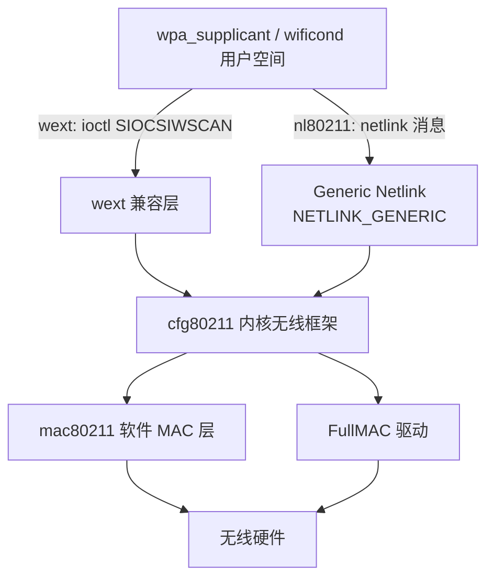

本篇对应原书 3.4 节「Linux Wi-Fi 编程 API 介绍」，是 802.11 基础理论通往 wpa_supplicant 源码的桥梁。本篇主线一句话：**Linux 用户空间操控无线网卡的两套 API——老的 wext 走 ioctl，新的 nl80211 走 netlink（配合内核侧的 cfg80211）——二者都紧紧围绕 802.11 MAC 层的 service 来设计数据结构，wpa_supplicant 的 driver 层就是对它们的封装。**

> 版本注意：原书本节基于 Android 4.2（wext 版本 20、libnl_2）。现代内核已废弃 wext，Android 9.0 起 Wi-Fi 扫描等由 wificond 直接使用 nl80211 完成，wpa_supplicant 的 nl80211 driver 也仍在使用——netlink / libnl / nl80211 的编程模型从 4.x 至今未变，本篇内容依然是现行代码的基础。

> 摘编声明：文中代码摘自原书对 wpa_supplicant（external/wpa_supplicant_8）与内核头文件的摘编，保留主干与中文注释。

## 1.1 为什么 Wi-Fi 需要用户空间编程

目前的无线网卡分两类：

- **SoftMAC**：MLME 的处理基本在软件层（驱动或用户空间）完成，灵活性大，认证相关操作可由软件控制；
- **FullMAC**：MLME 全部在硬件中处理，灵活性小。

市面上 SoftMAC 网卡占绝大多数，**cfg80211 只支持 SoftMAC 类型的网卡**。MLME 在软件层、Supplicant（如 wpa_supplicant）又在用户空间，所以需要一套用户空间与内核无线驱动交互的编程接口。

## 1.2 两套 API 总览

| API | 层次 | 通道 | 状态 |
| --- | --- | --- | --- |
| wext（Linux Wireless Extensions） | 用户空间 | ioctl | 1997 年由 HP 员工 Jean Tourrilhes 开发，现已废弃 |
| cfg80211 | 内核驱动开发 | —— | 现行驱动框架（配合 mac80211） |
| nl80211 | 用户空间 | netlink | cfg80211 对用户空间的出口，现行标准 |

ioctl 不符合 Linux 驱动开发要求的原因：`int ioctl(int fd, unsigned long cmd, ...)` 支持可变个数的参数，且参数类型无法通过函数原型说明——对一个严谨的系统调用来说不可接受。nl80211 用基于 socket 的 netlink 机制取代了它。



## 1.3 wext：基于 ioctl 的老 API

wext 的 API 定义在 wireless.h（Android 中内核版本位于 external/kernel-headers/original/linux，bionic 下另有一份由工具自动生成、注释较少的副本供用户空间使用）。wext 的命名惯例：几乎所有数据结构、类型、宏的名字中都带 `iw`（如 iwreq 对应普通的 ifreq），表示 wireless。

### 常用数据结构

所有用户空间请求统一封装在 iwreq 中，具体参数存于联合体 iwreq_data（最大 16 字节）：

```c
// wireless.h：struct iwreq，专门用于向 socket 句柄传递 ioctl 控制参数
struct iwreq {
    union {
        char  ifrn_name[IFNAMSIZ];   // 指定要操作的网卡设备名，如 wlan0
    } ifr_ifrn;
    union iwreq_data u;              // 存储具体的参数信息
};

// wireless.h：union iwreq_data，联合体，最大 size 为 16 字节
union iwreq_data {
    char              name[IFNAMSIZ];
    struct iw_point   essid;      // 存储 essid，也就是 ssid
    struct iw_param  nwid;        // network id
    struct iw_freq   freq;        // 频率或信道：取值 0~1000 代表 channel，大于 1000 代表频率（Hz）
    struct iw_param  sens;        // 信号强度阈值
    struct iw_param  bitrate;     // 码率
    struct iw_param  rts;         // RTS 阈值
    __u32            mode;        // 操作模式
    struct iw_point  encoding;
    struct iw_quality qual;
    struct sockaddr  ap_addr;     // AP 地址
    struct sockaddr  addr;        // 目标地址
    struct iw_param  param;       // 其他参数
    struct iw_point  data;        // 其他字节数超过 16 的参数
};
```

三个小结构体的分工：**iw_param** 存不超过 16 字节的标量参数；**iw_point** 在参数超过 16 字节时指向另一块内存区域（指针方式）；**iw_freq** 存频率或信道：

```c
// wireless.h：struct iw_freq
struct iw_freq {
    __s32 m;     // 频率小于 1e9 时 m 直接等于频率；否则 m = f / (10^e)
    __s16 e;
    __u8  i;     // 该频率对象在 channel_list 数组中的索引
    __u8  flags; // 固定或自动
};
```

超过 16 字节的功能性参数用专门结构，如触发扫描的 iw_scan_req：

```c
// wireless.h：struct iw_scan_req
struct iw_scan_req {
    __u8 scan_type;      // IW_SCAN_TYPE_ACTIVE / PASSIVE，对应主动/被动扫描
    __u8 essid_len;
    __u8 num_channels;   // 信道个数，0 表示扫描所有允许的信道
    __u8 flags;
    struct sockaddr bssid;               // 全 FF 为广播 BSSID，即 wildcard bssid
    __u8 essid[IW_ESSID_MAX_SIZE];
    __u32 min_channel_time;  // 每信道等待第一个回复的时间；等到回复后最长等 max_channel_time
    __u32 max_channel_time;  // 单位 TU（Time Unit），1 TU = 1024 微秒
    struct iw_freq channel_list[IW_MAX_FREQUENCIES];   // IW_MAX_FREQUENCIES 为 32
};
```

对照 802.11 基础篇的 MLME-SCAN.request 原语（BSSType、SSID、ScanType、ChannelList、MinChannelTime/MaxChannelTime）可见，**wext 的字段与规范原语的参数一一对应**——编程只是规范的某种实现。

### wext 使用实例：触发扫描

```c
// driver_wext.c：wpa_driver_wext_scan（节选）
int wpa_driver_wext_scan(void *priv, struct wpa_driver_scan_params *params)
{
    struct wpa_driver_wext_data *drv = priv;
    struct iwreq iwr;           // 定义一个 iwreq 对象
    struct iw_scan_req req;
    const u8 *ssid = params->ssids[0].ssid;
    size_t ssid_len = params->ssids[0].ssid_len;
    ......
    os_memset(&iwr, 0, sizeof(iwr));
    os_strlcpy(iwr.ifr_name, drv->ifname, IFNAMSIZ);  // 填网卡设备名
    if (ssid && ssid_len) {
        os_memset(&req, 0, sizeof(req));
        req.essid_len = ssid_len;
        req.bssid.sa_family = ARPHRD_ETHER;
        os_memset(req.bssid.sa_data, 0xff, ETH_ALEN);  // 全 FF：wildcard BSSID
        os_memcpy(req.essid, ssid, ssid_len);
        iwr.u.data.pointer = (caddr_t) &req;           // data 域指向 iw_scan_req
        iwr.u.data.length = sizeof(req);
        iwr.u.data.flags = IW_SCAN_THIS_ESSID;         // 只扫描指定 ESSID
    }
    // ioctl_sock 由 socket(PF_INET, SOCK_DGRAM, 0) 创建
    // SIOCSIWSCAN 用于通知驱动进行无线网络扫描
    if (ioctl(drv->ioctl_sock, SIOCSIWSCAN, &iwr) < 0) {
        // 返回错误
    }
    return ret;
}
```

## 1.4 netlink 基础

nl80211 使用 netlink 通信。netlink 是 Linux 上一种基于 socket 的 IPC 机制，支持用户空间进程与内核通信、用户空间进程间通信，最常用的是前者。它要解决两个问题：**寻址**（如何定位通信对象）与**数据格式**（双方传递的消息长什么样）。

### socket 创建与寻址

```c
int socket(int domain, int type, int protocol);
// netlink 编程时：domain = AF_NETLINK；type 用 SOCK_DGRAM 或 SOCK_RAW（内核不区分，
// 因为 netlink 是基于消息的 IPC）；protocol 选择内核子系统，如 NETLINK_ROUTE（路由）、
// NETLINK_NETFILTER、NETLINK_KOBJECT_UEVENT（uevent）；nl80211 走 NETLINK_GENERIC
```

通信对端地址由 sockaddr_nl 唯一标示，通过 bind 与 socket 绑定：

```c
struct sockaddr_nl {
    sa_family_t nl_family;  // 必须为 AF_NETLINK
    unsigned short nl_pad;  // 暂时无用，必须为 0
    __u32 nl_pid;           // 标示一个 netlink socket（进程内唯一即可）；为 0 表示目标是内核
    __u32 nl_groups;        // 多播组位掩码，每个 netlink 协议最多 32 个组；0 表示只处理单播
};

// 典型用法（订阅链路与地址变化多播组）：
struct sockaddr_nl sa;
memset(&sa, 0, sizeof(sa));
sa.nl_family = AF_NETLINK;
sa.nl_groups = RTMGRP_LINK | RTMGRP_IPV4_IFADDR;   // 组定义见 rtnetlink.h
fd = socket(AF_NETLINK, SOCK_RAW, NETLINK_ROUTE);
bind(fd, (struct sockaddr *) &sa, sizeof(sa));
```

### 消息头与消息类型

所有 netlink 消息都带一个消息头：

```c
struct nlmsghdr {
    __u32 nlmsg_len;    // 整个消息的长度，包括消息头
    __u16 nlmsg_type;   // 消息类型
    __u16 nlmsg_flags;  // 附加标志
    __u32 nlmsg_seq;    // 消息序列号
    __u32 nlmsg_pid;    // 发送方的 nl_pid，为 0 表示来自内核
};
```

从 C/S 角度看消息分三类（比按 type 区分更好理解）：

- **Request**：客户端向服务端发起的请求，必须置 NLM_F_REQUEST 标志，并给 nlmsg_seq 一个唯一值以区分不同请求；
- **Response**：服务端对请求的回应，消息类型为 NLMSG_ERROR（成功也用它，只是携带的 nlmsgerr.error 为 0）。nlmsgerr 只带回对应请求的消息头，客户端靠 nlmsg_seq 匹配请求：

```c
struct nlmsgerr {
    int error;               // 负值为错误码，0 表示请求处理成功
    struct nlmsghdr msg;     // 对应请求消息的消息头
};
```

- **Notification**：服务端主动通知，不对应任何请求，nlmsg_seq 一般为 0。

常用标志位：**NLM_F_REQUEST**（请求消息）、**NLM_F_MULTI**（多分片消息中的一个）、**NLM_F_ACK**（强制服务端处理完后回复 ACK）。内核单条消息最大长度约为一页（4KB），超长信息须分片发送：除最后一片外都置 NLM_F_MULTI，最后一片的 nlmsg_type 为 NLMSG_DONE。

### 消息处理宏

解析接收缓冲区（可能含多条消息）时用 netlink 提供的宏：

```c
NLMSG_ALIGN(len)     // len 按 4 字节补齐后的长度
NLMSG_LENGTH(len)    // 整个消息包长度（消息头 + 数据 len），用于填 nlmsg_len
NLMSG_SPACE(len)     // 按 4 字节对齐后的整个消息包长度
NLMSG_DATA(nlh)      // 消息中数据的起始地址
NLMSG_NEXT(nlh, len) // 取下一条分片消息（内部会修改 len）
NLMSG_OK(nlh, len)   // 判断数据是否包含一个完整的 netlink 消息
NLMSG_PAYLOAD(nlh, len) // 数据的真实长度（创建时按 4 字节补齐过，不能直接用 nlmsg_len 判断）
```

典型解析循环：

```c
// 基于 man 7 netlink 手册
for (nh = (struct nlmsghdr *) buf; NLMSG_OK(nh, len);
     nh = NLMSG_NEXT(nh, len)) {
    if (nh->nlmsg_type == NLMSG_DONE)
        return;                          // 分片消息结束
    if (nh->nlmsg_type == NLMSG_ERROR) {
        struct nlmsgerr *pError = (struct nlmsgerr *) NLMSG_DATA(nh);
        ......                           // 错误或 ACK 处理
    }
    void *data = NLMSG_DATA(nh);         // 数据起始地址
    ......
}
```

### nlattr：以属性描述载荷

netlink 还定义了 nlattr 结构，规范载荷（Payload）以属性（attribute）方式描述自己：

```c
struct nlattr {
    __u16 nla_len;   // 属性长度
    __u16 nla_type;  // 属性类型
};
```

属性支持嵌套——属性携带的数据可以是另一组属性。nl80211 的参数就全部以 nlattr 方式传递。

## 1.5 libnl：netlink 编程库

netlink 文档少、各 protocol 还有自己的数据结构，直接编程难度大。libnl 开源库（[infradead.org/~tgr/libnl](https://www.infradead.org/~tgr/libnl/)）以面向对象方式封装了它，其上再分三个库：

| 库 | 交互对象 |
| --- | --- |
| libnl（核心） | netlink 基础 |
| libnl-route | 内核 Routing 子系统 |
| libnl-nf | 内核 Netfilter 子系统 |
| libnl-genl | 内核 Generic Netlink 模块 |

Android 在 system/core/libnl_2 移植并精简了 libnl 与 libnl-genl 的部分内容（2 表示 libnl 版本号，上游最新为 3）。

### nl_sock 与回调

```c
#include <netlink/socket.h>
struct nl_sock *nl_socket_alloc(void);          // 分配 nl_sock
void nl_socket_free(struct nl_sock *sk);
int nl_connect(struct nl_sock *sk, int protocol);
// nl_connect 内部通过 bind 将 socket 和 protocol 对应的内核模块绑定

// 为 socket 上收到的消息设置回调（封装在 struct nl_cb 中）
void nl_socket_set_cb(struct nl_sock *sk, struct nl_cb *cb);
struct nl_cb *nl_socket_get_cb(const struct nl_sock *sk);
```

更精细的控制用 modify_cb：type 可取 NL_CB_ACK、NL_CB_SEQ_CHECK、NL_CB_INVALID 等，分别处理不同底层消息情况；kind 取 NL_CB_CUSTOM（用户回调）或 NL_CB_DEFAULT。回调返回值：NL_OK（正常）、NL_SKIP（跳过当前消息去分析缓冲区中下一条，用于分片）、NL_STOP（停止本次缓冲区分析）。错误消息（nlmsgerr）有专门的设置接口 nl_cb_err。

### 消息构造与收发

```c
struct nl_msg *nlmsg_alloc(void);               // 分配 libnl 消息对象
void nlmsg_free(struct nl_msg *msg);
struct nlmsghdr *nlmsg_put(struct nl_msg *msg, uint32_t port, uint32_t seqnr,
                           int nlmsg_type, int payload, int nlmsg_flags);
// nlmsg_put 用于填充消息头

int nl_sendto(struct nl_sock *sk, void *buf, size_t size);   // 直接发送 netlink 消息
int nl_send(struct nl_sock *sk, struct nl_msg *msg);         // 发送 nl_msg 消息
int nl_recv(struct nl_sock *sk, struct sockaddr_nl *nla,
            unsigned char **buf, struct ucred **creds);      // 核心接收函数
int nl_recvmsgs(struct nl_sock *sk, struct nl_cb *cb);
// nl_recvmsgs 内部通过 nl_recv 接收，再经 cb 中的回调函数传给接收者
```

## 1.6 libnl-genl：Generic Netlink

genl（Generic Netlink）为「协议号不够用」而设计：netlink 的 protocol 编号有限，genl 只占用一个 NETLINK_GENERIC，在此之上用 **family** 机制复用出任意多个逻辑协议。一条 genl 消息在 nlmsghdr 之后再加一个 genlmsghdr：

```c
struct genlmsghdr {
    __u8 cmd;        // 命令，如 NL80211_CMD_TRIGGER_SCAN
    __u8 version;
    __u16 reserved;
};
```

内核创建了一个虚拟的 Generic Netlink Bus，所有 genl 使用者（内核模块或用户进程）注册时都填充一个 **genl_family** 结构作为身份标示。family 是整型、可读性差，使用者往往另指定字符串 family name；name 与编号的对应关系由 Controller 模块（family name 为 `nlctrl`，固定编号）维护——它为其他注册者动态分配 family 编号，也支持查询当前注册的所有 genl 模块。

```c
int genl_connect(struct nl_sock *sk);   // 类似 nl_connect，protocol 为 NETLINK_GENERIC
void *genlmsg_put(struct nl_msg *msg, uint32_t port, uint32_t seq,
                  int family, int hdrlen, int flags, uint8_t cmd, uint8_t version);
// genlmsg_put 一次填充 nlmsghdr + genlmsghdr + 用户自定义消息头，family 必须正确
struct nlattr *genlmsg_attrdata(const struct genlmsghdr *gnlh, int hdrlen);
// 获取 genl 消息中携带的 nlattr 内容

// family name → 编号（内部向 Controller 发查询消息）：
int genl_ctrl_resolve(struct nl_sock *sk, const char *name);
// 为避免每次查询，libnl-genl 支持缓存：
int genl_ctrl_alloc_cache(struct nl_sock *sk, struct nl_cache **result);
struct genl_family *genl_ctrl_search_by_name(struct nl_cache *cache, const char *name);
```

## 1.7 nl80211 实例：触发扫描

nl80211 的本质：通过 genl（family 名为 `nl80211`）向内核 cfg80211 发送消息，命令与参数由 nl80211_copy.h 定义——命令枚举（NL80211_CMD_GET_WIPHY、NL80211_CMD_TRIGGER_SCAN 等，4.x 时约 94 条）与属性枚举（NL80211_ATTR_IFINDEX、NL80211_ATTR_SCAN_SSIDS 等，约 155 条），头文件中注释非常详细。

wpa_supplicant 中触发扫描的两个函数：

```c
// driver_nl80211.c：wpa_driver_nl80211_scan（节选）
static int wpa_driver_nl80211_scan(void *priv,
           struct wpa_driver_scan_params *params)
{
    struct i802_bss *bss = priv;
    struct wpa_driver_nl80211_data *drv = bss->drv;
    struct nl_msg *msg, *rates = NULL;
    // 创建 nl80211 消息，NL80211_CMD_TRIGGER_SCAN 是触发扫描的命令
    msg = nl80211_scan_common(drv, NL80211_CMD_TRIGGER_SCAN, params);
    ......  // P2P 处理
    ret = send_and_recv_msgs(drv, msg, NULL, NULL);   // 发送 netlink 消息
    ......
    return ret;
}

// driver_nl80211.c：nl80211_scan_common，构造扫描消息（节选）
static struct nl_msg * nl80211_scan_common
            (struct wpa_driver_nl80211_data *drv, u8 cmd,
             struct wpa_driver_scan_params *params)
{
    struct nl_msg *msg;
    msg = nlmsg_alloc();                 // 分配 nl_msg 对象
    // nl80211_cmd 内部即：genlmsg_put(msg, 0, 0, drv->global->nl80211_id, 0, flags, cmd, 0)
    // nl80211_id 就是 genl_ctrl_resolve 解析出的 nl80211 family 编号
    nl80211_cmd(drv, msg, 0, cmd);
    // nl80211 消息的参数通过 nlattr 存储，NL80211_ATTR_IFINDEX 指定网络设备编号
    nla_put_u32(msg, NL80211_ATTR_IFINDEX, drv->ifindex);
    if (params->num_ssids) {
        struct nl_msg *ssids = nlmsg_alloc();
        for (i = 0; i < params->num_ssids; i++) {
            nla_put(ssids, i + 1, params->ssids[i].ssid_len, params->ssids[i].ssid);
        }
        // netlink 支持消息嵌套：属性中携带的数据可以是另外一个 nl_msg
        err = nla_put_nested(msg, NL80211_ATTR_SCAN_SSIDS, ssids);
        nlmsg_free(ssids);
    }
    return msg;
}
```

与 1.3 节的 wext 实例对照：同一件事（触发扫描），wext 是「构造 iwreq → ioctl(SIOCSIWSCAN)」，nl80211 是「nlmsg_alloc → genlmsg_put 填 family/cmd → nla_put 填属性 → send」。**从 Wi-Fi 角度看二者没有本质区别——都紧紧围绕 MAC 层 service 设计数据结构**，只是传输通道从 ioctl 换成了 netlink。

## 1.8 Android 中的现状

- **wpa_supplicant 的 driver 层**：`external/wpa_supplicant_8` 的 driver_nl80211.c 至今仍是 nl80211 的主要使用者之一（关联、密钥安装、企业认证等）；扫描在现代版本部分让渡给 wificond；
- **wificond（Android 9.0 起）**：system/connectivity/wificond 直接通过 libnl + nl80211 与 cfg80211 交互，接管扫描结果上报、信号统计等，替代了 4.x 时代「Framework → WPAS → wext」的链路；
- **HAL**：Wi-Fi 芯片厂商驱动对接 cfg80211/mac80211，用户空间统一只见 nl80211；
- 头文件参考：nl80211 命令与属性的权威定义在内核 include/uapi/linux/nl80211.h（AOSP 中 wpa_supplicant 自带副本 nl80211_copy.h）。

## 1.9 参考来源

- 《深入理解Android：Wi-Fi、NFC和GPS卷》邓凡平著，机械工业出版社，3.4 节；
- man 7 netlink、man 3 libnl；
- libnl 官方文档：[infradead.org/~tgr/libnl/doc/core.html](https://www.infradead.org/~tgr/libnl/doc/core.html)；
- 内核文档 Documentation/userspace-api/netlink（nl80211 相关）与 include/uapi/linux/nl80211.h。
