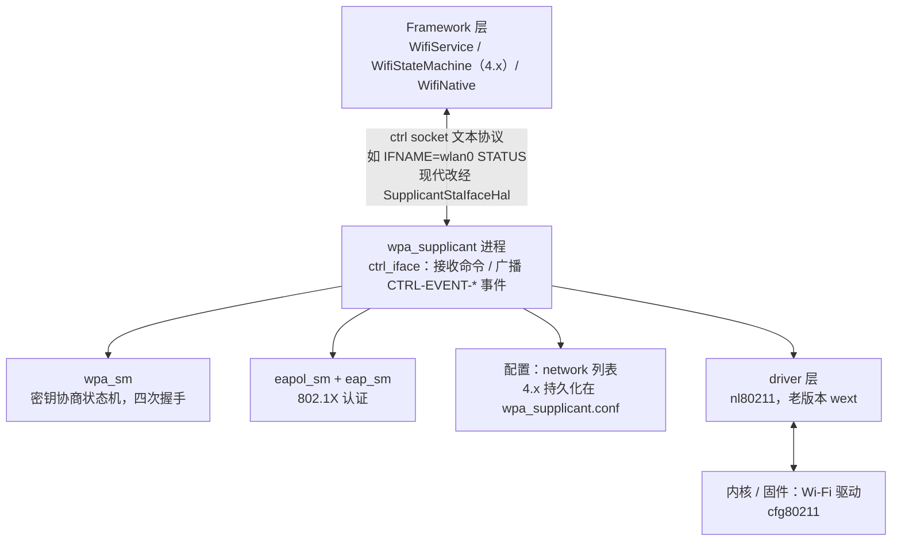
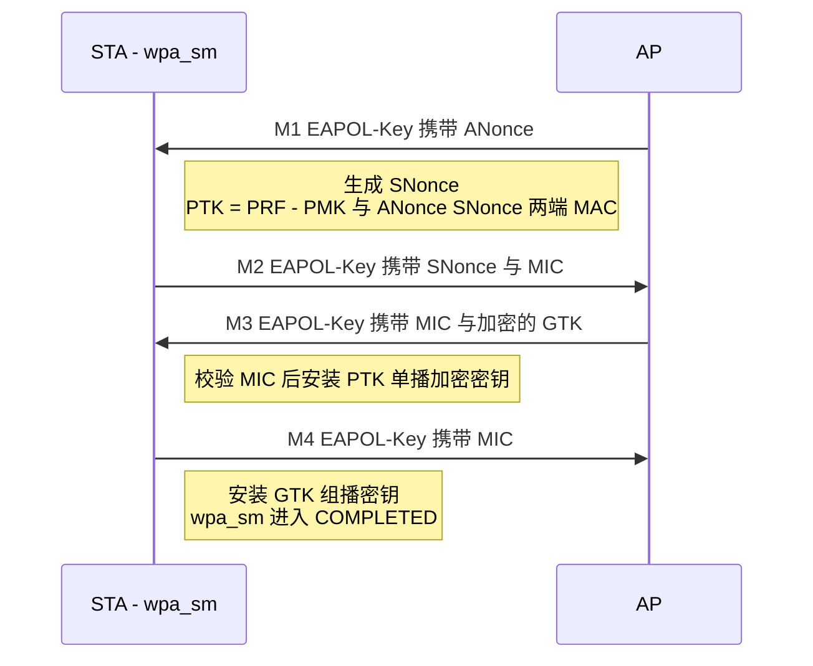

本篇对应原书第 4 章「深入理解 wpa_supplicant」。wpa_supplicant（下称 WPAS）是开源的 WPA/802.1X Supplicant（Wi-Fi 客户端侧认证组件），上游是 w1.fi 的 hostap 项目，Android 使用其 AOSP 分支 `external/wpa_supplicant_8`。本篇主线一句话：**WPAS 是单线程事件驱动（eloop）的协议引擎——Framework 经 ctrl 接口下发配置与命令，它经 nl80211 驱动网卡完成扫描、关联，由 wpa_sm 完成四次握手、eapol_sm/eap_sm 完成 802.1X 企业认证。** 下文按「初始化 → 事件循环 → 控制接口 → 连接命令三连 → 扫描 → 关联与四次握手 → EAP/EAPOL 模块」推进。

> 版本注意：原书基于 Android 4.x（WPAS 2.x 形态）。现代 AOSP 中 supplicant 的协议引擎（eloop、ctrl 命令、wpa_sm、eapol_sm）仍延续本篇结构，变化在外围：8.0 起 HAL 化（HIDL，11 起改 AIDL）、9.0 起扫描让渡给 wificond、配置改由 Framework 的 WifiConfigStore 管理，详见文末演进小节。

> 摘编声明：文中代码为原书对 WPAS 源码的摘编——保留主干、省略日志与无关分支，类名、函数名忠于原文。

## 1.1 概述

WPAS 负责 STA 侧几乎所有「协议」工作：

- **扫描与选择**：触发扫描、缓存结果、按配置挑选目标 AP（4.x 时代也负责扫描下发）；
- **关联**：发起认证（Authentication）与关联（Association）；
- **密钥协商**：WPA/WPA2 的四次握手（PTK/GTK）、组密钥更新、WPA3-SAE；
- **企业认证**：802.1X / EAP（TLS、PEAP、TTLS 等，由 eapol_sm 与 eap_sm 承担）；
- **P2P**（Wi-Fi Direct）与**网络配置管理**。

与其他组件的关系：



4.x 的启动方式（init.rc）：

```text
service wpa /system/bin/wpa_supplicant \
    -iwlan0 -Dwext -c /data/misc/wifi/wpa_supplicant.conf
```

每个接口（wlan0、p2p0）在 WPAS 内对应一个 `struct wpa_supplicant` 实例，各有一套状态与 ctrl socket。

## 1.2 启动与初始化：main.c

```c
// external/wpa_supplicant_8/wpa_supplicant/main.c（节选）
int main(int argc, char *argv[])
{
    // 解析启动参数：-i 接口名 -c 配置文件 -dd 调试等级等
    for (;;) { ... }

    global = wpa_supplicant_init(&params);                 // ① 全局初始化（eloop 等）
    for (i = 0; i < iface_count; i++) {
        if (wpa_supplicant_add_iface(global, ifaces[i]) == NULL)  // ② 添加 wlan0/p2p0
            return -1;
    }
    wpa_supplicant_run(global);                            // ③ 进入事件循环（不返回）
}
```

`wpa_supplicant_add_iface` 最终调用 `wpa_supplicant_init_iface` 完成单个接口的初始化：

```c
// wpa_supplicant.c（节选）
static int wpa_supplicant_init_iface(struct wpa_supplicant *wpa_s, struct wpa_interface *iface)
{
    wpa_supplicant_set_driver(wpa_s, iface->driver);      // 选择驱动封装（nl80211）
    wpa_s->conf = wpa_config_read(wpa_s->confname);       // 读取配置文件（含 network 列表）
    wpa_s->drv_priv = wpa_drv_init(wpa_s, wpa_s->ifname); // 驱动初始化：与内核 cfg80211 交互的入口
    wpa_supplicant_init_eapol(wpa_s);                     // 初始化 EAPOL/EAP 模块（见 1.8/1.9 节）
    ...
    wpa_supplicant_ctrl_iface_init(wpa_s);                // 创建该接口的 ctrl socket
    return 0;
}
```

## 1.3 事件循环：eloop

WPAS 是单线程事件驱动模型，所有工作都发生在 eloop 循环里，事件源三类：**定时器、socket（可读/可写）、信号**：

```c
// eloop.c（select 版，节选；新版本换 epoll，结构不变）
void eloop_run(void)
{
    while (!eloop.terminate) {
        res = select(max_sock + 1, &rfds, &wfds, NULL, _tv);  // ① 阻塞等待任一事件源就绪
        eloop_process_timeouts();                             // ② 到期定时器回调（如扫描调度）
        // ③ 遍历读表，回调就绪 socket 的处理函数
        //    （ctrl 命令、驱动事件 nl80211、EAPOL 帧等都从这里进来）
        for (i = 0; i < table_count && res > 0; i++) {
            if (FD_ISSET(table[i].sock, &rfds)) {
                table[i].handler(table[i].sock, ...);
                res--;
            }
        }
    }
}
```

注册接口形如 `eloop_register_read_sock(fd, handler, ...)`、`eloop_register_timeout(sec, usec, handler, ...)`。理解「所有流程都是某个事件的回调」是读 WPAS 代码的关键。

## 1.4 控制接口：命令与事件

Framework（WifiNative）与 WPAS 之间通过 Unix domain socket 文本协议交互，命令风格类似 wpa_cli：

| 命令 | 作用 |
| --- | --- | 
| `STATUS` | 查询状态：wpa_state、bssid、ssid、key_mgmt 等 |
| `SCAN` / `SCAN_RESULTS` | 触发扫描 / 获取扫描结果 |
| `LIST_NETWORKS`、`ADD_NETWORK`、`SET_NETWORK` | 网络配置（id、ssid、psk、key_mgmt 等字段） |
| `ENABLE_NETWORK` / `DISABLE_NETWORK` / `REMOVE_NETWORK` | 启用/禁用/删除一个配置网络 |
| `SAVE_CONFIG` | 把 network 列表写回 wpa_supplicant.conf（4.x） |
| `REASSOCIATE` / `RECONNECT` | 重关联 |

```c
// ctrl_iface_unix.c（节选）
static void wpa_supplicant_ctrl_iface_receive(int sock, void *eloop_ctx, void *sock_ctx)
{
    char buf[4096], reply[4096];
    ...  // recvfrom 拿到一行命令文本，如 "IFNAME=wlan0 STATUS"
    reply_len = wpa_supplicant_ctrl_iface_process(wpa_s, buf, reply, &reply_len);
    sendto(sock, reply, reply_len, 0, ...);   // 原路返回："OK"/"FAIL" 或结果文本
}

// ctrl_iface.c（节选）
char * wpa_supplicant_ctrl_iface_process(struct wpa_supplicant *wpa_s, char *buf, ...)
{
    if (os_strcmp(buf, "STATUS") == 0)
        wpa_supplicant_ctrl_iface_status(wpa_s, buf, reply, &reply_len);
    else if (os_strcmp(buf, "SCAN") == 0)
        wpa_supplicant_ctrl_iface_scan(wpa_s, ...);
    else if (os_strncmp(buf, "SET_NETWORK ", 12) == 0)
        wpa_supplicant_ctrl_iface_set_network(...);
    ...
    else
        reply_len = os_snprintf(reply, ..., "UNKNOWN COMMAND\n");
    return reply;
}
```

**反向的事件通道**：WPAS 用 `wpa_msg()` 把内部状态变化广播到 monitor socket（Framework 常驻监听），常见事件：

- `CTRL-EVENT-SCAN-RESULTS`：扫描完成；
- `CTRL-EVENT-CONNECTED - Connection to xx:xx... completed`：关联且密钥协商完成；
- `CTRL-EVENT-DISCONNECTED`：断开；
- `Trying to associate with ...`、`Associated with ...`：过程日志（Framework 状态机切换的触发源就是这些字符串）。

## 1.5 连接命令三连：ADD_NETWORK → SET_NETWORK → ENABLE_NETWORK

原书用 wpa_cli 演示了加入一个 WPA2-PSK 网络的全过程，三条命令各司其职：

```text
ADD_NETWORK                       # 返回新网络配置项的编号，如 0
SET_NETWORK 0 ssid "Test"         # 设置 ssid
SET_NETWORK 0 key_mgmt WPA-PSK    # 认证方式
SET_NETWORK 0 psk "12345Test"     # 密码
ENABLE_NETWORK 0                  # 触发扫描、关联直到加入网络
```

### ADD_NETWORK：创建配置项

```c
// ctrl_iface.c：wpa_supplicant_ctrl_iface_add_network（节选）
static int wpa_supplicant_ctrl_iface_add_network(struct wpa_supplicant *wpa_s,
               char *buf, size_t buflen)
{
    struct wpa_ssid *ssid;
    // wpa_config_add_network 分配一个 wpa_ssid 对象（无线网络配置项在 WPAS 中的代表）
    // 并保存到链表中。wpa_config 是 wpa_supplicant.conf 在代码中的代表，
    // 所以添加的网络信息会持久化到配置文件，以备下次使用
    ssid = wpa_config_add_network(wpa_s->conf);
    wpas_notify_network_added(wpa_s, ssid);
    ssid->disabled = 1;    // 未启用，需 ENABLE_NETWORK 才会参与连接
    wpa_config_set_network_defaults(ssid);   // 默认 proto/pairwise/group/key_mgmt 等
    ret = os_snprintf(buf, buflen, "%d\n", ssid->id);   // 返回网络编号
    return ret;
}
```

默认配置 `wpa_config_set_network_defaults` 设置 proto（协议版本）、pairwise_cipher / group_cipher（单播/组播加密套件）、key_mgmt（密钥管理方式）的默认值，另有三个 EAPOL 相关变量：`eapol_flags`（动态 WEP Key 的使用范围，仅非 WPA 环境）、`eap_workaround`（对不严格遵守规范的认证服务器是否变通处理，默认 1）、`fragment_size`（EAPOL 消息分片阈值，默认 1398 字节）。

### SET_NETWORK：设置参数并计算 PSK

```c
// ctrl_iface.c：wpa_supplicant_ctrl_iface_set_network（节选）
static int wpa_supplicant_ctrl_iface_set_network(
                       struct wpa_supplicant *wpa_s, char *cmd)
{
    // SET_NETWORK 的参数是 "<network id> <variable name> <value>"
    id = atoi(cmd);                                     // 解析 id / name / value
    ssid = wpa_config_get_network(wpa_s->conf, id);     // 找到对应配置项
    // 设置配置值：三条 SET_NETWORK 处理完后，wpa_ssid 中
    // ssid="Test"、key_mgmt=WPA_KEY_MGMT_PSK、passphrase="12345Test"
    // 注意：命令行设置的 psk="12345Test" 实际保存在 passphrase 变量中
    if (wpa_config_set(ssid, name, value, 0) < 0) {......}
    wpa_sm_pmksa_cache_flush(wpa_s->wpa, ssid);         // 清空对应 PMKSA 缓存
    if ((os_strcmp(name, "psk") == 0 && value[0] == '"' && ssid->ssid_len) ||
        (os_strcmp(name, "ssid") == 0 && ssid->passphrase))
        wpa_config_update_psk(ssid);    // passphrase 与 ssid 齐备则计算 PSK
    return 0;
}
```

用户输入的是 Passphrase（人可读），而 STA 与 AP 交互需要 Key（二进制）。转换由 `wpa_config_update_psk` 完成——**PSK 模式下它就是 PMK 的来源**：

```c
// config.c：wpa_config_update_psk
void wpa_config_update_psk(struct wpa_ssid *ssid)
{
#ifndef CONFIG_NO_PBKDF2
    // 对 passphrase 和 ssid 做 hash 计算，结果作为真正的 Pre-Shared Key
    pbkdf2_sha1(ssid->passphrase, (char *) ssid->ssid, ssid->ssid_len,
                4096, ssid->psk, PMK_LEN);   // 4096 次迭代，输出 32 字节
    ssid->psk_set = 1;
#endif
}
```

对照无线安全篇：`PMK = PBKDF2(HMAC-SHA1, passphrase, ssid, 4096, 32字节)`——正因为 ssid 参与计算，同一个密码在不同 SSID 下得到不同 PMK。

### ENABLE_NETWORK：触发连接

ENABLE_NETWORK 将该配置项置为启用，并触发扫描请求（`wpa_supplicant_req_scan`）或直接重连。后续链路——扫描、选网、关联——正是下两节的内容。

## 1.6 扫描流程（4.x）

```c
// ctrl_iface 的 SCAN 命令最终到（节选）
void wpa_supplicant_scan(void *eloop_ctx, void *timeout_ctx)
{
    struct wpa_driver_scan_params params;
    ...  // 按配置填信道列表、SSID 过滤等
    wpa_supplicant_trigger_scan(wpa_s, &params);   // → wpa_drv_scan() → nl80211 下发
}
```

驱动层扫描完成后，结果以事件回调上来：

```c
// 驱动层扫描完成后，结果以事件回调上来：
void wpa_supplicant_event(void *ctx, enum wpa_event_type event, union wpa_event_data *data)
{
    switch (event) {
    case EVENT_SCAN_RESULTS:
        wpa_supplicant_event_scan_results(wpa_s, data);  // 取回并缓存 BSS 列表
        // 广播 CTRL-EVENT-SCAN-RESULTS，Framework 收到后拉取 SCAN_RESULTS
        break;
    case EVENT_ASSOC:  ...
    }
}
```

扫描结果处理的后续：`wpa_supplicant_event_scan_results` → `_scan_results` → `wpa_supplicant_pick_network`（按配置项与扫描结果挑选目标 BSS）→ `wpa_supplicant_connect`。**WPAS 自己也在 4.x 参与网络选择，但现代版本选择逻辑全在 Framework**（WifiConfigManager 评分），WPAS 只执行关联。

## 1.7 关联与四次握手（WPA2-PSK 为例）

```c
// ENABLE_NETWORK → 挑选 BSS → wpa_supplicant_associate（节选）
static void wpa_supplicant_associate(struct wpa_supplicant *wpa_s, struct wpa_ssid *ssid)
{
    struct wpa_driver_associate_params params;
    ...  // 填 BSSID/SSID、认证与加密套件（PSK/802.1X）、频段等
    wpa_drv_associate(wpa_s, &params);  // 下发关联（Auth/Assoc 帧由驱动/固件完成）
}
```

关联成功后（驱动上报 `NL80211_CMD_CONNECT`，WPAS 收到 `EVENT_ASSOC`），AP 发起密钥协商，WPAS 的 `wpa_sm` 完成四次握手：



- PSK 模式下 PMK 来自 1.5 节的 PBKDF2 计算；四次握手的 MIC 用来互相证明持有 PMK，同时派生出真正的会话密钥 PTK；
- PTK 安装通过驱动的 set_key 接口写入内核/固件，之后数据帧加解密完全在硬件层完成；
- 握手完成后 `wpa_msg()` 广播 `CTRL-EVENT-CONNECTED`，Framework 收到才开始 DHCP（4.x 在 WifiStateMachine 内做，现代由 IpClient 完成）并最终显示「已连接」。

## 1.8 EAP 模块：RFC 4137 与 eap_sm

EAP 模块实现的是 RFC 4137 定义的 **EAP SUPPSM**（EAP Supplicant 状态机）。RFC 4137 将相关模块分三层：

- **LL**（Lower Layer）：接收和发送 EAP 包——在 WPAS 中，LL 层就是 EAPOL 模块（1.9 节），而不是直接操作 socket 的模块；
- **SUPPSM**：中间层，实现 Supplicant 状态机；
- **EAP Method（EM）**：具体认证方法（TLS、PEAP 等）。三层之间通过设置变量或调用函数交互。

### LL 层与 SUPPSM 层的交互变量

1. LL 层收到 EAP 包后存入 `eapReqData` 并置 `eapReq = TRUE`——这是触发 SUPPSM 状态转换的信号；
2. SUPPSM 处理后若有回复，置 `eapResp = TRUE` 并把回复存入 `eapRespData`（LL 层负责发送）；无回复则置 `eapNoResp = TRUE`；
3. 认证结束时置 `eapSuccess` 或 `eapFailure` 告知结果。

两个命名晦涩的变量 `altAccept` / `altReject`：RFC 4137 说其定义在 RFC 3748，后者实际没有——按社区考证，它们更应叫 lowerLayerSuccess / lowerLayerFailure，用于通知 LL 层成功/失败。在 802.11 网络中的对应场景：收到 Disassociate / Deauthenticate 帧表示 lowerLayerFailure；收到四次握手第一个 Message 表示 lowerLayerSuccess。

SUPPSM 与 EM 层的交互变量中，最重要的是 **methodState** 与 **decision**——它们的取值由具体认证方法决定，直接影响 SUPPSM 的状态切换（如认证成功后 decision = SUCCESS 触发进入 SUCCESS 状态）。

### SUPPSM 的状态与实现

RFC 4137 定义了 13 个状态（DISABLED、INITIALIZE、IDLE、RECEIVED、GET_METHOD、METHOD、GENERATE_RESPONSE、SEND_RESPONSE、DISCARD、IDENTITY、NOTIFICATION、RETRANSMIT、SUCCESS/FAILURE 等），状态切换由上述变量驱动。WPAS 的实现较为严格地遵循 RFC 4137：

- `struct eap_sm` 是 SUPPSM 的代表，成员变量命名几乎照搬 RFC；通过 `m` 成员指向 `eap_method` 单向链表，每个节点代表一种已注册的 EAP Method（其 `process` 函数合并了 RFC 中 m.check、m.process、m.buildResp 的功能）；`eapol_cb`（一组回调函数）指向 LL 层（EAPOL 模块）的代表。

WPAS 为众多状态机定义了通用宏（state_machine.h），这是读所有状态机代码的基础：

```c
// 定义一个状态的 EA（Entry Action，进入该状态时执行的函数）
#define SM_STATE(machine, state) \
   static void sm_##machine##_##state##_Enter(STATE_MACHINE_DATA *sm, int global)
// 每个状态进入后执行的一段代码：置 changed、打印日志、设置新状态
#define SM_ENTRY(machine, state) ...
// 调用 SM_STATE 定定的函数（非 UCT）
#define SM_ENTER(machine, state)  sm_##machine##_##state##_Enter(sm, 0)
// 因 UCT（无条件转换）而进入某状态
#define SM_ENTER_GLOBAL(machine, state)  sm_##machine##_##state##_Enter(sm, 1)
// 定义状态机运行函数：检查条件变量，决定要跳转的状态并调用其 SM_ENTER
#define SM_STEP(machine)  static void sm_##machine##_Step(STATE_MACHINE_DATA *sm)
// 运行状态机
#define SM_STEP_RUN(machine)  sm_##machine##_Step(sm)
```

以 DISABLED 状态与 EAP 状态机的 Step 函数为例：

```c
// eap.c（节选）
SM_STATE(EAP, DISABLED)
{
    SM_ENTRY(EAP, DISABLED);
    sm->num_rounds = 0;
}

SM_STEP(EAP)
{
    // UCT：eapRestart 且 portEnabled 都为真 → 进入 INITIALIZE
    if (eapol_get_bool(sm, EAPOL_eapRestart) &&
        eapol_get_bool(sm, EAPOL_portEnabled))
        SM_ENTER_GLOBAL(EAP, INITIALIZE);
    else if (!eapol_get_bool(sm, EAPOL_portEnabled) || sm->force_disabled)
        SM_ENTER_GLOBAL(EAP, DISABLED);
    else if (sm->num_rounds > EAP_MAX_AUTH_ROUNDS) {
        // 某些 EAP 方法出错时消息往来很多，超过 50 次（EAP_MAX_AUTH_ROUNDS）
        // 直接进入 FAILURE 状态
        SM_ENTER_GLOBAL(EAP, FAILURE);
    } else
        eap_peer_sm_step_local(sm);   // 其余情况按当前状态分别处理
}
```

SUPPSM 状态与触发变量太多，光看代码跟踪状态跳转非常困难——**状态图（RFC 4137 Figure 2）比代码直观得多**；同时 `SM_ENTRY` 打印的 `entering state` 日志是分析 WPAS 认证问题时的重要线索。

## 1.9 EAPOL 模块：802.1X 与 eapol_sm

EAPOL 模块的实现参考 IEEE 802.1X-2004（WPAS 基于该版本）。802.1X 为 EAPOL Supplicant 定义了 5 个状态机，统称 PACP（Port Access Control Protocol）状态机：

| 状态机 | 作用 | WPAS 实现 |
| --- | --- | --- |
| Port Timers SM | Port 超时控制（每秒 tick 一次，递减各超时变量） | 用 eloop 定时任务实现（`eapol_port_timers_tick`）而非状态机宏 |
| Supplicant PAE SM | 维护 Port 状态（Unauthorized / Authorized），发送 EAPOL-Start / Logoff | SM_STATE/SM_STEP 实现 |
| Supplicant Backend SM | 向 Authenticator 发送 EAPOL 回复消息 | SM_STATE/SM_STEP 实现 |
| The Key Receiver SM | 处理 EAPOL-Key 帧（rxKey 为 TRUE 时进入 KEY_RECEIVE 并调 processKey） | SM_STATE/SM_STEP 实现 |
| The Supplicant Key Transmit SM | —— | 非必选，WPAS 未实现 |

这些状态机通过**全局变量**联动：一个状态机修改变量后可能引发其他状态机状态变化（例如 Port Timers SM 递减 authWhile 到 0 会触发 Backend SM 重发）。

### 数据结构与初始化

`struct eapol_sm` 存储 PACP 相关内容（三个状态机各自的状态枚举、变量），通过 `eap` 成员指向 EAP 模块的 `eap_sm`；与 WPAS 其他模块的交互接口是 `eapol_ctx` 结构（回调函数集合：发送 EAPOL 帧、认证完成通知、端口状态设置等）：

```c
// wpas_glue.c：wpa_supplicant_init_eapol（节选）
int wpa_supplicant_init_eapol(struct wpa_supplicant *wpa_s)
{
    struct eapol_ctx *ctx;
    ctx = os_zalloc(sizeof(*ctx));
    ctx->ctx = wpa_s;
    ctx->eapol_done_cb = wpa_supplicant_notify_eapol_done;   // 认证完成回调
    ctx->eapol_send = wpa_supplicant_eapol_send;             // EAPOL 帧发送
    ctx->port_cb = wpa_supplicant_port_cb;                   // 端口状态回调
    wpa_s->eapol = eapol_sm_init(ctx);          // 初始化 EAPOL 模块
    return 0;
}

// eapol_supp_sm.c：eapol_sm_init（节选）
struct eapol_sm *eapol_sm_init(struct eapol_ctx *ctx)
{
    struct eapol_sm *sm;
    sm = os_zalloc(sizeof(*sm));
    sm->ctx = ctx;                       // eapol_ctx 是 EAPOL 与其他模块交互的接口
    sm->portControl = Auto;              // 端口控制模式
    sm->heldPeriod = 60;                 // HELD 状态等待时间（秒）
    sm->startPeriod = 30;                // 两次 EAPOL-Start 之间的间隔
    sm->maxStart = 3;                    // EAPOL-Start 最大重发次数
    sm->authPeriod = 30;                 // 认证超时 authWhile 的基准值
    // 初始化 EAP SUPP SM 相关资源（1.8 节）
    sm->eap = eap_peer_sm_init(sm, &eapol_cb, sm->ctx->msg_ctx, &conf);
    // PACP 状态机初始化：先置 initialize=TRUE 跑一次 step（触发各状态 EA 设定部分初值），
    // 再置 FALSE 跑一次（设定剩余初值）
    sm->initialize = TRUE;
    eapol_sm_step(sm);
    sm->initialize = FALSE;
    eapol_sm_step(sm);
    // 用 eloop 超时任务实现 Port Timers SM（每秒一次 tick）
    sm->timer_tick_enabled = 1;
    eloop_register_timeout(1, 0, eapol_port_timers_tick, NULL, sm);
    return sm;
}
```

初始化结束后各状态机落位：SUPP_PAE 为 DISCONNECTED、KEY_RX 为 NO_KEY_RECEIVE、SUPP_BE 为 IDLE、EAP_SM 为 DISABLED。

### 状态机联动：eapol_sm_step

EAPOL 三个状态机加 EAP SUPPSM 共四个，联动的答案在 `eapol_sm_step`：

```c
// eapol_supp_sm.c：eapol_sm_step（节选）
void eapol_sm_step(struct eapol_sm *sm)
{
    int i;
    // 循环运行四个状态机，直到都没有状态切换为止：
    // 每个状态的 EA 可能改变变量从而引起其他状态机变化，所以要循环
    // 100 次上限防止规范定义的状态机联动陷入死循环
    for (i = 0; i < 100; i++) {
        sm->changed = FALSE;
        SM_STEP_RUN(SUPP_PAE);       // PAE 状态机
        SM_STEP_RUN(KEY_RX);         // Key Receiver 状态机
        SM_STEP_RUN(SUPP_BE);        // Backend 状态机
        if (eap_peer_sm_step(sm->eap))   // EAP SUPP SM，返回非零表示状态有变化
            sm->changed = TRUE;
        if (!sm->changed) break;
    }
    if (sm->changed) {   // 超 100 次仍未稳定，注册 0 秒超时任务再跑一轮
        eloop_cancel_timeout(eapol_sm_step_timeout, NULL, sm);
        eloop_register_timeout(0, 0, eapol_sm_step_timeout, NULL, sm);
    }
    if (sm->ctx->cb && sm->cb_status != EAPOL_CB_IN_PROGRESS) {
        int success = sm->cb_status == EAPOL_CB_SUCCESS ? 1 : 0;
        // cb_status 在 PAE AUTHENTICATED 状态被置为 SUCCESS、HELD 状态被置为 FAILURE
        sm->cb_status = EAPOL_CB_IN_PROGRESS;
        sm->ctx->cb(sm, success, sm->ctx->cb_ctx);     // 回调通知 WPAS 认证结果
    }
}
```

**WPAS 其他模块一般只和 EAPOL 模块交互**（eapol_sm 是对外门面），EAP 模块的初始化与运转由 EAPOL 触发。理解了协议状态机与变量，EAPOL/EAP 的代码就能轻松读懂；反之单纯从代码入手会非常难。WPA2-PSK 场景不涉及完整 802.1X 流程（无 RADIUS），但四次握手的 EAPOL-Key 帧仍由 KEY_RX 状态机接收处理。

## 1.10 新版本演进（超出书的范围）

- **HAL 化**：Android 8.0 起 supplicant 提供 **HIDL** 接口（hardware/interfaces/supplicant/1.0~1.2），Framework 经 SupplicantStaIfaceHal 调用；Android 11 起改 **AIDL**（`ISupplicant` / `ISupplicantStaIface` / `ISupplicantNetwork`），文本 ctrl 接口仅在内部保留；
- **wificond 分工（9.0 起）**：扫描、信号统计等由新守护进程 wificond（system/connectivity/wificond，直接走 nl80211）接管，WPAS 更专注于关联、密钥协商与企业认证；
- **配置存储**：4.x 由 WPAS 持久化（wpa_supplicant.conf + SAVE_CONFIG）；6.0 起网络配置统一由 Framework 的 WifiConfigStore（XML）管理，WPAS 内不落盘；
- **安全特性**：WPA3-SAE、OWE（增强开放）、DPP（Easy Connect）、PMF 等（对应 AOSP 中 wpa_supplicant_8 的新版本）；
- 代码位置不变：`external/wpa_supplicant_8`（含持续跟随上游 hostap 更新的 android 分支）。

## 1.11 调试命令

```bash
adb shell ps -A | grep wpa                     # 确认进程（wlan0/p2p0 两个接口在进程中）
adb shell dumpsys wifi | grep -iA5 supplicant  # HAL 状态与版本
# 老版本（或 userdebug 且带 wpa_cli 的镜像）可直接用 ctrl 接口：
adb shell wpa_cli -i wlan0 status
adb shell wpa_cli -i wlan0 scan_results
adb logcat | grep -iE "wpa_supplicant|SupplicantStaIfaceHal|WifiConfigManager"
```

## 1.12 参考来源

- 《深入理解Android：Wi-Fi、NFC和GPS卷》邓凡平著，机械工业出版社（WPAS 初始化、事件循环、工作流程、EAP/EAPOL 模块与四次握手的详细走读）；
- AOSP 源码（官方，无 GitHub 活跃镜像）：<https://android.googlesource.com/platform/external/wpa_supplicant_8/>，在线浏览：[cs.android.com](https://cs.android.com)（可切 android-4.3_r1 对照书中代码）；
- 上游项目：w1.fi hostap（wpa_supplicant 官方）：<https://w1.fi/cgit/hostap/>；
- RFC 4137（EAP Supplicant 状态机）、IEEE 802.1X-2004；
- supplicant HAL 定义：hardware/interfaces/supplicant（HIDL 1.x 与 aidl 目录，可在 cs.android.com 查看）。
