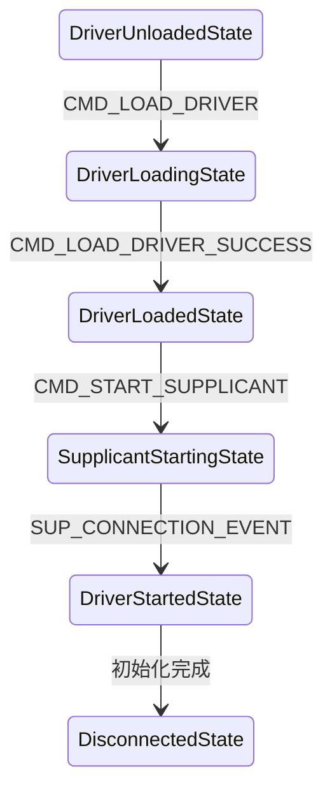
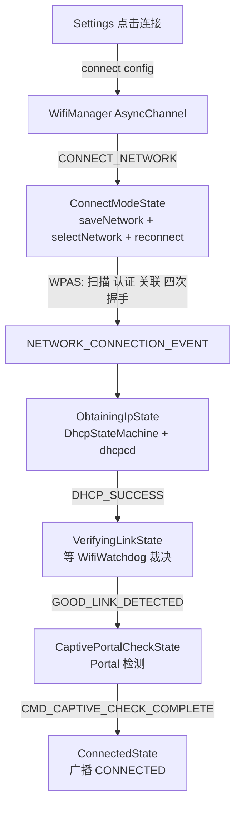

本篇对应原书第 5 章「深入理解 WifiService 和 WifiStateMachine」。WifiService 是 Android Java Framework 中 Wi-Fi 功能的总入口，真正核心虽是 wpa_supplicant（WPAS），但 Framework 侧的状态管理、与 WPAS 的交互、DHCP、网络质量监控都在这里。本篇主线一句话：**WifiService 的骨架是三个 HSM 状态机（WifiStateMachine、SupplicantStateTracker、WifiWatchdogStateMachine）加一路 WifiMonitor 事件线程——Settings 经 WifiManager 的 AsyncChannel 下发命令，WifiStateMachine 用一连串状态切换驱动「加载驱动 → 启动 WPAS → 扫描 → 关联 → DHCP → 链路验证 → Captive Portal 检查 → Connected」全流程。**

> 版本注意：原书基于 Android 4.2。现代 Android（8.0 起）WifiService 已大幅重构：拆出 WifiServiceImpl（binder 门面）与 WifiThreadRunner，WifiStateMachine 按模式拆分为 ClientModeImpl / SoftApManager 等，WPAS 交互改经 HIDL/AIDL HAL，DHCP 由 IpClient/DhcpClient 承担，Captive Portal 检查移交 NetworkMonitor——但「HSM 状态机 + 事件驱动 + 逐阶段推进」的骨架仍适用，详见文末演进备注。

> 摘编声明：文中代码为原书对 Android 4.2 源码的摘编——保留主干、省略日志与无关分支，类名、函数名忠于原书原文。

## 1.1 概述：WifiService 与 WifiManager

WifiService 借助 WPAS 管理和控制 Android 平台的 Wi-Fi 功能。其类图结构：

- **IWifiManager、IWifiManager.Stub、IWifiManager.Stub.Proxy** 均由 IWifiManager.aidl 编译时转换而来；
- **WifiService** 派生自 IWifiManager.Stub，是 Binder 服务端；
- **WifiManager** 是客户端，通过成员变量 mService 与 WifiService 进行 Binder 交互。

本篇沿两条路线展开：路线一，WifiService 的创建及初始化；路线二，在 Settings 中打开 Wi-Fi、扫描并加入目标网络——最后再看 WifiWatchdogStateMachine 与 Captive Portal Check 两个专题。

## 1.2 HSM 与 AsyncChannel

WifiService 相关模块大量使用两个基础设施，先掌握它们的用法。

### HSM（StateMachine）

HSM（Hierarchical State Machine，层次状态机）对应的类是 StateMachine，状态由 State 类表达：

```java
// 此例来源于 StateMachine.java 文件中的注释
class StateMachineTest extends StateMachine {
    StateMachineTest(String name) {
        super(name);
        addState(mP0);              // 添加状态，缩进表达层级关系
        addState(mS0, mP0);         // 添加状态 mS0，其父状态为 mP0
        addState(mP1, mP0);
        addState(mS1, mP1);
        addState(mS5, mS1);
        addState(mS2, mP1);
        addState(mS3, mS2);
        addState(mS4, mS2);
        setInitialState(mS5);       // 初始状态是 mS5
    }

    class P0 extends State {
        public void enter() {......}       // EA：Entry Action，进入状态时调用
        public void exit() {......}        // EXA：Exit Action，退出状态时调用
        public boolean processMessage(Message message) {
            // 外界与 HSM 交互的方式就是 sendMessage，Message 由当前 State 的
            // processMessage 处理：成功返回 HANDLED；返回 NOT_HANDLED 则交给父状态
            // 处理；当前状态及祖先都不能处理时，调用 unhandledMessage
            return HANDLED;
        }
    }

    class S5 extends State {
        public boolean processMessage(Message message) {
            switch (message.what) {
            case TRANSITION_CMD:
                transitionTo(mS4);          // 切换状态须调用此函数
                break;
            case TRANSITION_CMD_DEFER_MSG:
                deferMessage(message);      // 保留消息，留待下一个状态首先处理
                transitionTo(mS1);
                break;
            }
            return HANDLED;
        }
    }
    ......
}
// 主函数：外界只能通过 obtainMessage + sendMessage 与 HSM 交互
smTest.start();    // 启动状态机
smTest.sendMessage(smTest.obtainMessage(TRANSITION_CMD));
```

重要 API：**addState**（添加状态并可指定父状态）、**transitionTo**（切换状态）、**deferMessage**（把消息存入队列，切换到新状态后移到消息队列头部让新状态首先处理）、**quit / quitNow**（发 SM_QUIT_CMD，前者排在消息队列尾、后者插在队头）。

层级关系体现在三方面：

- **EA 按继承链执行**：启动后初始状态的祖先 EA 先执行、子孙后执行。以初始状态 mS5 为例，start 完毕后 EA 顺序为 mP0、mP1、mS1、mS5；
- **切换时先 EXA 后 EA，止于最近公共祖先（不含）**：mS5 切换到 mS4 时，先执行 EXA（顺序 mS5、mS1——终点是两者最近公共祖先 mP1 但它不执行），再执行 EA（顺序 mS2、mS4）。类比 C++：EA 顺序像构造函数（祖先到子孙），EXA 顺序像析构函数（子孙到祖先）；
- **消息处理逐级上浮**：子状态返回 NOT_HANDLED 则交给父状态，类似 C++ 派生类的函数覆盖。

### AsyncChannel

AsyncChannel 用于两个 Handler 之间的通信：源 Handler 用 sendMessage 向目标发送消息，目标用 replyToMessage 回复。两个 Handler 可在同进程也可跨进程。两种应用模式：

- **request/response**：Server 不维护 Client 信息，只处理请求；
- **Server 维护 Client 信息**：Server 可主动向 Client 推送状态——类似 wpa_cli 与 WPAS 的关系。WifiService 相关模块多用这种模式。

异步方式建立连接的步骤（AsyncChannel.java 注释）：Client 调 connect → Client 收到 CMD_CHANNEL_HALF_CONNECTED → Client 发 CMD_CHANNEL_FULL_CONNECTION 给 Server → Server 处理后发 CMD_CHANNEL_FULLY_CONNECTED → 连接建立，双方用 sendMessage / replyToMessage 通信；任一端 disconnect 后双方收到 CMD_CHANNEL_DISCONNECTED。

**一个注释与实现不符的细节**：AsyncChannel 对象由客户端创建，但它无法通过 Binder 跨进程传递，所以 Server 端拿不到客户端的那个 AsyncChannel。实际做法（以 WifiManager 与 WifiService 为例）是 Server 自己再新建一个 AsyncChannel 反向 connect 到客户端，两端各持一个对象：

```java
// WifiManager.java：init（节选）
private void init() {
    // 经 Binder 调用 WifiService 的 getWifiServiceMessenger，返回 Messenger
    // （Messenger 从 Parcelable 派生，内部有 IMessenger 对象支持跨进程 Binder 通信）
    mWifiServiceMessenger = getWifiServiceMessenger();
    sHandlerThread = new HandlerThread("WifiManager");
    sHandlerThread.start();
    mHandler = new ServiceHandler(sHandlerThread.getLooper());   // Client 端 Handler
    // connect 原型：connect(Context srcContext, Handler srcHandler, Messenger dstMessenger)
    // dstMessenger 是 Server 端 Handler 在 Client 端的代表
    mAsyncChannel.connect(mContext, mHandler, mWifiServiceMessenger);
}

// WifiManager.java：ServiceHandler（节选）
case AsyncChannel.CMD_CHANNEL_HALF_CONNECTED:      // 半连接成功
    if (message.arg1 == AsyncChannel.STATUS_SUCCESSFUL)
        mAsyncChannel.sendMessage(AsyncChannel.CMD_CHANNEL_FULL_CONNECTION);
    break;
case AsyncChannel.CMD_CHANNEL_FULLY_CONNECTED: break;   // 连接成功
case AsyncChannel.CMD_CHANNEL_DISCONNECTED: ...        // 连接关闭

// WifiService.java：AsyncServiceHandler（节选）——Server 端的正确做法
case AsyncChannel.CMD_CHANNEL_FULL_CONNECTION: {
    // 新建一个 AsyncChannel 并 connect 到客户端（msg.replyTo 代表 Client 端 Handler）
    AsyncChannel ac = new AsyncChannel();
    ac.connect(mContext, this, msg.replyTo);
    break;
}
case AsyncChannel.CMD_CHANNEL_HALF_CONNECTED: {
    // 半连接消息携带 AsyncChannel 对象（ac），保存后即可向 Client 发消息
    if (msg.arg1 == AsyncChannel.STATUS_SUCCESSFUL)
        mClients.add((AsyncChannel) msg.obj);
    break;
}
```

## 1.3 WifiService 的创建与初始化

WifiService 由 SystemServer 创建，其构造函数（4.2）：

```java
// WifiService.java：WifiService（节选）
WifiService(Context context) {
    mContext = context;
    // 从系统属性 "wifi.interface" 取无线接口名，默认 "wlan0"
    mInterfaceName = SystemProperties.get("wifi.interface", "wlan0");
    // 创建 WifiStateMachine，它是 WifiService 相关模块中的核心
    mWifiStateMachine = new WifiStateMachine(mContext, mInterfaceName);
    // RSSI 轮询。RSSI（Receive Signal Strength Indication，接收信号强度指示）
    // 反映无线网络质量，WPAS 支持的信号信息包括强度、link speed、噪声、频率
    mWifiStateMachine.enableRssiPolling(true);
    mBatteryStats = BatteryStatsService.getService();   // 电池统计
    HandlerThread wifiThread = new HandlerThread("WifiService");
    wifiThread.start();
    // 两个 AsyncChannel Handler：一个面向 WifiManager，一个面向 WifiStateMachine
    mAsyncServiceHandler = new AsyncServiceHandler(wifiThread.getLooper());
    mWifiStateMachineHandler = new WifiStateMachineHandler(wifiThread.getLooper());
}
```

## 1.4 WifiStateMachine：核心对象与状态

### WifiNative：与 WPAS 通信的 native 桥

WifiNative 内部定义较多 native 方法（JNI 模块是 android_net_wifi_Wifi），最重要的两个：

**startSupplicant**（启动 WPAS）——JNI 侧 `wifi_start_supplicant` 的流程：确定 supplicant 名（STA 用 `wpa_supplicant`、P2P 用 `p2p_supplicant`，属性 `init.svc.wpa_supplicant` 跟踪其状态）→ 确保配置文件（`/data/misc/wifi/wpa_supplicant.conf`）与 entropy 文件存在 → 清理旧的 wpa_ctrl 对象 → **设置 `ctl.start` 属性触发 init fork 出 wpa_supplicant 进程** → 循环查询属性值，变为 running 表示成功（最多等 20 秒）。

**connectToSupplicant**（建立与 WPAS 的交互）——`wifi_connect_to_supplicant` 按接口（STA 用 PRIMARY、P2P 用 SECONDARY）找到 ctrl socket 路径后调用 `wifi_connect_on_socket_path`：

```c
// wifi.c：wifi_connect_on_socket_path（节选）
int wifi_connect_on_socket_path(int index, const char *path)
{
    // 判断 wpa_supplicant 进程是否已经启动
    if (!property_get(supplicant_prop_name, supp_status, NULL)
                           || strcmp(supp_status, "running") != 0) return -1;
    ctrl_conn[index] = wpa_ctrl_open(path);       // 第一个 wpa_ctrl 对象：发送命令
    monitor_conn[index] = wpa_ctrl_open(path);    // 第二个：接收 unsolicited event
    // 必须调用 wpa_ctrl_attach 启用 unsolicited event 接收功能
    if (wpa_ctrl_attach(monitor_conn[index]) != 0) {......}
    // socketpair 用于触发 WifiNative 关闭与 WPAS 的连接
    if (socketpair(AF_UNIX, SOCK_STREAM, 0, exit_sockets[index]) == -1) {......}
    return 0;
}
```

4.2 支持 STA 与 P2P 并发，两设备各有两个 wpa_ctrl 对象：ctrl_conn 发命令收回复，monitor_conn 收 WPAS 主动推送的事件。

### WifiMonitor：事件线程

WifiMonitor 内部的 MonitorThread 专门接收来自 WPAS 的消息：

```java
// WifiMonitor.java：MonitorThread（节选）
public void run() {
    if (connectToSupplicant()) {
        // 连接成功后向 WifiStateMachine 发送 SUP_CONNECTION_EVENT
        mStateMachine.sendMessage(SUP_CONNECTION_EVENT);
    } else {
        mStateMachine.sendMessage(SUP_DISCONNECTION_EVENT);
        return;
    }
    for (;;) {
        String eventStr = mWifiNative.waitForEvent();  // 阻塞等 WPAS 事件
        // 解析 "CTRL-EVENT-" 前缀，提取事件名与数据。
        // 如 "CTRL-EVENT-CONNECTED - Connection to xx:xx:...:xx completed"
        if (eventName.equals(CONNECTED_STR))         event = CONNECTED;
        else if (eventName.equals(STATE_CHANGE_STR)) event = STATE_CHANGE;
        else if (eventName.equals(SCAN_RESULTS_STR)) event = SCAN_RESULTS;
        ......
        if (event == STATE_CHANGE)
            handleSupplicantStateChange(eventData);   // WPAS 状态变化
        else
            handleEvent(event, eventData);            // 其他事件
    }
}

// WifiMonitor.java：handleEvent（节选）
case CONNECTED:      // WPAS 成功加入无线网络
    handleNetworkStateChange(NetworkInfo.DetailedState.CONNECTED, remainder);
    break;
case SCAN_RESULTS:   // 扫描完成，客户端可查询结果
    mStateMachine.sendMessage(SCAN_RESULTS_EVENT);
    break;
```

**WPAS 的状态**（wpa_sm 状态机）共 10 个：WPA_DISCONNECTED、WPA_INTERFACE_DISABLED、WPA_INACTIVE、WPA_SCANNING、WPA_AUTHENTICATING、WPA_ASSOCIATING、WPA_ASSOCIATED、WPA_4WAY_HANDSHAKE、WPA_GROUP_HANDSHAKE、WPA_COMPLETED。WifiService 定义 SupplicantState 类描述它们（另有 DORMANT、UNINITIALIZED、INVALID 三个代码中未见使用的状态）。

### SupplicantStateTracker

跟踪和处理 WPAS 状态变化的又一个 HSM，定义 8 个状态（DefaultState 之下：Uninitialized、Inactive、Disconnect、Scan、Handshake、Completed、Dormant）。SupplicantState 中的 AUTHENTICATING、ASSOCIATING、ASSOCIATED、FOUR_WAY_HANDSHAKE、GROUP_HANDSHAKE 均对应 HandshakeState。它不影响主线流程。

### WifiStateMachine 的 30 个状态

```java
// WifiStateMachine.java：构造函数代码段二（节选）
addState(mDefaultState);
    addState(mInitialState, mDefaultState);
    addState(mDriverUnloadingState, mDefaultState);
    addState(mDriverUnloadedState, mDefaultState);
        addState(mDriverFailedState, mDriverUnloadedState);
    ......   // 一共 30 个状态
    addState(mSoftApStoppingState, mDefaultState);
setInitialState(mInitialState);
start();
```

加上 SupplicantStateTracker 的 8 个状态和 P2pStateMachine 的 15 个状态，Java 层 Wi-Fi 相关状态机竟有 63 个状态——这是 WifiService 代码难读的主要原因。初始状态 InitialState 的 enter 函数：

```java
// WifiStateMachine.java：InitialState（节选）
class InitialState extends State {
    public void enter() {
        // 通过 "wlan.driver.status" 属性判断驱动是否已加载
        if (mWifiNative.isDriverLoaded())
             transitionTo(mDriverLoadedState);
        else transitionTo(mDriverUnloadedState);   // 常见路径：驱动未加载
        // 获取与 WifiP2pService 交互的对象，mWifiP2pChannel 用于与其 Handler 交互
        mWifiP2pManager = (WifiP2pManager) mContext.getSystemService(
                                                Context.WIFI_P2P_SERVICE);
        mWifiP2pChannel.connect(mContext, getHandler(),
                                mWifiP2pManager.getMessenger());
    }
}
```

## 1.5 setWifiEnabled：Wi-Fi 使能全流程

Settings 打开 Wi-Fi 开关后，`WifiManager.setWifiEnabled` → WifiService 同名函数 → WifiStateMachine 同名函数，向状态机发 CMD_LOAD_DRIVER 与 CMD_START_SUPPLICANT 两条消息。此时状态机处于 DriverUnloadedState，整个推进过程：



1. **DriverUnloadedState** 收到 CMD_LOAD_DRIVER 后转入 DriverLoadingState，其 enter 函数创建工作线程执行 WifiNative 的 loadDriver 加载 WLAN 驱动，成功则发 CMD_LOAD_DRIVER_SUCCESS；
2. **DriverLoadingState** 处理 CMD_LOAD_DRIVER_SUCCESS 转入 DriverLoadedState（若先收到 CMD_START_SUPPLICANT 会 deferMessage 推迟到新状态处理）；
3. **DriverLoadedState** 处理 CMD_START_SUPPLICANT：启动 wpa_supplicant 进程（1.4 节 startSupplicant），WifiMonitor 建立与 WPAS 的连接并开始监听事件，转入 SupplicantStartingState；
4. **SupplicantStartingState** 处理 WifiMonitor 发来的 SUP_CONNECTION_EVENT：初始化 WPS 相关信息、设置 WifiState、通知 SupplicantStateTracker、初始化 WifiConfigStore 等，转入 DriverStartedState（其父状态 SupplicantStartedState 的 enter 也会执行）；
5. **SupplicantStartedState / DriverStartedState** 的 enter 分别完成扫描间隔设置，以及 CountryCode、FrequencyBand、蓝牙共存模式等配置（部分经形如 DRIVER-XXX 的命令下发给 WPAS），最后转入 **DisconnectedState**——Wi-Fi 就绪，等待扫描与连接。

## 1.6 Settings 侧工作流程

Settings 中 Wi-Fi 设置页面相关的类：**WifiSettings**（网络列表页）、**WifiEnabler**（右上角开关）、**WifiDialog** 与 **WifiConfigController**（密码输入对话框）、内部类 **Scanner**（扫描轮询）。

WifiSettings 构造时注册了关心的广播（WIFI_STATE_CHANGED_ACTION、SCAN_RESULTS_AVAILABLE_ACTION、SUPPLICANT_STATE_CHANGED_ACTION、NETWORK_STATE_CHANGED_ACTION、RSSI_CHANGED_ACTION 等），onResume 时注册广播接收对象。WifiEnabler 也注册了部分相同的广播，但真正处理的只有 WIFI_STATE_CHANGED_ACTION（更新开关 UI）——分析时可忽略。

用户打开开关触发 `WifiEnabler.onCheckedChanged` → `mWifiManager.setWifiEnabled(true)`（进入 1.5 节流程）。随后 WifiSettings 收到 WIFI_STATE_CHANGED_ACTION 广播：

```java
// WifiSettings.java：updateWifiState（节选）
case WifiManager.WIFI_STATE_ENABLED:
    mScanner.resume();   // 启动扫描
    return;

// WifiSettings.java：Scanner（节选）——每秒发起一次扫描
private class Scanner extends Handler {
    public void handleMessage(Message message) {
        if (mWifiManager.startScanActive()) mRetry = 0;   // 发起扫描
        else if (++mRetry >= 3) ......                    // 扫描失败
        sendEmptyMessageDelayed(0, WIFI_RESCAN_INTERVAL_MS);
    }
}
```

扫描完毕收到 SCAN_RESULTS_AVAILABLE_ACTION 后 `updateAccessPoints` 重建 AP 列表：`getConfiguredNetworks` 取已保存网络（4.x 存在 wpa_supplicant.conf 中）各建一个 AccessPoint，`getScanResults` 取扫描结果，二者按 SSID 合并去重——已保存且在扫描结果中的更新信息，新发现的创建新对象，过滤无 SSID 与 IBSS 网络。

用户点击某个 AP：开放网络直接 `mWifiManager.connect(config, mConnectListener)`；加密网络弹出 WifiDialog，输入密码点「连接」后同样走 `connect`。此后 Settings 只等广播——NETWORK_STATE_CHANGED_ACTION 告知连接结果。

## 1.7 startScan 流程

`WifiManager.startScanActive` → WifiService.startScan → WifiStateMachine.startScan（发 CMD_START_SCAN）。处于 DisconnectedState 的状态机调用 `mWifiNative.scan(true)` 向 WPAS 发 SCAN 命令，WPAS 完成扫描后（原书 4.5 节的流程）推送 CTRL-EVENT-SCAN-RESULTS → WifiMonitor 发 SCAN_RESULTS_EVENT 给 WifiStateMachine → 状态机调用 fetchScanResults 取回结果并发送 SCAN_RESULTS_AVAILABLE_ACTION 广播（Settings 据此刷新列表）。

## 1.8 connect：加入网络全流程

### CONNECT_NETWORK：下发配置与连接命令

```java
// WifiManager.java：connect（节选）——经 AsyncChannel 向 WifiService 发消息
mAsyncChannel.sendMessage(CONNECT_NETWORK, WifiConfiguration.INVALID_NETWORK_ID,
                          putListener(listener), config);
```

WifiService 收到后转发给 WifiStateMachine，由 DisconnectedState 的父状态 **ConnectModeState** 处理：

```java
// WifiStateMachine.java：ConnectModeState（节选）
case WifiManager.CONNECT_NETWORK:
    int netId = message.arg1;                      // 初始为 INVALID_NETWORK_ID
    WifiConfiguration config = (WifiConfiguration) message.obj;
    if (config != null) {
        NetworkUpdateResult result = mWifiConfigStore.saveNetwork(config);
        netId = result.getNetworkId();
    }
    // selectNetwork：选择 netId 对应网络；reconnect：向 WPAS 发 "RECONNECT" 命令，
    // WPAS 的处理就是 wpa_supplicant_req_scan（触发扫描选网，见 wpa_supplicant 篇）
    if (mWifiConfigStore.selectNetwork(netId) && mWifiNative.reconnect()) {
        mSupplicantStateTracker.sendMessage(WifiManager.CONNECT_NETWORK);
        replyToMessage(message, WifiManager.CONNECT_NETWORK_SUCCEEDED);
        transitionTo(mDisconnectingState);   // 之前可能连着其他 AP，先进入断开流程
    } else {......}
```

其中 saveNetwork 是关键（WifiConfigStore）：

```java
// WifiConfigStore.java：saveNetwork（节选）
NetworkUpdateResult saveNetwork(WifiConfiguration config) {
    boolean newNetwork = (config.networkId == INVALID_NETWORK_ID);
    // 触发 "ADD_NETWORK"、"SET_NETWORK id param value" 等一系列命令下发给 WPAS
    NetworkUpdateResult result = addOrUpdateNetworkNative(config);
    int netId = result.getNetworkId();
    if (newNetwork && netId != INVALID_NETWORK_ID) {
        mWifiNative.enableNetwork(netId, false);   // "ENABLE_NETWORK id" 给 WPAS
        mConfiguredNetworks.get(netId).status = Status.ENABLED;
    }
    mWifiNative.saveConfig();    // "SAVE_CONFIG"：WPAS 把配置写回配置文件
    sendConfiguredNetworksChangedBroadcast(config, result.isNewNetwork() ?
        WifiManager.CHANGE_REASON_ADDED : WifiManager.CHANGE_REASON_CONFIG_CHANGE);
    return result;
}
```

WPAS 收到 ENABLE_NETWORK 后历经扫描、认证、关联、四次握手直到加入网络（wpa_supplicant 篇的完整链路），期间状态变化经 WifiMonitor 持续上报。

### NETWORK_CONNECTION_EVENT：DHCP

WPAS 成功加入后推送 `CTRL-EVENT-CONNECTED - Connection to xx:xx:...:xx completed`，WifiMonitor 转成 NETWORK_CONNECTION_EVENT 发给 WifiStateMachine，ConnectModeState 处理：记录 networkId 与 BSSID，设置 DetailedState 为 OBTAINING_IPADDR，发 NETWORK_STATE_CHANGED_ACTION 广播，转入 **ObtainingIpState**：

```java
// WifiStateMachine.java：ObtainingIpState（节选）
public void enter() {
    if (!mWifiConfigStore.isUsingStaticIp(mLastNetworkId)) {
        // 动态 IP：创建 DhcpStateMachine（内部与 dhcpcd 进程交互）
        if (mDhcpStateMachine == null)
            mDhcpStateMachine = DhcpStateMachine.makeDhcpStateMachine(
                    mContext, WifiStateMachine.this, mInterfaceName);
        mDhcpStateMachine.registerForPreDhcpNotification();
        mDhcpStateMachine.sendMessage(DhcpStateMachine.CMD_START_DHCP);
    } else {......// 静态 IP 处理}
}
```

DhcpStateMachine 在 DHCP 前后与 WifiStateMachine 交互两次，均由其父状态 **L2ConnectedState** 处理：CMD_PRE_DHCP_ACTION 做 DHCP 前准备（设置蓝牙共存模式、关闭 P2P 省电等）后回 CMD_PRE_DHCP_ACTION_COMPLETE，DhcpStateMachine 启动 dhcpcd 获取 IP；成功后发 CMD_POST_DHCP_ACTION，WifiStateMachine 恢复共存设置、`handleSuccessfulIpConfiguration` 处理 IP 配置，转入 **VerifyingLinkState**。

### VerifyingLinkState → CaptivePortalCheckState → ConnectedState

VerifyingLinkState 的 enter 设置 DetailedState 为 VERIFYING_POOR_LINK 并广播，然后等 WifiWatchdogStateMachine 的裁决：收到 GOOD_LINK_DETECTED 转入 CaptivePortalCheckState（POOR_LINK_DETECTED 则留在原地等待处理）。CaptivePortalCheckState 检查完毕收到 CMD_CAPTIVE_CHECK_COMPLETE 后：

```java
// WifiStateMachine.java：CaptivePortalCheckState（节选）
case CMD_CAPTIVE_CHECK_COMPLETE:
    mNwService.enableIpv6(mInterfaceName);
    setNetworkDetailedState(DetailedState.CONNECTED);
    mWifiConfigStore.updateStatus(mLastNetworkId, DetailedState.CONNECTED);
    sendNetworkStateChangeBroadcast(mLastBssid);
    transitionTo(mConnectedState);   // 终点
```

connect 流程串联起来：



## 1.9 专题：WifiWatchdogStateMachine

WifiWatchdogStateMachine 用于监控无线网络的信号质量，纯靠广播驱动（NETWORK_STATE_CHANGED_ACTION、RSSI_CHANGED_ACTION、SUPPLICANT_STATE_CHANGED_ACTION 等），内部 9 个状态，默认开启（初始状态 NotConnectedState）。

它与 WifiStateMachine 通过 AsyncChannel（mWsmChannel）交互。当 WifiStateMachine 在 VerifyingLinkState 发出 NETWORK_STATE_CHANGED_ACTION（携带 VERIFYING_POOR_LINK）后，Watchdog 的处理：若开启了 Poor Network Detection 则转入自己的 VerifyingLinkState，否则直接 `sendLinkStatusNotification(true)` 通知链路良好：

```java
// WifiWatchdogStateMachine.java：VerifyingLinkState（节选）
public void enter() {
    mSampleCount = 0;
    mCurrentBssid.newLinkDetected();
    sendMessage(obtainMessage(CMD_RSSI_FETCH, ++mRssiFetchToken, 0));  // 开始采样
}

// VerifyingLinkState：processMessage（节选）
case CMD_RSSI_FETCH:
    if (msg.arg1 == mRssiFetchToken) {
        // 向 WifiStateMachine 发 RSSI_PKTCNT_FETCH，后者调用 WifiNative 的
        // signalPoll / pktcntPoll 获取 RSSI、LinkSpeed、发包总数、失败包总数
        mWsmChannel.sendMessage(WifiManager.RSSI_PKTCNT_FETCH);
        // LINK_SAMPLING_INTERVAL_MS = 1000ms，每秒采样一次
        sendMessageDelayed(obtainMessage(CMD_RSSI_FETCH,
                         ++mRssiFetchToken, 0), LINK_SAMPLING_INTERVAL_MS);
    }
    break;
case WifiManager.RSSI_PKTCNT_FETCH_SUCCEEDED:
    RssiPacketCountInfo info = (RssiPacketCountInfo) msg.obj;
    int rssi = info.rssi;
    // 判断算法基于指数加权移动平均（Volume-weighted Exponential Moving Average）：
    // rssi 连续达到目标值 mGoodLinkTargetRssi 且采样次数达到 mGoodLinkTargetCount
    // 才认定网络质量良好
    if (rssi >= mCurrentBssid.mGoodLinkTargetRssi) {
        if (++mSampleCount >= mCurrentBssid.mGoodLinkTargetCount)
            sendLinkStatusNotification(true);   // 发 GOOD_LINK_DETECTED
    } else mSampleCount = 0;
```

信号差时 Watchdog 发 POOR_LINK_DETECTED，WifiStateMachine 据此维持 VERIFYING 状态甚至触发重连。它还用同样的机制监控已连接网络（OnlineWatchState），并在检测到 Poor link 时做相应动作。

## 1.10 专题：Captive Portal Check

Captive Portal（强制网络门户）认证：未认证用户初次上网时被强制打开特定页面（如运营商页面），点击「同意」后才能真正用网——机场、酒店等公共场所大量使用。Android 4.2 起 CaptivePortalCheck 集中在 **CaptivePortalTracker**（又一个 HSM，只有 4 个状态，创建于 ConnectivityService）。

CaptivePortalTracker 只监听 CONNECTIVITY_ACTION 广播——它由 ConnectivityService 在网络连接成功时（handleConnect）发出。Wi-Fi 连接成功且为当前活跃网络时转入 DelayedCaptiveCheckState：

```java
// CaptivePortalTracker.java：DelayedCaptiveCheckState（节选）
public void enter() {
    // 延迟 10 秒再检查，避免与其他初始化工作竞争
    sendMessageDelayed(obtainMessage(CMD_DELAYED_CAPTIVE_CHECK,
                ++mDelayedCheckToken, 0), DELAYED_CHECK_INTERVAL_MS);
}
public boolean processMessage(Message message) {
    case CMD_DELAYED_CAPTIVE_CHECK:
        if (message.arg1 == mDelayedCheckToken) {
            InetAddress server = lookupHost(mServer);   // 检测服务器，默认 clients3.google.com
            if (server != null)
                // 需要 Portal 认证时在状态栏添加提醒
                if (isCaptivePortal(server)) setNotificationVisible(true);
            transitionTo(mActiveNetworkState);
        }
```

判定方法 isCaptivePortal 非常简单：向 `http://<server>/generate_204` 发一个 HTTP GET（禁止跟随重定向）——**返回 204（成功但无数据）说明网络畅通无 Portal；被重定向到别的页面（返回值非 204）说明存在 Captive Portal**，此时弹通知引导用户登录。

## 1.11 演进备注（可跳过，不影响主线）

以下为 4.2 之后的主要变化，均属声明级差异：

- **WifiService 拆分（8.0 起）**：门面拆为 WifiServiceImpl + WifiThreadRunner（单线程串行化），STA 与 AP 逻辑分离为 ClientModeImpl / SoftApManager（由 ActiveModeWarden 调度），「一个巨型 WifiStateMachine」变成「多个模式化状态机」；
- **WPAS 交互 HAL 化**：WifiNative 文本命令改经 SupplicantStaIfaceHal（HIDL/AIDL），WifiMonitor 的字符串解析职责消失；驱动加载 / firmware 切换归 WifiVendorHal（后来是 WifiChipVendorHal）；
- **DHCP**：DhcpStateMachine + dhcpcd 被 IpClient + DhcpClient（纯 Java/netd 配合）取代，DHCP 结果经 NetworkAgent 提交给 ConnectivityService；
- **Captive Portal**：NetworkMonitor 接管检测，generate_204 探测法沿用至今（探测服务器可配置，国内厂商多改为自建地址）；
- **WifiWatchdogStateMachine**：后续版本已删除，链路质量监控并入 WifiScoreReport（给 ConnectivityService 的 NetworkMonitor 打分）与扫描调度；Poor link 处理思路仍可见于现代代码的 RSSI 轮询与重连策略；
- **SupplicantStateTracker**：随 HAL 化并入 ClientModeImpl 的状态处理。

## 1.12 参考来源

- 《深入理解Android：Wi-Fi、NFC和GPS卷》邓凡平著，机械工业出版社，第 5 章；
- Android 4.2 源码（frameworks/base/wifi：WifiService.java、WifiStateMachine.java、WifiMonitor.java、WifiWatchdogStateMachine.java、CaptivePortalTracker.java），可在 cs.android.com 按 android-4.2_r1 浏览；
- AsyncChannel 与 StateMachine 用法：frameworks/base/core/java/com/android/internal/util。
