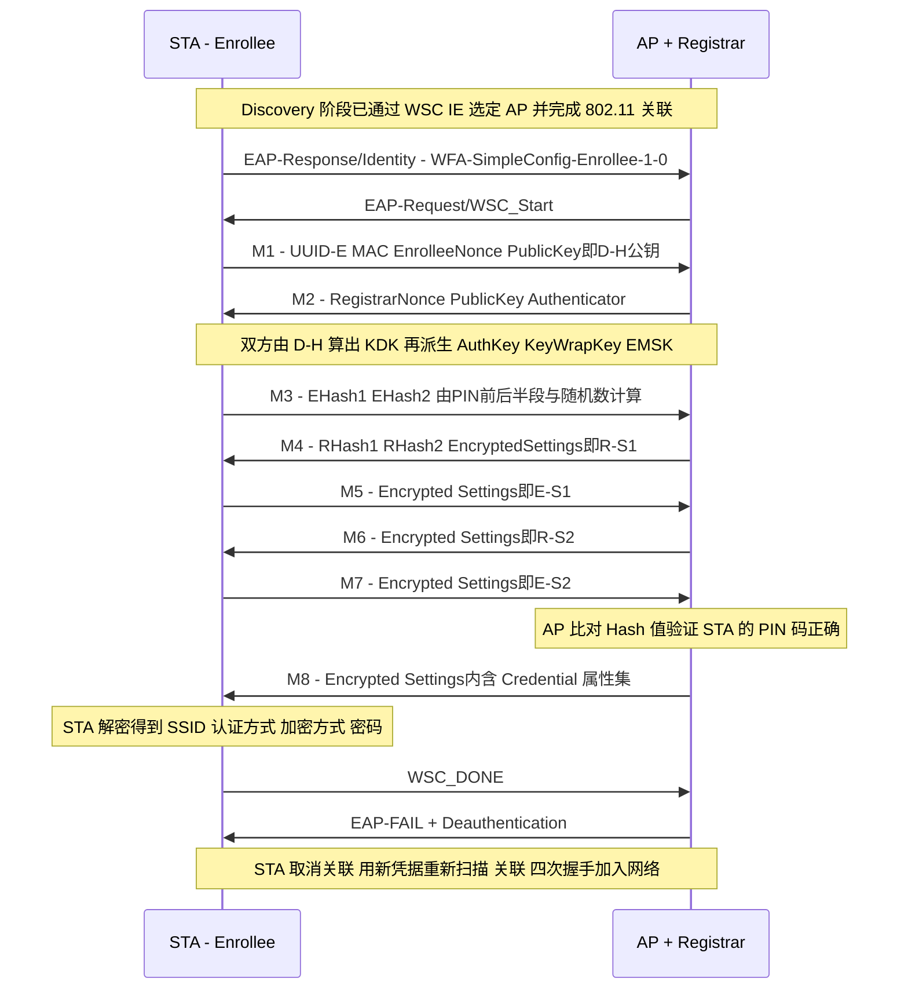

本篇对应原书第 6 章「深入理解 WSC」。WSC（Wi-Fi Simple Configuration）是 Wi-Fi 联盟（WFA）推出的简化无线网络配置的技术规范（早期叫 WPS，Wi-Fi Protected Setup），与 P2P（Wi-Fi Direct，下一篇）同为 WFA 在 802.11 之外定义的两项重要规范。本篇主线一句话：**WSC 让用户免于手动输入 SSID 和密码——STA（Enrollee）与无线路由器（AP + Registrar）经 Registration Protocol 交互，Discovery 阶段靠管理帧中的 WSC IE 互相识别，协商阶段走 EAP-WSC 的 M1~M8 八次消息交换（D-H 密钥交换 + PIN 码验证），最终 M8 把 Credential（SSID、认证加密方式、密码）下发给 STA，STA用凭据重新走正常的关联流程加入网络。**

> 版本注意：原书基于 Android 4.2 / WPAS（代码中 WSC 称为 WPS2，本文不区分 WPS 与 WSC）。成书后 WPS 暴露出严重安全问题（离线暴力破解 PIN、Pixie-Dust 攻击），Android 新版本已逐步弃用 WPS 设置入口，配网方向转向 DPP（Easy Connect，二维码配网）——协议原理本篇仍按原书梳理，演进见文末备注。

> 摘编声明：文中代码为原书对 Android 4.2 与 WPAS 源码的摘编，保留主干与中文注释。

## 1.1 WSC 是什么：场景与配置方法

配置无线网络时，网管需要为 AP 设置 SSID 与安全属性，再把 SSID 和密码告诉每个使用者——这些信息对普通用户偏复杂。WSC 的目标是简化它：用户只需输入 PIN 码、按一下按钮（Push Button），甚至拿支持 NFC 的手机在 AP 旁刷一下，安全设置就能自动配好。

规范定义了两个应用场景（usage model）：

- **Primary UM**：设置一个新的安全 WLAN 并为其添加无线设备（日常生活中更普遍）；
- **Secondary UM**：从 WLAN 移除设备、添加 AP 扩大覆盖、更换密钥信息（Re-keying credentials）等。

Primary UM 的两种常见案例：

- **PIN**（Personal Identification Number）：用户从 STA 设置项获取一个 8 位 PIN 码（系统每次生成的 PIN 不固定），将其输入 AP 的设置页面，双方基于 PIN 完成安全设置协商，随后 STA 完成扫描、关联、四次握手加入网络；
- **PBC**（Push Button Configuration）：比 PIN 更简单——用户在 AP 和目标设备（如打印机）上各按一下标记了 WPS 的按钮，即触发双方协商。Android 手机没有物理按键，用软件按钮模拟（Virtual Push Button）。

安全设置信息的传输手段：经 Wi-Fi 传输称为 **In-Band** 交换，经 NFC / USB 等其他方式称为 **Out-of-Band** 交换。

## 1.2 三大核心组件与接口

WSC 定义三个逻辑组件：

- **AP**：无线接入点；
- **Enrollee**：请求加入网络的设备，Android 智能手机扮演此角色；
- **Registrar**：负责向 Enrollee 发放凭据的注册者。

三个组件只是逻辑概念：日常的支持 WSC 的无线路由器兼具 AP 和 Registrar 功能，称为 **Standalone AP**；若 Registrar 由独立实体实现则称为 External Registrar（此时还涉及 UPnP 交互，本篇不展开）。

组件之间的交互接口（以「Standalone AP + STA 作 Enrollee、In-Band 交互」这一普适 case 归纳）：

| 接口 | STA（Enrollee）侧须实现 | Standalone AP 侧须实现 |
| --- | --- | --- |
| Interface E | 发携带 WSC IE 的 Probe Request 寻找支持 WSC 的 AP；生成动态 PIN；实现 Registration Protocol 的 Enrollee 功能 | 回携带 WSC IE 的 Probe Response；实现 RP 的 Registrar 功能 |
| Interface A | 实现 802.1X supplicant 并支持 EAP-WSC 算法 | Beacon 携带 WSC IE；实现 802.1X authenticator 与 EAP-WSC |
| Interface M | ——（Standalone AP 已内含 Registrar，M 几乎简化为 0） | —— |

注意一个关键点：WSC 流程中 STA 关联到 AP 时**只完成 802.11 关联，没有 RSNA 的密钥协商**（STA 还不知道密码），安全配置信息全靠之后的 Registration Protocol 协商获得。

## 1.3 WSC IE 与 Attribute

### Vendor IE 与 Attribute 结构

WSC IE 不属于 802.11 定义的 IE，而是 **Vendor Specific IE**：

- Element ID = 221（Vendor Specific）；
- OUI = 0x00-50-F2-04（00-50-F2 是 Microsoft 的 OUI，04 代表 WPS）；
- Data 域由一个或多个 **Attribute** 组成，格式为 TLV：Type（2 字节）+ Length（2 字节，Value 长度）+ Value（最大 0xFFFF 字节）。

Attribute 不仅用于 WSC IE，也被 EAP-WSC 包复用。重要 Attribute：

| Attribute | 作用 |
| --- | --- |
| Version（0x104a） | 版本信息，已废弃但为兼容必须包含，值 0x10；由 VendorExtension 中的 Version2 子属性取代 |
| VendorExtension（0x1049） | 包含 VendorID（0x00372a）与多个子属性（Version2、Request to Enrol 等） |
| Request Type / Response Type | 表明设备角色与意图：RequestType 0x01 = Enrollee, open 802.1X（想发起 WSC 流程）、0x00 = 仅查询信息；ResponseType 0x03 = AP、0x02 = Registrar |
| Config Methods（0x1008） | 16 位标志位，表达支持的配置方法：Display（动态 PIN）/ Label（静态 PIN）/ Keypad（输入 PIN）/ Push Button，每种再分 Physical 与 Virtual |
| Primary Device Type（0x1054） | 设备主类型：Category ID + OUI + SubCategory。手机为 Telephone（0x000a）下的 Smartphone（0x0005），AP 为 Network Infrastructure 下的 AP |
| Device Password ID | 密码类型：0x0000 = PIN（默认）、0x0004 = Push Button、0x0001 = User-Specified 等 |
| RF Bands | 支持的频段（2.4GHz / 5GHz） |

### 各管理帧中的 WSC IE 要求

规范对不同管理帧携带的 WSC IE 属性有严格规定：

- **Probe Request**：STA 携带 Version、Request Type、Config Methods、Primary Device Type、RF Bands 等——用于发现支持 WSC 的 AP 并声明自己的能力；
- **Probe Response / Beacon**：AP 携带 Response Type、Selected Registrar 等属性。**Selected Registrar 为 0x01 表示 AP 内部的 Registrar 已启动**（用户已在 AP 上触发 WSC），STA 只与该值为 1 的 AP 开展后续流程；
- **Association Request / Response**：各自携带简单的版本与角色声明。

Discovery 阶段（图 6-7 的上半部分）：STA 发出带 WSC IE 的 Probe Request，据 Beacon / Probe Response 中有无 WSC IE 及 Selected Registrar 的值选定目标 AP——**没有携带 WSC IE 的帧表明发送者不支持或未开启 WSC**。

## 1.4 Registration Protocol 与 EAP-WSC 的 M1~M8

Discovery 结束后进入协商阶段。WSC 利用 EAP 的扩展功能（Type 254，Vendor-Id 0x00372a、Vendor-Type 0x00000001 即 Simple-Config）定义了 **EAP-WSC** 算法：Op-Code 标识消息类型，Flags 支持 EAP 分片（MF/LF），Message Data 就是一组 Attribute。

先经历三次 EAP 包交换确定身份与算法：AP 发 EAP-Request/Identity → STA 回 EAP-Response/Identity，**Identity 固定为 `WFA-SimpleConfig-Enrollee-1-0`** → AP 发 EAP-Request/WSC_Start 启动 EAP-WSC。随后是 M1~M8 八次消息交换：



各消息要点：

- **M1 / M2（密钥建立）**：STA 与 AP 交换 D-H（Diffie-Hellman）公钥。**WSC 中 PIN 码不是 PSK**——双方用 D-H 算法协商出 KDK（Key Derivation Key），再派生三把钥匙：**AuthKey**（256 位，计算消息的 Authenticator / HMAC）、**KeyWrapKey**（128 位，加密 Nonce 与 ConfigData）、**EMSK**（Extended Master Session Key，留作扩展用途）。M2 的 Authenticator 属性是 HMAC-SHA-256 结果的前 64 位；
- **M3 / M4（PIN 验证之半）**：STA 用 AuthKey 和 PIN 码的前半段、后半段分别生成 PSK1、PSK2，对两个随机数 E-S1、E-S2 做 HMAC 得到 EHash1、EHash2；AP 用**用户输入 AP 的 PIN** 同样计算 RHash1、RHash2——**两侧 PIN 不一致时 Hash 对不上，流程终止**，这就是 PIN 码校验的机制；
- **M5 ~ M7（PIN 验证之完）**：双方用 KeyWrapKey 加密各自的 S1、S2（Encrypted Settings 属性）互相出示，证明自己持有正确的 PIN 与随机数；
- **M8（凭据下发）**：AP 用 KeyWrapKey 加密的安全配置信息，核心是 **Credential 属性集合**——包含 SSID（SSID）、认证类型（Authentication Type）、加密类型（Encryption Type）、密码（Network Key）等。STA 解密后即得到原本需要手动输入的全部信息；
- **收尾**：STA 回 WSC_DONE，AP 发 EAP-FAIL 与 Deauthentication 帧断开本次关联；STA 重新扫描，用新凭据走「认证 → 关联 → 四次握手」正常流程加入网络。

## 1.5 代码走读：Settings 与 Framework 层

App 层与 Framework 层对 WSC 的处理非常简单。Settings 中选择「WPS PIN 条目」后弹出 WpsDialog：

```java
// WpsDialog.java：onStart（节选）
protected void onStart() {
    mContext.registerReceiver(mReceiver, mFilter);   // 监听 NETWORK_STATE_CHANGED_ACTION
    WpsInfo wpsConfig = new WpsInfo();
    wpsConfig.setup = mWpsSetup;    // PIN 方式为 WpsInfo.DISPLAY，PBC 为 PBC
    // startWps 内部向 WifiStateMachine 发送 START_WPS 消息
    mWifiManager.startWps(wpsConfig, mWpsListener);
    // mWpsListener 的 onStartSuccess(pin)：PIN 方式显示 WPAS 动态生成的 PIN 码；
    // onCompletion / onFailure：WPS 成功或失败时更新对话框
}
```

WifiStateMachine 处于 DisconnectedState（假设未连接），START_WPS 由其父状态 ConnectModeState 处理，随后转入 **WpsRunningState**。PIN 方式的关键处理：

```java
// WifiConfigStore.java：startWpsWithPinFromDevice（节选）
WpsResult startWpsWithPinFromDevice(WpsInfo config) {
    WpsResult result = new WpsResult();
    // config.BSSID 为空时发送 "WPS_PIN any" 命令给 WPAS，
    // WPAS 计算并返回一个动态 PIN 码（即 WpsDialog 显示的那个）
    result.pin = mWifiNative.startWpsPinDisplay(config.BSSID);
    if (!TextUtils.isEmpty(result.pin)) {
        markAllNetworksDisabled();    // 停用其他网络
        result.status = WpsResult.Status.SUCCESS;
    }
    return result;
}
```

WPAS 完成 WSC 流程后发送 WPS-SUCCESS 事件，WifiMonitor 转成 WPS_SUCCESS_EVENT：

```java
// WifiStateMachine.java：WpsRunningState（节选）
case WifiMonitor.WPS_SUCCESS_EVENT:
    // 回复 WifiManager，WpsDialog 中 WpsListener 的 onCompletion 被调用
    replyToMessage(mSourceMessage, WifiManager.WPS_COMPLETED);
    transitionTo(mDisconnectedState);   // 之后走与手动连接完全相同的流程
```

Framework 层到此为止——真正的工作在 WPAS 中（此后 WifiStateMachine 自己发起扫描请求，与 Settings 发起略有不同）。

## 1.6 代码走读：WPAS 中的 WSC

### WSC 模块初始化：wpas_wps_init

位于 wpa_supplicant_init_iface 的末尾：

```c
// wps_supplicant.c：wpas_wps_init（节选）
int wpas_wps_init(struct wpa_supplicant *wpa_s)
{
    struct wps_context *wps;      // wps_context 是 WPS 模块的核心数据结构
    struct wps_registrar_config rcfg;
    wps = os_zalloc(sizeof(*wps));
    // 两个重要回调：cred_cb 在 EAP-WSC 解析 credential 属性集时使用（见下文）；
    // event_cb 用于通知 WSC 模块事件（如 WSC-SUCCESS 在 wpa_supplicant_wps_event 中处理）
    wps->cred_cb = wpa_supplicant_wps_cred;
    wps->event_cb = wpa_supplicant_wps_event;
    wps->cb_ctx = wpa_s;
    // 初始化设备信息（对应 Attribute 中的 Device Name / Manufacturer / Model 等），
    // 来自 wpa_supplicant.conf 的配置
    wps->dev.device_name = wpa_s->conf->device_name;
    ......
    // 将字符串描述的配置方法转换为标志位；Label 与 Display 不能同时配置
    // （设备不能同时用静态 PIN 和动态 PIN）
    wps->config_methods = wps_config_methods_str2bin(wpa_s->conf->config_methods);
    // CONFIG_WPS2 下：支持 Push Button / Display 的设备补充对应的 Virtual 方法
    wps->config_methods = wps_fix_config_methods(wps->config_methods);
    // 设置 Primary Device Type、RF Bands（按驱动支持的 802.11b/g/a 推断 2.4/5GHz）
    ......
    wpas_wps_set_uuid(wpa_s, wps);   // UUID 未配置时由 MAC 地址生成
    // STA 默认支持的认证与加密算法（对应 AuthenticationTypeFlags / EncryptionTypeFlags）
    wps->auth_types = WPS_AUTH_WPA2PSK | WPS_AUTH_WPAPSK;
    wps->encr_types = WPS_ENCR_AES | WPS_ENCR_TKIP;
    // 创建 wps_registrar（Registrar 代表）。Enrollee 角色用不到它
    wps->registrar = wps_registrar_init(wps, &rcfg);
    wpa_s->wps = wps;
    return 0;
}
```

### WPS_PIN 命令与后续流程

Framework 的 `WPS_PIN any` 命令由 `wpa_supplicant_ctrl_iface_wps_pin` 处理：生成（或使用指定）PIN 码，创建一个 `key_mgmt = WPA_KEY_MGMT_WPS` 的临时网络配置项（其 identity 即 `WFA-SimpleConfig-Enrollee-1-0`，EAP 方法为 EAP-WSC），然后触发扫描。

扫描与关联阶段都会注入 WSC IE：`wpa_supplicant_scan` 为 Probe Request 填入 WSC IE（Request Type 等属性）；扫描结果处理时**只选择 Beacon / Probe Response 中 Selected Registrar 为 1 的 AP**；关联请求同样携带 WSC IE。

### EAP-WSC 消息处理

关联完成后 eapol_sm 置 portEnabled，PAE 状态机进入 CONNECTING 并发送 **EAPOL-Start**；AP 回 EAP-Request/Identity，STA 的 EAP-Response/Identity 携带 `WFA-SimpleConfig-Enrollee-1-0`；AP 发 EAP-Request/WSC_Start 后进入 M1~M8 交换。这一段的难点不在 EAP-WSC 本身，而在 **EAPOL 的 PAE / BE / EAP 三个状态机的联动**（RFC 4137 与 802.1X 定义的状态机协作）。

M1~M7 的处理在 eap_wsc 模块（eap_wsc.c 的 `eap_wsc_process`，按 Op-Code 分发到 `wps_process_m*` 系列函数）。**最关键的是 M8**：

```c
// wps_supplicant.c：wpa_supplicant_wps_cred（节选，由 wps_process_m8 解析出
// credential 后经 cred_cb 回调到此）
static int wpa_supplicant_wps_cred(void *ctx, const struct wps_credential *cred)
{
    struct wpa_supplicant *wpa_s = ctx;
    struct wpa_ssid *ssid = wpa_s->current_ssid;   // WSC 用的临时配置项
    // wps_cred_processing：0 = WPAS 内部处理凭据（默认）；
    // 1 = 经 ctrl_iface 发给客户端处理；2 = 内部处理同时也发给客户端
    if (wpa_s->conf->wps_cred_processing == 1) return 0;
    auth_type = cred->auth_type;
    if (auth_type == (WPS_AUTH_WPAPSK | WPS_AUTH_WPA2PSK))
        auth_type = WPS_AUTH_WPA2PSK;              // WPA/WPA2 混合时取 WPA2
    // 清掉临时配置项中的 WSC 专用设置（identity、eap_methods 等）
    if (ssid && (ssid->key_mgmt & WPA_KEY_MGMT_WPS)) {......}
    wpa_config_set_network_defaults(ssid);         // 恢复默认值
    ssid->ssid = os_malloc(cred->ssid_len);        // 用凭据更新 SSID
    os_memcpy(ssid->ssid, cred->ssid, cred->ssid_len);
    switch (cred->encr_type) {                     // 按凭据更新加密算法
    case WPS_ENCR_AES:
        ssid->pairwise_cipher = WPA_CIPHER_CCMP;
        break;
    ......
    }
    // 以及 auth_type → key_mgmt、Network Key → psk 等
```

即：**M8 的 Credential 被转换成普通的 wpa_ssid 配置项**——STA 拿着它重新走关联流程（认证、关联、四次握手），与手动输密码连网殊途同归。MSG_Done 阶段 WPAS 发送 **WPS-SUCCESS** 事件给 WifiMonitor（Framework 侧收到的 WPS_SUCCESS_EVENT 就来源于此）。

## 1.7 演进备注：WPS 的安全危机与 DPP（书外补充）

以下内容超出原书范围，基于公开资料补充：

- **PIN 码的致命弱点**：PIN 为 8 位数字，校验时 M4/M6 分两半独立反馈——攻击者可先暴力破解前半段（最多 10⁴ 次尝试）再破解后半段（含校验位实际约 10⁷ 次量级），配合 AP 无锁定机制的缺陷，离线 / 在线字典攻击可在数小时内破解（Reaver 类工具）；Pixie-Dust 攻击更是利用部分芯片组在握手期泄露 E-S1/E-S2 的缺陷直接离线算出 PIN；
- **厂商与标准应对**：多数路由器允许关闭 WPS 或仅保留 PBC；WFA 转而主推 **DPP（Device Provisioning Protocol，Easy Connect）**：用二维码 / NFC / 蓝牙带外传递引导信息，引导者（Configurator）为被配设备（Enrollee）发放凭据，支持 WPA3；Android 10 起提供 DPP API（WifiManager DPP 相关接口）；
- **Android 侧**：Settings 的 WPS 入口在新版本已移除，但 Framework 与 supplicant 的 WPS 能力仍长期保留（供 P2P 的 WPS PBC 场景使用，见下一篇）；
- NFC 配网（Wi-Fi Simple Configuration NFC Tag）在 Android 中昙花一现，随 DPP 兴起而边缘化。

## 1.8 参考来源

- 《深入理解Android：Wi-Fi、NFC和GPS卷》邓凡平著，机械工业出版社，第 6 章；
- Wi-Fi Simple Configuration Specification 2.0.2（WFA）；
- RFC 5224（EAP-WSC method）、Wi-Fi Alliance DPP 相关规范；
- WPAS 源码：src/wps/（wps.c、wps_enrollee.c、eap_wsc.c）、wpa_supplicant/wps_supplicant.c。
