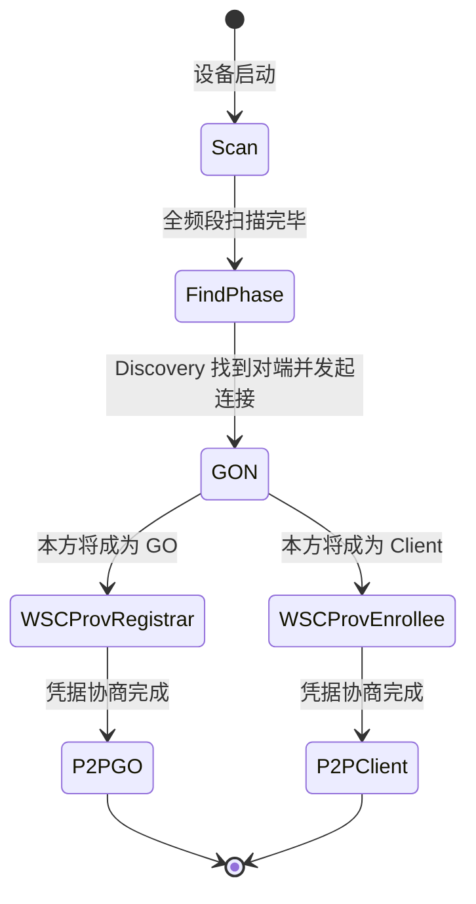

本篇对应原书第 7 章「深入理解 Wi-Fi P2P」，是本系列的收官篇。P2P 的商品名为 Wi-Fi Direct，支持多个 Wi-Fi 设备在没有 AP 的情况下相互连接构成 P2P Group，是 Wi-Fi Display（Miracast 投屏）的技术基础。本篇主线一句话：**P2P 模仿了 Infrastructure BSS 的结构——设备经 Device Discovery（Search/Listen 状态在 Social Channels 上交替）互相发现，经 GO Negotiation（三次帧交换按 GO Intent 定角色）与 WSC Provisioning（上一篇的 EAP-WSC）完成组网，胜者做 GO（相当于 AP）、败者做 Client；Android 侧由 WifiP2pService 的 P2pStateMachine 驱动，WPAS 的 p2p 模块执行协议细节。**

> 版本注意：原书基于 Android 4.2（P2P 接口 p2p0、P2pStateMachine 15 个状态）。现代 Android 的 WifiP2pService 与 WPAS p2p 模块延续本篇结构，变化在外围：接口经 HAL 创建、Framework 侧代码持续重构（WifiP2pServiceImpl 等）；Wi-Fi Aware（NAN）作为「近距离发现」的补充技术加入，与 P2P 互补。

> 摘编声明：文中代码为原书对 Android 4.2 与 WPAS 源码的摘编，保留主干与中文注释。

## 1.1 P2P 概述

P2P（Wi-Fi Peer-to-Peer）规范（Wi-Fi P2P Technical Specification，1.1 版 160 页）使多个 Wi-Fi 设备在没有 AP 的情况下构成网络（P2P Network，也称 P2P Group）并相互通信。典型场景即 Miracast：手机直连智能电视，把视频或媒体资源送去显示播放。

注意 P2P 与 802.11 中的 IBSS（Ad-hoc）完全不同：IBSS 中各 STA 完全对等，P2P 则有明确的 GO / Client 角色之分。

P2P 建立在现有技术之上，其依赖项：

- **802.11g 及以上**（保证传输速率）；安全必须支持 **WPA2**；
- **WMM**（Wi-Fi MultiMedia，源自 802.11e 的 QoS 服务，面向实时音视频）；
- **WSC**：Client 关联 GO 前先经 WSC 协商安全信息——与 STA 用 WSC 连 AP 的流程完全一样，这种相似性使 P2P 能充分利用现有规范。

在此之上 P2P 定义了特有技术项：**P2P Discovery**（必须，本篇重点）、P2P Group Operation（GO 如何管理 Group）、P2P Power Management（省电），以及可选项 Managed P2P Device Operation（企业环境统一管理）。

## 1.2 P2P 架构：一个设备，两种角色

P2P 架构定义三个组件：

- **P2P Device**：角色的实体，即一台 Wi-Fi 设备；
- **P2P Group Owner（GO）**：一种角色，作用类似 Infrastructure BSS 中的 AP；
- **P2P Client**：另一种角色，作用类似 Infrastructure BSS 中的 STA。

组建 P2P Group 前智能终端都是 P2P Device；协商完成后**有且仅有一个 Device 扮演 GO**（充当 AP），其余扮演 Client。一个 GO 可支持 1 个或多个 Client 连接。由于 GO 类似 AP，**不支持 P2P 协议的普通 STA（Legacy Client）也能发现并关联到 GO**——只是无法使用 P2P 特有功能。

Group 分两种：

- **Temporary Group（临时组）**：传文件时临时建立，GO 与 Client 的角色分配由 Group Formation 决定，本次的安全配置与 Group 信息都是临时的；
- **Persistent Group（永久组）**：GO 由指定设备扮演（如打印机），安全配置与 Group 信息一旦生成不再变化——只有第一次连接需要 WSC 协商，之后设备凭保存的信息直接关联。

## 1.3 P2P Discovery 技术

P2P Discovery 包含四个子项：**Device Discovery**（设备互相发现）、Service Discovery（按服务搜索，可选）、**Group Formation**（决定谁做 GO）、P2P Invitation（激活 Persistent Group 或邀请 Client 加入已有 Group）。本篇展开前两者中的 Device Discovery 与 Group Formation。

### Device Discovery：两状态与两阶段

P2P 的设备发现仍用 Probe Request / Response 帧，但比 Infrastructure BSS 复杂：**每个 P2P Device 既发 Probe Request，也要收别人的 Probe Request 并回 Probe Response**（BSS 中只有 AP 会回）。

两个状态：

- **Search State**：在 2.4GHz 的 1、6、11 信道（称 **Social Channels**）上发送 Probe Request。要求帧中必须包含 P2P IE 以区别于普通扫描；
- **Listen State**：随机选定 1、6、11 中的一个为 **Listen Channel** 只收不发，监听 Probe Request 并回复 Probe Response，且只处理含 P2P IE 的帧。Listen Channel 一旦选定，整个 Discovery 阶段不可更改。

两个阶段：

- **Scan Phase**：在所有支持频段上主动扫描（发 Probe Request），不处理别人的请求——与普通无线网络扫描相同；
- **Find Phase**：在 Search State 与 Listen State 之间来回切换。规范要求 Listen State 时长为 100 TU 的整数倍，倍数取 minDiscoverableInterval 与 maxDiscoverableInterval（默认 1 与 3）之间的随机数——**防止两个设备陷入 Lock-Step 怪圈**（同时进 Listen、等相同时间又同时进 Search，互相收不到对方的 Probe Request）。

两个设备只有处于同一信道时才能收到对方的帧，靠 Social Channels + 随机交替保证相遇。

### Probe 帧与 P2P IE

P2P 的 Probe Request 帧有三个识别特征：

- **SSID 为 `DIRECT-`**（P2P Wildcard SSID）；
- 携带 **WSC IE**（Device Name、Primary Device Type 等，可按设备类型定向搜索）；
- 携带 **P2P IE**：也是 Vendor Specific IE（Element ID 221），OUI 为 0x50-6F-9A-09（50-6F-9A 是 Wi-Fi Alliance 的 OUI，09 代表 P2P），内容同样由一组 Attribute 组成。常见的有：

| Attribute | 内容 |
| --- | --- |
| P2P Capability | Device Capability Bitmap 与 Group Capability Bitmap，逐位表达支持的特性（如 P2P Client Discoverability、Concurrent Operation、Group Owner 等） |
| Listen Channel | Country String + Operating Class + Channel Number，声明自己在哪个信道监听（如 Operating Class 81 对应 2.4GHz 起步 2.407GHz、间隔 25MHz 的 13 个信道） |

### Group Formation：GO Negotiation 与 WSC Provisioning

Device A 通过 Discovery 找到 Device B 后开展 Group Formation，分两阶段：

**① GO Negotiation（GON）**：协商谁做 GO。用 **P2P Public Action 帧**交换信息（GON、P2P Invitation、Device Discoverability、Provision Discovery 都用这类帧，OUI SubType 区分），共三次帧交换：

1. **GON Request**：携带 GO Intent（0~15，想当 GO 的渴望程度）、Configuration Timeout（GO / Client 各 1 字节，10ms 的倍数，进入角色前完成准备的时限）、Channel List（Country String + 支持频段）、Intended P2P Interface Address（入组后将用的 MAC）等；
2. **GON Response**：携带 Status（0 表示成功）、GO Intent 等。将成为 GO 的一方在此帧中带 **P2P Group ID** 属性（Device Address + SSID，SSID 必须以 `DIRECT-xy` 开头，xy 为随机两个字母数字，Android 会在后面追加设备名如 `Android_4aa9`）；
3. **GON Confirmation**：确认。将扮演 GO 的设备必须包含 P2P Group ID。

**角色裁决规则**：GO Intent 大者胜；一般双方都用默认值 7，此时 **Tie Breaker 位为 1 的一方获胜**（该位随机，撞车概率极低）；若双方 GO Intent 都是 15（都想当 GO），GON 失败，谁都做不了 GO。Android 上收到 GON Request 会弹框让用户确认（图 7-16 场景），拒绝则流程终止。

**② WSC Provisioning**：角色确定后，GO 相当于 AP、Client 相当于 STA，双方走上一篇的 WSC 流程（EAP-WSC 的 M1~M8）交换安全配置信息。

### Provision Discovery：为什么需要它

P2P 规范要求 Group Formation（GON + Provisioning）**15 秒内完成**，但 WSC 的用户操作（输 PIN 等）最长允许 2 分钟——矛盾如何解？P2P 定义了 **Provision Discovery（PD）**：在 Group Formation 正式开始前，双方先交换 PD Request / Response 帧（也是 P2P Public Action 帧），其中起决定作用的是 WSC IE 的 **Config Method** 属性：

- PD Request 发送者设置想用的配置方法（一次只能一种，如 Push Button）；
- 接收者支持则在 PD Response 中设置相同的方法位；不支持则 Config Method 置 0，发送者换一种方法再试；
- **另一个作用是提前提醒用户做相应操作**（如输入 PIN、按按钮），让后续 Provisioning 直接使用，不再卡在 15 秒限制里。

## 1.4 P2P 整体工作流程状态机

规范附录 A 用一个状态机描述 P2P 的整体工作流程，三个大阶段：



- **Find Phase**：包含 Listen 与 Search 状态（Search 下还有可选的 Service Discovery 子状态），即 1.3 节的 Device Discovery；
- **Group Formation Procedure**：包含 GON、WSC Provisioning Registrar / Enrollee 三个状态（Registrar 与 Enrollee 的区分即本方将扮演 GO 还是 Client）；
- **Operational Phase**：P2P GO 与 P2P Client 两个状态，组网完成、开始工作。

## 1.5 Framework 侧：WifiP2pSettings 与 WifiP2pService

WifiP2pSettings 是 Settings 中 P2P UI 的主要类，交互对象是 SystemServer 进程中的 **WifiP2pService**（家族类图与 WifiService 类似：IWifiP2pManager.aidl、Binder 服务端 + WifiP2pManager 客户端）。核心是内部类 **P2pStateMachine**（15 个状态，初始 P2pDisabledState）。

### 使能与初始化

WifiStateMachine 的 InitialState 中创建了 mWifiP2pChannel（AsyncChannel）连向 P2pStateMachine——两个状态机由此联动。Wi-Fi 打开后 WifiStateMachine 发 CMD_ENABLE_P2P：

```java
// WifiP2pService.java：P2pDisabledState（节选）
case WifiStateMachine.CMD_ENABLE_P2P:
    mNwService.setInterfaceUp(mInterface);   // p2p 接口 up，mInterface = "p2p0"
    mWifiMonitor.startMonitoring();          // WifiMonitor 连上 WPAS 的 p2p ctrl 接口
    transitionTo(mP2pEnablingState);
```

WifiMonitor 连上 WPAS 后发 SUP_CONNECTION_EVENT，P2pEnablingState 处理后转入 InactiveState（父状态 P2pEnabledState 的 EA 先执行）：

```java
// WifiP2pService.java：P2pEnabledState（节选）
public void enter() {
    sendP2pStateChangedBroadcast(true);      // WIFI_P2P_STATE_CHANGED_ACTION 广播
    initializeP2pSettings();
}

private void initializeP2pSettings() {
    // "SET persistent_reconnect 1"：发现 Persistent Group 时自动重连（无须用户确认）
    mWifiNative.setPersistentReconnect(true);
    // P2P Device Name：查 settings 数据库的 wifi_p2p_device_name，没有则
    // "Android_" + android_id 前 4 个字符（如 Android_4aa9）
    mThisDevice.deviceName = getPersistedDeviceName();
    mWifiNative.setDeviceName(mThisDevice.deviceName);
    mWifiNative.setP2pSsidPostfix("-" + mThisDevice.deviceName);  // GO 组 SSID 后缀
    mWifiNative.setDeviceType(mThisDevice.primaryDeviceType);     // 默认 10-0050F204-5
    mWifiNative.setConfigMethods("virtual_push_button physical_display keypad");
    mWifiNative.setConcurrencyPriority("sta");    // STA 连接优先于 P2P
    mThisDevice.deviceAddress = mWifiNative.p2pGetDeviceAddress();
    mWifiNative.p2pFlush();  mWifiNative.p2pServiceFlush();   // 清空 peer 与 service 缓存
    updatePersistentNetworks(RELOAD);   // 从 WPAS 加载 Persistent Group 信息到 mGroups
}
```

### 搜索与设备发现

WifiP2pSettings 调 `WifiP2pManager.discoverPeers` → P2pStateMachine 收 DISCOVER_PEERS（由 InactiveState 的父状态 P2pEnabledState 处理）：

```java
// WifiP2pService.java：P2pEnabledState（节选）
case WifiP2pManager.DISCOVER_PEERS:
    clearSupplicantServiceRequest();
    // 发送 "P2P_FIND 120" 给 WPAS，超时 120 秒
    if (mWifiNative.p2pFind(DISCOVER_TIMEOUT_S)) {
        replyToMessage(message, WifiP2pManager.DISCOVER_PEERS_SUCCEEDED);
        sendP2pDiscoveryChangedBroadcast(true);
    }
```

WPAS 每发现一个设备就上报 `P2P-DEVICE-FOUND <addr> p2p_dev_addr=... pri_dev_type=... name='...' config_methods=0x188 dev_capab=0x27 group_capab=0x0`，WifiMonitor 解析成 WifiP2pDevice 对象发 P2P_DEVICE_FOUND_EVENT，P2pEnabledState 用 `mPeers.update(device)` 维护设备列表并发 WIFI_P2P_PEERS_CHANGED_ACTION 广播，Settings 收到后 requestPeers 刷新 UI。

### 连接

用户在 Settings 选择一个设备后 `WifiP2pManager.connect(config)` → CONNECT 消息由 InactiveState 处理：

```java
// WifiP2pService.java：InactiveState（节选）
case WifiP2pManager.CONNECT:
    WifiP2pConfig config = (WifiP2pConfig) message.obj;
    mAutonomousGroup = false;
    int gc = mWifiNative.getGroupCapability(config.deviceAddress);
    mPeers.updateGroupCapability(config.deviceAddress, gc);
    int connectRet = connect(config, TRY_REINVOCATION);
    ......
    if (connectRet == NEEDS_PROVISION_REQ)
        transitionTo(mProvisionDiscoveryState);   // 需要先走 PD
    else
        transitionTo(mGroupNegotiationState);     // 直接进 GON
```

connect 函数的决策逻辑：对端已是 GO 且可加入（未达 Group 上限）则 `p2pGroupAdd` 直接入组（Persistent Group 还可凭保存的 netId 邀请重连）；否则走完整的 PD + GON 流程。**ProvisionDiscoveryState 的 EA 发送 `P2P_PROV_DISC <addr> pbc` 给 WPAS**（PBC 方式），PD 完成收到 P2P_PROV_DISC_PBC_RSP_EVENT 后调 p2pConnectWithPinDisplay——它发送 `P2P_CONNECT <addr> pbc go_intent=7` 给 WPAS，进入 GroupNegotiationState 等待组网结果。

## 1.6 WPAS 侧：p2p 模块

### 模块初始化

WPAS 的 P2P 模块（src/p2p/）在接口初始化时经 p2p_init 创建，核心数据结构是 `struct p2p_data`（内含 devices 链表保存发现的每个 `p2p_device`）；驱动需支持相应 capability（drv_flags 中的 P2P 相关标志），并注册 Action 帧监听（nl80211 的 register_frame）以收发 P2P Public Action 帧。P2P 使用的虚拟接口即 p2p0。

### Device Discovery 实现

`P2P_FIND` 命令 → `wpas_p2p_find` → `p2p_find`（p2p.c）：

```c
// p2p.c：p2p_find（节选）
int p2p_find(struct p2p_data *p2p, unsigned int timeout, enum p2p_discovery_type type, ...)
{
    p2p->start_after_scan = P2P_AFTER_SCAN_NOTHING;
    p2p->cfg->stop_listen(p2p->cfg->cb_ctx);   // 停止监听
    p2p->find_type = type;
    p2p_set_state(p2p, P2P_SEARCH);            // p2p 模块状态机置为 P2P_SEARCH
    // 注册扫描超时任务（P2P_FIND 的超时参数，如 120 秒）
    if (timeout) eloop_register_timeout(timeout, 0, p2p_find_timeout, p2p, NULL);
    switch (type) {
    case P2P_FIND_ONLY_SOCIAL:   // 只扫 social channels（1、6、11）
        res = p2p->cfg->p2p_scan(p2p->cfg->cb_ctx, P2P_SCAN_SOCIAL, ...);
        break;
    case P2P_FIND_START_WITH_FULL:   // 先全频段再 social
        res = p2p->cfg->p2p_scan(p2p->cfg->cb_ctx, P2P_SCAN_FULL, ...);
        break;
    }
    if (res == 0) {
        p2p->p2p_scan_running = 1;
        eloop_register_timeout(P2P_SCAN_TIMEOUT, 0, p2p_scan_timeout, p2p, NULL);
    }
    return res;
}
```

p2p_scan 函数指针指向 wpas_p2p_scan（p2p_supplicant.c），它构造 P2P 专用的扫描参数：

```c
// p2p_supplicant.c：wpas_p2p_scan（节选）
static int wpas_p2p_scan(void *ctx, enum p2p_scan_type type, ...)
{
    struct wpa_driver_scan_params params;
    int social_channels[] = { 2412, 2437, 2462, 0, 0 };   // 信道 1、6、11
    params.num_ssids = 1;
    params.ssids[0].ssid = (u8 *) P2P_WILDCARD_SSID;      // "DIRECT-"
    // 构造 Probe Request 的 WSC IE（Device 信息 + WPS_REQ_ENROLLEE）
    wps_ie = wps_build_probe_req_ie(0, &wpa_s->wps->dev, wpa_s->wps->uuid,
                    WPS_REQ_ENROLLEE, num_req_dev_types, req_dev_types);
    // 构造 P2P IE（P2P Capability、Listen Channel 等属性）
    p2p_scan_ie(wpa_s->global->p2p, ies, dev_id);
    params.extra_ies = wpabuf_head(ies);
    params.p2p_probe = 1;
    switch (type) {
    case P2P_SCAN_SOCIAL:
        params.freqs = social_channels;   // 只扫 social channels
        break;
    ......
}
```

扫描结果经 `wpas_p2p_scan_res_handler` → `p2p_scan_res_handler` 处理：对每个 BSS 调 `p2p_add_device`——解析 IE 中的 P2P 属性（p2p_device_addr 等），构造 `p2p_device` 对象加入 devices 链表，并上报 `P2P-DEVICE-FOUND` 事件（Framework 侧 P2P_DEVICE_FOUND_EVENT 的来源）。此外若扫描中发现了 GON 的对端（go_neg_peer），直接 `p2p_connect_send` 发起 GON。

### Provision Discovery 与 GON 实现

- **PD**：`P2P_PROV_DISC` 命令 → `p2p_ctrl_prov_disc` → `wpas_p2p_prov_disc` → `p2p_prov_disc_req`：找到对端 p2p_device、记录 req_config_methods，`p2p_send_prov_disc_req` 在对端的 listen_freq 上发出 PD Request 帧（携带 Dialog Token 与 WSC IE 的 Config Method）；对端回 PD Response 后，WPAS 上报 `P2P_PROV_DISC_PBC_RSP` 事件，Framework 据此从 ProvisionDiscoveryState 前进；
- **GON**：`P2P_CONNECT` 命令（`P2P_CONNECT <addr> pbc go_intent=7`）→ `p2p_ctrl_connect` → `wpas_p2p_connect`：判断是否需要创建新虚拟接口（wpas_p2p_create_iface）、设置频段，然后 `p2p_connect`（p2p 模块状态机）发送 GON Request；三次帧交换完成后角色确定——**WPAS 内部用 hostapd 的代码让 GO 扮演 AP**（发 Beacon、处理关联、跑 WPS Registrar），Client 侧则作为 Enrollee 走 EAP-WSC（上一篇的 M1~M8），Credential 协商完成后 GO 上报 `P2P-GROUP-STARTED`，Framework 进入 GroupCreatedState，GO 侧还会启动 DHCP 服务为 Client 分配 IP（Android 在 Framework 层实现）。

至此 P2P Group 建立：GO 上是 `p2p0` 接口 + 若干 Client，上层应用（如 Miracast 的 RTSP / UDP 流）即可通过这块直连链路通信。

## 1.7 演进备注（可跳过，不影响主线）

- **Framework 重构**：WifiP2pService 持续演进（WifiP2pServiceImpl、HalWifiP2pManager 等），P2P 命令部分经 supplicant HAL 下发，但 P2pStateMachine 驱动、`P2P_FIND / P2P_CONNECT` 命令族的思路保留；
- **接口管理**：现代版本 GO / Client 接口经 WifiManager 的接口仲裁（与 STA 并发受芯片能力约束），p2p0 之上还可按需创建更多虚拟接口；
- **Wi-Fi Aware（NAN）**：Android 8.0 起引入的邻居发现网络（Neighborhood Aware Network），适合发现阶段的服务发布/订阅，与 P2P 的「发现 + 组网」互补：Aware 发现后可拉起 P2P 建立高速链路；
- **应用场景**：Miracast 投屏、无线打印、快速文件共享（近场传输类 App）仍是 P2P 的主战场；Persistent Group 机制在投屏类固定配对场景中最能体现价值。

## 1.8 参考来源

- 《深入理解Android：Wi-Fi、NFC和GPS卷》邓凡平著，机械工业出版社，第 7 章；
- Wi-Fi Peer-to-Peer (P2P) Technical Specification 1.1（WFA）；
- WPAS 源码：src/p2p/（p2p.c、p2p_go_neg.c 等）、wpa_supplicant/p2p_supplicant.c；
- Android 4.2 源码：frameworks/base/wifi（WifiP2pService.java 等）、Settings 的 WifiP2pSettings。
