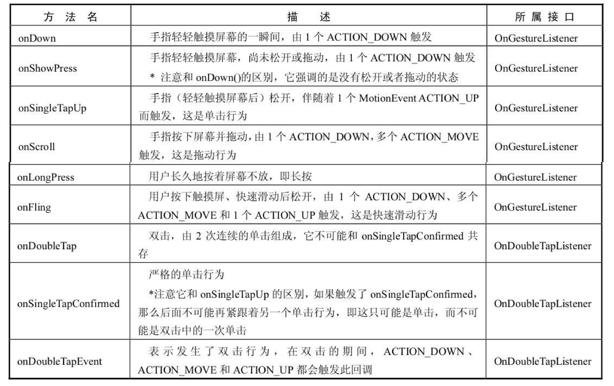
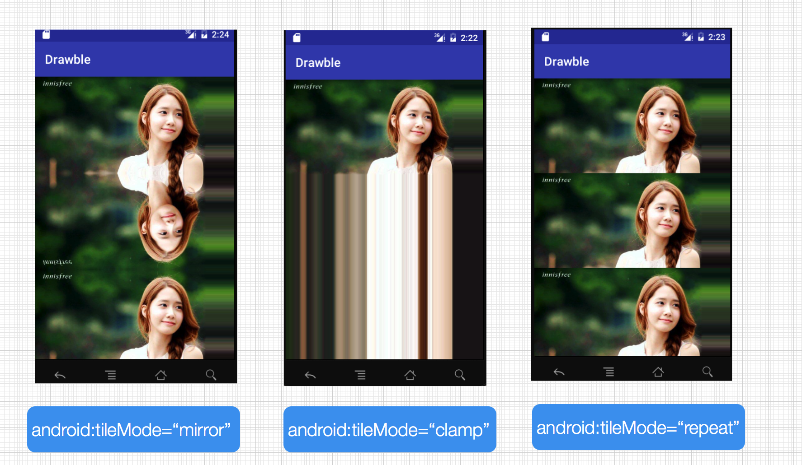
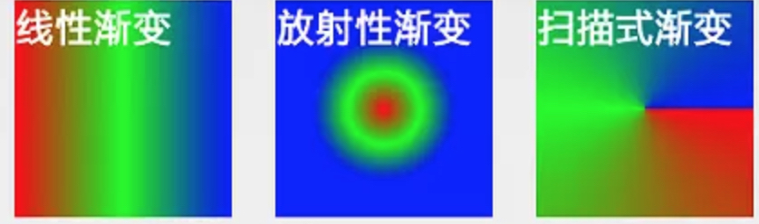
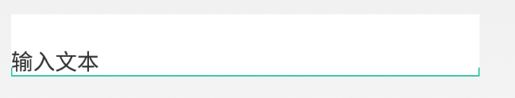
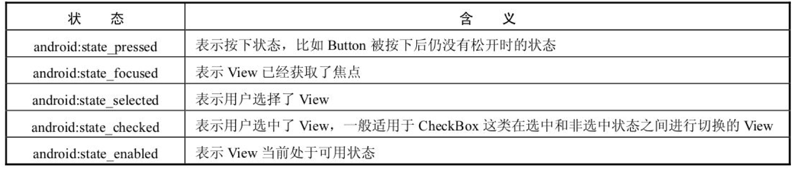
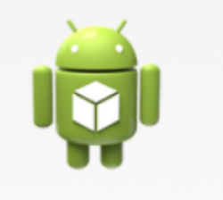
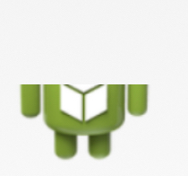

## 1. BitmapDrawable

```xml
<?xml version="1.0" encoding="utf-8"?>
<bitmap xmlns:android="http://schemas.android.com/apk/res/android"
     android:src="@[package:]drawable/drawable_resource"
     android:antialias=["true" | "false"]
     android:dither=["true" | "false"]
     android:filter=["true" | "false"]
     android:gravity=["top" | "bottom"|"left"|"right" |"center_vertical" |"fill_vertical"|"center_horizontal" | "fill_horizontal" |"center" | "fill" | "clip_vertical" | "clip_horizontal"]

     android:mipMap=["true" | "false"]
     android:tileMode=["disabled" | "clamp" | "repeat" | "mirror"] />
```

- android:antialias:是否开启图片抗锯齿功能。开启后会让图片变得平滑,同时也会在一定程度上降低图片的清晰度,但是这个降低的幅度较低以至于可以忽略,因此抗锯齿选项应该开启。
- android:dither:是否开启抖动效果。当图片的像素配置和手机屏幕的像素配置不一致时,开启这个选项可以让高质量的图片在低质量的屏幕上还能保持较好的显示效果,比如图片的色彩模式为 ARGB8888,但是设备屏幕所支持的色彩模式为 RGB555,这个时候开启抖动选项可以让图片显示不会过于失真。在 Android 中创建的 Bitmap 一般会选用 ARGB8888 这个模式,即 ARGB 四个通道各占 8 位,在这种色彩模式下,一个像素所占的大小为 4 个字节,一个像素的位数总和越高,图像也就越逼真。根据分析,抖动效果也应该开启。
- android:filter:是否开启过滤效果。当图片尺寸被拉伸或者压缩时,开启过滤效果可以保持较好的显示效果,因此此选项也应该开启。
- android:gravity:当图片小于容器的尺寸时,设置此选项可以对图片进行定位。



- android:mipMap:一种图像相关的处理技术,也叫纹理映射。
- android:tileMode:平铺模式。disabled 表示关闭平铺模式,是默认值;repeat 表示简单的水平和竖直方向上的平铺效果;mirror 表示一种在水平和竖直方向上的镜面投影效果;而 clamp 表示的效果就更加奇特,图片四周的像素会扩展到周围区域。



## 2. ShapeDrawable

其实体类实际上是 GradientDrawable。

```xml
<?xml version="1.0" encoding="utf-8"?>
<shape xmlns:android="http://schemas.android.com/apk/res/android"
     android:shape=["rectangle" | "oval" | "line" | "ring"] >
     <corners
         android:radius="integer"
         android:topLeftRadius="integer"
         android:topRightRadius="integer"
         android:bottomLeftRadius="integer"
         android:bottomRightRadius="integer" />
     <gradient
         android:angle="integer"
         android:centerX="integer"
         android:centerY="integer"
         android:centerColor="integer"
         android:endColor="color"
         android:gradientRadius="integer"
         android:startColor="color"
         android:type=["linear" | "radial" | "sweep"]
         android:useLevel=["true" | "false"] />
     <padding
         android:left="integer"
         android:top="integer"
         android:right="integer"
         android:bottom="integer" />
     <size
         android:width="integer"
         android:height="integer" />
     <solid
         android:color="color" />
     <stroke
         android:width="integer"
         android:color="color"
         android:dashWidth="integer"
         android:dashGap="integer" />
</shape>
```

- android:shape:图形的形状
- `<corners>`:shape 的四个角的角度,适用于矩形 shape
- `<gradient>`:与 `<solid>` 标签是互相排斥的,其中 solid 表示纯色填充,而 gradient 则表示渐变效果
  - android:gradientRadius——渐变半径,仅当 android:type="radial" 时有效
  - android:useLevel——一般为 false,当 Drawable 作为 LevelListDrawable 使用时为 true
  - android:type——渐变的类别,linear(线性渐变)、radial(径向渐变)、sweep(扫描线渐变)三种,其中默认值为线性渐变



- `<stroke>`:Shape 的描边
- `<padding>`:包含它的 View 的空白

## 3. LayerDrawable

```xml
<?xml version="1.0" encoding="utf-8"?>
<layer-list
     xmlns:android="http://schemas.android.com/apk/res/android">
     <item
         android:drawable="@[package:]drawable/drawable_resource"
         android:id="@[+][package:]id/resource_name"
         android:top="dimension"
         android:right="dimension"
         android:bottom="dimension"
         android:left="dimension" />
</layer-list>
```

- android:top、android:bottom、android:left 和 android:right,它们分别表示 Drawable 相对于 View 的上下左右的偏移量,单位为像素。

示例:



```xml
<?xml version="1.0" encoding="utf-8"?>
<layer-list xmlns:android="http://schemas.android.com/apk/res/android" >
     <item>
         <shape android:shape="rectangle" >
             <solid android:color="#0ac39e" />
         </shape>
     </item>
     <item android:bottom="6dp">
         <shape android:shape="rectangle" >
             <solid android:color="#ffffff" />
         </shape>
     </item>
     <item
         android:bottom="1dp"
         android:left="1dp"
         android:right="1dp">
         <shape android:shape="rectangle" >
             <solid android:color="#ffffff" />
         </shape>
     </item>
</layer-list>
```

实际应用——EditText 背景(底层灰色,上层白色在底部留出 1dp,形成灰色下划线效果):

```xml
<?xml version="1.0" encoding="utf-8"?>
<layer-list xmlns:android="http://schemas.android.com/apk/res/android">

    <item>
        <shape>
            <solid android:color="@color/gray_hint_ec"/>
        </shape>
    </item>

    <item android:bottom="1dp">
        <shape>
            <solid android:color="@color/white" />
        </shape>
    </item>
</layer-list>
```

## 4. StateListDrawable(selector)

表示 Drawable 集合,根据 View 的状态(state_pressed、state_checked 等)切换到对应的 Drawable:

```xml
<?xml version="1.0" encoding="utf-8"?>
<selector xmlns:android="http://schemas.android.com/apk/res/android"
     android:constantSize=["true" | "false"]
     android:dither=["true" | "false"]
     android:variablePadding=["true" | "false"] >
     <item
         android:drawable="@[package:]drawable/drawable_resource"
         android:state_pressed=["true" | "false"]
         android:state_focused=["true" | "false"]
         android:state_hovered=["true" | "false"]
         android:state_selected=["true" | "false"]
         android:state_checkable=["true" | "false"]
         android:state_checked=["true" | "false"]
         android:state_enabled=["true" | "false"]
         android:state_activated=["true" | "false"]
         android:state_window_focused=["true" | "false"] />
</selector>
```

- android:constantSize:StateListDrawable 的固有大小是否不随着其状态的改变而改变。因为状态的改变会导致 StateListDrawable 切换到具体的 Drawable,而不同的 Drawable 具有不同的固有大小。true 表示 StateListDrawable 的固有大小保持不变,这时它的固有大小是内部所有 Drawable 的固有大小的最大值,false 则会随着状态的改变而改变。此选项默认值为 false。
- android:dither:是否开启抖动效果
- android:variablePadding:StateListDrawable 的 padding 是否随着其状态的改变而改变,true 表示会随着状态的改变而改变,false 表示 StateListDrawable 的 padding 是内部所有 Drawable 的 padding 的最大值。此选项默认值为 false,并且不建议开启此选项。



## 5. LevelListDrawable

表示一个 Drawable 集合,集合中的每个 Drawable 都有一个等级(level)的概念。根据不同的等级,LevelListDrawable 会切换为对应的 Drawable,Drawable 的等级是 0~10000:

```xml
<?xml version="1.0" encoding="utf-8"?>
<level-list
     xmlns:android="http://schemas.android.com/apk/res/android" >
     <item
         android:drawable="@drawable/drawable_resource"
         android:maxLevel="integer"
         android:minLevel="integer" />
</level-list>
```

当它作为 View 的背景时,可以通过 Drawable 的 setLevel 方法来设置不同的等级从而切换具体的 Drawable。如果它被用来作为 ImageView 的前景 Drawable,那么还可以通过 ImageView 的 setImageLevel 方法来切换 Drawable:

```xml
<?xml version="1.0" encoding="utf-8"?>
<level-list xmlns:android="http://schemas.android.com/apk/res/android" >
     <item
         android:drawable="@drawable/status_off"
         android:maxLevel="0" />
     <item
         android:drawable="@drawable/status_on"
         android:maxLevel="1" />
</level-list>
```

## 6. TransitionDrawable

实现两个 Drawable 之间的淡入淡出效果,语法:

```xml
<?xml version="1.0" encoding="utf-8"?>
<transition
xmlns:android="http://schemas.android.com/apk/res/android" >
     <item
         android:drawable="@[package:]drawable/drawable_resource"
         android:id="@[+][package:]id/resource_name"
         android:top="dimension"
         android:right="dimension"
         android:bottom="dimension"
         android:left="dimension" />
</transition>
```

示例:

1. 首先定义 TransitionDrawable

```xml
<!-- res/drawable/transition_drawable.xml -->
<?xml version="1.0" encoding="utf-8"?>
<transition xmlns:android="http://schemas.android.com/apk/res/android">
     <item android:drawable="@drawable/drawable1" />
     <item android:drawable="@drawable/drawable2" />
</transition>
```

2. 接着 TransitionDrawable 设置为 View 的背景,或者在 ImageView 中直接作为 Drawable 来使用

```xml
<TextView
     android:id="@+id/button"
     android:layout_height="wrap_content"
     android:layout_width="wrap_content"
     android:background="@drawable/transition_drawable" />
```

3. 通过它的 startTransition 和 reverseTransition 方法来实现淡入淡出的效果以及它的逆过程

```java
TextView textView = (TextView) findViewById(R.id.test_transition);
TransitionDrawable drawable = (TransitionDrawable) textView.getBackground();
drawable.startTransition(1000);
```

## 7. InsetDrawable

将其他 Drawable 内嵌到自己当中,并可以在四周留出一定的间距。当一个 View 希望自己的背景比自己的实际区域小的时候,可以采用 InsetDrawable 来实现,同时我们知道,通过 LayerDrawable 也可以实现这种效果。

```xml
<?xml version="1.0" encoding="utf-8"?>
<inset xmlns:android="http://schemas.android.com/apk/res/android"
     android:drawable="@drawable/drawable_resource"
     android:insetTop="dimension"
     android:insetRight="dimension"
     android:insetBottom="dimension"
     android:insetLeft="dimension" />
```

android:insetTop、android:insetBottom、android:insetLeft 和 android:insetRight 分别表示顶部、底部、左边和右边内凹的大小。在下面的例子中,inset 中的 shape 距离 View 的边界为 15dp:

```xml
<?xml version="1.0" encoding="utf-8"?>
<inset xmlns:android="http://schemas.android.com/apk/res/android"
     android:insetBottom="15dp"
     android:insetLeft="15dp"
     android:insetRight="15dp"
     android:insetTop="15dp" >
    <shape android:shape="rectangle" >
         <solid android:color="#ff0000" />
    </shape>
</inset>
```

实际应用——divider(左右内凹的分割线,配合 LinearLayout 使用):

```xml
<?xml version="1.0" encoding="UTF-8"?>
<inset xmlns:android="http://schemas.android.com/apk/res/android"
    android:insetLeft="50dp"
    android:insetRight="50dp" >

    <shape>
        <solid android:color="@color/orange" />
        <corners android:radius="2.0dip" />
    </shape>

</inset>
```

```xml
<LinearLayout
    android:layout_width="match_parent"
    android:layout_height="match_parent"
    android:divider="@drawable/divider"
    android:showDividers="middle">
```

## 8. ScaleDrawable

```xml
<?xml version="1.0" encoding="utf-8"?>
<scale
     xmlns:android="http://schemas.android.com/apk/res/android"
     android:drawable="@drawable/drawable_resource"
     android:scaleGravity=["top" | "bottom" | "left" | "right" | "center_vertical" |"fill_vertical" | "center_horizontal" | "fill_horizontal" | "center" | "fill" | "clip_vertical" |"clip_horizontal"]
     android:scaleHeight="percentage"
     android:scaleWidth="percentage" />
```

示例:近似地将一张图片缩小为原大小的 30%

```xml
<!-- res/drawable/scale_drawable.xml -->
<?xml version="1.0" encoding="utf-8"?>
<scale xmlns:android="http://schemas.android.com/apk/res/android"
     android:drawable="@drawable/image1"
     android:scaleHeight="70%"
     android:scaleWidth="70%"
     android:scaleGravity="center" />
```

直接使用上面的 drawable 资源是不行的,还必须设置 ScaleDrawable 的等级为大于 0 且小于等于 10000 的值:

```java
View testScale = findViewById(R.id.test_scale);
ScaleDrawable testScaleDrawable = (ScaleDrawable) testScale.getBackground();
testScaleDrawable.setLevel(1);
```

如果少了设置等级这一步,由于 Drawable 的默认等级为 0,那么 ScaleDrawable 将无法显示出来。我们可以武断地将 Drawable 的等级设置为大于 10000 的值,比如 20000,虽然也能正常工作,但是不推荐这么做,这是因为系统内部约定 Drawable 等级的范围为 0 到 10000。

源码,ScaleDrawable 的 draw 方法:

```java
public void draw(Canvas canvas) {
    if (mScaleState.mDrawable.getLevel() != 0)
        mScaleState.mDrawable.draw(canvas);
}
```

ScaleDrawable 的 onBoundsChange 方法:

```java
protected void onBoundsChange(Rect bounds) {
    final Rect r = mTmpRect;
    final boolean min = mScaleState.mUseIntrinsicSizeAsMin;
    int level = getLevel();
    int w = bounds.width();
    if (mScaleState.mScaleWidth > 0) {
        final int iw = min ? mScaleState.mDrawable.getIntrinsicWidth() : 0;
        w -= (int) ((w -iw) * (10000 -level) * mScaleState.mScaleWidth / 10000);
    }
    int h = bounds.height();
    if (mScaleState.mScaleHeight > 0) {
        final int ih = min ? mScaleState.mDrawable.getIntrinsicHeight() : 0;
        h -= (int) ((h -ih) * (10000 -level) * mScaleState.mScaleHeight / 10000);
    }
    final int layoutDirection = getLayoutDirection();
    Gravity.apply(mScaleState.mGravity,w,h,bounds,r,layoutDirection);
    if (w > 0 && h > 0) {
        mScaleState.mDrawable.setBounds(r.left,r.top,r.right,r.bottom);
    }
}
```

## 9. ClipDrawable

```xml
<?xml version="1.0" encoding="utf-8"?>
<clip
     xmlns:android="http://schemas.android.com/apk/res/android"
     android:drawable="@drawable/drawable_resource"
     android:clipOrientation=["horizontal" | "vertical"]
     android:gravity=["top" | "bottom"|"left" | "right"|"center_vertical"|"fill_vertical"|"center_horizontal"|"fill_horizontal" |"center" |"fill"|"clip_vertical"|"clip_horizontal"] />
```

clipOrientation 表示裁剪方向,gravity 表示裁剪的起始位置:

| 选项 | 含义 |
| -- | -- |
| top | 将内部的 Drawable 放在容器的顶部,不改变其大小。当 clipOrientation 是 vertical,裁剪从底部开始 |
| bottom | 将这个对象放在容器的底部,不改变其大小。当 clipOrientation 是 vertical,裁剪从顶部(top)开始 |
| left | 将这个对象放在容器的左部,不改变其大小。当 clipOrientation 是 horizontal,裁剪从 drawable 的右边(right)开始,默认值 |
| right | 将这个对象放在容器的右部,不改变其大小。当 clipOrientation 是 horizontal,裁剪从 drawable 的左边(left)开始 |
| center_vertical | 将对象放在垂直中间,不改变其大小,如果 clipOrientation 是 vertical,那么从上下同时开始裁剪 |
| fill_vertical | 垂直方向上不发生裁剪。(除非 drawable 的 level 是 0,才会不可见,表示全部裁剪完) |
| center_horizontal | 将对象放在水平中间,不改变其大小,clipOrientation 是 horizontal,那么从左右两边开始裁剪 |
| fill_horizontal | 水平方向上不发生裁剪。(除非 drawable 的 level 是 0,才会不可见,表示全部裁剪完) |
| center | 将这个对象放在水平垂直坐标的中间,不改变其大小。当 clipOrientation 是 horizontal 裁剪发生在左右。当 clipOrientation 是 vertical,裁剪发生在上下 |
| fill | 填充整个容器,不会发生裁剪。(除非 drawable 的 level 是 0,才会不可见,表示全部裁剪完) |
| clip_vertical | 附加选项,表示竖直方向的裁剪,很少使用 |
| clip_horizontal | 附加选项,表示水平方向的裁剪,很少使用 |

示例:实现将一张图片从上往下进行裁剪的效果

1. 定义 clip_drawable.xml

```xml
<?xml version="1.0" encoding="utf-8"?>
<clip xmlns:android="http://schemas.android.com/apk/res/android"
     android:clipOrientation="vertical"
     android:drawable="@drawable/image1"
     android:gravity="bottom" />
```

2. 将它设置给 ImageView

```xml
<ImageView
    android:id="@+id/test_clip"
    android:layout_width="100dp"
    android:layout_height="100dp"
    android:src="@drawable/clip_drawable"
    android:gravity="center" />
```

3. 在代码中设置 ClipDrawable 的等级

```java
ImageView testClip = (ImageView) findViewById(R.id.test_clip);
ClipDrawable testClipDrawable = (ClipDrawable) testClip.getDrawable();
testClipDrawable.setLevel(8000);
```

Drawable 的等级(level)是有范围的,即 0~10000,最小等级是 0,最大等级是 10000。对于 ClipDrawable 来说,**等级 0 表示完全裁剪,即整个 Drawable 都不可见了,而等级 10000 表示不裁剪**。在上面的代码中将等级设置为 8000 表示裁剪了 2000,即在顶部裁剪掉 20% 的区域,被裁剪的区域就相当于不存在了。





## 10. ColorDrawable(补写)

最简单的 Drawable,纯色填充,对应 `<color>` 根标签,也可以直接在代码中 new ColorDrawable(color) 使用:

```xml
<?xml version="1.0" encoding="utf-8"?>
<color xmlns:android="http://schemas.android.com/apk/res/android"
    android:color="#ff0000" />
```

## 11. RotateDrawable(补写)

根据等级(level)对内部 Drawable 进行旋转,level 0~10000 映射到 fromDegrees~toDegrees 的旋转角度,常与 ProgressBar 配合实现旋转的进度效果:

```xml
<?xml version="1.0" encoding="utf-8"?>
<rotate xmlns:android="http://schemas.android.com/apk/res/android"
    android:drawable="@drawable/image1"
    android:fromDegrees="0"
    android:toDegrees="360"
    android:pivotX="50%"
    android:pivotY="50%" />
```

## 12. AnimationDrawable(补写)

帧动画 Drawable,像放胶卷一样按顺序逐帧播放一组 Drawable,对应 `<animation-list>` 根标签,`android:oneshot="false"` 表示循环播放。需要在代码中调用 start() 启动:

```xml
<?xml version="1.0" encoding="utf-8"?>
<animation-list xmlns:android="http://schemas.android.com/apk/res/android"
    android:oneshot="false">
    <item android:drawable="@drawable/frame1" android:duration="100" />
    <item android:drawable="@drawable/frame2" android:duration="100" />
</animation-list>
```

```java
ImageView imageView = findViewById(R.id.image);
imageView.setBackgroundResource(R.drawable.frame_anim);
AnimationDrawable anim = (AnimationDrawable) imageView.getBackground();
anim.start();
```

## 13. VectorDrawable(补写)

矢量图 Drawable,基于 SVG 的 path 数据描述图形,任意缩放不失真、体积小。API 21+ 原生支持,更低版本可通过 support 库兼容。根标签为 `<vector>`,内部用 `<path>` 描述绘制路径:

```xml
<?xml version="1.0" encoding="utf-8"?>
<vector xmlns:android="http://schemas.android.com/apk/res/android"
    android:width="24dp"
    android:height="24dp"
    android:viewportWidth="24"
    android:viewportHeight="24">
    <path
        android:fillColor="#FF000000"
        android:pathData="M12,4L4,20h16z" />
</vector>
```

## 14. 代码方式创建 Drawable

不通过 XML,直接在代码中创建 ShapeDrawable(GradientDrawable),常用于需要动态修改颜色、圆角的场景:

```java
int strokeWidth = 5; // 5px not dp
int roundRadius = 15; // 15px not dp
int strokeColor = Color.parseColor("#2E3135");
int fillColor = Color.parseColor("#DFDFE0");

GradientDrawable gd = new GradientDrawable();
gd.setColor(fillColor);
gd.setCornerRadius(roundRadius);
gd.setStroke(strokeWidth, strokeColor);
```
