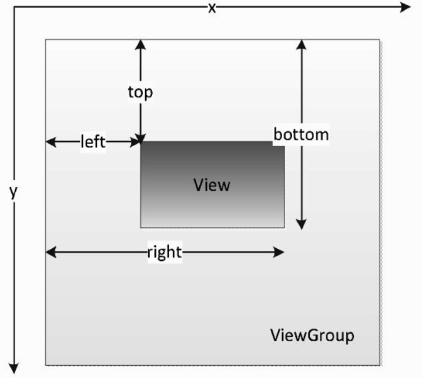
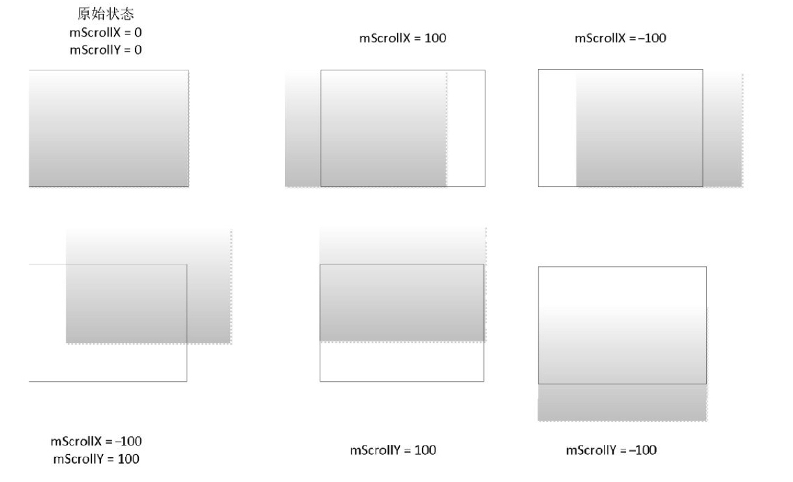
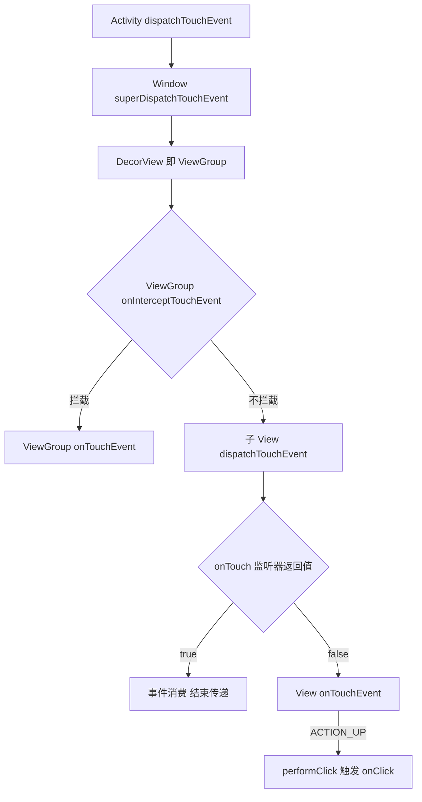

## 1. View 的基础知识

### 1.1 位置参数



View 的位置由四个参数决定:left、top、right、bottom,注意这些参数都是**相对于父容器**的坐标。宽高的计算方式:

```text
width  = right - left
height = bottom - top
```

在 View 的源码中,它们对应 mLeft、mRight、mTop、mBottom 这四个成员变量,获取方式如下:

```java
left   = view.getLeft();
right  = view.getRight();
top    = view.getTop();
bottom = view.getBottom();
```

从 Android 3.0 开始,View 增加了几个额外的参数:x、y、translationX 和 translationY:

- x 和 y 是 View 左上角的坐标
- translationX 和 translationY 是 View 左上角**相对于父容器**的偏移量,默认值为 0

这几个参数同样提供了 get/set 方法,换算关系如下:

```text
x = left + translationX
y = top  + translationY
```

需要注意的是,View 在平移的过程中,top 和 left 表示的是**原始左上角**的位置信息,其值并不会发生改变,此时发生改变的是 x、y、translationX 和 translationY 这四个参数。

### 1.2 MotionEvent 和 TouchSlop

#### MotionEvent

通过 MotionEvent 对象可以得到点击事件发生的 x 和 y 坐标:

- getX/getY:返回相对于**当前 View 左上角**的 x 和 y 坐标
- getRawX/getRawY:返回相对于**手机屏幕左上角**的 x 和 y 坐标

一次触摸交互就是一个 MotionEvent 事件序列,典型的事件类型(补写):

| 事件类型 | 含义 |
| --- | --- |
| ACTION_DOWN | 手指按下,**一个事件序列的开始** |
| ACTION_MOVE | 手指移动 |
| ACTION_UP | 手指抬起,一个事件序列的结束 |
| ACTION_CANCEL | 事件被上层拦截等异常情况下,系统通知 View 取消后续处理 |

#### TouchSlop

**TouchSlop 是系统所能识别出的被认为是滑动的最小距离**,当两次滑动之间的距离小于这个值时,系统不认为这是滑动操作。获取方式:

```java
ViewConfiguration.get(getContext()).getScaledTouchSlop()
```

源码中这个常量定义在 frameworks/base/core/res/res/values/config.xml 中:

```xml
<!--Base "touch slop" value used by ViewConfiguration as a movement threshold where scrolling should begin. -->
    <dimen name="config_viewConfigurationTouchSlop">8dp</dimen>
```

### 1.3 VelocityTracker、GestureDetector 和 Scroller

#### VelocityTracker

**速度追踪**,用于追踪手指在滑动过程中的速度,包括水平和竖直方向的速度。

首先,在 View 的 onTouchEvent 方法中追踪当前单击事件的速度:

```java
VelocityTracker velocityTracker = VelocityTracker.obtain();
velocityTracker.addMovement(event);
```

当想要知道当前的滑动速度时,采用如下方式获得:

```java
velocityTracker.computeCurrentVelocity(1000);
int xVelocity = (int) velocityTracker.getXVelocity();
int yVelocity = (int) velocityTracker.getYVelocity();
```

获取速度之前**必须先调用 computeCurrentVelocity 计算速度**。比如将时间间隔设为 1000ms,在 1s 内手指在水平方向从左向右滑过 100 像素,那么水平速度就是 100;当手指从右往左滑动时,水平方向速度即为负值。computeCurrentVelocity 的参数表示一个时间单元(时间间隔),单位为毫秒,计算得到的速度就是在这个时间间隔内手指在水平或竖直方向上所滑动的像素数:

```text
速度 = (终点位置 - 起点位置) / 时间段
```

当不需要使用它的时候,调用 clear 方法来重置并回收内存:

```java
velocityTracker.clear();
velocityTracker.recycle();
```

#### GestureDetector

**手势检测**,用于辅助检测用户的单击、滑动、长按、双击等行为。

```java
GestureDetector detector = new GestureDetector(new GestureDetector.OnGestureListener() {
    @Override
    public boolean onDown(MotionEvent e) {
        return false;
    }

    @Override
    public void onShowPress(MotionEvent e) {

    }

    @Override
    public boolean onSingleTapUp(MotionEvent e) {
        return false;
    }

    @Override
    public boolean onScroll(MotionEvent e1, MotionEvent e2, float distanceX, float distanceY) {
        return false;
    }

    @Override
    public void onLongPress(MotionEvent e) {

    }

    @Override
    public boolean onFling(MotionEvent e1, MotionEvent e2, float velocityX, float velocityY) {
        return false;
    }
});

// 解决长按屏幕后无法拖动的现象
detector.setIsLongpressEnabled(false);
```



#### Scroller

**弹性滑动对象**,用于实现 View 的弹性滑动,与 computeScroll 方法配合完成平滑滚动的动画效果,详见第 3 节。

## 2. View 的滑动

### 2.1 使用 scrollTo/scrollBy

View 源码:

```java
//The offset, in pixels, by which the content of this view is scrolled horizontally.
protected int mScrollX;
protected int mScrollY;

public void scrollTo(int x, int y) {
    if (mScrollX != x || mScrollY != y) {
        int oldX = mScrollX;
        int oldY = mScrollY;
        mScrollX = x;
        mScrollY = y;
        invalidateParentCaches();
        onScrollChanged(mScrollX, mScrollY, oldX, oldY);
        if (!awakenScrollBars()) {
            postInvalidateOnAnimation();
        }
    }
}

public void scrollBy(int x, int y) {
    scrollTo(mScrollX + x, mScrollY + y);
}
```

mScrollX 和 mScrollY 可以通过 getScrollX 和 getScrollY 方法分别得到。在滑动过程中,**mScrollX 的值总是等于 View 左边缘和 View 内容左边缘在水平方向的距离,mScrollY 的值总是等于 View 上边缘和 View 内容上边缘在竖直方向的距离**。


使用 scrollTo 和 scrollBy 来实现 View 的滑动,只能将 View 的**内容**进行移动,并不能将 View 本身进行移动。

### 2.2 overScrollBy 与 onOverScrolled

```java
protected boolean overScrollBy(int deltaX, int deltaY, int scrollX, int scrollY,int scrollRangeX, int scrollRangeY,int maxOverScrollX, int maxOverScrollY,boolean isTouchEvent) {

    final int overScrollMode = mOverScrollMode;
    final boolean canScrollHorizontal =
            computeHorizontalScrollRange() > computeHorizontalScrollExtent();
    final boolean canScrollVertical =
            computeVerticalScrollRange() > computeVerticalScrollExtent();
    final boolean overScrollHorizontal = overScrollMode == OVER_SCROLL_ALWAYS ||
            (overScrollMode == OVER_SCROLL_IF_CONTENT_SCROLLS && canScrollHorizontal);
    final boolean overScrollVertical = overScrollMode == OVER_SCROLL_ALWAYS ||
            (overScrollMode == OVER_SCROLL_IF_CONTENT_SCROLLS && canScrollVertical);

    int newScrollX = scrollX + deltaX;
    if (!overScrollHorizontal) {
        maxOverScrollX = 0;
    }

    int newScrollY = scrollY + deltaY;
    if (!overScrollVertical) {
        maxOverScrollY = 0;
    }

    // Clamp values if at the limits and record
    final int left = -maxOverScrollX;
    final int right = maxOverScrollX + scrollRangeX;
    final int top = -maxOverScrollY;
    final int bottom = maxOverScrollY + scrollRangeY;

    boolean clampedX = false;
    if (newScrollX > right) {
        newScrollX = right;
        clampedX = true;
    } else if (newScrollX < left) {
        newScrollX = left;
        clampedX = true;
    }

    boolean clampedY = false;
    if (newScrollY > bottom) {
        newScrollY = bottom;
        clampedY = true;
    } else if (newScrollY < top) {
        newScrollY = top;
        clampedY = true;
    }

    onOverScrolled(newScrollX, newScrollY, clampedX, clampedY);

    return clampedX || clampedY;
}
```

> Scroll the view with standard behavior for scrolling beyond the normal content boundaries. Views that call this method should override `onOverScrolled(int, int, boolean, boolean)` to respond to the results of an over-scroll operation. Views can use this method to handle any touch or fling-based scrolling.

| Parameters | 说明 |
| :--- | --- |
| deltaX int | Change in X in pixels |
| scrollX int | Current X scroll value in pixels before applying deltaX |
| scrollRangeX int | Maximum content scroll range along the X axis |
| maxOverScrollX int | Number of pixels to overscroll by in either direction along the X axis. 允许超过滚动范围的最大值,x 方向的滚动范围就是 0~maxOverScrollX |
| isTouchEvent boolean | true if this scroll operation is the result of a touch event. 是否在 onTouchEvent 中调用的这个函数。当在 computeScroll 中调用这个函数时,就可以传入 false |

```java
protected void onOverScrolled (int scrollX,
                int scrollY,
                boolean clampedX,
                boolean clampedY){
                }
```

> Called by `overScrollBy(int, int, int, int, int, int, int, int, boolean)` to respond to the results of an over-scroll operation.

| Parameters | 说明 |
| :--- | --- |
| scrollX int | New X scroll value in pixels |
| clampedX boolean | True if scrollX was clamped to an over-scroll boundary, 表示是否到达超出滚动范围的最大值。如果为 true,就需要调用 OverScroll 的 springBack 函数来让视图恢复原来位置 |

### 2.3 使用动画

```java
ObjectAnimator.ofFloat(targetView, "translationX", 0, 100)
        .setDuration(100).start();
```

### 2.4 改变布局参数

```java
MarginLayoutParams params = (MarginLayoutParams) mButton1.getLayoutParams();
params.width += 100;
params.leftMargin += 100;
mButton1.requestLayout();
// 或者 mButton1.setLayoutParams(params);
```

三种滑动方式的对比:

| 方式 | 本质 | 适用场景 |
| :--- | --- | --- |
| scrollTo/scrollBy | 移动 View 的内容,不影响布局 | 简单的内容平移 |
| 动画 | 改变 translationX/Y(属性动画)或视觉位置(View Animation) | 需要平移、渐变等效果 |
| 改变布局参数 | 修改 LayoutParams 后重新布局 | 需要真正改变 View 位置 |

## 3. 弹性滑动 Scroller

Scroller 本身无法让 View 弹性滑动,需要与 View 的 computeScroll 方法配合:

```java
Scroller mScroller = new Scroller(context);

@Override
public void computeScroll() {
    if (mScroller.computeScrollOffset()) {
        scrollTo(mScroller.getCurrX(), mScroller.getCurrY());
        postInvalidate();
    }
}

// 缓慢滚动到指定位置
private void smoothScrollTo(int destX, int destY) {
    int scrollX = getScrollX();
    int delta = destX - scrollX;
    // 1000ms内滑向destX，效果就是慢慢滑动
    mScroller.startScroll(scrollX, 0, delta, 0, 1000);
    invalidate();
}
```

当我们构造一个 Scroller 对象并且调用它的 startScroll 方法时,Scroller 内部其实什么也没做,它只是保存了我们传递的几个参数:

```java
public class Scroller  {
    private int mMode;

    private int mStartX;
    private int mStartY;
    private int mFinalX;
    private int mFinalY;

    private int mMinX;
    private int mMaxX;
    private int mMinY;
    private int mMaxY;

    private int mCurrX;
    private int mCurrY;
    private long mStartTime;
    private int mDuration;
    private float mDurationReciprocal;
    private float mDeltaX;
    private float mDeltaY;
    private boolean mFinished;
    private boolean mFlywheel;

    private float mVelocity;
    private float mCurrVelocity;
    private int mDistance;
}
```

```java
public class Scroller  {

    public void startScroll(int startX, int startY, int dx, int dy, int duration) {
        mMode = SCROLL_MODE;
        mFinished = false;
        mDuration = duration;
        mStartTime = AnimationUtils.currentAnimationTimeMillis();
        mStartX = startX;
        mStartY = startY;
        mFinalX = startX + dx;
        mFinalY = startY + dy;
        mDeltaX = dx;
        mDeltaY = dy;
        mDurationReciprocal = 1.0f / (float) mDuration;
    }
}
```

滑动主要通过 invalidate 触发:invalidate 方法会导致 View 重绘,在 View 的 draw 方法中又会去调用 computeScroll 方法。computeScroll 向 Scroller 获取当前的 scrollX 和 scrollY,然后通过 scrollTo 方法实现滑动;接着又调用 postInvalidate 方法来进行第二次重绘,这一次重绘的过程和第一次重绘一样,还是会导致 computeScroll 方法被调用;然后继续向 Scroller 获取当前的 scrollX 和 scrollY,并通过 scrollTo 方法滑动到新的位置,如此反复,直到整个滑动过程结束。

```java
//Call this when you want to know the new location. If it returns true, the animation is not yet finished.
public boolean computeScrollOffset() {
    if (mFinished) {
        return false;
    }

    int timePassed = (int)(AnimationUtils.currentAnimationTimeMillis() - mStartTime);

    if (timePassed < mDuration) {
        switch (mMode) {
        case SCROLL_MODE:
            final float x = mInterpolator.getInterpolation(timePassed * mDurationReciprocal);
            mCurrX = mStartX + Math.round(x * mDeltaX);
            mCurrY = mStartY + Math.round(x * mDeltaY);
            break;
        case FLING_MODE:
            final float t = (float) timePassed / mDuration;
            final int index = (int) (NB_SAMPLES * t);
            float distanceCoef = 1.f;
            float velocityCoef = 0.f;
            if (index < NB_SAMPLES) {
                final float t_inf = (float) index / NB_SAMPLES;
                final float t_sup = (float) (index + 1) / NB_SAMPLES;
                final float d_inf = SPLINE_POSITION[index];
                final float d_sup = SPLINE_POSITION[index + 1];
                velocityCoef = (d_sup - d_inf) / (t_sup - t_inf);
                distanceCoef = d_inf + (t - t_inf) * velocityCoef;
            }

            mCurrVelocity = velocityCoef * mDistance / mDuration * 1000.0f;

            mCurrX = mStartX + Math.round(distanceCoef * (mFinalX - mStartX));
            // Pin to mMinX <= mCurrX <= mMaxX
            mCurrX = Math.min(mCurrX, mMaxX);
            mCurrX = Math.max(mCurrX, mMinX);

            mCurrY = mStartY + Math.round(distanceCoef * (mFinalY - mStartY));
            // Pin to mMinY <= mCurrY <= mMaxY
            mCurrY = Math.min(mCurrY, mMaxY);
            mCurrY = Math.max(mCurrY, mMinY);

            if (mCurrX == mFinalX && mCurrY == mFinalY) {
                mFinished = true;
            }

            break;
        }
    }
    else {
        mCurrX = mFinalX;
        mCurrY = mFinalY;
        mFinished = true;
    }
    return true;
}
```

这个方法会根据时间的流逝来计算出当前的 scrollX 和 scrollY 的值:根据时间流逝的百分比来算出 scrollX 和 scrollY 改变的百分比并计算出当前的值。

弹性滑动的实现,还可以通过动画或延时策略,如使用 Handler 延时消息模拟逐帧滑动:

```java
private static final int MESSAGE_SCROLL_TO = 1;
private static final int FRAME_COUNT = 30;
private static final int DELAYED_TIME = 33;
private int mCount = 0;
@SuppressLint("HandlerLeak")
private Handler mHandler = new Handler() {
    public void handleMessage(Message msg) {
        switch (msg.what) {
        case MESSAGE_SCROLL_TO: {
            mCount++;
            if (mCount <= FRAME_COUNT) {
                float fraction = mCount / (float) FRAME_COUNT;
                int scrollX = (int) (fraction * 100);
                mButton1.scrollTo(scrollX, 0);
                mHandler.sendEmptyMessageDelayed(MESSAGE_SCROLL_TO,
                DELAYED_TIME);
            }
            break;
        }
        default:
            break;
        }
    };
};
```

## 4. 事件分发机制

### 4.1 Activity 对点击事件的分发过程

点击事件产生后最先传递给 Activity,由其 dispatchTouchEvent 来进行分发:

```java
public boolean dispatchTouchEvent(MotionEvent ev) {
    if (ev.getAction() == MotionEvent.ACTION_DOWN) {
        onUserInteraction();
    }
    if (getWindow().superDispatchTouchEvent(ev)) {
        return true;
    }
    return onTouchEvent(ev);
}
```

PhoneWindow 中的分发,最终会传递到 ViewGroup(DecorView)中:

```java
@Override
public boolean superDispatchTouchEvent(MotionEvent event) {
    return mDecor.superDispatchTouchEvent(event);
}
```

### 4.2 事件分发核心流程(补写)

一个点击事件产生后,传递顺序为:**Activity → Window → ViewGroup → View**。事件分发的本质是一个责任链:由 dispatchTouchEvent 分发,onInterceptTouchEvent 拦截(仅 ViewGroup 有),onTouchEvent 消费。ViewGroup 的 dispatchTouchEvent 核心逻辑可以用如下伪代码表达:

```java
public boolean dispatchTouchEvent(MotionEvent ev) {
    boolean consumed = false;
    if (onInterceptTouchEvent(ev)) {
        // 自己拦截,交给自己的 onTouchEvent 处理
        consumed = onTouchEvent(ev);
    } else {
        // 不拦截,交给子 View 继续分发
        consumed = child.dispatchTouchEvent(ev);
    }
    return consumed;
}
```



三条核心结论:

- **onInterceptTouchEvent 只有 ViewGroup 拥有**,View 没有该方法;一旦 ViewGroup 拦截了某次事件序列的 DOWN 事件,同一序列的后续事件不再询问它是否拦截,直接交给它的 onTouchEvent 处理。
- 某个 View 一旦开始处理事件,**如果它不消费 ACTION_DOWN 事件(onTouchEvent 返回 false),同一事件序列的其他事件不会再交给它处理**。
- 如果事件最终无人消费,将回传给 Activity 的 onTouchEvent 处理。

### 4.3 View 对点击事件的处理过程(补写)

View(不含 ViewGroup)的 dispatchTouchEvent 简化逻辑:

```java
public boolean dispatchTouchEvent(MotionEvent event) {
    if (mOnTouchListener != null && (mViewFlags & ENABLED_MASK) == ENABLED
            && mOnTouchListener.onTouch(this, event)) {
        return true;
    }
    return onTouchEvent(event);
}
```

由此可见,View 对事件的处理优先级为:**onTouch → onTouchEvent → onClick**。onTouchListener 的 onTouch 返回 true 时,onTouchEvent 与 onClick 都不会被调用;onTouchEvent 在 ACTION_UP 中会调用 performClick,进而触发 onClickListener 的 onClick 回调。

## 5. 滑动冲突

### 5.1 外部拦截法

**重写父容器的 onInterceptTouchEvent 方法,在内部做相应的拦截**。事件先经过父容器,由父容器判断本次事件该自己处理还是交给子 View:

```java
public boolean onInterceptTouchEvent(MotionEvent event) {
    boolean intercepted = false;
    int x = (int) event.getX();
    int y = (int) event.getY();
    switch (event.getAction()) {
        case MotionEvent.ACTION_DOWN: {
            // DOWN 事件必须返回 false,否则后续事件都无法传给子 View
            intercepted = false;
            break;
        }
        case MotionEvent.ACTION_MOVE: {
            if (父容器需要当前点击事件) {
                intercepted = true;
            } else {
                intercepted = false;
            }
            break;
        }
        case MotionEvent.ACTION_UP: {
            // 返回 false,避免自己消费 UP 事件导致子 View 的 onClick 无法触发
            intercepted = false;
            break;
        }
        default:
            break;
    }

    mLastXIntercept = x;
    mLastYIntercept = y;
    return intercepted;
}
```

### 5.2 内部拦截法

**重写子 View 的 dispatchTouchEvent 方法,配合父容器的 onInterceptTouchEvent 使用**。父容器默认拦截除了 DOWN 以外的所有事件,子 View 判断事件该自己处理时,通过 requestDisallowInterceptTouchEvent 禁止父容器拦截:

```java
public boolean dispatchTouchEvent(MotionEvent event) {
    int x = (int) event.getX();
    int y = (int) event.getY();
    switch (event.getAction()) {
        case MotionEvent.ACTION_DOWN: {
            // DOWN 事件父容器不会拦截,这里禁止父容器拦截后续 MOVE/UP
            parent.requestDisallowInterceptTouchEvent(true);
            break;
        }
        case MotionEvent.ACTION_MOVE: {
            int deltaX = x - mLastX;
            int deltaY = y - mLastY;
            if (父容器需要此类点击事件) {
                // 放行给父容器拦截
                parent.requestDisallowInterceptTouchEvent(false);
            }
            break;
        }
        case MotionEvent.ACTION_UP: {
            break;
        }
        default:
            break;
    }
    mLastX = x;
    mLastY = y;
    return super.dispatchTouchEvent(event);
}
```

内部拦截法要求父容器配合:ACTION_DOWN 返回 false,其他事件默认返回 true,即默认拦截所有事件,只依据子 View 的放行决定是否拦截。
