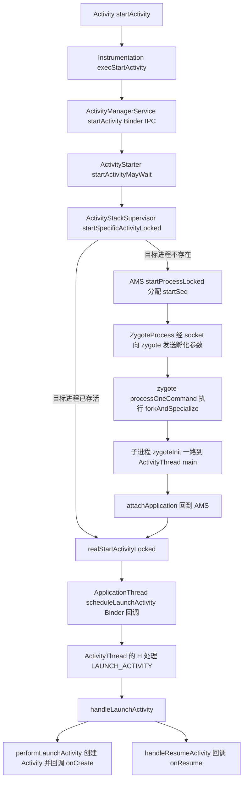
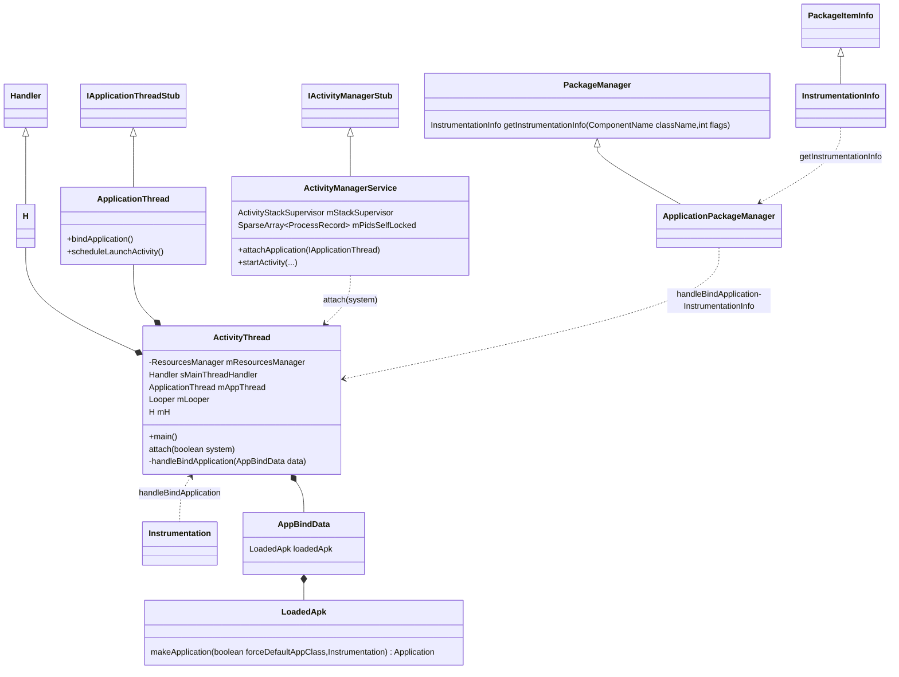
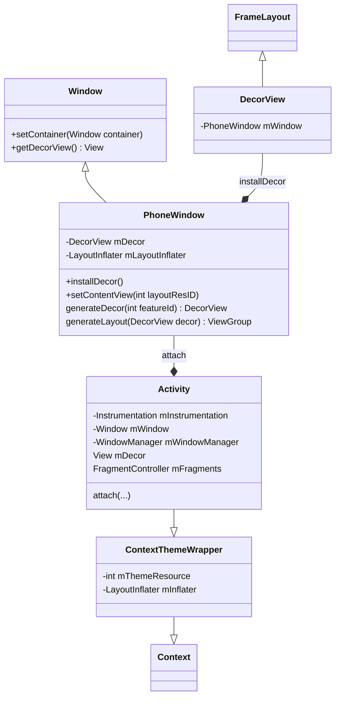
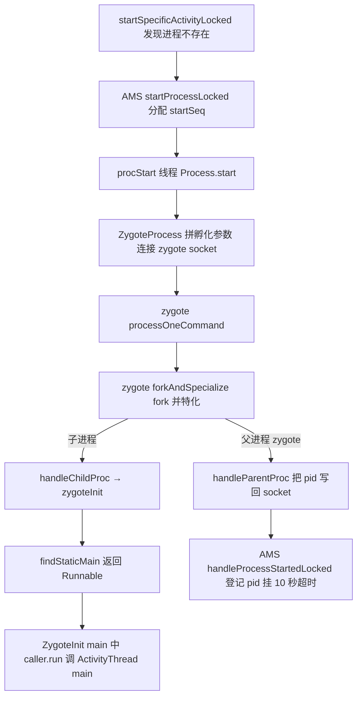
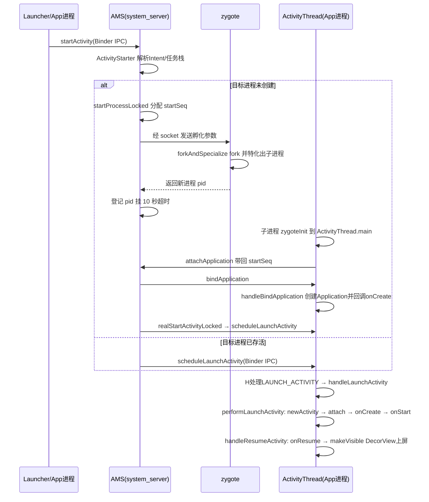

## 1. 概述与版本说明

本文基于 **Android 9.0（API 28）** 前后的 AOSP 源码，分析 Activity 从 `startActivity()` 到 `onCreate()`/`onResume()` 回调的完整启动流程。

整个启动流程主要在发起方 App 进程与 system_server 两个进程间往复；冷启动时目标进程还不存在，AMS 会先请 zygote fork 出目标进程，再继续后面的阶段。据此把流程拆成三个阶段，冷启动时在 ② 与 ③ 之间插入一段进程孵化（表中 ②′，第 5 节单独展开）：

| 阶段 | 所在进程 | 核心调用链 |
| --- | --- | --- |
| ① 发起启动 | App 进程 | `Activity.startActivity()` → `Instrumentation.execStartActivity()` |
| ② 处理启动请求 | system_server 进程 | `AMS.startActivity()` → `ActivityStarter` → `ActivityStackSupervisor.realStartActivityLocked()` |
| ②′ 孵化进程（仅冷启动） | system_server → zygote → 新进程 | `startSpecificActivityLocked` → `startProcessLocked` → `ZygoteProcess` 经 socket 请求 → `forkAndSpecialize` → `ActivityThread.main` |
| ③ 创建并回调 | App 进程 | `ApplicationThread.scheduleLaunchActivity()` → `ActivityThread.handleLaunchActivity()` → `performLaunchActivity()` |

> **版本注意（Android 9/10+）**：生命周期调度方面，**ClientTransaction 事务机制**（`LaunchActivityItem`/`ResumeActivityItem` 等事务项经 `TransactionExecutor` 派发）从 **Android 9.0** 起就已取代 `scheduleLaunchActivity` 这组方法；本文正文仍按 `scheduleLaunchActivity` 的经典链路讲解（对应 8.x 及之前的形态，也便于对照旧资料），核心思路不变。Android 10 起，AMS 中 Activity 相关职责进一步迁移到 **ATMS（ActivityTaskManagerService）**，`ActivityStack`、`ActivityStarter` 等类移入 `ActivityTaskManager` 命名空间。流程骨架对各版本仍然适用。
>
> 文中代码为**摘编版**：保留了主干逻辑与关键调用，省略了日志、异常样板、参数透传等细节，便于快速把握原理；行号为方法的准确入口，可对照原始 AOSP 阅读。

从 Activity 启动到生命周期回调的完整调用链：



## 2. 整体类关系

### 2.1 App 进程侧

ActivityThread 是 App 进程的主线程入口，持有 ApplicationThread（Binder Stub，接收 AMS 回调）与 H（主线程 Handler）；LoadedApk 负责创建 Application：



### 2.2 Activity 与 Window

Activity 并不直接持有 View 树，而是通过 PhoneWindow 间接管理，DecorView 是窗口的根 View：



关系链：**Activity → PhoneWindow → DecorView（根 FrameLayout）→ 布局内容**。`setContentView()` 实际是把布局塞进 DecorView 的内容区域。

## 3. 阶段①：App 进程发起启动

### 3.1 Activity.startActivity / startActivityForResult

`startActivity()` 最终都走到 `startActivityForResult()`，requestCode 为 -1 表示不需要返回结果：

```java
@Override
public void startActivity(Intent intent, @Nullable Bundle options) {
    if (options != null) {
        startActivityForResult(intent, -1, options);
    } else {
        startActivityForResult(intent, -1);
    }
}
```

```java
public void startActivityForResult(Intent intent, int requestCode, @Nullable Bundle options) {
    if (mParent == null) {
        // 交给 Instrumentation 发起, 把 ApplicationThread 传给 AMS 作为回调通道
        Instrumentation.ActivityResult ar = mInstrumentation.execStartActivity(
                this, mMainThread.getApplicationThread(), mToken, this,
                intent, requestCode, options);
        if (ar != null) {
            mMainThread.sendActivityResult(...);
        }
        ...
    } else {
        mParent.startActivityFromChild(this, intent, requestCode, options);
    }
}
```

注意传给 `execStartActivity()` 的 `mMainThread.getApplicationThread()`——把 App 进程的 ApplicationThread Binder 对象带过去，AMS 之后就是靠它回调 App 进程的。

### 3.2 Instrumentation

Instrumentation 是 App 与系统交互的"工具人"：Activity/Application 的创建和生命周期回调都经它之手，同时它也是自动化测试（如 ActivityMonitor 拦截启动）的挂载点。

```java
public class Instrumentation {
    private List<ActivityMonitor> mActivityMonitors;

    // 生命周期回调统一入口
    public void callActivityOnCreate(Activity activity, Bundle icicle, ...) {
        prePerformCreate(activity);
        activity.performCreate(icicle, persistentState);  // 内部回调 onCreate
        postPerformCreate(activity);
    }

    public void callApplicationOnCreate(Application app) {
        app.onCreate();
    }
}
```

内部类 ActivityMonitor，用于测试时拦截匹配的 Intent：

```java
public static class ActivityMonitor {
    private final IntentFilter mWhich;
    private final ActivityResult mResult;
    private final boolean mBlock;   // 为 true 时拦截启动, 不真正 start
    ...
}
```

**execStartActivity**——真正跨进程发起启动：

```java
public ActivityResult execStartActivity(Context who, IBinder contextThread,
        IBinder token, Activity target, Intent intent, int requestCode, Bundle options) {
    IApplicationThread whoThread = (IApplicationThread) contextThread;

    // 测试用的 ActivityMonitor 拦截: 命中且阻塞则直接返回, 不发起启动
    if (mActivityMonitors != null) {
        for (ActivityMonitor am : mActivityMonitors) {
            if (am.match(who, null, intent)) {
                am.mHits++;
                if (am.isBlocking()) {
                    return requestCode >= 0 ? am.getResult() : null;
                }
                break;
            }
        }
    }

    try {
        intent.prepareToLeaveProcess(who);
        // Binder IPC 到 system_server, 启动交由 AMS 处理
        int result = ActivityManager.getService().startActivity(
                whoThread, who.getBasePackageName(), intent,
                intent.resolveTypeIfNeeded(who.getContentResolver()),
                token, target != null ? target.mEmbeddedID : null,
                requestCode, 0, null, options);
        // 检查启动结果: "Unable to find explicit activity class..." 等异常的抛出点
        checkStartActivityResult(result, intent);
    } catch (RemoteException e) {
        throw new RuntimeException("Failure from system", e);
    }
    return null;
}
```

InstrumentationInfo 描述 manifest 中 `<instrumentation>` 标签的信息：

```java
public class InstrumentationInfo extends PackageItemInfo implements Parcelable {
     public String targetPackage;
     public String targetProcesses;
     ...
}
```

## 4. 阶段②：system_server 进程处理

### 4.1 AMS 的获取：ActivityManager.getService

App 进程通过 `ActivityManager.getService()` 拿到 AMS 的 Binder 代理，底层是 `ServiceManager` 查询名为 `Context.ACTIVITY_SERVICE`（"activity"）的服务：

```java
public class ActivityManager {
    public static IActivityManager getService() {
        return IActivityManagerSingleton.get();
    }

    private static final Singleton<IActivityManager> IActivityManagerSingleton =
            new Singleton<IActivityManager>() {
        @Override
        protected IActivityManager create() {
            final IBinder b = ServiceManager.getService(Context.ACTIVITY_SERVICE);
            return IActivityManager.Stub.asInterface(b);
        }
    };
}
```

AMS 本体是 `IActivityManager.Stub` 的实现，内部由 ActivityStackSupervisor 管理所有 Activity 栈，由 mPidsSelfLocked 按 pid 索引进程记录：

```java
public class ActivityManagerService extends IActivityManager.Stub
        implements Watchdog.Monitor, BatteryStatsImpl.BatteryCallback {

    final ActivityStackSupervisor mStackSupervisor;          // 管理所有 Activity 栈
    final SparseArray<ProcessRecord> mPidsSelfLocked;        // 按 pid 索引运行中的进程
    final ActivityStarter mActivityStarter;                   // 启动决策者
    ...
}
```

### 4.2 AMS.startActivity → ActivityStarter

AMS 只做权限/Multi-user 校验，随即转交给 ActivityStarter：

```java
@Override
public final int startActivity(IApplicationThread caller, String callingPackage,
        Intent intent, String resolvedType, IBinder resultTo, ...) {
    return startActivityAsUser(caller, callingPackage, intent, ..., UserHandle.getCallingUserId());
}

@Override
public final int startActivityAsUser(..., int userId) {
    enforceNotIsolatedCaller("startActivity");
    userId = mUserController.handleIncomingUser(...);
    // 转交 ActivityStarter
    return mActivityStarter.startActivityMayWait(caller, -1, callingPackage, intent, ...,
            userId, null, "startActivityAsUser");
}
```

### 4.3 ActivityStarter：startActivityMayWait 与 startActivityUnchecked

ActivityStarter 负责 Intent 解析、launchMode/flag/任务栈（TaskRecord）的决策。`startActivityMayWait()` 先解析出目标 ActivityInfo，再进入同名的 `startActivity(...)` 重载：

```java
class ActivityStarter {
    private final ActivityManagerService mService;
    private final ActivityStackSupervisor mSupervisor;
}

final int startActivityMayWait(IApplicationThread caller, ..., Intent intent, ..., int userId, ...) {
    // 拷贝一份 intent, 不修改调用方的对象
    intent = new Intent(intent);

    // 通过 PMS 解析 Intent 对应的 ActivityInfo
    ActivityInfo aInfo = mSupervisor.resolveActivity(intent, rInfo, startFlags, profilerInfo);

    synchronized (mService) {
        ...
        // 进入启动主链
        int res = startActivity(caller, intent, ..., aInfo, rInfo, ..., reason);
        ...
        return res;
    }
}
```

这个 `startActivity(...)` 重载做三件事：

- **校验**：caller 进程记录、组件能否解析（`Unable to find explicit activity class` 一类错误码在此返回）、`checkStartAnyActivityPermission` 权限与 IntentFirewall 检查、App 切换检查 `checkAppSwitchAllowedLocked`——处于不允许切换的时段则把请求挂进 PendingActivityLaunch 稍后重试。
- **拦截**：权限审查（mPermissionReviewRequired）会把 Intent 整个替换成权限确认页 ACTION_REVIEW_PERMISSIONS；ActivityStartInterceptor 则处理静音工作资料、应用被暂停（suspended）等场景。
- **登记**：为目标 activity new 出一个 ActivityRecord——4.4 节 realStartActivityLocked 操作的就是它。

之后经一层薄包装进入真正的决策函数：

```java
private int startActivity(final ActivityRecord r, ActivityRecord sourceRecord, ...) {
    int result = START_CANCELED;
    try {
        mService.mWindowManager.deferSurfaceLayout();   // 暂停 surface 布局, 避免切换中间态闪烁
        result = startActivityUnchecked(r, sourceRecord, ...);
    } finally {
        // 启动失败: 把刚入栈的 ActivityRecord 回收掉
        if (!ActivityManager.isStartResultSuccessful(result) && stack != null) {
            stack.finishActivityLocked(mStartActivity, RESULT_CANCELED,
                    null, "startActivity", true);
        }
        mService.mWindowManager.continueSurfaceLayout();
    }
    return result;
}
```

**startActivityUnchecked** 是 launchMode 与任务栈决策的核心——名字里的 Unchecked 指"参数与权限校验已在调用方完成"，这里只做决策。可分三步看。

第一步，初始化状态与修正 flags：

```java
setInitialState(r, options, inTask, doResume, ...);    // launchMode、launchFlags、mDoResume 等
computeLaunchingTaskFlags();
// 按场景补 FLAG_ACTIVITY_NEW_TASK: 非 Activity 的 context 发起(无源任务可依附)、
// 发起方是 singleInstance、目标声明 singleTask/singleInstance
computeSourceStack();       // 源 activity 正在 finish 则改走 NEW_TASK, 避免落入将销毁的任务
mIntent.setFlags(mLaunchFlags);
```

第二步，查找可复用的已有实例与任务——这两个分支命中任何一个都直接返回，不再新建实例：

```java
// 条件: NEW_TASK 且未要求 MULTIPLE_TASK, 或目标为 singleTask/singleInstance
ActivityRecord reusedActivity = getReusableIntentActivity();
if (reusedActivity != null) {
    // 把目标所在任务带到前台; 配合 CLEAR_TOP 时清掉它之上的 activity
    reusedActivity = setTargetStackAndMoveToFrontIfNeeded(reusedActivity);
    ...
    if (!mAddingToTask && mReuseTask == null) {
        // 任务被移到前台返回 START_TASK_TO_FRONT, 本就在顶端返回 START_DELIVERED_TO_TOP
        resumeTargetStackIfNeeded();
        return mMovedToFront ? START_TASK_TO_FRONT : START_DELIVERED_TO_TOP;
    }
}

// 目标恰好是栈顶且 singleTop/singleTask: 不建新实例, 只投递 onNewIntent
final ActivityRecord top = topStack.topRunningNonDelayedActivityLocked(mNotTop);
final boolean dontStart = top != null && mStartActivity.resultTo == null
        && top.realActivity.equals(mStartActivity.realActivity)
        && ((mLaunchFlags & FLAG_ACTIVITY_SINGLE_TOP) != 0
        || isLaunchModeOneOf(LAUNCH_SINGLE_TOP, LAUNCH_SINGLE_TASK));
if (dontStart) {
    mSupervisor.resumeFocusedStackTopActivityLocked();  // 确保栈顶正确 resume
    deliverNewIntent(top);                              // onNewIntent 的来源
    return START_DELIVERED_TO_TOP;
}
```

第三步，确需新建实例时决定任务归属（四选一），入栈并触发 resume：

```java
if (mStartActivity.resultTo == null && mInTask == null && !mAddingToTask
        && (mLaunchFlags & FLAG_ACTIVITY_NEW_TASK) != 0) {
    newTask = true;
    result = setTaskFromReuseOrCreateNewTask(...);  // 新建 TaskRecord (冷启动多走这条)
} else if (mSourceRecord != null) {
    result = setTaskFromSourceRecord();             // 放进发起方的任务 (普通场景)
} else if (mInTask != null) {
    result = setTaskFromInTask();                   // 放进指定任务 (系统内部使用)
} else {
    setTaskToCurrentTopOrCreateNewTask();           // 兜底: 当前顶端任务或新建
}

mTargetStack.startActivityLocked(mStartActivity, topFocused, newTask, ...);  // ActivityStack 侧入栈
if (mDoResume) {
    ...
    mSupervisor.resumeFocusedStackTopActivityLocked(mTargetStack, mStartActivity, mOptions);
}
return START_SUCCESS;
```

注意同名陷阱：这里的 `ActivityStack.startActivityLocked()` 与启动链同名，但职责只是把 ActivityRecord 加入任务栈并在 WMS 侧登记窗口 token——AMS 源码里大量 `xxxLocked` 后缀表示"持有 AMS 大锁调用"，并非"锁定"。

resume 这一行往下：`resumeFocusedStackTopActivityLocked` → 焦点栈的 `resumeTopActivityUncheckedLocked`/`resumeTopActivityInnerLocked`——这里会先安排前一个 activity pause（ActivityStack 内部的切换调度），在栈顶就绪时最终调用 `ActivityStackSupervisor.startSpecificActivityLocked()`。若目标进程已存活则直接 `realStartActivityLocked()`（4.4 节）；否则转入进程孵化链路（第 5 节）：AMS 经 zygote fork 新进程，等新进程 attach 到 AMS 后再走 `realStartActivityLocked()`。

### 4.4 ActivityStackSupervisor.realStartActivityLocked

realStartActivityLocked 完成进程与 ActivityRecord 的绑定，并通过 `app.thread.scheduleLaunchActivity()` Binder 回调到 App 进程。

冷启动时，新进程起来后 AMS 会在 `attachApplicationLocked()` 中找到等待在该进程运行的 top Activity，再调用 realStartActivityLocked：

```java
public class ActivityStackSupervisor extends ConfigurationContainer {

    boolean attachApplicationLocked(ProcessRecord app) {
        boolean didSomething = false;
        for (each display -> each stack) {
            if (!isFocusedStack(stack)) continue;                    // 只关注焦点栈
            final ActivityRecord top = stack.topRunningActivityLocked();
            for (ActivityRecord activity : 所有可见activity) {
                // 找到等待在该进程运行的 activity (uid + processName 匹配)
                if (activity.app == null && app.uid == activity.info.applicationInfo.uid
                        && processName.equals(activity.processName)) {
                    if (realStartActivityLocked(activity, app,
                            top == activity /* andResume */, true /* checkConfig */)) {
                        didSomething = true;
                    }
                }
            }
        }
    }
}
```

```java
final boolean realStartActivityLocked(ActivityRecord r, ProcessRecord app,
        boolean andResume, boolean checkConfig) {
    final TaskRecord task = r.getTask();
    final ActivityStack stack = task.getStack();
    try {
        r.app = app;                                   // ActivityRecord 绑定到目标进程
        ...
        app.activities.add(r);                         // 进程侧记录该 activity
        mService.updateLruProcessLocked(app, true, null);  // 更新 LRU 与 oom_adj
        mService.updateOomAdjLocked();

        // 关键一步: 通过 Binder 回调 App 进程, 真正去创建 Activity
        app.thread.scheduleLaunchActivity(new Intent(r.intent), r.appToken,
                System.identityHashCode(r), r.info,
                mergedConfiguration.getGlobalConfiguration(),
                mergedConfiguration.getOverrideConfiguration(), r.compat,
                r.launchedFromPackage, task.voiceInteractor, app.repProcState, r.icicle,
                r.persistentState, results, newIntents, !andResume,
                mService.isNextTransitionForward(), profilerInfo);
    } finally {
        endDeferResume();
    }
}
```

ProcessRecord 中持有的 `thread` 就是 App 进程的 ApplicationThread 代理：

```java
final class ProcessRecord {
    IApplicationThread thread;

    public void makeActive(IApplicationThread _thread, ProcessStatsService tracker) {
        thread = _thread;
    }
}
```

## 5. 冷启动分叉：经 zygote fork 新进程

4.3 节末尾的分叉点在这里展开：目标进程不存在时，AMS 自己并不能创建进程——Android 的 Java 进程全部由 **zygote** fork 出来。这条链路跨三个角色：system_server 发起请求、zygote 执行 fork、新进程把自己初始化成应用进程，全程只多一次 socket 往返：



### 5.1 ActivityStackSupervisor.startSpecificActivityLocked

startSpecificActivityLocked 是进程维度的分叉点：先按 processName + uid 查 ProcessRecord，进程活着就直接走 4.4 节的 realStartActivityLocked（热启动路径）；查不到、或 Binder 调用抛异常说明进程刚死，才转去孵化：

```java
void startSpecificActivityLocked(ActivityRecord r, boolean andResume, boolean checkConfig) {
    // 目标 activity 的进程是否已在运行?
    ProcessRecord app = mService.getProcessRecordLocked(r.processName,
            r.info.applicationInfo.uid, true);

    if (app != null && app.thread != null) {
        try {
            if ((r.info.flags & ActivityInfo.FLAG_MULTIPROCESS) == 0
                    || !"android".equals(r.info.packageName)) {
                // 非 multiprocess 的组件才记入进程的包列表, 供杀进程时反向查找
                app.addPackage(r.info.packageName, r.info.versionCode, mService.mProcessStats);
            }
            realStartActivityLocked(r, app, andResume, checkConfig);   // 热路径: 直接启动
            return;
        } catch (Exception e) { ... }
        // realStartActivityLocked 抛 RemoteException 说明进程已死, 落到下面重新拉起
    }

    // 冷路径: 交 AMS 孵化新进程, hostingType 标记为 "activity"
    mService.startProcessLocked(r.processName, r.info.applicationInfo, true, 0,
            "activity", r.intent.getComponent(), false, false, true);
}
```

### 5.2 AMS.startProcessLocked：确定入口类与孵化参数

startProcessLocked 在 9.0 的 AMS 里是一组同名重载（Android 10 起才迁入 ProcessList）：外层复查 ProcessRecord、做 bad process 检查与 isolated uid 分配，内层向 PMS 查 gids、计算 runtimeFlags 与 seInfo、确定目标 ABI（Application Binary Interface）。去掉这些准备动作，主干只有两步——确定入口类、发起孵化：

```java
// Start the process.  It will either succeed and return a result containing
// the PID of the new process, or else throw a RuntimeException.
final String entryPoint = "android.app.ActivityThread";   // 孵化入口写死
```

```java
private ProcessStartResult startProcess(String hostingType, String entryPoint, ...) {
    final ProcessStartResult startResult;
    if (hostingType.equals("webview_service")) {
        // WebView 渲染进程走独立的 webview_zygote, 不从主 zygote fork
        startResult = startWebView(entryPoint, app.processName, uid, uid, gids, ...);
    } else {
        startResult = Process.start(entryPoint, app.processName, uid, uid, gids, runtimeFlags,
                mountExternal, app.info.targetSdkVersion, seInfo, requiredAbi,
                instructionSet, app.info.dataDir, invokeWith,
                new String[] {PROC_START_SEQ_IDENT + app.startSeq});   // 捎带孵化编号
    }
    return startResult;
}
```

### 5.3 startSeq 与 10 秒超时：孵化的可靠性兜底

fork 是异步的：AMS 发出请求后，子进程何时起来、起来后能否正常 attach 都不确定。为了状态机不乱，AMS 在孵化前后做三件事。

**分配编号**。每次孵化分配一个自增的 startSeq，随孵化参数传进子进程，再随 attachApplication 带回——pid 可能被系统复用，只有编号对上才能确认"这个 pid 确实是本次孵化的产物"：

```java
final long startSeq = app.startSeq = ++mProcStartSeqCounter;   // 孵化请求编号
```

**异步孵化**。与 zygote 的 socket 往来默认 post 到专用的 procStart 线程，不抱着 AMS 大锁等 fork：

```java
if (mConstants.FLAG_PROCESS_START_ASYNC) {
    mProcStartHandler.post(() -> {
        synchronized (ActivityManagerService.this) {
            mPendingStarts.put(startSeq, app);        // 未完成孵化的登记表
        }
        final ProcessStartResult startResult = startProcess(...);   // socket 往来在这里发生
        synchronized (ActivityManagerService.this) {
            handleProcessStartedLocked(app, startResult, startSeq);
        }
    });
    return true;
}
```

**超时兜底**。拿到 pid 后登记 mPidsSelfLocked 并挂一条延迟消息：普通进程 10 秒（`PROC_START_TIMEOUT = 10*1000`），带 wrapper（如用 Valgrind 调试）的放宽到 20 分钟；超时仍未 attach 就 processStartTimedOutLocked 杀掉进程：

```java
synchronized (mPidsSelfLocked) {
    this.mPidsSelfLocked.put(pid, app);
    if (!procAttached) {
        Message msg = mHandler.obtainMessage(PROC_START_TIMEOUT_MSG);
        msg.obj = app;
        mHandler.sendMessageDelayed(msg, usingWrapper
                ? PROC_START_TIMEOUT_WITH_WRAPPER : PROC_START_TIMEOUT);
    }
}
```

attach 一侧的核对见 6.2 节：attachApplicationLocked 会按 pid + startSeq 验明正身，成功后 removeMessages 撤销超时。

### 5.4 Process.start → ZygoteProcess：拼参数、选 zygote

Process.start 只是转发，真正干活的是 ZygoteProcess——它持有与 zygote 的 LocalSocket 长连接，主、次两个 zygote 各一条：

```java
public class Process {
    public static final ZygoteProcess zygoteProcess =
            new ZygoteProcess(ZYGOTE_SOCKET, SECONDARY_ZYGOTE_SOCKET);
    // ZYGOTE_SOCKET = "zygote", SECONDARY_ZYGOTE_SOCKET = "zygote_secondary"

    public static final ProcessStartResult start(...) {
        return zygoteProcess.start(processClass, niceName, uid, gid, gids, runtimeFlags, ...);
    }
}
```

startViaZygote 把孵化参数拼成一行行文本（zygote 侧按行解析），最后一行才是入口类名：

```java
private Process.ProcessStartResult startViaZygote(...) {
    ArrayList<String> argsForZygote = new ArrayList<>();
    argsForZygote.add("--runtime-args");
    argsForZygote.add("--setuid=" + uid);
    argsForZygote.add("--setgid=" + gid);
    argsForZygote.add("--runtime-flags=" + runtimeFlags);
    argsForZygote.add("--mount-external-" + mountExternalStr);     // 存储挂载模式
    argsForZygote.add("--target-sdk-version=" + targetSdkVersion);
    ...
    if (niceName != null)  argsForZygote.add("--nice-name=" + niceName);       // 进程名
    if (seInfo != null)    argsForZygote.add("--seinfo=" + seInfo);            // SELinux 标签
    if (appDataDir != null) argsForZygote.add("--app-data-dir=" + appDataDir);
    argsForZygote.add(processClass);            // android.app.ActivityThread
    // zygoteArgs (seq=<startSeq>) 也追加在末尾, 子进程最终能在 argv 里读到

    synchronized (mLock) {
        return zygoteSendArgsAndGetResult(openZygoteSocketIfNeeded(abi), argsForZygote);
    }
}
```

openZygoteSocketIfNeeded 先连主 zygote，对方报出的 ABI 列表不匹配目标 ABI 再连 zygote_secondary（64 位为主、32 位应用从次级 fork）；zygoteSendArgsAndGetResult 先写参数个数、再逐行写参数，然后阻塞读回两个整数：新进程 pid 与 usingWrapper 标志。mLock 保证同一连接上的请求串行收发。

### 5.5 Zygote 侧：processOneCommand 与 forkAndSpecialize

请求到达 zygote 一侧，runSelectLoop 从 select 循环醒来，交给 ZygoteConnection 处理（9.0 里方法已叫 processOneCommand，老版本的 runOnce 这个名字已废弃）：

```java
Runnable processOneCommand(ZygoteServer zygoteServer) {
    String args[] = readArgumentList();              // 逐行读取孵化参数
    ...
    ZygoteArguments parsedArgs = new ZygoteArguments(args);

    // 安全检查: 客户端不能请求孵化成它无权使用的身份 (uid/pid 校验)
    applyUidSecurityPolicy(parsedArgs, peer);
    ...
    FileDescriptor[] fdsToClose = { mSocket.getFileDescriptor(),
            zygoteServer.getServerSocketFd() };      // 子进程里要关掉的 zygote socket

    pid = Zygote.forkAndSpecialize(parsedArgs.mUid, parsedArgs.mGid, parsedArgs.mGids,
            parsedArgs.mRuntimeFlags, rlimits, parsedArgs.mMountExternal,
            parsedArgs.mSeInfo, parsedArgs.mNiceName, fdsToClose, fdsToIgnore,
            parsedArgs.mStartChildZygote, parsedArgs.mInstructionSet, parsedArgs.mAppDataDir);

    if (pid == 0) {
        // 子进程侧: 关闭从 zygote 继承的服务端 socket, 此后与 zygote 再无关系
        zygoteServer.setForkChild();
        zygoteServer.closeServerSocket();
        return handleChildProc(parsedArgs, descriptors, pipeFd, newStderr);
    } else {
        // zygote 侧: 把子进程 pid 写回 socket, 交给 AMS
        handleParentProc(pid, descriptors, pipeFd, parsedArgs);
        return null;
    }
}
```

forkAndSpecialize 的 Java 壳与 native 实现配合完成「先 fork、后特化」：

```java
public static int forkAndSpecialize(int uid, int gid, int[] gids, int runtimeFlags,
        int[][] rlimits, int mountExternal, String seInfo, String niceName, ...) {
    VM_HOOKS.preFork();      // ART 钩子: 停掉 GC 等内部线程, 保证 fork 时进程单线程
    int pid = nativeForkAndSpecialize(uid, gid, gids, runtimeFlags, ...);
    if (pid == 0) {
        Trace.setTracingEnabled(false, 0);   // 子进程关闭从 zygote 继承的 tracing
    }
    VM_HOOKS.postForkCommon();               // 父子两侧各自恢复 ART 内部线程
    return pid;
}
```

native 侧（com_android_internal_os_Zygote.cpp 的 ForkAndSpecializeCommon）fork 出子进程后按参数做**特化**：设置补充组与 uid/gid（setresuid）、设 rlimits 与 capabilities、按 seInfo 切换 SELinux context、按 mountExternal 挂载存储、设置进程名。注意顺序——fork 时子进程还持有 zygote 的全部权限，特化、降到目标 uid 之后，才会执行任何应用代码。

### 5.6 子进程侧：zygoteInit 到 ActivityThread.main

handleChildProc 收尾三件事：关闭与 AMS 的连接（那是 zygote 的服务端 socket，子进程用不着）、setArgV0 设置进程名、进入 ZygoteInit.zygoteInit 初始化：

```java
public static final Runnable zygoteInit(int targetSdkVersion, String[] argv,
        ClassLoader classLoader) {
    RuntimeInit.redirectLogStreams();    // System.out/err 重定向到 Android log
    RuntimeInit.commonInit();            // 时区、默认 UncaughtExceptionHandler、User-Agent 等
    ZygoteInit.nativeZygoteInit();       // native: AppRuntime.onZygoteInit
                                         // → ProcessState.self().startThreadPool()
                                         // 应用进程的 Binder 线程池从这里启动
    return RuntimeInit.applicationInit(targetSdkVersion, argv, classLoader);
}
```

注意 nativeZygoteInit 这一步：zygote 自己只靠 socket 通信、没有 Binder；应用进程正是在这里建立 Binder 能力，之后的 attachApplication 才能作为 Binder 调用到达 AMS。

applicationInit 设置 targetSdkVersion 等运行时参数后，由 findStaticMain 定位入口类的 main：

```java
protected static Runnable findStaticMain(String className, String[] argv,
        ClassLoader classLoader) {
    Class<?> cl = Class.forName(className, true, classLoader);  // android.app.ActivityThread
    Method m = cl.getMethod("main", new Class[] { String[].class });
    ...   // 检查 public static, 不满足直接抛异常
    return new MethodAndArgsCaller(m, argv);   // Runnable, 携带 Method 与参数
}
```

《深入理解Android 卷I》分析的 2.x 版本里，这一步靠抛 MethodAndArgsCaller 异常、在 ZygoteInit.main 的 catch 中截获执行——借异常展开清掉孵化阶段的调用栈；Android 9 已改为普通返回值：MethodAndArgsCaller 实现 Runnable，被 processOneCommand 一路 return 回 ZygoteInit.main，由末尾的 `caller.run()` 反射调用 `ActivityThread.main`。清栈的意图没变（不在层层嵌套的孵化调用栈里直接执行 main），实现从「异常穿越」换成了「返回值传递」。

ActivityThread.main 从 argv 里解析出 `seq=<startSeq>`，随后 `attach(false, startSeq)` 把编号带回 AMS——孵化链路到此闭环，回到第 6 节的主线。

### 5.7 为什么所有应用进程都从 zygote fork

孵化主线到此走完。为什么 Android 要设计这样一条链路，而不是让每个应用独立起进程？把动机收拢成几条：

- **预加载 + COW 共享**：zygote 开机时预加载框架类、资源与共享库；fork 出的子进程直接继承一份现成的 ART（Android Runtime）运行时。配合 COW（Copy-On-Write，写时复制），不被修改的只读页由所有进程共享同一份物理内存——上百个进程共享一套预加载框架，启动快且省内存。
- **不走 fork 的代价**：若每个应用 exec 一个新进程，就要重新创建虚拟机、重新加载上千个类，冷启动耗时与内存占用都会暴涨。
- **zygote 用 socket 而非 Binder**：根源也在 fork——多线程进程 fork 只保留调用线程，其余线程（包括 Binder 线程）凭空消失，它们持有的锁永远无人释放。zygote 全程单线程（ZygoteHooks 禁止创建线程 + select 循环），socket 通信不会引入任何线程；反而是 system_server 一侧的 ZygoteProcess 可以多线程调用。
- **可直接验证**：adb shell 里执行 ps，任意应用进程的父进程号（PPID）都是 zygote 的 pid。

### 5.8 演进备注（可跳过，不影响主线）

- **Android 9**：引入 startSeq 同步机制与 webview_zygote（WebView 渲染进程从独立的 child zygote fork，与普通应用隔离）；孵化默认异步化（procStart 线程）。
- **Android 10**：startProcessLocked 从 AMS 迁入 ProcessList；引入 USAP（Unspecialized App Process）——zygote 空闲时预 fork 一批「未特化」进程入池，请求到来时取一个直接特化，把 fork 移出启动关键路径；AppZygote（android:useAppZygote）让应用可用自己的 zygote 预加载私有代码。
- **Android 10 之后**：随 AMS → ATMS 迁移，startSpecificActivityLocked 移入 ActivityTaskSupervisor，新源码已更名 startSpecificActivity，并区分 HOSTING_TYPE_ACTIVITY 与 HOSTING_TYPE_TOP_ACTIVITY 两种孵化理由；孵化进一步改为 startProcessAsync 全异步，并把 bindApplication 超时拆成 soft/hard 两级。
- **最新主线**（对照本地 AOSP main 分支）：ZygoteConnection 的入口重构为 processCommand，命令经 ZygoteCommandBuffer 直接从 socket 缓冲区读取；USAP 池的孵化走 `Zygote.forkSimpleApps` 批量路径；child zygote（AppZygote 与 WebViewZygote）的入口独立成 ChildZygoteInit 类。「socket 请求 → fork → 特化 → RuntimeInit → ActivityThread.main」的骨架不变。

## 6. 冷启动前置：Application 的创建

冷启动时目标进程由第 5 节的孵化链路 fork 出来。新进程的 ActivityThread.main() 起来后，会主动 attach 到 AMS；AMS 再通过 `bindApplication` 驱动 App 进程创建 Application。这条链路是理解"Application 先于 Activity 的 onCreate"的关键。

### 6.1 ActivityThread.main / attach

```java
public final class ActivityThread {
    static volatile Handler sMainThreadHandler;
    final ApplicationThread mAppThread = new ApplicationThread();
    final H mH = new H();
    Instrumentation mInstrumentation;
    ...
}
```

```java
public static void main(String[] args) {
    Looper.prepareMainLooper();          // 准备主线程 Looper
    ActivityThread thread = new ActivityThread();
    thread.attach(false);                // 向 AMS 注册 ApplicationThread
    if (sMainThreadHandler == null) {
        sMainThreadHandler = thread.getHandler();
    }
    Looper.loop();                       // 主线程消息循环, 之后不再返回
    throw new RuntimeException("Main thread loop unexpectedly exited");
}
```

attach 方法：AMS 对象绑定 appThread：

```java
private void attach(boolean system) {
    if (!system) {
        // 把 ApplicationThread 交给 AMS, 建立双向 Binder 通道
        final IActivityManager mgr = ActivityManager.getService();
        mgr.attachApplication(mAppThread);
    } else {
        ...  // system 进程分支
    }
}
```

### 6.2 AMS.attachApplication

AMS 按 pid 找到 ProcessRecord、按 startSeq 核对身份（呼应 5.3 节），然后做两件事（顺序很重要）：先 `bindApplication` 驱动创建 Application，再走 `mStackSupervisor.attachApplicationLocked(app)` 启动等待中的 Activity：

```java
@Override
public final void attachApplication(IApplicationThread thread, long startSeq) {
    synchronized (this) {
        int callingPid = Binder.getCallingPid();       // 通过 Binder 获取 pid
        attachApplicationLocked(thread, callingPid, callingUid, startSeq);
    }
}

private final boolean attachApplicationLocked(IApplicationThread thread,
        int pid, int callingUid, long startSeq) {
    // 通过 pid 查找进程记录
    ProcessRecord app;
    synchronized (mPidsSelfLocked) {
        app = mPidsSelfLocked.get(pid);
        // pid 命中但 startSeq/uid 对不上: pid 已被复用, 旧记录作废
        if (app != null && (app.startUid != callingUid || app.startSeq != startSeq)) { ... }
    }
    // 兜底: 子进程比 AMS 更快 attach, pid 尚未登记, 按 startSeq 从 mPendingStarts 找回
    if (app == null && startSeq > 0) { ... }

    if (app == null) {
        // 找不到记录: 超时的脏进程, 直接杀掉
        killProcessQuiet(pid);
        return false;
    }

    app.makeActive(thread, mProcessStats);             // 保存 ApplicationThread 代理
    ...
    mHandler.removeMessages(PROC_START_TIMEOUT_MSG, app);   // attach 成功, 撤销孵化超时

    // 1. 绑定 Application: Binder 回调 App 进程创建 Application
    thread.bindApplication(processName, appInfo, providers, ...,
            new Configuration(getGlobalConfiguration()), app.compat, ...);

    // 2. 启动等待在该进程中的 Activity (见 4.4)
    if (normalMode) {
        if (mStackSupervisor.attachApplicationLocked(app)) {
            didSomething = true;
        }
    }
}
```

### 6.3 ApplicationThread.bindApplication

ApplicationThread 是 ActivityThread 的内部类。Binder 线程收到 bindApplication 后不直接处理，而是打包成 AppBindData 通过 H 切到主线程：

```java
private class ApplicationThread extends IApplicationThread.Stub {

    public final void bindApplication(String processName, ApplicationInfo appInfo,
            List<ProviderInfo> providers, ComponentName instrumentationName, ...) {
        ...
        // 把 AMS 传来的参数打包
        AppBindData data = new AppBindData();
        data.processName = processName;
        data.appInfo = appInfo;
        data.providers = providers;
        data.instrumentationName = instrumentationName;
        ...
        // 通过 ActivityThread 的 H 发消息, 切换到主线程处理
        sendMessage(H.BIND_APPLICATION, data);
    }
}
```

### 6.4 H(Handler)

H 是 ActivityThread 的主线程 Handler，所有生命周期消息（BIND_APPLICATION、LAUNCH_ACTIVITY 等）都在这里分发到对应的 handleXxx 方法：

```java
private class H extends Handler {
    public static final int BIND_APPLICATION = 110;
    public static final int LAUNCH_ACTIVITY = 100;

    public void handleMessage(Message msg) {
        switch (msg.what) {
            case LAUNCH_ACTIVITY: {
                final ActivityClientRecord r = (ActivityClientRecord) msg.obj;
                r.loadedApk = getLoadedApkNoCheck(...);
                handleLaunchActivity(r, null, "LAUNCH_ACTIVITY");
            } break;

            case BIND_APPLICATION:
                AppBindData data = (AppBindData) msg.obj;
                handleBindApplication(data);
                break;
        }
    }
}

private void sendMessage(int what, Object obj) {
    // ... 打包 Message, 最终走 mH.sendMessage(msg)
    mH.sendMessage(msg);
}
```

### 6.5 handleBindApplication

handleBindApplication 完成两件核心事：初始化 Instrumentation（默认直接 new，配置了 instrumentation 则反射加载）、通过 LoadedApk.makeApplication 创建 Application 并回调其 onCreate：

```java
private void handleBindApplication(AppBindData data) {
    // 1. 若配置了 instrumentation, 通过 PMS 查询其 InstrumentationInfo
    final InstrumentationInfo ii = ...;
    final ContextImpl appContext = ContextImpl.createAppContext(this, data.loadedApk);

    // 2. 初始化 Instrumentation: 默认直接 new; 配置了则用类加载器反射创建
    if (ii != null) {
        final ClassLoader cl = instrContext.getClassLoader();
        mInstrumentation = (Instrumentation) cl.loadClass(
                data.instrumentationName.getClassName()).newInstance();
    } else {
        mInstrumentation = new Instrumentation();
    }

    // 3. 创建 Application 并回调 onCreate
    Application app = data.loadedApk.makeApplication(data.restrictedBackupMode, null);
    mInitialApplication = app;
    mInstrumentation.callApplicationOnCreate(app);      // Application.onCreate()
}
```

其中 getInstrumentationInfo 由 ApplicationPackageManager 提供（PackageManager 的实现类，内部经 IPackageManager Binder 调用 PMS）：

```java
public class ApplicationPackageManager extends PackageManager {
    private final ContextImpl mContext;
    private final IPackageManager mPM;      // PMS 的 Binder 代理

    @Override
    public InstrumentationInfo getInstrumentationInfo(ComponentName className, int flags)
            throws NameNotFoundException {
        InstrumentationInfo ii = mPM.getInstrumentationInfo(className, flags);
        if (ii != null) {
            return ii;
        }
        throw new NameNotFoundException(className.toString());
    }
}
```

### 6.6 LoadedApk.makeApplication

从 makeApplication 的实现可以看出，如果 Application 已经被创建过了，那么就不会再重复创建了，这也意味着**一个应用（进程）只有一个 Application 对象**。Application 对象的创建也是通过 Instrumentation 来完成的，这个过程和 Activity 对象的创建一样，都是通过类加载器来实现的。Application 创建完毕后，系统会通过 Instrumentation 的 callApplicationOnCreate 来调用 Application 的 onCreate 方法。

```java
public Application makeApplication(boolean forceDefaultAppClass, Instrumentation instrumentation) {
    if (mApplication != null) {
        return mApplication;              // 已创建过, 直接返回 → 每进程仅一个 Application
    }

    // 未在 manifest 指定则用默认类名
    String appClass = mApplicationInfo.className;
    if (forceDefaultAppClass || (appClass == null)) {
        appClass = "android.app.Application";
    }

    // 类加载器创建 Application 实例
    java.lang.ClassLoader cl = getClassLoader();
    ContextImpl appContext = ContextImpl.createAppContext(mActivityThread, this);
    Application app = mActivityThread.mInstrumentation.newApplication(cl, appClass, appContext);
    appContext.setOuterContext(app);

    mApplication = app;

    // 回调 Application.onCreate
    if (instrumentation != null) {
        instrumentation.callApplicationOnCreate(app);
    }
    ...
    return app;
}
```

## 7. 阶段③：App 进程创建 Activity

### 7.1 ApplicationThread.scheduleLaunchActivity

Binder 线程收到 realStartActivityLocked 的回调后，同样把参数打包为 ActivityClientRecord，发消息交给主线程的 H 处理。token 用于在 AMS 侧唯一标识这个 Activity，避免直接序列化 Activity 对象本身：

```java
// we use token to identify this activity without having to send the
// activity itself back to the activity manager. (matters more with ipc)
public final void scheduleLaunchActivity(Intent intent, IBinder token, int ident,
        ActivityInfo info, Configuration curConfig, ...) {
    updateProcessState(procState, false);

    // 打包启动参数
    ActivityClientRecord r = new ActivityClientRecord();
    r.token = token;                    // AMS 侧该 Activity 的身份标识
    r.intent = intent;
    r.activityInfo = info;
    r.state = state;                    // 保存的状态, 用于恢复
    r.startsNotResumed = notResumed;
    ...

    // 发送消息到消息队列, 由 ActivityThread 的 H 处理启动
    sendMessage(H.LAUNCH_ACTIVITY, r);
}
```

### 7.2 handleLaunchActivity

H 收到 LAUNCH_ACTIVITY 后调用 handleLaunchActivity，它做全局初始化（WindowManagerGlobal 等），然后交给 performLaunchActivity 创建 Activity；成功后再走 handleResumeActivity 回调 onResume；若目标 Activity 需要以后台可见状态启动（如位于可见但非前台的任务中），则补一次 pause：

```java
private void handleLaunchActivity(ActivityClientRecord r, Intent customIntent, String reason) {
    unscheduleGcIdler();
    ...
    WindowManagerGlobal.initialize();       // 初始化窗口系统连接

    Activity a = performLaunchActivity(r, customIntent);   // 创建 Activity, 回调 onCreate

    if (a != null) {
        // 回调 onResume, 之后 DecorView 上屏
        handleResumeActivity(r.token, false, r.isForward, ...);

        // AMS 要求该 activity 以 paused 状态启动 (可见但非前台) 的场景:
        // 正常走完启动流程后补一次 pause, 而不是走完整的 pause 周期
        if (!r.activity.mFinished && r.startsNotResumed) {
            performPauseActivityIfNeeded(r, reason);
        }
    } else {
        // 创建失败, 通知 AMS 结束该 activity
        ActivityManager.getService().finishActivity(r.token,
                Activity.RESULT_CANCELED, null, Activity.DONT_FINISH_TASK_WITH_ACTIVITY);
    }
}
```

### 7.3 performLaunchActivity 完成的四件事

performLaunchActivity 是 Activity 对象真正诞生的地方，可归纳为四步：取组件信息 → 创建 Activity → 创建 Application（若未创建）→ attach 初始化并回调 onCreate。

#### 1. 从 ActivityClientRecord 中获取待启动的 Activity 的组件信息

```java
ActivityInfo aInfo = r.activityInfo;
if (r.loadedApk == null) {
    r.loadedApk = getLoadedApk(aInfo.applicationInfo, r.compatInfo,
            Context.CONTEXT_INCLUDE_CODE);              // 拿到 apk 的类加载器等
}

ComponentName component = r.intent.getComponent();
if (component == null) {
    // 隐式 Intent: 通过 PMS 解析出目标组件
    component = r.intent.resolveActivity(mInitialApplication.getPackageManager());
    r.intent.setComponent(component);
}
```

#### 2. 通过 Instrumentation 的 newActivity 方法使用类加载器创建 Activity 对象

```java
ContextImpl appContext = createBaseContextForActivity(r);
Activity activity = null;
try {
    java.lang.ClassLoader cl = appContext.getClassLoader();
    // 类加载器反射创建 Activity 实例
    activity = mInstrumentation.newActivity(cl, component.getClassName(), r.intent);
    ...
} catch (Exception e) {
    if (!mInstrumentation.onException(activity, e)) {
        throw new RuntimeException("Unable to instantiate activity " + component, e);
    }
}
```

#### 3. 通过 LoadedApk 的 makeApplication 方法来尝试创建 Application 对象

冷启动时 Application 已在 handleBindApplication 中创建过，这里直接返回同一个对象；所以本步骤对热启动新的 Activity 基本是无操作：

```java
try {
    Application app = r.loadedApk.makeApplication(false, mInstrumentation);
    ...
    r.paused = true;
    mActivities.put(r.token, r);          // 以 token 为 key 缓存该记录
} catch (Exception e) {
    if (!mInstrumentation.onException(activity, e)) {
        throw new RuntimeException("Unable to start activity " + component, e);
    }
}
```

#### 4. 创建 ContextImpl 对象并通过 Activity 的 attach 方法来完成一些重要数据的初始化

attach 之后依次回调 `onCreate`（经 callActivityOnCreate）→ `onStart`（performStart）→ `onRestoreInstanceState` → `onPostCreate`。`activity.mCalled` 检查确保子类确实调用了 `super.onCreate()`，否则抛 SuperNotCalledException：

```java
if (activity != null) {
    CharSequence title = r.activityInfo.loadLabel(appContext.getPackageManager());
    ...
    appContext.setOuterContext(activity);
    // 初始化 Activity: Context、Instrumentation、Application、PhoneWindow 等 (见第8节)
    activity.attach(appContext, this, getInstrumentation(), r.token,
            r.ident, app, r.intent, r.activityInfo, title, r.parent, ...);

    int theme = r.activityInfo.getThemeResource();
    if (theme != 0) {
        activity.setTheme(theme);         // 设置主题
    }

    activity.mCalled = false;
    // 经 Instrumentation 回调 onCreate
    mInstrumentation.callActivityOnCreate(activity, r.state);
    if (!activity.mCalled) {              // 未调 super.onCreate() 则抛异常
        throw new SuperNotCalledException(
            "Activity " + r.intent.getComponent().toShortString() +
            " did not call through to super.onCreate()");
    }
    r.activity = activity;
    r.stopped = true;
    if (!r.activity.mFinished) {
        activity.performStart();          // onStart
        r.stopped = false;
    }
    if (!r.activity.mFinished && r.state != null) {
        mInstrumentation.callActivityOnRestoreInstanceState(activity, r.state);  // 恢复状态
    }
    ...
}
```

## 8. Activity 的 attach 与视图初显

### 8.1 attach

attach 里完成了三件关键事：保存 Context/Instrumentation/Application 等引用、**创建 PhoneWindow 并把 Activity 自己设为窗口回调（Window.Callback，由此接收键盘/触摸事件）**、通过 setWindowManager 初始化 WindowManager：

```java
public class Activity extends ContextThemeWrapper implements LayoutInflater.Factory2,
        Window.Callback, KeyEvent.Callback, OnCreateContextMenuListener,
        ComponentCallbacks2, Window.OnWindowDismissedCallback, ... {
    private Instrumentation mInstrumentation;
    ...
}
```

```java
final void attach(Context context, ActivityThread aThread, Instrumentation instr,
        IBinder token, int ident, Application application, Intent intent, ActivityInfo info,
        CharSequence title, Activity parent, ...) {
    attachBaseContext(context);

    // 创建 PhoneWindow, Activity 自身作为 Window.Callback 接收事件
    mWindow = new PhoneWindow(this, window, activityConfigCallback);
    mWindow.setCallback(this);
    mWindow.setOnWindowDismissedCallback(this);
    ...

    // 保存各成员引用
    mMainThread = aThread;
    mInstrumentation = instr;
    mToken = token;
    mApplication = application;
    mIntent = intent;
    mActivityInfo = info;
    ...

    // 初始化 WindowManager (持有 mToken, 后续 View 添加到窗口时标识归属)
    mWindow.setWindowManager(
            (WindowManager) context.getSystemService(Context.WINDOW_SERVICE),
            mToken, mComponent.flattenToString(),
            (info.flags & ActivityInfo.FLAG_HARDWARE_ACCELERATED) != 0);
    mWindowManager = mWindow.getWindowManager();
}
```

### 8.2 setContentView 与 makeVisible

`setContentView()` 只是委托给 PhoneWindow（由此触发 DecorView 的创建与布局装载），View 真正显示到屏幕上是在 `handleResumeActivity` 之后由 makeVisible 把 DecorView 添加到 WindowManager：

```java
public void setContentView(@LayoutRes int layoutResID) {
    getWindow().setContentView(layoutResID);   // 委托 PhoneWindow, 布局装入 DecorView
    initWindowDecorActionBar();
}
```

```java
void makeVisible() {
    if (!mWindowAdded) {
        ViewManager wm = getWindowManager();
        wm.addView(mDecor, getWindow().getAttributes());   // DecorView 添加到 WindowManager
        mWindowAdded = true;
    }
    mDecor.setVisibility(View.VISIBLE);
}
```

## 9. 全流程总结

以冷启动（点击桌面图标）为例的时序：



关键结论：

- **一次 Binder 往返 + 一次 Binder 回调**：App → AMS 是 `startActivity`，AMS → App 是 `IApplicationThread` 上的 `scheduleLaunchActivity`；ApplicationThread 是接收方 Binder Stub。
- **进程孵化走 zygote 的 socket 而非 Binder**：fork 只保留调用线程，zygote 必须保持单线程，socket 通信不引入线程；system_server 侧由 ZygoteProcess 维持长连接，主/次 zygote 按目标 ABI 选择。
- **startSeq 是孵化请求的回执编号**：pid 可能被复用，attachApplication 带回 startSeq 才能确认进程身份；10 秒未 attach 即按超时处理。
- **所有生命周期都在主线程执行**：Binder 线程只负责打包数据发 Handler 消息（H），真正的创建与回调在 main looper 上串行执行。
- **Instrumentation 是统一的 hook 点**：Activity/Application 的实例化和 onCreate 回调都经它，ActivityMonitor 也借此拦截启动。
- **Application 每进程仅一个**：makeApplication 对已创建的情况直接返回；冷启动时它创建于 handleBindApplication，先于任何 Activity 的 onCreate。
- **Window 结构**：attach 中创建 PhoneWindow，setContentView 装载布局到 DecorView，onResume 后 makeVisible 才把 DecorView 加入 WindowManager 完成显示。
