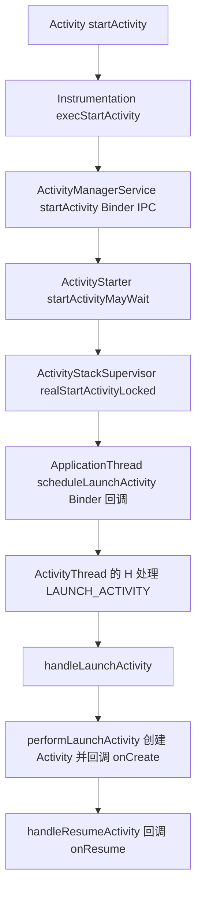
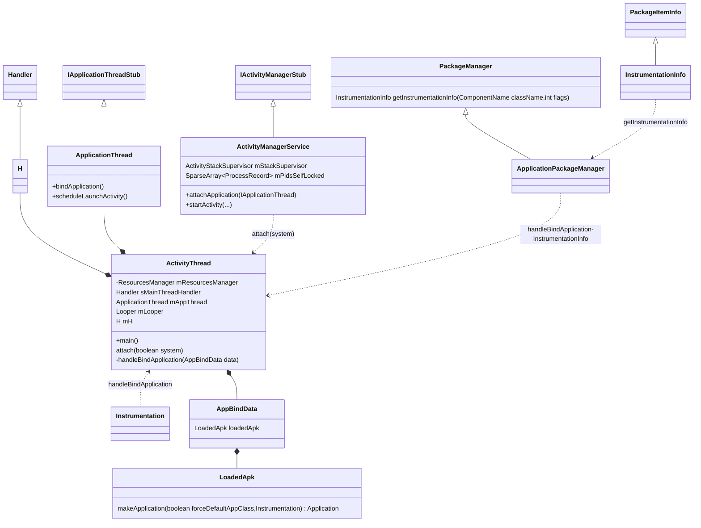
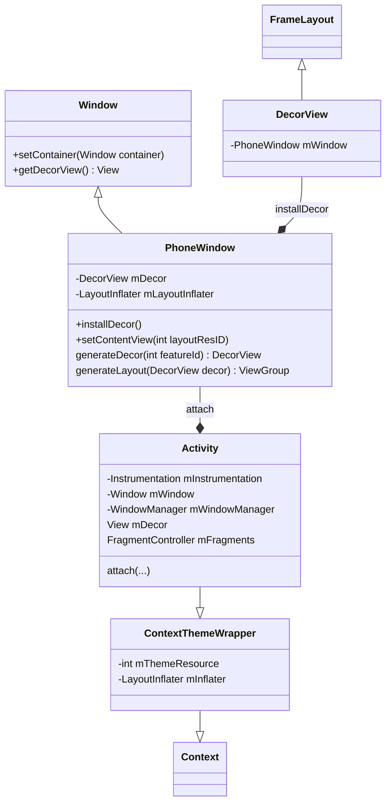
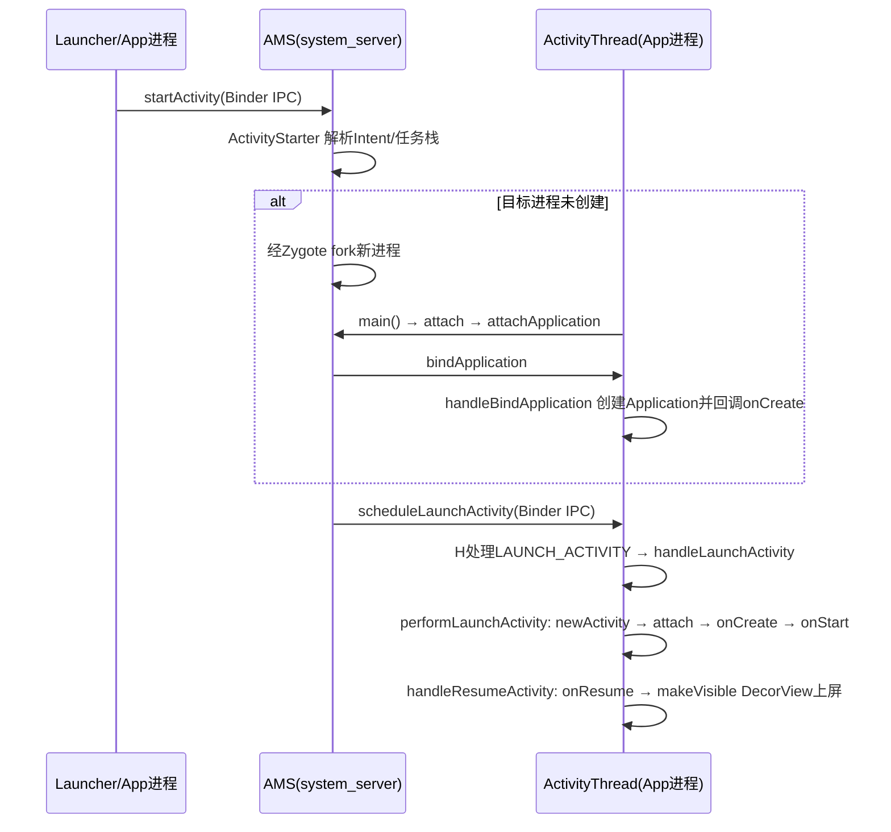

## 1. 概述与版本说明

本文基于 **Android 9.0（API 28）** 前后的 AOSP 源码，分析 Activity 从 `startActivity()` 到 `onCreate()`/`onResume()` 回调的完整启动流程。

整个启动过程跨两个（冷启动时涉及 Zygote 则是三个）进程，可以拆成三个阶段：

| 阶段 | 所在进程 | 核心调用链 |
| --- | --- | --- |
| ① 发起启动 | App 进程 | `Activity.startActivity()` → `Instrumentation.execStartActivity()` |
| ② 处理启动请求 | system_server 进程 | `AMS.startActivity()` → `ActivityStarter` → `ActivityStackSupervisor.realStartActivityLocked()` |
| ③ 创建并回调 | App 进程 | `ApplicationThread.scheduleLaunchActivity()` → `ActivityThread.handleLaunchActivity()` → `performLaunchActivity()` |

> **版本注意（Android 10+）**：Android 10 起，AMS 中 Activity 相关职责迁移到了 **ATMS（ActivityTaskManagerService）**，`ActivityStack`、`ActivityStarter` 等类移入 `ActivityTaskManager` 命名空间；生命周期调度也废弃了 `scheduleLaunchActivity` 这组方法，改为统一的 **ClientTransaction 事务机制**（`LaunchActivityItem`/`ResumeActivityItem` 等事务项经 `TransactionExecutor` 派发）。核心思路不变，本文的流程骨架仍然适用。
>
> 文中代码为**摘编版**：保留了主干逻辑与关键调用，省略了日志、异常样板、参数透传等细节，便于快速把握原理；行号为方法的准确入口，可对照原始 AOSP 阅读。

从 Activity 启动到生命周期回调的完整调用链：



## 2. 整体类关系

### 2.1 App 进程侧

ActivityThread 是 App 进程的主线程入口，持有 ApplicationThread（Binder Stub，接收 AMS 回调）与 H（主线程 Handler）；LoadedApk 负责创建 Application：



### 2.2 Activity 与 Window

Activity 并不直接持有 View 树，而是通过 PhoneWindow 间接管理，DecorView 是窗口的根 View：



关系链：**Activity → PhoneWindow → DecorView（根 FrameLayout）→ 布局内容**。`setContentView()` 实际是把布局塞进 DecorView 的内容区域。

## 3. 阶段①：App 进程发起启动

### 3.1 Activity.startActivity / startActivityForResult

`startActivity()` 最终都走到 `startActivityForResult()`，requestCode 为 -1 表示不需要返回结果：

```java
@Override
public void startActivity(Intent intent, @Nullable Bundle options) {
    if (options != null) {
        startActivityForResult(intent, -1, options);
    } else {
        startActivityForResult(intent, -1);
    }
}
```

```java
public void startActivityForResult(Intent intent, int requestCode, @Nullable Bundle options) {
    if (mParent == null) {
        // 交给 Instrumentation 发起, 把 ApplicationThread 传给 AMS 作为回调通道
        Instrumentation.ActivityResult ar = mInstrumentation.execStartActivity(
                this, mMainThread.getApplicationThread(), mToken, this,
                intent, requestCode, options);
        if (ar != null) {
            mMainThread.sendActivityResult(...);
        }
        ...
    } else {
        mParent.startActivityFromChild(this, intent, requestCode, options);
    }
}
```

注意传给 `execStartActivity()` 的 `mMainThread.getApplicationThread()`——把 App 进程的 ApplicationThread Binder 对象带过去，AMS 之后就是靠它回调 App 进程的。

### 3.2 Instrumentation

Instrumentation 是 App 与系统交互的"工具人"：Activity/Application 的创建和生命周期回调都经它之手，同时它也是自动化测试（如 ActivityMonitor 拦截启动）的挂载点。

```java
public class Instrumentation {
    private List<ActivityMonitor> mActivityMonitors;

    // 生命周期回调统一入口
    public void callActivityOnCreate(Activity activity, Bundle icicle, ...) {
        prePerformCreate(activity);
        activity.performCreate(icicle, persistentState);  // 内部回调 onCreate
        postPerformCreate(activity);
    }

    public void callApplicationOnCreate(Application app) {
        app.onCreate();
    }
}
```

内部类 ActivityMonitor，用于测试时拦截匹配的 Intent：

```java
public static class ActivityMonitor {
    private final IntentFilter mWhich;
    private final ActivityResult mResult;
    private final boolean mBlock;   // 为 true 时拦截启动, 不真正 start
    ...
}
```

**execStartActivity**——真正跨进程发起启动：

```java
public ActivityResult execStartActivity(Context who, IBinder contextThread,
        IBinder token, Activity target, Intent intent, int requestCode, Bundle options) {
    IApplicationThread whoThread = (IApplicationThread) contextThread;

    // 测试用的 ActivityMonitor 拦截: 命中且阻塞则直接返回, 不发起启动
    if (mActivityMonitors != null) {
        for (ActivityMonitor am : mActivityMonitors) {
            if (am.match(who, null, intent)) {
                am.mHits++;
                if (am.isBlocking()) {
                    return requestCode >= 0 ? am.getResult() : null;
                }
                break;
            }
        }
    }

    try {
        intent.prepareToLeaveProcess(who);
        // Binder IPC 到 system_server, 启动交由 AMS 处理
        int result = ActivityManager.getService().startActivity(
                whoThread, who.getBasePackageName(), intent,
                intent.resolveTypeIfNeeded(who.getContentResolver()),
                token, target != null ? target.mEmbeddedID : null,
                requestCode, 0, null, options);
        // 检查启动结果: "Unable to find explicit activity class..." 等异常的抛出点
        checkStartActivityResult(result, intent);
    } catch (RemoteException e) {
        throw new RuntimeException("Failure from system", e);
    }
    return null;
}
```

InstrumentationInfo 描述 manifest 中 `<instrumentation>` 标签的信息：

```java
public class InstrumentationInfo extends PackageItemInfo implements Parcelable {
     public String targetPackage;
     public String targetProcesses;
     ...
}
```

## 4. 阶段②：system_server 进程处理

### 4.1 AMS 的获取：ActivityManager.getService

App 进程通过 `ActivityManager.getService()` 拿到 AMS 的 Binder 代理，底层是 `ServiceManager` 查询名为 `Context.ACTIVITY_SERVICE`（"activity"）的服务：

```java
public class ActivityManager {
    public static IActivityManager getService() {
        return IActivityManagerSingleton.get();
    }

    private static final Singleton<IActivityManager> IActivityManagerSingleton =
            new Singleton<IActivityManager>() {
        @Override
        protected IActivityManager create() {
            final IBinder b = ServiceManager.getService(Context.ACTIVITY_SERVICE);
            return IActivityManager.Stub.asInterface(b);
        }
    };
}
```

AMS 本体是 `IActivityManager.Stub` 的实现，内部由 ActivityStackSupervisor 管理所有 Activity 栈，由 mPidsSelfLocked 按 pid 索引进程记录：

```java
public class ActivityManagerService extends IActivityManager.Stub
        implements Watchdog.Monitor, BatteryStatsImpl.BatteryCallback {

    final ActivityStackSupervisor mStackSupervisor;          // 管理所有 Activity 栈
    final SparseArray<ProcessRecord> mPidsSelfLocked;        // 按 pid 索引运行中的进程
    final ActivityStarter mActivityStarter;                   // 启动决策者
    ...
}
```

### 4.2 AMS.startActivity → ActivityStarter

AMS 只做权限/Multi-user 校验，随即转交给 ActivityStarter：

```java
@Override
public final int startActivity(IApplicationThread caller, String callingPackage,
        Intent intent, String resolvedType, IBinder resultTo, ...) {
    return startActivityAsUser(caller, callingPackage, intent, ..., UserHandle.getCallingUserId());
}

@Override
public final int startActivityAsUser(..., int userId) {
    enforceNotIsolatedCaller("startActivity");
    userId = mUserController.handleIncomingUser(...);
    // 转交 ActivityStarter
    return mActivityStarter.startActivityMayWait(caller, -1, callingPackage, intent, ...,
            userId, null, "startActivityAsUser");
}
```

### 4.3 ActivityStarter.startActivityMayWait

ActivityStarter 负责 Intent 解析、launchMode/flag/任务栈（TaskRecord）的决策。`startActivityMayWait()` 先解析出目标 ActivityInfo，再进入 `startActivityLocked()`：

```java
class ActivityStarter {
    private final ActivityManagerService mService;
    private final ActivityStackSupervisor mSupervisor;
}

final int startActivityMayWait(IApplicationThread caller, ..., Intent intent, ..., int userId, ...) {
    // 拷贝一份 intent, 不修改调用方的对象
    intent = new Intent(intent);

    // 通过 PMS 解析 Intent 对应的 ActivityInfo
    ActivityInfo aInfo = mSupervisor.resolveActivity(intent, rInfo, startFlags, profilerInfo);

    synchronized (mService) {
        ...
        // 进入栈决策: launchMode、flag、TaskRecord 复用等
        int res = startActivityLocked(caller, intent, ..., aInfo, ..., reason);
        ...
        return res;
    }
}
```

后续链路：`startActivityLocked()` → `startActivityUnchecked()`（处理 launchMode 与任务栈复用）→ `ActivityStackSupervisor.startSpecificActivityLocked()`。若目标进程已存活则直接 `realStartActivityLocked()`；否则先经 Zygote fork 新进程，等新进程 attach 到 AMS 后再走 `realStartActivityLocked()`。

### 4.4 ActivityStackSupervisor.realStartActivityLocked

realStartActivityLocked 完成进程与 ActivityRecord 的绑定，并通过 `app.thread.scheduleLaunchActivity()` Binder 回调到 App 进程。

冷启动时，新进程起来后 AMS 会在 `attachApplicationLocked()` 中找到等待在该进程运行的 top Activity，再调用 realStartActivityLocked：

```java
public class ActivityStackSupervisor extends ConfigurationContainer {

    boolean attachApplicationLocked(ProcessRecord app) {
        boolean didSomething = false;
        for (each display -> each stack) {
            if (!isFocusedStack(stack)) continue;                    // 只关注焦点栈
            final ActivityRecord top = stack.topRunningActivityLocked();
            for (ActivityRecord activity : 所有可见activity) {
                // 找到等待在该进程运行的 activity (uid + processName 匹配)
                if (activity.app == null && app.uid == activity.info.applicationInfo.uid
                        && processName.equals(activity.processName)) {
                    if (realStartActivityLocked(activity, app,
                            top == activity /* andResume */, true /* checkConfig */)) {
                        didSomething = true;
                    }
                }
            }
        }
    }
}
```

```java
final boolean realStartActivityLocked(ActivityRecord r, ProcessRecord app,
        boolean andResume, boolean checkConfig) {
    final TaskRecord task = r.getTask();
    final ActivityStack stack = task.getStack();
    try {
        r.app = app;                                   // ActivityRecord 绑定到目标进程
        ...
        app.activities.add(r);                         // 进程侧记录该 activity
        mService.updateLruProcessLocked(app, true, null);  // 更新 LRU 与 oom_adj
        mService.updateOomAdjLocked();

        // 关键一步: 通过 Binder 回调 App 进程, 真正去创建 Activity
        app.thread.scheduleLaunchActivity(new Intent(r.intent), r.appToken,
                System.identityHashCode(r), r.info,
                mergedConfiguration.getGlobalConfiguration(),
                mergedConfiguration.getOverrideConfiguration(), r.compat,
                r.launchedFromPackage, task.voiceInteractor, app.repProcState, r.icicle,
                r.persistentState, results, newIntents, !andResume,
                mService.isNextTransitionForward(), profilerInfo);
    } finally {
        endDeferResume();
    }
}
```

ProcessRecord 中持有的 `thread` 就是 App 进程的 ApplicationThread 代理：

```java
final class ProcessRecord {
    IApplicationThread thread;

    public void makeActive(IApplicationThread _thread, ProcessStatsService tracker) {
        thread = _thread;
    }
}
```

## 5. 冷启动前置：Application 的创建

冷启动时目标进程尚不存在，新进程的 ActivityThread.main() 起来后，会主动 attach 到 AMS；AMS 再通过 `bindApplication` 驱动 App 进程创建 Application。这条链路是理解"Application 先于 Activity 的 onCreate"的关键。

### 5.1 ActivityThread.main / attach

```java
public final class ActivityThread {
    static volatile Handler sMainThreadHandler;
    final ApplicationThread mAppThread = new ApplicationThread();
    final H mH = new H();
    Instrumentation mInstrumentation;
    ...
}
```

```java
public static void main(String[] args) {
    Looper.prepareMainLooper();          // 准备主线程 Looper
    ActivityThread thread = new ActivityThread();
    thread.attach(false);                // 向 AMS 注册 ApplicationThread
    if (sMainThreadHandler == null) {
        sMainThreadHandler = thread.getHandler();
    }
    Looper.loop();                       // 主线程消息循环, 之后不再返回
    throw new RuntimeException("Main thread loop unexpectedly exited");
}
```

attach 方法：AMS 对象绑定 appThread：

```java
private void attach(boolean system) {
    if (!system) {
        // 把 ApplicationThread 交给 AMS, 建立双向 Binder 通道
        final IActivityManager mgr = ActivityManager.getService();
        mgr.attachApplication(mAppThread);
    } else {
        ...  // system 进程分支
    }
}
```

### 5.2 AMS.attachApplication

AMS 按 pid 找到 ProcessRecord，重置进程状态，然后做两件事（顺序很重要）：先 `bindApplication` 驱动创建 Application，再走 `mStackSupervisor.attachApplicationLocked(app)` 启动等待中的 Activity：

```java
@Override
public final void attachApplication(IApplicationThread thread) {
    synchronized (this) {
        int callingPid = Binder.getCallingPid();       // 通过 Binder 获取 pid
        attachApplicationLocked(thread, callingPid);
    }
}

private final boolean attachApplicationLocked(IApplicationThread thread, int pid) {
    // 通过 pid 查找进程记录, 找不到说明是超时的脏进程, 直接杀掉
    ProcessRecord app;
    synchronized (mPidsSelfLocked) {
        app = mPidsSelfLocked.get(pid);
    }
    if (app == null) {
        killProcessQuiet(pid);
        return false;
    }

    app.makeActive(thread, mProcessStats);             // 保存 ApplicationThread 代理
    ...
    // 1. 绑定 Application: Binder 回调 App 进程创建 Application
    thread.bindApplication(processName, appInfo, providers, ...,
            new Configuration(getGlobalConfiguration()), app.compat, ...);

    // 2. 启动等待在该进程中的 Activity (见 4.4)
    if (normalMode) {
        if (mStackSupervisor.attachApplicationLocked(app)) {
            didSomething = true;
        }
    }
}
```

### 5.3 ApplicationThread.bindApplication

ApplicationThread 是 ActivityThread 的内部类。Binder 线程收到 bindApplication 后不直接处理，而是打包成 AppBindData 通过 H 切到主线程：

```java
private class ApplicationThread extends IApplicationThread.Stub {

    public final void bindApplication(String processName, ApplicationInfo appInfo,
            List<ProviderInfo> providers, ComponentName instrumentationName, ...) {
        ...
        // 把 AMS 传来的参数打包
        AppBindData data = new AppBindData();
        data.processName = processName;
        data.appInfo = appInfo;
        data.providers = providers;
        data.instrumentationName = instrumentationName;
        ...
        // 通过 ActivityThread 的 H 发消息, 切换到主线程处理
        sendMessage(H.BIND_APPLICATION, data);
    }
}
```

### 5.4 H(Handler)

H 是 ActivityThread 的主线程 Handler，所有生命周期消息（BIND_APPLICATION、LAUNCH_ACTIVITY 等）都在这里分发到对应的 handleXxx 方法：

```java
private class H extends Handler {
    public static final int BIND_APPLICATION = 110;
    public static final int LAUNCH_ACTIVITY = 100;

    public void handleMessage(Message msg) {
        switch (msg.what) {
            case LAUNCH_ACTIVITY: {
                final ActivityClientRecord r = (ActivityClientRecord) msg.obj;
                r.loadedApk = getLoadedApkNoCheck(...);
                handleLaunchActivity(r, null, "LAUNCH_ACTIVITY");
            } break;

            case BIND_APPLICATION:
                AppBindData data = (AppBindData) msg.obj;
                handleBindApplication(data);
                break;
        }
    }
}

private void sendMessage(int what, Object obj) {
    // ... 打包 Message, 最终走 mH.sendMessage(msg)
    mH.sendMessage(msg);
}
```

### 5.5 handleBindApplication

handleBindApplication 完成两件核心事：初始化 Instrumentation（默认直接 new，配置了 instrumentation 则反射加载）、通过 LoadedApk.makeApplication 创建 Application 并回调其 onCreate：

```java
private void handleBindApplication(AppBindData data) {
    // 1. 若配置了 instrumentation, 通过 PMS 查询其 InstrumentationInfo
    final InstrumentationInfo ii = ...;
    final ContextImpl appContext = ContextImpl.createAppContext(this, data.loadedApk);

    // 2. 初始化 Instrumentation: 默认直接 new; 配置了则用类加载器反射创建
    if (ii != null) {
        final ClassLoader cl = instrContext.getClassLoader();
        mInstrumentation = (Instrumentation) cl.loadClass(
                data.instrumentationName.getClassName()).newInstance();
    } else {
        mInstrumentation = new Instrumentation();
    }

    // 3. 创建 Application 并回调 onCreate
    Application app = data.loadedApk.makeApplication(data.restrictedBackupMode, null);
    mInitialApplication = app;
    mInstrumentation.callApplicationOnCreate(app);      // Application.onCreate()
}
```

其中 getInstrumentationInfo 由 ApplicationPackageManager 提供（PackageManager 的实现类，内部经 IPackageManager Binder 调用 PMS）：

```java
public class ApplicationPackageManager extends PackageManager {
    private final ContextImpl mContext;
    private final IPackageManager mPM;      // PMS 的 Binder 代理

    @Override
    public InstrumentationInfo getInstrumentationInfo(ComponentName className, int flags)
            throws NameNotFoundException {
        InstrumentationInfo ii = mPM.getInstrumentationInfo(className, flags);
        if (ii != null) {
            return ii;
        }
        throw new NameNotFoundException(className.toString());
    }
}
```

### 5.6 LoadedApk.makeApplication

从 makeApplication 的实现可以看出，如果 Application 已经被创建过了，那么就不会再重复创建了，这也意味着**一个应用（进程）只有一个 Application 对象**。Application 对象的创建也是通过 Instrumentation 来完成的，这个过程和 Activity 对象的创建一样，都是通过类加载器来实现的。Application 创建完毕后，系统会通过 Instrumentation 的 callApplicationOnCreate 来调用 Application 的 onCreate 方法。

```java
public Application makeApplication(boolean forceDefaultAppClass, Instrumentation instrumentation) {
    if (mApplication != null) {
        return mApplication;              // 已创建过, 直接返回 → 每进程仅一个 Application
    }

    // 未在 manifest 指定则用默认类名
    String appClass = mApplicationInfo.className;
    if (forceDefaultAppClass || (appClass == null)) {
        appClass = "android.app.Application";
    }

    // 类加载器创建 Application 实例
    java.lang.ClassLoader cl = getClassLoader();
    ContextImpl appContext = ContextImpl.createAppContext(mActivityThread, this);
    Application app = mActivityThread.mInstrumentation.newApplication(cl, appClass, appContext);
    appContext.setOuterContext(app);

    mApplication = app;

    // 回调 Application.onCreate
    if (instrumentation != null) {
        instrumentation.callApplicationOnCreate(app);
    }
    ...
    return app;
}
```

## 6. 阶段③：App 进程创建 Activity

### 6.1 ApplicationThread.scheduleLaunchActivity

Binder 线程收到 realStartActivityLocked 的回调后，同样把参数打包为 ActivityClientRecord，发消息交给主线程的 H 处理。token 用于在 AMS 侧唯一标识这个 Activity，避免直接序列化 Activity 对象本身：

```java
// we use token to identify this activity without having to send the
// activity itself back to the activity manager. (matters more with ipc)
public final void scheduleLaunchActivity(Intent intent, IBinder token, int ident,
        ActivityInfo info, Configuration curConfig, ...) {
    updateProcessState(procState, false);

    // 打包启动参数
    ActivityClientRecord r = new ActivityClientRecord();
    r.token = token;                    // AMS 侧该 Activity 的身份标识
    r.intent = intent;
    r.activityInfo = info;
    r.state = state;                    // 保存的状态, 用于恢复
    r.startsNotResumed = notResumed;
    ...

    // 发送消息到消息队列, 由 ActivityThread 的 H 处理启动
    sendMessage(H.LAUNCH_ACTIVITY, r);
}
```

### 6.2 handleLaunchActivity

H 收到 LAUNCH_ACTIVITY 后调用 handleLaunchActivity，它做全局初始化（WindowManagerGlobal 等），然后交给 performLaunchActivity 创建 Activity；成功后再走 handleResumeActivity 回调 onResume；若目标 Activity 需要以后台可见状态启动（如位于可见但非前台的任务中），则补一次 pause：

```java
private void handleLaunchActivity(ActivityClientRecord r, Intent customIntent, String reason) {
    unscheduleGcIdler();
    ...
    WindowManagerGlobal.initialize();       // 初始化窗口系统连接

    Activity a = performLaunchActivity(r, customIntent);   // 创建 Activity, 回调 onCreate

    if (a != null) {
        // 回调 onResume, 之后 DecorView 上屏
        handleResumeActivity(r.token, false, r.isForward, ...);

        // AMS 要求该 activity 以 paused 状态启动 (可见但非前台) 的场景:
        // 正常走完启动流程后补一次 pause, 而不是走完整的 pause 周期
        if (!r.activity.mFinished && r.startsNotResumed) {
            performPauseActivityIfNeeded(r, reason);
        }
    } else {
        // 创建失败, 通知 AMS 结束该 activity
        ActivityManager.getService().finishActivity(r.token,
                Activity.RESULT_CANCELED, null, Activity.DONT_FINISH_TASK_WITH_ACTIVITY);
    }
}
```

### 6.3 performLaunchActivity 完成的四件事

performLaunchActivity 是 Activity 对象真正诞生的地方，可归纳为四步：取组件信息 → 创建 Activity → 创建 Application（若未创建）→ attach 初始化并回调 onCreate。

#### 1. 从 ActivityClientRecord 中获取待启动的 Activity 的组件信息

```java
ActivityInfo aInfo = r.activityInfo;
if (r.loadedApk == null) {
    r.loadedApk = getLoadedApk(aInfo.applicationInfo, r.compatInfo,
            Context.CONTEXT_INCLUDE_CODE);              // 拿到 apk 的类加载器等
}

ComponentName component = r.intent.getComponent();
if (component == null) {
    // 隐式 Intent: 通过 PMS 解析出目标组件
    component = r.intent.resolveActivity(mInitialApplication.getPackageManager());
    r.intent.setComponent(component);
}
```

#### 2. 通过 Instrumentation 的 newActivity 方法使用类加载器创建 Activity 对象

```java
ContextImpl appContext = createBaseContextForActivity(r);
Activity activity = null;
try {
    java.lang.ClassLoader cl = appContext.getClassLoader();
    // 类加载器反射创建 Activity 实例
    activity = mInstrumentation.newActivity(cl, component.getClassName(), r.intent);
    ...
} catch (Exception e) {
    if (!mInstrumentation.onException(activity, e)) {
        throw new RuntimeException("Unable to instantiate activity " + component, e);
    }
}
```

#### 3. 通过 LoadedApk 的 makeApplication 方法来尝试创建 Application 对象

冷启动时 Application 已在 handleBindApplication 中创建过，这里直接返回同一个对象；所以本步骤对热启动新的 Activity 基本是无操作：

```java
try {
    Application app = r.loadedApk.makeApplication(false, mInstrumentation);
    ...
    r.paused = true;
    mActivities.put(r.token, r);          // 以 token 为 key 缓存该记录
} catch (Exception e) {
    if (!mInstrumentation.onException(activity, e)) {
        throw new RuntimeException("Unable to start activity " + component, e);
    }
}
```

#### 4. 创建 ContextImpl 对象并通过 Activity 的 attach 方法来完成一些重要数据的初始化

attach 之后依次回调 `onCreate`（经 callActivityOnCreate）→ `onStart`（performStart）→ `onRestoreInstanceState` → `onPostCreate`。`activity.mCalled` 检查确保子类确实调用了 `super.onCreate()`，否则抛 SuperNotCalledException：

```java
if (activity != null) {
    CharSequence title = r.activityInfo.loadLabel(appContext.getPackageManager());
    ...
    appContext.setOuterContext(activity);
    // 初始化 Activity: Context、Instrumentation、Application、PhoneWindow 等 (见第7节)
    activity.attach(appContext, this, getInstrumentation(), r.token,
            r.ident, app, r.intent, r.activityInfo, title, r.parent, ...);

    int theme = r.activityInfo.getThemeResource();
    if (theme != 0) {
        activity.setTheme(theme);         // 设置主题
    }

    activity.mCalled = false;
    // 经 Instrumentation 回调 onCreate
    mInstrumentation.callActivityOnCreate(activity, r.state);
    if (!activity.mCalled) {              // 未调 super.onCreate() 则抛异常
        throw new SuperNotCalledException(
            "Activity " + r.intent.getComponent().toShortString() +
            " did not call through to super.onCreate()");
    }
    r.activity = activity;
    r.stopped = true;
    if (!r.activity.mFinished) {
        activity.performStart();          // onStart
        r.stopped = false;
    }
    if (!r.activity.mFinished && r.state != null) {
        mInstrumentation.callActivityOnRestoreInstanceState(activity, r.state);  // 恢复状态
    }
    ...
}
```

## 7. Activity 的 attach 与视图初显

### 7.1 attach

attach 里完成了三件关键事：保存 Context/Instrumentation/Application 等引用、**创建 PhoneWindow 并把 Activity 自己设为窗口回调（Window.Callback，由此接收键盘/触摸事件）**、通过 setWindowManager 初始化 WindowManager：

```java
public class Activity extends ContextThemeWrapper implements LayoutInflater.Factory2,
        Window.Callback, KeyEvent.Callback, OnCreateContextMenuListener,
        ComponentCallbacks2, Window.OnWindowDismissedCallback, ... {
    private Instrumentation mInstrumentation;
    ...
}
```

```java
final void attach(Context context, ActivityThread aThread, Instrumentation instr,
        IBinder token, int ident, Application application, Intent intent, ActivityInfo info,
        CharSequence title, Activity parent, ...) {
    attachBaseContext(context);

    // 创建 PhoneWindow, Activity 自身作为 Window.Callback 接收事件
    mWindow = new PhoneWindow(this, window, activityConfigCallback);
    mWindow.setCallback(this);
    mWindow.setOnWindowDismissedCallback(this);
    ...

    // 保存各成员引用
    mMainThread = aThread;
    mInstrumentation = instr;
    mToken = token;
    mApplication = application;
    mIntent = intent;
    mActivityInfo = info;
    ...

    // 初始化 WindowManager (持有 mToken, 后续 View 添加到窗口时标识归属)
    mWindow.setWindowManager(
            (WindowManager) context.getSystemService(Context.WINDOW_SERVICE),
            mToken, mComponent.flattenToString(),
            (info.flags & ActivityInfo.FLAG_HARDWARE_ACCELERATED) != 0);
    mWindowManager = mWindow.getWindowManager();
}
```

### 7.2 setContentView 与 makeVisible

`setContentView()` 只是委托给 PhoneWindow（由此触发 DecorView 的创建与布局装载），View 真正显示到屏幕上是在 `handleResumeActivity` 之后由 makeVisible 把 DecorView 添加到 WindowManager：

```java
public void setContentView(@LayoutRes int layoutResID) {
    getWindow().setContentView(layoutResID);   // 委托 PhoneWindow, 布局装入 DecorView
    initWindowDecorActionBar();
}
```

```java
void makeVisible() {
    if (!mWindowAdded) {
        ViewManager wm = getWindowManager();
        wm.addView(mDecor, getWindow().getAttributes());   // DecorView 添加到 WindowManager
        mWindowAdded = true;
    }
    mDecor.setVisibility(View.VISIBLE);
}
```

## 8. 全流程总结

以冷启动（点击桌面图标）为例的时序：



关键结论：

- **一次 Binder 往返 + 一次 Binder 回调**：App → AMS 是 `startActivity`，AMS → App 是 `IApplicationThread` 上的 `scheduleLaunchActivity`；ApplicationThread 是接收方 Binder Stub。
- **所有生命周期都在主线程执行**：Binder 线程只负责打包数据发 Handler 消息（H），真正的创建与回调在 main looper 上串行执行。
- **Instrumentation 是统一的 hook 点**：Activity/Application 的实例化和 onCreate 回调都经它，ActivityMonitor 也借此拦截启动。
- **Application 每进程仅一个**：makeApplication 对已创建的情况直接返回；冷启动时它创建于 handleBindApplication，先于任何 Activity 的 onCreate。
- **Window 结构**：attach 中创建 PhoneWindow，setContentView 装载布局到 DecorView，onResume 后 makeVisible 才把 DecorView 加入 WindowManager 完成显示。
