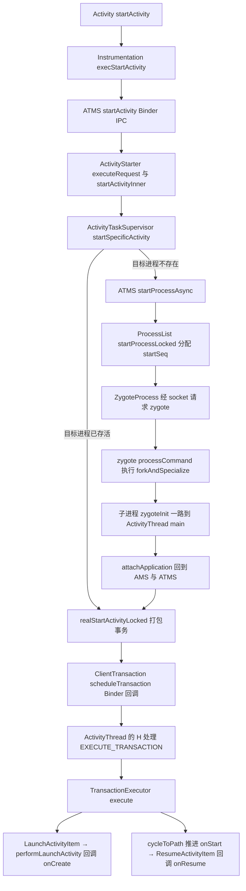
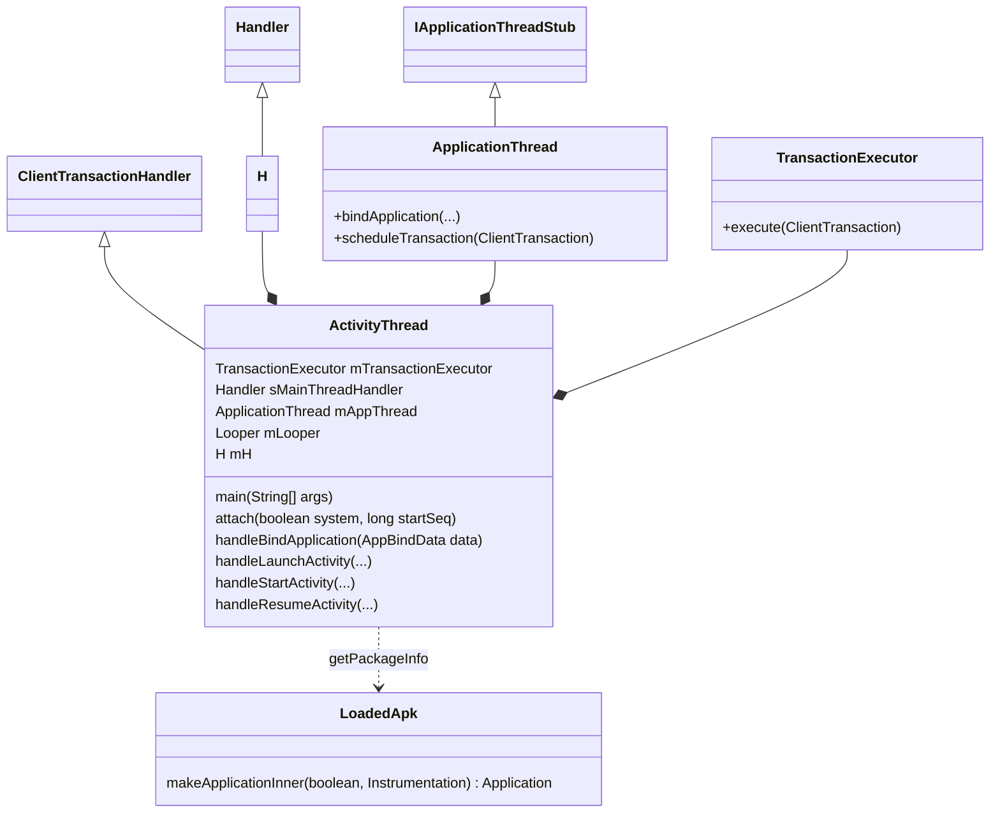
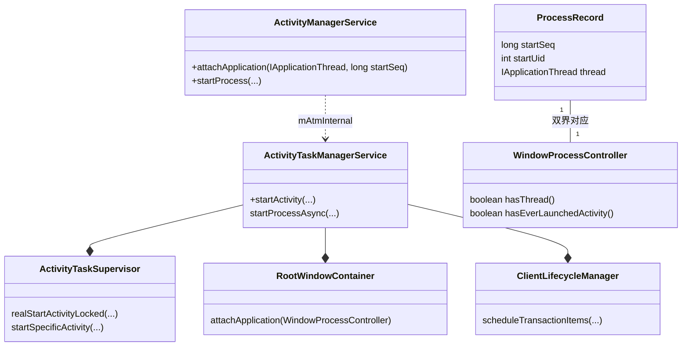
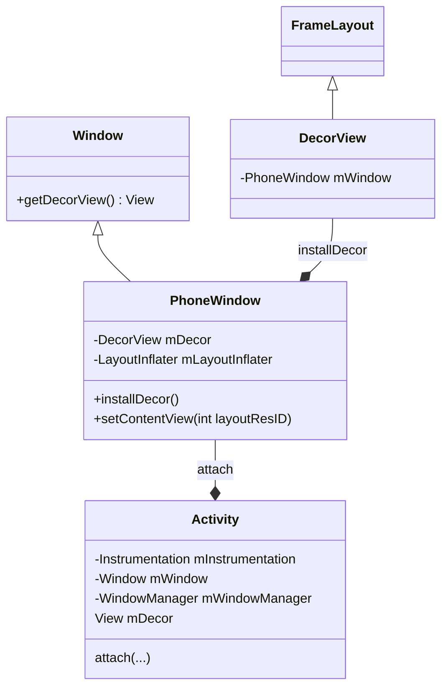
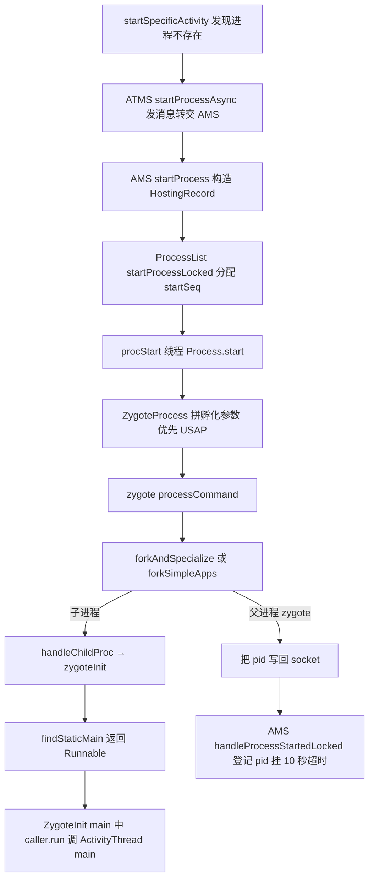
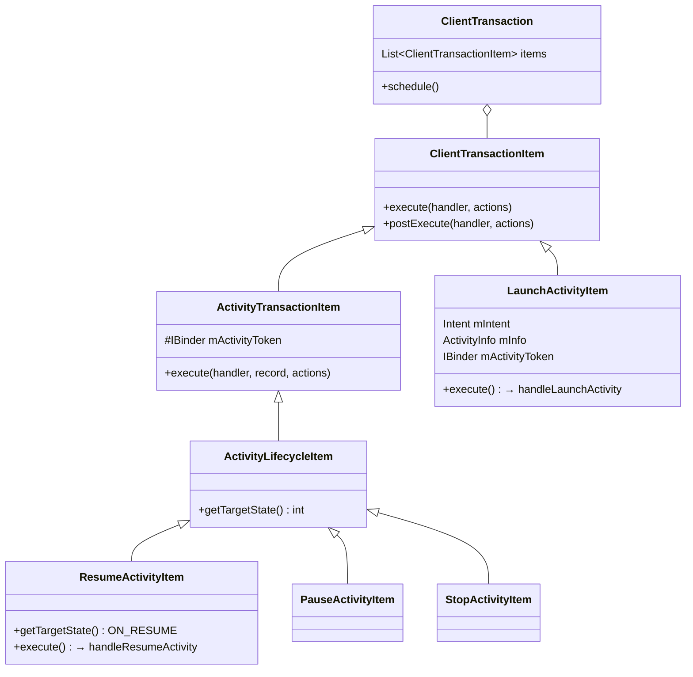
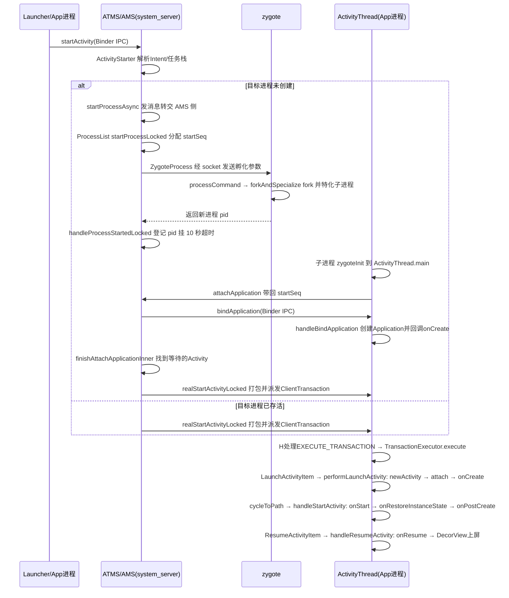

## 1. 概述与版本说明

本文基于 **AOSP main 分支源码（对照 commit `1cdfff5`，2025-03-26，Android 16 开发期）**，分析 Activity 从 `startActivity()` 到 `onCreate()`/`onResume()` 回调的完整启动流程。

整个启动流程主要在发起方 App 进程与 system_server 两个进程间往复；冷启动时目标进程还不存在，AMS 会先经 zygote fork 出目标进程，再继续后面的阶段。据此把流程拆成三个阶段，冷启动时在 ② 与 ③ 之间插入一段进程孵化（表中 ②′，第 5 节单独展开）：

| 阶段 | 所在进程 | 核心调用链 |
| --- | --- | --- |
| ① 发起启动 | App 进程 | `Activity.startActivity()` → `Instrumentation.execStartActivity()` |
| ② 处理启动请求 | system_server 进程 | `ATMS.startActivity()` → `ActivityStarter` → `ActivityTaskSupervisor.realStartActivityLocked()` |
| ②′ 孵化进程（仅冷启动） | system_server → zygote → 新进程 | `startSpecificActivity` → `startProcessAsync` → `ProcessList` → `ZygoteProcess` → `forkAndSpecialize` → `ActivityThread.main` |
| ③ 创建并回调 | App 进程 | `ApplicationThread.scheduleTransaction()` → `H.EXECUTE_TRANSACTION` → `TransactionExecutor` → `performLaunchActivity()` |

> **版本注意**：本文基准是 Android 16 开发期的 main 分支代码（对照 commit `1cdfff5`），与网上大量基于 Android 9/10 的资料相比，类名与入口有多处变化：Activity 调度已从 AMS 迁到 **ATMS（ActivityTaskManagerService）** 与 ActivityTaskSupervisor；生命周期调度自 Android 9 起用 **ClientTransaction 事务机制** 取代了 `scheduleLaunchActivity` 直调；进程孵化改为 `startProcessAsync` 全异步。骨架思路不变，逐项差异见第 9 节演进备注。
>
> 文中代码为**摘编版**：保留主干逻辑与关键调用，省略日志、异常样板、参数透传与调试分支，可对照 AOSP 原文阅读。

从 Activity 启动到生命周期回调的完整调用链：



## 2. 整体类关系

### 2.1 App 进程侧

ActivityThread 是 App 进程的主线程入口，继承 **ClientTransactionHandler**——这层继承正是事务机制的入口：`scheduleTransaction()` 定义在父类中，把 Binder 收到的事务转成主线程消息；TransactionExecutor 负责按序执行事务项。ApplicationThread 是 Binder Stub，接收 system_server 的回调：



### 2.2 system_server 侧：AMS 与 ATMS 的双界对应

Android 10 起 Activity 相关职责从 AMS（ActivityManagerService）拆到 ATMS，两个服务各自维护一份进程视图，通过 WindowProcessController 关联——这是读新源码最容易迷路的第一个点：



AMS 侧的 ProcessRecord 管进程生命周期（孵化、超时、优先级），ATMS 侧的 WindowProcessController 管窗口视角的进程状态（是否绑定、是否启动过 Activity）；`attachApplication()` 里 AMS 核对完身份后，把 controller 交给 ATMS 去找等待启动的 Activity。

### 2.3 Activity 与 Window

Activity 并不直接持有 View 树，而是通过 PhoneWindow 间接管理，DecorView 是窗口的根 View：



关系链：**Activity → PhoneWindow → DecorView（根 FrameLayout）→ 布局内容**。`setContentView()` 实际是把布局塞进 DecorView 的内容区域。

## 3. 阶段①：App 进程发起启动

### 3.1 Activity.startActivity / startActivityForResult

`startActivity()` 最终都走到 `startActivityForResult()`，requestCode 为 -1 表示不需要返回结果：

```java
@Override
public void startActivity(Intent intent, @Nullable Bundle options) {
    getAutofillClientController().onStartActivity(intent, mIntent);
    if (options != null) {
        startActivityForResult(intent, -1, options);
    } else {
        startActivityForResult(intent, -1);
    }
}
```

```java
public void startActivityForResult(Intent intent, int requestCode, @Nullable Bundle options) {
    if (mParent == null) {
        // 交给 Instrumentation 发起, 把 ApplicationThread 传给 ATMS 作为回调通道
        Instrumentation.ActivityResult ar = mInstrumentation.execStartActivity(
                this, mMainThread.getApplicationThread(), mToken, this,
                intent, requestCode, options);
        if (ar != null) {
            mMainThread.sendActivityResult(...);
        }
        ...
    } else {
        mParent.startActivityFromChild(this, intent, requestCode, options);
    }
}
```

注意传给 `execStartActivity()` 的 `mMainThread.getApplicationThread()`——把 App 进程的 ApplicationThread Binder 对象带过去，system_server 之后就是靠它回调 App 进程的。

### 3.2 Instrumentation.execStartActivity

Instrumentation 负责代替 App 进程与系统交互：Activity/Application 的创建和生命周期回调都经它之手，同时它也是自动化测试（ActivityMonitor 拦截启动）的挂载点。`execStartActivity()` 真正跨进程发起启动：

```java
public ActivityResult execStartActivity(Context who, IBinder contextThread,
        IBinder token, Activity target, Intent intent, int requestCode, Bundle options) {
    IApplicationThread whoThread = (IApplicationThread) contextThread;
    ...
    try {
        intent.prepareToLeaveProcess(who);
        // Binder IPC 到 system_server: 目标服务是 ATMS 而非 AMS
        int result = ActivityTaskManager.getService().startActivity(whoThread,
                who.getOpPackageName(), who.getAttributionTag(), intent,
                intent.resolveTypeIfNeeded(who.getContentResolver()), token,
                target != null ? target.mEmbeddedID : null, requestCode, 0, null, options);
        notifyStartActivityResult(result, options);
        // 检查启动结果: "Unable to find explicit activity class..." 等异常的抛出点
        checkStartActivityResult(result, intent);
    } catch (RemoteException e) {
        throw new RuntimeException("Failure from system", e);
    }
    return null;
}
```

与老版本的一个细节差异：`getService()` 查询的是 `ActivityTaskManager` 注册的 **"activity_task"** 服务（`Context.ACTIVITY_TASK_SERVICE`；"activity" 服务仍是 AMS），`startActivity()` 的 Binder 入口在 ATMS 上。

## 4. 阶段②：system_server 处理启动请求

### 4.1 ATMS.startActivity → ActivityStarter

ATMS 先登记 intent 的 creator token，供后续的后台启动（Background Activity Launch，BAL）校验；再做 uid 归属、user 与 SDK sandbox 校验，最后经 ActivityStartController 取得 ActivityStarter：

```java
public final int startActivity(IApplicationThread caller, String callingPackage,
        @Nullable String callingFeatureId, Intent intent, String resolvedType,
        IBinder resultTo, String resultWho, int requestCode, int startFlags,
        ProfilerInfo profilerInfo, Bundle bOptions) {
    return startActivityAsUser(caller, callingPackage, callingFeatureId, intent, ...,
            UserHandle.getCallingUserId());
}
```

```java
private int startActivityAsUser(..., int userId, boolean validateIncomingUser) {
    mAmInternal.addCreatorToken(intent, callingPackage);  // 记录 intent 创建者
    ...
    assertPackageMatchesCallingUid(callingPackage);       // callingPackage 必须属于调用方 uid
    enforceNotIsolatedCaller("startActivityAsUser");      // 隔离进程不允许启动 activity
    // SDK sandbox 场景另有 enforceAllowedToHostSandboxedActivity 等校验(略)
    ...
    userId = getActivityStartController().checkTargetUser(userId, validateIncomingUser, ...);

    return getActivityStartController().obtainStarter(intent, "startActivityAsUser")
            .setCaller(caller)
            .setCallingPackage(callingPackage)
            ...
            .execute();                                   // 进入 ActivityStarter.execute()
}
```

### 4.2 ActivityStarter：executeRequest 与 startActivityInner

ActivityStarter 负责 Intent 解析、launchMode/flag/任务栈（Task）的决策。真正入口是 `execute()`：先解析组件（`resolveActivity()`）、记录启动指标，再进 `executeRequest()` 做检查并创建 ActivityRecord。核心决策在 `startActivityInner()`——源码注释里的分工原文是 "the normally activity launch flow will go through `startActivityUnchecked` to `startActivityInner`"。`startActivityUnchecked()` 现在只做外围包装：`deferWindowLayout` 挂起窗口布局、收集 Transition、最后用 `handleStartResult()` 清理失败请求并做 `postStartActivityProcessing`，决策主体已经全部在 `startActivityInner()` 里。

`execute()` 的主干（摘编）：

```java
int execute() {
    try {
        onExecutionStarted();
        ...
        if (mRequest.intent != null) {
            // Refuse possible leaked file descriptors
            if (mRequest.intent.hasFileDescriptors()) {
                throw new IllegalArgumentException("File descriptors passed in Intent");
            }
        }
        ...
        synchronized (mService.mGlobalLock) {
            // 记录启动指标, 供启动耗时统计 (ActivityMetricsLogger)
            launchingState = mSupervisor.getActivityMetricsLogger()
                    .notifyActivityLaunching(mRequest.intent, caller, callingUid);
        }
        ...
        // If the caller hasn't already resolved the activity, we're willing
        // to do so here.
        if (mRequest.activityInfo == null) {
            mRequest.resolveActivity(mSupervisor);       // 解析目标 ActivityInfo
        }
        ...
        synchronized (mService.mGlobalLock) {
            ...
            res = resolveToHeavyWeightSwitcherIfNeeded();  // 重量级进程切换特例, 命中则改启切换器
            if (res != START_SUCCESS) {
                return res;
            }
            res = executeRequest(mRequest);
        }
        ...
```

`executeRequest()` 的主干（摘编），按执行顺序分五段——校验、权限与后台启动检查、拦截器、权限审查、登记转交：

```java
private int executeRequest(Request request) {
    int err = ActivityManager.START_SUCCESS;

    // (1) 基础校验
    if (caller != null) {
        callerApp = mService.getProcessController(caller);
        if (callerApp == null) {
            err = START_PERMISSION_DENIED;              // 找不到调用方进程
        }
    }
    // 从 resultTo token 解析发起方, startActivityForResult 的结果回传目标也在这时确定
    if (resultTo != null) {
        sourceRecord = ActivityRecord.isInAnyTask(resultTo);
        if (sourceRecord != null && requestCode >= 0 && !sourceRecord.finishing) {
            resultRecord = sourceRecord;
        }
    }
    // FLAG_ACTIVITY_FORWARD_RESULT: 把结果目标转移给更上一级; 与 requestCode 冲突则直接拒绝
    ...
    if (err == START_SUCCESS && intent.getComponent() == null) {
        err = START_INTENT_NOT_RESOLVED;                // Intent 解析不出组件
    }
    if (err == START_SUCCESS && aInfo == null) {
        err = START_CLASS_NOT_FOUND;                    // 找不到目标类
    }
    if (err != START_SUCCESS) {
        // 校验失败: 向结果目标回传 cancel 并返回错误码
        // (3.2 节 checkStartActivityResult 据此抛出 "Unable to find explicit activity class")
        if (resultRecord != null) {
            resultRecord.sendResult(..., RESULT_CANCELED, ...);
        }
        return err;
    }

    // (2) 权限与后台启动检查
    boolean abort = !mSupervisor.checkStartAnyActivityPermission(intent, aInfo, ...);
    abort |= !mService.mIntentFirewall.checkStartActivity(intent, callingUid, ...);
    // BAL (Background Activity Launch) 多级判定: 后台应用不得借道拉起前台 Activity
    balVerdict = mSupervisor.getBackgroundActivityLaunchController()
            .checkBackgroundActivityStart(callingUid, callingPid, callingPackage, ...);

    // (3) 拦截器
    mInterceptor.setStates(userId, realCallingPid, realCallingUid, ...);
    if (mInterceptor.intercept(intent, rInfo, aInfo, resolvedType, inTask, ...)) {
        // 命中拦截: 目标用户处于静音工作资料、目标应用被暂停 (suspended) 等场景,
        // intent/aInfo 等参数被整体替换
        intent = mInterceptor.mIntent;
        aInfo = mInterceptor.mAInfo;
        ...
    }

    if (abort) {
        if (resultRecord != null) {
            resultRecord.sendResult(..., RESULT_CANCELED, ...);
        }
        // We pretend to the caller that it was really started, but they will just get a
        // cancel result.
        return START_ABORTED;
    }

    // (4) 权限审查: 目标应用需要先确认权限时, 用 ACTION_REVIEW_PERMISSIONS 页面包装原 intent,
    //    原启动请求作为 PendingIntent 附带, 审查通过后继续启动
    if (aInfo != null) {
        if (mService.getPackageManagerInternalLocked().isPermissionsReviewRequired(
                aInfo.packageName, userId)) {
            final IIntentSender target = mService.getIntentSenderLocked(
                    ..., new Intent[]{intent}, ...);
            Intent newIntent = new Intent(Intent.ACTION_REVIEW_PERMISSIONS);
            newIntent.putExtra(Intent.EXTRA_PACKAGE_NAME, aInfo.packageName);
            newIntent.putExtra(Intent.EXTRA_INTENT, new IntentSender(target));
            intent = newIntent;
            rInfo = mSupervisor.resolveIntent(intent, resolvedType, userId, 0, ...);
            aInfo = mSupervisor.resolveActivity(intent, rInfo, startFlags, null);
        }
    }

    // (5) 登记并转交核心决策
    final ActivityRecord r = new ActivityRecord.Builder(mService)
            .setCaller(callerApp)
            .setLaunchedFromUid(callingUid)
            .setLaunchedFromPackage(callingPackage)
            .setIntent(intent)
            .setActivityInfo(aInfo)
            .setResultTo(resultRecord)
            .setSourceRecord(sourceRecord)
            ...
            .build();       // ActivityRecord: 本次启动在 system_server 侧的代表
                            // (4.5 节 realStartActivityLocked 操作的就是它)
    ...
    mLastStartActivityResult = startActivityUnchecked(r, sourceRecord, ...,
            inTask, inTaskFragment, balVerdict, intentGrants, realCallingUid, ...);
    ...
}
```

`startActivityUnchecked()` 的外围包装（摘编）——try 块内三件事逐一对应导语里的描述：

```java
private int startActivityUnchecked(final ActivityRecord r, ActivityRecord sourceRecord, ...) {
    int result = START_CANCELED;
    ...
    try {
        mService.deferWindowLayout();           // 挂起窗口布局, 把启动期间的窗口操作聚合处理
        r.mTransitionController.collect(r);     // 收集本次启动的转场动画 (Transition) 信息
        try {
            result = startActivityInner(r, sourceRecord, ...);       // 核心决策
        } catch (Exception ex) {
            Slog.e(TAG, "Exception on startActivityInner", ex);
        } finally {
            // 按启动结果收尾: 失败时把 ActivityRecord 从任务中移除
            // (避免留下没有窗口容器的半成品记录), 为启动新建的空 RootTask 也一并移除
            startedActivityRootTask = handleStartResult(r, options, result, ...);
        }
    } finally {
        mService.continueWindowLayout();        // 恢复窗口布局
    }
    postStartActivityProcessing(r, result, startedActivityRootTask);  // 启动后的统一处理
    return result;
}
```

`startActivityInner()` 的决策与老版本的 startActivityUnchecked 同源，分三步。

第一步，初始化状态与修正 flags：

```java
setInitialState(r, options, inTask, inTaskFragment, startFlags, sourceRecord,
        voiceSession, voiceInteractor, balVerdict.getCode(), realCallingUid);
// 内部修正 flags: singleInstancePerTask、目标 requiredDisplayCategory 与源不同时补 NEW_TASK
computeLaunchingTaskFlags();
// 非 Activity 的 context 发起(无源任务可依附)、发起方是 singleInstance、目标声明
// singleTask/singleInstance 时补 FLAG_ACTIVITY_NEW_TASK
mIntent.setFlags(mLaunchFlags);
```

第二步，查找可复用的任务与栈顶实例——命中即复用，不再新建实例：

```java
// 条件: NEW_TASK 且未要求 MULTIPLE_TASK, 或目标为 singleTask/singleInstance
final Task reusedTask = resolveReusableTask(includeLaunchedFromBubble);
final Task targetTask = reusedTask != null ? reusedTask : computeTargetTask();
final boolean newTask = targetTask == null;
...
final ActivityRecord targetTaskTop = newTask
        ? null : targetTask.getTopNonFinishingActivity();
if (targetTaskTop != null) {
    // 复用已有任务: 处理 CLEAR_TOP 清理、把任务带到前台、给已有实例投递 onNewIntent
    startResult = recycleTask(targetTask, targetTaskTop, reusedTask, ...);
    if (startResult != START_SUCCESS) {
        return startResult;                 // 已在任务顶/已投递 NewIntent, 启动结束
    }
}

// 目标恰好是栈顶且 singleTop/singleTask: 不建新实例, 只投递 onNewIntent
startResult = deliverToCurrentTopIfNeeded(topRootTask, intentGrants);
if (startResult != START_SUCCESS) {
    return startResult;                     // START_DELIVERED_TO_TOP
}
```

第三步，确需新建实例时决定任务归属，入栈并触发 resume：

```java
if (newTask) {
    setNewTask(taskToAffiliate);            // 新建 Task (冷启动通常新建)
} else if (mAddingToTask) {
    addOrReparentStartingActivity(targetTask, "adding to task");   // 加入目标任务
}

if (mDoResume && !avoidMoveToFront()) {     // 受 BAL 限制时不抢前台
    mTargetRootTask.getRootTask().moveToFront("reuseOrNewTask", targetTask);
}
...
mTargetRootTask.startActivityLocked(mStartActivity, topRootTask, newTask, ...);  // Task 侧入栈
if (mDoResume) {
    mRootWindowContainer.resumeFocusedTasksTopActivities(
            mTargetRootTask, mStartActivity, mOptions, mTransientLaunch);
}
return START_SUCCESS;
```

注意同名陷阱：`Task.startActivityLocked()` 与启动链前段方法名相似，但职责只是把 ActivityRecord 加入任务栈并在 WMS 侧登记窗口 token——system_server 源码里大量 `xxxLocked` 后缀表示"持锁调用"，并非"锁定"。

startActivityInner 末尾那行 resume 调用只是发起，从它到 startSpecificActivity 之间还隔着一条 resume 链路，见下节。

### 4.3 resume 链路：先挂起旧 Activity，再按进程状态分叉

这条链路承担两件事：让当前前台 Activity 进入 pause（"新 Activity 的 onCreate 之前，旧 Activity 先走 onPause"的根源就在这里），然后按目标 Activity 的进程状态决定走向。三层调用：

`RootWindowContainer.resumeFocusedTasksTopActivities` → `Task.resumeTopActivityUncheckedLocked` → `Task.resumeTopActivityInnerLocked` → `TaskFragment.resumeTopActivity`

最外层负责选出获得焦点的 Task 并对其执行 resume 流程；若当前没有任何可恢复的 Activity（例如设备刚完成开机、桌面进程刚崩溃），它会改为恢复桌面 Activity，保证每个屏幕至少有一个 Activity 处于 resumed 状态。`Task.resumeTopActivityUncheckedLocked` 只做防重入：resume 流程执行期间可能再次触发 resume 请求，方法内以 `mInResumeTopActivity` 标志将重入请求直接拦截，防止递归；`resumeTopActivityInnerLocked` 选出栈顶 Activity 所在的 TaskFragment（本任务没有可恢复 Activity 时转向其他根任务）。核心逻辑集中在 `TaskFragment.resumeTopActivity`，下面分三段分析。

第一段，取栈顶 Activity 作为目标，先安排旧的前台 Activity 进入 pause。pause 是异步执行的：本方法发起 pause 后即返回，等 pause 完成的回调再次进入本方法时才继续 resume 流程。等待期间有一个冷启动优化——若已确认目标进程尚未运行，就提前发起进程孵化，使其与旧 Activity 的 pause 并行执行：

```java
final boolean resumeTopActivity(ActivityRecord prev, ActivityOptions options, boolean skipPause) {
    final ActivityRecord next = topRunningActivity(true /* focusableOnly */);
    ...
    // 先让别的 Task 与本 TaskFragment 上正前台的 activity 进入 pause
    boolean pausing = !skipPause && taskDisplayArea.pauseBackTasks(next);
    if (mResumedActivity != null) {
        pausing |= startPausing(mTaskSupervisor.mUserLeaving, false /* uiSleeping */,
                next, "resumeTopActivity");
    }
    if (pausing) {
        // pause 已发起, 本次 resume 先返回, 等 pause 完成的回调后重新进入本方法
        // 冷启动优化: 不必等待 pause 完成, 提前孵化目标进程
        if (!next.isProcessRunning()) {
            final boolean isTop = this == taskDisplayArea.getFocusedRootTask();
            mAtmService.startProcessAsync(next, false /* knownToBeDead */, isTop,
                    isTop ? HostingRecord.HOSTING_TYPE_NEXT_TOP_ACTIVITY
                            : HostingRecord.HOSTING_TYPE_NEXT_ACTIVITY);
        }
        return true;
    }
    ...
```

第二段，目标 Activity 已绑定进程（`next.attachedToProcess()`）——Activity 对象已经存在（例如应用从后台切回前台），不需要重新创建，只需把积攒的 activity result、newIntent 与 ResumeActivityItem 分别作为事务项，经 scheduleTransactionItem 派发到应用进程，即可将其恢复到前台；若投递过程中抛出异常，通常说明目标进程已经死亡，此时调用 startSpecificActivity 重新启动该 Activity：

```java
    if (next.attachedToProcess()) {
        ...
        final ActivityRecord.State lastState = next.getState();
        next.setState(RESUMED, "resumeTopActivity");
        ...
        // 积攒的 activity result 与 newIntent 各作为一个事务项先投递
        if (next.results != null && next.results.size() > 0) {
            mAtmService.getLifecycleManager().scheduleTransactionItem(appThread,
                    new ActivityResultItem(next.token, next.results));
        }
        if (next.newIntents != null) {
            mAtmService.getLifecycleManager().scheduleTransactionItem(appThread,
                    new NewIntentItem(next.token, next.newIntents, true /* resume */));
        }
        ...
        final ResumeActivityItem resumeActivityItem = new ResumeActivityItem(next.token, ...);
        mAtmService.getLifecycleManager().scheduleTransactionItem(appThread, resumeActivityItem);
    } catch (Exception e) {
        // resume 失败多为进程已死亡: 回滚状态后调 startSpecificActivity 重新启动
        next.setState(lastState, "resumeTopActivityInnerLocked");
        mTaskSupervisor.startSpecificActivity(next, true, false);
        return true;
    }
```

第三段，目标从未启动或进程已死——进入下一节的分叉点：

```java
    } else {
        // Whoops, need to restart this activity!
        if (!next.hasBeenLaunched) {
            next.hasBeenLaunched = true;
        } else {
            ...   // 显示 starting window 之类的过渡处理
        }
        mTaskSupervisor.startSpecificActivity(next, true, true);
    }
```

第一段的提前孵化与下面 startSpecificActivity 的孵化是两种来源（HOSTING_TYPE_NEXT_TOP_ACTIVITY 与 HOSTING_TYPE_TOP_ACTIVITY），最终都汇入 5.1 节的 startProcessAsync，由 mStartingProcessActivities 去重。

### 4.4 ActivityTaskSupervisor.startSpecificActivity：进程分叉点

startSpecificActivity 是进程维度的分叉点：先按 processName 与 uid 查找 WindowProcessController；若进程仍在运行，直接调用 realStartActivityLocked（热启动路径）；若查不到记录，或调用抛出 RemoteException 说明进程刚刚死亡，才转入进程孵化路径：

```java
void startSpecificActivity(ActivityRecord r, boolean andResume, boolean checkConfig) {
    // 目标 activity 的进程是否已在运行?
    final WindowProcessController wpc =
            mService.getProcessController(r.processName, r.info.applicationInfo.uid);

    boolean knownToBeDead = false;
    if (wpc != null && wpc.hasThread()) {
        try {
            realStartActivityLocked(r, wpc, andResume, checkConfig);   // 热路径
            return;
        } catch (RemoteException e) {
            knownToBeDead = true;    // 进程刚刚死亡, 落到下方孵化路径重新启动
        }
        mService.mProcessNames.remove(wpc.mName, wpc.mUid);
        mService.mProcessMap.remove(wpc.getPid());
    }
    ...

    final boolean isTop = andResume && r.isTopRunningActivity();
    // 冷路径: 交 AMS 孵化新进程; 顶部应用标记 HOSTING_TYPE_TOP_ACTIVITY, 可提前提优先级
    mService.startProcessAsync(r, knownToBeDead, isTop,
            isTop ? HostingRecord.HOSTING_TYPE_TOP_ACTIVITY
                    : HostingRecord.HOSTING_TYPE_ACTIVITY);
}
```

这段代码还省略了一个与 SDK sandbox 有关的分支：目标进程不存在、且启动的是 SDK sandbox activity 时，不会有别的进程能托管它，直接 `finishIfPossible` 放弃，不再孵化。

### 4.5 realStartActivityLocked：打包 ClientTransaction

realStartActivityLocked 完成进程与 ActivityRecord 的绑定，并把"启动 + 最终生命周期状态"打包成一个事务投递出去。三段主干：

先确认没有仍在 pause 过程中的 Activity——正常情况下 pause 已由 4.3 节的 resume 链安排完毕，这里属于对并发情况的防御：若派发事务前又有新的 pause 请求发起，则推迟本次启动：

```java
boolean realStartActivityLocked(ActivityRecord r, WindowProcessController proc,
        boolean andResume, boolean checkConfig) throws RemoteException {
    if (!mRootWindowContainer.allPausedActivitiesComplete()) {
        return false;                          // 有 activity 正在 pause, 稍后再试
    }
    final Task task = r.getTask();
    if (andResume) {
        if (task.pauseActivityIfNeeded(r, "realStart")) {
            return false;                      // 安排前台 activity pause, 等它完成
        }
        ...
    }
    ...
    r.setProcess(proc);                        // ActivityRecord 绑定到目标进程
    ...
```

然后构造事务：一个 **LaunchActivityItem**（承载全部启动参数）加一个**最终生命周期状态项**——三选一：前台启动用 ResumeActivityItem，可见但非前台用 PauseActivityItem，不可见启动直接 StopActivityItem：

```java
    // Create activity launch transaction.
    final LaunchActivityItem launchActivityItem = new LaunchActivityItem(r.token,
            r.intent, System.identityHashCode(r), r.info,
            procConfig, overrideConfig, deviceId, referrer, task.voiceInteractor,
            proc.getReportedProcState(), r.getSavedState(), r.getPersistentSavedState(),
            results, newIntents, ..., activityClientController, ..., activityWindowInfo);

    // Set desired final state.
    final ActivityLifecycleItem lifecycleItem;
    if (andResume) {
        lifecycleItem = new ResumeActivityItem(r.token, isTransitionForward, ...);
    } else if (r.isVisibleRequested()) {
        lifecycleItem = new PauseActivityItem(r.token);
    } else {
        lifecycleItem = new StopActivityItem(r.token);
    }

    // Schedule transaction.
    // 冷启动要求立即派发: Binder 发送失败可当场感知, 重启进程重试
    mService.getLifecycleManager().scheduleTransactionItems(
            proc.getThread(), true /* shouldDispatchImmediately */,
            launchActivityItem, lifecycleItem);
```

最后按最终状态推进服务端记录（客户端还在执行事务，服务端先乐观记录）：

```java
    ...
    if (andResume && readyToResume()) {
        r.setState(RESUMED, "realStartActivityLocked");
        r.completeResumeLocked();
    } else if (r.isVisibleRequested()) {
        r.setState(PAUSED, "realStartActivityLocked");
        ...
    } else {
        r.setState(STOPPING, "realStartActivityLocked");
    }
    proc.onStartActivity(mService.mTopProcessState, r.info);   // 更新进程 oom_adj 输入
    ...
}
```

ClientLifecycleManager 的派发有两条路：`shouldDispatchImmediately = true`（冷启动）当场走 Binder 发送，失败抛 RemoteException 由上面的 catch 处理——两次失败就杀进程放弃；普通事务则攒在 pending 队列里，等下一次 surface placement 一批发出，省 Binder 往返。另有一个兼容分支：目标应用 targetSdk 低于 Android 15 时 `shouldDispatchLaunchActivityItemIndependently()` 返回 true，派发新事务前会先把 pending 队列里已攒的事务单独发出去，避免 LaunchActivityItem 与后续项被合并。

## 5. 冷启动分叉：经 zygote fork 新进程

4.4 节末尾的冷路径在这里展开：system_server 自己并不能创建进程——Android 的 Java 进程全部由 **zygote** fork 出来。这条链路跨三个角色：system_server 发起请求、zygote 执行 fork、新进程把自己初始化成应用进程，全程只多一次 socket 往返：



### 5.1 ATMS.startProcessAsync：跨服务的异步转交

孵化请求不直接调用 AMS——startSpecificActivity 执行时持有 ATMS 的锁，此时直接调用 AMS 可能造成锁序死锁，所以先发送消息，把调用转移到 ATMS 的 Handler 线程上执行：

```java
void startProcessAsync(ActivityRecord activity, boolean knownToBeDead, boolean isTop,
        String hostingType) {
    if (!mStartingProcessActivities.contains(activity)) {
        mStartingProcessActivities.add(activity);
        // 多个 activity 等同一进程时按 z-order 排序, 高优先级的先处理
        if (mStartingProcessActivities.size() > 1) {
            mStartingProcessActivities.sort(null);
        }
    } else if (mProcessNames.get(activity.processName, activity.info.applicationInfo.uid) != null) {
        return;                  // 同进程的孵化已在进行, 等它 attach
    }
    // Post message to start process to avoid possible deadlock of calling into AMS with the
    // ATMS lock held.
    final Message m = PooledLambda.obtainMessage(ActivityManagerInternal::startProcess,
            mAmInternal, activity.processName, activity.info.applicationInfo, knownToBeDead,
            isTop, hostingType, activity.intent.getComponent());
    mH.sendMessage(m);
}
```

`mStartingProcessActivities` 这张表同时也是 6.3 节 attach 时找"等待中的 Activity"的依据。

AMS 侧收到后构造 **HostingRecord**（孵化理由：activity、top-activity、service、broadcast……决定优先级与调度策略）并进入 ProcessList：

```java
// ActivityManagerService$LocalService
public void startProcess(String processName, ApplicationInfo info, boolean knownToBeDead,
        boolean isTop, String hostingType, ComponentName hostingName) {
    synchronized (ActivityManagerService.this) {
        HostingRecord hostingRecord = new HostingRecord(hostingType, hostingName, isTop);
        ProcessRecord app = startProcessLocked(processName, info, knownToBeDead,
                0 /* intentFlags */, hostingRecord,
                ZYGOTE_POLICY_FLAG_LATENCY_SENSITIVE,   // 冷启动按延迟敏感策略选 zygote
                false /* allowWhileBooting */, false /* isolated */);
    }
}
```

### 5.2 ProcessList.startProcessLocked：startSeq 与异步孵化

fork 是异步的：请求发出后，子进程何时起来、起来后能否正常 attach 都不确定。为了状态机不乱，AMS 在孵化前后做三件事。

**分配编号**。每次孵化分配一个自增的 startSeq，随孵化参数传进子进程，再随 attachApplication 带回——pid 可能被系统复用，只有编号匹配才能确认该 pid 确实来自本次孵化请求：

```java
final long startSeq = ++mProcStartSeqCounter;
app.setStartSeq(startSeq);
mPendingStarts.put(startSeq, app);        // 未完成孵化的登记表
```

**异步孵化**。与 zygote 的 socket 通信默认 post 到专用的 procStart 线程执行，避免在持有 AMS 大锁的状态下等待 fork 完成：

```java
if (mService.mConstants.FLAG_PROCESS_START_ASYNC) {
    // handleProcessStart 内部再调 startProcess 走 zygote, 完成后 handleProcessStartedLocked
    mService.mProcStartHandler.post(() -> handleProcessStart(app, entryPoint, gids,
            runtimeFlags, zygotePolicyFlags, mountExternal, requiredAbi, instructionSet,
            invokeWith, startSeq));
    return true;
}
```

`handleProcessStart` 里还藏着一个较新的等待逻辑：若同一进程名有尚未死透的前身（`ProcessRecord.mPredecessor`，例如上一个实例已被杀、pid 还没回收），先等前身真正死亡再发起 fork，避免新旧两个实例短暂并存。

**超时兜底**。拿到 pid 后登记 mPidsSelfLocked 并挂一条延迟消息：普通进程 10 秒（`PROC_START_TIMEOUT = 10 * 1000`），带 wrapper（如用 Valgrind 调试）的放宽到 20 分钟；超时仍未 attach 就按孵化失败处理杀掉进程：

```java
synchronized (mService.mPidsSelfLocked) {
    ...
    mService.addPidLocked(app);
    if (!procAttached) {
        Message msg = mService.mHandler.obtainMessage(PROC_START_TIMEOUT_MSG);
        msg.obj = app;
        mService.mHandler.sendMessageDelayed(msg, usingWrapper
                ? PROC_START_TIMEOUT_WITH_WRAPPER : PROC_START_TIMEOUT);
    }
}
```

attach 一侧的核对见 6.2 节。

startProcess 尾部按孵化来源三选一发起 fork——WebView 进程走 webview_zygote、应用私有进程可走 AppZygote（android:useAppZygote）、普通应用走主 zygote；入口类固定写死为 `android.app.ActivityThread`：

```java
// ProcessList#startProcess(摘编)
if (hostingRecord.usesWebviewZygote()) {
    startResult = startWebView(entryPoint, ...);
} else if (hostingRecord.usesAppZygote()) {
    startResult = appZygote.getProcess().start(entryPoint, ...);
} else {
    startResult = Process.start(entryPoint,               // entryPoint = "android.app.ActivityThread"
            app.processName, uid, uid, gids, runtimeFlags, mountExternal,
            app.info.targetSdkVersion, seInfo, requiredAbi, instructionSet,
            app.info.dataDir, invokeWith, app.info.packageName, zygotePolicyFlags,
            isTopApp, ..., new String[]{PROC_START_SEQ_IDENT + app.getStartSeq()});
}
```

### 5.3 Process.start → ZygoteProcess：拼参数、选 zygote、USAP

Process.start 只是转发，真正干活的是 ZygoteProcess——它持有与主、次两个 zygote 的 LocalSocket 长连接。startViaZygote 把孵化参数拼成一行行文本（zygote 侧按行解析），最后一行才是入口类名：

```java
private Process.ProcessStartResult startViaZygote(...) {
    ArrayList<String> argsForZygote = new ArrayList<>();
    argsForZygote.add("--runtime-args");
    argsForZygote.add("--setuid=" + uid);
    argsForZygote.add("--setgid=" + gid);
    argsForZygote.add("--runtime-flags=" + runtimeFlags);
    argsForZygote.add("--mount-external-" + mountExternalStr);   // 存储挂载模式
    argsForZygote.add("--target-sdk-version=" + targetSdkVersion);
    ...
    if (niceName != null)   argsForZygote.add("--nice-name=" + niceName);   // 进程名
    if (seInfo != null)     argsForZygote.add("--seinfo=" + seInfo);        // SELinux 标签
    if (appDataDir != null) argsForZygote.add("--app-data-dir=" + appDataDir);
    if (isTopApp)           argsForZygote.add(Zygote.START_AS_TOP_APP_ARG);
    if (bindMountAppsData)  argsForZygote.add(Zygote.BIND_MOUNT_APP_DATA_DIRS);
    ...
    argsForZygote.add(processClass);            // android.app.ActivityThread
    // zygoteArgs (seq=<startSeq>) 也追加在末尾, 子进程最终能在 argv 里读到

    synchronized (mLock) {
        return zygoteSendArgsAndGetResult(openZygoteSocketIfNeeded(abi),
                zygotePolicyFlags, argsForZygote);
    }
}
```

openZygoteSocketIfNeeded 先连接主 zygote；若对方返回的 ABI（Application Binary Interface）列表与目标 ABI 不匹配，再连接 zygote_secondary（设备以 64 位主 zygote 为主，32 位应用从次级 zygote fork）。zygoteSendArgsAndGetResult 先做参数合法性检查（禁止换行等），然后发送——发送前会先尝试 **USAP**：

```java
if (shouldAttemptUsapLaunch(zygotePolicyFlags, args)) {
    try {
        return attemptUsapSendArgsAndGetResult(zygoteState, msgStr);   // 优先从进程池取
    } catch (IOException ex) {
        // USAP 失败回落到常规 zygote 路径
    }
}
return attemptZygoteSendArgsAndGetResult(zygoteState, msgStr);
```

**USAP（Unspecialized App Process）**是 Android 10 引入的优化：zygote 空闲时预先 fork 一批"未特化"进程放进池子，请求到来时从池中取一个直接特化（设 uid/gid、改进程名），把 fork 这个重操作移出应用启动的关键路径。mLock 保证同一连接上的请求串行收发。

### 5.4 zygote 侧：processCommand 与两条 fork 路径

请求到达 zygote 一侧时，runSelectLoop 的 select 调用因 socket 可读而返回，随后交给 ZygoteConnection.processCommand 处理。安全检查后按场景分两条 fork 路径：

```java
Runnable processCommand(ZygoteServer zygoteServer, boolean multipleOK) {
    try (ZygoteCommandBuffer argBuffer = new ZygoteCommandBuffer(mSocket)) {
        while (true) {
            parsedArgs = ZygoteArguments.getInstance(argBuffer);  // 直接从 socket 缓冲区解析
            ...
            Zygote.applyUidSecurityPolicy(parsedArgs, peer);
            Zygote.applyInvokeWithSecurityPolicy(parsedArgs, peer);
            ...
            if (parsedArgs.mInvokeWith != null || parsedArgs.mStartChildZygote
                    || !multipleOK || peer.getUid() != Process.SYSTEM_UID) {
                // 老路径: 逐参数 fork, 兼容 wrapper/child zygote/非 system 调用方
                pid = Zygote.forkAndSpecialize(parsedArgs.mUid, parsedArgs.mGid,
                        parsedArgs.mGids, parsedArgs.mRuntimeFlags, rlimits, ...);
                if (pid == 0) {
                    // 子进程: 关闭从 zygote 继承的服务端 socket, 此后与 zygote 再无关系
                    zygoteServer.setForkChild();
                    zygoteServer.closeServerSocket();
                    return handleChildProc(parsedArgs, childPipeFd, parsedArgs.mStartChildZygote);
                } else {
                    handleParentProc(pid, serverPipeFd);   // 把 pid 写回 socket 交给 AMS
                    return null;
                }
            } else {
                // 新路径: forkSimpleApps 直接在 native 层从命令缓冲批量 fork,
                // 减少对象分配与线程唤醒, USAP 也走这里
                ZygoteHooks.preFork();
                Runnable result = Zygote.forkSimpleApps(argBuffer,
                        zygoteServer.getZygoteSocketFileDescriptor(),
                        peer.getUid(), Zygote.minChildUid(peer), parsedArgs.mNiceName);
                if (result == null) {
                    ZygoteHooks.postForkCommon();   // zygote 父进程: 恢复 ART 内部线程
                    continue;                       // 继续处理下一条命令
                } else {
                    zygoteServer.setForkChild();
                    return result;         // 子进程: 返回待执行的 Runnable
                }
            }
        }
    }
}
```

forkAndSpecialize 的 Java 层封装与 native 实现配合完成「先 fork、后特化」：

```java
static int forkAndSpecialize(int uid, int gid, int[] gids, int runtimeFlags, ...) {
    ZygoteHooks.preFork();     // ART 钩子: 停掉 GC 等内部线程, 保证 fork 时进程单线程

    int pid = nativeForkAndSpecialize(uid, gid, gids, runtimeFlags, ...);
    if (pid == 0) {
        // 子进程: 若指定了 gids, 按是否包含 inet 组决定网络权限
        NetworkUtilsInternal.setAllowNetworkingForProcess(containsInetGid(gids));
    }

    Thread.currentThread().setPriority(Thread.NORM_PRIORITY);   // 恢复默认优先级
    ZygoteHooks.postForkCommon();       // 父子两侧各自恢复 ART 内部线程
    return pid;
}
```

native 侧（com_android_internal_os_Zygote.cpp）fork 出子进程后按参数做**特化**：设置补充组与 uid/gid（setresuid）、设 rlimits 与 capabilities、按 seInfo 切换 SELinux context、按 mountExternal 挂载存储、设置进程名。注意顺序——fork 时子进程还持有 zygote 的全部权限，特化、降到目标 uid 之后，才会执行任何应用代码。

### 5.5 子进程侧：zygoteInit 到 ActivityThread.main

handleChildProc 收尾三件事：关闭与 system_server 的连接（那是 zygote 的服务端 socket，子进程用不着）、设置进程名、进入 ZygoteInit.zygoteInit 初始化：

```java
private Runnable handleChildProc(ZygoteArguments parsedArgs, FileDescriptor pipeFd,
        boolean isZygote) {
    closeSocket();
    Zygote.setAppProcessName(parsedArgs, TAG);
    ...
    if (!isZygote) {
        return ZygoteInit.zygoteInit(parsedArgs.mTargetSdkVersion,
                parsedArgs.mDisabledCompatChanges, parsedArgs.mRemainingArgs,
                null /* classLoader */);
    } else {
        return ZygoteInit.childZygoteInit(parsedArgs.mRemainingArgs);   // child zygote 另走一路
    }
}
```

```java
public static Runnable zygoteInit(int targetSdkVersion, long[] disabledCompatChanges,
        String[] argv, ClassLoader classLoader) {
    RuntimeInit.redirectLogStreams();     // System.out/err 重定向到 Android log
    RuntimeInit.commonInit();             // 时区、默认 UncaughtExceptionHandler 等
    ZygoteInit.nativeZygoteInit();        // native: AppRuntime.onZygoteInit
                                         // → ProcessState.self().startThreadPool()
                                         // 应用进程的 Binder 线程池从这里启动
    return RuntimeInit.applicationInit(targetSdkVersion, disabledCompatChanges, argv,
            classLoader);
}
```

注意 nativeZygoteInit 这一步：zygote 自己只靠 socket 通信、没有 Binder；应用进程正是在这里建立 Binder 能力，之后的 attachApplication 才能作为 Binder 调用到达 AMS。

applicationInit 设置 targetSdkVersion 与 compat 变更列表后，由 findStaticMain 定位入口类的 main 并打包成 Runnable：

```java
protected static Runnable findStaticMain(String className, String[] argv,
        ClassLoader classLoader) {
    Class<?> cl = Class.forName(className, true, classLoader);   // android.app.ActivityThread
    Method m = cl.getMethod("main", new Class[] { String[].class });
    ...   // 检查 public static, 不满足直接抛异常
    return new MethodAndArgsCaller(m, argv);    // Runnable, 携带 Method 与参数
}
```

这个 Runnable 被一路 return 回 ZygoteInit.main 的末尾，由 `caller.run()` 反射调用 `ActivityThread.main`。用返回值而不是就地调用，意图与早期的 MethodAndArgsCaller 异常一致：不在层层嵌套的孵化调用栈里直接执行 main，让目标 main 从干净的栈顶开始。

ActivityThread.main 从 argv 里解析出 `seq=<startSeq>`，随后 `attach(false, startSeq)` 把编号带回 AMS——孵化链路到此闭环，进入第 6 节。

### 5.6 为什么所有应用进程都从 zygote fork

孵化主线到此分析完毕。为什么 Android 要设计这样一条链路，而不是让每个应用独立启动进程？把动机归纳为几条：

- **预加载 + COW 共享**：zygote 开机时预加载框架类、资源与共享库；fork 出的子进程直接继承一份现成的 ART（Android Runtime）运行时。配合 COW（Copy-On-Write，写时复制），不被修改的只读页由所有进程共享同一份物理内存——上百个进程共享一套预加载框架，启动快且省内存。
- **不走 fork 的代价**：若每个应用 exec 一个新进程，就要重新创建虚拟机、重新加载上千个类，冷启动耗时与内存占用都会暴涨。
- **zygote 用 socket 而非 Binder**：根源也在 fork——多线程进程 fork 只保留调用线程，其余线程（包括 Binder 线程）凭空消失，它们持有的锁永远无人释放。zygote 全程单线程（ZygoteHooks 禁止创建线程 + select 循环），socket 通信不会引入任何线程；反而是 system_server 一侧的 ZygoteProcess 可以多线程调用。
- **可直接验证**：adb shell 里执行 ps，任意应用进程的父进程号（PPID）都是 zygote 的 pid。

## 6. 冷启动前置：进程 attach 与 Application 的创建

冷启动时目标进程由第 5 节的孵化链路 fork 出来。新进程的 ActivityThread.main() 起来后，会主动 attach 到 AMS；AMS 核对身份、驱动创建 Application，再把进程交给 ATMS 启动等待中的 Activity。这条链路是理解"Application 先于 Activity 的 onCreate"的关键。

### 6.1 ActivityThread.main / attach

```java
public static void main(String[] args) {
    AndroidOs.install();                   // 安装选择性的系统调用拦截
    ...
    Looper.prepareMainLooper();            // 准备主线程 Looper

    // 从 argv 解析孵化编号, 格式形如 "seq=114"
    long startSeq = 0;
    if (args != null) {
        for (int i = args.length - 1; i >= 0; --i) {
            if (args[i] != null && args[i].startsWith(PROC_START_SEQ_IDENT)) {
                startSeq = Long.parseLong(args[i].substring(PROC_START_SEQ_IDENT.length()));
            }
        }
    }
    ActivityThread thread = new ActivityThread();
    thread.attach(false, startSeq);        // 向 AMS 注册 ApplicationThread
    ...
    Looper.loop();                         // 主线程消息循环, 之后不再返回
    throw new RuntimeException("Main thread loop unexpectedly exited");
}
```

attach 把 ApplicationThread 与 startSeq 一起交给 AMS，建立双向 Binder 通道：

```java
private void attach(boolean system, long startSeq) {
    if (!system) {
        final IActivityManager mgr = ActivityManager.getService();
        mgr.attachApplication(mAppThread, startSeq);
    } else { ... }
}
```

### 6.2 AMS.attachApplication：核对、绑定与两段式

attachApplicationLocked 先核对进程身份（呼应 5.2 节的 startSeq），再建立 Binder 绑定，最后分两段推进组件调度：

```java
public final void attachApplication(IApplicationThread thread, long startSeq) {
    synchronized (this) {
        int callingPid = Binder.getCallingPid();
        attachApplicationLocked(thread, callingPid, callingUid, startSeq);
    }
}

private void attachApplicationLocked(IApplicationThread thread,
        int pid, int callingUid, long startSeq) {
    // 通过 pid 查找进程记录
    ProcessRecord app;
    synchronized (mPidsSelfLocked) {
        app = mPidsSelfLocked.get(pid);
        // pid 命中但 startSeq/uid 不符: pid 已被复用, 旧记录作废
        if (app != null && (app.getStartUid() != callingUid || app.getStartSeq() != startSeq)) {
            cleanUpApplicationRecordLocked(app, pid, ...);
            app = null;
        }
    }
    // 兜底: 子进程比 AMS 更快 attach, pid 尚未登记, 按 startSeq 从 mPendingStarts 找回
    if (app == null && startSeq > 0) {
        final ProcessRecord pending = mProcessList.mPendingStarts.get(startSeq);
        if (pending != null && pending.getStartUid() == callingUid && ...
                && mProcessList.handleProcessStartedLocked(pending, pid, ..., startSeq, true)) {
            app = pending;
        }
    }
    if (app == null) {
        killProcessQuiet(pid);              // 找不到记录: 脏进程, 直接杀掉
        return;
    }

    // 注册死亡通知: 进程死掉时 AMS 能收到回调
    thread.asBinder().linkToDeath(new AppDeathRecipient(app, pid, thread), 0);
    ...
    // 收集该进程需要发布的 ContentProvider (进程起来后要先安装 providers)
    List<ProviderInfo> providers = normalMode ? mCpHelper.generateApplicationProvidersLocked(app) : null;
    ...

    // 绑定 Application: Binder 回调 App 进程创建 Application (参数含进程名/应用信息/
    // providers/instrumentation/配置/核心设置等一大串)
    thread.bindApplication(processName, appInfo, ..., providerList, ...,
            preBindInfo.configuration, ..., serializedSystemFontMap, ...);

    // bindApplication 只是发起, Application 真正创建完还要一段时间:
    // 挂 15 秒软超时, 撤销孵化阶段的 10 秒 PROC_START_TIMEOUT
    Message msg = mHandler.obtainMessage(BIND_APPLICATION_TIMEOUT_SOFT_MSG);
    msg.obj = app;
    mHandler.sendMessageDelayed(msg, BIND_APPLICATION_TIMEOUT /* 15 秒 */);
    mHandler.removeMessages(PROC_START_TIMEOUT_MSG, app);

    app.makeActive(new ApplicationThreadDeferred(thread), mProcessStats);
    ...
    // 默认立即进入第二段; 打开 mEnableWaitForFinishAttachApplication 时
    // 会等应用回调 finishAttachApplication (Application.onCreate 之后) 再推进
    finishAttachApplicationInner(startSeq, callingUid, pid);
}
```

第二段 finishAttachApplicationInner：核对 startSeq、撤销软/硬超时，然后依次调度等在这个进程里的组件——**顺序很重要**，Activity 优先于 service 与 broadcast：

```java
private void finishAttachApplicationInner(long startSeq, int uid, int pid) {
    final ProcessRecord app;
    synchronized (mPidsSelfLocked) {
        app = mPidsSelfLocked.get(pid);
    }
    if (app != null && app.getStartUid() == uid && app.getStartSeq() == startSeq) {
        mHandler.removeMessages(BIND_APPLICATION_TIMEOUT_SOFT_MSG, app);
        mHandler.removeMessages(BIND_APPLICATION_TIMEOUT_HARD_MSG, app);
    } else { ... }

    // 1. 启动等待在该进程中的 Activity (见 6.3)
    didSomething = mAtmInternal.attachApplication(app.getWindowProcessController());
    // 2. 启动等待的 service
    didSomething |= mServices.attachApplicationLocked(app, processName);
    // 3. 分发等待的 broadcast
    didSomething |= mBroadcastQueue.onApplicationAttachedLocked(app);
    ...
}
```

与旧版本的一处结构差异：老代码在 attachApplicationLocked 里一口气做完 bindApplication 与组件调度；新版把"第二段"拆成 finishAttachApplicationInner，并给 bindApplication 配了**软/硬两级超时**——软超时（15 秒，`BIND_APPLICATION_TIMEOUT`，乘 `HW_TIMEOUT_MULTIPLIER`）不直接判死：先按进程"可运行但等待"的 CPU 时间把超时再延长一次，延长后仍未完成才转入硬超时，由 `appNotResponding` 走 ANR（Application Not Responding，应用无响应）流程，给慢设备与大型应用留了缓冲。

### 6.3 RootWindowContainer.attachApplication：找到等待中的 Activity

ATMS 侧的 attach 入口遍历的正是 5.1 节登记的 mStartingProcessActivities，按 uid + processName 匹配后回到 realStartActivityLocked：

```java
// RootWindowContainer#attachApplication(摘编)
boolean attachApplication(WindowProcessController app) throws RemoteException {
    final ArrayList<ActivityRecord> activities = mService.mStartingProcessActivities;
    for (int i = activities.size() - 1; i >= 0; i--) {
        final ActivityRecord r = activities.get(i);
        if (app.mUid != r.info.applicationInfo.uid || !app.mName.equals(r.processName)) {
            continue;                        // 孵化中的 activity 不属于这个进程
        }
        activities.remove(i);                // 消费掉这条等待记录
        ...
        final boolean canResume = r.isFocusable() && r == tf.topRunningActivity();
        mTaskSupervisor.realStartActivityLocked(r, app, canResume, true /* checkConfig */);
    }
    ...
}
```

### 6.4 ApplicationThread.bindApplication 与 H

ApplicationThread 是 ActivityThread 的内部类。Binder 线程收到 bindApplication 后不直接处理，而是把 AMS 传来的几十个参数打包成 AppBindData，通过 H 切到主线程：

```java
private class ApplicationThread extends IApplicationThread.Stub {

    public final void bindApplication(String processName, ApplicationInfo appInfo, ...,
            ProviderInfoList providerList, ComponentName instrumentationName, ...,
            Configuration config, CompatibilityInfo compatInfo, ...,
            SharedMemory serializedSystemFontMap, ...) {
        ...
        AppBindData data = new AppBindData();
        data.processName = processName;
        data.appInfo = appInfo;
        data.providers = providerList.getList();
        data.instrumentationName = instrumentationName;
        data.config = config;
        ...
        sendMessage(H.BIND_APPLICATION, data);       // 切到主线程处理
    }
}
```

H 是 ActivityThread 的主线程 Handler。与老版本最大的不同：**生命周期消息没了**——`LAUNCH_ACTIVITY` 这类专属消息在 Android 9 已被统一的 `EXECUTE_TRANSACTION`（159）取代，所有生命周期都作为事务项在事务里执行：

```java
private class H extends Handler {
    public static final int BIND_APPLICATION = 110;
    public static final int EXECUTE_TRANSACTION = 159;

    public void handleMessage(Message msg) {
        switch (msg.what) {
            case BIND_APPLICATION:
                AppBindData data = (AppBindData) msg.obj;
                handleBindApplication(data);
                break;

            case EXECUTE_TRANSACTION:
                final ClientTransaction transaction = (ClientTransaction) msg.obj;
                final ClientTransactionListenerController controller =
                        ClientTransactionListenerController.getInstance();
                controller.onClientTransactionStarted();
                try {
                    mTransactionExecutor.execute(transaction);   // 事务执行, 见 7.3
                } finally {
                    controller.onClientTransactionFinished();
                }
                break;
            ...
        }
    }
}
```

### 6.5 handleBindApplication

handleBindApplication 完成两件核心事：初始化 Instrumentation（默认直接 new，配置了 instrumentation 则反射加载）、通过 LoadedApk 创建 Application 并回调其 onCreate：

```java
private void handleBindApplication(AppBindData data) {
    // 1. 若配置了 instrumentation, 通过 PMS 查询其 InstrumentationInfo
    final InstrumentationInfo ii = ...;
    final ContextImpl appContext = ContextImpl.createAppContext(this, data.info);

    // 2. 初始化 Instrumentation: 默认直接 new; 配置了则用类加载器反射创建
    if (ii != null) {
        final ClassLoader cl = instrContext.getClassLoader();
        mInstrumentation = (Instrumentation) cl.loadClass(
                data.instrumentationName.getClassName()).newInstance();
    } else {
        mInstrumentation = new Instrumentation();
    }

    // 3. 创建 Application 并回调 onCreate
    Application app = data.info.makeApplicationInner(data.restrictedBackupMode, null);
    mInitialApplication = app;
    ...
    mInstrumentation.callApplicationOnCreate(app);    // Application.onCreate()
}
```

### 6.6 LoadedApk.makeApplication

LoadedApk 里有两个入口，语义不同，读源码时要注意区分：内部调用走 `makeApplicationInner()`，它先查进程内的 `mApplication`、再查进程级缓存 `sApplications`，命中即返回——**内部调用保证一个进程只有一个 Application 对象**；而 `makeApplication()` 是给三方应用直接调用的隐藏 API（`@UnsupportedAppUsage`），以 `allowDuplicateInstances = true` 转发，允许应用自己再创建一个 Application 实例。Application 对象的创建同样经 Instrumentation、用类加载器完成：

```java
// 三方隐藏 API: 允许重复创建
public Application makeApplication(boolean forceDefaultAppClass, Instrumentation instrumentation) {
    return makeApplicationInner(forceDefaultAppClass, instrumentation,
            true /* allowDuplicateInstances */);
}

// 内部调用: 返回缓存实例
public Application makeApplicationInner(boolean forceDefaultAppClass, Instrumentation instrumentation) {
    return makeApplicationInner(forceDefaultAppClass, instrumentation,
            false /* allowDuplicateInstances */);
}

private Application makeApplicationInner(boolean forceDefaultAppClass,
        Instrumentation instrumentation, boolean allowDuplicateInstances) {
    if (mApplication != null) {
        return mApplication;
    }

    // 进程级缓存: 内部调用命中即复用, 隐藏 API 入口允许继续往下 new
    synchronized (sApplications) {
        final Application cached = sApplications.get(mPackageName);
        if (cached != null && !allowDuplicateInstances) {
            mApplication = cached;
            return cached;
        }
    }

    // 类名支持按进程名定制: manifest 的 <processes> 可为特定进程指定 Application 类
    String appClass = mApplicationInfo.getCustomApplicationClassNameForProcess(
            Process.myProcessName());
    if (forceDefaultAppClass || (appClass == null)) {
        appClass = "android.app.Application";
    }

    // 类加载器创建 Application 实例
    java.lang.ClassLoader cl = getClassLoader();
    ContextImpl appContext = ContextImpl.createAppContext(mActivityThread, this);
    Application app = mActivityThread.mInstrumentation.newApplication(cl, appClass, appContext);
    appContext.setOuterContext(app);
    mApplication = app;
    if (!allowDuplicateInstances) {
        synchronized (sApplications) {
            sApplications.put(mPackageName, app);   // 写入进程级缓存
        }
    }

    // 回调 Application.onCreate
    if (instrumentation != null) {
        instrumentation.callApplicationOnCreate(app);
    }
    return app;
}
```

performLaunchActivity 里调用的是 `makeApplicationInner(false, mInstrumentation)`：冷启动时 Application 已在 handleBindApplication 创建过，这里直接返回缓存对象，对热启动新 Activity 基本是无操作。

## 7. 阶段③：ClientTransaction 事务的执行

阶段② 4.5 节打包的事务，在 App 进程侧如何执行？这一节把 Binder 到达、主线程派发、生命周期推进串起来。

### 7.1 事务模型：ClientTransaction 与事务项

**ClientTransaction** 是"发给客户端的一批消息"的容器：一串 **ClientTransactionItem**（回调项，如 LaunchActivityItem）加一个可选的**最终生命周期状态项**（ActivityLifecycleItem，如 ResumeActivityItem）。继承链中间还有一层 **ActivityTransactionItem**：以 Activity 为目标的回调项（生命周期项都是）继承它，构造时就要求非空 token，execute 由它先查好 ActivityClientRecord 再分发；LaunchActivityItem 则直接继承 ClientTransactionItem。

先看容器本身（摘编）——类注释原文即 "A container that holds a sequence of messages, which may be sent to a client. This includes a list of callbacks and a final lifecycle state."：

```java
public class ClientTransaction implements Parcelable {
    // 事务项按序执行: 普通回调项与生命周期项混排在同一个列表里
    private final List<ClientTransactionItem> mTransactionItems = new ArrayList<>();

    public void addTransactionItem(@NonNull ClientTransactionItem item) {
        mTransactionItems.add(item);
        if (item.isActivityLifecycleItem()) {
            setLifecycleStateRequest((ActivityLifecycleItem) item);   // 记录最终生命周期状态
        } else {
            addCallback(item);        // 兼容旧 API 的同名列表
        }
    }

    // 发送前的钩子, 在 App 进程的 Binder 线程执行: 逐项调用 preExecute (如缓存进程状态)
    public void preExecute(@NonNull ClientTransactionHandler clientTransactionHandler) {
        for (ClientTransactionItem item : mTransactionItems) {
            item.preExecute(clientTransactionHandler);
        }
    }

    public void schedule() throws RemoteException {
        mClient.scheduleTransaction(this);      // Binder 回调到 App 进程, 见 7.2
    }
}
```

事务项的执行钩子定义在 BaseClientRequest 上，ClientTransactionItem 实现它：

```java
public interface BaseClientRequest {
    default void preExecute(ClientTransactionHandler client) { ... }

    void execute(ClientTransactionHandler client, PendingTransactionActions pendingActions);

    default void postExecute(ClientTransactionHandler client,
            PendingTransactionActions pendingActions) { ... }
}
```

preExecute 在 Binder 线程先跑，execute/postExecute 由 TransactionExecutor 在主线程调用。整体结构：



冷启动事务的构成：LaunchActivityItem（回调项，创建 Activity）+ ResumeActivityItem（最终状态，ON_RESUME）。TransactionExecutor 的工作就是把这两项按正确顺序、带着正确的中间状态执行完。

### 7.2 Binder 到达：scheduleTransaction → H.EXECUTE_TRANSACTION

服务端 ClientLifecycleManager 调 `transaction.schedule()`，最终走到 App 进程的 ApplicationThread：

```java
// ApplicationThread(Binder Stub)
@Override
public void scheduleTransaction(ClientTransaction transaction) throws RemoteException {
    ActivityThread.this.scheduleTransaction(transaction);   // 继承自 ClientTransactionHandler
}
```

```java
// ClientTransactionHandler
void scheduleTransaction(ClientTransaction transaction) {
    transaction.preExecute(this);        // 发送前的钩子: 更新进程状态、pending 配置等
    sendMessage(ActivityThread.H.EXECUTE_TRANSACTION, transaction);   // 切主线程
}
```

注意 `preExecute` 在 Binder 线程就执行了——LaunchActivityItem 借它提前把 procState、配置缓存进 App 进程，不占主线程时间。之后消息进入 H 的队列，主线程取出后交给 TransactionExecutor：

```java
// H.handleMessage
case EXECUTE_TRANSACTION:
    final ClientTransaction transaction = (ClientTransaction) msg.obj;
    mTransactionExecutor.execute(transaction);   // 含 listener 回调的完整分支见 6.4
    break;
```

### 7.3 TransactionExecutor：按序执行与生命周期推进

TransactionExecutor 是事务的"解释器"，逐项分派：生命周期项走 executeLifecycleItem（先 cycleToPath 推进到目标状态的前一站，再执行最终转换），非生命周期项走 executeNonLifecycleItem：

```java
public void execute(ClientTransaction transaction) {
    executeTransactionItems(transaction);
    mPendingActions.clear();
}

public void executeTransactionItems(ClientTransaction transaction) {
    final List<ClientTransactionItem> items = transaction.getTransactionItems();
    for (int i = 0; i < items.size(); i++) {
        final ClientTransactionItem item = items.get(i);
        if (item.isActivityLifecycleItem()) {
            executeLifecycleItem(transaction, (ActivityLifecycleItem) item);
        } else {
            executeNonLifecycleItem(transaction, item,
                    shouldExcludeLastLifecycleState(items, i));
        }
    }
}

private void executeLifecycleItem(ClientTransaction transaction,
        ActivityLifecycleItem lifecycleItem) {
    final IBinder token = lifecycleItem.getActivityToken();
    ActivityClientRecord r = mTransactionHandler.getActivityClient(token);
    ...
    // 先推进到目标状态的前一站 (RESUME 的前一站是 START)
    cycleToPath(r, lifecycleItem.getTargetState(), true /* excludeLastState */, transaction);
    // 再执行最终转换 (带特定参数, 所以不放进通用路径)
    lifecycleItem.execute(mTransactionHandler, mPendingActions);
    lifecycleItem.postExecute(mTransactionHandler, mPendingActions);
}
```

非生命周期项统一走 executeNonLifecycleItem；其中部分项声明了自身的后置状态（postExecutionState），执行前后要按状态机补一次推进：

```java
private void executeNonLifecycleItem(ClientTransaction transaction,
        ClientTransactionItem item, boolean shouldExcludeLastLifecycleState) {
    ...
    final int postExecutionState = item.getPostExecutionState();
    // 声明了 pre-execution state 的项: 先推进到最近的前置状态再执行
    if (item.shouldHaveDefinedPreExecutionState()) {
        final int closestPreExecutionState = mHelper.getClosestPreExecutionState(r,
                postExecutionState);
        if (closestPreExecutionState != UNDEFINED) {
            cycleToPath(r, closestPreExecutionState, transaction);
        }
    }

    item.execute(mTransactionHandler, mPendingActions);
    item.postExecute(mTransactionHandler, mPendingActions);

    // 执行完再按该声明的 postExecutionState 推进
    if (postExecutionState != UNDEFINED && r != null) {
        cycleToPath(r, postExecutionState, shouldExcludeLastLifecycleState, transaction);
    }
}
```

**cycleToPath 是生命周期状态机的核心**：从当前状态到目标状态算一条路径（ON_CREATE → ON_START → ON_RESUME …），路径上除最后一站外逐站调用对应的 handleXxx 方法：

```java
private void performLifecycleSequence(ActivityClientRecord r, IntArray path, ...) {
    for (int i = 0; i < path.size(); i++) {
        switch (path.get(i)) {
            case ON_CREATE:
                mTransactionHandler.handleLaunchActivity(r, mPendingActions, ...);
                break;
            case ON_START:
                mTransactionHandler.handleStartActivity(r, mPendingActions, ...);
                break;
            case ON_RESUME:
                mTransactionHandler.handleResumeActivity(r, false, ...);
                break;
            case ON_PAUSE:  → handlePauseActivity
            case ON_STOP:   → handleStopActivity
            case ON_DESTROY:→ handleDestroyActivity
            ...
        }
    }
}
```

有了这台状态机，任何生命周期转换都变成"计算路径 + 逐站推进"：不只是启动，把处于 paused 状态的 Activity 恢复到前台（PAUSED → RESUMED）也只是换一条路径。这正是 Android 9 用事务机制替换一组 scheduleXxx 直调的动机——把生命周期统一为可组合的状态转换。

### 7.4 LaunchActivityItem → performLaunchActivity：onCreate

冷启动事务里第一个执行的是 LaunchActivityItem：execute 用携带的启动参数 new 一个 ActivityClientRecord，交给 handleLaunchActivity：

```java
// LaunchActivityItem
public void preExecute(ClientTransactionHandler client) {
    client.countLaunchingActivities(1);
    client.updateProcessState(mProcState, false);        // Binder 线程提前缓存进程状态
    CompatibilityInfo.applyOverrideIfNeeded(mCurConfig);
    CompatibilityInfo.applyOverrideIfNeeded(mOverrideConfig);
    client.updatePendingConfiguration(mCurConfig);
    if (mActivityClientController != null) {
        // 该进程第一次启动 Activity 时顺带下发 controller, 省一次 Binder 往返
        ActivityClient.setActivityClientController(mActivityClientController);
    }
}

public void execute(ClientTransactionHandler client, PendingTransactionActions pendingActions) {
    final ActivityClientRecord r = new ActivityClientRecord(mActivityToken, mIntent, mIdent,
            mInfo, mOverrideConfig, mReferrer, ..., mActivityWindowInfo);
    client.handleLaunchActivity(r, pendingActions, mDeviceId, null /* customIntent */);
}
```

handleLaunchActivity 做全局初始化（WindowManagerGlobal 等），然后交给 performLaunchActivity；成功后把"恢复状态、调 onPostCreate"的意图写进 pendingActions，供下一站 handleStartActivity 使用：

```java
public Activity handleLaunchActivity(ActivityClientRecord r,
        PendingTransactionActions pendingActions, int deviceId, Intent customIntent) {
    unscheduleGcIdler();
    ...
    WindowManagerGlobal.initialize();       // 初始化窗口系统连接

    final Activity a = performLaunchActivity(r, customIntent);   // 创建 Activity, 回调 onCreate

    if (a != null) {
        ...
        if (!r.activity.mFinished && pendingActions != null) {
            pendingActions.setOldState(r.state);
            pendingActions.setRestoreInstanceState(true);
            pendingActions.setCallOnPostCreate(true);
        }
    } else {
        // 创建失败, 通知 ATMS 结束该 activity
        ActivityClient.getInstance().finishActivity(r.token, Activity.RESULT_CANCELED, ...);
    }
    return a;
}
```

**performLaunchActivity 是 Activity 对象真正诞生的地方**，可归纳为四步：取组件信息 → 创建 Activity → 创建 Application（若未创建）→ attach 初始化并回调 onCreate。

#### 1. 从 ActivityClientRecord 中获取待启动的 Activity 的组件信息

```java
ActivityInfo aInfo = r.activityInfo;
if (r.packageInfo == null) {
    r.packageInfo = getPackageInfo(aInfo.applicationInfo, mCompatibilityInfo,
            Context.CONTEXT_INCLUDE_CODE);          // 拿到 apk 的类加载器等
}

ComponentName component = r.intent.getComponent();
if (component == null) {
    // 隐式 Intent: 通过 PMS 解析出目标组件
    component = r.intent.resolveActivity(mInitialApplication.getPackageManager());
    r.intent.setComponent(component);
}
```

#### 2. 通过 Instrumentation 的 newActivity 方法使用类加载器创建 Activity 对象

```java
ContextImpl activityBaseContext = createBaseContextForActivity(r);
Activity activity = null;
try {
    java.lang.ClassLoader cl = activityBaseContext.getClassLoader();
    // 类加载器反射创建 Activity 实例
    activity = mInstrumentation.newActivity(cl, component.getClassName(), r.intent);
    ...
} catch (Exception e) {
    if (!mInstrumentation.onException(activity, e)) {
        throw new RuntimeException("Unable to instantiate activity " + component, e);
    }
}
```

#### 3. 通过 LoadedApk 的 makeApplication 方法来尝试创建 Application 对象

冷启动时 Application 已在 handleBindApplication 中创建过，这里直接返回同一个对象；所以本步骤对热启动新的 Activity 基本是无操作：

```java
try {
    Application app = r.packageInfo.makeApplicationInner(false, mInstrumentation);
    ...
    synchronized (mResourcesManager) {
        mActivities.put(r.token, r);          // 以 token 为 key 缓存该记录
    }
} catch (Exception e) { ... }
```

#### 4. 创建 ContextImpl 对象并通过 Activity 的 attach 方法完成重要数据的初始化

attach 之后经 Instrumentation 回调 `onCreate`。`activity.mCalled` 检查确保子类确实调用了 `super.onCreate()`，否则抛 SuperNotCalledException。注意 main 分支里 **onStart 不在这里**——performLaunchActivity 以 `r.setState(ON_CREATE)` 收尾，onStart 由事务状态机在下一站推进：

```java
if (activity != null) {
    CharSequence title = r.activityInfo.loadLabel(activityBaseContext.getPackageManager());
    ...
    activityBaseContext.setOuterContext(activity);
    // 初始化 Activity: Context、Instrumentation、Application、PhoneWindow 等 (见第8节)
    activity.attach(activityBaseContext, this, getInstrumentation(), r.token,
            r.ident, app, r.intent, r.activityInfo, title, r.parent, ...);

    int theme = r.activityInfo.getThemeResource();
    if (theme != 0) {
        activity.setTheme(theme);             // 设置主题
    }

    r.activity = activity;
    activity.mCalled = false;
    // 经 Instrumentation 回调 onCreate
    mInstrumentation.callActivityOnCreate(activity, r.state);
    if (!activity.mCalled) {                  // 未调 super.onCreate() 则抛异常
        throw new SuperNotCalledException(...);
    }
}
r.setState(ON_CREATE);                        // 记录状态: 状态机下一站从这里出发
```

### 7.5 状态推进：onStart 与 onResume

LaunchActivityItem 执行完，Activity 处于 ON_CREATE。接着 executeLifecycleItem 处理 ResumeActivityItem：`cycleToPath(ON_CREATE → ON_RESUME, 排除最后一站)` 算出的路径是 `[ON_START]`，于是 handleStartActivity 被调用——onStart、onRestoreInstanceState、onPostCreate 都在这一站：

```java
public void handleStartActivity(ActivityClientRecord r,
        PendingTransactionActions pendingActions, SceneTransitionInfo sceneTransitionInfo) {
    final Activity activity = r.activity;
    ...
    // Start
    activity.performStart("handleStartActivity");      // onStart
    r.setState(ON_START);

    // Restore instance state (7.4 节 handleLaunchActivity 存进 pendingActions 的意图)
    if (pendingActions.shouldRestoreInstanceState()) {
        if (r.state != null) {
            mInstrumentation.callActivityOnRestoreInstanceState(activity, r.state);
        }
    }

    // Call postOnCreate()
    if (pendingActions.shouldCallOnPostCreate()) {
        activity.mCalled = false;
        mInstrumentation.callActivityOnPostCreate(activity, r.state);
        if (!activity.mCalled) {
            throw new SuperNotCalledException(...);    // 同样要求调 super
        }
    }
    updateVisibility(r, true /* show */);
}
```

路径走完，最后一站由 ResumeActivityItem 自己执行（最终转换带特定参数，所以不放进通用路径）：

```java
// ResumeActivityItem
public void execute(ClientTransactionHandler client, ActivityClientRecord r,
        PendingTransactionActions pendingActions) {
    client.handleResumeActivity(r, true /* finalStateRequest */, mIsForward,
            mShouldSendCompatFakeFocus, "RESUME_ACTIVITY");
}

public void postExecute(ClientTransactionHandler client, ...) {
    // 通知 ATMS: resume 完成 (AMS 侧 4.5 节乐观设置的 RESUMED 状态在这里兑现)
    ActivityClient.getInstance().activityResumed(getActivityToken(), ...);
}
```

handleResumeActivity 先经 performResumeActivity 回调 `onResume`，然后把 DecorView 加入 WindowManager 完成上屏（见 8.2 节）。至此冷启动事务执行完毕：**onCreate 在 LaunchActivityItem、onStart 在 cycleToPath、onResume 在 ResumeActivityItem**——三者分属事务的不同位置，这与老链路"handleLaunchActivity 一口气调完三个回调"完全不同。

## 8. Activity 的 attach 与视图初显

### 8.1 attach

attach 里完成了三件关键事：保存 Context/Instrumentation/Application 等引用、**创建 PhoneWindow 并把 Activity 自己设为窗口回调（Window.Callback，由此接收键盘/触摸事件）**、通过 setWindowManager 初始化 WindowManager：

```java
final void attach(Context context, ActivityThread aThread, Instrumentation instr,
        IBinder token, int ident, Application application, Intent intent, ActivityInfo info,
        CharSequence title, Activity parent, ...) {
    attachBaseContext(context);

    // 创建 PhoneWindow, Activity 自身作为 Window.Callback 接收事件
    mWindow = new PhoneWindow(this, window, activityConfigCallback);
    mWindow.setCallback(this);
    ...

    // 保存各成员引用
    mMainThread = aThread;
    mInstrumentation = instr;
    mToken = token;
    mApplication = application;
    mIntent = intent;
    mActivityInfo = info;
    ...

    // 初始化 WindowManager (持有 mToken, 后续 View 添加到窗口时标识归属)
    mWindow.setWindowManager(
            (WindowManager) context.getSystemService(Context.WINDOW_SERVICE),
            mToken, mComponent.flattenToString(),
            (info.flags & ActivityInfo.FLAG_HARDWARE_ACCELERATED) != 0);
    mWindowManager = mWindow.getWindowManager();
}
```

### 8.2 setContentView 与 makeVisible

`setContentView()` 只是委托给 PhoneWindow（由此触发 DecorView 的创建与布局装载），View 真正显示到屏幕上是在 handleResumeActivity 里——onResume 回调之后，DecorView 被加入 WindowManager：

```java
public void setContentView(@LayoutRes int layoutResID) {
    getWindow().setContentView(layoutResID);   // 委托 PhoneWindow, 布局装入 DecorView
    initWindowDecorActionBar();
}
```

handleResumeActivity 中窗口上屏的两步（摘编）：

```java
// ActivityThread#handleResumeActivity(摘编)
if (!performResumeActivity(r, finalStateRequest, reason)) {
    return;                                         // 先回调 onResume
}
...
// 注意 willBeVisible: requestCode >= 0 的启动会置 mStartedActivity, 此时窗口先不加
boolean willBeVisible = !a.mStartedActivity;
...
if (r.window == null && !a.mFinished && willBeVisible) {
    ...
    WindowManager.LayoutParams l = r.window.getAttributes();
    ...
    if (a.mVisibleFromClient) {
        if (!a.mWindowAdded) {
            a.mWindowAdded = true;
            wm.addView(decor, l);                   // DecorView 添加到 WindowManager
        }
    }
}
...
if (!r.activity.mFinished && willBeVisible && r.activity.mDecor != null && !r.hideForNow) {
    ...
    if (r.activity.mVisibleFromClient) {
        r.activity.makeVisible();                   // 设为 VISIBLE, 触发测量布局绘制
    }
}
```

```java
// Activity#makeVisible
void makeVisible() {
    if (!mWindowAdded) {
        ViewManager wm = getWindowManager();
        wm.addView(mDecor, getWindow().getAttributes());   // DecorView 添加到 WindowManager
        mWindowAdded = true;
    }
    mDecor.setVisibility(View.VISIBLE);
}
```

## 9. 演进备注：与旧版本资料的对照

读网上资料或旧版本书籍时，按这张表把旧链路映射到本文：

| 主题 | 旧写法（Android 9/10 及更早） | 本文写法（main 分支） |
| --- | --- | --- |
| Binder 入口 | `AMS.startActivity` | `ATMS.startActivity`（Android 10 起） |
| 栈决策 | `startActivityMayWait → startActivity → startActivityUnchecked` | `ActivityStarter.execute → executeRequest → startActivityUnchecked → startActivityInner`（startActivityUnchecked 只剩外围包装） |
| 生命周期调度 | `scheduleLaunchActivity` + `H.LAUNCH_ACTIVITY`（Android 8.x 及更早） | ClientTransaction + `EXECUTE_TRANSACTION`（Android 9 起） |
| 事务派发 | `scheduleTransaction` 单事务单发 | `scheduleTransactionItems`，普通事务可攒批、冷启动立即派发 |
| 最终状态 | Resume/Pause 两选一 | Resume/Pause/Stop 三选一（不可见启动直接 Stop） |
| 进程孵化 | `startProcessLocked` 链内直调 | `startProcessAsync` 先发消息摘 ATMS 锁，再异步孵化 |
| 进程视图 | AMS 的 ProcessRecord 一份 | ProcessRecord（AMS）与 WindowProcessController（ATMS）双界对应 |
| attach 流程 | attachApplicationLocked 单段完成 | 两段式：bindApplication + finishAttachApplicationInner，软/硬两级 bindApplication 超时 |
| zygote 侧 | `ZygoteConnection.runOnce` | `processCommand` + `ZygoteCommandBuffer`，`forkSimpleApps` 批量 fork，USAP 进程池 |
| ActivityStarter 复用查找 | `getReusableIntentActivity` | `resolveReusableTask` 等一族方法（思路一致） |
| Application 创建 | `makeApplication` 返回唯一实例 | 内部走 `makeApplicationInner`（进程内 + 进程级双层缓存保证唯一）；三方隐藏 API `makeApplication` 允许重复实例 |
| 生命周期项继承 | `ClientTransactionItem → ActivityLifecycleItem` | 中间多一层 `ActivityTransactionItem`（Activity 目标项的公共父类） |

另有两点初学者常被旧资料误导：其一，`ActivityStackSupervisor` 已随 ATMS 迁移演化为 **ActivityTaskSupervisor**，栈管理类也从 ActivityStack 演化为 Task/RootTask 体系（Android 12 起 Activity 退化为 TaskFragment 中的普通节点）；其二，老文章里"handleLaunchActivity 里接着调 performStart 和 handleResumeActivity"的描述对 Android 9+ 不再成立，onStart/onResume 已拆到事务状态机的不同位置。

## 10. 全流程总结

以冷启动（点击桌面图标）为例的时序：



关键结论：

- **一次 Binder 往返 + 一次 Binder 回调**：App → system_server 是 `startActivity`，system_server → App 是 `IApplicationThread` 上的 `scheduleTransaction`；ApplicationThread 是接收方 Binder Stub。
- **生命周期是一部状态机**：ClientTransaction 把"做什么"（事务项）与"到哪去"（最终状态）打包，TransactionExecutor 用 cycleToPath 算路径逐站推进；onCreate 在 LaunchActivityItem、onStart 在路径中转、onResume 在 ResumeActivityItem，三者位置不同但同属一个事务。
- **进程孵化走 zygote 的 socket 而非 Binder**：fork 只保留调用线程，zygote 必须保持单线程，socket 通信不引入线程；system_server 侧由 ZygoteProcess 维持长连接，主/次 zygote 按目标 ABI 选择，USAP 池把 fork 移出关键路径。
- **startSeq 用于确认孵化请求的身份**：pid 可能被系统复用，attachApplication 带回 startSeq 才能确认进程身份；10 秒未 attach 按孵化超时处理，bindApplication 另有 15 秒软/硬两级超时（硬超时走 ANR）。
- **AMS 与 ATMS 双界对应**：进程孵化、超时、bindApplication 在 AMS（ProcessRecord）；栈调度、事务打包在 ATMS（WindowProcessController）；跨服务调用一律 post 消息避免锁序死锁。
- **所有生命周期都在主线程执行**：Binder 线程只负责 preExecute 与发 Handler 消息，创建与回调在 main looper 上串行执行。
- **Instrumentation 是统一的 hook 点**：Activity/Application 的实例化和 onCreate 回调都经它，ActivityMonitor 也借此拦截启动。
- **Application 通常每进程一个**：内部经 `makeApplicationInner` 双层缓存保证复用（三方隐藏 API `makeApplication` 例外，允许重复创建）；冷启动时它创建于 handleBindApplication，先于任何 Activity 的 onCreate。
- **Window 结构**：attach 中创建 PhoneWindow，setContentView 装载布局到 DecorView，onResume 后 DecorView 才加入 WindowManager 完成显示。

## 11. 使用时要注意的点

前文把整条链路拆开分析完，这里把最容易踩的坑收束成四条排查结论。

### 11.1 三个生命周期回调分属事务的不同位置

onCreate 在 LaunchActivityItem、onStart 在 cycleToPath 的中间站、onResume 在 ResumeActivityItem，三者不是一个连续过程，中间还可能插入其他事务项。不要把"onCreate → onStart → onResume 连续发生"当作默认前提，比如在 onStart 里假设 onResume 马上就到。要确认某次事务都会经历哪些状态，可以打开 `TransactionExecutor` 的 `DEBUG_RESOLVER` 日志，看它算出的生命周期路径：

```java
// 冷启动: cycleToPath(ON_CREATE → ON_RESUME, excludeLastState = true) 的路径是 [ON_START]
final IntArray path = mHelper.getLifecyclePath(start, finish, excludeLastState);
```

### 11.2 Application.onCreate 计入 bindApplication 超时

冷启动时 Application 的创建与 onCreate 发生在 handleBindApplication，AMS 为它挂 15 秒软超时（还要乘 `HW_TIMEOUT_MULTIPLIER`）；软超时先按进程等待 CPU 的时间延长一次，仍未完成就转硬超时，由 `appNotResponding` 走 ANR。所以 Application.onCreate 里的重初始化不只是"启动慢"，还可能直接把启动打成 ANR：

```java
static final int BIND_APPLICATION_TIMEOUT = 15 * 1000 * Build.HW_TIMEOUT_MULTIPLIER;
static final int PROC_START_TIMEOUT = 10 * 1000 * Build.HW_TIMEOUT_MULTIPLIER;
```

### 11.3 requestCode ≥ 0 时 onResume 后窗口可能仍未上屏

`startActivityForResult` 的 requestCode ≥ 0 会把 `mStartedActivity` 置 true；handleResumeActivity 里以 `willBeVisible = !a.mStartedActivity` 判断本次是否添加窗口，于是 onResume 已经回调、窗口却没有 `addView`，要等结果返回才显示。判断"界面是否可见"不能只看 onResume：

```java
// Activity#startActivityForResult
if (requestCode >= 0) {
    mStartedActivity = true;     // 等结果返回前先不显示, 避免跳转闪烁
}
// ActivityThread#handleResumeActivity
boolean willBeVisible = !a.mStartedActivity;
if (r.window == null && !a.mFinished && willBeVisible) { ... wm.addView(decor, l); }
```

### 11.4 两类超时要分清

孵化超时 10 秒（`PROC_START_TIMEOUT`）管的是"fork 出来的进程有没有 attach"；attach 之后的 bindApplication 超时 15 秒管的是"Application 有没有创建完"。排查时先根据日志确认进程卡在哪个阶段：

- 只有 `Start proc ...` 而没有 `am_proc_bound`——查孵化超时与 zygote 侧日志；
- 已经 attach 却没有启动 Activity——查 `BIND_APPLICATION_TIMEOUT_SOFT_MSG` / `HARD` 对应的超时日志。

回看整条链路：一次 startActivity 的体验，最终由事务状态机与两级超时共同兜底。把这四条记进排查清单，可以少在日志里大海捞针。
