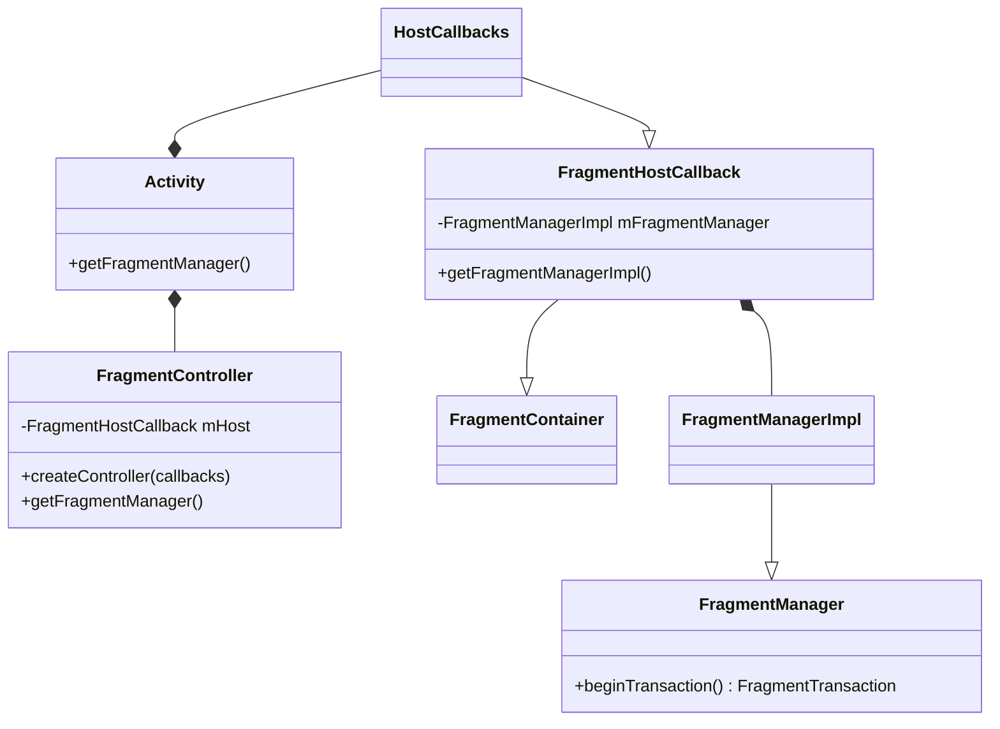
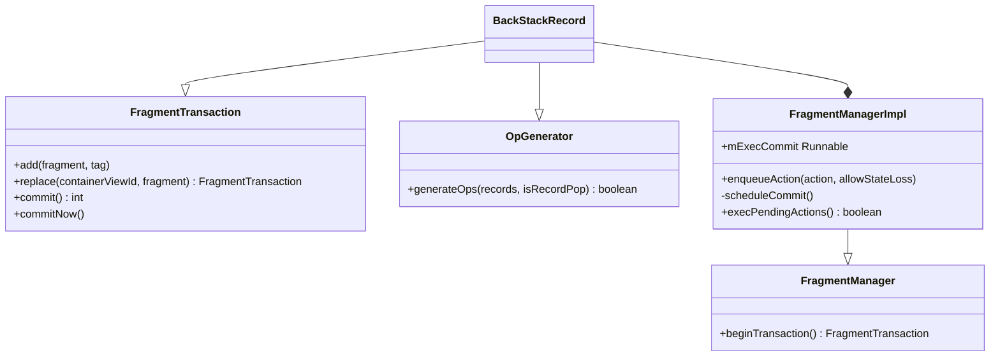
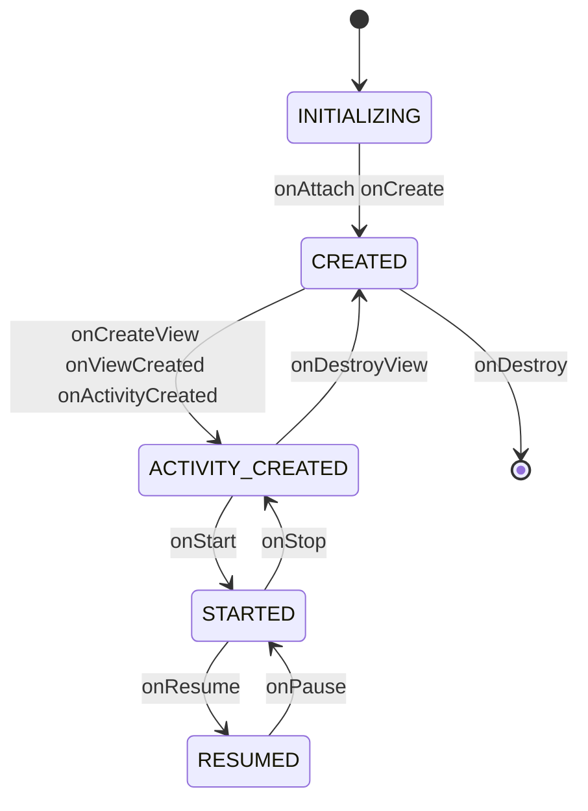

## 1. Fragment 类基础

Fragment 类的核心成员:持有宿主(Activity)、父 Fragment、以及各自的 FragmentManager:

```java
public class Fragment{
    private static final ArrayMap<String, Class<?>> sClassMap = new ArrayMap<String, Class<?>>();
     // The fragment manager we are associated with.  Set as soon as the fragment is used in a transaction; cleared after it has been removed from all transactions.
    FragmentManagerImpl mFragmentManager;

    // Activity this fragment is attached to.
    FragmentHostCallback mHost;

    FragmentManagerImpl mChildFragmentManager;

     public Fragment() {}
}
```

### 1.1 instantiate:反射创建 Fragment

```java
public static Fragment instantiate(Context context, String fname) {
    return instantiate(context, fname, null);
}

 public static Fragment instantiate(Context context, String fname, @Nullable Bundle args) {
        try {
            Class<?> clazz = sClassMap.get(fname);
            if (clazz == null) {
                // Class not found in the cache, see if it's real, and try to add it
                clazz = context.getClassLoader().loadClass(fname);
                if (!Fragment.class.isAssignableFrom(clazz)) {
                    throw new InstantiationException("Trying to instantiate a class " + fname
                            + " that is not a Fragment", new ClassCastException());
                }
                sClassMap.put(fname, clazz);
            }
            Fragment f = (Fragment) clazz.getConstructor().newInstance();
            if (args != null) {
                args.setClassLoader(f.getClass().getClassLoader());
                f.setArguments(args);
            }
            return f;
        } catch (...){

     }
}
```

以类名为 key 先查 sClassMap 缓存,未命中再通过 ClassLoader 加载,最后反射调用无参构造函数创建实例——**Fragment 必须有无参构造函数**正是由此而来。

### 1.2 宿主相关方法

getContext/getActivity/getHost 都是对 mHost 的代理,mHost 为空(未 attach)时返回 null:

```java
 public Context getContext() {
        return mHost == null ? null : mHost.getContext();
 }


final public Activity getActivity() {
    return mHost == null ? null : mHost.getActivity();
}

@Nullable
final public Object getHost() {
    return mHost == null ? null : mHost.onGetHost();
}


final public boolean isResumed() {
    return mState >= RESUMED;
}

final public boolean isVisible() {
    return isAdded() && !isHidden() && mView != null
        && mView.getWindowToken() != null && mView.getVisibility() == View.VISIBLE;
}


final public boolean isHidden() {
    return mHidden;
}
```

### 1.3 getChildFragmentManager

子 FragmentManager 懒加载,创建后按当前状态把生命周期事件补发给子 Fragment:

```java
    final public FragmentManager getChildFragmentManager() {
        if (mChildFragmentManager == null) {
            instantiateChildFragmentManager();
            if (mState >= RESUMED) {
                mChildFragmentManager.dispatchResume();
            } else if (mState >= STARTED) {
                mChildFragmentManager.dispatchStart();
            } else if (mState >= ACTIVITY_CREATED) {
                mChildFragmentManager.dispatchActivityCreated();
            } else if (mState >= CREATED) {
                mChildFragmentManager.dispatchCreate();
            }
        }
        return mChildFragmentManager;
    }
```

### 1.4 startActivityForResult 与 LayoutInflater

```java
public void startActivityForResult(Intent intent, int requestCode, Bundle options) {
    if (mHost == null) {
        throw new IllegalStateException("Fragment " + this + " not attached to Activity");
    }
    mHost.onStartActivityFromFragment(this, intent, requestCode, options);
}
```

```java
    public LayoutInflater onGetLayoutInflater(Bundle savedInstanceState) {
        if (mHost == null) {
            throw new IllegalStateException("onGetLayoutInflater() cannot be executed until the "
                    + "Fragment is attached to the FragmentManager.");
        }
        final LayoutInflater result = mHost.onGetLayoutInflater();
        if (mHost.onUseFragmentManagerInflaterFactory()) {
            getChildFragmentManager(); // Init if needed; use raw implementation below.
            result.setPrivateFactory(mChildFragmentManager.getLayoutInflaterFactory());
        }
        return result;
    }
```

```java
    public final LayoutInflater getLayoutInflater() {
        if (mLayoutInflater == null) {
            return performGetLayoutInflater(null);
        }
        return mLayoutInflater;
    }


LayoutInflater performGetLayoutInflater(Bundle savedInstanceState) {
    LayoutInflater layoutInflater = onGetLayoutInflater(savedInstanceState);
    mLayoutInflater = layoutInflater;
    return mLayoutInflater;
}
```

### 1.5 onInflate

> Called when a fragment is being created as part of a view layout inflation, typically from setting the content view of an activity. This may be called immediately after the fragment is created from a tag in a layout file. Note this is **before** the fragment's `onAttach(android.app.Activity)` has been called; all you should do here is parse the attributes and save them away.

onInflate 发生在**布局文件 inflate 阶段**,早于 onAttach,适合解析 XML 属性并保存;即使 Fragment 是带着已保存状态重新 inflate 的,该方法每次也都会被调用:

```java
   @CallSuper
    public void onInflate(Context context, AttributeSet attrs, Bundle savedInstanceState) {
        onInflate(attrs, savedInstanceState);
        mCalled = true;

        TypedArray a = context.obtainStyledAttributes(attrs,
                com.android.internal.R.styleable.Fragment);
        setEnterTransition(loadTransition(context, a, getEnterTransition(), null,
                com.android.internal.R.styleable.Fragment_fragmentEnterTransition));
        setReturnTransition(loadTransition(context, a, getReturnTransition(),
                USE_DEFAULT_TRANSITION,
                com.android.internal.R.styleable.Fragment_fragmentReturnTransition));
        setExitTransition(loadTransition(context, a, getExitTransition(), null,
                com.android.internal.R.styleable.Fragment_fragmentExitTransition));

        setReenterTransition(loadTransition(context, a, getReenterTransition(),
                USE_DEFAULT_TRANSITION,
                com.android.internal.R.styleable.Fragment_fragmentReenterTransition));
        setSharedElementEnterTransition(loadTransition(context, a,
                getSharedElementEnterTransition(), null,
                com.android.internal.R.styleable.Fragment_fragmentSharedElementEnterTransition));
        setSharedElementReturnTransition(loadTransition(context, a,
                getSharedElementReturnTransition(), USE_DEFAULT_TRANSITION,
                com.android.internal.R.styleable.Fragment_fragmentSharedElementReturnTransition));
        boolean isEnterSet;
        boolean isReturnSet;
        if (mAnimationInfo == null) {
            isEnterSet = false;
            isReturnSet = false;
        } else {
            isEnterSet = mAnimationInfo.mAllowEnterTransitionOverlap != null;
            isReturnSet = mAnimationInfo.mAllowReturnTransitionOverlap != null;
        }
        if (!isEnterSet) {
            setAllowEnterTransitionOverlap(a.getBoolean(
                    com.android.internal.R.styleable.Fragment_fragmentAllowEnterTransitionOverlap,
                    true));
        }
        if (!isReturnSet) {
            setAllowReturnTransitionOverlap(a.getBoolean(
                    com.android.internal.R.styleable.Fragment_fragmentAllowReturnTransitionOverlap,
                    true));
        }
        a.recycle();

        final Activity hostActivity = mHost == null ? null : mHost.getActivity();
        if (hostActivity != null) {
            mCalled = false;
            onInflate(hostActivity, attrs, savedInstanceState);
        }
    }
```

```java
   @Deprecated
    @CallSuper
    public void onInflate(AttributeSet attrs, Bundle savedInstanceState) {
        mCalled = true;
    }

        @Deprecated
    @CallSuper
    public void onInflate(Activity activity, AttributeSet attrs, Bundle savedInstanceState) {
        mCalled = true;
    }
```

#### 使用:XML 属性 + Arguments 双通道传参

```java
public static class MyFragment extends Fragment {
    CharSequence mLabel;

    /**
     * Create a new instance of MyFragment that will be initialized
     * with the given arguments.
     */
    static MyFragment newInstance(CharSequence label) {
        MyFragment f = new MyFragment();
        Bundle b = new Bundle();
        b.putCharSequence("label", label);
        f.setArguments(b);
        return f;
    }

    /**
     * Parse attributes during inflation from a view hierarchy into the
     * arguments we handle.
     */
    @Override public void onInflate(Activity activity, AttributeSet attrs, Bundle savedInstanceState) {
        super.onInflate(activity, attrs, savedInstanceState);

        TypedArray a = activity.obtainStyledAttributes(attrs, R.styleable.FragmentArguments);
        mLabel = a.getText(R.styleable.FragmentArguments_android_label);
        a.recycle();
    }

    /**
     * During creation, if arguments have been supplied to the fragment
     * then parse those out.
     */
    @Override public void onCreate(Bundle savedInstanceState) {
        super.onCreate(savedInstanceState);

        Bundle args = getArguments();
        if (args != null) {
            mLabel = args.getCharSequence("label", mLabel);
        }
    }

    /**
     * Create the view for this fragment, using the arguments given to it.
     */
    @Override public View onCreateView(LayoutInflater inflater, ViewGroup container, Bundle savedInstanceState) {
        View v = inflater.inflate(R.layout.hello_world, container, false);
        View tv = v.findViewById(R.id.text);
        ((TextView)tv).setText(mLabel != null ? mLabel : "(no label)");
        tv.setBackgroundDrawable(getResources().getDrawable(android.R.drawable.gallery_thumb));
        return v;
    }
}
```

Note that parsing the XML attributes uses a "styleable" resource. The declaration for the styleable used here is:

```xml
<declare-styleable name="FragmentArguments">
    <attr name="android:label" />
</declare-styleable>
```

The fragment can then be declared within its activity's content layout through a tag like this:

```xml
<fragment class="com.example.android.apis.app.FragmentArguments$MyFragment"
        android:id="@+id/embedded"
        android:layout_width="0px" android:layout_height="wrap_content"
        android:layout_weight="1"
        android:label="@string/fragment_arguments_embedded" />
```

This fragment can also be created dynamically from arguments given at runtime in the arguments Bundle; here is an example of doing so at creation of the containing activity:

```java
@Override protected void onCreate(Bundle savedInstanceState) {
    super.onCreate(savedInstanceState);
    setContentView(R.layout.fragment_arguments);

    if (savedInstanceState == null) {
        // First-time init; create fragment to embed in activity.
        FragmentTransaction ft = getFragmentManager().beginTransaction();
        Fragment newFragment = MyFragment.newInstance("From Arguments");
        ft.add(R.id.created, newFragment);
        ft.commit();
    }
}
```

## 2. FragmentManager 的获取

整体类关系:



Activity 内部通过 FragmentController 持有一整套 Fragment 体系:

```java
public class Activity{
    final FragmentController mFragments = FragmentController.createController(new HostCallbacks());

    public FragmentManager getFragmentManager() {
        return mFragments.getFragmentManager();
    }

    class HostCallbacks extends FragmentHostCallback<Activity> {

            public HostCallbacks() {
                super(Activity.this /*activity*/);
            }
    }
}
```

> FragmentHostCallback: Fragments may be hosted by any object; such as an **Activity**. In order to host fragments, implement **FragmentHostCallback**, overriding the methods applicable to the host.

FragmentHostCallback 中的 handler,后续事务调度都会用它切回主线程:

```java
public abstract class FragmentHostCallback<E> extends FragmentContainer {
    private final Activity mActivity;
    final Context mContext;
    private final Handler mHandler;
    final int mWindowAnimations;

    FragmentHostCallback(Activity activity) {
        this(activity, activity /*context*/, activity.mHandler, 0 /*windowAnimations*/);
    }

    FragmentHostCallback(Activity activity, Context context, Handler handler,
            int windowAnimations) {
        mActivity = activity;
        mContext = context;
        mHandler = handler;
        mWindowAnimations = windowAnimations;
    }
}
```

```java
public abstract class FragmentHostCallback<E> extends FragmentContainer {
    final FragmentManagerImpl mFragmentManager = new FragmentManagerImpl();

    FragmentHostCallback(Activity activity) {
        this(activity, activity /*context*/, activity.mHandler, 0 /*windowAnimations*/);
    }

    FragmentManagerImpl getFragmentManagerImpl() {
        return mFragmentManager;
    }

    //Return the object that's currently hosting the fragment.
    public abstract E onGetHost();

}
```
```java
public abstract class FragmentContainer {

    @Nullable
    public abstract <T extends View> T onFindViewById(@IdRes int id);

    /**
     * Return {@code true} if the container holds any view.
     */
    public abstract boolean onHasView();


    public Fragment instantiate(Context context, String className, Bundle arguments) {
        return Fragment.instantiate(context, className, arguments);
    }
}
```
```java
public class FragmentController {
    private final FragmentHostCallback<?> mHost;

    public static final FragmentController createController(FragmentHostCallback<?> callbacks) {
        return new FragmentController(callbacks);
    }

    private FragmentController(FragmentHostCallback<?> callbacks) {
        mHost = callbacks;
    }

    public FragmentManager getFragmentManager() {
        return mHost.getFragmentManagerImpl();
    }
}
```

### OpGenerator 接口

**An add or pop transaction to be scheduled for the UI thread**

```java
final class FragmentManagerImpl extends FragmentManager implements LayoutInflater.Factory2{

    interface OpGenerator {
        boolean generateOps(ArrayList<BackStackRecord> records, ArrayList<Boolean> isRecordPop);
    }
}
```

## 3. FragmentTransaction 的获取与操作



```java
public abstract class FragmentManager {
    public abstract FragmentTransaction beginTransaction();
}
```
FragmentManagerImpl 与 FragmentManager 在同一个文件中:

```java
final class FragmentManagerImpl extends FragmentManager implements LayoutInflater.Factory2 {

    @Override
    public FragmentTransaction beginTransaction() {
        return new BackStackRecord(this);
    }
 }
```

### BackStackRecord

final class BackStackState 和 BackStackRecord 在同一个文件中:

```java
final class BackStackRecord extends FragmentTransaction implements  FragmentManagerImpl.OpGenerator{

    final FragmentManagerImpl mManager;

    public BackStackRecord(FragmentManagerImpl manager) {
        mManager = manager;
    }
}
```

### add/replace

```java
final class BackStackRecord extends FragmentTransaction implements FragmentManagerImpl.OpGenerator{

    @Override
    public boolean generateOps(ArrayList<BackStackRecord> records, ArrayList<Boolean> isRecordPop) {
        records.add(this);
        isRecordPop.add(false);
        if (mAddToBackStack) {
            mManager.addBackStackState(this);
        }
        return true;
    }

    public FragmentTransaction add(Fragment fragment, String tag) {
        doAddOp(0, fragment, tag, OP_ADD);
        return this;
    }

    public FragmentTransaction add(int containerViewId, Fragment fragment, String tag) {
        doAddOp(containerViewId, fragment, tag, OP_ADD);
        return this;
    }

    public FragmentTransaction replace(int containerViewId, Fragment fragment) {
        return replace(containerViewId, fragment, null);
    }

    public FragmentTransaction replace(int containerViewId, Fragment fragment, String tag) {
        if (containerViewId == 0) {
            throw new IllegalArgumentException("Must use non-zero containerViewId");
        }
        doAddOp(containerViewId, fragment, tag, OP_REPLACE);
        return this;
    }

}
```
```java
final class BackStackRecord extends FragmentTransaction implements FragmentManagerImpl.OpGenerator{

    private void doAddOp(int containerViewId, Fragment fragment, String tag, int opcmd) {
        fragment.mFragmentManager = mManager;
        if (containerViewId != 0) {
            fragment.mContainerId = fragment.mFragmentId = containerViewId;
        }
        addOp(new Op(opcmd, fragment));
    }

}
```
```java
final class BackStackRecord extends FragmentTransaction implements FragmentManagerImpl.OpGenerator{

     static final class Op {
        int cmd;
        Fragment fragment;
        int enterAnim;
        int exitAnim;
        int popEnterAnim;
        int popExitAnim;

        Op() {}

        Op(int cmd, Fragment fragment) {
            this.cmd = cmd;
            this.fragment = fragment;
        }
    }

    ArrayList<Op> mOps = new ArrayList<>();

    void addOp(Op op) {
       mOps.add(op);
       op.enterAnim = mEnterAnim;
       op.exitAnim = mExitAnim;
       op.popEnterAnim = mPopEnterAnim;
       op.popExitAnim = mPopExitAnim;
    }

}
```

事务中的每个操作(add/replace/remove...)都被记为一个 Op,按调用顺序存进 mOps 列表——事务是**操作的记录**,真正的执行推迟到 commit 之后。

### commit

**BackStackRecord 通过 FragmentManagerImpl 调用 enqueueAction 来执行后续添加操作**

```java
final class BackStackRecord extends FragmentTransaction implements FragmentManagerImpl.OpGenerator{

    public int commit() {
        return commitInternal(false);
    }

    int commitInternal(boolean allowStateLoss) {
        mManager.enqueueAction(this, allowStateLoss);
        return mIndex;
    }

}
```

## 4. 事务的执行

enqueueAction 会调用 scheduleCommit,在 scheduleCommit 中实际是将当前的执行线程 mExecCommit 通过 HostCallback 中的 handler 去执行:

```java
final class FragmentManagerImpl extends FragmentManager implements LayoutInflater.Factory2 {

    ArrayList<OpGenerator> mPendingActions;

    public void enqueueAction(OpGenerator action, boolean allowStateLoss) {
        synchronized (this) {
            if (mPendingActions == null) {
                mPendingActions = new ArrayList<>();
            }
            mPendingActions.add(action);
            scheduleCommit();
        }
    }

    //在activity创建的实现类, 通过FragmentController传递过来
    FragmentHostCallback<?> mHost;

    private void scheduleCommit() {
        synchronized (this) {
            boolean postponeReady = mPostponedTransactions != null && !mPostponedTransactions.isEmpty();
            boolean pendingReady = mPendingActions != null && mPendingActions.size() == 1;
            if (postponeReady || pendingReady) {
                //handler获取
                mHost.getHandler().removeCallbacks(mExecCommit);
                mHost.getHandler().post(mExecCommit);
            }
        }
    }
	//mHost赋值
    public void attachController(FragmentHostCallback<?> host, FragmentContainer container, Fragment parent) {
        if (mHost != null) throw new IllegalStateException("Already attached");
        mHost = host;
        mContainer = container;
        mParent = parent;
    }

    Runnable mExecCommit = new Runnable() {
        @Override
        public void run() {
            execPendingActions();
        }
    };
}
```

### execPendingActions

```java
final class FragmentManagerImpl extends FragmentManager{
    // Temporary vars for removing redundant operations in BackStackRecords:
    ArrayList<BackStackRecord> mTmpRecords;
    ArrayList<Boolean> mTmpIsPop;
    ArrayList<Fragment> mTmpAddedFragments;

    /**
     * Only call from main thread!
     */
    public boolean execPendingActions() {
        //2.1
        ensureExecReady(true);

        boolean didSomething = false;
        //2.2
        while (generateOpsForPendingActions(mTmpRecords, mTmpIsPop)) {
            mExecutingActions = true;
            try {
                removeRedundantOperationsAndExecute(mTmpRecords, mTmpIsPop);
            } finally {
                cleanupExec();
            }
            didSomething = true;
        }

        //2.3
        doPendingDeferredStart();
        burpActive();

        return didSomething;
    }

}
```

#### 4.1 ensureExecReady(true)

```java
final class FragmentManagerImpl extends FragmentManager implements LayoutInflater.Factory2{

    boolean mExecutingActions;

    private void ensureExecReady(boolean allowStateLoss) {
        if (mExecutingActions) {
            throw new IllegalStateException("FragmentManager is already executing transactions");
        }

        if (Looper.myLooper() != mHost.getHandler().getLooper()) {
            throw new IllegalStateException("Must be called from main thread of fragment host");
        }

        if (!allowStateLoss) {
            checkStateLoss();
        }

        if (mTmpRecords == null) {
            mTmpRecords = new ArrayList<>();
            mTmpIsPop = new ArrayList<>();
        }
        mExecutingActions = true;
        try {
            executePostponedTransaction(null, null);
        } finally {
            mExecutingActions = false;
        }
    }


    private void checkStateLoss() {
        if (mStateSaved) {
            throw new IllegalStateException(
                    "Can not perform this action after onSaveInstanceState");
        }
        if (mNoTransactionsBecause != null) {
            throw new IllegalStateException(
                    "Can not perform this action inside of " + mNoTransactionsBecause);
        }
    }

}
```

checkStateLoss 就是 `Can not perform this action after onSaveInstanceState` 这个经典异常的来源——onSaveInstanceState 之后状态可能已丢失,默认拒绝执行事务。

#### 4.2 generateOpsForPendingActions

```java
final class FragmentManagerImpl extends FragmentManager implements LayoutInflater.Factory2{

    ArrayList<OpGenerator> mPendingActions;

    //Adds all records in the pending actions to records and whether they are add or pop operations to isPop. After executing, the pending actions will be empty.
    private boolean generateOpsForPendingActions(ArrayList<BackStackRecord> records,ArrayList<Boolean> isPop) {
        boolean didSomething = false;
        synchronized (this) {
            if (mPendingActions == null || mPendingActions.size() == 0) {
                return false;
            }

            final int numActions = mPendingActions.size();
            for (int i = 0; i < numActions; i++) {
                didSomething |= mPendingActions.get(i).generateOps(records, isPop);
            }
            //清除
            mPendingActions.clear();
            mHost.getHandler().removeCallbacks(mExecCommit);
        }
        return didSomething;
    }


    //mPendingActions赋值
    public void enqueueAction(OpGenerator action, boolean allowStateLoss) {
        if (!allowStateLoss) {
            checkStateLoss();
        }
        synchronized (this) {
            if (mDestroyed || mHost == null) {
                if (allowStateLoss) {
                    // This FragmentManager isn't attached, so drop the entire transaction.
                    return;
                }
                throw new IllegalStateException("Activity has been destroyed");
            }
            if (mPendingActions == null) {
                mPendingActions = new ArrayList<>();
            }
            mPendingActions.add(action);
            scheduleCommit();
        }
    }


}
```

#### 4.3 PopBackStackState implements OpGenerator

回退操作(pop)同样被封装成 OpGenerator:

```java
final class FragmentManagerImpl extends FragmentManager implements LayoutInflater.Factory2{

    Fragment mPrimaryNav;

    private class PopBackStackState implements OpGenerator {
        final String mName;
        final int mId;
        final int mFlags;

        public PopBackStackState(String name, int id, int flags) {
            mName = name;
            mId = id;
            mFlags = flags;
        }

        @Override
        public boolean generateOps(ArrayList<BackStackRecord> records,ArrayList<Boolean> isRecordPop) {
            if (mPrimaryNav != null // We have a primary nav fragment
                    && mId < 0 // No valid id (since they're local)
                    && mName == null) { // no name to pop to (since they're local)
                final FragmentManager childManager = mPrimaryNav.mChildFragmentManager;
                if (childManager != null && childManager.popBackStackImmediate()) {
                    // We didn't add any operations for this FragmentManager even though a child did do work.
                    return false;
                }
            }
            return popBackStackState(records, isRecordPop, mName, mId, mFlags);
        }
    }

}
```

#### 4.4 doPendingDeferredStart

```java
    void doPendingDeferredStart() {
        if (mHavePendingDeferredStart) {
            boolean loadersRunning = false;
            for (int i=0; i<mActive.size(); i++) {
                Fragment f = mActive.valueAt(i);
                if (f != null && f.mLoaderManager != null) {
                    loadersRunning |= f.mLoaderManager.hasRunningLoaders();
                }
            }
            if (!loadersRunning) {
                mHavePendingDeferredStart = false;
                //跳转方法
                startPendingDeferredFragments();
            }
        }
    }
```
```java
   void startPendingDeferredFragments() {
        if (mActive == null) return;

        for (int i=0; i<mActive.size(); i++) {
            Fragment f = mActive.valueAt(i);
            if (f != null) {
	            //主方法
                performPendingDeferredStart(f);
            }
        }
    }
```
```java
    public void performPendingDeferredStart(Fragment f) {
        if (f.mDeferStart) {
            if (mExecutingActions) {
                // Wait until we're done executing our pending transactions
                mHavePendingDeferredStart = true;
                return;
            }
            f.mDeferStart = false;
            //fragment加载
            moveToState(f, mCurState, 0, 0, false);
        }
    }
```

## 5. Fragment 加载的具体过程

Fragment 的生命周期由 FragmentManagerImpl 的 moveToState 驱动,状态只在这几个常量之间迁移:



```java
final class FragmentManagerImpl extends FragmentManager implements LayoutInflater.Factory2 {
    void moveToState(Fragment f, int newState, int transit, int transitionStyle,boolean keepActive) {
        ...
        if (f.mState <= newState) {
            ...
            //4.1
            switch (f.mState) {
                case Fragment.INITIALIZING:
                ...

            }
        } else if (f.mState > newState) {
            //4.2

        }
        ....
    }

}
```

### 5.1 状态上升:f.mState <= newState

```java
switch (f.mState) {

    case Fragment.INITIALIZING:

        if (newState > Fragment.INITIALIZING) {
            ...
            f.mHost = mHost;
            f.mParentFragment = mParent;
            f.mFragmentManager = mParent != null? mParent.mChildFragmentManager : mHost.getFragmentManagerImpl();
            ...
            //OnFragmentPreAttached
            dispatchOnFragmentPreAttached(f, mHost.getContext(), false);
            f.mCalled = false;
            f.onAttach(mHost.getContext());
            if (!f.mCalled) {
               throw new SuperNotCalledException("Fragment " + f + " did not call through to super.onAttach()");
            }
            if (f.mParentFragment == null) {
               mHost.onAttachFragment(f);
            } else {
               f.mParentFragment.onAttachFragment(f);
            }
            //OnFragmentAttached生命周期
            dispatchOnFragmentAttached(f, mHost.getContext(), false);

            if (!f.mIsCreated) {
               dispatchOnFragmentPreCreated(f, f.mSavedFragmentState, false);
               //onCreate生命周期
               f.performCreate(f.mSavedFragmentState);
               dispatchOnFragmentCreated(f, f.mSavedFragmentState, false);
            } else {
               f.restoreChildFragmentState(f.mSavedFragmentState, true);
               f.mState = Fragment.CREATED;
            }
            f.mRetaining = false;
         }


     case Fragment.CREATED:
        ensureInflatedFragmentView(f);
        if (newState > Fragment.CREATED) {

            if (!f.mFromLayout) {
                ViewGroup container = null;
                if (f.mContainerId != 0) {
                    container = mContainer.onFindViewById(f.mContainerId);
                }
                f.mContainer = container;
                f.mView = f.performCreateView(f.performGetLayoutInflater(f.mSavedFragmentState), container, f.mSavedFragmentState);

                 if (f.mView != null) {
                    f.mView.setSaveFromParentEnabled(false);
                    if (container != null) {
                        container.addView(f.mView);
                    }
                    if (f.mHidden) {
                        f.mView.setVisibility(View.GONE);
                    }
                    f.onViewCreated(f.mView, f.mSavedFragmentState);
                    dispatchOnFragmentViewCreated(f, f.mView, f.mSavedFragmentState, false);
                    ...
                 }
            }
            //ActivityCreated
            f.performActivityCreated(f.mSavedFragmentState);
            dispatchOnFragmentActivityCreated(f, f.mSavedFragmentState, false);
            ....
        }


        case Fragment.ACTIVITY_CREATED:
            if (newState > Fragment.ACTIVITY_CREATED) {
                f.mState = Fragment.STOPPED;
            }

         case Fragment.STOPPED:
            if (newState > Fragment.STOPPED) {
                f.performStart();
                dispatchOnFragmentStarted(f, false);
            }

         case Fragment.STARTED:
            if (newState > Fragment.STARTED) {
                f.performResume();
                dispatchOnFragmentResumed(f, false);
                // Get rid of this in case we saved it and never needed it.
                f.mSavedFragmentState = null;
                f.mSavedViewState = null;
            }


}
```

注意 case 之间没有 break,状态上升是**逐级贯穿**的:从 INITIALIZING 一路执行到目标状态,对应的生命周期回调依次触发。

### 5.2 状态下降:f.mState > newState

```java
switch (f.mState) {
    case Fragment.RESUMED:
        if (newState < Fragment.RESUMED) {
            f.performPause();
            dispatchOnFragmentPaused(f, false);
        }

    case Fragment.STARTED:
        if (newState < Fragment.STARTED) {
            f.performStop();
            dispatchOnFragmentStopped(f, false);
        }

   case Fragment.STOPPED:
   case Fragment.ACTIVITY_CREATED:
        if (newState < Fragment.ACTIVITY_CREATED) {
            ...
            f.performDestroyView();
            dispatchOnFragmentViewDestroyed(f, false);
            ....动画加载
            f.mContainer = null;
            f.mView = null;
            f.mInLayout = false;
        }

    case Fragment.CREATED:
        if (newState < Fragment.CREATED) {
            if (mDestroyed) {
                if (f.getAnimatingAway() != null) {
                    //动画停止
                    Animator anim = f.getAnimatingAway();
                    f.setAnimatingAway(null);
                    anim.cancel();
                }
                if (f.getAnimatingAway() != null) {
                // We are waiting for the fragment's view to finish animating away.  Just make a note of the state the fragment now should move to once the animation is done.
                    f.setStateAfterAnimating(newState);
                    newState = Fragment.CREATED;
                }
            }else{
            ...

            }
        }
```
