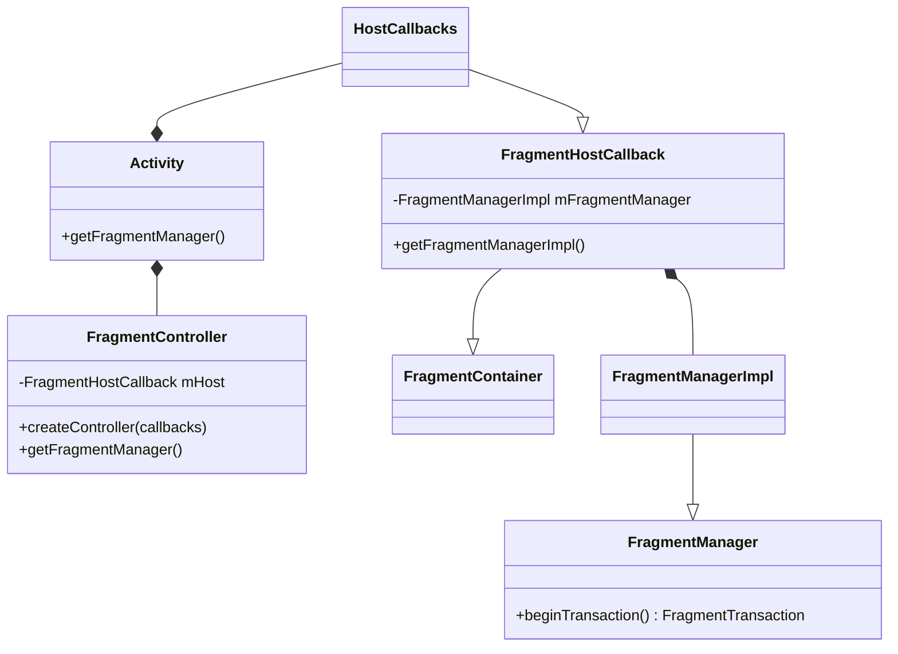
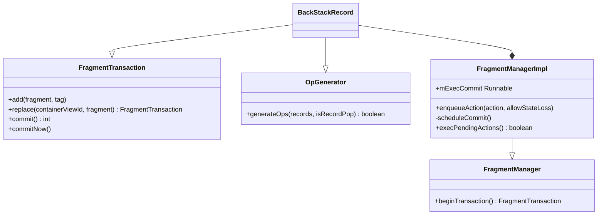
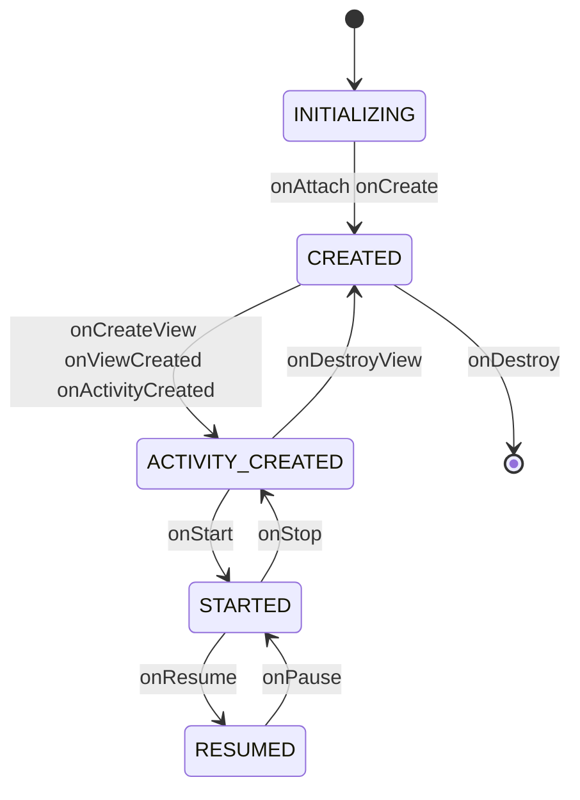

## 1. 概述与版本说明

本文基于 **Android 9.0（API 28）平台的 `android.app.Fragment`** 源码，分析 Fragment 的创建、事务执行与生命周期驱动。

> **版本注意**：`android.app.Fragment` 在 API 28 已被官方废弃，应使用 **androidx 的 `androidx.fragment.app.Fragment`**。androidx 版本正是从平台源码 fork 出来的，本文的事务记录（BackStackRecord）、OpGenerator 调度、moveToState 状态机这些核心机制基本一致；主要差异是 androidx 版集成了 Lifecycle/ViewModel、支持 FragmentFactory 与独立于系统版本更新。实际开发中新代码不应再使用平台 Fragment。

Fragment 体系的主线可以概括为一条链：

**Activity 持有 FragmentController/FragmentHostCallback → FragmentManagerImpl 管理所有 Fragment → FragmentTransaction（实现类 BackStackRecord）记录操作 → commit 后经 Handler 切主线程执行 → moveToState 状态机驱动生命周期**。

## 2. Fragment 类基础

Fragment 的核心成员：持有宿主（通过 mHost）、父 Fragment、以及各自的 FragmentManager：

```java
public class Fragment {
    private static final ArrayMap<String, Class<?>> sClassMap = new ArrayMap<>();

    FragmentManagerImpl mFragmentManager;      // 所属的 FragmentManager
    FragmentHostCallback mHost;                 // 宿主(Activity), attach 后非空
    FragmentManagerImpl mChildFragmentManager;  // 子 FragmentManager, 懒创建
    ...
}
```

### 2.1 instantiate：反射创建 Fragment

```java
public static Fragment instantiate(Context context, String fname, @Nullable Bundle args) {
    // 以类名为 key 先查缓存
    Class<?> clazz = sClassMap.get(fname);
    if (clazz == null) {
        // 未命中则通过 ClassLoader 加载并校验类型
        clazz = context.getClassLoader().loadClass(fname);
        sClassMap.put(fname, clazz);
    }
    // 反射调用无参构造函数创建实例
    Fragment f = (Fragment) clazz.getConstructor().newInstance();
    if (args != null) {
        f.setArguments(args);
    }
    return f;
}
```

以类名为 key 先查 sClassMap 缓存，未命中再通过 ClassLoader 加载，最后反射调用无参构造函数创建实例——**Fragment 必须有无参构造函数**正是由此而来（系统恢复 Fragment 时的重建也走这条路，所以不要用带参构造函数传参，应使用 setArguments）。

### 2.2 宿主相关方法

getContext/getActivity/getHost 都是对 mHost 的代理，mHost 为空（未 attach）时返回 null：

```java
public Context getContext() {
    return mHost == null ? null : mHost.getContext();
}

final public Activity getActivity() {
    return mHost == null ? null : mHost.getActivity();
}

final public boolean isResumed() {
    return mState >= RESUMED;
}

// "可见" 是多个条件的与: 已 attach + 未 hidden + 有 view 且已挂到窗口
final public boolean isVisible() {
    return isAdded() && !isHidden() && mView != null
        && mView.getWindowToken() != null && mView.getVisibility() == View.VISIBLE;
}

final public boolean isHidden() {
    return mHidden;
}
```

注意 `isVisible()` 不等于 `isResumed()`：一个 RESUMED 状态的 Fragment 被 hide 后 isVisible 为 false，这就是为什么"onResume 却不可见"的常见困惑多半出在 hide/show 事务上。

### 2.3 getChildFragmentManager

子 FragmentManager 懒加载，创建后按当前状态把生命周期事件**补发**给子 Fragment（否则子树状态会落后于父 Fragment）：

```java
final public FragmentManager getChildFragmentManager() {
    if (mChildFragmentManager == null) {
        instantiateChildFragmentManager();
        // 按父 Fragment 当前状态, 把错过的生命周期事件补发给子 Fragment
        if (mState >= RESUMED) {
            mChildFragmentManager.dispatchResume();
        } else if (mState >= STARTED) {
            mChildFragmentManager.dispatchStart();
        } else if (mState >= ACTIVITY_CREATED) {
            mChildFragmentManager.dispatchActivityCreated();
        } else if (mState >= CREATED) {
            mChildFragmentManager.dispatchCreate();
        }
    }
    return mChildFragmentManager;
}
```

### 2.4 startActivityForResult 与 LayoutInflater

```java
public void startActivityForResult(Intent intent, int requestCode, Bundle options) {
    if (mHost == null) {
        throw new IllegalStateException("Fragment " + this + " not attached to Activity");
    }
    mHost.onStartActivityFromFragment(this, intent, requestCode, options);
}
```

```java
public LayoutInflater onGetLayoutInflater(Bundle savedInstanceState) {
    if (mHost == null) {
        throw new IllegalStateException("onGetLayoutInflater() cannot be executed until the "
                + "Fragment is attached to the FragmentManager.");
    }
    final LayoutInflater result = mHost.onGetLayoutInflater();
    if (mHost.onUseFragmentManagerInflaterFactory()) {
        getChildFragmentManager(); // Init if needed; use raw implementation below.
        // 注入 FragmentManager 的 LayoutInflaterFactory, <fragment> 标签由此支持
        result.setPrivateFactory(mChildFragmentManager.getLayoutInflaterFactory());
    }
    return result;
}

public final LayoutInflater getLayoutInflater() {
    if (mLayoutInflater == null) {
        return performGetLayoutInflater(null);
    }
    return mLayoutInflater;
}
```

### 2.5 onInflate

> Called when a fragment is being created as part of a view layout inflation, typically from setting the content view of an activity. This may be called immediately after the fragment is created from a tag in a layout file. Note this is **before** the fragment's `onAttach(android.app.Activity)` has been called; all you should do here is parse the attributes and save them away.
>
> onInflate 在 Fragment 作为布局标签 inflate 时调用，早于 onAttach；这里只应解析 XML 属性并保存。

onInflate 发生在**布局文件 inflate 阶段**，早于 onAttach，适合解析 XML 属性并保存；即使 Fragment 是带着已保存状态重新 inflate 的，该方法每次也都会被调用。框架实现里除转发旧版重载外，主要在解析 transition 相关的 XML 属性（摘编）：

```java
@CallSuper
public void onInflate(Context context, AttributeSet attrs, Bundle savedInstanceState) {
    onInflate(attrs, savedInstanceState);
    mCalled = true;

    // 解析 fragment 标签上的 transition 属性并保存 (摘编, 省略各 transition 逐一解析)
    TypedArray a = context.obtainStyledAttributes(attrs,
            com.android.internal.R.styleable.Fragment);
    setEnterTransition(loadTransition(context, a, getEnterTransition(), null, ...));
    setReturnTransition(loadTransition(context, a, getReturnTransition(), ...));
    ...
    a.recycle();

    // 兼容旧版三参重载
    final Activity hostActivity = mHost == null ? null : mHost.getActivity();
    if (hostActivity != null) {
        mCalled = false;
        onInflate(hostActivity, attrs, savedInstanceState);
    }
}
```

#### 使用：XML 属性 + Arguments 双通道传参

框架文档中的经典示例——同一 Fragment 既支持 XML 属性传参，也支持运行时 Arguments 传参：

```java
public static class MyFragment extends Fragment {
    CharSequence mLabel;

    // 运行时通道: newInstance + setArguments
    static MyFragment newInstance(CharSequence label) {
        MyFragment f = new MyFragment();
        Bundle b = new Bundle();
        b.putCharSequence("label", label);
        f.setArguments(b);
        return f;
    }

    // XML 通道: 在 inflate 阶段解析属性
    @Override public void onInflate(Activity activity, AttributeSet attrs, Bundle savedInstanceState) {
        super.onInflate(activity, attrs, savedInstanceState);
        TypedArray a = activity.obtainStyledAttributes(attrs, R.styleable.FragmentArguments);
        mLabel = a.getText(R.styleable.FragmentArguments_android_label);
        a.recycle();
    }

    // 重建时从 Arguments 恢复 (配置变更后 XML 属性传的值不会自动恢复, Arguments 会)
    @Override public void onCreate(Bundle savedInstanceState) {
        super.onCreate(savedInstanceState);
        Bundle args = getArguments();
        if (args != null) {
            mLabel = args.getCharSequence("label", mLabel);
        }
    }

    @Override public View onCreateView(LayoutInflater inflater, ViewGroup container,
            Bundle savedInstanceState) {
        View v = inflater.inflate(R.layout.hello_world, container, false);
        View tv = v.findViewById(R.id.text);
        ((TextView) tv).setText(mLabel != null ? mLabel : "(no label)");
        return v;
    }
}
```

解析 XML 属性需要声明 styleable：

```xml
<declare-styleable name="FragmentArguments">
    <attr name="android:label" />
</declare-styleable>
```

在布局中通过 `<fragment>` 标签声明（XML 传参通道）：

```xml
<fragment class="com.example.android.apis.app.FragmentArguments$MyFragment"
        android:id="@+id/embedded"
        android:layout_width="0px" android:layout_height="wrap_content"
        android:layout_weight="1"
        android:label="@string/fragment_arguments_embedded" />
```

也可以在 Activity 中动态创建（Arguments 传参通道）：

```java
@Override protected void onCreate(Bundle savedInstanceState) {
    super.onCreate(savedInstanceState);
    setContentView(R.layout.fragment_arguments);

    if (savedInstanceState == null) {
        // First-time init; create fragment to embed in activity.
        FragmentTransaction ft = getFragmentManager().beginTransaction();
        Fragment newFragment = MyFragment.newInstance("From Arguments");
        ft.add(R.id.created, newFragment);
        ft.commit();
    }
}
```

## 3. FragmentManager 的获取

整体类关系：



Activity 内部通过 FragmentController 持有一整套 Fragment 体系，各层都是薄委托（摘编）：

```java
public class Activity {
    // Activity 创建时即持有 FragmentController, HostCallbacks 是 FragmentHostCallback 的实现
    final FragmentController mFragments = FragmentController.createController(new HostCallbacks());

    public FragmentManager getFragmentManager() {
        return mFragments.getFragmentManager();      // → mHost.getFragmentManagerImpl()
    }

    class HostCallbacks extends FragmentHostCallback<Activity> {
        public HostCallbacks() {
            super(Activity.this /*activity*/);
        }
    }
}
```

> FragmentHostCallback: Fragments may be hosted by any object; such as an **Activity**. In order to host fragments, implement **FragmentHostCallback**, overriding the methods applicable to the host.
>
> 任何对象都可以宿主 Fragment（不限于 Activity），只需实现 FragmentHostCallback。

FragmentHostCallback 中的 mHandler 来自 Activity 的主线程 Handler，后续事务调度都用它切回主线程：

```java
public abstract class FragmentHostCallback<E> extends FragmentContainer {
    private final Activity mActivity;
    final Context mContext;
    private final Handler mHandler;
    final FragmentManagerImpl mFragmentManager = new FragmentManagerImpl();

    FragmentHostCallback(Activity activity) {
        this(activity, activity /*context*/, activity.mHandler, 0 /*windowAnimations*/);
    }

    FragmentManagerImpl getFragmentManagerImpl() {
        return mFragmentManager;
    }

    public abstract E onGetHost();
}

// FragmentController 只是一层薄封装
public class FragmentController {
    private final FragmentHostCallback<?> mHost;

    public FragmentManager getFragmentManager() {
        return mHost.getFragmentManagerImpl();
    }
}

// FragmentContainer 抽象出"容器"能力: 找 view、判断是否有 view, 以及默认的 instantiate
public abstract class FragmentContainer {
    public abstract <T extends View> T onFindViewById(@IdRes int id);
    public abstract boolean onHasView();

    public Fragment instantiate(Context context, String className, Bundle arguments) {
        return Fragment.instantiate(context, className, arguments);
    }
}
```

### OpGenerator 接口

> An add or pop transaction to be scheduled for the UI thread.
>
> 一个待调度到 UI 线程执行的 add 或 pop 事务。

```java
final class FragmentManagerImpl extends FragmentManager implements LayoutInflater.Factory2 {

    interface OpGenerator {
        boolean generateOps(ArrayList<BackStackRecord> records, ArrayList<Boolean> isRecordPop);
    }
}
```

commit 与 popBackStack 都会被封装成 OpGenerator，进入统一的待执行队列——这是理解事务调度的关键抽象。

## 4. FragmentTransaction 的获取与操作



beginTransaction 返回的 FragmentTransaction 实际是 BackStackRecord（FragmentManagerImpl 与 FragmentManager 在同一个文件中）：

```java
final class FragmentManagerImpl extends FragmentManager implements LayoutInflater.Factory2 {

    @Override
    public FragmentTransaction beginTransaction() {
        return new BackStackRecord(this);
    }
}
```

### BackStackRecord

final class BackStackState 和 BackStackRecord 在同一个文件中：

```java
final class BackStackRecord extends FragmentTransaction implements FragmentManagerImpl.OpGenerator {

    final FragmentManagerImpl mManager;
    ArrayList<Op> mOps = new ArrayList<>();

    public BackStackRecord(FragmentManagerImpl manager) {
        mManager = manager;
    }
}
```

### add/replace

```java
final class BackStackRecord extends FragmentTransaction implements FragmentManagerImpl.OpGenerator {

    @Override
    public boolean generateOps(ArrayList<BackStackRecord> records, ArrayList<Boolean> isRecordPop) {
        records.add(this);              // 把自己交给 FragmentManager 统一执行
        isRecordPop.add(false);
        if (mAddToBackStack) {
            mManager.addBackStackState(this);   // 加入回退栈
        }
        return true;
    }

    public FragmentTransaction add(int containerViewId, Fragment fragment, String tag) {
        doAddOp(containerViewId, fragment, tag, OP_ADD);
        return this;
    }

    // replace = 移除该容器现有 fragment + add, 作为一个 OP_REPLACE 记录
    public FragmentTransaction replace(int containerViewId, Fragment fragment, String tag) {
        if (containerViewId == 0) {
            throw new IllegalArgumentException("Must use non-zero containerViewId");
        }
        doAddOp(containerViewId, fragment, tag, OP_REPLACE);
        return this;
    }

    private void doAddOp(int containerViewId, Fragment fragment, String tag, int opcmd) {
        fragment.mFragmentManager = mManager;
        if (containerViewId != 0) {
            fragment.mContainerId = fragment.mFragmentId = containerViewId;
        }
        addOp(new Op(opcmd, fragment));
    }

    // 每个操作记为一个 Op, 携带事务上设置的动画
    static final class Op {
        int cmd;
        Fragment fragment;
        int enterAnim;
        int exitAnim;
        ...
    }

    void addOp(Op op) {
        mOps.add(op);
        op.enterAnim = mEnterAnim;
        op.exitAnim = mExitAnim;
        ...
    }
}
```

事务中的每个操作（add/replace/remove...）都被记为一个 Op，按调用顺序存进 mOps 列表——事务是**操作的记录**，真正的执行推迟到 commit 之后。

### commit

BackStackRecord 通过 FragmentManagerImpl 的 enqueueAction 进入待执行队列：

```java
public int commit() {
    return commitInternal(false);
}

int commitInternal(boolean allowStateLoss) {
    mManager.enqueueAction(this, allowStateLoss);
    return mIndex;
}
```

## 5. 事务的执行

enqueueAction 会调用 scheduleCommit，在 scheduleCommit 中实际是将 mExecCommit 这个 Runnable 通过 FragmentHostCallback 中的 handler post 到主线程执行：

```java
final class FragmentManagerImpl extends FragmentManager implements LayoutInflater.Factory2 {

    ArrayList<OpGenerator> mPendingActions;
    FragmentHostCallback<?> mHost;    // 在 attachController 中赋值 (由 FragmentController 传入)

    public void enqueueAction(OpGenerator action, boolean allowStateLoss) {
        if (!allowStateLoss) {
            checkStateLoss();          // commit 的状态丢失检查在这里
        }
        synchronized (this) {
            if (mDestroyed || mHost == null) {
                if (allowStateLoss) {
                    return;            // host 已销毁, allowStateLoss 时静默丢弃事务
                }
                throw new IllegalStateException("Activity has been destroyed");
            }
            if (mPendingActions == null) {
                mPendingActions = new ArrayList<>();
            }
            mPendingActions.add(action);
            scheduleCommit();
        }
    }

    private void scheduleCommit() {
        synchronized (this) {
            boolean postponeReady = mPostponedTransactions != null && !mPostponedTransactions.isEmpty();
            boolean pendingReady = mPendingActions != null && mPendingActions.size() == 1;
            if (postponeReady || pendingReady) {
                // 通过宿主 Activity 的 handler post 到主线程
                mHost.getHandler().removeCallbacks(mExecCommit);
                mHost.getHandler().post(mExecCommit);
            }
        }
    }

    public void attachController(FragmentHostCallback<?> host, FragmentContainer container, Fragment parent) {
        if (mHost != null) throw new IllegalStateException("Already attached");
        mHost = host;
        mContainer = container;
        mParent = parent;
    }

    Runnable mExecCommit = new Runnable() {
        @Override
        public void run() {
            execPendingActions();
        }
    };
}
```

### execPendingActions

```java
final class FragmentManagerImpl extends FragmentManager {

    public boolean execPendingActions() {
        ensureExecReady(true);                       // 5.1 前置校验

        boolean didSomething = false;
        while (generateOpsForPendingActions(mTmpRecords, mTmpIsPop)) {   // 5.2 收集待执行事务
            mExecutingActions = true;
            try {
                removeRedundantOperationsAndExecute(mTmpRecords, mTmpIsPop);   // 真正执行
            } finally {
                cleanupExec();
            }
            didSomething = true;
        }

        doPendingDeferredStart();                    // 5.4 延迟启动
        burpActive();
        return didSomething;
    }
}
```

#### 5.1 ensureExecReady(true)

```java
private void ensureExecReady(boolean allowStateLoss) {
    if (mExecutingActions) {
        throw new IllegalStateException("FragmentManager is already executing transactions");
    }
    // 必须在宿主的主线程执行
    if (Looper.myLooper() != mHost.getHandler().getLooper()) {
        throw new IllegalStateException("Must be called from main thread of fragment host");
    }
    if (!allowStateLoss) {
        checkStateLoss();
    }
    ...
    executePostponedTransaction(null, null);         // 先处理被推迟的事务
}

private void checkStateLoss() {
    if (mStateSaved) {
        throw new IllegalStateException(
                "Can not perform this action after onSaveInstanceState");
    }
    ...
}
```

checkStateLoss 就是 `Can not perform this action after onSaveInstanceState` 这个经典异常的来源——onSaveInstanceState 之后状态可能已丢失，默认拒绝执行事务（用 `commitAllowingStateLoss` 可跳过此检查，代价是事务可能丢失）。

#### 5.2 generateOpsForPendingActions

把 mPendingActions 中每个 OpGenerator 的操作收集到 records，然后清空队列（摘编）：

```java
// Adds all records in the pending actions to records and whether they are add or pop
// operations to isPop. After executing, the pending actions will be empty.
private boolean generateOpsForPendingActions(ArrayList<BackStackRecord> records,
        ArrayList<Boolean> isPop) {
    synchronized (this) {
        if (mPendingActions == null || mPendingActions.size() == 0) {
            return false;
        }
        for (int i = 0; i < mPendingActions.size(); i++) {
            mPendingActions.get(i).generateOps(records, isPop);
        }
        mPendingActions.clear();
        mHost.getHandler().removeCallbacks(mExecCommit);
    }
    return true;
}
```

#### 5.3 PopBackStackState implements OpGenerator

回退操作（pop）同样被封装成 OpGenerator：

```java
private class PopBackStackState implements OpGenerator {
    final String mName;
    final int mId;
    final int mFlags;

    @Override
    public boolean generateOps(ArrayList<BackStackRecord> records,
            ArrayList<Boolean> isRecordPop) {
        // primary navigation fragment 场景: 优先让子 FragmentManager 回退
        if (mPrimaryNav != null && mId < 0 && mName == null) {
            final FragmentManager childManager = mPrimaryNav.mChildFragmentManager;
            if (childManager != null && childManager.popBackStackImmediate()) {
                return false;
            }
        }
        return popBackStackState(records, isRecordPop, mName, mId, mFlags);
    }
}
```

#### 5.4 doPendingDeferredStart

对设置了 `setDeferStart` 的 Fragment，等 Loader 都跑完再把它推进到当前状态：

```java
void doPendingDeferredStart() {
    if (mHavePendingDeferredStart) {
        boolean loadersRunning = false;
        for (each fragment in mActive) {
            loadersRunning |= f.mLoaderManager.hasRunningLoaders();
        }
        if (!loadersRunning) {
            mHavePendingDeferredStart = false;
            startPendingDeferredFragments();       // 逐个 performPendingDeferredStart
        }
    }
}

public void performPendingDeferredStart(Fragment f) {
    if (f.mDeferStart) {
        f.mDeferStart = false;
        moveToState(f, mCurState, 0, 0, false);    // 推进到当前状态
    }
}
```

## 6. Fragment 加载的具体过程

Fragment 的生命周期由 FragmentManagerImpl 的 moveToState 驱动，状态只在这几个常量之间迁移：



```java
final class FragmentManagerImpl extends FragmentManager implements LayoutInflater.Factory2 {
    void moveToState(Fragment f, int newState, int transit, int transitionStyle, boolean keepActive) {
        if (f.mState <= newState) {
            // 6.1 状态上升: 逐级向上迁移
        } else if (f.mState > newState) {
            // 6.2 状态下降: 逐级向下迁移
        }
    }
}
```

### 6.1 状态上升：f.mState <= newState

```java
switch (f.mState) {

    case Fragment.INITIALIZING:
        if (newState > Fragment.INITIALIZING) {
            // 绑定宿主关系
            f.mHost = mHost;
            f.mParentFragment = mParent;
            f.mFragmentManager = mParent != null
                    ? mParent.mChildFragmentManager : mHost.getFragmentManagerImpl();

            // onAttach
            f.onAttach(mHost.getContext());
            if (!f.mCalled) {
               throw new SuperNotCalledException("Fragment " + f
                       + " did not call through to super.onAttach()");
            }

            // onCreate
            if (!f.mIsCreated) {
                f.performCreate(f.mSavedFragmentState);
            } else {
                // 已创建过(重建场景), 只恢复子 Fragment 状态
                f.restoreChildFragmentState(f.mSavedFragmentState, true);
                f.mState = Fragment.CREATED;
            }
        }

    case Fragment.CREATED:
        ensureInflatedFragmentView(f);
        if (newState > Fragment.CREATED) {
            if (!f.mFromLayout) {
                // 找容器并创建 view
                ViewGroup container = f.mContainerId != 0
                        ? mContainer.onFindViewById(f.mContainerId) : null;
                f.mContainer = container;
                f.mView = f.performCreateView(
                        f.performGetLayoutInflater(f.mSavedFragmentState), container,
                        f.mSavedFragmentState);

                if (f.mView != null) {
                    f.mView.setSaveFromParentEnabled(false);
                    if (container != null) {
                        container.addView(f.mView);        // 加入容器
                    }
                    if (f.mHidden) {
                        f.mView.setVisibility(View.GONE);
                    }
                    f.onViewCreated(f.mView, f.mSavedFragmentState);
                }
            }
            f.performActivityCreated(f.mSavedFragmentState);   // onActivityCreated
        }

    case Fragment.ACTIVITY_CREATED:
        if (newState > Fragment.ACTIVITY_CREATED) {
            f.mState = Fragment.STOPPED;
        }

    case Fragment.STOPPED:
        if (newState > Fragment.STOPPED) {
            f.performStart();                                  // onStart
        }

    case Fragment.STARTED:
        if (newState > Fragment.STARTED) {
            f.performResume();                                 // onResume
            f.mSavedFragmentState = null;   // resume 后不再需要保存的状态
            f.mSavedViewState = null;
        }
}
```

注意 case 之间没有 break，状态上升是**逐级贯穿**的：从 INITIALIZING 一路执行到目标状态，对应的生命周期回调依次触发。这也解释了新事务 add 一个 Fragment 时 onAttach → onCreate → onCreateView → onStart → onResume 连续执行的现象。

### 6.2 状态下降：f.mState > newState

同样是逐级贯穿，只是方向相反：

```java
switch (f.mState) {
    case Fragment.RESUMED:
        if (newState < Fragment.RESUMED) {
            f.performPause();                                  // onPause
        }

    case Fragment.STARTED:
        if (newState < Fragment.STARTED) {
            f.performStop();                                   // onStop
        }

    case Fragment.STOPPED:
    case Fragment.ACTIVITY_CREATED:
        if (newState < Fragment.ACTIVITY_CREATED) {
            f.performDestroyView();                            // onDestroyView
            f.mContainer = null;
            f.mView = null;
        }

    case Fragment.CREATED:
        if (newState < Fragment.CREATED) {
            if (mDestroyed) {
                // 正在退出动画的 view: 取消动画, 记录动画结束后要迁移到的状态
                Animator anim = f.getAnimatingAway();
                if (anim != null) {
                    anim.cancel();
                    f.setStateAfterAnimating(newState);
                    newState = Fragment.CREATED;   // 暂缓销毁, 等动画结束
                }
            } else {
                ...  // performDestroy → onDestroy
            }
        }
}
```

## 7. 小结

- **事务是记录而非立即执行**：add/replace 只是往 BackStackRecord 的 mOps 里追加 Op，commit 后经 enqueueAction → Handler post 到主线程，由 execPendingActions 统一收集、去除冗余再执行。
- **状态机是生命周期的唯一驱动**：moveToState 的 switch 无 break 逐级贯穿，升与降两个方向对称；Fragment 的每个生命周期回调都对应状态迁移中的一级。
- **经典异常都有明确来源**：`Can not perform this action after onSaveInstanceState` 来自 checkStateLoss；`Activity has been destroyed` 来自 enqueueAction 的存活检查；未调 super.onAttach 抛 SuperNotCalledException。
- **无参构造函数是硬约束**：Fragment 的创建与恢复都走 instantiate 的反射路径，传参请用 setArguments（配置变更后仍能恢复）。
