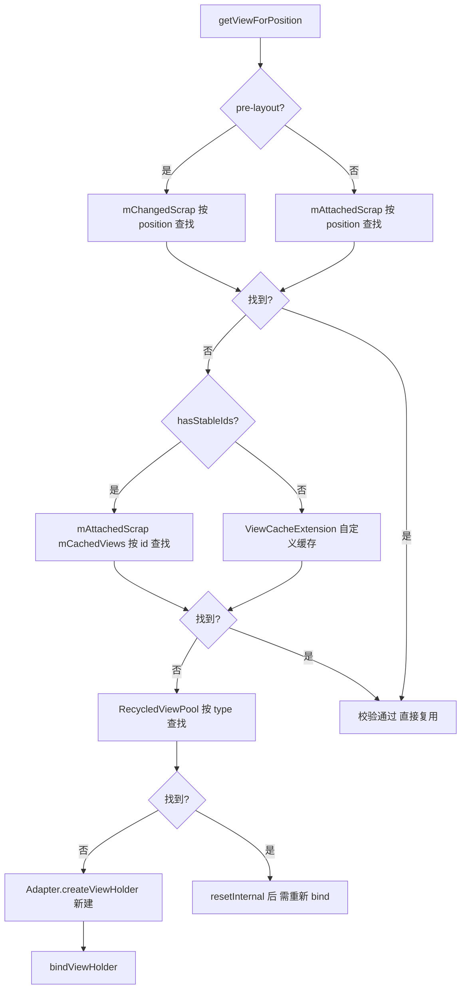

## 1. 概述与版本说明

本文基于 **support library 27.x 前后的 `android.support.v7.widget.RecyclerView`** 源码（包名 `android.support.v7`），分析其测量布局流程、动画、装饰与缓存复用机制。

> **版本注意**：support library 已停止维护，现在的实现是 **androidx 的 `androidx.recyclerview.widget.RecyclerView`**（包名迁移而来）。本文分析的核心机制——三大 dispatchLayoutStep、四级缓存、Recycler 复用链——在 androidx 版本中基本一致，仅细节有演进。
>
> 文中代码为**摘编版**：保留主干逻辑与关键调用，省略日志、防御性检查等细节，便于快速把握原理。

## 2. RecyclerView 的组成

RecyclerView 将列表的测量布局、数据绑定、动画、分割线、缓存各自解耦，由几个核心角色组成：

| 角色 | 职责 |
| --- | --- |
| Adapter | 提供数据集与 ItemView 的创建（onCreateViewHolder）与绑定（onBindViewHolder） |
| LayoutManager | 负责 ItemView 的测量与布局，决定展示方式（线性、网格、瀑布流） |
| ItemAnimator | 条目增删改时的动画 |
| ItemDecoration | 条目的装饰（分割线、间距），在测量与绘制阶段介入 |
| Recycler | ViewHolder 的缓存与复用核心 |

## 3. LayoutManager

定义了控制 adapter 展示 view 的方式，RecyclerView 要展示内容必须设置 LayoutManager：

```java
public void setLayoutManager(@Nullable LayoutManager layout) {
    if (layout == mLayout) {
        return;
    }
    stopScroll();
    if (mLayout != null) {
        // 旧 LayoutManager: 结束动画, 移除并回收所有视图 (进缓存而非直接丢弃)
        if (mItemAnimator != null) {
            mItemAnimator.endAnimations();
        }
        mLayout.removeAndRecycleAllViews(mRecycler);
        mLayout.removeAndRecycleScrapInt(mRecycler);
        mRecycler.clear();
        if (mIsAttached) {
            mLayout.dispatchDetachedFromWindow(this, mRecycler);
        }
        mLayout.setRecyclerView(null);
        mLayout = null;
    } else {
        mRecycler.clear();
    }
    mChildHelper.removeAllViewsUnfiltered();
    // 新 LayoutManager 与 RecyclerView 绑定
    mLayout = layout;
    if (layout != null) {
        mLayout.setRecyclerView(this);
        if (mIsAttached) {
            mLayout.dispatchAttachedToWindow(this);
        }
    }
    mRecycler.updateViewCacheSize();
    requestLayout();        // 重新请求 measure、layout、draw
}
```

当之前设置过 LayoutManager 时，移除之前的视图，并缓存视图在 Recycler 中，将新的 mLayout 对象与 RecyclerView 绑定，更新缓存 View 的数量。最后调用 requestLayout，重新请求 measure、layout、draw。

### 3.1 测量：onMeasure

LayoutManager 的主要作用是为 RecyclerView 放置子 View，主要体现在 `onLayout` 和 `onMeasure` 方法中：

```java
@Override
protected void onMeasure(int widthSpec, int heightSpec) {
    if (mLayout == null) {
        defaultOnMeasure(widthSpec, heightSpec);
        return;
    }
    // 通过 mAutoMeasure 标记是否使用自动测量, LinearLayoutManager 中为 true
    if (mLayout.isAutoMeasureEnabled()) {
        final int widthMode = MeasureSpec.getMode(widthSpec);
        final int heightMode = MeasureSpec.getMode(heightSpec);

        mLayout.onMeasure(mRecycler, mState, widthSpec, heightSpec);

        // 宽高都是 EXACTLY 时可直接确定自身尺寸, 无需提前布局子 view
        final boolean measureSpecModeIsExactly =
                widthMode == MeasureSpec.EXACTLY && heightMode == MeasureSpec.EXACTLY;
        if (measureSpecModeIsExactly || mAdapter == null) {
            return;
        }

        if (mState.mLayoutStep == State.STEP_START) {
            dispatchLayoutStep1();          // 预布局: 记录旧状态、处理动画
        }
        mState.mIsMeasuring = true;
        dispatchLayoutStep2();              // 真正布局子 view

        // 子 view 布局完成后反推自身尺寸
        mLayout.setMeasuredDimensionFromChildren(widthSpec, heightSpec);

        if (mLayout.shouldMeasureTwice()) { // wrap_content 嵌套等场景二次测量
            mLayout.setMeasureSpecs(
                    MeasureSpec.makeMeasureSpec(getMeasuredWidth(), MeasureSpec.EXACTLY),
                    MeasureSpec.makeMeasureSpec(getMeasuredHeight(), MeasureSpec.EXACTLY));
            mState.mIsMeasuring = true;
            dispatchLayoutStep2();
            mLayout.setMeasuredDimensionFromChildren(widthSpec, heightSpec);
        }
    } else {
        ...  // 非自动测量, 交由 LayoutManager 完全决定
    }
}
```

当 RecyclerView 的 MeasureSpec 为 EXACTLY 时，可以直接确定宽高，直接 return 退出测量。当宽高不为 EXACTLY（如 wrap_content）时，只能在测量、布局了子 view 之后才能确定自己的宽高——所以在 onMeasure 里就提前调用了 dispatchLayoutStep1、dispatchLayoutStep2。

> `mState.mLayoutStep` 有三个状态：STEP_START、STEP_LAYOUT、STEP_ANIMATIONS，标记 layout 流程进行到哪一步。

```java
private void dispatchLayoutStep2() {
    ...
    // Step 2: Run layout
    mState.mInPreLayout = false;
    mLayout.onLayoutChildren(mRecycler, mState);   // 布局算法入口, 由 LayoutManager 实现
    ...
    mState.mLayoutStep = State.STEP_ANIMATIONS;
    ...
}
```

onLayoutChildren 由 LayoutManager 实现，来规定放置子 view 的算法（LinearLayoutManager 的实现见第 6 节 fill/layoutChunk）。

### 3.2 布局：onLayout

```java
@Override
protected void onLayout(boolean changed, int l, int t, int r, int b) {
    dispatchLayout();
    mFirstLayoutComplete = true;
}
```

跟进到 `dispatchLayout()`。当 onMeasure 中已经调用过 dispatchLayoutStep1、dispatchLayoutStep2 时（wrap_content 场景），onLayout 只需补一个 dispatchLayoutStep3：

```java
void dispatchLayout() {
    if (mAdapter == null || mLayout == null) {
        return;   // "No adapter attached / No layout manager attached" 跳过布局
    }
    mState.mIsMeasuring = false;
    if (mState.mLayoutStep == State.STEP_START) {
        // 尺寸确定(EXACTLY)时, 三步全在 layout 阶段完成
        dispatchLayoutStep1();
        mLayout.setExactMeasureSpecsFrom(this);
        dispatchLayoutStep2();
    } else if (mAdapterHelper.hasUpdates() || mLayout.getWidth() != getWidth()
            || mLayout.getHeight() != getHeight()) {
        // 测量后尺寸又变了, step2 重跑
        mLayout.setExactMeasureSpecsFrom(this);
        dispatchLayoutStep2();
    } else {
        mLayout.setExactMeasureSpecsFrom(this);
    }
    dispatchLayoutStep3();
}
```

三个 step 的分工：

| 步骤 | 时机 | 职责 |
| --- | --- | --- |
| dispatchLayoutStep1 | 预布局 | 处理 adapter 更新、决定哪个动画该跑、记录 layout 前 view 的信息（必要时跑 predictive layout） |
| dispatchLayoutStep2 | 真正布局 | 调 LayoutManager.onLayoutChildren 实际摆放子 view |
| dispatchLayoutStep3 | 布局收尾 | 记录 layout 后 view 的信息、触发并执行动画、状态清理 |

## 4. ItemAnimator

```java
public void setItemAnimator(@Nullable ItemAnimator animator) {
    if (mItemAnimator != null) {
        mItemAnimator.endAnimations();
        mItemAnimator.setListener(null);
    }
    mItemAnimator = animator;
    if (mItemAnimator != null) {
        mItemAnimator.setListener(mItemAnimatorListener);
    }
}
```

**ItemAnimator** 类在 RecyclerView 布局前后记录 ItemView 的位置信息到 ItemHolderInfo：

```java
public @NonNull ItemHolderInfo recordPreLayoutInformation(@NonNull State state,
        @NonNull ViewHolder viewHolder, @AdapterChanges int changeFlags,
        @NonNull List<Object> payloads) {
    return obtainHolderInfo().setFrom(viewHolder);
}

public @NonNull ItemHolderInfo recordPostLayoutInformation(@NonNull State state,
        @NonNull ViewHolder viewHolder) {
    return obtainHolderInfo().setFrom(viewHolder);
}
```

`recordPreLayoutInformation` 记录 layout 之前的状态信息，在 dispatchLayoutStep1 中调用（摘编）：

```java
private void dispatchLayoutStep1() {
    ...
    if (mState.mRunSimpleAnimations) {
        // Step 0: Find out where all non-removed items are, pre-layout
        for (each visible child) {
            final ViewHolder holder = ...;
            // 布局前 ItemAnimator 记录相关信息, recordPreLayoutInformation 调用处
            final ItemHolderInfo animationInfo = mItemAnimator
                    .recordPreLayoutInformation(mState, holder,
                            ItemAnimator.buildAdapterChangeFlagsForAnimations(holder),
                            holder.getUnmodifiedPayloads());
            mViewInfoStore.addToPreLayout(holder, animationInfo);
        }
    }
    if (mState.mRunPredictiveAnimations) {
        // Step 1: run prelayout: 用旧位置跑一次 predictive layout,
        // 让"即将出现"的 view 也有可用的 pre-layout 位置 (摘编)
        saveOldPositions();
        ...
    } else {
        clearOldPositions();
    }
    mState.mLayoutStep = State.STEP_LAYOUT;
}
```

`recordPostLayoutInformation` 在 step3 中调用，记录 layout 完成时 ItemView 的信息（摘编）：

```java
private void dispatchLayoutStep3() {
    mState.mLayoutStep = State.STEP_START;
    if (mState.mRunSimpleAnimations) {
        // Step 3: Find out where things are now, and process change animations.
        for (each visible child, 逆序遍历) {
            ViewHolder holder = ...;
            final ItemHolderInfo animationInfo = mItemAnimator
                    .recordPostLayoutInformation(mState, holder);
            ViewHolder oldChangeViewHolder = mViewInfoStore.getFromOldChangeHolders(key);
            if (oldChangeViewHolder != null) {
                // pre/post 都有记录且不是同一个 holder → change 动画
                final ItemHolderInfo preInfo = mViewInfoStore.popFromPreLayout(oldChangeViewHolder);
                mViewInfoStore.addToPostLayout(holder, animationInfo);
                ItemHolderInfo postInfo = mViewInfoStore.popFromPostLayout(holder);
                animateChange(oldChangeViewHolder, holder, preInfo, postInfo, ...);
            } else {
                mViewInfoStore.addToPostLayout(holder, animationInfo);
            }
        }
        // Step 4: Process view info lists and trigger animations
        mViewInfoStore.process(mViewInfoProcessCallback);   // 派发各动画
    }

    // 状态清理 (摘编): 回收 scrap、重置标记、通知 layout 完成
    mLayout.removeAndRecycleScrapInt(mRecycler);
    mState.mRunSimpleAnimations = false;
    mState.mRunPredictiveAnimations = false;
    mLayout.onLayoutCompleted(mState);
    mViewInfoStore.clear();
    ...
}
```

**ItemAnimator** 动画相关 API 的真实触发条件（经 `mViewInfoProcessCallback` 派发，其注册在 step3 的 Step 4 中完成）：

- `animateDisappearance`：ViewHolder 从 layout 中移除时调用（ disappearance ）
- `animateAppearance`：ViewHolder 新添加进 RecyclerView 时调用
- `animatePersistence`：ViewHolder 布局前后都在（位置可能移动）时调用
- `animateChange`：条目发生**变更**时调用——`notifyItemChanged` 这类条目级变更走 pre/post 两个 holder 的 change 动画；`notifyDataSetChanged` 因整体数据失效（`mDataSetHasChangedAfterLayout`），在回调里也会退化为对 persistent view 调 animateChange

```java
private final ViewInfoStore.ProcessCallback mViewInfoProcessCallback =
        new ViewInfoStore.ProcessCallback() {
            @Override
            public void processDisappeared(ViewHolder viewHolder, @NonNull ItemHolderInfo info,
                    @Nullable ItemHolderInfo postInfo) {
                mRecycler.unscrapView(viewHolder);
                animateDisappearance(viewHolder, info, postInfo);
            }
            @Override
            public void processAppeared(ViewHolder viewHolder,
                    ItemHolderInfo preInfo, @NonNull ItemHolderInfo info) {
                animateAppearance(viewHolder, preInfo, info);
            }
            @Override
            public void processPersistent(ViewHolder viewHolder,
                    @NonNull ItemHolderInfo preInfo, @NonNull ItemHolderInfo postInfo) {
                viewHolder.setIsRecyclable(false);      // 动画期间不可回收
                if (mDataSetHasChangedAfterLayout) {
                    // notifyDataSetChanged: 数据整体失效, persistent 的也按 change 处理
                    if (mItemAnimator.animateChange(viewHolder, viewHolder, preInfo, postInfo)) {
                        postAnimationRunner();
                    }
                } else if (mItemAnimator.animatePersistence(viewHolder, preInfo, postInfo)) {
                    postAnimationRunner();
                }
            }
            @Override
            public void unused(ViewHolder viewHolder) {
                mLayout.removeAndRecycleView(viewHolder.itemView, mRecycler);
            }
        };
```

## 5. ItemDecoration

为 RecyclerView 添加分割线：

```java
public void addItemDecoration(@NonNull ItemDecoration decor, int index) {
    if (mLayout != null) {
        mLayout.assertNotInLayoutOrScroll("Cannot add item decoration during a scroll or layout");
    }
    if (mItemDecorations.isEmpty()) {
        setWillNotDraw(false);          // 要自绘了, 关闭 willNotDraw 优化
    }
    mItemDecorations.add(decor);        // index < 0 时追加, 否则插到指定位置
    markItemDecorInsetsDirty();
    requestLayout();                    // 重新测量、布局、绘制
}
```

接着调用 `markItemDecorInsetsDirty()`，把当前子 View 与缓存中 ViewHolder 的 mInsetsDirty 全部置脏：

```java
void markItemDecorInsetsDirty() {
    // 屏幕内的子 view
    for (each child) {
        ((LayoutParams) child.getLayoutParams()).mInsetsDirty = true;
    }
    mRecycler.markItemDecorInsetsDirty();
}

// Recycler 中的实现: 一并标记缓存里的 ViewHolder
void markItemDecorInsetsDirty() {
    for (each holder in mCachedViews) {
        ((LayoutParams) holder.itemView.getLayoutParams()).mInsetsDirty = true;
    }
}
```

RecyclerView 的缓存单位是 ViewHolder，所以缓存里的 itemView 也要置脏。

装饰的实际绘制发生在 `onDraw` 与 `draw` 中：

```java
@Override
public void onDraw(Canvas c) {
    super.onDraw(c);
    // itemView 绘制之前
    for (int i = 0; i < mItemDecorations.size(); i++) {
        mItemDecorations.get(i).onDraw(c, this, mState);
    }
}

@Override
public void draw(Canvas c) {
    super.draw(c);
    // itemView 绘制之后
    for (int i = 0; i < mItemDecorations.size(); i++) {
        mItemDecorations.get(i).onDrawOver(c, this, mState);
    }
    ...
}
```

`onDraw` 在 itemView 绘制之前执行，`onDrawOver` 在之后执行，二者都是空实现，需要自定义。

`mInsetsDirty` 是分割线尺寸的缓存标记。测量子 view 时（measureChild），通过 `getItemDecorInsetsForChild` 取出 LayoutParams 中缓存的 mDecorInsets（一个 Rect，保存所有分割线需要空间的累加，由各 ItemDecoration 的 `getItemOffsets` 贡献），并把这部分尺寸算进 itemView 的测量中：

```java
Rect getItemDecorInsetsForChild(View child) {
    final LayoutParams lp = (LayoutParams) child.getLayoutParams();
    if (!lp.mInsetsDirty) {
        // 当 mInsetsDirty 为 false 时, mDecorInsets 缓存可用, 直接返回
        return lp.mDecorInsets;
    }
    ...
    // 脏了: 重新累加所有 decoration 的 getItemOffsets
    final Rect insets = lp.mDecorInsets;
    insets.set(0, 0, 0, 0);
    for (int i = 0; i < mItemDecorations.size(); i++) {
        mTempRect.set(0, 0, 0, 0);
        mItemDecorations.get(i).getItemOffsets(mTempRect, child, this, mState);
        insets.left += mTempRect.left;
        insets.top += mTempRect.top;
        insets.right += mTempRect.right;
        insets.bottom += mTempRect.bottom;
    }
    lp.mInsetsDirty = false;
    return insets;
}
```

> requestLayout 方法用一种责任链的方式层层向上传递，最后传递到 ViewRootImpl，然后重新调用 view 的 measure、layout、draw 方法来展示布局。

## 6. Recycler 缓存机制

Recycler 是控制 RecyclerView 缓存的核心类。LayoutManager 是 Recycler 的控制者，由它决定调用 Recycler 关键方法的时机。

缓存结构总览：

| 缓存级别 | 结构 | 默认容量 | 是否需要重新绑定数据 | 说明 |
| --- | --- | --- | --- | --- |
| mAttachedScrap | ArrayList | 无限制 | 否（position 对得上直接用） | 屏幕内、onLayout 阶段临时分离的 ViewHolder |
| mChangedScrap | ArrayList | — | 是（pre-layout 专用） | notifyItemChanged 的变更项，只在预布局阶段使用 |
| mCachedViews | ArrayList | 2 | 否（按 position 精确命中） | 屏幕外缓存，命中即免 onCreateViewHolder/onBindViewHolder |
| ViewCacheExtension | 自定义 | 开发者定 | 视实现 | 开发者自己介入缓存，RecyclerView 不实现 |
| RecycledViewPool | SparseArray\<ScrapData\> | 每个 type 5 个 | 是（需重新 bind） | 按 itemViewType 分类缓存，可多个 RecyclerView 共用 |

按 position 获取 ViewHolder 时的查找顺序（getViewForPosition → tryGetViewHolderForPositionByDeadline）：



### 6.1 布局入口：fill 与 layoutChunk

入口是 dispatchLayoutStep2 中的 onLayoutChildren。LinearLayoutManager 在 `onLayoutChildren` 中调用 fill 方法开始填充 layout（摘编）：

```java
int fill(RecyclerView.Recycler recycler, LayoutState layoutState,
        RecyclerView.State state, boolean stopOnFocusable) {
    final int start = layoutState.mAvailable;
    int remainingSpace = layoutState.mAvailable + layoutState.mExtraFillSpace;
    LayoutChunkResult layoutChunkResult = mLayoutChunkResult;
    // 还有剩余空间且还有数据, 就不断填充
    while ((layoutState.mInfinite || remainingSpace > 0) && layoutState.hasMore(state)) {
        layoutChunkResult.resetInternal();
        layoutChunk(recycler, state, layoutState, layoutChunkResult);
        if (layoutChunkResult.mFinished) {
            break;
        }
        layoutState.mOffset += layoutChunkResult.mConsumed * layoutState.mLayoutDirection;
        ...
        remainingSpace -= layoutChunkResult.mConsumed;

        if (layoutState.mScrollingOffset != LayoutState.SCROLLING_OFFSET_NaN) {
            layoutState.mScrollingOffset += layoutChunkResult.mConsumed;
            // 滚动填充时, 顺便回收滑出屏幕的 view
            recycleByLayoutState(recycler, layoutState);
        }
        if (stopOnFocusable && layoutChunkResult.mFocusable) {
            break;
        }
    }
    return start - layoutState.mAvailable;
}
```

while 循环中，通过 LayoutState 中保存的状态不断地用 layoutChunk 方法填充 view（布局计算部分摘编）：

```java
void layoutChunk(RecyclerView.Recycler recycler, RecyclerView.State state,
        LayoutState layoutState, LayoutChunkResult result) {
    // 从缓存/创建中取下一个 view (复用链的入口)
    View view = layoutState.next(recycler);
    if (view == null) {
        result.mFinished = true;     // 没有更多 item 了
        return;
    }
    ...
    addView(view);                   // 加入 RecyclerView
    measureChildWithMargins(view, 0, 0);   // 测量 (会算上 decoration insets)
    result.mConsumed = mOrientationHelper.getDecoratedMeasurement(view);
    ...
    // 按布局方向计算 left/top/right/bottom 并摆放 (摘编)
    layoutDecoratedWithMargins(view, left, top, right, bottom);

    if (params.isItemRemoved() || params.isItemChanged()) {
        result.mIgnoreConsumed = true;
    }
    result.mFocusable = view.hasFocusable();
}
```

通过 next 方法取出 view 并 addView 到 RecyclerView：

```java
View next(RecyclerView.Recycler recycler) {
    if (mScrapList != null) {
        return nextViewFromScrapList();
    }
    final View view = recycler.getViewForPosition(mCurrentPosition);   // → 复用链
    mCurrentPosition += mItemDirection;
    return view;
}
```

### 6.2 Recycler 的结构

四级缓存的宿主（mChangedScrap 是 pre-layout 专用的附加一级）：

```java
public final class Recycler {
    final ArrayList<ViewHolder> mAttachedScrap = new ArrayList<>();
    ArrayList<ViewHolder> mChangedScrap = null;          // pre-layout 专用

    final ArrayList<ViewHolder> mCachedViews = new ArrayList<ViewHolder>();

    private ViewCacheExtension mViewCacheExtension;      // 开发者自定义

    RecycledViewPool mRecyclerPool;
}
```

### 6.3 复用链：tryGetViewHolderForPositionByDeadline

```java
ViewHolder tryGetViewHolderForPositionByDeadline(int position, boolean dryRun, long deadlineNs) {
    ...
    ViewHolder holder = null;
    // 0) pre-layout 阶段优先从 mChangedScrap 取 (被 notifyItemChanged 标记的)
    if (mState.isPreLayout()) {
        holder = getChangedScrapViewForPosition(position);
    }
    // 1) 按 position 从 mAttachedScrap / 隐藏列表 / mCachedViews 中找
    if (holder == null) {
        holder = getScrapOrHiddenOrCachedHolderForPosition(position, dryRun);
        if (holder != null && !validateViewHolderForOffsetPosition(holder)) {
            // position 对不上(数据已变), 该 holder 不可用, 回收降级
            holder.addFlags(ViewHolder.FLAG_INVALID);
            recycleViewHolderInternal(holder);
            holder = null;
        }
    }
    if (holder == null) {
        final int offsetPosition = mAdapterHelper.findPositionOffset(position);
        final int type = mAdapter.getItemViewType(offsetPosition);
        // 2) 有 stable ids 时, 按 id 在 mAttachedScrap / mCachedViews 中找
        if (mAdapter.hasStableIds()) {
            holder = getScrapOrCachedViewForId(mAdapter.getItemId(offsetPosition), type, dryRun);
        }
        // 3) 开发者自定义缓存 ViewCacheExtension
        if (holder == null && mViewCacheExtension != null) {
            final View view = mViewCacheExtension.getViewForPositionAndType(this, position, type);
            if (view != null) {
                holder = getChildViewHolder(view);
            }
        }
        // 4) 从 RecycledViewPool 按 type 取, 命中后 resetInternal, 需重新 bind
        if (holder == null) {
            holder = getRecycledViewPool().getRecycledView(type);
            if (holder != null) {
                holder.resetInternal();
            }
        }
        // 5) 都没有 → Adapter.createViewHolder 新建
        if (holder == null) {
            holder = mAdapter.createViewHolder(RecyclerView.this, type);
        }
    }

    // 需要绑定数据的, 走 tryBindViewHolderByDeadline → onBindViewHolder
    if (!mState.isPreLayout() && (!holder.isBound() || holder.needsUpdate() || holder.isInvalid())) {
        final int offsetPosition = mAdapterHelper.findPositionOffset(position);
        bound = tryBindViewHolderByDeadline(holder, offsetPosition, position, deadlineNs);
    }
    ...
    return holder;
}
```

各级缓存的补充说明：

- **按 position 命中的（scrap、mCachedViews）无需重新 bind**——它们保存的仍是原数据；从 **RecycledViewPool 取出的一律 resetInternal 后重新 bind**，因为它只保证 type 匹配。
- **mCachedViews 默认最大 2**，超出后按先进先出挤入 RecycledViewPool。
- **RecycledViewPool 按 itemViewType 缓存 ViewHolder，每个 type 默认最多 5 个，且可以由多个 RecyclerView 共用**（典型场景：多个列表页共享同类型 item）：

```java
public static class RecycledViewPool {
    private static final int DEFAULT_MAX_SCRAP = 5;

    static class ScrapData {
        final ArrayList<ViewHolder> mScrapHeap = new ArrayList<>();
        int mMaxScrap = DEFAULT_MAX_SCRAP;
        ...
    }
    SparseArray<ScrapData> mScrap = new SparseArray<>();
}
```

如果 RecycledViewPool 中依然没有缓存的 ViewHolder，则会调用 `mAdapter.createViewHolder(RecyclerView.this, type)` 创建一个新的 ViewHolder。

### 6.4 一个相关的崩溃栈

在缓存命中的 unhide 路径上，如果 view 已经不是 ChildHelper 的 child，会抛出如下异常（常见于数据变更未正确 notify、或异步操作复用了已移除的 view）：

```shell
java.lang.IllegalArgumentException: view is not a child, cannot hide android.widget.LinearLayout{...}
    at android.support.v7.widget.ChildHelper.unhide(ChildHelper.java:352)
    at android.support.v7.widget.RecyclerView$Recycler.getScrapOrHiddenOrCachedHolderForPosition(RecyclerView.java:5972)
    at android.support.v7.widget.RecyclerView$Recycler.tryGetViewHolderForPositionByDeadline(RecyclerView.java:5485)
    at android.support.v7.widget.RecyclerView$Recycler.getViewForPosition(RecyclerView.java:5448)
    at android.support.v7.widget.LinearLayoutManager$LayoutState.next(LinearLayoutManager.java:2224)
    at android.support.v7.widget.LinearLayoutManager.layoutChunk(LinearLayoutManager.java:1551)
    at android.support.v7.widget.LinearLayoutManager.fill(LinearLayoutManager.java:1511)
    ...
    at android.support.v7.widget.RecyclerView$ViewFlinger.run(RecyclerView.java:4734)
    at android.os.Handler.dispatchMessage(Handler.java:99)
    at android.os.Looper.loop(Looper.java:197)
    at android.app.ActivityThread.main(ActivityThread.java:7022)
```

## 7. 小结

- **布局三步曲**：dispatchLayoutStep1（预布局+记录旧状态）→ step2（onLayoutChildren 真正摆放）→ step3（记录新状态+触发动画+清理）。宽高 EXACTLY 时三步都在 onLayout 里；wrap_content 时前两步提前到 onMeasure。
- **动画的本质是前后对比**：ItemAnimator 靠 pre/post 两次 ItemHolderInfo 的差异决定跑哪种动画；change 动画需要两个 holder 的 pre/post 信息配对。
- **缓存分级按"数据是否仍然有效"设计**：scrap/mCachedViews 按 position 精确命中免 bind，Pool 按 type 命中需 re-bind——越靠前的级别复用成本越低，但容错越差。
- **LayoutManager 主导一切时机**：fill/layoutChunk 决定何时取 view、何时回收，RecyclerView 本身不碰子 view 的布局细节。

> 参考：[RecyclerView 源码分析（CSDN）](https://blog.csdn.net/c10WTiybQ1Ye3/article/details/78098465)
