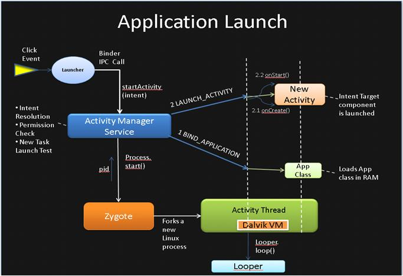
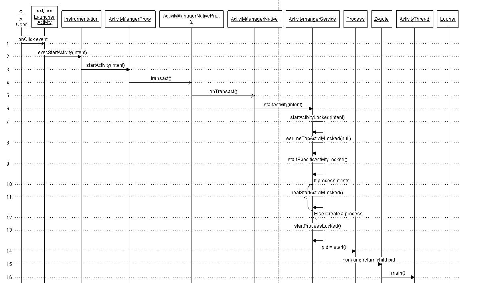
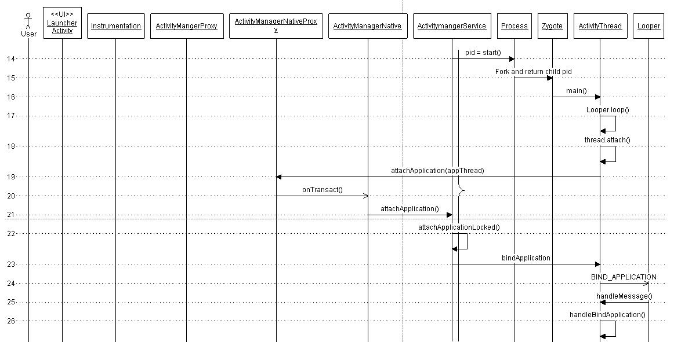
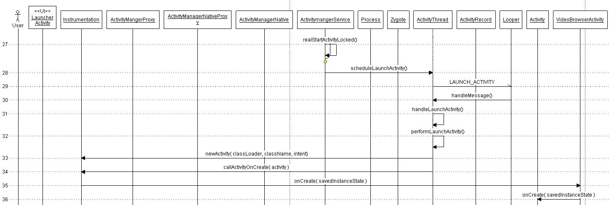

## 1. Android 应用与进程模型

> Android Applications are different than standard mobile applications in two major ways.
> 1. Every Android application lives in its own world, meaning it runs in a separate process, has its own Dalvik VM instance and is assigned a unique user ID.
> 2. Android apps are composed of different components and they can invoke the components owned by other apps. Typically, they don't have a single entry point like main() method.

Android 应用与传统移动应用有两个重大区别:**每个应用运行在独立进程中,拥有自己的 Dalvik VM 实例和唯一的用户 ID;应用由组件构成,可以调用其他应用的组件,没有 main() 这样的统一入口**。

四大组件:

| 组件 | 说明 |
| --- | --- |
| Activities | 封装特定操作,可选关联 GUI,提供执行上下文 |
| Services | 在应用进程上下文中运行的后台任务 |
| Broadcast Receivers | 广播 Intent 的监听器 |
| Content providers | 应用的数据存储与共享接口 |

> Android process is same as Linux process. By default, every installed .apk runs in its own Linux process. Also by default, there exists 1 thread per process. The main thread has a Looper instance to handle the messages from the message queue and it calls Looper.loop() in its every iteration of run() method.

Android 进程即 Linux 进程:默认每个安装的 .apk 运行在自己的 Linux 进程中,每个进程默认 1 个线程(主线程),主线程持有 Looper 处理消息队列。

进程按需创建(When does a process get started? — whenever it is required):当用户或系统组件请求执行某个 apk 的组件(activity、service 或 broadcast receiver)时,若进程未运行,系统会为它拉起新进程;例如在邮件中点击链接,浏览器 activity 会在浏览器自己的进程中被实例化。

## 2. 系统启动与 Zygote

> Like the most Linux based systems, at startup, the bootloader loads the kernel and starts the init process. The init then spawns the low level Linux processes called "daemons" e.g. android debug daemon, USB daemon etc.

系统启动链:bootloader 加载内核并启动 init 进程 → init 派生底层守护进程(daemons,如 adb、USB 守护进程)。

> Init process then starts a very interesting process called 'Zygote'. As the name implies it's the very beginning for the rest of the Android platform. This is the process which initializes the very first instance of Dalvik virtual machine and pre-loads all the common classed used by the application framework and the various apps. Then it starts listening on a socket interface for future requests to spawn off new vms for managing new app processes. On receiving a new request, it forks itself to create a new process which gets a pre-initialized vm instance.

init 接着启动 **Zygote(受精卵)进程**——Android 平台其余进程的起点。它初始化第一个 Dalvik VM 实例,预加载应用框架与各类应用通用的类,然后监听 socket 接口等待孵化请求;收到请求后 fork 自身,新进程直接获得一个已预热好的 VM 实例。这也是应用进程创建快的原因——不用每次都冷启动 VM、重加载通用类。

Zygote 随后 fork 出 **system_server**,在其中启动所有核心平台服务(如 ActivityManagerService、硬件服务),至此整个栈就绪,启动第一个应用进程——桌面应用(Home app)。

## 3. 应用启动全流程

用户点击图标到应用启动的完整链路:

> The click event gets translated into startActivity(intent) call which gets routed to startActivity(intent) call in ActivityManagerService through Binder IPC.

点击事件被转换为 startActivity(intent) 调用,经 Binder IPC 路由到 ActivityManagerService。AMS 依次做几件事:

- 通过 PackageManager 的 resolveIntent() 收集 intent 目标组件的信息(默认带 PackageManager.MATCH_DEFAULT_ONLY 和 GET_SHARED_LIBRARY_FILES 标志),结果保存回 intent 对象避免重复解析
- 调用 grantUriPermissionLocked() 检查调用者是否有足够权限调用目标组件
- 根据 Intent 标志(FLAG_ACTIVITY_NEW_TASK、FLAG_ACTIVITY_CLEAR_TOP 等)判断目标 activity 是否需要在新 task 中启动
- 检查该组件所属进程的 ProcessRecord 是否已存在——不存在则需要创建新进程

## 4. 进程创建(Process Creation)

> ActivityManagerService creates a new process by invoking startProcessLocked() method which sends arguments to Zygote process over the socket connection. Zygote forks itself and calls ZygoteInit.main() which then instantiates ActivityThread object and finally returns pid of newly created process.

AMS 通过 startProcessLocked() 经 socket 连接向 Zygote 发送参数,Zygote fork 自身并执行 ZygoteInit.main(),实例化 ActivityThread 对象后返回新进程 pid。ActivityThread 随后调用 Looper.prepareMainLooper() 和 Looper.loop() 开启消息循环。

详细调用序列:

## 5. 应用绑定(Application Binding)

> The next step is to attach the process to the specific application. This is done by calling bindApplication on the thread object. This method sends BIND_APPLICATION message to the message queue. This message is retrieved by the handler object which then invokes handleMessage() method to trigger the message specific action - handleBindApplication(). This method invokes makeApplication() method which loads app specific classes into memory.

进程与具体应用绑定:AMS 调用 ApplicationThread 的 bindApplication,向消息队列发送 BIND_APPLICATION 消息,主线程 Handler 的 handleMessage() 触发 handleBindApplication(),其中 makeApplication() 把应用特有的类加载进内存并回调 Application.onCreate()。

## 6. Activity 启动(Activity Launch)

> The actual process of launching starts in realStartActivity() method which calls scheduleLaunchActivity() on the application thread object. This method sends LAUNCH_ACTIVITY message to the message queue. The message is handled by handleLaunchActivity() method.

此后系统中已有承载应用的进程与应用类。Activity 的启动流程对新进程与已有进程是同一条:realStartActivityLocked() 调用应用进程的 scheduleLaunchActivity(),发送 LAUNCH_ACTIVITY 消息,由 handleLaunchActivity() 处理,创建 Activity 并回调 onCreate:

> 注:本篇流程基于较早期版本的框架代码,Binder 调度细节与消息常量在新版本已有变化(如 scheduleTransaction 取代了独立的 scheduleLaunchActivity 消息),但「AMS 经 Binder 通知应用进程、ActivityThread 主线程 Handler 消化消息驱动生命周期」的整体骨架不变。
