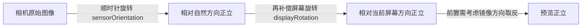

## YUV图

**YUV** 是一类颜色编码方式：**Y** 表示亮度（Luma），**U、V** 表示色度（Chroma）。相比 RGB，YUV 可以对色度降采样而不明显损失观感（人眼对亮度比对色彩更敏感），因此相机 sensor 输出、视频编码几乎都用 YUV。YUV 与 RGB 的转换（BT.601 有限范围）：

```
Y = 0.299 * R + 0.587 * G + 0.114 * B
U = -0.169 * R - 0.331 * G + 0.5 * B + 128
V = 0.5 * R - 0.419 * G - 0.081 * B + 128
```

### 采样格式：420 的含义

数字表示 Y:U:V 的采样比例。以 4×4 像素块为例：

- **YUV444**：每个像素各有 1 组 U、V，不降采样
- **YUV422（如 YUYV）**：2 个像素共享 1 组 U、V，色度水平减半
- **YUV420**：2×2 的像素块共享 1 组 U、V，色度水平和垂直都减半，总数据量约为 RGB 的 1/2（w×h×3/2 字节），相机输出最常用

### 内存布局：Planar / Semi-Planar

同样的 YUV420，按 U、V 在内存中的排列方式分为若干变体：

| 格式 | 类型 | 内存布局 | 备注 |
| :--: | :--: | :-- | :-- |
| I420 / YU12 | Planar（平面） | Y 平面 → U 平面 → V 平面 | 视频编码器常用 |
| YV12 | Planar | Y → V → U | 与 I420 只是 U/V 顺序互换 |
| NV12 | Semi-Planar（半平面） | Y 平面 → UVUV… 交错平面 | GPU 友好，OpenGL/Hardware 常用 |
| NV21 | Semi-Planar | Y 平面 → VUVU… 交错平面 | Android Camera1 默认输出 |

以 4×2 像素（宽 4 高 2）为例，NV21 的内存排布：

```
Y 平面（4×2 = 8 字节）: Y00 Y01 Y02 Y03 Y10 Y11 Y12 Y13
VU 平面（2×1 = 4 字节）: V00 U00 V01 U01
```

### Android 的 YUV_420_888

Camera2 / ImageReader 输出的 `ImageFormat.YUV_420_888` 是一个**包装格式**：它只约定"4:2:0 采样、3 个 plane、每像素 8 bit"，不指定 U/V 的具体排列，底层可能实际是 YV12、NV21 或 NV12。

因此读取时**不能按固定公式假设内存布局**，必须通过 `Image.getPlanes()` 逐平面用 stride 计算：

- **rowStride（行跨度）**：一行像素在内存中占的字节数。由于内存对齐，rowStride 可能大于 width（如 width=1080 对齐到 1088），多出的部分是 padding
- **pixelStride（像素跨度）**：相邻像素间的字节间隔。Y 平面为 1；NV12/NV21 的 UV 平面为 2（U、V 交错）；YV12/I420 为 1

```java
// 逐像素安全读取 YUV_420_888，兼容任意底层布局与对齐
Image.Plane yPlane = image.getPlanes()[0];
Image.Plane uPlane = image.getPlanes()[1];
Image.Plane vPlane = image.getPlanes()[2];
ByteBuffer yBuf = yPlane.getBuffer();
int yRowStride = yPlane.getRowStride(), yPixStride = yPlane.getPixelStride();
for (int row = 0; row < height; row++) {
    for (int col = 0; col < width; col++) {
        byte y = yBuf.get(row * yRowStride + col * yPixStride);
        // U/V 平面尺寸减半，行/像素 stride 同理按各自 plane 取
    }
}
```

实践中判断底层格式：UV 平面 `pixelStride == 2` 是 NV12/NV21（再比较两 plane 的 buffer 是否同一块、U 在前还是 V 在前）；`pixelStride == 1` 且 U、V 各占独立平面则是 I420/YV12。

### YUV_420_888 转 NV21

很多算法库（人脸检测、二维码扫描）只接受 NV21 字节数组，转换时必须逐行拷贝以剥离 rowStride 带来的 padding：

```java
public static byte[] yuv420ToNv21(Image image) {
    int width = image.getWidth(), height = image.getHeight();
    int ySize = width * height;
    byte[] nv21 = new byte[ySize * 3 / 2];

    Image.Plane[] planes = image.getPlanes();
    // Y 平面：逐行拷贝，跳过行尾 padding
    ByteBuffer yBuf = planes[0].getBuffer();
    int yRowStride = planes[0].getRowStride();
    for (int row = 0; row < height; row++) {
        yBuf.position(row * yRowStride);
        yBuf.get(nv21, row * width, width);
    }
    // UV 平面：交错写入 VU VU…，pixelStride 可能为 2
    ByteBuffer uvBuf = planes[2].getBuffer(); // planes[2] 是 V
    int uvRowStride = planes[2].getRowStride(), uvPixStride = planes[2].getPixelStride();
    int offset = ySize;
    for (int row = 0; row < height / 2; row++) {
        for (int col = 0; col < width / 2; col++) {
            int index = row * uvRowStride + col * uvPixStride;
            nv21[offset++] = uvBuf.get(index);      // V
            nv21[offset++] = planes[1].getBuffer().get(index); // U
        }
    }
    return nv21;
}
```

性能提示：逐字节 Java 循环很慢，高频场景（逐帧分析）应改用 [libyuv](https://chromium.googlesource.com/libyuv/libyuv/)（`I420ToNV21`、`Rotation` 等以 SIMD 实现，顺带可完成旋转）或直接把 YUV 送 OpenGL shader / `SurfaceTexture` 在 GPU 上转换旋转，避免 CPU 拷贝。

### YUV 与 RGB 转换的注意点

- 常见公式是 BT.601 **有限范围**（Y∈[16,235]，UV∈[16,240]），而部分 sensor/编码器输出全范围（full range），范围搞错会导致画面发灰或过饱和；Camera2 可通过 `SENSOR_INFO_COLOR_FILTER_ARRANGEMENT` 配套的色调映射/白平衡链路确认，Android 也提供 `ColorSpace` 相关 API 处理
- 手写整数近似 `R = Y + 1.402 * (V - 128)` 这类公式精度有限，若只是显示优先交给系统组件（`SurfaceView`、`TextureView`、`ImageDecoder`）

## 相机旋转

### 相机预览旋转角度

相机图像"总是歪的"的根源是两个角度叠加：

1. 传感器在安装时就和屏幕竖直方向存在夹角(orientation)，大部分手机为90度

   安装角度：手机自然状态下的上方向与摄像头的上方向的夹角，方向是从摄像头的上方向逆时针旋转到手机的上方向。`CameraCharacteristics.SENSOR_ORIENTATION` 是只读常量，一般后置摄像头为 90°，前置为 270°。

2. 手机会横竖屏切换，导致手机屏幕的上方向和手机物理的上方向也有一个角度(rotation)。`Display.getRotation()` 返回的是设备从自然方向**逆时针**旋转的角度（Surface.ROTATION_0/90/180/270 对应 0/90/180/270），补偿时要取反转换为顺时针的"目标旋转角度"。

最终预览正立，需要把图像顺时针旋转的度数 = 补偿 sensor 安装角 + 补偿当前屏幕旋转角。另外**前置摄像头画面天然是镜像的**（系统预览时对前置做了镜像），display rotation 对前置图像的作用方向与后置相反，所以公式里要乘 sign。

官方方法（计算 JPEG 方向，Camera2）：

```java
 	if (deviceOrientation == android.view.OrientationEventListener.ORIENTATION_UNKNOWN)
            return 0;
        int sensorOrientation = c.get(CameraCharacteristics.SENSOR_ORIENTATION);

        // Round device orientation to a multiple of 90
        deviceOrientation = (deviceOrientation + 45) / 90 * 90;

        // Reverse device orientation for front-facing cameras
        boolean facingFront = c.get(CameraCharacteristics.LENS_FACING) == CameraCharacteristics.LENS_FACING_FRONT;
        if (facingFront) deviceOrientation = -deviceOrientation;

        // Calculate desired JPEG orientation relative to camera orientation to make
        // the image upright relative to the device orientation
        int jpegOrientation = (sensorOrientation + deviceOrientation + 360) % 360;
```

相机预览计算，sign前置摄像头1，后置摄像头-1

```java
rotation = (sensorOrientationDegrees - deviceOrientationDegrees * sign + 360) % 360
```

注意预览公式与 JPEG 公式方向相反：预览是"图像需要旋转多少度才正立"（传给 `Camera.setDisplayOrientation()` 或纹理旋转），JPEG 是"把 EXIF 方向写成多少度让查看器去转"。两者都用 `+ 360) % 360` 保证结果落在 0~359。



各方向对照（手机以竖屏为自然方向，平板以横屏为自然方向，这是表中差异的来源）：

|                                     | 图片实际应该旋转 | 手机Surface.ROTATION | 平板Surface.ROTATION | 相机传递图片对应旋转角度 |
| :---------------------------------: | :--------------: | :------------------: | :------------------: | :----------------------: |
|                竖屏                 |        0         |  Surface.ROTATION_0  |  Surface.ROTATION_0  |      手机0，平板90       |
| 反向竖屏<br/>(手机被锁定为正向竖屏) |       180        |  Surface.ROTATION_0  | Surface.ROTATION_180 |     手机180，平板270     |
|                横屏                 |        270        | Surface.ROTATION_90  | Surface.ROTATION_90  |      手机270，平板0      |
|              反向横屏               |        90        | Surface.ROTATION_270 | Surface.ROTATION_270 |     手机90，平板180      |

### CameraX 的简化处理

CameraX 把上述计算封装进了用例（UseCase）：

- **Preview**：内部根据 `Display.getRotation()`（或 `setTargetRotation()`）自动旋转预览画面，无需手动处理
- **ImageAnalysis / ImageCapture**：通过 `imageInfo.rotationDegrees` 直接拿到"该帧需要顺时针旋转多少度才正立"，这个值已经综合了 sensorOrientation 与 target rotation，直接用即可；拍出的 JPEG 也已把该值写入 EXIF 方向

常见坑：预览正常但分析/拍照的图像是歪的，多半是直接按原始 buffer 方向渲染而忽略了 `rotationDegrees`；用 OpenGL 渲染时把它换算成纹理矩阵的旋转角。

### Camera1 的 setDisplayOrientation

老 API（`android.hardware.Camera`，已废弃但老项目仍常见）需要自己设置预览旋转：

```java
// 预览：setRotation 之前先 stopPreview，设置完再 startPreview
int degrees = 0;                 // 由 Display.getRotation() 换算：ROTATION_0/90/180/270 -> 0/90/180/270
int result = (info.orientation - degrees + 360) % 360;   // 后置
// 前置：result = (info.orientation + degrees) % 360，且预览画面是镜像的
camera.setDisplayOrientation(result);

// 拍照：写入 JPEG 的 EXIF 方向
Camera.Parameters params = camera.getParameters();
params.setRotation(info.orientation); // 竖屏拍摄时的典型值，精确值同样要叠加屏幕方向
camera.setParameters(params);
```

`info.orientation` 即 Camera1 版的 sensor 安装角（`Camera.CameraInfo.orientation`），含义与 `SENSOR_ORIENTATION` 相同。

### 获取设备方向的三种途径

| 途径 | 返回值 | 适用场景 |
| :-- | :-- | :-- |
| `Display.getRotation()` | 屏幕相对自然方向的旋转（0/90/180/270） | 界面已旋转（跟随系统）时 |
| `OrientationEventListener` | 设备连续物理角度（可正可负） | 需要知道用户手持姿态、拍照方向判断 |
| `SensorManager`（加速度+磁力） | 完整三维方向 | 需要 AR 类精确姿态时 |

官方示例用 `ORIENTATION_UNKNOWN` 过滤、再四舍五入到 90 的倍数，就是因为 `OrientationEventListener` 给的是连续值，而相机旋转只支持 90 度粒度。

### EXIF 与图像方向

即使旋转算对了，跨设备查看图片仍可能歪，因为"方向"信息存在于 JPEG 的 **EXIF（Exchangeable Image File Format）方向标签**里而不是像素本身：

- Camera2/CameraX 拍照时会把 `jpegOrientation` / `rotationDegrees` 写进 EXIF `Orientation` 标签，查看器（相册、Chrome 等）读取后自动转正
- 自己处理 bitmap（压缩、上传、送算法）时 EXIF 会丢失，需先用 `ExifInterface` 读出方向并 `Matrix.postRotate()` 物理旋转像素
- 视频没有 EXIF，编码前必须把每帧真正旋转到位（这也是 `ImageAnalysis` 输出原始 buffer 的原因——CameraX 假定你会用 `rotationDegrees` 自己转）

---

## 参考

- [图文详解YUV420数据格式](https://www.cnblogs.com/azraelly/archive/2013/01/01/2841269.html)
- [图解 YU12、I420、YV12、NV12、NV21、YUV420P（CSDN）](https://blog.csdn.net/byhook/article/details/84037338)
- [Android常用的几种格式：NV21/NV12/YV12/YUV420P的区别（博客园）](https://www.cnblogs.com/raomengyang/p/5582270.html)
- [YUV图解（YUV444, YUV422, YUV420, YV12, NV12, NV21）（知乎）](https://zhuanlan.zhihu.com/p/248116694)
- [实践YUV之眼花缭乱（知乎）](https://zhuanlan.zhihu.com/p/648255998)
- [Linux 内核文档：Planar / Semi-Planar YUV formats](https://docs.kernel.org/userspace-api/media/v4l/pixfmt-yuv-planar.html)
- [Convert YUV_420_888 to NV21 in Android (Medium)](https://medium.com/@eeshan.jamal/convert-image-from-yuv-420-888-to-nv21-format-in-android-part-i-a0aa1e7fb3d0)
- [Stack Overflow: distinguish NV21 / YV12 in ImageReader](https://stackoverflow.com/questions/40676704/how-could-i-distinguish-between-nv21-and-yv12-codification-in-imagereader-camera)
- [Android相机开发 - 预览画面的旋转（知乎）](https://zhuanlan.zhihu.com/p/110944780)
- [CameraX 用例旋转 | Android 开发者 | Android Developers](https://developer.android.com/training/camerax/orientation-rotation?hl=zh-cn)
- [Camera2 预览方向 | Android 开发者](https://developer.android.com/media/camera/camera2/camera-preview)
- [Camera | Android Developers（setDisplayOrientation）](https://developer.android.com/reference/android/hardware/Camera#setDisplayOrientation(int))
- [Camera2 understanding the sensor and device orientations - Stack Overflow](https://stackoverflow.com/questions/48406497/camera2-understanding-the-sensor-and-device-orientations)
- [ChromeOS.dev – Camera orientations（前置镜像原理）](https://chromeos.dev/en/android/camera-orientation)
- [Android Camera API 旋转研究（系统性分析）](https://essenceofsoftware.com/studies/larger/rotation/)
- [Solving image rotation with Camera2 API (Medium)](https://medium.com/@kenodoggy/solving-image-rotation-on-android-using-camera2-api-7b3ed3518ab6)
- [SharryChoo 博客 – 预览尺寸选取与旋转角度设定](https://sharrychoo.github.io/blog/opengl-es-2.0/practice-camera-size-choose-and-rotation)
