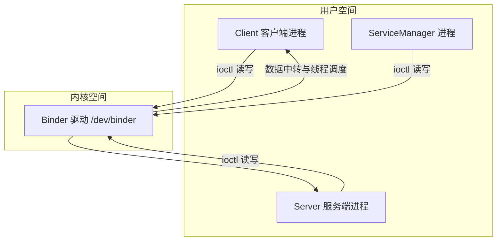
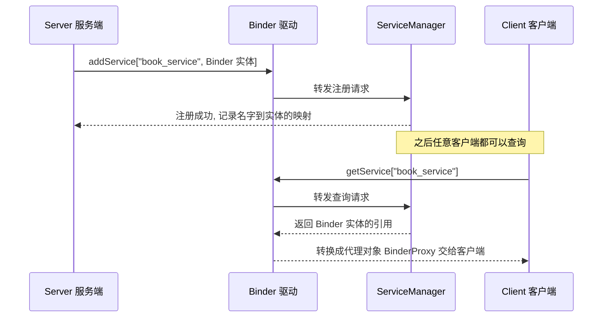
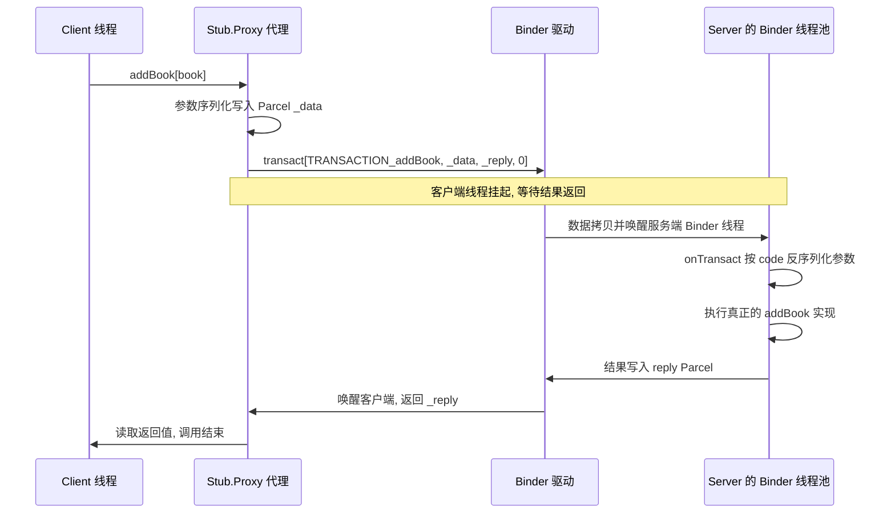

本文笔记整理自《Android开发艺术探索》第 2 章，围绕 Android 的进程间通信展开：先讲 IPC 与多进程的基础概念，再深入 Binder 原理与 AIDL，最后对比各种 IPC 方式的选型。

## 1. IPC 基础概念

**IPC（Inter-Process Communication，进程间通信）**指两个进程之间进行数据交换的过程。

- IPC 不是 Android 所独有的，任何一个操作系统都有对应的 IPC 机制：Windows 上通过剪切板、管道、邮槽等进行进程间通信；Linux 上通过命名管道、共享内存、信号量等进行进程间通信。Android 没有完全继承 Linux 的 IPC 方式，自己设计了特有的进程间通信方式 Binder，同时还支持 Socket。
- 线程是 CPU 调度的最小单元，是一种有限的系统资源；进程一般指一个执行单元，在 PC 和移动设备上是指一个程序或者应用。进程与线程是包含与被包含的关系，一个进程可以包含多个线程，最简单的情况下一个进程只有一个线程，即主线程（例如 Android 的 UI 线程）。

在 Android 中，IPC 的使用场景大概有以下几种：

- 有些模块由于特殊原因需要运行在单独的进程中；
- 通过多进程来获取多份内存空间；
- 当前应用需要向其他应用获取数据。

## 2. Android 中的多进程模式

开启多进程模式：给四大组件在 Manifest 中指定 `android:process` 属性。

> 使用 `adb shell ps` 或 `adb shell ps | grep 包名` 查看当前所存在的进程信息。

Android 为每个进程都分配了一个独立的虚拟机，不同虚拟机在内存分配上有不同的地址空间，导致不同的虚拟机访问同一个类的对象会产生多份副本。例如不同进程的 Activity 对静态变量的修改，对其他进程不会造成任何影响。所有运行在不同进程的四大组件，只要它们之间需要通过内存来共享数据，共享都会失败——也就是说，四大组件之间不可能不通过中间层来共享数据。

多进程会带来以下问题：

1. **静态成员和单例模式完全失效**；
2. **线程同步锁机制完全失效**——这两点都是因为不同进程不在同一个内存空间下，锁的对象也不是同一个对象；
3. **SharedPreferences 的可靠性下降**——SharedPreferences 底层是通过读/写 XML 文件实现的，并发读/写会导致一定几率的数据丢失（跨进程使用时尤其不可靠）；
4. **Application 会多次创建**——系统创建新进程的同时分配独立虚拟机，这其实就是一个启动应用的过程。在多进程模式中，不同进程的组件拥有独立的虚拟机、Application 以及内存空间。

## 3. 序列化：Serializable 与 Parcelable

跨进程传递的对象必须可序列化，Android 支持两种方式。

**Serializable（Java 原生）**——使用简单，实现接口并显式声明 serialVersionUID 即可：

```java
public class User implements Serializable {
    private static final long serialVersionUID = 1L;
    public int userId;
    public String userName;
    public boolean isMale;
}
```

- serialVersionUID 用于版本对齐：反序列化时与本地版本号不一致会抛 InvalidClassException；不显式声明则由编译器按类结构自动生成，类一改动旧数据就反序列化失败；
- 静态成员属于类不参与序列化，transient 修饰的成员被排除；
- 靠 ObjectOutputStream / ObjectInputStream 走 I/O 流，开销大。

**Parcelable（Android 特有）**——直接在内存序列化，效率远高于 Serializable，是 Android 跨进程的首选：

```java
public class Book implements Parcelable {
    public int bookId;
    public String bookName;

    protected Book(Parcel in) {                       // 从 Parcel 恢复
        bookId = in.readInt();
        bookName = in.readString();
    }

    @Override
    public void writeToParcel(Parcel dest, int flags) { // 写入 Parcel
        dest.writeInt(bookId);
        dest.writeString(bookName);
    }

    @Override
    public int describeContents() { return 0; }

    public static final Creator<Book> CREATOR = new Creator<Book>() { // 反序列化入口
        @Override public Book createFromParcel(Parcel in) { return new Book(in); }
        @Override public Book[] newArray(int size) { return new Book[size]; }
    };
}
```

一句话对比：Serializable 简单但慢（I/O 流 + 临时变量），Parcelable 繁琐但快（内存级读写）。

## 4. Binder 原理

Binder 是 Android 特有的 IPC 方式。理解它要抓住一条主线：**所有跨进程数据都必须经过内核态的 Binder 驱动中转，而通信的双方（以及服务的注册查询）都只是通过 ioctl 与这个驱动打交道**。下面按"架构 → 服务的注册与获取 → 一次调用 → 一次拷贝 → 线程模型"的顺序展开。

### 4.1 整体架构：C/S 模型 + Binder 驱动 + ServiceManager

Binder 整体是 C/S 架构，涉及四个角色：

- **Binder 驱动**：运行在内核态的字符设备（`/dev/binder`），所有 Binder 通信的数据都经过它中转，负责通信的建立、Binder 实体与引用的传递、线程调度等。它才是 Binder 机制真正的核心，其余三者都是它的"客户"；
- **ServiceManager**：Binder 的"上下文管理者"，角色类似 DNS——各类系统服务（AMS、PMS 等）启动时先向它注册，客户端通过它按名字查询服务；
- **服务端（Server）**：Binder 实体的提供方，一个 Binder 实体对应一组服务能力；
- **客户端（Client）**：持有的不是服务端对象本身，而是 Binder 驱动返回的代理对象（BinderProxy），对代理的方法调用会被转发到服务端。



关键认知：Client、Server、ServiceManager 互相之间**没有直接通道**，三方都是通过系统调用 `open` / `mmap` / `ioctl` 操作 `/dev/binder` 设备文件，与 Binder 驱动交互来间接实现跨进程通信。

### 4.2 服务的注册与获取（ServiceManager 的作用）

一个服务要能被别的进程调用，前提是先把自己注册到 ServiceManager 上，就像商户先把电话号码登记到黄页（Yellow Pages）上，别人才能查到：



注意最后一步：客户端从 ServiceManager 拿到的**不是服务端对象本身，而是 Binder 驱动基于 Binder 引用生成的代理对象**。此后客户端对代理的一切方法调用，都会被驱动转发到服务端执行。

### 4.3 一次跨进程调用的完整流程

以客户端调用 `addBook(book)` 为例，从代码层到驱动层的完整链路：



对应到代码层面就是 5.3 节的生成代码：`Proxy.addBook()` 里 `transact()` 发起 RPC，服务端 `Stub.onTransact()` 在 Binder 线程池中被回调。几个要点：

- 事务码 code（如 `TRANSACTION_addBook`）标识调用的是哪个方法，参数与返回值都靠 Parcel 序列化传递；
- 服务端的 `onTransact()` 运行在 **Binder 线程池**中（默认最多 15 个 Binder 工作线程，加上主 Binder 线程共 16 个），不在主线程，所以服务端方法内部要注意线程安全；
- 同步调用时客户端线程在 `transact()` 后一直挂起，直到结果返回才继续——因此不要在主线程发起可能耗时的 RPC，否则会 ANR（声明为 oneway 的方法除外，它不阻塞调用线程）。

### 4.4 为什么 Binder 只需要一次拷贝

先看传统 IPC（管道、Socket）为什么慢：数据要经过**两次拷贝**——


Binder 驱动利用 `mmap` 把一块物理内存**同时映射到内核空间和接收方的用户空间**，于是第二次拷贝被省掉了：


具体过程：接收方进程事先通过 `mmap` 在 Binder 驱动中申请了一块内存，驱动让这块物理内存同时映射到自己（内核）和接收方用户空间；发送方发起事务时，驱动用 `copy_from_user` 把数据拷进这块内核缓冲区——由于接收方用户空间映射的就是同一块物理内存，数据"落进内核"的同时也就"出现在接收方"了，直接读取即可，无需再拷贝一次。

再加上驱动在事务中附带不可伪造的发送方 UID/PID（接收方可用 `getCallingUid()` 验证身份），性能和安全性都优于传统 IPC。这也是 Android 不用现成的 Linux IPC、专门设计 Binder 的核心原因。

### 4.5 Binder 线程模型小结

- 服务端方法执行在 Binder 线程池（默认上限 16 个线程），不是主线程，实现里要注意线程安全；
- 客户端同步调用时调用线程挂起，因此**耗时 RPC 别放在主线程**（ANR 风险），oneway 异步调用除外；
- 跨进程回调（如 AIDL 的 listener）同样是 RPC，回调执行在**客户端自己的 Binder 线程池**里，要更新 UI 需先通过 Handler 切回主线程。

## 5. AIDL

### 5.1 定义与规则

- AIDL（Android Interface Definition Language）用于定义跨进程调用的接口，文件放在 main 下的 aidl 目录（与 java 目录同级），build 时自动生成对应的 java 接口；
- 支持的参数类型：八种基本数据类型、String、CharSequence、List、Map、实现了 Parcelable 的引用类型（自定义 Parcelable 类型需要先建同名 .aidl 文件声明，才能在接口中使用）；
- 除基本类型外的参数必须标明方向标签：`in`（输入）、`out`（输出）、`inout`（输入输出），它决定对象如何参与序列化，也影响性能，非基本类型不能省略。

### 5.2 aidl 文件示例

```aidl
package com.ryg.chapter_2.aidl;

parcelable Book;   // Book.aidl：声明自定义 Parcelable 类型
```

```java
// IBookManager.aidl：接口定义，注意 Book 在同一包下也要 import
package com.ryg.chapter_2.aidl;

import com.ryg.chapter_2.aidl.Book;
import com.ryg.chapter_2.aidl.IOnNewBookArrivedListener;

interface IBookManager {
     List<Book> getBookList();
     void addBook(in Book book);               // 方向标签：in 表示输入参数
     void registerListener(IOnNewBookArrivedListener listener);
     void unregisterListener(IOnNewBookArrivedListener listener);
}
```

### 5.3 生成代码的工作原理（核心）

build 后生成的 IBookManager.java 是理解 Binder 的关键，去掉重复逻辑后骨架如下（①②③ 对应下方要点）：

```java
public interface IBookManager extends IInterface {

    public static abstract class Stub extends Binder implements IBookManager {

        private static final String DESCRIPTOR = "com.ryg.chapter_2.aidl.IBookManager";

        // ① 进程判断：决定走"直接调用"还是"跨进程代理"
        public static IBookManager asInterface(IBinder obj) {
            IInterface iin = obj.queryLocalInterface(DESCRIPTOR);
            if (iin != null && iin instanceof IBookManager)
                return (IBookManager) iin;   // 同进程：就是服务端 Stub 对象本身
            return new Stub.Proxy(obj);      // 跨进程：返回代理对象
        }

        // ② 服务端入口：运行在服务端的 Binder 线程池中
        @Override
        public boolean onTransact(int code, Parcel data, Parcel reply, int flags) {
            switch (code) {                   // 按 code 区分客户端要调哪个方法
            case TRANSACTION_addBook:
                data.enforceInterface(DESCRIPTOR);
                Book book = data.readInt() != 0
                        ? Book.CREATOR.createFromParcel(data) : null; // 反序列化参数
                this.addBook(book);           // 调用真正的实现
                reply.writeNoException();     // 结果写回 reply
                return true;                  // 返回 false 则客户端请求失败（可做权限验证）
            }
            return super.onTransact(code, data, reply, flags);
        }

        // ③ 客户端代理：运行在客户端
        private static class Proxy implements IBookManager {
            private IBinder mRemote;

            public void addBook(Book book) throws RemoteException {
                Parcel _data = Parcel.obtain(), _reply = Parcel.obtain();
                try {
                    _data.writeInterfaceToken(DESCRIPTOR);
                    book.writeToParcel(_data, 0);                            // 参数序列化
                    mRemote.transact(TRANSACTION_addBook, _data, _reply, 0); // 发起 RPC，线程挂起
                    _reply.readException();
                } finally {
                    _reply.recycle(); _data.recycle();
                }
            }
        }

        // 接口中每个方法对应一个事务 code
        static final int TRANSACTION_addBook = IBinder.FIRST_CALL_TRANSACTION + 1;
    }
}
```

要点（对照代码中的 ①②③）：

- **DESCRIPTOR**：Binder 的唯一标识，一般用 Binder 的类名表示；
- **asInterface（①）**：同进程返回 Stub 本身（直接调用，不走跨进程）；跨进程返回 Proxy。**客户端拿到的"服务端对象"其实是 Proxy**；
- **onTransact（②）**：客户端的请求经 Binder 驱动转发后，在这里按 code 取出参数、执行方法、写回结果；返回 false 则客户端请求失败，因此重写它可以做权限验证；
- **Proxy 的方法（③）**：先把参数序列化进 _data，再通过 `transact()` 发起 RPC——此时**客户端线程挂起**，直到服务端执行完毕、从 _reply 读出返回结果后才继续。

### 5.4 手写 Binder

生成的代码没有魔法，一个 Binder 接口就是这四件事，自己写出来就是"手写 Binder"：

```java
class BookManagerImpl extends Binder implements IBookManager {
    BookManagerImpl() { attachInterface(this, DESCRIPTOR); }   // 1. 构造时绑定唯一标识
    static IBookManager asInterface(IBinder obj) { ... }        // 2. 同进程→本身，跨进程→Proxy
    @Override
    public boolean onTransact(int code, Parcel data, Parcel reply, int flags) { ... } // 3. 服务端按 code 分发
    private static class Proxy implements IBookManager { ... }  // 4. 客户端代理：transact 发起 RPC
}
```

### 5.5 Binder 死亡通知（DeathRecipient）

服务端进程被杀时，可以通过死亡通知感知，而不是等下一次调用抛 RemoteException：

```java
// 客户端：注册死亡通知
IBinder.DeathRecipient mDeathRecipient = new IBinder.DeathRecipient() {
    @Override
    public void binderDied() {                    // 服务端死亡时回调（运行在 Binder 线程）
        mBookManager.asBinder().unlinkToDeath(mDeathRecipient, 0); // 先解除绑定
        mBookManager = null;
        // TODO:重新绑定远程 Service
    }
};
mBookManager = IBookManager.Stub.asInterface(binder);
binder.linkToDeath(mDeathRecipient, 0);           // 注册；isBinderAlive() 可随时查询状态
```

## 6. IPC 方式对比与选型

Android 中常用的 IPC 方式对比如下：

| 方式 | 特点 | 适用场景 |
| --- | --- | --- |
| Bundle / Intent | 最简单，只能传可序列化数据，受约 1MB 事务缓冲区限制 | 四大组件间传小数据 |
| 文件共享 | 简单，但并发读写不可靠 | 低频、对同步要求不高 |
| Messenger | 串行处理、只传消息、免写 AIDL 接口 | 低频单向或一问一答 |
| AIDL | 功能最强：任意接口、并发调用、跨进程回调 | 复杂的跨进程 RPC |
| ContentProvider | 面向数据的 CRUD，自带权限控制和变化通知 | 跨进程共享数据 |
| Socket | 可跨网络，开销大 | 网络通信或跨设备 |

### 6.1 Bundle / Intent 传 extras

启动四大组件时在 Intent 的 extras 里放可序列化对象（底层走 Binder）：

```java
Intent intent = new Intent(this, SecondActivity.class);
intent.putExtra("extra_user", new User(1, "hello world", false)); // 取出：getSerializableExtra
startActivity(intent);
```

受 Binder 驱动为每个进程分配的事务缓冲区（约 1MB，所有并发事务共享）限制，数据过大会抛 TransactionTooLargeException，只适合传小数据。

### 6.2 共享文件

两个进程读写同一个文件：一方序列化写入，另一方反序列化恢复（读写都应放在子线程）：

```java
// 进程 A：序列化写入共享文件
try (ObjectOutputStream oos = new ObjectOutputStream(new FileOutputStream(SHARED_FILE))) {
    oos.writeObject(new User(1, "hello world", false));
}
// 进程 B：反序列化恢复
try (ObjectInputStream ois = new ObjectInputStream(new FileInputStream(SHARED_FILE))) {
    User user = (User) ois.readObject();
}
```

缺点是并发读写不可靠，无法进行即时通信。另外 Environment.getExternalStorageDirectory() 已在 API 29 废弃，现在一般用 context.getExternalFilesDir() 等应用专属目录。

### 6.3 Messenger

轻量级 IPC 方案：底层是 Binder（系统对 IMessenger.aidl 做了封装），服务端一个 Handler 串行处理所有请求，因此不需要考虑线程同步；只能传 Message，不能像 AIDL 那样调用任意方法。

```java
// 服务端：onBind 返回 Messenger 内部的 Binder；在 Manifest 中给 service 配 android:process=":remote" 即可跨进程
private final Messenger mMessenger = new Messenger(new Handler() {
    @Override
    public void handleMessage(Message msg) {
        // msg.replyTo 是客户端随消息带来的 Messenger，用它回复即可实现双向通信
        try { msg.replyTo.send(Message.obtain(null, MSG_REPLY)); } catch (RemoteException ignored) {}
    }
});
@Override
public IBinder onBind(Intent intent) { return mMessenger.getBinder(); }

// 客户端：bindService 拿到 IBinder 后构造服务端 Messenger
mService = new Messenger(binder);
Message msg = Message.obtain(null, MSG_FROM_CLIENT);
msg.replyTo = mGetReplyMessenger;   // 告诉服务端回复给谁（自己这边的 Messenger + Handler）
mService.send(msg);
```

### 6.4 AIDL 完整示例

```java
public class BookManagerService extends Service {

    // 跨进程回调必须用 RemoteCallbackList 管理：客户端传过来的 listener 是序列化后重建的代理对象，
    // 用普通 List 解注册时对象对不上号；RemoteCallbackList 内部以 Binder 为 key 匹配，
    // 并能自动清理已死亡的客户端
    private RemoteCallbackList<IOnNewBookArrivedListener> mListenerList = new RemoteCallbackList<>();

    private Binder mBinder = new IBookManager.Stub() { // Stub 就是服务端的 Binder
        @Override
        public List<Book> getBookList() { return mBookList; } // 运行在 Binder 线程池，注意线程安全

        @Override
        public void addBook(Book book) { mBookList.add(book); }

        @Override // 重写 onTransact 做权限验证：返回 false 则客户端请求失败
        public boolean onTransact(int code, Parcel data, Parcel reply, int flags) throws RemoteException {
            if (checkCallingOrSelfPermission(PERMISSION) == PackageManager.PERMISSION_DENIED)
                return false;
            return super.onTransact(code, data, reply, flags);
        }

        @Override public void registerListener(IOnNewBookArrivedListener l) { mListenerList.register(l); }
        @Override public void unregisterListener(IOnNewBookArrivedListener l) { mListenerList.unregister(l); }
    };

    @Override
    public IBinder onBind(Intent intent) { return mBinder; }

    // 通知所有监听者：RemoteCallbackList 的遍历必须放在 beginBroadcast / finishBroadcast 之间
    private void onNewBookArrived(Book book) throws RemoteException {
        mBookList.add(book);
        final int N = mListenerList.beginBroadcast();
        for (int i = 0; i < N; i++)
            mListenerList.getBroadcastItem(i).onNewBookArrived(book); // 回调运行在客户端的 Binder 线程池
        mListenerList.finishBroadcast();
    }
}
```

```java
// 客户端
private ServiceConnection mConnection = new ServiceConnection() {
    public void onServiceConnected(ComponentName name, IBinder service) {
        mBookManager = IBookManager.Stub.asInterface(service);
        try {
            mBookManager.asBinder().linkToDeath(mDeathRecipient, 0); // 注册死亡通知
            List<Book> list = mBookManager.getBookList();  // 同步 RPC：调用线程挂起等待结果
            mBookManager.addBook(new Book(3, "Android进阶"));
            mBookManager.registerListener(mListener);      // 服务端回调 mListener 时运行在本进程的 Binder 线程池，需 Handler 切回主线程
        } catch (RemoteException e) { e.printStackTrace(); }
    }

    public void onServiceDisconnected(ComponentName name) { mBookManager = null; } // 服务端异常死亡时回调，可重新绑定
};
bindService(intent, mConnection, Context.BIND_AUTO_CREATE);
```

### 6.5 ContentProvider

专门用于跨进程共享数据的组件，底层同样是 Binder：

- onCreate 运行在主线程，query / insert / update / delete 由外部通过 Binder 线程池调用（内部要保证线程安全）；
- 内部数据源不限于 SQLite，文件、内存数据都可以，对外只暴露 Uri；
- 数据变化时通过 notifyChange 通知外界（配合 registerContentObserver 使用）。

```java
public class BookProvider extends ContentProvider {
    @Override public boolean onCreate() { ... }          // 主线程：初始化数据源

    @Override public Cursor query(Uri uri, String[] projection, ...) {  // Binder 线程池
        String table = getTableName(uri);               // 用 UriMatcher 把 Uri 映射到目标表
        return mDb.query(table, projection, ...);
    }

    @Override public Uri insert(Uri uri, ContentValues values) {
        mDb.insert(getTableName(uri), null, values);
        getContext().getContentResolver().notifyChange(uri, null);  // 通知外界数据变化
        return uri;
    }
    // update / delete 与 insert 同理，getType 返回 MIME 类型
}

// 使用方：通过 ContentResolver 访问（底层同样是 Binder）
getContentResolver().insert(Uri.parse("content://com.xxx.book.provider/book"), values);
```

Manifest 中注册时 authorities 必须全局唯一，它是 ContentProvider 的唯一标识（可配合 android:permission 做访问控制）。

### 6.6 Socket

"全能"的 IPC 方式，不仅跨进程还能跨设备：

- 本地跨进程可用 LocalServerSocket / LocalSocket（Linux 本地域套接字，不经过网络协议栈），跨设备用 TCP / UDP；
- 优点是通用、可跨网络；缺点是开销比 Binder 大（传统 IPC 的两次拷贝），流式读写还要自己处理分包和协议；
- 典型用法：服务端在子线程中 accept 循环接收消息，客户端 connect 后通过流读写；
- 适用场景：网络通信或通信双方不在同一设备上；本地 IPC 一般优先选 Binder 系方案。

## 7. 参考文档

- **Binder 概览**（AOSP 官方，讲 Binder 进程间通信机制与内核驱动）：<https://source.android.com/docs/core/architecture/ipc/binder-overview>
- **Binder 线程处理 Binder Threading**（AOSP 官方，讲 Binder 线程池与同步/异步事务）：<https://source.android.com/docs/core/architecture/ipc/binder-threading>
- **Android 接口定义语言 AIDL**（官方指南，aidl 语法、in/out/inout、实现步骤）：<https://developer.android.com/develop/background-work/services/aidl?hl=zh-cn>
- **绑定服务概览**（官方指南，含 Messenger 跨进程示例）：<https://developer.android.com/develop/background-work/services/bound-services>
- **AOSP 源码镜像 frameworks/base**（Binder.java、IInterface.java 等源码所在仓库）：<https://github.com/aosp-mirror/platform_frameworks_base>
- **理解 Android Binder 机制（驱动篇）**（paul.pub，详解 `binder_mmap` 与一次拷贝的源码实现）：<https://paul.pub/android-binder-driver/>
- **Binder 机制原理**（GitHub Wiki，一块物理内存双重映射实现一次拷贝的图解）：<https://github.com/zhpanvip/AndroidNote/wiki/Binder%E6%9C%BA%E5%88%B6%E5%8E%9F%E7%90%86>

书中的完整示例代码出自《Android开发艺术探索》第 2 章。
