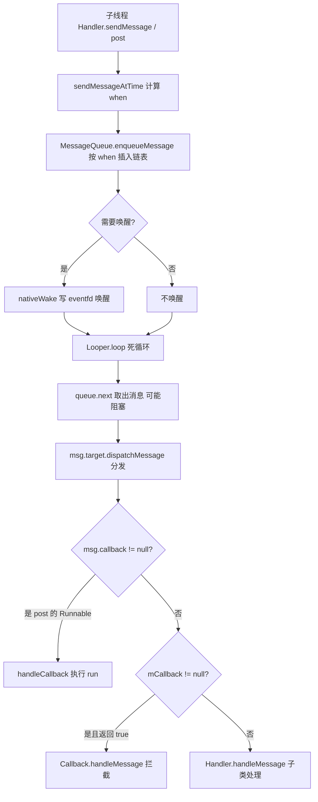
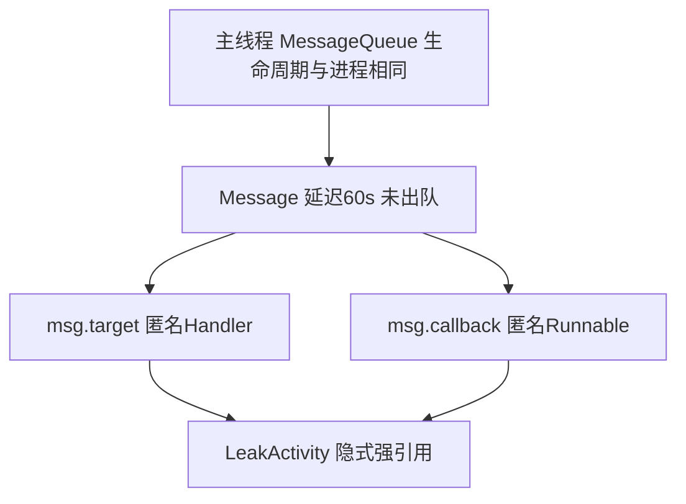

## Handler

官网说明：

> A Handler allows you to send and process `Message` and Runnable objects associated with a thread's `MessageQueue`. Each Handler instance is associated with a single thread and that thread's message queue. When you create a new Handler it is bound to a `Looper`. It will deliver messages and runnables to that Looper's message queue and execute them on that Looper's thread.
>
> Handler 允许你发送和处理与线程 MessageQueue 关联的 Message 和 Runnable 对象。每个 Handler 实例关联单个线程及其消息队列，创建时绑定到一个 Looper，消息被投递到该 Looper 的消息队列，并在该 Looper 所在线程执行。
>
> There are two main uses for a Handler: (1) to schedule messages and runnables to be executed at some point in the future; and (2) to enqueue an action to be performed on a different thread than your own.
>
> Handler 有两个主要用途：(1) 调度消息/任务在未来的某个时间点执行；(2) 在其他线程上排队执行一个操作。

> **版本说明**：本文源码摘编自较早期的 AOSP（API 21 前后的写法，如 `new Handler()` 无参构造）。API 30 起无参构造与 `Handler(Looper)` 隐式取当前线程 Looper 的写法已废弃，推荐 `new Handler(Looper.getMainLooper())` 或传入 `Looper.myLooper()`；机制本身（MessageQueue 单链表、Looper.loop 死循环、epoll 休眠唤醒）至今未变。文中代码保留主干逻辑与中文注释，省略防御性检查等细节。

### 机制总览

Handler 消息机制由四个角色协作：

| 角色 | 职责 |
| --- | --- |
| Message | 消息本体，内部持有 next 指针——MessageQueue 的存储结构实际是**单链表** |
| Handler | 发送消息（入队）并处理消息（回调 handleMessage / Runnable） |
| MessageQueue | 按触发时间 when 排序的消息队列，负责插入与取出，无消息时阻塞 |
| Looper | 消息循环，不断从 MessageQueue 取消息交给 Handler 分发；一个线程只有一个 Looper |

一次完整的消息流转：



Handler 通过 ThreadLocal 实现线程封闭性，保证线程安全，将任务执行限制在关联线程。主要通过 Handler 创建时所在线程和 Looper/MessageQueue 强关联。

## Message

消息的字段：

```java
public final class Message implements Parcelable {
    public int what;                 // 用户定义的消息码, 接收方据此识别消息
    public int arg1;
    public int arg2;
    public Object obj;

    /*package*/ long when;           // 消息应该被处理的时间(开机毫秒数)
    /*package*/ Bundle data;

    /*package*/ Handler target;      // 发送它的 Handler, 分发时用 msg.target.dispatchMessage
    /*package*/ Runnable callback;   // post(Runnable) 时保存的 runnable

    /*package*/ Message next;        // 链表指针, MessageQueue 靠它组成单链表
}
```

两点值得注意：

- **Message 复用**：`Message.obtain()` 从全局同步消息池（sPool，链表）取复用对象，`msg.recycle()` 归还。循环发消息时应优先用 obtain 而不是 `new Message()`，减少分配与 GC 压力。
- **target 与 callback**：target 让 MessageQueue/Looper 不必知道具体 Handler；callback 则是 post(Runnable) 的实现载体（见下文 dispatchMessage）。

子线程向主线程发送消息：

```java
new Thread(new Runnable() {
    @Override
    public void run() {
        Message message = Message.obtain();      // 优先复用
        message.arg1 = 1;
        Bundle bundle = new Bundle();
        bundle.putString("data", "data");
        message.setData(bundle);
        handler.sendMessage(message);
    }
}).start();
```

## MessageQueue

MessageQueue 用链表保存 Message，mMessages 表示当前待处理的消息（链表头）。**入队按 when 排序**：触发时间早的在前。若插入到了队头且线程正阻塞，则 nativeWake 唤醒。

### enqueueMessage：按时间插入链表

```java
final boolean enqueueMessage(Message msg, long when) {
    synchronized (this) {
        msg.when = when;
        Message p = mMessages;
        if (p == null || when == 0 || when < p.when) {
            // 插入队头: 若线程正阻塞则需要唤醒
            msg.next = p;
            mMessages = msg;
            needWake = mBlocked;
        } else {
            // 插入中间: 除非队头是同步屏障且这是最早的异步消息, 否则不需要唤醒
            // (阻塞的超时时间是按队头消息的 when 算的, 中间插入不影响唤醒时机)
            needWake = mBlocked && p.target == null && msg.isAsynchronous();
            Message prev;
            for (;;) {
                prev = p;
                p = p.next;
                if (p == null || when < p.when) {
                    break;          // 找到插入位置
                }
            }
            msg.next = p;           // 标准单链表插入
            prev.next = msg;
        }
    }
    if (needWake) {
        nativeWake(mPtr);           // JNI → 写 eventfd, 唤醒 epoll_wait
    }
    return true;
}
```

### next：出队（或阻塞等待）

next 是消息队列的出队方法：有待处理消息就取出并让下一条成为链表头；下一条还没到时间就带着超时继续阻塞；队列空则无限期阻塞，直到有新消息入队唤醒。摘编如下：

```java
final Message next() {
    int pendingIdleHandlerCount = -1;
    int nextPollTimeoutMillis = 0;      // 0 立即返回, -1 无限阻塞

    for (;;) {
        // 阻塞在这里: 底层 nativePollOnce → epoll_wait
        // nextPollTimeoutMillis 为下一条消息还需等待的毫秒数
        nativePollOnce(mPtr, nextPollTimeoutMillis);

        synchronized (this) {
            final long now = SystemClock.uptimeMillis();
            Message prevMsg = null;
            Message msg = mMessages;
            if (msg != null && msg.target == null) {
                // 队头是同步屏障: 跳过所有同步消息, 找下一条异步消息
                do {
                    prevMsg = msg;
                    msg = msg.next;
                } while (msg != null && !msg.isAsynchronous());
            }
            if (msg != null) {
                if (now < msg.when) {
                    // 还没到执行时间: 按剩余时间设置下次阻塞超时
                    nextPollTimeoutMillis = (int) Math.min(msg.when - now, Integer.MAX_VALUE);
                } else {
                    // 取到消息: 从链表摘除并返回
                    mBlocked = false;
                    ...
                    msg.markInUse();
                    return msg;
                }
            } else {
                // 没有更多消息: 无限期阻塞
                nextPollTimeoutMillis = -1;
            }

            // 空闲回调: 队列空或队头消息还没到时间时, 执行 IdleHandler
            if (pendingIdleHandlerCount < 0
                    && (mMessages == null || now < mMessages.when)) {
                pendingIdleHandlerCount = mIdleHandlers.size();
            }
            if (pendingIdleHandlerCount <= 0) {
                mBlocked = true;
                continue;
            }
            ...
        }

        // 执行 IdleHandler, queueIdle 返回 false 则移除 (摘编)
        for (int i = 0; i < pendingIdleHandlerCount; i++) {
            final IdleHandler idler = mPendingIdleHandlers[i];
            boolean keep = idler.queueIdle();
            if (!keep) {
                mIdleHandlers.remove(idler);
            }
        }
        pendingIdleHandlerCount = 0;
        nextPollTimeoutMillis = 0;      // 跑 idle handler 期间可能有新消息入队, 回去再查一次
    }
}
```

两个重要的衍生机制：

- **IdleHandler**：消息队列空闲（没有消息或下一条还没到时间）时的回调，适合做延迟初始化等非紧急工作。这是 `Looper.myQueue().addIdleHandler()` 的用法，也常被用来问"主线程什么时候闲"。
- **同步屏障（sync barrier）**：`target == null` 的特殊消息。next 遇到它会跳过所有普通（同步）消息，优先取异步消息——ViewRootImpl 的界面刷新（Choreographer）正是靠 postBarrier + 异步消息保证 vsync 信号优先处理。`removeSyncBarrier` 不及时移除会造成主线程卡死。

## Looper

Looper 无法直接 new 对象（构造器私有），只能通过 Looper.prepare 创建、Looper.myLooper 获取：

```java
private Looper(boolean quitAllowed) {
    mQueue = new MessageQueue(quitAllowed);   // 一个 Looper 一个 MessageQueue
    mThread = Thread.currentThread();          // 绑定创建它的线程
}

public static final Looper myLooper() {
    return (Looper) sThreadLocal.get();
}
```

Looper 对象与当前线程强绑定，非 UI 线程要调用 `Looper.prepare`，在当前线程的 ThreadLocal 中 set 对应的 Looper 对象。ThreadLocal 保证了"一个线程最多一个 Looper"，重复 prepare 抛异常：

```java
public static final void prepare() {
    if (sThreadLocal.get() != null) {
        throw new RuntimeException("Only one Looper may be created per thread");
    }
    sThreadLocal.set(new Looper());
}
```

主线程启动时，系统已经帮我们自动调用了 Looper.prepare()。见 ActivityThread 中的 main() 方法（摘编）：

```java
public static void main(String[] args) {
    ...
    Looper.prepareMainLooper();          // 主线程 Looper 在这里创建
    ActivityThread thread = new ActivityThread();
    thread.attach(false);
    if (sMainThreadHandler == null) {
        sMainThreadHandler = thread.getHandler();
    }
    ...
    Looper.loop();                       // 主线程进入消息循环
    throw new RuntimeException("Main thread loop unexpectedly exited");
}
```

### loop：消息循环

Looper 的 loop 方法是个死循环：不断从 MessageQueue 取出 message，通过 Handler 的 dispatchMessage 去执行分发，使用完进行 recycle 归还消息池：

```java
public static void loop() {
    final Looper me = myLooper();
    if (me == null) {
        throw new RuntimeException(
            "No Looper; Looper.prepare() wasn't called on this thread.");
    }
    final MessageQueue queue = me.mQueue;

    for (;;) {
        Message msg = queue.next();      // might block — 没消息时阻塞, 不耗 CPU
        if (msg == null) {
            return;                      // 队列 quitting, 退出循环
        }
        ...
        msg.target.dispatchMessage(msg); // 分发给发送它的 Handler
        ...
        msg.recycle();                   // 归还消息池
    }
}
```

> **Android 中为什么主线程不会因为 Looper.loop() 里的死循环卡死？**
>
> 靠 Linux 的 pipe/epoll 机制。消息队列为空时，loop 阻塞在 queue.next() 中的 `nativePollOnce()`（JNI 调用），底层进入 `epoll_wait()` 使线程休眠，释放 CPU 资源——主线程此时并不占用 CPU，"死循环"空转的前提不成立。
>
> 当新消息加入队列（如 `Handler.sendMessage()`）时，若它插到了队头，调用 `nativeWake()`，底层通过向 `eventfd` 写入数据触发 `epoll_wait()` 返回，结束线程阻塞。
>
> - `eventfd`：一个轻量级通知机制的文件描述符，用于跨线程/进程唤醒
>
> 补充两点：延迟消息不需要额外定时器——next() 按下一条消息的剩余时间作为 epoll 的超时参数；被唤醒后 loop 继续处理消息，所以主线程"卡"的真正原因是某条消息的处理耗时过长（主线程做 IO/耗时计算），而不是循环本身。

## Handler

### 创建：与 Looper 绑定

无参构造取当前线程的 Looper，取不到就抛出那个经典异常：

```java
public Handler() {
    ...
    mLooper = Looper.myLooper();
    if (mLooper == null) {
        throw new RuntimeException(
            "Can't create handler inside thread that has not called Looper.prepare()");
    }
    mQueue = mLooper.mQueue;            // Handler 持有的是 Looper 的队列
    mCallback = null;
}
```

所以：**一个线程可以创建多个 Handler，但它们共享同一个 Looper 和 MessageQueue**；消息被哪个 Handler 处理，靠 enqueueMessage 里写入的 `msg.target = this` 区分。

### 发送：延迟与切换线程

发送链路：`sendMessage` / `post` → `sendMessageDelayed` → `sendMessageAtTime` → `enqueueMessage`：

```java
public final boolean sendMessageDelayed(Message msg, long delayMillis) {
    if (delayMillis < 0) {
        delayMillis = 0;
    }
    // when = 当前开机时间 + 延迟, 是"应该被处理的绝对时刻"而非相对延迟
    return sendMessageAtTime(msg, SystemClock.uptimeMillis() + delayMillis);
}

public boolean sendMessageAtTime(Message msg, long uptimeMillis) {
    MessageQueue queue = mQueue;
    if (queue == null) {
        return false;
    }
    return enqueueMessage(queue, msg, uptimeMillis);
}

private boolean enqueueMessage(MessageQueue queue, Message msg, long uptimeMillis) {
    msg.target = this;                  // 记录目标 Handler, 分发时用
    if (mAsynchronous) {
        msg.setAsynchronous(true);
    }
    return queue.enqueueMessage(msg, uptimeMillis);
}
```

注意 `SystemClock.uptimeMillis()` 是**开机以来的毫秒数（不含深度休眠）**，when 表示消息应被处理的时刻——这就是 MessageQueue 能按时间排序、next() 能算出阻塞超时的基础。

### 分发：dispatchMessage 的优先级

```java
public void dispatchMessage(Message msg) {
    if (msg.callback != null) {
        handleCallback(msg);            // 1. post(Runnable) 的, 直接执行 run
    } else {
        if (mCallback != null) {
            if (mCallback.handleMessage(msg)) {
                return;                 // 2. 构造时传入 Callback 且返回 true, 拦截
            }
        }
        handleMessage(msg);             // 3. 子类覆写的 handleMessage
    }
}

private final void handleCallback(Message message) {
    message.callback.run();
}
```

分发优先级：**Message 的 callback（Runnable）> Handler 的 mCallback > handleMessage**。这解释了两件事：post(Runnable) 不需要覆写 handleMessage；Callback 接口让 Handler 可以不派生子类（也方便 lambda）。

### post 的本质

```java
public final boolean post(Runnable r) {
    return sendMessageDelayed(getPostMessage(r), 0);
}

private final Message getPostMessage(Runnable r) {
    Message m = Message.obtain();
    m.callback = r;                     // Runnable 包成 Message, 塞进 callback 字段
    return m;
}
```

post 的 Runnable 赋值给 Message 中的 callback 字段，dispatchMessage 检查到它非空就走 handleCallback 直接执行 run——post 和 sendMessage 是同一条链路，只是分发时走了不同的优先级分支。

## 在 UI 线程执行任务的三种入口

**Handler.post**：子线程通过持有的主线程 Handler 切回主线程：

```java
public class MainActivity extends Activity {

    private Handler handler;

    @Override
    protected void onCreate(Bundle savedInstanceState) {
        super.onCreate(savedInstanceState);
        setContentView(R.layout.activity_main);
        handler = new Handler();          // 主线程创建, 绑定主线程 Looper
        new Thread(new Runnable() {
            @Override
            public void run() {
                handler.post(new Runnable() {
                    @Override
                    public void run() {
                        // 在这里进行UI操作
                    }
                });
            }
        }).start();
    }
}
```

**View.post**：实际是拿到 AttachInfo 中保存的 Handler（即 ViewRootImpl 的、运行在主线程的 Handler）再 post（旧版本摘编）：

```java
public boolean post(Runnable action) {
    Handler handler;
    if (mAttachInfo != null) {
        handler = mAttachInfo.mHandler;  // ViewRootImpl 的主线程 Handler
    } else {
        ViewRoot.getRunQueue().post(action);   // 还没 attach, 先进运行队列
        return true;
    }
    return handler.post(action);
}
```

**Activity.runOnUiThread**：已在主线程就直接执行，否则 mHandler.post：

```java
public final void runOnUiThread(Runnable action) {
    if (Thread.currentThread() != mUiThread) {
        mHandler.post(action);
    } else {
        action.run();
    }
}
```

## 子线程中使用 Handler

主线程中可以直接创建 Handler 对象，而在子线程中需要先调用 Looper.prepare() 才能创建：

```java
handler1 = new Handler();               // OK: 主线程已有 Looper
new Thread(new Runnable() {
    @Override
    public void run() {
        // Looper.prepare();            // 不加此行则抛异常
        handler2 = new Handler();
        // 还需要 Looper.loop() 开启循环, 否则消息不会被处理
    }
}).start();
```

不加 `Looper.prepare()` 会抛 `Can't create handler inside thread that has not called Looper.prepare()``——子线程没有 Looper 对象（见 Handler 构造器源码）。加上 prepare 后若不调用 `Looper.loop()`，消息入队了也无人消费。

实践中更推荐 **HandlerThread**，它把 prepare + loop 封装好了，原理与使用见下节。

## HandlerThread

普通 Thread 的 run() 执行完就结束，不适合"常驻接收任务"的场景；直接手写 prepare + loop 又容易漏步骤。**HandlerThread 就是把"创建 Looper + 开启消息循环"封装好的 Thread**：任务以消息形式进它自己的队列，由它的 Looper 串行执行。

### 原理

```java
public class HandlerThread extends Thread {
    Looper mLooper;                       // 在 run 中创建, 经 getLooper 对外提供

    @Override
    public void run() {
        Looper.prepare();                 // 在本线程创建 Looper
        synchronized (this) {
            mLooper = Looper.myLooper();
            notifyAll();                  // 唤醒等在 getLooper 里的调用方
        }
        onLooperPrepared();               // 钩子: 循环开始前做准备工作, 默认空实现
        Looper.loop();                    // 进入消息循环, run 从此不返回
    }

    public Looper getLooper() {
        if (!isAlive()) {
            return null;
        }
        // start 后 looper 可能还没创建完: 阻塞等待 run 里的 notifyAll
        synchronized (this) {
            while (isAlive() && mLooper == null) {
                try {
                    wait();
                } catch (InterruptedException e) {
                }
            }
        }
        return mLooper;
    }

    public boolean quit() {
        Looper looper = getLooper();
        if (looper != null) {
            looper.quit();                // 立即清空队列, 未到期的延迟消息全部丢弃
            return true;
        }
        return false;
    }

    public boolean quitSafely() {
        Looper looper = getLooper();
        if (looper != null) {
            looper.quitSafely();          // 已到期的消息处理完再退出
            return true;
        }
        return false;
    }
}
```

三个要点：

- **Looper 的创建与获取是线程间协作**：Looper 在工作线程的 run 里创建，使用者却往往在主线程调用 getLooper——wait/notifyAll 保证了 start 之后立刻 getLooper 也一定能拿到，不会拿到 null。
- **任务串行执行**：一个 HandlerThread 一个 Looper 一个队列，所有任务排队执行，天然免加锁；需要并行就开多个 HandlerThread。
- **退出**：quit() 直接清空队列；quitSafely() 处理完已到期消息再退。**忘记 quit 是泄漏的常见来源**（见下文内存泄漏）。

### 使用

```java
// 1. 创建并启动: 内部完成 Looper.prepare + Looper.loop
HandlerThread workerThread = new HandlerThread("worker");
workerThread.start();

// 2. 用它的 Looper 创建 Handler, 之后 post 的任务都在该线程串行执行
Handler workerHandler = new Handler(workerThread.getLooper());

workerHandler.post(new Runnable() {
    @Override
    public void run() {
        // 后台任务(如读数据库、解压文件), 在 worker 线程串行执行
    }
});

// 3. 不再使用时退出循环, 回收线程
workerHandler.removeCallbacksAndMessages(null);
workerThread.quitSafely();
```

注意 getLooper 必须在 start() **之后**调用：start 前 isAlive() 为 false，直接返回 null；start 后 looper 尚未创建完毕时，则会阻塞等待 run 里的 notifyAll 再返回。历史上的 IntentService 内部就是一个 HandlerThread + ServiceHandler 实现串行 onHandleIntent——如今已被 WorkManager 取代，但"绑定工作线程 Looper 的 Handler"这套用法没变。

## 内存泄漏

### 泄漏示例

一段最典型的会泄漏的代码——匿名内部类 Handler + postDelayed：

```java
public class LeakActivity extends Activity {

    // 匿名内部类: 隐式持有 LeakActivity.this
    private final Handler handler = new Handler() {
        @Override
        public void handleMessage(Message msg) {
            updateUi();               // 访问外部类方法 → 编译器自动生成对外部类的强引用
        }
    };

    @Override
    protected void onCreate(Bundle savedInstanceState) {
        super.onCreate(savedInstanceState);
        setContentView(R.layout.activity_leak);

        // 60 秒后才执行的延迟任务
        handler.postDelayed(new Runnable() {
            @Override
            public void run() {
                updateUi();           // 这个匿名 Runnable 同样捕获了 LeakActivity
            }
        }, 60_000);
    }

    private void updateUi() { ... }
}
```

### 原因分析

假设用户进入后立刻 finish() 了 LeakActivity：

1. **匿名内部类持有外部类引用**
   - `new Handler() {...}` 是匿名内部类，编译器会为它生成对 `LeakActivity.this` 的隐式强引用——内部类能访问 `updateUi()` 正是靠这个引用；postDelayed 里的匿名 Runnable 同理。

2. **延迟消息把引用钉在了主线程队列里**
   - postDelayed 的消息 60 秒后才到期，它入队时写入了 `msg.target = handler`、`msg.callback = Runnable`，于是形成引用链：



   - GC 的可达性分析下 LeakActivity 仍然可达，无法回收——**泄漏时长 = 剩余延迟时间**（本例最长 60 秒）。主线程的 MessageQueue 生命周期与进程相同，是链的锚点，永远不会自己消失。

3. **生命周期不匹配（HandlerThread 场景）**
   - 若 handler 绑定的是 HandlerThread 的 Looper，引用链换成 `子线程 MessageQueue → Message → handler → Activity`，只要线程没 quit，这条链一直挂着——后台线程未及时终止时，泄漏甚至没有"到期自动解除"一说。

### 解决方法

对照上面的示例，两条解法的思路都是**切断引用链**：

1. 按生命周期在 onDestroy() 中清理：把队列里 target 为该 handler 的消息全部移除，Message → Activity 的链就断了；绑的是 HandlerThread 则一并退出循环：

   ```java
   @Override
   protected void onDestroy() {
       super.onDestroy();
       // 队列中该 handler 的消息(含那条 60s 的延迟消息)被移除, 引用链断开
       handler.removeCallbacksAndMessages(null);
       if (workerThread != null) {
           workerThread.quitSafely();        // 结束子线程的消息循环
       }
   }
   ```

2. 使用静态内部类 + 弱引用：直接断掉 handler → Activity 这条边，即使消息滞留也拽不住 Activity：

   ```java
   private static class SafeHandler extends Handler {
       private final WeakReference<Activity> mActivityRef;

       SafeHandler(Activity activity) {
           mActivityRef = new WeakReference<>(activity);   // 静态内部类不持有外部引用
       }

       @Override
       public void handleMessage(@NonNull Message msg) {
           Activity activity = mActivityRef.get();
           if (activity == null || activity.isDestroyed()) return;   // 已销毁则不处理
           // 处理消息
       }
   }
   ```

## 小结

- **一套结构一个循环**：单链表 MessageQueue + Looper 死循环 + Handler 收发，"发送"只是按 when 插链表，"处理"永远发生在 Looper 所在线程——切线程的本质。
- **数量关系**：一个线程一个 Looper（ThreadLocal 保证）、一个 Looper 一个 MessageQueue、一个 MessageQueue 可挂多个 Handler（msg.target 区分归属）。
- **不卡死的原因**：无消息时 nativePollOnce → epoll_wait 休眠让出 CPU；唤醒靠 nativeWake 写 eventfd；延迟消息靠 next() 的超时参数，无需定时器。
- **分发优先级**：msg.callback（post 的 Runnable）> Handler 的 mCallback > handleMessage。
- **常见坑**：子线程 new Handler 前忘 prepare；延迟消息持有 Activity 导致泄漏（removeCallbacksAndMessages 清理）；同步屏障未移除导致消息"卡住"。
- **HandlerThread**：自带 Looper 的串行工作线程，getLooper 靠 wait/notifyAll 等待就绪；用完 quit/quitSafely，否则线程与滞留消息会一直持有引用。
