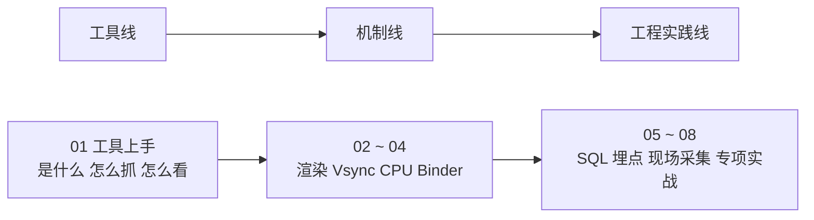

## 导读：这份笔记讲什么

Perfetto 是 Google 推出的新一代系统级 Trace 采集与分析工具，用来接替已停更的 Systrace。本系列笔记以 Android 16（API 36）的行为变更和 AOSP 主线实现作为版本基准；涉及工具 UI 变化的地方以「版本注意」注明。

整套笔记的立意先记住一句：**工具只是观测 Android + Linux 的方式，重点是理解系统运行的规律**——Perfetto 背后是整个 Android + Linux 系统，通过工具挖掘问题，通过问题思考本质。

全系列 18 篇按内容天然分成三条线，本笔记按主题域合并为 8 篇（01~08），学习时建议按线推进：

## Systrace 与 Perfetto：机制未变，工具链更替

**Systrace 是 Android 4.1 引入的性能数据采样与分析工具**，用于收集关键子系统（SurfaceFlinger、SystemServer、Input、Display、View 系统等）的运行信息，帮助开发者直观定位系统瓶颈。它由三部分组成：

| 组成 | 实现 | 说明 |
|---|---|---|
| 内核层 | Linux Kernel 的 ftrace | 使用前提是内核开启 ftrace 相关模块 |
| 采集层 | android.os.Trace 类（Java）、ATRACE 宏（Native）、atrace 程序 | 应用把统计信息输出给 ftrace，atrace 从 ftrace 读取后交给分析工具 |
| 分析层 | 旧：systrace.py 生成 HTML；新：perfetto 抓取 + Perfetto UI / trace_processor 分析 | Systrace 本质是 ftrace 的封装，Perfetto 在继续支持 ATRACE/ftrace 的基础上整合了更多数据源与分析能力 |

它的设计思路是在关键操作（Touch、Power 键、滑动）、系统机制（input 分发、View 绘制、IPC、进程管理）、软硬件信息（CPU 频率与调度、磁盘、内存）的流程上插入类似 Log 的信息，即 **TracePoint**（本质是 ftrace 信息），并用 **Trace Tag** 分类，再把散布在各进程中的 TracePoint 收集汇总到一份文件里，从而还原一段时间内整个系统的运行状况——把 Android 系统的运行状态从黑盒变成白盒。

新旧工具链的分界在 Android 10（API 29）：

| | Systrace（旧流程） | Perfetto（新流程） |
|---|---|---|
| 抓取入口 | systrace.py（新 platform-tools 已不再内置） | `adb shell perfetto`、System Tracing、网页端录制 |
| 文件格式 | HTML / ctrace | `.perfetto-trace`（protobuf） |
| 打开方式 | Chrome 或 legacy UI | Perfetto UI 或 trace_processor |

**不变的是埋点与内核事件**：android.os.Trace、ATRACE、ftrace 这些数据源依然进入 Perfetto，所以旧文章适合理解机制，新文章适合学习现在的抓取、打开、筛选和 SQL 分析流程。

从问题覆盖看，这类工具适合分析响应速度、卡顿掉帧、ANR（Application Not Responding，应用无响应）三大类问题，对应应用启动慢、界面跳转卡顿、列表滑动掉帧、点击无响应、整机卡顿等具体场景；App、系统、Kernel 背景的开发者都能用。

## 系列学习地图

本笔记共 8 篇，与来源篇章的对应关系如下：

| 笔记 | 覆盖来源篇章 | 一句话要点 |
|---|---|---|
| 01 工具上手 | 系列 1~4 | 全局视角、Perfetto 架构与优劣、四条抓取路径、View 操作技巧、超大 Trace 本地打开 |
| 02 渲染与 Vsync | 系列 5~8 | Choreographer 渲染流程、120Hz 权衡、MainThread 与 RenderThread、Vsync 机制 |
| 03 CPU 调度解读 | 系列 9 | big.LITTLE、线程状态、唤醒链、频率 governor 与选核迁移 |
| 04 Binder 调度与锁竞争 | 系列 10 | Binder Trace 观测配置、事务耗时与线程池、锁竞争排查 |
| 05 SQL 与 Trace 质量 | 系列 11、12 | PerfettoSQL 与 Trace Processor、数据流路径与丢失排查 |
| 06 埋点与内存 | 系列 13、14 | Perfetto SDK、Track Event、heapprofd 与内存 Profiling |
| 07 现场采集与硬件 | 系列 15、16 | Boot/长时现场 Trace 与证据包、GPU 与 Power Counters |
| 08 专项与响应实战 | 系列 17、18 | Camera/Audio 专项自动化、响应速度四指标与归因 |

如果你熟悉 Systrace，按下面的对应关系选读：

| Systrace 主题 | 优先阅读 |
|---|---|
| 工具简介、抓取方式、界面操作 | 01 工具上手 |
| Why 60 fps、高刷新率 | 02 渲染与 Vsync |
| Choreographer、主线程、RenderThread、流畅性实战 | 02 渲染与 Vsync |
| Vsync、SurfaceFlinger、Triple Buffer | 02 渲染与 Vsync |
| CPU 频率、线程 Running/Runnable/Sleep | 03 CPU 调度解读 |
| Binder、锁竞争、SystemServer 等待 | 04 Binder 调度与锁竞争 |
| Trace Processor、SQL、批量回归 | 05 SQL 与 Trace 质量 |
| App 埋点、Track Event、现场包 | 06 埋点与内存、07 现场采集与硬件 |
| Boot trace、长时间现场 Trace | 07 现场采集与硬件 |
| 输入响应、首帧反馈 | 08 专项与响应实战 |

## 附：Systrace 时代的 category 速查

perfetto 命令行简单模式的那串参数（如 `sched freq idle am wm gfx view ...`）本质是 atrace category 与 ftrace 事件的组合，不同厂商设备支持情况有差异，以 `adb shell atrace --list_categories` 的实际输出为准。常用的 category 按域归类如下：

| 域 | category | 内容 |
|---|---|---|
| 渲染 | gfx、view、webview、rs | 图形库、View 系统、WebView、RenderScript |
| 系统服务 | am、wm、ss、pm、sm | ActivityManager、WindowManager、SystemServer、PackageManager、SyncManager |
| 输入与显示 | input | 输入事件 |
| 调度与内核 | sched、freq、idle、irq、i2c、workq、disk、sync | CPU 调度、频率、idle、中断、工作队列、磁盘 I/O、同步 |
| 内存 | memory、memreclaim、pagecache、ion | 内存计数、内核内存回收、页缓存 |
| 运行时与库 | dalvik、bionic、database、network、adb | ART、C 库、数据库、网络 |
| 硬件与电源 | camera、audio、video、hal、power、vibrator、thermal、regulators | 各子系统与 HAL（Hardware Abstraction Layer，硬件抽象层）、电源管理、温控 |
| Binder | binder_driver、binder_lock、aidl | Binder 内核驱动、全局锁、AIDL 调用 |

TAG 选得越少，Trace 文件越小，打开与操作越流畅，按需取舍即可。另外 User 版本抓到的信息比 userdebug/eng 版本少，分析系统服务、内核调度、厂商策略建议用 userdebug 机器。

## 来源

- [Android Perfetto 系列目录](https://www.androidperformance.com/2024/03/27/Android-Perfetto-101/)
- [Android Systrace About（Systrace 简介）](https://www.androidperformance.com/2019/05/28/Android-Systrace-About/)
