## 导读：从抓到看的完整上手路径

这篇覆盖上手 Perfetto 的完整路径：**理解它是什么 → 用四条路径之一抓一份 Trace → 在 UI 里看懂界面与常用操作 → 大文件走本地命令行打开**。抓到 Trace 后的分析流程与 Systrace 时代一致：先抓文件，再用 ui.perfetto.dev 打开或用命令行分析。

## 为什么性能分析需要全局视角

影响 Android 性能的因素非常多：App 自身质量、系统模块、Linux 内核、硬件、厂商策略、系统负载、低内存、发热、版本差异、用户习惯……单看某个 App 或模块往往定位不了问题，需要一个全局视角从更高维度看系统运行。Perfetto 提供的正是这种视角：Input 事件怎么流转、App 的每一帧怎么产生并上屏、CPU 实时频率与负载、Task 摆核与唤醒关系、系统中各 App 怎么运行，都能在同一份 Trace 里看到。

《Systems Performance》（性能之巅）把性能工程的难点归纳为三条，正好解释了为什么需要这类工具：

| 难点 | 含义 |
|---|---|
| 性能是主观的（subjectivity） | 问题是否存在、是否修复，判断都可能模糊；一个用户觉得「不好」的性能，另一个用户觉得「好」 |
| 系统是复杂的（complexity） | 缺少明确分析起点，常从猜测开始；子系统互联、连锁故障（cascading failure）；修掉一个瓶颈可能只是把它推向别处 |
| 多问题并存（multiple compounded problems） | 找到一个问题不等于结束，真正的任务是辨别哪些问题最重要，量化其影响与修复收益 |

量化问题严重程度的理想指标是**延时（latency）**。Perfetto 的全局数据 + SQL 能力，正是做这种量化的工具。

## Perfetto 是什么

**Perfetto 是 Google 推出的开源高性能 Trace/Metric 采集与分析套件**：提供服务与库来捕获系统级和应用级活动数据，提供内存分析工具（native 与 Java），trace 可用 SQL 查询，基于 Web 的 UI 能流畅探索多 GB 的 trace 文件。项目 2017 年提交第一笔代码，到 2026 年已有近 300 位开发者、超过 8.2 万笔提交；除官方站点外，Windows Performance Tool、Android Studio、华为 GraphicProfiler 也支持 Perfetto 数据的可视化分析。

对 Systrace 用户来说迁移几乎无成本：**Perfetto 完全兼容 Systrace**，旧的 Systrace 文件可以直接拖进 Perfetto UI 打开。

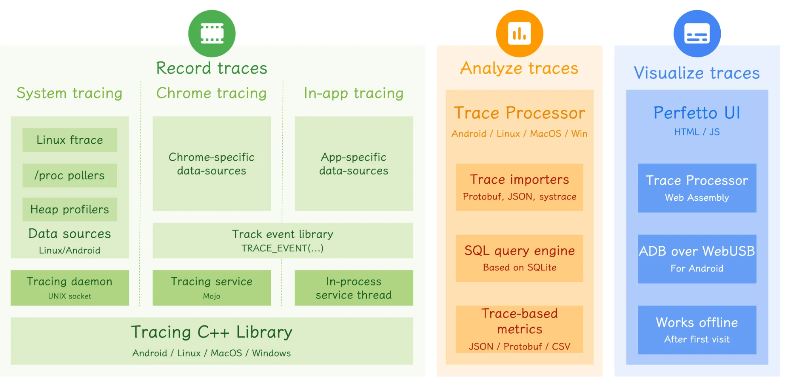

| 模块 | 职责 | 代表组件 |
|---|---|---|
| Record traces | 数据抓取，来源覆盖 Java、Native、Linux，比 Systrace 丰富得多 | traced、traced_probes、perfetto CLI |
| Analyze traces | Trace 解析、SQL 查询、Metrics 分析，命令行可调用可集成 | trace_processor、SQL query engine |
| Visualize traces | Trace 呈现与在线录制 | Perfetto UI（Web） |

核心优势按类归纳：

| 类别 | 要点 |
|---|---|
| 抓取 | 后台服务支持长时间抓取；Protobuf 编码存储；网页、命令行、开发者选项、Trigger API 多种入口 |
| 数据源 | 基于 Linux 内核 ftrace，记录用户态与内核态关键事件；兼容并最终取代 Systrace；支持 Trace、Metric、Log 三类数据 |
| 分析 | 解析时内建 SQL 表，可直接 SQL 查询；提供 Python API 可导出 DataFrame；支持函数调用堆栈与内存堆栈展示 |
| UI | 大文件渲染流畅（Systrace 打开稍大的文件就卡，Perfetto 打开 500MB 依然顺滑）；Pin 置顶；Binder 调用可视化；唤醒源查询；Critical Task 可视化 |
| 维护 | Google 工具团队持续更新，版本 Release 与 Bugfix 及时 |

SQL 是其中最具变革性的一点：解析 trace 时内建大量 SQL 表，官方文档讲到对应部分也会附 SQL 与查询结果示例。优化前后的指标对比、报告数据都可以直接查出来，表格转图表就是一份 report。

## 相比 Systrace 的两个短板

### Vsync-App 不再是一条竖线

Systrace 里 Vsync-App 是贯穿整个 Trace 的竖线，一眼可辨；Perfetto 取消了这种呈现，需要把 Vsync-App 轨道 Pin 到最上面来看：

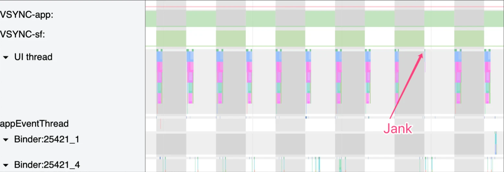

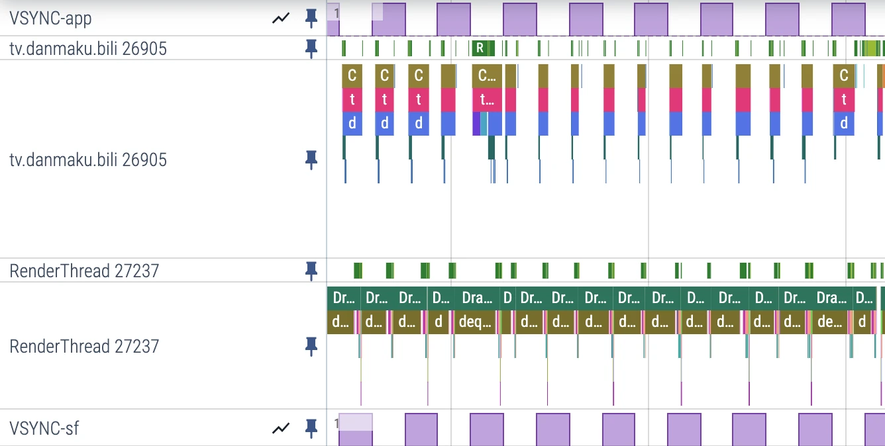

这个取舍有理由：Vsync-App 本身并不能说明 App 有性能问题。Perfetto 用 **Expected Timeline / Actual Timeline** 两行替代——前者是应用渲染一帧的时间窗口（起点为 Choreographer 回调被调度的时刻），后者是应用实际完成帧（含 GPU 工作）并提交 SurfaceFlinger 的时间。两者的差异能快速定位卡顿帧，且因为计入了 GPU 时间，比 Vsync-App 竖线更能说明问题（SurfaceFlinger 侧同样有这两条轨道）。

### 竖向空间紧张

宽屏上 Pin 几个关键线程后，下方可操作区域就很小；深调用栈的轨道不能折叠（Systrace 可以），比较折磨。解法无非是少 Pin、竖屏显示器，或者 16:18 一类的方屏。

> 版本注意（2026 年更新）：这里说的是 2024 年的 UI 状态。v48/v49（2024 底～2025 初）加入了 Workspaces，可把关心的线程整理进自定义工作区并切换，「疯狂 Pin 导致没地方看」缓解不少；时间轴渲染性能、框选与搜索也有明显改进。深调用栈占竖向空间的问题仍在，竖向空间大的显示器看 Trace 更舒服。

## 抓取方式一：adb shell perfetto 命令行（推荐）

### 简单模式

```bash
# 1. 执行命令开始录制（20 秒）
adb shell perfetto -o /data/misc/perfetto-traces/trace_file.perfetto-trace -t 20s \
  sched freq idle am wm gfx view binder_driver hal dalvik camera input res memory
# 2. 操作手机复现场景（滑动、启动等）
# 3. pull 到本地，即可在 ui.perfetto.dev 打开
adb pull /data/misc/perfetto-traces/trace_file.perfetto-trace
```

`sched freq am wm ...` 这些参数本质是启用对应的 atrace category 与 ftrace 事件，与 Systrace 时代一致。

### 配置文件模式

需要精细控制（buffer 大小、指定应用、heapprofd 等）时用配置文件，避免每次敲一大串参数：

```bash
# Android 12 及之后：可直接从 /data/misc/perfetto-configs 读取配置
adb push config.pbtx /data/misc/perfetto-configs/config.pbtx
adb shell perfetto --txt -c /data/misc/perfetto-configs/config.pbtx \
  -o /data/misc/perfetto-traces/trace.perfetto-trace

# Android 12 之前：SELinux 限制，非 root 设备需经 stdin 传入
adb push config.pbtx /data/local/tmp/config.pbtx
adb shell 'cat /data/local/tmp/config.pbtx | perfetto -c - -o /data/misc/perfetto-traces/trace.perfetto-trace'
```

注意文本格式的 `.pbtx` 配置必须带 `--txt`，否则 perfetto 只认二进制 protobuf。

Config 的推荐来源是 ui.perfetto.dev 的 **Record new trace** 页面：图形化勾选后保存到本地，不同场景加载不同配置；官方还提供 Share 按钮直接分享配置。AOSP 仓库也带了一批现成配置（`external/perfetto/test/configs/`）。

命令行注意事项：

| 事项 | 说明 |
|---|---|
| adb 确认 | 先用 `adb devices` 确认设备连接与 USB 调试开启 |
| Ctrl+C 不传播 | `adb shell perfetto` 下 Ctrl+C 信号不会经 ADB 传播，提前结束需用交互式 PTY（pseudo-terminal，伪终端）会话运行 adb shell |
| SELinux | Android 12 之前的非 root 设备只能 `cat config | perfetto -c -` 走 stdin |
| 旧版本 pull | Android 10 之前无法直接 pull `/data/misc/perfetto-traces`，用 `adb shell cat ... > trace` 替代 |

## 抓取方式二：官方脚本 record_android_trace（强烈推荐）

Perfetto 团队的 `tools/record_android_trace` 封装了常见步骤：底层仍是 `adb shell perfetto`，但自动处理路径、抓完自动 pull 并在浏览器中打开：

```bash
# Linux / Mac
curl -O https://raw.githubusercontent.com/google/perfetto/master/tools/record_android_trace
chmod u+x record_android_trace
./record_android_trace -o trace_file.perfetto-trace -t 10s -b 64mb \
  sched freq idle am wm gfx view binder_driver hal dalvik camera input res memory

# Windows（python3 运行）
curl -O https://raw.githubusercontent.com/google/perfetto/master/tools/record_android_trace
python3 record_android_trace -o trace_file.perfetto-trace -t 10s -b 64mb \
  sched freq idle am wm gfx view binder_driver hal dalvik camera input res memory
```

同样支持 `-c config.pbtx` 指定配置文件，是日常抓取最省事的方式。

## 抓取方式三：System Tracing 系统跟踪应用

没条件连电脑、或测试场景不能插 USB 时，用系统自带的「系统跟踪」应用：开发者选项 → 系统跟踪（System Tracing），可配置跟踪时长、数据源（CPU/内存/网络等）、输出文件位置，点「录制跟踪记录」开始、再点一次结束，完成后可导出分享到电脑分析。

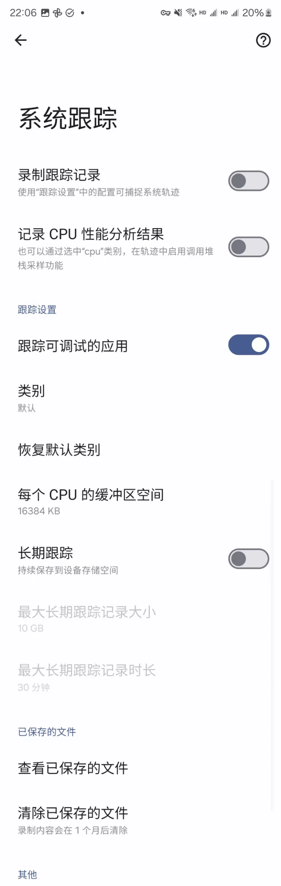

## 抓取方式四：网页端录制

ui.perfetto.dev → **Record new trace** → **Add ADB device** 连接设备 → 勾选数据源 → **Start Recording**：

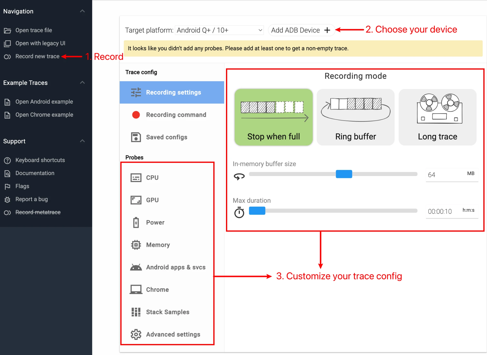

网页端最大的价值是**生成与提取配置**：选好数据源后点 Recording command，可查看、分享、保存这份 Config，供命令行抓取复用。Android apps 一栏建议把 Atrace userspace annotations、Event log (logcat)、Frame timeline 都选上；想抓调用栈再勾 Stack Samples 下的 Callstack sampling——它依赖 traced_perf，需要 Android 11+，user 版本上目标进程还得是 profileable 或 debuggable（userdebug/eng 无此限制）。

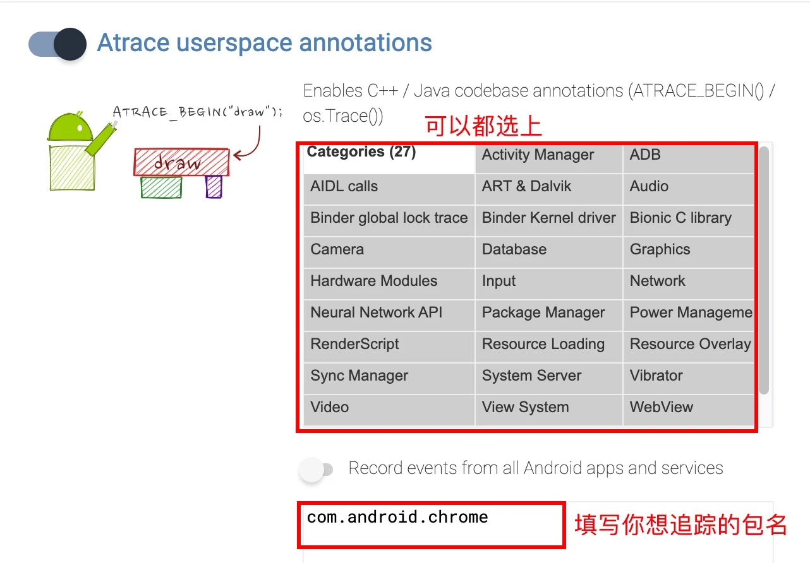

保存 Recording command 输出的配置时，记得把开头的几行命令包装去掉，只留配置本体：

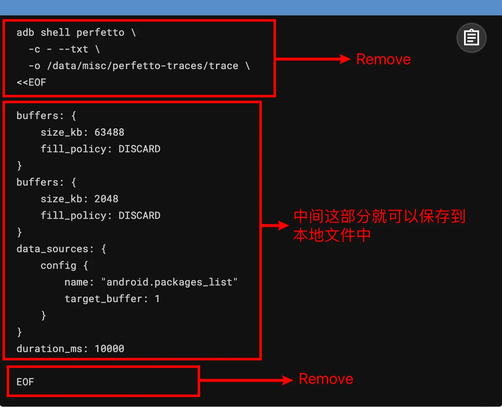

> 实践提示：网页端录制本身成功率一般（连不上 adb、提示需要 kill 等问题），更推荐命令行抓取，网页端适合做配置定制。（2026 年更新：v49 重写了 Record 页面，连接体验稳定不少，但「命令行更可靠、可复用、可自动化」的结论不变。）

## 熟悉 Perfetto View

打开 Trace 后界面分四个区域：

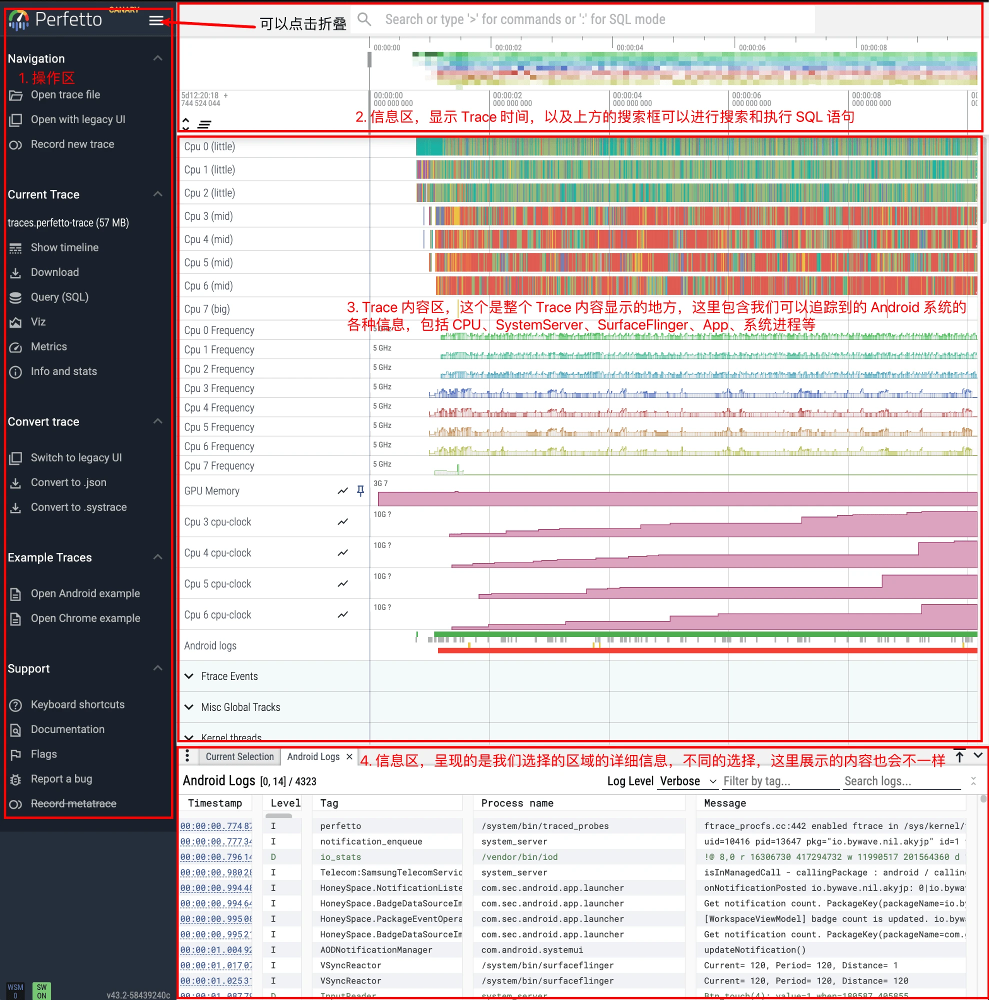

| 区域 | 内容 |
|---|---|
| 右侧操作区 | Current Trace 下的 Show timeline（回到 Trace 视图）、Query（SQL 查询）、Metrics（官方预置分析）、Info and stats（Trace 与设备信息） |
| 上方 | 时间轴与操作区，主要用来看时间 |
| 中间内容区 | 最常用的区域：上部按功能分区（CPU 区可看 Task 摆核、频率、时长、唤醒者；Ftrace event 区），下部以 App 进程为单位（线程、Input、Binder Call、Memory、Buffer 等） |
| 下方信息区 | 选中某个 slice 后展示详情；加了 Log 的话这里也显示 Log 与 ftrace event |

快捷键与 Systrace 高度相似：

| 操作 | 按键/方式 |
|---|---|
| 缩放 / 平移 | W/S 缩放，A/D 左右平移 |
| 放大选中 | F |
| 临时 Mark | M（再按会替换上一个，Esc 退出） |
| 常驻 Mark | Shift+M（不手动删就不消失，适合把所有掉帧点标出来；在 Current Selection 面板点 Remove 删除） |
| 插旗子 | 鼠标放到 Trace 最上方出现旗子，左键点击插入时间标记；点击旗子后 Remove 删除 |
| 收起信息栏 | Q（Perfetto 很占屏幕，熟练用 Q 很重要） |
| 选择 | 鼠标点击 slice |

左下角帮助文档有完整操作说明，忘了随时查。

### 常用分析技巧

**查看唤醒源**：点击某个 Task 的 Runnable 状态，下方信息区的 Related thread states 会给出 Waker（唤醒源）、Previous state、Next state：

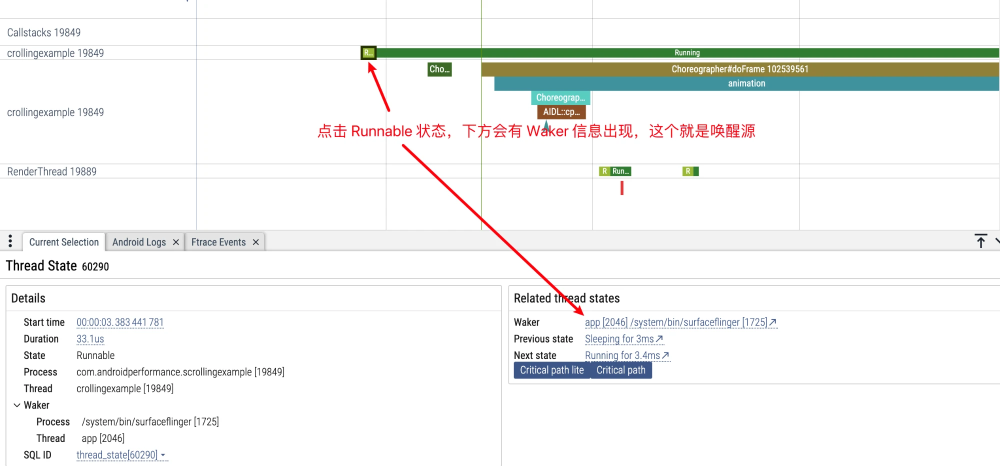

也可以点击 Running 状态，用小箭头跳到 CPU Info 区域，连续点击 Task 追整条唤醒链（例如 RenderThread ← MainThread ← SurfaceFlinger 的 app 线程），信息区还会给出唤醒延迟。

**查看 Critical Path**：Critical Task 指与选中 Task 有依赖关系的任务链——e 要等 d，d 等 c，c 等 b，b 等 a，那 e 的 Critical Path 就是 a、b、c、d。点击 Running 状态后在下方面板点 Critical path，Perfetto 会把连续唤醒的 Task 聚合到一张图里：

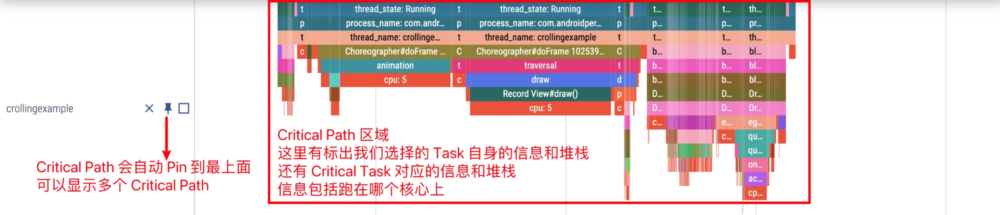

**Pin 固定关键线程**：每个线程行左侧的图钉按钮把线程固定到最上面。把 App 到 SurfaceFlinger 链路的线程 Pin 到一起，看掉帧清晰得多：

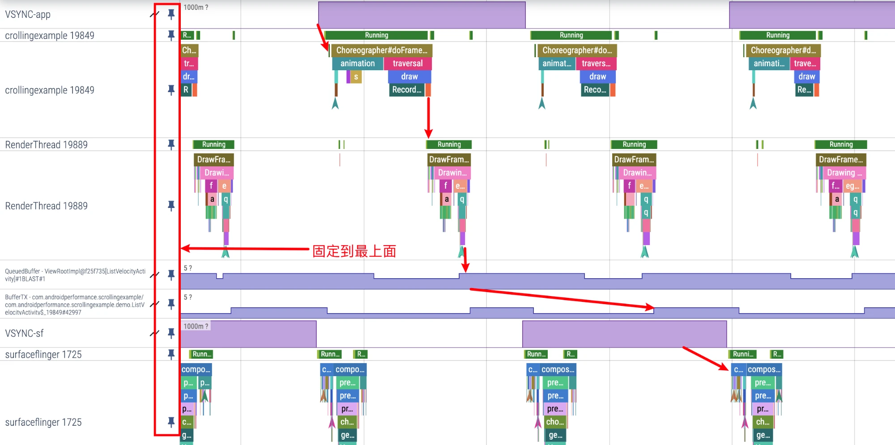

**CPU 区 Task 高亮**：鼠标悬停 CPU Info 区某个 Task，同线程的其他 Task 全部高亮，快速看摆核情况。

**定位 Buffer 消费**：App 进程的 Actual Timeline 行能定位某个 Buffer 具体被 SurfaceFlinger 的哪一帧消费。

**快速查看执行超时**：Expected Timeline 与 Actual Timeline 两行对照，红色 Actual 段即超时帧，点击后信息栏给出掉帧原因分类：

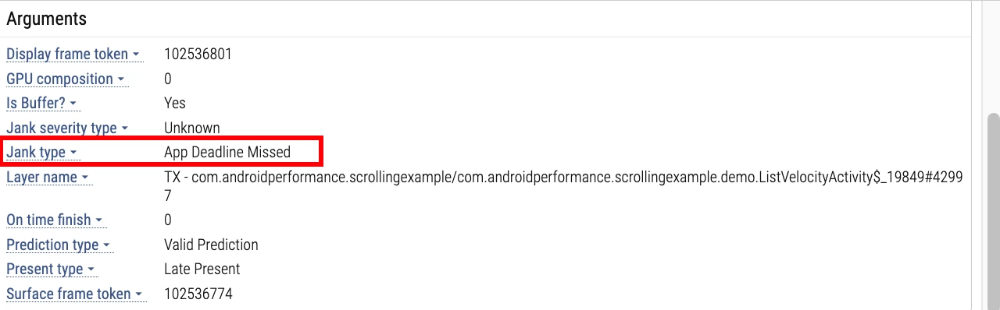

**在 Trace 上看 Log**：下方 Android Logs 标签页，鼠标悬停某行 Log 会在时间轴上拉一条直线定位时刻；Ftrace events 标签页同理。

**框选统计线程状态**：按住左键框选一段 CPU State 区域，直接得到该时段 Running、Runnable、Sleep、Uninterruptible Sleep 的占比，分析启动问题时常用：

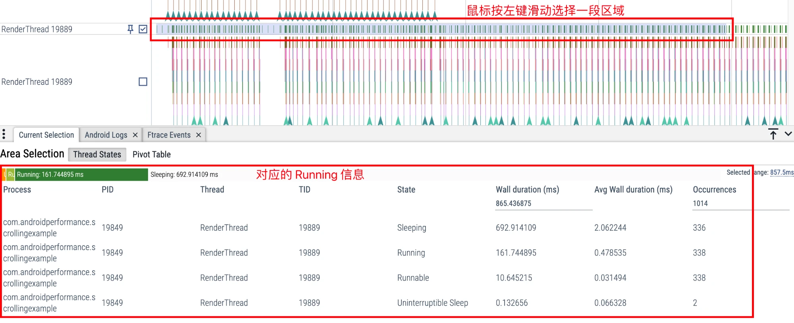

**从 UI 操作过渡到 SQL**：手工分析适合建立直觉，不适合批量复盘。在 UI 里能稳定找到问题后，把「我刚才看了什么」翻译成 SQL：点一个 slice 时留意它来自 slice、track、thread_track 还是 process_track；分析线程状态转到 thread_state、sched 表算占比；分析帧耗时优先用 FrameTimeline 相关表；Buffer、Binder、Camera、Audio 这类跨进程链路先用 track_id、utid、upid 把事件归属理清楚，再写场景 SQL。

## 命令行打开超大 Trace

浏览器有内存上限，超过 2GB 的 trace 直接扔进 ui.perfetto.dev 打不开（且 WASM 引擎解析 100MB 以上的文件就明显变慢）。解法是官方的 trace_processor_shell 在本地起服务。

> 版本注意（2026 年更新）：官方现在把面向用户的命令统一为 trace_processor（一个 Python 包装脚本，首次运行自动按平台拉取原生可执行文件），`trace_processor_shell --httpd` 已属兼容入口，等价的新写法是 `trace_processor server http trace-file-name`。分析思路不受影响。

从 [GitHub Releases](https://github.com/google/perfetto/releases) 下载对应平台最新版本，包内即含 trace_processor_shell：

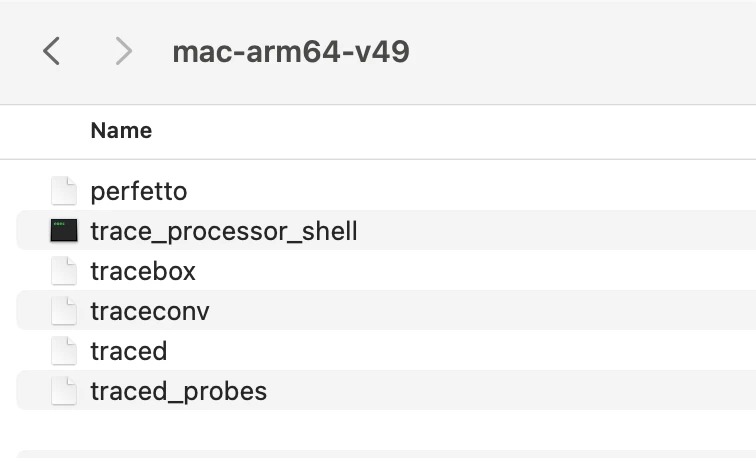

`--httpd` 参数启动一个监听 127.0.0.1:9001 的本地 HTTP 服务：绕过浏览器 WASM（WebAssembly）的性能限制，直接用 C++ 原生解析引擎（SQL 建制定制 SQLite 之上），支持流式解析超大文件；与 Perfetto UI 深度集成；trace 不出本机，适合隐私与内网场景。

```bash
./trace_processor_shell --httpd big-trace.perfetto-trace
```

然后打开 ui.perfetto.dev，会出现连接本地服务的弹框：

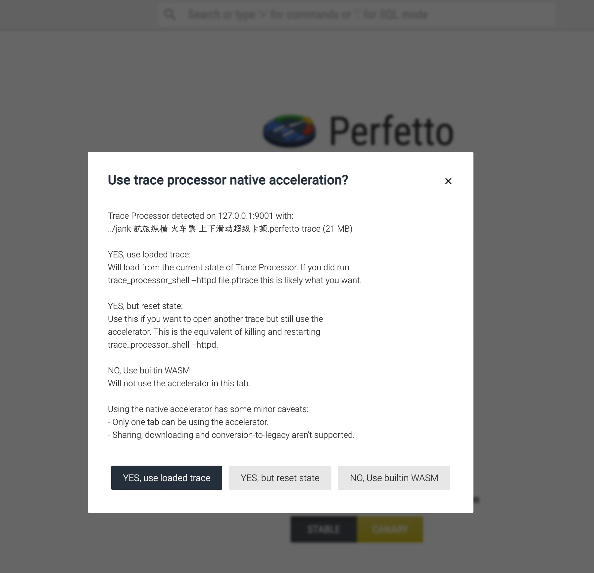

三个选项的含义：

| 选项 | 行为 | 适用 |
|---|---|---|
| YES, use loaded trace | 直接复用本地进程已解析的 trace 状态（含已执行的查询），避免重复解析 | 常规选择，省时省内存；此模式下分享链接、下载修改后文件等 WASM 专属功能不可用 |
| YES, but reset state | 强制重置 Trace Processor 状态重新加载 | 清掉临时查询结果重开；或换一个 trace 文件 |
| NO, Use builtin WASM | 完全走浏览器内置引擎 | 本地服务不可用、或需要分享链接等功能时；大文件慢且可能崩 |

两种打开方式的对比：

| | 命令行启动（--httpd） | 直接打开 ui.perfetto.dev |
|---|---|---|
| 引擎 | 本地 C++ 原生服务 | 浏览器 WASM |
| 性能 | 远超 WASM，适合大文件与复杂分析 | 小文件够用，大文件卡顿甚至崩溃 |
| 功能 | 完整 SQL、自定义指标 | 部分高级查询不可用 |
| 协作 | 不能分享链接/下载修改后文件；同一时间仅一个标签页可用 | 支持分享与导出 |
| 状态 | 解析状态跨页面会话保留 | 页面内有效 |

结论：大文件、复杂分析优先命令行启动；临时轻量查看直接网页。Mac 首次运行若被 Gatekeeper 拦截，到「设置 → 隐私与安全」点 Allow 即可。

## 来源

- [Android Perfetto 系列 1：Perfetto 工具简介](https://www.androidperformance.com/2024/05/21/Android-Perfetto-01-What-is-perfetto/)
- [Android Perfetto 系列 2：Perfetto Trace 抓取](https://www.androidperformance.com/2024/05/21/Android-Perfetto-02-how-to-get-perfetto/)
- [Android Perfetto 系列 3：熟悉 Perfetto View](https://www.androidperformance.com/2024/05/21/Android-Perfetto-03-how-to-analysis-perfetto/)
- [Android Perfetto 系列 4：使用命令行在本地打开超大 Trace](https://www.androidperformance.com/2025/02/08/Android-Perfetto-04-Open-Big-Trace-With-Command-Line/)
