## 导读：一帧是怎么上屏的

这篇覆盖 Choreographer 渲染流程、120Hz、MainThread 与 RenderThread、Vsync 机制四个主题，围绕同一个问题展开：**App 的一帧从被触发到出现在屏幕上，中间经过哪些环节，每个环节在 Perfetto 里长什么样**。整体链路一句话可以串起来：

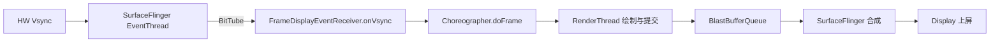

> 版本注意：本文机制基于 Android 16 与 AOSP main 分支实现。BlastBufferQueue 由 Android 11 引入、Android 12 起成为所有窗口的默认提交路径；FrameTimeline 需要 Android 12 及以上；vsync-appSf 信号为 Android 13 新增。源码均为摘编版：保留主干、省略分支与日志，以当前 AOSP main 为准。

## 基础概念：刷新率、FPS 与 Vsync

| 概念 | 属性 | 含义 |
|---|---|---|
| 屏幕刷新率 | 硬件 | 屏幕每秒刷新内容的次数，60Hz/90Hz/120Hz 对应间隔约 16.67/11.11/8.33ms |
| FPS（Frames Per Second，每秒帧数） | 软件 | 系统每秒生成多少帧内容供屏幕显示 |
| Vsync（Vertical Synchronization，垂直同步） | 同步机制 | 让软件渲染节奏与屏幕刷新节拍对齐，避免画面撕裂（Screen Tearing） |

两者关系：FPS 低于刷新率时屏幕复用上一帧内容；FPS 高于刷新率时多余的帧被丢弃，白白浪费算力。**稳定的帧率比波动的高帧率体验更好**——稳定 60fps 优于在 90~120fps 间波动。另外内容类型也影响感知：电影 24fps 因为自然运动模糊看起来仍流畅，而滑动列表从 120fps 掉到 110fps 就可能被感知为卡顿。

120Hz 成为旗舰标配的驱动因素：视觉信息量翻倍、输入到显示的延迟从 16.67ms 降到 8.33ms、SoC（System on Chip，片上系统）性能过剩、LTPO（Low Temperature Polycrystalline Oxide，低温多晶氧化物）等自适应刷新率技术缓解功耗。后面「120Hz 的收益与代价」一节展开。

## 主线程的本质与 Choreographer 的角色

**Android 主线程运行的本质就是 Message 处理**：包括每一帧渲染在内的各种操作，都以 Message 形式投递到主线程的 MessageQueue，处理完继续等下一条。在 Perfetto 上看主线程，就是一段段 doFrame 与其他 Message 交替：

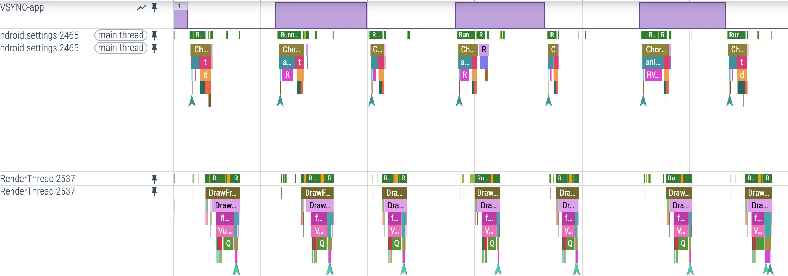

引入 Vsync 之前，渲染 Message 是连续处理的：上一帧画完下一帧立刻开始，帧率忽高忽低。由于屏幕按固定刷新周期消耗 Buffer，App 会卡在 dequeueBuffer 上，帧率不稳定且容易掉帧。Android 的解法是 **Vsync + TripleBuffer + Choreographer**，Android 11 起再加入 **BlastBufferQueue**，让软件生产与硬件消耗以共同节拍工作。

**Choreographer 扮演承上启下的角色**：

- 承上：等 Vsync 到来时统一处理 Input、Animation、Insets Animation、Traversal（measure/layout/draw）等回调，记录帧耗时与掉帧
- 启下：通过 FrameDisplayEventReceiver 请求（scheduleVsync）与接收（onVsync）Vsync 信号

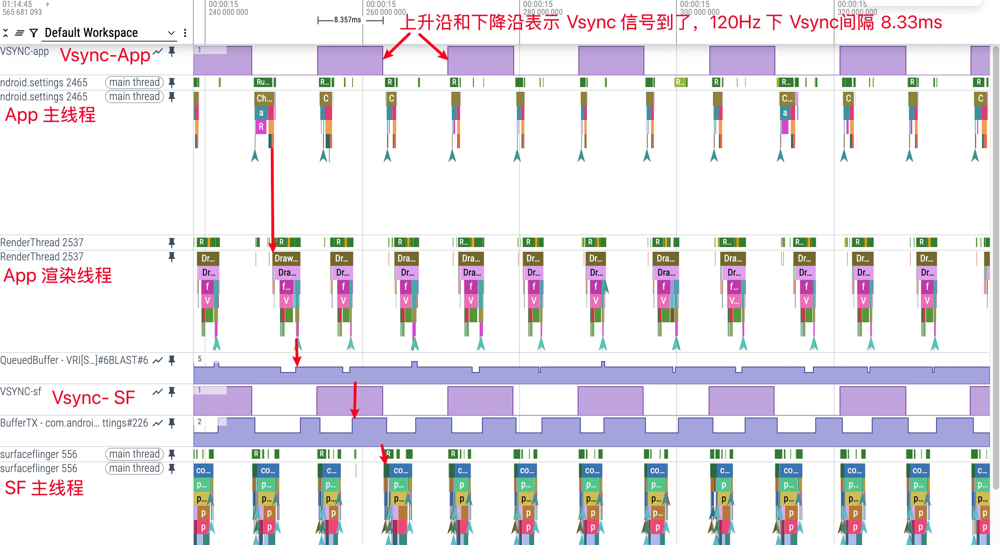

每一帧的处理顺序固定为：Vsync 回调 → UI Thread → RenderThread → SurfaceFlinger。即使 UI Thread + RenderThread 干得很快，每一帧也会等到 Vsync 才开始——这就是稳定帧率的来源。

## Choreographer 工作流程与源码

### 初始化链

Choreographer 是线程单例（ThreadLocal），必须绑定 Looper，App 中通常绑定主线程。初始化发生在 Activity resume 之后 addView 创建 ViewRootImpl 时：

```text
ActivityThread.handleResumeActivity
  → WindowManagerImpl.addView
    → WindowManagerGlobal.addView
      → ViewRootImpl 构造函数
        → Choreographer.getInstance()
```

构造函数做三件事：初始化 FrameHandler（绑定 Looper 的 Handler，处理 MSG_DO_FRAME / MSG_DO_SCHEDULE_VSYNC / MSG_DO_SCHEDULE_CALLBACK 三种消息）；初始化 FrameDisplayEventReceiver（与 SurfaceFlinger 建立通信）；初始化 CallbackQueue 数组。

```java
private Choreographer(Looper looper, int vsyncSource) {
    mLooper = looper;
    // 1. 绑定 Looper 的 FrameHandler，驱动 doFrame 与 Vsync 请求
    mHandler = new FrameHandler(looper);
    // 2. 与 SurfaceFlinger 建立通信，接收与请求 Vsync
    mDisplayEventReceiver = USE_VSYNC
            ? new FrameDisplayEventReceiver(looper, vsyncSource)
            : null;
    mLastFrameTimeNanos = Long.MIN_VALUE;
    // 3. 按刷新率计算帧间隔，掉帧计算的基础
    mFrameIntervalNanos = (long) (1000000000 / getRefreshRate());
    // 4. 五类回调各自的队列
    mCallbackQueues = new CallbackQueue[CALLBACK_LAST + 1];
    // ...
}
```

> 版本注意：AOSP main 上构造函数已演进为三参 `Choreographer(Looper, int vsyncSource, long layerHandle)`，多出的 layerHandle 用于把 Vsync 关联到具体 layer，主流程不变。

### Vsync 的接收通道：FrameDisplayEventReceiver 与 BitTube

FrameDisplayEventReceiver 继承 DisplayEventReceiver，三个关键方法：`onVsync`（Vsync 回调）、`run`（执行 doFrame）、`scheduleVsync`（请求下一个 Vsync）。初始化链最终走到 native 层 `nativeInit`：通过 ISurfaceComposer 拿到 IDisplayEventConnection，建立 **BitTube**（本质是 socket pair）作为事件通道，并用 Looper 监听其文件描述符。这条链路的末端在 MethodTrace 上清晰可见：事件送达后回调 onVsync，经 run 进入 doFrame 开始一帧绘制。

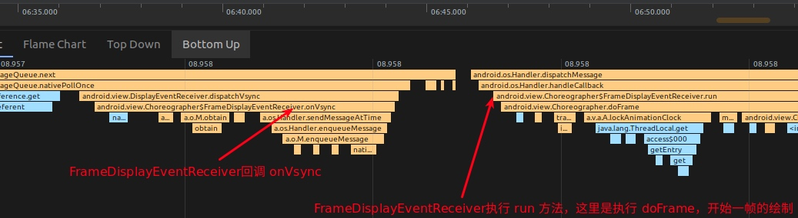

这个设计避开了用 Binder 传高频 Vsync 事件：socket 通道实时性好，文件描述符又能无缝接入 Looper 的事件驱动模型。

### doFrame：一帧的主处理逻辑

onVsync 把自己 post 成异步消息，run 方法直接调 doFrame。doFrame 做两件事：计算掉帧并记录 FrameInfo，然后按固定顺序执行五类回调。

```java
void doFrame(long frameTimeNanos, int frame, VsyncEventData eventData) {
    // 掉帧计算：本次 Vsync 距上次帧工作超过一个帧间隔，说明有帧被跳过
    // 超过 SKIPPED_FRAME_WARNING_LIMIT（默认 30）时打 Log 提示主线程太忙
    // FrameInfo 记录各阶段起始时间，dumpsys gfxinfo framestats 的数据源
    mFrameInfo.setVsync(intendedFrameTimeNanos, frameTimeNanos);
    doCallbacks(Choreographer.CALLBACK_INPUT, frameTimeNanos);
    doCallbacks(Choreographer.CALLBACK_ANIMATION, frameTimeNanos);
    doCallbacks(Choreographer.CALLBACK_INSETS_ANIMATION, frameTimeNanos);
    doCallbacks(Choreographer.CALLBACK_TRAVERSAL, frameTimeNanos);
    doCallbacks(Choreographer.CALLBACK_COMMIT, frameTimeNanos);
    // ...
}
```

五类回调的职责与先后有明确的因果：INPUT 消费批量输入事件（最终走到 DecorView 的输入分发）；ANIMATION 更新动画状态（View.postOnAnimation、FrameCallback 都挂在这里）；INSETS_ANIMATION 处理窗口边衬区动画（键盘、系统栏）；TRAVERSAL 执行 measure/layout/draw；COMMIT 做收尾并修正 frame time。**Input 与 Animation 会修改 View 属性，必须先于 Traversal 执行**，属性变化才能在本帧的测量布局绘制中生效。

Traversal 回调进入 ViewRootImpl 的经典主干，注意其中的同步屏障（Sync Barrier）配合：

```java
void scheduleTraversals() {
    if (!mTraversalScheduled) {
        mTraversalScheduled = true;
        // 提高优先级：先插同步屏障，挡住后面的同步消息
        mTraversalBarrier = mHandler.getLooper().getQueue().postSyncBarrier();
        mChoreographer.postCallback(Choreographer.CALLBACK_TRAVERSAL, mTraversalRunnable, null);
    }
}
void doTraversal() {
    if (mTraversalScheduled) {
        mTraversalScheduled = false;
        // 真正执行前移除屏障
        mHandler.getLooper().getQueue().removeSyncBarrier(mTraversalBarrier);
        performTraversals();   // measure → layout → draw
    }
}
```

Choreographer 自己 post 的消息都调用 `msg.setAsynchronous(true)`——异步消息不受同步屏障阻挡，保证帧处理插队执行。这就是 MessageQueue 同步屏障机制在渲染链路里的实际用法。

### 下一帧的 Vsync 请求：以动画为例

Vsync 是按需申请的，连续动画能持续出帧，靠的是每帧自我续期。`View.invalidate()`、`requestLayout()`、动画启动都会触发申请。以 ObjectAnimator 为例：

```java
// AnimationHandler：首个动画注册时 post 一个 FrameCallback，
// 它的 doFrame 执行完动画回调后再次 post 自己，形成每帧循环
private final Choreographer.FrameCallback mFrameCallback =
        new Choreographer.FrameCallback() {
    @Override
    public void doFrame(long frameTimeNanos) {
        doAnimationFrame(getProvider().getFrameTime());
        if (mAnimationCallbacks.size() > 0) {
            // 还有动画在跑，继续申请下一帧
            getProvider().postFrameCallback(this);
        }
    }
};
```

`postFrameCallback` 内部走 `scheduleVsyncLocked → mDisplayEventReceiver.scheduleVsync → nativeScheduleVsync`，向 SurfaceFlinger 要下一个 Vsync。动画因此在停止后自动不再申请 Vsync，省电。

### 源码小结

- Choreographer 线程单例，与 Looper 强耦合；主线程实例通过 `Looper.prepareMainLooper()` 保证存在
- DisplayEventReceiver 的 JNI 层创建 IDisplayEventConnection 监听 Vsync，SurfaceFlinger 的 AppEventThread 通过 BitTube 精确投递
- 动画系统基于 FrameCallback 与屏幕刷新率精确同步，比旧的自计时实现更流畅省电

## 一帧的完整渲染流程：12 步在 Perfetto 里的样子

下图是滑动列表时一帧的完整 Perfetto 截图，对照下表逐步对应：

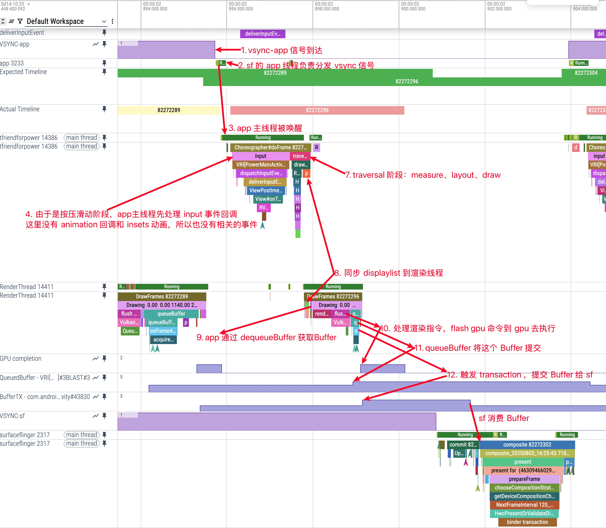

| 步骤 | Perfetto 中的表现 | 说明 |
|---|---|---|
| 1. 主线程等待 Vsync | 主线程 Sleep | 空闲块，等待与屏幕刷新节拍对齐 |
| 2. Vsync-app 传递 | SurfaceFlinger 的 app 线程活动 | 硬件 Vsync 先到 SurfaceFlinger，由其分发；vsync-app 按需申请，SF 里看到的信号可能属于别的 App |
| 3. 唤醒 App 主线程 | FrameDisplayEventReceiver.onVsync | Choreographer 开始一帧 |
| 4. 处理输入 | Input slice | 按需：只有前一帧有触摸/滑动事件才执行 |
| 5. 处理动画 | Animation slice | 按需：惯性滑动、属性动画运行时执行 |
| 6. 处理 Insets 动画 | Insets Animation slice | 按需：键盘弹出、系统栏变化时执行 |
| 7. Traversal | performTraversals、measure、layout、draw | 按需：requestLayout/invalidate 触发；draw 在硬件加速下构建 DisplayList 而非画像素 |
| 8. 同步 DisplayList | syncAndDrawFrame | 主线程把 RenderNode 树同步给 RenderThread，短暂等待关键同步点后返回 |
| 9. 渲染线程获取 Buffer | DequeueBuffer 相关信息 | 是否等待直接影响能否赶上 deadline |
| 10. 处理渲染指令 | drawing 相关 slice | RenderThread 生成 GPU 命令并提交，GPU 异步执行产出 fence |
| 11. 提交 Buffer | queueBuffer | 经 BLAST 机制进入 SurfaceFlinger，可能出现 unsignaled fence 提前 latch |
| 12. 触发 Transaction | BLAST transaction 事件 | Buffer 与图层属性打包提交，SF 按策略决定合成时机 |

**并非每帧都执行全部步骤**。三种典型场景在 Perfetto 上的指纹：

- 手指按住滑动：每帧都有 Input → Traversal → RenderThread 完整链路
- 惯性滑动：每帧 Animation → Traversal → RenderThread，没有 Input
- 界面静止：偶尔出现零星 Animation 帧，多数时间主线程 Sleep

软件绘制与硬件加速在 Trace 上差异明显：`android:hardwareAccelerated="false"` 时没有 RenderThread，主线程用 Skia 直接绘制，表现为主线程出现大块 draw 事件、耗时明显变长，帧与帧之间的空闲间隔被压缩，其他 Message 的执行时间也随之变紧。

## 双线程架构：MainThread 与 RenderThread

### 演进与分工

Android 5.0 之前所有 UI 工作都在主线程：输入、measure/layout/draw、调 OpenGL、与 SurfaceFlinger 交互，主线程负载重、CPU 与 GPU 无法并行。5.0 引入 RenderThread 后分工固定：

- 主线程：处理 Message 与业务逻辑、执行 measure/layout/draw、构建 DisplayList、与渲染线程同步数据
- 渲染线程：接收 DisplayList、执行 OpenGL/Vulkan 渲染命令、管理纹理资源、通过 BlastBufferQueue 与 SurfaceFlinger 交互

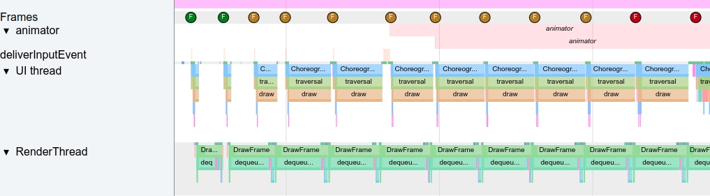

硬件加速下使用 DisplayList（抽象为 RenderNode）间接绘制的收益：可按需重绘而无需重走业务逻辑；translation/scale 等属性可作用于整棵 DisplayList；全部绘制指令已知后可整体优化；处理可转移到 RenderThread，主线程 sync 完即可处理下一条 Message。

### 主线程的创建：fork 与 ActivityThread

App 进程由 Zygote fork 而来，fork 出的线程此时还接不上 Android 的消息机制，负责搭桥的是 ActivityThread（把它理解成 ProcessThread 更贴切，它是主线程上的核心逻辑单元）：

```java
public static void main(String[] args) {
    // 1. 初始化主线程 Looper 与 MessageQueue
    Looper.prepareMainLooper();
    // 2. 创建 ActivityThread
    ActivityThread thread = new ActivityThread();
    // 3. attach 到 system_server（AMS.attachApplicationLocked），同步进程信息
    thread.attach(false, startSeq);
    // 4. 主线程 Handler H：四大组件相关消息几乎都在这里处理
    sMainThreadHandler = thread.getHandler();
    // 5. 主线程正式开始消息循环
    Looper.loop();
}
```

看 Handler H 的消息类型就知道为什么说「四大组件运行在主线程」：BIND_APPLICATION、CREATE_SERVICE、BIND_SERVICE、RECEIVER 等都在这里分发。

### 渲染线程的初始化与 DisplayList 同步

RenderThread 在第一次真正 draw 时才初始化（`ThreadedRenderer.initializeIfNeeded`），同一时刻创建本窗口的 BLASTBufferQueue。每帧主线程 draw 的收尾是 `syncAndDrawFrame`，把 RenderNode 树、View 属性、共享资源同步给 RenderThread。

底层并不是完全异步：`DrawFrameTask::drawFrame` 先把任务投递到 RenderThread 队列，然后在条件变量上等待；RenderThread 在合适的同步点 `unblockUiThread()` 放行主线程。**这是「有等待但尽早释放 UI」的设计**，不是主线程完全不等。

### BlastBufferQueue 与两个关键指标

传统 BufferQueue 由 SurfaceFlinger 创建，App 通过 Binder 去 dequeueBuffer，没有可用 Buffer 时会阻塞。BlastBufferQueue 改由 App 端（ViewRootImpl）创建和管理：本地维护缓冲池减少同步等待，渲染完成后通过 transaction 批量异步提交，降低 Binder 开销，特别适配高刷设备。

120Hz 下的 Perfetto 截图里能看到两个 Buffer 指标：

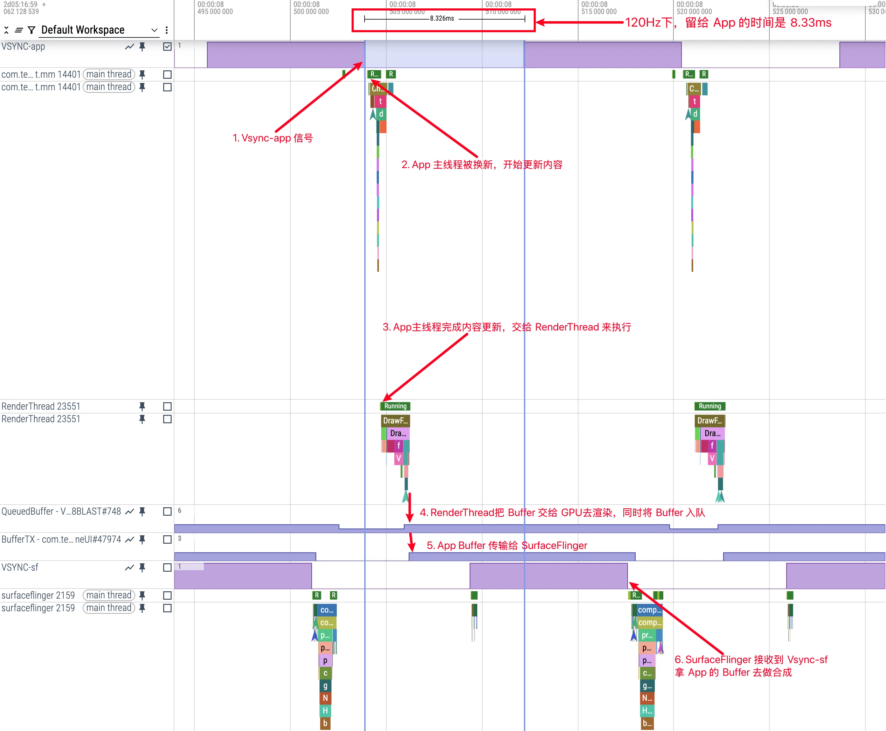

| 指标 | 所在进程 | 含义 | 变化时机 |
|---|---|---|---|
| QueuedBuffer | App | App 已交付、尚未确认被释放的 Buffer 综合状态（`mNumFrameAvailable + mNumAcquired - mPendingRelease.size()`） | RenderThread queueBuffer 后 +1；收到 SF 的 releaseBufferCallback 后 -1 |
| BufferTX | SurfaceFlinger | 该 layer 的 mPendingBuffers，已到达等待 latch 的 Buffer 数 | Buffer 随 transaction 到达 +1；被 latch 或 drop 后 -1 |

分析时**看趋势而非瞬时值**：App 端 QueuedBuffer 连续上升不回落，说明生产/消费节奏失衡；SF 端 BufferTX 长期偏高是消费侧压力大，长期偏低而 App 又频繁 miss deadline 则是供给不足。

正确的 Buffer 生命周期是六步闭环：RenderThread queueBuffer（App 端 QueuedBuffer +1）→ Buffer 随 BLAST transaction 到达 SF（BufferTX +1）→ SF 在某个合成节拍 latch 并合成上屏（BufferTX -1）→ SF 用完释放 → App 收到 releaseBufferCallback（QueuedBuffer -1）→ Buffer 回到缓冲池复用。

### Latch Unsignaled：SF 并不总是等 fence

传统模式下 SurfaceFlinger 必须等 App 的 presentFence 被 GPU signal 才能 latch Buffer 合成，安全但增加延迟。**Latch Unsignaled 模式**允许 SF 先 latch 一个 GPU 未完成的 Buffer 提前推进合成，真正用到内容时再等 fence，用流水线化的方式隐藏 GPU 延迟。Android 13+ 由 LatchUnsignaledConfig 分层策略控制，典型策略 AutoSingleLayer：屏幕上只有单个图层更新时（全屏游戏、视频）自动启用，多图层时回退传统等待，兼顾稳定性与性能。

## Vsync 信号的分层与完整链路

### 四类 Vsync 信号

| 信号 | 驱动对象 | 特点 |
|---|---|---|
| HW Vsync | 硬件节拍源 | 由 HWC（Hardware Composer，硬件合成器）产生，严格对应刷新率；因中断耗电，仅在需要精确同步时开启，其余时间用软件预测 |
| vsync-app | App 渲染 | 按需申请，静态界面不申请就没有信号 |
| vsync-sf | SurfaceFlinger 合成 | 驱动合成节拍 |
| vsync-appSf | 与 SF 同步的特殊 Choreographer 客户端 | Android 13 引入，把旧设计中 sf EventThread 的两种职责拆开，消除时序歧义 |

Perfetto 里 Vsync 用 **Counter 类型**呈现，这是个反直觉的点：**0→1 和 1→0 的每次数值变化都代表一个 Vsync 信号**，不是只有变成 1 才算。

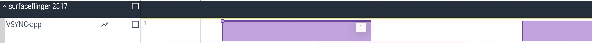

App 侧对应的观测点是 `FrameDisplayEventReceiver.onVsync` slice；**判断 App 是否真的收到 Vsync，要看 App 进程里有没有 onVsync 事件，而不是只看 SF 里的 vsync-app counter**——那个 counter 可能因其他 App 的申请而活跃。

### 申请与接收的完整链路

从触发重绘到执行 doFrame 的调用链：

`View.invalidate()` → `ViewRootImpl.scheduleTraversals()` → `Choreographer.postCallback` → `scheduleFrameLocked` → `scheduleVsyncLocked` → `DisplayEventReceiver.scheduleVsync` → `nativeScheduleVsync` → SurfaceFlinger EventThread 派发 → BitTube → `DisplayEventDispatcher::dispatchVsync`（JNI）→ `FrameDisplayEventReceiver.onVsync`（Java）→ 异步消息入队 → `doFrame`

onVsync 不直接执行 doFrame，而是 post 异步消息到主线程消息队列，用 `sendMessageAtTime` 精确对齐执行时刻，与其他高优先级任务统一调度：

```java
@Override
public void onVsync(long timestampNanos, long physicalDisplayId, int frame,
        VsyncEventData vsyncEventData) {
    mTimestampNanos = timestampNanos;
    mFrame = frame;
    mLastVsyncEventData.copyFrom(vsyncEventData);
    // 异步消息：不受同步屏障影响，按时戳对齐执行
    Message msg = Message.obtain(mHandler, this);
    msg.setAsynchronous(true);
    mHandler.sendMessageAtTime(msg, timestampNanos / TimeUtils.NANOS_PER_MS);
}
@Override
public void run() {
    mHavePendingVsync = false;
    doFrame(mTimestampNanos, mFrame, mLastVsyncEventData);
}
```

Native 侧的完整时序链：HWC 产生硬件 Vsync → SurfaceFlinger Scheduler 通过 `VSyncDispatch::schedule` 计算唤醒窗口（workDuration/readyDuration）→ EventThread 生成事件写入 BitTube → App 侧 DisplayEventDispatcher 收到 → Java 回调 → doFrame。

### 几个常见疑问

**主线程忙时 Vsync 会丢吗？** 单次 scheduleVsync 只请求一次事件；主线程长期繁忙时会跳过多个硬件节拍。且 AOSP 的 DisplayEventDispatcher::processPendingEvents 会用后到的 vsync 覆盖先到的，只保留最近一次分发。是否产生用户可见的卡顿，要结合 FrameTimeline 判断，不能只看「跳了一次」。

**超一个 Vsync 周期就一定掉帧吗？** 不一定。三缓冲机制下 App 端与 SF 端都有 Buffer 冗余，单帧超时可以被后续帧掩盖；但如果之前没有 Buffer 堆积，超时就会直接表现为掉帧。

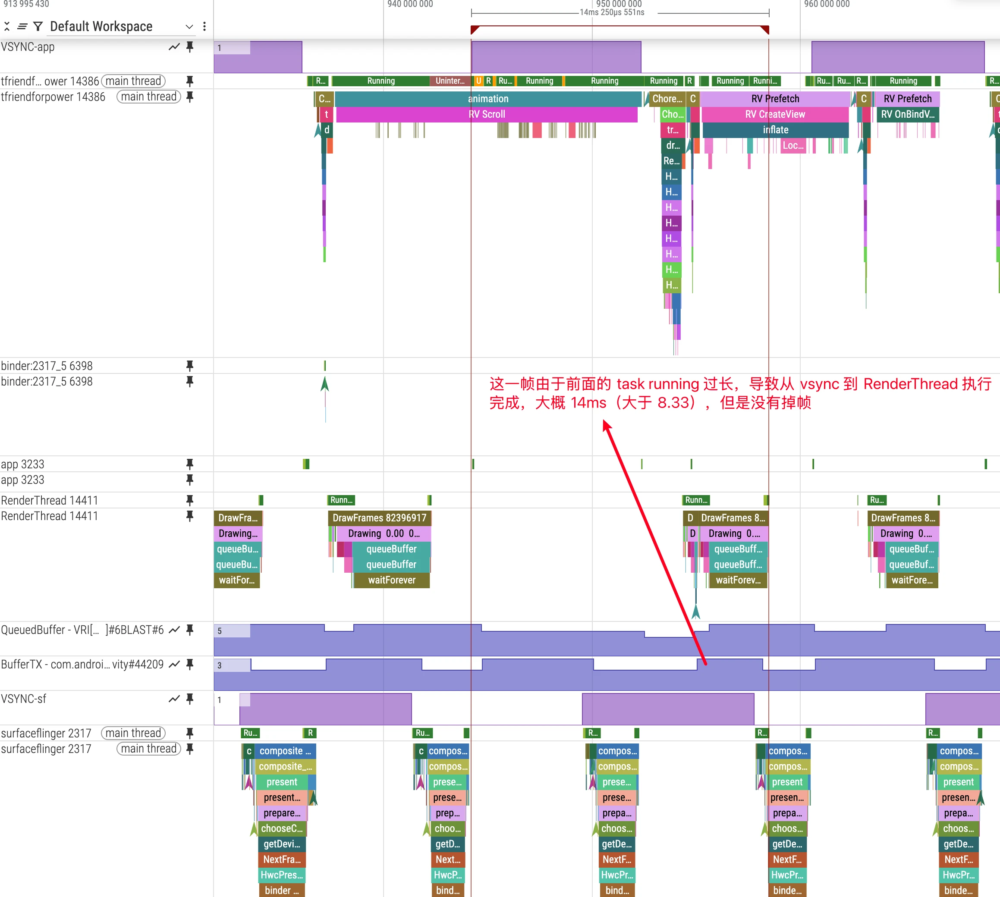

**CPU 与 GPU 怎么协同？** GPU 渲染异步流水，即使主线程按时完成，GPU 耗时过长仍会掉帧。关键同步点：acquire fence 表示 Buffer 何时可安全读取，present fence 表示该帧何时真正送显；配合上一节的 Latch Unsignaled 策略，SF 可在特定条件下先推进再等 fence。

**相位差（Offset）的真正作用？** 一是提升跟手性：调整 sf 相位可让「开始绘制到上屏」从 3 个 Vsync 缩到 2 个；二是绘制超时时为 App 争取更多处理时间。

## Vsync Offset 与 WorkDuration

配置入口在 AOSP main 上是 `VsyncConfiguration` 抽象接口，按场景返回 VsyncConfigSet；旧的 PhaseOffsets 属于旧路径，**WorkDuration** 是新路径的常见实现——workDuration/readyDuration 表示调度时的「工作预算」与「就绪提前量」，用于计算回调唤醒时刻。app/sf offset 仍是常用分析口径，但本质是配置集合与调度模型共同作用的结果。

Offset 的效果以 120Hz（8.33ms 周期）为例：

| 方案 | 时序 | 端到端延迟 |
|---|---|---|
| 无 Offset | App 与 SF 同时被唤醒，App 用 3ms 画完后要等到下一个 Vsync SF 才合成 | 约 16.67ms |
| 有 Offset | App 提前 1ms 收到 vsync-app，3ms 画完；SF 在 4ms 收到 vsync-sf 立即合成 | 约 8.33ms |

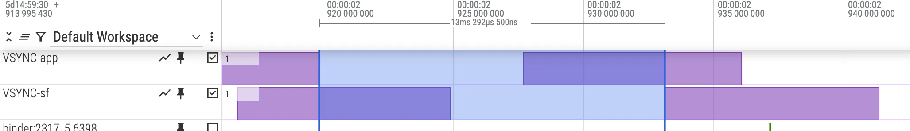

注意上图中的 app offset 已达 13.3ms——**不同厂商机型配置差异极大，workDuration 口径下甚至能超过一个 Vsync 周期，不要拿别的机器的数值直接对比**。

掉帧的真正原因按端归类：应用端连续超时耗尽 Buffer（AppDeadlineMissed）、GPU 渲染超时、SurfaceFlinger 合成超时（影响所有应用）、系统资源竞争（CPU/GPU/内存被抢）。

## FrameTimeline：卡顿分析的抓手

FrameTimeline 是 Perfetto 相比 Systrace 的核心优势，为每个有帧上屏的进程添加两条轨道（需要 Android 12+）：

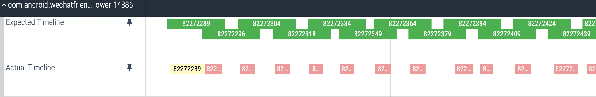

- **Expected Timeline**：系统分配给应用的渲染时间窗口，起点是 Choreographer 回调被调度的时间
- **Actual Timeline**：应用实际完成一帧的时间（含 GPU 工作），终点是 max（GPU 时间，提交到 SurfaceFlinger 的 post 时间）

两者的差异直接暴露卡顿帧，配合颜色编码定位责任方：

| 颜色 | 含义 |
|---|---|
| 绿色 | 正常帧 |
| 浅绿色 | 高延迟：帧率稳定但呈现延迟，输入延迟增加 |
| 红色 | 当前进程导致的卡顿 |
| 黄色 | 应用无责任卡顿（SurfaceFlinger 导致） |
| 蓝色 | 丢帧：SF 丢弃该帧选择了更新的帧 |

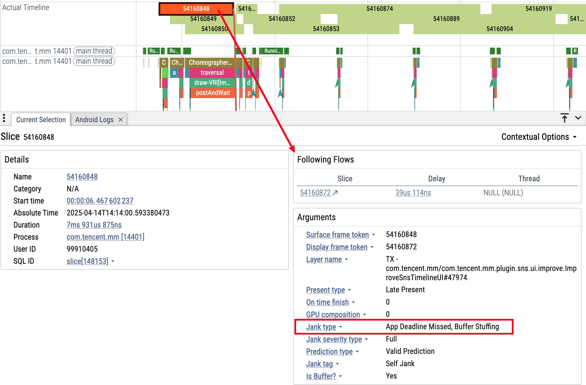

JankType 分两端：应用端 AppDeadlineMissed（超时）、BufferStuffing（前一帧未呈现就发新帧，Buffer 堆积）；SF 端 SurfaceFlingerCpuDeadlineMissed、SurfaceFlingerGpuDeadlineMissed、DisplayHAL（HAL 层呈现延迟）、PredictionError（预测偏差）。

启用需要在抓取配置中加：

```protobuf
data_sources {
  config {
    name: "android.surfaceflinger.frametimeline"
  }
}
```

判读纪律：**先看 PresentType（呈现方式）再看 JankType（责任方），仅凭 doFrame 时长判断掉帧不可靠**——多缓冲会掩盖单帧超时，要结合连续帧与 Buffer 可用性。钻取路径：对齐 Expected/Actual → doFrame → RenderThread → queueBuffer → fence。

## Perfetto 实战 Checklist

按序检查渲染类问题：

1. vsync-app/vsync-sf 间隔是否稳定（对照刷新率周期），有无异常密集或稀疏（预测抖动）
2. VsyncWorkDuration 是否符合该机型的 app/sf Offset 预期，先后关系是否匹配「先绘制后合成」
3. FrameTimeline：先 PresentType 再 JankType，确定 app 还是 SF/GPU 侧责任
4. doFrame 各阶段（Input/Animation/Traversal）耗时是否异常；RenderThread 的 syncAndDrawFrame/DrawFrame 是否异常
5. BufferQueue 与 fence：queueBuffer 后 SF 能否及时 latch（受 acquire fence 影响）；某 layer 的 BufferTX 为 0 表示无新 Buffer，画面停滞但 SF 并未停止合成
6. 合成策略：SF 是否频繁走 ClientComposition，HWC validate/present 是否异常；刷新率切换与 VRR 场景下 vsync 间隔是否伴随预测偏差
7. 资源干扰：大核 CPU 竞争、GPU 繁忙、GC/内存压缩抖动

## 厂商侧的常见优化思路

系统厂商可直接改源码，围绕这条链路的常见手段：把 Input 消息直接交给 Choreographer 以便提前响应不等 Vsync；限制后台应用无意义的 Animation 回调省 CPU；特定场景通知 SF 跳过等待 Vsync 直接合成；启动时重排 MessageQueue 让启动相关消息插前；利用帧间空闲把下一帧的 animation callback 前置执行；对基于 OverScroller 的滑动组件「插帧」（一个 Vsync 内执行两次 doFrame，提前备好后续帧，遇到耗时帧不卡顿）；以及 120Hz 下的高帧率策略（超级 App 优化、游戏合作、多档刷新率切换逻辑）。

## 120Hz 的收益与代价

收益侧：滑动、动画等交互更流畅；输入到显示延迟减半；触控采样率通常同步提高，操作更跟手；长时间观看的视觉疲劳感降低。

代价侧（实测数据）：

- 功耗：同机 120Hz 比 60Hz 约多耗电 15~20%
- 开发门槛：每帧预算从 16.67ms 压到 8.33ms，60Hz 时代勉强及格的代码可能直接卡顿（注意若配置了 App Duration 大于 8.33ms，UI + Render 在该区间内完成即可，各机型配置不同）
- 发热与降频：长时间高帧率游戏发热明显
- 适配缺口：不少应用未适配高刷，120Hz 屏幕上实际输出仍 60fps

方向上的共识是**按需高刷**而非全局拉满。苹果 ProMotion 按动画场景给出帧率推荐：高影响力动画（全屏转场、第一人称游戏）80~120Hz；透明度过渡与微小移动用系统默认；时钟指针等低速小动画 8~48Hz；其余默认。Android 侧对应能力是 LTPO 硬件（1~120Hz 连续调频）+ 内容感知算法（静态内容降到 10~30Hz、视频匹配源帧率、交互拉到 90~120Hz）+ 应用声明帧率的 API：

```java
// 应用声明首选帧率，系统尽可能满足
surface.setFrameRate(60.0f, Surface.FRAME_RATE_COMPATIBILITY_DEFAULT);
```

## 来源

- [Android Perfetto 系列 5：Android App 基于 Choreographer 的渲染流程](https://www.androidperformance.com/2025/03/26/Android-Perfetto-05-Chorergrapher/)
- [Android Perfetto 系列 6：为什么是 120Hz？高刷新率的优势与挑战](https://www.androidperformance.com/2025/04/26/Android-Perfetto-06-Why-120Hz/)
- [Android Perfetto 系列 7：MainThread 和 RenderThread 解读](https://www.androidperformance.com/2025/08/02/Android-Perfetto-07-MainThread-And-RenderThread/)
- [Android Perfetto 系列 8：深入理解 Vsync 机制与性能分析](https://www.androidperformance.com/2025/08/05/Android-Perfetto-08-Vsync/)
