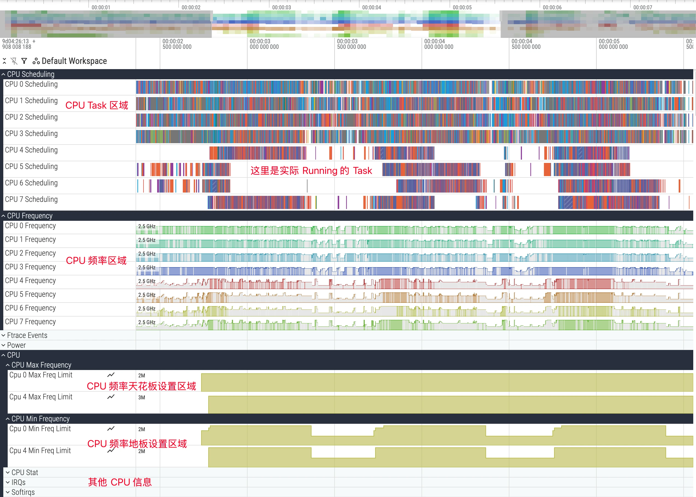
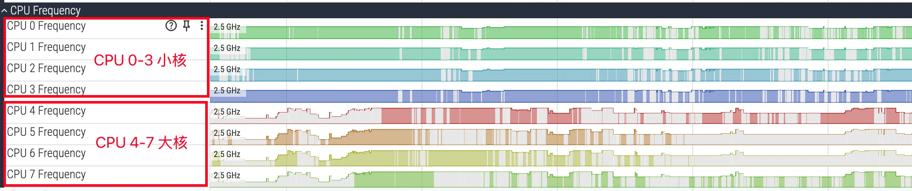
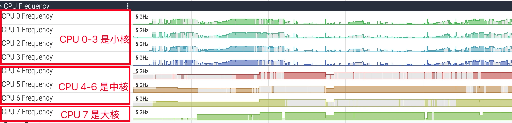
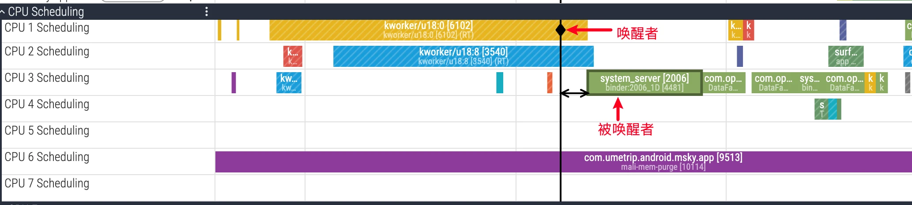
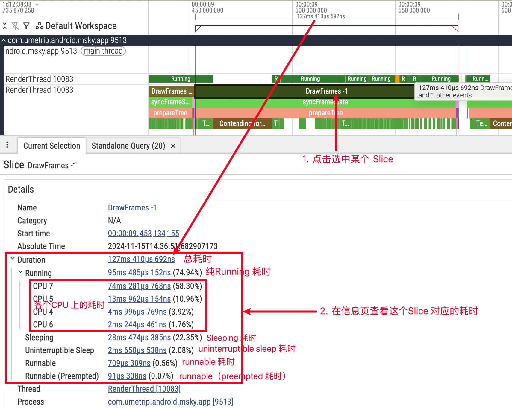
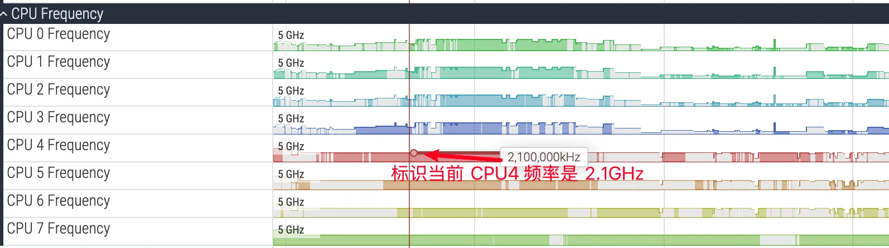

## 导读：CPU 信息回答什么问题

Perfetto 的 CPU 相关轨道位于界面顶部，是性能分析的起点，包含三部分：**CPU Scheduling**（每个核上正在运行哪个线程）、**CPU Frequency**（每个核或频率簇的频率变化）、**CPU Idle**（各核进入的低功耗状态，即 C-States）：



这三条轨道组合起来可以回答一批关键问题：应用主线程为什么没在执行、被谁抢占；某个任务为什么慢、是不是被调度到了小核；特定场景下 CPU 频率是否受限；应用在后台时 CPU 有没有有效进入深度睡眠。

## 抓取 CPU 信息所需的 Trace Config

配置不正确会导致频率轨道或唤醒事件丢失。通用 CPU 分析推荐：

```protobuf
data_sources {
  config {
    name: "linux.ftrace"
    ftrace_config {
      # 调度事件：线程状态与唤醒关系的来源
      ftrace_events: "sched/sched_switch"
      ftrace_events: "sched/sched_wakeup"
      ftrace_events: "sched/sched_wakeup_new"
      ftrace_events: "sched/sched_waking"
      ftrace_events: "sched/sched_blocked_reason"
      ftrace_events: "sched/sched_process_exit"
      ftrace_events: "sched/sched_process_free"
      # 任务生命周期
      ftrace_events: "task/task_newtask"
      ftrace_events: "task/task_rename"
      # 频率、idle 与休眠
      ftrace_events: "power/cpu_frequency"
      ftrace_events: "power/cpu_idle"
      ftrace_events: "power/suspend_resume"
      symbolize_ksyms: true
    }
  }
}
data_sources {
  config {
    name: "linux.process_stats"
    process_stats_config {
      scan_all_processes_on_start: true
    }
  }
}
data_sources {
  config {
    name: "linux.sys_stats"
    sys_stats_config {
      cpufreq_period_ms: 250   # 轮询采样频率，补齐事件驱动的空白
    }
  }
}
```

## 核心架构：big.LITTLE

现代移动 SoC 普遍采用 big.LITTLE 异构架构或其变种，典型拓扑有三种：4+4（四小核 + 四大核）、4+3+1（三超大核配置，见天玑 9500/9400 与骁龙高端系列）、5+2（8 Elite 阉割版；标准版为 6+2）。Perfetto 的 CPU 轨道从 0 编号，典型八核下 CPU 0-3 为小核、4-6 为大核、7 为超大核，具体以 CPU spec 或对应 sysfs 节点为准。





小核面向低功耗处理后台任务，大核面向交互与重负载，超大核应对最严苛的单核挑战。**识别核类型对分析很关键**：计算密集型任务长时间跑在小核上，耗时必然远超预期。分析时要把线程运行所在的核与其任务属性匹配，判断调度器行为是否符合预期。

## 线程状态深度解析

CPU Scheduling 轨道数据来自 ftrace 的 `sched/sched_switch` 事件，每个核一行，色块代表该时间片上运行的线程。点击切片可看到 cpu、end_state、priority、process/thread 等详情；展开进程还能看到每个线程的独立轨道。选中线程后，Current State 面板显示其状态演化（对应 thread_state 表）。四个状态的理解是性能分析的基石：

| 状态 | 含义 | UI 表现 | 关注点 |
|---|---|---|---|
| Running | 正在 CPU 上执行代码 | 绿色 | 唯一真正消耗 CPU 的状态 |
| R（Runnable） | 万事俱备，等调度器分配 CPU | 浅绿/白色 | 长时间 R 是 UI 卡顿的直接原因 |
| S（Sleep） | 可中断睡眠，等待事件 | — | 等锁、等 Binder、等 I/O、显式休眠 |
| D（Uninterruptible Sleep） | 不可中断睡眠，等硬件 I/O | 橙/红色 | 长时间 D 是严重瓶颈，UI 线程易 ANR |

**Running 的分析要点**：过长（尤其关键线程上）意味着密集计算；要结合摆核（是否在预期的性能核上）与频率（是否被温控降频）综合判断——大核 + 低频照样慢。

**Runnable 分三种前身**，对应不同的调度时机：

- Wake-up：最常见，等待的资源（锁、I/O、Binder 回复）就绪后从 S/D 被唤醒进入 R
- 用户抢占（User Preemption）：时间片用完或出现更高优先级任务，调度器在**从内核态返回用户态时**换下当前线程，底层 sched_switch 的 prev_state 标记为 R
- 内核抢占（Kernel Preemption）：更高优先级任务或中断在线程**正在内核态执行期间**强行打断，prev_state 标记为 R+，Perfetto 显示为 Runnable (Preempted)

大量 Runnable (Preempted) 通常意味着高优先级唤醒源频繁打断关键线程，或 CPU 已满载、低优先级 Task 被迫让出——如果你的关键 Task 总被抢占，优先级需要调整。

**Sleep 的常见等待原因**：锁竞争（Java 锁或 native futex）、Binder 同步调用返回、网络 socket 数据（epoll_wait）、显式休眠（Thread.sleep/Object.wait）。UI 线程睡眠过长同样引发性能问题；结合唤醒源与调用栈可以定位到具体代码。

**D 状态**发生在等硬件 I/O 完成期间，不能被信号中断（保护进程与设备交互的数据一致性）。常见原因：磁盘 I/O（频繁或单次大量读写）、内存压力引发的换页（本质是高频磁盘 I/O）、内核驱动缺陷。Current State 面板中若带 iowait 标记，明确表示在等 I/O，检查应用是否存在主线程 I/O 或可优化的 I/O 模式。

## 唤醒关系与调度延迟

线程间依赖是分析难点——一个线程长 Sleep，关键是找出它在「等谁」。在 CPU 区域点击选中一个 Running 状态的 Task，Perfetto 会自动画出从唤醒者到被唤醒者的依赖箭头并高亮唤醒源：



底层依赖内核的 sched_wakeup ftrace 事件：T1 释放资源（解锁、完成 Binder 调用）而 T2 正在等待时，内核把 T2 标记为 R 并记录这次唤醒，Perfetto 据此构建依赖链。典型链路如：UI 线程等 Binder → Binder 线程执行任务 → Binder 线程等另一把锁 → 持锁线程释放并唤醒它 → Binder 线程完成并唤醒 UI 线程，瓶颈点一目了然。

**唤醒不等于立刻运行**。线程被唤醒后只是「有资格」进入运行队列，之后要等：所有核都在忙时等空位（或当前线程优先级更高）；有空闲核时等负载均衡的迁移窗口。多数 Linux 调度器配置并非严格的 work-conserving——调度器有时宁可等当前核自然空闲也不愿跨核迁移（迁移有开销与功耗代价），这在 R 状态上形成可观测的排队延迟，属正常权衡而非异常。

两个配套细节：sched_waking 在线程被标记为 R 时就发出，sched_wakeup 与跨 CPU 唤醒相关（记录在源或目的 CPU 上），做延迟分析用 sched_waking 一般已足够。实操上，筛选目标线程 thread_state 中 state=R 的切片作为调度延迟的直接证据，同步对照同一核上的重负载线程与 IRQ/SoftIRQ 轨迹，验证是否存在时间重叠的抢占压制；若频繁以 R 排队且以 end_state=R+ 收尾，说明非自愿抢占严重，需评估优先级、放置与负载均衡策略。

## 用户态、内核态与「空火焰图」

Running 的绿色切片未必都是应用代码在忙。若线程陷入单个长系统调用（sys_read、sys_futex），用户态采样的火焰图可能几乎为空。判别方法是看线程的 sys_* 切片——注意前提是抓取时启用了 `raw_syscalls/sys_enter` 与 `raw_syscalls/sys_exit`（前文的 CPU Config 默认不含）。若某段 sched_slice 很长而火焰图没什么热点：有长 sys_* 切片则瓶颈多在 I/O 或同步原语，优先查 I/O 路径、锁粒度与访问模式；没有则回火焰图继续剖析用户态热点。

另一个实用口径是 **Wall 时间与 CPU 时间**：



- 关系：Wall = CPU + Runnable + Sleep
- 选中目标切片（如 Choreographer#doFrame）对比两者：Wall ≈ CPU 说明计算过重，用火焰图定位热点；Wall 远大于 CPU 说明在等调度或依赖，回去看 R/S/D 分布与唤醒关系

## CPU 频率：谁决定、谁限制

CPU Frequency 轨道显示每个核（或频率簇，Android 设备常以簇为单位同步变频）的当前频率。带颜色表示该核有 Task 在跑，不带颜色表示空闲：



频率由四类因素博弈决定，优先级从低到高：

| 因素 | 机制 |
|---|---|
| 任务负载 | schedutil governor 直接关联调度器，按线程 utilization 请求频率 |
| 场景策略 | Power HAL 传递场景（启动、游戏、触摸），抬高地板频 scaling_min_freq 或抬高天花板频 scaling_max_freq |
| 功耗限制 | 低电量、省电模式压低天花板频 |
| 温控 | 最高优先级。温度超阈值强制压低 scaling_max_freq，此时有负载频率也上不去 |

所以发现重任务跑着频率上不去时，**先看 scaling_max_freq 是否被压低**——瓶颈往往不在应用代码，而在温控或功耗策略。

采集方式有两条互补的路：事件驱动（power/cpu_frequency，变频时记录，多数 ARM SoC 可靠但很多 Intel 平台无数据）与轮询采样（linux.sys_stats 的 cpufreq_period_ms，定期读 cpuinfo_cur_freq，ARM/Intel 均可用，还能补齐「初始频率快照」）。已知坑：事件只在变化时产生，短 Trace 或稳定场景左侧可能空白；个别 UI 版本在没抓到 Idle 状态时不渲染频率轨道，但数据仍可 SQL 查到。

**同频不等于同效**：同为 2.0GHz，大核与小核的算力能耗并不等价。大核有更宽的乱序执行、更多执行端口、更大缓存与更激进预取，同频下 IPC（Instructions Per Cycle，每周期指令数）更高；簇级 DVFS（Dynamic Voltage and Frequency Scaling，动态电压频率调节）下不同簇的电压-频率-能量曲线不同，同频点无法横向类比每瓦性能；若热点受制于内存带宽或缓存命中率，拉小核频率收益有限；小核接近最高频时常进入能效陡降区。频率本质是离散的 P-States（性能状态），governor（schedutil）按任务利用率在状态间切换。因此「高频 + 小核 + 仍慢」应优先怀疑选核或访存瓶颈，而不是「频率不够」。

## ADPF / Performance Hint 怎么看

ADPF（Android Dynamic Performance Framework）常被误读成「App 要求系统提频」，更准确的理解是：App 或系统模块把一组关键线程、目标工作周期、上一轮实际耗时告诉系统，由底层决定是否调整调度、频率、uclamp 或厂商自有策略。核验顺序：

1. 先在 FrameTimeline 或 doFrame 附近确认问题帧，明确目标周期（16.6/11.1/8.3ms）
2. 看关键线程 thread_state：主要卡在 Runnable → hint 有机会改善调度延迟；主要卡在 Running 且 CPU 打满 → 回到热点函数
3. 看 Frequency 与迁核：hint 生效的常见表现是关键线程更早上性能核、频率地板抬高；厂商实现差异大，不能只凭 API 调用下结论
4. 温控已压低 scaling_max_freq 时，hint 绕不过硬件安全限制

它的价值在于解释「为什么线程明明不忙，下一帧突然变重却来不及提频」。

## CPU Profiling：什么时候才轮到火焰图

CPU 轨道回答「线程有没有拿到 CPU、在哪个核、什么频率」；CPU Profiling 回答下一层「Running 期间是哪些函数在耗时间」。所以火焰图不该是起点，固定分析顺序：

```text
问题窗口 → 目标线程 Wall/CPU/Runnable/Sleep 分布 → 确认 CPU time 占比高
        → perf samples / simpleperf flamegraph → 回时间轴确认热点覆盖感知窗口
```

线程大部分时间在 R 状态排队时，火焰图解释不了「为什么拿不到 CPU」；在 S/D 时应先查 Binder、锁、I/O。只有 Running 占比高，火焰图才是高收益工具。

| 采样方式 | 适用 | 注意 |
|---|---|---|
| Perfetto linux.perf | 系统 Trace 与采样一起抓，短窗口问题 | 采样有开销，窗口别太长 |
| simpleperf | App/native 热点分析，符号化流程成熟 | 需保留 perf.data、二进制与符号文件 |
| Gecko Profile JSON | 想用 Firefox Profiler 交互式查看 | 需从 simpleperf 转换 |

**采样频率要写进报告**：100Hz 下线程持续 Running 10 秒理论上也只有约 1000 个样本；只看 80ms 的掉帧窗口可能只有个位数样本——样本太少时结论应写成「采样证据不足」，而不是把 1 个样本当成「函数热点」。读火焰图分清两个口径：self time（函数自身消耗，不含子调用，高则看自身计算/循环/拷贝/系统调用）与 cumulative time（含子调用，高则沿调用栈向下找子函数），报告里注明用的是哪个。

符号化最容易掉坑：native 要保留未裁剪符号的 so 或 build id 对得上的符号文件；Java/Kotlin 注意 ART、混淆映射与版本差异。unknown 太多先修符号再谈优化：检查 build id → 收集 unstripped so/符号 → simpleperf binary_cache_builder.py -lib 指向符号目录 → 重新生成报告。CPU Profiling 的结论最好和 Wall/CPU 数据一起写：

```text
窗口：12.300s - 12.860s
线程：RenderThread
Wall：560ms   CPU：492ms   Runnable：18ms
结论：该窗口主要是 Running，适合看 CPU 热点
采样：100Hz，约 51 samples
Top cumulative：Skia raster path 34 samples
边界：样本数偏少，只能说明方向，不能做精细占比
```

## 内核调度策略：选核与迁移

Android 内核调度器主要是 EAS（Energy Aware Scheduling，能耗感知调度），两个核心行为：

**选核（Task Placement）**：线程被唤醒或新建时，调度器评估线程的 util（动态反映历史繁忙程度），遍历各核找 capacity（容量，大核远高于小核）能「装下」util 的候选，再用内核预置的能量模型选出让系统总功耗最低的一个。**EAS 的目标是「刚刚好够用 + 最省电」，不是选最快的核**。

**迁移（Task Migration）**：负载均衡——周期性检查，小核挤满高负载而大核空闲时，把任务「拉」到空闲核恢复平衡；唤醒时迁移——睡醒时 util 已变化（如后台线程突然收到大任务）或原核变忙，直接选一个更合适的新核。

据此可以判断调度是否「异常」：前台 UI 线程被长期限制在小核，或在大小核间频繁「反复横跳」，可能暗示调度策略或优先级设置有问题。另外各厂商对调度器做了大量客制化（Critical Task 优先上大核、绑核/签核策略，如 OPPO 蜂鸟引擎），不同设备现象会不一样。

## SQL 实战

五个常用 CPU 分析查询，可直接在 UI 的 Query 页运行。

各进程 CPU 总时长（排除 swapper/idle，否则它霸榜）：

```sql
SELECT
  process.name,
  sum(dur) / 1e9 AS total_cpu_time_s
FROM sched
JOIN thread ON sched.utid = thread.utid
JOIN process ON thread.upid = process.upid
WHERE sched.utid != 0
GROUP BY process.name
ORDER BY total_cpu_time_s DESC;
```

单个线程的状态分布（判断主要瓶颈在哪类等待）：

```sql
SELECT
  CASE state
    WHEN 'Running' THEN 'Running'
    WHEN 'R' THEN 'Runnable'
    WHEN 'S' THEN 'Interruptible Sleep'
    WHEN 'D' THEN 'Uninterruptible Sleep'
    ELSE state
  END AS human_state,
  sum(dur) / 1e6 AS total_time_ms
FROM thread_state
WHERE utid = (SELECT utid FROM thread WHERE name = 'surfaceflinger' LIMIT 1)
GROUP BY human_state
ORDER BY total_time_ms DESC;
```

特定时间段内最耗 CPU 的线程（示例为启动后 2~5 秒，时间戳单位纳秒）：

```sql
SELECT
  thread.name,
  sum(dur) / 1e9 AS cpu_time_s
FROM sched
JOIN thread ON sched.utid = thread.utid
WHERE sched.utid != 0
  AND ts > 2e9 AND ts < 5e9
GROUP BY thread.name
ORDER BY cpu_time_s DESC;
```

线程在各核上的运行分布（看亲和性与是否符合大小核预期）：

```sql
SELECT
  cpu,
  sum(dur) / 1e6 AS time_on_cpu_ms
FROM sched
WHERE utid = (SELECT utid FROM thread WHERE name = 'system_server' LIMIT 1)
GROUP BY cpu
ORDER BY cpu;
```

各进程 CPU 利用率（按核数归一化，全核跑满 = 100%；去掉归一化则可超过 100%，口径为「占满几个核」）：

```sql
SELECT
  process.name AS process_name,
  100 * sum(dur) / (CAST(TRACE_END() - TRACE_START() AS REAL)
    * (SELECT COUNT(DISTINCT cpu) FROM sched)) AS cpu_utilization_percent
FROM sched
JOIN thread ON thread.utid = sched.utid
JOIN process ON process.upid = thread.upid
WHERE sched.utid != 0
GROUP BY process.name
ORDER BY cpu_utilization_percent DESC;
```

## 来源

- [Android Perfetto 系列 9：CPU 信息解读](https://www.androidperformance.com/2025/11/12/Android-Perfetto-09-CPU/)
