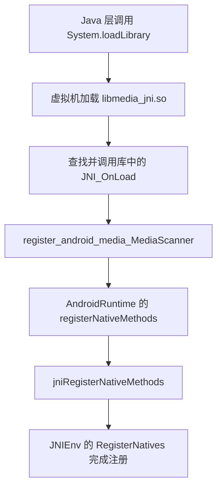
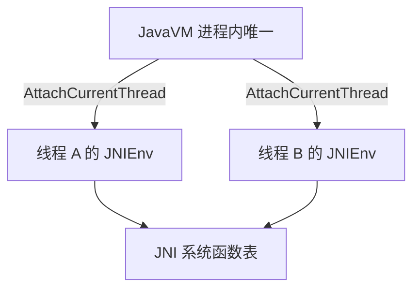

本篇对应原书第 2 章「深入理解 JNI」。原书基于 Android 2.2/2.3 源码，以多媒体系统中的 MediaScanner 为实例，从 Java 层加载 JNI 库、声明 native 函数开始，到 JNI 层的函数注册、数据类型映射、JNIEnv 的使用，再到引用管理与异常处理，把 Framework 中 JNI 的真实用法完整走了一遍。本章主线一句话：Java 层的 native 函数如何与 JNI 层的 C/C++ 函数建立关联，以及 JNI 层代码如何借助 JNIEnv 安全地操作 Java 对象。

> 版本注意：原书成书于 2011 年（Android 2.2/2.3，Dalvik 虚拟机），本章机制在 ART 时代主体仍适用，具体演进差异见文末演进备注。

> 摘编声明：文中代码为原书代码的摘编版——保留主干、省略日志与无关分支，类名、函数名忠于原书原文，未做概念化改写。

## 1.1 概述：JNI 的定位与本章分析对象

先回答「JNI 是什么、为什么需要它」。**JNI（Java Native Interface，Java 本地接口）** 是一套让 Java 与 Native 代码互相调用的技术，它支持两个方向：

- Java 程序中的函数可以调用 Native 语言（一般指 C/C++）编写的函数；
- Native 程序中的函数也可以反过来调用 Java 层的函数。

平台无关的 Java 为什么需要这样一个「破坏」平台无关性的技术？原书给了三方面理由：

1. 承载 Java 世界的虚拟机本身就是 Native 语言写的，运行在具体平台上，虚拟机自身无法做到平台无关。有了 JNI，就可以在 Java 层屏蔽不同操作系统之间的差异（例如同样是打开一个文件，Windows 上的 API 是 OpenFile，Linux 上的 API 是 open），Java 的平台无关特性反而因此得以实现——**Java 其实一直在使用 JNI，只是平时较少直接接触**。
2. Java 诞生前，大量程序已经用 Native 语言写成。通过 JNI 直接复用这些既有模块，避免重复实现同样的功能。
3. 一些对效率和速度有要求的场合，仍需要 Native 语言参与。

图 2-1 展示了 JNI 在 Android 平台中所处的位置：Java 世界与 Native 世界之间的桥梁。


原书说明：虽然 JNI 层代码是用 Native 语言写的，但书中把与 JNI 相关的模块单独归为一层，即 JNI 层。

### 1.1.1 分析实例：MediaScanner 与它的三层结构

本章不空谈 API，而是盯着源码里的一处真实实例——MediaScanner。它是 Android 多媒体系统的重要组成部分，功能是扫描媒体文件，提取歌曲时长、作者等媒体信息，存入媒体数据库供其他应用使用。它与 JNI 相关的部分如图 2-2 所示。


对照图 2-1 与图 2-2，可以得到三层对应关系：

| 层 | 对应模块 | 说明 |
|---|---|---|
| Java 世界 | `MediaScanner.java` | 类中部分函数需要由 Native 层实现 |
| JNI 层 | `libmedia_jni.so` | JNI 库；Android 基本都按「lib 模块名 _jni.so」方式命名，这里下划线前的 media 对应 Native 层的 libmedia 库，后缀 jni 表明它是 JNI 库 |
| Native 层 | `libmedia.so` | 完成实际功能 |

MediaScanner 通过 JNI 库 libmedia_jni.so 与 Native 层的 libmedia.so 交互。由此还有一个硬性要求：**JNI 层必须实现为动态库的形式**，这样 Java 虚拟机才能在运行时加载它并调用它的函数。

本章涉及的源码文件如下：

| 文件 | 位置 |
|---|---|
| MediaScanner.java | framework/base/media/java/src/android/media/MediaScanner.java |
| android_media_MediaScanner.cpp | framework/base/media/jni/MediaScanner.cpp |
| android_media_MediaPlayer.cpp | framework/base/media/jni/android_media_MediaPlayer.cpp |
| AndroidRunTime.cpp | framework/base/core/jni/AndroidRunTime.cpp |
| JNIHelp.c | dalvik/libnativehelper/JNIHelp.c |

本篇按原书小节顺序推进，结构总览如下：

| 原书小节 | 主题 | 本篇对应 |
|---|---|---|
| 2.1 / 2.2 | JNI 概述、MediaScanner 实例介绍 | 1.1 |
| 2.3 | Java 层分析：加载 JNI 库、native 函数 | 1.2 |
| 2.4.1 | 注册 JNI 函数（静态与动态） | 1.3 |
| 2.4.2 | 数据类型转换 | 1.4 |
| 2.4.3 | JNIEnv 介绍 | 1.5 |
| 2.4.4 | 通过 JNIEnv 操作 jobject | 1.6 |
| 2.4.5 | jstring 介绍 | 1.7 |
| 2.4.6 | JNI 类型签名 | 1.8 |
| 2.4.7 | 垃圾回收 | 1.9 |
| 2.4.8 | JNI 中的异常处理 | 1.10 |
| 2.5 | 本章小结 | 1.11 |

## 1.2 Java 层：加载 JNI 库与声明 native 函数

先看 Java 侧。Java 要调用 native 函数，必须通过一个位于 JNI 层的动态库来实现，所以 Java 层有两个关键动作：加载 JNI 库、声明 native 函数。原书把 MediaScanner.java 中与 JNI 有关的部分提取如下。

### 1.2.1 MediaScanner.java 中与 JNI 有关的部分

```java
// [--> MediaScanner.java]
public class MediaScanner
{
    static {
        /*
          加载对应的 JNI 库，media_jni 是 JNI 库的名字。在实际加载动态库的时候会将其拓展成
          libmedia_jni.so，在 Windows 平台上则拓展为 media_jni.dll
        */
        System.loadLibrary("media_jni");
        native_init(); // 调用 native_init 函数
    }
    ......
    // 非 native 函数，就是普通 Java 函数
    public void scanDirectories(String[] directories, String volumeName){
        ......
    }

    // 声明一个 native 函数。native 为 Java 的关键字，表示它将由 JNI 层完成。
    private static native final void native_init();
    ......
    private native void processFile(String path, String mimeType,
                                      MediaScannerClient client);
    ......
}
```

三个要点：static 语句块中加载库并立刻调用了一个 native 函数做初始化；scanDirectories 是普通 Java 函数，与 JNI 无关；native_init 与 processFile 用关键字 native 修饰，只声明不实现，实现由 JNI 层提供。

### 1.2.2 加载时机与 System.loadLibrary 的参数

什么时候、在哪里加载 JNI 库？原书的回答是：**没有标准答案，原则上是只要在调用 native 函数之前，任何时候、任何地方加载都可以**。通行的做法是在类的 static 语句块中调用 System.loadLibrary，上面的代码就是这么做的。

注意 System.loadLibrary 的参数是动态库的「逻辑名」（media_jni），系统会根据平台自动拓展成真实的动态库文件名：Linux 上拓展成 libmedia_jni.so，Windows 上拓展成 media_jni.dll。

Java 层的分析到此结束。对 Java 程序员来说，使用 JNI 只需两件事：

1. 加载对应的 JNI 库；
2. 声明由关键字 native 修饰的函数。

JNI 层要完成的工作远没有这么轻松，下面进入 JNI 层的分析。

## 1.3 JNI 层：JNI 函数的注册

MediaScanner（原书简称 MS）的 JNI 层代码在 android_media_MediaScanner.cpp 中，先看两个 native 函数的 JNI 层实现：

```cpp
// [--> android_media_MediaScanner.cpp]
// 这个函数是 native_init 的 JNI 层实现。
static void android_media_MediaScanner_native_init(JNIEnv *env)
{
    jclass clazz;

    clazz = env->FindClass("android/media/MediaScanner");
    ......
    fields.context = env->GetFieldID(clazz, "mNativeContext", "I");
    ......
    return;
}

// 这个函数是 processFile 的 JNI 层实现。
static void android_media_MediaScanner_processFile(JNIEnv *env, jobject thiz,
                                  jstring path, jstring mimeType, jobject client)
{
    MediaScanner *mp = (MediaScanner *)env->GetIntField(thiz, fields.context);
    ......
    const char *pathStr = env->GetStringUTFChars(path, NULL);
    ......
    const char *mimeTypeStr = env->GetStringUTFChars(mimeType, NULL);
    if (mimeType) {
        env->ReleaseStringUTFChars(mimeType, mimeTypeStr);
    }
}
```

看完最大的疑惑是：Java 层的 native_init 怎么知道自己对应的是 JNI 层的 android_media_MediaScanner_native_init？这就是 JNI 函数的注册问题。**「注册」之意就是将 Java 层的 native 函数和 JNI 层对应的实现函数关联起来**，有了这种关联，调用 Java 层的 native 函数时才能顺利转到 JNI 层执行。注册方法有两种：静态方法和动态注册。

### 1.3.1 静态注册：按命名规则由虚拟机查找

静态方法是网上 JNI 资料最常介绍的方式，**根据函数名来找对应的 JNI 函数**。它需要 Java 的工具程序 javah 参与，整体流程：

1. 先编写 Java 代码，编译生成 .class 文件；
2. 使用 javah，形如 `javah -o output packagename.classname`，生成一个 JNI 层头文件 output.h，其中声明了对应的 JNI 层函数，实现这些函数即可。

头文件一般按 packagename_class.h 的样式命名，MediaScanner 对应的就是 android_media_MediaScanner.h：

```c
// [--> android_media_MediaScanner.h，javah 生成的样例文件]
/* DO NOT EDIT THIS FILE - it is machine generated */
#include <jni.h>  // 必须包含这个头文件，否则编译通不过
/* Header for class android_media_MediaScanner */

#ifndef _Included_android_media_MediaScanner
#define _Included_android_media_MediaScanner
#ifdef __cplusplus
extern "C" {
#endif
...... // 略去一部分内容
// processFile 的 JNI 函数
JNIEXPORT void JNICALL Java_android_media_MediaScanner_processFile
                        (JNIEnv *, jobject, jstring, jstring, jobject);

...... // 略去一部分内容
// native_init 对应的 JNI 函数
JNIEXPORT void JNICALL Java_android_media_MediaScanner_native_1init
  (JNIEnv *, jclass);

#ifdef __cplusplus
}
#endif
#endif
```

命名规则有两层：

- native_init 的全路径名是 android.media.MediaScanner.native_init。由于「.」在 Native 语言中有特殊意义，JNI 层函数名要把 Java 函数名（含包名）中的「.」替换为「_」，得到 android_media_MediaScanner_native_init 这样的形式；
- Java 函数名中如果有一个「_」，转换后要变成「_1」，所以 native_init 对应的符号是 Java_android_media_MediaScanner_native_1init。

静态注册的运行机制很简单：当 Java 层首次调用 native_init 时，虚拟机会到对应的 JNI 库中寻找 Java_android_media_MediaScanner_native_1init 函数，找不到就报错；找到了，就为这个 native 函数和 JNI 函数建立关联关系——本质是**保存 JNI 层函数的函数指针**，以后再调用 native_init 时直接使用这个函数指针。

这种「按名字找函数」的方式有几个弊端：

1. 需要编译所有声明了 native 函数的 Java 类，每个 class 文件都得用 javah 生成一个头文件；
2. javah 生成的 JNI 层函数名特别长，书写起来很不方便；
3. 初次调用 native 函数时要根据函数名字搜索对应的 JNI 层函数来建立关联，影响运行效率。

### 1.3.2 动态注册：JNINativeMethod 与 RegisterNatives

既然 Java native 函数和 JNI 函数的关联本质是函数指针，那么换个思路：**直接把 JNI 层函数的函数指针交给虚拟机**，上面的弊端就都化解了。这就是动态注册法。

JNI 技术中用来记录一一对应关系的，是一个叫 JNINativeMethod 的结构：

```c
typedef struct {
    // Java 中 native 函数的名字，不用携带包的路径，例如 "native_init"。
    const char* name;
    // Java 函数的签名信息，用字符串表示，是参数类型和返回值类型的组合。
    const char* signature;
    void*       fnPtr;  // JNI 层对应函数的函数指针，注意它是 void* 类型。
} JNINativeMethod;
```

MediaScanner 的 JNI 层用这个结构组织了一张注册表，并提供注册函数：

```cpp
// [--> android_media_MediaScanner.cpp]
// 定义一个 JNINativeMethod 数组，其成员就是 MS 中所有 native 函数的一一对应关系。
static JNINativeMethod gMethods[] = {
    ......
    {
        "processFile",  // Java 中 native 函数的函数名
        // processFile 的签名信息，签名信息的知识在 1.8 节介绍
        "(Ljava/lang/String;Ljava/lang/String;Landroid/media/MediaScannerClient;)V",
        (void *)android_media_MediaScanner_processFile  // JNI 层对应的函数指针
    },
    ......

    {
        "native_init",
        "()V",
        (void *)android_media_MediaScanner_native_init
    },
    ......
};

// 注册 JNINativeMethod 数组
int register_android_media_MediaScanner(JNIEnv *env)
{
    // 调用 AndroidRuntime 的 registerNativeMethods 函数，第二个参数表明是 Java 中的哪个类
    return AndroidRuntime::registerNativeMethods(env,
                "android/media/MediaScanner", gMethods, NELEM(gMethods));
}
```

gMethods 数组集中保存了所有 native 函数的三元组（函数名、签名、函数指针）；NELEM 是计算数组元素个数的宏。注册时因为 JNINativeMethod 里只写函数名不写全路径，所以必须指明目标类是 android/media/MediaScanner。

接下来是一段层层封装的调用链。AndroidRuntime 提供了 registerNativeMethods 完成注册：

```cpp
// [--> AndroidRunTime.cpp]
int AndroidRuntime::registerNativeMethods(JNIEnv* env,
    const char* className, const JNINativeMethod* gMethods, int numMethods)
{
    // 调用 jniRegisterNativeMethods 函数完成注册
    return jniRegisterNativeMethods(env, className, gMethods, numMethods);
}
```

jniRegisterNativeMethods 是 Android 平台为了方便 JNI 使用而提供的帮助函数：

```c
// [--> JNIHelp.c]
int jniRegisterNativeMethods(JNIEnv* env, const char* className,
                              const JNINativeMethod* gMethods, int numMethods)
{
    jclass clazz;
    // env 指向一个 JNIEnv 结构体，它非常重要，1.5 节专门讨论。
    // className 为对应的 Java 类名，由于 JNINativeMethod 中使用的函数名并非
    // 全路径名，所以要指明是哪个类。
    clazz = (*env)->FindClass(env, className);
    ......
    // 实际上是调用 JNIEnv 的 RegisterNatives 函数完成注册的
    if ((*env)->RegisterNatives(env, clazz, gMethods, numMethods) < 0) {
        return -1;
    }
    return 0;
}
```

可以看到，`AndroidRuntime::registerNativeMethods` → `jniRegisterNativeMethods` 只是两层薄封装，最终落点都是 **JNIEnv 的 RegisterNatives 函数**——它把整张 gMethods 表交给虚拟机，注册就算完成。在自己的 JNI 层代码中照这个模式写，就能完成动态注册。

### 1.3.3 注册时机：JNI_OnLoad 函数

还剩一个关键问题：这些动态注册的函数在什么时候、什么地方被调用？答案不复杂：**当 Java 层通过 System.loadLibrary 加载完 JNI 动态库后，虚拟机会马上查找该库中一个叫 JNI_OnLoad 的函数，如果有就调用它，动态注册的工作就在这里完成**。

```cpp
// [--> android_media_MediaPlayer.cpp]
jint JNI_OnLoad(JavaVM* vm, void* reserved)
{
    // 第一个参数类型为 JavaVM，它是虚拟机在 JNI 层的代表，每个 Java 进程只有一个。
    JNIEnv* env = NULL;
    jint result = -1;

    if (vm->GetEnv((void**) &env, JNI_VERSION_1_4) != JNI_OK) {
        goto bail;
    }
    // 动态注册 MediaScanner 的 JNI 函数
    if (register_android_media_MediaScanner(env) < 0) {
        goto bail;
    }
    ......

    return JNI_VERSION_1_4;  // 必须返回这个值，否则会报错。

bail:
    return result;  // 摘编补全：任何一步失败都以 -1 返回，虚拟机会报告加载失败
}
```

两点说明：JNI_OnLoad 必须返回 JNI_VERSION_1_4；libmedia_jni.so 的 JNI_OnLoad 之所以实现在 android_media_MediaPlayer.cpp 中，是因为多媒体系统很多地方都用到了 JNI，注册代码统一放在了这个文件里。用流程图把动态注册的完整链路串起来：



静态注册没有「必须实现 JNI_OnLoad」的要求，但原书建议也实现它——一些初始化工作可以放在这里做。另外注意：**JNI 层代码一般要包含 jni.h 头文件**；Android 源码提供了帮助头文件 JNIHelp.h，它内部就包含了 jni.h，所以直接包含 JNIHelp.h 即可。

## 1.4 数据类型转换

注册解决了「找到函数」，下一个问题是「参数怎么传」：Java 中调用 native 函数传递的是 Java 数据类型，这些类型到了 JNI 层会变成什么？Java 数据类型分为基本数据类型和引用数据类型两种，JNI 层对二者区别对待。

先以 processFile 为例看参数的对应关系：

```java
// Java 层 processFile 有三个参数。
processFile(String path, String mimeType, MediaScannerClient client);
// JNI 层对应的函数，最后三个参数与 processFile 的参数对应。
android_media_MediaScanner_processFile(JNIEnv *env, jobject thiz,
                  jstring path, jstring mimeType, jobject client)
```

### 1.4.1 基本数据类型的映射

基本数据类型的转换很简单，原书表 2-1 如下：


转录成 Markdown 表（内容同表 2-1，即 jni.h 中的标准映射）：

| Java 数据类型 | JNI 数据类型 | 本地类型 | 描述 |
|---|---|---|---|
| boolean | jboolean | unsigned char | 无符号 8 位 |
| byte | jbyte | signed char | 有符号 8 位 |
| char | jchar | unsigned short | 无符号 16 位 |
| short | jshort | short | 有符号 16 位 |
| int | jint | int | 有符号 32 位 |
| long | jlong | long（int64_t） | 有符号 64 位 |
| float | jfloat | float | 32 位浮点 |
| double | jdouble | double | 64 位浮点 |

务必注意位宽的变化：**jchar 在 Native 语言中是 16 位、占两个字节，和普通 char 占一个字节完全不同**。

### 1.4.2 引用类型的映射与 JNI 函数的隐藏参数

引用数据类型的转换对应原书表 2-2：


转录成 Markdown 表（内容同表 2-2）：**除了数组、Class、String 和 Throwable 有专门的 JNI 类型外，其余所有 Java 引用类型转换后都用 jobject 表示**。

| Java 类型 | JNI 类型 |
|---|---|
| 所有对象（Object） | jobject |
| java.lang.Class | jclass |
| java.lang.String | jstring |
| java.lang.Throwable | jthrowable |
| 数组（引用与基本类型数组） | jarray 系（如 jobjectArray、jintArray 等） |

回到 processFile 的例子，原书对 JNI 函数的参数有如下解说：

```c
/*
  Java 中的 processFile 只有三个参数，为什么 JNI 层对应的函数会有五个参数呢？
  第一个参数 JNIEnv 是什么？（1.5 节介绍。）
  第二个参数 jobject 代表 Java 层的 MediaScanner 对象，表示是在哪个 MediaScanner
  对象上调用的 processFile。如果 Java 层是 static 函数，那么这个参数将是 jclass，
  表示是在调用哪个 Java Class 的静态函数。
*/
android_media_MediaScanner_processFile(JNIEnv *env,
                    jobject thiz,
                    jstring path, jstring mimeType, jobject client)
```

从这段代码可以看出：Java 的 String 对应 jstring；MediaScannerClient 这样的普通对象对应 jobject。jobject 对使用者来说就像 Native 层的 void*，是**完全不透明**的——既看不到内部结构，也没有成员函数可调。既然是透明的，该如何使用和操作它？这就引出了下面几节的主角：JNIEnv。

## 1.5 JNIEnv 与 JavaVM

jobject 透明不可直接操作，全部操作能力都由 JNIEnv 提供。本节先认识 JNIEnv 的内部结构，再处理它的一个重要限制：线程相关性。

### 1.5.1 JNIEnv 的内部结构

**JNIEnv 是一个与线程相关的、代表 JNI 环境的结构体**，图 2-3 是它的内部结构简图。


从图中可知，**JNIEnv 内部实际保存的是一张 JNI 系统函数表的指针**，通过这些函数可以：调用 Java 的函数；操作 jobject 对象等。后面几节的内容（FindClass、GetMethodID、CallVoidMethod、NewStringUTF……）全部来自这张函数表。

### 1.5.2 线程相关性：AttachCurrentThread 与 DetachCurrentThread

「与线程相关」意味着线程 A 有一个 JNIEnv，线程 B 有另一个 JNIEnv，**不能在线程 B 中使用线程 A 的 JNIEnv 结构体**。native 函数被调用时，JNIEnv 由虚拟机作为参数传进来，这种情况直接用当然不会错。但考虑另一个场景：后台线程收到一个网络消息后，需要由 Native 层函数主动回调 Java 层函数，此时 JNIEnv 从何而来？不能保存别的线程的 JNIEnv 拿来就用。

解决办法就藏在 JNI_OnLoad 的第一个参数里：

```c
// 全进程只有一个 JavaVM 对象，所以可以保存，并且在任何地方使用都没有问题。
jint JNI_OnLoad(JavaVM* vm, void* reserved)
```

**JavaVM 是虚拟机在 JNI 层的代表，不论进程中有多少个线程，JavaVM 独此一份**，可以在任何地方保存和使用它。JavaVM 与 JNIEnv 的关系是：

- 调用 JavaVM 的 AttachCurrentThread 函数，就可以得到当前线程的 JNIEnv 结构体，这样就能在后台线程中回调 Java 函数了；
- 后台线程退出前，需要调用 JavaVM 的 DetachCurrentThread 函数释放对应的资源。



## 1.6 通过 JNIEnv 操作 jobject

JNIEnv 到手，回到「怎么操作 jobject」。换个角度想：一个 Java 对象由什么组成？成员变量和成员函数。所以**操作 jobject 的本质就是操作它背后对象的成员变量和成员函数**。

### 1.6.1 jfieldID 与 jmethodID 的获取和缓存

成员变量和成员函数都是由类定义的，是类的属性。JNI 规则中用 **jfieldID 表示 Java 类的成员变量、jmethodID 表示成员函数**，通过 JNIEnv 的下面两个函数获取：

```c
jfieldID GetFieldID(jclass clazz, const char *name, const char *sig);
jmethodID GetMethodID(jclass clazz, const char *name, const char *sig);
```

第一个参数 jclass 代表 Java 类；name 是成员变量或成员函数的名字；sig 是签名信息（1.8 节展开）。MediaScanner 的 JNI 层在 MyMediaScannerClient 的构造函数中是这样用的：

```cpp
// [--> android_media_MediaScanner.cpp，MyMediaScannerClient 构造函数]
MyMediaScannerClient(JNIEnv *env, jobject client)
{
    // 先找到 android.media.MediaScannerClient 类在 JNI 层中对应的 jclass 实例。
    jclass mediaScannerClientInterface =
                env->FindClass("android/media/MediaScannerClient");
    // 取出 MediaScannerClient 类中函数 scanFile 的 jmethodID。
    mScanFileMethodID = env->GetMethodID(
                            mediaScannerClientInterface, "scanFile",
                            "(Ljava/lang/String;JJ)V");
    // 取出 MediaScannerClient 类中函数 handleStringTag 的 jmethodID。
    mHandleStringTagMethodID = env->GetMethodID(
                                mediaScannerClientInterface, "handleStringTag",
                                "(Ljava/lang/String;Ljava/lang/String;)V");
    ......
}
```

注意这里把 scanFile 和 handleStringTag 的 jmethodID 保存成了 MyMediaScannerClient 的成员变量。为什么？**如果每次操作 jobject 前都去查询 jmethodID 或 jfieldID，会影响程序运行效率，所以应在初始化的时候取出这些 ID 并保存起来供后续使用**。

### 1.6.2 调用 Java 对象的函数：`Call<type>Method` 系列

取出 jmethodID 后怎么用？看 MyMediaScannerClient 的 scanFile：

```cpp
// [--> android_media_MediaScanner.cpp，MyMediaScannerClient 的 scanFile]
virtual bool scanFile(const char* path, long long lastModified,
                      long long fileSize)
{
    jstring pathStr;
    if ((pathStr = mEnv->NewStringUTF(path)) == NULL) return false;
    /*
      调用 JNIEnv 的 CallVoidMethod 函数，注意 CallVoidMethod 的参数：
      第一个是代表 MediaScannerClient 的 jobject 对象，
      第二个参数是函数 scanFile 的 jmethodID，后面是 Java 中 scanFile 的参数。
    */
    mEnv->CallVoidMethod(mClient, mScanFileMethodID, pathStr,
                          lastModified, fileSize);
    mEnv->DeleteLocalRef(pathStr);
    return (!mEnv->ExceptionCheck());
}
```

把 jobject、jmethodID 和对应的参数传给 CallVoidMethod，JNI 层就完成了对 Java 对象函数的调用。实际上 JNIEnv 提供了一系列类似 CallVoidMethod 的函数，原型是：

```cpp
NativeType Call<type>Method(JNIEnv *env, jobject obj, jmethodID methodID, ...);
```

type 对应 Java 函数的返回值类型，例如 CallIntMethod、CallVoidMethod 等。上面是针对非 static 函数的；想调用 Java 中的 static 函数，用 JNIEnv 的 `CallStatic<Type>Method` 系列函数。

### 1.6.3 读写成员变量：`Get/Set<type>Field` 系列

操作成员变量的整体解决方案与调用函数对称：先用 GetFieldID 拿到 jfieldID，再调用 Get/Set 系列函数读写：

```cpp
// 获得 fieldID 后，可调用 Get<type>Field 系列函数获取 jobject 对应的成员变量的值。
NativeType Get<type>Field(JNIEnv *env, jobject obj, jfieldID fieldID);
// 或者调用 Set<type>Field 系列函数来设置 jobject 对应的成员变量的值。
void Set<type>Field(JNIEnv *env, jobject obj, jfieldID fieldID, NativeType value);
```

常用的 Get/Set 函数成对出现：GetObjectField 与 SetObjectField、GetBooleanField 与 SetBooleanField、GetByteField 与 SetByteField、GetCharField 与 SetCharField、GetShortField 与 SetShortField、GetIntField 与 SetIntField、GetLongField 与 SetLongField、GetFloatField 与 SetFloatField、GetDoubleField 与 SetDoubleField。

本章 1.3 节出现过的代码正是这套用法的一个完整闭环：native_init 里 `fields.context = env->GetFieldID(clazz, "mNativeContext", "I")` 把 MediaScanner 类中 mNativeContext 成员变量的 jfieldID 存入 fields 结构；processFile 里 `env->GetIntField(thiz, fields.context)` 读出该成员变量的值并强制转换为 MediaScanner 指针——**Java 对象用 int 成员变量保存 Native 层对象的地址，JNI 层通过 GetIntField 把它取回来**，这是 Java 对象持有 Native 对象的经典手法。

虽然 jobject 本身是透明的，但有了 JNIEnv 的帮助，还是能轻松操作 jobject 背后的实际对象。

## 1.7 jstring 的使用

成员变量和成员函数之外，还有一个高频引用类型要单独处理。Java 中的 String 也是引用类型，但由于使用频率太高，JNI 规范单独创建了 jstring 类型来表示它。

jstring 是独立的数据类型，但它并没有提供成员函数供操作——这一点和 C++ 的 string 类不同。所以操作 jstring 依然得依靠 JNIEnv，相关函数分两组：

**Native 字符串转 Java String（创建 jstring）：**

- `NewString(JNIEnv *env, const jchar *unicodeChars, jsize len)`：从 Native 的 Unicode 字符串得到一个 jstring 对象。可以把 jstring 看成 Java String 对象在 JNI 层的代表，而 Java String 内部存的是 Unicode 字符串，所以参数必须是 Unicode；
- `NewStringUTF`：根据 Native 的一个 UTF-8 字符串得到 jstring 对象，实际工作中这个函数用得最多。

**Java String 转 Native 字符串（内容拷贝）：**

- `GetStringChars`：得到一个 Unicode 字符串；
- `GetStringUTFChars`：得到一个 UTF-8 字符串。

注意配对释放：**如果调用了 GetStringChars / GetStringUTFChars，做完相关工作后必须调用 ReleaseStringChars / ReleaseStringUTFChars 释放资源，否则会导致 Java 虚拟机内存泄露**。这一点和 jstring 的内部实现有关，写代码时务必注意。看 processFile 是怎么做的：

```cpp
// [--> android_media_MediaScanner.cpp]
static void
android_media_MediaScanner_processFile(JNIEnv *env, jobject thiz, jstring path,
jstring mimeType, jobject client)
{
    MediaScanner *mp = (MediaScanner *)env->GetIntField(thiz, fields.context);
    ......
    // 调用 JNIEnv 的 GetStringUTFChars 得到本地字符串 pathStr
    const char *pathStr = env->GetStringUTFChars(path, NULL);
    ......
    // 使用完后，必须调用 ReleaseStringUTFChars 释放资源
    env->ReleaseStringUTFChars(path, pathStr);
    ......
}
```

## 1.8 JNI 类型签名

1.3.2 节的 gMethods 数组里还留了一个悬念：processFile 那串很长的签名信息 `(Ljava/lang/String;Ljava/lang/String;Landroid/media/MediaScannerClient;)V` 是什么意思？

它是 **Java 中对应函数的签名信息，由参数类型和返回值类型共同组成**。为什么需要签名？因为 Java 支持函数重载——可以定义同名但不同参数的函数，仅根据函数名没法定位到具体函数。JNI 就把参数类型和返回值类型的组合作为函数的签名信息，**有了签名信息和函数名，就能唯一定位 Java 中的函数**。签名的格式是：

```text
(参数1类型标识 参数2类型标识 ... 参数n类型标识)返回值类型标识
```

看 processFile 的例子：Java 中的函数定义为 `void processFile(String path, String mimeType, MediaScannerClient client)`，对应的 JNI 函数签名就是：

```text
(Ljava/lang/String;Ljava/lang/String;Landroid/media/MediaScannerClient;)V
```

括号内依次是参数类型的标识，最右边是返回值类型的标识，void 对应 V。当参数是引用类型时，格式是 `L包名;`，其中包名中的「.」换成「/」，例如 `Ljava/lang/String;` 表示一个 Java String 类型。常见的类型标识见原书表 2-3：


转录成 Markdown 表（内容同表 2-3）：

| 类型标识 | Java 类型 |
|---|---|
| Z | boolean |
| B | byte |
| C | char |
| S | short |
| I | int |
| J | long |
| F | float |
| D | double |
| V | void |
| `L` ＋ 全路径 ＋ `;` | 引用类型，如 `Ljava/lang/String;` |
| `[` ＋ 类型标识 | 数组，如 `[I` 表示 int[] |

两点注意：**如果 Java 类型是数组，标识中会有一个「[」；引用类型（基本类型的数组除外）的标识最后都有一个「`;`」**。再看原书表 2-4 的函数签名小例子：


函数签名不仅看起来别扭，写起来更容易错，稍微写错一个标点就会导致注册失败。两个实践建议：

- 具体编码时可以定义字符串宏来保存签名，改起来方便；
- Java 提供了 javap 工具帮助生成函数或变量的签名信息，用法 `javap -s -p xxx`，其中 xxx 为编译后的 class 文件，-s 表示输出内部数据类型的签名信息，-p 表示打印所有函数和成员的签名（默认只打印 public 成员和函数）。有了 javap，就不用死记硬背类型标识了。

## 1.9 垃圾回收：三种引用类型

Java 中创建的对象最终由垃圾回收（Garbage Collection，GC）器回收和释放内存，这给 JNI 层带来一个隐蔽的问题。先看一个反例，再引出 JNI 的三种引用。

### 1.9.1 直接保存 jobject 的问题

假设在 JNI 函数中直接把传入的 jobject 存起来备用：

```c
save_thiz = thiz; // 这种赋值不会增加 jobject 的引用计数。
```

这种做法肯定有问题：**JNI 函数返回后，save_thiz 对应的 Java 层 MediaScanner 对象很可能已经被垃圾回收，此时 save_thiz 保存的就是一个野指针，使用它后果严重**。有人会问：对引用类型执行赋值，引用计数不会增加吗？垃圾回收不是只清理没有被引用的对象吗？问题恰恰在于，JNI 层的这种赋值语句**不会增加引用计数**。

不用担心，JNI 规范已很好地解决了这个问题。JNI 一共提供了三种类型的引用：

- **局部引用（Local Reference）**：在 JNI 层函数中使用的非全局引用对象都是局部引用，包括函数调用时传入的 jobject 和在 JNI 层函数中创建的 jobject。它最大的特点是，一旦 JNI 层函数返回，这些 jobject 就可能被垃圾回收；
- **全局引用（Global Reference）**：这种引用如不主动释放，它对应的对象永远不会被垃圾回收；
- **弱全局引用（Weak Global Reference）**：一种特殊的全局引用，运行过程中对应的对象可能被垃圾回收，所以使用之前需要调用 JNIEnv 的 IsSameObject 判断它是否已被回收。

### 1.9.2 Global Reference 的使用

每当 JNI 层想要保存 Java 层中的某个对象时，就可以使用全局引用：用 NewGlobalRef 创建，用完记住用 DeleteGlobalRef 释放。MyMediaScannerClient 是标准范例：

```cpp
// [--> android_media_MediaScanner.cpp，MyMediaScannerClient 构造与析构函数]
MyMediaScannerClient(JNIEnv *env, jobject client)
    :   mEnv(env),
        // 调用 NewGlobalRef 创建一个 Global Reference，这样 mClient 就不用担心被回收了。
        mClient(env->NewGlobalRef(client)),
        mScanFileMethodID(0),
        mHandleStringTagMethodID(0),
        mSetMimeTypeMethodID(0)
{
    ......
}
// 析构函数
virtual ~MyMediaScannerClient()
{
    mEnv->DeleteGlobalRef(mClient);  // 调用 DeleteGlobalRef 释放这个全局引用。
}
```

构造函数中把 Java 层传入的 client 提升为全局引用保存进 mClient，析构函数中配对释放。**NewGlobalRef 与 DeleteGlobalRef 必须严格成对**，否则要么内存泄露，要么使用已被回收的引用。

### 1.9.3 Local Reference 的及时释放

再回到 1.6.2 节的 scanFile，这次重点看 DeleteLocalRef 那一行：

```cpp
// [--> android_media_MediaScanner.cpp，MyMediaScannerClient 的 scanFile]
virtual bool scanFile(const char* path, long long lastModified, long long fileSize)
{
    jstring pathStr;
    // 调用 NewStringUTF 创建一个 jstring 对象，它是 Local Reference 类型。
    if ((pathStr = mEnv->NewStringUTF(path)) == NULL) return false;
    // 调用 Java 的 scanFile 函数，把这个 jstring 传进去
    mEnv->CallVoidMethod(mClient, mScanFileMethodID, pathStr,
                          lastModified, fileSize);
    /*
      根据局部引用的说明，这个函数返回后，pathStr 对象就会被回收。所以下面这个
      DeleteLocalRef 调用看起来是多余的，其实不然，这里解释一下原因：
      1）如果不调用 DeleteLocalRef，pathStr 将在函数返回后被回收；
      2）如果调用 DeleteLocalRef，pathStr 会立即被回收。
      这两者看起来没什么区别，不过代码如果像下面这样，虚拟机的内存就会很快被耗尽：
      for (int i = 0; i < 100; i++)
      {
          jstring pathStr = mEnv->NewStringUTF(path);
          ......  // 做一些操作
          //mEnv->DeleteLocalRef(pathStr); // 不立即释放 Local Reference
      }
      如果上面代码的循环中未调用 DeleteLocalRef，则会创建 100 个 jstring，
      那么内存的耗费就非常可观了！
    */
    mEnv->DeleteLocalRef(pathStr);
    return (!mEnv->ExceptionCheck());
}
```

「函数返回后回收」与「立即回收」对单次调用没有区别，但在循环中差别巨大：循环里不断创建局部引用又不及时删除，这些引用会一直堆积到函数返回才释放。**没有及时回收局部引用，可能是进程占用内存过多的一个原因**，请务必注意这一点。

## 1.10 JNI 中的异常处理

最后一件事：出错怎么办。JNI 中也有异常，但它和 C++、Java 的异常机制不太一样：

- 如果调用 JNIEnv 的某些函数出错了，会产生一个异常，但**这个异常不会中断本地函数的执行**，直到从 JNI 层返回到 Java 层后，虚拟机才会抛出这个异常；
- 虽然异常不中断本地函数的运行，但**一旦产生异常，本地代码就只能做资源清理工作了**（例如释放全局引用、调用 ReleaseStringChars 等）。此时如果再调用清理之外的 JNIEnv 函数，会导致程序死掉。

所以 JNI 层函数一旦发现调用失败，要立即返回。看 scanFile 的开头：

```cpp
// [--> android_media_MediaScanner.cpp，MyMediaScannerClient 的 scanFile]
virtual bool scanFile(const char* path, long long lastModified,
                    long long fileSize)
{
    jstring pathStr;
    // NewStringUTF 调用失败后，直接返回，不能再干别的事情了。
    if ((pathStr = mEnv->NewStringUTF(path)) == NULL) return false;
    ......
}
```

NewStringUTF 失败（返回 NULL）时直接 return false，不做任何其他 JNIEnv 调用。JNI 层函数也可以主动截获和修改异常，JNIEnv 提供了三个函数：

- **ExceptionOccurred**：用来判断是否发生异常；
- **ExceptionClear**：用来清理当前 JNI 层中发生的异常；
- **ThrowNew**：用来向 Java 层抛出异常。

异常处理是 JNI 层代码必须关注的事情，编写代码时务必小心对待。

## 1.11 本章小结

本章通过 MediaScanner 这一个实例介绍了 JNI 技术的几个重要方面：

1. JNI 函数的两种注册方法（静态注册与动态注册）；
2. Java 和 JNI 层数据类型的转换；
3. JNIEnv 和 jstring 的使用方法，以及 JNI 中的类型签名；
4. 垃圾回收在 JNI 层中的使用（三种引用类型）；
5. 异常处理。

原书留了一个练习：结合 1.8 节的表 2-3 和表 2-4 左栏的签名信息，写出各自对应的 Java 函数。原书还建议读者认真阅读 JDK 文档中的《Java Native Interface Specification》，它完整细致地阐述了 JNI 技术的各个方面，是深入学习 JNI 的权威指南。

## 1.12 演进备注

本节可跳过，不影响主线。原书成书时（2011，Android 2.2/2.3）的主角虚拟机是 Dalvik，现在的主角则是 ART（Android Runtime）。两个时代的 JNI 生态对比如下：

| 维度 | 原书时代（Dalvik / 2.3） | 现在（ART / Android 15+） |
|---|---|---|
| 虚拟机 | Dalvik，JIT 为主 | ART：AOT（Ahead-Of-Time）与 JIT（Just-In-Time）混合编译，boot image 跨进程共享 |
| 注册方式 | 静态与动态，Framework 用 RegisterNatives | 不变，系统服务几乎仍全部动态注册 |
| 调用开销 | 每次 JNI 进入有固定开销 | 仍非零；新增 @FastNative / @CriticalNative 快路径 |
| 检查 | 无系统级检查 | debug 构建启用 CheckJNI，自动校验签名与引用误用 |
| Native 库加载 | 任意路径可加载，可偷链系统私有库 | Android 7.0 起 classloader namespace 限定链接范围 |
| 对象生命周期 | 手写 finalize 加 native 释放 | NativeAllocationRegistry 关联 GC 自动释放 |
| 跨语言方案 | 手写 JNI | AIDL Stable 生成多语言绑定、Rust 直接写系统服务 |

四项最值得记住的演进：

- **@FastNative 与 @CriticalNative**：ART 为热路径 native 方法提供的注解。@FastNative（Android 7.0）跳过部分 JNI 状态切换；@CriticalNative（Android 8.1）更激进，要求方法只有基本类型参数、不使用 JNIEnv 和 jobject，开销接近直接 C 调用。符合约束的高频小函数值得加。
- **CheckJNI 与调试**：打开 CheckJNI（debug 构建或 `android:debuggable`）后，ART 会校验签名匹配、局部引用泄漏、跨线程使用 JNIEnv 等，原书时代靠人眼盯的坑变成启动即崩的显式错误。
- **NativeAllocationRegistry 取代 finalize 模式**：本章 1.6.3 节「Java 对象存 Native 指针 + finalize 释放」的模式有 finalize 时机不确定等缺陷。现代替代是 libnativehelper 的 NativeAllocationRegistry：把 Native 内存地址与析构函数注册到与 Java 对象绑定的回收器上，GC 回收 Java 对象时异步释放 Native 内存，Framework 的 Bitmap、Parcel 等早已迁移。
- **加载与链接的收紧**：namespace（Android 7.0）限定应用 so 只能链接 NDK（Native Development Kit）公共库与自身 APK（Android Package）内的库，偷链系统私有符号直接失败；16 KB 页大小（Android 15）要求 so 的 LOAD 段按 16 KB 对齐，否则加载失败。

应用层的音视频、加密、游戏引擎仍离不开 JNI（Java 壳加 Native 芯依旧是常态），本章的注册方法、回调手法、引用管理与异常规则在 ART 时代依然是日常。

一句收束：JNI 的全部要点可以压成「Java 层两件事（加载库、声明 native），JNI 层四件事（注册对应关系、转类型、用 JNIEnv 操作对象、管好引用与异常）」——MediaScanner 把这六件事全都演示了一遍。
