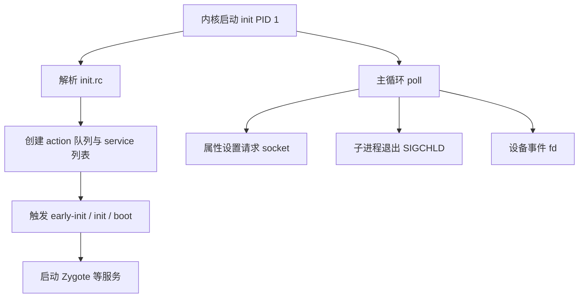
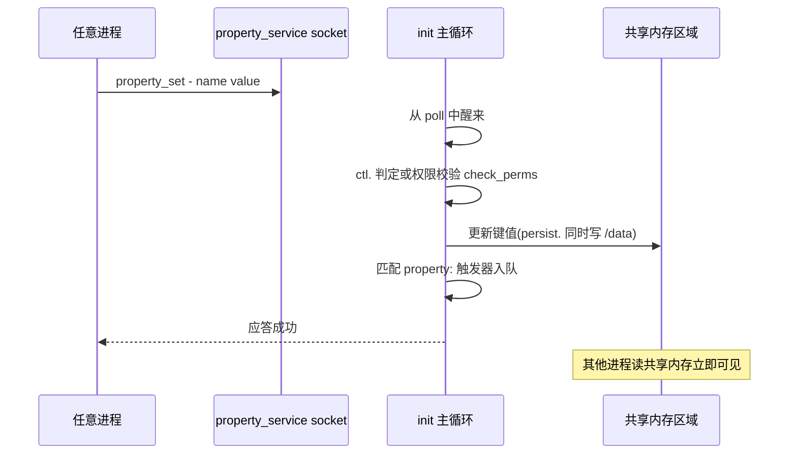

本篇对应原书第 3 章。init 是 Linux 内核启动后用户空间的第一个进程(PID 1),Android 世界里所有进程都是它的直接或间接子孙。原书基于 Android 2.2/2.3 源码,对本章的分析思路是:先通读 init.rc 语言,再逐段精读 init.cpp 的 main 函数,最后深挖属性服务与信号处理两条支线。文中代码为概念化改写,并在末尾对现代 Android 的演进做比对展开。

## 2.1 init 的职责总览

init 只做三件事,但每件都是系统级基础设施:

1. **解析并执行 init.rc**:按配置挂载分区、设置环境、启动服务(包括 Zygote)
2. **托管服务进程**:fork 子进程运行各 service,监听 SIGCHLD,负责收尸与按策略重启
3. **提供属性服务(Property Service)**:全局键值对的唯一写入方



init 的一切能力都围绕这个**事件驱动的单线程主循环**展开:外部事件(属性请求、子进程退出、设备节点变化)进入队列,循环消化并触发对应 action。

## 2.2 init.rc 语言详解

init.rc 是用 Android Init Language 写的声明式脚本,四种基本元素:

### Action 与 Trigger

```rc
# on <trigger>: 满足触发条件时,顺序执行下面的 commands
on boot
    mkdir /data/misc 01771 media media     # 创建目录
    chmod 0551 /proc/insp                   # (示意)修改权限
    class_start default                     # 启动 default 类的所有服务
```

触发器三类:

- **队列触发器**:`early-init`、`init`、`early-boot`、`boot`,由 init 自己在启动各阶段依次触发
- **设备触发器**:`device-added-/dev/xxx`、`device-removed-/dev/xxx`
- **属性触发器**:`on property:ro.encryptable=true`,某个属性被赋值成目标值时触发——属性因此成为 init 世界里"跨进程发事件"的手段(如框架通过设置 `sys.boot_completed` 告诉 init 开机完成)

启动各阶段的顺序与含义(贯穿全部分析的时间轴):

| 触发器 | 时机 | 典型动作 |
|---|---|---|
| early-init | 主循环就绪后第一件事 | 创建/O 型权限目录、设置 SELinux 上下文 |
| init | 基础环境就绪 | 挂载 Data 分区、启动属性服务、设置 ro. 属性 |
| early-boot / boot | 关键服务启动后 | class_start 各类服务、启动 Zygote |
| 属性触发器 | 运行期任意时刻 | 按 `property:xxx=yyy` 响应框架侧变化 |

### Service

```rc
# service <名字> <可执行文件> [参数...]
service zygote /system/bin/app_process -Xzygote /system bin --zygote
    socket zygote stream 666      # init 为它创建 /dev/socket/zygote
    onrestart restart media       # 该服务重启时连带执行的动作
    class main                    # 属于 main 类,可批量启停

service console /system/bin/sh
    console                       # 绑定到控制终端
    disabled                      # 不随 class 启动,等 ctl.start 手动拉起
```

常用 options:`user`/`group`(以指定 uid/gid 运行)、`oneshot`(跑完不重启)、`critical`(反复崩溃则重启整个设备)、`disabled`、`ioprio`、`seclabel`(现代版)。

### Command 与 Import

command 是 action 与 onrestart 里的具体指令(`mkdir`/`mount`/`start`/`write`/`copy`/`exec`……);`import /init.hardware.rc` 引入其他文件拼成完整配置。

## 2.3 init 的 main 函数精读

`system/core/init/init.c` 的 main(概念化,保留原书脉络):

```c
int main(int argc, char **argv) {
    /* 一、基础环境:挂载虚拟文件系统 */
    mount("tmpfs", "/dev", "tmpfs", MS_NOSUID, "mode=0755");
    mkdir("/dev/pts", 0755);  mkdir("/dev/socket", 0755);
    mount("proc", "/proc", "proc", 0, NULL);
    open_devnull_stdio();           // 标准输入输出重定向
    /* 二、解析 rc 文件 */
    init_parse_config_file("/init.rc");
    /* 三、把硬件相关 rc 也解析进来(原书通过设备名拼接) */
    /* 四、属性初始化 */
    property_init();
    /* 五、三大 fd 事件源 */
    device_init();      // 创建 /dev/.coldboot_done 相关逻辑,监听设备事件
    property_set_fd = start_property_service();
    signal_fd = ...;    // SIGCHLD/SIGTERM 经 signalfd 转成可读事件
    /* 六、触发启动阶段链 */
    action_for_each_trigger("early-init", ...);
    /* 七、主循环 */
    for (;;) {
        execute_one_command();              // 执行 action 队列
        restart_processes();                // 重启需要重启的服务
        nr = poll(ufds, fd_count, timeout); // 等事件:属性/信号/设备
        if (ufds[1].revents & POLLIN) handle_property_set_fd(...);
        if (ufds[2].revents & POLLIN) handle_signal_fd(...);   // 子进程退出
        if (ufds[0].revents & POLLIN) handle_device_fd(...);
    }
}
```

精读要点:

- **单线程**:init 绝不 fork 处理请求,一个请求处理完才 poll 下一个,天然免锁;因此 command 里不允许长时间阻塞(慢操作用 `exec` 起子进程做)
- **服务启动路径**:命令队列执行到 `start zygote` → `service_start` 做 fork 前准备(创建 socket、设置 uid/gid、写 `init.svc.zygote=starting`)→ fork → 子进程 `execv` 载入目标程序 → 父进程登记 pid、置 `running`
- **服务重启**:`restart_processes` 检查 `SV_RST` 标记的服务重新拉起;`oneshot` 除外

## 2.4 SIGCHLD:服务退出的善后

init 是所有服务进程的父亲,子进程退出时内核发 SIGCHLD,init 在 `handle_signal_fd` 中 reap 并做两件事:

1. 从 pid 反查是哪个 service,把状态写成 `init.svc.<name>=restarting/stopped`(框架与 shell 可通过属性观察服务状态)
2. 若服务声明了 `onrestart`,把联动命令重新入队

关键服务(如 `critical`)异常退出达到阈值时,init 会选择重启整个系统(reboot)——"init 重启一切"是 Android 故障自愈的底座。

## 2.5 属性服务(Property Service)深挖

属性是全系统共享的键值对,分三个角色:

- **存储**:`__system_property_area__`——一块只读共享内存,由 init 创建并 mmap;所有进程启动时由 linker/`__libc_init` 映射同一块区域
- **读**:任何进程直接读共享内存,**不走 IPC**,纳秒级
- **写**:唯一入口是 init 的 `/dev/socket/property_service`(UNIX domain socket),由 init 校验后写入

一次属性写入的完整时序:



```c
// init 侧(概念化,保留原书判断逻辑)
void handle_property_set_fd(int fd) {
    // 从 socket 读出 name 与 value
    ...
    if (strncmp(name, "ctl.", 4) == 0) {
        // ctl.start / ctl.stop / ctl.restart:控制服务的特殊属性
        if (check_control_perms(msg, source_uid)) {
            if (!strcmp(name, "ctl.start")) service_start(...);
            ...
        }
    } else {
        // 普通属性:白名单/uid 校验后写入共享内存
        if (check_perms(name, source_uid)) property_set(name, value);
    }
}
```

规则细节:

- **`ro.` 前缀**:read-only,首次设置后永久只读
- **`persist.` 前缀**:写入时同时持久化到 `/data/property/persistent_properties`,下次开机由 init 早期回放——所以"恢复出厂设置"清 /data 也会清掉它们
- **`ctl.` 前缀**:不是存储而是命令,`ctl.start media` 直接驱动服务启停(需 system/root 权限)
- **权限模型**(原书时代):按 uid 白名单表 `property_perms` 判断谁能写哪类前缀;`net.` 开头任何 app 都可写(那个年代的宽松点)

属性触发器 + ctl 属性组合,让 init 与框架之间形成一条"框架也能反过来驱动 init"的通道——这是原书指出的精巧设计。

## 2.6 ueventd:设备节点的创建者

init 自己不做 mknod,而是 fork 出 **ueventd** 处理内核 uevent:读取 `/sys/class/.../uevent`,按 `ueventd.rc` 里的规则(设备名 → 权限/属主)创建 `/dev` 下的节点。init 与 ueventd 共享 rc 解析器,冷战启动(coldboot)阶段会主动向 sysfs 写 "add" 扫描存量设备。

## 2.7 新技术更新(比对展开)

原书时代与现代 init 的整体对比:

| 维度 | 原书时代(Android 2.3) | 现在(Android 11~15+) |
|---|---|---|
| 启动阶段 | 单阶段,init 直接跑在真根上 | 两阶段:first_stage_init 挂 early 分区后 exec 第二阶段 |
| rc 文件组织 | 单一 init.rc + 硬件 rc,全在根目录 | 各模块自带 rc,装入 /system/etc/init、/vendor/etc/init、/APEX 等,init 汇总 import |
| HAL 服务 | 直接由 init 启动,与 Framework 同域 | Treble 后 vendor HAL 独立域,hwbinder/vndbinder 分域 |
| 属性权限 | uid 白名单表 | SELinux property_contexts 精确到键前缀 |
| ueventd | 独立进程 | 与 init 合并为同一可执行文件(Android 10),参数区分角色 |
| 事件循环 | 手写 select/poll + 数组 | epoll + 类化重构(ActionManager/ServiceTracker),模型未变 |
| 加密与挂载 | 无 FDE | first stage 即处理 dm-linear/APEX/FBE 密钥;metadata 加密 |
| 动态分区 | 无 | super 分区 + Virtual A/B,init 早期与 snapshotd/update_engine 协作 |

分项展开:

### 2.7.1 两阶段启动与 first_stage_init

现代 init 先以 `first_stage_init` 身份在 ramdisk 中运行:挂载 `/system`、`/vendor` 等早期分区(含 dynamic partition 的 dm-linear 映射)、加载 APEX,然后 `exec` 自己进入第二阶段——即本篇分析的"解析 rc + 主循环"部分。好处是 system 分区可以验证(verity)后再切换,init 主体运行在已校验的环境里。

### 2.7.2 rc 的模块化与 APEX

Android 8.0 起,rc 不再集中维护:每个守护进程/APEX 把自己的 rc 安装到 `/system/etc/init/` 或 `/apex/<name>/etc/init/`,init 启动时统一 import。新增一个系统服务的配置从"改全局文件"变成"随模块交付",这是 Mainline 化的基础设施之一。APEX 甚至能声明自己的服务与 `apex.dead` 类触发器。

### 2.7.3 属性服务的强化

- **property_contexts**:每条属性前缀绑定 SELinux 安全上下文,写权限由 SELinux 策略而非 uid 表决定;`ctl.` 命令同样受 `set_ctl` 权限管控
- **多属性区域**:分区化属性(`ro.product.*` 各分区各一份)、`vendor.` 与 `odm.` 前缀避免 vendor 依赖 system 属性
- **API 收口**:NDK 的 `__system_property_set` 仍是唯一写路径;`persist.` 属性改存 protobuf 文件,回放更早以支持 FBE
- **ctl 之外的联动**:服务死亡通知演进为 ServiceManager 的 lazy/on-demand 服务与 SELinux 域恢复策略,init 不再是唯一的自愈执行者

### 2.7.4 服务重启策略的演进

原书时代的 `critical` 策略保留至今,但分化出更精细的机制:框架层有 Rescue Party(逐级升级的自愈策略,最终才恢复出厂)、HAL 服务可声明按需启动,由 servicemanager 在客户端请求时拉起。init 仍是最终兜底者,但"要不要重启"的决策部分上移给了 ServiceManager 与框架。

### 2.7.5 对读源码的影响

现代 init 源码(`system/core/init/`)已重构成 C++ 类:`ActionManager`、`ServiceList`、`BuiltinFunction`、`PropertyService` 各自独立文件,单元测试齐全;分析入口依旧是 `init.cpp` 的 main,但主循环隐藏在 `Init(main)` 与 `SecondStageMain` 中。原书"单文件通读"的路径变成了"按类分文件"的路径,思想模型完全一致。
