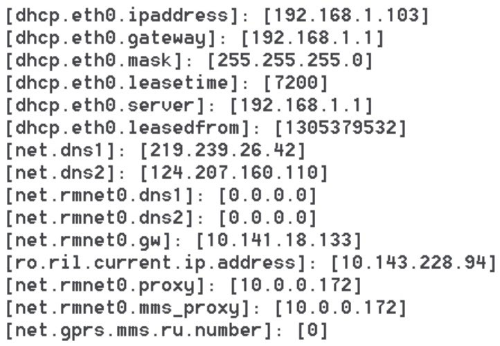
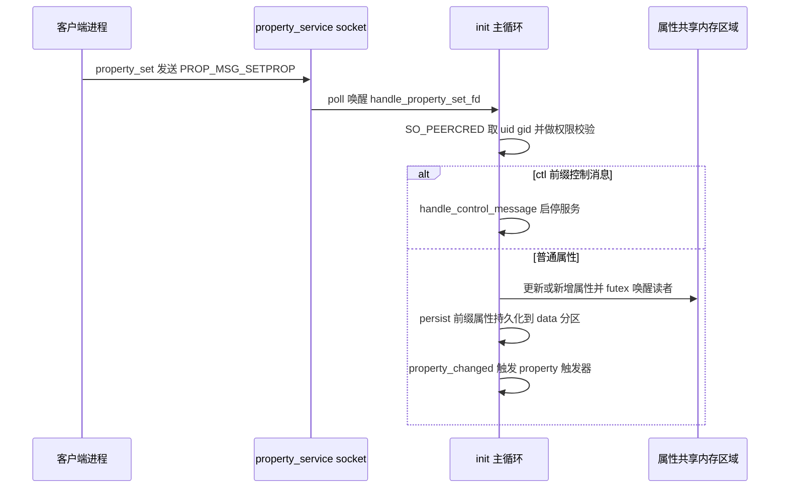

本篇对应原书第 3 章「深入理解 init」。init 是 Linux 内核启动后用户空间的第一个进程，进程号（Process Identifier，PID）为 1，Android 世界里所有进程都是它的直接或间接子孙。原书基于 Android 2.2/2.3 源码，把本章的问题收敛为两条：init 如何按 init.rc 的配置创建 zygote 等关键进程；init 提供的属性服务（Property Service）如何工作。本章主线一句话：解析 init.rc 得到 action 与 service 两张表，按四个阶段依次执行 action，用 fork 加 execve 拉起 service，随后进入一个围绕 poll 的无限循环，处理子进程退出、设备事件与属性设置请求三类事件。

> 版本注意：原书成书于 2011 年（Android 2.2/2.3），init 主体机制延续至今，但配置语言与具体实现已多轮演进，差异见文末演进备注。

> 摘编声明：文中代码为原书代码的摘编版——保留主干、省略日志与无关分支，类名、函数名忠于原书原文。

## 1.1 init 的职责与 main 流程总览

作为用户空间的第一个进程，init 承担着多项重要职责，原书挑出其中两个来分析：一是**创建系统中的几个关键进程，尤其是 zygote——Java 世界的开创者**；二是**提供属性服务，统一管理 Android 系统的大量属性**。本章源码集中在 system/core/init/（init.c、parser.c、builtins.c、keywords.h、property_service.c）与 system/core/rootdir/init.rc，属性客户端链路另涉及 bionic/libc/bionic/ 的 libc_init_dynamic.c 与 libc_init_common.c，以及 system/core/libcutils/properties.c。

init 的入口是 init.c 的 main 函数。原书给代码后用一个值得学习的办法：**先把工作流程精简成几条主线，再逐条深入**（这也是全书后续分析代码的惯用手法）。摘编如下，注释保留原书对机制的说明（挂载文件系统、重定向标准输入输出、加载 initlogo.rle 开机画面等 Linux 准备步骤从略）：

```c
[--> init.c::main，摘编]
int main(int argc, char **argv)
{
    int device_fd = -1;
    int property_set_fd = -1;
    int signal_recv_fd = -1;
    int keychord_fd = -1;
    int fd_count, s[2];
    struct sigaction act;
    char tmp[PROP_VALUE_MAX];
    struct pollfd ufds[4];

    // 设置子进程退出的信号处理函数 sigchld_handler
    act.sa_handler = sigchld_handler;
    act.sa_flags = SA_NOCLDSTOP;
    sigaction(SIGCHLD, &act, 0);

    ...... // 挂载设备、重定向标准输入/输出等，与 Linux 相关，不展开

    // 解析 init.rc，再解析与机器相关的配置文件
    // （读 /proc/cpuinfo 取硬件名，HTC G7 对应 init.bravo.rc）
    parse_config_file("/init.rc");
    get_hardware_name();
    snprintf(tmp, sizeof(tmp), "/init.%s.rc", hardware);
    parse_config_file(tmp);

    // init 把动作执行划分为 early-init、init、early-boot、boot 四个阶段，
    // 哪些动作属于哪个阶段由配置文件决定。下面执行 early-init 阶段的 Action
    action_for_each_trigger("early-init", action_add_queue_tail);
    drain_action_queue();

    device_fd = device_init();     // 创建利用 Uevent 与内核交互的 socket
    property_init();               // 初始化和属性相关的资源
    keychord_fd = open_keychord(); // 初始化 /dev/keychord，与调试有关
    ......
    action_for_each_trigger("init", action_add_queue_tail); // 执行 init 阶段动作
    drain_action_queue();
    property_set_fd = start_property_service(); // 启动属性服务
    // socketpair 创建两个已经 connect 好的 socket，用处马上就能看到
    if (socketpair(AF_UNIX, SOCK_STREAM, 0, s) == 0) {
        signal_fd = s[0];
        signal_recv_fd = s[1];
    }

    action_for_each_trigger("early-boot", action_add_queue_tail);
    action_for_each_trigger("boot", action_add_queue_tail); // 执行 boot 阶段动作
    drain_action_queue();

    // init 关注来自四个方面的事情
    ufds[0].fd = device_fd;       // 监听来自内核的 Uevent 事件
    ufds[0].events = POLLIN;
    ufds[1].fd = property_set_fd; // 监听来自属性服务器的请求
    ufds[1].events = POLLIN;
    ufds[2].fd = signal_recv_fd;  // 事件来自 socketpair 的另一个 socket
    ufds[2].events = POLLIN;
    fd_count = 3;
    if (keychord_fd > 0) { // keychord 初始化成功则也纳入监听
        ufds[3].fd = keychord_fd;
        ufds[3].events = POLLIN;
        fd_count++;
    }

    for (;;) {
        // 从此 init 进入无限循环
        int nr, i, timeout = -1;
        for (i = 0; i < fd_count; i++)
            ufds[i].revents = 0;
        drain_action_queue(); // 在循环中执行动作
        restart_processes();  // 重启那些已经死去的进程
        nr = poll(ufds, fd_count, timeout); // 等待一些事情的发生
        // 有一个子进程去世，init 要处理这个事情
        if (ufds[2].revents == POLLIN) {
            read(signal_recv_fd, tmp, sizeof(tmp));
            while (!wait_for_one_process(0))
                ;
            continue;
        }
        if (ufds[0].revents == POLLIN)
            handle_device_fd(device_fd);             // 处理 Uevent 事件
        if (ufds[1].revents == POLLIN)
            handle_property_set_fd(property_set_fd); // 处理属性服务的事件
        if (ufds[3].revents == POLLIN)
            handle_keychord(keychord_fd);            // 处理 keychord 事件
    }
    return 0;
}
```

原书把 main 的工作精简为四点：**解析两个配置文件**（init.rc 与硬件 rc，本篇分析前者）；**执行各阶段的动作**（创建 zygote 的工作就在其中某个阶段完成）；**初始化并启动属性服务**；**进入无限循环等待事件**（重点是子进程退出 signal_recv_fd 与属性设置请求 property_set_fd 两类事件的处理）。后面几节沿这条链走：1.2 看配置文件怎么被解析成内存中的 action 与 service；1.3 看 service 的组织方式；1.4 看 init 如何启动、善后并重启 service；1.5 看属性服务的完整链路。

## 1.2 解析配置文件：init.rc 的语言与解析器

两个配置文件走同一个解析入口：parse_config_file 用 read_file 把文件读进内存，再交给 parse_config 做真正的解析。本节先看解析器骨架，再看它依赖的关键字表，最后回到 init.rc 看这种配置语言长什么样。

### 1.2.1 parse_config：按 section 切换解析函数

```c
[--> parser.c]
static void parse_config(const char *fn, char *s)
{
    struct parse_state state;
    char *args[SVC_MAXARGS];
    int nargs;

    nargs = 0;
    state.filename = fn;
    state.line = 1;
    state.ptr = s;
    state.nexttoken = 0;
    state.parse_line = parse_line_no_op; // 不同的内容用不同的解析函数
    for (;;) {
        switch (next_token(&state)) {
        case T_EOF:
            state.parse_line(&state, 0, 0);
            return;
        case T_NEWLINE:
            if (nargs) {
                int kw = lookup_keyword(args[0]); // 得到关键字的类型
                if (kw_is(kw, SECTION)) { // 是不是 SECTION
                    state.parse_line(&state, 0, 0);
                    parse_new_section(&state, kw, nargs, args); // 解析这个 SECTION
                } else {
                    state.parse_line(&state, nargs, args);
                }
                nargs = 0;
            }
            break;
        case T_TEXT:
            ......
            break;
        }
    }
}
```

parse_config 用 next_token 逐行扫描，攒够一行参数后先 lookup_keyword 查出第一个词的关键字类型，**若是 SECTION（节）就调 parse_new_section 换一套解析函数；否则交给当前挂载的 parse_line 逐行处理**。解析器是「按 section 切换状态」的：进入 service section 后，后续每一行的含义就由该 section 的解析函数决定。那么什么样的关键字算 section？答案在 keywords.h 里。

### 1.2.2 keywords.h 的两次包含

keywords.h 定义了 init 使用的全部关键字，写法很巧：被 parser.c 包含了两次，两次展开出完全不同的东西。先看头文件本身：

```c
[--> keywords.h]
#ifndef KEYWORD // 如果没有定义 KEYWORD 宏，则走下面的分支
// 声明一些函数，这些函数就是 Action 的执行函数
int do_class_start(int nargs, char **args);
int do_class_stop(int nargs, char **args);
int do_restart(int nargs, char **args);
#define __MAKE_KEYWORD_ENUM__
// 定义 KEYWORD 宏，这里只用第一个参数：K_##symbol 中的 ## 表示连接，
// 得到的值为 K_symbol。symbol 其实就是 init.rc 中的关键字
#define KEYWORD(symbol, flags, nargs, func) K_##symbol,
enum { // 这个枚举定义了各个关键字的枚举值
    K_UNKNOWN,
#endif
    // 根据 KEYWORD 的定义，这里将得到一个枚举值 K_class
    KEYWORD(class,       OPTION,   0, 0)
    KEYWORD(class_start, COMMAND, 1, do_class_start) // K_class_start
    KEYWORD(on,          SECTION,  0, 0)             // K_on
    KEYWORD(oneshot,     OPTION,   0, 0)
    KEYWORD(onrestart,   OPTION,   0, 0)
    KEYWORD(service,     SECTION,  0, 0)
    KEYWORD(socket,      OPTION,   0, 0)
    KEYWORD(start,       COMMAND, 1, do_start)
    ......
#ifdef __MAKE_KEYWORD_ENUM__
    KEYWORD_COUNT,
};
#undef __MAKE_KEYWORD_ENUM__
#undef KEYWORD // 取消 KEYWORD 宏的定义
#endif
```

再看 parser.c 里怎么用它。第一次包含时得到枚举；随后重定义 KEYWORD 宏，第二次包含时同一批关键字行展开成数组初始化项：

```c
[--> parser.c]
// 第一次包含 keywords.h，得到一个枚举定义
#include "keywords.h"
// 重新定义 KEYWORD 宏，四个参数全用上。
// 其中 #symbol 表示一个字符串，其值为 "symbol"
#define KEYWORD(symbol, flags, nargs, func) \
    [ K_##symbol ] = { #symbol, func, nargs + 1, flags, },

// keyword_info 数组，用来描述关键字的属性
struct {
    const char *name;                    // 关键字的名称
    int (*func)(int nargs, char **args); // 对应关键字的处理函数
    unsigned char nargs;                 // 参数个数，每个关键字的参数个数固定
    // 关键字的属性有三种：COMMAND、OPTION 和 SECTION，其中 COMMAND 有处理函数
    unsigned char flags;
} keyword_info[KEYWORD_COUNT] = {
    [ K_UNKNOWN ] = { "unknown", 0, 0, 0 },
    // 第二次包含 keywords.h，以前那些作为枚举值的关键字
    // 现在变成 keyword_info 数组的索引了
    #include "keywords.h"
};
#undef KEYWORD

// 辅助宏，快速操作 keyword_info 中的内容
#define kw_is(kw, type) (keyword_info[kw].flags & (type))
#define kw_func(kw) (keyword_info[kw].func)
```

这就是原书所说的「神奇之处」，keywords.h 干了两件事：

- 第一次包含：声明 do_class_start 这类执行函数，并定义枚举 K_class、K_mkdir、K_service 等；
- 第二次包含：以枚举值为下标，得到 keyword_info 数组，每项存关键字名称、处理函数、参数个数与 flags。

**flags 有三种：COMMAND（可执行命令，有 do_ 开头的处理函数）、OPTION（service 内的选项）、SECTION（节的标识）**。根据定义，只有 on 和 service 两个关键字是 SECTION，于是 lookup_keyword 加 kw_is 就足以完成语法分流，不需要真正的文法解析器。

### 1.2.3 init.rc 的内容：on 节与 service 节

有了上面的知识，init.rc 的内容就好懂了（注释符号是 #，此处为原书节选；on init 节里是一串设置环境变量的 export 类 COMMAND，从略）：

```ini
[--> init.rc，节选]
on boot    # 这是一个新的 section，名为 "boot"
    ifup lo     # 这是一个 COMMAND
    hostname localhost
    domainname localdomain
    # class_start 也是一个 COMMAND，对应函数为 do_class_start，很重要，切记
    class_start default
    # 下面这个 section 的意思是：待属性 persist.service.adb.enable 的值
    # 变为 1 后，需要执行对应的 COMMAND，这个 COMMAND 是 start adbd
    on property:persist.service.adb.enable=1
        start adbd   # start 是一个 COMMAND
    on property:persist.service.adb.enable=0
        stop adbd
# service 也是 section 的标示，对应 section 的名为 "zygote"
service zygote /system/bin/app_process -Xzygote /system/bin -zygote \
    --start-system-server
    socket zygote stream 666  # socket 关键字表示 OPTION
    # 下面的 onrestart 是 OPTION，而 write 和 restart 是 COMMAND
    onrestart write /sys/android_power/request_state wake
    onrestart write /sys/power/state on
    onrestart restart media
# 一个 service（同时也是一个 section），名为 "media"
service media /system/bin/mediaserver
    user media
    group system audio camera graphics inet net_bt net_bt_admin net_raw
    ioprio rt 4
```

从节选可以读出 init.rc 的组织规则：

- **一个 section 的内容从标识 section 的关键字（on 或 service）开始，到下一个 section 开始的地方结束**；
- init.rc 中名为 boot 和 init 的 section，正对应 main 里四个执行阶段中的 init 和 boot——**boot 阶段执行的动作就是由 boot 这个 section 定义的**；
- `on property:xxx=yyy` 是**属性触发器**：某个属性被赋值为目标值时，这个 section 里的 command 才会被执行。属性因此不只是全局配置，还是驱动 init 行为的事件源；
- zygote 被放在一个 service section 中，启动参数、socket、重启时要执行的命令都写在这个 section 里。

zygote 是全书的重点，下一节以它的 section 为例，看 service 怎么被解析成内存结构。

## 1.3 解析 service：从配置到内存结构

解析 section 的入口是 parse_new_section，它按关键字把活儿分派下去。本节先看分派逻辑，再看 service 在内存中的两个核心结构体，最后看填充结构体的解析函数。

### 1.3.1 parse_new_section 的分派

```c
[--> parser.c]
void parse_new_section(struct parse_state *state, int kw,
                        int nargs, char **args)
{
    switch (kw) {
    case K_service: // 用 parse_service 和 parse_line_service 解析 service
        state->context = parse_service(state, nargs, args);
        if (state->context) {
            state->parse_line = parse_line_service;
            return;
        }
        break;
    case K_on: // 解析 on section
        ...... // 读者可以自己研究
        break;
    }
    state->parse_line = parse_line_no_op;
}
```

逻辑很清晰：遇到 service 节，先由 parse_service 处理首行（建架子），再把 state 的 parse_line 换成 parse_line_service 处理后续各行（填内容）——正呼应 1.2.1 里「按 section 切换解析函数」的设计。

### 1.3.2 service 结构体与 action 结构体

init 用一个 service 结构体保存 service section 解析后的全部信息（uid、gid 一族与 keychord、ioprio 等字段从略）：

```c
[--> init.h::service 结构体定义]
struct service {
    // listnode 把结构体链接成双向链表。init 有一个全局的 service_list，
    // 保存解析配置文件后得到的所有 service
    struct listnode slist;
    const char *name;      // service 的名字，本例就是 "zygote"
    const char *classname; // 所属 class 的名字，默认是 "default"
    unsigned flags;        // service 的属性
    pid_t pid;             // 进程号
    time_t time_started;   // 上一次启动的时间
    time_t time_crashed;   // 上一次死亡的时间
    int nr_crashed;        // 死亡次数
    // socketinfo 描述 socket 信息。zygote 配置为 socket zygote stream 666，
    // 即创建名为 "zygote"、stream 类型、读写权限 666 的 socket
    struct socketinfo *sockets;
    struct svcenvinfo *envvars; // 创建进程时所需的环境变量
    // onrestart 是 OPTION，后面一般跟着 COMMAND，
    // 这个 action 结构体用来存储这些 command 信息
    struct action onrestart;
    int nargs;     // 参数个数
    char *args[1]; // 用于存储参数
};
```

zygote 那三行 onrestart 靠 service 里内嵌的 action 结构体表示（原书定义见 init.h）：

```c
[--> init.h::action 结构体定义]
struct action {
    // alist 存储所有的 action，qlist 链接等待执行的 action，
    // tlist 链接待某些条件满足后才执行的 action
    struct listnode alist;
    struct listnode qlist;
    struct listnode tlist;

    unsigned hash;
    const char *name;

    // commands 是 COMMAND 链表。zygote 有三个 onrestart option，
    // 所以对应会创建三个 command 结构体
    struct listnode commands;
    struct command *current;
};
```

注意 action 结构体不只服务于 onrestart：init.rc 里 on 节解析出的动作同样是 action，等待执行与条件触发分别挂在 qlist 和 tlist 上。onrestart 只是把一个 action 直接内嵌进 service 结构体而已。

### 1.3.3 parse_service 与 parse_line_service

parse_service 负责建架子：分配 service 结构体并登记进全局链表：

```c
[--> parser.c]
static void *parse_service(struct parse_state *state, int nargs, char **args)
{
    struct service *svc;
    ......
    // init 维护全局 service 链表，先判断是否已经有同名的 service
    svc = service_find_by_name(args[1]);
    if (svc) {
        ...... // 有同名的 service，则不能继续后面的操作
        return 0;
    }

    nargs -= 2;
    svc = calloc(1, sizeof(*svc) + sizeof(char*) * nargs);
    ......
    svc->name = args[1];
    svc->classname = "default"; // 设置 classname 为 "default"，这个很关键
    memcpy(svc->args, args + 2, sizeof(char*) * nargs);
    svc->args[nargs] = 0;
    svc->nargs = nargs;
    svc->onrestart.name = "onrestart";

    list_init(&svc->onrestart.commands);
    // 把 zygote 这个 service 加到全局链表 service_list 中
    list_add_tail(&service_list, &svc->slist);
    return svc;
}
```

**classname 默认取 "default" 这一行很关键**：init.rc 的 boot 节里那句 class_start default 之所以能启动 zygote，靠的就是这个默认值（见 1.4.1）。

parse_line_service 处理 service 节的后续各行，本质还是按关键字分发：

```c
[--> parser.c]
static void parse_line_service(struct parse_state *state, int nargs,
                                char **args)
{
    struct service *svc = state->context;
    struct command *cmd;
    int kw;
    ......
    svc->ioprio_class = IoSchedClass_NONE;
    kw = lookup_keyword(args[0]); // 还是根据关键字来做各种处理
    switch (kw) {
    case K_class:
        if (nargs != 2) {
            ......
        } else {
            svc->classname = args[1];
        }
        break;
    case K_oneshot:
        /* flags 常见取值：SVC_DISABLED 不随 class 自动启动；
           SVC_ONESHOT 退出后不重启；SVC_RUNNING 正在运行；
           SVC_RESTARTING 等待重启；SVC_CONSOLE 需要使用控制台；
           SVC_CRITICAL 规定时间内不断重启则系统重启并进入恢复模式 */
        svc->flags |= SVC_ONESHOT;
        break;
    case K_onrestart: // 根据 onrestart 的内容，填充 action 结构体
        nargs--;
        args++;
        kw = lookup_keyword(args[0]);
        ......
        // 创建 command 结构体，加入双向链表
        cmd = malloc(sizeof(*cmd) + sizeof(char*) * nargs);
        cmd->func = kw_func(kw);
        cmd->nargs = nargs;
        memcpy(cmd->args, args, sizeof(char*) * nargs);
        list_add_tail(&svc->onrestart.commands, &cmd->clist);
        break;
    case K_socket: { // 创建 socket 相关信息
        struct socketinfo *si;
        ......
        si = calloc(1, sizeof(*si));
        si->name = args[1];                // socket 的名字
        si->type = args[2];                // socket 的类型
        si->perm = strtoul(args[3], 0, 8); // socket 的读写权限
        if (nargs > 4)
            si->uid = decode_uid(args[4]);
        if (nargs > 5)
            si->gid = decode_uid(args[5]);
        si->next = svc->sockets;
        svc->sockets = si;
        break;
    }
    default:
        parse_error(state, "invalid option '%s'\n", args[0]);
    }
}
```

三个易错点值得记下：

- **onrestart 是 OPTION，但它后面跟的 write、restart 是 COMMAND**——所以 K_onrestart 分支里会再 lookup_keyword 一次，为每个 onrestart 建一个 command 挂到 onrestart.commands 链表上；
- **解析阶段只是记录 socketinfo**（名字、类型、权限、可选 uid 与 gid），真正 create_socket 要等到服务启动时（见 1.4.1）；
- zygote 没有设置任何 flags，这表明它会随 class 的处理自动启动、退出后由 init 重启、不使用控制台、即使不断重启也不会导致系统进入恢复模式。

zygote 的 section 解析完后，内存中的结果如图 3-1 所示：


对照原书对图的说明：service_list 链表把解析后的所有 service 链成双向链表（前向节点用 prev 表示，后向节点用 next 表示）；socketinfo 也是一个双向链表，zygote 只有一个 socket，图中的虚框 socket 是链表示意；onrestart 通过 commands 指向 commands 链表，zygote 有三个 commands。至此「万事俱备，只欠东风」，接下来看 init 如何控制 service。

## 1.4 init 控制 service：启动、善后与重启

本节回答三个问题：zygote 怎么被启动；zygote 死掉后 init 做哪些善后；zygote 又怎么回来。三段合起来就是 init 托管服务进程的完整闭环。

### 1.4.1 启动 zygote：class_start 到 fork 与 execve

init.rc 的 boot 节里有 `class_start default` 这样一句。main 执行到 boot 阶段时，action_for_each_trigger 把 boot 节的 command 加入执行队列，drain_action_queue 执行队列里的命令——class_start 是一个 COMMAND，所以它对应的 do_class_start（位于 builtins.c）会被执行：

```c
[--> builtins.c]
int do_class_start(int nargs, char **args)
{
    // args 只有一个参数 default。下面这个函数从 service_list 中找到
    // classname 为 "default" 的 service，然后调用 service_start_if_not_disabled。
    // 现在应该明白 service 结构体中 classname 的作用了吧
    service_for_each_class(args[1], service_start_if_not_disabled);
    return 0;
}
```

zygote 的 classname 正是默认值 "default" 且未设置 SVC_DISABLED，于是 service_start_if_not_disabled 直接对它调用 service_start。真正干活的是 service_start，**zygote 就是通过 fork 与 execve 的组合被创建的**：

```c
[--> init.c]
void service_start(struct service *svc, const char *dynamic_args)
{
    struct stat s;
    pid_t pid;
    svc->flags &= (~(SVC_DISABLED|SVC_RESTARTING));
    svc->time_started = 0;
    if (svc->flags & SVC_RUNNING) {
        return; // 如果这个 service 已经在运行，则不用处理
    }
    // service 运行于另一个进程中，这个进程也是 init 的子进程，
    // 所以启动前需要判断对应的可执行文件是否存在。
    // zygote 对应的可执行文件是 /system/bin/app_process
    if (stat(svc->args[0], &s) != 0) {
        svc->flags |= SVC_DISABLED;
        return;
    }
    pid = fork(); // 调用 fork 创建子进程
    if (pid == 0) {
        // pid 为零，表示现在运行在子进程中
        struct socketinfo *si;
        struct svcenvinfo *ei;
        char tmp[32];
        int fd, sz;
        // 得到属性存储空间的信息并加到环境变量中，属性服务一节会用到
        get_property_workspace(&fd, &sz);
        add_environment("ANDROID_PROPERTY_WORKSPACE", tmp);
        for (ei = svc->envvars; ei; ei = ei->next) // 添加环境变量信息
            add_environment(ei->name, ei->value);
        for (si = svc->sockets; si; si = si->next) { // 根据 socketinfo 创建 socket
            int s = create_socket(si->name,
                                  !strcmp(si->type, "dgram") ?
                                  SOCK_DGRAM : SOCK_STREAM,
                                  si->perm, si->uid, si->gid);
            if (s >= 0) {
                publish_socket(si->name, s); // 在环境变量中添加 socket 信息
            }
        }
        ...... // 设置 uid、gid 等
        setpgid(0, getpid());
        // 执行 /system/bin/app_process，这样就进入到 app_process 的 main
        // 函数中了。fork、execve 都是 Linux 系统上常用的系统调用
        if (execve(svc->args[0], (char**) svc->args, (char**) ENV) < 0) {
            ......
        }
    }
    // 父进程 init 的处理：设置 service 的启动时间、进程号以及状态等
    svc->time_started = gettime();
    svc->pid = pid;
    svc->flags |= SVC_RUNNING;
    // 每一个 service 都有一个属性，zygote 的属性为 init.svc.zygote，
    // 现在设置它的值为 running
    notify_service_state(svc->name, "running");
}
```

几个机制点：

- **create_socket 在子进程里、execve 之前执行**：换入新程序后 socket 依然有效，这就是 zygote 后来能通过 `/dev/socket/zygote` 接受连接请求的由来；
- **ANDROID_PROPERTY_WORKSPACE 环境变量在这里埋下伏笔**：它携带属性共享内存的 fd 与大小，任何由 init 拉起的进程都能借此映射属性区域（见 1.5.2）；
- **init.svc.zygote 属性是服务状态的对外窗口**：值随生命周期在 running、restarting、stopped 之间切换，外部可通过它观察服务状态。

### 1.4.2 zygote 之死：sigchld_handler 与 wait_for_one_process

zygote 死掉后，父进程 init 收到 SIGCHLD。信号处理函数只做一件事——往 socketpair 的一端写数据：

```c
[--> init.c]
static void sigchld_handler(int s)
{ // 当子进程退出时，init 的这个信号处理函数会被调用
    write(signal_fd, &s, 1); // 往 signal_fd 中写数据
}
```

signal_fd 是 main 中 socketpair 创建的两个 socket 之一。往 signal_fd 写数据，另一个 socket（signal_recv_fd）就能收到，于是 init 从 poll 中返回——这是「把信号转成主循环可 poll 事件」的经典手法。主循环随即读空该 socket 并调用 wait_for_one_process，它是善后工作的核心：

```c
[--> init.c]
static int wait_for_one_process(int block)
{
    pid_t pid;
    int status;
    struct service *svc;
    struct socketinfo *si;
    time_t now;
    struct listnode *node;
    struct command *cmd;

    while ( (pid = waitpid(-1, &status, block ? 0 : WNOHANG)) == -1 &&
            errno == EINTR );
    if (pid <= 0) return -1;
    // 找到死掉的那个 service，现在应该找到了代表 zygote 的那个 service
    svc = service_find_by_pid(pid);

    if (!(svc->flags & SVC_ONESHOT)) {
        // 杀掉 zygote 创建的所有子进程，这就是 zygote 死后 Java 世界崩溃的原因
        kill(-pid, SIGKILL);
    }
    for (si = svc->sockets; si; si = si->next) { // 清理 socket 信息
        char tmp[128];
        snprintf(tmp, sizeof(tmp), ANDROID_SOCKET_DIR"/%s", si->name);
        unlink(tmp);
    }

    svc->pid = 0;
    svc->flags &= (~SVC_RUNNING);
    if (svc->flags & SVC_ONESHOT) {
        svc->flags |= SVC_DISABLED;
    }
    now = gettime();
    // 如果设置了 SVC_CRITICAL 标识，则 4 分钟内重启次数不能超过 4 次，
    // 否则机器重启进入 recovery 模式。根据 init.rc 的配置来看，
    // 只有 servicemanager 进程享有此种待遇
    if (svc->flags & SVC_CRITICAL) {
        if (svc->time_crashed + CRITICAL_CRASH_WINDOW >= now) {
            if (++svc->nr_crashed > CRITICAL_CRASH_THRESHOLD) {
                sync();
                __reboot(LINUX_REBOOT_MAGIC1, LINUX_REBOOT_MAGIC2,
                         LINUX_REBOOT_CMD_RESTART2, "recovery");
                return 0;
            }
        } else {
            svc->time_crashed = now;
            svc->nr_crashed = 1;
        }
    }
    svc->flags |= SVC_RESTARTING; // 设置标识为 SVC_RESTARTING
    list_for_each(node, &svc->onrestart.commands) { // 执行 onrestart 中的 COMMAND
        cmd = node_to_item(node, struct command, clist);
        cmd->func(cmd->nargs, cmd->args);
    }
    notify_service_state(svc->name, "restarting"); // init.svc.zygote 置为 restarting
    return 0;
}
```

按执行顺序梳理善后动作：

1. **waitpid 收尸并反查 service**：以退出的 pid 找到对应的 service 结构体，清掉 SVC_RUNNING；
2. **`kill(-pid, SIGKILL)` 杀的是整个进程组**：service_start 里的 `setpgid(0, getpid())` 把子进程设成了新进程组组长，zygote 死后它创建的所有子进程（整个 Java 世界）都会被连带杀掉——原书点明「这就是 zygote 死后 Java 世界崩溃的原因」；随后清理 /dev/socket 下的节点；
3. **SVC_CRITICAL 检查**：4 分钟窗口内崩溃超过阈值则直接重启进 recovery，原书指出只有 servicemanager 享有这种待遇；
4. **执行 onrestart 里登记的 commands**：解析阶段建好的那条链表在这里派上用场，例如 `onrestart restart media` 会在 zygote 重启前把 media 服务也重启一遍。

### 1.4.3 restart_processes：zygote 回来了

wait_for_one_process 只把 service 标记为 SVC_RESTARTING，真正的重启发生在主循环的 restart_processes 里——它在每轮循环中被调用，重启所有 flag 标志为 SVC_RESTARTING 的 service（内部仍走 service_start）。这样，zygote 又回来了。启动、死亡、重启这条闭环走通之后，init 对 service 的控制就完整了。

## 1.5 属性服务深挖

本节转向第二条支线：属性服务。Android 系统有很多属性（HTC G7 真机上用 getprop 能列出一长串，如图 3-2 所示），它们统一由 init 托管。



init.c 中与属性服务直接相关的代码只有两行：

```c
property_init();
property_set_fd = start_property_service();
```

但这两行背后是一条完整的设计链：属性存在哪里、其他进程怎么读到、谁有权改、改完会发生什么。下面按存储区域、客户端读取、服务器启动、请求处理、写入与联动、客户端发送的顺序拆开。

### 1.5.1 创建属性存储区域：property_init 与 init_property_area

property_init 先初始化属性存储区域，再加载 ramdisk 上的 default.prop（load_properties_from_file(PROP_PATH_RAMDISK_DEFAULT)）。开辟存储区域的是 init_property_area：

```c
[--> property_service.c]
static int init_property_area(void)
{
    prop_area *pa;

    if (pa_info_array)
        return -1;
    // 初始化存储空间。PA_SIZE 是这块存储空间的总大小，为 32768 字节。
    // pa_workspace 是 workspace 类型（存起始地址、大小与共享内存 fd），
    // init_workspace 调用 Android 提供的 ashmem_create_region 函数创建
    // 一块匿名共享内存（Anonymous Shared Memory，ashmem）
    if (init_workspace(&pa_workspace, PA_SIZE))
        return -1;

    fcntl(pa_workspace.fd, F_SETFD, FD_CLOEXEC);

    // 在 32768 个字节中，有 PA_INFO_START（1024）个字节用来存储头部信息
    pa_info_array = (void*) (((char*) pa_workspace.data) + PA_INFO_START);

    pa = pa_workspace.data;
    memset(pa, 0, PA_SIZE);
    pa->magic = PROP_AREA_MAGIC;
    pa->version = PROP_AREA_VERSION;
    // __system_property_area__ 这个变量由 bionic libc 库输出
    __system_property_area__ = pa;

    return 0;
}
```

最关键的是最后那句赋值：**__system_property_area__ 是 bionic libc 库输出的全局变量。属性区域由 init 进程创建，但 Android 希望其他进程也能读取这块内存里的东西**，为此做了两件事：

- **把属性区域创建在共享内存上**——共享内存可以跨进程（init_workspace 内部就是调 ashmem_create_region）；
- **让每个进程在加载 bionic libc 时自动把这块内存映射进来**——借助下一小节的 constructor 机制。

头部 1024 字节存 prop_area 描述信息（magic、version、serial、count 与 toc 索引表），属性本体从偏移 1024 处的 pa_info_array 开始依次排布。

### 1.5.2 客户端如何读到属性：__libc_prenit 链路

bionic libc 被加载时会自动执行带 constructor 属性的函数，这一点和 Windows 上动态库的 DllMain 函数类似：

```c
[--> libc_init_dynamic.c]
// constructor 属性指示加载器加载该库后，首先调用 __libc_prenit 函数
void __attribute__((constructor)) __libc_prenit(void);
void __libc_prenit(void)
{
    ......
    __libc_init_common(elfdata); // 调用这个函数
    ......
}
```

__libc_init_common（见 libc_init_common.c）内部调用 `__system_properties_init()` 完成客户端的属性区域初始化，后者完成映射：

```c
[--> system_properties.c]
int __system_properties_init(void)
{
    prop_area *pa;
    int s, fd;
    unsigned sz;
    char *env;

    // 还记得在"启动 zygote"一节中提到的添加环境变量的地方吗？
    // 属性存储区域的相关信息就是在那儿添加的，这里需要取出来使用了
    env = getenv("ANDROID_PROPERTY_WORKSPACE");
    fd = atoi(env); // 取出属性存储区域的文件描述符
    env = strchr(env, ',');
    if (!env) {
        return -1;
    }
    sz = atoi(env + 1);
    // 映射 init 创建的那块内存到本地进程空间。注意，映射的时候指定了
    // PROT_READ 属性，所以客户端进程只能读属性，而不能设置属性
    pa = mmap(0, sz, PROT_READ, MAP_SHARED, fd, 0);

    if (pa == MAP_FAILED) {
        return -1;
    }
    if ((pa->magic != PROP_AREA_MAGIC) || (pa->version != PROP_AREA_VERSION)) {
        munmap(pa, sz);
        return -1;
    }

    __system_property_area__ = pa;
    return 0;
}
```

串起来看：service_start 在子进程里通过 `add_environment("ANDROID_PROPERTY_WORKSPACE", ...)` 把共享内存的 fd 和大小塞进环境变量；任何进程启动时，bionic libc 的 constructor 链自动取出该变量并 mmap 同一块内存，且**映射权限是 PROT_READ——客户端进程可以直接读属性空间，但没有权限设置属性**。这解释了属性服务的整体格局：读直接走共享内存，没有进程间通信（Inter-Process Communication，IPC）开销；写必须找 init。

### 1.5.3 启动属性服务器：start_property_service

写路径的服务端由 start_property_service 拉起：

```c
[--> property_service.c]
int start_property_service(void)
{
    int fd;
    // 加载属性文件，解析后设置到属性空间中去。
    // Android 一共提供了四个存储属性的文件：
    // #define PROP_PATH_RAMDISK_DEFAULT "/default.prop"
    // #define PROP_PATH_SYSTEM_BUILD    "/system/build.prop"
    // #define PROP_PATH_SYSTEM_DEFAULT  "/system/default.prop"
    // #define PROP_PATH_LOCAL_OVERRIDE  "/data/local.prop"
    load_properties_from_file(PROP_PATH_SYSTEM_BUILD);
    load_properties_from_file(PROP_PATH_SYSTEM_DEFAULT);
    load_properties_from_file(PROP_PATH_LOCAL_OVERRIDE);
    // 需要保存到永久介质的属性由下面这个函数加载，文件存储在
    // /data/property 目录下，并且文件名必须以 persist. 开头
    load_persistent_properties();
    // 创建一个 socket，用于 IPC 通信
    fd = create_socket(PROP_SERVICE_NAME, SOCK_STREAM, 0666, 0, 0);
    if (fd < 0) return -1;
    fcntl(fd, F_SETFD, FD_CLOEXEC);
    fcntl(fd, F_SETFL, O_NONBLOCK);
    listen(fd, 8);
    return fd;
}
```

两件事：先把 build.prop 等文件里的属性装载进共享内存（persist. 属性从 /data/property 目录回放）；再创建名为 PROP_SERVICE_NAME 的保留命名空间 stream socket（即 /dev/socket/property_service）并 listen。返回的 fd 被 main 挂进 ufds[1] 等待请求。

### 1.5.4 处理设置请求：handle_property_set_fd

主循环中 ufds[1] 命中 POLLIN 时调用 handle_property_set_fd，它接收并校验客户端请求：

```c
[--> property_service.c]
void handle_property_set_fd(int fd)
{
    prop_msg msg;
    int s;
    int r;
    struct ucred cr;
    struct sockaddr_un addr;
    socklen_t addr_size = sizeof(addr);
    socklen_t cr_size = sizeof(cr);
    // 先接收 TCP 连接
    if ((s = accept(fd, (struct sockaddr *) &addr, &addr_size)) < 0) {
        return;
    }
    // 取出客户端进程的权限等属性
    if (getsockopt(s, SOL_SOCKET, SO_PEERCRED, &cr, &cr_size) < 0) {
        ......
        return;
    }
    // 接收请求数据
    r = recv(s, &msg, sizeof(msg), 0);
    close(s);

    switch (msg.cmd) {
    case PROP_MSG_SETPROP:
        msg.name[PROP_NAME_MAX-1] = 0;
        msg.value[PROP_VALUE_MAX-1] = 0;
        // 如果是 ctl 开头的消息，则认为是控制消息，用来执行一些命令。
        // 例如 adb shell 登录后输入 setprop ctl.start bootanim 就可以
        // 查看开机动画；要关闭就输入 setprop ctl.stop bootanim
        if (memcmp(msg.name, "ctl.", 4) == 0) {
            if (check_control_perms(msg.value, cr.uid, cr.gid)) {
                handle_control_message((char*) msg.name + 4, (char*) msg.value);
            }
        } else {
            // 检查客户端进程是否有足够的权限，然后调用 property_set 设置
            if (check_perms(msg.name, cr.uid, cr.gid)) {
                property_set((char*) msg.name, (char*) msg.value);
            }
        }
        break;
    default:
        break;
    }
}
```

流程：accept 连接后用 **getsockopt 的 SO_PEERCRED 拿到对端进程的 uid 与 gid**（凭据来自内核，不可伪造，这是权限判断的根基），recv 出 prop_msg 后按名字分流：

- **ctl. 前缀是控制消息，不是普通属性**：`ctl.start xxx`、`ctl.stop xxx` 之类直接驱动服务启停，先经 check_control_perms 校验再交 handle_control_message——属性服务由此成为外部控制 init 服务的入口；
- **普通属性**经 check_perms 校验后调 property_set 写入。

一次属性设置的完整时序：



### 1.5.5 property_set：写入共享内存与联动

服务端的 property_set 负责真正修改属性区域并触发后续动作：

```c
[--> property_service.c]
int property_set(const char *name, const char *value)
{
    prop_area *pa;
    prop_info *pi;

    int namelen = strlen(name);
    int valuelen = strlen(value);
    // 从属性存储空间中寻找是否已经存在该属性
    pi = (prop_info*) __system_property_find(name);

    if (pi != 0) {
        // 如果属性名以 ro. 开头，则表示是只读的，不能设置，所以直接返回
        if (!strncmp(name, "ro.", 3)) return -1;

        pa = __system_property_area__;
        update_prop_info(pi, value, valuelen); // 更新该属性的值
        pa->serial++;
        __futex_wake(&pa->serial, INT32_MAX);
    } else {
        // 没找到对应的属性则认为是增加属性，需要新创建一项。
        // 注意 Android 最多支持 247 项属性，如果已经有 247 项，则直接返回
        pa = __system_property_area__;
        if (pa->count == PA_COUNT_MAX) return -1;
        pi = pa_info_array + pa->count;
        pi->serial = (valuelen << 24);
        memcpy(pi->name, name, namelen + 1);
        memcpy(pi->value, value, valuelen + 1);

        pa->toc[pa->count] =
            (namelen << 24) | (((unsigned) pi) - ((unsigned) pa));

        pa->count++;
        pa->serial++;
        __futex_wake(&pa->serial, INT32_MAX);
    }
    // 有一些特殊的属性需要特殊处理，这里主要是以 net. 开头的属性
    if (strncmp("net.", name, strlen("net.")) == 0) {
        if (strcmp("net.change", name) == 0) {
            return 0;
        }
        property_set("net.change", name);
    } else if (persistent_properties_loaded &&
               strncmp("persist.", name, strlen("persist.")) == 0) {
        // 以 persist. 开头的属性需要把这些值写到对应的文件中去
        write_persistent_property(name, value);
    }
    // init.rc 中的 on property:persist.service.adb.enable=1 与 start adbd：
    // 待该属性置为 1 后就会执行 start adbd 这个 command，
    // 这是通过 property_changed 函数来完成的
    property_changed(name, value);
    return 0;
}
```

规则要点：

- **更新已有属性时先查 ro. 前缀**：以 ro. 开头的属性只读，一经设置便拒绝再写（ro. 属性通常在启动早期由 init 自己设置）；
- **新增属性受 PA_COUNT_MAX 限制**：原书指出这块 32 KB 区域最多容纳 247 项属性；写完递增 `pa->serial` 并 `__futex_wake`，等待属性变化的客户端得以感知；
- **net. 前缀联动 net.change**：任何 net. 属性变化都会把自身名字写进 net.change，便于框架检测网络属性的变化集合；
- **persist. 前缀属性持久化**：值会同时写入 /data/property 下的文件，下次开机由 load_persistent_properties 回放；
- **property_changed 收尾触发 property 触发器**：init.rc 中 `on property:xxx=yyy` 节的 command 在此被排入执行队列——属性设置由此反向驱动 init 的动作，与 ctl. 消息一起构成「框架侧也能指挥 init」的通道。

### 1.5.6 客户端发送请求：libcutils 的 property_set

客户端侧的 property_set 由 libcutils 库提供（与服务端 property_set 同名不同库，注意区分），它把属性名与值填进 prop_msg，置消息码为 PROP_MSG_SETPROP，再交给 send_prop_msg 发送——后者用 socket_local_client 连上 PROP_SERVICE_NAME 对应的保留命名空间 socket，把消息 send 出去后即关闭连接，不等待应答：

```c
[--> properties.c]
int property_set(const char *key, const char *value)
{
    prop_msg msg;
    ......
    msg.cmd = PROP_MSG_SETPROP; // 设置消息码为 PROP_MSG_SETPROP
    strcpy((char*) msg.name, key);
    strcpy((char*) msg.value, value);
    return send_prop_msg(&msg); // 发送请求
}
```

至此属性服务的全链路闭合：客户端 property_set 组包发送，init 在主循环里 accept 并校验权限，服务端 property_set 更新共享内存、按需持久化并触发 property 触发器；所有进程对属性的日常读取则直接发生在各自 mmap 进来的那块只读共享内存上。

## 1.6 演进备注

原书分析的机制骨架——rc 解析、action 队列、service 的 fork 加 execve、信号善后、属性共享内存加 socket 写通道——在现代 Android 中依然成立，但实现已多轮演进。只列公认的几条：

- **rc 文件拆分与 import 语法**：配置不再集中于单一 init.rc 与硬件 rc，各模块自带 rc 安装到 /system/etc/init/、/vendor/etc/init/ 等目录，init 启动时用 import 语法统一汇总；on/service/command/option 的语言结构未变。
- **两阶段启动**：init 分为 first_stage_init 与 second_stage。第一阶段在 ramdisk 中挂载早期分区、处理动态分区映射、加载 APEX，随后 exec 进入第二阶段——也就是本篇分析的「解析 rc 加主循环」部分；SELinux 策略在两阶段之间加载。
- **ueventd 与 tombstoned**：设备节点创建由 ueventd 负责（原书时代已与 init 分工），Android 10 起 ueventd 与 init 合并为同一可执行文件、按进程名区分角色；崩溃抓取则交由独立的 tombstoned。
- **属性服务的强化**：属性总量远超当年的 247 项，属性区域按上下文拆分为多个分区；写权限由 SELinux 的 property_contexts 精确到键前缀管控，取代了原书时代的 uid 白名单表；persist. 属性改以专用文件存储。`__system_property_set` 仍是唯一写路径，ctl. 控制属性保留。
- **C++ 化重构**：system/core/init 已重写为 C++（ActionManager、ServiceList 等类各管一摊），分析入口仍是 main，思想模型与本篇一致。

---

init 以一张 init.rc 起家：解析出 action 与 service 两张表，按四个阶段执行动作，用 fork 与 execve 拉起 zygote 等服务，再以一个 poll 循环长期值守子进程退出、设备事件与属性请求——读懂了 init，就攥住了 Android 用户空间从无到有的那条线。
