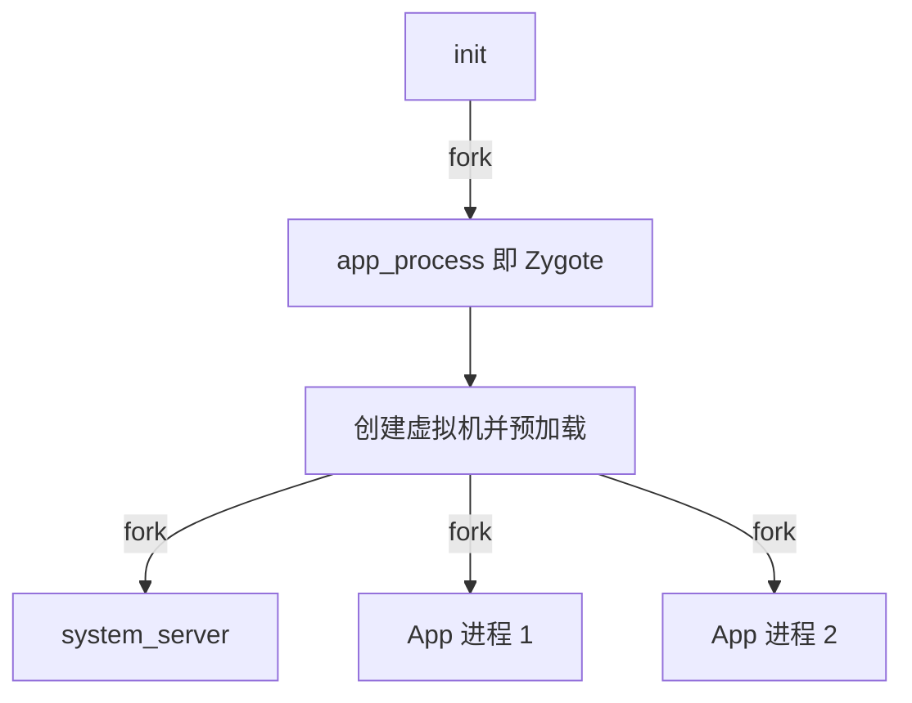

本篇对应原书第 4 章。Zygote(受精卵)是所有 Java 进程的祖先,App 进程都由它 fork 而来。原书基于 Android 2.2/2.3,沿 `app_process → AndroidRuntime → ZygoteInit → system_server → runSelectLoop` 的执行顺序逐段精读,并附启动速度、heapsize、看门狗三个拓展思考。文中代码为概念化改写,并在末尾对现代演进做比对展开。

## 3.1 为什么需要 Zygote

问题:每个 App 都是一个独立的 Dalvik 虚拟机进程,如果各自从零启动——创建 VM、加载上万个基础类、初始化资源缓存——单个进程启动要数秒。

Zygote 的解法是**"预热 + 复制"**:

1. 开机时 Zygote 自己完成全部预热:创建虚拟机、预加载基础类与资源
2. 之后每个 App 进程通过 **fork** 从 Zygote 复制一份"已经热身完毕"的进程映像



fork 的收益来自 Linux 内核的 **COW(Copy-On-Write, 写时复制)**:子进程与父进程共享同一批物理页,只有发生写入时才复制。预加载的类和资源基本只读,于是:

- fork 本身极快(不复制物理内存,只复制页表)
- 上千个 App 共享一份预加载内容的物理内存,内存占用大幅降低

这是"用 fork 换启动速度、用 COW 换内存"的经典设计,也是 Android 选 Dalvik/ART 而非每 App 一个完整 JVM 进程模型的工程理由之一。

## 3.2 入口:app_process 与 AppRuntime

init 按 rc 启动 `/system/bin/app_process`,入口在 `frameworks/base/cmds/app_process/app_main.cpp`:

```cpp
// app_main.cpp(概念化,保留原书结构)
int main(int argc, const char* const argv[]) {
    // 解析参数:--zygote --start-system-server 等
    AppRuntime runtime(argv[0], computeArgBlockSize(argc, argv));
    if (zygote) {
        runtime.start("com.android.internal.os.ZygoteInit",
                      args, zygote);
    } else if (className) {
        // 不带 --zygote 时,app_process 也可直接跑一个 Java 类(如 am 命令)
        runtime.start(className, args, zygote);
    }
}
```

`AppRuntime` 继承自 **AndroidRuntime**,`start()` 是 Native 通往 Java 世界的总开关,两步:

```cpp
// AndroidRuntime.cpp(概念化)
void AndroidRuntime::start(const char* className, ...) {
    /* 1. 启动虚拟机 */
    startVm(&mJavaVM, &env);       // 拼装 -Xzygote 等无数 dalvik.vm.* 属性为 VM 参数
    onVmCreated(env);
    /* 2. 注册 Framework 核心 JNI 函数 */
    startReg(env);                 // 逐条执行 gRegJNI 数组里的 REG_JNI(fn)
    // 反射调用 className 的 main:进入 Java!
    env->CallStaticVoidMethod(startClass, startMeth, strArray);
}
```

**startReg 正是 JNI 动态注册的大规模应用**:数组 `gRegJNI` 里排着 Framework 全部核心库的注册函数(`register_android_os_Binder`、`register_android_graphics_Bitmap`……),Zygote 一次性把系统 JNI 都注册好,子进程 fork 后直接继承,App 进程因此"天生"具备全套 JNI。

## 3.3 ZygoteInit 的启动序列

进入 Java 后的第一站 `frameworks/base/core/java/com/android/internal/os/ZygoteInit.java`:

```java
// 概念化,保留原书顺序
public static void main(String argv[]) {
    // 0. 注册 Zygote 自己的 socket
    registerZygoteSocket(socketName);          // /dev/socket/zygote
    // 1. 预加载
    preload();                                  // 见 3.4
    // 2. 让第一波 gc 收尾,减小 fork 后的 COW 压力
    gcDone = ...; // (示意:做一次 System.gc 并等待)
    // 3. fork 出 system_server
    if (argv[1].equals("true")) startSystemServer();
    // 4. 进入循环,等 AMS 来请求 fork App
    runSelectLoopMode();
    closeServerSocket();
}
```

## 3.4 preload:预加载了什么

```java
static void preload() {
    preloadClasses();     // 逐行 Class.forName: /system/etc/preload-classes,两千多个类
    preloadResources();   // 预加载常用 drawable 与字符串到缓存
    preloadOpenGL();      // (现代版本)加载 GL 驱动与 shader 缓存
    // 共享库加载完成后触发一次 gc,清理临时对象
}
```

- **preloadClasses**:`preload-classes` 文件来自 Google 统计的高频类清单;`forName` 加载的类进入 Zygote 的类装载体系,fork 后所有 App 免费共享
- **preloadResources**:把 `com.android.internal.R` 下高频 drawable 预解码为对象缓存
- 代价:Zygote 启动变慢、常驻内存变大;收益:每个 App 进程省下这份时间与 COW 共享的内存——典型的"一次付出,全体复用"

## 3.5 startSystemServer:fork 出系统的发动机

```java
// 概念化,原书详列了完整参数表
private static boolean startSystemServer() {
    String args[] = {
        "--setuid=1000", "--setgid=1000",
        "--setgroups=1001,1002,1003,3001...",
        "--capabilities=...",
        "--runtime-init",
        "--nice-name=system_server",
        "--start-system-server",
        "com.android.server.SystemServer",     // 最终执行的 Java 类
    };
    ZygoteConnection.Arguments parsedArgs = new ZygoteConnection.Arguments(args);
    pid = Zygote.forkSystemServer(...);        // fork
    if (pid == 0) {
        // 子进程侧:关掉从 Zygote 继承的 socket,然后执行 SystemServer
        handleSystemServerProcess(parsedArgs); // → RuntimeInit → SystemServer.main
        return false;
    }
    // 父进程侧:返回继续 runSelectLoop
}
```

`forkSystemServer` 与普通 `forkAndSpecialize` 的区别:它设置 uid=1000(system)、补充全部系统 gid 与 capabilities,失败处理也更严格(system_server 起不来,Zygote 直接自杀,init 按 critical 逻辑重启整个框架)。

## 3.6 SystemServer:框架服务的批量启动

`SystemServer.java` 的 main 又反射进 `ServerThread.run`(原书时代为内部线程),顺序启动上百个服务,示例:

```java
// 概念化:启动顺序蕴含依赖关系
try {
    ServiceManager.addService("entropy", new EntropyService());
    power = new PowerManagerService(context);        // 电源
    ServiceManager.addService("power", power);
    // 核心中的核心:
    context = ActivityManagerService.main(factoryTest); // AMS
    wm = WindowManagerService.main(context, power, ...); // WMS
    // 媒体服务:
    ServiceManager.addService("media.audio_flinger", new AudioFlinger());
    ...
    ((ActivityManagerService)ServiceManager.getService("activity"))
            .systemReady(new Runnable() { ... });    // 最后广播出 ACTION_BOOT_COMPLETED
} catch (RuntimeException e) { ... }
Looper.loop();   // ServerThread 进入消息循环,服务们开始工作
```

## 3.7 runSelectLoop:fork App 进程的工厂

Zygote 的最后形态是一个"fork 服务器":

```java
// 概念化
static void runSelectLoopMode() {
    ArrayList<ZygoteConnection> peers = new ArrayList<>();
    while (true) {
        index = selectReadable(fds);   // 监听:新连接 or 既有连接来数据
        if (index == 0) {
            peers.add(new ZygoteConnection(sServerSocket.accept())); // 新客户端
        } else {
            ZygoteConnection conn = peers.get(index);
            if (conn.runOnce() == false) {  // 处理一次请求
                peers.remove(index);        // 处理完即断开:一连接一请求
            }
        }
    }
}
```

`runOnce` 是核心,完整流程:

```java
// 概念化
boolean runOnce() throws ZygoteInit.MethodAndArgsCaller {
    // 1. 从 socket 读启动参数(uid/gid/gids/seinfo/niceName/ABI/启动类名/参数...)
    args = readArgumentList();
    Arguments parsedArgs = new Arguments(args);
    // 2. fork
    pid = Zygote.forkAndSpecialize(parsedArgs.uid, parsedArgs.gid,
            parsedArgs.gids, ..., parsedArgs.runtimeInit, ...);
    if (pid == 0) {
        // 3a. 子进程:关 socket、按参数 setuid/setgid,跳转到目标类
        IoUtils.closeQuietly(serverPipeFd);
        handleChildProc(parsedArgs, ...);
        //   → RuntimeInit.applicationInit → ActivityThread.main
        return true;   // (永不返回)
    } else {
        // 3b. 父进程:把子进程 pid 写回 socket 通知 AMS,清理现场
        writePidToClient(pid);
        return true;
    }
}
```

三个安全细节(原书强调):

- **fork 后立刻降权**:`forkAndSpecialize` 在子进程内先 setuid/setgid 再执行任何 Java 代码,防止 App 以 Zygote 的 uid(root/system)运行
- **最小化继承**:子进程关闭从 Zygote 继承的 zygote socket fd,避免 App 直接命令 Zygote
- **一连接一请求**:AMS 每次 fork 新开一个连接,降低协议状态被混淆的风险

## 3.8 拓展思考之一:启动速度

原书给出的分析工具是 **bootchart**:init 各阶段打点,生成时间线图找瓶颈。思路:rc 依赖太深会串行化、preload 太慢会推迟 Zygote 就绪、`class_start main` 一次性 fork 大量服务导致 IO 争抢。优化手段包括合并触发阶段、延后非关键服务、按需启动(现代的 on-demand HAL 是同一思想的延续)。

## 3.9 拓展思考之二:heapsize 调整

Dalvik 时代 Java 堆上限由属性控制:

| 属性 | 含义 |
|---|---|
| `dalvik.vm.heapsize` | 显式指定的堆上限(-Xmx) |
| `dalvik.vm.heapgrowthlimit` | 带 largeHeap 标志的 App 的默认上限 |
| `dalvik.vm.heapstartsize` | 初始堆大小 |

受限于当时的标记回收实现,超过上限直接 OOM(Out of Memory)。原书讨论:调大堆治标不治本,OOM 常源于图片与 Native 内存,应结合 DDMS 的 heap 工具分析支配树,而不是一味堆参数。

## 3.10 拓展思考之三:看门狗(Watchdog)

system_server 卡死比崩溃更危险——看似活着,实则无响应。Watchdog 是对策:

```java
// 概念化机制
public class Watchdog extends Thread {
    // 关键服务实现 Watchdog.Monitor,checkCalledByValidThread? 概念:定期"签到"
    public void addMonitor(Monitor monitor) { ... }
    @Override public void run() {
        while (true) {
            for (Monitor m : monitors) {
                if (!m.monitorCompletesInTime()) {   // 拿不到锁/无响应
                    Slog.w(TAG, "Blocked in " + m);
                }
            }
            // 连续多个周期无响应 → 判定死锁:
            // 打印各线程栈 → Process.killProcess(Process.myPid()) 自杀
        }
    }
}
```

自杀后的连锁:system_server 死 → Zygote 检测到(critical 链)→ init 重启 Zygote 与整个 Java 框架 → 开机动画。**用户看到的是"手机自动重启",本质是框架自愈**。原书提醒:Watchdog 咬人前会把全部线程栈打进日志,这是分析 system_server 死锁的第一手材料。

## 3.11 新技术更新(比对展开)

| 维度 | 原书时代(Android 2.3) | 现在(Android 11~15+) |
|---|---|---|
| fork 请求 | AMS ↔ Zygote 私有 socket 协议 | 协议本质保留,但配 USAP 池加速 |
| fork 优化 | 每次 fork 都在关键路径上 | USAP 预 fork(Android 10),特化代替现场 fork |
| ABI | 单 32 位 | 64 位主 Zygote + 按需的次级 Zygote |
| 预加载收益载体 | Dalvik 类加载 | ART boot image(boot.art)跨进程共享 + ZygoteCache 持续维护 |
| system_server | 上百服务顺序启动 | 一千多个服务,分 bootstrap/core/other 三批,部分并行 |
| 消息机制观测 | 手抓 log | Perfetto/Looper trace 直接看主线程卡点 |
| 进程冻结 | 无 | CachedAppOptimizer 冻结缓存进程(Android 11+),fork 请求需先解冻 |
| Watchdog | 监视核心服务锁 | 保留,并增加对 Binder 线程饱和的检测 |

分项展开:

### 3.11.1 USAP:把 fork 挪出关键路径

启动 App 时,fork + 降权 + 资源清理耗时数毫秒,且直接叠加在启动延迟上。Android 10 引入 **USAP(Unspecialized Application Process)**:Zygote 空闲时预 fork 一批"半成品"进程放在池里;请求到来时从池中取一个,**只做特化**(设 uid、装类、改名)而省去 fork 本身。池子大小有上下限,消耗后由 Zygote 空闲时自动补充,内存紧张时也会整体释放。

### 3.11.2 ART 时代的预加载:boot image

Dalvik 的预加载收益=已加载的类对象;ART 把这个思想工程化:**启动时 AOT 编译出 boot image(`boot.art`,含基础类机器码)**,Zygote 将其映射进内存,fork 后所有 App 共享同一份机器码页——预加载从"类"升级到"机器码"。zygote fork 前还会对 boot image 做完整性检查(`-Xzygote` 参数演进),ART 的 image space 概念正对应这里的共享映射。

### 3.11.3 64 位与多 Zygote

Android 5.0 引入 64 位后曾并存 `zygote`(32)与 `zygote64`(64)两个服务,按 App 的 primary ABI 选择 fork 源;之后演进出 `zygote64` 为主、32 位需求走 `zygote32` 次级进程的模型(Android 15 的 `infer_from_dex` 混合 32/64 模式下按需启动 32 位 Zygote)。init 里的 rc 描述从两个 service 演进为一个带属性开关的服务组。

### 3.11.4 system_server 启动优化

服务数量膨胀一个数量级后,启动从单线程顺序执行改为:bootstrap 服务(AMS/PMS 等最小集)先就绪,core/other 分批并行;启动各阶段打点上报(EventLog `boot_progress`),配合 Perfetto 的 boot trace 与开机向导的 `boot_timeline` 统计。`systemReady` 的回调链仍是理解框架初始化顺序的主线,与原书分析路径一致。

### 3.11.5 进程生命周期补全

Zygote 只管"生";现代 Android 又补了"藏"与"杀":**进程冻结**(Android 11,cached app 整进程冻结,不占 CPU,有 Binder 请求再解冻)与 **LMKD(Low Memory Killer Daemon)** 替代内核 lowmemorykiller 驱动(Android 9+),按 PSI(Pressure Stall Information)压力信号杀进程。原书时代"进程只受 OOM Killer 管理"的图景需要加上这两层。
