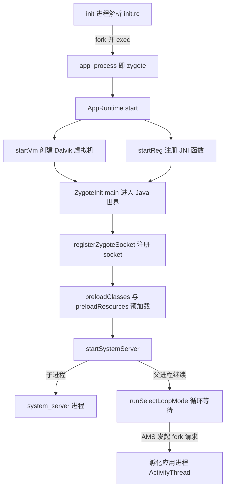
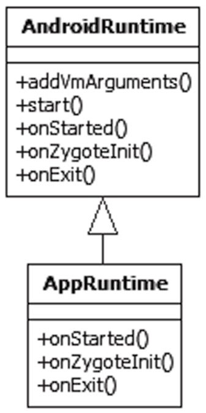
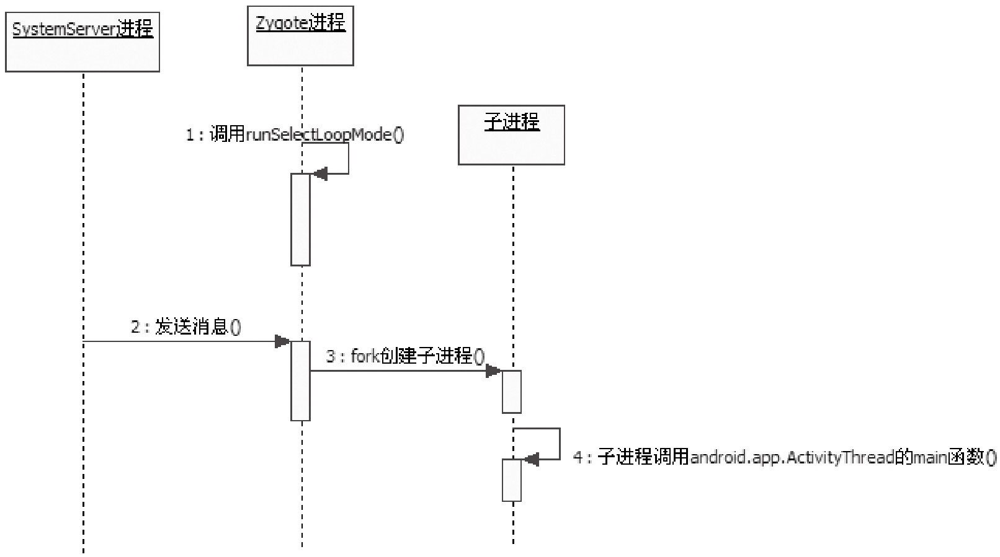

本篇对应原书第 4 章「深入理解 zygote」。原书基于 Android 2.2/2.3 源码，分析两条主线：zygote 如何由 init 拉起、创建第一个 Dalvik 虚拟机、预加载框架类与资源并 fork 出 system_server；此后 zygote 如何常驻循环，响应 ActivityManagerService（下文简称 AMS）的请求，fork 出一个个应用进程。一句话概括：**zygote 是 Java 世界的起点和所有 Java 进程的父进程，system_server 是系统 Service 的驻留地，两者任一死亡都会导致整个 Java 世界重启**。

> 版本注意：原书成书于 2011 年（Android 2.2/2.3，Dalvik 虚拟机），zygote 机制主体延续至今（ART 时代仍靠 fork 孵化应用进程），细节差异见文末演进备注。

> 摘编声明：文中代码为原书代码的摘编版——保留主干、省略日志与无关分支，类名、函数名忠于原书原文。

## 1.1 概述：两个世界与两位主角

Android 中存在两个世界：**Java 世界**——运行在 Dalvik 虚拟机上的 Java 程序，Google 的 SDK（Software Development Kit，软件开发工具包）面向这个世界；**Native 世界**——C/C++ 等 Native 语言编写的程序。

初学者通常有三个疑问：Android 基于 Linux 内核，最早存在的是 Native 世界，Java 世界是什么时候创建的？编写 Activity、Service 时几乎接触不到「进程」概念（Google 有意为之），但它们又不能脱离进程存在，这个进程是怎么创建和运行的？程序中使用的系统 Service 驻留在哪里？

答案都指向本章两位主角：**zygote** 和 **system_server**。zygote 本意是「受精卵」，负责创建 Java 世界；system_server 如其名，系统中重要的 Service 都驻留在它的进程里。两者撑起 Java 世界的半边天——任何一个死亡，Java 世界都会崩溃。



本篇涉及的源码文件：App_main.cpp、AndroidRuntime.cpp、ZygoteInit.java、dalvik_system_Zygote.c、RuntimeInit.java、SystemServer.java、system_init.cpp、Watchdog.java、ActivityManagerService.java、Process.java 与 ZygoteConnection.java。

## 1.2 zygote 的启动入口与 AppRuntime 分析

zygote 本身是一个 Native 应用程序，与驱动、内核无关，由 init 进程根据 init.rc 的配置创建。它在 Android.mk 中指定的本名是 app_process，运行中通过 Linux 的 prctl 系统调用把进程名改成 zygote，所以 ps 看到的进程名是 zygote。源码入口就是 app_process 对应的 App_main.cpp。

### 1.2.1 App_main.cpp 的 main 函数

main 只做参数解析与进程改名，真正的工作交给 AppRuntime 的 start。

```cpp
// [--> App_main.cpp]
int main(int argc, const char* const argv[])
{
    // init.rc 中的启动参数：
    // -Xzygote /system/bin --zygote --start-system-server
    ......

    AppRuntime runtime;
    ......

    if (i < argc) {
        arg = argv[i++];
        if (0 == strcmp("--zygote", arg)) {
            // 满足 if 条件，且 startSystemServer 为 true
            bool startSystemServer = (i < argc) ?
                    strcmp(argv[i], "--start-system-server") == 0 : false;
            // 设置本进程名称为 zygote，即前文所说的进程改名
            set_process_name("zygote");
            // 调用 runtime 的 start，注意第二个参数 startSystemServer 为 true
            runtime.start("com.android.internal.os.ZygoteInit",
                          startSystemServer);
        }
    }
}
```

AppRuntime 的声明和实现都在 App_main.cpp 中，从 AndroidRuntime 派生，重载了 onStarted、onZygoteInit、onExit 三个函数——其中 onZygoteInit 在 1.4.2 节再次出现。两个类的关系见图 4-1。



### 1.2.2 AndroidRuntime::start：进入 Java 世界的三部曲

zygote 的重要功能由 AndroidRuntime 的 start 完成，调用参数是 `com.android.internal.os.ZygoteInit` 与 true。

```cpp
// [--> AndroidRuntime.cpp]
void AndroidRuntime::start(const char* className, const bool startSystemServer)
{
    JNIEnv* env;
    blockSigpipe();   // 处理 SIGPIPE 信号
    ......

    // ① 创建虚拟机
    if (startVm(&mJavaVM, &env) != 0)
        goto bail;

    // ② 注册 JNI 函数
    if (startReg(env) < 0) {
        goto bail;
    }

    // 先构造好两元素 String 数组 ["com.android.internal.os.ZygoteInit",
    // "true"] 传给 Java 侧的 main，并把类名中的 "." 换成 "/"，
    // 再找到 ZygoteInit 类的 static main 函数（略）
    ......

    // ③ 通过 JNI 调用 ZygoteInit 的 main 函数，
    // 这一句执行后，zygote 便进入了 Java 世界
    env->CallStaticVoidMethod(startClass, startMeth, strArray);

    // 从 main 返回意味着 zygote 退出，正常情况下不需要退出
    ......

bail:
    free(slashClassName);
}
```

①②③组成了开创 Java 世界的三部曲：**startVm 创建虚拟机、startReg 注册 JNI 函数、CallStaticVoidMethod 调用 ZygoteInit.main**。前两部下面逐个分析，第三部在 1.3 节展开。

### 1.2.3 startVm：创建 Dalvik 虚拟机

startVm 的核心是调用 JNI 的虚拟机创建函数，虚拟机参数在这里确定，看两处有代表性的。

```cpp
// [--> AndroidRuntime.cpp]
int AndroidRuntime::startVm(JavaVM** pJavaVM, JNIEnv** pEnv)
{
    /*
      参数一：是否启用 JNI check（由 dalvik.vm.checkjni 等属性控制）。
      它检查 Native 层 JNI 调用的合法性（如 NewStringUTF 的 UTF-8 编码）
      与资源释放，但检查耗时，且有些检查过严——出错则进程直接 abort。
      所以一般只在调试的 eng 版启用，user 版不启用
    */
    ......

    /*
      参数二：虚拟机 heapsize，默认 16MB，厂商一般改为 32MB，
      过小则操作大图片时无法分配内存。能否按应用动态调整？见 1.6.1 节
    */
    strcpy(heapsizeOptsBuf, "-Xmx");
    property_get("dalvik.vm.heapsize", heapsizeOptsBuf+4, "16m");
    opt.optionString = heapsizeOptsBuf;
    mOptions.add(opt);
    ......

    // 调用 JNI_CreateJavaVM 创建虚拟机，pEnv 返回当前线程的 JNIEnv 变量
    if (JNI_CreateJavaVM(pJavaVM, pEnv, &initArgs) < 0) {
        return -1;
    }
    return 0;
}
```

Dalvik 其余启动参数，原书提示可参考 dalvik/docs 下的文档。

### 1.2.4 startReg：注册 JNI 函数

虚拟机创建好后，还要注册一批 JNI（Java Native Interface）函数——Java 世界要用到的一部分函数是 native 方式实现的，必须提前注册。

```cpp
// [--> AndroidRuntime.cpp]
int AndroidRuntime::startReg(JNIEnv* env)
{
    // 设置 Thread 类的线程创建函数为 javaCreateThreadEtc，这里不展开
    androidSetCreateThreadFunc((android_create_thread_fn) javaCreateThreadEtc);

    // 注册 JNI 函数。gRegJNI 是一个全局数组，共约 100 项，如
    // REG_JNI(register_android_debug_JNITest)；register_jni_procs
    // 只是逐个调用数组元素的 mProc 函数
    if (register_jni_procs(gRegJNI, NELEM(gRegJNI), env) < 0) {
        return -1;
    }
    return 0;
}
```

REG_JNI 是宏，展开后就是 mProc；以 register_android_debug_JNITest 为例，它调用 jniRegisterNativeMethods 为 android.debug.JNITest 注册 JNI 函数。**zygote 在这里一次性注册好框架核心库的全部 JNI 函数，fork 出的子进程直接继承，应用进程因此「天生」具备全套 JNI 能力**。下一步就是三部曲的第三步——进入 Java 世界，最佳情况是永远不再回到 Native 世界。

## 1.3 Welcome to Java World：ZygoteInit 的 main 函数

Java 世界的入口是 com.android.internal.os.ZygoteInit 的 main 函数。原书在其中标注了五个关键点（①～⑤）：①～④对应下面四个小节，⑤是末尾对 MethodAndArgsCaller 异常的截获，留到 1.4.3 节。

```java
// [--> ZygoteInit.java]（按原书关键点摘编整理）
public static void main(String argv[]) {
    try {
        registerZygoteSocket();   // ① 建立 IPC 通信服务端
        preloadClasses();         // ② 预加载类与资源
        preloadResources();

        // argv[1] 即 startVm 时传入的第二个元素 "true"/"false"
        if (argv[1].equals("true")) {
            startSystemServer();  // ③ 启动 system_server
        }

        runSelectLoopMode();      // ④ 进入循环，等待并处理客户端请求

        closeServerSocket();
    } catch (MethodAndArgsCaller caller) {
        caller.run();             // ⑤ 截获异常，调用目标类的 main
    }
    ......
}
```

### 1.3.1 registerZygoteSocket：建立 IPC 服务端

zygote 与其他程序的通信没有使用 Binder，而是基于 AF_UNIX 类型的 Socket；registerZygoteSocket 的使命就是建立这个服务端。

```java
// [--> ZygoteInit.java]
private static void registerZygoteSocket() {
    if (sServerSocket == null) {
        // 从环境变量中获取 Socket 的 fd：init 创建 /dev/socket/zygote 后，
        // 通过 execv 把 fd 编号写入了环境变量 ANDROID_SOCKET_zygote
        String env = System.getenv(ANDROID_SOCKET_ENV);
        int fileDesc = Integer.parseInt(env);
        // 创建服务端 Socket，它将 listen 并 accept 客户端
        sServerSocket = new LocalServerSocket(createFileDescriptor(fileDesc));
    }
}
```

zygote 不自己创建 socket 文件，而是直接使用 init 预先创建好的 fd——这就是 IPC（Inter-Process Communication，进程间通信）服务端的建立方式。带着两个问题往下走：谁是客户端（1.5 节揭晓：AMS）？服务端怎么处理消息（1.3.4 节回答）？

### 1.3.2 preloadClasses 与 preloadResources：预加载类与资源

进入 Java 世界之初什么都没有，zygote 先为它预加载框架的类与资源。

```java
// [--> ZygoteInit.java]
private static void preloadClasses() {
    // 预加载类的清单存储在 PRELOADED_CLASSES 变量中，值为 "preloaded-classes"
    ......

    BufferedReader br = new BufferedReader(new InputStreamReader(is), 256);
    String line;
    while ((line = br.readLine()) != null) {
        line = line.trim();
        // 忽略 # 开头的注释行与空行
        if (line.startsWith("#") || line.equals("")) {
            continue;
        }
        // 通过 Java 反射加载类，line 中存储的是预加载的类名
        Class.forName(line);
    }
    ...... // 扫尾与清理
}
```

要加载多少个类？在 framework/base 目录下可以找到 preloaded-classes 文本文件：

```text
# Classes which are preloaded by com.android.internal.os.ZygoteInit.
# Automatically generated by
# frameworks/base/tools/preload/WritePreloadedClassFile.java.
# MIN_LOAD_TIME_MICROS=1250
android.R$styleable
android.accounts.AccountManager
android.accounts.IAccountManager$Stub
...... // 一共有 1268 行
```

三个要点：

- 该文件由 frameworks/base/tools/preload 工具生成：加载时间超过 1250 微秒（MIN_LOAD_TIME_MICROS=1250）的类才写进文件，由 zygote 预加载
- **preloadClasses 执行时间较长，这是 Android 开机慢的原因之一**（1.6.2 节讨论）
- preloadResources 类似，主要加载 framework-res.apk 的资源——UI 编程常用的 com.android.R.XXX 系统默认资源就是这一步加载的

### 1.3.3 startSystemServer：fork 出 system_server

第三个关键点创建系统 Service 驻留的 system_server 进程，它是 framework 的核心；它死了 zygote 会自杀（见 1.4.1 节）。

```java
// [--> ZygoteInit.java]
private static boolean startSystemServer()
        throws MethodAndArgsCaller, RuntimeException {
    // 设置参数
    String args[] = {
        "--setuid=1000",                   // uid、gid 等的设置
        "--setgid=1000",
        "--setgroups=1001,1002,1003,1004,1005,1006,1007,1008,1009,1010,"
                        + "3001,3002,3003",
        "--capabilities=130104352,130104352",
        "--runtime-init",
        "--nice-name=system_server",       // 进程名
        "com.android.server.SystemServer", // 要启动的类名
    };

    // 把参数转换成 Arguments 对象后 fork 一个子进程，它就是 system_server
    ZygoteConnection.Arguments parsedArgs = new ZygoteConnection.Arguments(args);
    int pid = Zygote.forkSystemServer(
            parsedArgs.uid, parsedArgs.gid,
            parsedArgs.gids, parsedArgs.debugFlags, null);

    /*
      fork 之后的分水岭：pid 为 0 表示处于子进程中，
      也就是 system_server 进程
    */
    if (pid == 0) {
        handleSystemServerProcess(parsedArgs);   // system_server 侧的工作
    }
    return true;   // zygote 进程侧返回 true
}
```

这是本章的第一次 fork：zygote 通过 Zygote.forkSystemServer 孵化出 system_server 子进程，细节在 1.4 节分析。

### 1.3.4 runSelectLoopMode：等待并处理请求

zygote 从 startSystemServer 返回后进入第四个关键函数；1.3.1 节注册的 Socket 到这时才真正投入使用。

```java
// [--> ZygoteInit.java]
private static void runSelectLoopMode()
        throws MethodAndArgsCaller {
    ArrayList<FileDescriptor> fds = new ArrayList();
    ArrayList<ZygoteConnection> peers = new ArrayList();
    FileDescriptor[] fdArray = new FileDescriptor[4];
    // sServerSocket 是 registerZygoteSocket 中建立的 Socket
    fds.add(sServerSocket.getFileDescriptor());
    peers.add(null);

    while (true) {
        int index;
        fdArray = fds.toArray(fdArray);
        // selectReadable 内部调用 select（I/O 多路复用），
        // 有客户端连接或有数据到达时返回就绪 fd 的下标
        index = selectReadable(fdArray);

        if (index == 0) {
            // 有客户端连接上，客户端在 zygote 中的代表是 ZygoteConnection
            ZygoteConnection newPeer = acceptCommandPeer();
            peers.add(newPeer);
            fds.add(newPeer.getFileDesciptor());
        } else {
            // 客户端发送了请求，交给 ZygoteConnection 的 runOnce 处理
            boolean done = peers.get(index).runOnce();
            if (done) {
                peers.remove(index);
                fds.remove(index);
            }
        }
    }
}
```

逻辑就两件事：处理客户端连接——每个客户端在 zygote 中用一个 **ZygoteConnection** 对象表示；处理客户端请求——由 runOnce 处理（1.5.3 节分析）。select 背后的 I/O 多路复用模型值得借机掌握。

### 1.3.5 zygote 启动流程小结

把 zygote 创建 Java 世界的步骤串起来（对应原书的六天总结，去掉拟人说法）：

1. 创建 AppRuntime 对象并调用它的 start，此后的活动由 AppRuntime 控制
2. 调用 startVm 创建 Java 虚拟机，调用 startReg 注册 JNI 函数
3. 通过 JNI 调用 ZygoteInit 的 main 函数，进入 Java 世界
4. 调用 registerZygoteSocket 建立 IPC 服务端；调用 preloadClasses 与 preloadResources 预加载
5. 调用 startSystemServer fork 出 system_server 子进程
6. 调用 runSelectLoopMode 进入循环，等待并处理后续请求

此后 zygote 常驻循环中，收到请求就醒来处理一次 fork，然后再回到等待状态。

## 1.4 SystemServer 的诞生与重要使命

zygote 的第一个子进程 system_server（原书简称 SS）地位极高——高到与 zygote 生死与共。本节先看它怎么 fork 出来，再看它 fork 之后做了什么。

### 1.4.1 forkSystemServer：生死与共的父子进程

Zygote.forkSystemServer 是 native 函数，实现在 dalvik_system_Zygote.c 中：

```c
// [--> dalvik_system_Zygote.c]
static void Dalvik_dalvik_system_Zygote_forkSystemServer(
        const u4* args, JValue* pResult)
{
    pid_t pid;
    // 根据参数，fork 一个子进程
    pid = forkAndSpecializeCommon(args);
    if (pid > 0) {
        int status;
        gDvm.systemServerPid = pid;   // 保存 system_server 的进程 id
        // 函数退出前先检查刚创建的子进程是否退出了
        if (waitpid(pid, &status, WNOHANG) == pid) {
            // system_server 一落地就退出，zygote 直接杀掉自己
            kill(getpid(), SIGKILL);
        }
    }
    RETURN_INT(pid);
}
```

forkAndSpecializeCommon 是所有 fork 的公共实现（1.5.3 节应用进程的 fork 也落到这里）：先调用 setSignalHandler 注册 SIGCHLD 的处理函数，再 fork；子进程侧按传入参数设置进程名、uid、gid 等各种 id。SIGCHLD 是子进程死亡时内核发给父进程的信号，其处理函数如下：

```c
// [--> dalvik_system_Zygote.c]
static void setSignalHandler()
{
    struct sigaction sa;
    memset(&sa, 0, sizeof(sa));
    sa.sa_handler = sigchldHandler;
    // SIGCHLD 是子进程死亡时内核发给父进程的信号
    sigaction(SIGCHLD, &sa, NULL);
}

// 子进程死亡时的信号处理函数
static void sigchldHandler(int s)
{
    pid_t pid;
    int status;

    while ((pid = waitpid(-1, &status, WNOHANG)) > 0) {
        ...... // 回收死去的子进程
    }

    // 死去的子进程若是 system_server，zygote 把自己也干掉
    if (pid == gDvm.systemServerPid) {
        kill(getpid(), SIGKILL);
    }
}
```

两处 kill(getpid(), SIGKILL) 构成了**zygote 与 system_server 的生死绑定**：system_server 一启动就失败或运行中死亡，zygote 都会自杀；zygote 一死，init 按重启逻辑重新拉起整个 Java 世界——这就是 1.1 节「半边天」论断的机制来源。

### 1.4.2 handleSystemServerProcess 与 RuntimeInit.zygoteInit

回到 1.3.3 的分水岭：pid 为 0 的一侧是 system_server 进程，它调用 handleSystemServerProcess 开始自己的使命。该函数先 closeServerSocket 关闭从 zygote 继承的服务端 Socket（fork 会带走 zygote 的全部资源，system_server 用不着它），再 setCapabilities，然后把剩余参数交给 RuntimeInit.zygoteInit：

```java
// [--> RuntimeInit.java]
public static final void zygoteInit(String[] argv)
        throws ZygoteInit.MethodAndArgsCaller {
    commonInit();           // 常规初始化
    zygoteInitNative();     // ① native 层的初始化
    // 解析剩余参数：--nice-name=system_server 用于设置进程名
    ......

    // ② startClass 为 "com.android.server.SystemServer"，调用它的 main
    invokeStaticMain(startClass, startArgs);
}
```

先看关键点① zygoteInitNative，native 函数，实现在 AndroidRuntime.cpp 中：

```cpp
// [--> AndroidRuntime.cpp]
static void com_android_internal_os_RuntimeInit_zygoteInit(
        JNIEnv* env, jobject clazz)
{
    gCurRuntime->onZygoteInit();
}

// gCurRuntime 是全局变量，在 AndroidRuntime 的构造函数中被赋值：
// gCurRuntime = this（构造函数里还有 SkGraphics::Init 等 Skia 初始化）
```

gCurRuntime 从哪来？1.2.1 节 main 函数里 `AppRuntime runtime;` 构造对象时，基类构造函数把它记录到了这个全局变量；system_server 从 zygote fork 而来，也就继承了它。因此 zygoteInitNative 执行的是 AppRuntime 重载的 onZygoteInit：

```cpp
// [--> App_main.cpp]
virtual void onZygoteInit()
{
    // 下面这些与 Binder 有关
    sp<ProcessState> proc = ProcessState::self();
    if (proc->supportsProcesses()) {
        proc->startThreadPool();   // 启动一个线程，用于 Binder 通信
    }
}
```

一言以蔽之：**system_server 调用 zygoteInitNative 之后，就与 Binder 通信系统建立了联系**（zygote 自己反而没有这一步，它靠 socket 通信）。

### 1.4.3 invokeStaticMain：用异常完成跳转

关键点② invokeStaticMain 负责最终调用 com.android.server.SystemServer 的 main，但写法出人意料：

```java
// [--> RuntimeInit.java]
private static void invokeStaticMain(String className, String[] argv)
        throws ZygoteInit.MethodAndArgsCaller {

    // className 为 "com.android.server.SystemServer"，找到它的 main 函数，
    // 并检查其必须是 public static 的（否则抛异常，略）
    Class<?> cl = Class.forName(className);
    Method m = cl.getMethod("main", new Class[] { String[].class });
    ......

    // 抛出一个异常——为什么不在这里直接调用 main 函数？
    throw new ZygoteInit.MethodAndArgsCaller(m, argv);
}
```

invokeStaticMain 找到目标 main 后不直接调用，而是抛出 **MethodAndArgsCaller 异常**（携带目标 Method 与参数）。它在哪里被截获？答案是 1.3 节开头 ZygoteInit.main 的末尾：

```java
// [--> ZygoteInit.java]（main 末尾的截获；注意此时所在进程是 system_server）
if (argv[1].equals("true")) {
    startSystemServer();   // 调用链深处抛出了 MethodAndArgsCaller
    ......
}
......
catch (MethodAndArgsCaller caller) {
    caller.run();          // 异常在此被截获，调用 caller 的 run 函数
}

// MethodAndArgsCaller 的 run：
public void run() {
    try {
        // mMethod 为 com.android.server.SystemServer 的 main 函数
        mMethod.invoke(null, new Object[] { mArgs });
    } catch (IllegalAccessException ex) {
        ......
    }
}
```

为什么绕这个弯子？原书的解释：调用点位于 ZygoteInit.main——相当于入口函数，位于调用堆栈顶层；若在 invokeStaticMain 里直接调用，之前一路函数调用占用的堆栈就浪费了。抛异常会一路展开到入口处再执行目标函数，相当于对 exec 的近似模拟：旧调用栈被清掉，后续工作完全交给目标类。

### 1.4.4 SystemServer 的 main：init1 与 init2

MethodAndArgsCaller.run 最终调用的是 com.android.server.SystemServer 的 main——zygote fork 出 system_server 绕了一大圈，就是为了执行它：

```java
// [--> SystemServer.java]
public static void main(String[] args) {
    ......
    // 加载 libandroid_servers.so
    System.loadLibrary("android_servers");
    // 调用 native 的 init1 函数
    init1(args);
}
```

init1 是 native 函数，在 com_android_server_SystemServer.cpp 中实现，只有一行转发（android_server_SystemServer_init1 → system_init）；system_init 的实现在 system_init.cpp 中：

```cpp
// [--> system_init.cpp]
extern "C" status_t system_init()
{
    // 与 Binder 有关：获取 ProcessState 与 ServiceManager，
    // 并注册 ServiceManager 的死亡接收者 GrimReaper
    sp<ProcessState> proc(ProcessState::self());
    sp<IServiceManager> sm = defaultServiceManager();
    ......

    char propBuf[PROPERTY_VALUE_MAX];
    property_get("system_init.startsurfaceflinger", propBuf, "1");
    if (strcmp(propBuf, "1") == 0) {
        // SurfaceFlinger 服务在 system_server 进程中创建
        SurfaceFlinger::instantiate();
    }
    ......

    // 通过 JNI 调用 com.android.server.SystemServer 类的 init2 函数
    AndroidRuntime* runtime = AndroidRuntime::getRuntime();
    runtime->callStatic("com/android/server/SystemServer", "init2");

    if (proc->supportsProcesses()) {
        ProcessState::self()->startThreadPool();
        // 当前线程也加入到 Binder 通信中
        IPCThreadState::self()->joinThreadPool();
    }
    return NO_ERROR;
}
```

init1 做三件事：在 native 层创建个别系统服务（如按属性决定是否在 system_server 内创建 SurfaceFlinger）；通过 JNI 回调 Java 层的 init2；最后让主线程加入 Binder 通信。init2 在 Java 层，只有三行——new 一个 ServerThread、setName("android.server.ServerThread")、start，即单独创建一个线程来启动系统服务。

### 1.4.5 ServerThread：系统服务的批量启动

ServerThread 的 run 函数很长，摘录主干看看它干了什么：

```java
// [--> SystemServer.java::ServerThread 的 run 函数]
public void run() {
    ....
    // 依次启动 Entropy、电源管理、电池管理等服务
    ServiceManager.addService("entropy", new EntropyService());
    power = new PowerManagerService();
    ServiceManager.addService(Context.POWER_SERVICE, power);
    battery = new BatteryService(context);
    ServiceManager.addService("battery", battery);

    // 初始化看门狗，见 1.6.3 节
    Watchdog.getInstance().init(context, battery, power, alarm,
                                ActivityManagerService.self());
    // 启动 WindowManager 服务，并让 ActivityManager 服务建立与 WMS 的关联
    wm = WindowManagerService.main(context, power,
                    factoryTest != SystemServer.FACTORY_TEST_LOW_LEVEL);
    ServiceManager.addService(Context.WINDOW_SERVICE, wm);
    ((ActivityManagerService)ServiceManager.getService("activity"))
                    .setWindowManager(wm);
    ...... // 系统各项重要的服务都在这里启动
    Looper.loop();   // 进行消息循环，然后处理消息
}
```

**Java 世界的核心 Service 都在 ServerThread 中启动**，这就是 system_server 重要性的直接来源。从诞生到启动完成的调用流程见图 4-2；注意 init1 最终让主线程加入 Binder 通信（joinThreadPool），此后 system_server 的主线程就常驻 Binder 循环了。


## 1.5 zygote 的分裂：fork 出应用进程

zygote fork 出 system_server 后就通过 runSelectLoopMode 等待客户端消息。谁会向 zygote 发消息？本节以启动一个 Activity（所属应用尚无进程）为例，分析 zygote 如何孵化出应用进程。原书把这一步称为 zygote 的「分裂」，实际机制就是一次 fork 加上子进程的定向初始化。

### 1.5.1 ActivityManagerService 发送请求

应用进程的创建由 AMS 主导。AMS 是个庞然大物（原书统计有 14657 行代码），这里只看它创建进程的入口 startProcessLocked：

```java
// [--> ActivityManagerService.java]
private final void startProcessLocked(ProcessRecord app,
        String hostingType, String hostingNameStr) {
    ......
    if ("1".equals(SystemProperties.get("debug.checkjni"))) {
        debugFlags |= Zygote.DEBUG_ENABLE_CHECKJNI;
    }
    ......
    // 注意：这个 Process 类是 Android 提供的，并非 JDK 中的 Process 类
    int pid = Process.start("android.app.ActivityThread",
                    mSimpleProcessManagement ? app.processName : null,
                    uid, uid, gids, debugFlags, null);
    ......
}
```

要点：目标类写死为 `android.app.ActivityThread`——**它就是 APK 程序对应的进程主类，它的 main 函数就是 APK 程序的 main 函数**（从 android.app 包名也能看出端倪）；debug.checkjni 等属性会换算成传给 zygote 的 debugFlags。

### 1.5.2 Process 与 zygote 之间的 socket 通路

Process.start 只是一层转发，真正的工作在 startViaZygote：

```java
// [--> Process.java]
private static int startViaZygote(......) throws ZygoteStartFailedEx {
    int pid;
    ...... // 参数处理，拼出发给 zygote 的参数列表，其中这几条重要：
    argsForZygote.add("--runtime-init");
    argsForZygote.add("--setuid=" + uid);
    argsForZygote.add("--setgid=" + gid);
    pid = zygoteSendArgsAndGetPid(argsForZygote);
    return pid;
}
```

`--runtime-init` 的重要性在 1.5.4 节体现：它决定子进程走 RuntimeInit 的初始化路径。zygoteSendArgsAndGetPid 把参数发给 zygote 并取回结果：

```java
// [--> Process.java]
private static int zygoteSendArgsAndGetPid(ArrayList<String> args)
        throws ZygoteStartFailedEx {
    int pid;
    // 打开与 zygote 通信的 Socket（如果尚未打开）。
    // openZygoteSocketIfNeeded 里 new LocalSocket() 并 connect 到
    // /dev/socket/zygote（LocalSocketAddress 的 RESERVED 命名空间）
    openZygoteSocketIfNeeded();

    try {
        // 把请求参数发到 zygote：先写参数个数，再逐行写每个参数
        sZygoteWriter.write(Integer.toString(args.size()));
        sZygoteWriter.newLine();
        for (String arg : args) {
            sZygoteWriter.write(arg);
            sZygoteWriter.newLine();
        }
        sZygoteWriter.flush();
        // 读取 zygote 处理完的结果，便得知新进程的 pid
        pid = sZygoteInputStream.readInt();
        return pid;
    }
    ......
}
```

openZygoteSocketIfNeeded 打开的正是 1.3.1 节 zygote 注册的那个服务端。至此 AMS 把请求发给了 zygote，参数含目标类名 `android.app.ActivityThread`。最后交代一个身份：AMS 驻留在 system_server 进程中，**向 zygote 发消息的客户端，正是 zygote 自己 fork 出来的 system_server**。

### 1.5.3 ZygoteConnection.runOnce：fork 并处理子进程

请求到达 zygote 一侧，runSelectLoopMode 中 selectReadable 返回就绪下标，处理交给 ZygoteConnection 的 runOnce：

```java
// [--> ZygoteConnection.java]
boolean runOnce() throws ZygoteInit.MethodAndArgsCaller {

    // 读取 system_server 发送过来的参数
    args = readArgumentList();
    descriptors = mSocket.getAncillaryFileDescriptors();
    ......

    int pid;
    parsedArgs = new Arguments(args);
    // 安全检查：校验 uid 等参数的合法性
    applyUidSecurityPolicy(parsedArgs, peer);
    // 从函数名可知：zygote 又 fork 出了一个子进程
    pid = Zygote.forkAndSpecialize(parsedArgs.uid, parsedArgs.gid,
            parsedArgs.gids, parsedArgs.debugFlags, rlimits);
    ......

    if (pid == 0) {
        // 子进程处理——这个子进程就是新创建的应用进程
        handleChildProc(parsedArgs, descriptors, newStderr);
        return true;
    } else {
        // zygote 进程
        return handleParentProc(pid, descriptors, parsedArgs);
    }
}
```

runOnce 的主干与 forkSystemServer 一致：解析参数、安全检查、调用 **Zygote.forkAndSpecialize** fork 子进程（native 侧同样落到 1.4.1 节的 forkAndSpecializeCommon），再按 pid 是否为 0 分两侧处理。区别是这里 fork 的是普通应用进程，参数由客户端请求决定，而非写死的 system_server 参数。

### 1.5.4 子进程的去向与 zygote 的扫尾

子进程侧进入 handleChildProc：它先按传入参数设置新进程的一些属性；请求参数中有 `--runtime-init`，所以 runtimeInit 为 true，于是调用 RuntimeInit.zygoteInit。这个函数与 1.4.2 节 system_server 走的是同一个函数，只是多了输出重定向，目标类也不同：

```java
// [--> RuntimeInit.java]
public static final void zygoteInit(String[] argv)
        throws ZygoteInit.MethodAndArgsCaller {
    // 重定向标准输出和错误输出到 Android 的 log
    System.setOut(new AndroidPrintStream(Log.INFO, "System.out"));
    System.setErr(new AndroidPrintStream(Log.WARN, "System.err"));

    commonInit();
    // native 函数，最终调用 AppRuntime 的 onZygoteInit，
    // 应用进程从这里建立和 Binder 的关系
    zygoteInitNative();
    ......
    // 最终还是调用 invokeStaticMain，目标换成 android.app.ActivityThread
    invokeStaticMain(startClass, startArgs);
}
```

后续路径与 system_server 完全同构：invokeStaticMain 抛出 MethodAndArgsCaller，在 ZygoteInit.main 的 catch 中截获，caller.run 调用 `android.app.ActivityThread` 的 main——一个应用进程就此诞生。zygote 侧在 handleParentProc 中把子进程 pid 写回 socket 交给 AMS，扫尾后回到 runSelectLoopMode 继续等待下一次请求。整个孵化过程见图 4-3。



一个可直接验证的结论：**Android 系统中运行的所有 APK 程序，父进程都是 zygote**——用 adb shell 登录后执行 ps 命令，查看进程及其父进程号即可确认。

## 1.6 拓展思考

原书章末讨论了三个问题：虚拟机 heapsize 的限制、开机速度优化、Watchdog。它们不在主干链路上，但对理解 zygote 机制很有帮助。

### 1.6.1 虚拟机 heapsize 的限制

1.2.3 节说过，默认堆上限 16MB 对需要大内存的程序（如图片处理）远远不够。可以修改 dalvik.vm.heapsize（原书作者在 HTC G7 上改为 32MB），但改动是全局的——所有 Java 程序都变成 32MB。能否按进程动态配置？原书的结论是走不通，原因只有一个：**zygote 通过 fork 创建子进程，zygote 进程里设置的信息会被子进程全部继承**——堆上限 16MB 的 zygote，子进程也是 16MB：fork 时虚拟机已创建完毕，参数无从更改。

原书给出两个可能的方案：

1. 为 Dalvik 增加一个函数，允许运行时动态调整最大堆的大小
2. zygote fork 出子进程后调用 exec 家族函数加载另一映像：重新创建虚拟机、注册 JNI 函数（重做 zygote 启动三部曲），最后调用 android.app.ActivityThread 的 main。理论可行，但难度大，且 exec 后预加载内容全部失效，影响运行速度

### 1.6.2 开机速度优化

按原书掌握的资料，开机时有三个地方耗时较长：ZygoteInit.main 中 preloadClasses 加载一千多个类；开机启动时扫描系统内所有 APK 并收集信息（耗时非常长）；SystemServer 创建的一系列 Service。

以第一个问题为例：preloadClasses 可以去掉吗？可以——系统最终总会在用到时再加载，但这就破坏了 Android 用 fork 创建 Java 进程的本意。fork 的好处显而易见：

- zygote 预加载的这些类，fork 子进程时仅需一次复制即可获得，节约了每个子进程的启动时间
- 根据 fork 的 COW（Copy-On-Write，写时复制）机制，不被修改的数据页根本不用复制，子进程直接与父进程共享——预加载的类大多是只读的，上千个进程共享一份物理内存，内存占用大幅降低

有人使用 BLCR（Berkeley Lab Checkpoint/Restart）技术提升开机速度：对系统做快照存到文件，重启时按快照恢复到重启前的状态——构想简单，实现复杂，与虚拟机软件的 Snapshot 思路同源。

### 1.6.3 Watchdog 分析

Watchdog（看门狗）最初是嵌入式领域的硬件概念：早期设备上的程序经常「跑飞」（如受电磁干扰），于是设置硬件看门狗，定期检查某个参数是否被设置，没被设置就判定系统出错并强制重启。Android 对 system_server 也持同样的谨慎态度——为它加了一条软件看门狗，监视几个重要 Service；一旦发现出问题就杀掉 system_server，这会导致 zygote 随之自杀，最终重启整个 Java 世界。

system_server 与 Watchdog 的交互只有三步：`Watchdog.getInstance().init(...)`、`Watchdog.getInstance().start()`、`Watchdog.getInstance().addMonitor(this)`。

第一步，创建与初始化。getInstance 使用单例模式；Watchdog 从 Thread 派生，会单独占用一个线程执行：

```java
// [--> Watchdog.java]
// Watchdog 从线程类派生，会在一个单独的线程中执行
private Watchdog() {
    super("watchdog");
    // 构造一个 Handler，它在 handleMessage 函数中处理消息
    mHandler = new HeartbeatHandler();
    // 与内存信息统计有关
    mGlobalPssCollected = new GlobalPssCollected();
}

// init 函数只是保存各系统服务的引用（battery、power、alarm、activity 等），略
```

第二步，看门狗跑起来。system_server 调用 start 后，Watchdog 的 run 在另一个线程中执行：

```java
// [--> Watchdog.java]
public void run() {
    boolean waitedHalf = false;
    while (true) {              // 外层 while 循环
        mCompleted = false;     // false 表明本轮各服务的检查还没完成
        // 给 Handler 线程发一条 MONITOR 消息，请求它检查各 Service
        mHandler.sendEmptyMessage(MONITOR);

        synchronized (this) {
            long timeout = TIME_TO_WAIT;
            long start = SystemClock.uptimeMillis();
            // 注意内层循环的条件，mForceKillSystem 为 true 也会退出
            while (timeout > 0 && !mForceKillSystem) {
                try {
                    wait(timeout);   // 等待检查的结果
                } catch (InterruptedException e) {
                }
                timeout = TIME_TO_WAIT - (SystemClock.uptimeMillis() - start);
            }

            // mCompleted 为 true，表示 service 一切正常
            if (mCompleted && !mForceKillSystem) {
                waitedHalf = false;
                continue;
            }

            // mCompleted 不为 true，看门狗会尽责地再检查一次
            if (!waitedHalf) {
                ......
                waitedHalf = true;
                continue;   // 再检查一次
            }
        }

        // 检查过两次还是有问题，这次是真有问题了，system_server 干掉自己
        if (!Debug.isDebuggerConnected()) {
            Process.killProcess(Process.myPid());
            System.exit(10);
        }
        ......
        waitedHalf = false;
    }
}
```

run 的逻辑：隔一段时间给检查线程发一条 MONITOR 消息并等待结果；第一次没等到再给一次机会；第二次还没等到，就杀掉 system_server。

第三步，队列检查。看门狗关注三个 Service：**ActivityManagerService、PowerManagerService、WindowManagerService**。它们需实现 monitor 接口，Watchdog 调用其 monitor 函数完成检查；检查发生在 HeartbeatHandler 的 handleMessage 中：

```java
// [--> Watchdog.java::HeartbeatHandler]
final class HeartbeatHandler extends Handler {
    @Override
    public void handleMessage(Message msg) {
        switch (msg.what) {
            case MONITOR: {
                final int size = mMonitors.size();
                // 检查各个服务，并设置当前检查的对象为 mCurrentMonitor
                for (int i = 0 ; i < size ; i++) {
                    mCurrentMonitor = mMonitors.get(i);
                    mCurrentMonitor.monitor();   // 检查这个对象
                }
                // 如果没问题，则设置 mCompleted 为真
                synchronized (Watchdog.this) {
                    mCompleted = true;
                    mCurrentMonitor = null;
                }
            } break;
        }
    }
}
```

Service 的健康情况怎么判断？以 PowerManagerService 为例：

```java
// [--> PowerManagerService.java]
PowerManagerService()
{
    ......
    // 在构造函数中把自己加入 Watchdog 的检查队列
    Watchdog.getInstance().addMonitor(this);
}

// PowerManagerService 实现的 monitor 函数
public void monitor() {
    // 原来 monitor 检查的就是这些 Service 是不是发生死锁了
    synchronized (mLocks) { }
}
```

谜底揭开：**monitor 的实现就是去拿一下服务内部的锁**。若锁被某个长时间不返回的函数占着（比如等硬件响应），monitor 无法返回，检查线程卡住，mCompleted 迟迟不为 true，两个周期后 Watchdog 杀掉 system_server——对系统服务死锁，除了杀系统没有更温和的办法。原书作者碰到过一次：函数占着锁长时间不返回，正是与硬件交互而硬件没有及时返回。此外 Watchdog 还能检查内存使用情况（构造函数中的 GlobalPssCollected），本篇不展开。

## 1.7 演进备注

以下为本笔记补充的现代比对，不属于原书内容，可跳过。

zygote 一侧：

- **机制主体延续**：ART（Android Runtime，Android 5.0 起逐步取代 Dalvik）时代，应用进程仍由 zygote fork 孵化，socket 请求的参数形态基本保留
- **USAP（Unspecialized App Process）**：Android 10 引入 prefork 思想——zygote 空闲时预先 fork 一批「未特化」进程放入池中，请求到来时取出一个只做特化（设 uid/gid、改进程名），把 fork 挪出应用启动的关键路径
- **预加载升级为机器码**：Dalvik 预加载的收益是类与资源对象；ART 将其工程化为 AOT（Ahead-Of-Time，提前编译）产物 boot image（boot.art），fork 后所有进程共享同一份机器码页
- **多 zygote**：64 位后由 ro.zygote 属性决定形态，如 zygote64 为主、需要 32 位时再拉起 secondary zygote（zygote_secondary），按应用 ABI 选择 fork 来源
- **AppZygote**：Android 10 起可声明应用级 zygote（android:useAppZygote），为同一应用的相关进程预加载应用自己的代码
- **特化安全加固**：现代 fork 与特化增加了 SELinux 标签、seccomp 过滤、capabilities 清理等约束，「fork 后先降权与隔离、再执行应用代码」的顺序不变

system_server 一侧：

- **init1/init2 消失**：「main → init1（native 的 system_init）→ 回调 init2（ServerThread）」的两段式演进为纯 Java 的 SystemServer.run；SurfaceFlinger 早已拆出为 init 直接启动的独立 native 进程
- **main 的参数分发**：现代 main 仍保留少量特殊参数分支，如 --run-select-main 用于选择 SystemUI 明暗主题；正常启动进入 run
- **服务分批启动**：服务数量增长一个数量级后，SystemServer.run 分为 bootstrap、core、other 三批启动，各阶段有 boot_progress 打点供开机耗时分析
- **mainline 化**：越来越多系统服务拆成独立 APK 进程或 APEX（Android Pony Express）模块，可独立更新

其他：Watchdog 保留 monitor 死锁检查主线，并增加了对线程消息处理超时等的监控；原书 1.6.1 节「按进程动态调整堆上限」的愿望部分实现——Android 3.0 起的 android:largeHeap 与 dalvik.vm.heapgrowthlimit 让声明了 largeHeap 的应用可用更大堆。

zygote 的全部设计可以归结为一笔交易：开机时一次性付出「创建虚拟机 + 预加载上千个类与资源」的成本，换来此后每个 Java 进程一次 fork 即可就绪——system_server、应用进程乃至整个 Java 世界，都是这笔预付成本的受益者。
