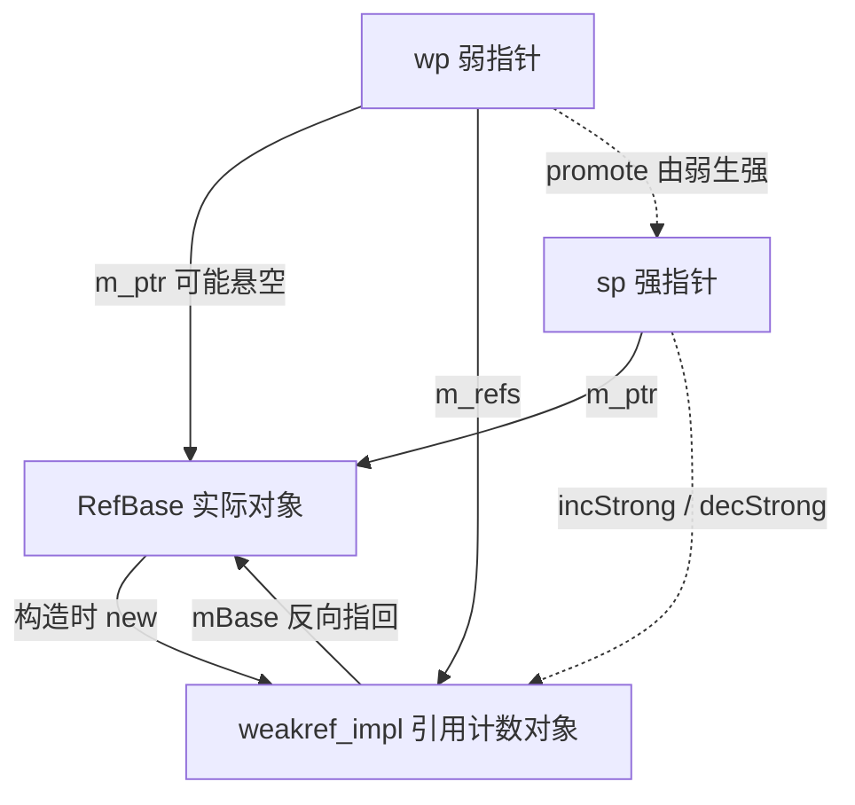
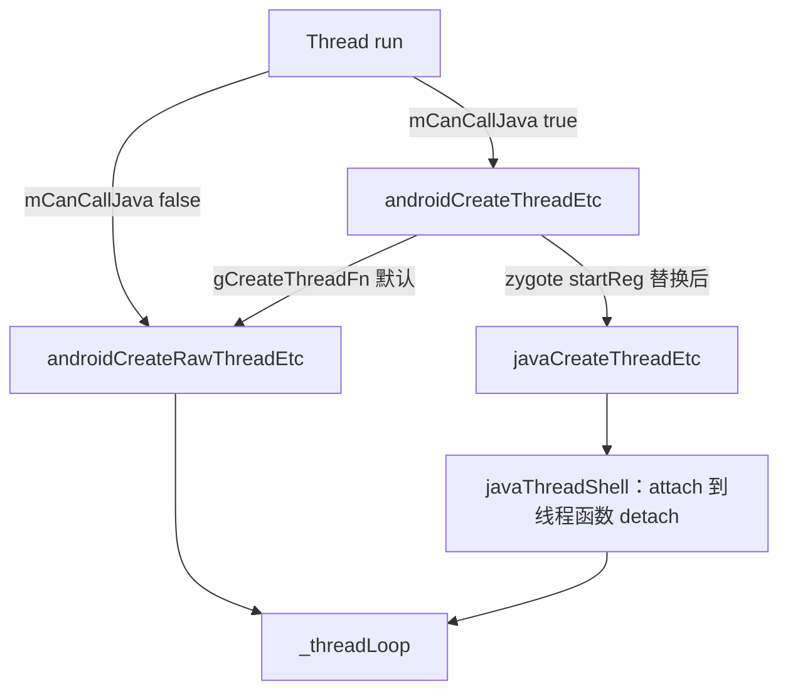
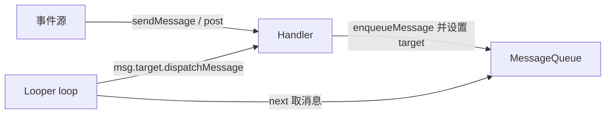

本篇对应原书第 5 章「深入理解常见类」。前面几章都在跟具体进程打交道，这一章回头补基础课：把阅读 Framework 源码时出现频率最高的三组类一次讲透——Native 层的 RefBase 与 sp/wp 引用计数体系、Thread 类与常用同步类、Java 层的 Looper 与 Handler 消息机制。原书基于 Android 2.2/2.3 源码逐行拆解这三组类，本章主线一句话：它们是 Native 与 Java Framework 的「公共语言」，不掌握它们，后面读任何一行 Framework 源码都会磕磕绊绊。

> 版本注意：原书成书于 2011 年（Android 2.2/2.3），本章各类至今仍是 Native 与 Java 层的基础设施（演进见文末备注）。

> 摘编声明：文中代码为原书代码的摘编版——保留主干、省略日志与无关分支，类名、函数名忠于原书原文。

## 1.1 概述

初次接触 Android 源码的人，见到最多的一定是 sp 和 wp；即使只沉迷于 Java 世界的编码，Looper 和 Handler 也避不开。本章的目的就是把这些最常见的「拦路虎」一网打尽。

本章涉及的源码文件如下（路径沿用原书 2.2/2.3 时代的源码树写法）：

| 文件 | 位置 |
|---|---|
| RefBase.h / RefBase.cpp | `framework/base/include/utils/`、`framework/base/libs/utils/` |
| Thread.h / Thread.cpp | `framework/base/include/utils/`、`framework/base/libs/utils/` |
| Atomic.h | `system/core/include/cutils/` |
| AndroidRuntime.cpp | `framework/base/core/jni/` |
| Looper.java / Handler.java / HandlerThread.java | `framework/base/core/java/android/os/` |

三组类的关系：RefBase 结合 sp、wp 实现一套**通过引用计数控制对象生命周期**的机制，是 Native 层对象体系的基座；Thread 类及同步类是 Native 层多线程编程的封装；Looper 与 Handler 则撑起了 Java 层「消息驱动」的运行模型。

## 1.2 RefBase、sp 与 wp：引用计数控制对象生命周期

RefBase 是 Android 中所有对象的始祖，类似 MFC 中的 CObject、Java 中的 Object。在 Native 层没有自动内存回收，Android 推出 sp 与 wp 的目的，用原书的话说就是「帮助健忘的程序员回收 new 出来的内存」。注意两个名字的真实含义：**sp 是 strong pointer（强指针），不是 C++ 里那个 smart pointer；wp 是 weak pointer（弱指针）**——原书认为这套设计有模仿 Java 中 weakreference 的痕迹。

原书用三个递进的例子（作者戏称「三板斧」）拆解这套机制，本篇沿用这一推进顺序：先看对象与引用计数的结构，再看由弱生强的 promote，最后看延长对象生命周期的 flags。

四个角色先摆清楚：



### 1.2.1 weakref_impl：RefBase 的影子对象

从最简单的例子开始。类 A 从 RefBase 派生，没有任何自己的功能，然后先后创建一个 sp 和一个 wp：

```cpp
// 类A从RefBase派生，RefBase是万物的始祖
class A : public RefBase {
    // A没有任何自己的功能
};
int main() {
    A* pA = new A;
    {
        // 注意sp、wp对象是在{}中创建的：先创建sp，然后创建wp
        sp<A> spA(pA);
        wp<A> wpA(spA);
        // 大括号结束前，先析构wp，再析构sp
    }
}
```

`new A` 的时候发生了什么？看 RefBase 的构造函数：

```cpp
RefBase::RefBase()
    : mRefs(new weakref_impl(this)) // 注意这句话
{
    // mRefs是RefBase的成员变量，指向new出来的weakref_impl对象
}
```

也就是说，**new 一个实际对象的同时，还会悄悄构造一个 weakref_impl 对象**——原书称它为「影子对象」，本篇后文直接用 weakref_impl 或引用计数对象指代。它的声明和构造如下：

```cpp
class RefBase::weakref_impl : public RefBase::weakref_type
// 从RefBase的内部类weakref_type派生
```

```cpp
weakref_impl(RefBase* base)
    : mStrong(INITIAL_STRONG_VALUE) // 强引用计数，初始值为0x1000000
    , mWeak(0)                      // 弱引用计数，初始值为0
    , mBase(base)                   // 该影子对象所指向的实际对象
    , mFlags(0)
    , mStrongRefs(NULL)
    , mWeakRefs(NULL)
    , mTrackEnabled(!!DEBUG_REFS_ENABLED_BY_DEFAULT)
    , mRetain(false)
{
}
```

weakref_impl 中藏着理解全章的钥匙——**两个引用计数：强引用计数 mStrong 与弱引用计数 mWeak**，都用原子变量保证多线程安全。mStrong 的初始值不是 0，而是一个特殊标记 `INITIAL_STRONG_VALUE`（0x1000000），用于区分「从未被强引用过」和「被强引用后归零」这两种状态，后面的 decWeak 会依赖这个区别。

两点补充说明：

- C++ 内部类（nested class）与 Java 内部类相似，但 C++ 的内部类需要一个显式成员（这里的 `mBase`）指向外部类对象，而 Java 内部类对象有一个隐式成员。
- weakref_impl 里还有 `mStrongRefs`、`mWeakRefs`、`mTrackEnabled`、`mRetain` 等成员，它们服务于调试版。release 版里这些跟踪函数全是空实现，碰到直接跳过即可：

```cpp
void addStrongRef(const void* /*id*/) { }
void removeStrongRef(const void* /*id*/) { }
void addWeakRef(const void* /*id*/) { }
void removeWeakRef(const void* /*id*/) { }
void printRefs() const { }
void trackMe(bool, bool) { }
```

### 1.2.2 sp 与 wp 的构造：强弱计数如何增加

结构清楚了，接下来看例 1 中 sp、wp 出生时对计数的影响。先看 sp 的构造函数（sp 是模板类，不熟悉模板的读者可以把所有 T 都换成 A）：

```cpp
template<typename T>
sp<T>::sp(T* other)              // 这里的other就是刚才创建的pA
    : m_ptr(other)               // sp保存了pA的指针
{
    if (other) other->incStrong(this); // 调用pA的incStrong
}
```

战场转到 RefBase 的 incStrong：

```cpp
void RefBase::incStrong(const void* id) const
{
    // mRefs就是RefBase构造函数中new出来的影子对象
    weakref_impl* const refs = mRefs;
    // 操作影子对象，先增加弱引用计数
    refs->addWeakRef(id);     // 非调试版什么都不干
    refs->incWeak(id);
    ......
    // 再增加强引用计数
    refs->addStrongRef(id);   // 非调试版什么都不干
    // 原子加1并返回旧值：c=0x1000000，mStrong变为0x1000001
    const int32_t c = android_atomic_inc(&refs->mStrong);
    if (c != INITIAL_STRONG_VALUE) {
        // c不是初始值，表明这个对象已经被强引用过一次了
        return;
    }
    // 原子加操作，相当于执行refs->mStrong + (-0x1000000)，最终mStrong=1
    android_atomic_add(-INITIAL_STRONG_VALUE, &refs->mStrong);
    // 第一次被强引用，调用onFirstRef。这个函数很重要，
    // 派生类可以重载它完成一些初始化工作
    const_cast<RefBase*>(this)->onFirstRef();
}
```

其中 incWeak 由 weakref_type 实现：

```cpp
void RefBase::weakref_type::incWeak(const void* id)
{
    weakref_impl* const impl = static_cast<weakref_impl*>(this);
    impl->addWeakRef(id); // 上面说了，非调试版什么都不干
    // 原子操作，影子对象的弱引用计数加1
    const int32_t c = android_atomic_inc(&impl->mWeak);
}
```

结论：**sp 的出生导致 weakref_impl 的强引用计数加 1，且弱引用计数也加 1**——强引用必然伴随一个弱引用，所以弱计数始终不小于强计数。本例中 sp 构造完后，强计数为 1，弱计数为 1。

再看 wp。wp 有好几个构造函数，原理都一样，看最常见的这个：

```cpp
template<typename T>
wp<T>::wp(const sp<T>& other)
    : m_ptr(other.m_ptr)  // wp的成员变量m_ptr指向实际对象
{
    if (m_ptr) {
        // 调用pA的createWeak，返回值保存到成员变量m_refs中
        m_refs = m_ptr->createWeak(this);
    }
}
```

```cpp
RefBase::weakref_type* RefBase::createWeak(const void* id) const
{
    // 调用影子对象的incWeak，导致弱引用计数加1
    mRefs->incWeak(id);
    return mRefs;  // 返回影子对象本身
}
```

对比两边的成员变量：**sp 只有一个 m_ptr 保存实际对象**（实际对象内部已包含 weakref_impl）；**wp 有两个成员——m_ptr 保存实际对象、m_refs 保存 weakref_impl**。这个差别是后面一切行为差异的来源：实际对象被 delete 后 m_ptr 就悬空了，但 weakref_impl 可能还活着，wp 靠 m_refs 探测对象的生死。

例 1 中 wp 构造完后：弱引用计数增加 1 变为 2，强引用计数仍为 1。

### 1.2.3 wp 与 sp 的析构：decWeak 与 decStrong

大括号结束，先析构 wp，再析构 sp。wp 的析构函数：

```cpp
template<typename T>
wp<T>::~wp()
{
    if (m_ptr) m_refs->decWeak(this); // 调用影子对象的decWeak，由其基类实现
}
```

decWeak 是整个体系里最关键、分支最多的函数，完整看一遍（例 1 的路径：弱计数从 2 减到 1）：

```cpp
void RefBase::weakref_type::decWeak(const void* id)
{
    // 把基类指针转换成子类（影子对象）的类型
    weakref_impl* const impl = static_cast<weakref_impl*>(this);
    impl->removeWeakRef(id); // 非调试版不做任何事情

    // 原子减1并返回旧值。例1的wp析构路径：c=2，弱引用计数从2变为1
    const int32_t c = android_atomic_dec(&impl->mWeak);
    if (c != 1) return;      // c=2，直接返回

    // c为1，说明弱引用计数已减为0，需要考虑释放内存
    if ((impl->mFlags & OBJECT_LIFETIME_WEAK) != OBJECT_LIFETIME_WEAK) {
        if (impl->mStrong == INITIAL_STRONG_VALUE)
            delete impl->mBase; // 从未被强引用过：delete实际对象
        else {
            delete impl;        // 否则delete影子对象自己
        }
    } else {
        impl->mBase->onLastWeakRef(id);
        if ((impl->mFlags & OBJECT_LIFETIME_FOREVER) != OBJECT_LIFETIME_FOREVER) {
            delete impl->mBase;
        }
    }
}
```

例 1 中 wp 析构后弱计数为 1、强计数仍为 1，decWeak 在 `if (c != 1) return` 处直接返回，什么都没被释放。接着析构 sp：

```cpp
template<typename T>
sp<T>::~sp()
{
    if (m_ptr) m_ptr->decStrong(this); // 调用实际对象的decStrong，由RefBase实现
}
```

```cpp
void RefBase::decStrong(const void* id) const
{
    weakref_impl* const refs = mRefs;
    refs->removeStrongRef(id); // 非调试版什么都不干
    // 例1中强弱计数都是1，这里c=1，强引用计数减为0
    const int32_t c = android_atomic_dec(&refs->mStrong);
    if (c == 1) {
        // 强引用计数归0，对象有可能被delete
        const_cast<RefBase*>(this)->onLastStrongRef(id);
        // mFlags为0，所以会delete this把自己干掉
        // 注意：此时弱引用计数仍为1，影子对象还活着
        if ((refs->mFlags & OBJECT_LIFETIME_WEAK) != OBJECT_LIFETIME_WEAK) {
            delete this;
        }
    }
    // 实际数据对象可能已经被干掉，mRefs也随之不可信，
    // 但decStrong刚进来时就把mRefs保存到了refs，所以这里refs仍指向影子对象
    refs->removeWeakRef(id);
    refs->decWeak(id); // 调用影子对象的decWeak，减掉强引用伴随的弱引用
}
```

`delete this` 触发 A 的析构函数，进而进入 RefBase 的析构：

```cpp
// A的析构直接导致进入RefBase的析构
RefBase::~RefBase()
{
    if (mRefs->mWeak == 0) { // 例1中此时弱引用计数是1，条件不满足
        delete mRefs;
    }
}
```

弱计数是 1，影子对象暂时不被释放。流程回到 decStrong 尾部，执行 `refs->decWeak(id)`：弱计数从 1 减到 0，c=1，进入释放分支；mFlags 为 0，走 if 分支；此时 `mStrong` 是 0 而不是 `INITIAL_STRONG_VALUE`（对象被强引用过），于是执行 `delete impl`——**影子对象把自己干掉**。

至此例 1 的完整轨迹：实际对象在 decStrong 中被 delete，影子对象在随后的 decWeak 中被 delete。flags 为 0（默认值）时的结论：

- **强引用计数为 0，导致实际对象被 delete**；
- **弱引用计数为 0，导致影子对象被 delete**。

完全彻底地消灭一个 RefBase 对象，就是让实际对象和影子对象都灭亡，这由强弱引用计数配合 flags 控制。原书反复强调：千万记住 weakref_impl 中强弱引用计数的值，这是彻底理解 sp 和 wp 的关键。

### 1.2.4 由弱生强：promote 与 attemptIncStrong

第二个例子考察「由弱生强」：只有一个 wp，能否把它提升成 sp？

```cpp
int main()
{
    A* pA = new A();
    wp<A> wpA(pA);
    sp<A> spA = wpA.promote(); // 通过promote函数，得到一个sp
}
```

wp 化后弱计数为 1，强计数仍是初始值 0x1000000。promote 的实现：

```cpp
template<typename T>
sp<T> wp<T>::promote() const
{
    return sp<T>(m_ptr, m_refs); // 调用sp的构造函数
}
```

它调用的是 sp 的另一个构造函数：

```cpp
template<typename T>
sp<T>::sp(T* p, weakref_type* refs)
    : m_ptr((p && refs->attemptIncStrong(this)) ? p : 0)
{
    // 上面那行代码够简洁，但是不方便阅读，等价于：
    // T* pTemp = NULL;
    // if (p != NULL && refs->attemptIncStrong(this) == true)
    //     pTemp = p;
    // m_ptr = pTemp;
}
```

成败全在 attemptIncStrong：

```cpp
bool RefBase::weakref_type::attemptIncStrong(const void* id)
{
    incWeak(id); // 增加弱引用计数，本例中弱引用计数变为2
    weakref_impl* const impl = static_cast<weakref_impl*>(this);
    int32_t curCount = impl->mStrong; // 这个仍是初始值
    // 这个循环在多线程操作同一个对象时可能会循环多次，
    // 目的就是使强引用计数增加1
    while (curCount > 0 && curCount != INITIAL_STRONG_VALUE) {
        if (android_atomic_cmpxchg(curCount, curCount+1, &impl->mStrong) == 0) {
            break;
        }
        curCount = impl->mStrong;
    }

    if (curCount <= 0 || curCount == INITIAL_STRONG_VALUE) {
        bool allow;
        /*
          下面这个allow的判断极为精妙：impl的mBase就是实际对象，
          它有可能已经被delete了。curCount为0，表示强计数肯定经历了
          INITIAL_STRONG_VALUE -> 1 -> ... -> 0 的过程。
          必须根据flags来决定是否继续||或&&后面的判断，因为这些判断都使用了mBase；
          如不做这些判断，一旦mBase指向已经回收的地址，就等着segment fault吧
        */
        if (curCount == INITIAL_STRONG_VALUE) {
            allow = (impl->mFlags&OBJECT_LIFETIME_WEAK) != OBJECT_LIFETIME_WEAK
                || impl->mBase->onIncStrongAttempted(FIRST_INC_STRONG, id);
        } else {
            allow = (impl->mFlags&OBJECT_LIFETIME_WEAK) == OBJECT_LIFETIME_WEAK
                && impl->mBase->onIncStrongAttempted(FIRST_INC_STRONG, id);
        }
        if (!allow) {
            // 不允许由弱生强，弱引用计数要减1，因为进来时加过一次
            decWeak(id);
            return false; // 由弱生强失败
        }

        // 允许由弱生强，强引用计数增加1，弱引用计数已经增加过了
        curCount = android_atomic_inc(&impl->mStrong);
        if (curCount > 0 && curCount < INITIAL_STRONG_VALUE) {
            impl->mBase->onLastStrongRef(id);
        }
    }
    impl->addWeakRef(id);
    impl->addStrongRef(id); // 两个函数调用没有作用（非调试版）
    if (curCount == INITIAL_STRONG_VALUE) {
        // 强引用计数变为1
        android_atomic_add(-INITIAL_STRONG_VALUE, &impl->mStrong);
        // 调用onFirstRef，通知该对象第一次被强引用
        impl->mBase->onFirstRef();
    }
    return true; // 由弱生强成功
}
```

逻辑分三层：

1. **快路径**：强计数大于 0 且不是初始值，说明对象活得很好，用 `android_atomic_cmpxchg` 原子比较交换把强计数加 1 即可（多线程竞争失败就重读再试）。
2. **需要裁决的路径**：强计数是初始值（从未被强引用过）或为 0（曾经强引用过但已归零，实际对象很可能已被 delete）。此时由 flags 与虚函数 `onIncStrongAttempted` 共同裁决是否允许提升——注意原书点出的精妙之处：必须先看 flags 决定短路顺序，避免在 mBase 已死的情况下还去调用它的虚函数。
3. 提升成功后若这是第一次强引用，扣除初始值并把强计数归一，再回调 onFirstRef。

例 2 的结果：**由弱生强成功后，强弱引用计数均增加 1**——影子对象的强引用计数为 1，弱引用计数为 2。而 promote 失败时（allow 为 false），返回的 sp 内部 m_ptr 为 0，也就是一个空 sp——调用方借此优雅地感知「对象已经没了」，而不是拿着悬空指针去撞 segment fault。

### 1.2.5 对象生命周期控制：extendObjectLifetime 的三种 flags

第三个例子解开生命周期策略：flags 取不同值时，强弱计数对生死的控制权不同。RefBase 提供了设置函数和枚举：

```cpp
// RefBase提供的延长对象生命周期的函数
void extendObjectLifetime(int32_t mode);

enum {
    OBJECT_LIFETIME_WEAK    = 0x0001,
    OBJECT_LIFETIME_FOREVER = 0x0003
};
// 注意：FOREVER的值是3，二进制是B11；WEAK是B01，
// 也就是说FOREVER包括了WEAK的情况
```

例 3 在构造函数里把 flags 设为 OBJECT_LIFETIME_WEAK：

```cpp
class A : public RefBase {
public:
    A() {
        extendObjectLifetime(OBJECT_LIFETIME_WEAK); // 在构造函数中调用
    }
};
int main()
{
    A* pA = new A();
    wp<A> wpA(pA);    // 弱引用计数加1
    {
        sp<A> spA(pA); // sp后，结果是强引用计数为1，弱引用计数为2
    }
    ....
}
```

内层大括号结束时 sp 析构，走 decStrong。对照 1.2.3 的完整代码，这次 mFlags 是 WEAK：

```cpp
void RefBase::decStrong(const void* id) const
{
    weakref_impl* const refs = mRefs;
    refs->removeStrongRef(id);
    const int32_t c = android_atomic_dec(&refs->mStrong);
    if (c == 1) { // 原子操作后，强引用计数为0
        const_cast<RefBase*>(this)->onLastStrongRef(id);
        // 注意这句话：如果flags不是WEAK或FOREVER，将delete实际对象。
        // 现在flags是WEAK，所以不会delete它
        if ((refs->mFlags & OBJECT_LIFETIME_WEAK) != OBJECT_LIFETIME_WEAK) {
            delete this;
        }
    }
    refs->removeWeakRef(id);
    refs->decWeak(id); // 调用前弱引用计数是2
}
```

强计数归零，但实际对象活了下来——**「强引用为 0 就死」的默认规则被 WEAK 关掉了**。随后 decWeak 把弱计数从 2 减到 1（c=2，直接返回），对象继续存活。

等到例 3 末尾 wpA 析构，decWeak 把弱计数从 1 减到 0，c=1，这次 mFlags 是 WEAK，走 else 分支：

```cpp
} else { // flags为WEAK，满足else分支的条件
    impl->mBase->onLastWeakRef(id);
    /*
      flags不满足FOREVER条件，实际对象会被delete。
      实际对象的delete会进入RefBase析构，检查影子对象的弱引用计数：
      如果它为0，则把影子对象也delete掉。
      由于此时弱引用计数已经是0，所以影子对象也会被delete
    */
    if ((impl->mFlags & OBJECT_LIFETIME_FOREVER) != OBJECT_LIFETIME_FOREVER) {
        delete impl->mBase;
    }
}
```

功德圆满：实际对象与影子对象同归于尽。三种 flags 的完整结论（默认 flags=0 时不存在第三种延迟，强归零即死）：

| mFlags | 实际对象的析构时机 | 说明 |
|---|---|---|
| 0（默认） | 强引用计数归 0（decStrong 中 delete this） | 弱引用计数只管影子对象：弱归 0 时 decWeak 中 delete impl。使用 wp 时必须由弱生强再访问对象，否则 m_ptr 悬空，等着收 segment fault 信号 |
| OBJECT_LIFETIME_WEAK（0x0001） | 强、弱引用计数**同时**归 0（decWeak 中 delete mBase） | 强归 0 时只回调 onLastStrongRef，不 delete；弱归 0 时回调 onLastWeakRef 后实际对象与影子对象一起灭亡 |
| OBJECT_LIFETIME_FOREVER（0x0003） | 不受强弱引用计数控制 | 对象「长生不老」，必须在适当的时候手工 delete，否则内存泄漏 |

与生命周期相关的回调一并汇总：**onFirstRef**（第一次被强引用，子类初始化的时机）、**onLastStrongRef**（最后一个强引用消失）、**onIncStrongAttempted**（由弱生强时的裁决点）、**onLastWeakRef**（最后一个弱引用消失，仅 WEAK/FOREVER 模式会走到）。

原书作者的一个实践建议值得采纳：RefBase、sp、wp 代码量不大、依赖极少，可以整套移植到 PC 上的开发环境（如 Visual Studio，原子操作用 InterlockedExchangeXXX 系列对应；Linux 上不考虑多线程时换成普通操作也可以）单独调试，把三个例子的计数变化亲手跑一遍，比在设备上调试 native 代码省力得多。

### 1.2.6 LightRefBase：轻量级引用计数基类

RefBase 是重量级的引用计数控制类，强弱双计数加影子对象。如果只需要最基本的计数，Android 还提供了轻量级的 LightRefBase：

```cpp
template <class T>
class LightRefBase
{
public:
    inline LightRefBase() : mCount(0) { }
    inline void incStrong(const void* id) const {
        // LightRefBase只有一个引用计数控制量mCount，incStrong使它增加1
        android_atomic_inc(&mCount);
    }
    inline void decStrong(const void* id) const {
        // decStrong减1，引用计数为0时delete掉自己
        if (android_atomic_dec(&mCount) == 1) {
            delete static_cast<const T*>(this);
        }
    }
    inline int32_t getStrongCount() const {
        return mCount;
    }

protected:
    inline ~LightRefBase() { }

private:
    mutable volatile int32_t mCount; // 引用计数控制变量
};
```

用法上注意它是模板类，派生时要指明模板参数：

```cpp
class A : public LightRefBase<A> // 注意派生的时候要指明是LightRefBase<A>
{
public:
    A() {};
    ~A() {};
};
```

LightRefBase 只有 incStrong 与 decStrong 两个接口，所以**它只支持 sp 的控制，不支持 wp**——没有弱计数，也就没有由弱生强和死亡探测的能力。

## 1.3 Thread 类与常用同步类

Native 层的对象体系清楚了，接下来看多线程。Thread 类是 Android 对线程操作的封装（基于 pthread），Thread.cpp 所在的 libutils 里还定义了与线程同步相关的类。既然是封装，掌握它的前提是掌握 pthread 对应的 Raw API。

### 1.3.1 Thread 类与 canCallJava：一个参数引发的两种线程创建路径

Thread 类本身简单，但构造函数里有一个参数曾让原书作者颇费思量：

```cpp
// canCallJava表示这个线程是否会使用JNI函数。为什么需要这样一个参数呢？
Thread(bool canCallJava = true);
```

答案藏在真正的线程创建处——run 函数：

```cpp
status_t Thread::run(const char* name, int32_t priority, size_t stack)
{
    Mutex::Autolock _l(mLock);
    ....
    // 如果mCanCallJava为真，则调用createThreadEtc函数，线程函数都是_threadLoop
    if (mCanCallJava) {
        res = createThreadEtc(_threadLoop, this, name, priority,
                              stack, &mThread);
    } else {
        res = androidCreateRawThreadEtc(_threadLoop, this, name, priority,
                                        stack, &mThread);
    }
}
```

一个变量，两种处理。两个分支传入的线程函数都是 `_threadLoop`，区别在创建函数。看 mCanCallJava 为 true 这条链路：

```cpp
inline bool createThreadEtc(thread_func_t entryFunction,
                            void* userData,
                            const char* threadName = "android:unnamed_thread",
                            int32_t threadPriority = PRIORITY_DEFAULT,
                            size_t threadStackSize = 0,
                            thread_id_t* threadId = 0)
{
    return androidCreateThreadEtc(entryFunction, userData, threadName,
                    threadPriority, threadStackSize, threadId) ? true : false;
}

// gCreateThreadFn是函数指针，初始指向androidCreateRawThreadEtc。
// 如果没有人修改它，mCanCallJava就是虚晃一枪，并无作用
static android_create_thread_fn gCreateThreadFn = androidCreateRawThreadEtc;

int androidCreateThreadEtc(android_thread_func_t entryFunction,
                            void* userData, const char* threadName,
                            int32_t threadPriority, size_t threadStackSize,
                            android_thread_id_t* threadId)
{
    return gCreateThreadFn(entryFunction, userData, threadName,
                            threadPriority, threadStackSize, threadId);
}
```

关键在 `gCreateThreadFn` 这个函数指针：默认与 mCanCallJava 为 false 时指向同一个函数，但有的地方会修改它的指向——zygote 启动时 AndroidRuntime 的 startReg 就干了这件事：

```cpp
/*static*/ int AndroidRuntime::startReg(JNIEnv* env)
{
    // 这里会修改函数指针为javaCreateThreadEtc
    androidSetCreateThreadFunc((android_create_thread_fn)javaCreateThreadEtc);
    return 0;
}
```

于是在 Android 运行时环境起来之后，mCanCallJava 为 true 的线程创建走 javaCreateThreadEtc：

```cpp
int AndroidRuntime::javaCreateThreadEtc(
                                android_thread_func_t entryFunction,
                                void* userData,
                                const char* threadName,
                                int32_t threadPriority,
                                size_t threadStackSize,
                                android_thread_id_t* threadId)
{
    void** args = (void**)malloc(3 * sizeof(void*));
    int result;
    args[0] = (void*)entryFunction;
    args[1] = userData;
    args[2] = (void*)strdup(threadName);
    // 调用的还是androidCreateRawThreadEtc，但线程函数换成了javaThreadShell
    result = androidCreateRawThreadEtc(AndroidRuntime::javaThreadShell, args,
                            threadName, threadPriority, threadStackSize, threadId);
    return result;
}

int AndroidRuntime::javaThreadShell(void* args) {
    ......
    int result;
    // 把这个线程attach到JNI环境中，这样这个线程就可以调用JNI函数了
    if (javaAttachThread(name, &env) != JNI_OK)
        return -1;
    // 调用实际的线程函数干活
    result = (*(android_thread_func_t)start)(userData);
    // 从JNI环境中detach出来
    javaDetachThread();
    free(name);
    return result;
}
```

mCanCallJava 为 true 的目的水落石出：**新线程在调用用户的线程函数之前先 attach 到 JNI（Java Native Interface）环境，线程函数退出后再 detach**。第二点尤其重要：进程退出前 dalvik 虚拟机会检查是否还有 attach 了却未 detach 的线程，如果有则直接 abort（这不是好事）。如果直接使用 POSIX 的线程创建函数，凡 attach 过的线程最后都必须 detach。

整条链路图示：



### 1.3.2 _threadLoop：线程函数、退出条件与 mHoldSelf 自引用

无论走哪条创建路径，最终的线程函数都是 Thread.cpp 中的 `_threadLoop`。为什么不直接调用用户传入的线程函数？因为它有一套「暗箱操作」：

```cpp
int Thread::_threadLoop(void* user)
{
    Thread* const self = static_cast<Thread*>(user);
    sp<Thread> strong(self->mHoldSelf); // 取出Thread对象自己持有的sp自引用
    wp<Thread> weak(strong);
    self->mHoldSelf.clear();

#if HAVE_ANDROID_OS
    self->mTid = gettid();
#endif
    bool first = true;

    do {
        bool result;
        if (first) {
            first = false;
            // 第一次进来先调用readyToRun，看看是否准备好
            self->mStatus = self->readyToRun();
            result = (self->mStatus == NO_ERROR);

            if (result && !self->mExitPending) {
                result = self->threadLoop();
            }
        } else {
            // 调用子类实现的threadLoop函数。注意这段代码运行在do-while循环中，
            // 这表示即使threadLoop返回了，线程也不一定会退出
            result = self->threadLoop();
        }
        /*
          线程退出的条件：
          1）result为false：子类在threadLoop中返回false，线程主动退出，
             这是threadLoop自己不想继续干活了。千万别写错返回值。
          2）mExitPending为true：由Thread类的requestExit函数设置，
             属于外界强制设置的被动退出
        */
        if (result == false || self->mExitPending) {
            self->mExitPending = true;
            self->mLock.lock();
            self->mRunning = false;              // mRunning的修改位于锁的保护中
            self->mThreadExitedCondition.broadcast(); // 退出前触发条件变量，唤醒等待者
            self->mLock.unlock();
            break; // 退出循环，此后线程函数退出
        }
        strong.clear();
        strong = weak.promote(); // 尝试续命：外部若已无强引用，promote失败
    } while (strong != 0);

    return 0;
}
```

三个要点：

- **threadLoop 运行在一个循环中，它的返回值决定是否退出线程**：返回 true 则再次调用，天然的循环工作模式；返回 false 或外界调用了 requestExit（置 mExitPending），线程退出。这是使用 Thread 类最容易犯错的地方。
- 开头的 `sp<Thread> strong(self->mHoldSelf)` 与结尾的 `strong = weak.promote()` 是 RefBase 体系的实战应用：线程运行期间靠自引用的 sp 保住 Thread 对象不被析构；每一轮循环结束先释放强引用、再用弱引用尝试提升，**如果外部已经没有任何 sp 持有这个 Thread 对象，promote 失败，线程自动退出**。
- 退出前在锁保护下修改 mRunning 并 broadcast 条件变量，这是给 requestExitAndWait 用的，呼应下一小节。

requestExitAndWait 演示了等待线程退出的标准姿势：

```cpp
status_t Thread::requestExitAndWait()
{
    ......
    requestExit();             // 设置退出变量mExitPending为true
    Mutex::Autolock _l(mLock); // 使用Autolock，mLock被锁住
    while (mRunning == true) {
        /*
          条件变量的等待。为什么要通过while循环反复检测mRunning？
          因为某些时候即使条件没有被触发，wait也会返回（虚假唤醒）
        */
        mThreadExitedCondition.wait(mLock);
    }

    mExitPending = false;
    // 退出前，局部变量Mutex::Autolock _l的析构会被调用，unlock自动执行
    return mStatus;
}
```

### 1.3.3 常用同步类：Mutex 与 Autolock

同步是多线程编程回避不了的话题。Android 的同步类只是对系统提供的多线程同步函数（原书称 Raw API，即 pthread 系列）做面向对象封装，必须先理解 Raw API 才能真正掌握用法。重量级的有两个：互斥类 Mutex 与条件类 Condition，此外还有轻量的原子操作。

Mutex 用于多线程访问同一资源时保证一次只有一个线程能访问，《Windows 核心编程》里有个形象的比喻：飞机上如厕，卫生间门牌显示「有人」，你得等里面的人出来。实现很简单：

```cpp
inline Mutex::Mutex(int type, const char* name) {
    if (type == SHARED) {
        // type是SHARED，表示这个Mutex支持跨进程的线程同步，
        // Audio系统和Surface系统中会经常见到这种用法
        pthread_mutexattr_t attr;
        pthread_mutexattr_init(&attr);
        pthread_mutexattr_setpshared(&attr, PTHREAD_PROCESS_SHARED);
        pthread_mutex_init(&mMutex, &attr);
        pthread_mutexattr_destroy(&attr);
    } else {
        pthread_mutex_init(&mMutex, NULL);
    }
}
inline Mutex::~Mutex() {
    pthread_mutex_destroy(&mMutex);
}
inline status_t Mutex::lock() {
    return -pthread_mutex_lock(&mMutex);
}
inline void Mutex::unlock() {
    pthread_mutex_unlock(&mMutex);
}
inline status_t Mutex::tryLock() {
    return -pthread_mutex_trylock(&mMutex);
}
```

用法：想独占资源先调用 lock——若该区域已被别人锁住，lock 会等待；系统保证一次只有一个线程 lock 成功。「方便」完毕后调用 unlock 释放。tryLock 只尝试锁定，由使用者根据返回值判断是否成功。

直接使用 Mutex 稍显麻烦：lock 之后必须在每个出口记得 unlock，判断分支一多，unlock 写得比比皆是，稍有遗漏就是死锁。解决方案是定义在 Mutex 内部的 Autolock 类，充分利用 C++ 构造与析构自动调用的特性：

```cpp
class Autolock {
public:
    // 构造的时候调用lock
    inline Autolock(Mutex& mutex) : mLock(mutex)   { mLock.lock(); }
    inline Autolock(Mutex* mutex) : mLock(*mutex)  { mLock.lock(); }
    // 析构的时候调用unlock
    inline ~Autolock()                             { mLock.unlock(); }
private:
    Mutex& mLock;
};
```

用法两步：先定义一个 Mutex（如 `Mutex xlock`），再在使用 xlock 的地方定义 `Autolock autoLock(xlock)`（`Mutex::Autolock _l(mLock)` 是 Framework 源码里最常见的写法，另有别名 `AutoMutex`）。在 Autolock 的生命周期内，lock 与 unlock 的调用由编译器保证一一对应，绝对不会出错。

### 1.3.4 Condition：条件变量及其与 Mutex 的强制配合

Condition 对应这样的场景：线程 A 做初始化工作，线程 B、C 必须等初始化完成才能干活——B、C 在等待一个条件，称为等待者；A 完成工作时触发条件，唤醒等待者，称为触发者。类的声明：

```java
class Condition {
public:
    enum {
        PRIVATE = 0,
        SHARED = 1
    };

    Condition();
    Condition(int type); // 如果type是SHARED，表示支持跨进程的条件同步
    ~Condition();
    // 等待者B、C等待事件，wait这个名字很形象
    status_t wait(Mutex& mutex);
    // 等待者的超时等待：超过reltime条件仍不满足，则退出等待
    status_t waitRelative(Mutex& mutex, nsecs_t reltime);
    // 触发者A通知条件已满足，只有一个等待者会被唤醒
    void signal();
    // 触发者A通知条件已满足，所有等待者都会被唤醒
    void broadcast();

private:
#if defined(HAVE_PTHREADS)
    pthread_cond_t mCond;
#else
    void*    mState;
#endif
}
```

实现全是 pthread_cond_xxx 的直接转发：

```cpp
inline Condition::Condition() {
    pthread_cond_init(&mCond, NULL);
}
inline Condition::Condition(int type) {
    if (type == SHARED) { // 设置跨进程的同步支持
        pthread_condattr_t attr;
        pthread_condattr_init(&attr);
        pthread_condattr_setpshared(&attr, PTHREAD_PROCESS_SHARED);
        pthread_cond_init(&mCond, &attr);
        pthread_condattr_destroy(&attr);
    } else {
        pthread_cond_init(&mCond, NULL);
    }
}
inline Condition::~Condition() {
    pthread_cond_destroy(&mCond);
}
inline status_t Condition::wait(Mutex& mutex) {
    return -pthread_cond_wait(&mCond, &mutex.mMutex);
}
inline status_t Condition::waitRelative(Mutex& mutex, nsecs_t reltime) {
#if defined(HAVE_PTHREAD_COND_TIMEDWAIT_RELATIVE)
    struct timespec ts;
    ts.tv_sec  = reltime/1000000000;
    ts.tv_nsec = reltime%1000000000;
    return -pthread_cond_timedwait_relative_np(&mCond, &mutex.mMutex, &ts);
    ...... // 有些系统没有实现POSIX的相关函数，不同系统调用不同函数
#endif
}
inline void Condition::signal() {
    pthread_cond_signal(&mCond);
}
inline void Condition::broadcast() {
    pthread_cond_broadcast(&mCond);
}
```

重点是**Condition 必须配合 Mutex 使用**：wait、waitRelative、signal、broadcast 的调用都要放在一个 Mutex 的 lock 与 unlock 范围之内，尤其是 wait 和 waitRelative，这是强制性的。配合的正确形态在 requestExitAndWait 里已经出现过——**wait 外面套 while 循环反复检测条件**，因为条件未被触发时 wait 也可能返回（虚假唤醒）。这一「Mutex 加 while 的 wait」组合是 Framework 源码中条件等待的标准范式。

### 1.3.5 原子操作：从一个 g_flag 变量说起

一道经典问题：两个线程分别对同一个全局变量递增、递减，每次操作都加了锁，这个锁能不能去掉？

```cpp
static int g_flag = 0; // 全局变量g_flag
static Mutex lock;     // 全局的锁
// 线程1执行thread1
void thread1()
{
    // g_flag递减，每次操作前锁住
    lock.lock();
    g_flag--;
    lock.unlock();
}
// 线程2执行thread2
void thread2()
{
    lock.lock();
    g_flag++; // 线程2对g_flag递增，每次操作前要取得锁
    lock.unlock();
}
```

为什么需要 Mutex 帮忙？因为 **g_flag++ 或 g_flag-- 都不是原子操作**。从汇编指令的角度看，C/C++ 的一条语句对应数条汇编指令，以 g_flag++ 为例大致是三步：从内存取数据到寄存器；对寄存器中的数据递增；把寄存器结果写回内存。单线程按顺序执行没有问题，多线程时无法保证：线程 1 执行完第一条指令后被调度出去，线程 2 抢先连续执行完三条指令，线程 1 回来继续用的就是旧值，再操作便没有意义了。

用 Mutex 可以解决，但杀鸡用牛刀：锁的使用可能导致用户态到内核态的切换，为一个自增付出这代价太浪费。更轻的办法是**原子操作**——该操作绝不会在执行完毕前被任何其他任务或事件打断，是最小的执行单位，但需要 CPU 支持。x86 平台上一个原子递增可以用内嵌汇编实现（这是原书作者在 Linux 上实现 Windows API InterlockedIncrement 时使用的方法）：

```c
#define LOCK "lock;"
INT32 InterlockedIncrement(INT32* lpAddend)
{
    /*
      在SMP系统上，LOCK定义成"lock;"表示锁总线，同一时刻只能有一个CPU访问总线；
      非SMP系统LOCK定义为空。由于InterlockedIncrement要返回递增前的旧值，
      所以使用xaddl指令：先交换源和目的操作数，再进行递增操作
    */
    INT32 i = 1;
    __asm__ __volatile__(
            LOCK "xaddl %0, %1"
            :"+r" (i), "+m" (*lpAddend)
            : : "memory");
    return *lpAddend;
}
```

Android 把这类操作封装成了平台无关的接口（位于 `system/core/include/cutils/Atomic.h`）：

```c
// 原子赋值操作，结果是*addr=value
void android_atomic_write(int32_t value, volatile int32_t* addr);
// 下面所有函数的返回值都是操作前的旧值
// 原子加1和原子减1
int32_t android_atomic_inc(volatile int32_t* addr);
int32_t android_atomic_dec(volatile int32_t* addr);
// 原子加法操作，value为被加数
int32_t android_atomic_add(int32_t value, volatile int32_t* addr);
// 原子“与”和“或”操作
int32_t android_atomic_and(int32_t value, volatile int32_t* addr);
int32_t android_atomic_or(int32_t value, volatile int32_t* addr);
/*
  条件交换的原子操作。只有oldValue等于*addr时，才会把newValue赋值给*addr。
  返回值须特别注意：非零表示没有进行赋值操作；为零表示进行了原子操作
*/
int android_atomic_cmpxchg(int32_t oldvalue, int32_t newvalue,
                            volatile int32_t* addr);
```

注意两点：其一，**返回值都是操作前的旧值**——1.2 节 incStrong/decStrong 里判断 `c == 1`、`c != INITIAL_STRONG_VALUE` 全是拿旧值做文章；其二，**android_atomic_cmpxchg 的返回值非零表示没有发生交换**——attemptIncStrong 快路径里 `cmpxchg(...) == 0` 才代表加 1 成功。另外 SMP（Symmetric Multi-Processing，对称多处理器）系统上原子指令要配合锁总线，这也是 Atomic.h 中 LOCK 宏的由来。原子操作的最大好处是避免了锁的使用；多核并行编程的最高境界就是完全不使用锁，当然难度也巨大。

## 1.4 Looper 与 Handler：Java 层的消息驱动模型

Native 层的基础设施看完，转到 Java 层。Android 的 Java 应用程序和其他系统一样，靠消息驱动工作，原理只有两条：有一个消息队列，可以往里面投递消息；有一个消息循环，不断从队列取出消息然后处理。


事件源把待处理的消息加入消息队列（一般加至队尾，优先级高的消息可加至队头，从而被优先处理）。事件源提交的消息可以是按键、触摸屏等物理事件产生的消息，也可以是系统或应用程序本身发出的请求。这两项工作在 Android 中由两个类分担：**Looper 封装消息循环，并拥有一个消息队列；Handler 封装消息投递、消息处理等接口**。

### 1.4.1 Looper 类：prepare 绑定线程、loop 取消息分发

从一个常见用例入手：

```java
// 定义一个LooperThread
class LooperThread extends Thread {
    public Handler mHandler;
    public void run() {
        // ① 调用prepare
        Looper.prepare();
        ......
        // ② 进入消息循环
        Looper.loop();
    }
}
// 应用程序使用LooperThread
{
    ......
    new LooperThread().start(); // 启动新线程，线程函数是run
}
```

两个关键调用逐一分析。先看 prepare：

```java
public static final void prepare() {
    if (sThreadLocal.get() != null) {
        throw new RuntimeException("Only one Looper may be created per thread.");
    }
    sThreadLocal.set(new Looper());
}
```

ThreadLocal 是 Java 的线程局部变量类（原书称 TLV，Thread Local Variable），其实现与操作系统提供的线程本地存储（Thread Local Storage，TLS）相关，两个关键函数：set 设置调用线程的局部变量，get 获取调用线程的局部变量——set 与 get 的结果都和调用该函数的线程绑定。所以 prepare 做的事是：在调用线程（即 LooperThread 的 run 线程）的局部变量中设置一个 Looper 对象。再看 Looper 的构造：

```java
private Looper() {
    // 构造一个消息队列
    mQueue = new MessageQueue();
    mRun = true;
    // 得到当前线程的Thread对象
    mThread = Thread.currentThread();
}
```

**prepare 通过 ThreadLocal 机制把 Looper 和调用线程绑定在一起**（顺带保证了每个线程最多一个 Looper），Looper 内部封装了消息队列。第二个关键调用 loop 负责处理消息：

```java
public static final void loop() {
    Looper me = myLooper(); // myLooper返回保存在调用线程TLV中的Looper对象
    // 取出这个Looper的消息队列
    MessageQueue queue = me.mQueue;
    while (true) {
        Message msg = queue.next();
        // 处理消息。Message对象中有一个target，它是Handler类型，
        // target为空表示需要退出消息循环
        if (msg != null) {
            if (msg.target == null) {
                return;
            }
            // 调用该消息的Handler，交给它的dispatchMessage函数处理
            msg.target.dispatchMessage(msg);
            msg.recycle();
        }
    }
}

// myLooper函数返回调用线程的线程局部变量，也就是存储在其中的Looper对象
public static final Looper myLooper() {
    return (Looper)sThreadLocal.get();
}
```

Lo、Message 与 Handler 三者的关系，原书用两句话就说清了：**Looper 中有一个 Message 队列，里面存储的是一个个待处理的 Message；Message 中有一个 Handler（target 成员），这个 Handler 是用来处理该 Message 的**。



事件源向某个 Looper 发消息，实际是把消息加到它的 MessageQueue 里；该消息最终由与 Looper 绑定的处理线程在 loop 中处理。可事件源怎么往这个队列里塞消息？这就是 Handler 的主场。

### 1.4.2 Handler 类：构造函数与消息发送链

Handler 的三个成员：

```java
final MessageQueue mQueue;  // Handler中也有一个消息队列
final Looper mLooper;      // 也有一个Looper
final Callback mCallback;  // 有一个回调用的类
```

这三个成员怎么初始化的？Handler 有四个构造函数，区别正在于此：

```java
// 构造函数1
public Handler() {
    // 获得调用线程的Looper
    mLooper = Looper.myLooper();
    if (mLooper == null) {
        throw new RuntimeException(......);
    }
    // 得到Looper的消息队列
    mQueue = mLooper.mQueue;
    // 无callback设置
    mCallback = null;
}

// 构造函数2
public Handler(Callback callback) {
    mLooper = Looper.myLooper();
    if (mLooper == null) {
        throw new RuntimeException(......);
    }
    // 和构造函数1类似，只不过多了一个设置callback
    mQueue = mLooper.mQueue;
    mCallback = callback;
}

// 构造函数3
public Handler(Looper looper) {
    mLooper = looper; // looper由外部传入，是哪个线程的Looper不确定
    mQueue = looper.mQueue;
    mCallback = null;
}

// 构造函数4，和构造函数3类似，只不过多了callback设置
public Handler(Looper looper, Callback callback) {
    mLooper = looper;
    mQueue = looper.mQueue;
    mCallback = callback;
}
```

注意一个关键事实：**无论哪个构造函数，Handler 中的 mQueue 最终都指向某个 Looper 的消息队列**——Handler 自己没有队列，它借用（并绑定）Looper 的队列。没有 Handler 时，往队列插消息得走原始方法：调用 Looper 的 myQueue 拿到 MessageQueue 对象，手工构造并填充 Message（尤其 target 成员），再调用 enqueueMessage 插入队列，麻烦且极易出错。Handler 的价值就是把这套琐碎工作封装掉：

```java
// 查看消息队列中是否有消息码是what的消息
final boolean hasMessages(int what)
// 从Handler中创建一个消息码是what的消息
final Message  obtainMessage(int what)
// 从消息队列中移除消息码是what的消息
final void     removeMessages(int what)
// 发送一个只填充了消息码的消息
final boolean  sendEmptyMessage(int what)
// 发送一个消息，该消息添加到队列尾
final boolean  sendMessage(Message msg)
// 发送一个消息，该消息添加到队列头，所以优先级很高
final boolean  sendMessageAtFrontOfQueue(Message msg)
```

发送链以 sendMessage 为入口逐层下沉：

```java
public final boolean sendMessage(Message msg)
{
    return sendMessageDelayed(msg, 0); // 调用sendMessageDelayed
}

// delayMillis是以当前调用时间为基础的相对时间
public final boolean sendMessageDelayed(Message msg, long delayMillis)
{
    if (delayMillis < 0) {
        delayMillis = 0;
    }
    // 调用sendMessageAtTime，把当前时间算上
    return sendMessageAtTime(msg, SystemClock.uptimeMillis() + delayMillis);
}

// uptimeMillis是绝对时间，即sendMessageAtTime处理的是绝对时间
public boolean sendMessageAtTime(Message msg, long uptimeMillis) {
    boolean sent = false;
    MessageQueue queue = mQueue;
    if (queue != null) {
        // 把Message的target设置为自己，然后加入到消息队列中
        msg.target = this;
        sent = queue.enqueueMessage(msg, uptimeMillis);
    }
    return sent;
}
```

**Handler 把 Message 的 target 设为自己**，是因为它除了封装消息的添加，还封装了消息的处理接口——这正是 loop 里 `msg.target.dispatchMessage(msg)` 能找回 Handler 的原因。

### 1.4.3 dispatchMessage：消息处理的优先级

消息进入队列后，Looper 的 loop 取出它并调用 target 的 dispatchMessage，派发规则是一套明确的优先级机制：

```java
public void dispatchMessage(Message msg) {
    // 如果Message本身有callback，则直接交给Message的callback处理
    if (msg.callback != null) {
        handleCallback(msg);
    } else {
        // 如果本Handler设置了mCallback，则交给mCallback处理
        if (mCallback != null) {
            if (mCallback.handleMessage(msg)) {
                return;
            }
        }
        // 最后才是交给子类处理
        handleMessage(msg);
    }
}
```

三级优先级从高到低：

1. **Message 自带 callback**（msg.callback，post 系列函数传入的 Runnable）——交给 handleCallback 处理；
2. **Handler 设置了全局 mCallback**（构造函数 2、4 传入的 Callback）——交给 mCallback.handleMessage，返回 true 则截断；
3. 两者皆无——交给 Handler 子类重写的 handleMessage。

通常采用第三种：从 Handler 派生并重载 handleMessage 完成处理。post(Runnable) 与 sendMessage 两条路径的分叉点就在 dispatchMessage 的第一级判断上。

### 1.4.4 Looper 与 Handler 的同步陷阱及 HandlerThread

实际编码中有一个重要问题需要警惕：跨线程创建 Handler 时的竞态。看一个有问题的例子：

```java
// 先定义一个LooperThread类
class LooperThread extends Thread {
    public Looper myLooper = null; // 定义一个public的成员myLooper，初值为空
    public void run() {            // 假设run在线程2中执行
        Looper.prepare();
        // myLooper必须在这个线程中赋值
        myLooper = Looper.myLooper();
        Looper.loop();
    }
}
// 下面这段代码在线程1中执行，并且会创建线程2
{
    LooperThread lpThread = new LooperThread();
    lpThread.start();               // start后会创建线程2
    Looper looper = lpThread.myLooper; // <====== 注意
    // thread2Handler和线程2的Looper挂上钩
    Handler thread2Handler = new Handler(looper);
    // sendMessage发送的消息将由线程2处理
    thread2Handler.sendMessage(...);
}
```

意图很清楚：线程 1 创建线程 2 并让它跑消息循环，线程 1 再拿到线程 2 的 Looper 构造 Handler，向它发消息、由线程 2 处理。但标着「注意」的那行有严重问题：**myLooper 的赋值发生在线程 2 的 run 中，而读取发生在线程 1**——很可能线程 2 还没来得及赋值，线程 1 就读到了初值 null，随后 `new Handler(null)` 直接抛异常。这是典型的跨线程可见性与同步问题。

另一个易错点：

```java
Handler thread2Handler = new Handler(looper) 不能替换成
Handler thread2Handler = new Handler(Looper.myLooper())
```

因为 **myLooper 返回的是调用线程的 Looper**——这行代码在线程 1 执行，拿到的是线程 1 的 Looper（如果线程 1 没有 prepare 过则直接为 null），而不是想要的线程 2 的 Looper。

解决这个竞态可以用 wait/notify 做同步，但 Android 早已提供了现成的 HandlerThread，用小小的 wait/notifyAll 就解决了难题：

```java
public class HandlerThread extends Thread {
    Looper mLooper;

    @Override
    public void run() {
        Looper.prepare();
        synchronized (this) {
            mLooper = Looper.myLooper();
            notifyAll(); // 唤醒可能在getLooper中wait的调用者
        }
        Looper.loop();
    }

    public Looper getLooper() {
        synchronized (this) {
            // 如果线程已经启动，就等到looper创建完成
            while (isAlive() && mLooper == null) {
                try {
                    wait(); // run线程没准备好就等
                } catch (InterruptedException e) {
                }
            }
        }
        return mLooper;
    }
}
```

getLooper 在锁内用 while 循环等待 mLooper 就绪（同样防虚假唤醒），run 线程构造好 Looper 后 notifyAll 放行。调用方 `new Handler(handlerThread.getLooper())` 拿到的一定是线程 2 的、已就绪的 Looper。为避免重复发明轮子，需要带消息队列的线程时直接用 HandlerThread。

## 1.5 演进备注

本章成书于 2011 年，涉及的类至今仍是 Android 的基础设施，但实现与生态有不少演进，只列有把握的几条：

- **sp/wp 与 RefBase**：至今仍是 AOSP Native 层跨线程共享对象的主流方案（Binder、AudioFlinger、SurfaceFlinger 全在用）。现代 AOSP 推广 `sp<T>::make(...)` 统一构造入口，避免「裸指针先落地再包 sp」的计数窗口；AIDL NDK 侧的 SharedRefBase 则把生命周期策略收敛为单一规则。与 C++ 标准库对照：std::shared_ptr/std::weak_ptr 与 sp/wp 语义相近（强引用保活、弱引用不保活），但 RefBase 的强弱双计数与三种生命周期 flags 在标准库中没有对应物；wp 的 promote 失败返回空 sp 的「死亡探测」用法仍是标准库里 weak_ptr::lock 之外 Android 特有的惯用法。
- **原子操作**：android_atomic_xxx 这套基于内嵌汇编的接口后来被 C++ 标准库的 std::atomic 取代，cutils/Atomic.h 在现代 AOSP 中已删除；android_atomic_cmpxchg 对应 std::atomic 的 compare_exchange 系列。
- **同步类**：Mutex/Autolock/Condition 仍在 libutils、libbase 保留，形态未变；系统新代码大量直接使用 std::mutex/std::condition_variable，并用 -Wthread-safety 的 GUARDED_BY 注解把「哪个锁保护哪个成员」变成编译期检查——读现代源码时先看成员上的注解即可推断锁保护关系。
- **Thread 类**：android::Thread 保留至今，threadLoop 返回值语义、requestExitAndWait 的行为都没有变化。
- **Handler/Looper**：消息机制的整体结构（Looper/Handler/MessageQueue/ThreadLocal）延续至今。Android 11 起废弃不带 Looper 参数的隐式 Handler 构造（必须显式传 Looper 或 Callback，正是 1.4.4 那类事故的官方回应）；MessageQueue 阻塞唤醒的底层 epoll 结构不变，管道换成了更省资源的 eventfd；Toast 的队列与渲染在 Android 11 起收归系统（后台发自定义 Toast 受限）。HandlerThread 至今仍是「带消息队列的线程」的标准答案。

最后一句收束：本章的类几乎不出现在任何功能清单里，却出现在 Framework 源码的每一屏里——把 weakref_impl 的强弱计数轨迹、threadLoop 的返回值语义、dispatchMessage 的三级优先级这三个细节记牢，后面读任何服务的源码都会顺很多。
