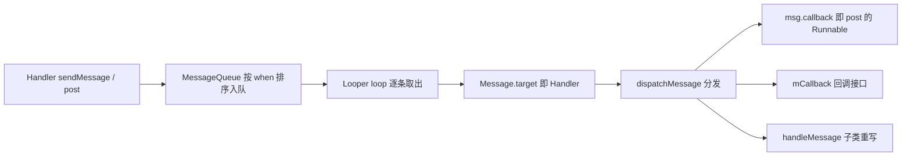

本篇对应原书第 5 章,梳理阅读 Framework 源码时出现频率最高的基础类:RefBase 与 sp/wp(Native 的智能指针体系)、Thread、同步类,以及 Java 层的 Handler/Looper。原书的观点:这些类相当于 Native Framework 的"语言扩展",不懂它们就没法读懂 AudioFlinger、SurfaceFlinger 的任何一行代码。文中代码为概念化改写,并在末尾对现代演进做比对展开。

## 4.1 RefBase:引用计数的基类

Native 层没有 GC,Framework 用**引用计数**管理跨线程共享对象:`RefBase` 是基类,`sp`/`wp` 是操作计数的智能指针。

### 引用计数的存放

```cpp
class RefBase {
    // 对象内部并不直接持有两个 int,而是间接持有:
    // 每个对象创建时伴随一个 weakref_impl(weakref_type 的实现类),
    // 强计数与弱计数都存在 weakref_impl 里,用原子变量保证线程安全
    class weakref_type { ... };
    class weakref_impl : public weakref_type {
        std::atomic<int32_t>    mStrong;   // 强引用计数(初值 INITIAL_STRONG_VALUE)
        std::atomic<int32_t>    mWeak;     // 弱引用计数
        RefBase* const          mBase;     // 反向指回宿主对象
        std::atomic<int32_t>    mFlags;    // 生命期策略标志
    };
    // RefBase 暴露的钩子:
    virtual void onFirstRef();        // 第一个强引用到来:子类初始化的机会
    virtual void onLastStrongRef(const void* id);   // 最后一个强引用消失
    virtual bool onIncStrongAttempted(uint32_t flags, const void* id);
    virtual void onLastWeakRef(const void* id);
};
```

设计意图:把"计数怎么影响生命周期"做成**策略**,由 `extendObjectLifetime` 三种标志控制:

| 标志 | 析构时机 | 场景 |
|---|---|---|
| OBJECT_LIFETIME_STRONG(默认) | 强计数归 0 → delete;弱计数归 0 → 释放 weakref_impl | 普通对象 |
| OBJECT_LIFETIME_WEAK | **强、弱计数都归 0 才 delete**;强归 0 时先调 onLastStrongRef | "可能被弱引用救活"的对象 |
| OBJECT_LIFETIME_FOREVER | 计数完全不管生命周期 | 手工控制 |

### incStrong/decStrong 流程(概念化)

```cpp
void RefBase::incStrong(const void* id) const {
    weakref_impl* const refs = mRefs;
    refs->incWeak(id);                       // 强引用必然伴随一个弱引用
    const int32_t c = refs->mStrong.fetch_add(1, ...);
    if (c != INITIAL_STRONG_VALUE) return;   // 已有强引用,直接返回
    // 第一个强引用:走 onFirstRef 初始化
    const_cast<RefBase*>(this)->onFirstRef();
}

void RefBase::decStrong(const void* id) const {
    weakref_impl* const refs = mRefs;
    const int32_t c = refs->mStrong.fetch_sub(1, ...);
    if (c == 1) {                            // 归零
        // STRONG 模式:先通知,再 delete 对象
        const_cast<RefBase*>(this)->onLastStrongRef(id);
        if ((refs->mFlags&OBJECT_LIFETIME_WEAK) != OBJECT_LIFETIME_WEAK)
            delete this;
        // 注意:此时 weakref_impl 还活着,弱引用可能仍存在
    }
    refs->decWeak(id);                       // 配对减掉伴随的弱引用
}
```

精读要点:强计数从特殊的 `INITIAL_STRONG_VALUE`(-1<<28)起步,用于区分"第一次"与"后续";**强引用同时持有弱引用**,所以弱计数 ≥ 强计数恒成立;对象 delete 后 weakref_impl 仍可能存活(弱引用还捏着它),这就是 wp 能安全探测"对象还在不在"的底座。

## 4.2 sp 与 wp

```cpp
template <typename T>
class sp {
    T* m_ptr;
public:
    sp(T* other) : m_ptr(other) {
        if (m_ptr) m_ptr->incStrong(this);   // 构造 +1
    }
    ~sp() {
        if (m_ptr) m_ptr->decStrong(this);   // 析构 -1
    }
    inline T& operator*() const { return *m_ptr; }  // 用起来和裸指针一样
    inline T* operator->() const { return m_ptr; }
};

template <typename T>
class wp {
    T* m_ptr;               // 裸指针,可能悬空
    RefBase::weakref_type* mRefs;  // 计数块:对象死后它还在
public:
    wp(T* other) : m_ptr(other) {
        if (m_ptr) mRefs = m_ptr->createWeak(this);  // 只加弱计数
    }
    sp<T> promote() const {           // 提升为强引用
        sp<T> result;
        if (m_ptr && mRefs->attemptIncStrong(&result) == true)
            result.set_pointer(m_ptr);  // 成功:result 持有对象
        return result;                  // 失败:返回空 sp
    }
};
```

| 特性 | sp | wp |
|---|---|---|
| 控制生命周期 | 是(强计数) | 否(弱计数) |
| 直接调用成员 | `p->foo()` | 必须先 promote 成 sp |
| 对象已死时 | 不可能(强计数保活) | promote 返回空,优雅降级 |
| 用途 | 所有权 | 打破循环引用、死亡探测 |

**典型场景——循环引用**:A sp 持有 B、B sp 持有 A,两者计数永不归零,内存泄漏;把"反向通知"一侧改为 wp(如 Binder 客户端持有服务代理的弱引用),循环即破。

**典型场景——死亡探测**:客户端持有服务的 wp;服务死了,弱计数归零流程保证 wp 不悬空;客户端 `promote()` 得到空 sp,从而感知死亡并重连。Binder 的 DeathRecipient 回调里正是这种模式。

## 4.3 Thread 类

`android::Thread` 封装 pthread,把"线程函数"变成可继承的类:

```cpp
class MyThread : public Thread {
    // 线程启动前回调,可做准备工作(可选)
    virtual status_t readyToRun() { mRunning = true; return NO_ERROR; }
    // 核心:线程体。注意返回值语义!
    virtual bool threadLoop() {
        processOneItem();
        // 返回 true:threadLoop 会被再次调用 —— 天然的循环模式
        // 返回 false:线程即将退出
        return !mStopRequested;
    }
};
sp<MyThread> t = new MyThread;
t->run("MyThread", PRIORITY_DEFAULT);   // 创建线程并跑起来
t->requestExitAndWait();                // 请求退出(mStopRequested=true)并等线程结束
```

使用要点:

- **退出协作式**:`requestExit` 只是置标志,threadLoop 必须主动检查(返回 false 或查 `exitPending()`),绝不能在线程体里 `return` 后还访问成员
- **run 的优先级参数**直接影响调度;AudioFlinger 的混音线程就靠 PRIORITY_URGENT_AUDIO 类参数拿到实时倾向
- Thread 内部持有一个 sp 自引用(线程入口处 `incStrong` 自己),保证线程体运行期间对象不被析构——这是 RefBase 的精妙应用

## 4.4 同步类

| 类 | 语义 | 用法 |
|---|---|---|
| `Mutex` | 互斥锁,支持递归与非递归模式 | `Mutex mLock;` |
| `Autolock` | RAII 封装,构造加锁、析构解锁 | `AutoMutex _l(mLock);` |
| `Condition` | 条件变量,必须绑一个 Mutex | `wait(mLock)` / `signal(mLock)` / `broadcast` |
| `Barrier` | Thread 启动同步的便捷封装(一次性闸门) | `wait()` / `open()` |

```cpp
// 标准形态一:Autolock 保护临界区
void AudioFlinger::setParameters(...) {
    AutoMutex _l(mLock);        // 函数返回自动解锁 —— Framework 源码里最常见的行
    ...
}

// 标准形态二:Condition 等待条件成立
Mutex mLock; Condition mCond; bool mReady = false;
void consumer() {
    AutoMutex _l(mLock);
    while (!mReady) mCond.wait(mLock);   // 释放锁并睡眠,被唤醒后重新持锁再检查
    consume();
}
void producer() {
    { AutoMutex _l(mLock); mReady = true; }
    mCond.signal(mLock);
}
```

要点:Condition.wait 外面必须是 **while 而非 if**(防虚假唤醒与多消费者竞争);锁的粒度与持有时间是 Audio/Surface 各章反复出现的话题。

## 4.5 Java 层:Handler 与 Looper

Java Framework 是"消息驱动"的世界,三大件:



### Looper:一个线程一个

```java
// ThreadLocal 保证每线程独立的 Looper
public static void prepare() {
    sThreadLocal.set(new Looper(quitAllowed));  // Looper 持有 MessageQueue
}
public static void loop() {
    final Looper me = myLooper();
    for (;;) {
        Message msg = queue.next();    // 可能阻塞
        msg.target.dispatchMessage(msg);  // target 就是发送它的 Handler
        msg.recycleUnchecked();           // 消息回收复用 —— 池化设计
    }
}
```

### Handler:绑定线程与身份

- 构造时绑定某个 Looper(默认取当前线程的),`sendMessage` 就是往**那个 Looper 的队列**里塞
- `dispatchMessage` 的优先级:`msg.callback`(post 传的 Runnable)> `mCallback`(构造函数传入的回调)> `handleMessage`(子类重写)——这就是 post(Runnable) 与 sendMessage 路径的分叉点

### MessageQueue 的休眠与唤醒:委托给 Native

原书的一个亮点是揭示 **Java 的 MessageQueue 底下垫着一个 Native Looper**:

- `next()` 没有到期消息时调 `nativePollOnce(ptr, timeout)` 进入 Native 层休眠
- `sendMessage`/`postMessage` 到来时调 `nativeWake(ptr)` 唤醒
- Native 侧(`android::Looper`,在 libutils)基于 **epoll** 实现:一个 mEpollFd 监听管道/eventfd 读端,`wake()` 往写端写一个字节,`pollOnce` 被 epoll 唤醒返回

这个"Java 消息队列睡在 epoll 上"的结构,让 Java 线程既不空转耗 CPU,又能被及时唤醒——和 Linux 的等待队列、条件变量是同一思想。

### 同名陷阱

Native 层还有一套同名类:`android::Looper`、`android::MessageHandler`、`android::Message`(libutils,给 Native 服务如 SurfaceFlinger 用)。**两套体系 API 相似但完全独立**,唯一交点是 Java MessageQueue 委托 Native Looper 休眠这一处。读源码时必须先分清自己在哪一层。

## 4.6 新技术更新(比对展开)

| 维度 | 原书时代(Android 2.3) | 现在(Android 11~15+) |
|---|---|---|
| sp/wp | 手写 incStrong/decStrong | 保留;新增 sp<T>::make 统一构造,弃用裸 new |
| 生命周期 | RefBase 三策略 | 保留;NDK/AIDL 侧新增 SharedRefBase 简化版 |
| 锁 | Mutex/Autolock/Condition | 保留;全面引入 std::mutex/std::condition_variable 与 -Wthread-safety 静态注解 |
| Thread | android::Thread | 保留;系统代码逐步用 std::thread + 命名工具 |
| Java 消息机制 | Handler/Looper/MessageQueue | 结构未变;IdleHandler、异步消息与屏障早已常态化 |
| 休眠唤醒 | nativePollOnce/nativeWake + epoll | 不变,epoll 结构沿用至今 |
| 应用层用法 | Handler 裸用 | 协程/Executor 分流;Handler 构造必须显式传 Looper |

分项展开:

### 4.6.1 智能指针:从手写到约束化

`sp<T>::make(...)`(Android 10 前后推广)统一了构造入口并杜绝"裸指针先落地再包 sp"的计数窗口期;AIDL NDK 侧的 `SharedRefBase` 要求对象只能以 sp 持有、析构必须计数归零,把原书时代"策略三种、全靠自觉"的生命周期问题收敛成单一规则。C++ 侧的 `std::shared_ptr` 在系统新代码中也被允许用于非 Binder 对象,但 Framework 的跨线程共享对象仍是 sp/wp 的天下——wp 的"死亡探测"语义没有标准库等价物。

### 4.6.2 同步:注解与静态检查

原书时代锁纪律靠 code review;现代 libbase 全面使用 `-Wthread-safety`:`Mutex mLock GUARDED_BY(mLock)` 直接标在成员声明上,编译期报未持锁访问。`Condition` 基本被 `std::condition_variable` 取代,但 Barrier/Autolock 的用法形态保留。**阅读现代源码时,先看成员的 GUARDED_BY 注解就能推断锁保护关系**,这是原书时代没有的便利。

### 4.6.3 Handler 生态的"上层化"

结构未变,但用法在收缩:Android 11 的 `Handler(Looper.myLooper(), callback)` 明确要求显式 Looper(历史上隐式绑定当前线程导致大量事故);官方指引把 Handler 定位为"与某个 Looper 绑定的任务队列",常规异步用 `Executor`/协程;`postDelayed` 的精确定时仍不可替代。观测上,Looper 增加了 Perfetto 打点(Android 11+),消息阻塞、MessageQueue 深度都能在 trace 里直接看到。

### 4.6.4 Native Looper 的扩张

`android::Looper` 从"给 Java 垫底"发展成 Native 服务的通用事件循环:SurfaceFlinger 与大量守护进程用 `Looper::pollOnce` 统一处理 fd 事件 + 消息 + 定时器三源;`MessageHandler`/`LooperCallback` 的组合是 Native 世界的 Handler 模式。学完本篇的 epoll 结构,再看现代 SurfaceFlinger 的主循环就非常容易上手。
