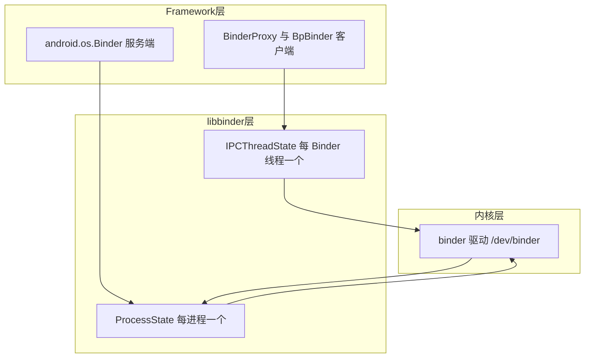
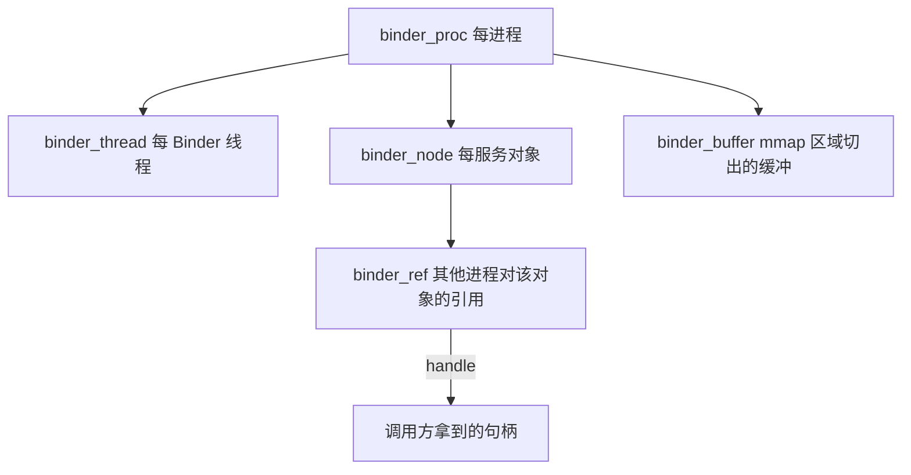
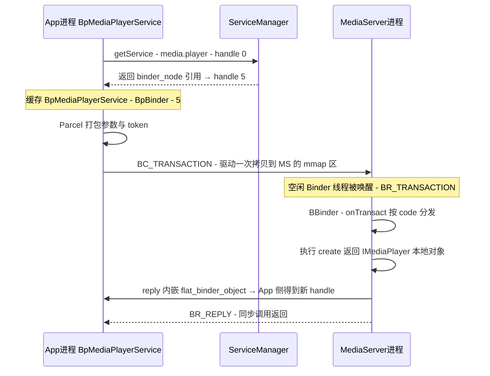

本篇对应原书第 6 章,是全书的核心章,篇幅最长。原书以 MediaServer 进程为切入点,自顶向下穿过 Java 层、IPCThreadState、Parcel,最后深入内核 binder 驱动的数据结构,把"一次跨进程调用"的每一跳讲透。文中代码为概念化改写,并在末尾对现代演进做比对展开。

## 5.1 为什么 Android 自造 Binder

Linux 已有 IPC 手段,逐一对比便知 Binder 的定位:

| 方案 | 性能 | 特点 | 不满足 Android 的点 |
|---|---|---|---|
| 管道/消息队列 | 中 | 字节流,亲缘进程 | 无结构、需多次拷贝、难跨权限 |
| Unix socket | 中 | 通用、可鉴权 | 面向流,每次数据两次拷贝,无对象语义 |
| 共享内存 + 信号量 | 最快 | 零拷贝 | 同步、生命周期全靠自己管,易出错 |
| Binder | 快(一次拷贝) | 面向对象、带安全与生命周期管理 | —— |

Binder 的四个核心优势:

1. **一次拷贝**:发送方数据从用户态 copy 进内核,而内核侧缓冲对接收方 mmap 可见,省掉第二次 copy_to_user
2. **面向对象**:传递的是"Binder 对象引用",接口化调用,天然匹配 AIDL
3. **安全**:内核为每次事务记录调用方 UID/PID,配合 SELinux 精确授权;引用句柄由内核分配,无法伪造
4. **生命周期**:强/弱引用计数 + 死亡通知,跨进程管理对象存活——这是 socket 体系完全没有的能力

## 5.2 全景地图:三层结构



- **内核层**:`drivers/staging/android/binder.c`,负责对象寻址、数据搬运、线程调度、死亡通知
- **libbinder(Native)**:`ProcessState` 管进程级资源(open 驱动、mmap、线程池上限);`IPCThreadState` 管线程级协议收发,两个类贯穿本章
- **Framework 层**:Java 的 Binder/BinderProxy 经 JNI 包装 Native 的 BBinder/BpBinder,对应用暴露 IBinder/IBinder 接口体系

## 5.3 入口:MediaServer 的 main 再看一遍

```cpp
// main_mediaserver.cpp(概念化)
int main() {
    sp<ProcessState> proc(ProcessState::self());
    // 关键点1:self() 单例:首次调用打开 /dev/binder 并 mmap(约 1MB)
    sp<IServiceManager> sm = defaultServiceManager();
    // 关键点2:拿到 handle=0 的 BpBinder,包装成 ServiceManager 代理
    MediaPlayerService::instantiate();
    // 关键点3:instantiate 内部 addService 注册自己
    ProcessState::self()->startThreadPool();
    IPCThreadState::self()->joinThreadPool();
    // 关键点4:主线程也加入 Binder 线程池,进程常驻服务
}
```

四行启动代码各藏一个机关,下面逐一拆解。

## 5.4 ProcessState:进程级 Binder 资源

```cpp
// 概念化
sp<ProcessState> ProcessState::self() {
    if (gProcess != nullptr) return gProcess;   // 单例
    gProcess = new ProcessState;                // 首次创建
}
ProcessState::ProcessState() {
    mDriverFD = open("/dev/binder", O_RDWR);    // 每进程一个驱动 fd
    mVMStart = mmap(nullptr, BINDER_VM_SIZE,    // mmap 一块共享区域
                     PROT_READ, MAP_PRIVATE, mDriverFD, 0);
    // BINDER_VM_SIZE = 1MB - 2页:Binder 事务缓冲的上限来源!
}
status_t ProcessState::startThreadPool() {
    // spawnPooledThread:创建第一个 Binder 线程,loop 线程将进入 joinThreadPool
    ...
}
```

**1MB 的含义**:mmap 的这块区域是内核为该进程分配"事务数据缓冲"的地方,所有进出本进程的 Binder 数据(除超限的特殊情况)都从这里切——所以 **单个进程的 Binder 并发数据量受约 1MB 限制**,传大文件必须走 ashmem/共享内存或分块,这是原书强调、至今不变的约束。

## 5.5 ServiceManager:Binder 世界的 DNS

```cpp
// 概念化:defaultServiceManager 的构造链
sp<IServiceManager> defaultServiceManager() {
    sp<IBinder> b = ProcessState::self()->getContextObject(nullptr);
    // → 内部:new BpBinder(0)   handle 0 = ServiceManager 本身!
    gDefaultServiceManager = interface_cast<IServiceManager>(b);
    // interface_cast:把裸 IBinder 包成 BpServiceManager(见 5.8)
}
```

- ServiceManager 自身是个**由内核特批的 Binder 服务**:驱动规定 handle 0 就是它(它启动时通过 BINDER_SET_CONTEXT_MGR ioctl 把自己注册为 context manager)
- 名字服务协议极简:`addService(name, binder)` / `getService(name)`,返回的 binder 经驱动翻译成调用方进程内的 handle

```cpp
// 服务端注册(MediaPlayerService::instantiate 概念化)
MediaPlayerService::instantiate() {
    defaultServiceManager()->addService(
            String16("media.player"), new MediaPlayerService());
}
// 客户端获取
sp<IBinder> binder = defaultServiceManager()->getService(
        String16("media.player"));
sp<IMediaPlayerService> service =
        interface_cast<IMediaPlayerService>(binder);
```

## 5.6 IPCThreadState:协议收发的执行者

每个参与 Binder 的线程有一个 IPCThreadState,两个核心函数:

### transact:发起调用(客户端)

```cpp
// 概念化
status_t IPCThreadState::transact(int32_t handle,
        uint32_t code, const Parcel& data,
        Parcel* reply, uint32_t flags) {
    // 1. 打包成 BC_TRANSACTION 命令,写进 mOut 缓冲
    err = writeTransactionData(BC_TRANSACTION, flags,
                               handle, code, data, nullptr);
    if (flags & TF_ONE_WAY) {
        // oneway:不等待回复,直接尝试推给驱动
        waitForResponse(nullptr, nullptr);
        return err;
    }
    // 2. 同步调用:等 BR_TRANSACTION_COMPLETE 后继续等真正的 BR_REPLY
    err = waitForResponse(reply);
    return err;
}

status_t IPCThreadState::waitForResponse(Parcel* reply, ...) {
    for (;;) {
        // 核心底座:与驱动交互的唯一通道
        talkWithDriver();     // ioctl(mProcess->mDriverFD,
                              //   BINDER_WRITE_READ, &bwr)
        // mIn 里是驱动返回的 BR_* 命令,逐个消费:
        cmd = mIn.readInt32();
        switch (cmd) {
        case BR_TRANSACTION_COMPLETE: ...;   // 事务已受理
        case BR_REPLY:                       // 同步调用的回复到了
            ...; return NO_ERROR;
        case BR_DEAD_REPLY: return DEAD_OBJECT;   // 对端进程已死
        case BR_FAILED_REPLY: return FAILED_TRANSACTION;
        case BR_SPAWN_LOOPER:                // 驱动要求:再开一个 Binder 线程!
            mProcess->spawnPooledThread(false);
            break;
        ...
        }
    }
}
```

### joinThreadPool:服务循环(服务端)

```cpp
// 概念化
void IPCThreadState::joinThreadPool(bool isMain) {
    mOut.writeInt32(isMain ? BC_ENTER_LOOPER : BC_REGISTER_LOOPER);
    do {
        // 阻塞在 ioctl 上,等待驱动投递 BR_TRANSACTION
        result = talkWithDriver();
        if (mIn.errorCheck() == NO_ERROR) {
            cmd = mIn.readInt32();
            switch (cmd) {
            case BR_TRANSACTION: {
                // 取出驱动准备好的数据:目标 BBinder、code、Parcel
                sp<BBinder> b = ((...*)ptr)->cookie 的强引用;
                // 关键:executeCommand 里最终调 b->transact(...)
                err = executeCommand(cmd);
            } break;
            ...
            }
        }
    } while (result != -ECONNREFUSED && result != -EBADF);
    mOut.writeInt32(BC_EXIT_LOOPER);
}
```

**BR_SPAWN_LOOPER 是理解"Binder 线程池自动扩容"的钥匙**:驱动统计服务进程的空闲线程数,发现不足时向某个线程投递 BR_SPAWN_LOOPER,该线程随手 spawn 新线程入池,上限 `max_threads`(默认 15)。所以 MediaServer 的 Binder 线程数并不写在代码里,而是驱动按负载弹性调节。

## 5.7 内核 binder 驱动:一次拷贝的实现

原书把驱动数据结构总结为"五个主角":



- **binder_proc**:open 驱动的进程,持有 mmap 区域(binder_alloc)与 todo 队列
- **binder_node**:服务端 addService 时,内核在服务进程的 proc 下建 node,代表"服务对象本体"
- **binder_ref**: getService 时,内核在**调用方** proc 下建 ref,指向 node,并分配一个 handle(整数)返回给调用方——BpBinder(handle) 封装的就是它
- **binder_thread**:每线程的事务栈(transaction_stack)与 todo 队列
- **binder_buffer**:接收事务数据的落脚点

### 一次拷贝的确切含义

发送方 `BC_TRANSACTION` 时,Parcel 数据在发送方用户态;驱动 `binder_transaction()` 处理时:

1. 在**目标进程 mmap 区域**里分配一块 binder_buffer(目标进程早已映射同一物理内存)
2. `copy_from_user` 把发送方数据拷进这块 buffer —— **全程唯一一次数据拷贝**
3. 把"buffer 指针 + 目标 node + code"组装成 `binder_transaction` 挂到目标线程的 todo 队列,唤醒目标进程

目标进程醒来后直接读自己用户态地址里的数据,无需再 copy_to_user。对比 socket 的"发送方→内核、内核→接收方"两次拷贝,Binder 省一半。

### 调度模型

同步调用会占用双方各一个 Binder 线程;驱动把 transaction 压入目标 thread(有事务上下文时)或 proc 的 todo,由目标进程的线程池消化。**oneway(TF_ONE_WAY)事务**没有回复,异步排队,专门有个 1MB 的一半额度限制防止洪泛(现代内核加入了 oneway spam 检测)。

## 5.8 Binder 对象模型:Bn/Bp 与 interface_cast

Native 侧的接口与实现骨架(以 MediaPlayerService 为例):

```cpp
// 头文件里由 DECLARE_META_INTERFACE 宏生成:
class IMediaPlayerService : public IInterface {
public:
    DECLARE_META_INTERFACE(MediaPlayerService);   // 生成静态成员 descriptor 等
    virtual sp<IMediaPlayer> create(...) = 0;     // 业务接口
};

// 服务端:BnInterface = BBinder + 业务接口
class MediaPlayerService : public BnInterface<IMediaPlayerService> {
    virtual status_t onTransact(uint32_t code, const Parcel& data,
                                Parcel* reply, uint32_t flags);
    // onTransact 按 code 解包 data,调用真正的 create,结果写 reply
};

// 客户端:BpInterface = BpBinder + 业务接口
class BpMediaPlayerService : public BpInterface<IMediaPlayerService> {
    virtual sp<IMediaPlayer> create(...) {
        Parcel data, reply;
        data.writeInterfaceToken(IMediaPlayerService::descriptor);
        data.writeInt32(...);                    // 逐参数打包
        remote()->transact(CREATE, data, &reply); // remote() 就是 BpBinder
        return interface_cast<IMediaPlayer>(reply.readStrongBinder());
    }
};
```

- **BpBinder(handle)**:纯粹的"句柄搬运工",持有 handle,transact 全部委托 IPCThreadState
- **interface_cast<IXXX>(binder)**:查表(descriptor 字符串匹配)后 `new BpXXX(binder)`——把裸通道包装成类型化代理
- **服务端的对称物 BBinder**:驱动投递 BR_TRANSACTION 时,IPCThreadState 调 `BBinder::transact → onTransact`,按 code 分发到实现

## 5.9 Parcel:跨进程的数据载体

Parcel 是 Binder 的序列化格式,能力一览:

| 类型 | 写入 | 说明 |
|---|---|---|
| 基本类型 | writeInt32/Int64/Float/Double | 定长,直接拷 |
| 字符串 | writeString16 | UTF-16,带长度 |
| **IBinder** | writeStrongBinder | 写 flat_binder_object,驱动翻译成对端 handle |
| fd | writeFileDescriptor | 驱动把 fd 翻译进目标进程(SharedMemory 的基础) |
| 自定义 | writeParcelable(Java) | 分解成上面的原子类型 |

**flat_binder_object 是 Binder"面向对象"的物理载体**:Parcel 里嵌的这个结构,经过驱动时被改写——发送方的本地指针/句柄翻译成接收方可用的句柄。传 Binder = 传对象引用,就是这么实现的。

## 5.10 一次完整调用:时序总装

以 App 调 `media.player` 服务的 `create` 为例:



两次"驱动翻译"值得注意:getService 时 node→ref→handle 的翻译,以及 reply 里匿名服务对象(handle)的回传——**客户端拿到的每个新服务对象,都是驱动在它进程里新建的 binder_ref**。

## 5.11 死亡通知(DeathRecipient)

问题:服务进程可能随时死掉,客户端如何得知?

```java
// Java 层用法
binder.linkToDeath(new IBinder.DeathRecipient() {
    @Override public void binderDied() {
        // 服务进程死了:清理缓存、重连或降级
    }
}, 0);
```

链路:linkToDeath 经 IPCThreadState 发 `BC_REQUEST_DEATH_NOTIFICATION`(带 handle);驱动在**服务进程的 binder_proc 上挂一个死亡通知链表**;服务进程退出时内核释放其资源,驱动遍历链表向每个注册者 todo 队列投 `BR_DEAD_BINDER`;注册者线程把包转成 Java 回调。

Native 侧的回调对象是 `wp<IBinder::DeathRecipient>`,回调时先 promote——服务死亡与回调之间有竞态,promote 失败说明回调对象自身也没了,这正是 RefBase 弱引用的用武之地。

## 5.12 匿名 Service

不经 ServiceManager、只靠 Parcel 传递引用的服务叫**匿名 Service**(如 create 返回的 IMediaPlayer)。它的特点:

- 没有名字,生命周期完全由 Binder 引用计数决定:客户端 release → 驱动减 node 引用 → 归零即死
- 与之相对,注册进 ServiceManager 的服务多一层"名字钉住"的引用
- Framework 中大量"每个客户端一份"的服务对象(播放器、SurfaceControl)都是匿名 Service

## 5.13 Binder 与线程:死锁与最佳实践

- **同步调用阻塞调用线程**:服务端处理时若再同步调别人,需要第二个 Binder 线程;极端嵌套会耗尽线程池(15 个)造成死锁。规范:服务端 onTransact 里不做耗时同步调用,长活交给自家线程/队列
- **oneway 是排队不是并发**:同一目标的 oneway 串行执行,且共享异步额度
- **进程优先级继承**:驱动把调用方的调度优先级传给服务线程(BC_TRANSACTION 携带优先级,服务端 set_sched_policy),防止系统进程被后台 App 的请求拖慢——这是 Android 定制而非 POSIX 通用能力

## 5.14 AIDL:把模板代码变成声明

手写 Bp/Bn 繁琐且易错,AIDL(Android Interface Definition Language) 用接口定义生成全部骨架:

```aidl
// IMediaPlayerService.aidl
interface IMediaPlayerService {
    IMediaPlayer create(String url);
}
```

生成物里:服务端继承 `Stub`(Bn 侧:onTransact 按 code 分发 + Parcel 解包),客户端拿 `Stub.Proxy`(Bp 侧:Parcel 打包 + transact)。**AIDL 没有引入新机制,只是把 5.8/5.10 的模板自动化**——理解本章后,AIDL 完全透明。

## 5.15 新技术更新(比对展开)

| 维度 | 原书时代(Android 2.3) | 现在(Android 11~15+) |
|---|---|---|
| 设备节点 | 单一 /dev/binder | 三分:/dev/binder、hwbinder、vndbinder(Android 8) |
| HAL 接口 | C++ Binder 直连 | HIDL(Android 8)→ 全面迁移 Stable AIDL(Android 11+) |
| 语言 | C++/Java 手写 | Java/C++/NDK/Rust 统一生成(AIDL Stable) |
| 事务缓冲 | 1MB/进程 | 1MB 基础不变;异步事务独立额度 + oneway 洪泛检测(Android 11) |
| 线程模型 | max_threads=15 弹性 | 模型保留;新增 Binder 冻结(Android 11,冻结缓存进程的 Binder 线程) |
| ServiceManager | 常驻名服务 | 增加 lazy service、waitForService、service 声明式配置 |
| 安全 | uid + 基本SELinux | SELinux 全面接管;Stable AIDL 强制接口稳定性 |
| 内核形态 | Android 通用内核私有补丁 | 已进入 Linux 主线(5.18 起,移除 staging) |
| 观测 | 无系统工具 | Perfetto binder track、service call 调试命令 |

分项展开:

### 5.15.1 三个 Binder 域

Android 8(Treble)把 Binder 设备一分为三:`/dev/binder`(框架与应用域)、`/dev/hwbinder`(框架 ↔ vendor HAL)、`/dev/vndbinder`(vendor 内部互调)。动机是 system 分区与 vendor 分区独立升级——vendor 进程绝不许碰框架域,权限在内核层一刀切开。原书的分析对三个域完全通用,只是"谁跟谁同域"的边界变了。

### 5.15.2 HIDL 的兴衰与 Stable AIDL

Android 8 为 HAL 定义 HIDL(接口定义语言 + 生成器),2020 年起的"单次架构"(Android 11+)宣布 HIDL 停止演进、新 HAL 一律 Stable AIDL:与普通 AIDL 同源,但强制**接口冻结版本化**(每接口登记版本、禁止破坏性变更),并为 C NDK(`libbinder_ndk` 的 AIBinder)与 Rust(binder crate)生成绑定。系统组件(Rust 写的 DNS、新 HAL)由此告别手写 Binder 胶水,但底层仍是本章的 IPCThreadState + 驱动协议。

### 5.15.3 内核侧的现代化

binder 驱动 2022 年从 staging 毕业、合入 Linux 主线(5.18),通用内核镜像(GKI)直接携带;随后加入的能力包括 oneway 洪泛检测、每个优先级的同步事务限制、`BINDER_FREEZE`(配合 cached app 冻结:进程冻结时 Binder 调用排队不丢)与更严格的 buffer 泄漏审计。原书分析的 binder_proc/node/ref/buffer 模型至今未变——这是它仍是最佳 Binder 教材的原因。

### 5.15.4 ServiceManager 与服务治理

现代 ServiceManager(本身就是 AIDL 化的 `IServiceManager`)新增:lazy service(HAL 进程无客户端时自动退出省内存,新请求到达再被拉起)、`waitForService`(同步等待服务出现,替代轮询 getService)、服务注册的 SELinux 声明(service_contexts 文件,哪个域可注册/获取哪个名字)。调试命令 `service list/call` 与 `dumpsys` 体系也是原书时代之后完善的。

### 5.15.5 观测与调试

原书时代调 Binder 靠加日志;现在:Perfetto 有专门的 binder track(每次事务的两端栈与耗时一目了然)、`service list/call` 可在 shell 直接探测服务、内核还暴露各进程的 binder 统计(线程数、buffer 占用、事务计数)用于定位泄漏与线程池耗尽。学习建议不变:先读本章模型,再用 trace 对号入座。
