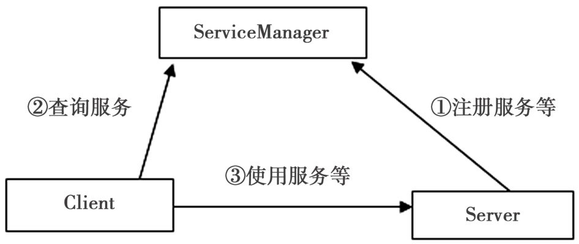
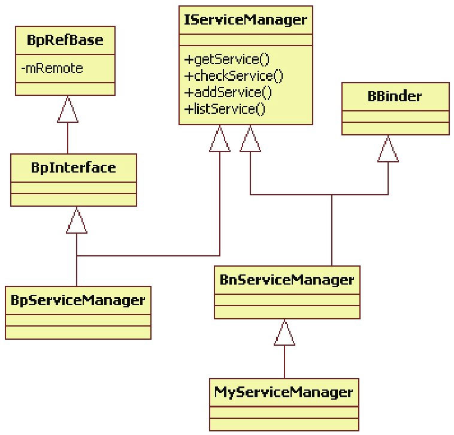
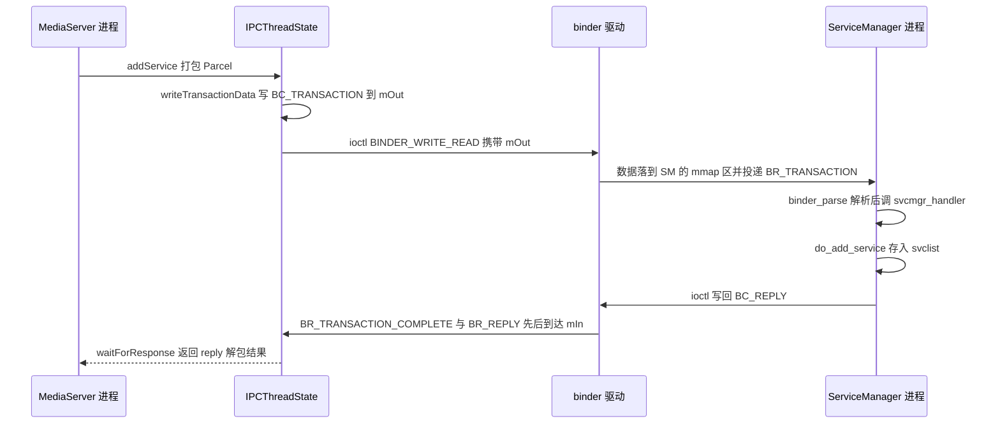
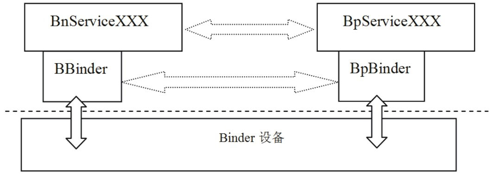
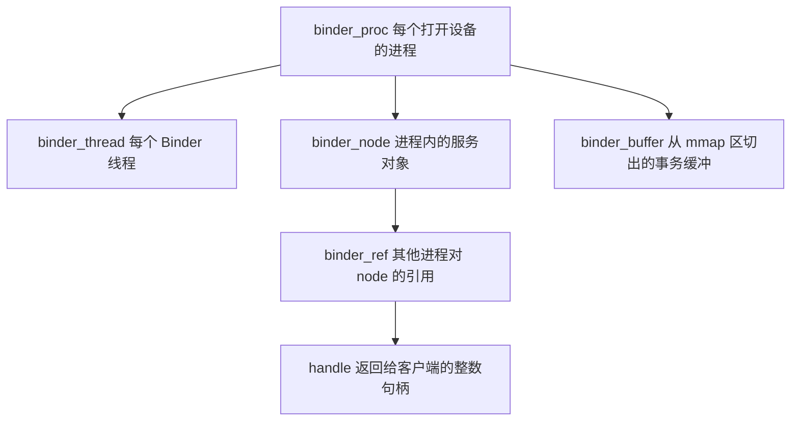
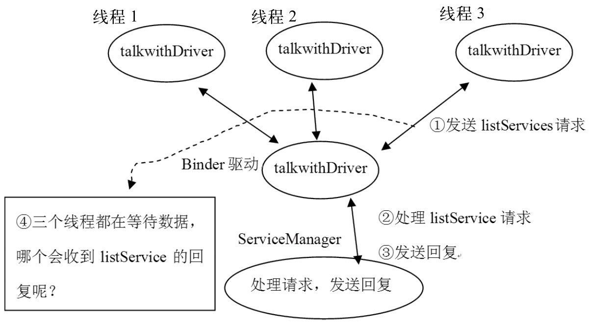

本篇对应原书第 6 章「深入理解 Binder」，是全书的核心章。原书基于 Android 2.2/2.3 源码，以 MediaServer 进程为线索自顶向下剖析：先穿过 Framework 业务封装层（IServiceManager、BpServiceManager、BnMediaPlayerService），再下到通信层（BpBinder、IPCThreadState、Parcel），最后落到内核 binder 驱动与 /dev/binder 设备，把一次跨进程调用的每一跳讲透。本章主线一句话：**Android 通过层层封装，把通信层（binder 驱动、ProcessState、IPCThreadState、BpBinder/BBinder）与业务层（BpXXX/BnXXX 接口族）融合在一起，分清这两层的边界，Binder 就不再神秘。**

> 版本注意：原书成书于 2011 年（Android 2.2/2.3）。Binder 架构主体延续至今，但现代 Android 内核驱动已重写（如 binder_alloc 拆分、freeze/优先级继承、libbinder 的 NDK 化），差异见文末演进备注。

> 摘编声明：文中代码为原书代码的摘编版——保留主干、省略日志与无关分支，类名、函数名忠于原书原文。

## 1.1 概述：Binder 的定位与三层结构

Binder 是 Android 提供的 IPC（Inter-Process Communication，进程间通信）机制。Android 基于 Linux 内核，系统里同时存在管道、socket 等其他 IPC 手段，但 Framework 主体是一个**基于 Binder 通信的 C/S（Client/Server，客户端/服务端）架构**——Binder 像网络一样把系统各部分连接在一起。

### 1.1.1 Client、Server 与 ServiceManager 的交互关系

基于 Binder 的 C/S 架构中，除 Client 与 Server 外还有一个全局的 ServiceManager，负责管理系统中的各种服务：



注意一个 Server 进程可以注册多个 Service，后面分析的 MediaServer 就一次注册了四个服务。由图可得四条结论：

1. **Server 先把 Service 注册到 ServiceManager**：此时 Server 是 ServiceManager 的客户端
2. **Client 使用 Service 前先向 ServiceManager 查询**：Client 也是 ServiceManager 的客户端
3. **Client 拿到 Service 信息后与 Server 直接通信**：Client 同时是 Server 的客户端
4. 三者的交互全部基于 Binder——通过任意两者间的关系都能揭示 Binder 的奥秘

### 1.1.2 Binder 的三层结构

从 MediaServer 的代码往下走，Binder 体系可分三层，这也是本篇的阅读地图：

- **业务封装层**：IServiceManager 及其派生类、IMediaPlayerService 及其派生类等 BpXXX/BnXXX 接口族，定义「能做什么」
- **通信层（libbinder）**：ProcessState 管进程级资源（打开设备、mmap、线程池上限），IPCThreadState 管线程级协议收发，BpBinder/BBinder 是两端通信代表，Parcel 承载打包数据
- **内核层**：binder 驱动（/dev/binder 虚拟设备），负责对象寻址、数据搬运与线程调度

### 1.1.3 与 Linux 其他 IPC 的对比及 Binder 的优势

| IPC 方式 | 拷贝次数 | 特点 | 短板 |
|---|---|---|---|
| 管道（pipe） | 2 | 字节流，适合亲缘进程 | 无结构，难做权限与对象语义 |
| socket | 2 | 通用、可鉴权 | 面向流，无对象语义，对端关闭通知不可靠 |
| 共享内存 + 信号量 | 0 | 最快 | 同步与生命周期全靠调用方自管，易出错 |
| Binder | 1 | 面向对象，句柄由内核分配 | 需要专用驱动与 mmap 配合 |

Binder 的四个核心优势：**一次拷贝**（发送方 Parcel 只从用户态拷进内核一次，落点直接是接收进程 mmap 映射区，省掉 copy_to_user）；**面向对象**（跨进程传递的是 Binder 对象引用，天然匹配业务接口）；**安全**（每次事务由内核记录调用方 uid/pid，句柄 handle 由内核分配、无法伪造）；**生命周期管理**（强/弱引用计数加死亡通知，跨进程管理对象存活，socket 体系完全没有这个能力）。

### 1.1.4 一个易错点：通信层与业务层别搞混

初学者看到 BpXXX、BnXXX 就头晕，多半是把 **Binder 通信层**和**应用的业务层**搞混了。Binder 只是为 C/S 架构提供了一种通信方式，业务完全可以改用 socket 或 pipe 实现；搞清二者关系后，完全可以实现一个不使用 BpXXX/BnXXX 的 Service——**ServiceManager 本尊就没有用它们**，它直接打开 binder 设备交互（见 1.3 节）。本章源码集中在 frameworks/base 的 libs/binder、media 目录与 cmds/ServiceManager。

## 1.2 MediaServer 进程分析

分析 Binder 需要一个解剖对象，MediaServer（下称 MS）是合适的标本：一个 C++ 编写的可执行程序，是 AudioFlinger、AudioPolicyService、MediaPlayerService、CameraService 等重要 Service 的栖息地。本节沿它的 main 函数逐关键点向下钻。

### 1.2.1 MediaServer 的入口函数

MS 的入口是 main，全文只有几行，但每行都是一个机关：

```cpp
// [--> Main_MediaServer.cpp]
int main(int argc, char** argv)
{
    // ① 获得一个 ProcessState 实例
    sp<ProcessState> proc(ProcessState::self());
    // ② 获得一个 IServiceManager，实际是 ServiceManager 的代理
    sp<IServiceManager> sm = defaultServiceManager();
    // ③ 四个重量级服务依次注册到 ServiceManager
    AudioFlinger::instantiate();
    MediaPlayerService::instantiate();
    CameraService::instantiate();
    AudioPolicyService::instantiate();
    // ④ 启动 Binder 线程池
    ProcessState::self()->startThreadPool();
    // ⑤ 主线程也加入线程池
    IPCThreadState::self()->joinThreadPool();
}
```

①～⑤ 即本节的分析路线：ProcessState（1.2.2）、defaultServiceManager（1.2.3）、服务的注册链路（1.2.4）、startThreadPool 与 joinThreadPool（1.2.5）。

### 1.2.2 ProcessState：进程唯一的 Binder 资源管家

main 一开始就碰见 ProcessState。self 是标准的单例模式：查全局变量 gProcess（Static.cpp 中定义），为空则在锁保护下 new 一个 ProcessState——**ProcessState 的名字就表明：每个进程只有一个 ProcessState 对象**。它的构造函数非常重要——悄悄打开了 Binder 设备：

```cpp
// [--> ProcessState.cpp]
ProcessState::ProcessState()
    // 稍不留神就会忽略这里调用的重要函数
    : mDriverFD(open_driver())
    , mVMStart(MAP_FAILED) // 映射内存的起始地址
    // ......（其余成员初值省略）
{
    if (mDriverFD >= 0) {
        // BINDER_VM_SIZE 为 (1*1024*1024) - (4096*2)，即 1M-8K。
        // mmap 的真正实现与驱动有关：驱动会分配一块内存来接收数据
        mVMStart = mmap(0, BINDER_VM_SIZE, PROT_READ, MAP_PRIVATE | MAP_NORESERVE,
                        mDriverFD, 0);
    }
}
```

open_driver 打开的就是 **/dev/binder**——Android 在内核中为进程间通信专门设置的虚拟设备：

```cpp
// [--> ProcessState.cpp]
static int open_driver()
{
    int fd = open("/dev/binder", O_RDWR);
    if (fd >= 0) {
        size_t maxThreads = 15;
        // 通过 ioctl 告诉 binder 驱动：这个 fd 支持的最大线程数是 15
        result = ioctl(fd, BINDER_SET_MAX_THREADS, &maxThreads);
    }
    return fd;
}
```

总结 ProcessState::self 干的三件事：打开 /dev/binder，得到与内核交互的通道（fd，file descriptor，文件描述符）；对该 fd 做 mmap，驱动随即分配一块约 1M-8K 的内存接收发往本进程的数据；由于单例，**一个进程只打开一次设备、只 mmap 一次**。

### 1.2.3 defaultServiceManager 的获取流程

第二个关键点 defaultServiceManager 返回一个 IServiceManager 对象，通过它能与另一个进程 ServiceManager 交互。这条获取链路是全书最精华的分析之一。

#### 1.入口：又是一个单例

```cpp
// [--> IServiceManager.cpp]
sp<IServiceManager> defaultServiceManager()
{
    if (gDefaultServiceManager != NULL) return gDefaultServiceManager; // 单例
    AutoMutex _l(gDefaultServiceManagerLock);
    if (gDefaultServiceManager == NULL) {
        // 真正的 gDefaultServiceManager 在这里创建
        gDefaultServiceManager = interface_cast<IServiceManager>(
                ProcessState::self()->getContextObject(NULL));
    }
    return gDefaultServiceManager;
}
```

它做两件事：先拿一个 IBinder，再用 interface_cast 包一层。逐个看。

#### 2.getContextObject：目的端是 handle 0

```cpp
// [--> ProcessState.cpp]
sp<IBinder> ProcessState::getContextObject(const sp<IBinder>& caller)
{
    // caller 的值为 0；supportsProcesses 按能否打开 binder 设备判断，
    // 真实设备肯定支持 process
    if (supportsProcesses()) {
        return getStrongProxyForHandle(0);
    } else {
        return getContextObject(String16("default"), caller);
    }
}
```

getStrongProxyForHandle 这个名字的关键在参数 **handle**：它是 Windows 编程常用的概念，即资源标识——资源项保存在数组中，handle 的值就是该资源项的索引：

```cpp
// [--> ProcessState.cpp]
sp<IBinder> ProcessState::getStrongProxyForHandle(int32_t handle)
{
    sp<IBinder> result;
    AutoMutex _l(mLock);
    // 按索引查资源项；lookupHandleLocked 没有对应项时会创建新项返回
    handle_entry* e = lookupHandleLocked(handle);
    if (e != NULL) {
        IBinder* b = e->binder;
        if (b == NULL || !e->refs->attemptIncWeak(this)) {
            // 新建资源项的 binder 为空，走这个分支。注意 handle 的值为 0
            b = new BpBinder(handle); // 创建一个 BpBinder
            e->binder = b;            // 填充 entry 的内容
            if (b) e->refs = b->getWeakRefs();
            result = b;
        } // else 分支：已有存活的 binder，直接复用
    }
    return result; // 返回 BpBinder(handle)，handle 为 0
}
```

所以 defaultServiceManager 里那行调用此刻等价于 `interface_cast<IServiceManager>(new BpBinder(0))`。

#### 3.BpBinder 与 BBinder：通信层的两员大将

BpBinder 有个孪生兄弟 BBinder，二者都是 Binder 通信的代表，都从 IBinder 派生：


- **BpBinder 是客户端用来与 Server 交互的代理类**，p 即 Proxy 的意思；**BBinder 是与 Proxy 相对的一端**，代表服务端
- BpBinder 与 BBinder 一一对应：绝不希望 BpBinderA 发出的请求由 BBinderB 处理

两个问题：为什么创建的是 BpBinder 而不是 BBinder？——我们是 ServiceManager 的客户端，当然用代理端。BpBinder 如何标识对应的 BBinder？——靠 **handle**：

```cpp
// [--> BpBinder.cpp]
BpBinder::BpBinder(int32_t handle)
    : mHandle(handle) // handle 是 0
    , mAlive(1)
    , mObitsSent(0)
    , mObituaries(NULL)
{
    extendObjectLifetime(OBJECT_LIFETIME_WEAK);
    // 另一个重要对象是 IPCThreadState，稍后详细讲解
    IPCThreadState::self()->incWeakHandle(handle);
}
```

传给构造函数的 handle 值为 0，**0 在整个 Binder 系统中有特殊含义——它代表 ServiceManager 所对应的 BBinder**，这也是 getContextObject(NULL) 传 NULL 的原因：根本不需要查找，0 号 handle 天生属于 ServiceManager。

#### 4.interface_cast：不是指针转换

细看会发现 BpBinder、BBinder 没有任何地方操作 ProcessState 打开的 /dev/binder——BpBinder 与「通信」的关系另有机关。先看 interface_cast：

```c
// [--> IInterface.h]
template<typename INTERFACE>
inline sp<INTERFACE> interface_cast(const sp<IBinder>& obj)
{
    return INTERFACE::asInterface(obj);
}
```

它只是个模板函数，interface_cast\<IServiceManager\>() 等价于 IServiceManager::asInterface(obj)——「转换」转移到 IServiceManager 内部去了。

#### 5.业务层的定义与两个宏

IServiceManager 定义了 ServiceManager 提供的业务：

```cpp
// [--> IServiceManager.h]
class IServiceManager : public IInterface
{
public:
    // 关键无比的宏！
    DECLARE_META_INTERFACE(ServiceManager);
    // ServiceManager 所提供的业务函数
    virtual sp<IBinder>     getService( const String16& name) const = 0;
    virtual sp<IBinder>     checkService( const String16& name) const = 0;
    virtual status_t        addService( const String16& name,
                                        const sp<IBinder>& service) = 0;
    virtual Vector<String16> listServices() = 0;
};
```

Android 通过 DECLARE_META_INTERFACE 与 IMPLEMENT_META_INTERFACE 两个宏，把业务和通信钩在一起：DECLARE 宏为一个接口声明 descriptor 描述字符串、asInterface 函数、getInterfaceDescriptor 与构造析构；IMPLEMENT 宏负责定义它们，使用只需一行：

```cpp
// [--> IServiceManager.cpp]
IMPLEMENT_META_INTERFACE(ServiceManager, "android.os.IServiceManager");
```

展开后的关键部分是 asInterface 的实现：

```cpp
android::sp<IServiceManager>
IServiceManager::asInterface(const android::sp<android::IBinder>& obj)
{
    android::sp<IServiceManager> intr;
    if (obj != NULL) {
        intr = static_cast<IServiceManager*>(
                obj->queryLocalInterface(IServiceManager::descriptor).get());
        if (intr == NULL) {
            // obj 是刚创建的 BpBinder(0)，queryLocalInterface 返回空
            intr = new BpServiceManager(obj);
        }
    }
    return intr;
}
```

真相大白：**interface_cast 不是指针转换，而是用 BpBinder 对象作参数 new 了一个 BpServiceManager。**

#### 6.IServiceManager 家族：业务与通信的挂接



要点：IServiceManager、BpServiceManager、BnServiceManager 都与业务逻辑相关；**BnServiceManager 同时从 IServiceManager 和 BBinder 派生**，可直接参与 Binder 通信；BpServiceManager 从 BpInterface 派生，这条分支乍看与 BpBinder 无关；BnServiceManager 是虚类，业务函数需子类实现——但源码里并没有它的子类（1.3 节揭晓原因）。

BpServiceManager 如何与 Binder 交互？秘密在基类链：**BpRefBase 的成员 mRemote 指向 BpBinder**——BpServiceManager 的构造把参数转交 BpInterface，后者又转交 BpRefBase：

```cpp
// [--> Binder.cpp :: BpRefBase，经 BpInterface 中转]
BpRefBase::BpRefBase(const sp<IBinder>& o)
    // mRemote 最终等于那个 new 出来的 BpBinder(0)
    : mRemote(o.get()), mRefs(NULL), mState(0)
{
    extendObjectLifetime(OBJECT_LIFETIME_WEAK);
    // mRemote 非空时做 incStrong/createWeak 引用计数，节选省略
}
```

至此获取流程闭环，defaultServiceManager 留下两个关键对象：一个 **BpBinder**（handle 为 0）；一个 **BpServiceManager**（mRemote 指向那个 BpBinder——业务函数由 BpServiceManager 实现，通信由 BpBinder 代表）。

### 1.2.4 注册 MediaPlayerService 的完整链路

有了 BpServiceManager，接下来把 MediaPlayerService 注册出去。本节把一次 addService 从业务层追到 ioctl，是本章最重要的链路。

#### 1.业务层：instantiate 与 addService

```cpp
// [--> MediaPlayerService.cpp]
void MediaPlayerService::instantiate() {
    defaultServiceManager()->addService(
            String16("media.player"), new MediaPlayerService());
}
```

defaultServiceManager 实际返回 BpServiceManager，看它的 addService：

```cpp
// [--> IServiceManager.cpp :: BpServiceManager::addService]
virtual status_t addService(const String16& name, const sp<IBinder>& service)
{
    // Parcel：就把它当作一个数据包
    Parcel data, reply;
    data.writeInterfaceToken(IServiceManager::getInterfaceDescriptor());
    data.writeString16(name);
    data.writeStrongBinder(service);
    // remote 返回 mRemote，也就是 BpBinder 对象
    status_t err = remote()->transact(ADD_SERVICE_TRANSACTION, data, &reply);
    return err == NO_ERROR ? reply.readInt32() : err;
}
```

两个确认：addService 是业务层函数，把请求信息打包成 Parcel；打包后交给 BpBinder 的 transact——通信工作就此移交。

#### 2.通信层入口：BpBinder::transact

BpBinder 里找不到操作 Binder 设备的代码，秘密就在 transact：

```cpp
// [--> BpBinder.cpp]
status_t BpBinder::transact(uint32_t code, const Parcel& data, Parcel* reply,
                            uint32_t flags)
{
    if (mAlive) {
        // BpBinder 果然只是代理，它把 transact 交给了 IPCThreadState
        status_t status = IPCThreadState::self()->transact(
                mHandle, code, data, reply, flags); // mHandle 也是参数
        if (status == DEAD_OBJECT) mAlive = 0;
        return status;
    }
    return DEAD_OBJECT;
}
```

#### 3.IPCThreadState：每个线程一个

线程是进程中真正干活的，IPCThreadState 就是「每个线程一份」，self 从 TLS（Thread Local Storage，线程本地存储）中取本线程实例——每个线程都有、线程间不共享，没有则 new 一个并存回 TLS（构造函数如下）：

```cpp
// [--> IPCThreadState.cpp]
IPCThreadState::IPCThreadState()
    : mProcess(ProcessState::self()), mMyThreadId(androidGetTid())
{
    pthread_setspecific(gTLS, this); // 把自己设置到线程本地存储
    clearCaller();
    // mIn、mOut 是两个 Parcel：接收和发送命令的缓冲区
    mIn.setDataCapacity(256);
    mOut.setDataCapacity(256);
}
```

**每个线程都有一个 IPCThreadState，各有一个 mIn 和一个 mOut：mIn 接收来自 Binder 设备的数据，mOut 存储发往 Binder 设备的数据。**

#### 4.IPCThreadState::transact：写命令到 mOut

```cpp
// [--> IPCThreadState.cpp]
// handle 的值为 0，代表通信的目的端
status_t IPCThreadState::transact(int32_t handle, uint32_t code,
                                  const Parcel& data, Parcel* reply,
                                  uint32_t flags)
{
    /*
      BC_TRANSACTION 是应用程序向 binder 设备发送消息的消息码（BC_ 前缀）；
      binder 设备向应用程序回复消息的消息码以 BR_ 开头，定义在 binder_module.h
    */
    status_t err = writeTransactionData(BC_TRANSACTION, flags, handle, code, data, NULL);
    err = waitForResponse(reply);
    return err;
}
```

writeTransactionData 把请求数据打包进 binder_transaction_data（与 binder 设备通信的数据结构）并写入 mOut——注意它**只写缓冲不发送**，函数名有点名不副实：

```cpp
// [--> IPCThreadState.cpp]
status_t IPCThreadState::writeTransactionData(int32_t cmd, uint32_t binderFlags,
        int32_t handle, uint32_t code, const Parcel& data, status_t* statusBuffer)
{
    binder_transaction_data tr;
    tr.target.handle = handle; // handle 标识目的端，0 是 ServiceManager 的标志
    tr.code = code;            // code 是消息码，用于 switch/case
    tr.flags = binderFlags;
    tr.data_size = data.ipcDataSize();
    tr.data.ptr.buffer = data.ipcData(); // Parcel 数据的地址与偏移信息
    tr.offsets_size = data.ipcObjectsCount()*sizeof(size_t);
    tr.data.ptr.offsets = data.ipcObjects();
    // 把命令写到 mOut 中，而不是直接发出去
    mOut.writeInt32(cmd);
    mOut.write(&tr, sizeof(tr));
    return NO_ERROR;
}
```

#### 5.waitForResponse：发送并等待回复

多熟悉的流程：先发数据，然后等结果。发送与接收都在 waitForResponse 的循环里：

```cpp
// [--> IPCThreadState.cpp]
status_t IPCThreadState::waitForResponse(Parcel *reply, status_t *acquireResult)
{
    int32_t cmd;
    int32_t err;

    while (1) {
        // 与驱动打交道的核心在这里
        if ((err = talkWithDriver()) < NO_ERROR) break;
        if (mIn.dataAvail() == 0) continue;

        cmd = mIn.readInt32();
        switch (cmd) {
        case BR_TRANSACTION_COMPLETE:
            // 没有要求 reply（oneway 调用）时，收到「事务已受理」即可返回
            if (!reply && !acquireResult) goto finish;
            break;
        // ......（BR_REPLY 等分支把驱动返回的数据读入 reply，原书节选未展开）
        default:
            err = executeCommand(cmd); // 其余命令交给 executeCommand
            if (err != NO_ERROR) goto finish;
            break;
        }
    }
finish: // 出错时把 err 写入 acquireResult/reply 并记入 mLastError
    return err;
}
```

循环体反复 talkWithDriver，每次把 mIn 里到达的 BR_* 命令取出来分发。**BR_TRANSACTION_COMPLETE 表示请求已被驱动受理**：不需要回复的调用到此为止，同步调用则继续循环等待后续命令。

#### 6.executeCommand：处理驱动发来的命令

```cpp
// [--> IPCThreadState.cpp]
status_t IPCThreadState::executeCommand(int32_t cmd)
{
    status_t result = NO_ERROR;

    switch (cmd) {
    // ......（BR_ERROR 等分支省略）
    case BR_TRANSACTION:
        {
            binder_transaction_data tr;
            result = mIn.read(&tr, sizeof(tr));
            if (result != NO_ERROR) break;
            Parcel buffer;
            Parcel reply;
            /*
              BnServiceXXX 从 BBinder 派生，cookie 保存着目标对象的指针，
              这里的 b 实际上就是实现了 BnServiceXXX 的那个对象
            */
            sp<BBinder> b((BBinder*)tr.cookie);
            const status_t error = b->transact(tr.code, buffer, &reply, 0);
            if (error < NO_ERROR) reply.setError(error);
            // tr.target.ptr 为空时改用全局的 the_context_object，节选省略
        } break;
    case BR_DEAD_BINDER:
        {
            // 驱动发来的 service 死亡消息（只有 Bp 端能收到），详见 1.5.2
            BpBinder *proxy = (BpBinder*)mIn.readInt32();
            proxy->sendObituary();
            mOut.writeInt32(BC_DEAD_BINDER_DONE);
            mOut.writeInt32((int32_t)proxy);
        } break;
    case BR_SPAWN_LOOPER:
        // 驱动的指示：创建一个新线程用于 Binder 通信
        mProcess->spawnPooledThread(false);
        break;
    default:
        result = UNKNOWN_ERROR;
        break;
    }
    return result;
}
```

三个分支值得记住：**BR_TRANSACTION**——本进程作为服务端收到请求，从 tr.cookie 取出目标 BBinder 调它的 transact（内部经 onTransact 进业务层，见 1.4.2）；**BR_DEAD_BINDER**——对端服务死亡的通知到了，转给死亡通知机制；**BR_SPAWN_LOOPER**——驱动认为线程不够用，要求本进程再开一个 Binder 线程，线程池的弹性扩容就靠它。

#### 7.talkWithDriver：真正与设备交互

与 binder 设备的交互既不是 read 也不是 write，而是 ioctl：

```cpp
// [--> IPCThreadState.cpp]
status_t IPCThreadState::talkWithDriver(bool doReceive)
{
    // binder_write_read 是与 binder 设备交换数据的结构
    binder_write_read bwr;
    const bool needRead = mIn.dataPosition() >= mIn.dataSize();
    const size_t outAvail = (!doReceive || needRead) ? mOut.dataSize() : 0;

    bwr.write_size = outAvail; // 待发命令的填充
    bwr.write_buffer = (long unsigned int)mOut.data();

    if (doReceive && needRead) {
        // 接收缓冲的填充：收到数据就直接落在 mIn 里
        bwr.read_size = mIn.dataCapacity();
        bwr.read_buffer = (long unsigned int)mIn.data();
    } else {
        bwr.read_size = 0;
    }

    if ((bwr.write_size == 0) && (bwr.read_size == 0)) return NO_ERROR;

    bwr.write_consumed = 0;
    bwr.read_consumed = 0;
    status_t err;
    do {
        // 与 binder 设备交互是 ioctl 而不是 read/write
        if (ioctl(mProcess->mDriverFD, BINDER_WRITE_READ, &bwr) >= 0)
            err = NO_ERROR;
        else
            err = -errno;
    } while (err == -EINTR); // 被信号打断则重试

    // ......（按 write_consumed/read_consumed 更新 mOut、mIn 的内容）
    return err;
}
```

一次 ioctl 同时完成两件事：把 mOut 里的 BC_* 命令交给驱动，把驱动发来的 BR_* 命令收进 mIn。**协议小结：BC_（Binder Command）是应用发往驱动方向的命令码（BC_TRANSACTION、BC_REPLY、BC_ENTER_LOOPER、BC_DEAD_BINDER_DONE 等），BR_（Binder Return）是驱动发往应用方向的命令码（BR_TRANSACTION、BR_REPLY、BR_TRANSACTION_COMPLETE、BR_DEAD_BINDER、BR_SPAWN_LOOPER 等），都定义在 binder_module.h。**

#### 8.一次 addService 的完整时序

把 1～7 步串起来，从 MediaServer 到 ServiceManager 的完整链路：



### 1.2.5 startThreadPool 与 joinThreadPool

main 里最后两个关键点是启动线程池并让主线程加入它。startThreadPool 实现很简单：

```cpp
// [--> ProcessState.cpp]
void ProcessState::startThreadPool()
{
    AutoMutex _l(mLock);
    // 如果已经 startThreadPool 过，这个函数就没有实质作用了
    if (!mThreadPoolStarted) {
        mThreadPoolStarted = true;
        spawnPooledThread(true); // 注意，传进去的参数是 true
    }
}

void ProcessState::spawnPooledThread(bool isMain)
{
    if (mThreadPoolStarted) {
        int32_t s = android_atomic_add(1, &mThreadPoolSeq);
        char buf[32];
        sprintf(buf, "Binder Thread #%d", s);
        sp<Thread> t = new PoolThread(isMain);
        t->run(buf); // 启动新线程
    }
}
```

PoolThread 是 IPCThreadState.h 中定义的 Thread 子类：

```cpp
// [--> IPCThreadState.h :: PoolThread]
class PoolThread : public Thread
{
public:
    PoolThread(bool isMain)
        : mIsMain(isMain) {}
protected:
    virtual bool threadLoop()
    {
        // 线程函数如此简单：在新线程中又创建一个 IPCThreadState，
        // 然后进入 joinThreadPool
        IPCThreadState::self()->joinThreadPool(mIsMain);
        return false;
    }
    const bool mIsMain;
};
```

主线程与新线程最终都汇入同一个函数——joinThreadPool：

```cpp
// [--> IPCThreadState.cpp]
void IPCThreadState::joinThreadPool(bool isMain)
{
    // isMain 为 true 写 BC_ENTER_LOOPER，否则写 BC_REGISTER_LOOPER
    mOut.writeInt32(isMain ? BC_ENTER_LOOPER : BC_REGISTER_LOOPER);

    androidSetThreadSchedulingGroup(mMyThreadId, ANDROID_TGROUP_DEFAULT);

    status_t result;
    do {
        int32_t cmd;
        // ......（先处理 mPendingWeakDerefs/mPendingStrongDerefs 中
        //        推迟释放的弱/强引用，与已死亡 BBinder 的回收）
        result = talkWithDriver(); // 发送命令，读取请求
        if (result >= NO_ERROR) {
            size_t IN = mIn.dataAvail();
            if (IN < sizeof(int32_t)) continue;
            cmd = mIn.readInt32();
            result = executeCommand(cmd); // 处理消息
        }
    } while (result != -ECONNREFUSED && result != -EBADF);

    mOut.writeInt32(BC_EXIT_LOOPER);
    talkWithDriver(false);
}
```

两个要点：**BC_ENTER_LOOPER 与 BC_REGISTER_LOOPER 的区别**——主线程用前者进入循环，spawnPooledThread 创建的新线程用后者（正好对应驱动 BR_SPAWN_LOOPER 的扩容请求）；循环体就是「talkWithDriver 阻塞等命令 → executeCommand 处理」的服务循环，直到驱动连接出错才退出。

回答「有几个线程在服务」：两个——startThreadPool 启动的线程在 talkWithDriver，主线程 joinThreadPool 也在 talkWithDriver。binder 设备支持多线程操作，驱动内部做了同步。另外，**如果服务负担不重，完全可以不调用 startThreadPool，只用主线程即可胜任**（对比 1.6 节的模板再体会一次）。

### 1.2.6 Binder 通信层与业务层的关系总结

以 MediaServer 为例的机制分析到此完整了，用一张图收束，再次强调 Binder 通信与业务之间的关系：



1. **Binder 是通信机制**
2. **业务可以基于 Binder 通信，也可以使用别的 IPC 方式**
3. Binder 之所以显得复杂，重要原因之一是 Android 通过层层封装，巧妙地把通信和业务融合在了一起——透彻理解这一点，Binder 就简单了

## 1.3 ServiceManager：服务总管

MediaServer 一侧的链路已走通，现在看请求的目的端 ServiceManager。前面留了个悬念：按 IServiceManager 的家族图谱，理应有一个类从 BnServiceManager 派生出来处理请求——**源码中竟没有这样一个类**。但确实有一个程序完成了 BnServiceManager 未尽的工作，它就是 ServiceManager（一个 C 程序，代码在 cmds/ServiceManager 下）。这也印证了 1.1.4 的论断：可以抛开整套封装，直接与 binder 设备打交道。

### 1.3.1 ServiceManager 的实现原理

先看入口，有三个关键点：

```c
// [--> Service_manager.c]
int main(int argc, char **argv)
{
    struct binder_state *bs;
    // BINDER_SERVICE_MANAGER 的值为 NULL，是一个 magic number
    void *svcmgr = BINDER_SERVICE_MANAGER;
    // ① 打开 binder 设备并 mmap
    bs = binder_open(128*1024);
    // ② 成为整个系统中独一无二的 manager
    binder_become_context_manager(bs);
    svcmgr_handle = svcmgr;
    // ③ 循环处理客户端发来的请求
    binder_loop(bs, svcmgr_handler);
}
```

（部分函数实现在 Binder.c 中，注意它不是前面碰到的 C++ 版 binder.cpp。）

#### 1.binder_open：与 ProcessState 做同样的事

```c
// [--> Binder.c]
// 与 ProcessState 的行为一致：1）打开 binder 设备；2）内存映射（大小 128K）
struct binder_state *binder_open(unsigned mapsize)
{
    struct binder_state *bs;
    bs = malloc(sizeof(*bs));
    bs->fd = open("/dev/binder", O_RDWR);
    bs->mapsize = mapsize;
    bs->mapped = mmap(NULL, mapsize, PROT_READ, MAP_PRIVATE, bs->fd, 0);
    return bs;
}
```

#### 2.binder_become_context_manager：占领 handle 0

```c
// [--> Binder.c]
int binder_become_context_manager(struct binder_state *bs)
{
    // 实现就这么一行：向驱动声明自己是全局唯一的 context manager
    return ioctl(bs->fd, BINDER_SET_CONTEXT_MGR, 0);
}
```

**handle 0 属于 ServiceManager 的真相在这里**：它启动时通过 BINDER_SET_CONTEXT_MGR 把自己注册为驱动的 context manager，此后所有发给 handle 0 的事务都由驱动转给这个进程。1.2.3 中 getStrongProxyForHandle(0) 直接 new BpBinder(0) 的底气也来源于此。

#### 3.binder_loop：尽职的服务循环

```c
// [--> Binder.c]
// binder_handler 是函数指针：binder_loop 读到请求后解析，最终调用它完成处理
void binder_loop(struct binder_state *bs, binder_handler func)
{
    int res;
    struct binder_write_read bwr;
    unsigned readbuf[32];

    readbuf[0] = BC_ENTER_LOOPER;
    binder_write(bs, readbuf, sizeof(unsigned));

    for (;;) { // 果然是循环
        bwr.read_size = sizeof(readbuf);
        bwr.read_consumed = 0;
        bwr.write_buffer = (unsigned) readbuf;

        res = ioctl(bs->fd, BINDER_WRITE_READ, &bwr);
        // 收到请求，交给 binder_parse，最终调用 func 处理
        res = binder_parse(bs, 0, readbuf, bwr.read_consumed, func);
    }
}
```

与 IPCThreadState::joinThreadPool 对照着看：同样是写一个 BC_ENTER_LOOPER 进 looper 状态，同样循环 ioctl 读请求，只是这里没有任何面向对象的封装。

#### 4.svcmgr_handler：业务的集中处理

传给 binder_loop 的函数指针就是 svcmgr_handler：

```c
// [--> Service_manager.c]
int svcmgr_handler(struct binder_state *bs, struct binder_txn *txn,
                    struct binder_io *msg, struct binder_io *reply)
{
    struct svcinfo *si;
    uint16_t *s;
    unsigned len;
    void *ptr;
    // svcmgr_handle 是那个 magic number（NULL），比较 target 是不是自己
    if (txn->target != svcmgr_handle)
        return -1;
    s = bio_get_string16(msg, &len);
    if ((len != (sizeof(svcmgr_id) / 2)) ||
        memcmp(svcmgr_id, s, sizeof(svcmgr_id))) {
        return -1;
    }

    switch (txn->code) {
    case SVC_MGR_GET_SERVICE: // 得到某个 service 的信息，用字符串表示
    case SVC_MGR_CHECK_SERVICE:
        s = bio_get_string16(msg, &len); // s 是字符串表示的 service 名称
        ptr = do_find_service(bs, s, len);
        if (!ptr)
            break;
        bio_put_ref(reply, ptr);
        return 0;
    case SVC_MGR_ADD_SERVICE: // 对应 addService 请求
        s = bio_get_string16(msg, &len);
        ptr = bio_get_ref(msg);
        if (do_add_service(bs, s, len, ptr, txn->sender_euid))
            return -1;
        break;
    case SVC_MGR_LIST_SERVICES: // 列出所有已注册 service 的名字，节选省略
        // ......
    default:
        return -1;
    }
    bio_put_uint32(reply, 0);
    return 0;
}
```

switch/case 的分支与 IServiceManager 定义的四个业务函数一一对应——**通信层根本不关心业务是什么，业务最终就是一个 switch/case**。

### 1.3.2 服务的注册：do_add_service 与权限控制

addService 请求最终由 do_add_service 处理，先看它的权限把关部分。

#### 1.不是什么都可以注册的

do_add_service 中的 svc_can_register 用来判断注册服务的进程是否有权限：uid 为 0（root）或 AID_SYSTEM 直接放行；其他 uid 必须在 allowed 表中。表的内容：

```c
// [--> Service_manager.c]
static struct {
    unsigned uid;
    const char *name;
} allowed[] = {
    { AID_MEDIA, "media.audio_flinger" },
    { AID_MEDIA, "media.player" },
    { AID_MEDIA, "media.camera" },
    { AID_RADIO, "radio.phone" },
    // ......（media.audio_policy 与其余 radio 系条目省略）
};
```

allowed 表控制那些权限达不到 root 和 system 的进程（AID 是 Android 为各子系统预定义的 uid 常量，如 AID_MEDIA、AID_RADIO）。**所以：如果 Server 进程权限不够 root 和 system，要注册服务就得在 allowed 中添加相应的项。**

#### 2.do_add_service：登记进 svclist

```c
// [--> Service_manager.c]
int do_add_service(struct binder_state *bs, uint16_t *s, unsigned len,
                    void *ptr, unsigned uid)
{
    // ......（前面是 svc_can_register 权限检查，未通过直接返回 -1）
    si = find_svc(s, len);
    if (si) {
        if (si->ptr) {
            return -1; // 同名服务已注册
        }
        si->ptr = ptr;
    } else {
        si = malloc(sizeof(*si) + (len + 1) * sizeof(uint16_t));
        if (!si) {
            return -1;
        }
        // ptr 是关键数据，可惜是 void* 类型，
        // 只有分析驱动的实现才能知道它的真实含义
        si->ptr = ptr;
        si->len = len;
        memcpy(si->name, s, (len + 1) * sizeof(uint16_t));
        si->name[len] = '\0';
        si->death.func = svcinfo_death; // service 退出的通知函数
        si->death.ptr = si;
        // svclist 保存了当前注册到 ServiceManager 中的信息
        si->next = svclist;
        svclist = si;
    }

    binder_acquire(bs, ptr);
    /*
      希望服务进程退出后 ServiceManager 能做清理（例如释放 malloc 出的 si）。
      binder_link_to_death 完成这项工作：每当服务进程退出，
      ServiceManager 都会收到来自 binder 设备的通知
    */
    binder_link_to_death(bs, ptr, &si->death);
    return 0;
}
```

可见 **ServiceManager 做的事并不复杂：把服务的名字与 Binder 引用（si->ptr）登记进链表 svclist，外加一次权限检查和一次死亡登记**。getService 查询与 addService 完全对称：业务层打包服务名发 CHECK_SERVICE_TRANSACTION，ServiceManager 端 do_find_service 找到 si->ptr 后 bio_put_ref(reply, ptr) 把 Binder 引用写进回复，客户端读出的就是这个引用包装成的 BpBinder。

#### 3.支线：驱动侧视角——binder_node 与 binder_ref

si->ptr 是 void*，原书在此点到为止：「只有分析驱动的实现才能知道它的真实含义」。这里补齐驱动侧的图景（此模型自 2.3 至今基本未变）：服务端 addService 时 Parcel 里 writeStrongBinder 写入的是一个 flat_binder_object，驱动据此在**服务进程的 binder_proc** 下创建 **binder_node**（服务对象本体）；客户端 getService 时，驱动在**调用方进程的 binder_proc** 下创建 **binder_ref** 指向该 node，并分配一个整数 handle 返回——BpBinder(handle) 封装的就是它，si->ptr 对应的正是这个引用。数据的落点由 **binder_buffer**（从每个进程 mmap 区切出）承担，这是「一次拷贝」的物理基础：



BC_TRANSACTION 到达驱动后，驱动在目标进程的 mmap 区分配一块 binder_buffer，把发送方数据 copy_from_user 进去（全程唯一一次拷贝），再把「buffer 指针 + 目标 node + code」组装成事务挂到目标线程的 todo 队列并唤醒它。**handle 0 之所以免查表，是因为 context manager 的 node 是驱动创建的第一个 node。**

### 1.3.3 ServiceManager 存在的意义

为何需要一个 ServiceManager？四点价值：**集中管理系统内的所有服务**并施加权限控制，不是任何进程都能注册服务；**支持通过字符串名称查找 Service**，功能很像 DNS（Domain Name System，域名系统）；**Server 进程生死无常**——如果让每个 Client 都去检测服务端死活，压力太大，有了统一的管理机构（配合死亡通知），Client 只需查询 ServiceManager 就能得到最新信息，这可能是它最大的意义；对 Binder 体系而言，它把「按名字找服务」与「按 handle 通信」两件事解耦了。

## 1.4 MediaPlayerService 与它的 Client

前面都在讨论 ServiceManager 和它的客户端，现在换成 MediaPlayerService 的 Client 视角，解决一个遗留问题：ServiceManager 不是从 BnServiceManager 派生的，所以请求数据如何从通信层传递到业务层并处理，还没正面分析过。

### 1.4.1 getService：查询 ServiceManager

一个 Client 想要某个 Service，必须先和 ServiceManager 打交道。以 IMediaDeathNotifier 中的 getMediaPlayerService 为例：

```cpp
// [--> IMediaDeathNotifier.cpp]
// 获得一个能与 MediaPlayerService 通信的 BpBinder，
// 再通过 interface_cast 转换成 BpMediaPlayerService
sp<IMediaPlayerService> IMediaDeathNotifier::getMediaPlayerService()
{
    Mutex::Autolock _l(sServiceLock);
    if (sMediaPlayerService.get() == 0) {
        sp<IServiceManager> sm = defaultServiceManager();
        sp<IBinder> binder;
        do {
            // 向 ServiceManager 查询对应服务的信息，返回 BpBinder
            binder = sm->getService(String16("media.player"));
            if (binder != 0) {
                break;
            }
            // 服务尚未注册时等待，直到它注册到 ServiceManager 为止
            usleep(500000); // 0.5 s
        } while (true);

        // binder 中 handle 标识的一定是目的端 MediaPlayerService
        sMediaPlayerService = interface_cast<IMediaPlayerService>(binder);
    }
    return sMediaPlayerService;
}
```

注意那个 do-while 轮询：**服务可能晚于客户端启动**，查不到就睡 0.5 秒再查。拿到 BpMediaPlayerService 后就能使用 IMediaPlayerService 的任何业务函数（createMediaRecorder、createMetadataRetriever 等），这些函数内部仍是老一套：打包请求数据交给 Binder 驱动，由 BpBinder 的 handle 找到对端处理者。接下来看对端怎么接。

### 1.4.2 Client 的派生结构与请求的处理

以 MediaPlayerService 为例梳理派生关系：


与 IServiceManager 家族同构：MediaPlayerService 从 BnMediaPlayerService 派生实现业务函数，BpMediaPlayerService 从 BpInterface\<IMediaPlayerService\> 派生供客户端使用。

MediaServer 进程有两个线程在 talkWithDriver。假设其中一个线程收到请求，executeCommand 的 BR_TRANSACTION 分支会调 b->transact(tr.code, buffer, &reply, 0)，b 是 tr.cookie 里的 BBinder 指针，即 BnMediaPlayerService 子对象。先看 BBinder::transact：

```cpp
// [--> Binder.cpp]
status_t BBinder::transact(uint32_t code, const Parcel& data,
                           Parcel* reply, uint32_t flags)
{
    data.setDataPosition(0);
    status_t err = NO_ERROR;
    switch (code) {
    case PING_TRANSACTION: // pingBinder 探活，节选省略
        break;
    default:
        err = onTransact(code, data, reply, flags); // 子类的 onTransact，虚函数
        break;
    }
    if (reply != NULL) {
        reply->setDataPosition(0);
    }
    return err;
}
```

**BBinder::transact 只是中转，真正的分发在子类的 onTransact**——BnMediaPlayerService 实现了它，按消息码调用对应业务函数（业务函数又由 MediaPlayerService 实现）：

```cpp
// [--> IMediaPlayerService.cpp]
status_t BnMediaPlayerService::onTransact(uint32_t code, const Parcel& data,
                                          Parcel* reply, uint32_t flags)
{
    switch (code) {
    // ......
    case CREATE_MEDIA_RECORDER: {
        CHECK_INTERFACE(IMediaPlayerService, data, reply);
        pid_t pid = data.readInt32(); // 从请求数据中解析参数
        sp<IMediaRecorder> recorder = createMediaRecorder(pid); // 子类实现
        reply->writeStrongBinder(recorder->asBinder());
        return NO_ERROR;
    } break;
    // CREATE_METADATA_RETRIEVER 分支同构，节选省略
    default:
        return BBinder::onTransact(code, data, reply, flags);
    }
}
```

CHECK_INTERFACE 宏校验请求包头的 descriptor 与本接口是否匹配（防止把发给别的接口的数据塞给本对象）。请求处理链完整闭环：**驱动投递 BR_TRANSACTION → executeCommand 从 cookie 还原 BBinder → BBinder::transact → BnMediaPlayerService::onTransact 按 code 解包 → MediaPlayerService 的业务函数执行 → 结果写回 reply**。注意 reply->writeStrongBinder(recorder->asBinder()) 这行——它把一个 Binder 对象塞进了回复，是 1.5.3 匿名 Service 的关键。

## 1.5 拓展思考

本节讨论三个与 Binder 实现有关的问题。先交代背景：Binder 驱动代码在 kernel/drivers/staging/android/binder.c（同目录有 binder.h），它是一个虚拟设备驱动，有基本 Linux 驱动知识就能读懂；/proc/binder 目录下的内容可用来查看 Binder 设备的运行状况。

### 1.5.1 Binder 和线程的关系

以 MS 为例，正常运行时有：startThreadPool 启动的一个线程在 talkWithDriver，主线程 joinThreadPool 也在 talkWithDriver。假如此时业务逻辑需要与 ServiceManager 交互（比如第三个线程调用 listServices 打印所有服务名），它最终会走 IPCThreadState::transact，把请求发给 ServiceManager 后等回复——此刻共三个线程都在与 Binder 设备交互。

ServiceManager 处理完 listServices 把结果写回驱动，那么 MS 中**哪个线程会收到回复**？



当然是调用 listServices 的那个线程。为什么这样设计？假如让线程 1 或线程 2 收到回复，它们还得去唤醒线程 3——线程的等待、唤醒、切换会浪费不少时间片，而且代码逻辑会极其复杂（可对比 socket：同一时刻多个线程操作同一个 socket 的读写，数据就乱了）。**Binder 驱动把发起请求的线程牢牢拴在这次事务上，收到回复才放它离开——发起线程与回复一一对应，极大简化了用户态代码的处理逻辑。**另外，executeCommand 中 BR_SPAWN_LOOPER 分支用于按驱动指示新建线程参与通信：驱动什么时候发这个命令，需要读驱动实现才能确认。

### 1.5.2 死亡通知 death notification

socket 编程中，一端关闭后我们总希望另一端的 select/poll/epoll 有所通知，但广域网里常因收不到或延迟收到 close 消息而烦恼。Binder 系统提供了正规手段：**如果明确表示了对 BnXXX 生死的关心，它死亡后就会收到死亡通知（death notification）**。

#### 1.注册关心：linkToDeath

收到死亡通知要先做两件事：从 IBinder::DeathRecipient 派生一个类并实现通知函数 binderDied（它被调用就等于收到了通知）；再把这个对象注册进去，声明关心哪个 BnXXX 的生死。示例在 MediaMetadataRetriever.cpp，它的 getService 与 1.4.1 的 getMediaPlayerService 几乎一样，多出来的关键一步是：

```cpp
// [--> MediaMetadataRetriever.cpp :: getService 节选]
if (sDeathNotifier == NULL) {
    sDeathNotifier = new DeathNotifier();
}
// 告诉系统我们对这个 binder 的生死有兴趣。
// binder 是 BpBinder，它关心的是对端 BBinder（即 BnXXX 的父类）
binder->linkToDeath(sDeathNotifier);
sService = interface_cast<IMediaPlayerService>(binder);
```

#### 2.通知如何到达与如何处理

服务进程死亡时，驱动会向关心它的进程发消息，客户端在 executeCommand 的 BR_DEAD_BINDER 分支收到（见 1.2.4 的代码）：proxy->sendObituary() 把死亡通知送出，最终传递到 DeathNotifier 的 binderDied：

```cpp
// [--> MediaMetadataRetriever.cpp]
// DeathNotifier 是 MediaMetadataRetriever 的内部类，getService 中
// 注册了它对 BnMediaPlayerService 的关心
void MediaMetadataRetriever::DeathNotifier::binderDied(const wp<IBinder>& who) {
    Mutex::Autolock lock(MediaMetadataRetriever::sServiceLock);
    // 把缓存的 BpMediaPlayerService 对象清掉，下次 getService 重新查询
    MediaMetadataRetriever::sService.clear();
    LOGW("MediaMetadataRetriever server died!");
}
```

处理很干脆：清空缓存的服务代理，下次使用时重新向 ServiceManager 查询（服务端可能已重启，handle 已换新）。

#### 3.中途变卦：unlinkToDeath

如果 DeathNotifier 比服务端先死，或者中途不想再接收通知呢？

```cpp
// [--> MediaMetadataRetriever.cpp]
MediaMetadataRetriever::DeathNotifier::~DeathNotifier()
{
    Mutex::Autolock lock(sServiceLock);
    // DeathNotifier 对象不想活了，但 BnMediaPlayerService 还活着，
    // 或者中途变卦：unlinkToDeath 取消对它的关心
    if (sService != 0) {
        sService->asBinder()->unlinkToDeath(this);
    }
}
```

一句话总结用法：**关心谁就 linkToDeath，binderDied 回调里做清理，不关心了就 unlinkToDeath。**至于驱动如何检测到服务进程死亡并投递 BR_DEAD_BINDER，需要读驱动实现。

### 1.5.3 匿名 Service

**匿名 Service 就是没注册的 Service**：没注册指它不在 ServiceManager 上登记；是 Service 指它确实是一个基于 Binder 通信的 C/S 结构。看 IMediaPlayerService.cpp 中的 create：

```cpp
// [--> IMediaPlayerService.cpp]
status_t BnMediaPlayerService::onTransact(uint32_t code, const Parcel& data,
                                          Parcel* reply, uint32_t flags)
{
    switch (code) {
    case CREATE_URL: {
        CHECK_INTERFACE(IMediaPlayerService, data, reply);
        // ......
        // player 是一个 IMediaPlayer 类型的对象
        sp<IMediaPlayer> player = create(
                pid, client, url, numHeaders > 0 ? &headers : NULL);
        // 下面这句话也很重要
        reply->writeStrongBinder(player->asBinder()); // Binder 类型作为特殊数据类型处理
        return NO_ERROR;
    } break;
    // ......
    }
}
```

当 Client 调用 create 时，MediaPlayerService 返回一个 IMediaPlayer 对象，此后 Client 直接用它做跨进程调用。这里同样有 C/S 两端：BpMediaPlayer 由 Client 使用来调用业务服务，BnMediaPlayer 由 MediaPlayerService 使用来处理请求。但 ServiceManager 名册上绝没有 IMediaPlayer——**BpMediaPlayer 的 handle 值来自 reply->writeStrongBinder(player->asBinder())**：reply 写入驱动时，驱动对这种 IBinder 类型数据做了特殊处理，为这个 BBinder 建立独一无二的 handle——相当于在 Binder 驱动中注册了一项服务，只是不经过 ServiceManager。MS 通过这种方式输出了大量 Service（IMediaPlayer、IMediaRecorder 等）。

## 1.6 学以致用

Binder 值得单独讲怎么用。先看一个纯 Native Service 的 main 模板，它就是 MS main 的骨架：

```cpp
// [--> 纯 Native Service 的 main 模板]
int main()
{
    sp<ProcessState> proc(ProcessState::self());
    sp<IServiceManager> sm = defaultServiceManager();
    // 记住注册你的服务，否则谁也找不着你！
    sm->addService(String16("service.name"), new Test());
    // 如果压力不大，可以不用单独搞一个线程
    ProcessState::self()->startThreadPool();
    // 这个是必须的，否则主线程退出了，你也完了
    IPCThreadState::self()->joinThreadPool();
}
```

### 1.6.1 纯 Native 的 Service 写法

假设服务叫 Test，完全可以模仿 MS 的写法。跨进程 C/S 需要本地一个 BnTest、对端一个代理 BpTest；为了不暴露 Bp 的身份，BpTest 的定义和实现都放在 ITest.cpp 中（可以输出它的头文件，但没有必要——客户端用的是基类 ITest 指针）。

第一步，定义业务接口 ITest（声明它能干什么）：

```cpp
// [--> ITest.h :: 声明 ITest]
// 需要从 IInterface 派生，ITest 是一个纯虚接口类
class ITest : public IInterface
{
public:
    // 神奇的宏，声明 descriptor 与 asInterface 等成员
    DECLARE_META_INTERFACE(Test);
    virtual void getTest() = 0;
    virtual void setTest() = 0;
};
```

getTest 也可以返回一个 ITestService 类型的 Service——返回值里塞 Binder 对象，就是匿名 Service 的玩法。

第二步，定义 BnTest 与 BpTest。BnTest 既可与 ITest 的声明放一块，也可参考 BnMediaPlayerService 的方式单独放：

```cpp
// [--> ITest.h :: 声明 BnTest]
class BnTest : public BnInterface<ITest>
{
public:
    // ITest 是纯虚类，BnTest 只实现 onTransact，
    // 业务函数仍未实现，所以 BnTest 依然是纯虚类
    virtual status_t onTransact(uint32_t code,
                                const Parcel& data,
                                Parcel* reply,
                                uint32_t flags = 0);
};
```

```cpp
// [--> ITest.cpp :: BnTest 与 BpTest 的实现]
IMPLEMENT_META_INTERFACE(Test, "android.Test.ITest"); // IMPLEMENT 宏

status_t BnTest::onTransact(uint32_t code, const Parcel& data,
                            Parcel* reply, uint32_t flags)
{
    switch (code) {
    case GET_Test: {
        CHECK_INTERFACE(ITest, data, reply);
        getTest(); // 由最终子类 Test 实现
        return NO_ERROR;
    } break; // SET_Test 类似
    // ......
    }
}

class BpTest : public BpInterface<ITest>
{
public:
    BpTest(const sp<IBinder>& impl)
        : BpInterface<ITest>(impl)
    {
    }
    virtual void getTest()
    {
        Parcel data, reply;
        data.writeInterfaceToken(ITest::getInterfaceDescriptor());
        // 打包请求数据，然后交给 BpBinder 通信层处理
        remote()->transact(GET_Test, data, &reply);
        return;
    }
    // setTest 类似
};
```

对照 1.2.3 与 1.2.4 就能看懂这套骨架：BnTest 的最终子类是干活的 Test（在 main 里被 new 并 addService）；客户端经 interface_cast\<ITest\> 拿到 BpTest，调业务函数即打包 Parcel 走 Binder。纯 Native 的 Service 写起来量大，上面还只是 C/S 框架，真正的业务处理尚未开始。

### 1.6.2 用 aidl 定义 Binder 接口

Java 层想利用 Binder 跨进程通信，要定义一个类似 ITest 的接口，不过文件是 **aidl（Android Interface Definition Language，Android 接口定义语言）** 文件，由工具生成胶水代码。假设服务端在 com.test.service 包中：

```java
// [--> ITest.aidl]
package com.test.service;
import com.test.complicatedDataStructure;

interface ITest {
    // complicatedDataStructure 是自定义的复杂数据结构。
    // in 表示输入参数，out 表示输出参数，方向一定要标准确，切记！
    int getTest(out complicatedDataStructure cds);
    int setTest(in String name, in boolean reStartServer);
}
```

编译后（Eclipse 用的也是 aidl 工具，也可手动调用）会在 gen 目录下生成对应包结构的 com.test.service.ITest.java，其中定义了 ITest.Stub——非常类似 Native 层的 BnTest。

#### 1.实现服务端

具体的业务实现需从 ITest.Stub 派生：

```java
// [--> ITestImpl.java]
package com.test.service;

// ITestImpl 必须从 ITest.Stub 派生，实现具体的业务函数；
// aidl 里的 in/out 修饰只写在 aidl 文件中，Java 实现里就是普通参数
class ITestImpl extends ITest.Stub {
    // out 参数：服务端往 cds 里填数据，返回时拷回客户端
    public int getTest(complicatedDataStructure cds) throws RemoteException {
        // 在这里实现具体的 getTest
        return 0;
    }
    public int setTest(String name, boolean reStartServer) throws RemoteException {
        // 在这里实现具体的 setTest
        return 0;
    }
}
```

此时工程有两个目录：src 下是手写的 com.test.service 包；gen 下是 aidl 工具生成的同名包。

#### 2.实现代理端

代理端往往在另一个程序（如 com.test.client 包）中使用：把服务端工程 gen 下生成的包目录复制过来，client 也就有了这份生成的代码。拿到代理的合适时机是 ServiceConnection 的回调：

```java
// [--> Client 端示例代码]
private ServiceConnection serviceConnection = new ServiceConnection() {
    //@Override
    public void onServiceConnected(ComponentName name, IBinder service) {
        if (ITestProxy == null)
            // 相当于 Native 层的 interface_cast，这样就得到了代理对象
            ITestProxy = ITest.Stub.asInterface(service);
    }
};
```

服务端一般驻留在 Service 进程中，Client 端 onServiceConnected 里得到的 service 参数经 asInterface 包装即成代理。**AIDL 没有引入任何新机制，只是把 1.6.1 手写的 Bn/Bp 模板自动化了**——理解了前面的链路，生成的代码完全透明。

#### 3.传递复杂的数据结构

aidl 支持简单数据结构与 String，跨进程传复杂结构（以 complicatedDataStructure 为例）还需三步。

第一步，让数据类实现 Parcelable 接口（内部必须有静态的 CREATOR 类）：

```java
// [--> complicatedDataStructure.java]
package com.test.service;
import android.os.Parcel;
import android.os.Parcelable;

public class complicatedDataStructure implements Parcelable {
    public int foo1 = 0;
    public int foo2 = 1;
    public String fooString1 = null;
    public String fooString2 = null;

    // 静态 CREATOR 类：反序列化的入口，Parcelable 协议要求
    public static final Parcelable.Creator<complicatedDataStructure> CREATOR =
            new Parcelable.Creator<complicatedDataStructure>() {
                public complicatedDataStructure createFromParcel(Parcel in) {
                    return new complicatedDataStructure(in);
                }
                public complicatedDataStructure[] newArray(int size) {
                    return new complicatedDataStructure[size]; // 用于传递数组
                }
            };

    private complicatedDataStructure(Parcel in) {
        readFromParcel(in);
    }

    public void readFromParcel(Parcel in) {
        foo1 = in.readInt();
        foo2 = in.readInt();
        fooString1 = in.readString();
        fooString2 = in.readString();
    }

    /* @Override */
    public int describeContents() {
        return 0;
    }

    /* @Override */
    public void writeToParcel(Parcel dest, int flags) {
        dest.writeInt(foo1);
        dest.writeInt(foo2);
        dest.writeString(fooString1);
        dest.writeString(fooString2);
    }
}
```

（原书此处还有一个拷贝构造函数，与本链路无关，节选省略。）

第二步，为它声明一个同名的 aidl 文件：

```java
// [--> complicatedDataStructure.aidl]
package com.test.service;
parcelable complicatedDataStructure;
```

第三步，在使用它的 ITest.aidl 中加上 `import com.test.complicatedDataStructure;` 即可——也就是本节开头 ITest.aidl 的写法。

## 1.7 演进备注

原书的分析基于 Android 2.2/2.3，Binder 的分层架构与 BC_/BR_ 协议延续至今，但各层都有演进：

| 维度 | 原书时代（Android 2.2/2.3） | 现代 Android |
|---|---|---|
| 设备节点 | 单一 /dev/binder | 三分：/dev/binder、/dev/hwbinder、/dev/vndbinder（Android 8，Treble） |
| 内核驱动 | drivers/staging/android/binder.c | 进入 Linux 主线（5.18 起）；拆分 binder_alloc；新增 freeze、oneway 洪泛检测、按优先级的同步事务限制 |
| 接口生成 | C++ 手写 Bp/Bn，Java 手写胶水 | Stable AIDL 统一生成 C++/Java/NDK/Rust 绑定，接口强制版本化 |
| libbinder | 系统私有的 C++ 库 | 新增 libbinder_ndk（AIBinder），App 可经 NDK 直接使用 Binder |
| ServiceManager | 手写 C 的独立进程 | 独立 servicemanager 进程保留，接口本身 AIDL 化；vendor 域另设 vndservicemanager；新增 lazy service、waitForService |
| 线程与事务 | max_threads=15、同步阻塞、驱动按 BR_SPAWN_LOOPER 扩容 | 模型保留；进程冻结（Android 11）时 Binder 调用排队不丢 |
| 观测手段 | /proc/binder | Perfetto binder track、service list/call、各进程 binder 统计 |

几个要点：**三个 Binder 域**——Android 8 为让 system 与 vendor 分区独立升级，把设备一分为三（框架与应用用 /dev/binder，框架访问 HAL 用 /dev/hwbinder，vendor 内部互调用 /dev/vndbinder），权限在内核层切开，原书链路对三个域完全通用。**Stable AIDL 与 NDK 化**——HIDL（Android 8 为 HAL 引入）已停止演进，新 HAL 一律 Stable AIDL；libbinder_ndk 暴露 AIBinder 接口，Rust 的 binder crate 也由此生成，手写 Bp/Bn 的场景基本消失，但底层仍是本章的 IPCThreadState 与驱动协议。**内核侧**——binder_proc/binder_node/binder_ref/binder_thread/binder_buffer 模型未变，1.3.2 的驱动侧图景仍然成立；新增的 BINDER_FREEZE 配合 cached app 冻结（冻结进程的 Binder 调用排队、解冻后处理），优先级继承让服务线程继承调用方调度优先级。**异步事务**——oneway 沿用「无 reply、发后即返」语义，现代内核为防洪泛给异步事务单独限额并做 spam 检测。

把 MediaServer 这条链路走通之后，Binder 就从 Android 里最神秘的部分变成最讲道理的部分——后面无论读哪个系统服务，交互的骨架都是这一套。
