本篇对应原书第 7 章「深入理解 Audio 系统」，是全书第一个登场的重量级系统。原书基于 Android 2.2/2.3 源码，以 AudioTrack 的一个播放用例为入口、沿函数调用链层层推进，依次剖析三大块：AudioTrack（对外 API 类，纵贯 Java/JNI/Native 三层）、AudioFlinger（工作引擎，混音并读写音频硬件）、AudioPolicyService（策略中心，掌管设备选择切换与音量控制）。本章主线一句话：**AudioTrack 经共享内存与 AudioFlinger 交换音频数据，audio_track_cblk_t 以环形缓冲协调生产与消费的步调，AudioPolicyService 决定数据最终流向哪个输出设备。** 下文 AudioTrack 简称 AT，AudioFlinger 简称 AF，AudioPolicyService 简称 APS。

> 版本注意：原书成书于 2011 年（Android 2.2/2.3）。现代 Audio 系统已大幅重构（AudioFlinger 的 module 化、AudioPolicy 的 engine/config 拆分、AAudio 等），但「AudioTrack 经共享内存与 AudioFlinger 交换音频数据、AudioPolicyService 负责策略」的骨架仍适用，差异见文末演进备注。

> 摘编声明：文中代码为原书代码的摘编版——保留主干、省略日志与无关分支，类名、函数名忠于原书原文。

## 1.1 概述：Audio 系统的组成与三层结构

Audio 系统主要包括三方面内容，对应三个核心角色：

- **AudioTrack 与 AudioRecord**：Audio 系统对外提供的 API 类，完成音频数据的输出与采集，是音频 I/O 的唯一入口
- **AudioFlinger**：Audio 系统的工作引擎，管理输入输出音频流，承担混音以及读写音频硬件
- **AudioPolicyService**：策略控制中心，掌管声音设备的选择和切换、音量控制

原书在本章末尾给出的整体结构图（图 7-18）把 Audio 系统分为三层，可作为全篇的阅读地图：


- **应用层**：Java 的 AudioTrack/AudioRecord 与 AudioService/AudioManager
- **Audio 本地框架层**：Native 的 AudioTrack、AudioSystem 等类（framework 层），与应用同进程
- **Audio 服务层**：AudioFlinger 与 AudioPolicyService，都驻留在 MediaServer 进程中，底层经 AudioHardwareInterface 对接 HAL（Hardware Abstraction Layer，硬件抽象层）

原书的学习战略是四步：先从 AT 的 Java 层到 Native 层走完一遍流程；再以 AT 与 AF 的交互流程作为分析 AF 的突破口；然后攻克 APS，并用一个耳机插入事件实例分析路由切换；最后在拓展部分分析 DuplicatingThread。

## 1.2 AudioTrack 用例与 Java 层分析

从用例切入是剖析复杂系统最有效的路径。原书用例取自音频测试程序 TestBruteActivity，骨架由原书引用的代码片段拼合如下——参数值是后续 Trace 全程要用到的线索：

```java
// 先计算最小缓冲区大小
int bufsize = AudioTrack.getMinBufferSize(8000,                        // 每秒 8000 个采样点
        AudioFormat.CHANNEL_CONFIGURATION_STEREO,                      // 双声道
        AudioFormat.ENCODING_PCM_16BIT);                               // 采样精度 16bit
// 构造 AudioTrack
AudioTrack trackplayer = new AudioTrack(
        AudioManager.STREAM_MUSIC,                                     // 音频流类型
        8000, AudioFormat.CHANNEL_CONFIGURATION_STEREO,
        AudioFormat.ENCODING_PCM_16BIT, bufsize,
        AudioTrack.MODE_STREAM);
trackplayer.play();                                                    // 开始播放
trackplayer.write(bytes_pkg, 0, bytes_pkg.length);                     // 往 track 中写数据
```

用例虽短，却引入了三个必须先弄清的概念：数据加载模式、音频流类型、Frame 与缓冲区大小。

### 1.2.1 三个基本概念

**数据加载模式**。AudioTrack 有两种模式，对应完全不同的使用场景：

- `MODE_STREAM`：通过 write 一次次把音频数据写到 AudioTrack 中，类似往文件里 write。每次都要把数据从用户提供的 Buffer 拷贝到 AudioTrack 内部的 Buffer 中，会带来一定延时。这是更常见也更复杂的模式，也是本篇的主线
- `MODE_STATIC`：play 之前只需一次 write 把全部数据传入 AudioTrack 内部缓冲区，之后不再传数据。适用于铃声这类内存占用小、延时要求高的场景；缺点是一次 write 的数据不能太多，否则系统无法分配足够内存

注意：STATIC 模式必须先 write 后 play。

**音频流类型**。构造函数中的 `AudioManager.STREAM_MUSIC` 与 Android 对声音的管理分类有关。常见类型：STREAM_ALARM（警告声）、STREAM_MUSIC（音乐声）、STREAM_RING（铃声）、STREAM_SYSTEM（系统声音，如低电提示音、锁屏音）、STREAM_VOICE_CALL（通话声）。类型划分与音频数据本身无关——同一首 MP3 既可以是 MUSIC 也可以是 RING；它关乎的是 Audio 系统的管理策略（设备选择、音量分级），具体作用在分析 APS 时揭晓。

**Frame（帧）与缓冲区大小**。Frame 是音频系统的基本计量单位：**1 Frame 等于 1 个采样点的字节数乘以声道数**（PCM16 双声道时 1 Frame = 2×2 = 4 字节）。一个采样点只对应一个声道，多个声道一次采样的数据量无法用「采样点」表达，所以引入 Frame；声卡驱动的内部缓冲也以 Frame 为单位管理。

用例中第一个重要函数 `getMinBufferSize` 就是围绕 Frame 计算的，它指导应用层分配多大的数据 Buffer：

```java
// [--> AudioTrack.java]
static public int getMinBufferSize(int sampleRateInHz, int channelConfig,
                                    int audioFormat) {
    int channelCount = 0;
    switch(channelConfig) {
    case AudioFormat.CHANNEL_OUT_MONO:
    case AudioFormat.CHANNEL_CONFIGURATION_MONO:
        channelCount = 1;
        break;
    case AudioFormat.CHANNEL_OUT_STEREO:
    case AudioFormat.CHANNEL_CONFIGURATION_STEREO:
        channelCount = 2;                    // 目前最多支持双声道
        break;
    default:
        return AudioTrack.ERROR_BAD_VALUE;
    }
    // 目前只支持 PCM8/PCM16 精度的音频数据
    if ((audioFormat != AudioFormat.ENCODING_PCM_16BIT)
        && (audioFormat != AudioFormat.ENCODING_PCM_8BIT)) {
        return AudioTrack.ERROR_BAD_VALUE;
    }
    // 对采样频率也有要求，太低或太高都不行
    if ((sampleRateInHz < 4000) || (sampleRateInHz > 48000))
        return AudioTrack.ERROR_BAD_VALUE;
    // 若只是简单计算，Java 层就能完成；还要确认硬件是否支持这些参数，
    // 所以必须进入 Native 层查询
    int size = native_get_min_buff_size(sampleRateInHz, channelCount, audioFormat);
    if ((size == -1) || (size == 0)) {
        return AudioTrack.ERROR;
    } else {
        return size;
    }
}
```

JNI 层的实现在 android_media_AudioTrack.cpp 中，它查询输出硬件的三个参数后做算术：

```cpp
// [--> android_media_AudioTrack.cpp]
// 传入参数：sampleRateInHertz = 8000, nbChannels = 2,
//          audioFormat = AudioFormat.ENCODING_PCM_16BIT
static jint android_media_AudioTrack_get_min_buff_size(
            JNIEnv *env, jobject thiz,
            jint sampleRateInHertz, jint nbChannels, jint audioFormat)
{
    int afSamplingRate;
    int afFrameCount;
    uint32_t afLatency;
    // 下面几个调用经由 AudioSystem 完成（与 AudioPolicy 有关），这里仅视为信息查询
    if (AudioSystem::getOutputSamplingRate(&afSamplingRate) != NO_ERROR) {
        return -1;                     // 查询硬件支持的采样率，例如 44100
    }
    if (AudioSystem::getOutputFrameCount(&afFrameCount) != NO_ERROR) {
        return -1;                     // 查询硬件内部缓冲大小，以 Frame 为单位
    }
    if (AudioSystem::getOutputLatency(&afLatency) != NO_ERROR) {
        return -1;                     // 查询硬件的延时时间
    }
    // minBufCount 表示缓冲区的最少个数
    uint32_t minBufCount = afLatency / ((1000 * afFrameCount) / afSamplingRate);
    if (minBufCount < 2) minBufCount = 2;      // 至少要两个缓冲

    // 计算最小帧个数
    uint32_t minFrameCount =
            (afFrameCount * sampleRateInHertz * minBufCount) / afSamplingRate;
    // 根据最小 FrameCount 计算最小缓冲大小：帧数 × 每采样点字节数 × 声道数
    int minBuffSize = minFrameCount
            * (audioFormat == javaAudioTrackFields.PCM16 ? 2 : 1)
            * nbChannels;
    return minBuffSize;
}
```

getMinBufferSize 综合硬件情况（是否支持采样率、硬件延迟等）得出最小缓冲大小，应用分配的缓冲一般是它的整数倍。HAL 对象的具体实现与硬件厂商有关，若无特殊说明，把硬件和 HAL 视为一种东西讨论。

### 1.2.2 AudioTrack 构造与 native_setup

Java 层构造函数做参数检查后，把工作转给 native_setup：

```java
// [--> AudioTrack.java]
public AudioTrack(int streamType, int sampleRateInHz, int channelConfig,
            int audioFormat, int bufferSizeInBytes, int mode)
            throws IllegalArgumentException {
    mState = STATE_UNINITIALIZED;
    // 检查参数是否合法
    audioParamCheck(streamType, sampleRateInHz, channelConfig,
                    audioFormat, mode);
    // bufferSizeInBytes 通过 getMinBufferSize 得到，下面的检查肯定能通过
    audioBuffSizeCheck(bufferSizeInBytes);
    // 调用 Native 层的 native_setup，构造一个 WeakReference 传进去
    int initResult = native_setup(new WeakReference<AudioTrack>(this),
        mStreamType,             // AudioManager.STREAM_MUSIC
        mSampleRate,             // 8000
        mChannels,               // 2
        mAudioFormat,            // AudioFormat.ENCODING_PCM_16BIT
        mNativeBufferSizeInBytes,// 等于 bufferSizeInBytes
        mDataLoadMode);          // MODE_STREAM
    ......
}
```

JNI 层的 native_setup 是 Java 与 Native 两层代码的接合点，三个要点以 ①②③ 标出：

```cpp
// [--> android_media_AudioTrack.cpp]
static int android_media_AudioTrack_native_setup(JNIEnv *env, jobject thiz,
                jobject weak_this, jint streamType,
                jint sampleRateInHertz, jint channels,
                jint audioFormat, jint buffSizeInBytes, jint memoryMode)
{
    int afSampleRate;
    int afFrameCount;
    // 一些信息查询
    AudioSystem::getOutputFrameCount(&afFrameCount, streamType);
    AudioSystem::getOutputSamplingRate(&afSampleRate, streamType);
    AudioSystem::isOutputChannel(channels);
    // popCount 统计一个整数中有多少位为 1
    int nbChannels = AudioSystem::popCount(channels);
    // Java 层的值和 JNI 层的值转换
    if (streamType == javaAudioTrackFields.STREAM_MUSIC)
        atStreamType = AudioSystem::MUSIC;
    int bytesPerSample = audioFormat == javaAudioTrackFields.PCM16 ? 2 : 1;
    int format = audioFormat == javaAudioTrackFields.PCM16 ?
                AudioSystem::PCM_16_BIT : AudioSystem::PCM_8_BIT;
    // 计算以帧为单位的缓冲大小
    int frameCount = buffSizeInBytes / (nbChannels * bytesPerSample);

    // ① AudioTrackJniStorage 对象，保存共享内存等信息，下一小节分析
    AudioTrackJniStorage* lpJniStorage = new AudioTrackJniStorage();
    // ② 创建 Native 层的 AudioTrack 对象
    AudioTrack* lpTrack = new AudioTrack();
    if (memoryMode == javaAudioTrackFields.MODE_STREAM) {
        // ③ STREAM 模式
        lpTrack->set(
            atStreamType,   // 流类型
            sampleRateInHertz,
            format,         // 采样点精度，PCM16 或 PCM8
            channels,
            frameCount,
            0,              // flags
            audioCallback,  // 回调函数，定义在 android_media_AudioTrack.cpp 中
            &(lpJniStorage->mCallbackData),
            0,
            0,              // 共享内存，STREAM 模式下为空，实际由 AF 创建
            true);          // 内部线程可以调用 JNI 函数
    } else if (memoryMode == javaAudioTrackFields.MODE_STATIC) {
        // STATIC 模式需要先创建共享内存
        lpJniStorage->allocSharedMem(buffSizeInBytes);
        lpTrack->set(atStreamType, sampleRateInHertz, format, channels,
            frameCount, 0, audioCallback, &(lpJniStorage->mCallbackData),
            0,
            lpJniStorage->mMemBase,   // STATIC 模式下传递该共享内存
            true);
    }
    ......
    // 把 JNI 层 new 出来的 AudioTrack 对象指针保存到 Java 对象的变量中，
    // 这样 JNI 层与 Java 层的 AudioTrack 对象就关联起来了，这是 Android 的常用技法
    env->SetIntField(thiz, javaAudioTrackFields.nativeTrackInJavaObj, (int)lpTrack);
    env->SetIntField(thiz, javaAudioTrackFields.jniData, (int)lpJniStorage);
}
```

两层代码的参数对应关系一目了然：Java 的 streamType/sampleRate/format/bufferSizeInBytes 分别转成 Native 的 atStreamType/sampleRateInHertz/format/frameCount（字节换算成帧）；STREAM 与 STATIC 的分叉在于**是否由客户端自己创建共享内存**——STATIC 模式经 allocSharedMem 预先分配并传给 set，STREAM 模式传空、由 AF 端创建。

### 1.2.3 共享内存与 AudioTrackJniStorage

共享内存是 AT 与 AF 之间数据传递的手段。先回顾原理：每个进程拥有 4GB 虚拟地址空间，程序中的指针指向虚拟地址，经 OS 内存管理机制转换为物理地址——这就是内存映射。如图 7-1 所示，**如果同一块物理内存页同时映射到进程 A 和进程 B，A 写入的数据在 B 中即可见，这就实现了内存的进程间共享**：

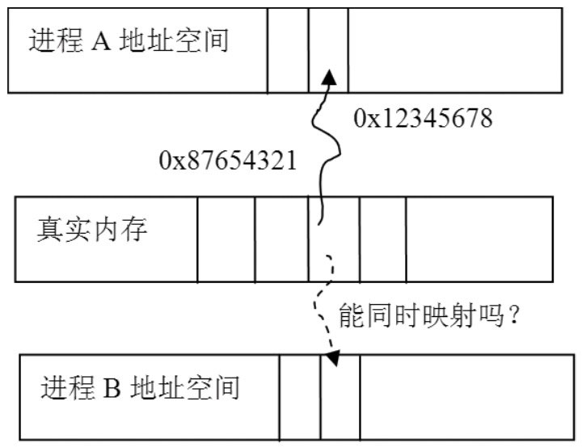

Linux 平台创建共享内存的一般做法是：进程 A 创建并打开一个文件得到 fd，用 mmap 与特定参数把 fd 映射为共享内存；进程 B 打开同一文件、同样 mmap，两个进程便共享了这块内存（该文件也可以是设备文件，mmap 的具体工作由 fd 对应的驱动完成）。Android 的 AT 与 AF 跨进程大数据量传输正是用这种方式，非常高效。

Android 对共享内存机制封装了两个类，AudioTrackJniStorage 就用到它们：

```cpp
// [--> android_media_AudioTrack.cpp::AudioTrackJniStorage 相关]
class AudioTrackJniStorage {
public:
    sp<MemoryHeapBase>  mMemHeap;   // 这两个 Memory 很重要
    sp<MemoryBase>      mMemBase;

    audiotrack_callback_cookie mCallbackData;
    int mStreamType;

    bool allocSharedMem(int sizeInBytes) {
        // 用法：先 new 一个 MemoryHeapBase，再以它为参数 new 一个 MemoryBase
        // ① MemoryHeapBase：创建共享内存
        mMemHeap = new MemoryHeapBase(sizeInBytes, 0, "AudioTrack Heap Base");
        // ② MemoryBase：在这块内存上划出一段
        mMemBase = new MemoryBase(mMemHeap, 0, sizeInBytes);
        return true;
    }
};
```

MemoryHeapBase 基于 Binder 通信（BpMemoryHeapBase 由客户端使用，MemoryHeapBase 完成 BnMemoryHeapBase 的业务），构造函数创建共享内存：

```cpp
// [--> MemoryHeapBase.cpp]
MemoryHeapBase::MemoryHeapBase(size_t size, uint32_t flags, char const * name)
    : mFD(-1), mSize(0), mBase(MAP_FAILED), mFlags(flags),
      mDevice(0), mNeedUnmap(false)
{
    const size_t pagesize = getpagesize();  // 内存页大小，一般为 4KB
    size = ((size + pagesize-1) & ~(pagesize-1));
    // ashmem_create_region 由 libcutils 提供：真实设备上打开 /dev/ashmem 设备
    // 得到文件描述符，模拟器上则创建一个 tmp 文件
    int fd = ashmem_create_region(name == NULL ? "MemoryHeapBase" : name, size);
    mapfd(fd, size);  // 经 mmap 得到内存地址，Linux 标准做法
}
```

构造完成后：mBase 指向共享内存起始位置，mSize 是分配大小，mFd 是 ashmem 返回的文件描述符。MemoryBase 则像一个辅助类，基于 MemoryHeapBase 划出（offset, size）一段：

```cpp
// [--> MemoryBase.h]
class MemoryBase : public BnMemory {
public:
    MemoryBase(const sp<IMemoryHeap>& heap, ssize_t offset, size_t size);
    virtual sp<IMemoryHeap> getMemory(ssize_t* offset, size_t* size) const;
protected:
    size_t getSize() const { return mSize; }        // 返回大小
    ssize_t getOffset() const { return mOffset; }   // 返回偏移量
    const sp<IMemoryHeap>& getHeap() const { return mHeap; } // 返回 MemoryHeapBase 对象
};
MemoryBase::MemoryBase(const sp<IMemoryHeap>& heap, ssize_t offset, size_t size)
    : mSize(size), mOffset(offset), mHeap(heap) {}
```

总结这两个类：分配了一块可供两个进程共享的内存，并且基于 Binder 通信，使两个进程能交互。Android 通过 ashmem（anonymous shared memory，匿名共享内存）创建共享内存的原理与 Linux 打开文件的方式类似，但 ashmem 驱动做了较大改进（引用计数、真正使用时才分配物理内存等）。

**提醒：这两个类没有提供同步对象来保护共享内存**。AT 和 AF 是典型的生产者与消费者，必然需要一个跨进程的同步对象来协调步调——这个伏笔由 audio_track_cblk_t 来收。

### 1.2.4 play、write 与 release

Java 层的 play 与 write 都直接转到 JNI 层，大部分工作由 Native AudioTrack 完成：

```cpp
// [--> android_media_AudioTrack.cpp]
static void android_media_AudioTrack_start(JNIEnv *env, jobject thiz)
{
    // 从 Java 的 AudioTrack 对象中获取 Native 层 AudioTrack 对象的指针
    AudioTrack *lpTrack = (AudioTrack *)env->GetIntField(
            thiz, javaAudioTrackFields.nativeTrackInJavaObj);
    lpTrack->start();   // 很简单的调用
}
```

write 的关键在 writeToTrack——STATIC 与 STREAM 两种模式在此分道：

```cpp
// [--> android_media_AudioTrack.cpp]
jint writeToTrack(AudioTrack* pTrack, jint audioFormat,
            jbyte* data, jint offsetInBytes, jint sizeInBytes)
{
    ssize_t written = 0;
    // STATIC 模式 sharedBuffer 返回不为空；STREAM 模式返回空
    if (pTrack->sharedBuffer() == 0) {
        // 本用例是 STREAM 模式，调用 write 函数写数据
        written = pTrack->write(data + offsetInBytes, sizeInBytes);
    } else {
        if (audioFormat == javaAudioTrackFields.PCM16) {
            if ((size_t)sizeInBytes > pTrack->sharedBuffer()->size()) {
                sizeInBytes = pTrack->sharedBuffer()->size();
            }
            // STATIC 模式直接把数据 memcpy 到共享内存（所以必须先 write 后 play）
            memcpy(pTrack->sharedBuffer()->pointer(),
                    data + offsetInBytes, sizeInBytes);
            written = sizeInBytes;
        } else if (audioFormat == javaAudioTrackFields.PCM8) {
            // PCM8 数据则先转换成 PCM16 再拷贝
            ......
        }
    }
    return written;
}
```

扫尾的 release 调用 finalize 真正释放资源，并把保存在 Java 对象中的指针清零：

```cpp
// [--> android_media_AudioTrack.cpp]
static void android_media_AudioTrack_native_release(JNIEnv *env, jobject thiz)
{
    android_media_AudioTrack_native_finalize(env, thiz); // stop 并 delete Native 对象
    env->SetIntField(thiz, javaAudioTrackFields.nativeTrackInJavaObj, 0);
    env->SetIntField(thiz, javaAudioTrackFields.jniData, 0);
}
```

进入 Native 层之前，先把 Java 空间使用 Native AudioTrack 的流程总结出来，控制了流程就把握了系统工作的命脉：

1. new 一个 AudioTrack（无参构造函数）
2. 调用 set，传入参数并设置回调函数 audioCallback
3. 调用 start
4. 调用 write
5. 工作完毕后调用 stop
6. delete Native 对象

纵跨 Java/Native、横跨两个进程的功能实现中有很多封装与特殊处理，但基本流程不变。

## 1.3 AudioTrack Native 层分析

带着上面六步流程进入 AudioTrack.cpp。这一节关注数据通路：set 如何选路、write 如何写数据、stop 如何收尾。

### 1.3.1 set 与 createTrack

AudioTrack 的无参构造只把状态初始化为 NO_INIT（Android 很多类都用这种状态控制），实质工作在 set：

```cpp
// [--> AudioTrack.cpp]
status_t AudioTrack::set(int streamType, uint32_t sampleRate, int format,
        int channels, int frameCount, uint32_t flags, callback_t cbf, void* user,
        int notificationFrames, const sp<IMemory>& sharedBuffer,
        bool threadCanCallJava)
{
    // 前面有一些判断，与 AudioSystem 有关，以后再分析
    ......
    // audio_io_handle_t 是一个 int 类型，来历涉及 AF 和 APS：
    // AF 会创建几个工作线程，getOutput 根据流类型等参数选取合适的工作线程，
    // 返回它在 AF 中的索引号。AT 一般使用混音线程 MixerThread
    audio_io_handle_t output = AudioSystem::getOutput(
                (AudioSystem::stream_type)streamType,
                sampleRate, format, channels,
                (AudioSystem::output_flags)flags);
    // 调用 createTrack
    status_t status = createTrack(streamType, sampleRate, format, channelCount,
                                    frameCount, flags, sharedBuffer, output);
    // cbf 是 JNI 层传入的 audioCallback，设置了回调函数则启动一个线程
    if (cbf != 0) {
        mAudioTrackThread = new AudioTrackThread(*this, threadCanCallJava);
    }
    return NO_ERROR;
}
```

set 先经 AudioSystem::getOutput 拿到工作线程索引号，再进 createTrack：

```cpp
// [--> AudioTrack.cpp]
status_t AudioTrack::createTrack(int streamType, uint32_t sampleRate,
        int format, int channelCount, int frameCount, uint32_t flags,
        const sp<IMemory>& sharedBuffer, audio_io_handle_t output)
{
    status_t status;
    // 得到 AudioFlinger 的 Binder 代理端 BpAudioFlinger。
    // 后文跨过 Binder 直接分析 Bn 端实现
    const sp<IAudioFlinger>& audioFlinger = AudioSystem::get_audio_flinger();
    // 向 AF 发送 createTrack 请求：STREAM 模式下 sharedBuffer 为空，
    // output 是 getOutput 得到的线程索引号。返回 IAudioTrack（实际为 BpAudioTrack），
    // 后续 AT 与 AF 的交互都围绕 IAudioTrack 进行
    sp<IAudioTrack> track = audioFlinger->createTrack(getpid(),
        streamType, sampleRate, format, channelCount, frameCount,
        ((uint16_t)flags) << 16, sharedBuffer, output, &status);

    // STREAM 模式下 AT 端没有创建共享内存，这块内存由 AF 的 createTrack 创建，
    // 下面取出 AF 创建的共享内存
    sp<IMemory> cblk = track->getCblk();
    mAudioTrack.clear();      // sp 的 clear
    mAudioTrack = track;
    mCblkMemory.clear();
    mCblkMemory = cblk;       // cblk 是 control block 的简写
    // pointer 返回共享内存首地址，直接转成 audio_track_cblk_t，
    // 表明这块内存的首部存在一个 audio_track_cblk_t 对象
    mCblk = static_cast<audio_track_cblk_t*>(cblk->pointer());
    mCblk->out = 1;           // out 为 1 表示输出，为 0 表示输入
    mFrameCount = mCblk->frameCount;
    if (sharedBuffer == 0) {
        // buffers 指向数据空间：共享内存首部加上 audio_track_cblk_t 的大小
        mCblk->buffers = (char*)mCblk + sizeof(audio_track_cblk_t);
    } else {
        // STATIC 模式下的处理
        mCblk->buffers = sharedBuffer->pointer();
        mCblk->stepUser(mFrameCount);  // 数据已写完，直接更新写位置
    }
    return NO_ERROR;
}
```

createTrack 中冒出了新面孔 IAudioTrack——**IAudioTrack 是联系 AT 和 AF 的关键纽带**，如图 7-3：


AT 端拿到 IAudioTrack 后的 start、stop 请求都经它发给 AF；write 写的数据则进入它所关联的共享内存。共享内存的头部是一个 audio_track_cblk_t（简称 CB）对象，其后才是数据缓冲。

### 1.3.2 audio_track_cblk_t 初见与 Push/Pull 两种数据供给

CB 是本章最核心的数据结构，它的声明在 AudioTrackShared.h、定义在 AudioTrack.cpp：

```cpp
// [--> AudioTrackShared.h::audio_track_cblk_t 声明]
struct audio_track_cblk_t
{
    Mutex     lock;
    Condition cv;    // 两个同步变量，初始化时设置为支持跨进程共享
    // 一块数据缓冲同时被生产者和消费者使用，最重要的是维护读写位置。
    // 注意 user/server 并不直观，需结合 userBase/serverBase 使用
    volatile uint32_t user;       // 当前写位置（生产者已经写到哪里）
    volatile uint32_t server;     // 当前读位置
    uint32_t userBase;
    uint32_t serverBase;   // CB 巧妙地通过这几个变量把线性缓冲当环形缓冲用
    void*    buffers;      // 指向数据缓冲的首地址
    uint32_t frameCount;   // 数据缓冲总大小，以 Frame 为单位
    uint32_t loopStart;    // 打点播放（设置播放的起点和终点）
    uint32_t loopEnd;
    int      loopCount;    // 循环播放次数

    volatile union {
        uint16_t volume[2];
        uint32_t volumeLR;
    };                     // 与音量有关
    uint32_t sampleRate;   // 采样率
    uint32_t frameSize;    // 一单位 Frame 的数据大小
    uint8_t  channels;     // 声道数
    uint8_t  flowControlFlag;  // 控制标志，见下文
    uint8_t  out;          // AudioTrack 为 1，AudioRecord 为 0
    uint8_t  forceReady;
    uint16_t bufferTimeoutMs;
    uint16_t waitTimeMs;
    // 下面几个函数很重要
    uint32_t stepUser(uint32_t frameCount);    // 更新写位置
    bool     stepServer(uint32_t frameCount);  // 更新读位置
    void*    buffer(uint32_t offset) const;    // 返回可写空间的起始位置
    uint32_t framesAvailable();                // 还剩多少空间可写
    uint32_t framesAvailable_l();
    uint32_t framesReady();                    // 有多少可读数据
};
```

上一节留下的问题在此有了答案：MemoryHeapBase 和 MemoryBase 都不提供同步对象，**CB 对象的主要目的就是协调和管理 AT（生产者）与 AF（消费者）数据生产和消费的步伐**——它带着支持跨进程的 Mutex/Condition 驻留在共享内存头部。图 7-4 表示 CB 与共享内存的关系：

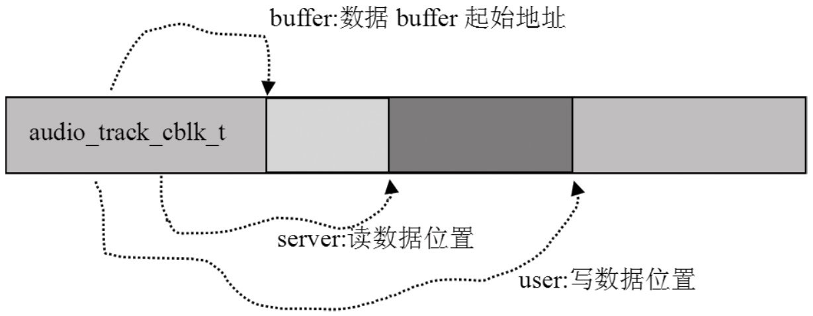

关于 `flowControlFlag`：对音频输出，它对应 **underrun 状态——生产者提供数据的速度跟不上消费者（音频输出设备）使用数据的速度**。输出设备采用环形缓冲管理，生产者没及时给新数据时设备会循环使用旧数据，听到一段重复的声音（俗称 machinegun 现象）；一般处理是暂停输出、等数据备好再恢复。对音频输入它对应 overrun，只是生产者与消费者角色互换。

还有两个悬念先记下：`mCblk = static_cast<audio_track_cblk_t*>(cblk->pointer())` 只是把共享内存首地址强转成 CB 指针，**这块内存里的 CB 对象是怎么「塞」进去的**？答案在 AF 的 TrackBase 构造函数（placement new）。

再看数据的供给方式。JNI 层构造时传入了回调 audioCallback，使 Native AudioTrack 创建了 AudioTrackThread 线程。这与 AT 的两种数据输入方式有关：

- **Push 模式**：用户主动调用 write 写数据，数据被推给 AudioTrack。MediaPlayerService 一般用这种方式
- **Pull 模式**：AudioTrackThread 以 EVENT_MORE_DATA 为参数经回调主动从用户处拉数据。ToneGenerator 用这种方式

回调的第一个参数表达意图：

```cpp
// [--> AudioTrack.h::event_type]
enum event_type {
    EVENT_MORE_DATA = 0,  // AudioTrack 需要更多数据
    EVENT_UNDERRUN = 1,   // Audio 硬件处于低负荷状态
    EVENT_LOOP_END = 2,   // 打点播放到达终点
    EVENT_MARKER = 3,     // 数据使用警戒通知，经 setMarkerPosition 设置，只通知一次
    EVENT_NEW_POS = 4,    // 数据使用进度通知，经 setPositionUpdatePeriod 设置
    EVENT_BUFFER_END = 5  // 数据全部被消耗
};
```

AudioTrackThread 的线程函数只是转调 processAudioBuffer，后者处理 underrun、循环播放、警戒与进度通知，并在 Pull 模式下取数据（摘编主干）：

```cpp
// [--> AudioTrack.cpp]
bool AudioTrack::processAudioBuffer(const sp<AudioTrackThread>& thread)
{
    Buffer audioBuffer;
    uint32_t frames;
    // 处理 underrun：active 且无数据可读时通知 EVENT_UNDERRUN，
    // 若读位置已到数据末尾再通知 EVENT_BUFFER_END
    if (mActive && (mCblk->framesReady() == 0)) {
        if (mCblk->flowControlFlag == 0) {
            mCbf(EVENT_UNDERRUN, mUserData, 0);
            if (mCblk->server == mCblk->frameCount) {
                mCbf(EVENT_BUFFER_END, mUserData, 0);
            }
            mCblk->flowControlFlag = 1;
            if (mSharedBuffer != 0) return false;
        }
    }
    // 循环播放通知：一次循环完毕，loopCount 表示还剩多少次
    while (mLoopCount > mCblk->loopCount) {
        int loopCount = -1;
        mLoopCount--;
        if (mLoopCount >= 0) loopCount = mCblk->loopCount;
        mCbf(EVENT_LOOP_END, mUserData, (void *)&loopCount);
    }
    // 警戒通知：数据使用超过警戒值时只通知一次
    if (!mMarkerReached && (mMarkerPosition > 0)) {
        if (mCblk->server >= mMarkerPosition) {
            mCbf(EVENT_MARKER, mUserData, (void *)&mMarkerPosition);
            mMarkerReached = true;
        }
    }
    // 进度通知：以帧为基准，一次消费 1500 帧会连发 3 次每 500 帧的通知
    if (mUpdatePeriod > 0) {
        while (mCblk->server >= mNewPosition) {
            mCbf(EVENT_NEW_POS, mUserData, (void *)&mNewPosition);
            mNewPosition += mUpdatePeriod;
        }
    }
    ......
    do {
        audioBuffer.frameCount = frames;
        status_t err = obtainBuffer(&audioBuffer, 1);  // 得到一块可写缓冲
        // 从用户处 pull 数据
        mCbf(EVENT_MORE_DATA, mUserData, &audioBuffer);
        writtenSize = audioBuffer.size;
        ......
        releaseBuffer(&audioBuffer);   // 写完毕，释放这块缓冲
    } while (frames);
    return true;
}
```

用例明明用 write 推数据，为何回调也来要数据？看 JNI 层传入的 audioCallback 实现就释然了：

```cpp
// [--> android_media_AudioTrack.cpp]
static void audioCallback(int event, void* user, void *info) {
    if (event == AudioTrack::EVENT_MORE_DATA) {
        // 虽然收到了 EVENT_MORE_DATA，但 Java 层并未提供数据
        AudioTrack::Buffer* pBuff = (AudioTrack::Buffer*)info;
        pBuff->size = 0;
    }
    ......
}
```

Java 层的 AudioTrack 走 Push 模式，回调线程只是承担各种事件通知；真正供数据的 write 才是主战场。

### 1.3.3 write：数据的生产

分析 write 前先推理：有一块共享内存，有一个带跨进程同步变量的控制结构，那么 write 的工作方式必然是——**通过共享内存传递数据，通过控制结构协调生产者与消费者的步调**：

```cpp
// [--> AudioTrack.cpp]
ssize_t AudioTrack::write(const void* buffer, size_t userSize)
{
    if (mSharedBuffer != 0) return INVALID_OPERATION;
    if (ssize_t(userSize) < 0) {
        return BAD_VALUE;
    }
    ssize_t written = 0;
    const int8_t *src = (const int8_t *)buffer;
    Buffer audioBuffer;   // Buffer 是一个辅助性的结构

    do {
        // 以帧为单位
        audioBuffer.frameCount = userSize/frameSize();
        // obtainBuffer 从共享内存得到一块空闲数据块
        status_t err = obtainBuffer(&audioBuffer, -1);
        ......
        size_t toWrite;
        if (mFormat == AudioSystem::PCM_8_BIT &&
                        !(mFlags & AudioSystem::OUTPUT_FLAG_DIRECT)) {
            // PCM8 数据转成 PCM16
        } else {
            // 空闲缓冲大小是 audioBuffer.size，地址在 audioBuffer.i8，
            // 数据传递通过 memcpy 完成
            toWrite = audioBuffer.size;
            memcpy(audioBuffer.i8, src, toWrite);
            src += toWrite;
        }
        userSize -= toWrite;
        written += toWrite;
        releaseBuffer(&audioBuffer);  // 更新写位置，同时会触发消费者
    } while (userSize);

    return written;
}
```

数据的传递果然就是 memcpy，协调则由 obtainBuffer 与 releaseBuffer 完成：

```cpp
// [--> AudioTrack.cpp]
status_t AudioTrack::obtainBuffer(Buffer* audioBuffer, int32_t waitCount)
{
    int active;
    status_t result;
    audio_track_cblk_t* cblk = mCblk;
    ......
    // ① 调用 framesAvailable，得到当前可写的空间大小
    uint32_t framesAvail = cblk->framesAvailable();
    if (framesAvail == 0) {
        // 没有可写空间，等待一段时间
        result = cblk->cv.waitRelative(cblk->lock, milliseconds(waitTimeMs));
        ......
    }
    cblk->waitTimeMs = 0;
    if (framesReq > framesAvail) {
        framesReq = framesAvail;
    }
    // user 为可写空间的起始地址
    uint32_t u = cblk->user;
    uint32_t bufferEnd = cblk->userBase + cblk->frameCount;
    if (u + framesReq > bufferEnd) {
        framesReq = bufferEnd - u;
    }
    ......
    // ② 调用 buffer，得到可写空间的首地址
    audioBuffer->raw = (int8_t *)cblk->buffer(u);
    active = mActive;
    return active ? status_t(NO_ERROR) : status_t(STOPPED);
}

void AudioTrack::releaseBuffer(Buffer* audioBuffer)
{
    audio_track_cblk_t* cblk = mCblk;
    cblk->stepUser(audioBuffer->frameCount);  // ③ 调用 stepUser 更新写位置
}
```

AT 作为生产者与 CB 的交互共三个调用：**framesAvailable 判断是否有可写空间、buffer 得到写空间起始地址、stepUser 更新写位置**。这三个函数是 1.4.9 环形缓冲分析的伏笔。

### 1.3.4 stop、析构与 AT/AF 交互流程

stop 的工作是调用 IAudioTrack 的 stop（最终处理在 AF 端）并要求退出回调线程；析构函数也会先调用 stop，这个做法很周到：

```cpp
// [--> AudioTrack.cpp]
void AudioTrack::stop()
{
    sp<AudioTrackThread> t = mAudioTrackThread;
    if (t != 0) {
        t->mLock.lock();
    }
    if (android_atomic_and(~1, &mActive) == 1) {
        mCblk->cv.signal();
        // mAudioTrack 是 IAudioTrack 类型，stop 的最终处理在 AudioFlinger 端
        mAudioTrack->stop();
        setLoop(0, 0, 0);        // 清空循环播放设置
        mMarkerReached = false;
        if (mSharedBuffer != 0) {
            flush();
        }
        if (t != 0) {
            t->requestExit();    // 请求退出 AudioTrackThread
        } else {
            setpriority(PRIO_PROCESS, 0, ANDROID_PRIORITY_NORMAL);
        }
    }
    if (t != 0) {
        t->mLock.unlock();
    }
}

AudioTrack::~AudioTrack()
{
    if (mStatus == NO_ERROR) {
        stop();  // 调用 stop
        if (mAudioTrackThread != 0) {
            mAudioTrackThread->requestExitAndWait();
            mAudioTrackThread.clear();
        }
        mAudioTrack.clear();
        IPCThreadState::self()->flushCommands(); // 发出残留在 IPC 缓冲中的信息
    }
}
```

至此 AT 的分析告一段落。图 7-5 总结了它与 AF 的交互流程，这是攻克 AF 的重要武器：

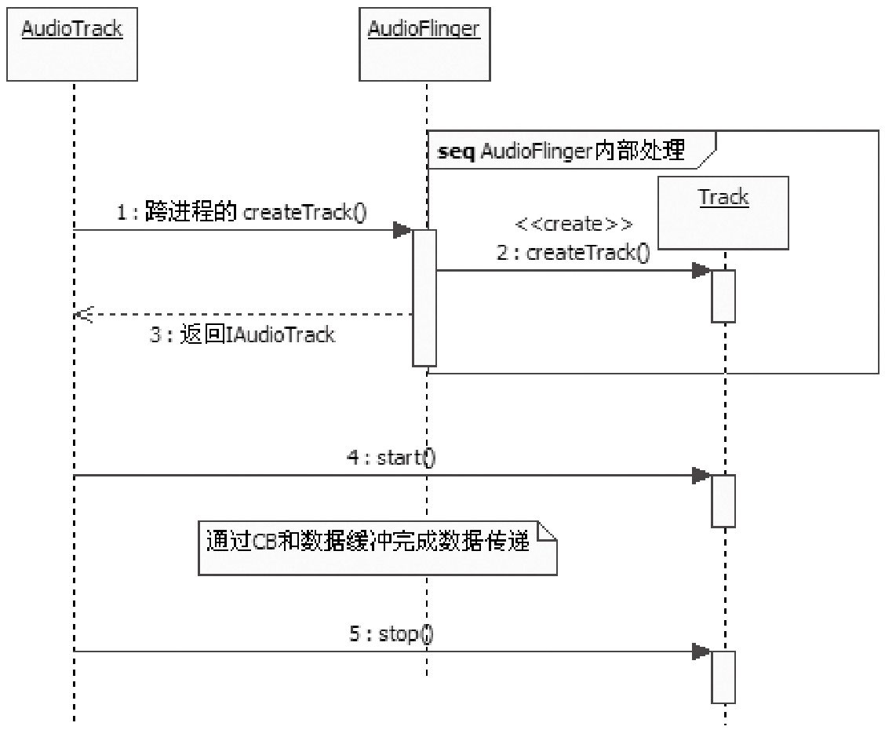

1. AT 调用 createTrack，得到一个 IAudioTrack 对象
2. AT 调用 IAudioTrack 的 start，表示准备写数据
3. AT 通过 write 写数据，与 audio_track_cblk_t 密切相关
4. AT 调用 IAudioTrack 的 stop 或 delete 结束工作

## 1.4 AudioFlinger：工作引擎

来自 AT 的数据最终都在 AF 得到处理并写入 Audio HAL。本节按「诞生 → createTrack → 对象家族 → MixerThread 工作循环 → 数据消费 → 资源回收 → CB 环形缓冲」推进，7.3.2 原文 55KB 的逐行解说在这里压缩为主线。

### 1.4.1 AudioFlinger 的诞生与 AudioHardwareInterface

AF 驻留于 MediaServer 进程，与 APS 一起在 main 中注册为 Binder 服务：

```cpp
// [--> Main_MediaServer.cpp]
int main(int argc, char** argv)
{
    sp<ProcessState> proc(ProcessState::self());
    sp<IServiceManager> sm = defaultServiceManager();
    ......
    // AF 和 APS 都驻留在这个进程中
    AudioFlinger::instantiate();
    AudioPolicyService::instantiate();
    ......
    ProcessState::self()->startThreadPool();
    IPCThreadState::self()->joinThreadPool();
}
```

```cpp
// [--> AudioFlinger.cpp]
void AudioFlinger::instantiate() {
    defaultServiceManager()->addService(  // 把 AF 添加到 ServiceManager 中
            String16("media.audio_flinger"), new AudioFlinger());
}

AudioFlinger::AudioFlinger()
    : BnAudioFlinger(),
      mAudioHardware(0),   // 代表 Audio 硬件的 HAL 对象
      mMasterVolume(1.0f), mMasterMute(false), mNextThreadId(0)
{
    mHardwareStatus = AUDIO_HW_IDLE;
    // 创建代表 Audio 硬件的 HAL 对象
    mAudioHardware = AudioHardwareInterface::create();
    mHardwareStatus = AUDIO_HW_INIT;
    if (mAudioHardware->initCheck() == NO_ERROR) {
        // 设置系统初始化的一些值，有一部分经 Audio HAL 设置到硬件
        setMode(AudioSystem::MODE_NORMAL);
        setMasterVolume(1.0f);
        setMasterMute(false);
    }
}
```

**AudioHardwareInterface 是 Android 对音频硬件的 HAL 层封装**，具体功能由硬件厂商以动态库形式实现。接口定义中最重要的部分是流对象的创建：

```cpp
// [--> AudioHardwareInterface.h::AudioHardwareInterface 声明（摘编）]
class AudioHardwareInterface
{
public:
    virtual ~AudioHardwareInterface() {}
    virtual status_t initCheck() = 0;          // 检查硬件是否初始化成功
    virtual status_t setVoiceVolume(float volume) = 0;   // 通话音量，0 到 1.0
    // 除通话音量外所有流类型的音量；硬件不支持时由软件层混音器完成
    virtual status_t setMasterVolume(float volume) = 0;
    virtual status_t setMode(int mode) = 0;    // NORMAL/RINGTONE/IN_CALL 模式
    virtual status_t setMicMute(bool state) = 0;   // 与麦克相关
    virtual status_t getMicMute(bool* state) = 0;
    virtual status_t setParameters(const String8& keyValuePairs) = 0;  // key/value 参数
    virtual String8  getParameters(const String8& keys) = 0;
    // 根据参数得到输入缓冲大小，返回 0 表示某参数不被支持
    virtual size_t getInputBufferSize(uint32_t sampleRate, int format,
                                      int channelCount) = 0;
    // 创建音频输出流对象（相当于打开音频输出设备），AF 可往其中 write 数据
    virtual AudioStreamOut* openOutputStream(uint32_t devices, int *format=0,
                    uint32_t *channels=0, uint32_t *sampleRate=0,
                    status_t *status=0) = 0;
    virtual void closeOutputStream(AudioStreamOut* out) = 0;
    // 创建音频输入流对象（相当于打开音频输入设备），AF 可 read 数据
    virtual AudioStreamIn* openInputStream(uint32_t devices, int *format,
                    uint32_t *channels, uint32_t *sampleRate, status_t *status,
                    AudioSystem::audio_in_acoustics acoustics) = 0;
    virtual void closeInputStream(AudioStreamIn* in) = 0;
    // 静态 create 函数，工厂模式：具体返回的对象由厂商根据硬件决定
    static AudioHardwareInterface* create();
    ......
};
```

可得三个结论：AudioHardwareInterface 管理 AudioStreamOut（输出设备）与 AudioStreamIn（输入设备）的创建；经它可设置音频系统参数；输出/输入对象均支持 setParameters（路由切换靠它）。类关系如图 7-6：

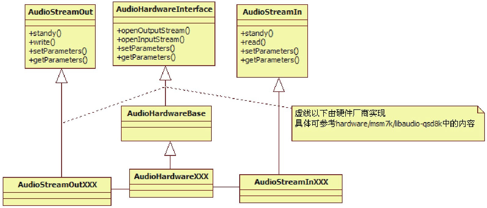

从这个角度说，是 AudioHardwareInterface 管理着系统中所有的音频设备——HAL 层的引入大大简化了应用层工作，否则无论用 libasound 还是 ioctl 控制音频设备都会非常麻烦。

### 1.4.2 createTrack：选择线程、创建 Track 与 TrackHandle

按交互流程，AF 端第一个被调用的是 createTrack：

```cpp
// [--> AudioFlinger.cpp]
sp<IAudioTrack> AudioFlinger::createTrack(
        pid_t pid,           // AT 的 pid 号
        int streamType,      // 流类型，用例中是 MUSIC
        uint32_t sampleRate, // 8000 采样率
        int format,          // PCM_16
        int channelCount,    // 2，双声道
        int frameCount,      // 需要创建的缓冲大小，以帧为单位
        uint32_t flags,
        const sp<IMemory>& sharedBuffer,  // AT 传入的共享 buffer，此处为空
        int output,          // AF 中的工作线程索引号
        status_t *status)
{
    sp<PlaybackThread::Track> track;
    sp<TrackHandle> trackHandle;
    sp<Client> client;
    wp<Client> wclient;
    status_t lStatus;
    {
        Mutex::Autolock _l(mLock);
        // output 代表索引号，根据它找到一个 PlaybackThread
        PlaybackThread *thread = checkPlaybackThread_l(output);
        // 看看这个进程是否已经是 AF 的 Client，AF 根据进程 pid 标识不同 Client
        wclient = mClients.valueFor(pid);
        if (wclient != NULL) {
        } else {
            // 没有 Client 信息则创建一个并加入 mClients
            client = new Client(this, pid);
            mClients.add(pid, client);
        }
        // 在找到的工作线程对象中创建一个 Track
        track = thread->createTrack_l(client, streamType, sampleRate, format,
                channelCount, frameCount, sharedBuffer, &lStatus);
    }
    // TrackHandle 是 Track 对象的 Proxy：它支持 Binder 通信而 Track 不支持，
    // TrackHandle 收到的请求最终由 Track 处理，典型的 Proxy 模式
    trackHandle = new TrackHandle(track);
    return trackHandle;
}
```

checkPlaybackThread_l 按 output 索引从 mPlaybackThreads 中取线程：

```cpp
// [--> AudioFlinger.cpp]
AudioFlinger::PlaybackThread *
            AudioFlinger::checkPlaybackThread_l(int output) const
{
    PlaybackThread *thread = NULL;
    // 根据 output 的值找到对应的 thread
    if (mPlaybackThreads.indexOfKey(output) >= 0) {
        thread = (PlaybackThread *)mPlaybackThreads.valueFor(output).get();
    }
    return thread;
}
```

到目前为止还没见过创建线程的地方，这里却能按索引找到线程——悬念留到 1.4.4 揭晓（答案是 APS 的创建过程触发了 AF 的 openOutput）。先看 createTrack_l 与 Track 的构造，**共享内存正是这里创建的**：

```cpp
// [--> AudioFlinger.cpp]
// Android 的很多代码采用内部类的方式封装
sp<AudioFlinger::PlaybackThread::Track>
        AudioFlinger::PlaybackThread::createTrack_l(
        const sp<AudioFlinger::Client>& client, int streamType,
        uint32_t sampleRate, int format, int channelCount, int frameCount,
        const sp<IMemory>& sharedBuffer,  // 从 AT 传入，为 0
        status_t *status)
{
    sp<Track> track;
    status_t lStatus;
    {
        Mutex::Autolock _l(mLock);
        // 创建 Track 对象
        track = new Track(this, client, streamType, sampleRate, format,
                          channelCount, frameCount, sharedBuffer);
        // 将新创建的 Track 加入内部数组 mTracks
        mTracks.add(track);
    }
    lStatus = NO_ERROR;
    return track;
}

AudioFlinger::PlaybackThread::Track::Track(const wp<ThreadBase>& thread,
        const sp<Client>& client, int streamType, uint32_t sampleRate,
        int format, int channelCount, int frameCount,
        const sp<IMemory>& sharedBuffer)
    :   TrackBase(thread, client, sampleRate, format, channelCount,
        frameCount, 0, sharedBuffer),  // sharedBuffer 仍为空
        mMute(false), mSharedBuffer(sharedBuffer), mName(-1)
{
    // mCblk != NULL？什么时候创建的？只能看基类 TrackBase 的构造函数
    if (mCblk != NULL) {
        mVolume[0] = 1.0f;
        mVolume[1] = 1.0f;
        mStreamType = streamType;
        mCblk->frameSize = AudioSystem::isLinearPCM(format) ?
                            channelCount * sizeof(int16_t) : sizeof(int8_t);
    }
}
```

共享内存的创建藏在 TrackBase 的构造里：

```cpp
// [--> AudioFlinger.cpp]
AudioFlinger::ThreadBase::TrackBase::TrackBase(
            const wp<ThreadBase>& thread, const sp<Client>& client,
            uint32_t sampleRate, int format, int channelCount, int frameCount,
            uint32_t flags, const sp<IMemory>& sharedBuffer)
    :   RefBase(), mThread(thread), mClient(client), mCblk(0),
        mFrameCount(0), mState(IDLE), mClientTid(-1), mFormat(format),
        mFlags(flags & ~SYSTEM_FLAGS_MASK)
{
    size_t size = sizeof(audio_track_cblk_t);  // CB 对象的大小
    size_t bufferSize = frameCount * channelCount * sizeof(int16_t); // 数据缓冲大小
    if (sharedBuffer == 0) {
        // 共享内存最前面是 audio_track_cblk_t，后面才是数据空间
        size += bufferSize;
    }
    // 从 Client 的 MemoryDealer 中分配 size 大小的共享内存
    mCblkMemory = client->heap()->allocate(size);
    // pointer 返回共享内存首地址，强转为 audio_track_cblk_t*。
    // 强转成任何类型都可以，但这块内存里真有 CB 对象吗？
    mCblk = static_cast<audio_track_cblk_t *>(mCblkMemory->pointer());
    // ① 这句代码很独特，什么意思？
    new(mCblk) audio_track_cblk_t();

    mCblk->frameCount = frameCount;
    mCblk->sampleRate = sampleRate;
    mCblk->channels = (uint8_t)channelCount;
    if (sharedBuffer == 0) {
        mBuffer = (char*)mCblk + sizeof(audio_track_cblk_t);
        memset(mBuffer, 0, frameCount * channelCount * sizeof(int16_t)); // 清空数据区
        mCblk->flowControlFlag = 1;  // 初始值为 1
    }
    ......
}
```

`new(mCblk) audio_track_cblk_t();` 是 C++ 的 **placement new——在括号指定的内存中构造对象**（普通 new 只能在系统分配的堆上创建对象）。这里用 placement new 把 CB 对象构造在共享内存上，它自然就能被 AT 与 AF 两个进程看见并使用。1.3.2 的悬念就此解开。

createTrack 返回的 TrackHandle 以 Track 为参数构造，是 Track 的 Binder 代理。AF 中没有保存这个 trackHandle 指针——它并非野指针：AT 端的 BpAudioTrack 持有对它的引用，Binder 与 RefBase 的引用计数体系保证了它的生命周期。

### 1.4.3 AF 中的对象家族

createTrack 里出现了 AudioFlinger、Client、PlaybackThread、Track、TrackHandle 一串对象。图 7-7 给出 AF 中的全部类：

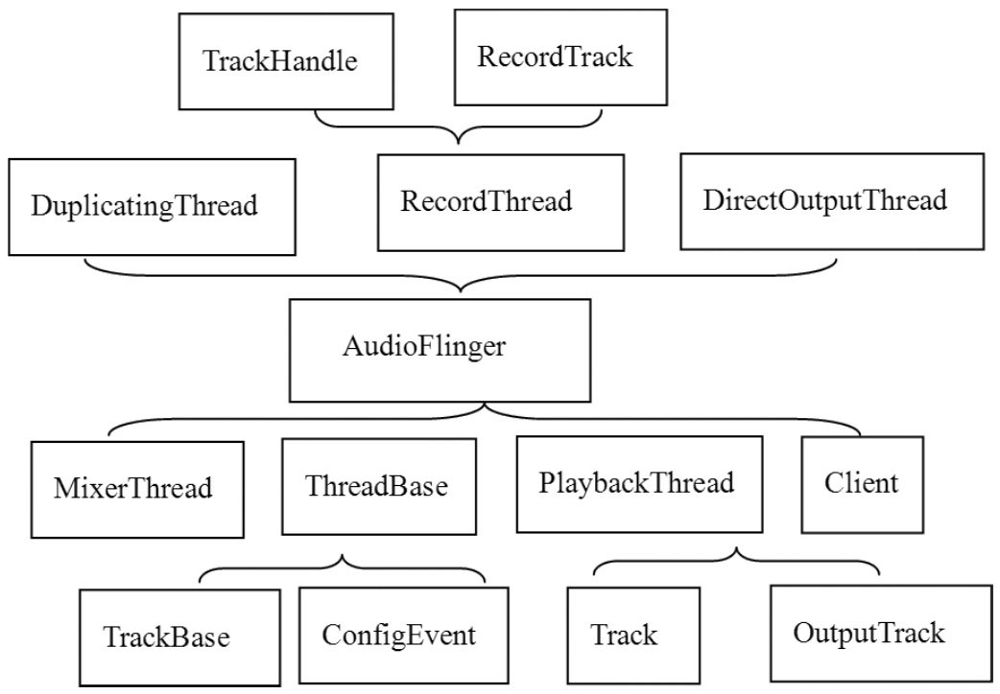

**Client 对象**是 AF 对客户端的封装，凡使用 AudioTrack/AudioRecord 的进程都是 AF 的 Client，以进程 pid 为标识。一个 Client 进程可以创建多个 AudioTrack，它们属于同一个 Client：

```cpp
// [--> AudioFlinger.cpp::Client]
class Client : public RefBase {
public:
    Client(const sp<AudioFlinger>& audioFlinger, pid_t pid);
    virtual ~Client();
    const sp<MemoryDealer>& heap() const;   // 内存分配器，Track 的共享内存从这里分配
    pid_t pid() const { return mPid; }
    sp<AudioFlinger> audioFlinger() { return mAudioFlinger; }
private:
    sp<AudioFlinger> mAudioFlinger;
    sp<MemoryDealer> mMemoryDealer;   // 内存分配器
    pid_t mPid;
};
```

**工作线程家族**如图 7-8：

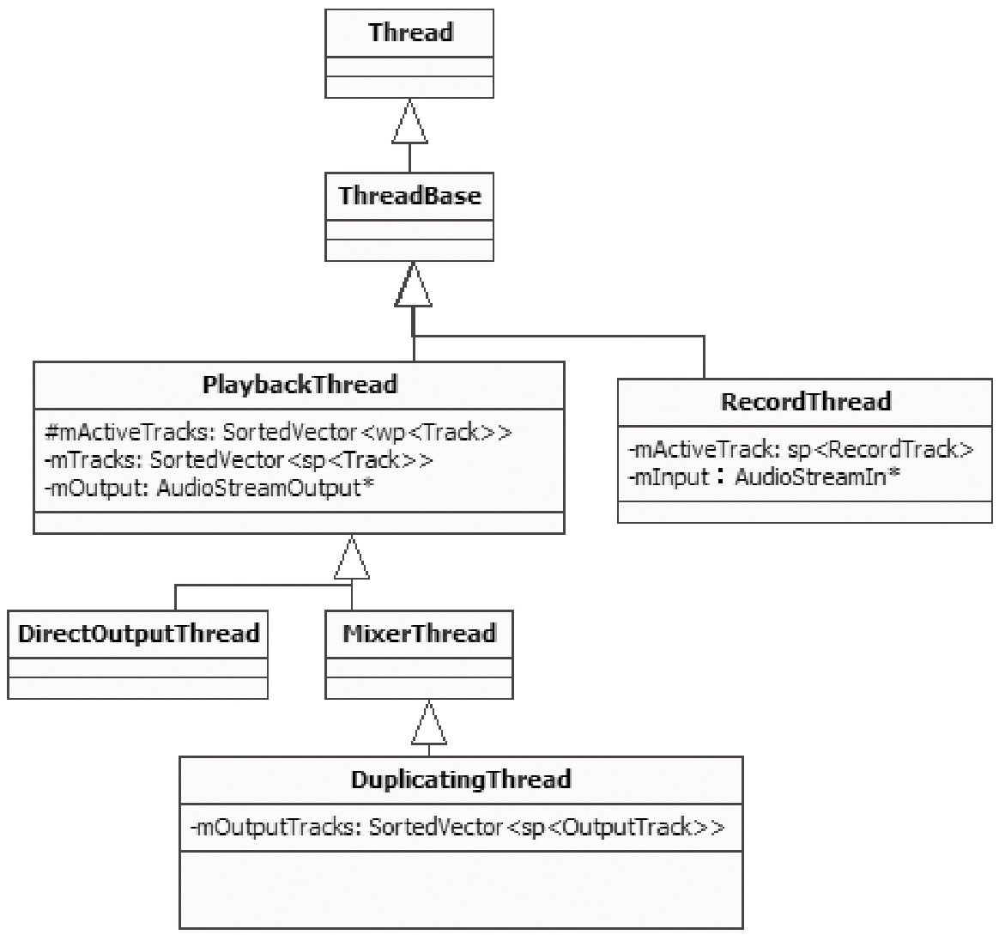

| 线程 | 职责 |
|---|---|
| PlaybackThread | 回放线程，音频输出；成员 mOutput 指向 AudioStreamOut，直接联系输出设备 |
| RecordThread | 录音线程，音频输入；成员 mInput 指向 AudioStreamIn |
| MixerThread | PlaybackThread 子类，混音线程：多路音频数据混音后输出，最常用 |
| DirectOutputThread | PlaybackThread 子类，直接输出线程：选一路音频流直接输出，无混音、延时小 |
| DuplicatingThread | MixerThread 子类，多路输出：混音后的数据写到多个输出（蓝牙 A2DP 场景） |

PlaybackThread 维护两个 Track 数组：mActiveTracks 是当前活跃的 Track，mTracks 是该线程创建的所有 Track；DuplicatingThread 另有 mOutputTracks 表示多路输出的目的端。用例对应的回放线程是一个 MixerThread。图 7-9 以 MixerThread 为代表展示音频数据的流动轨迹——**接收 AT 的数据、混音、把结果写入 AudioStreamOut 完成输出**：


**Track 家族**如图 7-10。TrackHandle 与 RecordTrack 侧的 RecordHandle 基于 Binder 通信，作为 Proxy 接收请求并派发给对应的 Track/RecordTrack。Track 不直接继承 Binder 框架的原因也在图中：Track 本身的继承关系与承担的工作已经很复杂（TrackBase 定义于 ThreadBase、Track 定义于 PlaybackThread、RecordTrack 定义于 RecordThread、OutputTrack 定义于 DuplicatingThread），再掺合 Binder 只会乱上添乱。

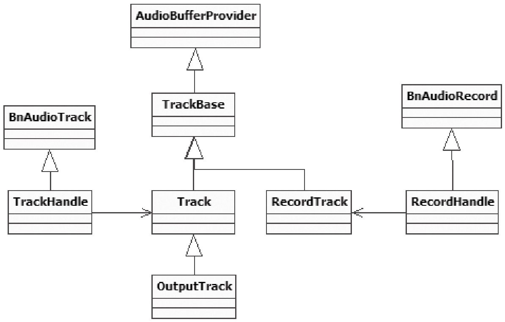

### 1.4.4 MixerThread 的来历

checkPlaybackThread_l 能按索引找到线程，说明线程早已创建。这条创建链的起点不在 AF 而在 APS——AP 一定创建（先于应用使用音频）时就绪：

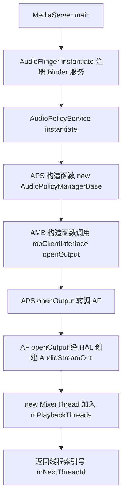

关键代码链如下。APS 构造函数创建 AudioPolicyManagerBase（细节在 1.5.1 展开），AMB 的构造函数经 clientInterface（即 APS）调用 openOutput：

```cpp
// [--> AudioPolicyManagerBase.cpp]
AudioPolicyManagerBase::AudioPolicyManagerBase(
        AudioPolicyClientInterface *clientInterface)
    : mPhoneState(AudioSystem::MODE_NORMAL), mRingerMode(0),
      mMusicStopTime(0), mLimitRingtoneVolume(false)
{
    mpClientInterface = clientInterface;
    ......
    // 调用 mpClientInterface 的 openOutput，实际就是 AudioPolicyService。
    // 注意 openOutput 是在 AP 的创建过程中调用的
    mHardwareOutput = mpClientInterface->openOutput(&outputDesc->mDevice,
                                      &outputDesc->mSamplingRate,
                                      &outputDesc->mFormat,
                                      &outputDesc->mChannels,
                                      &outputDesc->mLatency,
                                      outputDesc->mFlags);
    ......
}
```

```cpp
// [--> AudioPolicyService.cpp]
audio_io_handle_t AudioPolicyService::openOutput(uint32_t *pDevices,
                uint32_t *pSamplingRate, uint32_t *pFormat,
                uint32_t *pChannels, uint32_t *pLatencyMs,
                AudioSystem::output_flags flags)
{
    sp<IAudioFlinger> af = AudioSystem::get_audio_flinger();
    // 调用 AudioFlinger 的 openOutput，此时 AF 已经启动
    return af->openOutput(pDevices, pSamplingRate, (uint32_t *)pFormat,
                pChannels, pLatencyMs, flags);
}
```

AF 的 openOutput 创建 HAL 输出流对象，并按参数决定线程类型：

```cpp
// [--> AudioFlinger.cpp]
int AudioFlinger::openOutput(uint32_t *pDevices, uint32_t *pSamplingRate,
        uint32_t *pFormat, uint32_t *pChannels, uint32_t *pLatencyMs, uint32_t flags)
{
    ......
    Mutex::Autolock _l(mLock);
    // 创建 Audio HAL 的音频输出流对象，和音频输出设备建立联系
    AudioStreamOut *output = mAudioHardware->openOutputStream(*pDevices,
                                    (int *)&format, &channels,
                                    &samplingRate, &status);
    mHardwareStatus = AUDIO_HW_IDLE;
    if (output != 0) {
        if ((flags & AudioSystem::OUTPUT_FLAG_DIRECT) ||
            (format != AudioSystem::PCM_16_BIT) ||
            (channels != AudioSystem::CHANNEL_OUT_STEREO)) {
            // DIRECT 标志或非 PCM16/非立体声，创建 DirectOutputThread
            thread = new DirectOutputThread(this, output, ++mNextThreadId);
        } else {
            // 一般创建的都是 MixerThread，AudioStreamOut 对象也传进去了
            thread = new MixerThread(this, output, ++mNextThreadId);
        }
        // 新线程加入 mPlaybackThreads，mNextThreadId 是它的索引号
        mPlaybackThreads.add(mNextThreadId, thread);
        return mNextThreadId;   // 返回该线程的索引号
    }
    return 0;
}
```

**AF 中工作线程的创建受 APS 控制**——这很合理：APS 掌管整个音频系统，AF 只管音频的输入输出。MixerThread 的构造与启动：

```cpp
// [--> AudioFlinger.cpp]
AudioFlinger::MixerThread::MixerThread(
        const sp<AudioFlinger>& audioFlinger,
        AudioStreamOut* output,   // AudioStreamOut 为音频输出设备的 HAL 抽象
        int id)
    :   PlaybackThread(audioFlinger, output, id), mAudioMixer(0)
{
    mType = PlaybackThread::MIXER;
    // 混音器对象，完成多路音频数据的混合工作
    mAudioMixer = new AudioMixer(mFrameCount, mSampleRate);
}

AudioFlinger::PlaybackThread::PlaybackThread(const sp<AudioFlinger>&
        audioFlinger, AudioStreamOut* output, int id)
    :   ThreadBase(audioFlinger, id),
        mMixBuffer(0), mSuspended(0), mBytesWritten(0),
        mOutput(output), mLastWriteTime(0), mNumWrites(0),
        mNumDelayedWrites(0), mInWrite(false)
{
    // 读取输出 HAL 的信息，包括硬件音频缓冲大小（以帧为单位）
    readOutputParameters();
    mMasterVolume = mAudioFlinger->masterVolume();
    mMasterMute = mAudioFlinger->masterMute();
    // 设置不同类型音频流的音量及静音情况
    for (int stream = 0; stream < AudioSystem::NUM_STREAM_TYPES; stream++) {
        mStreamTypes[stream].volume = mAudioFlinger->streamVolumeInternal(stream);
        mStreamTypes[stream].mute = mAudioFlinger->streamMute(stream);
    }
    sendConfigEvent(AudioSystem::OUTPUT_OPENED);  // 通知监听者输出已打开
}

void AudioFlinger::PlaybackThread::onFirstRef()
{
    const size_t SIZE = 256;
    char buffer[SIZE];
    snprintf(buffer, SIZE, "Playback Thread %p", this);
    // run 真正创建线程并开始执行 threadLoop
    run(buffer, ANDROID_PRIORITY_URGENT_AUDIO);
}
```

线程对象创建完毕后，在首次被 sp 引用时（onFirstRef）调用 run，以 ANDROID_PRIORITY_URGENT_AUDIO 优先级启动线程。AP 创建完成的那一刻，Audio 系统就已准备好工作了。

### 1.4.5 start 与 threadLoop：混音工作循环

AT 调用 IAudioTrack 的 start，经 TrackHandle 代理，实际由 Track::start 处理（此处引用 1.5.2 将分析的完整版本——它还调用了 AudioSystem::startOutput 通知 APS）：

```cpp
// [--> AudioFlinger.cpp]
status_t AudioFlinger::PlaybackThread::Track::start()
{
    status_t status = NO_ERROR;
    sp<ThreadBase> thread = mThread.promote();
    // 该 Thread 就是用例中的 MixerThread
    if (thread != 0) {
        Mutex::Autolock _l(thread->mLock);
        int state = mState;
        if (mState == PAUSED) {
            mState = TrackBase::RESUMING;
        } else {
            mState = TrackBase::ACTIVE;   // 设置 Track 状态
        }
        if (!isOutputTrack() && state != ACTIVE && state != RESUMING) {
            thread->mLock.unlock();
            // 通知 AudioSystem：该输出开始使用（与 APS 交互）
            status = AudioSystem::startOutput(thread->id(),
                                    (AudioSystem::stream_type)mStreamType);
            thread->mLock.lock();
        }
        // addTrack_l 把这个 Track 加入 mActiveTracks 数组
        PlaybackThread *playbackThread = (PlaybackThread *)thread.get();
        playbackThread->addTrack_l(this);
    }
    return status;
}

status_t AudioFlinger::PlaybackThread::addTrack_l(const sp<Track>& track)
{
    status_t status = ALREADY_EXISTS;
    // ① mRetryCount 设置重试次数，kMaxTrackStartupRetries 为 50
    track->mRetryCount = kMaxTrackStartupRetries;
    if (mActiveTracks.indexOf(track) < 0) {
        // ② mFillingUpStatus 缓冲状态
        track->mFillingUpStatus = Track::FS_FILLING;
        // 把调用 start 的 Track 加入活跃 Track 数组
        mActiveTracks.add(track);
        status = NO_ERROR;
    }
    // 广播事件，触发 MixerThread：有 Track 加入活跃数组，该开工干活了
    mWaitWorkCV.broadcast();
    return status;
}
```

两个关键点各解决一个问题：**mRetryCount 针对调用了 start 却不 write 数据的 Track**——MixerThread 重试 50 次仍无可读数据，就把该 Track 移出激活队列；**mFillingUpStatus 针对缓冲填充度**——状态为 FS_FILLING（正在填充）时，除非 AT 设置了强制读标志（CB 的 forceReady），工作线程不会读该 Track 的数据，避免写一个字节就兴师动众。

MixerThread 的线程函数 threadLoop 是音频输出的心脏：

```cpp
// [--> AudioFlinger.cpp]
bool AudioFlinger::MixerThread::threadLoop()
{
    int16_t* curBuf = mMixBuffer;
    Vector< sp<Track> > tracksToRemove;
    uint32_t mixerStatus = MIXER_IDLE;
    nsecs_t standbyTime = systemTime();
    uint32_t sleepTime = idleSleepTime;
    ......
    while (!exitPending())
    {
        // ① 处理请求和通知消息，如构造函数中发出的 OUTPUT_OPEN 消息
        processConfigEvents();
        mixerStatus = MIXER_IDLE;
        { // scope for mLock
            Mutex::Autolock _l(mLock);
            // 检查配置参数，如有需要则重新设置内部参数
            if (checkForNewParameters_l()) {
                mixBufferSize = mFrameCount * mFrameSize;
                maxPeriod = seconds(mFrameCount) / mSampleRate * 3;
                ......
            }
            // 获得当前的已激活 Track 数组
            const SortedVector< wp<Track> >& activeTracks = mActiveTracks;
            // ② prepareTracks_l 检查 mActiveTracks，判断是否有 AT 的数据需要处理。
            // 例如有些 AT 调用了 start 但没有及时 write 数据，就无须混音
            mixerStatus = prepareTracks_l(activeTracks, &tracksToRemove);
        }
        // MIXER_TRACKS_READY 表示 AT 已把数据准备好了
        if (LIKELY(mixerStatus == MIXER_TRACKS_READY)) {
            // ③ 由混音对象进行混音，结果放在 curBuf 中
            mAudioMixer->process(curBuf);
            sleepTime = 0;   // 等待时间为零：马上输出到 Audio HAL
            standbyTime = systemTime() + kStandbyTimeInNsecs;
        }
        ......
        if (sleepTime == 0) {
            // ④ 往 Audio HAL 的 AudioStreamOut 写混音后的数据——音频数据的最终归宿
            int bytesWritten = (int)mOutput->write(curBuf, mixBufferSize);
            if (bytesWritten < 0) mBytesWritten -= mixBufferSize;
            ......
            mStandby = false;
        } else {
            usleep(sleepTime);
        }
        tracksToRemove.clear();
    }
    if (!mStandby) {
        mOutput->standby();
    }
    return false;
}
```

工作流程四步：处理通知/配置请求（音量控制、设备切换等，1.5.4 的路由切换正是从这里进入）→ prepareTracks_l 检查活跃 Track 是否有数据 → mAudioMixer->process 混音到 mMixBuffer → mOutput->write 写入输出设备。无数据时 usleep 休眠，长时间无输出则 standby。

### 1.4.6 prepareTracks_l 与 AudioMixer 的 hook 机制

prepareTracks_l 遍历活跃 Track，检查数据可用性并配置混音器：

```cpp
// [--> AudioFlinger.cpp]
uint32_t AudioFlinger::MixerThread::prepareTracks_l(
                const SortedVector<wp<Track>>& activeTracks,
                Vector<sp<Track>> *tracksToRemove)
{
    uint32_t mixerStatus = MIXER_IDLE;
    size_t count = activeTracks.size();   // 激活 Track 的个数
    float masterVolume = mMasterVolume;
    bool   masterMute = mMasterMute;
    // 依次查询这些 Track 的情况
    for (size_t i=0 ; i<count ; i++) {
        sp<Track> t = activeTracks[i].promote();
        if (t == 0) continue;
        Track* const track = t.get();
        // 怎么查？通过 audio_track_cblk_t 对象
        audio_track_cblk_t* cblk = track->cblk();
        // 一个混音器支持 32 个 Track，内部有一个 32 元素数组，
        // name 函数返回 Track 在数组中的索引；setActiveTrack 设置当前活跃 Track，
        // 后续所有操作都针对它
        mAudioMixer->setActiveTrack(track->name());
        // 这个判断决定了什么情况下 Track 数据可用
        if (cblk->framesReady() && (track->isReady() || track->isStopped())
                && !track->isPaused() && !track->isTerminated())
        {
            // 设置活跃 Track 的数据提供者为 Track 本身（Track 从
            // AudioBufferProvider 派生）：AT 写入的数据由混音器取出并消费
            mAudioMixer->setBufferProvider(track);
            mAudioMixer->enable(AudioMixer::MIXING);  // 使能该路混音
            // 设置该 Track 的音量、格式等信息，混音操作中会使用
            mAudioMixer->setParameter(param, AudioMixer::VOLUME0, left);
            mAudioMixer->setParameter(param, AudioMixer::VOLUME1, right);
            mAudioMixer->setParameter(AudioMixer::TRACK,
                        AudioMixer::FORMAT, track->format());
            mixerStatus = MIXER_TRACKS_READY;
        } else {
            if (track->isStopped()) {
                track->reset();   // 清零读写位置，表示没有可读数据
            }
            if (track->isTerminated() || track->isStopped() || track->isPaused()) {
                tracksToRemove->add(track);   // 三种状态之一则加入移除队列
                mAudioMixer->disable(AudioMixer::MIXING);
            } else {
                // 暂时没有可读数据：重试 mRetryCount 次
                if (--(track->mRetryCount) <= 0) {
                    tracksToRemove->add(track);
                } else if (mixerStatus != MIXER_TRACKS_READY) {
                    mixerStatus = MIXER_TRACKS_ENABLED;
                }
                mAudioMixer->disable(AudioMixer::MIXING);  // 禁止这一路混音
            }
        }
    }
    // 对移除的 Track 做最后处理
    ......
    return mixerStatus;
}
```

混音由 AudioMixer 完成。它的核心机制是 **hook 函数指针按 Track 数量与格式动态选择处理函数**——不出现「杀鸡用宰牛刀」的情况：

```cpp
// [--> AudioMixer.cpp]
AudioMixer::AudioMixer(size_t frameCount, uint32_t sampleRate)
    :   mActiveTrack(0), mTrackNames(0), mSampleRate(sampleRate)
{
    mState.enabledTracks = 0;
    mState.needsChanged = 0;
    mState.frameCount   = frameCount;   // 等于音频输出对象的缓冲大小
    mState.outputTemp   = 0;
    mState.resampleTemp = 0;
    mState.hook = process__nop;         // 初始为 process__nop，什么都不做
    track_t* t = mState.tracks;         // track_t 是与 Track 对应的结构
    // 最大支持 32 路混音
    for (int i=0 ; i<32 ; i++) {
        t->channelCount = 2;
        t->enabled = 0;
        t->format = 16;
        t->buffer.raw = 0;
        t->bufferProvider = 0;   // bufferProvider 为这一路 Track 的数据提供者
        t->hook = 0;             // 每一个 Track 也有一个 hook 函数
        ......
    }
}

void AudioMixer::process(void* output)
{
    mState.hook(&mState, output);   // hook 是函数指针
}

status_t AudioMixer::enable(int name)
{
    switch (name) {
        case MIXING: {
            if (mState.tracks[ mActiveTrack ].enabled != 1) {
                mState.tracks[ mActiveTrack ].enabled = 1;
                invalidateState(1<<mActiveTrack);   // 注意这个调用
            }
        } break;
        default:
            return NAME_NOT_FOUND;
    }
    return NO_ERROR;
}

void AudioMixer::invalidateState(uint32_t mask)
{
    if (mask) {
        mState.needsChanged |= mask;
        mState.hook = process__validate;   // 将 hook 设置为 process__validate
    }
}
```

prepareTracks_l 中每次 enable 都把 hook 置为 process__validate，后者根据 Track 情况重选 hook 并立即执行：

```cpp
// [--> AudioMixer.cpp]
void AudioMixer::process__validate(state_t* state, void* output)
{
    uint32_t changed = state->needsChanged;
    state->needsChanged = 0;
    uint32_t enabled = 0;
    uint32_t disabled = 0;
    ......
    if (countActiveTracks) {
        if (resampling) {
            // 需要重采样
            state->hook = process__genericResampling;
        } else {
            state->hook = process__genericNoResampling;
            if (all16BitsStereoNoResample && !volumeRamp) {
                if (countActiveTracks == 1) {
                    // 只有一个 Track：双声道 PCM16 无需重采样的专用函数
                    state->hook = process__OneTrack16BitsStereoNoResampling;
                }
            }
        }
    }
    state->hook(state, output);
    ......
}
```

候选的 hook 有：process__nop（什么都不做）、process__genericNoResampling（普通无需重采样）、process__genericResampling（普通需重采样）、process__OneTrack16BitsStereoNoResampling（一路双声道 PCM16 无重采样）、process__TwoTracks16BitsStereoNoResampling（两路）。process_XXX 函数涉及大量数字音频处理专业知识，这里只关注它如何消费数据缓冲——用例场景下走 process__OneTrack16BitsStereoNoResampling：

```cpp
// [--> AudioMixer.cpp]
void AudioMixer::process__OneTrack16BitsStereoNoResampling(
    state_t* state, void* output)
{
    // 找到被激活的 Track，此时只能有一个，否则不会选这个 process 函数
    const int i = 31 - __builtin_clz(state->enabledTracks);
    const track_t& t = state->tracks[i];
    AudioBufferProvider::Buffer& b(t.buffer);
    ......
    while (numFrames) {
        b.frameCount = numFrames;
        // bufferProvider 就是 Track 对象，getNextBuffer 获得可读数据缓冲
        t.bufferProvider->getNextBuffer(&b);
        int16_t const *in = b.i16;
        ......
        size_t outFrames = b.frameCount;
        do {   // 数据处理，也即混音（音量乘法与移位）
            uint32_t rl = *reinterpret_cast<uint32_t const *>(in);
            in += 2;
            int32_t l = mulRL(1, rl, vrl) >> 12;
            int32_t r = mulRL(0, rl, vrl) >> 12;
            *out++ = (r<<16) | (l & 0xFFFF);   // 结果复制给 out 缓冲
        } while (--outFrames);
        numFrames -= b.frameCount;
        // 调用 Track 的 releaseBuffer 释放缓冲
        t.bufferProvider->releaseBuffer(&b);
    }
}
```

### 1.4.7 数据的消费：getNextBuffer 与 releaseBuffer

混音器消费数据只剩两个函数。getNextBuffer 依 CB 的读位置计算可读空间：

```cpp
// [--> AudioFlinger.cpp]
status_t AudioFlinger::PlaybackThread::Track::getNextBuffer(
                AudioBufferProvider::Buffer* buffer)
{
    audio_track_cblk_t* cblk = this->cblk();  // 通过 CB 对象完成
    uint32_t framesReady;
    uint32_t framesReq = buffer->frameCount;  // frameCount 为输出对象的缓冲区大小
    // 根据 CB 的读写指针计算有多少帧数据可读
    framesReady = cblk->framesReady();
    if (LIKELY(framesReady)) {
        uint32_t s = cblk->server;   // 当前读位置
        // 可读的最大位置：当前读位置加上 frameCount
        uint32_t bufferEnd = cblk->serverBase + cblk->frameCount;
        // AT 可通过 setLooping 设置播放起止点，有终点则以 loopEnd 为缓冲末尾
        bufferEnd = (cblk->loopEnd < bufferEnd) ? cblk->loopEnd : bufferEnd;
        if (framesReq > framesReady) {
            framesReq = framesReady;   // 请求帧数大于可读帧数时只能读实际可读的
        }
        if (s + framesReq > bufferEnd) {
            framesReq = bufferEnd - s; // 超过端点则重新计算可读帧数
        }
        // 根据读起始位置得到数据缓冲的起始地址
        buffer->raw = getBuffer(s, framesReq);
        if (buffer->raw == 0) goto getNextBuffer_exit;
        buffer->frameCount = framesReq;
        return NO_ERROR;
    }

getNextBuffer_exit:
    buffer->raw = 0;
    buffer->frameCount = 0;
    return NOT_ENOUGH_DATA;
}

void AudioFlinger::ThreadBase::TrackBase::releaseBuffer(
            AudioBufferProvider::Buffer* buffer)
{
    buffer->raw = 0;
    mFrameCount = buffer->frameCount;  // getNextBuffer 中分配的可读帧数
    step();                           // 调用 step 函数
    buffer->frameCount = 0;
}

bool AudioFlinger::ThreadBase::TrackBase::step() {
    bool result;
    audio_track_cblk_t* cblk = this->cblk();
    result = cblk->stepServer(mFrameCount);  // 调用 stepServer 更新读位置
    if (!result) {
        mFlags |= STEPSERVER_FAILED;
    }
    return result;
}
```

生产与消费两端对 CB 的使用完全对称：

| 端 | 角色 | CB 交互流程 |
|---|---|---|
| AT（write） | 生产者/写者 | framesAvailable → buffer → memcpy → stepUser |
| AF（混音消费） | 消费者/读者 | framesReady → getBuffer → 混音 → stepServer |

### 1.4.8 stop 与资源回收

来自 AT 的 stop 请求经 TrackHandle 交给 Track::stop——把 mState 置为 STOPPED，并通知 APS：

```cpp
// [--> AudioFlinger.cpp]
void AudioFlinger::PlaybackThread::Track::stop()
{
    sp<ThreadBase> thread = mThread.promote();
    if (thread != 0) {
        Mutex::Autolock _l(thread->mLock);
        int state = mState;   // 保存旧状态
        if (mState > STOPPED) {
            mState = STOPPED;
            PlaybackThread *playbackThread = (PlaybackThread *)thread.get();
            if (playbackThread->mActiveTracks.indexOf(this) < 0) {
                reset();      // 活跃数组中没有该 Track 则重置读写位置
            }
        }
        // 与 APS 相关：通知该输出停止使用这个流类型
        if (!isOutputTrack() && (state == ACTIVE || state == RESUMING)) {
            thread->mLock.unlock();
            AudioSystem::stopOutput(thread->id(), (AudioSystem::stream_type)mStreamType);
            thread->mLock.lock();
        }
    }
}
```

仅调用 stop 时，若 AT 写得快、AF 消费得慢，prepareTracks_l 的判断在一定时间内仍成立（isStopped 也满足条件），声音还会持续一小会儿。真正的回收发生在 AT 端 delete 之后——TrackHandle 的析构触发 Track 的销毁链：

```cpp
// [--> AudioFlinger.cpp]
AudioFlinger::TrackHandle::~TrackHandle() {
    mTrack->destroy();
}

void AudioFlinger::PlaybackThread::Track::destroy()
{
    sp<Track> keep(this);
    {
        sp<ThreadBase> thread = mThread.promote();
        if (thread != 0) {
            if (!isOutputTrack()) {
                // 与 AudioSystem 相关：停止并释放该输出（通知 APS）
                if (mState == ACTIVE || mState == RESUMING) {
                    AudioSystem::stopOutput(thread->id(),
                              (AudioSystem::stream_type)mStreamType);
                }
                AudioSystem::releaseOutput(thread->id());
            }
            Mutex::Autolock _l(thread->mLock);
            PlaybackThread *playbackThread = (PlaybackThread *)thread.get();
            playbackThread->destroyTrack_l(this);
        }
    }
}

void AudioFlinger::PlaybackThread::destroyTrack_l(const sp<Track>& track)
{
    track->mState = TrackBase::TERMINATED;  // 状态置为 TERMINATED
    if (mActiveTracks.indexOf(track) < 0) {
        mTracks.remove(track);      // 不在活跃数组则从 mTracks 去掉
        deleteTrackName_l(track->name());  // 回收混音器中的 Track 名额
    }
}

AudioFlinger::ThreadBase::TrackBase::~TrackBase()
{
    if (mCblk) {
        // placement new 出来的对象需显式调用析构函数
        mCblk->~audio_track_cblk_t();
        if (mClient == NULL) {
            delete mCblk;   // 先析构再释放内存，这是 placement new 的用法
        }
    }
    mCblkMemory.clear();
    if (mClient != NULL) {
        Mutex::Autolock _l(mClient->audioFlinger()->mLock);
        mClient.clear();   // 强弱引用计数都为 0 时该 Client 被 delete
    }
}
```

placement new 的对象要显式调用析构函数——这是它区别于普通 new 的收尾方式。

### 1.4.9 audio_track_cblk_t：环形缓冲的实现

最后集中解决 CB 的工作原理。假设一个 1024 帧的数据缓冲，沿一次「写满—读半—回绕重写」的过程走一遍。

**AT 端三步**。第一次调用 framesAvailable 时读写位置都是 0：

```cpp
// [--> AudioTrack.cpp::audio_track_cblk_t 的 framesAvailable() 及相关]
uint32_t audio_track_cblk_t::framesAvailable()
{
    Mutex::Autolock _l(lock);
    return framesAvailable_l();  // 调用 framesAvailable_l
}

int32_t audio_track_cblk_t::framesAvailable_l()
{
    uint32_t u = this->user;    // 当前写者位置，此时为 0
    uint32_t s = this->server;  // 当前读者位置，此时也为 0
    if (out) {                  // 对于音频输出 out 为 1
        uint32_t limit = (s < loopStart) ? s : loopStart;
        // 不设播放端点时 loopStart 为初始值 INT_MAX，limit = 0
        return limit + frameCount - u;
        // 返回 0 + frameCount - 0，即数据缓冲的全部大小
    }
}
```

写完数据后 stepUser 推进写位置（假设这次写了 512 帧）：

```cpp
// [--> AudioTrack.cpp]
uint32_t audio_track_cblk_t::stepUser(uint32_t frameCount)
{
    // frameCount 表示写了多少帧。假设这一次写了 512 帧
    uint32_t u = this->user;   // user 位置还没更新，此时 u=0
    u += frameCount;           // u 更新为 512
    // userBase 还是初始值 0，只写了 1024 的一半，userBase 加不了。
    // 但这句话很重要：取数据地址时用的是 offset-userBase，
    // 一旦 user 位置到达缓冲尾部，userBase 随之更新，offset-userBase 就回到
    // 缓冲头部——从头到尾反复循环，不就是一个环形缓冲了吗
    if (u >= userBase + this->frameCount) {
        userBase += this->frameCount;
    }
    this->user = u;            // user 位置更新为 512，userBase 仍为 0
    return u;
}
```

取写空间首地址的 buffer 用 offset 减 userBase 计算基于缓冲头的偏移：

```cpp
// [--> AudioTrack.cpp]
void* audio_track_cblk_t::buffer(uint32_t offset) const
{
    // buffers 是数据缓冲的起始位置，offset 是基于 userBase 计算出的偏移。
    // 通过这种方式巧妙地把线性缓冲当作环形缓冲处理
    return (int8_t *)this->buffers + (offset - userBase) * this->frameSize;
}
```

**AF 端两步**。读者被唤醒后先问 framesReady：

```cpp
// [--> AudioTrack.cpp]
uint32_t audio_track_cblk_t::framesReady()
{
    uint32_t u = this->user;    // u 为 512
    uint32_t s = this->server;  // 还没读，s 为 0
    if (out) {
        if (u < loopEnd) {
            return u - s;       // loopEnd 也是 INT_MAX，返回 512：有 512 帧可读
        } else {
            Mutex::Autolock _l(lock);
            if (loopCount >= 0) {
                return (loopEnd - loopStart) * loopCount + u - s;
            } else {
                return UINT_MAX;
            }
        }
    } else {
        return s - u;
    }
}
```

读完 512 帧后 stepServer 推进读位置并唤醒可能等待的写者：

```cpp
// [--> AudioTrack.cpp]
bool audio_track_cblk_t::stepServer(uint32_t frameCount)
{
    status_t err;
    err = lock.tryLock();
    uint32_t s = this->server;
    s += frameCount;      // 读了 512 帧，s = 512
    // 未设置循环播放，不走这个分支；设置了则回到 loopStart 继续
    if (s >= loopEnd) {
        s = loopStart;
        if (--loopCount == 0) {
            loopEnd = UINT_MAX;
            loopStart = UINT_MAX;
        }
    }
    // 与 userBase 一样的处理
    if (s >= serverBase + this->frameCount) {
        serverBase += this->frameCount;
    }
    this->server = s;    // server 为 512
    cv.signal();         // 读完了触发同步信号，写者可能在等待可写空间
    lock.unlock();
    return true;
}
```

**回绕验证**。写者继续写满到 1024 帧时：

```cpp
if (u >= userBase + this->frameCount) {
    // u 为 1024，userBase 为 0，frameCount 为 1024
    userBase += this->frameCount;   // userBase 更新为 1024
}
```

此后 framesAvailable_l 返回 `limit + frameCount - u`——读者已消费的 512 帧空了出来，写者又获得 512 帧可写空间。关键是可写空间的**地址**是否回到了缓冲头部：

```cpp
return (int8_t *)this->buffers + (offset - userBase) * this->frameSize;
// offset 是外界传入的基于 userBase 的偏移量，值为 userBase + 512，
// offset - userBase = 512？不对——u 已回绕为与 userBase 同基准，
// offset-userBase 得到的是从头开始的那段数据空间。真的是环形缓冲。
```

**CB 对象通过 user/userBase、server/serverBase 四个变量，把一段有限长度的线性缓冲变成了一段无限长的缓冲**——这就是环形缓冲的精髓，也是 AT 与 AF 无锁协调（仅靠 CB 内的跨进程同步变量）的根基。

## 1.5 AudioPolicyService：策略中心

AT 与 AF 的分析覆盖了数据传输，但仍有问题悬而未决：插入耳机后声音如何从听筒切到耳机？音量如何控制？MixerThread 的来历为何与 AudioPolicy 有关？这些都指向 APS。策略比流程更复杂，不宜用固定流程法，按「创建 → 重回 AT 的输出选择 → 耳机插入实例」三步走。

### 1.5.1 AudioPolicyService 的创建与 AudioSystem 常用定义

APS 与 AF 同驻 MediaServer，构造函数如下：

```cpp
// [--> AudioPolicyService.cpp]
AudioPolicyService::AudioPolicyService()
    : BnAudioPolicyService(),
      // mpPolicyManager 是 Audio 系统中的另一种 HAL 对象，类型是 AudioPolicyInterface
      mpPolicyManager(NULL)
{
    char value[PROPERTY_VALUE_MAX];
    // Tone 音播放线程。Tone 包括按键音等
    mTonePlaybackThread = new AudioCommandThread(String8(""));
    // 命令处理线程，处理路由切换、音量调节等控制命令
    mAudioCommandThread = new AudioCommandThread(String8("ApmCommandThread"));
#if (defined GENERIC_AUDIO) || (defined AUDIO_POLICY_TEST)
    // 注意构造函数把 this 传进去了
    mpPolicyManager = new AudioPolicyManagerBase(this);
#else
    // 使用硬件厂商实现的 AudioPolicyInterface
    mpPolicyManager = createAudioPolicyManager(this);
#endif
    // 相机拍照是否强制发声（防偷拍，按快门必须出声）
    property_get("ro.camera.sound.forced", value, "0");
    mpPolicyManager->setSystemProperty("ro.camera.sound.forced", value);
}
```

与 AF 的 AudioHardwareInterface 对应，**APS 中存在另一个 HAL 层对象 AudioPolicyInterface**——各厂商控制策略不可能完全一致，Android 把这些内容抽象成 HAL。通用实现类是 AudioPolicyManagerBase（AMB），很多厂商直接用它。接口重点函数：

```cpp
// [--> AudioPolicyInterface.h（摘编）]
class AudioPolicyInterface
{
public:
    // 设置设备的连接状态（耳机、蓝牙等）
    virtual status_t setDeviceConnectionState(AudioSystem::audio_devices device,
            AudioSystem::device_connection_state state,
            const char *device_address) = 0;
    virtual void setPhoneState(int state) = 0;   // 系统电话状态：通话、来电等
    virtual void setForceUse(AudioSystem::force_use usage,
            AudioSystem::forced_config config) = 0;  // 强制使用策略
    // 根据流类型等参数找到合适的输出句柄——即 AF 中某个工作线程的索引号。
    // AT 创建时传入的 output 正是从这个函数得到的
    virtual audio_io_handle_t getOutput(AudioSystem::stream_type stream,
            uint32_t samplingRate = 0,
            uint32_t format = AudioSystem::FORMAT_DEFAULT,
            uint32_t channels = 0,
            AudioSystem::output_flags flags = AudioSystem::OUTPUT_FLAG_INDIRECT) = 0;
    virtual status_t startOutput(audio_io_handle_t output,
            AudioSystem::stream_type stream) = 0;
    virtual status_t stopOutput(audio_io_handle_t output,
            AudioSystem::stream_type stream) = 0;
    // 音量控制：设置各音频流的音量级别范围（如 MUSIC 有 15 个级别）
    virtual void initStreamVolume(AudioSystem::stream_type stream,
            int indexMin, int indexMax) = 0;
    virtual status_t setStreamVolumeIndex(AudioSystem::stream_type stream,
            int index) = 0;
    ......
};
```

AudioPolicyInterface 的不少参数以 AudioSystem::xxx 形式出现。AudioSystem 是一个 Native 类（Java 层有对应类），定义了音频流类型、音频设备等重要类型。**stream_type（音频流类型）**的完整定义：

```cpp
// [--> AudioSystem.h]
enum stream_type {
    DEFAULT             =-1, // 默认
    VOICE_CALL          = 0, // 通话声
    SYSTEM              = 1, // 系统声，例如开关机提示
    RING                = 2, // 来电铃声
    MUSIC               = 3, // 媒体播放声
    ALARM               = 4, // 闹钟等的警告声
    NOTIFICATION        = 5, // 短信等的提示声
    BLUETOOTH_SCO       = 6, // 蓝牙 SCO
    ENFORCED_AUDIBLE    = 7, // 强制发声，照相机快门声属于这个类型
    DTMF                = 8, // 拨号盘的按键声
    TTS                 = 9, // 文本转语音
    NUM_STREAM_TYPES
};
```

流类型的划分主要与两项内容有关：**设备选择**——MUSIC 类型的声音插上耳机后只从耳机出，RING 类型则从耳机和扬声器同时出；**音量控制**——不同流类型的音量级个数不同（MUSIC 有 15 级，有的只有 7 级）。

**audio_mode（声音模式）**与电话状态直接相关：

```cpp
enum audio_mode {
    MODE_INVALID = -2,
    MODE_CURRENT = -1,
    MODE_NORMAL = 0,   // 正常，既不打电话也没有来电
    MODE_RINGTONE,     // 有来电
    MODE_IN_CALL,      // 通话状态
    NUM_MODES
};
```

为什么 Audio 要强调电话状态？必须联系智能手机的硬件架构（图 7-13）：

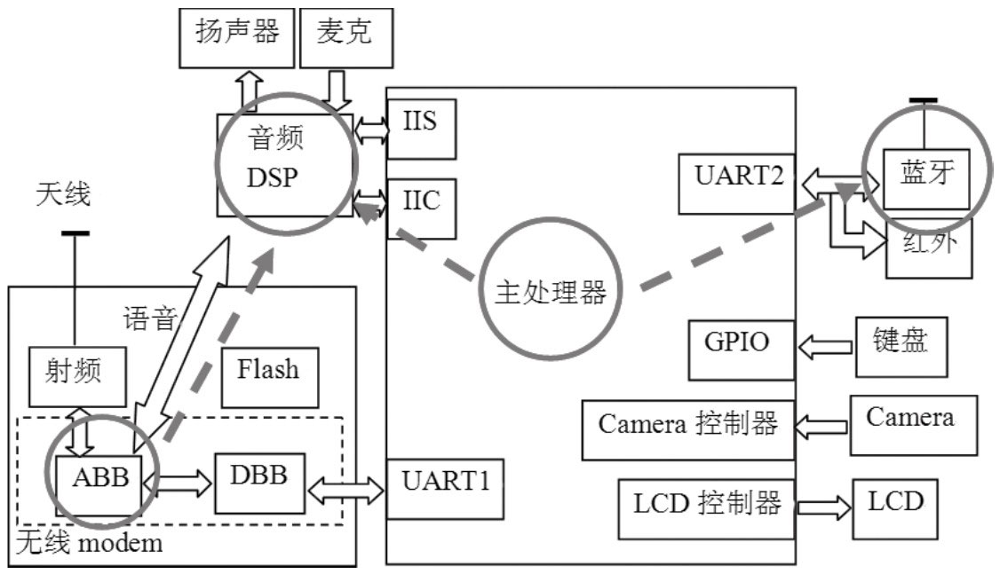

系统有一个音频 DSP（Digital Signal Processor，数字信号处理器），声音输入输出都经过它，处理后的数字信号经 D/A 转换输出到扬声器、听筒、耳机等设备。系统有两个核心处理器：运行操作系统的**应用处理器（Application Processor）**和负责手机通信的**基带处理器（Baseband Processor，BP）**。AP 与 BP 都能向音频 DSP 发送数据且通路互不干扰——若二者不协调，就会出现通话声和音乐声混杂。所以打电话时，AP 上的 Phone 程序会主动设置 Audio 系统的 mode，Audio 系统据此做处理（如把 music 音量调小）。另外图中**蓝牙没有直连音频 DSP，音频数据需要单独发给蓝牙设备**（实际指蓝牙的 A2DP（Advanced Audio Distribution Profile）设备，A2DP 面向高质量立体声，必须由 AF 向它发送数据；SCO 面向通话语音）——一份数据要发往两处，正是 DuplicatingThread 出现的现实要求。

**force_use 与 forced_config（强制使用及配置）**：手机通话时可选扬声器输出就是强制使用的案例。forced_config 指定强制使用何种设备（FORCE_SPEAKER、FORCE_HEADPHONES、FORCE_BT_SCO、FORCE_BT_A2DP 等），force_use 指定在什么情况下强制（FOR_COMMUNICATION 通话、FOR_MEDIA 媒体、FOR_RECORD、FOR_DOCK），setForceUse(usage, config) 即「什么情况下强制使用什么设备」。**audio_devices（输出设备）**用位掩码表示：DEVICE_OUT_EARPIECE（听筒 0x1）、DEVICE_OUT_SPEAKER（扬声器 0x2）、DEVICE_OUT_WIRED_HEADSET（耳机 0x4）、DEVICE_OUT_WIRED_HEADPHONE（另一种耳机 0x8）、DEVICE_OUT_BLUETOOTH_SCO（0x10）、DEVICE_OUT_BLUETOOTH_A2DP（0x80）等。

APS 与 HAL 类的关系如图 7-12：AudioPolicyService 持有一个 AudioPolicyInterface 对象（AMB），AMB 反过来持有 APS 实现的 AudioPolicyClientInterface 对象——**AMB 通过 clientInterface 调用 APS，APS 再转调 AF，这条通道是策略落地的路**：

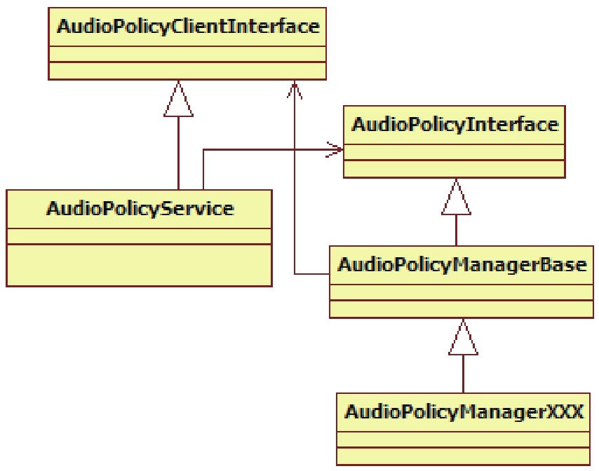

AMB 的构造函数把这些串了起来（摘编）：

```cpp
// [--> AudioPolicyManagerBase.cpp]
AudioPolicyManagerBase::AudioPolicyManagerBase(
                            AudioPolicyClientInterface *clientInterface)
    :mPhoneState(AudioSystem::MODE_NORMAL), mRingerMode(0),
     mMusicStopTime(0), mLimitRingtoneVolume(false)
{
    // APS 实现了 AudioPolicyClientInterface 接口
    mpClientInterface = clientInterface;  // 这个 clientInterface 就是 APS 对象
    // 清空强制使用配置
    for (int i = 0; i < AudioSystem::NUM_FORCE_USE; i++) {
        mForceUse[i] = AudioSystem::FORCE_NONE;
    }
    // 初始可用输出设备有听筒和扬声器
    mAvailableOutputDevices = AudioSystem::DEVICE_OUT_EARPIECE |
                              AudioSystem::DEVICE_OUT_SPEAKER;
    // 输入设备是内置麦克
    mAvailableInputDevices = AudioSystem::DEVICE_IN_BUILTIN_MIC;
    ......
    // ① AudioOutputDescriptor 记录并维护与输出设备（相当于硬件音频 DSP）相关的
    // 信息：使用该设备的流个数、各流的音量、支持的采样率/精度等；
    // 成员 mDevice 表示目前使用的输出设备（耳机、听筒、扬声器等）
    AudioOutputDescriptor *outputDesc = new AudioOutputDescriptor();
    outputDesc->mDevice = (uint32_t)AudioSystem::DEVICE_OUT_SPEAKER;
    // ② openOutput 导致 AF 创建一个工作线程，返回线程索引号——
    // 这就是 MixerThread 的来历
    mHardwareOutput = mpClientInterface->openOutput(&outputDesc->mDevice,
                                    &outputDesc->mSamplingRate,
                                    &outputDesc->mFormat,
                                    &outputDesc->mChannels,
                                    &outputDesc->mLatency,
                                    outputDesc->mFlags);
    // AMB 维护与设备相关的 key/value 集合，加入对应信息
    addOutput(mHardwareOutput, outputDesc);
    // ③ 设置输出设备：DSP 的数据流从扬声器出去
    setOutputDevice(mHardwareOutput,
                    (uint32_t)AudioSystem::DEVICE_OUT_SPEAKER, true);
    // ④ 更新不同策略使用的设备
    updateDeviceForStrategy();
}
```

这里有一个重要的设计抉择：**AudioFlinger 到底创建多少个 MixerThread？** 一种方案是一个 MixerThread 对应一个 Track；另一种是**用一个 MixerThread 支持 32 路 Track，多路数据经 AudioMixer 在软件层混音**。系统采用第二种——一个线程一个 Track 难以管理且浪费资源，软件混音极大地简化了 AMB 的工作量。图 7-14 展示 AMB 与 AF 及 MixerThread 的关系：AMB 除了 mHardwareOutput 还有一个 mA2dpOutput（对应专往蓝牙 A2DP 设备发送数据的 MixerThread，蓝牙连接上后才有意义）；除蓝牙外系统中一般只有这一个 MixerThread，所以 AMB 通过 mHardwareOutput 就能控制整个系统的声音输出：


### 1.5.2 重回 AudioTrack：getOutput 输出选择与 startOutput

现在回答 1.3.1 的问题：AudioTrack::set 中 AudioSystem::getOutput 返回的 output 从何而来？

```cpp
// [--> AudioSystem.cpp]
audio_io_handle_t AudioSystem::getOutput(stream_type stream,
                                        uint32_t samplingRate,
                                        uint32_t format,
                                        uint32_t channels,
                                        output_flags flags)
{
    audio_io_handle_t output = 0;
    ......
    if (output == 0) {
        const sp<IAudioPolicyService>& aps = AudioSystem::get_audio_policy_service();
        if (aps == 0) return 0;
        // 调用 AP 的 getOutput 函数
        output = aps->getOutput(stream, samplingRate, format, channels, flags);
        if ((flags & AudioSystem::OUTPUT_FLAG_DIRECT) == 0) {
            Mutex::Autolock _l(gLock);
            // 把 stream 和 output 的对应关系保存到 map 中（下次直接命中）
            AudioSystem::gStreamOutputMap.add(stream, output);
        }
    }
    return output;
}
```

APS 转给 AMB，AMB 的 getOutput 完成「流类型 → 策略 → 设备 → 线程」的决策链：

```cpp
// [--> AudioPolicyManagerBase.cpp]
audio_io_handle_t AudioPolicyManagerBase::getOutput(
                    AudioSystem::stream_type stream, uint32_t samplingRate,
                    uint32_t format, uint32_t channels,
                    AudioSystem::output_flags flags)
{
    audio_io_handle_t output = 0;
    uint32_t latency = 0;
    // 根据流类型得到路由策略，MUSIC 类型返回 MEDIA 策略
    routing_strategy strategy = getStrategy((AudioSystem::stream_type)stream);
    // 根据策略得到使用这个策略的输出设备（扬声器之类）
    uint32_t device = getDeviceForStrategy(strategy);
    ......
    // 看这个设备是不是与蓝牙 A2DP 相关
    uint32_t a2dpDevice = device & AudioSystem::DEVICE_OUT_ALL_A2DP;
    if (AudioSystem::popCount((AudioSystem::audio_devices)device) == 2) {
#ifdef WITH_A2DP
        if (a2dpUsedForSonification() && a2dpDevice != 0) {
            output = mDuplicatedOutput;   // 设备跨 A2DP 与本机：用 DuplicatingThread
        } else
#endif
        {
            output = mHardwareOutput;     // 使用非蓝牙的混音输出线程
        }
    } else {
#ifdef WITH_A2DP
        if (a2dpDevice != 0) {
            output = mA2dpOutput;         // 使用蓝牙的混音输出线程
        } else
#endif
        {
            output = mHardwareOutput;
        }
    }
    return output;
}
```

**output 的本质是 AF 中某个工作线程的索引号**，由 AP 返回是因为 Audio 系统需要：根据流类型找到路由策略 → 根据策略找到合适的输出设备 → 根据设备选择 AF 中合适的工作线程（蓝牙 MixerThread、DSP MixerThread 或 DuplicatingThread）→ AT 在该线程中创建 Track，数据由该线程处理。图 7-15 总结了三巨头的交互，从目的反推最清楚：AT 的目的是把数据发给对应设备（蓝牙、DSP）；代表输出设备的 HAL 对象由 MixerThread 持有，所以要找到对应线程；AP 维护流类型与输出设备的关系；AT 按流类型向 AudioSystem 查询对应线程号：


再看重回 start：AF 的 Track::start 中调用 AudioSystem::startOutput，最终由 AMB 处理：

```cpp
// [--> AudioPolicyManagerBase.cpp]
status_t AudioPolicyManagerBase::startOutput(audio_io_handle_t output,
                                            AudioSystem::stream_type stream)
{
    // 根据 output 找到对应的 AudioOutputDescriptor
    ssize_t index = mOutputs.indexOfKey(output);
    AudioOutputDescriptor *outputDesc = mOutputs.valueAt(index);
    // 找到该流使用的路由策略
    routing_strategy strategy = getStrategy((AudioSystem::stream_type)stream);
    // 该流的使用计数加 1
    outputDesc->changeRefCount(stream, 1);
    // getNewDevice 得到一个设备，setOutputDevice 用它做路由切换
    setOutputDevice(output, getNewDevice(output));
    // 设置音量
    checkAndSetVolume(stream, mStreams[stream].mIndexCur, output,
                      outputDesc->device());
    return NO_ERROR;
}

uint32_t AudioPolicyManagerBase::getNewDevice(audio_io_handle_t output,
                                                bool fromCache)
{
    uint32_t device = 0;
    AudioOutputDescriptor *outputDesc = mOutputs.valueFor(output);
    // isUsedByStrategy 判断某策略是否正被使用；if/else 的顺序代表策略优先级：
    // 假设已插耳机且在通话中并强制扬声器，此时听音乐将首先使用 PHONE 策略的
    // 设备（扬声器），音乐从扬声器而不是耳机出。fromCache 为 true 时直接用旧值
    if (mPhoneState == AudioSystem::MODE_IN_CALL ||
        outputDesc->isUsedByStrategy(STRATEGY_PHONE)) {
        device = getDeviceForStrategy(STRATEGY_PHONE, fromCache);
    } else if (outputDesc->isUsedByStrategy(STRATEGY_SONIFICATION)) {
        device = getDeviceForStrategy(STRATEGY_SONIFICATION, fromCache);
    } else if (outputDesc->isUsedByStrategy(STRATEGY_MEDIA)) {
        device = getDeviceForStrategy(STRATEGY_MEDIA, fromCache);
    } else if (outputDesc->isUsedByStrategy(STRATEGY_DTMF)) {
        device = getDeviceForStrategy(STRATEGY_DTMF, fromCache);
    }
    return device;
}
```

routing_strategy 是 AMB 内部真正控制路由的维度，stream_type 经 getStrategy 映射过来：

```cpp
// [--> AudioPolicyManagerBase.h::routing_strategy]
enum routing_strategy {
    STRATEGY_MEDIA,
    STRATEGY_PHONE,
    STRATEGY_SONIFICATION,
    STRATEGY_DTMF,
    NUM_STRATEGIES
};

// [--> AudioPolicyManagerBase.cpp]
AudioPolicyManagerBase::getStrategy(AudioSystem::stream_type stream)
{
    switch (stream) {
    case AudioSystem::VOICE_CALL:
    case AudioSystem::BLUETOOTH_SCO:
        return STRATEGY_PHONE;          // PHONE 路由策略
    case AudioSystem::RING:
    case AudioSystem::NOTIFICATION:
    case AudioSystem::ALARM:
    case AudioSystem::ENFORCED_AUDIBLE:
        return STRATEGY_SONIFICATION;   // SONIFICATION 路由策略
    case AudioSystem::DTMF:
        return STRATEGY_DTMF;           // DTMF 路由策略
    default:
    case AudioSystem::SYSTEM:
    case AudioSystem::TTS:
    case AudioSystem::MUSIC:
        return STRATEGY_MEDIA;          // MEDIA 路由策略
    }
}
```

为什么 startOutput 会和设备切换有关？举例：第一个 AT 用 MUSIC 类型创建，假设耳机已连接，声音从耳机出；第二个 AT 用 RING 类型创建，其策略 SONIFICATION 优先级更高（getNewDevice 先判断它），设备需切换为耳机加扬声器——最终两路 Track 的声音都从耳机和扬声器同时输出。第二路 AT 调 stop 时计数减一，触发新的路由切换，回到只有耳机的情况。stop 基本上是 start 的逆向。

### 1.5.3 耳机插入：路由切换实例

路由的目的很简单：为 DSP 选择数据出口（耳机、听筒还是扬声器）。场景——用扬声器听歌时插上耳机。全程链路：

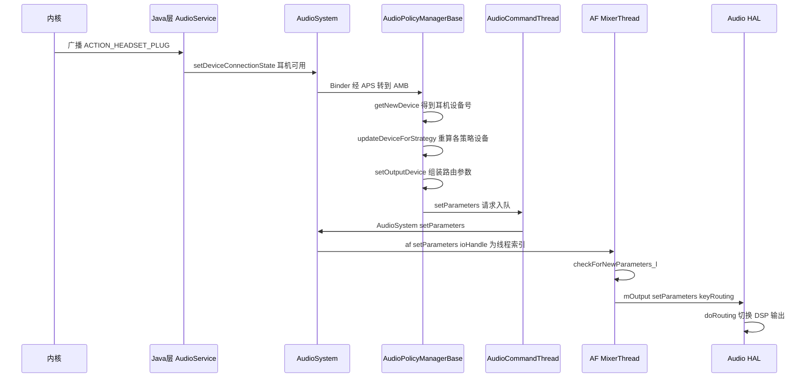

**事件接收**。耳机插上后系统发广播，Java 层 AudioService 的内部类 AudioServiceBroadcastReceiver 处理：

```java
// [--> AudioService.java::AudioServiceBroadcastReceiver 的 onReceive()]
private class AudioServiceBroadcastReceiver extends BroadcastReceiver {
    @Override
    public void onReceive(Context context, Intent intent) {
        String action = intent.getAction();
        // 耳机插拔事件
        if (action.equals(Intent.ACTION_HEADSET_PLUG)) {
            int state = intent.getIntExtra("state", 0);
            int microphone = intent.getIntExtra("microphone", 0);
            if (microphone != 0) {
                // 耳机设备号为 0x4，与 AudioSystem.h 的定义一致
                boolean isConnected = mConnectedDevices.containsKey(
                            AudioSystem.DEVICE_OUT_WIRED_HEADSET);
                if (state == 0 && isConnected) {
                    // 之前有耳机而现在没有：耳机拔出，设为 UNAVAILABLE
                    AudioSystem.setDeviceConnectionState(
                            AudioSystem.DEVICE_OUT_WIRED_HEADSET,
                            AudioSystem.DEVICE_STATE_UNAVAILABLE, "");
                    mConnectedDevices.remove(AudioSystem.DEVICE_OUT_WIRED_HEADSET);
                } else if (state == 1 && !isConnected) {
                    // 之前没有耳机而现在插入：设为 AVAILABLE
                    AudioSystem.setDeviceConnectionState(
                            AudioSystem.DEVICE_OUT_WIRED_HEADSET,
                            AudioSystem.DEVICE_STATE_AVAILABLE, "");
                    mConnectedDevices.put(
                            new Integer(AudioSystem.DEVICE_OUT_WIRED_HEADSET), "");
                }
            }
        }
        ......
    }
}
```

**设置设备连接状态**。Native 的 AudioSystem 把请求经 Binder 转给 APS，最终由 AMB 处理：

```cpp
// [--> AudioSystem.cpp]
status_t AudioSystem::setDeviceConnectionState(audio_devices device,
                device_connection_state state, const char *device_address)
{
    const sp<IAudioPolicyService>& aps = AudioSystem::get_audio_policy_service();
    if (aps == 0) return PERMISSION_DENIED;
    return aps->setDeviceConnectionState(device, state, device_address); // 转到 AMB
}

// [--> AudioPolicyManagerBase.cpp]
status_t AudioPolicyManagerBase::setDeviceConnectionState(
                AudioSystem::audio_devices device,
                AudioSystem::device_connection_state state,
                const char *device_address)
{
    // 一次只能设置一个设备
    if (AudioSystem::popCount(device) != 1) return BAD_VALUE;
    // 耳机属于输出设备
    if (AudioSystem::isOutputDevice(device)) {
        switch (state)
        {
        case AudioSystem::DEVICE_STATE_AVAILABLE:
            // 耳机刚连上，不在已连接设备中，不走下面 if 分支
            if (mAvailableOutputDevices & device) {
                return INVALID_OPERATION;  // 启用过就不再启用
            }
            // 已连接设备中多了一个耳机
            mAvailableOutputDevices |= device;
            ......
        }
        // ① getNewDevice：可用设备变了，重新计算当前应使用的设备
        uint32_t newDevice = getNewDevice(mHardwareOutput, false);
        // ② 更新各种策略使用的设备
        updateDeviceForStrategy();
        // ③ 设置新的输出设备
        setOutputDevice(mHardwareOutput, newDevice);
    }
    ......
}
```

**策略怎么和设备联系起来**——秘密在 getDeviceForStrategy，它按优先级为每种策略挑设备（fromCache 为 true 时直接取缓存的旧值）：

```cpp
// [--> AudioPolicyManagerBase.cpp]
uint32_t AudioPolicyManagerBase::getDeviceForStrategy(
                                        routing_strategy strategy, bool fromCache)
{
    uint32_t device = 0;
    if (fromCache) {   // 直接取之前的旧值
        return mDeviceForStrategy[strategy];
    }
    // fromCache 为 false 则重新计算策略对应的设备
    switch (strategy) {
    case STRATEGY_DTMF:
        if (mPhoneState != AudioSystem::MODE_IN_CALL) {
            // 不在电话状态：DTMF 策略与 MEDIA 策略用同一设备
            device = getDeviceForStrategy(STRATEGY_MEDIA, false);
            break;
        }
        // 在电话状态则 fall through 到 PHONE 策略
    case STRATEGY_PHONE:
        // PHONE 策略先考虑用户是否强制使用了某设备（如强制扬声器）
        switch (mForceUse[AudioSystem::FOR_COMMUNICATION]) {
        ......
        case AudioSystem::FORCE_SPEAKER:
            ......  // 没有蓝牙则选择扬声器
            device = mAvailableOutputDevices & AudioSystem::DEVICE_OUT_SPEAKER;
            break;
        }
        break;
    case STRATEGY_SONIFICATION:
        if (mPhoneState == AudioSystem::MODE_IN_CALL) {
            // 通话状态下与 PHONE 策略用同一设备：强制扬声器时按键声也从扬声器出
            device = getDeviceForStrategy(STRATEGY_PHONE, false);
            break;
        }
        // 不在电话状态：SONIFICATION 与 MEDIA 策略用同一设备（fall through）
    case STRATEGY_MEDIA: {
        // MEDIA 按优先级选设备：数字输出 → 耳机两种类型 → 扬声器
        uint32_t device2 = mAvailableOutputDevices &
                           AudioSystem::DEVICE_OUT_AUX_DIGITAL;
        if (device2 == 0) {
            device2 = mAvailableOutputDevices &
                      AudioSystem::DEVICE_OUT_WIRED_HEADPHONE;
        }
        if (device2 == 0) {
            // 耳机已连上：device2 为 0x4 即 WIRED_HEADSET
            device2 = mAvailableOutputDevices &
                      AudioSystem::DEVICE_OUT_WIRED_HEADSET;
        }
        if (device2 == 0) {
            device2 = mAvailableOutputDevices & AudioSystem::DEVICE_OUT_SPEAKER;
        }
        device |= device2;   // 本场景最终 device 为 0x4 WIRED_HEADSET
    } break;
    default:
        break;
    }
    return device;
}

void AudioPolicyManagerBase::updateDeviceForStrategy()
{
    for (int i = 0; i < NUM_STRATEGIES; i++) {
        // 重新计算每种策略使用的设备并保存，起 cache 的作用
        mDeviceForStrategy[i] = getDeviceForStrategy((routing_strategy)i, false);
    }
}
```

听歌场景走 STRATEGY_MEDIA 分支：耳机已连上，getDeviceForStrategy 沿 AUX_DIGITAL → WIRED_HEADPHONE → WIRED_HEADSET → SPEAKER 的顺序命中耳机（0x4）。

**setOutputDevice**。新设备选出来后要让它生效——软件层更新 outputDesc，硬件层要通知 DSP 切换输出：

```cpp
// [--> AudioPolicyManagerBase.cpp]
void AudioPolicyManagerBase::setOutputDevice(audio_io_handle_t output,
                                    uint32_t device, bool force, int delayMs)
{
    AudioOutputDescriptor *outputDesc = mOutputs.valueFor(output);
    // 判断是否是 Duplicate 输出（与蓝牙 A2DP 有关）：是则对两路输出分别设置
    if (outputDesc->isDuplicated()) {
        setOutputDevice(outputDesc->mOutput1->mId, device, force, delayMs);
        setOutputDevice(outputDesc->mOutput2->mId, device, force, delayMs);
        return;
    }
    uint32_t prevDevice = (uint32_t)outputDesc->device();  // 之前的输出设备
    if ((device == 0 || device == prevDevice) && !force) {
        return;
    }
    outputDesc->mDevice = device;   // 软件层面设置新的输出设备
    ......
    // 硬件也要做相应设置：告诉 DSP 把输出切到某个设备。请求要发到 AF 的
    // MixerThread——只有它持有代表输出设备的 AudioStreamOut 对象
    AudioParameter param = AudioParameter();
    param.addInt(String8(AudioParameter::keyRouting), (int)device);
    // 配置参数投递到 APS 的消息队列，由 AudioCommandThread 取出再投递给
    // AF 中对应的 MixerThread，最终由 MixerThread 处理
    mpClientInterface->setParameters(mHardwareOutput, param.toString(), delayMs);
    // 设置音量
    applyStreamVolumes(output, device, delayMs);
}
```

**AudioCommandThread**。APS 创建时的两个线程之一，它维护一个请求处理队列，AP 往队列提交请求，线程在 threadLoop 中逐个处理——典型的生产者/消费者模型：

```cpp
// [--> AudioPolicyService.cpp]
void AudioPolicyService::setParameters(audio_io_handle_t ioHandle,
                                    const String8& keyValuePairs, int delayMs)
{
    // 把请求加入 AudioCommandThread 处理
    mAudioCommandThread->parametersCommand((int)ioHandle, keyValuePairs, delayMs);
}

bool AudioPolicyService::AudioCommandThread::threadLoop()
{
    nsecs_t waitTime = INT64_MAX;
    mLock.lock();
    while (!exitPending())
    {
        while(!mAudioCommands.isEmpty()) {
            nsecs_t curTime = systemTime();
            if (mAudioCommands[0]->mTime <= curTime) {
                AudioCommand *command = mAudioCommands[0];
                mAudioCommands.removeAt(0);
                mLastCommand = *command;
                switch (command->mCommand) {
                case START_TONE:
                    ......   // Tone 处理
                    break;
                case SET_VOLUME:
                    ......   // 音量处理
                    break;
                case SET_PARAMETERS: {
                    // 处理路由设置请求
                    ParametersData *data = (ParametersData *)command->mParam;
                    // 转到 AudioSystem 处理，mIO 的值为 mHardwareOutput
                    command->mStatus = AudioSystem::setParameters(
                                        data->mIO, data->mKeyValuePairs);
                    if (command->mWaitStatus) {
                        command->mCond.signal();
                        mWaitWorkCV.wait(mLock);
                    }
                    delete data;
                    } break;
                ......
                default:
                }
            }
        }
        ......
    }
    ......
}
```

AudioSystem 再把请求转给 AF：

```cpp
// [--> AudioSystem.cpp]
status_t AudioSystem::setParameters(audio_io_handle_t ioHandle,
                                    const String8& keyValuePairs)
{
    const sp<IAudioFlinger>& af = AudioSystem::get_audio_flinger();
    // 果然是交给 AF 处理，ioHandle 就是工作线程索引号
    return af->setParameters(ioHandle, keyValuePairs);
}

// [--> AudioFlinger.cpp]
status_t AudioFlinger::setParameters(int ioHandle, const String8& keyValuePairs)
{
    status_t result;
    // ioHandle == 0 表示与混音线程无关，直接设置到 HAL 对象
    if (ioHandle == 0) {
        AutoMutex lock(mHardwareLock);
        mHardwareStatus = AUDIO_SET_PARAMETER;
        result = mAudioHardware->setParameters(keyValuePairs);
        mHardwareStatus = AUDIO_HW_IDLE;
        return result;
    }
    sp<ThreadBase> thread;
    {
        Mutex::Autolock _l(mLock);
        // 根据索引号找到对应的混音线程
        thread = checkPlaybackThread_l(ioHandle);
    }
    // 交给它处理，这又是一个命令处理队列
    result = thread->setParameters(keyValuePairs);
    return result;
}
```

**MixerThread 最终处理**。回看 1.4.5 的 threadLoop：processConfigEvents 与 checkForNewParameters_l 在每轮循环检查新参数，路由参数最终交给代表输出设备的 HAL 对象：

```cpp
// [--> AudioFlinger.cpp]
bool AudioFlinger::MixerThread::checkForNewParameters_l()
{
    bool reconfig = false;
    while (!mNewParameters.isEmpty()) {
        status_t status = NO_ERROR;
        String8 keyValuePair = mNewParameters[0];
        AudioParameter param = AudioParameter(keyValuePair);
        int value;
        ......
        // 路由设置需要硬件参与，直接交给代表音频输出设备的 HAL 对象处理
        status = mOutput->setParameters(keyValuePair);
        return reconfig;
    }
    ......
}
```

**真实 HAL 的处理**。以高通 msm7k 平台（hardware/msm7k/libaudio-qsd8k 的 Hardware.cpp）为例，看 keyRouting 如何变成硬件动作：

```cpp
// [--> AudioHardware.cpp::AudioStreamOutMSM72xx::setParameters()]
status_t AudioHardware::AudioStreamOutMSM72xx::setParameters(
                                    const String8& keyValuePairs)
{
    AudioParameter param = AudioParameter(keyValuePairs);
    String8 key = String8(AudioParameter::keyRouting);
    status_t status = NO_ERROR;
    int device;
    if (param.getInt(key, device) == NO_ERROR) {
        mDevices = device;
        status = mHardware->doRouting();  // mHardware 就是 AudioHardware 对象
        param.remove(key);
    }
    return status;
}

// [--> AudioHardware.cpp]
status_t AudioHardware::doRouting()
{
    Mutex::Autolock lock(mLock);
    uint32_t outputDevices = mOutput->devices();
    status_t ret = NO_ERROR;
    int sndDevice = -1;
    ......
    // 做一些判断，最终由 doAudioRouteOrMute 处理
    if ((vr_mode_change) || (sndDevice != -1 && sndDevice != mCurSndDevice)) {
        ret = doAudioRouteOrMute(sndDevice);
        mCurSndDevice = sndDevice;
    }
    return ret;
}

// [--> AudioHardware.cpp]
static status_t do_route_audio_dev_ctrl(uint32_t device, bool inCall,
                    uint32_t rx_acdb_id, uint32_t tx_acdb_id)
{
    uint32_t out_device = 0, mic_device = 0;
    uint32_t path[2];
    int fd = 0;
    fd = open("/dev/msm_audio_ctl", O_RDWR);  // 打开音频控制设备
    path[0] = out_device;
    path[1] = rx_acdb_id;
    // 通过 ioctl 切换设备：把 DSP 的数据出口切到新设备
    if (ioctl(fd, AUDIO_SWITCH_DEVICE, &path)) {
        close(fd);
        return -1;
    }
    ......
}
```

至此路由切换的完整轨迹清晰可见：广播 → AudioService → AudioSystem → APS → AMB（策略计算）→ AudioCommandThread → AudioSystem → AF（MixerThread）→ Audio HAL → ioctl 切换 DSP 输出。AMB 的控制无非就是找到对应的 MixerThread，给它发送控制消息，最终由 MixerThread 传给代表音频输出设备的 HAL 对象。

## 1.6 拓展思考

### 1.6.1 DuplicatingThread：一份数据多路输出

DuplicatingThread（DT）的存在与音频硬件结构息息相关：蓝牙 A2DP 设备不直连 DSP，当一份数据要同时发给 DSP 和蓝牙时（如铃声需从耳机/扬声器与蓝牙同时出），DT 就派上用场。它的来历在蓝牙耳机连接之时——setDeviceConnectionState 检测到 A2DP 设备后走专门的 handleA2dpConnection：

```cpp
// [--> AudioPolicyManagerBase.cpp]
status_t AudioPolicyManagerBase::handleA2dpConnection(
                                    AudioSystem::audio_devices device,
                                    const char *device_address)
{
    AudioOutputDescriptor *outputDesc = new AudioOutputDescriptor();
    outputDesc->mDevice = device;
    // 先为 mA2dpOutput 创建一个 MixerThread，与 mHardwareOutput 的来历一样
    mA2dpOutput = mpClientInterface->openOutput(&outputDesc->mDevice,
                                    &outputDesc->mSamplingRate,
                                    &outputDesc->mFormat,
                                    &outputDesc->mChannels,
                                    &outputDesc->mLatency,
                                    &outputDesc->mFlags);
    if (mA2dpOutput) {
        // a2dpUsedForSonification 永远返回 true：SONIFICATION 策略的音频流
        // （来电铃声、短信通知等）需要同时从蓝牙和 DSP 传出
        if (a2dpUsedForSonification()) {
            // 创建 DuplicateOutput：第一个参数是蓝牙 MixerThread，第二个是 DSP MixerThread
            mDuplicatedOutput = mpClientInterface->openDuplicateOutput(
                                    mA2dpOutput, mHardwareOutput);
        }
        if (mDuplicatedOutput != 0 || !a2dpUsedForSonification()) {
            if (a2dpUsedForSonification()) {
                // 创建 AudioOutputDescriptor，记录这是一路双重输出
                AudioOutputDescriptor *dupOutputDesc = new AudioOutputDescriptor();
                dupOutputDesc->mOutput1 = mOutputs.valueFor(mHardwareOutput);
                dupOutputDesc->mOutput2 = mOutputs.valueFor(mA2dpOutput);
                addOutput(mDuplicatedOutput, dupOutputDesc);
                ......
            }
        }
    }
    ......
}
```

openDuplicateOutput 的处理在 AF：

```cpp
// [--> AudioFlinger.cpp]
int AudioFlinger::openDuplicateOutput(int output1, int output2)
{
    Mutex::Autolock _l(mLock);
    MixerThread *thread1 = checkMixerThread_l(output1);  // 蓝牙的 MixerThread
    MixerThread *thread2 = checkMixerThread_l(output2);  // DSP 的 MixerThread
    // 创建 DuplicatingThread，第二个参数是代表蓝牙的 MixerThread
    DuplicatingThread *thread = new DuplicatingThread(this, thread1, ++mNextThreadId);
    // 加入代表 DSP 的 MixerThread
    thread->addOutputTrack(thread2);
    mPlaybackThreads.add(mNextThreadId, thread);
    return mNextThreadId;   // 返回 DuplicatingThread 的索引
}

AudioFlinger::DuplicatingThread::DuplicatingThread(const sp<AudioFlinger>&
                audioFlinger, AudioFlinger::MixerThread* mainThread, int id)
    :   MixerThread(audioFlinger, mainThread->getOutput(), id),
        mWaitTimeMs(UINT_MAX)
{
    // DT 是 MT 的派生类，先完成基类构造：创建 AudioMixer 对象
    mType = PlaybackThread::DUPLICATING;
    // 把代表 DSP 的 MT 加入进来
    addOutputTrack(mainThread);
}

void AudioFlinger::DuplicatingThread::addOutputTrack(MixerThread *thread)
{
    int frameCount = (3 * mFrameCount * mSampleRate) / thread->sampleRate();
    // 构造一个 OutputTrack，第一个参数是 MT
    OutputTrack *outputTrack = new OutputTrack((ThreadBase *)thread,
                            this, mSampleRate, mFormat, mChannelCount, frameCount);
    if (outputTrack->cblk() != NULL) {
        thread->setStreamVolume(AudioSystem::NUM_STREAM_TYPES, 1.0f);
        // 把这个 outputTrack 加入 mOutputTracks 数组保存
        mOutputTracks.add(outputTrack);
        updateWaitTime();
    }
}
```

关键角色是 **OutputTrack——DT 写往各 MT 的「客户端 Track」**。它从 Track 派生，构造时最后一个参数（客户端共享内存）传 NULL，于是在本进程内创建一块与图 7-4 同构的内存（前面 CB、后面数据缓冲），DT 向它写、MT 从它读——**DT 就像 MT 的客户端，与 AT 是 AF 的客户端完全同构**：

```cpp
// [--> AudioFlinger.cpp]
AudioFlinger::PlaybackThread::OutputTrack::OutputTrack(
        const wp<ThreadBase>& thread, DuplicatingThread *sourceThread,
        uint32_t sampleRate, int format, int channelCount, int frameCount)
    :Track(thread, NULL, AudioSystem::NUM_STREAM_TYPES, sampleRate,
            format, channelCount, frameCount, NULL),  // 最后这个参数为 NULL
      mActive(false), mSourceThread(sourceThread)
{
    // OutputTrack 从 Track 派生，先调用基类构造：最后一个参数为 NULL 表示
    // 没有客户端参与，在本进程内创建一块内存（CB 在前、数据缓冲在后）
    PlaybackThread *playbackThread = (PlaybackThread *)thread.unsafe_get();
    if (mCblk != NULL) {
        mCblk->out = 1;   // 表示 DT 将往 MT 中写数据，与 AT/AF 的处理何其相似
        mCblk->buffers = (char*)mCblk + sizeof(audio_track_cblk_t);
        mCblk->volume[0] = mCblk->volume[1] = 0x1000;
        mOutBuffer.frameCount = 0;
        // 把这个 Track 加到 MT 的 Track 中
        playbackThread->mTracks.add(this);
    }
}
```

openDuplicateOutput 的结果如图 7-16：蓝牙 MT 的 Track 数组中有一个 OutputTrack0，DT 的 mOutputTracks 也指向它；灰色部分是数据传递用的缓冲。当 AT 的流类型对应 SONIFACATION 策略时，AP 返回 DT 的线程索引号，AT 在 DT 中创建普通 Track——图 7-17 是有 AT 的 DT 全景：

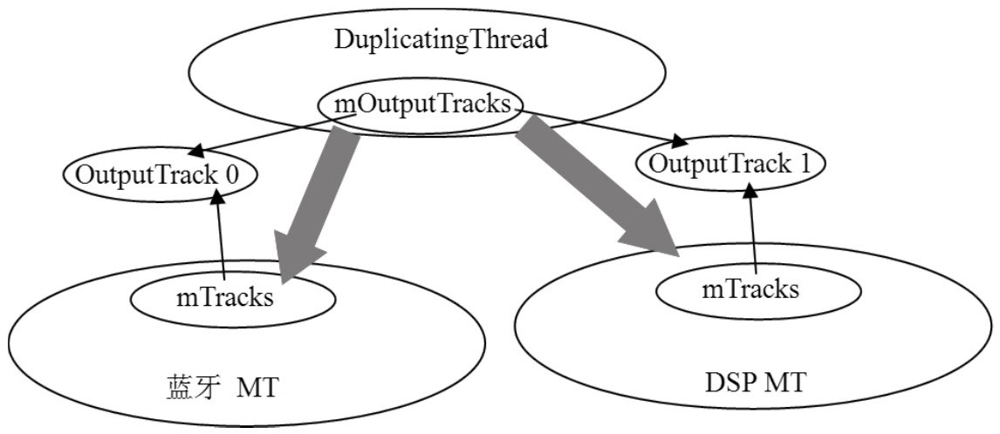


**DT 的线程函数**。DT 从 MT 派生，天然具有混音能力，threadLoop 的 prepare/process 部分与 MT 一致，差别在输出——把混音结果写给每个 OutputTrack：

```cpp
// [--> AudioFlinger.cpp]
bool AudioFlinger::DuplicatingThread::threadLoop()
{
    int16_t* curBuf = mMixBuffer;
    Vector< sp<Track> > tracksToRemove;
    uint32_t mixerStatus = MIXER_IDLE;
    nsecs_t standbyTime = systemTime();
    size_t mixBufferSize = mFrameCount * mFrameSize;
    SortedVector< sp<OutputTrack> > outputTracks;
    while (!exitPending())
    {
        processConfigEvents();  // 处理配置请求，与 MT 处理一样
        mixerStatus = MIXER_IDLE;
        {
            ......
            const SortedVector< wp<Track> >& activeTracks = mActiveTracks;
            for (size_t i = 0; i < mOutputTracks.size(); i++) {
                outputTracks.add(mOutputTracks[i]);
            }
            // AT 的 Track 停止后，也需要停止与 MT 共享的 OutputTrack
            if (UNLIKELY((!activeTracks.size() && systemTime() > standbyTime)
                        || mSuspended)) {
                if (!mStandby) {
                    for (size_t i = 0; i < outputTracks.size(); i++) {
                        outputTracks[i]->stop();
                    }
                    mStandby = true;
                    mBytesWritten = 0;
                }
                ......
            }
            // DT 从 MT 派生，天然具有混音功能，这部分与 MT 一致
            mixerStatus = prepareTracks_l(activeTracks, &tracksToRemove);
        }
        if (LIKELY(mixerStatus == MIXER_TRACKS_READY)) {
            // outputsReady 检查 OutputTracks 对应的 MT 状态
            if (outputsReady(outputTracks)) {
                mAudioMixer->process(curBuf);   // 使用 AudioMixer 对象混音
            } else {
                memset(curBuf, 0, mixBufferSize);
            }
            sleepTime = 0;
            writeFrames = mFrameCount;
        }
        ......
        if (sleepTime == 0) {
            standbyTime = systemTime() + kStandbyTimeInNsecs;
            for (size_t i = 0; i < outputTracks.size(); i++) {
                // 混音后的数据写到每个 outputTrack——一份数据多个接收者
                outputTracks[i]->write(curBuf, writeFrames);
            }
            mStandby = false;
            mBytesWritten += mixBufferSize;
        } else {
            usleep(sleepTime);
        }
        tracksToRemove.clear();
        outputTracks.clear();
    }
    return false;
}
```

**OutputTrack::write** 完成 DT 到两个 MT 的传输，其中 mBufferQueue 缓冲队列应对 MT 消费不及时的情况：

```cpp
// [--> AudioFlinger.cpp]
bool AudioFlinger::PlaybackThread::OutputTrack::write(int16_t* data, uint32_t frames)
{
    // 此处的 OutputTrack 是 DT 和 MT 共享的
    Buffer *pInBuffer;
    Buffer inBuffer;
    uint32_t channels = mCblk->channels;
    bool outputBufferFull = false;
    inBuffer.frameCount = frames;
    inBuffer.i16 = data;
    uint32_t waitTimeLeftMs = mSourceThread->waitTimeMs();
    if (!mActive && frames != 0) {
        start();   // Track 不活跃则调用 start 激活（MT 因此开始消费它）
    }
    // AF 中的数据传递现在有三个线程：一个 DT、两个 MT。MT 作为 DT 的二级消费者，
    // 可能来不及消费数据，所以 DT 提供 mBufferQueue 保存来不及消费的数据；
    // 队列容纳的临时缓冲个数有限制，由 kMaxOverFlowBuffers 控制，为 10 个
    while (waitTimeLeftMs) {
        // 先消耗保存在缓冲队列的数据
        if (mBufferQueue.size()) {
            pInBuffer = mBufferQueue.itemAt(0);
        } else {
            pInBuffer = &inBuffer;
        }
        ......
        // 获取可写缓冲——与 AT 中对应的代码如出一辙
        if (obtainBuffer(&mOutBuffer, waitTimeLeftMs) ==
                                    (status_t)AudioTrack::NO_MORE_BUFFERS) {
            ......
            break;
        }
        uint32_t outFrames = pInBuffer->frameCount > mOutBuffer.frameCount ?
                                mOutBuffer.frameCount : pInBuffer->frameCount;
        // 将数据拷贝到 DT 和 MT 共享的那块缓冲中去
        memcpy(mOutBuffer.raw, pInBuffer->raw, outFrames * channels * sizeof(int16_t));
        mCblk->stepUser(outFrames);   // 更新写位置
        ......
    }
    // 本轮没写完的数据存入临时缓冲（不超过上限），下轮先消费它们
    if (inBuffer.frameCount) {
        sp<ThreadBase> thread = mThread.promote();
        if (thread != 0 && !thread->standby()) {
            if (mBufferQueue.size() < kMaxOverFlowBuffers) {
                pInBuffer = new Buffer;
                pInBuffer->mBuffer = new int16_t[inBuffer.frameCount * channels];
                pInBuffer->frameCount = inBuffer.frameCount;
                pInBuffer->i16 = pInBuffer->mBuffer;
                memcpy(pInBuffer->raw, inBuffer.raw,
                        inBuffer.frameCount * channels * sizeof(int16_t));
                mBufferQueue.add(pInBuffer);
            }
        }
    }
    ......
    return outputBufferFull;
}
```

AT 调用的 start 只把 DT 的 Track 加入活跃数组，两个 OutputTrack 的 start 是在 write 中触发的。数据就这样经 DT 中继，从 AT 传输到蓝牙 MT 和 DSP MT——**DT 本质上是个数据中继器**，这种传输方式比直接用 MT 要慢，但换来了一份数据多路输出。原书认为 DT 的实现是 AF 代码中最美妙的地方：生产者/消费者的模式在这里被递归地复用了一次。

### 1.6.2 值得保留的题外话

原书章末的题外话有三点值得留档：

- **CTS 与 HAL 的测试思想**。芯片类型繁多、操作各异，HAL 层把厂商差异挡在接口之下，但厂商代码仍需验证。拿应用层程序测 HAL 并不合适——应用逻辑复杂，触发一个声音 bug 需要满足很多条件。Google 的 CTS（Compatibility Test Suite，兼容性测试集）提供了思路：不管驱动怎么实现，反正要过统一的兼容性测试。为硬件定制独立、最小的测试程序，比带着整个应用去复现问题高效得多。
- **ALSA（Advanced Linux Sound Architecture）**。ALSA 提供用户空间的 libasound 库，从上层用户的角度看并不好用（API 多而杂）。有了 Audio HAL 的隔离，应用层不用改动，但实现 HAL 的厂商要做的改动就比较大。相较之下，当时源码中 open/ioctl 直接操作设备的方式对简单应用更方便。
- **Desktop Check（桌面检查）**。在调试工具不发达的年代，程序员预约机房启动调试器的时间远多于改一个 bug 的时间，于是养成了像考试检查一样反复读代码的习惯：自己虚拟应用场景、代入参数、在大脑中 Trace。有时间先 Desktop Check、再用打 log 验证想法，这个顺序对提升读代码能力尤其有帮助——本篇沿用原书的方法：带着问题推理（如 write 会怎么实现）、再与源码印证。

## 1.7 演进备注

原书的 Audio 框架骨架沿用至今，但各部件都有代际更替。对照现代 Android（大致 Android 5～14）：

| 维度 | 原书时代（Android 2.2/2.3） | 现代 Android |
|---|---|---|
| 进程模型 | AF 与 APS 驻留 MediaServer | Android 5.0 起独立为 audioserver 进程，崩溃不连累其他媒体服务 |
| 应用 API | AudioTrack/AudioRecord | 保留；Android 8.0 新增低延迟的 AAudio C API 与 Oboe 封装 |
| 延迟路径 | Track → cblk → 混音 → HAL，数十毫秒 | MMAP 模式（8.1 起）可绕过 AF 混音直通 HAL，个位数毫秒 |
| 流标识 | stream type（STREAM_MUSIC 等） | Android 5.0 起 AudioAttributes（USAGE + CONTENT_TYPE + FLAGS），老的 STREAM_* 按映射兼容 |
| AudioFlinger 结构 | 内部类家族 + AudioHardwareInterface | HAL 访问封装为 module 化的 DeviceHalInterface/StreamHalInterface；线程家族（Mixer/Direct/Duplicating）概念仍在 |
| AudioPolicy | AudioPolicyManagerBase 硬编码策略 | Android 6.0 起 audio_policy_configuration.xml 描述输出/设备；Android 10 起策略引擎配置化（audio_policy_engine_configuration.xml），路由表与音量曲线声明式定制 |
| HAL 形态 | C++ 类的 so（AudioHardwareInterface） | C 结构体 so（audio.primary 等）；Android 8.0 HIDL 化，其后逐步迁往 Stable AIDL |
| 蓝牙 | A2DP 数据由 AF 送往外部蓝牙栈 | 蓝牙音频会话并入 audioserver 侧（audio.bluetooth AIDL）；LE Audio（LC3 编码）在 Android 13 落地 |

几点展开：

- **AAudio 与 MMAP**：cblk 通路每帧都要过 AF 混音线程。AAudio 让应用直接持有共享内存与 HAL callback，MMAP 模式下数据面完全不经过 AF、AF 只保留控制面。原书的 cblk 模型并未作废——AudioTrack 内部与 AAudio 的回退路径仍在使用它。
- **策略引擎 XML 化**：原书逐行读的 getDeviceForStrategy 硬编码判断链，在现代源码中变成了 XML 配置表加通用匹配器，厂商按产品形态（手机/手表/车机）裁剪配置而不再 fork 代码；strategy（MEDIA/PHONE/SONIFICATION/DTMF）的概念被保留下来。
- **调试入口**：AF 独立成 audioserver 后，dumpsys media.audio_flinger 仍是观察线程、Track、延迟状态的第一入口。

数据 I/O 是 Audio 系统的关键之关键——AudioTrack 经 audio_track_cblk_t 与 AudioFlinger 交换数据、AudioPolicyService 决定数据流向，这条主线吃透之后，AudioRecord、AudioService 等原书未展开的部件不过是同一套模式的变奏。


