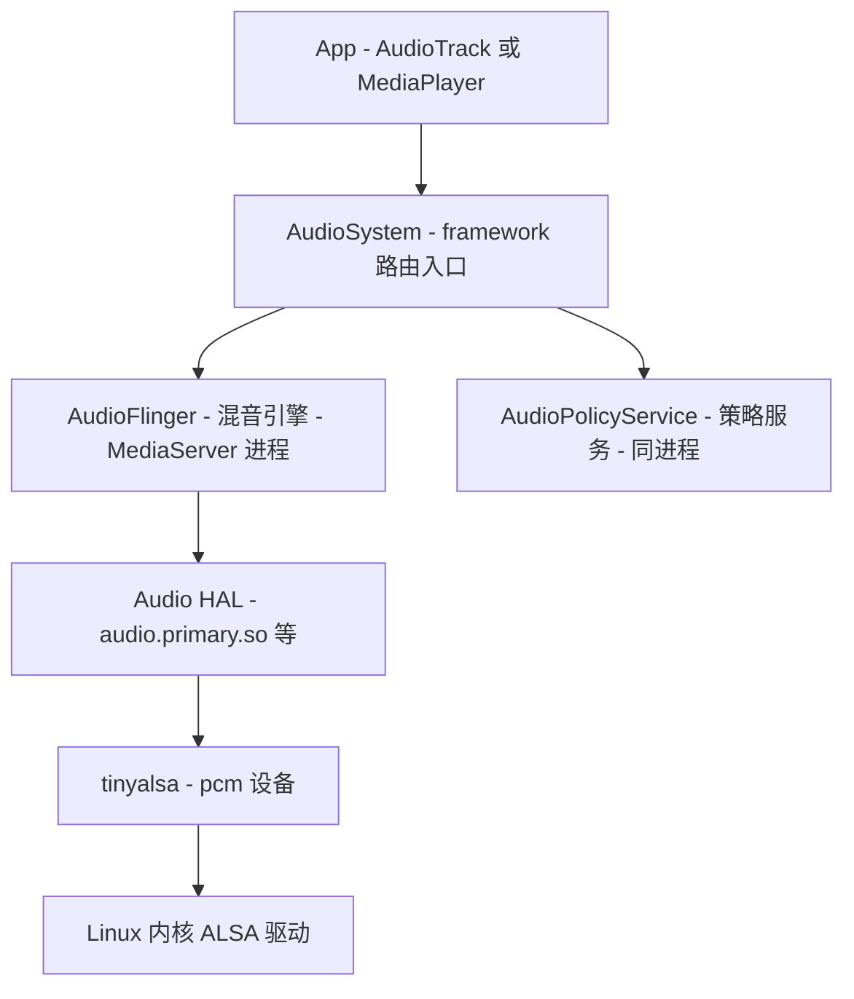
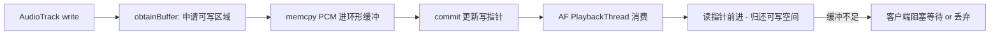
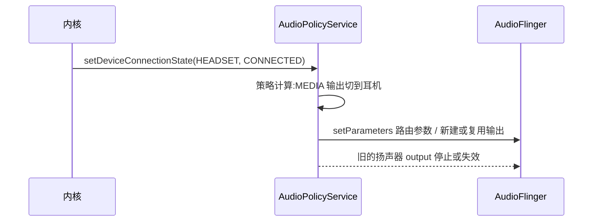

本篇对应原书第 7 章。原书以 AudioTrack(应用侧)→ AudioSystem(路由)→ AudioFlinger(混音)→ AudioPolicyService(策略)→ Audio HAL(硬件)为线索,纵贯 Java → JNI → Native → HAL 完整分析音频通路,并附 DuplicatingThread、ALSA、单元测试等拓展思考。文中代码为概念化改写,并在末尾对现代演进做比对展开。

## 6.1 音频系统架构与角色



| 角色 | 位置 | 职责 |
|---|---|---|
| AudioTrack | App 进程 | 流式播放接口,PCM(Pulse Code Modulation, 脉冲编码调制)数据的提供方 |
| AudioSystem | App 进程(Native 库) | 静态方法集,路由问题全部转发给策略服务 |
| AudioFlinger(AF) | MediaServer 进程 | 混音、音量、重采样、音效的执行引擎 |
| AudioPolicyService(APS) | MediaServer 进程 | 设备选择、音量曲线、流竞争策略的决策者 |
| Audio HAL | so 动态加载 | 对接具体声卡,原书时代标准实现走 tinyalsa |

**决策与执行分离**是这套设计的灵魂:APS 决定"谁在哪个设备上以多大音量播放",AF 只管"把多路 PCM 混成一路喂给 HAL"。二者同进程但通过 Binder 接口互调,边界清晰。

## 6.2 情景切入:一次 AudioTrack 播放

### 第一步:AudioTrack 的构造

```java
// Java 层
int session = 0;
AudioTrack track = new AudioTrack(
        AudioManager.STREAM_MUSIC,      // 流类型
        44100,                          // 采样率
        AudioFormat.CHANNEL_OUT_STEREO, // 双声道
        AudioFormat.ENCODING_PCM_16BIT, // 采样格式
        minBufferSize,                  // 缓冲大小
        AudioTrack.MODE_STREAM);        // 流模式(另一档 MODE_STATIC)
track.play();
track.write(pcmData, 0, len);           // 持续喂 PCM
```

MODE_STREAM 与 MODE_STATIC 的取舍:前者边写边播(通用),后者整段预写进共享内存(省唤醒、低延迟,适合短提示音)。

### 第二步:native_setup 与 getOutput

Java 构造函数经 JNI 进 Native AudioTrack,先解决"去哪播":

```cpp
// Native AudioTrack::set(概念化)
status_t AudioTrack::set(...) {
    // 1. 问策略服务:该流的输出是什么?
    output = AudioSystem::getOutput(
            STREAM_MUSIC /*streamType*/, format, channels, flags);
    // 2. 向 AudioFlinger 申请创建 track
    audioTrackHandle = mAudioTrack->create(
            output, sampleRate, format, channelMask, frameCount, flags, ...);
    // 3. 建立与 AF 的共享内存控制块(见 6.3)
    ...
}
```

`getOutput` 一路到 AudioPolicyService 的 **AudioPolicyManager**:按流类型 → 策略(strategy)→ 当前可用设备,决定输出设备(扬声器/耳机/蓝牙)与对应的输出流参数,返回一个 output 句柄。**output 的本质是 AF 里某个 PlaybackThread 的 ID**。

### 第三步:AudioFlinger::createTrack

```cpp
// AF 侧(概念化)
sp<IAudioTrack> AudioFlinger::createTrack(...) {
    // 1. 按 output 找到对应的 PlaybackThread
    PlaybackThread* thread = checkPlaybackThread_l(output);
    // 2. 在该线程的混音队列里创建一个 Track(服务端的"影端")
    track = thread->createTrack_l(...);
    // 3. 分配共享内存里的控制块 cblk,把跨进程访问所需的
    //    sp<MemoryHeapBase> 与 offsets 打包返回给客户端
    return track;   // 客户端拿到的就是一个匿名 Binder 服务!
}
```

注意:**返回的 Track 本身是个 Binder 服务**(匿名 Service),客户端通过它控制 start/stop/flush;真正高频的 PCM 数据不走这条 Binder——走的是下面这块共享内存。

## 6.3 数据通路核心:audio_track_cblk_t

原书花大篇幅讲的结构。AF 在共享内存里划出:

```text
+--------------------------------------------------------------+
| audio_track_cblk_t 控制块:读写位置/flush 序号/采样率/静音标志 ... |
+--------------------------------------------------------------+
| 环形 PCM 缓冲区(客户端写,服务端读)                             |
+--------------------------------------------------------------+
```

双方协作规则(生产者消费者):



- 客户端 `write()`:数据拷进环形缓冲(这是**跨进程共享内存拷贝,不是 Binder**)并推进写指针
- 服务端混音时读走数据、推进读指针
- 缓冲不够:客户端按 flag 阻塞或立即返回;溢出(underrun,消费太快)会导致卡顿爆音——**buffer 大小 = 延迟**,是音频开发永恒的矛盾

## 6.4 AudioFlinger 的线程家族

AF 打开一个输出(对应一个 HAL 流)就创建一个 PlaybackThread,按输出能力分型:

| 线程类型 | 用途 | 混音方式 |
|---|---|---|
| MixerThread | 最常见:多个 Track 混成一路 | 软件混音后写 HAL |
| DirectOutputThread | HAL 只接受一路(如某些环绕声直通) | 不混音,直传 |
| DuplicatingThread | 一份数据喂多个输出 | 挂多个下游输出线程 |

### MixerThread 的工作循环(概念化)

```cpp
bool AudioFlinger::PlaybackThread::threadLoop() {
    while (!exitPending()) {
        // 1. 有新数据/参数变化?处理 track 状态迁移
        processConfigEvents_l();
        // 2. 等待可用数据(无数据时阻塞在本线程的等待机制上)
        // 3. 混音:对每个 active Track
        //    - 按目标采样率做重采样(如 48k 设备跑 44.1k 内容)
        //    - 应用音量(每 Track 音量 × 主音量)
        //    - 混合到输出 buffer(audio_mixer)
        threadLoop_mix();
        // 4. 写 HAL:pcm_write(mMixerBuffer)
        threadLoop_write();
        // 5. 处理 underrun/standby 状态机
    }
}
```

音量链路:每 Track 有自己的 volume/gain(客户端 setVolume),输出线程持有主音量(master volume),叠乘后由 mixer 应用;策略服务在竞争中还会下发 mute/fade 命令。

### DuplicatingThread(原书拓展思考)

场景:录音时既走内置回放又走蓝牙(A2DP),需要同一份数据写两个 HAL。DuplicatingThread 维护一个下游输出线程列表,`threadLoop_write` 时把混好的 buffer 依次 write 给每个下游。要点:两个下游的阻塞节拍可能不同,内部用超时 + 忽略慢端的策略保实时性。

## 6.5 AudioPolicyService:路由与策略

AudioPolicyService 自身只是壳,决策核心是 **AudioPolicyManager**(可被厂商替换的策略模块),原书时代的关键表:

- **strategy**:流类型映射到策略(MEDIA/PHONE/SONIFICATION/DTMF……),同策略同命运
- **device**:策略 + 当前设备连接状态 → 输出设备
- **volume curve**:流类型 + 设备 + 音量档位 → 实际增益 dB

典型决策情景——**插拔耳机**:



**竞争情景——来电时听音乐**(原书逐行分析的经典链路):电话状态变成 RINGING → 策略把 STRATEGY_PHONE 拉满优先级 → 对 MEDIA 策略下发 mute/attenuate → AF 对应 Track 被静音或暂停;挂断后反向恢复。这套"策略服务说了算"的模型沿用至今,只是规则从硬编码类搬进了 XML 配置。

## 6.6 Audio HAL 与 ALSA

HAL 是 `audio.primary.<board>.so`,AF 通过 `dlopen + audio_hw_device 结构体`使用(标准 C 结构体,无 Binder):

```c
// audio_hal.cpp(概念化)
static int adev_open_output_stream(struct audio_hw_device* dev,
        audio_io_handle_t handle, audio_devices_t devices,
        audio_output_flags_t* flags, struct audio_config* config,
        struct audio_stream_out** stream_out) {
    // 打开 tinyalsa 的 pcm 设备
    pcm = pcm_open(card, device, PCM_OUT, &pcm_config);
    // 之后的 write 就是 pcm_write(pcm, buffer, bytes)
}
```

**tinyalsa**:Google 对 alsa-lib 的极简替代(libtinyalsa.so),`pcm_open/pcm_read/pcm_write` 三板斧直接操作 `/dev/snd/` 设备节点。原书拓展思考"Desktop check":在 Ubuntu 上用 ALSA 的虚拟/null 设备替换真实声卡,把整条 AF 链路在桌面机跑起来做单元测试——**框架与硬件解耦的价值就在此**,这个测试思路演化为今天的 VTS/VtsHalAudio 目标。

## 6.7 AudioSystem 与应用侧的接口层

Java 应用通过 `AudioManager`(系统服务,AMS 的邻居)调节音量、参数;通过 `AudioTrack/AudioRecord` 走数据面。原书提醒的分层:音量设置最终由 APS 计算并下发 AF;AudioManager 只是 Binder 客户端的门面。

## 6.8 新技术更新(比对展开)

| 维度 | 原书时代(Android 2.3) | 现在(Android 11~15+) |
|---|---|---|
| 进程模型 | AF/APS 在 MediaServer | 独立 audioserver 进程(Android 5),崩溃不连累媒体 |
| 应用 API | AudioTrack/MediaPlayer | 两者保留;新增 AAudio(Android 8,低延迟)与 Oboe 封装 |
| 延迟路径 | Track→cblk→混音→HAL,几十 ms | MMAP 模式可绕过混音直通 HAL(8.1+),个位数 ms |
| 流标识 | stream type | AudioAttributes(用途/内容类型/标志),细粒度策略 |
| 策略配置 | C++ 硬编码 AudioPolicyManager | 策略引擎 XML 配置(路由表/音量曲线可定制) |
| HAL 形态 | C 结构体 so(audio.primary) | C so 保留;新增 HIDL(8.0)→ AIDL(Android 12/13 起的 audio.core) |
| 蓝牙 | A2DP 经外部栈 | 蓝牙音频栈并入 audioserver 进程内通信(audio.bluetooth AIDL) |
| 音效 | AF 内置少数 | effects HAL AIDL 化,App 可插拔 AudioEffect |
| 新能力 | —— | 空间音频、LE Audio/LC3、离线播放 offload、多音区(AAOS) |

分项展开:

### 6.8.1 AAudio 与 MMAP:低延迟通路

AudioTrack 的 cblk 通路每帧要过 AF 混音线程,延迟数十毫秒。Android 8 推出 **AAudio** C API:应用直接持有共享内存与 HAL callback,配合 **MMAP Mode**(8.1+,`AUDIO_OUTPUT_FLAG_MMAP_NOIRQ`)时数据面完全不经过 AF——App 与 HAL 通过无中断的环形缓冲直连,AF 只保留控制面。Google 又在 AAudio 上封装 **Oboe**(C++ 库,自动选择 AAudio/OpenSL ES 回退),已是游戏/乐器类应用标准答案。原书的 cblk 模型并未作废:AAudio 回退路径与 AudioTrack 内部仍用它。

### 6.8.2 AudioAttributes 替代 stream type

stream type(MUSIC/RING/ALARM……)粒度太粗,Android 5 起推广 **AudioAttributes**:USAGE(用途)+ CONTENT_TYPE(内容)+ FLAGS,策略按用途决策,音乐 App 的"播客"与"歌曲"可以同流不同命;音量曲线同样按 USAGE+DEVICE 查表。老的 STREAM_* 接口按兼容映射继续工作。

### 6.8.3 策略引擎 XML 化

AudioPolicyManager 拆出**策略引擎**(`audio_policy_engine_configuration.xml`):音量曲线、路由策略、混音属性(mix profiles)全部声明式配置,厂商按产品形态(手机/手表/车机)裁剪,不再 fork 代码。原书逐行读的 `getDeviceForStrategy` 硬编码逻辑,今天在读的是 XML 表 + 通用匹配器。

### 6.8.4 HAL 的 AIDL 化与蓝牙并轨

Android 8 把 HAL 从"同进程 dlopen"改为 HIDL 独立进程,音频付出延迟代价后于 12/13 逐步迁到 Stable AIDL(audio.core),并支持 Binder 直通(pass-through)模式兼顾性能。蓝牙音频从"外部蓝牙进程 + 旧 audio.a2dp HAL"改为 audioserver 内嵌蓝牙会(audio.bluetooth AIDL),链路缩短;A2DP 硬件 offload、LE Audio(LC3 编码,Android 13 默认支持)都在新架构上落地。

### 6.8.5 audioserver 与调试

AF 独立成 audioserver 后,`dumpsys media.audio_flinger` 仍是观察线程/track/延迟的第一入口;现代新增了 Perfetto 的 audio track、AAudio 的 stream 统计,以及 systrace 级别的 underrun 打点。原书的"Desktop check"思想进化为 CI 中的音频 VTS 与模拟 HAL 测试。
