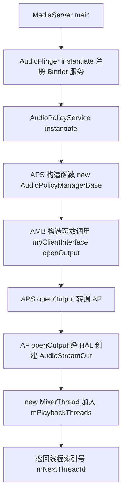
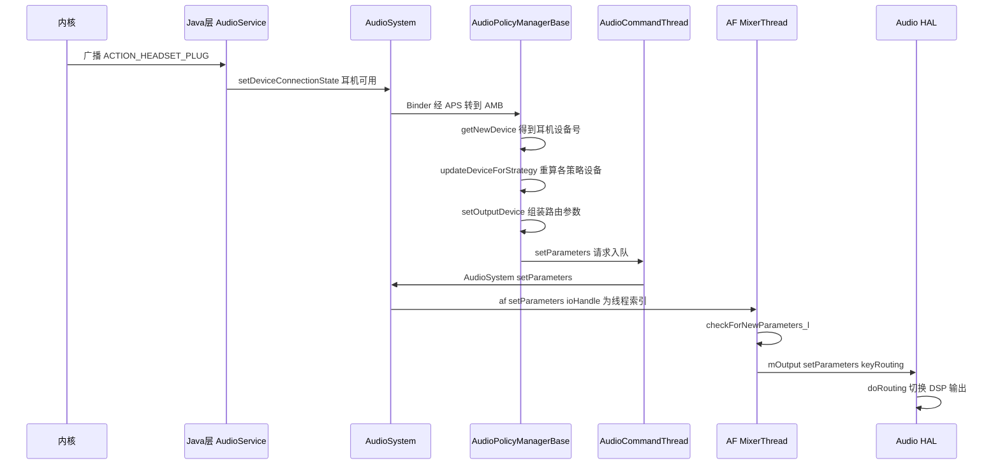

本篇对应原书第 7 章「深入理解 Audio 系统」，是全书第一个登场的重量级系统。原书基于 Android 2.2/2.3 源码，以 AudioTrack 的一个播放用例为入口、沿函数调用链层层推进，依次剖析三大块：AudioTrack（对外 API 类，纵贯 Java/JNI/Native 三层）、AudioFlinger（工作引擎，混音并读写音频硬件）、AudioPolicyService（策略中心，掌管设备选择切换与音量控制）。本章主线一句话：**AudioTrack 经共享内存与 AudioFlinger 交换音频数据，audio_track_cblk_t 以环形缓冲协调生产与消费的步调，AudioPolicyService 决定数据最终流向哪个输出设备。** 下文 AudioTrack 简称 AT，AudioFlinger 简称 AF，AudioPolicyService 简称 APS。

> 版本注意：原书成书于 2011 年（Android 2.2/2.3）。现代 Audio 系统已大幅重构（AudioFlinger 的 module 化、AudioPolicy 的 engine/config 拆分、AAudio 等），但「AudioTrack 经共享内存与 AudioFlinger 交换音频数据、AudioPolicyService 负责策略」的骨架仍适用，差异见文末演进备注。

> 摘编声明：文中代码为原书代码的摘编版——保留主干、省略日志与无关分支，类名、函数名忠于原书原文。

## 1.1 概述：Audio 系统的组成与三层结构

Audio 系统主要包括三方面内容，对应三个核心角色：

- **AudioTrack 与 AudioRecord**：Audio 系统对外提供的 API 类，完成音频数据的输出与采集，是音频 I/O 的唯一入口
- **AudioFlinger**：Audio 系统的工作引擎，管理输入输出音频流，承担混音以及读写音频硬件
- **AudioPolicyService**：策略控制中心，掌管声音设备的选择和切换、音量控制

原书在本章末尾给出的整体结构图（图 7-18）把 Audio 系统分为三层，可作为全篇的阅读地图：


- **应用层**：Java 的 AudioTrack/AudioRecord 与 AudioService/AudioManager
- **Audio 本地框架层**：Native 的 AudioTrack、AudioSystem 等类（framework 层），与应用同进程
- **Audio 服务层**：AudioFlinger 与 AudioPolicyService，都驻留在 MediaServer 进程中，底层经 AudioHardwareInterface 对接 HAL（Hardware Abstraction Layer，硬件抽象层）

原书的学习战略是四步：先从 AT 的 Java 层到 Native 层走完一遍流程；再以 AT 与 AF 的交互流程作为分析 AF 的突破口；然后攻克 APS，并用一个耳机插入事件实例分析路由切换；最后在拓展部分分析 DuplicatingThread。

## 1.2 AudioTrack 用例与 Java 层分析

从用例切入是剖析复杂系统最有效的路径。原书用例取自音频测试程序 TestBruteActivity，骨架如下——参数值是后续 Trace 全程要用到的线索：

```java
// 先计算最小缓冲区大小
int bufsize = AudioTrack.getMinBufferSize(8000,                        // 每秒 8000 个采样点
        AudioFormat.CHANNEL_CONFIGURATION_STEREO,                      // 双声道
        AudioFormat.ENCODING_PCM_16BIT);                               // 采样精度 16bit
// 构造 AudioTrack
AudioTrack trackplayer = new AudioTrack(
        AudioManager.STREAM_MUSIC,                                     // 音频流类型
        8000, AudioFormat.CHANNEL_CONFIGURATION_STEREO,
        AudioFormat.ENCODING_PCM_16BIT, bufsize,
        AudioTrack.MODE_STREAM);
trackplayer.play();                                                    // 开始播放
trackplayer.write(bytes_pkg, 0, bytes_pkg.length);                     // 往 track 中写数据
```

用例虽短，却引入了三个必须先弄清的概念。

### 1.2.1 三个基本概念

**数据加载模式**。AudioTrack 有两种模式：

- `MODE_STREAM`：通过 write 一次次把音频数据写到 AudioTrack 中，类似往文件里 write。每次都要把数据从用户提供的 Buffer 拷贝到 AudioTrack 内部的 Buffer，会带来一定延时。这是更常见也更复杂的模式，也是本篇的主线
- `MODE_STATIC`：play 之前只需一次 write 把全部数据传入 AudioTrack 内部缓冲区，之后不再传数据。适用于铃声这类内存占用小、延时要求高的场景（注意必须先 write 后 play）

**音频流类型**。构造函数中的 `AudioManager.STREAM_MUSIC` 与 Android 对声音的管理分类有关。常见类型：STREAM_ALARM（警告声）、STREAM_MUSIC（音乐声）、STREAM_RING（铃声）、STREAM_SYSTEM（系统声音）、STREAM_VOICE_CALL（通话声）。类型划分与音频数据本身无关——同一首 MP3 既可以是 MUSIC 也可以是 RING；它关乎的是 Audio 系统的管理策略（设备选择、音量分级），具体作用在分析 APS 时揭晓。

**Frame（帧）与缓冲区大小**。Frame 是音频系统的基本计量单位：**1 Frame 等于 1 个采样点的字节数乘以声道数**（PCM16 双声道时 1 Frame = 2×2 = 4 字节）。一个采样点只对应一个声道，多个声道一次采样的数据量无法用「采样点」表达，所以引入 Frame；声卡驱动的内部缓冲也以 Frame 为单位管理。

`getMinBufferSize` 就是围绕 Frame 计算的，它指导应用层分配多大的数据 Buffer。Java 层做参数合法性检查后进入 Native 查询硬件（是否支持采样率、硬件延迟等），JNI 层的核心算术：

```cpp
// [--> android_media_AudioTrack.cpp::android_media_AudioTrack_get_min_buff_size]
// 传入参数：sampleRateInHertz = 8000, nbChannels = 2,
//          audioFormat = AudioFormat.ENCODING_PCM_16BIT
    int afSamplingRate; int afFrameCount; uint32_t afLatency;
    // 三个查询经由 AudioSystem 完成（与 AudioPolicy 有关），仅视为信息查询：
    // 硬件支持的采样率（如 44100）、硬件内部缓冲大小（以 Frame 为单位）、硬件延时
    AudioSystem::getOutputSamplingRate(&afSamplingRate);
    AudioSystem::getOutputFrameCount(&afFrameCount);
    AudioSystem::getOutputLatency(&afLatency);
    // minBufCount 表示缓冲区的最少个数，至少要两个
    uint32_t minBufCount = afLatency / ((1000 * afFrameCount) / afSamplingRate);
    if (minBufCount < 2) minBufCount = 2;
    // 计算最小帧个数，再换算字节：帧数 × 每采样点字节数 × 声道数
    uint32_t minFrameCount =
            (afFrameCount * sampleRateInHertz * minBufCount) / afSamplingRate;
    int minBuffSize = minFrameCount
            * (audioFormat == javaAudioTrackFields.PCM16 ? 2 : 1)
            * nbChannels;
    return minBuffSize;
```

应用分配的缓冲一般是它的整数倍。HAL 对象的具体实现与硬件厂商有关，若无特殊说明，把硬件和 HAL 视为一种东西讨论。

### 1.2.2 AudioTrack 构造与 native_setup

Java 层构造函数做参数检查后，把工作转给 native_setup。JNI 层的 native_setup 是 Java 与 Native 两层代码的接合点，三个要点以 ①②③ 标出：

```cpp
// [--> android_media_AudioTrack.cpp::android_media_AudioTrack_native_setup]
static int android_media_AudioTrack_native_setup(JNIEnv *env, jobject thiz,
                jobject weak_this, jint streamType,
                jint sampleRateInHertz, jint channels,
                jint audioFormat, jint buffSizeInBytes, jint memoryMode)
{
    ...... // 信息查询、Java 值与 JNI 值的转换（streamType/format 等）
    // 计算以帧为单位的缓冲大小
    int frameCount = buffSizeInBytes / (nbChannels * bytesPerSample);

    // ① AudioTrackJniStorage 对象，保存共享内存等信息，下一小节分析
    AudioTrackJniStorage* lpJniStorage = new AudioTrackJniStorage();
    // ② 创建 Native 层的 AudioTrack 对象
    AudioTrack* lpTrack = new AudioTrack();
    if (memoryMode == javaAudioTrackFields.MODE_STREAM) {
        // ③ STREAM 模式：最后一个共享内存参数传空，实际由 AF 创建
        lpTrack->set(atStreamType, sampleRateInHertz, format, channels,
            frameCount, 0,
            audioCallback,        // 回调函数，定义在 android_media_AudioTrack.cpp 中
            &(lpJniStorage->mCallbackData), 0, 0, true);
    } else if (memoryMode == javaAudioTrackFields.MODE_STATIC) {
        // STATIC 模式需要先创建共享内存再传入 set
        lpJniStorage->allocSharedMem(buffSizeInBytes);
        lpTrack->set(atStreamType, sampleRateInHertz, format, channels,
            frameCount, 0, audioCallback, &(lpJniStorage->mCallbackData),
            0, lpJniStorage->mMemBase, true);
    }
    ......
    // 把 JNI 层 new 出来的 AudioTrack 对象指针保存到 Java 对象的变量中，
    // JNI 层与 Java 层的 AudioTrack 对象就关联起来了，这是 Android 的常用技法
    env->SetIntField(thiz, javaAudioTrackFields.nativeTrackInJavaObj, (int)lpTrack);
    env->SetIntField(thiz, javaAudioTrackFields.jniData, (int)lpJniStorage);
}
```

两层代码的参数对应关系一目了然：Java 的 streamType/sampleRate/format/bufferSizeInBytes 分别转成 Native 的对应参数（字节换算成帧）；STREAM 与 STATIC 的分叉在于**是否由客户端自己创建共享内存**。

### 1.2.3 共享内存与 AudioTrackJniStorage

共享内存是 AT 与 AF 之间数据传递的手段。原理如图 7-1：**如果同一块物理内存页同时映射到进程 A 和进程 B，A 写入的数据在 B 中即可见，这就实现了内存的进程间共享**：


Linux 平台的一般做法是：进程 A 创建并打开一个文件得到 fd，用 mmap 把 fd 映射为共享内存；进程 B 打开同一文件、同样 mmap，两个进程便共享了这块内存。Android 对这套机制封装了两个类，AudioTrackJniStorage 就用到它们：

```cpp
// [--> android_media_AudioTrack.cpp::AudioTrackJniStorage 相关]
class AudioTrackJniStorage {
public:
    sp<MemoryHeapBase>  mMemHeap;   // 这两个 Memory 很重要
    sp<MemoryBase>      mMemBase;
    audiotrack_callback_cookie mCallbackData;
    int mStreamType;

    bool allocSharedMem(int sizeInBytes) {
        // ① MemoryHeapBase：创建共享内存。内部经 ashmem_create_region 打开
        //    /dev/ashmem 设备得到 fd，再 mmap 得到内存地址
        mMemHeap = new MemoryHeapBase(sizeInBytes, 0, "AudioTrack Heap Base");
        // ② MemoryBase：在这块内存上划出（offset, size）一段
        mMemBase = new MemoryBase(mMemHeap, 0, sizeInBytes);
        return true;
    }
};
```

MemoryHeapBase 基于 Binder 通信（客户端用 BpMemoryHeapBase，服务端实现 BnMemoryHeapBase 的业务），构造时按页对齐大小、创建 ashmem（anonymous shared memory，匿名共享内存）区域并 mmap。MemoryBase 则像一个辅助类，基于 MemoryHeapBase 划出一段并保存 offset/size。Android 的 ashmem 与 Linux 打开文件的方式类似，但驱动做了较大改进（引用计数、真正使用时才分配物理内存等）。

**提醒：这两个类没有提供同步对象来保护共享内存**。AT 和 AF 是典型的生产者与消费者，必然需要一个跨进程的同步对象来协调步调——这个伏笔由 audio_track_cblk_t 来收。

### 1.2.4 play、write 与六步流程

Java 层的 play 与 write 都直接转到 JNI 层，大部分工作由 Native AudioTrack 完成。write 的关键在 writeToTrack——STATIC 与 STREAM 两种模式在此分道：

```cpp
// [--> android_media_AudioTrack.cpp::writeToTrack]
    if (pTrack->sharedBuffer() == 0) {
        // STREAM 模式：sharedBuffer 为空，调用 write 函数写数据
        written = pTrack->write(data + offsetInBytes, sizeInBytes);
    } else {
        // STATIC 模式直接把数据 memcpy 到共享内存（所以必须先 write 后 play）
        memcpy(pTrack->sharedBuffer()->pointer(), data + offsetInBytes, sizeInBytes);
        written = sizeInBytes;
    }
```

扫尾的 release 调用 finalize 释放资源并把保存在 Java 对象中的指针清零。进入 Native 层之前，先把 Java 空间使用 Native AudioTrack 的流程总结出来，控制了流程就把握了系统工作的命脉：

1. new 一个 AudioTrack（无参构造函数）
2. 调用 set，传入参数并设置回调函数 audioCallback
3. 调用 start
4. 调用 write
5. 工作完毕后调用 stop
6. delete Native 对象

纵跨 Java/Native、横跨两个进程的功能实现中有很多封装与特殊处理，但基本流程不变。

## 1.3 AudioTrack Native 层分析

带着上面六步流程进入 AudioTrack.cpp。这一节关注数据通路：set 如何选路、write 如何写数据、stop 如何收尾。

### 1.3.1 set 与 createTrack

AudioTrack 的无参构造只把状态初始化为 NO_INIT（Android 很多类都用这种状态控制），实质工作在 set。set 先经 `AudioSystem::getOutput` 拿到一个 `audio_io_handle_t`（int 类型的工作线程索引号——AF 会创建几个工作线程，getOutput 根据流类型等参数选取合适的线程并返回它在 AF 中的索引，AT 一般使用混音线程 MixerThread），再进 createTrack：

```cpp
// [--> AudioTrack.cpp::AudioTrack::createTrack]
status_t AudioTrack::createTrack(int streamType, uint32_t sampleRate,
        int format, int channelCount, int frameCount, uint32_t flags,
        const sp<IMemory>& sharedBuffer, audio_io_handle_t output)
{
    // 得到 AudioFlinger 的 Binder 代理端 BpAudioFlinger。
    // 后文跨过 Binder 直接分析 Bn 端实现
    const sp<IAudioFlinger>& audioFlinger = AudioSystem::get_audio_flinger();
    // 向 AF 发送 createTrack 请求：STREAM 模式下 sharedBuffer 为空。
    // 返回 IAudioTrack（实际为 BpAudioTrack），后续 AT 与 AF 的交互都围绕它进行
    sp<IAudioTrack> track = audioFlinger->createTrack(getpid(),
        streamType, sampleRate, format, channelCount, frameCount,
        ((uint16_t)flags) << 16, sharedBuffer, output, &status);

    // STREAM 模式下 AT 端没有创建共享内存，这块内存由 AF 的 createTrack 创建，
    // 下面取出 AF 创建的共享内存
    sp<IMemory> cblk = track->getCblk();
    mAudioTrack = track;
    mCblkMemory = cblk;      // cblk 是 control block 的简写
    // pointer 返回共享内存首地址，直接转成 audio_track_cblk_t，
    // 表明这块内存的首部存在一个 audio_track_cblk_t 对象
    mCblk = static_cast<audio_track_cblk_t*>(cblk->pointer());
    mCblk->out = 1;          // out 为 1 表示输出，为 0 表示输入
    mFrameCount = mCblk->frameCount;
    if (sharedBuffer == 0) {
        // buffers 指向数据空间：共享内存首部加上 audio_track_cblk_t 的大小
        mCblk->buffers = (char*)mCblk + sizeof(audio_track_cblk_t);
    } else {
        // STATIC 模式下的处理
        mCblk->buffers = sharedBuffer->pointer();
        mCblk->stepUser(mFrameCount);  // 数据已写完，直接更新写位置
    }
    return NO_ERROR;
}
```

createTrack 中冒出了新面孔 IAudioTrack——**IAudioTrack 是联系 AT 和 AF 的关键纽带**，如图 7-3：


AT 端拿到 IAudioTrack 后的 start、stop 请求都经它发给 AF；write 写的数据则进入它所关联的共享内存。共享内存的头部是一个 audio_track_cblk_t（简称 CB）对象，其后才是数据缓冲。

### 1.3.2 audio_track_cblk_t 初见与 Push/Pull 两种数据供给

CB 是本章最核心的数据结构，它的声明在 AudioTrackShared.h、定义在 AudioTrack.cpp：

```cpp
// [--> AudioTrackShared.h::audio_track_cblk_t 声明]
struct audio_track_cblk_t
{
    Mutex     lock;
    Condition cv;    // 两个同步变量，初始化时设置为支持跨进程共享
    // 一块数据缓冲同时被生产者和消费者使用，最重要的是维护读写位置。
    // 注意 user/server 并不直观，需结合 userBase/serverBase 使用
    volatile uint32_t user;       // 当前写位置（生产者已经写到哪里）
    volatile uint32_t server;     // 当前读位置
    uint32_t userBase;
    uint32_t serverBase;   // CB 巧妙地通过这几个变量把线性缓冲当环形缓冲用
    void*    buffers;      // 指向数据缓冲的首地址
    uint32_t frameCount;   // 数据缓冲总大小，以 Frame 为单位
    uint32_t loopStart;    // 打点播放（设置播放的起点和终点）
    uint32_t loopEnd;
    int      loopCount;    // 循环播放次数

    volatile union {
        uint16_t volume[2];
        uint32_t volumeLR;
    };                     // 与音量有关
    uint32_t sampleRate;   // 采样率
    uint32_t frameSize;    // 一单位 Frame 的数据大小
    uint8_t  channels;     // 声道数
    uint8_t  flowControlFlag;  // 控制标志，见下文
    uint8_t  out;          // AudioTrack 为 1，AudioRecord 为 0
    uint8_t  forceReady;
    uint16_t bufferTimeoutMs;
    uint16_t waitTimeMs;
    // 下面几个函数很重要
    uint32_t stepUser(uint32_t frameCount);    // 更新写位置
    bool     stepServer(uint32_t frameCount);  // 更新读位置
    void*    buffer(uint32_t offset) const;    // 返回可写空间的起始位置
    uint32_t framesAvailable();                // 还剩多少空间可写
    uint32_t framesAvailable_l();
    uint32_t framesReady();                    // 有多少可读数据
};
```

上一节留下的问题在此有了答案：MemoryHeapBase 和 MemoryBase 都不提供同步对象，**CB 对象的主要目的就是协调和管理 AT（生产者）与 AF（消费者）数据生产和消费的步伐**——它带着支持跨进程的 Mutex/Condition 驻留在共享内存头部。图 7-4 表示 CB 与共享内存的关系：


关于 `flowControlFlag`：对音频输出，它对应 **underrun 状态——生产者提供数据的速度跟不上消费者（音频输出设备）使用数据的速度**。输出设备采用环形缓冲管理，生产者没及时给新数据时设备会循环使用旧数据，听到一段重复的声音（俗称 machinegun 现象）；一般处理是暂停输出、等数据备好再恢复。对音频输入它对应 overrun，只是生产者与消费者角色互换。

还有一个悬念先记下：`mCblk = static_cast<audio_track_cblk_t*>(cblk->pointer())` 只是把共享内存首地址强转成 CB 指针，**这块内存里的 CB 对象是怎么「塞」进去的**？答案在 AF 的 TrackBase 构造函数（placement new）。

再看数据的供给方式。JNI 层构造时传入了回调 audioCallback，使 Native AudioTrack 创建了 AudioTrackThread 线程。这与 AT 的两种数据输入方式有关：

- **Push 模式**：用户主动调用 write 写数据，数据被推给 AudioTrack。MediaPlayerService 一般用这种方式
- **Pull 模式**：AudioTrackThread 以 EVENT_MORE_DATA 为参数经回调主动从用户处拉数据。ToneGenerator 用这种方式

AudioTrackThread 的线程函数转调 processAudioBuffer，后者处理 underrun、循环播放（EVENT_LOOP_END）、警戒通知（EVENT_MARKER，只通知一次）、进度通知（EVENT_NEW_POS，按 setPositionUpdatePeriod 设置的周期连发）四类事件，并在 Pull 模式下经 EVENT_MORE_DATA 取数据。用例明明用 write 推数据，为何回调也来要数据？看 JNI 层传入的 audioCallback 实现就释然了：

```cpp
// [--> android_media_AudioTrack.cpp]
static void audioCallback(int event, void* user, void *info) {
    if (event == AudioTrack::EVENT_MORE_DATA) {
        // 虽然收到了 EVENT_MORE_DATA，但 Java 层并未提供数据
        AudioTrack::Buffer* pBuff = (AudioTrack::Buffer*)info;
        pBuff->size = 0;
    }
    ......
}
```

Java 层的 AudioTrack 走 Push 模式，回调线程只是承担各种事件通知；真正供数据的 write 才是主战场。

### 1.3.3 write：数据的生产

分析 write 前先推理：有一块共享内存，有一个带跨进程同步变量的控制结构，那么 write 的工作方式必然是——**通过共享内存传递数据，通过控制结构协调生产者与消费者的步调**：

```cpp
// [--> AudioTrack.cpp::AudioTrack::write]
ssize_t AudioTrack::write(const void* buffer, size_t userSize)
{
    ......
    do {
        // 以帧为单位
        audioBuffer.frameCount = userSize/frameSize();
        // obtainBuffer 从共享内存得到一块空闲数据块
        status_t err = obtainBuffer(&audioBuffer, -1);
        ......
        // 空闲缓冲大小是 audioBuffer.size，地址在 audioBuffer.i8，
        // 数据传递通过 memcpy 完成
        toWrite = audioBuffer.size;
        memcpy(audioBuffer.i8, src, toWrite);
        src += toWrite;
        userSize -= toWrite;
        releaseBuffer(&audioBuffer);  // 更新写位置，同时会触发消费者
    } while (userSize);
    return written;
}
```

数据的传递果然就是 memcpy，协调则由 obtainBuffer 与 releaseBuffer 完成：

```cpp
// [--> AudioTrack.cpp::AudioTrack::obtainBuffer/releaseBuffer]
status_t AudioTrack::obtainBuffer(Buffer* audioBuffer, int32_t waitCount)
{
    audio_track_cblk_t* cblk = mCblk;
    ......
    // ① 调用 framesAvailable，得到当前可写的空间大小
    uint32_t framesAvail = cblk->framesAvailable();
    if (framesAvail == 0) {
        // 没有可写空间，等待一段时间
        result = cblk->cv.waitRelative(cblk->lock, milliseconds(waitTimeMs));
        ......
    }
    ......
    // ② 调用 buffer，得到可写空间的首地址
    audioBuffer->raw = (int8_t *)cblk->buffer(u);
    ......
}

void AudioTrack::releaseBuffer(Buffer* audioBuffer)
{
    audio_track_cblk_t* cblk = mCblk;
    cblk->stepUser(audioBuffer->frameCount);  // ③ 调用 stepUser 更新写位置
}
```

AT 作为生产者与 CB 的交互共三个调用：**framesAvailable 判断是否有可写空间、buffer 得到写空间起始地址、stepUser 更新写位置**。这三个函数是 1.4.9 环形缓冲分析的伏笔。

### 1.3.4 stop 与 AT/AF 交互流程

stop 的工作是调用 IAudioTrack 的 stop（最终处理在 AF 端）、清空循环播放设置并要求退出回调线程；析构函数也会先调用 stop，这个做法很周到。至此 AT 的分析告一段落。图 7-5 总结了它与 AF 的交互流程，这是攻克 AF 的重要武器：


1. AT 调用 createTrack，得到一个 IAudioTrack 对象
2. AT 调用 IAudioTrack 的 start，表示准备写数据
3. AT 通过 write 写数据，与 audio_track_cblk_t 密切相关
4. AT 调用 IAudioTrack 的 stop 或 delete 结束工作

## 1.4 AudioFlinger：工作引擎

来自 AT 的数据最终都在 AF 得到处理并写入 Audio HAL。本节按「诞生 → createTrack → 对象家族 → MixerThread 工作循环 → 数据消费 → 资源回收 → CB 环形缓冲」推进，原书 7.3.2 的逐行解说在这里压缩为主线。

### 1.4.1 AudioFlinger 的诞生与 AudioHardwareInterface

AF 驻留于 MediaServer 进程，与 APS 一起在 main 中注册为 Binder 服务（`AudioFlinger::instantiate()` 内部执行 `defaultServiceManager()->addService(String16("media.audio_flinger"), new AudioFlinger())`）。构造函数中最重要的动作是创建代表 Audio 硬件的 HAL 对象：

```cpp
// [--> AudioFlinger.cpp::AudioFlinger::AudioFlinger]
AudioFlinger::AudioFlinger()
    : BnAudioFlinger(),
      mAudioHardware(0),   // 代表 Audio 硬件的 HAL 对象
      mMasterVolume(1.0f), mMasterMute(false), mNextThreadId(0)
{
    mHardwareStatus = AUDIO_HW_IDLE;
    mAudioHardware = AudioHardwareInterface::create();  // 工厂模式，厂商实现
    mHardwareStatus = AUDIO_HW_INIT;
    if (mAudioHardware->initCheck() == NO_ERROR) {
        setMode(AudioSystem::MODE_NORMAL);
        setMasterVolume(1.0f);
        setMasterMute(false);
    }
}
```

**AudioHardwareInterface 是 Android 对音频硬件的 HAL 层封装**，具体功能由硬件厂商以动态库形式实现。接口的重点函数：initCheck、setVoiceVolume/setMasterVolume（通话音量与其余所有流的音量）、setMode（NORMAL/RINGTONE/IN_CALL）、setMicMute、setParameters/getParameters（key/value 参数，路由切换靠它）、getInputBufferSize，以及最关键的两个流对象创建函数——openOutputStream（创建输出流对象，相当于打开音频输出设备，AF 可往其中 write 数据）与 openInputStream（输入设备同理）。类关系如图 7-6：


从这个角度说，是 AudioHardwareInterface 管理着系统中所有的音频设备——HAL 层的引入大大简化了应用层工作，否则无论用 libasound 还是 ioctl 控制音频设备都会非常麻烦。

### 1.4.2 createTrack：选择线程、创建 Track 与 TrackHandle

按交互流程，AF 端第一个被调用的是 createTrack：

```cpp
// [--> AudioFlinger.cpp::AudioFlinger::createTrack]
sp<IAudioTrack> AudioFlinger::createTrack(
        pid_t pid,           // AT 的 pid 号
        int streamType,      // 流类型，用例中是 MUSIC
        uint32_t sampleRate, // 8000 采样率
        int format,          // PCM_16
        int channelCount,    // 2，双声道
        int frameCount,      // 需要创建的缓冲大小，以帧为单位
        uint32_t flags,
        const sp<IMemory>& sharedBuffer,  // AT 传入的共享 buffer，此处为空
        int output,          // AF 中的工作线程索引号
        status_t *status)
{
    {
        Mutex::Autolock _l(mLock);
        // output 代表索引号，根据它找到一个 PlaybackThread
        PlaybackThread *thread = checkPlaybackThread_l(output);
        // AF 根据进程 pid 标识不同 Client，没有则创建一个并加入 mClients
        wclient = mClients.valueFor(pid);
        if (wclient == NULL) {
            client = new Client(this, pid);
            mClients.add(pid, client);
        }
        // 在找到的工作线程对象中创建一个 Track，并加入 mTracks 数组
        track = thread->createTrack_l(client, streamType, sampleRate, format,
                channelCount, frameCount, sharedBuffer, &lStatus);
    }
    // TrackHandle 是 Track 对象的 Proxy：它支持 Binder 通信而 Track 不支持，
    // TrackHandle 收到的请求最终由 Track 处理，典型的 Proxy 模式
    trackHandle = new TrackHandle(track);
    return trackHandle;
}
```

到这里还没见过创建线程的地方，createTrack 却能按索引找到线程——悬念留到 1.4.4 揭晓（答案是 APS 的创建过程触发了 AF 的 openOutput）。Track 的构造把工作又交给基类 TrackBase，**共享内存正是这里创建的**：

```cpp
// [--> AudioFlinger.cpp::ThreadBase::TrackBase::TrackBase]
AudioFlinger::ThreadBase::TrackBase::TrackBase(
            const wp<ThreadBase>& thread, const sp<Client>& client,
            uint32_t sampleRate, int format, int channelCount, int frameCount,
            uint32_t flags, const sp<IMemory>& sharedBuffer)
    :   RefBase(), mThread(thread), mClient(client), mCblk(0), ......
{
    size_t size = sizeof(audio_track_cblk_t);  // CB 对象的大小
    size_t bufferSize = frameCount * channelCount * sizeof(int16_t); // 数据缓冲大小
    if (sharedBuffer == 0) {
        // 共享内存最前面是 audio_track_cblk_t，后面才是数据空间
        size += bufferSize;
    }
    // 从 Client 的 MemoryDealer 中分配 size 大小的共享内存
    mCblkMemory = client->heap()->allocate(size);
    // pointer 返回共享内存首地址，强转为 audio_track_cblk_t*。
    // 强转成任何类型都可以，但这块内存里真有 CB 对象吗？
    mCblk = static_cast<audio_track_cblk_t *>(mCblkMemory->pointer());
    // ① 这句代码很独特，什么意思？
    new(mCblk) audio_track_cblk_t();

    mCblk->frameCount = frameCount;
    mCblk->sampleRate = sampleRate;
    mCblk->channels = (uint8_t)channelCount;
    if (sharedBuffer == 0) {
        mBuffer = (char*)mCblk + sizeof(audio_track_cblk_t);
        memset(mBuffer, 0, frameCount * channelCount * sizeof(int16_t)); // 清空数据区
        mCblk->flowControlFlag = 1;  // 初始值为 1
    }
    ......
}
```

`new(mCblk) audio_track_cblk_t();` 是 C++ 的 **placement new——在括号指定的内存中构造对象**（普通 new 只能在系统分配的堆上创建对象）。这里用 placement new 把 CB 对象构造在共享内存上，它自然就能被 AT 与 AF 两个进程看见并使用。1.3.2 的悬念就此解开。

createTrack 返回的 TrackHandle 以 Track 为参数构造，是 Track 的 Binder 代理。AF 中没有保存这个 trackHandle 指针——它并非野指针：AT 端的 BpAudioTrack 持有对它的引用，Binder 与 RefBase 的引用计数体系保证了它的生命周期。

### 1.4.3 AF 中的对象家族

createTrack 里出现了 AudioFlinger、Client、PlaybackThread、Track、TrackHandle 一串对象。图 7-7 给出 AF 中的全部类：


**Client 对象**是 AF 对客户端的封装，凡使用 AudioTrack/AudioRecord 的进程都是 AF 的 Client，以进程 pid 为标识；Client 内部持有一个 MemoryDealer（内存分配器），Track 的共享内存从这里分配。一个 Client 进程可以创建多个 AudioTrack，它们属于同一个 Client。

**工作线程家族**如图 7-8：


| 线程 | 职责 |
|---|---|
| PlaybackThread | 回放线程，音频输出；成员 mOutput 指向 AudioStreamOut，直接联系输出设备 |
| RecordThread | 录音线程，音频输入；成员 mInput 指向 AudioStreamIn |
| MixerThread | PlaybackThread 子类，混音线程：多路音频数据混音后输出，最常用 |
| DirectOutputThread | PlaybackThread 子类，直接输出线程：选一路音频流直接输出，无混音、延时小 |
| DuplicatingThread | MixerThread 子类，多路输出：混音后的数据写到多个输出（蓝牙 A2DP 场景） |

PlaybackThread 维护两个 Track 数组：mActiveTracks 是当前活跃的 Track，mTracks 是该线程创建的所有 Track；DuplicatingThread 另有 mOutputTracks 表示多路输出的目的端。用例对应的回放线程是一个 MixerThread。图 7-9 以 MixerThread 为代表展示音频数据的流动轨迹——**接收 AT 的数据、混音、把结果写入 AudioStreamOut 完成输出**：


**Track 家族**如图 7-10。TrackHandle 与 RecordTrack 侧的 RecordHandle 基于 Binder 通信，作为 Proxy 接收请求并派发给对应的 Track/RecordTrack。Track 不直接继承 Binder 框架的原因也在图中：Track 本身的继承关系与承担的工作已经很复杂（TrackBase 定义于 ThreadBase、Track 定义于 PlaybackThread、RecordTrack 定义于 RecordThread、OutputTrack 定义于 DuplicatingThread），再掺合 Binder 只会乱上添乱。


### 1.4.4 MixerThread 的来历

checkPlaybackThread_l 能按索引找到线程，说明线程早已创建。这条创建链的起点不在 AF 而在 APS——APS 创建（先于应用使用音频）时就绪：



AF 端 openOutput 的处理是关键：

```cpp
// [--> AudioFlinger.cpp::AudioFlinger::openOutput]
int AudioFlinger::openOutput(uint32_t *pDevices, uint32_t *pSamplingRate,
        uint32_t *pFormat, uint32_t *pChannels, uint32_t *pLatencyMs, uint32_t flags)
{
    ......
    Mutex::Autolock _l(mLock);
    // 创建 Audio HAL 的音频输出流对象，和音频输出设备建立联系
    AudioStreamOut *output = mAudioHardware->openOutputStream(*pDevices,
                                    (int *)&format, &channels,
                                    &samplingRate, &status);
    if (output != 0) {
        if ((flags & AudioSystem::OUTPUT_FLAG_DIRECT) ||
            (format != AudioSystem::PCM_16_BIT) ||
            (channels != AudioSystem::CHANNEL_OUT_STEREO)) {
            // DIRECT 标志或非 PCM16/非立体声，创建 DirectOutputThread
            thread = new DirectOutputThread(this, output, ++mNextThreadId);
        } else {
            // 一般创建的都是 MixerThread，AudioStreamOut 对象也传进去了
            thread = new MixerThread(this, output, ++mNextThreadId);
        }
        // 新线程加入 mPlaybackThreads，mNextThreadId 是它的索引号
        mPlaybackThreads.add(mNextThreadId, thread);
        return mNextThreadId;   // 返回该线程的索引号
    }
    return 0;
}
```

**AF 中工作线程的创建受 APS 控制**——这很合理：APS 掌管整个音频系统，AF 只管音频的输入输出。MixerThread 的构造会创建混音器对象 `mAudioMixer = new AudioMixer(mFrameCount, mSampleRate)`，并读取输出 HAL 的参数（硬件音频缓冲大小等）；线程对象创建完毕后，在首次被 sp 引用时（onFirstRef）调用 run，以 ANDROID_PRIORITY_URGENT_AUDIO 优先级启动线程。APS 创建完成的那一刻，Audio 系统就已准备好工作了。

### 1.4.5 start 与 threadLoop：混音工作循环

AT 调用 IAudioTrack 的 start，经 TrackHandle 代理，实际由 Track::start 处理：把 Track 状态置为 ACTIVE，调用 `AudioSystem::startOutput` 通知 APS（与 1.5.2 呼应），再由 addTrack_l 把 Track 加入 mActiveTracks 数组并 broadcast 事件唤醒工作线程。addTrack_l 中两个关键设置各解决一个问题：**mRetryCount（初值 kMaxTrackStartupRetries = 50）针对调用了 start 却不 write 数据的 Track**——重试 50 次仍无可读数据就移出激活队列；**mFillingUpStatus（置为 FS_FILLING）针对缓冲填充度**——正在填充时除非 AT 设置了强制读标志（CB 的 forceReady），工作线程不会读该 Track 的数据，避免写一个字节就兴师动众。

MixerThread 的线程函数 threadLoop 是音频输出的心脏：

```cpp
// [--> AudioFlinger.cpp::MixerThread::threadLoop]
bool AudioFlinger::MixerThread::threadLoop()
{
    int16_t* curBuf = mMixBuffer;
    Vector< sp<Track> > tracksToRemove;
    uint32_t mixerStatus = MIXER_IDLE;
    ......
    while (!exitPending())
    {
        // ① 处理请求和通知消息，如构造函数中发出的 OUTPUT_OPEN 消息
        processConfigEvents();
        mixerStatus = MIXER_IDLE;
        { // scope for mLock
            Mutex::Autolock _l(mLock);
            // 检查配置参数，如有需要则重新设置内部参数
            if (checkForNewParameters_l()) {
                ......
            }
            // 获得当前的已激活 Track 数组
            const SortedVector< wp<Track> >& activeTracks = mActiveTracks;
            // ② prepareTracks_l 检查 mActiveTracks，判断是否有 AT 的数据需要处理。
            // 例如有些 AT 调用了 start 但没有及时 write 数据，就无须混音
            mixerStatus = prepareTracks_l(activeTracks, &tracksToRemove);
        }
        // MIXER_TRACKS_READY 表示 AT 已把数据准备好了
        if (LIKELY(mixerStatus == MIXER_TRACKS_READY)) {
            // ③ 由混音对象进行混音，结果放在 curBuf 中
            mAudioMixer->process(curBuf);
            sleepTime = 0;   // 等待时间为零：马上输出到 Audio HAL
        }
        ......
        if (sleepTime == 0) {
            // ④ 往 Audio HAL 的 AudioStreamOut 写混音后的数据——音频数据的最终归宿
            int bytesWritten = (int)mOutput->write(curBuf, mixBufferSize);
            ......
            mStandby = false;
        } else {
            usleep(sleepTime);
        }
        tracksToRemove.clear();
    }
    if (!mStandby) {
        mOutput->standby();
    }
    return false;
}
```

工作流程四步：处理通知/配置请求（音量控制、设备切换等，1.5.3 的路由切换正是从这里进入）→ prepareTracks_l 检查活跃 Track 是否有数据 → mAudioMixer->process 混音到 mMixBuffer → mOutput->write 写入输出设备。无数据时 usleep 休眠，长时间无输出则 standby。

### 1.4.6 prepareTracks_l 与 AudioMixer 的 hook 机制

prepareTracks_l 遍历活跃 Track，检查数据可用性并配置混音器，主干判断如下：

```cpp
// [--> AudioFlinger.cpp::MixerThread::prepareTracks_l（摘编主干）]
        // 一个混音器支持 32 个 Track，内部有一个 32 元素数组，
        // name 函数返回 Track 在数组中的索引；setActiveTrack 设置当前活跃 Track
        mAudioMixer->setActiveTrack(track->name());
        // 这个判断决定了什么情况下 Track 数据可用
        if (cblk->framesReady() && (track->isReady() || track->isStopped())
                && !track->isPaused() && !track->isTerminated())
        {
            // 设置活跃 Track 的数据提供者为 Track 本身（Track 从
            // AudioBufferProvider 派生）：AT 写入的数据由混音器取出并消费
            mAudioMixer->setBufferProvider(track);
            mAudioMixer->enable(AudioMixer::MIXING);  // 使能该路混音
            // 设置该 Track 的音量、格式等信息，混音操作中会使用
            mAudioMixer->setParameter(param, AudioMixer::VOLUME0, left);
            ......
            mixerStatus = MIXER_TRACKS_READY;
        } else {
            // 暂时没有可读数据：重试 mRetryCount 次，仍无数据则加入移除队列；
            // isStopped 则 reset 清零读写位置；isTerminated/isStopped/isPaused
            // 三种状态之一也加入移除队列，并 disable 这一路混音
            ......
        }
```

混音由 AudioMixer 完成。它的核心机制是 **hook 函数指针按 Track 数量与格式动态选择处理函数**——不出现「杀鸡用宰牛刀」的情况：

```cpp
// [--> AudioMixer.cpp]
void AudioMixer::process(void* output)
{
    mState.hook(&mState, output);   // hook 是函数指针，初始为 process__nop
}

void AudioMixer::invalidateState(uint32_t mask)
{
    if (mask) {
        mState.needsChanged |= mask;
        mState.hook = process__validate;   // 每次Enable都将 hook 置为 process__validate
    }
}

void AudioMixer::process__validate(state_t* state, void* output)
{
    ......
    if (countActiveTracks) {
        if (resampling) {
            state->hook = process__genericResampling;      // 需要重采样
        } else {
            state->hook = process__genericNoResampling;    // 普通无需重采样
            if (all16BitsStereoNoResample && !volumeRamp) {
                if (countActiveTracks == 1) {
                    // 只有一个 Track：双声道 PCM16 无需重采样的专用函数
                    state->hook = process__OneTrack16BitsStereoNoResampling;
                }
            }
        }
    }
    state->hook(state, output);   // 立即用选好的 hook 执行
    ......
}
```

候选的 hook 有：process__nop、process__genericNoResampling、process__genericResampling、process__OneTrack16BitsStereoNoResampling（一路）、process__TwoTracks16BitsStereoNoResampling（两路）。这些函数涉及大量数字音频处理专业知识，只需关注它如何消费数据缓冲：hook 内部经 `t.bufferProvider->getNextBuffer(&b)`（bufferProvider 就是 Track 对象）获得可读数据、做音量乘法与移位等混音运算、再 `releaseBuffer(&b)` 释放——生产与消费两端的接口完全对称。

### 1.4.7 数据的消费：getNextBuffer 与 releaseBuffer

混音器消费数据只剩两个函数。getNextBuffer 依 CB 的读位置计算可读空间：

```cpp
// [--> AudioFlinger.cpp::PlaybackThread::Track::getNextBuffer]
status_t AudioFlinger::PlaybackThread::Track::getNextBuffer(
                AudioBufferProvider::Buffer* buffer)
{
    audio_track_cblk_t* cblk = this->cblk();  // 通过 CB 对象完成
    uint32_t framesReq = buffer->frameCount;
    // 根据 CB 的读写指针计算有多少帧数据可读
    framesReady = cblk->framesReady();
    if (LIKELY(framesReady)) {
        uint32_t s = cblk->server;   // 当前读位置
        // 可读的最大位置：当前读位置加上 frameCount；
        // AT 可通过 setLooping 设置播放起止点，有终点则以 loopEnd 为缓冲末尾
        uint32_t bufferEnd = cblk->serverBase + cblk->frameCount;
        bufferEnd = (cblk->loopEnd < bufferEnd) ? cblk->loopEnd : bufferEnd;
        if (framesReq > framesReady) {
            framesReq = framesReady;   // 请求帧数大于可读帧数时只能读实际可读的
        }
        if (s + framesReq > bufferEnd) {
            framesReq = bufferEnd - s; // 超过端点则重新计算可读帧数
        }
        // 根据读起始位置得到数据缓冲的起始地址
        buffer->raw = getBuffer(s, framesReq);
        ......
        return NO_ERROR;
    }
    ......
    return NOT_ENOUGH_DATA;
}
```

读完后的 releaseBuffer 最终调用 `cblk->stepServer(mFrameCount)` 更新读位置（与 AT 端的 stepUser 对称）。生产与消费两端对 CB 的使用完全对称：

| 端 | 角色 | CB 交互流程 |
|---|---|---|
| AT（write） | 生产者/写者 | framesAvailable → buffer → memcpy → stepUser |
| AF（混音消费） | 消费者/读者 | framesReady → getBuffer → 混音 → stepServer |

### 1.4.8 stop 与资源回收

来自 AT 的 stop 请求经 TrackHandle 交给 Track::stop——把 mState 置为 STOPPED，并通知 APS（AudioSystem::stopOutput）。仅调用 stop 时，若 AT 写得快、AF 消费得慢，声音还会持续一小会儿。真正的回收发生在 AT 端 delete 之后——TrackHandle 的析构触发 Track::destroy 销毁链：通知 APS 停止并释放该输出（AudioSystem::stopOutput/releaseOutput）→ destroyTrack_l 把状态置为 TERMINATED、从 mTracks 移除、回收混音器中的 Track 名额。TrackBase 的析构则有一处必须注意：

```cpp
// [--> AudioFlinger.cpp::ThreadBase::TrackBase::~TrackBase]
AudioFlinger::ThreadBase::TrackBase::~TrackBase()
{
    if (mCblk) {
        // placement new 出来的对象需显式调用析构函数
        mCblk->~audio_track_cblk_t();
        if (mClient == NULL) {
            delete mCblk;   // 先析构再释放内存，这是 placement new 的用法
        }
    }
    mCblkMemory.clear();
    ......
}
```

placement new 的对象要显式调用析构函数——这是它区别于普通 new 的收尾方式。

### 1.4.9 audio_track_cblk_t：环形缓冲的实现

最后集中解决 CB 的工作原理。假设一个 1024 帧的数据缓冲，沿一次「写满—读半—回绕重写」的过程走一遍。

**AT 端三步**。第一次调用 framesAvailable 时读写位置都是 0：

```cpp
// [--> AudioTrack.cpp::audio_track_cblk_t::framesAvailable_l]
int32_t audio_track_cblk_t::framesAvailable_l()
{
    uint32_t u = this->user;    // 当前写者位置，此时为 0
    uint32_t s = this->server;  // 当前读者位置，此时也为 0
    if (out) {                  // 对于音频输出 out 为 1
        uint32_t limit = (s < loopStart) ? s : loopStart;
        // 不设播放端点时 loopStart 为初始值 INT_MAX，limit = 0
        return limit + frameCount - u;
        // 返回 0 + frameCount - 0，即数据缓冲的全部大小
    }
}
```

写完数据后 stepUser 推进写位置（假设这次写了 512 帧）：

```cpp
// [--> AudioTrack.cpp::audio_track_cblk_t::stepUser]
uint32_t audio_track_cblk_t::stepUser(uint32_t frameCount)
{
    // frameCount 表示写了多少帧。假设这一次写了 512 帧
    uint32_t u = this->user;   // user 位置还没更新，此时 u=0
    u += frameCount;           // u 更新为 512
    // userBase 还是初始值 0，只写了 1024 的一半，userBase 加不了。
    // 但这句话很重要：取数据地址时用的是 offset-userBase，
    // 一旦 user 位置到达缓冲尾部，userBase 随之更新，offset-userBase 就回到
    // 缓冲头部——从头到尾反复循环，不就是一个环形缓冲了吗
    if (u >= userBase + this->frameCount) {
        userBase += this->frameCount;
    }
    this->user = u;            // user 位置更新为 512，userBase 仍为 0
    return u;
}
```

取写空间首地址的 buffer 用 offset 减 userBase 计算基于缓冲头的偏移：

```cpp
// [--> AudioTrack.cpp::audio_track_cblk_t::buffer]
void* audio_track_cblk_t::buffer(uint32_t offset) const
{
    // buffers 是数据缓冲的起始位置，offset 是基于 userBase 计算出的偏移。
    // 通过这种方式巧妙地把线性缓冲当作环形缓冲处理
    return (int8_t *)this->buffers + (offset - userBase) * this->frameSize;
}
```

**AF 端两步**。读者被唤醒后先问 framesReady：

```cpp
// [--> AudioTrack.cpp::audio_track_cblk_t::framesReady]
uint32_t audio_track_cblk_t::framesReady()
{
    uint32_t u = this->user;    // u 为 512
    uint32_t s = this->server;  // 还没读，s 为 0
    if (out) {
        if (u < loopEnd) {
            return u - s;       // loopEnd 也是 INT_MAX，返回 512：有 512 帧可读
        }
        ......
    } else {
        return s - u;
    }
}
```

读完 512 帧后 stepServer 推进读位置并唤醒可能等待的写者：

```cpp
// [--> AudioTrack.cpp::audio_track_cblk_t::stepServer]
bool audio_track_cblk_t::stepServer(uint32_t frameCount)
{
    status_t err;
    err = lock.tryLock();
    uint32_t s = this->server;
    s += frameCount;      // 读了 512 帧，s = 512
    // 未设置循环播放，不走这个分支；设置了则回到 loopStart 继续
    if (s >= loopEnd) {
        s = loopStart;
        if (--loopCount == 0) {
            loopEnd = UINT_MAX;
            loopStart = UINT_MAX;
        }
    }
    // 与 userBase 一样的处理
    if (s >= serverBase + this->frameCount) {
        serverBase += this->frameCount;
    }
    this->server = s;    // server 为 512
    cv.signal();         // 读完了触发同步信号，写者可能在等待可写空间
    lock.unlock();
    return true;
}
```

**回绕验证**。写者继续写满到 1024 帧时：

```cpp
if (u >= userBase + this->frameCount) {
    // u 为 1024，userBase 为 0，frameCount 为 1024
    userBase += this->frameCount;   // userBase 更新为 1024
}
```

此后 framesAvailable_l 返回 `limit + frameCount - u`——读者已消费的 512 帧空了出来，写者又获得 512 帧可写空间。关键是可写空间的**地址**是否回到了缓冲头部：buffer 函数中 `offset - userBase` 在 user 回绕到与 userBase 同基准后，得到的正是从头开始的那段数据空间——真的是环形缓冲。

**CB 对象通过 user/userBase、server/serverBase 四个变量，把一段有限长度的线性缓冲变成了一段无限长的缓冲**——这就是环形缓冲的精髓，也是 AT 与 AF 无锁协调（仅靠 CB 内的跨进程同步变量）的根基。

## 1.5 AudioPolicyService：策略中心

AT 与 AF 的分析覆盖了数据传输，但仍有问题悬而未决：插入耳机后声音如何从听筒切到耳机？音量如何控制？MixerThread 的来历为何与 AudioPolicy 有关？这些都指向 APS。策略比流程更复杂，不宜用固定流程法，按「创建 → 重回 AT 的输出选择 → 耳机插入实例」三步走。

### 1.5.1 AudioPolicyService 的创建与 AudioSystem 常用定义

APS 与 AF 同驻 MediaServer，构造函数创建了两个 AudioCommandThread（Tone 音播放线程与命令处理线程——后者处理路由切换、音量调节等控制命令），并创建策略管理对象。与 AF 的 AudioHardwareInterface 对应，**APS 中存在另一个 HAL 层对象 AudioPolicyInterface**——各厂商控制策略不可能完全一致，Android 把这些内容抽象成 HAL；通用实现类是 AudioPolicyManagerBase（AMB），很多厂商直接用它。接口重点函数：setDeviceConnectionState（设置设备的连接状态）、setPhoneState、setForceUse、getOutput（根据流类型等参数找到合适的输出句柄——即 AF 中某个工作线程的索引号，AT 创建时传入的 output 正是从这个函数得到的）、startOutput/stopOutput、initStreamVolume/setStreamVolumeIndex（音量控制）。

AudioPolicyInterface 的不少参数以 AudioSystem::xxx 形式出现。AudioSystem 是一个 Native 类，定义了音频流类型、音频设备等重要类型。**stream_type（音频流类型）**的完整定义：

```cpp
// [--> AudioSystem.h]
enum stream_type {
    DEFAULT             =-1, // 默认
    VOICE_CALL          = 0, // 通话声
    SYSTEM              = 1, // 系统声，例如开关机提示
    RING                = 2, // 来电铃声
    MUSIC               = 3, // 媒体播放声
    ALARM               = 4, // 闹钟等的警告声
    NOTIFICATION        = 5, // 短信等的提示声
    BLUETOOTH_SCO       = 6, // 蓝牙 SCO
    ENFORCED_AUDIBLE    = 7, // 强制发声，照相机快门声属于这个类型
    DTMF                = 8, // 拨号盘的按键声
    TTS                 = 9, // 文本转语音
    NUM_STREAM_TYPES
};
```

流类型的划分主要与两项内容有关：**设备选择**——MUSIC 类型的声音插上耳机后只从耳机出，RING 类型则从耳机和扬声器同时出；**音量控制**——不同流类型的音量级个数不同（MUSIC 有 15 级，有的只有 7 级）。

**audio_mode（声音模式）**与电话状态直接相关：MODE_NORMAL（正常）、MODE_RINGTONE（有来电）、MODE_IN_CALL（通话状态）。为什么 Audio 要强调电话状态？必须联系智能手机的硬件架构（图 7-13）：


系统有一个音频 DSP（Digital Signal Processor，数字信号处理器），声音输入输出都经过它。系统有两个核心处理器：运行操作系统的**应用处理器（Application Processor，AP）**和负责手机通信的**基带处理器（Baseband Processor，BP）**。AP 与 BP 都能向音频 DSP 发送数据且通路互不干扰——若二者不协调，就会出现通话声和音乐声混杂。所以打电话时，AP 上的 Phone 程序会主动设置 Audio 系统的 mode，Audio 系统据此做处理（如把 music 音量调小）。另外图中**蓝牙没有直连音频 DSP，音频数据需要单独发给蓝牙设备**（实际指蓝牙的 A2DP（Advanced Audio Distribution Profile）设备，A2DP 面向高质量立体声，必须由 AF 向它发送数据；SCO 面向通话语音）——一份数据要发往两处，正是 DuplicatingThread 出现的现实要求。

**force_use 与 forced_config（强制使用及配置）**：手机通话时可选扬声器输出就是强制使用的案例。forced_config 指定强制使用何种设备（FORCE_SPEAKER、FORCE_HEADPHONES、FORCE_BT_SCO、FORCE_BT_A2DP 等），force_use 指定在什么情况下强制（FOR_COMMUNICATION 通话、FOR_MEDIA 媒体、FOR_RECORD、FOR_DOCK），setForceUse(usage, config) 即「什么情况下强制使用什么设备」。**audio_devices（输出设备）**用位掩码表示：DEVICE_OUT_EARPIECE（听筒 0x1）、DEVICE_OUT_SPEAKER（扬声器 0x2）、DEVICE_OUT_WIRED_HEADSET（耳机 0x4）、DEVICE_OUT_WIRED_HEADPHONE（另一种耳机 0x8）、DEVICE_OUT_BLUETOOTH_SCO（0x10）、DEVICE_OUT_BLUETOOTH_A2DP（0x80）等。

APS 与 HAL 类的关系如图 7-12：AudioPolicyService 持有一个 AudioPolicyInterface 对象（AMB），AMB 反过来持有 APS 实现的 AudioPolicyClientInterface 对象——**AMB 通过 clientInterface 调用 APS，APS 再转调 AF，这条通道是策略落地的路**：


AMB 的构造函数把这些串了起来（摘编主干）：

```cpp
// [--> AudioPolicyManagerBase.cpp::AudioPolicyManagerBase::AudioPolicyManagerBase]
AudioPolicyManagerBase::AudioPolicyManagerBase(
                            AudioPolicyClientInterface *clientInterface)
    :mPhoneState(AudioSystem::MODE_NORMAL), ......
{
    // APS 实现了 AudioPolicyClientInterface 接口
    mpClientInterface = clientInterface;  // 这个 clientInterface 就是 APS 对象
    // 初始可用输出设备有听筒和扬声器，输入设备是内置麦克
    mAvailableOutputDevices = AudioSystem::DEVICE_OUT_EARPIECE |
                              AudioSystem::DEVICE_OUT_SPEAKER;
    mAvailableInputDevices = AudioSystem::DEVICE_IN_BUILTIN_MIC;
    ......
    // ① AudioOutputDescriptor 记录并维护与输出设备（相当于硬件音频 DSP）相关的
    // 信息：使用该设备的流个数、各流的音量、支持的采样率/精度等
    AudioOutputDescriptor *outputDesc = new AudioOutputDescriptor();
    outputDesc->mDevice = (uint32_t)AudioSystem::DEVICE_OUT_SPEAKER;
    // ② openOutput 导致 AF 创建一个工作线程，返回线程索引号——
    // 这就是 MixerThread 的来历
    mHardwareOutput = mpClientInterface->openOutput(&outputDesc->mDevice,
                                    &outputDesc->mSamplingRate,
                                    &outputDesc->mFormat,
                                    &outputDesc->mChannels,
                                    &outputDesc->mLatency,
                                    outputDesc->mFlags);
    addOutput(mHardwareOutput, outputDesc);
    // ③ 设置输出设备：DSP 的数据流从扬声器出去
    setOutputDevice(mHardwareOutput,
                    (uint32_t)AudioSystem::DEVICE_OUT_SPEAKER, true);
    // ④ 更新不同策略使用的设备
    updateDeviceForStrategy();
}
```

这里有一个重要的设计抉择：**AudioFlinger 到底创建多少个 MixerThread？** 一种方案是一个 MixerThread 对应一个 Track；另一种是**用一个 MixerThread 支持 32 路 Track，多路数据经 AudioMixer 在软件层混音**。系统采用第二种——一个线程一个 Track 难以管理且浪费资源，软件混音极大地简化了 AMB 的工作量。图 7-14 展示 AMB 与 AF 及 MixerThread 的关系：AMB 除了 mHardwareOutput 还有一个 mA2dpOutput（对应专往蓝牙 A2DP 设备发送数据的 MixerThread，蓝牙连接上后才有意义）；除蓝牙外系统中一般只有这一个 MixerThread，所以 AMB 通过 mHardwareOutput 就能控制整个系统的声音输出：


### 1.5.2 重回 AudioTrack：getOutput 输出选择与 startOutput

现在回答 1.3.1 的问题：AudioTrack::set 中 AudioSystem::getOutput 返回的 output 从何而来？AudioSystem 先查 gStreamOutputMap 缓存（stream 与 output 的对应关系，命中则直接返回），未命中则调用 APS 的 getOutput，最终由 AMB 完成「流类型 → 策略 → 设备 → 线程」的决策链：

```cpp
// [--> AudioPolicyManagerBase.cpp::AudioPolicyManagerBase::getOutput]
audio_io_handle_t AudioPolicyManagerBase::getOutput(
                    AudioSystem::stream_type stream, uint32_t samplingRate,
                    uint32_t format, uint32_t channels,
                    AudioSystem::output_flags flags)
{
    audio_io_handle_t output = 0;
    // 根据流类型得到路由策略，MUSIC 类型返回 MEDIA 策略
    routing_strategy strategy = getStrategy((AudioSystem::stream_type)stream);
    // 根据策略得到使用这个策略的输出设备（扬声器之类）
    uint32_t device = getDeviceForStrategy(strategy);
    ......
    // 看这个设备是不是与蓝牙 A2DP 相关
    uint32_t a2dpDevice = device & AudioSystem::DEVICE_OUT_ALL_A2DP;
    if (AudioSystem::popCount((AudioSystem::audio_devices)device) == 2) {
        if (a2dpUsedForSonification() && a2dpDevice != 0) {
            output = mDuplicatedOutput;   // 设备跨 A2DP 与本机：用 DuplicatingThread
        } else
        {
            output = mHardwareOutput;     // 使用非蓝牙的混音输出线程
        }
    } else {
        if (a2dpDevice != 0) {
            output = mA2dpOutput;         // 使用蓝牙的混音输出线程
        } else
        {
            output = mHardwareOutput;
        }
    }
    return output;
}
```

**output 的本质是 AF 中某个工作线程的索引号**，由 AP 返回是因为 Audio 系统需要：根据流类型找到路由策略 → 根据策略找到合适的输出设备 → 根据设备选择 AF 中合适的工作线程（蓝牙 MixerThread、DSP MixerThread 或 DuplicatingThread）→ AT 在该线程中创建 Track，数据由该线程处理。图 7-15 总结了三巨头的交互，从目的反推最清楚：AT 的目的是把数据发给对应设备（蓝牙、DSP）；代表输出设备的 HAL 对象由 MixerThread 持有，所以要找到对应线程；AP 维护流类型与输出设备的关系；AT 按流类型向 AudioSystem 查询对应线程号：


routing_strategy 是 AMB 内部真正控制路由的维度，stream_type 经 getStrategy 映射过来：VOICE_CALL 与 BLUETOOTH_SCO 映射 STRATEGY_PHONE；RING、NOTIFICATION、ALARM、ENFORCED_AUDIBLE 映射 STRATEGY_SONIFICATION；DTMF 映射 STRATEGY_DTMF；SYSTEM、TTS、MUSIC 映射 STRATEGY_MEDIA。

再看 startOutput：AF 的 Track::start 中调用的 AudioSystem::startOutput 最终由 AMB 处理——根据 output 找到 AudioOutputDescriptor，把该流的使用计数加 1（changeRefCount），然后 setOutputDevice(output, getNewDevice(output)) 做路由切换，并 checkAndSetVolume 设置音量。getNewDevice 按**策略优先级**选设备：

```cpp
// [--> AudioPolicyManagerBase.cpp::AudioPolicyManagerBase::getNewDevice]
uint32_t AudioPolicyManagerBase::getNewDevice(audio_io_handle_t output,
                                                bool fromCache)
{
    uint32_t device = 0;
    AudioOutputDescriptor *outputDesc = mOutputs.valueFor(output);
    // isUsedByStrategy 判断某策略是否正被使用；if/else 的顺序代表策略优先级：
    // 假设已插耳机且在通话中并强制扬声器，此时听音乐将首先使用 PHONE 策略的
    // 设备（扬声器），音乐从扬声器而不是耳机出。fromCache 为 true 时直接用旧值
    if (mPhoneState == AudioSystem::MODE_IN_CALL ||
        outputDesc->isUsedByStrategy(STRATEGY_PHONE)) {
        device = getDeviceForStrategy(STRATEGY_PHONE, fromCache);
    } else if (outputDesc->isUsedByStrategy(STRATEGY_SONIFICATION)) {
        device = getDeviceForStrategy(STRATEGY_SONIFICATION, fromCache);
    } else if (outputDesc->isUsedByStrategy(STRATEGY_MEDIA)) {
        device = getDeviceForStrategy(STRATEGY_MEDIA, fromCache);
    } else if (outputDesc->isUsedByStrategy(STRATEGY_DTMF)) {
        device = getDeviceForStrategy(STRATEGY_DTMF, fromCache);
    }
    return device;
}
```

为什么 startOutput 会和设备切换有关？举例：第一个 AT 用 MUSIC 类型创建，假设耳机已连接，声音从耳机出；第二个 AT 用 RING 类型创建，其策略 SONIFICATION 优先级更高，设备需切换为耳机加扬声器——最终两路 Track 的声音都从耳机和扬声器同时输出。第二路 AT 调 stop 时计数减一，触发新的路由切换，回到只有耳机的情况。stop 基本上是 start 的逆向。

### 1.5.3 耳机插入：路由切换实例

路由的目的很简单：为 DSP 选择数据出口（耳机、听筒还是扬声器）。场景——用扬声器听歌时插上耳机。全程链路：



**事件接收**。耳机插上后系统发广播，Java 层 AudioService 的内部类 AudioServiceBroadcastReceiver 处理：从 intent 取出 state 与 microphone，对设备号 DEVICE_OUT_WIRED_HEADSET（0x4，与 AudioSystem.h 的定义一致）做连接状态维护——拔出则 setDeviceConnectionState(…, DEVICE_STATE_UNAVAILABLE)，插入则设为 AVAILABLE，并同步 mConnectedDevices 表。

**设置设备连接状态**。Native 的 AudioSystem 把请求经 Binder 转给 APS，最终由 AMB 处理：

```cpp
// [--> AudioPolicyManagerBase.cpp::AudioPolicyManagerBase::setDeviceConnectionState]
status_t AudioPolicyManagerBase::setDeviceConnectionState(
                AudioSystem::audio_devices device,
                AudioSystem::device_connection_state state,
                const char *device_address)
{
    // 一次只能设置一个设备
    if (AudioSystem::popCount(device) != 1) return BAD_VALUE;
    if (AudioSystem::isOutputDevice(device)) {
        switch (state)
        {
        case AudioSystem::DEVICE_STATE_AVAILABLE:
            if (mAvailableOutputDevices & device) {
                return INVALID_OPERATION;  // 启用过就不再启用
            }
            // 已连接设备中多了一个耳机
            mAvailableOutputDevices |= device;
            ......
        }
        // ① getNewDevice：可用设备变了，重新计算当前应使用的设备
        uint32_t newDevice = getNewDevice(mHardwareOutput, false);
        // ② 更新各种策略使用的设备
        updateDeviceForStrategy();
        // ③ 设置新的输出设备
        setOutputDevice(mHardwareOutput, newDevice);
    }
    ......
}
```

**策略怎么和设备联系起来**——秘密在 getDeviceForStrategy，它按优先级为每种策略挑设备（fromCache 为 true 时直接取缓存的旧值）：DTMF 不在通话状态时与 MEDIA 同设备，否则落到 PHONE；PHONE 先考虑用户是否强制使用了某设备（如强制扬声器）；SONIFICATION 通话中与 PHONE 同设备；MEDIA 按优先级选设备：

```cpp
// [--> AudioPolicyManagerBase.cpp::getDeviceForStrategy 的 MEDIA 分支（摘编）]
    case STRATEGY_MEDIA: {
        // MEDIA 按优先级选设备：数字输出 → 耳机两种类型 → 扬声器
        uint32_t device2 = mAvailableOutputDevices &
                           AudioSystem::DEVICE_OUT_AUX_DIGITAL;
        if (device2 == 0) {
            device2 = mAvailableOutputDevices &
                      AudioSystem::DEVICE_OUT_WIRED_HEADPHONE;
        }
        if (device2 == 0) {
            // 耳机已连上：device2 为 0x4 即 WIRED_HEADSET
            device2 = mAvailableOutputDevices &
                      AudioSystem::DEVICE_OUT_WIRED_HEADSET;
        }
        if (device2 == 0) {
            device2 = mAvailableOutputDevices & AudioSystem::DEVICE_OUT_SPEAKER;
        }
        device |= device2;   // 本场景最终 device 为 0x4 WIRED_HEADSET
    } break;
```

updateDeviceForStrategy 则把每种策略的设备重算一遍存入 mDeviceForStrategy 数组，起 cache 的作用。听歌场景走 STRATEGY_MEDIA 分支：耳机已连上，getDeviceForStrategy 沿 AUX_DIGITAL → WIRED_HEADPHONE → WIRED_HEADSET → SPEAKER 的顺序命中耳机（0x4）。

**setOutputDevice**。新设备选出来后要让它生效——软件层更新 outputDesc，硬件层要通知 DSP 切换输出：

```cpp
// [--> AudioPolicyManagerBase.cpp::AudioPolicyManagerBase::setOutputDevice]
void AudioPolicyManagerBase::setOutputDevice(audio_io_handle_t output,
                                    uint32_t device, bool force, int delayMs)
{
    AudioOutputDescriptor *outputDesc = mOutputs.valueFor(output);
    // 判断是否是 Duplicate 输出（与蓝牙 A2DP 有关）：是则对两路输出分别设置
    if (outputDesc->isDuplicated()) {
        setOutputDevice(outputDesc->mOutput1->mId, device, force, delayMs);
        setOutputDevice(outputDesc->mOutput2->mId, device, force, delayMs);
        return;
    }
    uint32_t prevDevice = (uint32_t)outputDesc->device();
    if ((device == 0 || device == prevDevice) && !force) {
        return;
    }
    outputDesc->mDevice = device;   // 软件层面设置新的输出设备
    ......
    // 硬件也要做相应设置：告诉 DSP 把输出切到某个设备。请求要发到 AF 的
    // MixerThread——只有它持有代表输出设备的 AudioStreamOut 对象
    AudioParameter param = AudioParameter();
    param.addInt(String8(AudioParameter::keyRouting), (int)device);
    // 配置参数投递到 APS 的消息队列，由 AudioCommandThread 取出再投递给
    // AF 中对应的 MixerThread，最终由 MixerThread 处理
    mpClientInterface->setParameters(mHardwareOutput, param.toString(), delayMs);
    applyStreamVolumes(output, device, delayMs);  // 设置音量
}
```

**AudioCommandThread**。APS 创建时的两个线程之一，维护一个请求处理队列，AP 往队列提交请求（START_TONE、SET_VOLUME、SET_PARAMETERS 等），线程在 threadLoop 中逐个取出处理——典型的生产者/消费者模型。SET_PARAMETERS 请求经 `AudioSystem::setParameters(ioHandle, keyValuePairs)` 转给 AF；AF 按 ioHandle 找到对应线程（ioHandle 为 0 时直接设置到 HAL 对象），交给线程的命令队列处理。

**MixerThread 最终处理**。回看 1.4.5 的 threadLoop：processConfigEvents 与 checkForNewParameters_l 在每轮循环检查新参数，路由参数最终交给代表输出设备的 HAL 对象：

```cpp
// [--> AudioFlinger.cpp::MixerThread::checkForNewParameters_l]
bool AudioFlinger::MixerThread::checkForNewParameters_l()
{
    bool reconfig = false;
    while (!mNewParameters.isEmpty()) {
        String8 keyValuePair = mNewParameters[0];
        AudioParameter param = AudioParameter(keyValuePair);
        ......
        // 路由设置需要硬件参与，直接交给代表音频输出设备的 HAL 对象处理
        status = mOutput->setParameters(keyValuePair);
        return reconfig;
    }
    ......
}
```

**真实 HAL 的处理**。以高通 msm7k 平台为例，AudioStreamOutMSM72xx::setParameters 取出 keyRouting 的设备号后调用 mHardware->doRouting()，最终经 do_route_audio_dev_ctrl 打开 `/dev/msm_audio_ctl` 并通过 `ioctl(fd, AUDIO_SWITCH_DEVICE, &path)` 把 DSP 的数据出口切到新设备。

至此路由切换的完整轨迹清晰可见：广播 → AudioService → AudioSystem → APS → AMB（策略计算）→ AudioCommandThread → AudioSystem → AF（MixerThread）→ Audio HAL → ioctl 切换 DSP 输出。AMB 的控制无非就是找到对应的 MixerThread，给它发送控制消息，最终由 MixerThread 传给代表音频输出设备的 HAL 对象。

## 1.6 拓展思考

### 1.6.1 DuplicatingThread：一份数据多路输出

DuplicatingThread（DT）的存在与音频硬件结构息息相关：蓝牙 A2DP 设备不直连 DSP，当一份数据要同时发给 DSP 和蓝牙时（如铃声需从耳机/扬声器与蓝牙同时出），DT 就派上用场。它的来历在蓝牙耳机连接之时——setDeviceConnectionState 检测到 A2DP 设备后走专门的 handleA2dpConnection：先为 mA2dpOutput 创建一个 MixerThread（与 mHardwareOutput 的来历一样）；由于 a2dpUsedForSonification 永远返回 true（来电铃声、短信通知等 SONIFICATION 策略的流需要同时从蓝牙和 DSP 传出），接着调用 openDuplicateOutput 创建 DT，并用一个 mOutput1/mOutput2 分别指向硬件与蓝牙输出的 AudioOutputDescriptor 记录这是一路双重输出。

openDuplicateOutput 的处理在 AF：找到两个 MixerThread，new 一个 DuplicatingThread 并 addOutputTrack 把另一个 MT 加入：

```cpp
// [--> AudioFlinger.cpp::AudioFlinger::openDuplicateOutput]
int AudioFlinger::openDuplicateOutput(int output1, int output2)
{
    Mutex::Autolock _l(mLock);
    MixerThread *thread1 = checkMixerThread_l(output1);  // 蓝牙的 MixerThread
    MixerThread *thread2 = checkMixerThread_l(output2);  // DSP 的 MixerThread
    // 创建 DuplicatingThread，第二个参数是代表蓝牙的 MixerThread
    DuplicatingThread *thread = new DuplicatingThread(this, thread1, ++mNextThreadId);
    // 加入代表 DSP 的 MixerThread
    thread->addOutputTrack(thread2);
    mPlaybackThreads.add(mNextThreadId, thread);
    return mNextThreadId;   // 返回 DuplicatingThread 的索引
}
```

关键角色是 **OutputTrack——DT 写往各 MT 的「客户端 Track」**。它从 Track 派生，构造时最后一个参数（客户端共享内存）传 NULL，于是在本进程内创建一块与图 7-4 同构的内存（前面 CB、后面数据缓冲），DT 向它写、MT 从它读——**DT 就像 MT 的客户端，与 AT 是 AF 的客户端完全同构**：

```cpp
// [--> AudioFlinger.cpp::PlaybackThread::OutputTrack::OutputTrack]
AudioFlinger::PlaybackThread::OutputTrack::OutputTrack(
        const wp<ThreadBase>& thread, DuplicatingThread *sourceThread,
        uint32_t sampleRate, int format, int channelCount, int frameCount)
    :Track(thread, NULL, AudioSystem::NUM_STREAM_TYPES, sampleRate,
            format, channelCount, frameCount, NULL),  // 最后这个参数为 NULL
      mActive(false), mSourceThread(sourceThread)
{
    // OutputTrack 从 Track 派生，先调用基类构造：最后一个参数为 NULL 表示
    // 没有客户端参与，在本进程内创建一块内存（CB 在前、数据缓冲在后）
    PlaybackThread *playbackThread = (PlaybackThread *)thread.unsafe_get();
    if (mCblk != NULL) {
        mCblk->out = 1;   // 表示 DT 将往 MT 中写数据，与 AT/AF 的处理何其相似
        mCblk->buffers = (char*)mCblk + sizeof(audio_track_cblk_t);
        mCblk->volume[0] = mCblk->volume[1] = 0x1000;
        mOutBuffer.frameCount = 0;
        // 把这个 Track 加到 MT 的 Track 中
        playbackThread->mTracks.add(this);
    }
}
```

openDuplicateOutput 的结果如图 7-16：蓝牙 MT 的 Track 数组中有一个 OutputTrack0，DT 的 mOutputTracks 也指向它；灰色部分是数据传递用的缓冲。当 AT 的流类型对应 SONIFICATION 策略时，AP 返回 DT 的线程索引号，AT 在 DT 中创建普通 Track——图 7-17 是有 AT 的 DT 全景：


**DT 的线程函数**。DT 从 MT 派生，天然具有混音能力，threadLoop 的 prepare/process 部分与 MT 一致，差别在输出——混音结果不写给 AudioStreamOut，而是写给每个 OutputTrack（`outputTracks[i]->write(curBuf, writeFrames)`），一份数据多个接收者。OutputTrack::write 完成 DT 到两个 MT 的传输：先 start 激活（MT 因此开始消费它），再 obtainBuffer 获得可写缓冲、memcpy、stepUser——与 AT 中对应的代码如出一辙。由于 MT 作为 DT 的二级消费者可能来不及消费数据，write 中用 mBufferQueue 缓冲队列保存来不及消费的数据（临时缓冲个数上限 kMaxOverFlowBuffers = 10），下轮先消费它们。

AT 调用的 start 只把 DT 的 Track 加入活跃数组，两个 OutputTrack 的 start 是在 write 中触发的。数据就这样经 DT 中继，从 AT 传输到蓝牙 MT 和 DSP MT——**DT 本质上是个数据中继器**，这种传输方式比直接用 MT 要慢，但换来了一份数据多路输出。原书认为 DT 的实现是 AF 代码中最美妙的地方：生产者/消费者的模式在这里被递归地复用了一次。

### 1.6.2 值得保留的题外话

原书章末的题外话有三点值得留档：

- **CTS 与 HAL 的测试思想**。芯片类型繁多、操作各异，HAL 层把厂商差异挡在接口之下，但厂商代码仍需验证。拿应用层程序测 HAL 并不合适——应用逻辑复杂，触发一个声音 bug 需要满足很多条件。Google 的 CTS（Compatibility Test Suite，兼容性测试集）提供了思路：不管驱动怎么实现，反正要过统一的兼容性测试。为硬件定制独立、最小的测试程序，比带着整个应用去复现问题高效得多。
- **ALSA（Advanced Linux Sound Architecture）**。ALSA 提供用户空间的 libasound 库，从上层用户的角度看并不好用（API 多而杂）。有了 Audio HAL 的隔离，应用层不用改动，但实现 HAL 的厂商要做的改动就比较大。相较之下，当时源码中 open/ioctl 直接操作设备的方式对简单应用更方便。
- **Desktop Check（桌面检查）**。在调试工具不发达的年代，程序员预约机房启动调试器的时间远多于改一个 bug 的时间，于是养成了像考试检查一样反复读代码的习惯：自己虚拟应用场景、代入参数、在大脑中 Trace。有时间先 Desktop Check、再用打 log 验证想法，这个顺序对提升读代码能力尤其有帮助——本篇沿用原书的方法：带着问题推理（如 write 会怎么实现）、再与源码印证。

## 1.7 演进备注

原书的 Audio 框架骨架沿用至今，但各部件都有代际更替。对照现代 Android（大致 Android 5～14）：

| 维度 | 原书时代（Android 2.2/2.3） | 现代 Android |
|---|---|---|
| 进程模型 | AF 与 APS 驻留 MediaServer | Android 5.0 起独立为 audioserver 进程，崩溃不连累其他媒体服务 |
| 应用 API | AudioTrack/AudioRecord | 保留；Android 8.0 新增低延迟的 AAudio C API 与 Oboe 封装 |
| 延迟路径 | Track → cblk → 混音 → HAL，数十毫秒 | MMAP 模式（8.1 起）可绕过 AF 混音直通 HAL，个位数毫秒 |
| 流标识 | stream type（STREAM_MUSIC 等） | Android 5.0 起 AudioAttributes（USAGE + CONTENT_TYPE + FLAGS），老的 STREAM_* 按映射兼容 |
| AudioFlinger 结构 | 内部类家族 + AudioHardwareInterface | HAL 访问封装为 module 化的 DeviceHalInterface/StreamHalInterface；线程家族（Mixer/Direct/Duplicating）概念仍在 |
| AudioPolicy | AudioPolicyManagerBase 硬编码策略 | Android 6.0 起 audio_policy_configuration.xml 描述输出/设备；Android 10 起策略引擎配置化，路由表与音量曲线声明式定制 |
| HAL 形态 | C++ 类的 so（AudioHardwareInterface） | C 结构体 so（audio.primary 等）；Android 8.0 HIDL 化，其后逐步迁往 Stable AIDL |
| 蓝牙 | A2DP 数据由 AF 送往外部蓝牙栈 | 蓝牙音频会话并入 audioserver 侧（audio.bluetooth AIDL）；LE Audio（LC3 编码）在 Android 13 落地 |

几点展开：

- **AAudio 与 MMAP**：cblk 通路每帧都要过 AF 混音线程。AAudio 让应用直接持有共享内存与 HAL callback，MMAP 模式下数据面完全不经过 AF、AF 只保留控制面。原书的 cblk 模型并未作废——AudioTrack 内部与 AAudio 的回退路径仍在使用它。
- **策略引擎 XML 化**：原书逐行读的 getDeviceForStrategy 硬编码判断链，在现代源码中变成了 XML 配置表加通用匹配器，厂商按产品形态（手机/手表/车机）裁剪配置而不再 fork 代码；strategy（MEDIA/PHONE/SONIFICATION/DTMF）的概念被保留下来。
- **调试入口**：AF 独立成 audioserver 后，dumpsys media.audio_flinger 仍是观察线程、Track、延迟状态的第一入口。

数据 I/O 是 Audio 系统的关键之关键——AudioTrack 经 audio_track_cblk_t 与 AudioFlinger 交换数据、AudioPolicyService 决定数据流向，这条主线吃透之后，AudioRecord、AudioService 等原书未展开的部件不过是同一套模式的变奏。
