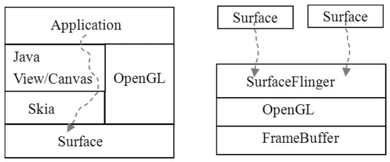
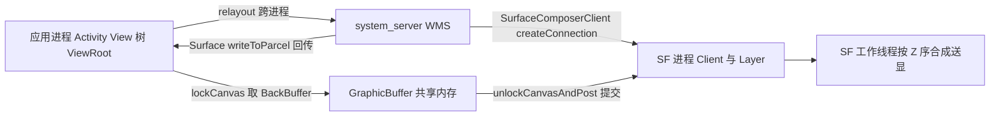
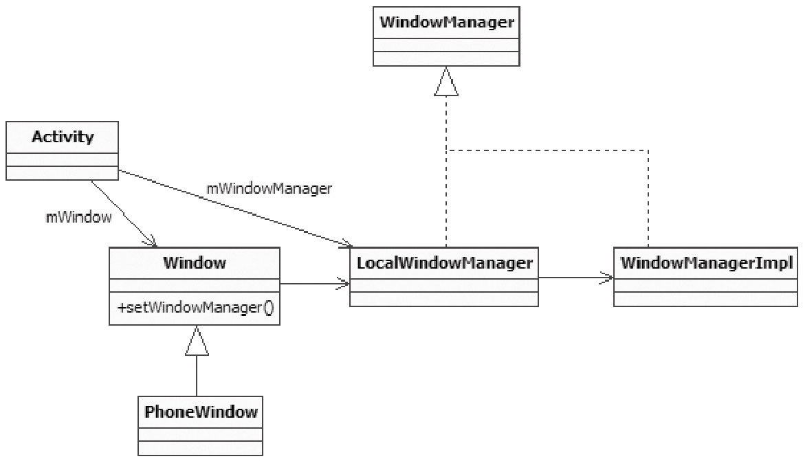
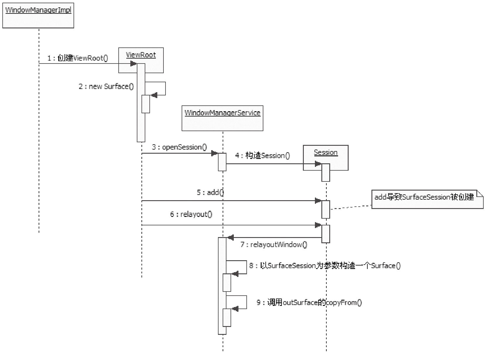
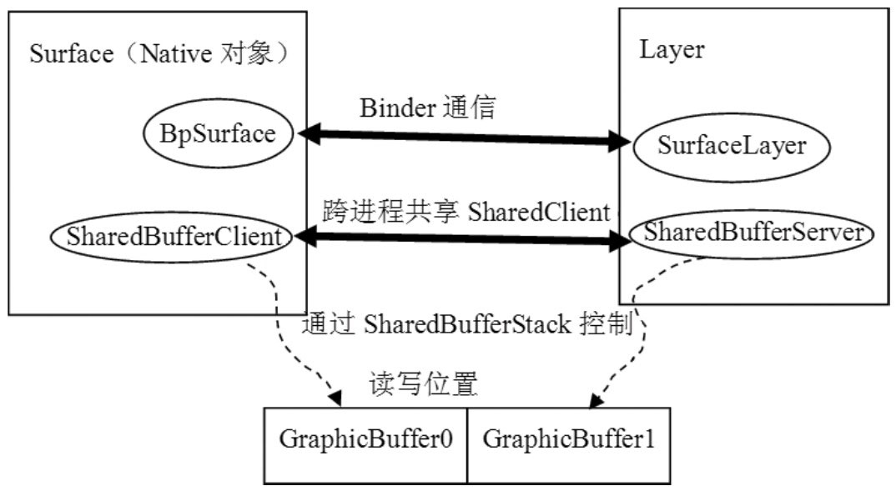
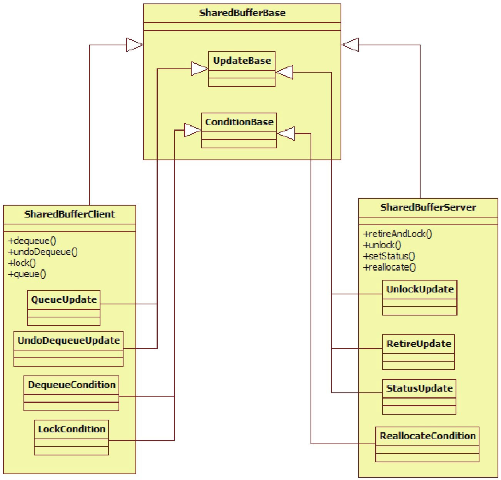
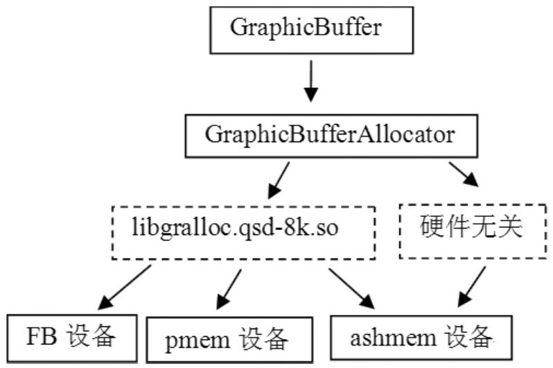
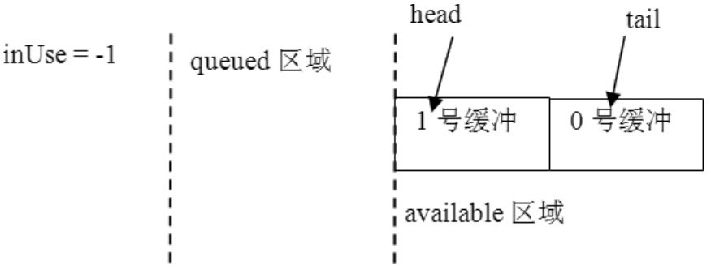
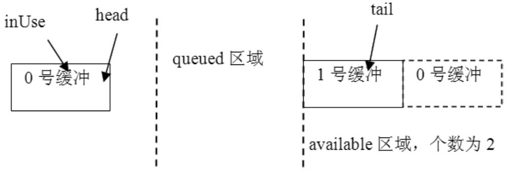
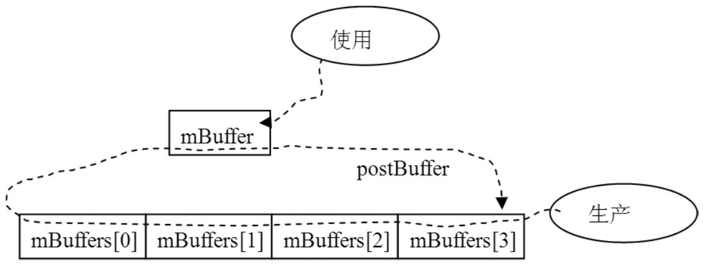

本篇对应原书第 8 章「深入理解 Surface 系统」，是全书篇幅最大、难度也最高的一章。原书基于 Android 2.2/2.3 源码，从一个 Activity 的显示过程入手：先看 Activity 的创建与 UI 绘制（ActivityThread → ViewRoot），再顺着 ViewRoot 持有的 Surface 追进 WindowManagerService 与 SurfaceFlinger，把 Surface 的跨进程传递、lockCanvas 绘图、SF 的合成流程逐段拆开。本章主线一句话：**Surface 是应用侧的画布句柄，它在 WMS 所在的 system_server 进程中被创建、对应 SF 进程中的一个 Layer；应用通过 SharedBuffer 双缓冲与 SF 交换图形数据，最终由 SF 把各显示层按 Z 轴混合后送显。**

> 版本注意：原书成书于 2011 年（Android 2.2/2.3）。现代 Surface 体系已完全重构（BufferQueue/BLASTBufferQueue、SurfaceFlinger 前后端架构、Vulkan/RenderThread），原书的具体类与调用链多数已变，但「Surface 是画布句柄、SurfaceFlinger 是合成器、应用与 SF 通过共享图形缓冲交换数据」的心智模型仍适用，差异见文末演进备注。

> 摘编声明：文中代码为原书代码的摘编版——保留主干、省略日志与无关分支，类名、函数名忠于原书原文。

## 1.1 概述：Surface 系统的全景结构

Surface 系统比 Audio 系统更庞大，原书用两条主线统摄全章：

1. **应用与 Surface 的关系**：不论用 Skia 绘二维图像还是用 OpenGL 绘三维图像，应用最终都要和 Surface 打交道——Surface 就是 UI 的画布，应用在它上面作画。
2. **Surface 与 SurfaceFlinger 的关系**：Surface 向 SurfaceFlinger 提供数据，SurfaceFlinger 混合数据——与 AudioTrack 向 AudioFlinger 提供音频数据、AudioFlinger 混音的关系同构。



左图为第一条主线（应用 → Surface），右图为第二条主线（Surface → SurfaceFlinger）。为书写方便，下文将 SurfaceFlinger 简写为 SF（SurfaceFlinger），WindowManagerService 简写为 WMS（WindowManagerService，窗口管理服务），ActivityManagerService 简写为 AMS（ActivityManagerService）。三者的进程分布值得先记住：应用进程持有 ViewRoot 与 Surface 的客户端对象；WMS 与 SF 都驻留在 system_server 进程中（原书时代 SF 尚未独立成进程）。

整章的全景调用链如下，后文按此推进：



## 1.2 一个 Activity 的显示

应用的外表由 Activity 展示，而 Activity 的界面绘制最终落在 ViewRoot 手里。本节沿「Activity 创建 → setContentView 构建 View 树 → ViewRoot 建立 → performTraversals 绘制」的主链路走一遍。

### 1.2.1 Activity 的创建与 ViewRoot 的建立

先回答一个问题：Activity 的生命周期回调（onCreate、onDestroy 等）人人皆知，可 Activity 对象本身是在哪里创建的？zygote 响应 AMS 的请求后 fork 出应用进程，其入口是 ActivityThread 的 main 函数；而创建 Activity 的地方，是 ActivityThread 的 handleLaunchActivity——① performLaunchActivity 负责「造出」Activity 并触发 onCreate，② handleResumeActivity 完成后续：

```java
// [--> ActivityThread.java::performLaunchActivity（摘编）]
private final Activity performLaunchActivity(ActivityRecord r, Intent customIntent) {
    ActivityInfo aInfo = r.activityInfo;
    Activity activity = null;
    try {
        java.lang.ClassLoader cl = r.packageInfo.getClassLoader();
        // 根据类名通过 Java 反射创建 Activity
        activity = mInstrumentation.newActivity(cl, component.getClassName(), r.intent);
    } catch (Exception e) {
        // ......
    }
    try {
        Application app = r.packageInfo.makeApplication(false, mInstrumentation);
        if (activity != null) {
            // Activity 的 getContext 返回的就是这个 ContextImpl 对象
            ContextImpl appContext = new ContextImpl();
            // 这个调用最终触发 Activity 的 onCreate
            mInstrumentation.callActivityOnCreate(activity, r.state);
        }
    }
    // ......
    return activity;
}
```

Instrumentation 的 newActivity 反射实例化 Activity 后，会立刻调用 Activity 的 attach 完成初始化，Window 就是在这里创建的：

```java
// [--> Activity.java::attach（摘编）]
final void attach(......) {
    // 利用 PolicyManager 创建 Window 对象
    mWindow = PolicyManager.makeNewWindow(this);
    mWindow.setCallback(this);
    // 创建 WindowManager 对象
    mWindow.setWindowManager(null, mToken, mComponent.flattenToString());
    // 保存这个 WindowManager 对象
    mWindowManager = mWindow.getWindowManager();
}
```

Window 是抽象类，它的真实类型由 PolicyManager 间接决定：PolicyManager 通过反射加载 `com.android.internal.policy.impl.Policy`，其 makeNewWindow 返回 PhoneWindow。再看 WindowManager 的真实身份：attach 中调用 setWindowManager 时第一个参数为 null，此时 Window 会创建并包装一个 WindowManagerImpl（单例）：

```java
// [--> Window.java]
public void setWindowManager(WindowManager wm, IBinder appToken, String appName) {
    mAppToken = appToken;
    mAppName = appName;
    if (wm == null) {
        // wm 为空，则取 WindowManagerImpl 的单例
        wm = WindowManagerImpl.getDefault();
    }
    // mWindowManager 是 LocalWindowManager
    mWindowManager = new LocalWindowManager(wm);
}
```

LocalWindowManager 是 Window 定义的内部类，它实现了 WindowManager 接口并把工作委托给 WindowManagerImpl（Proxy 模式）。两句话总结：**Activity 的 mWindow 真实类型是 PhoneWindow，mWindowManager 真实类型是 LocalWindowManager，其背后是 WindowManagerImpl 单例**。



onCreate 中与 UI 相关的头等大事是 setContentView，它一路转到 PhoneWindow：

```java
// [--> PhoneWindow.java]
public void setContentView(View view, ViewGroup.LayoutParams params) {
    // mContentParent 为 ViewGroup 类型，初值为 null
    if (mContentParent == null) {
        installDecor();
    } else {
        mContentParent.removeAllViews();
    }
    // 把 view 加入 ViewGroup
    mContentParent.addView(view, params);
    // ......
}

private void installDecor() {
    if (mDecor == null) {
        // 创建 mDecor，DecorView 类型，从 FrameLayout 派生
        mDecor = generateDecor();
    }
    if (mContentParent == null) {
        // generateLayout 根据 Window 的 features 选择标题栏布局资源，
        // inflate 后加入 DecorView，再取出 id 为 content 的 ViewGroup
        mContentParent = generateLayout(mDecor);
        // 创建标题栏
        mTitleView = (TextView)findViewById(com.android.internal.R.id.title);
        // ......
    }
}
```

**应用 setContentView 传入的 View 只是 DecorView 的子 View，标题栏等装饰由 DecorView 统一处理**（Composite 模式的 ViewGroup 容器加 Decorator 模式的装饰）。


View 树建好后就轮到 handleResumeActivity：它在完成 onResume 后，把 DecorView 加入 WindowManager：

```java
// [--> ActivityThread.java::handleResumeActivity（摘编）]
final void handleResumeActivity(IBinder token, ......) {
    // ...... performResumeActivity 完成 onResume 后，取回 ActivityRecord r 与 Activity a
    if (r.window == null && !a.mFinished && willBeVisible) {
        r.window = r.activity.getWindow();
        // ① 获得一个 View 对象，它就是 DecorView
        View decor = r.window.getDecorView();
        decor.setVisibility(View.INVISIBLE);
        // ② 获得 ViewManager 对象，就是 LocalWindowManager
        ViewManager wm = a.getWindowManager();
        WindowManager.LayoutParams l = r.window.getAttributes();
        a.mDecor = decor;
        l.type = WindowManager.LayoutParams.TYPE_BASE_APPLICATION;
        if (a.mVisibleFromClient) {
            a.mWindowAdded = true;
            // ③ 把 decor 对象加入到 ViewManager 中
            wm.addView(decor, l);
        }
    }
    // ......
}
```

LocalWindowManager.addView 委托给 WindowManagerImpl.addView，主角在这里登场：

```java
// [--> WindowManagerImpl.java]
private void addView(View view, ViewGroup.LayoutParams params, boolean nest) {
    ViewRoot root; // ViewRoot，幕后的主角终于登场
    synchronized (this) {
        // ① 创建 ViewRoot
        root = new ViewRoot(view.getContext());
        // ...... 把 view 与 root 保存进 mViews/mRoots 数组
        // ② setView，其中 view 是 DecorView
        root.setView(view, wparams, panelParentView);
    }
}
```

ViewRoot 是什么？看它的定义：

```java
// [--> ViewRoot.java]
public final class ViewRoot extends Handler implements ViewParent,
        View.AttachInfo.Callbacks // 从 Handler 类派生
{
    private final Surface mSurface = new Surface(); // 这里创建了一个 Surface 对象
    final W mWindow; // W 是 ViewRoot 的静态内部类
    View mView;
}
```

三条关键信息：**ViewRoot 继承 Handler，能处理消息；ViewRoot 有一个 Surface 类型的成员变量 mSurface；ViewRoot 还持有 W 类型的 mWindow 与 View 类型的 mView**。其中 W 的定义是 `static class W extends IWindow.Stub`——它是参与 Binder 通信（IPC，Inter-Process Communication，进程间通信）的服务端。ViewRoot 实现了 ViewParent 接口，但它没有 onDraw 函数，不做具体的绘画，只负责驱动整个 View 树的绘制。

ViewRoot 的构造函数建立了与 WMS 的会话通道：

```java
// [--> ViewRoot.java（摘编）]
public ViewRoot(Context context) {
    super();
    // 与 WMS 建立 IWindowSession 会话
    getWindowSession(context.getMainLooper());
    // mWindow 是 W 类型，注意它不是 Window，而是 IWindow 的 Bn 端
    mWindow = new W(this, context);
}

public static IWindowSession getWindowSession(Looper mainLooper) {
    synchronized (mStaticInit) {
        if (!mInitialized) {
            InputMethodManager imm = InputMethodManager.getInstance(mainLooper);
            // 先得到 WMS 的 Binder 代理，再调用它的 openSession
            sWindowSession = IWindowManager.Stub.asInterface(
                        ServiceManager.getService("window"))
                      .openSession(imm.getClient(), imm.getInputContext());
            mInitialized = true;
        }
        return sWindowSession;
    }
}
```

setView 保存 DecorView、发起一次布局请求，并把 mWindow 交给 WMS 登记：

```java
// [--> ViewRoot.java::setView（摘编）]
public void setView(View view, WindowManager.LayoutParams attrs,
                    View panelParentView) { // 第一个参数 view 是 DecorView
    mView = view; // 保存这个 view
    synchronized (this) {
        requestLayout(); // 发起布局请求，内部发 DO_TRAVERSAL 消息
        // 调用 IWindowSession 的 add，第一个参数是 W 类型的 mWindow
        res = sWindowSession.add(mWindow, mWindowAttributes,
                  getHostVisibility(), mAttachInfo.mContentInsets);
        // ......
    }
}
```

WMS 一侧，openSession 返回一个 Session 对象；Session 的 add 转调 WMS 的 addWindow，后者为窗口创建 WindowState 并调用其 attach，attach 里的动作值得注意：

```java
// [--> WindowManagerService.java::Session]
void windowAddedLocked() {
    if (mSurfaceSession == null) {
        // 创建一个 SurfaceSession 对象
        mSurfaceSession = new SurfaceSession();
        // ......
    }
    mNumWindow++;
}
```

链路收拢为：**ViewRoot 通过 IWindowSession（每个应用进程一个会话）调用 WMS；WMS 为窗口建立 WindowState，并在 Session 中创建 SurfaceSession——SurfaceSession 正是 WMS 侧通往 SF 的门票**。反方向上，WMS 通过 IWindow（ViewRoot 中的 W 对象）向应用做事件通知：按键、触屏等事件由 WMS 找到屏幕顶端的 IWindow 对象（Bp 端），调用其 dispatchKey/dispatchPointer；Bn 端在 ViewRoot 中，再根据 View 的位置信息找到真正处理事件的 View。


### 1.2.2 performTraversals 与 UI 绘制

requestLayout 发出的 DO_TRAVERSAL 消息由 ViewRoot 自己的 handleMessage 处理，转进 performTraversals。它本身很复杂，抓住两个关键调用即可：

```java
// [--> ViewRoot.java::performTraversals（摘编）]
private void performTraversals() {
    final View host = mView; // mView 就是 DecorView
    // ......
    relayoutResult = // ① 关键函数 relayoutWindow
        relayoutWindow(params, viewVisibility, insetsPending);
    // ......
    draw(fullRedrawNeeded); // ② 开始绘制
    // ......
}
```

先看①，它把 mSurface 作为参数传给了跨进程调用：

```java
// [--> ViewRoot.java::relayoutWindow（摘编）]
private int relayoutWindow(WindowManager.LayoutParams params, ......)
            throws RemoteException {
    // 调用 IWindowSession 的 relayout
    int relayoutResult = sWindowSession.relayout(
            mWindow, params, ......,
            mPendingConfiguration, mSurface); // mSurface 作为参数传进去了
    // ......
    return relayoutResult;
}
```

再看②，Activity 画面的产生就这三步：

```java
// [--> ViewRoot.java::draw（摘编）]
private void draw(boolean fullRedrawNeeded) {
    Surface surface = mSurface; // mSurface 是 ViewRoot 的成员变量
    // ......
    Canvas canvas;
    // 从 mSurface 中 lock 一块 Canvas
    canvas = surface.lockCanvas(dirty);
    // 调用 DecorView 的 draw 函数，canvas 就是画布
    mView.draw(canvas);
    // unlock 画布，屏幕上马上就能见到画面了
    surface.unlockCanvasAndPost(canvas);
}
```

至此可以总结 Activity 显示的全景：**WindowManagerImpl 持有 ViewRoot；ViewRoot 实现 ViewParent，一个成员变量 mView 指向 DecorView，另一个成员变量 mSurface 承载画布；Activity 的绘制由 ViewRoot 在 performTraversals 中完成——从 mSurface 中 lock 一块 Canvas，交给 mView 去画，最后 unlockCanvasAndPost 释放提交**。疑点也随之而来：mSurface 只是 ViewRoot 构造时用无参构造函数创建的本地对象，它凭什么能当画布？跨进程的 relayout 调用又对它做了什么？

## 1.3 初识 Surface

Surface 是纵跨 Java 层与 JNI（Java Native Interface，Java 本地接口）层的对象。本节沿 relayout 调用把 Surface 的来龙去脉查清楚。

### 1.3.1 Surface 的跨进程传递：relayout 中的 outSurface

先总结前面出现过的、与 Surface 有关的调用：ViewRoot 构造时以无参构造函数创建 mSurface；WMS 侧的 Session 在 windowAddedLocked 中创建了 SurfaceSession；performTraversals 会调用 IWindowSession 的 relayout；ViewRoot 调用 lockCanvas 与 unlockCanvasAndPost 完成绘制。其中 relayout 是跨进程调用，由 WMS 完成实际处理，aidl 定义中最后一个参数 Surface 被标记为 out：

```java
// [--> IWindowSession.aidl]
int relayout(IWindow window, in WindowManager.LayoutParams attrs,
        int requestedWidth, int requestedHeight, int viewVisibility,
        boolean insetsPending, out Rect outFrame, out Rect outContentInsets,
        out Rect outVisibleInsets, out Configuration outConfig,
        out Surface outSurface);
```

请求端拿到的是 Java 层的代理调用；响应端在 WMS 的 Session 与 WindowManagerService 中——Session.relayout 转调 relayoutWindow：

```java
// [--> WindowManagerService.java::relayoutWindow（摘编）]
public int relayoutWindow(Session session, IWindow client, ......,
        Surface outSurface) {
    // win 是 WindowState，这里将创建一个本地的 Surface 对象
    Surface surface = win.createSurfaceLocked();
    if (surface != null) {
        // 先创建一个本地 surface，再在 outSurface 上调用 copyFrom，
        // 把本地 Surface 的信息拷贝到 outSurface 中
        outSurface.copyFrom(surface);
    }
    // ......
}

// [--> WindowManagerService.java::WindowState]
Surface createSurfaceLocked() {
    // mSurfaceSession 是 Session 上创建的 SurfaceSession 对象，
    // 以它为参数构造一个新的 Surface 对象
    mSurface = new Surface(
            mSession.mSurfaceSession, mSession.mPid,
            mAttrs.getTitle().toString(),
            0, w, h, mAttrs.format, flags);
    // ......
    Surface.openTransaction();  // 打开一个事务处理
    // ......
    Surface.closeTransaction(); // 关闭这个事务处理
    // ......
}
```

WMS 端用带 SurfaceSession 参数的构造函数创建 Surface，再通过 copyFrom 把信息「拷」给客户端的 outSurface。这个传递过程比看上去曲折得多，图示如下：



要彻底看清传递机制，得借助 aidl 工具把 IWindowSession.aidl 编译成 Java，看生成的 Binder 两端代码。客户端（Bp 端）的 relayout 中，outSurface 的处理有两处关键：

```java
// [--> aidl 生成的 Bp 端 :: relayout（摘编）]
        // 奇怪：outSurface 的信息没有写到请求包 _data 中，请求就直接发出去了
        mRemote.transact(Stub.TRANSACTION_relayout, _data, _reply, 0);
        _reply.readException();
        _result = _reply.readInt();
        // ......
        if ((0!=_reply.readInt())) {
            outSurface.readFromParcel(_reply); // 从 Parcel 中读取信息填充 outSurface
        }
```

客户端根本没把 outSurface 写进请求包，那服务端收到的 Surface 对象从哪来？再看服务端（Bn 端）的 onTransact：

```java
// [--> aidl 生成的 Bn 端 :: onTransact（摘编）]
    case TRANSACTION_relayout:
    {
        data.enforceInterface(DESCRIPTOR);
        // ......
        android.view.Surface _arg10;
        // Surface 信息并没有传过来，服务端这边直接 new 了一个新的 Surface
        _arg10 = new android.view.Surface();
        int _result = this.relayout(_arg0, _arg1, ......, _arg10);
        reply.writeNoException();
        reply.writeInt(_result);
        // _arg10 就是调用了 copyFrom 的那个 outSurface，怎么传回客户端？
        if ((_arg10!=null)) {
            reply.writeInt(1);
            // 调用 Surface 的 writeToParcel 把信息写到 reply 包中，
            // 注意最后一个参数为 PARCELABLE_WRITE_RETURN_VALUE
            _arg10.writeToParcel(reply,
                  android.os.Parcelable.PARCELABLE_WRITE_RETURN_VALUE);
        }
    }
```

真相大白：**服务端自己 new 一个 Surface 交给 relayoutWindow 填充（copyFrom 就发生在它身上），返回时调用 writeToParcel 把 Surface 信息序列化进应答包；客户端再通过 readFromParcel 反序列化，填充 ViewRoot 传进来的 mSurface**。整个传递过程如下图：


### 1.3.2 JNI 层的传递实现

Java 层的 writeToParcel 与 readFromParcel 都是 native 函数，实现集中在 android_view_Surface.cpp。按调用顺序依次看。

ViewRoot 构造时的 Surface 无参构造只创建了一个 Canvas（CompatibleCanvas，从 Canvas 派生）。顺带交代绘图「四大金刚」：**Bitmap 存储像素（真正的画布内存）；Canvas 记载画图动作并提供基本绘图函数；Drawing primitive（绘图基元）是矩形、圆、文本等被绘制的对象；Paint 描述颜色与风格**。一般 Canvas 封装一块 Bitmap，作画就发生在这块 Bitmap 上。

WMS 侧的 SurfaceSession 构造函数调用 native 的 init，后者创建一个 SurfaceComposerClient 对象并把指针保存到 Java 对象中——**SurfaceSession 的本质是 JNI 层的 SurfaceComposerClient**：

```cpp
// [--> android_view_Surface.cpp::SurfaceSession_init]
static void SurfaceSession_init(JNIEnv* env, jobject clazz)
{
    // 创建一个 SurfaceComposerClient 对象
    sp<SurfaceComposerClient> client = new SurfaceComposerClient;
    client->incStrong(clazz);
    // 在 Java 对象中保存这个 client 对象的指针
    env->SetIntField(clazz, sso.client, (int)client.get());
}
```

接着是 WMS 侧带 SurfaceSession 参数的 Surface 构造（Java 层保存 CompatibleCanvas 后调用 native 的 init），JNI 实现的核心是 createSurface：

```cpp
// [--> android_view_Surface.cpp::Surface_init]
static void Surface_init(JNIEnv* env, jobject clazz,
        jobject session, jint pid, jstring jname,
        jint dpy, jint w, jint h, jint format, jint flags)
{
    // 从 SurfaceSession 对象中取出之前创建的 SurfaceComposerClient
    SurfaceComposerClient* client =
            (SurfaceComposerClient*)env->GetIntField(session, sso.client);

    sp<SurfaceControl> surface; // 注意它的类型是 SurfaceControl
    // createSurface 返回的是一个 SurfaceControl 对象
    surface = client->createSurface(pid, dpy, w, h, format, flags);
    // 把这个 SurfaceControl 对象设置到 Java 层的 Surface 对象中
    setSurfaceControl(env, clazz, surface);
}
```

然后是 copyFrom 的 JNI 实现——它只搬运 SurfaceControl 指针：

```cpp
// [--> android_view_Surface.cpp::Surface_copyFrom]
static void Surface_copyFrom(JNIEnv* env, jobject clazz, jobject other)
{
    // clazz 是 copyFrom 的调用对象，other 是 copyFrom 的参数。
    // 目标对象此时还没有设置 SurfaceControl，源对象则已经创建了 SurfaceControl
    const sp<SurfaceControl>& surface = getSurfaceControl(env, clazz);
    const sp<SurfaceControl>& rhs = getSurfaceControl(env, other);
    if (!SurfaceControl::isSameSurface(surface, rhs)) {
        // 把源 SurfaceControl 对象设置到目标 Surface 中
        setSurfaceControl(env, clazz, rhs);
    }
}
```

再是 writeToParcel 与客户端的 readFromParcel：

```cpp
// [--> android_view_Surface.cpp::Surface_writeToParcel]
static void Surface_writeToParcel(JNIEnv* env, jobject clazz,
        jobject argParcel, jint flags)
{
    Parcel* parcel = (Parcel*)env->GetIntField(argParcel, no.native_parcel);
    // 从 Java 的 Surface 对象中取出保存的 SurfaceControl 对象
    const sp<SurfaceControl>& control(getSurfaceControl(env, clazz));
    // 把 SurfaceControl 中的信息写到 Parcel 包中，传递到对端，
    // 对端通过 readFromParcel 处理这个 Parcel 包
    SurfaceControl::writeSurfaceToParcel(control, parcel);
    if (flags & PARCELABLE_WRITE_RETURN_VALUE) {
        // flags 等于 PARCELABLE_WRITE_RETURN_VALUE，
        // 写完后本地 Surface 对象的 SurfaceControl 被置空
        setSurfaceControl(env, clazz, 0);
    }
}

// [--> android_view_Surface.cpp::Surface_readFromParcel]
static void Surface_readFromParcel(JNIEnv* env, jobject clazz, jobject argParcel)
{
    Parcel* parcel = (Parcel*)env->GetIntField(argParcel, no.native_parcel);
    // 注意，这里定义的变量类型是 Surface，而不是 SurfaceControl
    const sp<Surface>& control(getSurface(env, clazz));
    // 根据服务端传递的 Parcel 包构造一个新的 Surface
    sp<Surface> rhs = new Surface(*parcel);
    if (!Surface::isSameSurface(control, rhs)) {
        // 把这个新 Surface 赋给 ViewRoot 中的 mSurface
        setSurface(env, clazz, rhs);
    }
}
```

整个过程共出现三个关键的 Native 对象：**SurfaceComposerClient、SurfaceControl、Native 层的 Surface（与 Java 层 Surface 对应）**。最终转移到 ViewRoot 的 mSurface 中的，是最后这个 Native Surface。精简流程五句话：创建 SurfaceComposerClient；调用它的 createSurface 得到 SurfaceControl；调用 SurfaceControl 的 writeToParcel 把信息写进 Parcel 包；根据 Parcel 包构造一个 Native Surface；把这个 Surface 保存到 Java 层的 mSurface 中。


### 1.3.3 Surface 与画图

Surface 拿到手，绘图的最后两个调用 lockCanvas 与 unlockCanvasAndPost 的 JNI 实现也就水到渠成。lockCanvas 的机制很清晰：**通过 Native Surface 的 lock 拿到一块存储区域（info.bits），把它设为 SkCanvas 的 Bitmap 像素区，UI 绘画的结果就记录在这块存储区域里**：

```cpp
// [--> android_view_Surface.cpp::Surface_lockCanvas（摘编）]
static jobject Surface_lockCanvas(JNIEnv* env, jobject clazz, jobject dirtyRect)
{
    // 从 Java 的 Surface 对象中取出 Native 的 Surface 对象
    const sp<Surface>& surface(getSurface(env, clazz));
    // dirtyRect 表示需要重绘的矩形块，根据它设置 dirtyRegion（无则全屏）
    Region dirtyRegion;
    // ......
    // 调用 Native Surface 的 lock，SurfaceInfo 带回绘图所需信息
    Surface::SurfaceInfo info;
    status_t err = surface->lock(&info, &dirtyRegion);
    // 取出 Surface 构造时创建的 CompatibleCanvas 对象，
    // 再从中取出 SkCanvas 对象
    jobject canvas = env->GetObjectField(clazz, so.canvas);
    SkCanvas* nativeCanvas = (SkCanvas*)env->GetIntField(canvas, no.native_canvas);
    SkBitmap bitmap;
    ssize_t bpr = info.s * bytesPerPixel(info.format);
    bitmap.setConfig(convertPixelFormat(info.format), info.w, info.h, bpr);
    // info.bits 指向一块存储区域
    bitmap.setPixels(info.bits);
    // 给这个 SkCanvas 设置 Bitmap，UI 绘画就有画布了
    nativeCanvas->setBitmapDevice(bitmap);
    // ......
    return canvas;
}
```

unlockCanvasAndPost 则是收尾：恢复 SkCanvas 状态并解除与 Bitmap 的绑定（Skia 细节），然后调用 Native Surface 的 unlockAndPost。

## 1.4 深入分析 Surface

上一节只是把 Surface 的传递流程走通了，本节基于那条精简流程深入内部：先补显示系统的背景知识，再逐个剖析 SurfaceComposerClient、SurfaceControl、Native Surface 的构造细节，以及 lockCanvas 背后的 GraphicBuffer 世界。

### 1.4.1 基础知识：显示层、FrameBuffer 与 PageFlipping

第一件事，屏幕上的画面如何组织。屏幕位于一个三维坐标系中，Z 轴由屏幕内指向屏幕外；每个矩形块是一个**显示层（Layer）**，拥有颜色、透明度、位置、宽高等属性以及对应的显示内容。SF 的工作就是把这些按 Z 轴排好序的显示层做图像混合，混合结果即屏幕画面。注意代码中另有一个名为 Layer 的具体类，为区分广义概念，这里把广义的 Layer 称为显示层。


Surface 系统定义了三种属性、共四种显示层：

| 属性 | 类型 | 场景 |
|---|---|---|
| eFXSurfaceNormal | Normal 模式 | 绝大多数 UI，数据由应用的 mView.draw(canvas) 画上去 |
| eFXSurfaceNormal | PushBuffers 模式 | 视频播放、摄像机预览，数据由数据源直接 push 进 Buffer，应用无需 draw |
| eFXSurfaceBlur | Blur | 半透明模糊效果，像隔一层毛玻璃 |
| eFXSurfaceDim | Dim | 变暗效果，暗但不模糊 |

第二件事，数据承载。Audio 系统用共享内存传音频数据，Surface 系统的图像数据则由 FrameBuffer 承载。**FB（FrameBuffer，帧缓冲）就是存储图形帧数据的缓冲**，它依托 Linux 的虚拟显示设备 FBD（FrameBuffer Device，帧缓冲设备，设备文件 /dev/graphics/fb%d）——FBD 把各厂商的真实显示设备统一在一个框架下，应用层通过标准的 ioctl、mmap 等系统调用即可操作显示设备。显存通过 mmap 映射到用户空间，往这块缓冲写数据就相当于在屏幕上作画。DDMS（Dalvik Debug Monitor Server）的截屏功能就是直接读 FB 的例子——framebuffer_service 先 `open("/dev/graphics/fb0")`，经 `ioctl(fb, FBIOGET_VSCREENINFO, &vinfo)` 取出屏幕属性（宽高、 bpp），然后把 FBD 中的数据原样写到输出文件。


第三件事，生产/消费的步调。音频流没有边界，图像数据则一帧一帧有边界，所以图形系统使用 PageFlipping（画面交换）技术：**分配能容纳两帧数据的缓冲，前一帧叫 FrontBuffer，后一帧叫 BackBuffer；消费者使用 FrontBuffer 的旧数据，生产者用新数据填充 BackBuffer，互不干扰；需要更新显示时二者角色互换，如此循环**。说白了，PageFlipping 就是一个只有两个成员的帧缓冲队列，后面分析数据传输时会见到 dequeue 与 queue 操作。

第四件事，图像混合。SF 与 AudioFlinger 一样具备混合能力，支持软硬两个层面：软件层面例如用 copyBlt（数据拷贝，也可由 2D 图形加速硬件实现）混合源与目标；硬件层面使用 Overlay 系统的接口，主要用于视频输出——视频内容变化快，硬件混合效率更高。

### 1.4.2 SurfaceComposerClient 的创建与 SharedClient

精简流程的第一步是 SurfaceSession_init 里创建的 SurfaceComposerClient。它的名字暗示了与 SF 的关系（SF 派生于 SurfaceComposer），构造函数证实了这一点：

```cpp
// [--> SurfaceComposerClient.cpp]
SurfaceComposerClient::SurfaceComposerClient()
{
    // getComposerService 返回 SF 的 Binder 代理端 BpSurfaceFlinger
    sp<ISurfaceComposer> sm(getComposerService());
    // 先调用 SF 的 createConnection，再调用 _init
    _init(sm, sm->createConnection());

    if (mClient != 0) {
        Mutex::Autolock _l(gLock);
        // 把新创建的 client 保存到全局 map 中
        gActiveConnections.add(mClient->asBinder(), this);
    }
}
```

转到 SF 的 createConnection：

```cpp
// [--> SurfaceFlinger.cpp]
sp<ISurfaceFlingerClient> SurfaceFlinger::createConnection()
{
    Mutex::Autolock _l(mStateLock);
    uint32_t token = mTokens.acquire();
    // 先创建一个 Client
    sp<Client> client = new Client(token, this);
    // 把这个 Client 对象保存到 mClientsMap 中，token 是它的标识
    status_t err = mClientsMap.add(token, client);
    /*
     * BClient 派生于 ISurfaceFlingerClient，支持 Binder 通信：
     * 它接收客户端的请求后转交给 SF 处理（并不是交给 Client）。
     * Client 会创建一块共享内存，由 getControlBlockMemory 返回。
     */
    sp<BClient> bclient =
        new BClient(this, token, client->getControlBlockMemory());
    return bclient;
}
```

Client 的构造函数创建共享内存并放上控制结构（原书沿用 Audio 系统的叫法称 CB，Control Block——Surface 系统中真正起控制作用的是接下来这个 SharedClient）：

```cpp
// [--> SurfaceFlinger.cpp]
Client::Client(ClientID clientID, const sp<SurfaceFlinger>& flinger)
    : ctrlblk(0), cid(clientID), mPid(0), mBitmap(0), mFlinger(flinger)
{
    const int pgsize = getpagesize();
    // 把 cblksize 对齐为页的大小，目前是 4096 字节
    const int cblksize = ((sizeof(SharedClient)+(pgsize-1))&~(pgsize-1));
    // MemoryHeapBase 创建共享内存
    mCblkHeap = new MemoryHeapBase(cblksize, 0,
                    "SurfaceFlinger Client control-block");

    ctrlblk = static_cast<SharedClient*>(mCblkHeap->getBase());
    if (ctrlblk) {
        new(ctrlblk) SharedClient; // placement new
    }
}
```

SharedClient 的定义出乎意料地简单：

```cpp
class SharedClient
{
public:
    SharedClient();
    ~SharedClient();
    status_t validate(size_t token) const;
    uint32_t getIdentity(size_t token) const; // 取出标识本 Client 的 token
private:
    Mutex lock;
    Condition cv; // 支持跨进程的同步对象
    // NUM_LAYERS_MAX 为 31
    SharedBufferStack surfaces[ NUM_LAYERS_MAX ];
};
```

读写控制的秘密在 SharedBufferStack 数组中：**一个 Client 最多支持 31 个显示层，每个显示层的生产/消费步调由对应的 SharedBufferStack 控制**，其关键字段是几个 volatile 计数：

```cpp
// [--> SharedBufferStack.h]
class SharedBufferStack {
    // ......
    // Buffer 按块使用，每个 Buffer 有自己的编号（数组索引）
    volatile int32_t head;      // FrontBuffer 的编号
    volatile int32_t available; // 空闲 Buffer 的个数
    volatile int32_t queued;    // 脏 Buffer 的个数（有新数据的 Buffer）
    volatile int32_t inUse;     // SF 当前正在使用的 Buffer 的编号
    volatile status_t status;   // 状态码
    // ......
};
```

根据 PageFlipping 的知识，只有两个 FB 时控制很简单：要么 SF 读 1 号、客户端写 0 号，要么反过来。另外，各显示层并不直接操作 SharedClient，而是经由 SharedBufferServer（SF 端，控制读取）与 SharedBufferClient（客户端，控制写入）两个结构。


最后看 _init，它让 SurfaceComposerClient 拿到三个关键成员：**mSignalServer（BpSurfaceFlinger，客户端刷新 BackBuffer 后由它通知 SF 做 PageFlipping 和输出）、mControl（跨进程共享的 SharedClient，来自 mClient->getControlBlock() 的共享内存）、mClient（BClient 的客户端对应物）**：

```cpp
// [--> SurfaceComposerClient.cpp::_init（摘编）]
void SurfaceComposerClient::_init(
        const sp<ISurfaceComposer>& sm, const sp<ISurfaceFlingerClient>& conn)
{
    mClient = conn; // mClient 是 BClient 在客户端的代表
    mControlMemory = mClient->getControlBlock();
    mSignalServer = sm; // mSignalServer 是 BpSurfaceFlinger
    // mControl 就是创建于共享内存之中的 SharedClient
    mControl = static_cast<SharedClient*>(mControlMemory->getBase());
}
```

类关系全景如下：


SurfaceFlinger 从 Thread 派生（有独立工作线程）；BClient 是 SF 的 Proxy；SharedClient 构建于共享内存中，SurfaceComposerClient 与 Client 都持有它。

### 1.4.3 SurfaceControl 的创建与 Layer 家族

精简流程第二步：Surface_init 调用 SurfaceComposerClient 的 createSurface 得到 SurfaceControl。请求端先经一个拼名字的便捷重载，再由内层 createSurface 发起跨进程调用：

```cpp
// [--> SurfaceComposerClient.cpp]
sp<SurfaceControl> SurfaceComposerClient::createSurface(
        int pid, const String8& name, DisplayID display, uint32_t w,
        uint32_t h, PixelFormat format, uint32_t flags)
{
    sp<SurfaceControl> result;
    if (mStatus == NO_ERROR) {
        ISurfaceFlingerClient::surface_data_t data;
        // 跨进程调用，返回的 surface 是 BpSurface，统称 ISurface
        sp<ISurface> surface = mClient->createSurface(&data, pid, name,
                                        display, w, h, format, flags);
        if (surface != 0) {
            if (uint32_t(data.token) < NUM_LAYERS_MAX) {
                // 以返回的 ISurface 创建一个 SurfaceControl 对象
                result = new SurfaceControl(this, surface, data, w, h,
                                              format, flags);
            }
        }
    }
    return result;
}
```

DisplayID 是 int32 整型，表示屏幕编号（如双屏手机有内外两屏）；当时 Android 只支持一块屏幕，取值都是 0。响应端在 SF 进程（BClient 只是转发给 mFlinger）：

```cpp
// [--> SurfaceFlinger.cpp::createSurface（摘编）]
sp<ISurface> SurfaceFlinger::createSurface(ClientID clientId, int pid,
        const String8& name, ISurfaceFlingerClient::surface_data_t* params,
        DisplayID d, uint32_t w, uint32_t h, PixelFormat format, uint32_t flags)
{
    sp<LayerBaseClient> layer; // LayerBaseClient 是 Layer 家族的基类
    sp<LayerBaseClient::Surface> surfaceHandle;

    Mutex::Autolock _l(mStateLock);
    // 根据 clientId 找到 createConnection 时加入的那个 Client 对象
    sp<Client> client = mClientsMap.valueFor(clientId);
    // id 表示 Client 创建的第几个显示层，
    // 同时也表示将使用 SharedBufferStack 数组的第 id 个元素
    int32_t id = client->generateId(pid);
    // 一个 Client 不能创建多于 NUM_LAYERS_MAX 个 Layer
    if (uint32_t(id) >= NUM_LAYERS_MAX) {
        return surfaceHandle;
    }
    // 根据 flags 参数创建不同类型的显示层
    switch (flags & eFXSurfaceMask) {
        case eFXSurfaceNormal:
            if (UNLIKELY(flags & ePushBuffers)) {
                // PushBuffers 类型：视频播放、摄像机预览等
                layer = createPushBuffersSurfaceLocked(client, d, id, w, h, flags);
            } else {
                // Normal 类型：绝大多数 UI 走这里
                layer = createNormalSurfaceLocked(client, d, id, w, h, flags, format);
            }
            break;
        case eFXSurfaceBlur:
            layer = createBlurSurfaceLocked(client, d, id, w, h, flags);
            break;
        case eFXSurfaceDim:
            layer = createDimSurfaceLocked(client, d, id, w, h, flags);
            break;
    }

    if (layer != 0) {
        layer->setName(name);
        setTransactionFlags(eTransactionNeeded);
        // 从显示层对象中取出一个 ISurface 对象赋给 surfaceHandle
        surfaceHandle = layer->getSurface();
        if (surfaceHandle != 0) {
            params->token    = surfaceHandle->getToken();
            params->identity = surfaceHandle->getIdentity();
            // ......
        }
    }
    return surfaceHandle; // ISurface 的 Bn 端就是这个对象
}
```

Normal 类型的创建函数有三个关键点：

```cpp
// [--> SurfaceFlinger.cpp::createNormalSurfaceLocked（摘编）]
sp<LayerBaseClient> SurfaceFlinger::createNormalSurfaceLocked(
        const sp<Client>& client, DisplayID display,
        int32_t id, uint32_t w, uint32_t h, uint32_t flags,
        PixelFormat& format)
{
    switch (format) { // 一些图像方面的参数设置
    case PIXEL_FORMAT_TRANSPARENT:
    case PIXEL_FORMAT_TRANSLUCENT:
        format = PIXEL_FORMAT_RGBA_8888;
        break;
    case PIXEL_FORMAT_OPAQUE:
        format = PIXEL_FORMAT_RGB_565;
        break;
    }
    // ① 创建一个 Layer 类型的对象
    sp<Layer> layer = new Layer(this, display, client, id);
    // ② 设置 Buffer
    status_t err = layer->setBuffers(w, h, format, flags);
    if (LIKELY(err == NO_ERROR)) {
        // 初始化这个新 layer 的一些状态
        layer->initStates(w, h, flags);
        // ③ 把这个 layer 加入按 Z 轴排序的显示层大军
        addLayer_l(layer);
    }
    // ......
    return layer;
}
```

逐个看。Layer 的构造与基类 LayerBaseClient 的构造：

```cpp
// [--> Layer.cpp]
Layer::Layer(SurfaceFlinger* flinger, DisplayID display,
        const sp<Client>& c, int32_t i) // i 表示 SharedBufferStack 数组的索引
    :   LayerBaseClient(flinger, display, c, i), // 先调用基类构造函数
        mSecure(false), ......
{
    // getFrontBuffer 取出 FrontBuffer 的编号
    mFrontBufferIndex = lcblk->getFrontBuffer();
}
```

```cpp
// [--> LayerBaseClient.cpp]
LayerBaseClient::LayerBaseClient(SurfaceFlinger* flinger, DisplayID display,
        const sp<Client>& client, int32_t i)
    : LayerBase(flinger, display), lcblk(NULL), client(client), mIndex(i),
      mIdentity(uint32_t(android_atomic_inc(&sIdentity)))
{
    /*
     * 创建一个 SharedBufferServer 对象：绑定 SharedClient 对象、
     * SharedBufferStack 数组的索引 i 和常量 NUM_BUFFERS。
     */
    lcblk = new SharedBufferServer(
                client->ctrlblk, i, NUM_BUFFERS, // NUM_BUFFERS 为 2，定义在 Layer.h
                mIdentity);
}
```

SF 端的 Layer 通过 SharedBufferServer 绑定 SharedClient 中属于自己的那个 SharedBufferStack；客户端的 Native Surface 则通过 SharedBufferClient 控制同一个栈——SF 是消费者、应用是生产者，一读一写各持一个控制结构。Layer 被 sp 化后 onFirstRef 还会调用 `client->bindLayer(this, mIndex)` 把自己登记进 Client 的 mLayers 数组。


再看关键点② setBuffers，它创建 PageFlipping 所需的两个缓冲：

```cpp
// [--> Layer.cpp::setBuffers（摘编）]
status_t Layer::setBuffers(uint32_t w, uint32_t h,
                              PixelFormat format, uint32_t flags)
{
    // DisplayHardware 是代表显示设备的 HAL 对象，0 代表第一块屏幕，
    // 这里从 HAL 中取出一些与显示相关的信息
    const DisplayHardware& hw(graphicPlane(0).displayHardware());
    // ......

    /*
     * 创建 Buffer：这里创建两个 GraphicBuffer，
     * 它们就是前面所说的 FrontBuffer 和 BackBuffer。
     */
    for (size_t i=0 ; i<NUM_BUFFERS ; i++) {
        // 无参构造，mBuffers 是一个二元数组，此时还没有真实存储
        mBuffers[i] = new GraphicBuffer();
    }
    // SurfaceLayer 是 Layer 的内部类
    mSurface = new SurfaceLayer(mFlinger, clientIndex(), this);
    return NO_ERROR;
}
```

关键点③ addLayer_l 把新显示层挂到 SF 的 Z 轴大军——mCurrentState 的 layersSortedByZ 是排序数组，add 按新 layer 在 Z 轴的位置插入（mCurrentState 保存了所有的显示层）：

```cpp
// [--> SurfaceFlinger.cpp::addLayer_l（摘编）]
status_t SurfaceFlinger::addLayer_l(const sp<LayerBase>& layer)
{
    ssize_t i = mCurrentState.layersSortedByZ.add(
                                layer, &LayerBase::compareCurrentStateZ);
    sp<LayerBaseClient> lbc =
                    LayerBase::dynamicCast< LayerBaseClient* >(layer.get());
    if (lbc != 0) {
        mLayerMap.add(lbc->serverIndex(), lbc);
    }
    return NO_ERROR;
}
```

跨进程调用返回后，客户端用返回的 ISurface 与 surface_data_t 构造 SurfaceControl——它是一个 wrapper 类，成员 mClient 指向 SurfaceComposerClient、mSurface 指向跨进程返回的 ISurface、外加 token/identity/宽高/格式等参数，封装了一批便捷函数转发给 mClient 或 ISurface。至此 Layer 家族的全貌可以给出了：


- LayerBaseClient 从 LayerBase 派生，另有四个派生类：Layer、LayerBuffer、LayerDim、LayerBlur
- LayerBaseClient 定义了内部类 Surface（从 ISurface 派生，支持 Binder 通信）
- Layer 与 LayerBuffer 分别定义内部类 SurfaceLayer、SurfaceLayerBuffer 继承它——**Normal 显示层的 getSurface 返回的 ISurface 真实类型是 SurfaceLayer**
- LayerDim 与 LayerBlur 直接使用 LayerBaseClient 的 Surface
- ISurface 接口很精简：requestBuffer、postBuffer 等

SurfaceControl 创建后的连接关系：mClient 指向 SurfaceComposerClient；mSurface 的 Binder 响应端是 SurfaceLayer；SurfaceLayer 的 mOwner 指向外部类 Layer，Layer 的 mSurface 又指向 SurfaceLayer（getSurface 的返回值）。


### 1.4.4 writeToParcel 与 Native Surface 的创建

精简流程的第三、四步。前面创建的所有对象都在 system_server 进程中，writeToParcel 负责把必要信息打包发给 Activity 所在进程（下称 Activity 端）：

```cpp
// [--> SurfaceControl.cpp::writeSurfaceToParcel（摘编）]
status_t SurfaceControl::writeSurfaceToParcel(
        const sp<SurfaceControl>& control, Parcel* parcel)
{
    uint32_t flags = 0; uint32_t format = 0;
    SurfaceID token = -1; uint32_t identity = 0;
    sp<SurfaceComposerClient> client;
    sp<ISurface> sur;
    if (SurfaceControl::isValid(control)) {
        token     = control->mToken;
        identity  = control->mIdentity;
        client    = control->mClient;
        sur       = control->mSurface;
        // ...... 宽、高、格式、flags
    }
    // SurfaceComposerClient 的连接信息需要传到 Activity 端，
    // 客户端据此构造一个对等的 SurfaceComposerClient 对象
    parcel->writeStrongBinder(client!=0 ? client->connection() : NULL);
    // 把 ISurface 的 Binder 信息也写到 Parcel，
    // Activity 端据此构造一个 ISurface 的 Bp 端
    parcel->writeStrongBinder(sur!=0 ? sur->asBinder(): NULL);
    // ...... token、identity、宽高等 int 参数
    return NO_ERROR;
}
```

Activity 端的 readFromParcel 用这个 Parcel 构造 Native Surface：

```cpp
// [--> Surface.cpp::Surface(const Parcel&)（摘编）]
Surface::Surface(const Parcel& parcel)
    : mBufferMapper(GraphicBufferMapper::get()),
    mSharedBufferClient(NULL)
{
    /*
     * Surface 定义了 sp<GraphicBuffer> 的二元数组 mBuffers。
     * Layer 端也有一个二元数组，难道一共有四个 GraphicBuffer？
     * 实际上它们操纵的是同一段共享内存，见 GraphicBuffer 一节。
     */
    sp<IBinder> clientBinder = parcel.readStrongBinder();
    // 得到 ISurface 的 Bp 端 BpSurface
    mSurface     = interface_cast<ISurface>(parcel.readStrongBinder());
    // ...... token、identity、宽高、格式、flags

    if (clientBinder != NULL) {
        // 现在位于 Activity 端，这里还没有 SurfaceComposerClient，
        // 根据连接信息构造一个
        mClient = SurfaceComposerClient::clientForConnection(clientBinder);
        // SharedBuffer 家族的客户端代表 SharedBufferClient 出场
        mSharedBufferClient = new SharedBufferClient(
                                  mClient->mControl, mToken, 2, mIdentity);
    }

    init(); // 做一些初始化工作
}
```

Native Surface 创建完毕后的全景：**SharedBuffer 家族依托共享内存中的 SharedClient 组成生产/消费协调的中枢，SF 端代表是 SharedBufferServer，Activity 端代表是 SharedBufferClient；Native Surface 与 SF 中的 SurfaceLayer 建立 Binder 联系；两端各有两个 GraphicBuffer，但四个 GraphicBuffer 操纵同一段共享内存**。



SharedBuffer 家族的成员包括 SharedBufferBase（基类）、SharedBufferServer、SharedBufferClient，以及一批 XXXCondition、XXXUpdate 内部类——后者是 C++ 的 Function Object（函数对象），用来在锁保护下更新或等待读写位置。基类构造函数把每个成员绑定到属于自己的那个栈元素：

```cpp
// [--> SharedBufferStack.cpp]
SharedBufferBase::SharedBufferBase(SharedClient* sharedClient,
        int surface, int num, int32_t identity)
    : mSharedClient(sharedClient),
      mSharedStack(sharedClient->surfaces + surface),
      mNumBuffers(num), // 根据 PageFlipping 的知识，num 值为 2
      mIdentity(identity)
{
    /*
     * 最重要的是第二句赋值：它使这个 SharedBufferXXX 对象
     * 绑定 SharedClient 中 SharedBufferStack 数组的第 surface 个元素。
     */
}
```



至此 Activity 端的 Java Surface 终于挂上了 Native Surface，绘图资源全部就绪：两个 GraphicBuffer（FrontBuffer 与 BackBuffer）、SharedBufferServer/SharedBufferClient 控制结构、连接 SurfaceLayer 的 ISurface、连接 BClient 的 SurfaceComposerClient。

### 1.4.5 lockCanvas 与 unlockCanvasAndPost 的绘图流程

资源齐备，开始绘图。lockCanvas 最终调用 Native Surface 的 lock：

```cpp
// [--> Surface.cpp::Surface::lock（摘编）]
status_t Surface::lock(SurfaceInfo* other, Region* dirtyIn, bool blocking)
{
    // other 用来接收返回信息，dirtyIn 表示需要重绘的区域
    // usage 标志在 GraphicBuffer 分配缓冲时有指导作用
    setUsage(GRALLOC_USAGE_SW_READ_OFTEN | GRALLOC_USAGE_SW_WRITE_OFTEN);
    sp<GraphicBuffer> backBuffer;
    // ① 从缓冲队列中取出一个空闲缓冲（空闲缓冲出队）
    status_t err = dequeueBuffer(&backBuffer);
    if (err == NO_ERROR) {
        // ② 锁住这块 buffer
        err = lockBuffer(backBuffer.get());
        if (err == NO_ERROR) {
            const Rect bounds(backBuffer->width, backBuffer->height);
            Region scratch(bounds);
            Region& newDirtyRegion(dirtyIn ? *dirtyIn : scratch);
            // mPostedBuffer 是上一次绘画时使用的 Buffer，即现在的 FrontBuffer
            const sp<GraphicBuffer>& frontBuffer(mPostedBuffer);
            if (frontBuffer != 0 &&
                backBuffer->width   == frontBuffer->width &&
                backBuffer->height == frontBuffer->height &&
                !(mFlags & ISurfaceComposer::eDestroyBackbuffer))
            {
                const Region copyback(mOldDirtyRegion.subtract(newDirtyRegion));
                if (!copyback.isEmpty() && frontBuffer!=0) {
                    // ③ 把 FrontBuffer 中的数据拷贝到 BackBuffer
                    copyBlt(backBuffer, frontBuffer, copyback);
                }
            }
            // ......
            void* vaddr;
            // 调用 GraphicBuffer 的 lock 得到内存地址 vaddr，
            // 后续的作画在这块内存上展开
            status_t res = backBuffer->lock(
                    GRALLOC_USAGE_SW_READ_OFTEN | GRALLOC_USAGE_SW_WRITE_OFTEN,
                    newDirtyRegion.bounds(), &vaddr);
            mLockedBuffer = backBuffer;
            // other 接收返回信息，最重要的是 bits 这个内存地址
            other->bits   = vaddr;
            // ...... 宽、高、stride、格式
        }
    }
    return err;
}
```

三个关键点逐一展开。① dequeueBuffer 选出一个空闲 GraphicBuffer：

```cpp
// [--> Surface.cpp::dequeueBuffer（摘编）]
int Surface::dequeueBuffer(android_native_buffer_t** buffer)
{
    sp<SurfaceComposerClient> client(getClient());
    // SharedBufferClient 的 dequeue 返回当前空闲的缓冲编号
    ssize_t bufIdx = mSharedBufferClient->dequeue();
    const uint32_t usage(getUsage());
    /*
     * backBuffer 是引用类型：修改它就相当于修改 mBuffers[bufIdx]。
     * mBuffers 中的 GraphicBuffer 用无参构造创建，还没有真实存储。
     */
    const sp<GraphicBuffer>& backBuffer(mBuffers[bufIdx]);
    if (backBuffer == 0 || // 第一次进来满足 backBuffer 为空这个条件
        ((uint32_t(backBuffer->usage) & usage) != usage) ||
        mSharedBufferClient->needNewBuffer(bufIdx))
    {
        // 需要向 SF 侧请求真实的存储
        err = getBufferLocked(bufIdx, usage);
    }
    // ......
}
```

getBufferLocked 通过 ISurface 向 SF 请求指定索引的 GraphicBuffer：

```cpp
// [--> Surface.cpp::getBufferLocked（摘编）]
status_t Surface::getBufferLocked(int index, int usage)
{
    sp<ISurface> s(mSurface);
    status_t err = NO_MEMORY;
    // currentBuffer 是引用类型，赋值相当于 mBuffers[index] = buffer
    sp<GraphicBuffer>& currentBuffer(mBuffers[index]);
    // 调用 ISurface 的 requestBuffer 得到指定索引 index 的 Buffer
    sp<GraphicBuffer> buffer = s->requestBuffer(index, usage);
    if (buffer != 0) {
        err = mSharedBufferClient->getStatus();
        if (!err && buffer->handle != NULL) {
            // registerBuffer 做内存映射，见 GraphicBuffer 一节
            err = getBufferMapper().registerBuffer(buffer->handle);
            if (err == NO_ERROR) {
                currentBuffer = buffer;
                currentBuffer->setIndex(index);
            }
        }
    }
    return err;
}
```

ISurface 的 Bn 端是 Layer 的内部类 SurfaceLayer（内部类把请求转交外部类），所以直接看 Layer 的实现：

```cpp
// [--> Layer.cpp::requestBuffer（摘编）]
sp<GraphicBuffer> Layer::requestBuffer(int index, int usage)
{
    sp<GraphicBuffer> buffer;
    sp<Client> ourClient(client.promote());
    // lcblk 是 SharedBufferServer，确保 index 号 GraphicBuffer
    // 没有被 SF 当作 FrontBuffer 使用
    status_t err = lcblk->assertReallocate(index);
    if (err != NO_ERROR) {
        return buffer;
    }

    uint32_t w, h;
    {
        Mutex::Autolock _l(mLock);
        w = mWidth; h = mHeight;
        /*
         * mBuffers 是 SF 端创建的二元数组，取出第 index 个元素。
         * 用的也是无参构造，此时同样没有真实存储。
         */
        buffer = mBuffers[index];
        mBuffers[index].clear();
    }

    const uint32_t effectiveUsage = getEffectiveUsage(usage);
    if (buffer!=0 && buffer->getStrongCount() == 1) {
        // 重新分配物理存储
        err = buffer->reallocate(w, h, mFormat, effectiveUsage);
    } else {
        buffer.clear();
        // 有参构造同样会分配物理存储
        buffer = new GraphicBuffer(w, h, mFormat, effectiveUsage);
        err = buffer->initCheck();
    }
    // ......
    if (err == NO_ERROR && buffer->handle != 0) {
        Mutex::Autolock _l(mLock);
        if (mWidth && mHeight) {
            mBuffers[index] = buffer;
            mTextures[index].dirty = true;
        }
    }
    return buffer;
}
```

② lockBuffer 确保 dequeue 得到的编号没被 SF 当作 FrontBuffer 使用：

```cpp
// [--> Surface.cpp / SharedBufferStack.cpp]
int Surface::lockBuffer(android_native_buffer_t* buffer)
{
    int32_t bufIdx = GraphicBuffer::getSelf(buffer)->getIndex();
    // 调用 SharedBufferClient 的 lock
    status_t err = mSharedBufferClient->lock(bufIdx);
    return err;
}

status_t SharedBufferClient::lock(int buf)
{
    LockCondition condition(this, buf); // buf 是 BackBuffer 的索引号
    status_t err = waitForCondition(condition);
    return err;
}

bool SharedBufferClient::LockCondition::operator()() {
    // 根据 head、queued、inUse 等读写位置判断编号为 buf 的 buffer 是否空闲
    return (buf != stack.head ||
            (stack.queued > 0 && stack.inUse != buf));
}
```

waitForCondition 的 condition 参数不是函数而是重载了 () 操作符的函数对象——它在 SharedClient 的锁保护下循环检查条件、超时等待（模板函数，摘编从略）。

③ copyBlt 拷贝旧数据的原因：**大多数情况下 UI 只有一小部分变化（如按钮按下变色），对应 GraphicBuffer 中的一小块 dirtyRegion；把上次绘制的结果（保存在 mPostedBuffer 中）拷到 BackBuffer，本次绘制只需更新脏区域，避免整块重绘**。

绘制完成后 unlockCanvasAndPost 收尾：

```cpp
// [--> Surface.cpp]
status_t Surface::unlockAndPost()
{
    // 调用 GraphicBuffer 的 unlock
    status_t err = mLockedBuffer->unlock();
    // queueBuffer 把含有新数据的缓冲加入队中
    err = queueBuffer(mLockedBuffer.get());
    mPostedBuffer = mLockedBuffer; // 保存这个 BackBuffer 为 mPostedBuffer
    mLockedBuffer = 0;
    return err;
}

int Surface::queueBuffer(android_native_buffer_t* buffer)
{
    sp<SurfaceComposerClient> client(getClient());
    int32_t bufIdx = GraphicBuffer::getSelf(buffer)->getIndex();
    // 设置脏 Region
    mSharedBufferClient->setDirtyRegion(bufIdx, mDirtyRegion);
    // 更新写位置
    err = mSharedBufferClient->queue(bufIdx);
    if (err == NO_ERROR) {
        // client 是 BpSurfaceFlinger，调用 signalServer，
        // SF 就知道新数据准备好了
        client->signalServer();
    }
    return err;
}
```

queue 操作同样借助函数对象完成——QueueUpdate 在锁保护下把 stack.queued 加一，再 broadcast 唤醒等待的同步对象（updateCondition 模板与 waitForCondition 对称，摘编从略）。


### 1.4.6 GraphicBuffer 与 ashmem

GraphicBuffer 是 Surface 系统高层次的显示内存管理类，封装了硬件相关细节。先看它的出身：

```cpp
// [--> GraphicBuffer.h]
class GraphicBuffer
    : public EGLNativeBase<android_native_buffer_t,
                GraphicBuffer,LightRefBase<GraphicBuffer> >,
    public Flattenable
```


从 LightRefBase 派生使它支持轻量级引用计数；从 Flattenable 派生使它支持序列化（flatten/unflatten），信息因此可以存进 Parcel 并被 Binder 传输。父类 android_native_buffer_t 是 C 的 struct，其关键成员是 handle：

```c
// [--> android_native_buffer.h]
typedef struct android_native_buffer_t
{
    // 第一个成员，在派生类对象的内存布局中同样排在最前
    struct android_native_base_t common;
    int width;
    int height;
    int stride;
    int format;
    int usage;
    // 关键成员：保存与显示内存分配/管理相关的内容
    buffer_handle_t handle;
    // ......
} android_native_buffer_t;

// [--> gralloc.h / native_handle.h]
typedef const native_handle* buffer_handle_t;
typedef struct
{
    int version;    /* version 值为 sizeof(native_handle_t) */
    int numFds;
    int numInts;
    int data[0];    /* data 是数据存储空间的首地址 */
} native_handle_t;
```

**buffer_handle_t 实际是 native_handle 指针，GraphicBuffer 的精髓就在于通过它持有那块共享显示内存的身份信息（文件描述符与整数参数）**。

接着看存储分配。无参构造不分配任何东西（handle 为空，宽高格式全零）；真正的分配发生在 requestBuffer 促使 SF 端调用 reallocate 时：

```cpp
// [--> GraphicBuffer.cpp]
status_t GraphicBuffer::reallocate(uint32_t w, uint32_t h, PixelFormat f,
        uint32_t reqUsage)
{
    if (mOwner != ownData)
        return INVALID_OPERATION;
    if (handle) { // 无参构造时 handle 为空，不会走这里
        GraphicBufferAllocator& allocator(GraphicBufferAllocator::get());
        allocator.free(handle);
        handle = 0;
    }
    return initSize(w, h, f, reqUsage); // 调用 initSize 函数
}

status_t GraphicBuffer::initSize(uint32_t w, uint32_t h, PixelFormat format,
        uint32_t reqUsage)
{
    /*
     * GraphicBufferAllocator 才是真正的存储分配管理类，
     * 单例模式，每个进程只有一个。
     */
    GraphicBufferAllocator& allocator = GraphicBufferAllocator::get();
    // alloc 分配存储，handle 作为指针被传入，值会被修改
    status_t err = allocator.alloc(w, h, format, reqUsage, &handle, &stride);
    // ...... 成功则记录宽高格式 usage
    return err;
}
```

GraphicBufferAllocator 的构造加载 gralloc HAL（Hardware Abstraction Layer，硬件抽象层）模块——它会加载形如 libgralloc.硬件平台名.so 的动态库，目的是屏蔽不同硬件平台的差异：

```cpp
// [--> GraphicBufferAllocator.cpp]
GraphicBufferAllocator::GraphicBufferAllocator()
    : mAllocDev(0)
{
    hw_module_t const* module;
    // 调用 hw_get_module，得到 hw_module_t
    int err = hw_get_module(GRALLOC_HARDWARE_MODULE_ID, &module);
    if (err == 0) {
        // 调用 gralloc_open 函数
        gralloc_open(module, &mAllocDev);
    }
}

status_t GraphicBufferAllocator::alloc(uint32_t w, uint32_t h, PixelFormat format,
        int usage, buffer_handle_t* handle, int32_t* stride)
{
    status_t err;
    if (usage & GRALLOC_USAGE_HW_MASK) {
        // 硬件用途：交给 gralloc 设备分配（如 pmem 连续内存）
        err = mAllocDev->alloc(mAllocDev, w, h, format, usage, handle, stride);
    } else {
        // 软件用途：SW 分配，与硬件无关
        err = sw_gralloc_handle_t::alloc(w, h, format, usage, handle, stride);
    }
    // ......
    return err;
}
```



软件分配路径直接用 ashmem（anonymous shared memory，匿名共享内存）：

```cpp
// [--> GraphicBufferAllocator.cpp::sw_gralloc_handle_t::alloc（摘编）]
status_t sw_gralloc_handle_t::alloc(uint32_t w, uint32_t h, int format,
        int usage, buffer_handle_t* pHandle, int32_t* pStride)
{
    int align = 4;
    // ...... 根据 format 计算 bpp，再按对齐算出 bpr 与总大小 size
    size = (size + (PAGE_SIZE-1)) & ~(PAGE_SIZE-1);
    // 直接使用 ashmem 创建共享内存
    int fd = ashmem_create_region("sw-gralloc-buffer", size);
    // 内存映射，得到共享内存的起始地址
    void* base = mmap(0, size, prot, MAP_SHARED, fd, 0);

    sw_gralloc_handle_t* hnd = new sw_gralloc_handle_t();
    hnd->fd = fd;                // 保存文件描述符
    hnd->size = size;            // 保存共享内存的大小
    hnd->base = intptr_t(base);  // 保存起始地址
    hnd->prot = prot;            // 保存属性
    *pHandle = hnd;              // 对传入的 handle 指针赋值
    return NO_ERROR;
}
```

那么 Activity 端的 GraphicBuffer 怎么和 SF 端 Layer 的 GraphicBuffer 建立联系？这是一次小规模的跨进程搬运，发生在 requestBuffer 的 Binder 两端：BnSurface 的 onTransact 把 requestBuffer 的返回值 `reply->write(*buffer)` 写进 Parcel（GraphicBuffer 从 Flattenable 派生，flatten 被调用）；BpSurface 请求端则 new 一个本地 GraphicBuffer，`reply.read(*buffer)` 用 unflatten 把信息反序列化进去。搬运的关键就在 flatten 与 unflatten：

```cpp
// [--> GraphicBuffer.cpp]
status_t GraphicBuffer::flatten(void* buffer, size_t size,
        int fds[], size_t count) const
{
    // ...... 宽、高、格式等信息写入 buf
    if (handle) {
        buf[6] = handle->numFds;
        buf[7] = handle->numInts;
        native_handle_t const* const h = handle;
        // 把 handle 的信息也写到 buffer 中，fd 部分单独存放
        memcpy(fds,     h->data,              h->numFds*sizeof(int));
        memcpy(&buf[8], h->data + h->numFds,  h->numInts*sizeof(int));
    }
    return NO_ERROR;
}

status_t GraphicBuffer::unflatten(void const* buffer, size_t size,
        int fds[], size_t count)
{
    // ......
    if (numFds || numInts) {
        width   = buf[1];
        height  = buf[2];
        stride  = buf[3];
        format  = buf[4];
        usage   = buf[5];
        native_handle* h = native_handle_create(numFds, numInts);
        memcpy(h->data,             fds,      numFds*sizeof(int));
        memcpy(h->data + numFds,   &buf[8],   numInts*sizeof(int));
        handle = h; // 根据 Parcel 包中的数据还原一个 handle
    }
    // ......
    mOwner = ownHandle;
    return NO_ERROR;
}
```

unflatten 根据 Parcel 中的 native_handle 信息在 Activity 端构造一个对等的 GraphicBuffer。registerBuffer 随后对这块内存做映射：

```cpp
// [--> GraphicBufferMapper.cpp]
status_t sw_gralloc_handle_t::registerBuffer(sw_gralloc_handle_t* hnd)
{
    if (hnd->pid != getpid()) {
        // 对端进程：做一次 mmap 内存映射
        void* base = mmap(0, hnd->size, hnd->prot, MAP_SHARED, hnd->fd, 0);
        // base 保存着共享内存的起始地址
        hnd->base = intptr_t(base);
    }
    return NO_ERROR;
}
```

至此可以回答前面的悬案：**Activity 端与 SF 端各自的两个 GraphicBuffer，通过 handle 中共享内存的文件描述符映射到同一块物理存储——像素数据从不拷贝，跨进程传递的只是身份信息**。使用时的 lock/unlock 也只是取地址（软件路径下 lock 返回 hnd->base，unlock 无操作）。从应用层的角度，可以把 GraphicBuffer 当作架构在共享内存之上的数据缓冲。

## 1.5 SurfaceFlinger 分析

应用的绘图数据已提交，接下来看消费端。相比 AudioFlinger，SF 的结构要简单些。

### 1.5.1 SurfaceFlinger 的诞生

SF 驻留于 system_server 进程（由 SystemServer 的 init1 启动），创建代码波澜不惊——instantiate 把 `new SurfaceFlinger()` 注册为名为 "SurfaceFlinger" 的 Binder 服务。注意它的继承关系：`class SurfaceFlinger : public BnSurfaceComposer, protected Thread`——从 Thread 派生意味着 SF 会单独启动一个工作线程。构造函数只做了些属性读取；启动发生在对象第一次被 sp 化时的 onFirstRef：

```cpp
// [--> SurfaceFlinger.cpp]
void SurfaceFlinger::onFirstRef()
{
    // 工作线程在 onFirstRef 中创建
    run("SurfaceFlinger", PRIORITY_URGENT_DISPLAY);
    /*
     * mReadyToRunBarrier 类型为 Barrier，封装了一个 Mutex 和一个 Condition。
     * wait 表示等待一个同步条件满足。
     */
    mReadyToRunBarrier.wait();
}
```

这个同步条件在工作线程的 readyToRun 中触发：

```cpp
// [--> SurfaceFlinger.cpp::readyToRun（摘编）]
status_t SurfaceFlinger::readyToRun()
{
    int dpy = 0;
    {
        // ① GraphicPlane 是屏幕在 SF 代码中的对应物
        GraphicPlane& plane(graphicPlane(dpy));
        // ② 为它设置代表显示设备的 HAL 对象 DisplayHardware
        DisplayHardware* const hw = new DisplayHardware(this, dpy);
        plane.setDisplayHardware(hw);
    }

    // 创建一块只读共享内存，存放 surface_flinger_cblk_t（主要存储屏幕等信息，
    // 控制作用达不到 audio_track_cblk_t 的程度）
    mServerHeap = new MemoryHeapBase(4096,
                              MemoryHeapBase::READ_ONLY,
                              "SurfaceFlinger read-only heap");
    mServerCblk =
      static_cast<surface_flinger_cblk_t*>(mServerHeap->getBase());
    new(mServerCblk) surface_flinger_cblk_t; // placement new

    // ...... 把屏幕宽高格式等信息填入 cblk，OpenGL 初始化
    // LayerDim 是 Dim 类型的 Layer
    LayerDim::initDimmer(this, w, h);

    // 触发 onFirstRef 中 wait 的同步条件
    mReadyToRunBarrier.open();
    // 资源准备好后启动 bootanim 程序，开机动画出现
    property_set("ctl.start", "bootanim");

    return NO_ERROR;
}
```

关键点②的 DisplayHardware 在构造中完成 EGL 初始化，FrameBuffer 也在这里创建：

```cpp
// [--> DisplayHardware.cpp::init（摘编）]
void DisplayHardware::init(uint32_t dpy)
{
    // FramebufferNativeWindow 实现了对 FrameBuffer 的管理和操作，
    // 其中创建了两个 FrameBuffer，分别充当 FrontBuffer 和 BackBuffer
    mNativeWindow = new FramebufferNativeWindow();
    framebuffer_device_t const * fbDev = mNativeWindow->getDevice();
    // ...... Overlay 相关的 hw_get_module/overlay_control_open
    // EGLDisplay 在 EGL 中代表屏幕
    EGLDisplay display = eglGetDisplay(EGL_DEFAULT_DISPLAY);
    // ......
    /*
     * eglCreateWindowSurface 把 EGL 与 Android 的 Display 系统绑定起来，
     * 之后可以在该 EGLSurface 上用 OpenGL 绘画，eglSwapBuffers 输出图像。
     */
    surface = eglCreateWindowSurface(display, config,
            mNativeWindow.get(), NULL);
    // ...... 保存 display/config/surface/context
}
```

由此回答一个前置疑问：应用在 GraphicBuffer（ashmem 共享内存）上绘图，与 FrameBuffer 有什么关系？——**SF 自己创建 FrameBuffer（经 FramebufferNativeWindow 与 EGL），把各 Surface 通过 GraphicBuffer 送来的数据混合后，再由自己写入 FrameBuffer 显示**。

### 1.5.2 工作线程：PageFlip、重绘与送显

SF 工作线程的主循环由四个关键点构成：waitForEvent（等事件）、handlePageFlip（取新数据）、handleRepaint（重绘合成）、postFramebuffer（送显），外加 unlockClients 与事务处理。先看等待：

```cpp
// [--> SurfaceFlinger.cpp::waitForEvent（摘编）]
void SurfaceFlinger::waitForEvent()
{
    while (true) {
        nsecs_t timeout = -1;
        // ...... 冻屏相关的超时处理
        MessageList::value_type msg = mEventQueue.waitMessage(timeout);
        if (msg != 0) {
            switch (msg->what) {
                // 千辛万苦就等这一个重绘消息
                case MessageQueue::INVALIDATE:
                    return;
            }
        }
    }
}
```

谁发的重绘消息？正是应用端 unlockCanvasAndPost 末尾的 signalServer，它在 SF 端的实现就是 `mEventQueue.invalidate()`——往消息队列中加入 INVALIDATE 消息。被唤醒后，threadLoop 先处理事务（见 1.5.3），随后进行 PageFlip：

```cpp
// [--> SurfaceFlinger.cpp::threadLoop（摘编）]
bool SurfaceFlinger::threadLoop()
{
    waitForEvent();
    if (LIKELY(mTransactionCount == 0)) {
        const uint32_t mask = eTransactionNeeded | eTraversalNeeded;
        uint32_t transactionFlags = getTransactionFlags(mask);
        if (LIKELY(transactionFlags)) {
            handleTransaction(transactionFlags);
        }
    }
    // ...... handlePageFlip、handleRepaint、unlockClients、postFramebuffer
}
```

handlePageFlip 遍历当前要显示的所有显示层，取出各自的新数据：

```cpp
// [--> SurfaceFlinger.cpp::handlePageFlip（摘编）]
void SurfaceFlinger::handlePageFlip()
{
    bool visibleRegions = mVisibleRegionsDirty;
    /*
     * mCurrentState 保存所有显示层的信息，
     * 绘制时使用的 mDrawingState 保存当前需要显示的显示层信息。
     */
    LayerVector& currentLayers =
                  const_cast<LayerVector&>(mDrawingState.layersSortedByZ);
    // ① 调用 lockPageFlip
    visibleRegions |= lockPageFlip(currentLayers);
    const DisplayHardware& hw = graphicPlane(0).displayHardware();
    // 取得屏幕的区域
    const Region screenRegion(hw.bounds());
    if (visibleRegions) {
        Region opaqueRegion;
        computeVisibleRegions(currentLayers, mDirtyRegion, opaqueRegion);
        mWormholeRegion = screenRegion.subtract(opaqueRegion);
        mVisibleRegionsDirty = false;
    }
    // ② 调用 unlockPageFlip（对每个显示层做区域清理）
    unlockPageFlip(currentLayers);
    mDirtyRegion.andSelf(screenRegion);
}
```

lockPageFlip 对每个显示层调用同名函数，以 Normal 的 Layer 为例：

```cpp
// [--> Layer.cpp::lockPageFlip（摘编）]
void Layer::lockPageFlip(bool& recomputeVisibleRegions)
{
    // lcblk 是 SharedBufferServer，retireAndLock 返回 FrontBuffer 的索引号
    ssize_t buf = lcblk->retireAndLock();
    mFrontBufferIndex = buf;

    // 得到 FrontBuffer 对应的 GraphicBuffer
    sp<GraphicBuffer> newFrontBuffer(getBuffer(buf));
    if (newFrontBuffer != NULL) {
        // 取出脏区域，与 GraphicBuffer 所表示的区域裁剪
        const Region dirty(lcblk->getDirtyRegion(buf));
        mPostedDirtyRegion = dirty.intersect( newFrontBuffer->getBounds() );
        // ...... 尺寸变化时置 recomputeVisibleRegions 为 true
    } else {
        mPostedDirtyRegion.clear();
    }
    if (lcblk->getQueuedCount()) {
        mFlinger->signalEvent(); // 还有排队的 buffer，继续触发
    }
    /*
     * 脏区域不为空时绘制成一张纹理，reloadTexture 保存在 mTextures 数组中，
     * 其中涉及很多 OpenGL 操作。
     */
    if (!mPostedDirtyRegion.isEmpty()) {
        reloadTexture( mPostedDirtyRegion );
    }
}
```

**handlePageFlip 的工作归结为一句话：各 Layer 从 FrontBuffer 取得新数据并生成一张 OpenGL 纹理——纹理可以看作一张图片，内容就是 FrontBuffer 中的图像**。接着是重绘：

```cpp
// [--> SurfaceFlinger.cpp（摘编）]
void SurfaceFlinger::handleRepaint()
{
    mInvalidRegion.orSelf(mDirtyRegion);
    if (mInvalidRegion.isEmpty()) {
        return;
    }
    // ......
    // 在脏区域上进行绘制
    composeSurfaces(mDirtyRegion);
    mDirtyRegion.clear();
}

void SurfaceFlinger::composeSurfaces(const Region& dirty)
{
    const LayerVector& drawingLayers(mDrawingState.layersSortedByZ);
    const size_t count = drawingLayers.size();
    sp<LayerBase> const* const layers = drawingLayers.array();
    for (size_t i=0 ; i<count ; ++i) {
        const sp<LayerBase>& layer = layers[i];
        const Region& visibleRegion(layer->visibleRegionScreen);
        if (!visibleRegion.isEmpty())   {
            const Region clip(dirty.intersect(visibleRegion));
            if (!clip.isEmpty()) {
                layer->draw(clip); // 调用各个显示层的 draw
            }
        }
    }
}
```

composeSurfaces 按 Z 轴顺序由里到外依次绘制各显示层，后画的可能遮盖先画的。Layer 的绘制最终落在 OpenGL 纹理上：LayerBase::draw 调用子类 onDraw，Layer::onDraw 取 mFrontBufferIndex 对应的纹理（lockPageFlip 中生成的），经 drawWithOpenGL 画上去——后者是一段标准的 OpenGL 操作：validateTexture 绑定纹理、glEnable(GL_TEXTURE_2D)、设置顶点与纹理坐标（含旋转变换）、按裁剪区域 glScissor 后 glDrawArrays 画矩形（摘编从略）。

绘制完成后还有两项收尾。unlockClients 释放各显示层占用的 FrontBuffer 索引（每个 layer 调用 finishPageFlip，内部 `lcblk->unlock(mFrontBufferIndex)`）；postFramebuffer 把合成结果送进 FrameBuffer：

```cpp
// [--> SurfaceFlinger.cpp / DisplayHardware.cpp]
void SurfaceFlinger::postFramebuffer()
{
    if (!mInvalidRegion.isEmpty()) {
        const DisplayHardware& hw(graphicPlane(0).displayHardware());
        // 调用这个函数后，混合后的图像就会传递到屏幕中显示了
        hw.flip(mInvalidRegion);
        mInvalidRegion.clear();
    }
}

void DisplayHardware::flip(const Region& dirty) const
{
    // ...... 支持局部更新时设置更新矩形
    mPageFlipCount++;
    eglSwapBuffers(dpy, surface); // PageFlipping，此后图像终于显示在屏幕上了
}
```


### 1.5.3 Transaction 处理

Transaction（事务）借自数据库的概念：一次提交多个操作、集中执行。Surface 的控制类操作（位置、尺寸、透明度、显示/隐藏等）不走 lockCanvas 的数据通道，而是通过事务一次性提交给 SF。WMS 的 createSurfaceLocked 就是一个现成的例子：

```java
// [--> WindowManagerService.java::WindowState]
Surface createSurfaceLocked() {
    Surface.openTransaction(); // 开始一次 transaction
    try {
        mSurfaceX = mFrame.left + mXOffset;
        mSurfaceY = mFrame.top + mYOffset;
        // 设置 Surface 的位置
        mSurface.setPosition(mSurfaceX, mSurfaceY);
        // ......
    } finally {
        Surface.closeTransaction(); // 关闭这次事务
    }
    // ......
}
```

openTransaction 与 closeTransaction 都是 native 函数，进入 SurfaceComposerClient 一层。openGlobalTransaction 会遍历全局连接表，对每个 SurfaceComposerClient 调用 openTransaction——后者只是把 mTransactionOpen 计数加一并准备一个 layer_state_t：

```cpp
// [--> SurfaceComposerClient.cpp::openTransaction（摘编）]
status_t SurfaceComposerClient::openTransaction()
{
    if (mStatus != NO_ERROR)
        return mStatus;
    Mutex::Autolock _l(mLock);
    mTransactionOpen++; // 一个计数值，用来控制事务的提交
    if (mPrebuiltLayerState == 0) {
        mPrebuiltLayerState = new layer_state_t;
    }
    return NO_ERROR;
}
```

open 与 close 之间的操作（如 setPosition）只修改本地的 layer_state_t，并不立即跨进程——调用链 Surface.setPosition → SurfaceComposerClient::setPosition 中，后者找到对应的 layer_state_t，置上 ePositionChanged 标志、填入 x/y 新值就返回。closeTransaction 才把积攒的修改一次性提交：

```cpp
// [--> SurfaceComposerClient.cpp::closeGlobalTransaction/closeTransaction（摘编）]
void SurfaceComposerClient::closeGlobalTransaction()
{
    // ......
    sp<ISurfaceComposer> sm(getComposerService());
    // ① 先调用 SF 的 openGlobalTransaction
    sm->openGlobalTransaction();
    // ② 然后调用每个 SurfaceComposerClient 的 closeTransaction
    clients[i]->closeTransaction();
    // ③ 最后调用 SF 的 closeGlobalTransaction
    sm->closeGlobalTransaction();
}

status_t SurfaceComposerClient::closeTransaction()
{
    Mutex::Autolock _l(mLock);
    const ssize_t count = mStates.size();
    if (count) {
        // mStates 保存所有 layer_state_t（每个 Surface 一个），
        // 一次性跨进程提交给 SF
        mClient->setState(count, mStates.array());
        mStates.clear();
    }
    return NO_ERROR;
}
```

SF 端三个函数依次是：

```cpp
// [--> SurfaceFlinger.cpp（摘编）]
void SurfaceFlinger::openGlobalTransaction()
{
    android_atomic_inc(&mTransactionCount); // 又是一个计数控制
}

status_t SurfaceFlinger::setClientState(ClientID cid, int32_t count,
                      const layer_state_t* states)
{
    Mutex::Autolock _l(mStateLock);
    uint32_t flags = 0;
    cid <<= 16;
    for (int i=0 ; i<count ; i++) {
        const layer_state_t& s = states[i];
        sp<LayerBaseClient> layer(getLayerUser_l(s.surface | cid));
        if (layer != 0) {
            const uint32_t what = s.what;
            if (what & ePositionChanged) {
                if (layer->setPosition(s.x, s.y))
                    // eTraversalNeeded 表示需要遍历所有显示层
                    flags |= eTraversalNeeded;
            }
            // ......
        }
    }
    if (flags) {
        setTransactionFlags(flags); // 这里会触发 threadLoop 的事件
    }
    return NO_ERROR;
}

void SurfaceFlinger::closeGlobalTransaction()
{
    if (android_atomic_dec(&mTransactionCount) == 1) {
        /*
         * 注意执行条件：mTransactionCount 减为 0 才真正提交。
         * 这意味着 openGlobalTransaction 两次的话，
         * 只有最后一个 closeGlobalTransaction 才会生效。
         */
        signalEvent();
        // ...... 涉及尺寸调整时等待一段时间
    }
}
```

事务为什么需要 eTraversalNeeded（遍历所有显示层）？因为控制操作的后果可能波及别的层——显示层 A 挪走后，原先被它遮住的 B 可能变得可见。工作线程被事件唤醒后处理事务（handleTransaction → handleTransactionLocked）：需要遍历时对每个显示层调用 doTransaction 更新其内部状态；eTransactionNeeded 分支处理横竖屏切换（GraphicPlane::setOrientation）与被移除显示层的收尾（ditch）；最后 commitTransaction：

```cpp
// [--> SurfaceFlinger.cpp::commitTransaction]
void SurfaceFlinger::commitTransaction()
{
    // mDrawingState 将使用更新后的 mCurrentState
    mDrawingState = mCurrentState;
    mResizeTransationPending = false;
    // 触发条件变量，等待在 closeGlobalTransaction 中的线程可以放心返回了
    mTransactionCV.broadcast();
}
```

事务的目的到此清楚：**把一批控制操作的修改结果一次性传递给 SF 处理，SF 处理完后用 mCurrentState 整体替换 mDrawingState，保持显示层状态切换的原子性**。

## 1.6 拓展思考

原书本章末尾的三块延伸内容：SharedBuffer 家族的读写控制（CB 对象分析）、ViewRoot 相关问答、LayerBuffer 的工作原理。

### 1.6.1 CB 对象：SharedBuffer 家族的读写控制

Surface 系统的 CB 就是指 SharedBuffer 家族，是生产者/消费者步调控制的中枢。为书写方便，下文简称 SharedBufferClient 为 SBC、SharedBufferServer 为 SBS、SharedBufferStack 为 SBT。


SBC 与 SBS 建立在同一个 SBT 上。SBT 的控制参数即 1.4.2 列出的 head/available/queued/inUse，加上 SBC 自己的 tail——注意 tail 是 SBC 定义的本地变量，不在 SBT 中，SBS 端不可见。SBS 的构造初始化栈内参数：

```cpp
// [--> SharedBufferStack.cpp]
SharedBufferServer::SharedBufferServer(SharedClient* sharedClient,
        int surface, int num, int32_t identity)
    : SharedBufferBase(sharedClient, surface, num, identity)
{
    mSharedStack->init(identity); // 这个函数将设置 inUse 为 -1
    // 下面设置 SBT 中的参数
    mSharedStack->head = num-1;
    mSharedStack->available = num;
    mSharedStack->queued = 0;
    // 设置完后：head=2-1=1，available=2，queued=0，inUse=-1
    // ......
}
```

SBC 的构造则计算自己的 tail：

```cpp
// [--> SharedBufferStack.cpp]
SharedBufferClient::SharedBufferClient(SharedClient* sharedClient,
        int surface, int num, int32_t identity)
    : SharedBufferBase(sharedClient, surface, num, identity), tail(0)
{
    tail = computeTail();
}

int32_t SharedBufferClient::computeTail() const
{
    SharedBufferStack& stack( *mSharedStack );
    int32_t newTail;
    int32_t avail;
    int32_t head;
    do {
        avail = stack.available; // available=2，head=1
        head = stack.head;
    } while (stack.available != avail);
    newTail = head - avail + 1;  // newTail=1-2+1=0
    if (newTail < 0) {
        newTail += mNumBuffers;
    } else if (newTail >= mNumBuffers) {
        newTail -= mNumBuffers;
    }
    return newTail;              // 计算得到 newTail=0
}
```



SBC 端流程从 dequeue 开始：

```cpp
// [--> SharedBufferStack.cpp]
ssize_t SharedBufferClient::dequeue()
{
    SharedBufferStack& stack( *mSharedStack );
    // DequeueCondition 函数对象：available 大于 0 即满足条件
    DequeueCondition condition(this);
    status_t err = waitForCondition(condition);
    // 成功以后 available 减 1，表示当前可用的空闲 buffer 只剩 1 个
    if (android_atomic_dec(&stack.available) == 0) {
        // ......
    }

    int dequeued = tail; // tail 值为 0，所以 dequeued 的值为 0
    // tail 加 1。如果超过 2，则重新置为 0，这表明 tail 的值在 0、1 间循环
    tail = ((tail+1 >= mNumBuffers) ? 0 : tail+1);
    // 返回的 dequeued 是 tail 加 1 操作前的旧值，务必注意这一点
    return dequeued;
}
```


dequeue 的返回值 dequeued 指向 0 号缓冲（图中虚线）。由于 tail 是 SBC 的本地变量，dequeue 不能保证 0 号缓冲真正空闲——SBS 可能正在用它，所以还要 lock（见 1.4.5 的 LockCondition）。**dequeue 只是根据本地 tail 计算本次应使用的缓冲编号（在 0、1 间循环），lock 确保这个编号的缓冲没有被 SF 当作 FrontBuffer 使用**。

绘制完成后 SBC 投递 BackBuffer（编号 0）——queue 经 QueueUpdate 函数对象把 queued 加一（由 0 变 1）：


0 号缓冲移到了 queued 区域。投递完成后应用才调用 signal 触发 SF 消费，所以此前格局不变。SBS 端的第一个函数是 retireAndLock：

```cpp
// [--> SharedBufferStack.cpp]
ssize_t SharedBufferServer::retireAndLock()
{
    RetireUpdate update(this, mNumBuffers);
    ssize_t buf = updateCondition( update );
    return buf;
}

ssize_t SharedBufferServer::RetireUpdate::operator()() {
    // 先取得 head 值，为 1
    int32_t head = stack.head;

    // inUse 被设置为 1，表示接下来要动这个编号
    android_atomic_write(head, &stack.inUse);

    int32_t queued;
    do {
        queued = stack.queued; // queued 目前为 1
        if (queued == 0) {
            return NOT_ENOUGH_DATA;
        }
        // 下面这个原子操作使得 stack.queued 减 1
    } while (android_atomic_cmpxchg(queued, queued-1, &stack.queued));
    // while 循环退出后，queued 减 1，又变为 0

    // head 值也在 0、1 间循环，现在 head 值变为 0 了
    head = ((head+1 >= numBuffers) ? 0 : head+1);

    // inUse 被设置为 0
    android_atomic_write(head, &stack.inUse);
    // head 值被写回 stack.head
    android_atomic_write(head, &stack.head);

    // available 加 1，变成 2
    android_atomic_inc(&stack.available);
    return head; // 返回 0
}
```



注意 available 区域中 1 号缓冲右边的 0 号缓冲用虚线表示——它实际并不在 available 区域，但 available 计数已是 2。这不会出错，因为 SBC 的 lock 会确保该缓冲没有被 SBS 使用。SBS 的最后一个函数 unlock 只把 inUse 置回 -1。

对比 unlock 后的最终状态与初始状态，tail 与 head 刚好互换了位置——这就是 PageFlip。最后一个值得咀嚼的细节：这些函数对象都在 Mutex 锁的保护下执行，可 RetireUpdate 里仍然用了 `android_atomic_cmpxchg` 的 while 循环——有锁的保护的话，理论上没有其他线程能够修改 stack.queued 的值，这个循环本可省去。原书作者对此也存疑（把函数对象移到锁外执行，真机测试未见异常），仅把问题记录在此；大量使用原子操作的目的显然是避免锁，锁与原子操作的并用是否必要，留给读者判断。

### 1.6.2 ViewRoot 相关问答

ViewRoot 是 Surface 系统乃至 UI 系统的关键类，原书汇总了几个常见问题：

- **ViewRoot 与 View 的关系是什么？** ViewRoot 是 View 视图体系的根，每一个 Window（如 PhoneWindow）有一个 ViewRoot，负责处理 layout 和整个视图体系的绘制工作。视图体系包括 Views 与 ViewGroups，ViewRoot 用来 draw 它们，但 ViewRoot 本身没有 draw/onDraw 函数。
- **ViewRoot 与它控制的 View 及子 View 使用同一个 Canvas 吗？** 是。ViewRoot 提供 Canvas 给它所控制的 View，但 Canvas 使用的内存不固定，每次都通过 Surface 的 lockCanvas 重新获得。
- **View、Surface 和 Canvas 的关系？** 一个 Window 与一个 Surface 绑定，绘制前 ViewRoot 从 Surface 中 lock 出一个 Canvas；不是每个 View 各配一个 Surface。
- **绘制数据是画在 Canvas 的 bitmap 中吗？** 是。bitmap 实际包含一块内存，绘制的数据最终都在这块内存上。
- **同一个 ViewRoot 下不同类型的 View 使用同一个 Surface 吗？** 是，但 SurfaceView 除外——它的绘制一般在单独线程上，由应用主动调用 lockCanvas、draw、unlockCanvasAndPost 完成，相当于抛开 ViewRoot 直接和屏幕打交道，多用于 Camera 与视频。

### 1.6.3 LayerBuffer：PushBuffers 显示层与 Camera 预览

Normal 属性显示层的第二类是 PushBuffers 模式，对应 LayerBuffer，用于视频播放和摄像机预览。以 Camera 的 preview 为例。LayerBuffer 的创建与 Normal 类型同构（new LayerBuffer → initStates → addLayer_l）。


LayerBuffer 定义了内部类 Source 作为数据提供者，其下有 BufferSource 与 OverlaySource 两个派生类；LayerBuffer 的 mSurface 真实类型是 SurfaceLayerBuffer。使用方从 CameraService 开始：它先向 Camera HAL 取预览堆，再注册给 ISurface：

```cpp
// [--> CameraService.cpp::registerPreviewBuffers（摘编）]
status_t CameraService::Client::registerPreviewBuffers()
{
    int w, h;
    CameraParameters params(mHardware->getParameters());
    params.getPreviewSize(&w, &h);
    /*
     * mHardware 是 Camera HAL 对象（书中讨论虚拟设备 CameraHardwareStub）。
     * BufferHeap 是 ISurface 的内部类，其实就是对 IMemoryHeap 的封装。
     */
    ISurface::BufferHeap buffers(w, h, w, h,
                                  HAL_PIXEL_FORMAT_YCrCb_420_SP,
                                  mOrientation,
                                  0,
                                  mHardware->getPreviewHeap());
    // 调用 SurfaceLayerBuffer 的 registerBuffers 函数
    status_t ret = mSurface->registerBuffers(buffers);
    return ret;
}
```

BufferHeap 的 heap 成员指向真实的存储，即 CameraHardwareStub::initHeapLocked 创建的预览内存：

```cpp
// [--> CameraHardwareStub.cpp::initHeapLocked（摘编）]
void CameraHardwareStub::initHeapLocked()
{
    /*
     * 创建一个 MemoryHeapBase 对象，大小是 mPreviewFrameSize * kBufferCount，
     * kBufferCount 为 4。注意这是一段连续的缓冲。
     */
    mPreviewHeap = new MemoryHeapBase(mPreviewFrameSize * kBufferCount);
    // mBuffers 为 MemoryBase 数组，元素个数为 4
    for (int i = 0; i < kBufferCount; i++) {
        mBuffers[i] = new MemoryBase(mPreviewHeap,
    i * mPreviewFrameSize, mPreviewFrameSize);
    }
}
```


registerBuffers 经 SurfaceLayerBuffer（纯代理，转交外部类）转到 LayerBuffer，创建 BufferSource 并保存为 mSource。数据传输由 Camera HAL 的 preview 线程驱动：

```cpp
// [--> CameraHardwareStub.cpp::previewThread（摘编）]
// preview 线程从 Thread 派生，此函数在 threadLoop 中循环调用
int CameraHardwareStub::previewThread()
{
    mLock.lock();
    // 每次进来 mCurrentPreviewFrame 都会加 1
    ssize_t offset = mCurrentPreviewFrame * mPreviewFrameSize;

    sp<MemoryHeapBase> heap = mPreviewHeap;
    FakeCamera* fakeCamera = mFakeCamera; // 虚拟的摄像机设备
    // 从 mBuffers 中取一块内存，用于接收来自硬件的数据
    sp<MemoryBase> buffer = mBuffers[mCurrentPreviewFrame];

    mLock.unlock();
    if (buffer != 0) {
        int delay = (int)(1000000.0f / float(previewFrameRate));
        void* base = heap->base(); // base 是 mPreviewHeap 的起始位置
        // frame 代表这块 buffer 在 mPreviewHeap 中的起始位置
        uint8_t* frame = ((uint8_t*)base) + offset;
        // 取出一帧数据，放到对应的 MemoryBase 中
        fakeCamera->getNextFrameAsYuv422(frame);
        // 把含有帧数据的 buffer 传递到上层
        if (mMsgEnabled & CAMERA_MSG_PREVIEW_FRAME)
            mDataCb(CAMERA_MSG_PREVIEW_FRAME, buffer, mCallbackCookie);

        // mCurrentPreviewFrame 递增，在 0 到 3 之间循环
        mCurrentPreviewFrame = (mCurrentPreviewFrame + 1) % kBufferCount;
        usleep(delay); // 模拟真实硬件的延时
    }
    return NO_ERROR;
}
```

CameraService 在回调 handlePreviewData 中把这块内存通知给显示层——传的只是一个偏移量：`mem->getMemory(&offset, &size)` 取出该成员在 mPreviewHeap 中的偏移，然后 `mSurface->postBuffer(offset)`。postBuffer 一路经 LayerBuffer 转到 BufferSource：检查 offset 合法性后，`new LayerBuffer::Buffer(buffers, offset, mBufferSize)` 创建一个 Buffer、setBuffer 把它设为 mSource 的当前 buffer（原来指向的那个被释放），最后 `mLayer.invalidate()` 触发 SF 重绘。

Buffer 的构造把内存地址算出来存进 mNativeBuffer：

```cpp
// [--> LayerBuffer.cpp::LayerBuffer::Buffer（摘编）]
LayerBuffer::Buffer::Buffer(const ISurface::BufferHeap& buffers,
        ssize_t offset, size_t bufferSize)
    : mBufferHeap(buffers), mSupportsCopybit(false)
{
    // src 是引用类型，修改 src 的信息相当于修改 mNativeBuffer 的信息
    NativeBuffer& src(mNativeBuffer);
    src.crop.l = 0;
    src.crop.t = 0;
    src.crop.r = buffers.w;
    src.crop.b = buffers.h;
    src.img.w         = buffers.hor_stride ?: buffers.w;
    src.img.h         = buffers.ver_stride ?: buffers.h;
    src.img.format    = buffers.format;
    // base 将指向对应的内存起始地址
    src.img.base      = (void*)(intptr_t(buffers.heap->base()) + offset);
    src.img.handle    = 0;
    // ...... 通过 gralloc 的 perform 创建 handle（支持 copybit 时）
}
```

SF 工作线程重绘时经 LayerBuffer 的 onDraw 用这块内存生成贴图（getBuffer 取 mBuffer，再 `mLayer.drawWithOpenGL(clip, mTexture)`——注意使用的时候没有锁控制）。

从缓冲的角度看这套流程有一个结构性的隐患：**数据生产者（Camera HAL 的 preview 线程）在含四个成员的缓冲队列 mBuffers 上循环写，数据消费者（SF 工作线程）却只持有一个 mBuffer；setBuffer 换引用时虽有锁，但 SF 使用 mBuffer 指向的内存期间没有同步控制**。



当使用者还在使用 mBuffers[0] 时，生产者可能又更新了 mBuffers[0]，两帧数据混杂输出，屏幕上会出现不连续的画面。原书作者在真机上的实测（给数据使用端加延时）验证了这一点。要修复得在读写具体缓存时加同步控制（例如使用前 lock、用完 unlock），或改造 LayerBuffer 本身——原书把这个问题作为练习留给读者。

## 1.7 演进备注

原书成书于 Android 2.2/2.3 时代，以下差异可跳过，不影响上文的主线理解：

| 维度 | 原书时代（Android 2.2/2.3） | 现代 Android |
|---|---|---|
| 缓冲交换 | SharedBufferStack 家族、双缓冲、Parcel 传 SurfaceControl | BufferQueue 生产者/消费者模型（dequeue/queue/requestBuffer/acquire/release），fence 做跨进程同步 |
| Surface 归属 | WMS 在 system_server 中创建并经 relayout 回填给应用 | 应用进程自持生产端，WMS 只管窗口层级 |
| 帧调度 | 无统一节拍，画完即提交 | VSYNC 贯穿全链路，Choreographer 编排每帧的 input/animation/draw，三缓冲 |
| 绘制执行 | UI 线程 lockCanvas 软件绘制 | RenderThread 异步回放 DisplayList，硬件加速为默认（Skia，Vulkan 后端） |
| 合成 | SF 单线程 OpenGL 纹理混合 | CompositionEngine 前后端分离，HWC HAL（HIDL 到 AIDL）硬件合成为主、GPU 合成为辅 |
| 类型体系 | Layer/LayerBuffer/LayerDim/LayerBlur 加大量同名 Surface 内部类 | Layer 类型收敛，SurfaceControl 成为管理图层属性的正式接口 |

几条关键演进线索：

- **BufferQueue 取代 SharedBufferStack**：1.4 与 1.6 分析的 SBC/SBS 双端控制块，本质上就是今天 BufferQueue 的雏形——缓冲按状态流转（空闲、出队、入队、占用），两端各持一个控制结构协调步调。现代实现把这套记账推广为通用的图形缓冲管线，并用内核级 fence 替代轮询条件变量，GPU、CPU、显示控制器各自完成时才放行。
- **VSYNC 与三缓冲（Android 4.1，Project Butter）**：原书时代应用画完就 post、SF 收到就合成、屏幕按自己的刷新率取帧，三方面节拍不一致，滑动掉帧与撕裂无从归因。此后 VSYNC 成为系统心跳，SF 的 waitForEvent 演化为基于 VSYNC 的事件模型。
- **RenderThread 与硬件加速（Android 5.0 前后）**：ViewRoot 后更名为 ViewRootImpl；performTraversals 的 draw 阶段从「UI 线程现场画 Canvas」变成「录 DisplayList、交 RenderThread 异步回放到 GraphicBuffer」，lockCanvas 的软件路径退居兼容。
- **BLASTBufferQueue（Android 12）**：原书链路「WMS 分配 Surface、经 relayout 的 outSurface 回填」被重构——BufferQueue 搬进应用进程，应用把 buffer 与每帧的几何属性打包成事务原子提交给 SF，WMS 不再插手缓冲中转，只负责层级管理。「WMS 填充 Surface」成为历史。
- **SF 架构化**：主循环重写为事件驱动，图层管理拆出前端（接收事务与生命周期）与后端（按显示组织合成）；HWC 接口演进到 AIDL，多屏/折叠屏的复杂层级由 Layer 树的容器节点表达。观测工具（dumpsys SurfaceFlinger、Perfetto FrameTimeline）让掉帧归因从玄学变成可测量。

一句收束：**Surface 系统的两条主线——应用往 Surface 里画、SF 把所有 Surface 合成送显——从 2.3 到今天从未改变，变化的只是「谁来分配缓冲、按什么节拍交换、由谁执行绘制」这三件事的实现方式。**
