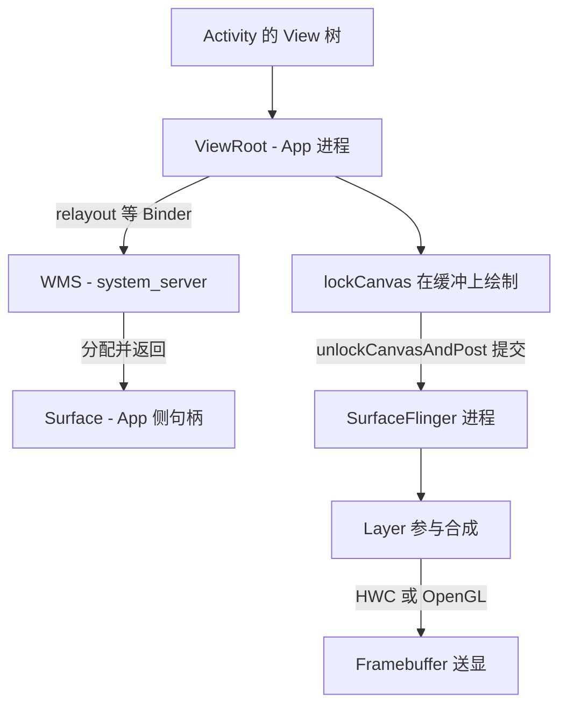
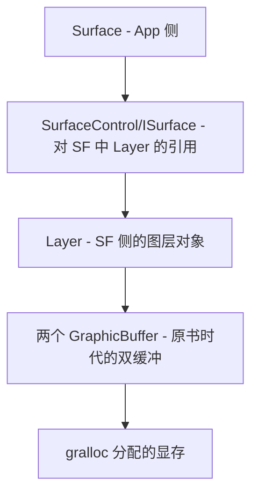

本篇对应原书第 8 章。原书围绕三个问题展开:**Activity 的 UI 是如何画到屏幕上的?Surface 从哪里来?SurfaceFlinger 如何合成图层?**沿途分析 ViewRoot、WMS 的角色分工、GraphicBuffer 的跨进程传递,以及 Layer/LayerBuffer 的处理,并附拓展思考。基于 Android 2.2/2.3(早于 Project Butter,尚无系统的 VSYNC 模型),文中代码为概念化改写,并在末尾对现代演进做大幅比对展开——这一领域是十年间变化最大的。

## 7.1 全景:一次绘制要跨过的世界



角色分工(原书的经典总结):

| 角色 | 进程 | 管什么 |
|---|---|---|
| ViewRoot(现 ViewRootImpl) | App | 遍历 View 树、触发绘制、与 WMS 通信 |
| WMS(WindowManagerService) | system_server | 窗口层级/Z 序/动画,以及 Surface 的**分配** |
| Surface | 跨进程对象 | 一块可提交给合成器的图形缓冲(生产端) |
| SurfaceFlinger(SF) | 独立进程 | 消费各窗口提交的缓冲,按 Z 序合成送显 |

**关键认知:App 只管往自己的 Surface 里画,SF 只管把所有 Surface 按层级合成**——两个世界通过缓冲队列衔接,互不阻塞。

## 7.2 Surface 从哪里来:ViewRoot 与 WMS 的交互

Activity 启动后,`ViewRoot` 被 attach 到 DecorView,第一件事是 `setView`,其中触发 `performTraversals`,向 WMS 发起关键调用:

```java
// ViewRootImpl(概念化)
public void performTraversals() {
    // 向 WMS 申请窗口布局:宽高/可见性等
    relayoutWindow(params, viewVisibility, insetsPadding);
    // relayoutResult 里带回了 WMS 侧创建的 Surface!
    ...
    // Surface 就绪后才能依次进行
    performMeasure(childWidth, childHeight);
    performLayout();
    performDraw();          // draw 阶段拿到 Surface 的 Canvas 作画
}

private int relayoutWindow(...) {
    int[] surfaceChanged = ...;
    // IWindowSession 是 App 与 WMS 之间的 Binder 通道
    int result = mWindowSession.relayout(mWindow, mWindowAttributes,
            requestedWidth, requestedHeight, ..., mSurface);
    // 注意:mSurface 是"传引用"进来被 WMS 填充的 —— Surface 本体在 WMS 侧创建
}
```

**Surface 由 WMS 分配**(原书时代):WMS 在自己的进程里为窗口创建 Surface(内部即与 SF 建立的连接),再通过 relayout 结果写回 App 侧的 Surface 对象。App 侧 Surface 只是一个"跨进程的把手",真正的缓冲在 SF 的管辖之下。这个"谁分配谁所有"的关系在 Android 11 之后被 BLAST 模型重构(见 7.9)。

### WMS 的管理对象:WindowState 与 Z 序

relayout 只是 App 与 WMS 交互的一角。WMS 内部为每个窗口维护一个 **WindowState**,持有:

- **Z 序**:窗口叠放顺序。原书时代的排序键是"窗口类型分层(Application/Sub-Panel/System/Toast……)+ token 顺序",App 窗口按 token 归属 Activity;这一"层内排序"模型沿用至今(现代实现为 SurfaceFlinger 里的 Layer 树,WMS 通过 SurfaceControl 事务下发层级关系)
- **窗口动画**:进入/退出/旋转动画由 WMS 统一驱动,动画期间本质是每帧改 Layer 的变换矩阵
- **可见性仲裁**:一个窗口最终"是否上屏"由 WMS 决定——它掌握所有窗口的 SurfaceControl,可以整体隐藏某个 App 的窗口而不惊动 App

**App 画得再快,WMS 不给层可见就上不了屏**;反之 SF 只认 Layer 树,不知道窗口/Activity 为何物——三层(WMS 管"谁在哪"、SF 管"怎么合"、App 管"画什么")各司其职,是理解一切显示问题的基础。

## 7.3 Surface 的本质:GraphicBuffer 的生产端

Surface 的内部结构(概念化):



- **GraphicBuffer**:一块图形缓冲,由 **gralloc(Graphics Allocator, 图形分配器)** HAL 分配,可以映射给多个进程
- **双缓冲**:原书时代每个 Surface 配两个 buffer——front 给 SF 合成显示,back 给 App 画;`lockCanvas` 取 back,`unlockCanvasAndPost` 交换
- **fd 跨进程**:buffer 的 handle 包在 Parcel 里传给 SF(Parcel 的 writeFileDescriptor 会让 Binder 驱动把 fd 翻译进目标进程),SF 把同一块物理显存映射进自己进程——**像素数据从不拷贝**

App 侧的使用节奏:

```java
Canvas canvas = surface.lockCanvas(dirtyRect); // 拿 back buffer
view.draw(canvas);                             // View 树画上去
surface.unlockCanvasAndPost(canvas);           // 提交,前后交换
```

进到 Native 后,`lockCanvas` 做三件事:dequeue 一块 back buffer、按 buffer 的 stride 构造 Skia 的 SkCanvas、锁住 dirty 区域;`unlockCanvasAndPost` 则完成绘制内容 flush、把 buffer post 给 SF、唤醒合成。**App 与 SF 之间对同一块 buffer 的交替持有**,就是双缓冲的全部秘密。软件绘制时代(Skia 画进内存)如此,硬件加速后变成录 DisplayList、由 GPU 渲染进 GraphicBuffer,提交动作不变。

## 7.4 SurfaceFlinger:合成的发动机

SF 是独立进程(`surfaceflinger` 服务由 init 启动),主循环(概念化):

```cpp
bool SurfaceFlinger::threadLoop() {
    waitForEvent();          // 原书时代:无 VSYNC 模型,等各 Layer 的新 buffer
    // 1. 收割:检查各 Layer 有没有 post 新 buffer(pageflip)
    handlePageFlip();
    // 2. 合成:把所有可见 Layer 按需绘制
    handleRepaint();
    // 3. 显示:把合成结果送 framebuffer
    postFramebuffer();
    return true;
}
```

原书时代(2.2/2.3)的两个历史特征:

- **没有统一的 VSYNC 节拍**:App 画完就 post,SF 收到就合成,显示端按自己的刷新率取帧——三方面节拍不一致,导致画面撕裂与"掉帧看不到"等问题。Android 4.1(Project Butter)才把 VSYNC 引入全链路
- **合成路径**:早期以 OpenGL ES 把各 Layer 作为纹理混合到 framebuffer;`LayerBuffer` 类型的图层(视频/相机)可走 **Overlay**(显示控制器专用图层)直送,不占 GPU

### Layer 家族

| Layer 类型 | 用途 |
|---|---|
| Layer | 普通窗口的图层(有 pixel buffer) |
| LayerBuffer | 视频/相机等外部缓冲源(支持 overlay) |
| LayerDim | 半透明遮罩 |
| LayerBlur | 模糊效果(成本高,很快被移除) |

## 7.5 撕裂、双缓冲与三缓冲

- **撕裂(tearing)**:单缓冲下,GPU/2D 引擎还在写,扫描线已经在读,画面上下两截不一致
- **双缓冲(double buffering)**:画与显分离,flip 原子交换,消灭撕裂;但"画完才能显、显完才能画"在帧耗时接近刷新周期时会卡顿放大
- **三缓冲**:再加一级缓冲,画/显之间有弹性空间,偶发慢帧不至于立刻丢帧(Android 4.1 引入,配合 VSYNC 模型)

原书在 2.3 时代讨论了双缓冲的代价与 EGL 的 swap 行为;现代默认三缓冲由 BufferQueue 管理,思路一脉相承。

## 7.6 ViewRoot:View 体系与 Surface 的桥

ViewRoot(现名 ViewRootImpl)双重身份:

1. **View 树的根**:实现 ViewParent,驱动 measure/layout/draw 三部曲;`performTraversals` 是整个 UI 体系的总调度(调度时机由其 Handler 消息驱动)
2. **窗口的代理人**:持有 IWindowSession(Binder)与 WMS 打交道;输入事件、窗口尺寸变化等也经它分发

原书强调的链路:View 的 `invalidate()` → 沿 ViewParent 上行到 ViewRoot → `scheduleTraversals`(排消息)→ `performTraversals` → draw 用 `lockCanvas` 进 Surface。**View 树本身不持有 Surface,只有 ViewRoot 持有**——这也解释了为什么 SurfaceView 要"在 View 树上挖洞"另配独立 Surface。

## 7.7 拓展思考:数据传输控制对象与 LayerBuffer

原书深挖的两处:

- **buffer 的传输控制**:buffer 在 App↔SF 间流转需要状态机(free/dequeued/queued/ acquired),谁持有着、谁可以写,这套记账在 4.0 后抽象为 **BufferQueue**(dequeue/queue/requestBuffer/acquire/release);而写侧与显侧的同步靠 **fence**(内核级同步原语,GPU/CPU/显示控制器各自的完成信号)——这两个机制是现代图形栈的地基
- **LayerBuffer**:为视频/相机设计,buffer 来源是外部(解码器/摄像头 HAL),支持 Overlay 直通;今天演化为 SurfaceControl 的 BufferStateLayer/ExternalTexture,摄像头预览仍走这个思路

## 7.8 VSYNC 前夜的问题清单

原书时代用户可感知、工程师难解的一串问题,成为后来演进的清单:滑动掉帧不可测(App/SF 节拍脱钩)、动画不跟手、撕裂、GPU 与 CPU 串行等待。解决它们的事件序列:4.1 VSYNC+Choreographer+三缓冲 → 4.3 fence 全面化 → 5.0 RenderThread → 7.0 Vulkan → 12 BLASTBufferQueue(见下节)。

## 7.9 新技术更新(比对展开)

| 维度 | 原书时代(Android 2.3) | 现在(Android 11~15+) |
|---|---|---|
| 帧调度 | 无统一节拍 | VSYNC 贯穿,Choreographer 编排 input/animation/draw |
| 缓冲模型 | 双缓冲 + 原子交换 | BufferQueue 三缓冲 + fence;BLAST(Android 12)事务化提交 |
| Surface 分配 | WMS 创建、relayout 写回 | App 侧 SurfaceControl + BLASTBufferQueue,自持 buffer |
| 绘制执行 | UI 线程即时画 Canvas | RenderThread 异步 + DisplayList + 硬件加速(默认) |
| 渲染 API | Canvas/OpenGL ES | Skia(Vulkan 后端)统一渲染;Vulkan API 开放 |
| SF 合成 | OpenGL 纹理混合 | CompositionEngine 前后端分离;HWC3(AIDL) |
| 观测 | 无 | Perfetto FrameTimeline(jank 归因)、WinScope、GFXInfo |
| 多屏 | 单屏 | 折叠/副屏/虚拟屏,Layer 树容器化,刷新率无缝切换 |

分项展开:

### 7.9.1 Project Butter(Android 4.1):VSYNC 成为系统心跳

三件事:**VSYNC 信号分发到所有参与者**(App 的 Choreographer、SF、动画系统);**Choreographer** 按 VSYNC 编排每帧工作(input → animation → traversal,一帧内流水并行);**三缓冲**。从此"16.6ms 一帧"成为全民常识,jank 从玄学变成可测量指标。原书时代的 SF `waitForEvent` 演化为基于 DispSync 的 VSYNC 模型(App 与 SF 各拿偏移过的心跳)。

### 7.9.2 RenderThread 与硬件加速(Android 5.0)

绘制从 UI 线程剥离:UI 线程遍历 View 树生成 **DisplayList**(绘制指令序列),**RenderThread** 异步回放提交 GPU;动画可以只在 RenderThread 重放已录制的 DisplayList(不占 UI 线程)。Canvas 全部走硬件加速(Skia),软件绘制退居兼容。ViewRootImpl 的 performDraw 从"现场画"变成"录指令 + 交给 RenderThread"。

### 7.9.3 BLASTBufferQueue(Android 12):Surface 模型重构

原书链路"WMS 分配 Surface、App 经 BufferQueue 提交给 SF"在 12 被重构:**BufferQueue 搬进 App 进程**,App 自己 dequeue/queue buffer,与每帧的几何属性(位置/裁剪/透明度)打包成**事务(Transaction)**原子提交给 SF——一次 IPC 携带 buffer+状态,且支持多 buffer 的原子更新。WMS 不再插手每个窗口的 buffer 中转,层级管理与缓冲管线解耦。**Surface 终于回到"App 自持生产端"模型**,原书分析的"WMS 填充 Surface"成为历史。

### 7.9.4 SurfaceFlinger 的架构化重构(Android 11~13)

SF 主循环重写为**事件驱动**(MessageQueue+VSYNC),图层管理拆出前端(LayerLifecycle/LayerFE,接收事务与生命周期)与后端(Output/CompositionEngine,按显示组织合成);**Layer 类型收敛**为 BufferStateLayer(buffer+事务型,App 窗口)、BufferQueueLayer(兼容旧路径)与 EffectLayer(纯色/阴影)。HWC 接口从 HIDL 2.x 演进到 **AIDL composer3**(Android 13),刷新率切换做到无缝(同帧切换模式)。多窗口/折叠屏/虚拟屏的复杂层级由 Layer 树的"容器节点"表达——原书时代 Layer 的 Z 序表,如今是一棵可动态重组的树。

### 7.9.5 观测工具链

**FrameTimeline**(Android 12+):每帧从产生到上屏的完整时间线,Perfetto 里直接标注 jank 的责任方(App 慢/排队晚/SF 慢/显示晚)——原书时代"掉帧全靠猜"彻底终结。另有 `adb shell dumpsys SurfaceFlinger`、WinScope(窗口/SF 事务回放)、GPU Inspector。学习建议:先读原书建立"生产-合成"两段式心智,再用 FrameTimeline 对号现代链路。
