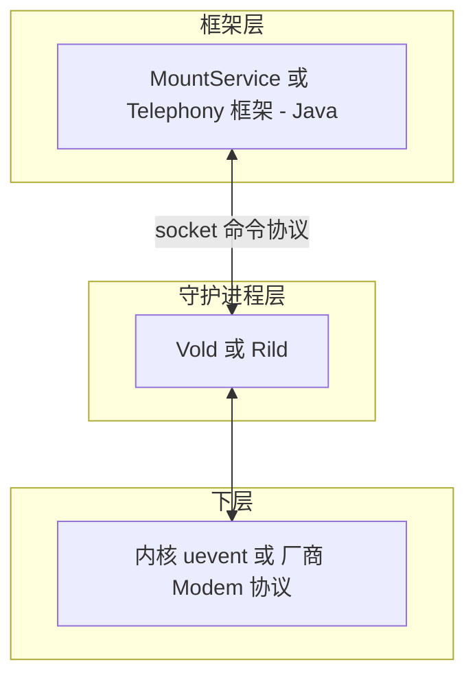
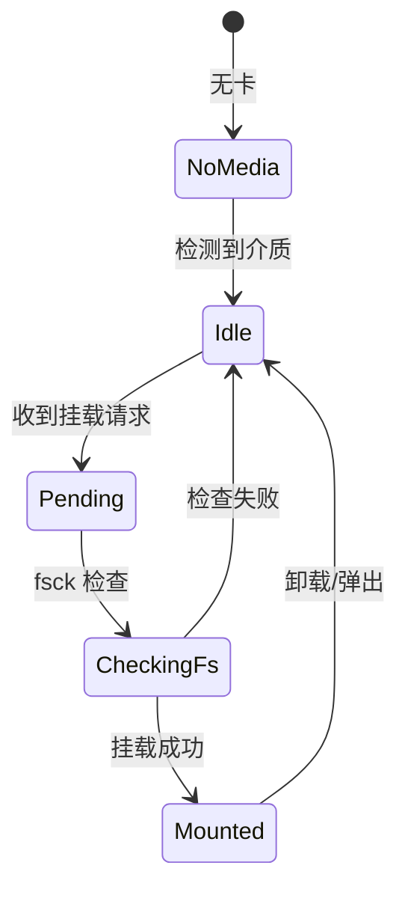
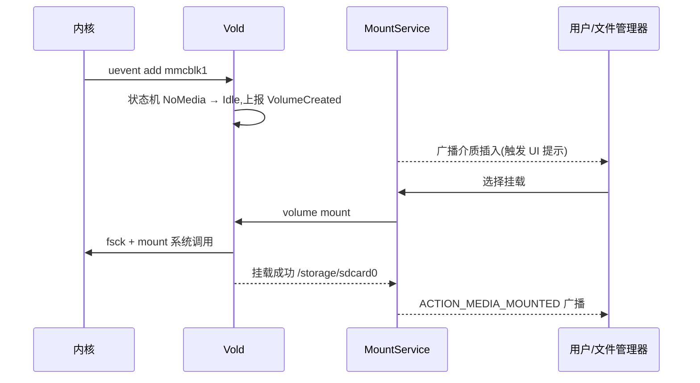
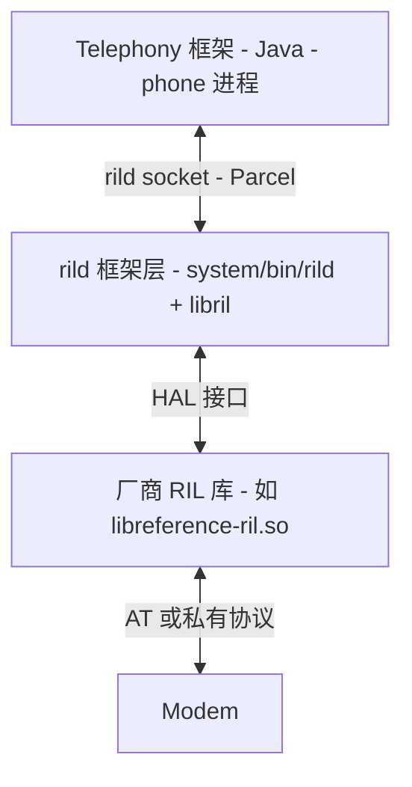

本篇对应原书第 9 章,分析两个 Native 守护进程:**Vold**(Volume Daemon, 存储管理)与 **Rild**(Radio Interface Layer Daemon, 射频接口层守护进程)。原书选它们的原因:两者都是"内核/硬件 ↔ 框架服务"的中转站,一个是 Netlink 事件驱动的样本,一个是"框架 + 厂商私有实现"分层的样本。文中代码为概念化改写,并在末尾对现代演进做比对展开。

## 8.1 共性架构:承上启下的 Native 守护进程



设计要点:

- 框架层只面对**稳定的抽象命令**,硬件/内核差异封在守护进程内
- 守护进程以 root 运行(要 mount、要碰私有设备),但暴露面只有一个本地 socket——权限收口的天然屏障
- 事件**双向流动**:下层事件上报框架,框架命令下发执行

## 8.2 Vold 的模块组成

原书按"三驾马车 + 命令层"拆解 Vold 源码:

| 模块 | 职责 |
|---|---|
| NetlinkManager | 监听内核 uevent(设备插拔),分发给 VolumeManager |
| VolumeManager | 管理所有 Volume 对象,执行挂载/卸载/格式化的主体逻辑 |
| DirectVolume/Volume | 一个可插拔存储卷的状态机 |
| CommandListener | 对框架侧的 socket 服务端,解析文本命令、回调通知 |

### Netlink:接收内核事件

```cpp
// 概念化
// Vold 创建 NETLINK_KOBJECT_UEVENT 类型的 socket 并监听
mSock = socket(PF_NETLINK, SOCK_DGRAM, NETLINK_KOBJECT_UEVENT);
bind(mSock, (sockaddr*)&nladdr, sizeof(nladdr));
// 有数据可读时,uevent 是一行式的 key=value 文本:
//   add@/devices/.../mmcblk1
//   ACTION=add  SUBSYSTEM=block  DEVNAME=mmcblk1 ...
void NetlinkHandler::onEvent(NetlinkEvent* evt) {
    if (evt->getAction() == "add" && evt->subsystem == "block")
        VolumeManager::Instance()->handleBlockEvent(evt);
}
```

### Volume 状态机



每个状态迁移都通过 socket 通知框架,框架(MountService)再广播给 UI/应用("SD 卡已挂载")。

### CommandListener:文本命令协议

框架→Vold 的命令是**空格分隔的明文**,典型命令族:

```text
volume list                     # 列出所有卷
volume mount <path>             # 挂载
volume unmount <path> [force]   # 卸载(force 会杀占用进程)
volume format <path>            # 格式化
asec list / asec create ...     # App2SD 的安全容器(见下)
```

响应也是文本(`200 0 ...` 成功 / `40x` 各种失败)。原书评价:协议简单到可以 telnet 调试,代价是**无鉴权、无类型校验**——安全性完全依赖 socket 文件权限,这是后来被 AIDL + SELinux 全面替换的原因之一。

### 挂载执行细节

`Volume::mountVol` 的关键步骤(概念化):识别分区表 → 对 vfat 执行 fsck(dosfsck)→ `mount()` 系统调用挂到 `/mnt/sdcard`(或先挂再移动到最终位置)→ 上报状态。**拓展思考:App2SD/asec**——应用装进 SD 卡的加密镜像(asec 容器),Vold 负责 create/mount/unmount 容器、回环设备(loop)与解密;这套机制是后来 Adoptable Storage 的前身。

## 8.3 存储情景全链路:插入 SD 卡到看到文件



理解这条链路后再看现代 FBE/Scoped Storage 的密钥挂载,骨架完全同构:事件来自内核,执行者是 Vold,决策与广播在框架。

## 8.4 Rild 的分层架构

电话功能的特殊性:Modem(基带)厂商协议五花八门(AT 命令、QMUX……),必须隔离。原书把 Rild 拆成三层:



- **rild 框架层**:实现 socket 服务端、请求-响应配对、事件循环、超时管理;**不含任何 Modem 知识**
- **厂商 RIL 库**:实现 RIL_Init,拿到一组回调函数指针(`RIL_onRequestComplete`/`RIL_onUnsolicited`),负责把标准请求翻译成 Modem 协议
- 参考实现 libreference-ril 用 AT 命令,读串口、维护 AT reader 线程——厂商照此骨架替换为自己的协议栈

### 接口:两类消息

| 类型 | 方向 | 例子 |
|---|---|---|
| RIL_REQUEST_*(请求) | 框架 → Modem | GET_SIM_STATUS、DIAL、SEND_SMS、DATA_CALL_SETUP |
| RIL_UNSOL_*(主动上报) | Modem → 框架 | RESPONSE_CALL_STATE_CHANGED、RESPONSE_NEW_SMS、SIGNAL_STRENGTH |

序列化用 Parcel(与 Binder 的 Parcel 同一套机制),请求带 serial number,响应按 serial 配对;unsolicited 消息无编号直接上报。

### 请求的生命周期(框架侧代码概念化)

```java
// RIL.java(概念化)
public void dial(String address, int clirMode, Message result) {
    // 1. 分配 serial number,登记"等待表":serial → result
    RILRequest rr = RILRequest.obtain(RIL_REQUEST_DIAL, result);
    // 2. 参数逐个写进 Parcel
    rr.mParcel.writeString(address);
    rr.mParcel.writeInt(clirMode);
    // 3. 发送:唤醒发送线程把 Parcel 写到 rild socket
    send(rr);
}
// 接收线程读到响应时:
void processResponse(Parcel p) {
    int serial = p.readInt();             // 找回对应的请求
    RILRequest rr = findAndRemoveRequest(serial);
    if (isSolicited) {
        // 请求响应:成功时把返回值塞进 Message,交给发起者的 Handler
        rr.mResult.sendToTarget();
    } else {
        // 主动上报:按 UNSOL 类型分发到注册的监听者(状态机)
        processUnsolicited(p);
    }
}
```

**上表+异步回调**的模式决定了 Telephony 框架的形态:一切请求立即返回,结果经 Handler 消息回到调用方;Modem 侧状态变化(来电、信号)则由 unsolicited 消息驱动各 Tracker 状态机迁移,最终以广播/回调到达 App。理解这两个消息族,电话栈的任何链路都能对号入座。

### 框架侧的对接

Telephony 框架里的 `RIL.java`(com.android.internal.telephony)是 rild socket 的 Java 客户端:发请求、收响应,按 request/response 类型分发给电话域的各个状态机(CallTracker、DataConnectionTracker 等)。原书完整走了一条"**拨打电话**"链路:dial → RIL_REQUEST_DIAL → ATD → UNSOL CALL_STATE_CHANGED → 状态机刷新 UI。

## 8.5 拓展思考:Rild 与 Phone 的设计优化

原书指出的痛点:呼入/呼出链路要经过 Modem→Rild→socket→RIL.java→Tracker→UI 多级转发,每级一个线程切换与序列化,电话这种时延敏感业务在低配硬件上卡顿明显。优化方向:减少上报层级(状态去抖、合并上报)、把高频状态变化的处理下推到 Native、独立电话音频通路(后来确实演化出独立的 audio 路由策略与 modem 侧音频)。这个问题意识在今天的 satellite/IMS 时延优化中依然成立。

## 8.6 新技术更新(比对展开)

### 存储:Vold 的现代化

| 维度 | 原书时代(Android 2.3) | 现在(Android 11~15+) |
|---|---|---|
| 对框架接口 | 明文 socket 命令 | AIDL `IVold` Binder 接口,强类型+SELinux 鉴权 |
| 外置存储 | SD 卡 vfat,全局可写 | Adoptable Storage(内嵌加密)或只读传输;Scoped Storage 按应用隔离视图 |
| 加密 | 无 | FBE(按文件加密)默认;metadata 加密;密钥由 Vold 经 fscrypt 下发 |
| 挂载视图 | /mnt/sdcard 单点 | /storage/xxxx-xxxx 多卷;FUSE/sdcardfs 呈现应用沙箱视图 |
| asec/App2SD | asec 容器 | 已废弃,由 Adoptable Storage 取代 |
| 事件源 | Netlink uevent | 保留,节点创建移交 ueventd/init |

展开:**FBE(File-Based Encryption, Android 7.0 引入、10 起默认)** 把"整盘一把钥匙"变成"每文件按用户密钥加密",Vold 的核心工作从 mount 文件系统变成**密钥管理**——设备解锁时调用 `IVold` .unlockUserKey,把密钥装进 fscrypt;Scoped Storage(Android 10/11)则把 /storage 下的共享树改成按应用过滤的 FUSE 视图,App2SD 时代的"全局公共目录"不复存在。

### 电话:从 socket RIL 到 AIDL Radio

| 维度 | 原书时代(Android 2.3) | 现在(Android 11~15+) |
|---|---|---|
| 框架↔守护 | rild socket + Parcel 私有协议 | HIDL IRadio(Android 8)→ Stable AIDL IRadio(11+) |
| 守护与厂商库 | rild + libril + vendor so 同进程 | 框架侧 rild 与 vendor HAL 分进程,Treble 边界明确 |
| 协议 | AT 命令(参考实现) | 厂商私有(QMI/QRTR 经内核),AT 仅调试保留 |
| 数据通路 | DATA_CALL_SETUP 命令式 | DataNetworkController 状态机化(Android 13) |
| 新域 | 无 IMS/eSIM | IMS(VoLTE/VoWiFi)、eSIM LPA、卫星通信(14/15+)、多 SIM/DSDS |

展开:Treble 之后 IRadio 按"域"拆分(network/messaging/sim/voice/data/modem 各自独立接口),版本化且可独立升级;**IMS 与 eSIM** 进入框架后,Rild 的"Modem 中转站"之外又多了 IP 多媒体与 Profile 管理两条新链路;Android 14/15 引入的卫星消息/卫星 SOS 是 unsolicited 上报模型的新用例——原书的 RIL_REQUEST/RIL_UNSOL 二分法至今是理解电话栈的钥匙。

### 共同的架构趋势

两个进程的演进方向一致:**明文 socket → 类型化 Binder(AIDL)、守护进程拆分为框架侧与 vendor 侧、决策上收框架/下沉内核各归其位**。原书"Native 守护进程做硬件隔离层"的思想未变,变的是接口的工程化程度与安全边界。
