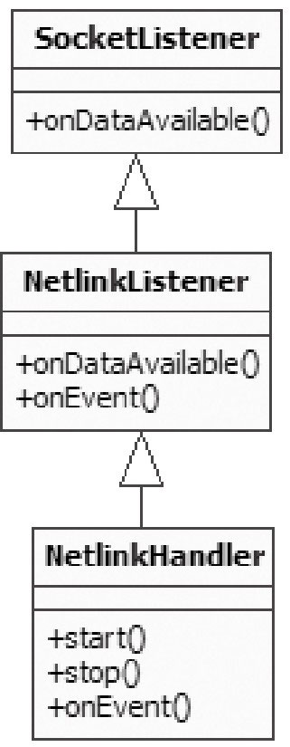
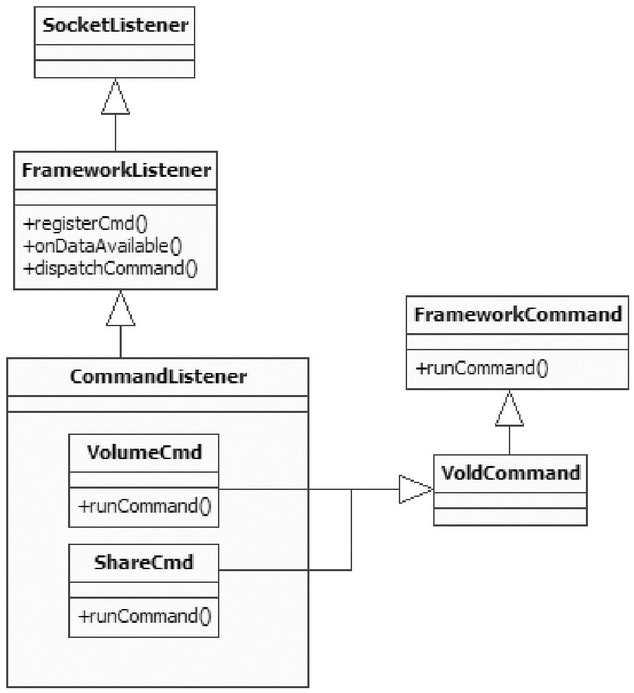
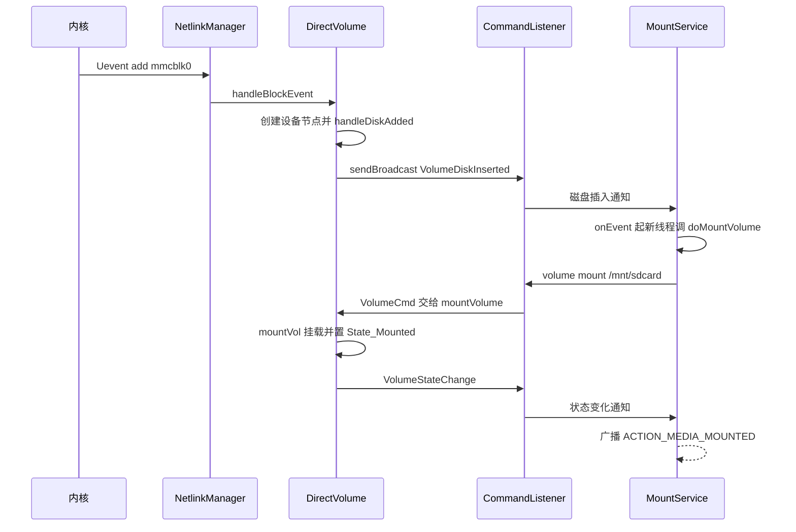
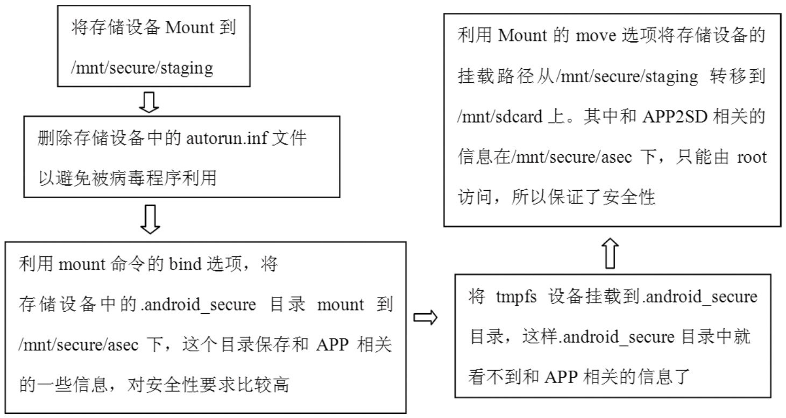
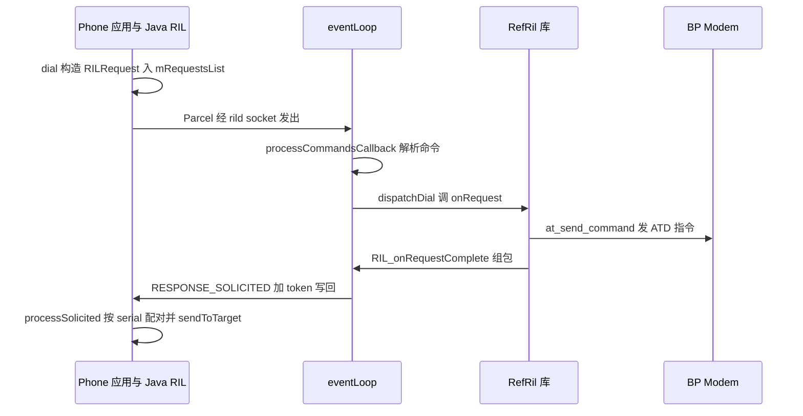

本篇对应原书第 9 章「深入理解 Vold 和 Rild」。原书基于 Android 2.2/2.3 源码，挑选了两个典型的系统守护进程（daemon）进行分析：**Vold（Volume Daemon，存储守护进程）是 Android 外部存储系统的管控中心**，负责接收内核的设备事件、执行挂载/卸载/格式化；**Rild 是 AP（Application Processor，应用处理器）与 BP（Baseband Processor，基带处理器）在软件层面通信的中枢**，拨打电话、收发短信都要经它转发。两者代码结构都不复杂，价值在于骨架典型：一个示范「Netlink 监听内核事件 + socket 接收框架命令」，一个示范「通用框架 + 厂商私有库」的分层隔离。本章主线一句话：Vold 用 NetlinkManager 收内核 Uevent、VolumeManager 管存储卷、CommandListener 对接 MountService；Rild 用 eventLoop 事件框架 + 动态加载的 reference-ril 厂商库，以异步请求/处理的方式打通 Java 层 Phone 与 Modem。

> 版本注意：原书成书于 2011 年（Android 2.2/2.3）。Vold 与 Rild 均已多轮重写（Vold 的 VolumeManager/FsManager 演进、存储 daemon 化；Rild 的 HRil/多卡与 oem hook），但「Netlink 监听内核事件 + socket 接收框架命令」的结构仍可对照，差异见文末演进备注。

> 摘编声明：文中代码为原书代码的摘编版——保留主干、省略日志与无关分支，类名、函数名忠于原书原文。

## 1.1 概述：两个守护进程与框架侧的交互

前几章分析的 Audio、Surface 系统结构庞大，本章换两个小巧的 Native 守护进程。Vold 是 **Volume Daemon 的缩写**，运行于用户空间底层；Rild 负责射频通信。与它们交互的框架侧模块分别是 MountService 和 Phone：

- **MountService 与 Vold 双向交互**。一方面接收来自 Vold 的消息——应用程序常监听的 ACTION_MEDIA_MOUNTED、ACTION_MEDIA_EJECT 等广播，就是 MountService 根据 Vold 上报的信息触发的；另一方面向 Vold 发送控制命令，例如把 SD 卡挂载为磁盘驱动器的操作，就是 MountService 下发命令给 Vold 执行的。
- **Phone 与 Rild 交互**。Phone 是一个相当复杂的 Java 应用，拨打电话时需要发送对应的命令给 Rild 执行。

本章涉及的源码：Vold 侧是 system/vold/ 下的 Main.cpp、NetlinkManager.cpp、NetlinkHandler.cpp、VolumeManager.cpp、DirectVolume.cpp、Volume.cpp，system/core/libsysutils/src/ 下的 NetlinkListener.cpp、SocketListener.cpp、FrameworkListener.cpp，以及 frameworks/base/services 下的 MountService.java；Rild 侧是 hardware/ril/ 下的 rild/Rild.c、libril/ 的 Ril.cpp 与 Ril_event.h、reference-ril/ 的 Reference_ril.c 与 Atchannle.c、include/telephony/ 的 Ril.h，以及框架侧 PhoneFactory.java、RIL.java 等。

值得先点破的一个共性：**Vold 与 MountService（位于 system_server 进程）之间、Rild 与 Phone 之间，都没有使用 Binder，而是直接用本地 socket 做 IPC（Interprocess Communication，进程间通信）**。用 socket 实现一套命令协议比 Binder 简单得多，代码量和类的派生关系都清爽不少——这是两个守护进程在架构上共同的选择，也是后文反复出现的骨架。

## 1.2 Netlink 与 Uevent：Vold 的事件源

分析 Vold 代码前，先补上它依赖的两个 Linux 机制：Netlink 和 Uevent（User Space Event）。

**Netlink 是 Linux 系统中用户空间进程和内核通信的一种机制**：用户空间进程可以通过它接收来自内核的信息（例如 USB 或 SD 卡的插拔消息），也可以通过它向内核发送控制命令。Linux 并没有为 Netlink 单独设计一套系统调用，而是**复用了 Socket 的操作接口**，只在创建 socket 时有特殊之处（地址簇为 PF_NETLINK）。

**Uevent 则是一串字符串，内容描述发生了什么事情**。SD 卡插入手机后，内核检测到设备插入，会通过 Netlink 发送一条消息给 Vold，这条消息就是 Uevent，其中 U 代表 Userspace（用户空间）。下面是原书作者 HTC G7 手机上 SD 卡插入时 Vold 截获的 Uevent（// 与 /* */ 为原书添加的注释）：

```text
[--> SD 卡插入的 Uevent 消息，disk 部分]
add@/devices/platform/msm_sdcc.2/mmc_host/mmc1/mmc1:c9f2/block/mmcblk0
ACTION=add       // add 表示设备插入，另外还有 remove 和 change 等动作
// DEVPATH 表示该设备位于 /sys 目录中的设备路径
DEVPATH=/devices/platform/msm_sdcc.2/mmc_host/mmc1/mmc1:c9f2/block/mmcblk0
// SUBSYSTEM 表示该设备属于哪一类设备，block 为块设备，磁盘也属于这一类
SUBSYSTEM=block
MAJOR=179        // MAJOR 和 MINOR 分别表示该设备的主次设备号，联合标识一个设备
MINOR=0
DEVNAME=mmcblk0
DEVTYPE=disk     // 设备类型为 disk
NPARTS=3         // 表示该 SD 卡上的分区数，作者的 SD 卡上有三块分区
SEQNUM=1357      // 序号
```

由于 SD 卡上有分区，还会接着收到和分区相关的 Uevent——DEVPATH 多出一段 mmcblk0p1、MINOR 变为 1、DEVTYPE=partition、PARTN=1，其余同上。Uevent 在什么情况下由内核发出？原书总结了两类触发方式：

- **设备变化触发**：设备发生插拔等变化时，内核发送 Uevent。只要 Vold 在此之前已经建立了 Netlink 通信，就能收到。
- **应用层触发**：设备一般在 /sys 对应目录下有一个叫 uevent 的文件，往该文件写入指定数据也会触发内核发送和该设备相关的 Uevent。Vold 启动时正是通过这种方式「补课」——往这些 uevent 文件写数据，促使内核重发一遍事件，这样 Vold 就能拿到启动早于自己的那些设备的当前信息。

Netlink 加 Uevent 的目的只有一个：**让 Vold 随时获悉外部存储系统的信息**。总不能 SD 卡都被拔了，Vold 还一无所知。

## 1.3 Vold 总体结构与 main 函数

有了事件源的概念，先看 Vold 的整体架构（原图 9-1）：


从图中可知三个模块的分工：

- **NetlinkManager（简称 NM）接收来自内核的 uevent 消息**（SD 卡插拔等动作都会引起内核向 NM 发送 uevent），并把消息转发给 VolumeManager。
- **VolumeManager（简称 VM）对消息做对应操作**，再把相关信息通过 CommandListener（简称 CL）发送给 MountService；MountService 根据收到的消息下发处理命令给 VM 进一步处理。例如 SD 卡插入后，VM 把来自 NM 的「DiskInsert」消息发给 MountService，MountService 则发送「Mount」指令给 Vold，指示它挂载这张 SD 卡。
- **CommandListener 内部封装了一个 socket 用于跨进程通信**：它在 Vold 进程中是监听端（服务端），连接端（客户端）是 MountService。它一方面接收来自 MountService 的控制命令（卸载存储卡、格式化存储卡等），另一方面 VM 又通过它向 MountService 发送信息。

注意图 9-1 中 NM 与 CL 之间没有连线——NM 虽然也设置了 CL 对象，但 Vold 的 NM 并不通过 CL 收发消息（1.4 节会看到这一点）。下面看 main 函数，原书在代码中标注了 8 个关键点（①～⑧），分别归入三个模块讨论：

```cpp
[--> Main.cpp::main，摘编]
int main() {
    VolumeManager *vm;
    CommandListener *cl;
    NetlinkManager *nm;

    // 创建文件夹 /dev/block/vold
    mkdir("/dev/block/vold", 0755);

    // ①创建 VolumeManager 对象
    if (!(vm = VolumeManager::Instance())) {
        exit(1);
    };
    // ②创建 NetlinkManager 对象
    if (!(nm = NetlinkManager::Instance())) {
        exit(1);
    };
    // ③创建 CommandListener 对象
    cl = new CommandListener();

    vm->setBroadcaster((SocketListener *) cl);
    nm->setBroadcaster((SocketListener *) cl);
    // ④启动 VM
    if (vm->start()) {
        exit(1);
    }
    // ⑤根据配置文件来初始化 VM
    if (process_config(vm)) {
        exit(1);
    }
    // ⑥启动 NM
    if (nm->start()) {
        exit(1);
    }
    // 通过往 /sys/block 目录下对应的 uevent 文件写 "add\n" 来触发内核发送 Uevent 消息
    coldboot("/sys/block");
    {
        FILE *fp;
        char state[255];
        /*
          Android 支持把手机上的外部存储设备作为磁盘挂载到电脑上。下面的代码查看
          是否打开了磁盘挂载功能，涉及 UMS（USB Mass Storage，USB 大容量存储）
        */
        if ((fp = fopen("/sys/devices/virtual/switch/usb_mass_storage/state", "r"))) {
            if (fgets(state, sizeof(state), fp)) {
                if (!strncmp(state, "online", 6)) {
                    // ⑦VM 通过 CL 向感兴趣的模块（如 MountService）通知 UMS 的状态
                    vm->notifyUmsConnected(true);
                } else {
                    vm->notifyUmsConnected(false);
                }
            }
            ......
            fclose(fp);
        }
    ......
    }
    // ⑧启动 CL
    if (cl->startListener()) {
        exit(1);
    }
    // 无限循环
    while(1) {
        sleep(1000);
    }
    exit(0);
}
```

main 的骨架一目了然：创建 VM、NM、CL 三个对象，把 CL 作为 broadcaster 设置给 VM 和 NM，然后按 VM → process_config → NM → coldboot → CL 的顺序启动，最后 sleep 常驻。coldboot 就是 1.2 节说的「应用层触发」：主动补齐启动前已发生的设备事件。下面依次进入三个模块。

## 1.4 NetlinkManager 模块：接收内核 Uevent

Vold 使用 NM 的流程只有三步：调用 Instance 创建 NM 对象（单例模式）；调用 setBroadcaster 设置 CL 对象（一行赋值 `mBroadcaster = sl`）；调用 start 启动。关键在 start。

### 1.4.1 start：创建 Netlink socket

NM 用 Netlink 和内核通信，具体做法是创建一个 PF_NETLINK 地址簇的 socket：

```cpp
[--> NetlinkManager.cpp::start，摘编]
int NetlinkManager::start() {
    // PF_NETLINK 使用的 socket 地址结构是 sockaddr_nl，而不是一般的 sockaddr_in
    struct sockaddr_nl nladdr;
    int sz = 64 * 1024;

    memset(&nladdr, 0, sizeof(nladdr));
    nladdr.nl_family = AF_NETLINK;
    nladdr.nl_pid = getpid();       // 设置自己的进程 pid
    nladdr.nl_groups = 0xffffffff;
    /*
      创建 PF_NETLINK 地址簇的 socket，目前只支持 SOCK_DGRAM 类型，第三个参数
      NETLINK_KOBJECT_UEVENT 表示要接收内核的 Uevent 事件
    */
    if ((mSock = socket(PF_NETLINK, SOCK_DGRAM, NETLINK_KOBJECT_UEVENT)) < 0) {
        return -1;
    }
    // 设置 socket 接收缓冲区大小，然后必须对该 socket 执行 bind 操作
    if (setsockopt(mSock, SOL_SOCKET, SO_RCVBUFFORCE, &sz, sizeof(sz)) < 0) {
        return -1;
    }
    if (bind(mSock, (struct sockaddr *) &nladdr, sizeof(nladdr)) < 0) {
        return -1;
    }
    // 创建一个 NetlinkHandler 对象，并把创建好的 socket 句柄传给它
    mHandler = new NetlinkHandler(mSock);

    // 调用 NetlinkHandler 对象的 start
    if (mHandler->start()) {
        return -1;
    }
    return 0;
}
```

start 分两步：创建 PF_NETLINK socket 并 bind（此后内核的 Uevent 就会到达这个 socket）；创建 NetlinkHandler 并启动它——**后续工作全部由 NetlinkHandler 完成**。

### 1.4.2 NetlinkHandler 的派生关系与工作线程

在代码结构简单的 Vold 程序中，NetlinkHandler（简称 NLH）有一个相对不简单的派生关系（原图 9-2）：



三个构造函数一条链：NetlinkHandler 把 socket 交给 NetlinkListener，后者再以 `listen = false` 交给 SocketListener：

```cpp
[--> NetlinkListener.cpp / SocketListener.cpp / NetlinkHandler.cpp]
NetlinkListener::NetlinkListener(int socket) :
                SocketListener(socket, false) {
    // 调用基类 SocketListener 的构造函数，第二个参数为 false
}

SocketListener::SocketListener(int socketFd, bool listen) {
    mListen = listen;       // 这个参数是 false
    mSocketName = NULL;
    mSock = socketFd;       // 保存和内核通信的 socket 描述符
    // 初始化一个 mutex，看来会有多个线程存在
    pthread_mutex_init(&mClientsLock, NULL);
    /*
      SocketClientCollection 的声明如下，它是一个列表容器
      typedef android::List<SocketClient *> SocketClientCollection
      其中 SocketClient 代表和 socket 服务端通信的客户端
    */
    mClients = new SocketClientCollection();
}

NetlinkHandler::NetlinkHandler(int listenerSocket) :
                NetlinkListener(listenerSocket) {
    // 调用基类 NetlinkListener 的构造函数
    // 注意传入的参数是和内核通信的 socket 句柄
}
```

NLH 的 start 只是转调基类的 startListener（`return this->startListener();`）。startListener 的关键差异由构造时传入的 mListen 决定：

```cpp
[--> SocketListener.cpp::startListener，摘编]
int SocketListener::startListener() {

    if (!mSocketName && mSock == -1) {
        errno = EINVAL;
        return -1;
    } else if (mSocketName) {
        // 按名字从 init 进程取回预创建的 socket（CL 走这个分支）
        if ((mSock = android_get_control_socket(mSocketName)) < 0) {
            return -1;
        }
    }
    /*
      还记得构造 NLH 时的参数吗？mListen 为 false，这表明 NLH 不是监听（listen）端。
      这里为了代码和操作的统一，用 mSock 做参数构造了一个 SocketClient 对象，
      并加入到 mClients 列表中，但这个 SocketClient 并不是真实客户端的代表
    */
    if (mListen && listen(mSock, 4) < 0) {
        return -1;
    } else if (!mListen)  // 以 mSock 为参数构造 SocketClient 对象，并加入到对应的列表中
        mClients->push_back(new SocketClient(mSock));
    // pipe 系统调用将创建一个匿名管道，mCtrlPipe[0] 读、mCtrlPipe[1] 写
    if (pipe(mCtrlPipe)) {
        return -1;
    }
    // 创建一个工作线程，线程函数是 threadStart
    if (pthread_create(&mThread, NULL, SocketListener::threadStart, this)) {
        return -1;
    }
    return 0;
}
```

startListener 最后创建的工作线程进入 runListener，这是一个标准的多路复用循环：

```cpp
[--> SocketListener.cpp::runListener，摘编]
void SocketListener::runListener() {

    while(1) {
        SocketClientCollection::iterator it;
        fd_set read_fds;
        int rc = 0;
        int max = 0;

        FD_ZERO(&read_fds);

        if (mListen) {           // mListen 为 false，所以不走这个 if 分支
            max = mSock;
            FD_SET(mSock, &read_fds);
        }
        FD_SET(mCtrlPipe[0], &read_fds);
        if (mCtrlPipe[0] > max)
            max = mCtrlPipe[0];
        // 计算 max：select 的第一个参数必须为所监视的描述符集合中最大 fd 加 1
        pthread_mutex_lock(&mClientsLock);
        for (it = mClients->begin(); it != mClients->end(); ++it) {
            FD_SET((*it)->getSocket(), &read_fds);
            if ((*it)->getSocket() > max)
                max = (*it)->getSocket();
        }
        pthread_mutex_unlock(&mClientsLock);

        if ((rc = select(max + 1, &read_fds, NULL, NULL, NULL)) < 0) {
            sleep(1);
            continue;
        } else if (!rc)
            continue;
        // 如果管道可读，表示需要退出工作线程
        if (FD_ISSET(mCtrlPipe[0], &read_fds))
            break;
        if (mListen && FD_ISSET(mSock, &read_fds)) {
            // 如果是 listen 端，mSock 可读表示有客户端 connect 上
            struct sockaddr addr;
            socklen_t alen = sizeof(addr);
            int c;
            // 调用 accept 接受客户端的连接，返回用于和客户端通信的 socket 描述符
            if ((c = accept(mSock, &addr, &alen)) < 0) {
                ......
            }
            pthread_mutex_lock(&mClientsLock);
            // 根据返回的客户端 socket 描述符构造 SocketClient 对象并加入 list
            mClients->push_back(new SocketClient(c));
            pthread_mutex_unlock(&mClientsLock);
        }

        do {
            pthread_mutex_lock(&mClientsLock);
            for (it = mClients->begin(); it != mClients->end(); ++it) {
                int fd = (*it)->getSocket();
                if (FD_ISSET(fd, &read_fds)) {
                    pthread_mutex_unlock(&mClientsLock);
                    /*
                      有数据通过 socket 发送过来，调用 onDataAvailable 进行处理。
                      如果 onDataAvailable 返回 false，则表示需要关闭该连接
                    */
                    if (!onDataAvailable(*it)) {
                        close(fd);
                        // ...... 从列表中移除并销毁
                    }
                    FD_CLR(fd, &read_fds);
                    continue;
                }
            }
            pthread_mutex_unlock(&mClientsLock);
        } while (0);
    }
}
```

runListener 是 SocketListener 家族的公共骨架：select 同时监视控制管道、监听 socket（若有）和所有客户端连接；有数据可读就交给虚函数 onDataAvailable。NLH 与后面 CL 的差别只在于 mListen 的取值——**NLH 不是监听端，它只把与内核通信的那个 socket 包成 SocketClient 放进监视集合**。

### 1.4.3 数据处理：从 onDataAvailable 到 onEvent

收到数据后首先由基类 NetlinkListener 的 onDataAvailable 处理：

```cpp
[--> NetlinkListener.cpp::onDataAvailable]
bool NetlinkListener::onDataAvailable(SocketClient *cli)
{
    int socket = cli->getSocket();
    int count;

    /*
      调用 recv 接收数据，如果接收错误则返回 false，
      这样这个 socket 在上面的工作线程中就会被 close
    */
    if ((count = recv(socket, mBuffer, sizeof(mBuffer), 0)) < 0) {
        return false;
    }
    // new 一个 NetlinkEvent，并调用 decode 来解析接收到的 Uevent 数据
    NetlinkEvent *evt = new NetlinkEvent();
    if (!evt->decode(mBuffer, count)) {
        goto out;
    }
    // 调用 onEvent，并传递 NetlinkEvent 对象
    onEvent(evt);
out:
    delete evt;
    return true;
}
```

decode 把 Uevent 字符串填充成一个 NetlinkEvent 对象（Action 是什么、SUBSYSTEM 是什么等），之后处理时就不用再解析字符串。真正的事件分发由 NLH 自己实现的 onEvent 完成：

```cpp
[--> NetlinkHandler.cpp::onEvent]
void NetlinkHandler::onEvent(NetlinkEvent *evt) {
    VolumeManager *vm = VolumeManager::Instance();
    const char *subsys = evt->getSubsystem();

    if (!subsys) {
        return;
    }

    if (!strcmp(subsys, "block")) {
        vm->handleBlockEvent(evt);      // 调用 VM 的 handleBlockEvent
    } else if (!strcmp(subsys, "switch")) {
        vm->handleSwitchEvent(evt);     // 调用 VM 的 handleSwitchEvent
    } else if (!strcmp(subsys, "battery")) {
        // 这两个事件和外部存储系统没有关系，所以不处理
    } else if (!strcmp(subsys, "power_supply")) {
    }
}
```

NM 模块的职能至此完整：**从内核接收 Uevent 消息，转换成一个 NetlinkEvent 对象，最后调用 VM 的处理函数**。subsystem 为 block（块设备）走 handleBlockEvent，switch 走 handleSwitchEvent（处理 SD 卡挂载为磁盘的通知），battery 与 power_supply 则忽略。

## 1.5 VolumeManager 模块与 DirectVolume：管理外部存储卷

NM 只管收事件，真正管理存储设备的是 VM。本节看 VM 的初始化（单例、process_config）、DirectVolume 的构造，以及 Uevent 如何分发到具体的卷。

### 1.5.1 process_config：解析 vold.fstab

VM 的 Instance 同样是单例，全进程只有一个 VM 对象；而它的 start 函数干脆是空的（`return 0;`），配置工作全部由 main 调用的 process_config 完成：

```cpp
[--> Main.cpp::process_config，摘编]
static int process_config(VolumeManager *vm) {
    FILE *fp;
    char line[255];
    // 读取 /etc/vold.fstab 文件
    if (!(fp = fopen("/etc/vold.fstab", "r"))) {
        return -1;
    }

    while(fgets(line, sizeof(line), fp)) {
        char *next = line;
        char *type, *label, *mount_point;

        if (line[0] == '#' || line[0] == '\0')
            continue;

        // 依次取出 type、label、mount_point 三个字段
        if (!(type = strsep(&next, " \t"))) {
            goto out_syntax;
        }
        if (!(label = strsep(&next, " \t"))) {
            goto out_syntax;
        }
        if (!(mount_point = strsep(&next, " \t"))) {
            goto out_syntax;
        }

        if (!strcmp(type, "dev_mount")) {
            DirectVolume *dv = NULL;
            char *part, *sysfs_path;
            if (!(part = strsep(&next, " \t"))) {
                goto out_syntax;
            }
            if (strcmp(part, "auto") && atoi(part) == 0) {
                goto out_syntax;
            }

            if (!strcmp(part, "auto")) {
                // ①构造一个 DirectVolume 对象（无分区）
                dv = new DirectVolume(vm, label, mount_point, -1);
            } else {
                dv = new DirectVolume(vm, label, mount_point, atoi(part));
            }

            while((sysfs_path = strsep(&next, " \t"))) {
                // ②添加设备路径
                if (dv->addPath(sysfs_path)) {
                    goto out_fail;
                }
            }
            // 为 VolumeManager 对象增加一个 DirectVolume 对象
            vm->addVolume(dv);
        }
    }
    ......
}
```

process_config 的主要功能就是解析 /etc/vold.fstab，作用类似 Linux 的 fstab——设置存储设备的挂载点。作者 G7 手机上这个文件的内容（原图 9-3）：


其中灰色框内一行 dev_mount 配置的含义：sdcard 为 volume 的名字；/mnt/sdcard 表示 mount 的位置；1 表示使用存储卡上的第一个分区（auto 表示没有分区，不少定制 ROM 要求 SD 卡上存在多个分区）；/devices/xxxx 等内容表示 MMC 设备在 sysfs 中的位置。根据这个文件即可构造出一个 DirectVolume 对象（刷的 ROM 不同，vold.fstab 会有较大差异）。

### 1.5.2 DirectVolume：一张存储卡在代码中的代表

**DirectVolume 从 Volume 类派生，可把它看成一张外部存储卡（例如 SD 卡）在代码中的代表**，封装了加载/卸载存储卡、格式化存储卡等操作：

```cpp
[--> DirectVolume.cpp::DirectVolume 与 addPath，摘编]
DirectVolume::DirectVolume(VolumeManager *vm, const char *label,
                            const char *mount_point, int partIdx) :
                      Volume(vm, label, mount_point) {  // 初始化基类
    /*
      注意其中的参数：
      label 为 "sdcard"，mount_point 为 "/mnt/sdcard"，partIdx 为 1
    */
    mPartIdx = partIdx;
    // PathCollection 其实就是一个字符串 list
    mPaths = new PathCollection();
    for (int i = 0; i < MAX_PARTITIONS; i++)
        mPartMinors[i] = -1;
    mPendingPartMap = 0;
    mDiskMajor = -1;   // 存储设备的主设备号
    mDiskMinor = -1;   // 存储设备的次设备号，一个存储设备由主次两个设备号标识
    mDiskNumParts = 0;
    // 设置状态为 NoMedia
    setState(Volume::State_NoMedia);
}

int DirectVolume::addPath(const char *path) {
    mPaths->push_back(strdup(path));
    return 0;
}
```

addPath 把和某个存储卡接口相关的设备路径与这个 DirectVolume 绑定，且该设备路径与 Uevent 中的 DEVPATH 对应——**这样就可以根据 Uevent 的 DEVPATH 找到是哪个存储卡的 DirectVolume 发生了变动**。G7 只有一个存储卡接口，所以 Vold 只有一个 DirectVolume（对应 vold.fstab 最后一个字段可以写多个 sysfs 路径）。

### 1.5.3 handleBlockEvent：Uevent 的分发与处理

回到 1.4.3 的 onEvent：block 子系统的事件最终到达 DirectVolume。中间先经过 VM 的遍历——process_config 中构造的 DirectVolume 对象保存在 mVolumes 列表（Volume 指针的列表，DirectVolume 从 Volume 派生），VM 的 handleBlockEvent 取出 Uevent 的 DEVPATH，对每个 Volume 调用 handleBlockEvent，返回 0 表示命中：

```cpp
[--> VolumeManager.cpp::handleBlockEvent，摘编]
void VolumeManager::handleBlockEvent(NetlinkEvent *evt) {
    const char *devpath = evt->findParam("DEVPATH");

    VolumeCollection::iterator it;
    bool hit = false;
    for (it = mVolumes->begin(); it != mVolumes->end(); ++it) {
        // 调用每个 Volume 的 handleBlockEvent，就 G7 而言，
        // 实际将调用 DirectVolume 的 handleBlockEvent 函数
        if (!(*it)->handleBlockEvent(evt)) {
            hit = true;
            break;
        }
    }
}
```

DirectVolume 的 handleBlockEvent 用 DEVPATH 前缀匹配判断事件是否属于自己管理的范围：

```cpp
[--> DirectVolume.cpp::handleBlockEvent，摘编]
int DirectVolume::handleBlockEvent(NetlinkEvent *evt) {
    const char *dp = evt->findParam("DEVPATH");

    PathCollection::iterator it;
    // 将 Uevent 的 DEVPATH 和 addPath 添加的路径对比，判断属不属于自己管理的范围
    for (it = mPaths->begin(); it != mPaths->end(); ++it) {
        if (!strncmp(dp, *it, strlen(*it))) {
            int action = evt->getAction();
            const char *devtype = evt->findParam("DEVTYPE");

            if (action == NetlinkEvent::NlActionAdd) {
                int major = atoi(evt->findParam("MAJOR"));
                int minor = atoi(evt->findParam("MINOR"));
                char nodepath[255];

                snprintf(nodepath, sizeof(nodepath),
                         "/dev/block/vold/%d:%d", major, minor);
                // 创建设备节点（内部调用 mknod）
                if (createDeviceNode(nodepath, major, minor)) {
                    ......
                }
                if (!strcmp(devtype, "disk")) {
                    handleDiskAdded(dp, evt);        // 添加一个磁盘
                } else {
                    /*
                      对于有分区的 SD 卡，先收到上面的 "disk" 消息，
                      然后每个分区会收到一个分区添加消息
                    */
                    handlePartitionAdded(dp, evt);
                }
            } else if (action == NetlinkEvent::NlActionRemove) {
                ......
            } else if (action == NetlinkEvent::NlActionChange) {
                ......
            }
            return 0;
        }
    }
    errno = ENODEV;
    return -1;
}
```

把 VM 模块总结成一张职责图：SD 卡的变动（热插拔）导致内核发送 Uevent 给 NM；NM 调用 VM 处理；VM 遍历它持有的 Volume 对象，Volume 根据 addPath 添加的路径和 Uevent 的 DEVPATH 判断自己是否可以处理这个消息。至于 Volume 到底如何处理，1.7 节用完整实例展开。

## 1.6 CommandListener 模块：面向 MountService 的命令通道

事件自下而上走 NM→VM，命令则自上而下走 CL。**CL 是 Vold 对框架侧的 socket 服务端，目前唯一的客户端就是 MountService**。和 NetlinkHandler 一样，CL 也有一个相对不简单的派生关系（原图 9-5）：



CL 从 FrameworkListener 派生，FrameworkListener 又从 SocketListener 派生。CL 内部定义了一批 Command 相关的内部类，采用 Command 模式，**每个命令的处理函数都是 runCommand**（图中只列出部分 Command 类）。创建与注册：

```cpp
[--> CommandListener.cpp / FrameworkListener.cpp]
CommandListener::CommandListener() :
                      FrameworkListener("vold") {
    // CL 模块支持的命令
    registerCmd(new DumpCmd());
    registerCmd(new VolumeCmd());
    registerCmd(new AsecCmd());
    registerCmd(new ShareCmd());
    registerCmd(new StorageCmd());
    registerCmd(new XwrapCmd());
}
// registerCmd 函数将 Command 保存到 mCommands 列表中
void FrameworkListener::registerCmd(FrameworkCommand *cmd) {
    mCommands->push_back(cmd);
}
```

注意构造函数传给 FrameworkListener 的字符串 "vold"——它就是 socket 名。CL 的 startListener 由 SocketListener 实现，流程与 1.4.2 完全一致，差异仅在两点：mSocketName 为 "vold"，通过 `android_get_control_socket(mSocketName)` 取回 socket 句柄（**这个 socket 由 init 进程根据 init.rc 的配置预先创建**，Android 的知名 socket 都是这个套路）；mListen 为 true，会执行 `listen(mSock, 4)` 成为监听端，之后客户端 connect 上来时在 runListener 里被 accept 成 SocketClient。

收到客户端数据时调用的是 FrameworkListener 实现的 onDataAvailable：

```cpp
[--> FrameworkListener.cpp::onDataAvailable]
bool FrameworkListener::onDataAvailable(SocketClient *c) {
    char buffer[255];
    int len;
    // 读取数据
    if ((len = read(c->getSocket(), buffer, sizeof(buffer) - 1)) < 0) {
        return false;
    } else if (!len)
        return false;

    int offset = 0;
    int i;

    for (i = 0; i < len; i++) {
        if (buffer[i] == '\0') {
            // 分发命令，最终会调用对应命令对象的 runCommand 函数处理请求
            dispatchCommand(c, buffer + offset);
            offset = i + 1;
        }
    }
    return true;
}
```

**CL 模块的工作总结为两条：建立一个监听端的 socket；接收客户端的连接和请求，并调用对应 Command 对象的 runCommand 处理**。dispatchCommand 根据收到的命令名（如 "Volume"、"Share"）在 mCommands 里找到对应命令对象（如 VolumeCmd、ShareCmd）并执行其 runCommand，逻辑非常简单。

## 1.7 Vold 实例分析：SD 卡插入到挂载的完整事件流

三个模块分别看完，现在用一张 SD 卡的插入把整条链路串起来：从内核 Uevent 到应用看到 ACTION_MEDIA_MOUNTED 广播。先认识 Java 侧的搭档。

### 1.7.1 MountService：Java 世界的 Vold

有些应用程序需要检测外部存储卡的插入/拔出事件，这些事件由 MountService 通过 Intent 广播发出——从某种意义上说，**MountService 可以看成 Java 世界的 Vold**：

```java
[--> MountService.java::构造函数，摘编]
class MountService extends IMountService.Stub
        implements INativeDaemonConnectorCallbacks {
// MountService 实现了 INativeDaemonConnectorCallbacks 接口
......
public MountService(Context context) {
    mContext = context;
    // 创建一个 HandlerThread，派发给该 Handler 的消息将在另外一个线程中处理
    mHandlerThread = new HandlerThread("MountService");
    mHandlerThread.start();
    mHandler = new MountServiceHandler(mHandlerThread.getLooper());
    /*
      NativeDaemonConnector 用于 socket 通信，第二个参数 "vold" 表示将和 Vold 通信，
      也就是和 CL 模块中的那个 socket 建立连接。第一个参数为
      INativeDaemonConnectorCallbacks 接口，它提供两个回调函数：
      onDaemonConnected：当 NativeDaemonConnector 连接上 Vold 后回调
      onEvent：当 NativeDaemonConnector 收到来自 Vold 的数据后回调
    */
    mConnector = new NativeDaemonConnector(this, "vold", 10, "VoldConnector");
    // 再启动一个线程用于和 Vold 通信
    Thread thread = new Thread(mConnector, NativeDaemonConnector.class.getName());
    thread.start();
}
......
}
```

MountService 通过 NativeDaemonConnector 与 Vold 的 CL 模块建立连接：连接成功回调 onDaemonConnected，收到数据回调 onEvent。整条事件流如下：



下面按段展开代码。

### 1.7.2 第一段：Uevent 到 VolumeDiskInserted

SD 卡插入后，NM 收到的 Uevent 就是 1.2 节那条 DEVTYPE=disk 的消息。NetlinkHandler::onEvent 因 subsystem 为 block 走 `vm->handleBlockEvent(evt)`，VolumeManager 遍历 mVolumes，G7 上唯一的 DirectVolume 前缀匹配命中，action 为 NlActionAdd、devtype 为 disk，于是先 createDeviceNode 在 /dev/block/vold/179:0 创建设备节点，再调用 handleDiskAdded：

```cpp
[--> DirectVolume.cpp::handleDiskAdded，摘编]
void DirectVolume::handleDiskAdded(const char *devpath, NetlinkEvent *evt) {
    mDiskMajor = atoi(evt->findParam("MAJOR"));
    mDiskMinor = atoi(evt->findParam("MINOR"));

    const char *tmp = evt->findParam("NPARTS");
    if (tmp) {
        mDiskNumParts = atoi(tmp);   // 这个 disk 上的分区个数
    } else {
        mDiskNumParts = 1;
    }

    char msg[255];

    int partmask = 0;
    int i;
    /*
      partmask 会记录这个 disk 上分区加载的情况。前面介绍过，
      如果一个 disk 有多个分区，它后续会收到多个分区的 Uevent 消息
    */
    for (i = 1; i <= mDiskNumParts; i++) {
        partmask |= (1 << i);
    }
    mPendingPartMap = partmask;

    if (mDiskNumParts == 0) {
        // 如果没有分区，则设置 Volume 的状态为 Idle
        setState(Volume::State_Idle);
    } else {
        // 如果还有分区未加载，则设置 Volume 状态为 Pending
        setState(Volume::State_Pending);
    }
    /*
      设置通知内容，snprintf 调用完毕后 msg 的值为：
      "Volume sdcard /mnt/sdcard disk inserted (179:0)"
    */
    snprintf(msg, sizeof(msg), "Volume %s %s disk inserted (%d:%d)",
             getLabel(), getMountpoint(), mDiskMajor, mDiskMinor);
    /*
      getBroadcaster 返回 setBroadcaster 设置的那个 Broadcaster，也就是 CL 对象。
      调用 CL 的 sendBroadcast 给 MountService 发送消息，
      第一个参数是 ResponseCode::VolumeDiskInserted
    */
    mVm->getBroadcaster()->sendBroadcast(ResponseCode::VolumeDiskInserted, msg, false);
}
```

handleDiskAdded 把 Uevent 转换成 Vold 自己的协议消息，经 CL 的 sendBroadcast 发给 MountService——**CL 与 MountService 之间使用的是另一套文本协议，命令与通知都以 ResponseCode 开头**。

### 1.7.3 第二段：MountService 下发 volume mount

MountService 在 onEvent 中收到 VolumeDiskInserted：

```java
[--> MountService.java::onEvent，摘编]
public boolean onEvent(int code, String raw, String[] cooked) {
    Intent in = null;
    // NativeDaemonConnector 收到来自 Vold 的数据后都会调用这个 onEvent 函数
    ......
    if (code == VoldResponseCode.VolumeStateChange) {
        ......
    } else if (code == VoldResponseCode.ShareAvailabilityChange) {
        ......
    } else if ((code == VoldResponseCode.VolumeDiskInserted) ||
               (code == VoldResponseCode.VolumeDiskRemoved) ||
               (code == VoldResponseCode.VolumeBadRemoval)) {

        final String label = cooked[2];   // label 值为 "sdcard"
        final String path = cooked[3];    // path 值为 "/mnt/sdcard"
        int major = -1;
        int minor = -1;

        try {
            String devComp = cooked[6].substring(1, cooked[6].length() - 1);
            String[] devTok = devComp.split(":");
            major = Integer.parseInt(devTok[0]);
            minor = Integer.parseInt(devTok[1]);
        } catch (Exception ex) {
            ......
        }
        if (code == VoldResponseCode.VolumeDiskInserted) {
            // 收到 handleDiskAdded 发送的 VolumeDiskInserted 消息了，
            // 单独启动一个线程来处理
            new Thread() {
                public void run() {
                    try {
                        int rc;
                        // 调用 doMountVolume 处理
                        if ((rc = doMountVolume(path)) !=
                                  StorageResultCode.OperationSucceeded) {
                        }
                    } catch (Exception ex) {
                        ......
                    }
                }
            }.start();
        }
```

doMountVolume 通过 NativeDaemonConnector 给 Vold 发送请求，请求内容为字符串 `volume mount /mnt/sdcard`：

```java
[--> MountService.java::doMountVolume，摘编]
private int doMountVolume(String path) {
    int rc = StorageResultCode.OperationSucceeded;
    try {
        // 通过 NativeDaemonConnector 给 Vold 发送请求
        mConnector.doCommand(String.format("volume mount %s", path));
    } catch (NativeDaemonConnectorException e) {
        ......  // 异常处理
    }
```

走了一大圈，又回到 Vold。CL 收到这个请求后按命令名 "volume" 找到 VolumeCmd，交给它的 runCommand。

### 1.7.4 第三段：Vold 执行挂载——Volume::mountVol

```cpp
[--> CommandListener.cpp::VolumeCmd::runCommand，摘编]
int CommandListener::VolumeCmd::runCommand(SocketClient *cli, int argc, char **argv)
{
    VolumeManager *vm = VolumeManager::Instance();
    int rc = 0;

    if (!strcmp(argv[1], "list")) {
        return vm->listVolumes(cli);
    } else if (!strcmp(argv[1], "mount")) {
        // 调用 VM 的 mountVolume 处理 mount 命令，参数是 "/mnt/sdcard"
        rc = vm->mountVolume(argv[2]);
    } else if (!strcmp(argv[1], "unmount")) {
        rc = vm->unmountVolume(argv[2], force);
    } else if (!strcmp(argv[1], "format")) {
        rc = vm->formatVolume(argv[2]);
    } else if (!strcmp(argv[1], "share")) {
        rc = vm->shareVolume(argv[2], argv[3]);
    } else if (!strcmp(argv[1], "unshare")) {
        rc = vm->unshareVolume(argv[2], argv[3]);
    }
    ......

    if (!rc) {
        // 发送处理结果给 MountService
        cli->sendMsg(ResponseCode::CommandOkay, "volume operation succeeded", false);
    }
    return 0;
}
```

VolumeCmd 是 mount/unmount/format/share 等子命令的统一入口。mountVolume 先按参数找到 Volume（这个参数名有些歧义：lookupVolume 实际比较的是 Volume 的挂载路径 /mnt/sdcard，而非 label "sdcard"），再调 mountVol。真正执行挂载的是 Volume::mountVol，这是 Vold 里机制最密集的一段：

```cpp
[--> Volume.cpp::mountVol，摘编]
int Volume::mountVol() {
    dev_t deviceNodes[4];
    int n, i, rc = 0;
    ......
    // getMountpoint 返回挂载路径即 /mnt/sdcard，
    // isMountpointMounted 判断这个路径是不是已经被 mount 了
    if (isMountpointMounted(getMountpoint())) {
        setState(Volume::State_Mounted);  // 设置状态为 State_Mounted
        return 0;                         // 已被 mount 则直接返回
    }

    n = getDeviceNodes((dev_t *) &deviceNodes, 4);
    for (i = 0; i < n; i++) {
        char devicePath[255];

        sprintf(devicePath, "/dev/block/vold/%d:%d", MAJOR(deviceNodes[i]),
                MINOR(deviceNodes[i]));
        errno = 0;
        setState(Volume::State_Checking);
        // 默认 SD 卡为 FAT 分区，只有这样，加载为磁盘时才能被 Windows 识别
        if (Fat::check(devicePath)) {
            return -1;
        }

        /*
          先把设备 mount 到 /mnt/secure/staging，
          这样 /mnt/secure/staging 下的内容就是该设备的存储内容了
        */
        errno = 0;
        if (Fat::doMount(devicePath, "/mnt/secure/staging", false, false, 1000,
                         1015, 0702, true)) {
            continue;
        }
        /*
          把存储卡中的 autorun.inf 文件找出来并删掉。这个文件就是 Windows 上
          双击磁盘会自动运行的文件，很多病毒和木马通过它传播，为安全起见删掉
        */
        protectFromAutorunStupidity();
        // ①下面这个函数比较有意思，需要看看
        if (createBindMounts()) {
            return -1;
        }

        // ②将存储卡 mount 路径从 /mnt/secure/staging 移到 /mnt/sdcard
        if (doMoveMount("/mnt/secure/staging", getMountpoint(), false)) {
            return -1;
        }
        // ③设置状态为 State_Mounted，这个函数将发送状态信息给 MountService
        setState(Volume::State_Mounted);
        mCurrentlyMountedKdev = deviceNodes[i];
        return 0;
    }
    setState(Volume::State_Idle);
    return -1;
}
```

挂载路径绕了一个弯：**先挂到 /mnt/secure/staging 中转，处理完安全相关的 bind mount 后再移动到最终的 /mnt/sdcard**。这个「比较有意思」的 createBindMounts 与 App2SD 有关——**Android 2.2 引入的 App2SD 机制支持把 APP 安装到 SD 卡上以节约内部存储空间，安装在 SD 卡上的 APP 信息保存在一个 secure container（即 .android_secure 目录）中**：

```cpp
[--> Volume.cpp::createBindMounts，摘编]
int Volume::createBindMounts() {
    unsigned long flags;

    /*
      将 /mnt/secure/staging/android_secure 目录改名成
      /mnt/secure/staging/.android_secure，也就是把它变成 Linux 上的隐藏目录
    */
    if (!access("/mnt/secure/staging/android_secure", R_OK | X_OK) &&
          access(SEC_STG_SECIMGDIR, R_OK | X_OK)) {
        if (rename("/mnt/secure/staging/android_secure", SEC_STG_SECIMGDIR)) {
            SLOGE("Failed to rename legacy asec dir (%s)", strerror(errno));
        }
    }
    ......

    /*
      使用 mount 命令的 bind 选项，将 /mnt/secure/staging/.android_secure
      挂载到 /mnt/secure/asec 目录下。bind 选项允许把文件系统的一个目录
      挂载到另外一个目录下（man mount 可查）
    */
    if (mount(SEC_STG_SECIMGDIR, SEC_ASECDIR, "", MS_BIND, NULL)) {
        return -1;
    }
    ......
    /*
      将 tmpfs 设备挂载到 /mnt/secure/staging/.android_secure 目录，
      这样之前 .android_secure 目录中的内容就只能通过 /mnt/secure/asec 访问了。
      由于那个目录只能由 root 访问，所以起到安全保护的作用
    */
    if (mount("tmpfs", SEC_STG_SECIMGDIR, "tmpfs", MS_RDONLY,
              "size=0,mode=000,uid=0,gid=0")) {
        umount("/mnt/asec_secure");
        return -1;
    }
    return 0;
}
```

createBindMounts 的效果：存储卡上的 .android_secure 被一个空的只读 tmpfs 盖住，普通途径再也看不到；其真实内容通过 bind mount 暴露在 /mnt/secure/asec 下，只有 root 能进入——**没有权限的用户无法更改或破坏安装在 SD 卡上的 APP 数据，起到了保护作用**。在手机上这个受保护目录只能通过 adb shell 登录后进入 /mnt/secure/asec 查看；而把 SD 卡拔出来用读卡器直接插到电脑上，这些信息就能在 .android_secure 目录中直接看到。

### 1.7.5 第四段：状态上报与广播

mountVol 完成后调用 setState(Volume::State_Mounted)，状态变化会经 CL 发送 VolumeStateChange 给 MountService，后者依然在 onEvent 中接收：

```java
[--> MountService.java::onEvent 状态通知分支，摘编]
public boolean onEvent(int code, String raw, String[] cooked) {
    Intent in = null;
    ......
    if (code == VoldResponseCode.VolumeStateChange) {
        /*
          状态变化由 notifyVolumeStateChange 函数处理。由于 Volume 的状态
          被置成了 Mounted，notifyVolumeStateChange 会发送
          ACTION_MEDIA_MOUNTED 这个广播
        */
        notifyVolumeStateChange(
                cooked[2], cooked[3], Integer.parseInt(cooked[7]),
                Integer.parseInt(cooked[10]));
    }
```

至此整条链路闭合：应用监听到的 ACTION_MEDIA_MOUNTED 广播，源头是内核的一条 Uevent。原书用一张流程图总结 mountVol 在挂载方面的处理（原图 9-6）：



可以看到 Vold 在安全性上做了不少考虑。原书最后留了一个思考题：**当 SD 卡拔出或挂载到电脑上时都会导致 SD 卡被卸载，这个切换过程中有一些应用程序会被系统 kill 掉，为什么？**——这可以解释很多测试人员报告的「SD 卡 mount 到电脑后有些应用突然退出」的 Bug，答案要从卸载流程对占用挂载点进程的处理中找。

## 1.8 Rild 总体结构：隔离厂商差异的分层设计

Vold 讲完，进入第二个守护进程 Rild。先建立硬件与协议的背景，再看它如何用两个结构体隔离厂商差异。

### 1.8.1 AP/BP 架构与两种响应

智能手机的硬件架构普遍是两个处理器：**一个运行操作系统和应用程序，称作 AP（Application Processor，应用处理器）；另一个负责射频无线通信，叫 BP（Baseband Processor，基带处理器）**。AP 与 BP 芯片之间采用串口通信，协议是 AT 指令。AT 指令最早用在 Modem 上，后来摩托罗拉、爱立信、诺基亚等厂商为 GSM 通信设计了一整套 AT 指令，格式是以 AT 开头、后跟字母和数字表示具体功能的字符串。

Rild 运行在 AP 上，**它是 AP 和 BP 在软件层面通信的中枢**：AP 上的应用程序通过 Rild 发送 AT 指令给 BP，BP 的信息通过 Rild 传回 AP。分析 Rild 代码前，先记住两个词：

- **solicitedResponse（经过请求的回复）**：AP 发送一个 AT 请求指令给 BP 处理，处理后 BP 回复一条 AT 指令告知结果。一问一答，回复针对之前的请求。
- **unsolicitedResponse（未经请求的回复）**：BP 主动给 AP 发送 AT 指令，通知当前发生的事情，例如一个电话打了过来、网络信号中断等。从 AP 角度看，这类指令并非由它的请求引起。

这两个词指明了 AP 与 BP 的两种交互类型：**AP 发请求、BP 应答；BP 主动通知 AP**。Rild 在架构上面临的挑战是：有些手机把 AP 和 BP 集成在一块芯片上，它们之间的通信可能就不是 AT 指令了；即使使用 AT 指令，不同厂商的指令集差异很大且属于商业秘密——厂商不可能共享源码，只能给出二进制的库。Rild 的解法（原图 9-7）：


- **Rild 动态加载厂商相关的动态库**（Linux 平台上用 dlopen 系统调用）。
- **Rild 与动态库之间通过接口通信**：Rild 输出接口供动态库使用，动态库也输出接口供 Rild 使用。
- **AP 与 BP 的交互工作由动态库完成**。注意 Rild 和动态库运行在同一个进程，分离只是为了理解。

对 Rild 的分析因此分两部分：Rild 本身，以及动态库。Android 提供一个用作参考的动态库 **libreference-ril.so（原书简称 RefRil 库）**，实现了一些标准 AT 指令，代码结构也颇具参考价值。Rild 的 main 有三个关键点：①调用 RIL_startEventLoop 启动工作线程（由 libRil.so 实现）；②加载动态库并调用其 RIL_Init；③调用 RIL_register。下文依次展开。

### 1.8.2 RIL_RadioFunctions 与 RIL_Env：双向接口

RIL_Init 必须由动态库实现。以 RefRil 库为例，它的 RIL_Init 做三件事：保存 Rild 传入的 RIL_Env 结构体；创建一个叫 mainLoop 的工作线程；返回一个 RIL_RadioFunctions 结构体。**这两个结构体就是 Rild 架构中隔离通用代码和厂商相关代码的接口**。先看动态库输出的 RIL_RadioFunctions：

```c
[--> Ril.h::RIL_RadioFunctions 相关定义]
// 函数指针定义
typedef void (*RIL_RequestFunc) (int request, void *data,
                                  size_t datalen, RIL_Token t);
typedef RIL_RadioState (*RIL_RadioStateRequest)();
typedef int (*RIL_Supports)(int requestCode);
typedef void (*RIL_Cancel)(RIL_Token t);
typedef void (*RIL_TimedCallback) (void *param);
typedef const char * (*RIL_GetVersion) (void);

typedef struct {
    int version;                          // RIL 的版本
    // 通过这个接口可向 BP 提交一个请求，注意这个函数的返回值为空
    RIL_RequestFunc onRequest;
    RIL_RadioStateRequest onStateRequest; // 查询 BP 的状态
    RIL_Supports supports;
    RIL_Cancel onCancel;
    // 查询动态库的版本，RefRil 库返回 "android reference-ril 1.0"
    RIL_GetVersion getVersion;
} RIL_RadioFunctions;
```

重点关注 onRequest——它是 Rild 用来向动态库提交请求的接口，也就是 **AP 向 BP 发送请求的唯一入口，但它没有返回值，请求的执行结果怎么拿到？**答案是 Rild 架构最大的特点：**采用异步请求/处理的方式**（与异步 I/O 异曲同工）。执行流程是：Rild 通过 onRequest 向动态库提交请求后立刻返回去做自己的事情；动态库处理这个请求，处理结果通过回调接口通知。结果通知走的是 Rild 输出给动态库的另一个接口 RIL_Env：

```c
[--> Ril.h::RIL_Env 结构体]
struct RIL_Env {
    // 动态库完成一个请求后，通过下面这个函数通知处理结果，
    // 第一个参数标明是哪个请求的处理结果
    void (*OnRequestComplete)(RIL_Token t, RIL_Errno e,
                              void *response, size_t responselen);
    // 动态库用于进行 unsolicitedResponse 通知的函数
    void (*OnUnsolicitedResponse)(int unsolResponse, const void *data,
                                  size_t datalen);
    // 给 Rild 提交一个超时任务
    void* (*RequestTimedCallback) (RIL_TimedCallback callback,
                                  void *param, const struct timeval *relativeTime);
    // 从 Rild 的超时任务队列中移除一个任务
    void (*RemoveTimedCallback) (void *callbackInfo);
};
```

对照 AP/BP 的两种交互类型就能看懂这两个结构体的分工：onRequest 承载「AP 请求 BP」，OnRequestComplete 承载「BP 应答」，OnUnsolicitedResponse 承载「BP 主动通知」。异步模式下请求方需要保存请求的上下文，等完成通知回传请求号后再配对处理——这个模式在 Java 侧的 RIL 里还会原样出现一次。

## 1.9 RIL_startEventLoop：eventLoop 线程与 ril_event 事件框架

main 的第一个关键点 RIL_startEventLoop 由 libRil.so 实现（代码在 Ril.cpp），它只做一件事：**启动一个名为 eventLoop 的工作线程并等它跑起来**。这个线程是 Rild 的心脏，所有任务都由它调度。

```cpp
[--> Ril.cpp::eventLoop，摘编]
static void * eventLoop(void *param) {
    int ret;
    int filedes[2];

    // ①初始化请求队列
    ril_event_init();

    // 下面几个操作通知 RIL_startEventLoop：本线程已创建并成功运行
    pthread_mutex_lock(&s_startupMutex);
    s_started = 1;
    pthread_cond_broadcast(&s_startupCond);
    pthread_mutex_unlock(&s_startupMutex);

    // 创建匿名管道
    ret = pipe(filedes);
    s_fdWakeupRead = filedes[0];
    s_fdWakeupWrite = filedes[1];
    // 设置管道读端口的属性为非阻塞
    fcntl(s_fdWakeupRead, F_SETFL, O_NONBLOCK);

    // ②将匿名管道的读端口作为一个任务加入事件队列
    ril_event_set (&s_wakeupfd_event, s_fdWakeupRead, true,
                processWakeupCallback, NULL);
    rilEventAddWakeup (&s_wakeupfd_event);

    // ③进入事件等待循环，等待外界触发事件并做对应的处理
    ril_event_loop();
    return NULL;
}
```

### 1.9.1 ril_event：任务的描述与三张管理结构

eventLoop 用一个 ril_event 结构体描述一个任务（「任务」和「事件」在代码中同义），多个任务按执行时间排序组织在队列中：

```cpp
[--> Ril_event.h::ril_event 结构体]
struct ril_event {
    struct ril_event *next;
    struct ril_event *prev;  // next 和 prev 将 ril_event 组织成一个双向链表
    int fd;                  // 该任务对应的文件描述符，简称 FD
    int index;               // 这个任务在监控表中的索引
    /*
      是否永久保存在监控表中。一个任务处理完毕后，
      根据这个 persist 参数判断是否需要从监控表中移除
    */
    bool persist;
    struct timeval timeout;  // 该任务的执行时间
    ril_event_cb func;       // 任务函数
    void *param;             // 传给任务函数的参数
};
```

初始化这些管理结构的是 ril_event_init：初始化一个 mutex 对象 listMutex 与 readFds（看来会使用 select 做多路 IO 复用），初始化 timer_list（任务插入的时候按时间排序）与 pending_list（保存每次需要执行的任务）两个队列，并把 watch_table（监控表，`static struct ril_event * watch_table[MAX_FD_EVENTS]`，MAX_FD_EVENTS 为 8，主要用来保存那些 FD 已加入到 readFds 中的任务）清零。

### 1.9.2 任务的添加与触发：rilEventAddWakeup

eventLoop 启动后添加的第一个任务就是唤醒管道的读端。ril_event_set 初始化一个静态的 ril_event（FD 为管道读端、任务函数为 processWakeupCallback、persist 为 true），随后 rilEventAddWakeup 把它加入监控表：

```cpp
[--> Ril.cpp::rilEventAddWakeup 与 ril_event_add、triggerEvLoop]
static void rilEventAddWakeup(struct ril_event *ev) {
    ril_event_add(ev);      // ev 指向一项任务
    triggerEvLoop();
}

void ril_event_add(struct ril_event * ev)
{
    MUTEX_ACQUIRE();        // 锁保护
    for (int i = 0; i < MAX_FD_EVENTS; i++) {
        // 从监控表中找到第一个空闲的索引，然后把这个任务加到监控表中
        if (watch_table[i] == NULL) {
            watch_table[i] = ev;
            ev->index = i;
            // 将任务的 FD 加入到 readFds 中，这是 select 使用的标准方法
            FD_SET(ev->fd, &readFds);
            if (ev->fd >= nfds) nfds = ev->fd+1;
            break;
        }
    }
    MUTEX_RELEASE();
}

static void triggerEvLoop() {
    int ret;
    /*
      s_tid_dispatch 是工作线程 eventLoop 的线程 ID。由于这里调用 triggerEvLoop 的
      就是 eventLoop 自己，所以不会走 if 分支
    */
    if (!pthread_equal(pthread_self(), s_tid_dispatch)) {
        do {
            // s_fdWakeupWrite 为匿名管道的写端口，
            // 触发 eventLoop 工作的条件就是往这个端口写一点数据
            ret = write (s_fdWakeupWrite, " ", 1);
        } while (ret < 0 && errno == EINTR);
    }
}
```

这里有一个值得注意的设计：**一般线程间通信使用同步对象（mutex、condition）来触发，而 Rild 是通过往匿名管道写数据来唤醒工作线程的**——管道读端就在 select 的监视集合里，写入一根管道就同时完成了「通知」和「让 select 返回」两件事，不必再加锁。

### 1.9.3 ril_event_loop：select 驱动的事件循环

```cpp
[--> Ril.cpp::ril_event_loop，摘编]
void ril_event_loop()
{
    int n;
    fd_set rfds;
    struct timeval tv;
    struct timeval * ptv;

    for (;;) {
        memcpy(&rfds, &readFds, sizeof(fd_set));
        /*
          根据 timer_list 来计算 select 函数的等待时间，
          timer_list 已经按任务的执行时间排好序了
        */
        if (-1 == calcNextTimeout(&tv)) {
            ptv = NULL;
        } else {
            ptv = &tv;
        }
        // 调用 select 进行多路 IO 复用
        n = select(nfds, &rfds, NULL, NULL, ptv);
        // 将 timer_list 中那些执行时间已到的任务移到 pending_list 队列
        processTimeouts();
        // 从监控表中转移那些有数据要读的任务到 pending_list 队列，
        // 如果任务的 persist 不为 true，则同时从监控表中移除这些任务
        processReadReadies(&rfds, n);
        // 遍历 pending_list，执行任务的任务函数
        firePending();
    }
}
```

由此可见 Rild 支持两类任务：

- **定时任务**：执行时间由外界设定，存于 timer_list，与监控表无关，由 ril_timer_add 添加。
- **非定时任务（WakeupEvent）**：FD 加入 readFds 并在监控表中登记，触发条件是 FD 可读。对管道和 socket 来说 FD 可读意味着接收缓冲区有数据；对处于 listen 端的 socket 来说，FD 可读表示有客户端连接上了，此时需要 accept。

## 1.10 RIL_Init 与 reference-ril 的加载：mainLoop 与 AT 模块

RIL_Init 由动态库实现。RefRil 库的 RIL_Init 创建一个 mainLoop 工作线程，这个线程的工作是**初始化 AT 模块并监控它——一旦 AT 模块被关闭就重新打开并初始化，不允许它关闭**：

```c
[--> Reference_ril.c::mainLoop，摘编]
static void *
mainLoop(void *param)
{
    int fd;
    int ret;
    /*
      为 AT 模块设置一些回调函数。AT 模块用来和 BP 交互，
      对 RefRil 库来说，AT 模块就是对串口设备通信的封装
    */
    at_set_on_reader_closed(onATReaderClosed);
    at_set_on_timeout(onATTimeout);

    for (;;) {
        fd = -1;
        // 这个 while 循环的目的是为了得到串口设备的文件描述符
        while (fd < 0) {
            if (s_port > 0) {
                fd = socket_loopback_client(s_port, SOCK_STREAM);
            } else if (s_device_path != NULL) {
                fd = open (s_device_path, O_RDWR);
                if ( fd >= 0 && !memcmp( s_device_path, "/dev/ttyS", 9 ) ) {
                    // 串口设备还需要配置 termios 属性
                    ......
                }
            }
            ......
        }

        s_closed = 0;
        // ①打开 AT 模块，传入一个回调函数 onUnsolicited
        ret = at_open(fd, onUnsolicited);
        // ②向 Rild 提交一个超时任务，处理函数是 initializeCallback
        RIL_requestTimedCallback(initializeCallback, NULL, &TIMEVAL_0);
        sleep(1);
        /*
          如果 AT 模块被关闭，waitForClose 返回，但该线程并不退出，
          而是从 for 循环开始重新执行一次。所以 mainLoop 是用来监控
          AT 模块的，一旦它被关闭就需要重新打开
        */
        waitForClose();
    }
}
```

at_open 内部会再创建一个读串口的工作线程 readerLoop：

```c
[--> Atchannle.c::at_open 与 readerLoop，摘编]
int at_open(int fd, ATUnsolHandler h)
{
    // at_open 的第一个参数是一个代表串口设备的文件描述符
    int ret;
    pthread_t tid;
    pthread_attr_t attr;

    s_fd = fd;
    s_unsolHandler = h;
    s_readerClosed = 0;
    ......

    pthread_attr_init (&attr);
    pthread_attr_setdetachstate(&attr, PTHREAD_CREATE_DETACHED);
    // 创建一个工作线程 readerLoop，这个线程的目的就是从串口设备读取数据
    ret = pthread_create(&s_tid_reader, &attr, readerLoop, &attr);
    return 0;
}

static void *readerLoop(void *arg)
{
    for (;;) {
        const char * line;

        line = readline();  // 从串口设备读取数据
        ......

        if(isSMSUnsolicited(line)) {
            char *line1;
            const char *line2;

            line1 = strdup(line);
            line2 = readline();

            if (line2 == NULL) {
                break;
            }
            if (s_unsolHandler != NULL) {
                s_unsolHandler (line1, line2);  // 调用回调，处理 SMS 的通知
            }
            free(line1);
        } else {
            // 处理接收到的数据，根据 line 中的 AT 指令调用不同的回调
            processLine(line);
        }
    }
    // 这个线程退出前会调用 at_set_on_reader_closed 设置的回调函数，通知 AT 模块关闭
    onReaderClosed();
    return NULL;
}
```

readerLoop 从串口读出的数据可能是 solicitedResponse（processLine 处理），也可能是 unsolicitedResponse（SMS 走 s_unsolHandler，其余经 processLine 分发）——具体处理在 1.12 的实例中见到。再看超时任务这条线。RIL_requestTimedCallback 是 RefRil 库里的一个宏，封装了对 RIL_Env 中 RequestTimedCallback 的调用（`#define RIL_requestTimedCallback(a,b,c) s_rilenv->RequestTimedCallback(a,b,c)`）。Rild 侧的实现是构造一个 ril_event 加入 timer_list 并触发 eventLoop：

```cpp
[--> Ril.cpp::internalRequestTimedCallback，摘编]
static UserCallbackInfo * internalRequestTimedCallback (
                                RIL_TimedCallback callback, void *param,
                                const struct timeval *relativeTime)
{
    struct timeval myRelativeTime;
    UserCallbackInfo *p_info;

    p_info = (UserCallbackInfo *) malloc (sizeof(UserCallbackInfo));
    p_info->p_callback = callback;
    p_info->userParam = param;
    if (relativeTime == NULL) {
        memset (&myRelativeTime, 0, sizeof(myRelativeTime));
    } else {
        memcpy (&myRelativeTime, relativeTime, sizeof(myRelativeTime));
    }

    ril_event_set(&(p_info->event), -1, false, userTimerCallback, p_info);
    // 将该任务添加到 timer_list 中去
    ril_timer_add(&(p_info->event), &myRelativeTime);
    // 触发 eventLoop 线程
    triggerEvLoop();
    return p_info;
}
```

于是 mainLoop 提交的 initializeCallback 会在 eventLoop 中到期执行，它的内容就是**向 BP 发送一组 AT 指令来初始化无线通信 Modem**：

```c
[--> Reference_ril.c::initializeCallback，摘编]
static void initializeCallback(void *param)
{
    // 不同的 modem 可能有不同的 AT 指令，这里仅列出部分代码
    ATResponse *p_response = NULL;
    int err;
    setRadioState (RADIO_STATE_OFF);
    at_handshake();
    ......
    err = at_send_command("AT+CREG=2", &p_response);
    at_response_free(p_response);
    at_send_command("AT+CGREG=1", NULL);
    at_send_command("AT+CCWA=1", NULL);
    ......
    if (isRadioOn() > 0) {
        setRadioState (RADIO_STATE_SIM_NOT_READY);
    }
}
```

RIL_Init 执行完后的成果可以总结为三条：创建了 mainLoop 工作线程（初始化并监控 AT 模块）；AT 模块内部创建了 readerLoop 线程（从串口设备读取信息，直接和 BP 打交道）；通过向 Rild 提交超时任务完成了对 Modem 的初始化。

## 1.11 RIL_register：创建 rild 与 rild-debug 两个 socket

main 的最后一个关键函数 RIL_register 负责**建立 Rild 对外通信的链路，创建两个监听端 socket**："rild" 用来和 Java 层应用通信（与 Vold 之于 MountService 类似）；"rild-debug" 用来接收测试程序的测试命令：

```cpp
[--> Ril.cpp::RIL_register，摘编]
extern "C" void RIL_register (const RIL_RadioFunctions *callbacks) {
    // RIL_RadioFunctions 结构体由 RefRil 库输出
    int ret;
    int flags;

    if (s_registerCalled > 0) {
        return;
    }

    // 拷贝这个结构体的内容到 s_callbacks 变量中
    memcpy(&s_callbacks, callbacks, sizeof (RIL_RadioFunctions));
    s_registerCalled = 1;

    // Rild 定义了一些 Command，这里做一个检查：编号与数组下标必须一致
    for (int i = 0; i < (int)NUM_ELEMS(s_commands); i++) {
        assert(i == s_commands[i].requestNumber);
    }
    ......

    // SOCKET_NAME_RIL 的值为 "rild"，这个 socket 由 init 进程根据 init.rc 的配置创建
    s_fdListen = android_get_control_socket(SOCKET_NAME_RIL);
    // 监听
    ret = listen(s_fdListen, 4);
    ......

    /*
      构造一个非超时任务，处理函数是 listenCallback。这个任务保存在监控表中，
      一旦它的 FD 可读就会导致 eventLoop 的 select 返回——listen 端的 socket
      可读表示有客户 connect 上。由于该任务的 persist 被设置为 false，
      待 listenCallback 处理完后，这个任务就会从监控表中移除，下一次 select 的
      readFds 中将不会有这个监听 socket 了。这表明 Rild 只支持一个客户端的连接
    */
    ril_event_set (&s_listen_event, s_fdListen, false,
                listenCallback, NULL);
    // 触发 eventLoop 工作
    rilEventAddWakeup (&s_listen_event);

    // Rild 为了支持调试，还增加了一个 rild-debug socket，专门用于
    // 测试程序发送测试命令
    s_fdDebug = android_get_control_socket(SOCKET_NAME_RIL_DEBUG);
    ret = listen(s_fdDebug, 4);
    // 添加一个非超时任务，该任务对应的处理函数是 debugCallback，
    // 它专门用来处理测试命令
    ril_event_set (&s_debug_event, s_fdDebug, true,
                debugCallback, NULL);
    rilEventAddWakeup (&s_debug_event);
}
```

注意 persist 参数的差异：监听 rild socket 的任务 persist 为 false——**accept 一次之后任务即从监控表移除，Rild 只支持一个客户端连接**；debug socket 的任务 persist 为 true，可反复接受测试命令。当有客户端 connect 上 rild socket 时，eventLoop 被触发，listenCallback 执行：

```cpp
[--> Ril.cpp::listenCallback，摘编]
static void listenCallback (int fd, short flags, void *param) {
    int ret;
    int is_phone_socket;
    RecordStream *p_rs;

    struct sockaddr_un peeraddr;
    socklen_t socklen = sizeof (peeraddr);

    struct ucred creds;
    socklen_t szCreds = sizeof(creds);

    struct passwd *pwd = NULL;

    // 接收一个客户端的连接，并将返回的 socket 保存在 s_fdCommand 中
    s_fdCommand = accept(s_fdListen, (sockaddr *) &peeraddr, &socklen);

    ......

    is_phone_socket = 0;  // 权限控制，判断连接的客户端有没有对应的权限
    ......                // 如果没有对应的权限则中止后面的流程
    // 设置这个 socket 为非阻塞，所以后续的 send/recv 调用都不会阻塞
    ret = fcntl(s_fdCommand, F_SETFL, O_NONBLOCK);
    /*
      p_rs 为 RecordStream 类型，它内部会分配一个缓冲区来存储客户端发来的数据
    */
    p_rs = record_stream_new(s_fdCommand, MAX_COMMAND_BYTES);
    /*
      构造一个新的非超时任务，这样在收到来自客户端的数据后就会由 eventLoop
      调用对应的处理函数 processCommandsCallback 了
    */
    ril_event_set (&s_commands_event, s_fdCommand, 1,
                          processCommandsCallback, p_rs);
    rilEventAddWakeup (&s_commands_event);
    onNewCommandConnect();  // 作一些后续处理
}
```

至此 Rild 的 main 全部分析完。原书用一张示意图总结 main 执行后的静态结果（原图 9-8）：


其中：Rild 和 RefRil 库的交互通过 RIL_Env 和 RIL_RadioFunctions 这两个结构体完成；Rild 的 eventLoop 处理任务，对来自客户端的任务调用的处理函数是 processCommandsCallback；RefRil 库的 readerLoop 用来从串口设备中读取数据；RefRil 库中的 mainLoop 用来监视 readerLoop。图中的模块都是静态的，异步请求/处理的配合方式要看实例——这就是下一节的内容。

## 1.12 Rild 实例分析：拨打电话的请求流

Rild 本身没什么难度，但 Java 层的 Phone 应用及 Telephony 模块相当复杂。本节不讨论 Phone 的实现，只沿「拨一个电话」把请求从 Java 层一路追到串口上的 AT 指令，再追回完成通知。



### 1.12.1 Java 侧：从 placeCall 到 RIL.dial

Android 支持 GSM 和 CDMA 两种 Phone，创建工作由 PhoneFactory 完成（工厂模式把 GSMPhone/CDMAPhone 创建的具体过程屏蔽起来；用户只关心产出物 Phone，不关心创建过程，即使以后增加 TDPhone，使用者也不需要修改太多代码）：

```java
[--> PhoneFactory.java::makeDefaultPhone，摘编]
public static void makeDefaultPhone(Context context) {
    synchronized(Phone.class) {
        ......
        // 根据系统设置获取通信网络的模式
        int networkMode = Settings.Secure.getInt(context.getContentResolver(),
                Settings.Secure.PREFERRED_NETWORK_MODE, preferredNetworkMode);
        int cdmaSubscription =
                Settings.Secure.getInt(context.getContentResolver(),
                Settings.Secure.PREFERRED_CDMA_SUBSCRIPTION,
                preferredCdmaSubscription);

        // RIL 这个对象就是 rild socket 的客户端，AT 命令由它发送给 Rild
        sCommandsInterface = new RIL(context, networkMode, cdmaSubscription);

        int phoneType = getPhoneType(networkMode);
        if (phoneType == Phone.PHONE_TYPE_GSM) {
            // 先创建 GSMPhone，再创建 PhoneProxy，这里使用了 Proxy 模式
            sProxyPhone = new PhoneProxy(new GSMPhone(context,
                sCommandsInterface, sPhoneNotifier));
        } else if (phoneType == Phone.PHONE_TYPE_CDMA) {
            // 创建 CDMAPhone
            sProxyPhone = new PhoneProxy(new CDMAPhone(context,
                        sCommandsInterface, sPhoneNotifier));
        }
        sMadeDefaults = true;
    }
}
```

拨号的入口在 PhoneUtils，假设创建的是 GSMPhone，调用链是 PhoneUtils.placeCall → PhoneProxy.dial → GSMPhone.dial → GsmCallTracker.dial（`mCT.dial(newDialString, uusInfo)`，其中先构造 GsmConnection）→ RIL.dial：

```java
[--> PhoneUtils.java / GSMPhone.java，摘编]
static int placeCall(Phone phone, String number, Uri contactRef) {
    int status = CALL_STATUS_DIALED;
    try {
        // 调用 Phone 的 dial 函数，这个 Phone 的真实类型是 PhoneProxy
        Connection cn = phone.dial(number);
        ......
    }
    ......
}

// GSMPhone.java 中，cm 对象的真实类型就是前面提到的 RIL 类
cm.dial(pendingMO.address, clirMode, uusInfo, obtainCompleteMessage());
```

### 1.12.2 Java 层 RIL 类：两个线程与请求包的保存

**RIL 将是 Rild 中 rild socket 的唯一客户端**。它的构造函数封装了两个线程：

```java
[--> RIL.java::构造函数，摘编]
public RIL(Context context, int networkMode, int cdmaSubscription) {
    super(context);
    ......

    // 创建一个 HandlerThread，从名字上看它是用来发送消息的
    mSenderThread = new HandlerThread("RILSender");
    mSenderThread.start();

    Looper looper = mSenderThread.getLooper();
    mSender = new RILSender(looper);

    mReceiver = new RILReceiver();
    // 创建一个 RILReceiver 线程，从名字上看它是用来接收消息的
    mReceiverThread = new Thread(mReceiver, "RILReceiver");
    mReceiverThread.start();
}
```

和 Rild 中 rild socket 通信的 socket 在 RILReceiver 接收线程中创建：

```java
[--> RIL.java::RILReceiver.run，摘编]
class RILReceiver implements Runnable {
    byte[] buffer;
    ......
    public void run() {
        int retryCount = 0;
        try {for (;;) {
            LocalSocket s = null;
            LocalSocketAddress l;
            try {
                s = new LocalSocket();
                l = new LocalSocketAddress(SOCKET_NAME_RIL,
                            LocalSocketAddress.Namespace.RESERVED);
                // 和 Rild 进行连接
                s.connect(l);
            ......
            mSocket = s;
            int length = 0;
            try {
                InputStream is = mSocket.getInputStream();
                for (;;) {
                    Parcel p;
                    // 读数据
                    length = readRilMessage(is, buffer);
                    // 解析数据
                    p = Parcel.obtain();
                    p.unmarshall(buffer, 0, length);
                    p.setDataPosition(0);
                    // 处理请求，以后再看
                    processResponse(p);
                    p.recycle();
                }
            }
            ......
        }
```

dial 请求的发送先构造一个 Java 层的 RILRequest 请求包，再交给发送线程：

```java
[--> RIL.java::dial 与 send、RILSender.handleMessage，摘编]
public void dial(String address, int clirMode, UUSInfo uusInfo, Message result)
{
    // 创建一个 Java 层的 RIL 请求包
    RILRequest rr = RILRequest.obtain(RIL_REQUEST_DIAL, result);
    rr.mp.writeString(address);
    rr.mp.writeInt(clirMode);
    rr.mp.writeInt(0);
    if (uusInfo == null) {
        rr.mp.writeInt(0); // UUS information is absent
    } else {
        rr.mp.writeInt(1); // UUS information is present
        // ...... 写入 UUS 信息
    }
    // 发送数据
    send(rr);
}

private void send(RILRequest rr) {
    Message msg;
    // 发送 EVENT_SEND 消息，由 mSender 这个 Handler 处理
    msg = mSender.obtainMessage(EVENT_SEND, rr);
    acquireWakeLock();
    msg.sendToTarget();  // 由发送线程处理
}

// RILSender.handleMessage 中
case EVENT_SEND:
    try {
        LocalSocket s;
        s = mSocket;  // 这个 mSocket 就是和 Rild 通信的 socket
        /*
          执行异步请求/处理时，请求方需要将请求包保存起来，待收到完成通知后
          再从请求队列中找到对应的那个请求包并做后续处理。请求包一般会保存
          请求时的上下文信息，完成通知必须回传请求号用于配对。
          保存请求包是异步请求/处理或异步 IO 中常见的做法，不过它有一个
          明显的缺点：请求量比较大的时候，会占用很多内存来保存请求包信息
        */
        synchronized (mRequestsList) {
            mRequestsList.add(rr);
        }

        byte[] data;
        data = rr.mp.marshall();
        rr.mp.recycle();
        rr.mp = null;
        s.getOutputStream().write(dataLength);
        s.getOutputStream().write(data);  // 发送数据
    }
```

至此应用层已把请求数据发出。因为是异步模式，发送后应用层直接返回，此刻还不知道处理结果。

### 1.12.3 Rild 侧：processCommandsCallback 与 dispatchDial

客户端数据到达后由 eventLoop 调用 processCommandsCallback。它用 RecordStream 维护的接收缓冲区解析命令，**一条 read 可能累积多条命令（TCP 的流属性决定），所以用 for 循环逐条解析**：

```cpp
[--> Ril.cpp::processCommandsCallback，摘编]
static void processCommandsCallback(int fd, short flags, void *param) {
    RecordStream *p_rs;
    void *p_record;
    size_t recordlen;
    int ret;

    // RecordStream 为 processCommandsCallback 的参数，
    // 里面维护了一个接收缓冲区并有对应的缓冲读写位置控制
    p_rs = (RecordStream *)param;

    for (;;) {
        // 从 socket 中 read 数据到缓冲区，并从缓冲区中解析命令
        ret = record_stream_get_next(p_rs, &p_record, &recordlen);

        if (ret == 0 && p_record == NULL) {
            /* end-of-stream */
            break;
        } else if (ret < 0) {
            break;
        } else if (ret == 0) {
            // 处理一条命令
            processCommandBuffer(p_record, recordlen);
        }
    }
}
```

每解析出一条命令就调用 processCommandBuffer：

```cpp
[--> Ril.cpp::processCommandBuffer，摘编]
static int processCommandBuffer(void *buffer, size_t buflen) {
    Parcel p;
    status_t status;
    int32_t request;
    int32_t token;
    RequestInfo *pRI;

    p.setData((uint8_t *) buffer, buflen);
    status = p.readInt32(&request);
    status = p.readInt32 (&token);
    // s_commands 定义了 Rild 支持的所有命令及其对应的处理函数
    if (request < 1 || request >= (int32_t)NUM_ELEMS(s_commands)) {
        return 0;
    }

    // Rild 内部处理也是异步模式，所以它也会保存请求，又分配一次内存
    pRI = (RequestInfo *)calloc(1, sizeof(RequestInfo));
    pRI->token = token;
    pRI->pCI = &(s_commands[request]);
    // 请求信息保存在一个单向链表中
    pRI->p_next = s_pendingRequests;  // p_next 指向链表的后继结点
    s_pendingRequests = pRI;
    // 调用对应的处理函数
    pRI->pCI->dispatchFunction(p, pRI);
    return 0;
}
```

s_commands 是一个 CommandInfo 数组，与 s_unsolResponses 一起封装了 Rild 对请求和上报的处理函数：

```cpp
[--> Ril.cpp 的命令表定义]
typedef struct {  // CommandInfo 的定义
    int requestNumber;  // 请求号，一个请求对应一个请求号
    // 请求处理函数
    void (*dispatchFunction) (Parcel &p, struct RequestInfo *pRI);
    // 结果处理函数
    int (*responseFunction) (Parcel &p, void *response, size_t responselen);
} CommandInfo;

// s_commands 的定义
static CommandInfo s_commands[] = {
#include "ril_commands.h"
};
// s_unsolResponses 的定义
static UnsolResponseInfo s_unsolResponses[] = {
#include "ril_unsol_commands.h"
};
```

ril_commands.h 中的条目形如（除第一条外一共定义了 103 条 CommandInfo）：

```cpp
[--> ril_commands.h 节选]
{0, NULL, NULL},
{RIL_REQUEST_GET_SIM_STATUS, dispatchVoid, responseSimStatus},
......
{RIL_REQUEST_DIAL, dispatchDial, responseVoid},       // 打电话的处理
......
{RIL_REQUEST_SEND_SMS, dispatchStrings, responseSMS}, // 发短信的处理
```

**打电话的处理函数是 dispatchDial，结果处理函数是 responseVoid**。dispatchDial 从 Parcel 解出参数，然后通过 RIL_RadioFunctions 的 onRequest 把请求交给动态库：

```cpp
[--> Ril.cpp::dispatchDial，摘编]
static void dispatchDial (Parcel &p, RequestInfo *pRI) {
    RIL_Dial dial;  // 存储打电话时所需的一些参数
    RIL_UUS_Info uusInfo;
    status_t status;

    memset (&dial, 0, sizeof(dial));
    dial.address = strdupReadString(p);
    status = p.readInt32(&t);
    dial.clir = (int)t;
    ......  // 中间过程略去
    // 调用 RIL_RadioFunctions 的 onRequest，也就是向 RefRil 库发送一个请求
    s_callbacks.onRequest(pRI->pCI->requestNumber, &dial, sizeOfDial, pRI);
    return;
}
```

### 1.12.4 RefRil：onRequest 到 at_send_command

请求经 onRequest 进入 RefRil 库，按请求号分发：

```c
[--> Reference_ril.c::onRequest 与 requestDial，摘编]
static void onRequest (int request, void *data, size_t datalen, RIL_Token t)
{
    ATResponse *p_response;
    int err;
    ......

    switch (request) {
        ......
        case RIL_REQUEST_DIAL:      // 打电话处理
            requestDial(data, datalen, t);
            break;
        case RIL_REQUEST_SEND_SMS:  // 发短信处理
            requestSendSMS(data, datalen, t);
            break;
        default:
            RIL_onRequestComplete(t, RIL_E_REQUEST_NOT_SUPPORTED, NULL, 0);
            break;
    }
}

static void requestDial(void *data, size_t datalen, RIL_Token t)
{
    RIL_Dial *p_dial;
    char *cmd;
    const char *clir;
    int ret;

    p_dial = (RIL_Dial *)data;
    ......
    // at_send_command 将往串口设备发送这条 AT 指令
    ret = at_send_command(cmd, NULL);
    free(cmd);
    /*
      对于 dial 请求，把数据发送给串口就算完成了，所以发送完数据后直接调用
      RIL_onRequestComplete 通知请求处理的结果。而有一些请求需要先由 AT 模块的
      readerLoop 线程从串口中读取 BP 的处理结果后再行通知
    */
    RIL_onRequestComplete(t, RIL_E_SUCCESS, NULL, 0);
}
```

拨号对应的 AT 指令（ATD 加号码）发出后即算完成，于是 requestDial 直接调 RIL_onRequestComplete 上报成功。

### 1.12.5 完成通知：RIL_onRequestComplete 与 Java 侧配对

RIL_onRequestComplete 由 Rild 的 RIL_Env 提供，负责把结果组包发回 Java 层的 RIL：

```cpp
[--> Ril.cpp::RIL_onRequestComplete，摘编]
extern "C" void
RIL_onRequestComplete(RIL_Token t, RIL_Errno e, void *response,
                      size_t responselen) {
    RequestInfo *pRI;

    pRI = (RequestInfo *)t;
    // 已经收到请求的处理结果，表明该请求已完成，需要从请求队列中去掉这个请求
    checkAndDequeueRequestInfo(pRI);
    ......

    if (pRI->cancelled == 0) {
        Parcel p;

        p.writeInt32 (RESPONSE_SOLICITED);   // 标明这是应答式回复
        p.writeInt32 (pRI->token);           // 回传请求号，供客户端配对
        p.writeInt32 (e);                    // 错误码

        if (response != NULL) {
            // dial 请求的 responseFunction 是 responseVoid
            pRI->pCI->responseFunction(p, response, responselen);
        }
        sendResponse(p);  // 将结果发送给 Java 的 RIL
    }
    free(pRI);
}
```

注意 Rild 内部同样是异步的——它也保存了一份请求（s_pendingRequests 链表），完成时靠 token 配对。这有其道理：有些请求执行时间很长（例如在信号不好的地方搜索网络），异步方式能避免工作线程阻塞在具体的请求函数中。Java 侧的 RILReceiver 收到数据后调 processResponse，按类型分流，再按 serial 配对：

```java
[--> RIL.java::processResponse 与 processSolicited，摘编]
private void processResponse (Parcel p) {
    int type;
    type = p.readInt();
    if (type == RESPONSE_UNSOLICITED) {
        processUnsolicited (p);
    } else if (type == RESPONSE_SOLICITED) {
        processSolicited (p);  // dial 是应答式的，所以走这个分支
    }
    releaseWakeLockIfDone();
}

private void processSolicited (Parcel p) {
    int serial, error;

    serial = p.readInt();
    error = p.readInt();

    // 根据完成通知中的请求包编号从请求队列中去掉对应的请求，以释放内存
    RILRequest rr = findAndRemoveRequestFromList(serial);
    Object ret = null;
    if (error == 0 || p.dataAvail() > 0) {
        try {
            switch (rr.mRequest) {
            ......
            case RIL_REQUEST_DIAL: ret = responseVoid(p); break;
            ......
        }
    }
    if (rr.mResult != null) {
        /*
          RILReceiver 线程将处理结果投递到一个 Handler 中，而这个 Handler 属于
          另外一个线程。处理结果最终交给另外的线程做后续处理（例如切换界面显示）。
          为什么要投递到别的线程？因为 RILReceiver 负责从 Rild 中接收数据，
          这个工作比较关键，这个线程除了接收数据外最好不要再做其他的工作
        */
        AsyncResult.forMessage(rr.mResult, ret, null);
        rr.mResult.sendToTarget();
    }
    rr.release();
}
```

整条拨号链路闭合：Java 层构造 RILRequest 并保存（serial 配对用）→ Parcel 写入 rild socket → Rild 解析出 request 与 token、登记 RequestInfo → dispatchDial → onRequest → at_send_command 发 ATD → RIL_onRequestComplete 组包写回 → Java 层 processSolicited 按 serial 找回请求包 → sendToTarget 交给发起者的 Handler。把 Phone 中的 socket 看作 Rild 中的串口设备，会发现 **Phone 竟然是 Rild 在 Java 层的翻版**——这一点正是原书拓展思考的切入点。

## 1.13 拓展思考

原书的拓展思考包括两部分：嵌入式系统的存储知识，以及 Rild 和 Phone 的改进探讨。

### 1.13.1 嵌入式系统的存储知识

用 adb shell 登录手机执行 mount，可以看到系统的几个重要分区，例如 /system 对应的设备是 mtdblock3——mtdblock 是什么？这就要从 MTD 说起。

**Linux 提供了 MTD（Memory Technology Device，内存技术设备）系统来针对 Flash 设备建立统一、抽象的接口**：有了 MTD，上层就不用考虑不同 Flash 设备硬件带来的差异了，也不必关心 Flash 是 NOR 还是 NAND。这一层的作用和 FTL（Flash Translation Layer，闪存转换层）很类似——**FTL 将文件系统的逻辑块地址对应到 Flash 存储器的物理地址上，对上层屏蔽 Flash 必须先擦除后写入的特性**；想在 Flash 上使用 FAT32 或 NTFS 这类普通文件系统，必须经过 FTL（针对 NOR Flash）或 NFTL（针对 NAND Flash）转换。Linux MTD 的系统层次（原图 9-10），其中 mtdblock 表示 MTD 块设备：


尽管有了 FTL，但毕竟多了一层处理，对 IO 效率影响较大，所以人们开发了专门针对 Flash 的文件系统，其中应用比较广泛的是 **YAFFS（Yet Another Flash File System）**。它有 YAFFS 和 YAFFS2 两个版本，主要区别是 YAFFS2 可支持大容量的 NAND Flash，而 YAFFS 只支持页大小为 512 字节的 NAND Flash。**YAFFS 使用 OOB（Out of Band）区域来组织文件的结构信息**。

再看 Android 中 MTD 设备的实际使用。作者通过 `adb shell cat /proc/mtd` 查看 G7 的 MTD 设备情况，各设备的用途如下：

| 设备 | 用途 | 大小 |
|---|---|---|
| MTD0 | 存储开机画面（系统启动前由 Bootloader 调用） | 1MB |
| MTD1 | 存储恢复模式（recovery）的镜像 | 4.5MB |
| MTD2 | 存储 kernel 镜像 | 3.25MB |
| MTD3 | 存储 system 镜像，挂载在 /system 目录下 | 250MB |
| MTD4 | 缓冲临时文件，挂载在 /cache 目录下 | 40MB |
| MTD5 | 存储用户安装的软件和一些数据，挂载在 /mnt/asec/mtddata 目录下 | 150.75MB |

注意上面的设备和挂载点与具体的机器及所刷的 ROM 有关。

### 1.13.2 Rild 与 Phone 的改进探讨

原书由一个实际问题引出：G7 群发短信的速度太慢，有时还会 ANR，按硬件配置来说不该如此。结合对 Rild 和 Phone 的分析，作者总结了这套设计的几个特点（这里将短信程序和 Phone 程序统称为 Phone）：

- **Rild 没有使用 Binder 和 Phone 交互**。实现一个用 socket 做 IPC 的架构比 Binder 简单，代码量至少少一些。
- **Rild 使用异步请求/处理的模式是合适的**：一个请求的处理可能耗时很长，而且 Rild 会收到来自 BP 的 unsolicitedResponse，天然需要回调式的结构。
- **Phone 也使用了异步模式**。这也好理解——Phone 和 Rild 用 socket 通信，把 Phone 中的 socket 看作 Rild 中的串口设备，Phone 就是 Rild 在 Java 层的翻版。但这样设计有明显缺陷：**一个请求消息在 Java 层的 Phone 中要保存一份，传递到 Rild 中还要再保存一份；而且 Phone 和 Rild 交互的是 AT 命令，直接使用 AT 命令的方式对以后的扩展和修改都会造成不少麻烦**。

再回到群发短信问题：群发就是同一条信息发到不同号码，而当时的实现是在一个 for 循环里调用发送函数，参数中仅号码不同。假设群发目标为 200 人，Java 层要保存 200 个请求信息，Rild 层也要保存 200 个请求信息，且 Rild 每处理一条命令就回一个完成通知——而对群发这个功能，用户更关心所有短信发完后的统一结果，而非单条的结果。

如果由原书作者来实现 Phone，他的设想是：

- **改用 Binder 做 Phone 与 Rild 的 IPC**：定义与 RIL 服务对应的接口（如 dial、sendSMS 函数），再定义 Rild 向 Phone 回传 Response 的通知接口，由 Rild 通过 Binder 直接回调 Phone 进程。好处至少有三个——交互基于接口函数，Phone 不必再做 AT 命令转换，可扩展性提高；可以自定义函数，例如一个群发接口把一条短信内容和多个目标打包传给 Rild，由 Rild 自己解析成多条 AT 命令处理；Phone 代码会精简不少。
- **内存方面**：若 Phone 和 Rild 都需保存请求，可利用共享内存保存请求信息以减少内存占用；这块内存还可以用一定的结构组织，例如优先级队列，让优先级高的请求首先得到处理。

这是原书作者研究代码过程中的一些设想，旨在引起读者思考。

## 1.14 演进备注

原书分析的骨架——Netlink 收内核事件、socket 文本命令对接框架、RIL 的厂商库隔离与异步请求/处理——在现代 Android 中依然可对照阅读，但两个进程都已多轮重写，只列公认的几条：

- **Vold 的接口类型化**：对框架的明文 socket 命令换成 AIDL 定义的 IVold Binder 接口，强类型加 SELinux 鉴权取代了「靠 socket 文件权限兜底」的旧格局；MountService 演进为 StorageManagerService。
- **外置存储与挂载视图**：/mnt/sdcard 单点挂载演进为 /storage 下的多卷视图；sdcardfs 与 FUSE（Filesystem in Userspace，用户态文件系统）负责向应用呈现按包名隔离的沙箱视图（Scoped Storage）；asec/App2SD 容器机制已废弃，被可加密的 Adoptable Storage 取代。
- **Vold 的职责重心变化**：FBE（File-Based Encryption，按文件加密）时代，Vold 的核心工作从挂载文件系统转向密钥管理（解锁时经 fscrypt 装载用户密钥）；内核事件仍来自 Netlink uevent，但设备节点创建移交 ueventd。
- **Rild 的 Treble 化**：rild socket 加 Parcel 私有协议演进为 HIDL 定义的 IRadio（Android 8）再到 Stable AIDL 版（Android 12），框架侧 rild 与 vendor 侧 HAL 分进程部署；AT 命令在参考实现之外仅作调试保留，厂商普遍走私有协议（如 QMI/QRTR）。
- **电话域的扩张**：IMS（VoLTE/VoWiFi）、eSIM、多 SIM 与卫星通信等新链路都挂在 Radio HAL 体系之下，但 RIL_REQUEST 请求族与 RIL_UNSOL 上报族的二分法沿用至今，仍是理解电话栈的钥匙。

两个进程的演进方向一致：明文 socket 换成类型化 Binder，守护进程拆分为框架侧与 vendor 侧，安全边界由工程化接口与 SELinux 收口——「Native 守护进程做硬件隔离层」的思想未变，变的是接口的工程化程度。

Vold 用一条 Netlink 收事件、一个 socket 收命令，把 SD 卡从内核 Uevent 一路送到 ACTION_MEDIA_MOUNTED；Rild 用一个事件循环、两个接口结构体和一块可替换的厂商库，把一次 dial 从 Java 层 Parcel 送到串口上的 ATD 再送回完成通知——两个小守护进程演示了「承上启下的系统服务」最朴素也最耐用的写法。
