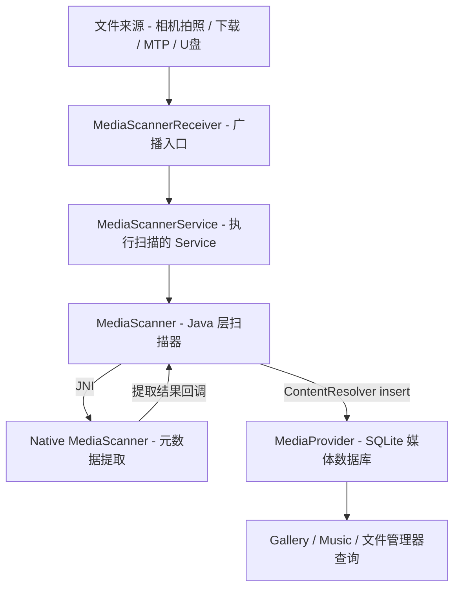
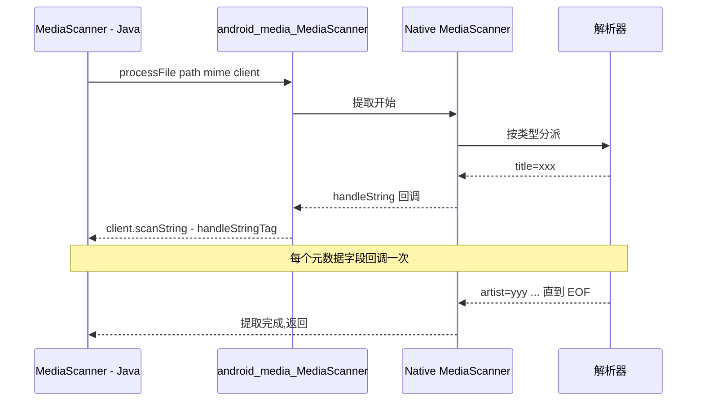

本篇对应原书第 10 章(末章),分析 MediaScanner:系统如何扫描存储上的媒体文件并把元数据收入数据库,供 Gallery/音乐播放器查询。原书选它收尾的用意:这是一条**横跨 Java 服务、BroadcastReceiver、JNI、Native 解析器、SQLite 数据库**的完整链路,前面各章的知识(JNI 回调、Binder 服务、系统服务组织)在这里全部用上。文中代码为概念化改写,并在末尾对现代演进做比对展开。

## 9.1 媒体库全景:四个组件一台戏



| 组件 | 类型 | 职责 |
|---|---|---|
| MediaScannerReceiver | BroadcastReceiver | 监听开机/挂载/单文件广播,**转发**给 Service |
| MediaScannerService | Service | 扫描任务的实际载体,持有扫描线程与通知栏 UI |
| MediaScanner | 框架类 | 目录遍历、类型判断、入库编排;经 JNI 进 Native |
| MediaProvider | ContentProvider | 媒体数据库(external.db)持有者,唯一的写入口 |

**为什么 Receiver 不直接扫描**:Receiver 的生命周期以秒计,onReceive 里干重活会被系统杀;所以它只做"转发"——startService 并把路径参数带上。这是 Android 组件分工的第一课。

## 9.2 触发场景:四种入口汇到一条管线

| 场景 | 触发物 | 扫描范围 |
|---|---|---|
| 开机完成 | BOOT_COMPLETED 广播 | 全量(所有卷的媒体目录) |
| SD 卡挂载 | MEDIA_MOUNTED 广播 | 新挂载卷全量 |
| 单文件新增 | App 发 ACTION_MEDIA_SCANNER_SCAN_FILE + 文件路径 | 单文件(相机拍照后的典型动作) |
| 客户端主动 | MediaScannerConnection.scanFile | 调用方给定的一批路径 |

`MediaScannerConnection` 是给 App 的正式 API:内部维护与 MediaService 的连接(实现 MediaScannerConnectionClient 回调可拿到扫描结果),**避免了发广播这种"谁来接都行"的松散方式**:

```java
// 客户端用法(概念化)
MediaScannerConnection.scanFile(context,
        new String[]{ "/sdcard/DCIM/IMG_001.jpg" },
        new String[]{ "image/jpeg" },
        (path, uri) -> {   // 扫描完成的回调:数据库里已可查到
            Log.d(TAG, "scanned: " + path + " -> " + uri);
        });
```

## 9.3 Java 层 MediaScanner:扫描编排

一次目录扫描的骨架(概念化):

```java
// MediaScanner.java(概念化,保留原书流程)
public void scanDirectories(String[] directories, ...) {
    for (String directory : directories) {
        // prescan:建立数据库现有条目的快照,用于对账删除
        prescan(null, true);
        // 递归遍历目录树
        processDirectory(directory, mClient);
        // postscan:快照里还在、盘上已不存在的条目 → 从数据库删除
        postscan(directories);
    }
}

private void processFile(String path, String mimeType) {
    // 1. 入库占位:先插一行(path 为唯一键),拿到底 id
    FileEntry entry = beginFile(path, mimeType);
    // 2. JNI 进 Native 提取元数据(耗时,见 9.4)
    nativeProcessFile(path, mimeType);   // native 方法,经 JNI 进入 Native 提取器
    // 3. 提取到的字段回填,更新这一行
    endFile(entry, ...);
}
```

编排细节:

- **增量判断**:数据库行记录 mtime;文件 mtime 未变则跳过提取,只更新路径相关字段——重复扫描的成本被压到"查库+stat"级别
- **对账删除**:prescan 快照 + postscan 清算,数据库与磁盘保持最终一致(移动/改名通过路径+parentId 识别)
- **入库走 ContentResolver**:MediaScanner 自己不碰 SQL,全部 `insert/update/delete` 经 MediaProvider——**权限与并发控制集中在 Provider 一处**
- **目录遍历与 `.nomedia`**:遍历由 Native 侧完成(见 9.4 的 processDirectory),进入任何子目录前先查是否存在名为 `.nomedia` 的空文件——存在则整个子树直接跳过。这是给用户的"隐私开关":重命名目录加一个 .nomedia,相册立刻"看不见"它,数据库在下次对账时把相关条目清掉

## 9.4 Native 层:提取引擎与 JNI 回调

Java 的 `processFile` 是 native 方法,直接进入 `android_media_MediaScanner.cpp`(这里能看到"Native 回调 Java"的完整应用):



Native 侧按文件类型分派:

- **目录遍历**:`processDirectory` 在 Native 用 dirent 递归,回调 Java(或直接在 Native)逐文件处理——文件名比较、类型判断(`MediaFile.getFileType` 按扩展名/魔数)决定哪些文件值得进入提取流程
- **MP3**:自研 ID3 解析(ID3v1 尾部 128 字节 / ID3v2 头部变长标签)
- **MP4/3GP**:经 **Stagefright**(那时的媒体框架)的 metadata 提取器
- 提取的键值对经由 JNI 逐条回传:Native 侧持有一个实现 MediaScannerClient 的 C++ 对象,缓存好 jmethodID 后,每提取一个字段就 CallVoidMethod 一次

**逐字段回调的得与失**(原书的讨论):避免 Native 组装大结构再整体传递,内存友好;但每次 `CallVoidMethod` 都是完整的 JNI 往返,一个文件十几个字段 × 上千文件,JNI 开销可观——原书以此引出"架构上宁可慢也要清晰"的取舍。

## 9.5 MediaProvider:数据库设计要点

| 表/机制 | 说明 |
|---|---|
| files 表 | 所有媒体的主表:路径、mime、title/artist/album、duration、width/height、mtime |
| images/audio/video 分视图 | 按 media_type 过滤出的专用"表",对查询方友好 |
| 缩略图 | thumbnails 表,由 Gallery 等按需生成,不阻塞扫描 |
| 唯一键 | 卷内路径;挂载卷变化(卡拔插)时整卷数据失效重扫 |

URI 形如 `content://media/external/images/media/37`,查询方(相册、音乐 App)只见 ContentResolver 接口,**媒体库的物理结构(单库/分库/表结构)可自由演进**——后来 Mainline 化正是吃到了这个抽象的红利。

## 9.6 拓展思考(原书)

- **扫描性能**:全量扫上千文件时,瓶颈在"逐文件 JNI 提取 + 逐条 SQL";书中讨论批量事务、跳过未变文件(mtime)的效果——postscan 的一致性维护成本也不可忽略
- **为什么不用 inotify 做实时扫描**:inotify(内核文件系统事件)要递归 watch 整棵目录树,watch 数量与挂载时序都难保证;且事件风暴下批量合并逻辑复杂。当时的结论:广播触发的"批次扫描"是工程上更稳的选择。现代 Android 仍然以"写入即登记 + 后台补扫"为主,验证了这个判断

## 9.7 新技术更新(比对展开)

| 维度 | 原书时代(Android 2.3) | 现在(Android 11~15+) |
|---|---|---|
| 入口 | 开机/挂载广播全量扫 | App 写入即经 MediaStore 登记;MediaScannerReceiver 已废弃 |
| 扫描器 | MediaScannerService + Java 编排 | ModernMediaScanner(MediaProvider 内,并行、现代化解析器) |
| 存储视图 | 全局公共目录,人人可写 | Scoped Storage:App 只见自己贡献的媒体;公共写入须 MediaStore |
| 数据库 | /data 下的 external.db | 同名库随 MediaProvider 成为 Mainline 模块,可经 Play 更新 |
| 元数据解析 | ID3/Stagefright | libmediaextractor + 自研 ID3/EXIF;HEIF/AVIF/HDR 视频/Motion Photo |
| App API | 发广播/MediaScannerConnection | MediaStore insert 直写(登记即扫描);scanFile 仍在但收敛 |
| 云端融合 | 无 | CloudProvider 实验框架(云端相册注入媒体库) |

分项展开:

### 9.7.1 入口的反转:从"扫文件"到"登记文件"

原书模型:文件先落盘,扫描器**事后**发现;现代模型反转:**App 想往公共媒体区写文件,必须经 `MediaStore.createPending`/insert 拿到 URI 再写**,写完 finalize 时元数据已经就位——扫描从"全库对账"变成"写入点登记",后台扫描只剩"开机补账/adb 导入"等兜底场景。`ACTION_MEDIA_SCANNER_SCAN_FILE` 广播与 MediaScannerReceiver 在 Android 10/11 先后废弃,`MediaScannerConnection.scanFile` 保留为兼容 API。

### 9.7.2 ModernMediaScanner(Android 10+ 重写)

扫描器从 Java Service 移植为 MediaProvider 进程内的 **ModernMediaScanner**:按目录树**多线程并行**扫描;解析层用 libmediaextractor 与自研 ID3/EXIF 读取器(大量 C++/Rust),不再走逐字段 JNI 回调——原书讨论的 JNI 开销以"整体 Native 化"的方式终结。扫描支持事务化(分批入库、失败回滚),启动时按卷的 generation 号增量补扫。

### 9.7.3 Scoped Storage 的连锁影响

Android 10/11 的存储隔离改变了媒体库的**可见性**而非结构:数据库仍是唯一事实源,但 App 的查询默认只见自己贡献(contribute)的条目;批量历史访问要用媒体权限(Android 13 细分为 READ_MEDIA_IMAGES/VIDEO/AUDIO)或 Photo Picker(系统级选择器,App 完全不接触全库)。原书"Gallery 直接查全库"的时代结束了。

### 9.7.4 Mainline 化与新格式

MediaProvider 与扫描器打包为 **Media Module**(Android 11 起,`com.google.android.media`),数据库 schema、解析器都能经 Play 商店热更新;HEIF(Android 9)、AVIF(Android 12)、HDR 视频(13/14)、Motion Photo(12+)等格式的元数据支持都随模块版本演进,不再依赖系统大版本——媒体库成为 Android 模块化最彻底的示范。
