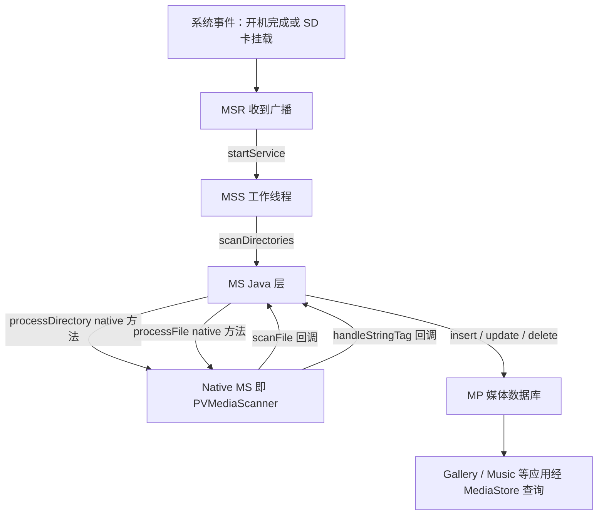
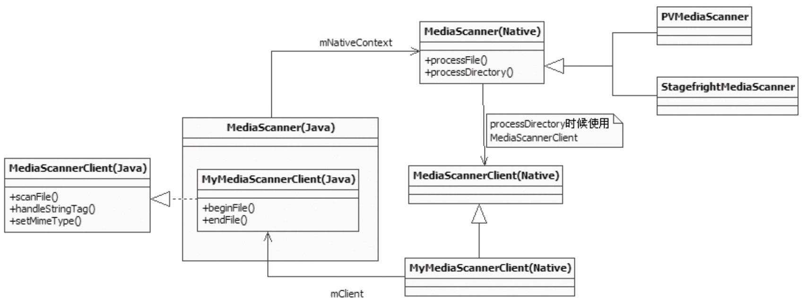

本篇对应原书第 10 章，也是全书最后一章。原书基于 Android 2.2/2.3 源码，选媒体扫描收官的用意很明确：这是一条**横跨 BroadcastReceiver、Service、JNI 回调、Native 解析器与 ContentProvider 数据库**的完整链路，前文分别讲过的 JNI 与 Binder 知识在这条链路上全部用上。具体来说，扫描功能由 android.process.media 进程提供：MediaScannerReceiver（MSR）负责接收扫描请求，MediaScannerService（MSS）负责执行扫描，真正的扫描器 MediaScanner（MS）又纵跨 Java 层、JNI 层与 Native 层的 PVMediaScanner。本章主线一句话：**广播触发服务，服务驱动扫描器，扫描器遍历文件提取元数据并写入媒体数据库**。

> 版本注意：原书成书于 2011 年（Android 2.2/2.3）。现代媒体扫描已由 MediaProvider 与 ModernMediaScanner 实现（Kotlin、批量扫描），但「系统侧服务触发扫描、扫描器遍历文件提取元数据写入库」的流程骨架仍可对照，差异见文末演进备注。

> 摘编声明：文中代码为原书代码的摘编版——保留主干、省略日志与无关分支，类名、函数名忠于原书原文；缩进为整理版。

## 1.1 概述：MediaScanner 的定位与 android.process.media 进程

### 1.1.1 MediaScanner 是什么

多媒体系统是 Android 平台中非常庞大的一个系统，原书因篇幅所限只介绍其中一员——MediaScanner。它与媒体文件扫描有关：Music 应用中见到的歌曲专辑名、歌曲时长等信息，都是通过它扫描对应的歌曲文件得到的；应用经 MediaStore 接口查询媒体数据库得到的所有媒体文件信息，数据来源也是 MediaScanner——**媒体数据库的内容就是由 MediaScanner 添加的**。

原书在此留了一条时代注脚：那个「令人极度郁闷」的 OpenCore 从 Android 2.3 开始终于有了被替换的可能，Android 从此迎来 Stagefright 时代；但 Android 2.2 在很长时间内还会存在，所以本章 JNI 层的分析对象仍是 OpenCore 阵营的 PVMediaScanner。这个背景直接解释了后文 createMediaScanner 函数里 StagefrightMediaScanner 与 PVMediaScanner 并存的分支。

本章涉及的源码文件及位置如下，后文代码均出自这些文件：

| 文件 | 位置 |
|---|---|
| MediaScannerReceiver.java | packages/providers/MediaProvider/ |
| MediaScannerService.java | packages/providers/MediaProvider/ |
| MediaProvider.java | packages/providers/MediaProvider/ |
| MediaThumbRequest.java | packages/providers/MediaProvider/ |
| MediaScanner.java | framework/base/media/java/com/android/media/ |
| android_media_MediaScanner.cpp | framework/base/media/jni/ |
| MediaScanner.cpp | framework/base/media/libmedia/ |
| PVMediaScanner.cpp | external/opencore/android/ |

### 1.1.2 android.process.media 进程与它的三个组件

媒体扫描功能由一个 APK 提供，位于 packages/providers/MediaProvider 目录。分析该 APK 的 Android.mk 可知，它运行时指定了进程名 `android:process="android.process.media"`——用 ps 命令经常看到的那个 android.process.media 进程就是它；从它所处的 packages/providers 目录也可知，这个 APK 同时是一个 ContentProvider。从四大组件的角度看，它使用了其中三个：

- **MediaScannerService（从 Service 派生）**：负责扫描媒体文件，将扫描得到的信息插入媒体数据库。下文简称 MSS。
- **MediaProvider（从 ContentProvider 派生）**：负责处理针对这些媒体文件的数据库操作请求，例如查询、删除、更新等。下文简称 MP。
- **MediaScannerReceiver（从 BroadcastReceiver 派生）**：负责接收外界发来的扫描请求，也就是 MS 对外提供的接口。下文简称 MSR。

除了广播，MSS 还支持利用 Binder 机制跨进程调用扫描函数，这部分在拓展内容（MediaScannerConnection）中介绍，见 1.7 节。MediaScanner 简称 MS。一条完整的扫描链路如下图，后续各节按此逐段展开：



## 1.2 MSR 模块：扫描请求的广播入口

MSR 的核心类 MediaScannerReceiver 从 BroadcastReceiver 派生，专门用来接收广播。先看它对外的三个接口，再看它如何把请求转交给 MSS。

### 1.2.1 onReceive：三种广播的处理

```java
// [--> MediaScannerReceiver.java]
// MSR 在 onReceive 函数中处理广播。
@Override
public void onReceive(Context context, Intent intent) {
    String action = intent.getAction();
    Uri uri = intent.getData();
    // 一般手机外部存储的路径是 /mnt/sdcard。
    String externalStoragePath =
                  Environment.getExternalStorageDirectory().getPath();
    // 为了简化书写，所有 Intent 的 ACTION_XXX_YYY 字串都简写为 XXX_YYY。
    if (action.equals(Intent.ACTION_BOOT_COMPLETED)) {
        // 收到 BOOT_COMPLETED 广播则启动内部存储区的扫描工作。
        // 内部存储区实际扫描的是 /system/media 目录，
        // 这里存储了系统自带的铃声等媒体文件。
        scan(context, MediaProvider.INTERNAL_VOLUME);
    } else {
        if (uri.getScheme().equals("file")) {
            String path = uri.getPath();
            // 收到 MEDIA_MOUNTED，且外部存储挂载路径就是 /mnt/sdcard，
            // 则启动外部存储即 SD 卡的扫描工作。
            if (action.equals(Intent.ACTION_MEDIA_MOUNTED) &&
                      externalStoragePath.equals(path)) {
                scan(context, MediaProvider.EXTERNAL_VOLUME);
            } else if (action.equals(Intent.ACTION_MEDIA_SCANNER_SCAN_FILE)
                      && path != null
                      && path.startsWith(externalStoragePath + "/")) {
                // 外部应用可发 MEDIA_SCANNER_SCAN_FILE 广播让 MSR 启动
                // 单个文件的扫描工作。注意这个文件必须位于 SD 卡上。
                scanFile(context, path);
            }
        }
    }
}
```

从代码可知 MSR 对外提供三个接口：

- 接收 BOOT_COMPLETED 请求，启动**内部存储区**的扫描——实际扫描的是 /system/media 目录，存的是系统自带的铃声等媒体文件。
- 接收 MEDIA_MOUNTED 请求，且携带的挂载点路径必须是 /mnt/sdcard，此时启动**外部存储区（SD 卡）**的扫描，目标是 /mnt/sdcard 目录。
- 接收 MEDIA_SCANNER_SCAN_FILE 请求，且目标必须是 SD 卡上的一个文件（路径以 /mnt/sdcard 开头），此时启动**单个文件**的扫描。

一个值得注意的细节（原书特别指出）：MSR 和跨 Binder 调用的接口都不支持对目录的扫描——除了 SD 卡的根目录外。

### 1.2.2 scan 与 scanFile：转交 MSS

大部分媒体文件都放在 SD 卡上，所以关键是收到 MEDIA_MOUNTED 请求后的流程。原书在此承接了对 Vold 的分析：MEDIA_MOUNTED 广播是由 MountService 发送的，一旦有 SD 卡被挂载，MSR 就会被这个广播唤醒，接着启动 MSS，SD 卡上的媒体文件随之被扫描。SD 卡根目录扫描时调用的 scan 函数如下：

```java
// [--> MediaScannerReceiver.java]
private void scan(Context context, String volume) {
    // volume 的取值为 internal 或 external，MSS 会据此换算出真正的扫描目录。
    Bundle args = new Bundle();
    args.putString("volume", volume);
    // 启动 MSS。
    context.startService(
            new Intent(context, MediaScannerService.class).putExtras(args));
}
```

scanFile 的做法与 scan 相同：把目标文件路径以 `filepath` 为 key 放入 Bundle，然后 startService 启动 MSS——这一点可以从 MSS 工作线程里 `arguments.getString("filepath")` 的读取得到印证。MSR 自己不做任何扫描，只做「解析广播 → 打包参数 → 启动服务」的转发。

## 1.3 MSS 模块：扫描服务的启动与执行

请求已到 MSS 门口，本节按服务生命周期推进：onCreate 创建工作线程 → onStartCommand 接收请求 → ServiceHandler 处理请求 → scan 函数执行扫描。

MSS 从 Service 派生，并且实现了 Runnable 接口：

```java
// [--> MediaScannerService.java]
MediaScannerService extends Service implements Runnable
// MSS 实现了 Runnable 接口，这表明它可能会创建工作线程。
```

### 1.3.1 onCreate：创建带消息循环的工作线程

onCreate 在 MSS 被系统创建时调用，整个生命周期内仅调用一次：

```java
// [--> MediaScannerService.java]
public void onCreate() {
    // 获得电源锁，防止在扫描过程中休眠。
    PowerManager pm = (PowerManager)getSystemService(Context.POWER_SERVICE);
    mWakeLock = pm.newWakeLock(PowerManager.PARTIAL_WAKE_LOCK, TAG);
    // 扫描工作是一个漫长的工程，所以这里单独创建一个工作线程，
    // 线程函数就是 MSS 实现的 run 函数。
    Thread thr = new Thread(null, this, "MediaScannerService");
    thr.start();
}
```

工作线程的线程函数是 MSS 自己实现的 run 函数：

```java
// [--> MediaScannerService.java]
public void run()
{
    // 设置本线程的优先级，这个调用有很重要的作用：媒体扫描可能耗费很长时间，
    // 如果不调低优先级，CPU 将一直被 MSS 占用，用户会觉得系统变得很慢。
    Process.setThreadPriority(Process.THREAD_PRIORITY_BACKGROUND +
                              Process.THREAD_PRIORITY_LESS_FAVORABLE);
    Looper.prepare();

    mServiceLooper = Looper.myLooper();
    // 创建一个 Handler，以后发送给这个 Handler 的消息都会由工作线程处理。
    mServiceHandler = new ServiceHandler();

    Looper.loop();
}
```

两个细节：一是线程优先级被主动调低到后台级别再加一档，避免长时间扫描拖慢整个系统；二是这条线程带着 Looper 与 ServiceHandler，构成一个典型的 HandlerThread 形态的工作线程。

### 1.3.2 onStartCommand：把请求投递进工作线程

MSR 发出的 startService 最终触发 MSS 的 onStartCommand：

```java
// [--> MediaScannerService.java]
@Override
public int onStartCommand(Intent intent, int flags, int startId)
{
    // 等待 mServiceHandler 被创建。
    // 原书吐槽：写这段代码的人难道不知道 HandlerThread 这个类吗？
    while (mServiceHandler == null) {
        synchronized (this) {
            try {
                wait(100);
            } catch (InterruptedException e) {
            }
        }
    }
    ......
    Message msg = mServiceHandler.obtainMessage();
    msg.arg1 = startId;
    msg.obj = intent.getExtras();
    // 往这个 Handler 投递消息，最终由工作线程处理。
    mServiceHandler.sendMessage(msg);
    ......
}
```

主线程在这里用一个「等待 mServiceHandler 非空」的忙等来同步工作线程的创建进度——上一节说过，一个 HandlerThread 就能省掉这段等待。消息投出去之后，剩下的处理都在工作线程中进行。

### 1.3.3 ServiceHandler：根据 volume 确定扫描目录

扫描请求由 ServiceHandler 的 handleMessage 函数处理：

```java
// [--> MediaScannerService.java]
private final class ServiceHandler extends Handler
{
    @Override
    public void handleMessage(Message msg)
    {
        Bundle arguments = (Bundle) msg.obj;
        String filePath = arguments.getString("filepath");

        try {
            if (filePath != null) {
                ...... // 单文件扫描分支（filepath 请求），原书未展开。
            } else {
                String volume = arguments.getString("volume");
                String[] directories = null;
                if (MediaProvider.INTERNAL_VOLUME.equals(volume)) {
                    // 如果是扫描内部存储的话，实际扫描的目录是 /system/media。
                    directories = new String[] {
                              Environment.getRootDirectory() + "/media",
                          };
                }
                else if (MediaProvider.EXTERNAL_VOLUME.equals(volume)) {
                    // 扫描外部存储，设置扫描目标位置 /mnt/sdcard。
                    directories = new String[]{
                              Environment.getExternalStorageDirectory().getPath()};
                }
                if (directories != null) {
                    // 调用 scan 函数开展文件夹扫描工作，可以为这个函数一次设置
                    // 多个目标文件夹，不过这里只有 /mnt/sdcard 一个目录。
                    scan(directories, volume);
                    ......
                    stopSelf(msg.arg1);
                }
            }
        }
        ......
    }
}
```

这段代码就是 MSR 传入的 volume 字符串到真实目录的换算处：`internal` 映射到 /system/media，`external` 映射到 /mnt/sdcard，扫描完成后再 stopSelf 停止服务。

### 1.3.4 MSS 的 scan 函数：与 MediaProvider 的特殊 Uri 交互

MSS 的 scan 函数是 android.process.media 一侧扫描工作的主体：

```java
// [--> MediaScannerService.java]
private void scan(String[] directories, String volumeName) {
    mWakeLock.acquire();

    ContentValues values = new ContentValues();
    values.put(MediaStore.MEDIA_SCANNER_VOLUME, volumeName);
    // MSS 通过 insert 这个特殊 Uri 让 MP 做一些准备工作。
    Uri scanUri = getContentResolver().insert(
                                  MediaStore.getMediaScannerUri(), values);

    Uri uri = Uri.parse("file://" + directories[0]);
    // 向系统发送一个 MEDIA_SCANNER_STARTED 广播。
    sendBroadcast(new Intent(Intent.ACTION_MEDIA_SCANNER_STARTED, uri));
    try {
        // openDatabase 函数也是通过 insert 一个特殊 Uri 让 MP 打开数据库的。
        if (volumeName.equals(MediaProvider.EXTERNAL_VOLUME)) {
              openDatabase(volumeName);
        }
        // 创建媒体扫描器，并调用它的 scanDirectories 函数扫描目标文件夹。
        MediaScanner scanner = createMediaScanner();
        scanner.scanDirectories(directories, volumeName);
    }
      ......
    // 通过特殊 Uri 让 MP 做一些清理工作。
    getContentResolver().delete(scanUri, null, null);
    // 向系统发送 MEDIA_SCANNER_FINISHED 广播。
    sendBroadcast(new Intent(Intent.ACTION_MEDIA_SCANNER_FINISHED, uri));

    mWakeLock.release();
}
```

这段代码里比较复杂的是 MSS 与 MP 的交互方式：除了正常的数据库操作外，MSS 还经常使用一些**特殊的 Uri** 来做数据库操作，MP 针对这些 Uri 会做特殊处理——这里用 insert 触发 MP 的准备工作与打开数据库，最后用 delete 触发清理工作。原书声明不对 MediaProvider 做过多讨论。MSS 创建媒体扫描器的 createMediaScanner 函数如下：

```java
// [--> MediaScannerService.java]
private MediaScanner createMediaScanner() {
    // 这个 MediaScanner 类在 framework/base/ 中，1.4 节再分析。
    MediaScanner scanner = new MediaScanner(this);
    // 获取当前系统使用的区域信息，扫描的时候会把媒体文件中的信息
    // 转换成当前系统使用的语言。
    Locale locale = getResources().getConfiguration().locale;
    if (locale != null) {
        String language = locale.getLanguage();
        String country = locale.getCountry();
        String localeString = null;
        if (language != null) {
            if (country != null) {
                // 为扫描器设置当前系统使用的国家和语言。
                scanner.setLocale(language + "_" + country);
            } else {
                scanner.setLocale(language);
            }
        }
    }
    return scanner;
}
```

注意这里把系统 Locale 设置给了扫描器——媒体文件里内嵌的文本信息（歌名、歌手等）编码各异，扫描时会结合系统语言做转换，这个伏笔在 1.6.3 节的 endFile 会再次出现。

### 1.3.5 android.process.media 扫描流程总结

把 android.process.media 内的流程总结为四步：

- MSR 接收外部发来的扫描请求，并通过 startService 方式启动 MSS 处理。
- MSS 的主线程接收请求，然后投递给工作线程去处理。
- 工作线程做一些前期处理工作后（例如向系统广播扫描开始的消息），就创建媒体扫描器 MS 来处理扫描目标。
- MS 扫描完成后，工作线程再做一些后期处理，然后向系统发送扫描完毕的广播。

接下来的主角是 MediaScanner 本身。

## 1.4 MediaScanner 的 Java 层分析

现在分析媒体扫描器 MediaScanner 的工作原理，它纵跨 Java 层、JNI 层与 Native 层。先看 Java 层：从类的创建开始，到 scanDirectories 的四个关键点。

### 1.4.1 MediaScanner 的创建

```java
// [--> MediaScanner.java]
public class MediaScanner
{
    static {
        // 加载 libmedia_jni.so。原书点评：这么重要的库竟然放在如此不起眼的
        // MediaScanner 类中加载——可能是因为开机后多媒体系统中最先启动的
        // 就是媒体扫描工作吧。
        System.loadLibrary("media_jni");
        native_init();
    }
    // 创建媒体扫描器。
    public MediaScanner(Context c) {
        native_setup(); // 调用 JNI 层的函数做一些初始化工作。
        ......
    }
}
```

这里比较重要的两个函数是 native_init（由 static 块调用）和 native_setup（由构造函数调用），它们的故事在 1.5 节展开。MS 创建好后，MSS 就调用它的 scanDirectories 开展扫描工作。

### 1.4.2 scanDirectories：四个关键点

```java
// [--> MediaScanner.java]
public void scanDirectories(String[] directories, String volumeName) {
  try {
          long start = System.currentTimeMillis();
          initialize(volumeName); // ① 初始化
          prescan(null);          // ② 扫描前的预处理。
          long prescan = System.currentTimeMillis();

          for (int i = 0; i < directories.length; i++) {
            // ③ processDirectory 是一个 native 函数，调用它对目标文件夹进行扫描。
            // MediaFile.sFileExtensions 是一个字符串，包含当前多媒体系统支持的
            // 媒体文件后缀名，例如 .MP3、.MP4 等。mClient 为 MyMediaScannerClient
            // 类型，它从 MediaScannerClient 类派生，作用在 1.5 节分析。
            processDirectory(directories[i], MediaFile.sFileExtensions,
                                mClient);
            }
          long scan = System.currentTimeMillis();
          postscan(directories);  // ④ 扫描后处理。
          long end = System.currentTimeMillis();
          ...... // 统计扫描时间等。
  }
  ......
}
```

一次目录扫描由四个关键点组成：initialize（初始化各表 Uri）、prescan（扫描前的数据库快照）、processDirectory（逐目录扫描，native 函数）、postscan（扫描后处理）。下面逐一分析。

### 1.4.3 initialize：拿到媒体数据库各表的 Uri

扫描时需要把文件信息插入媒体数据库，而媒体数据库针对 Audio、Video、Image 文件各有对应的表，这些表的地址由 Uri 表示，initialize 负责把它们准备好：

```java
// [--> MediaScanner.java]
private void initialize(String volumeName) {
    // 得到 IMediaProvider 对象，通过这个对象可以对媒体数据库进行操作。
    mMediaProvider =
                  mContext.getContentResolver().acquireProvider("media");
    // 初始化 Uri：
    // 音频表的地址，也就是数据库中的 audio_meta 表。
    mAudioUri = Audio.Media.getContentUri(volumeName);
    // 视频表地址，也就是数据库中的 video 表。
    mVideoUri = Video.Media.getContentUri(volumeName);
    // 图片表地址，也就是数据库中的 images 表。
    mImagesUri = Images.Media.getContentUri(volumeName);
    // 缩略图表地址，也就是数据库中的 thumbs 表。
    mThumbsUri = Images.Thumbnails.getContentUri(volumeName);
    // 如果扫描的是外部存储，则支持播放列表、音乐的流派等内容。
      if (!volumeName.equals("internal")) {
        mProcessPlaylists = true;
        mProcessGenres = true;
        mGenreCache = new HashMap<String, Uri>();
        mGenresUri = Genres.getContentUri(volumeName);
        mPlaylistsUri = Playlists.getContentUri(volumeName);
        if (Process.supportsProcesses()) {
            // SD 卡存储区域一般使用 FAT 文件系统，所以文件名与大小写无关。
            mCaseInsensitivePaths = true;
        }
    }
}
```

### 1.4.4 prescan：扫描前的数据库快照

在媒体扫描过程中有一个令人头疼的问题。原书举了一个贯穿后续分析的例子：假设某次扫描之前 SD 卡中有 100 个媒体文件，数据库中有 100 条关于这些文件的记录，现因某种原因删除了其中的 50 个媒体文件，那么媒体数据库什么时候会被更新？

别小看这个问题：很多文件管理器支持删除文件和文件夹，却没有对应地更新数据库，导致查询数据库时仍能得到这些媒体文件的信息，但文件实际上已不存在，后面所有和此文件有关的操作都会因此失败。

MS 对此的解法是：**prescan 在扫描之前把数据库中和文件相关的信息取出并保存起来，这些信息主要是媒体文件的路径、所属表的 Uri**。就上面的例子来说，prescan 会从数据库中取出这 100 个文件的信息：

```java
// [--> MediaScanner.java]
private void prescan(String filePath) throws RemoteException {
        Cursor c = null;
        String where = null;
        String[] selectionArgs = null;
        // mFileCache 保存从数据库中获取的文件信息。
        if (mFileCache == null) {
            mFileCache = new HashMap<String, FileCacheEntry>();
        } else {
            mFileCache.clear();
        }
        ......
        try {
            // 单文件扫描时只查指定的那个文件。
            if (filePath != null) {
                where = MediaStore.Audio.Media.DATA + "=?";
                selectionArgs = new String[] { filePath };
            }
            // 查询数据库的 Audio 表，获取对应的音频文件信息。
            c = mMediaProvider.query(mAudioUri, AUDIO_PROJECTION, where,
                                  selectionArgs, null);
            if (c != null) {
                try {
                    while (c.moveToNext()) {
                        long rowId = c.getLong(ID_AUDIO_COLUMN_INDEX);
                        // 音频文件的路径。
                        String path = c.getString(PATH_AUDIO_COLUMN_INDEX);
                        long lastModified =
                          c.getLong(DATE_MODIFIED_AUDIO_COLUMN_INDEX);

                          if (path.startsWith("/")) {
                            String key = path;
                            if (mCaseInsensitivePaths) {
                                key = path.toLowerCase();
                            }
                            // 把文件信息存到 mFileCache 中。
                            mFileCache.put(key,
                                  new FileCacheEntry(mAudioUri, rowId, path,
                                  lastModified));
                        }
                    }
                } finally {
                    c.close();
                    c = null;
                }
            }
        ......
        // 查询其他表，取出数据库中关于视频、图像等文件的信息，同样存入 mFileCache。
        }
        finally {
            if (c != null) {
                c.close();
            }
        }
}
```

prescan 执行完后，mFileCache 保存了扫描前所有媒体文件的信息——也就是数据库中的旧有信息，其中每一项都带着该文件在数据库中的表 Uri 与行号，这是后面从数据库快速删除记录的钥匙。

### 1.4.5 processDirectory 与 postscan：对账删除

processDirectory 是一个 native 函数，具体实现放到 JNI 层再分析，这里先说它在那个「100 删 50」例子中所做的工作：**processDirectory 扫描 SD 卡，每扫描到一个文件，都会把 mFileCache 中对应文件的 mSeenInFileSystem 变量设为 true**，表示这个文件目前还存在于 SD 卡上。这样，待整个 SD 卡扫描完后，mFileCache 的 100 个文件中会有 50 个的 mSeenInFileSystem 为 true，剩下 50 个保持初始值 false。

postscan 的作用由此可知：把不存在于 SD 卡的文件信息从数据库中删除，使数据库得以彻底更新：

```java
// [--> MediaScanner.java]
private void postscan(String[] directories) throws RemoteException {

  Iterator<FileCacheEntry> iterator = mFileCache.values().iterator();
  while (iterator.hasNext()) {
            FileCacheEntry entry = iterator.next();
            String path = entry.mPath;

            boolean fileMissing = false;
            if (!entry.mSeenInFileSystem) {
                if (inScanDirectory(path, directories)) {
                    fileMissing = true; // 这个文件确实丢失了。
                } else {
                    File testFile = new File(path);
                    if (!testFile.exists()) {
                          fileMissing = true;
                    }
                }
            }
        // 如果文件确实丢失，则需要把数据库中和它相关的信息删除。
        if (fileMissing) {
            MediaFile.MediaFileType mediaFileType = MediaFile.getFileType(path);
            int fileType = (mediaFileType == null ? 0 : mediaFileType.fileType);
          if (MediaFile.isPlayListFileType(fileType)) {
                  ...... // 处理丢失文件是播放列表的情况。
            } else {
                // 由于文件信息中还携带了它在数据库中的相关信息（表 Uri 与 rowId），
                // 所以从数据库中删除对应的信息会非常快。
                mMediaProvider.delete(ContentUris.withAppendedId(
                            entry.mTableUri, entry.mRowId), null, null);
                  iterator.remove();
              }
          }
      }
    ...... // 删除缩略图文件等工作。
}
```

prescan 快照、processDirectory 标记、postscan 清算，三步合起来就是媒体数据库与文件系统之间的对账机制。Java 层的四个关键点至此介绍了三个，剩下的 processDirectory 是媒体扫描的关键函数，由于它是 native 函数，下面转战 JNI 层。

## 1.5 MediaScanner 的 JNI 层分析

Java 层有三个函数涉及 JNI 层：native_init（MediaScanner 类的 static 块调用）、native_setup（构造函数调用）、processDirectory（扫描文件夹时调用）；另外 doScanFile 路径上的 processFile 也是 native 函数，放在 1.6 节随调用链一起分析。先看前三个。

### 1.5.1 native_init：保存字段 ID

```cpp
// [--> android_media_MediaScanner.cpp]
static void
android_media_MediaScanner_native_init(JNIEnv *env)
{
    jclass clazz;
    clazz = env->FindClass("android/media/MediaScanner");
    // 取得 Java 中 MS 类的 mNativeContext 字段。
    // 待会创建的 Native 对象的指针会保存到 Java MS 对象的 mNativeContext 变量中。
    fields.context = env->GetFieldID(clazz, "mNativeContext", "I");
    ......
}
```

native_init 没什么新意——**把 Native 对象的指针保存到 Java 对象的成员变量中**，这种做法在 JNI 章节已经屡见不鲜。这里先把字段 ID 缓存到 fields.context，供后续 GetIntField/SetIntField 使用。

### 1.5.2 native_setup：创建 Native 层扫描器

native_setup 对应的 JNI 函数将创建一个 Native 层的 MS 对象：

```cpp
// [--> android_media_MediaScanner.cpp]
android_media_MediaScanner_native_setup(JNIEnv *env, jobject thiz)
{
    // 创建 Native 层的 MediaScanner 对象。
    MediaScanner *mp = createMediaScanner();
    ......
    // 把 mp 的指针保存到 Java MS 对象的 mNativeContext 中去。
    env->SetIntField(thiz, fields.context, (int)mp);
}

// 下面的 createMediaScanner 函数将创建一个 Native 的 MS 对象。
static MediaScanner *createMediaScanner() {
#if BUILD_WITH_FULL_STAGEFRIGHT
    char value[PROPERTY_VALUE_MAX];
    if (property_get("media.stagefright.enable-scan", value, NULL)
        && (!strcmp(value, "1") || !strcasecmp(value, "true"))) {
        return new StagefrightMediaScanner; // 使用 Stagefright 的 MS。
    }
#endif
#ifndef NO_OPENCORE
    return new PVMediaScanner(); // 使用 Opencore 的 MS，原书分析的是这个。
#endif
    return NULL;
}
```

注意 createMediaScanner 里的编译与运行时开关：系统属性 `media.stagefright.enable-scan` 打开且编译了 Stagefright 时用 StagefrightMediaScanner，否则用 OpenCore 的 PVMediaScanner——这正是 1.1.1 节那条时代注脚落在代码上的样子。原书分析的是 PVMediaScanner，后面不可避免要和 OpenCore 打交道。

### 1.5.3 processDirectory：JNI 函数的转发

```cpp
// [--> android_media_MediaScanner.cpp]
android_media_MediaScanner_processDirectory(JNIEnv *env, jobject thiz,
                            jstring path, jstring extensions, jobject client)
{
    // path 为目标文件夹的路径，extensions 为 MS 支持的媒体文件后缀名集合，
    // client 为 Java 中的 MediaScannerClient 对象。

    MediaScanner *mp = (MediaScanner *)env->GetIntField(thiz, fields.context);

    const char *pathStr = env->GetStringUTFChars(path, NULL);
    const char *extensionsStr = env->GetStringUTFChars(extensions, NULL);
    ......

    // 构造一个 Native 层的 MyMediaScannerClient，并使用 Java 那个 Client 对象
    // 做参数。这个 Native 层的 Client 简称为 MyMSC。
    MyMediaScannerClient myClient(env, client);
    // 调用 Native 的 MS 扫描文件夹，并且把 Native 的 MyMSC 传进去。
    mp->processDirectory(pathStr, extensionsStr, myClient,
                            ExceptionCheck, env);
    ......
    env->ReleaseStringUTFChars(path, pathStr);
    env->ReleaseStringUTFChars(extensions, extensionsStr);
    ......
}
```

processDirectory 函数本身不难——从 mNativeContext 取回 Native 对象指针、转换字符串参数、转发调用，但它引出了几个之前没接触过的类型：MediaScannerClient、MyMediaScannerClient。先把类关系理清楚。

### 1.5.4 MS 相关类的关系

图 10-1（原书编号）展示了 MediaScanner 涉及的相关类及关系，Java 与 Native 层的对象都画在图中：



从图中可知：

- Java 的 MS 对象通过 mNativeContext 指向 Native 的 MS 对象。
- Native 的 MyMSC 对象通过 mClient 保存 Java 层的 MyMSC 对象。
- Native 的 MS 对象调用 processDirectory 函数的时候会使用 Native 的 MyMSC 对象。
- 图中 Native MS 类的 processFile 是一个虚函数，需要派生类（PVMediaScanner 或 StagefrightMediaScanner）来实现。

其中比较费解的是 MyMSC 对象——它有什么用？这得进入 PVMediaScanner 的领地才能看清。

## 1.6 PVMediaScanner：Native 层的扫描实现

PVMediaScanner 以后简称 PVMS，它就是 Native 层的 MS。注意源码中有两个 MediaScanner.cpp，分别位于 framework/base/media/libmedia/（基类，Android 框架的一部分）和 external/opencore/android/（PVMS 所在的 OpenCore 代码）。本节沿着一次文件扫描的调用链走：基类 processDirectory 遍历目录 → MyMSC 的 scanFile 回调到 Java → doScanFile 再调 processFile 进入 PVMS → parseMP3 提取 TAG → addStringTag 与 handleStringTag 回传 Java。这条链在 Java 层与 Native 层之间来回穿梭，原书将其比作「四渡赤水」，也是本章最绕的部分。

### 1.6.1 基类 processDirectory 与 MyMSC 的 scanFile

PVMS 的 processDirectory 函数由它的基类 MS（libmedia 下的 MediaScanner.cpp）实现：遍历目标目录，对后缀名属于 MS 支持范围的媒体文件，调用 MediaScannerClient 的 scanFile 函数来处理——也就是说，**MediaScanner 调用 MediaScannerClient 的 scanFile 函数**。而调用 processDirectory 时传入的 MSC 对象，真实类型是 JNI 层定义的 MyMediaScannerClient，它的 scanFile 实现如下：

```cpp
// [--> android_media_MediaScanner.cpp]
virtual bool scanFile(const char* path, long long lastModified,
                      long long fileSize)
{
    jstring pathStr;
    if ((pathStr = mEnv->NewStringUTF(path)) == NULL) return false;
    // mClient 是 Java 层的那个 MyMSC 对象，这里调用它的 scanFile 函数。
    mEnv->CallVoidMethod(mClient, mScanFileMethodID, pathStr,
                          lastModified, fileSize);

    mEnv->DeleteLocalRef(pathStr);
    return (!mEnv->ExceptionCheck());
}
```

Native 的 MyMSC scanFile 主要工作就是通过 JNI 回调 Java 层 MyMSC 的 scanFile 函数。基类每遍历到一个媒体文件，这个回调就发生一次——Native 层只管「发现文件」，发现之后怎么处理，交还给 Java 层决定。

### 1.6.2 Java 层的 scanFile 与 doScanFile

Java 层 MyMSC 的 scanFile 与 doScanFile 代码如下：

```java
// [--> MediaScanner.java]
public void scanFile(String path, long lastModified, long fileSize) {
    ......
    // 调用 doScanFile 函数。
    doScanFile(path, null, lastModified, fileSize, false);
}

// 直接来看 doScanFile 函数。
public Uri doScanFile(String path, String mimeType, long lastModified,
                      long fileSize, boolean scanAlways) {
    // scanAlways 用于控制是否强制扫描：前后两次扫描没有变化的文件可以不处理；
    // 为 true 时这些没变化的文件也要扫描。
    Uri result = null;
    long t1 = System.currentTimeMillis();
    try {
        // beginFile 的主要工作，是将保存在 mFileCache 中的对应文件信息的
        // mSeenInFileSystem 设为 true。如果这个文件之前没有在 mFileCache 中保存，
        // 则会创建一个新项添加到 mFileCache 中。另外它还会根据传入的 lastModified
        // 值判断文件在前后两次扫描之间是否被修改，若有修改则需要重新扫描。
        FileCacheEntry entry = beginFile(path, mimeType, lastModified, fileSize);
        if (entry != null && (entry.mLastModifiedChanged || scanAlways)) {
            String lowpath = path.toLowerCase();
            ......

            if (!MediaFile.isImageFileType(mFileType)) {
                // 不是图片则调用 processFile 进行扫描；图片不需要扫描就可以处理。
                // 注意调用 processFile 时又把这个 Java 的 MyMSC 对象传了进去。
                processFile(path, mimeType, this);
            }
            // 扫描完后，把新的信息插入数据库或更新原有信息，endFile 做这项工作。
            result = endFile(entry, ringtones, notifications,
                    alarms, music, podcasts);
        }
    } ......
    return result;
}
```

这段代码把 1.4.5 节的对账机制接上了：beginFile 把 mSeenInFileSystem 置 true 并判断文件是否修改过；没变化且不强制扫描的文件直接跳过；需要扫描的文件再次调用 native 的 processFile——注意调用时又把 Java 的 MyMSC 对象传了进去。endFile 收到的那组布尔参数（ringtones、notifications、alarms、music、podcasts）用于把文件归入铃声、通知音、闹钟、音乐、播客等分类入库，具体判定逻辑在原书省略的部分；文件信息的最终入库就发生在 endFile 中。

processFile 又是一个 native 函数，对应的 JNI 函数如下：

```cpp
// [--> android_media_MediaScanner.cpp]
android_media_MediaScanner_processFile(JNIEnv *env, jobject thiz,
                          jstring path, jstring mimeType, jobject client)
{
    // Native 的 MS 还是那个 MS，其真实类型是 PVMS。
    MediaScanner *mp = (MediaScanner *)env->GetIntField(thiz, fields.context);
    // 又构造了一个新的 Native 的 MyMSC，不过它指向的 Java 层 MyMSC 没有变化。
    MyMediaScannerClient myClient(env, client);
    // 调用 PVMS 的 processFile 处理这个文件。
    mp->processFile(pathStr, mimeTypeStr, myClient);
}
```

### 1.6.3 PVMS 的 processFile：按后缀名分派解析器

这是第一次进入 PVMS 的代码：

```cpp
// [--> PVMediaScanner.cpp]
status_t PVMediaScanner::processFile(const char *path, const char* mimeType,
                                      MediaScannerClient& client)
{
    status_t result;
    InitializeForThread();

    // 调用 Native MyMSC 对象的函数做一些处理。
    client.setLocale(locale());
    // beginFile 由基类 MSC 实现，这个函数将构造两个字符串数组，
    // 一个叫 mNames，另一个叫 mValues。这两个变量的作用和字符编码有关，后面会碰到。
    client.beginFile();
    ......
    const char* extension = strrchr(path, '.');
    // 根据文件后缀名来做不同的扫描处理。
    if (extension && strcasecmp(extension, ".mp3") == 0) {
        result = parseMP3(path, client); // client 又传进去了。
      ......
    }
    // endFile 会根据 client 设置的区域信息对 mValues 中的字符串做语言转换：
    // 例如一首 MP3 中的媒体信息是韩文，而手机设置的语言为简体中文，
    // endFile 会尽量对这些韩文进行转换。不过语言转换向来是个大难题，
    // 不能保证所有语言的文字都能相互转换。
    // 转换后的每一个 value 都会调用 handleStringTag 做后续处理。
    client.endFile();
    ......
}
```

MSS 一侧 setLocale 设置的语言信息（1.3.4 节的伏笔）在这里派上用场：扫描提取出的非 ASCII 文本会攒在 mNames/mValues 两个数组里，等 endFile 时集中做字符集与语言转换，再逐条交给 handleStringTag 处理。

### 1.6.4 parseMP3 与 addStringTag：TAG 信息的回传链

以 MP3 为例，processFile 分派到 parseMP3：

```cpp
// [--> PVMediaScanner.cpp]
static PVMFStatus parseMP3(const char *filename, MediaScannerClient& client)
{
    // 对 MP3 文件进行解析，得到诸如 duration、流派、标题等 TAG（标签）信息。
    // 在 Windows 平台上可通过千千静听软件查看 MP3 文件的所有 TAG 信息。
    ......
    // MP3 文件已经扫描完了，下面将这些 TAG 信息添加给 MyMSC。
    if (!client.addStringTag("duration", buffer))
        ......
}
```

parseMP3 扫描完文件后，通过 addStringTag 把文件中的信息一条条告诉 MyMSC。addStringTag 由 MyMSC 的基类 MediaScannerClient 处理：

```cpp
// [--> MediaScannerClient.cpp]
bool MediaScannerClient::addStringTag(const char* name, const char* value)
{
    if (mLocaleEncoding != kEncodingNone) {
        bool nonAscii = false;
        const char* chp = value;
        char ch;
        while ((ch = *chp++)) {
            if (ch & 0x80) {
                nonAscii = true;
                break;
            }
        }
        // 判断 value 的编码是不是 ASCII，如果不是的话则保存到
        // mNames 和 mValues 中，等到 endFile 函数的时候再集中做字符集转换。
        if (nonAscii) {
            mNames->push_back(name);
            mValues->push_back(value);
            return true;
        }
    }
    // 如果字符编码是 ASCII 的话则调用 handleStringTag 函数，
    // 这个函数由子类 MyMSC 实现。
    return handleStringTag(name, value);
}
```

handleStringTag 由 JNI 层的 MyMSC 实现，它的主要工作又是回调 Java 层：

```cpp
// [--> android_media_MediaScanner.cpp::MyMediaScannerClient 类]
virtual bool handleStringTag(const char* name, const char* value)
{
    ......
    // 调用 Java 层 MyMSC 对象的 handleStringTag 进行处理。
    mEnv->CallVoidMethod(mClient, mHandleStringTagMethodID, nameStr, valueStr);
}
```

Java 层的 handleStringTag 把这些 TAG 信息保存到 MyMSC 对应的成员变量中：

```java
// [--> MediaScanner.java]
public void handleStringTag(String name, String value) {
    // 保存这些 TAG 信息到 MyMSC 对应的成员变量中去。
    if (name.equalsIgnoreCase("title") || name.startsWith("title;")) {
        mTitle = value;
    } else if (name.equalsIgnoreCase("artist") ||
                          name.startsWith("artist;")) {
        mArtist = value.trim();
    } else if (name.equalsIgnoreCase("albumartist") ||
                          name.startsWith("albumartist;")) {
        mAlbumArtist = value.trim();
    }
    ......
}
```

到这里，一个文件的扫描就算做完了：Native 解析器提取出的 duration、title、artist 等每一条 TAG，都经 handleStringTag 回传到 Java 层 MyMSC 的成员变量里，等 processFile 返回后由 doScanFile 的 endFile 把这些信息组织起来写入媒体数据库。

### 1.6.5 MediaScanner 扫描流程总结

总结媒体扫描的工作流程，它并不复杂，就是有些绕，如图 10-2（原书编号）所示：


MediaScanner.java 的源码里有一段详细的注释，对整个流程做了文字总结，原书认为这段总结非常简单就不翻译了，摘编如下（这是理解本章的最好索引）：

```java
// [--> MediaScanner.java]
/*
 * In summary:
 * Java MediaScannerService calls
 * Java MediaScanner scanDirectories, which calls
 * Java MediaScanner processDirectory (native method), which calls
 * native MediaScanner processDirectory, which calls
 * native MyMediaScannerClient scanFile, which calls
 * Java MyMediaScannerClient scanFile, which calls
 * Java MediaScannerClient doScanFile, which calls
 * Java MediaScanner processFile (native method), which calls
 * native MediaScanner processFile, which calls
 * native parseMP3, parseMP4, parseMidi, parseOgg or parseWMA, which calls
 * native MyMediaScanner handleStringTag, which calls
 * Java MyMediaScanner handleStringTag.
 * Once MediaScanner processFile returns, an entry is inserted in to the database.
 */
```

看完这么详细的注释，可以确定码农是故意把流程设计成这样在 Java 层与 Native 层之间来回穿梭的。原书的评价是：千万不要觉得这是垃圾代码的代表，注释中也说明了目前的设计就是这样，以后有可能改。（演进备注里可以看到，这一来回穿梭的设计后来确实被整体重写了。）

## 1.7 拓展思考

主流程之外，原书本章还介绍了应用侧直接使用扫描功能的 API，并留下了几个拓展研究方向。

### 1.7.1 MediaScannerConnection：应用侧的扫描接口

1.2 节说过，除了广播，MSS 还支持利用 Binder 机制跨进程调用扫描函数——对应用暴露这一能力的就是 MediaScannerConnection。它实现了 ServiceConnection 接口，主要定义如下：

```java
// [--> MediaScannerConnection.java]
public class MediaScannerConnection implements ServiceConnection {

  // 定义 OnScanCompletedListener 接口，媒体文件扫描完后，MSS 就调用这个接口进行通知。
  public interface OnScanCompletedListener {
        public void onScanCompleted(String path, Uri uri);
  }
  // 定义 MediaScannerConnectionClient 接口，派生自 OnScanCompletedListener，
  // 它增加了 MediaScannerConnection 连接上 MSS 的通知。
  public interface MediaScannerConnectionClient extends
                                        OnScanCompletedListener {
        public void onMediaScannerConnected(); // 连接 MSS 的回调通知。
        public void onScanCompleted(String path, Uri uri);
  }
  // 构造函数。
  public MediaScannerConnection(Context context,
                                MediaScannerConnectionClient client);
  // 封装了和 MSS 连接及断开连接的操作。
  public void connect();
  public void disconnect();
  // 扫描单个文件。
  public void scanFile(String path, String mimeType);
  // 静态函数，支持多个文件的扫描，实际上间接提供了文件夹的扫描功能。
  public static void scanFile(Context context, String[] paths,
                      String[] mimeTypes, OnScanCompletedListener callback);

  ......
}
```

典型用法：构造 MediaScannerConnection 并传入一个 MediaScannerConnectionClient 实现，connect 之后等 onMediaScannerConnected 回调，再调 scanFile 发起扫描，最后在 onScanCompleted 里拿到该文件在媒体数据库中的 Uri。从使用者的角度，原书作者更推荐静态的 scanFile 函数：一方面它封装了与 MSS 连接等相关的工作，另一方面它支持多个文件的扫描——正好补上了 1.2.1 节指出的「MSR 不支持目录扫描」的缺口（把目录下的文件列出来批量交给它即可）。

### 1.7.2 原书留下的拓展问题

作为全书最后一节，原书提出了几个与媒体扫描相关的研究方向供读者自行钻研：

- 走通 MediaProvider：本书没有介绍 android.process.media 中的 MP 模块，不妨分别把扫描一个图片、MP3 歌曲、视频文件的流程走一遍，重点分析 MP 侧的处理。
- 缩略图的生成：MP 中最复杂的是缩略图的生成，可在完成上一步的基础上集中解决缩略图生成的流程；视频文件缩略图的生成还会涉及 MediaPlayerService。
- 更进一步的数据库与 ContentProvider：例如 query 返回的 Cursor 是怎么把数据从 MediaProvider 进程传递到客户端进程的？为什么一个 ContentProvider 死掉后，它的客户端也会跟着被 kill 掉？

## 1.8 演进备注

以下差异不影响对原书主线的理解，可作为对照现代实现的索引：

- **入口的反转**：现代 Android 中，应用想往公共媒体区写文件，直接经 `MediaStore` 的 insert 登记（登记即入库），不再需要事后扫描；`ACTION_MEDIA_SCANNER_SCAN_FILE` 广播与 MediaScannerReceiver 在 Android 10/11 先后废弃，`MediaScannerConnection.scanFile` 保留为兼容 API。MSR 那套「广播触发全量扫描」只剩开机补扫等兜底场景。
- **扫描器重写**：Android 10 起，扫描器从独立的 Java Service 变为 MediaProvider 进程内的 ModernMediaScanner（Kotlin 实现），按目录树批量、并行扫描，元数据解析整体 Native 化——原书时代「逐字段 JNI 回调 + Java 层来回穿梭」的设计（1.6.5 节注释里那句「以后有可能改」）以整体重写的方式落幕。
- **存储可见性**：Scoped Storage 之后，媒体库仍是唯一事实源，但应用查询默认只见自己贡献的条目；批量历史访问需要媒体权限（Android 13 起细分为 READ_MEDIA_IMAGES、READ_MEDIA_VIDEO、READ_MEDIA_AUDIO）或系统级 Photo Picker。原书「Gallery 直接查全库」的时代结束了。
- **模块化更新**：MediaProvider 与扫描器打包为 Mainline 的 Media 模块，数据库 schema 与新格式（HEIF、AVIF 等）的解析支持可经应用商店热更新，不再依赖系统大版本。

原书在本章小结里说这是全书最后一章，也是最轻松的一章。一路从 init、Zygote、Binder 走到这里的读者，在这条「广播唤起服务、服务驱动扫描器、扫描器在 Java 与 Native 之间往返提取元数据入库」的链路上，把全书的知识做了一次完整的综合演练——全书至此收官。
