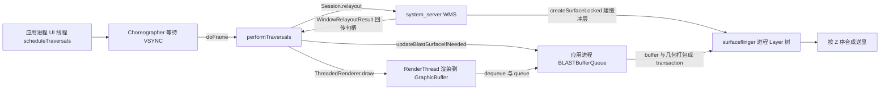
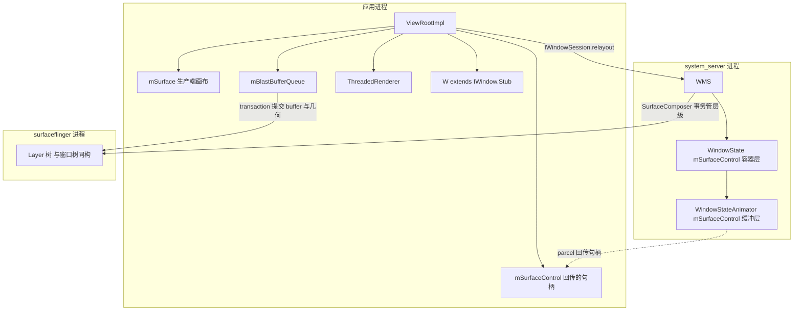
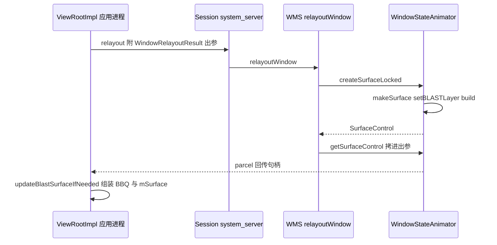
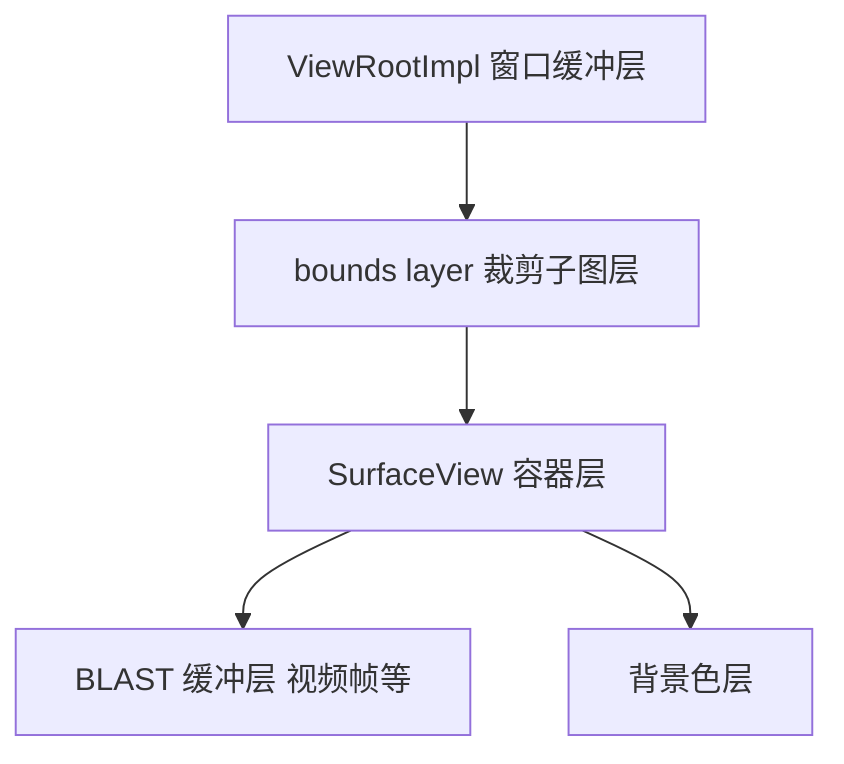

## 1.1 概述：Surface 系统的 Android 16 全景

原书第 8 章基于 Android 2.2/2.3 源码，把 Surface 系统拆成两条主线：应用往 Surface 里画，SurfaceFlinger 把所有 Surface 合成送显。本章用 Android 16 的 frameworks/base 源码把同一条链路重走一遍：窗口如何拿到画布（SurfaceControl 与 Surface 的创建与交接）、一帧如何生产（BLASTBufferQueue 与两条绘制路径）、图层属性如何提交（SurfaceControl.Transaction）。读完本章再回看原书那条 relayout 链路，会发现骨架未变而血肉全换——最典型的例子是 `copyFrom` 这个回传动作，从 2.3 的 `outSurface.copyFrom(surface)` 一路沿用到了今天的 `outSurfaceControl.copyFrom(mSurfaceControl, ...)`。为书写方便，下文将 WindowManagerService 简写为 WMS，SurfaceFlinger 简写为 SF，BLASTBufferQueue 简写为 BBQ；VSYNC（Vertical Synchronization，垂直同步）是显示硬件按固定频率发出的刷新信号，现代图形链路以它为统一节拍。

> 版本注意：源码为 AOSP main 分支，提交时间 2025-03，对应 Android 16 / API 36 开发阶段（下文统称「Android 16 源码」）。本篇以 frameworks/base 为界：Java 层与 JNI（Java Native Interface，Java 本地接口）层逐行走源码；BufferQueue 与 BLASTBufferQueue 的原生实现、SurfaceFlinger 本体在 frameworks/native（libgui）与独立的 surfaceflinger 进程中，跨过 JNI 之处只描述接口契约，不深入另一棵源码树。Android 12 起 BLASTBufferQueue 模型落地：缓冲队列的消费者从 SF 进程搬进应用进程，buffer 连同几何属性打包成事务提交，该骨架至今未变。
>
> 摘编声明：文中代码均为摘编版——保留主干与关键分支，省略日志、trace、兼容开关与样板代码；类名与方法名与 AOSP 一致，代码块首行标注来源类与方法，可对照源码阅读。

### 1.1.1 两条主线没变，三件事换了做法

「应用往 Surface 里画、SF 把所有 Surface 合成送显」这个心智模型从 2.3 到 Android 16 一直成立，变的只是原书演进备注里点出的三件事——谁来分配缓冲、按什么节拍交换、由谁执行绘制：

| 维度 | 原书时代（Android 2.2/2.3） | Android 16 |
|---|---|---|
| 画布分配 | WMS 在 system_server 创建 Surface，经 relayout 的 outSurface 回填给应用 | WMS 只创建并回传 SurfaceControl（图层句柄），缓冲队列由应用进程自建（BLASTBufferQueue） |
| 交换节拍 | SharedBufferStack 双缓冲，条件变量轮询（waitForCondition） | BufferQueue 多缓冲，fence 做跨设备同步，VSYNC 编排全链路 |
| 绘制执行 | UI 线程 lockCanvas 软件绘制 | UI 线程录 RenderNode（DisplayList），RenderThread 异步回放到 GraphicBuffer，硬件加速为默认 |
| 图层控制 | Surface.openTransaction / closeTransaction 全局静态计数 | SurfaceControl.Transaction 对象化，可与 buffer 同帧原子提交（merge） |

### 1.1.2 新旧概念对照

从原书第 8 章过来的读者，先对齐名词：

| 原书概念（2.2/2.3） | Android 16 对应 | 说明 |
|---|---|---|
| ViewRoot | ViewRootImpl | 更名，职责仍是驱动 View 树的遍历与绘制 |
| WMS 侧 Session 持有的 SurfaceSession | system_server 进程级默认连接（Builder 无 session 时 JNI 取 `SurfaceComposerClient::getDefault()`） | 不再每个应用会话一个连接 |
| relayout 的 out Surface | WindowRelayoutResult.surfaceControl（out 参数） | 回传的从「画布」变成「图层句柄」 |
| SharedBufferClient / SharedBufferServer | BufferQueue 生产者/消费者两端（native libgui） | 记账从共享内存里的计数器变为 binder 化的队列 |
| Layer / LayerBuffer / LayerDim / LayerBlur 家族 | BufferLayer / ContainerLayer / EffectLayer 三类 | 图层类型收敛，且组织成与窗口树同构的图层树 |
| Native Surface（Surface.cpp） | Surface（native，持有 IGraphicBufferProducer） | 名字与角色都还在 |
| Surface.openTransaction 静态事务 | SurfaceControl.Transaction | 全局计数换成了可合并的事务对象 |

### 1.1.3 全景调用链与阶段总览

整章沿下面这条链路推进。注意与原书最大的结构差异：system_server 只出现在「发句柄」和「管层级」两环上，buffer 的生产与提交全部在应用进程内完成，SF 收到的直接是「buffer + 几何属性」打包好的事务。



| 阶段 | 进程/线程 | 核心调用链 |
|---|---|---|
| ① 遍历调度 | 应用进程 UI 线程 | scheduleTraversals → Choreographer.postCallback → onVsync → doFrame → performTraversals |
| ② 句柄交接 | 应用进程 ↔ system_server | ViewRootImpl.relayoutWindow → Session.relayout → WMS.relayoutWindow → WindowStateAnimator.createSurfaceLocked → copyFrom 回传 |
| ③ 生产端组装 | 应用进程 UI 线程 | updateBlastSurfaceIfNeeded → new BLASTBufferQueue → createSurface → mSurface.transferFrom |
| ④ 帧生产 | 应用进程 UI 线程 + RenderThread | draw → ThreadedRenderer.draw（或 drawSoftware → lockCanvas）→ buffer 入队 BBQ |
| ⑤ 帧提交与回告 | 应用进程 → surfaceflinger / system_server | BBQ 打包 transaction 提交 SF；reportDrawFinished → finishDrawingWindow |
| ⑥ 图层控制 | 应用进程 / system_server | SurfaceControl.Transaction 的 apply / merge / applyTransactionOnDraw |

## 1.2 整体类关系：Java 壳与 native 芯

原书时代 Java 层的 Surface 已经是 native 对象的壳，但壳里还有 CompatibleCanvas 这类实体；Android 16 的 frameworks/base 里，Surface 体系的 Java 层整体薄成了一层壳——真正的机器（SurfaceComposerClient、BufferQueue、BLASTBufferQueue）都在 frameworks/native 的 libgui 里，Java 层的职责是封装出类型安全的 API，并把对象的生命周期管理对齐到 Java 的引用语义。

### 1.2.1 四个壳类

先给角色表。四个类的字段注释都直白地承认了自己是壳：

| Java 类 | 持有的 native 对象 | 职责 |
|---|---|---|
| SurfaceSession（64 行） | SurfaceComposerClient* | 与 SF 的连接，图层的创建入口；一次连接可创建多个图层 |
| SurfaceControl（5261 行） | SurfaceControl* | 图层句柄：Builder 建层、Transaction 改属性；壳薄，但承载了几乎全部公开 API |
| Surface（1483 行） | Surface*（持有 IGraphicBufferProducer） | 生产端画布：lockCanvas / lockHardwareCanvas、宽高查询 |
| BLASTBufferQueue（213 行） | BLASTBufferQueue* | 应用侧缓冲队列：buffer 的 dequeue/queue 与事务打包都在 native 实现里 |

```java
// [--> SurfaceSession.java]
public final class SurfaceSession {
    // Note: This field is accessed by native code.
    private long mNativeClient; // SurfaceComposerClient*
}

// [--> BLASTBufferQueue.java]
public final class BLASTBufferQueue {
    // Note: This field is accessed by native code.
    public long mNativeObject; // BLASTBufferQueue*
}
```

SurfaceSession 全类只有「创建连接、销毁连接」两个动作，构造函数调用 `nativeCreate()`，native 侧 `new SurfaceComposerClient` 后把指针存进 Java 对象——**SurfaceSession 的本质仍是 JNI 层的 SurfaceComposerClient**，这一点与原书 1.4.2 的结论一致，只是它如今创建在应用进程，而不是 WMS 的 Session 里。

### 1.2.2 一个窗口在两端的持有物

把一个 Activity 窗口牵涉的对象画在一张图上。**WMS 侧每个 WindowState 挂两层 SurfaceControl**：WindowState 自己的 `mSurfaceControl` 是容器层（ContainerLayer，不承载 buffer，只表达窗口树的结构与位置），WindowStateAnimator 再在它下面建一个 `setBLASTLayer()` 的缓冲层（BufferLayer，最终显示的像素画在这层的 buffer 上）；应用侧 ViewRootImpl 拿到的是后者：



「容器层 + 缓冲层」的双层设计是理解现代 WMS 的关键：**窗口树（DisplayContent → Task → ActivityRecord → WindowToken → WindowState）逐节点镜像成图层树，结构与层级关系由容器层表达，像素内容由缓冲层承载**。原书时代 SF 里是一张按 Z 轴排序的扁平 Layer 大军（layersSortedByZ），如今 Z 序由树形父子关系加事务设层共同表达。

### 1.2.3 三个进程与两条 Binder 通道

- **应用 ↔ system_server**：IWindowSession（每进程一个会话）。请求方向 relayout、finishDrawing；回告方向 WMS 经 IWindow（ViewRootImpl 的内部类 W，仍是 `IWindow.Stub`）分发事件与配置变化。
- **应用 / system_server ↔ surfaceflinger**：各自直连。创建图层（createSurface）、提交事务（applyTransaction）都直接发给 SF；VSYNC 事件也由 SF 经 DisplayEventReceiver 的事件连接分发回各进程。原书时代「WMS 包办一切 Surface 事务」的格局，变成了 WMS 与应用各自持有对 SF 的连接。

## 1.3 一个 Activity 的显示：VSYNC 编排下的遍历

链路的起点与原书相同：Activity 显示 = View 树建立 + ViewRootImpl 驱动绘制。本节先走入口，再看现代版最大的不同——遍历不再由应用自发消息触发，而是由 VSYNC 节拍编排。

### 1.3.1 从 handleResumeActivity 到 ViewRootImpl.setView

骨架与 2.3 一致：ActivityThread 在 `handleResumeActivity` 里完成 onResume 后，取 `r.window.getDecorView()` 与 Activity 的 WindowManager，执行 `wm.addView(decor, l)`（ActivityThread.java:5553-5575）；WindowManagerImpl.addView 为每个窗口创建一个 ViewRootImpl，其构造函数与 WMS 世界拉起会话：

```java
// [--> ViewRootImpl.java::ViewRootImpl（摘编）]
public ViewRootImpl(Context context, Display display) {
    // 每个应用进程一个与 WMS 的 IWindowSession 会话
    this(context, display, WindowManagerGlobal.getWindowSession(), new WindowLayout());
    // ......
}
```

两个成员变量是与图形世界的另一条线，初值都是空壳——原书时代 ViewRoot 构造时 `new Surface()` 的写法，如今换成了成对的两个：

```java
// [--> ViewRootImpl.java（字段声明）]
private final SurfaceControl mSurfaceControl = new SurfaceControl(); // 图层句柄，等 relayout 回填
public final Surface mSurface = new Surface();                      // 画布，等 BBQ 组装后移交
```

setView 把 DecorView 存为 mView，向 WMS 登记窗口。与原书 `sWindowSession.add(mWindow, ...)` 对应的现代调用是：

```java
// [--> ViewRootImpl.java::setView（摘编）]
res = mWindowSession.addToDisplayAsUser(mWindow, mWindowAttributes,
        getHostVisibility(), mDisplay.getDisplayId(), userId,
        mInsetsController.getRequestedVisibleTypes(), inputChannel, mTempInsets,
        mTempControls, attachedFrame, compatScale);
```

WMS 侧为窗口建立 WindowState 并挂到窗口树（WindowToken）之下——挂树的瞬间容器层就诞生了，这一点 1.4.2 展开。

### 1.3.2 scheduleTraversals：等 VSYNC，不再自己发消息

原书时代 ViewRoot 继承 Handler，requestLayout 发 DO_TRAVERSAL 消息给自己，什么时候画自己说了算。现代 ViewRootImpl 把节拍交给 Choreographer：

```java
// [--> ViewRootImpl.java::scheduleTraversals（摘编）]
void scheduleTraversals() {
    if (!mTraversalScheduled) {
        mTraversalScheduled = true;
        // 同步屏障：挡住普通消息，保证遍历消息优先执行
        mTraversalBarrier = mHandler.getLooper().getQueue().postSyncBarrier();
        mChoreographer.postCallback(
                Choreographer.CALLBACK_TRAVERSAL, mTraversalRunnable, null);
        // ......
    }
}
```

两个关键机制。其一，**同步屏障（sync barrier）**：插入 Looper 队列的特殊标记，异步消息可越过它、同步消息被挡住——遍历属于异步消息，输入等其他同步消息无法插队到它前面造成帧内状态不一致。其二，**VSYNC 驱动**：postCallback 只是把遍历任务挂到 Choreographer 的 CALLBACK_TRAVERSAL 队列，真正醒来要等下一拍 VSYNC：

```java
// [--> Choreographer.java::FrameDisplayEventReceiver（摘编）]
private final class FrameDisplayEventReceiver extends DisplayEventReceiver
        implements Runnable {
    @Override
    public void onVsync(long timestampNanos, long physicalDisplayId, int frame,
            VsyncEventData vsyncEventData) {
        // ......
        mTimestampNanos = timestampNanos;
        mLastVsyncEventData.copy(vsyncEventData);
        Message msg = Message.obtain(mHandler, this);
        msg.setAsynchronous(true); // 异步消息，配合同步屏障立即执行
        mHandler.sendMessageAtTime(msg, timestampNanos / TimeUtils.NANOS_PER_MS);
    }

    @Override
    public void run() {
        mHavePendingVsync = false;
        doFrame(mTimestampNanos, mFrame, mLastVsyncEventData);
    }
}
```

VSYNC 事件的请求与接收走 DisplayEventReceiver：`scheduleVsync()` 是 native 调用，经与 SF 的事件连接请求下一拍；事件到达后回调 onVsync。doFrame 依次跑 CALLBACK_INPUT、CALLBACK_ANIMATION、CALLBACK_TRAVERSAL 三类回调——**input、animation、draw 三件事被钉在同一拍 VSYNC 里，这就是原书演进备注里「VSYNC 成为系统心跳」在应用侧的落点**。doFrame 最后执行到 mTraversalRunnable，也就是 ViewRootImpl.doTraversal → performTraversals。

### 1.3.3 performTraversals 的三个关键点

performTraversals 依旧是巨函数，抓三个关键调用即可，后两节分别展开第一个与第三个：

```java
// [--> ViewRootImpl.java::performTraversals（摘编）]
relayoutResult = relayoutWindow(params, viewVisibility, insetsPending); // ① 向 WMS 要画布
// ② measure、layout 遍历（performMeasure / performLayout）
draw(fullRedrawNeeded, mSyncGroup, mSyncBuffer);                       // ③ 画
```

①的结果决定③有没有东西可画：relayout 拿不到有效的 SurfaceControl 时，draw 直接返回 false。

## 1.4 relayoutWindow：SurfaceControl 的创建与交接

本节对应原书 1.3「初识 Surface」——同一个问题：ViewRootImpl 构造时的 mSurfaceControl 只是 `new SurfaceControl()` 出来的空壳，它凭什么能代表一块屏幕上的图层？答案仍藏在 relayout 的跨进程往返里，只是往返的内容从 Surface 换成了 SurfaceControl。

### 1.4.1 应用侧：空壳句柄与 WindowRelayoutResult

ViewRootImpl 持有三个空壳：mSurfaceControl（图层句柄）、mSurface（画布）、外加一个承载 relayout 全部出参的 mRelayoutResult。发起请求：

```java
// [--> ViewRootImpl.java::relayoutWindow（摘编）]
relayoutResult = mWindowSession.relayout(mWindow, params,
        requestedWidth, requestedHeight, viewVisibility,
        insetsPending ? WindowManagerGlobal.RELAYOUT_INSETS_PENDING : 0,
        mRelayoutSeq, mLastSyncSeqId, mRelayoutResult);
// mRelayoutResult 是 WindowRelayoutResult（AIDL，Android Interface Definition
// Language 的 out 参数打包容器），其中：
// frames / mergedConfiguration / surfaceControl / insetsState / activeControls / syncSeqId
```

原书 aidl 里那个 `out Surface outSurface`，如今是 `WindowRelayoutResult.surfaceControl`。WMS 只回图层句柄，**画布（生产端的 Surface）不再由 WMS 制造和分发**——这是与原书最根本的分水岭。

### 1.4.2 WMS 侧：容器层与缓冲层

WMS.relayoutWindow（一个三百多行的长方法）里与 Surface 相关的主干只有两步：需要新面时建缓冲层，然后把句柄拷给客户端：

```java
// [--> WindowManagerService.java::relayoutWindow（摘编）]
if (shouldRelayout && outSurfaceControl != null) {
    result = createSurfaceControl(outSurfaceControl, result, win, winAnimator);
}
// else 分支：viewVisibility == VISIBLE 且已有 surface 时，
// 仅经 winAnimator.getSurfaceControl(outSurfaceControl) 复用现有句柄
```

缓冲层的创建在 WindowStateAnimator：

```java
// [--> WindowStateAnimator.java::createSurfaceLocked（摘编）]
SurfaceControl createSurfaceLocked() {
    final WindowState w = mWin;
    if (mSurfaceControl != null) {
        return mSurfaceControl; // 已有则复用
    }
    // ......
    mSurfaceControl = mWin.makeSurface()
            .setParent(w.mSurfaceControl)  // ① 挂到 WindowState 的容器层之下
            .setName(mTitle)
            .setFormat(format)
            .setFlags(flags)
            .setMetadata(METADATA_WINDOW_TYPE, attrs.type) // 窗口类型等元数据
            .setCallsite("WindowSurfaceController")
            .setBLASTLayer()               // ② 声明为 BLAST 缓冲层
            .build();
    w.setHasSurface(true);
    // ......
    return mSurfaceControl;
}
```

两个细节值得展开。其一，`setParent(w.mSurfaceControl)` 的容器层从哪来？窗口挂进窗口树时，WindowContainer 的 onParentChanged 会自动补建：

```java
// [--> WindowContainer.java::onParentChanged（摘编）]
if (mSurfaceControl == null) {
    // If we don't yet have a surface, but we now have a parent, we should
    // build a surface.
    createSurfaceControl(false /*force*/); // makeSurface() → ... → Builder.build()
}
```

其二，`mWin.makeSurface()` 走 `mWmService.makeSurfaceBuilder()`，而这个工厂在 `WindowManagerService.main` 里注入的是 `SurfaceControl.Builder::new`——**无 session 的 Builder**。JNI 侧对无 session 的处理是取进程级默认连接：

```cpp
// [--> android_view_SurfaceControl.cpp::nativeCreate（摘编）]
sp<SurfaceComposerClient> client;
if (sessionObj != NULL) {
    client = android_view_SurfaceSession_getClient(env, sessionObj);
} else {
    client = SurfaceComposerClient::getDefault(); // 进程级默认连接
}
// ...... 组装 parent 句柄与 LayerMetadata 后：
status_t err = client->createSurfaceChecked(String8(name.c_str()), w, h, format,
                                            &surface, flags, parentHandle,
                                            std::move(metadata));
```

对比原书：2.3 时代 WMS 在每个应用的 Session 里创建 SurfaceSession（windowAddedLocked），逐会话持连接；Android 16 的 system_server 直接用进程默认连接批量建层——**图层创建从「每应用会话」降为「每进程一条线」，WMS 的角色收缩为图层树的管理者**。

### 1.4.3 句柄回传：copyFrom 的十四年

创建完成后，WMS 把缓冲层句柄写进出参：

```java
// [--> WindowManagerService.java::createSurfaceControl（摘编）]
surfaceControl = winAnimator.createSurfaceLocked();
if (surfaceControl != null) {
    winAnimator.getSurfaceControl(outSurfaceControl); // 句柄拷给客户端出参
}

// [--> WindowStateAnimator.java]
void getSurfaceControl(SurfaceControl outSurfaceControl) {
    outSurfaceControl.copyFrom(mSurfaceControl, "WindowStateAnimator.getSurfaceControl");
}

// [--> SurfaceControl.java]
public void copyFrom(@NonNull SurfaceControl other, String callsite) {
    mName = other.mName;
    // ...... 宽高等字段
    assignNativeObject(nativeCopyFromSurfaceControl(other.mNativeObject), callsite);
}
```

跨进程的那一跳仍是 parcel：AIDL 应答把出参 SurfaceControl 序列化，客户端 readFromParcel 还原：

```java
// [--> SurfaceControl.java（摘编）]
public void readFromParcel(Parcel in) {
    // ...... name、宽高
    long object = 0;
    if (in.readInt() != 0) {
        object = nativeReadFromParcel(in); // 从 parcel 还原 native SurfaceControl 句柄
    }
    assignNativeObject(object, "readFromParcel");
}
```

native 句柄的本质是跨进程引用 SF 图层的 Binder 对象（native 实现，本篇不展开）。整条回传链与原书 1.3.1 的 `outSurface.copyFrom(surface)` + `writeToParcel/readFromParcel` 逐环对应——**跨进程传的从来不是像素，而是图层的身份**，这一点从 2.3 到今天没变。

### 1.4.4 应用侧组装生产端：updateBlastSurfaceIfNeeded

拿到句柄，ViewRootImpl 立刻在本地把生产端攒齐：

```java
// [--> ViewRootImpl.java::updateBlastSurfaceIfNeeded（摘编）]
if (mBlastBufferQueue != null && mBlastBufferQueue.isSameSurfaceControl(mSurfaceControl)) {
    mBlastBufferQueue.update(mSurfaceControl, // 句柄没换：只更新尺寸与格式
            mSurfaceSize.x, mSurfaceSize.y, mWindowAttributes.format);
    return;
}
// 句柄换了：销毁旧队列、重建，以重置 BufferQueue 与 BBQ 的状态
if (mBlastBufferQueue != null) {
    mBlastBufferQueue.destroy();
}
mBlastBufferQueue = new BLASTBufferQueue(mTag, mSurfaceControl,
        mSurfaceSize.x, mSurfaceSize.y, mWindowAttributes.format);
// 同一 ViewRootImpl 的所有 BBQ 用同一 apply token，避免乱序提交
mBlastBufferQueue.setApplyToken(mBbqApplyToken);
Surface blastSurface = mBlastBufferQueue.createSurface();
// 只在 surface 变化时 transferFrom，避免递增 generationId 导致 EGL 资源重建
mSurface.transferFrom(blastSurface);
```

五个动作：句柄未变则 update 复用；变了则重建 BBQ；设 apply token 保证同窗口的多个队列串行提交；`createSurface()` 从 BBQ 取出生产端画布；`transferFrom` 把画布挪进 ViewRootImpl 的 mSurface——**mSurface 的像素归属权至此落在应用进程自己的 BBQ 上，WMS 从此只管层级、不再经手任何 buffer**。收尾的配套动作是把句柄与队列都交给渲染线程（`mAttachInfo.mThreadedRenderer.setSurfaceControl(mSurfaceControl, mBlastBufferQueue)`），RenderThread 拿 SurfaceControl 直接对接，详见 1.5.2。

relayout 的完整往返：



## 1.5 生产一帧：BLASTBufferQueue 与两条绘制路径

画布就位，本节看一帧怎么画出来、怎么交出去。先认识 BLASTBufferQueue 这个「Android 12 起的新枢纽」，再看硬件与软件两条绘制路径，最后把跨界协议（BufferQueue 与 fence）一次讲清。

### 1.5.1 BLASTBufferQueue：213 行的薄壳

BBQ 的机制从名字就能读出来：**buffer 的提交以事务（transaction）为单位**。Java 类只有薄薄一屏，全部能力经 native 方法下沉：

```java
// [--> BLASTBufferQueue.java（摘编）]
public BLASTBufferQueue(String name, SurfaceControl sc, int width, int height,
        @PixelFormat.Format int format) {
    this(name, true /* updateDestinationFrame */);
    update(sc, width, height, format); // nativeUpdate：换绑 SurfaceControl 与尺寸
}

public BLASTBufferQueue(String name, boolean updateDestinationFrame) {
    mNativeObject = nativeCreate(name, updateDestinationFrame); // native 侧 new BLASTBufferQueue
}

/** 从队列适配器的 IGraphicBufferProducer 取一个 Surface 实例 */
public Surface createSurface() {
    return nativeGetSurface(mNativeObject, false /* includeSurfaceControlHandle */);
}

/** 请求 BBQ 把下一帧 buffer 装进事务，就绪后回调 */
public boolean syncNextTransaction(boolean acquireSingleBuffer,
        @NonNull Consumer<SurfaceControl.Transaction> callback) {
    return nativeSyncNextTransaction(mNativeObject, callback, acquireSingleBuffer);
}

/** 把外部事务并入第 frameNumber 帧的事务，随该帧一起提交 */
public void mergeWithNextTransaction(SurfaceControl.Transaction t, long frameNumber) {
    nativeMergeWithNextTransaction(mNativeObject, t.mNativeObject, frameNumber);
}
```

createSurface 返回的 Surface 背后是 BBQ 适配出的 IGraphicBufferProducer（图形缓冲生产者接口）——ViewRootImpl.mSurface.transferFrom(blastSurface) 挪过来的正是它。BBQ 在 native 侧同时干两件事：作为 BufferQueue 的消费者收应用入队的 buffer；把收到的 buffer 与当帧几何属性（位置、裁剪、缩放等）打包成一个 SurfaceComposer 事务提交给 SF。**应用画完不再「通知 SF 来取」，而是把「内容 + 怎么摆」一起推过去**——事务因此天然原子：这一帧的 buffer 与属性要么一起生效、要么一起不生效。

### 1.5.2 硬件路径：UI 线程录指令，RenderThread 出帧

performTraversals 的 draw 阶段是一个二选一的分支：硬件加速开启时，UI 线程的实质调用只有一行——把整棵 View 树交给渲染线程：

```java
// [--> ViewRootImpl.java::draw（摘编）]
if (isHardwareEnabled()) {
    // ...... 脏区、HDR、同步组等准备工作
    useAsyncReport = true;
    mAttachInfo.mThreadedRenderer.draw(mView, mAttachInfo, this); // 交给渲染线程
} else {
    // ...... 硬件渲染器被禁或不可用：退回软件路径
    if (!drawSoftware(surface, mAttachInfo, xOffset, yOffset,
            scalingRequired, dirty, surfaceInsets)) {
        return false;
    }
}
```

ThreadedRenderer.draw 的机制：UI 线程遍历 View 树，把绘制操作录制成 RenderNode 树（即 DisplayList，展示列表），同步给 RenderThread 后立即返回；RenderThread 在独立线程上回放指令，经 GPU 渲染进从 BBQ dequeue 出来的 GraphicBuffer，渲染完 fence 到位再把 buffer queue 回 BBQ、由 BBQ 打包提交。**UI 线程从「执笔作画」变成「录指令 + 交作业」**，一帧的绘制耗时因此与 UI 线程的响应性脱钩。RenderThread 与图形世界的绑定入口：

```java
// [--> HardwareRenderer.java（摘编）]
/** Sets the SurfaceControl to be used internally inside render thread */
public void setSurfaceControl(@Nullable SurfaceControl surfaceControl,
        @Nullable BLASTBufferQueue blastBufferQueue) {
    nSetSurfaceControl(mNativeProxy, surfaceControl != null ? surfaceControl.mNativeObject : 0);
}
```

回放细节（hwui 的 RenderProxy、Skia 渲染管线）在 frameworks/base 的 native/hwui 与 frameworks/native 中，超出本篇边界，此处只需记住绑定关系：**渲染线程持有 SurfaceControl 与 BBQ，画完直接入队、由 BBQ 提交，全程不再经过 ViewRootImpl 的 mSurface**——mSurface 留给不走硬件管线的调用方（下一小节的软件路径）。

### 1.5.3 软件路径：lockCanvas 还在

View 关闭硬件加速、或 SurfaceHolder 风格的独立绘制，走的仍是原书那条 lockCanvas 链路，只是底下换了解剖结构：

```java
// [--> ViewRootImpl.java::drawSoftware（摘编）]
canvas = mSurface.lockCanvas(dirty);   // ① 从 BBQ 的队列里 dequeue 一块 buffer 当画布
try {
    // ......
    mView.draw(canvas);                // ② DecorView 整树画到这块内存上
} finally {
    surface.unlockCanvasAndPost(canvas); // ③ 解锁并 queue 回队列，触发提交
}
```

Surface.java 层加了双锁保护——同一时刻只允许 lock 一块画布：

```java
// [--> Surface.java::lockCanvas（摘编）]
public Canvas lockCanvas(Rect inOutDirty) {
    synchronized (mLock) {
        checkNotReleasedLocked();
        if (mLockedObject != 0) {
            // nativeLockCanvas 拦不住 native 对象被换掉后的重复加锁，
            // 旧的 mLockedObject 可能仍在使用、不能丢弃，因此直接拒绝二次 lock
            throw new IllegalArgumentException("Surface was already locked");
        }
        mLockedObject = nativeLockCanvas(mNativeObject, mCanvas, inOutDirty);
        return mCanvas;
    }
}
```

JNI 侧一眼就能看到原书的影子：

```cpp
// [--> android_view_Surface.cpp::nativeLockCanvas（摘编）]
ANativeWindow_Buffer buffer;
status_t err = surface->lock(&buffer, dirtyRectPtr); // native Surface：dequeue + 映射内存
// ......
graphics::Canvas canvas(env, canvasObj);
canvas.setBuffer(&buffer, static_cast<int32_t>(surface->getBuffersDataSpace())); // 画布指向 buffer 内存
// unlockCanvasAndPost 对应 surface->unlockAndPost()：queue 回队列
```

`Surface::lock / unlockAndPost` 的内部正是 dequeueBuffer 与 queueBuffer（libgui），1.5.4 展开。另有一条硬件画布通道 `lockHardwareCanvas()`：内部建 HwuiContext，返回硬件加速 Canvas，同样走 unlockCanvasAndPost 提交；其 javadoc 明确要求**每次全量覆盖**（buffer 在帧间不保留，不支持局部更新），与 lockCanvas 的 dirty 区语义相对。

### 1.5.4 跨界一瞥：BufferQueue 协议与 fence

BufferQueue 的实现（libgui）在 frameworks/base 之外，但它的协议是 Surface 体系的地基，必须讲清。**BufferQueue 是图形缓冲的生产者/消费者队列：应用（Surface）是生产者，BLASTBufferQueue 是消费者（再往后 SF 是最终消费者）；每个 GraphicBuffer 在四个状态间流转**：

| 状态 | 含义 | 谁触发迁移 |
|---|---|---|
| FREE | 空闲，可被生产者取用 | 消费者 releaseBuffer 归还 |
| DEQUEUED | 生产者持锁填写中 | 生产者 dequeueBuffer 取出 |
| QUEUED | 已填好排队待消费 | 生产者 queueBuffer 投递 |
| ACQUIRED | 消费者持有使用中 | 消费者 acquireBuffer 取走 |

生产者四操作（dequeueBuffer、queueBuffer、requestBuffer、cancelBuffer）恰好就是原书 1.4.5 里 Native Surface 的那几个方法名——**2.3 时代它们经 ISurface 跨进程打到 SF 侧的 Layer，如今这整套协议搬进了应用进程的 BBQ 里，跨进程只剩最后一跳（打包事务提交）**。与原书 SharedBufferStack 的对照：

| 原书 SharedBufferStack | BufferQueue 时代 |
|---|---|
| head / inUse 标记 FrontBuffer 与 SF 占用 | ACQUIRED 态 |
| queued 计数 | QUEUED 态的 buffer 队列 |
| available 计数 | FREE 态 + dequeueBuffer 的阻塞等待 |
| waitForCondition 条件变量轮询 | fence（内核级同步对象）：GPU/CPU/显示控制器各自的完成信号达成后才放行下一环节 |
| 双缓冲（NUM_BUFFERS = 2） | 多缓冲（典型为三缓冲，Android 4.1 Project Butter 引入） |

fence 是理解现代图形同步的钥匙：buffer 的「画完了」不再是 CPU 上的一个标志位——GPU 可能还在渲染。dequeue 拿到的 buffer 附带 acquire fence（等上一个使用者放行），queue 时附带 release fence（声明「我承诺何时画完」），消费端等 fence 触发才真正使用像素。**原书用条件变量在锁内轮询计数完成的事，现在由内核在各硬件队列之间自动接力完成**。

### 1.5.5 帧的回告：finishDrawing 与 seqId

帧提交给 SF 之后，WMS 还需要知道「这帧画完了」，以便推进窗口的 draw 状态（启动窗口的移除、动画的起播都依赖它）：

```java
// [--> ViewRootImpl.java::reportDrawFinished（摘编）]
private void reportDrawFinished(@Nullable Transaction t, int seqId) {
    mWindowSession.finishDrawing(mWindow, t, seqId); // t：随绘制完成一起提交的事务
    // RemoteException 时就地 apply，避免事务悬死
}
```

WMS 侧 finishDrawingWindow 校验 seqId 后调用 `win.finishDrawing(postDrawTransaction, seqId)`：seqId 来自 relayout 回传的 syncSeqId，过期帧的回告会被丢弃；relayoutResult 里另有 RELAYOUT_RES_CANCEL_AND_REDRAW 标志要求客户端重画（窗口属性在同步途中又变了）。这套「同步绘制」契约由 WMS 的 BLASTSyncEngine 编排，属于 WMS 侧深水区，本篇记住接口语义即可：**relayout 发号、finishDrawing 交号，跨进程的「这一帧按新属性画」有了闭环**。

## 1.6 SurfaceControl.Transaction：图层控制的统一通道

buffer 的提交走 BBQ，那图层属性（位置、透明度、裁剪、Z 序……）呢？答案是 SurfaceControl.Transaction——原书 1.5.3 的 Transaction 概念不仅活着，还吞并了更多职责。

### 1.6.1 从全局计数到对象

原书时代的用法是 `Surface.openTransaction() ... Surface.closeTransaction()`——全局静态计数，配对调用，谁忘关谁死锁。Android 16 的 Transaction 是普通对象，包装着 native 的 `SurfaceComposerClient::Transaction`：

```cpp
// [--> android_view_SurfaceControl.cpp（摘编）]
static jlong nativeCreateTransaction(...) {
    return reinterpret_cast<jlong>(new SurfaceComposerClient::Transaction);
}
static void nativeApplyTransaction(JNIEnv* env, jclass clazz,
        jlong transactionObj, jboolean sync, jboolean oneWay) {
    auto transaction = reinterpret_cast<SurfaceComposerClient::Transaction*>(transactionObj);
    transaction->apply(sync, oneWay); // 单向或同步地提交给 SF
}
static void nativeMergeTransaction(...) {
    transaction->merge(std::move(*otherTransaction)); // 事务合并成一笔
}
```

Java 侧的用法相应变成链式 set + apply：`new Transaction().setAlpha(sc, 0.5f).show(sc).apply()`。apply 家族按阻塞程度分三档（apply 同步、applyAsync 异步、applyAsyncUnsafe 不等回执），加上 merge（并笔）、close（释放）构成全部核心动词。**「攒一批、一次提交、原子生效」的事务语义与原书完全一致，只是从全局单例变成了可传递、可合并的对象**。

### 1.6.2 应用侧实践：挂在帧上的事务

ViewRootImpl 自己示范了 Transaction 的正确打开方式——属性变更尽量与 buffer 同帧生效：

```java
// [--> ViewRootImpl.java::applyTransactionOnDraw（摘编）]
public boolean applyTransactionOnDraw(@NonNull SurfaceControl.Transaction t) {
    if (mRemoved || !isHardwareEnabled()) {
        t.apply(); // 窗口已移除或无硬件渲染：立即提交
    } else {
        // 拷贝并清空传入事务，副本只在渲染线程访问（线程安全）
        mPendingTransaction.merge(t);
        mHasPendingTransactions = true; // draw 时经 mergeWithNextTransaction 与下一帧绑定提交
    }
    return true;
}
```

挂起的 mPendingTransaction 在下一次 draw 时经 `mergeWithNextTransaction(t, frame)` 并入 BBQ 的当帧事务：**新 buffer 与新属性在同一笔事务里抵达 SF，要么同帧可见、要么同帧不可见**——这是消除「属性先到、内容后到」这种一帧闪烁的关键手法。

### 1.6.3 WMS 侧实践：一笔事务提交整棵树

WMS 管理着全部窗口的图层树，它的写入通道有两个：`getSyncTransaction()`（与 BLASTSync 同步引擎联动的活动事务，用于需要等客户端绘制的结构变更）与 `getPendingTransaction()`（常规补写）。层级分配（assignChildLayers）在窗口树遍历中把每层的 layer/setLayer/setRelativeLayer 命令写进同一笔事务统一提交——**原书「layersSortedByZ 排序数组」的 Z 序维护，如今是「树遍历 + 一笔事务」**。窗口动画（SurfaceAnimator）也在同一套通道上给窗口临时套 leash（牵引用的中间层）。细节展开已属 WMS 专题，本篇记住：应用侧的事务尽头是 BBQ 打包的帧事务，WMS 侧的事务尽头是层级事务，两者在 SF 汇合成一棵原子更新的图层树。

## 1.7 专题：SurfaceView

原书把 SurfaceView 放在拓展思考里一笔带过（独立线程 lockCanvas、Camera 预览）。现代 SurfaceView 已成体系：**它在应用进程里自建一棵 SurfaceControl 子树、自管一个 BBQ，与宿主窗口的 View 树只保持位置与 Z 序的协作关系**——视频播放、相机预览、游戏地图都建在它上面。

### 1.7.1 自建三层子树

```java
// [--> SurfaceView.java::createBlastSurfaceControls（摘编）]
if (mSurfaceControl == null) {
    mSurfaceControl = new SurfaceControl.Builder()
            .setName(name)
            .setLocalOwnerView(this)
            .setParent(viewRoot.updateAndGetBoundsLayer(surfaceUpdateTransaction))
            .setContainerLayer()   // ① 容器层：定位 SurfaceView 在窗口中的位置
            .build();
}
if (mBlastSurfaceControl == null) {
    mBlastSurfaceControl = new SurfaceControl.Builder()
            .setName(name + "(BLAST)")
            .setLocalOwnerView(this)
            .setParent(mSurfaceControl) // ② 缓冲层：真正的像素
            .setFlags(mSurfaceFlags)
            .setBLASTLayer()
            .build();
}
if (mBackgroundControl == null) {
    mBackgroundControl = new SurfaceControl.Builder()
            .setName("Background for " + name)
            .setOpaque(true)
            .setColorLayer()      // ③ 背景色层：SurfaceView 尚未绘制时兜底
            .setParent(mSurfaceControl)
            .build();
}
// 缓冲队列：每次都重建适配器（IGBP），图层不重建——旧 buffer 继续显示直到新 buffer 到达
if (mBlastBufferQueue != null) {
    mBlastBufferQueue.destroy();
}
mBlastBufferQueue = new BLASTBufferQueue(name, false /* updateDestinationFrame */);
mBlastBufferQueue.update(mBlastSurfaceControl, mSurfaceWidth, mSurfaceHeight, mFormat);
```

注意这里 `new SurfaceControl.Builder()` 没传 SurfaceSession——应用进程同样走 `SurfaceComposerClient::getDefault()` 的进程级连接，**应用如今有权直接在 SF 里建层**，这在原书时代是不可想象的（那时建层必须经 WMS）。三层结构与宿主窗口的关系：



### 1.7.2 与宿主窗口的协作

SurfaceView 的图层不在宿主窗口的缓冲层里，两者是兄弟图层，由 SF 合成时叠在一起。协作点有三：位置同步（容器层的 position/裁剪跟随 View 布局，经事务提交）；Z 序（默认在宿主窗口之下，`setZOrderedOnTop(true)` 可翻到其上）；打洞——SurfaceView 所在区域把宿主窗口「挖空」才能露出下层内容，类 javadoc 对代价说得很直白：

> The surface is Z ordered so that it is behind the window holding its SurfaceView; the SurfaceView punches a hole in its window to allow its surface to be displayed. ... it can have an impact on performance since a full alpha-blended composite will be performed each time the Surface changes.
>
> Surface 位于宿主窗口之下，SurfaceView 在窗口上打洞让自己的 surface 露出来；在 Surface 上叠加控件（如播放器按钮）可行，但每次 Surface 内容变化都会引发一次整层的 alpha 混合合成，有性能代价。

应用拿到画布的方式与 ViewRootImpl 同构：`mSurface.copyFrom(mBlastBufferQueue)`（SurfaceView.java:1508），随后经 SurfaceHolder.Callback 通知——surfaceCreated（拿到画布，可开绘）、surfaceChanged（尺寸/格式变化）、surfaceDestroyed（画布即将失效，必须停笔）。时序上这些回调在 UI 线程经 updateWindow 的 relayout 往返后触发，**重布局 relayout 一次、回调一批，回调里拿到的 Surface 保证可用**。

### 1.7.3 与 2.3 对照

| 维度 | 原书时代 | Android 16 |
|---|---|---|
| 建层 | WMS 特殊处理（SurfaceView 的窗口标记 + SF 端 LayerBuffer） | 应用进程自建 SurfaceControl 子树，挂宿主窗口 bounds layer 下 |
| 数据通道 | push buffer / 独立 lockCanvas，绕过 ViewRoot | 自管 BBQ，buffer 以事务提交，与窗口共用一套 VSYNC 编排 |
| 与宿主关系 | 打洞由 SF 特判 | 兄弟图层打洞，Z 序与位置经事务同步 |

## 1.8 使用时要注意的点

逐条过源码级的坑位，每条先讲语义再给佐证。

**1. SurfaceControl 的空壳与句柄语义。** `new SurfaceControl()` 创建的空壳唯一用途是承接 out 参数或 parcel——ViewRootImpl 的 mSurfaceControl 一生都在被 copyFrom 重填。parcel 传的是图层身份的引用拷贝而非图层本身：**两端 SurfaceControl 指向同一个 SF 图层，release 本地对象只断本地引用，图层生死由创建端与引用计数决定**。因此跨进程传递 SurfaceControl 是廉价且安全的，但不能指望「release 了对端就失效」。

**2. Surface.release 与 destroy 不是同义词。** javadoc 写明分工：

```java
// [--> Surface.java（摘编）]
/**
 * Release the local reference to the server-side surface.
 * Always call release() when you're done with a Surface.
 */
public void release() { /* 释放本地引用 */ }

/**
 * Free all server-side state associated with this surface and
 * release this object's reference. This method can only be
 * called from the process that created the surface.
 */
public void destroy() { /* nativeDestroy + release */ }
```

**destroy 会连带释放服务端状态，只能在创建图层/队列的进程调用**；跨进程拿到的 Surface 只配 release。ViewRootImpl.destroySurface 里对本进程创建的 BBQ 调 destroy、对回传句柄调 release，正是这个规矩的示范。

**3. lockCanvas 的双锁与同实例约束。** lockCanvas 二次调用直接抛 `IllegalArgumentException("Surface was already locked")`；unlockCanvasAndPost 校验传入 canvas 必须是 lockCanvas 返回的同一个实例（`canvas != mCanvas` 抛异常）。SurfaceHolder 常见的「锁了忘解、解锁用错 canvas」两类崩溃都源于此。另注意 lockHardwareCanvas 不保留上一帧内容，**每帧必须全量覆盖**，按 lockCanvas 的 dirty 局部刷新思路写会得到残影或黑块。

**4. 事务时机：能挂帧就不要裸 apply。** ViewRootImpl.applyTransactionOnDraw 的分支说明了一般原则：硬件渲染在跑时，属性事务应并入当帧（merge 进 BBQ 的帧事务），让 buffer 与属性原子生效；`t.apply()` 裸提交只在窗口不可绘制或无硬件渲染时兜底。SurfaceView 的位置更新同样走 `surfaceUpdateTransaction` 与重布局事务合并，而非逐条即时 apply。**在自己代码里对窗口内图层做频繁属性动画时，优先 Choreographer 对齐 VSYNC 后随帧提交，而不是 apply 完事**。

**5. SurfaceView 的合成代价与 Z 序。** 打洞机制意味着 Surface 上方的任何控件（播放器控制条）都会触发整层 alpha 混合；对高帧率视频叠复杂 UI，要么接受合成开销，要么把控件画到视频里（如字幕烧录）或用 `setZOrderedOnTop` 重新规划遮挡。另外 SurfaceView 内容变化不经宿主窗口的 invalidate 链，**宿主 View 的 onDraw 看不到 SurfaceView 的任何内容**——经 View 树绘制到 bitmap 的截图路径（如对 DecorView 做 draw）拿到的只会是一个洞，系统级截图走 SF 合成才能拍到视频画面。

**6. 观测工具就在源码里。** SurfaceControl 上的 jank 数据（addOnJankDataListener、TransactionHangCallback）、`dumpsys SurfaceFlinger` 的图层树、Choreographer 的 FrameTimeline（Perfetto 可视化）——原书时代靠 printf 调 Surface 的日子，如今有系统级的观测面，排「掉帧在哪一环」先看这些再读代码。

一句收尾：从 2.3 到 Android 16，Surface 体系把「画布的分配权」下放给应用、把「交换的节拍」交给 VSYNC 与 fence、把「绘制的手」换成了 RenderThread——但 Surface 仍是那块画布，SurfaceFlinger 仍是那个合成器，读懂原书的两条主线，就读懂了这盘棋的下法。

## 1.9 总结：2.3 → 16 的变与不变

| 环节 | 2.2/2.3 | Android 16 |
|---|---|---|
| 画布来源 | WMS 创建 Surface，outSurface 回填 | WMS 回传 SurfaceControl 句柄，应用自建 BBQ 与 Surface |
| 缓冲协调 | SharedClient 共享内存计数 + 条件变量 | 进程内 BufferQueue + fence，跨进程只传打包事务 |
| 帧节拍 | 画完即提交，各自为政 | VSYNC 编排 input/animation/draw，FrameTimeline 全链路对齐 |
| 绘制 | UI 线程 lockCanvas 软件绘制 | UI 线程录 RenderNode，RenderThread + GPU 出帧 |
| 图层组织 | SF 内扁平 Z 序数组 | 与窗口树同构的图层树，容器层与缓冲层分离 |
| 事务 | 全局 open/close 计数 | 对象化 Transaction，merge 进帧事务原子生效 |

不变的是三样东西：**跨进程传身份不传像素**（parcel 里永远是句柄与 fd）、**生产者消费者的四步协议**（dequeue、queue、acquire、release，连方法名都没换）、**copyFrom 这个回传动作**。原书末尾说「变化只是谁来分配缓冲、按什么节拍交换、由谁执行绘制这三件事的实现方式」——本章逐行走完 Android 16 源码后，可以给这句话补上下半句：这三件事的实现方式，如今都有了源码级的着落。
