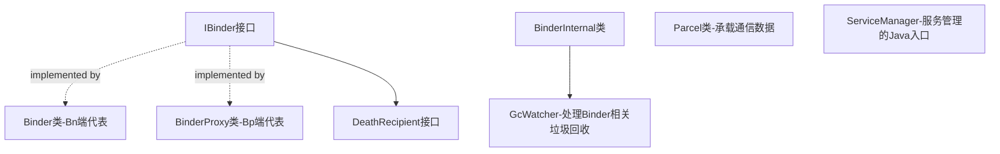
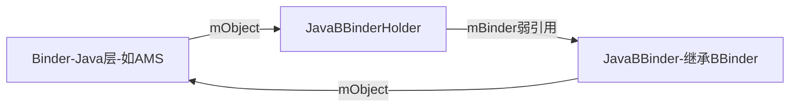
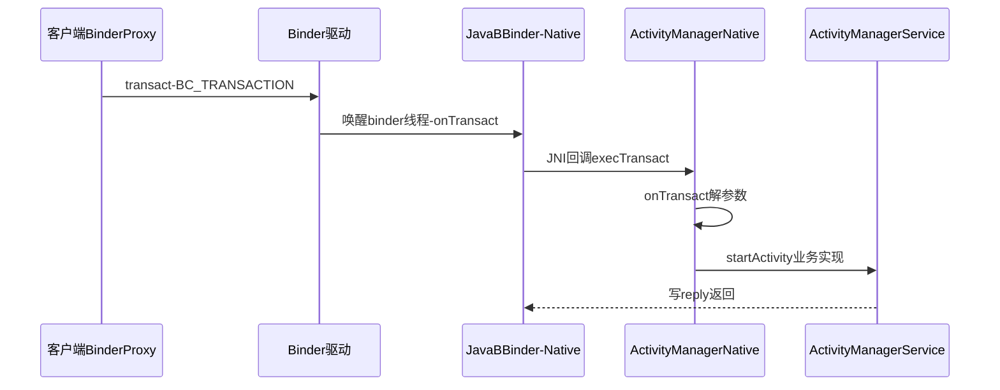
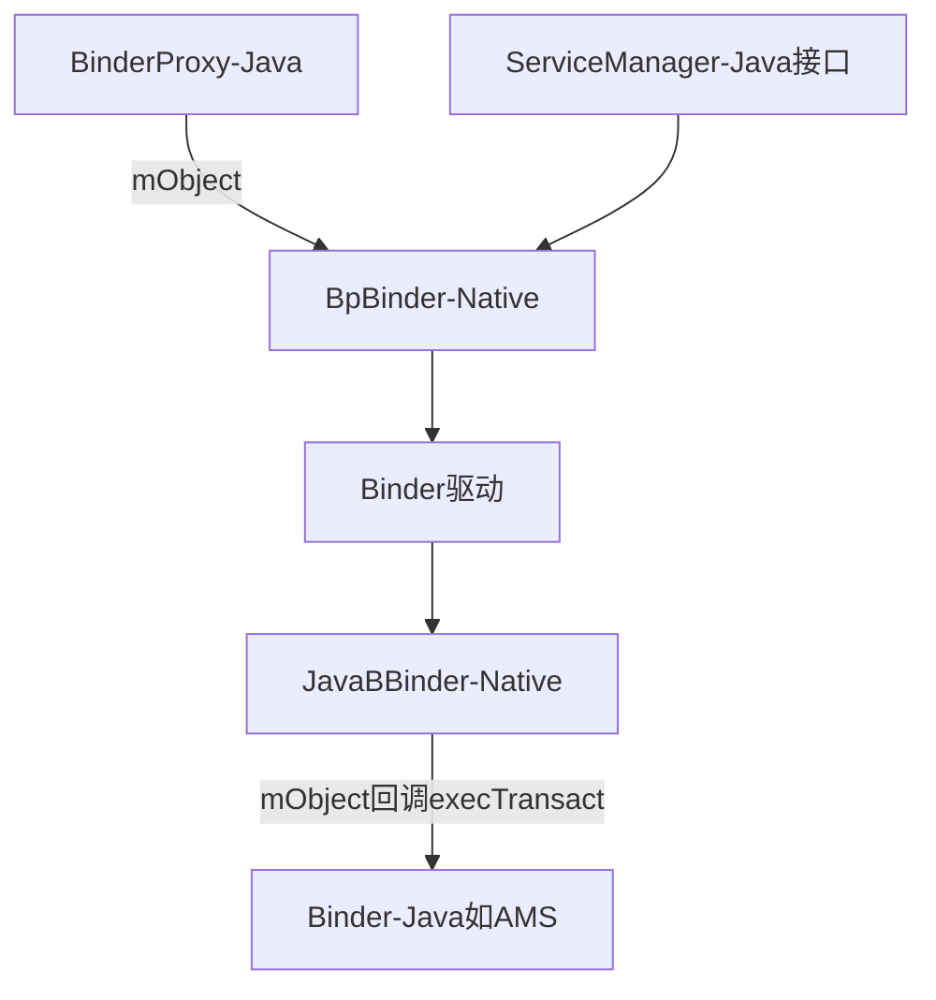
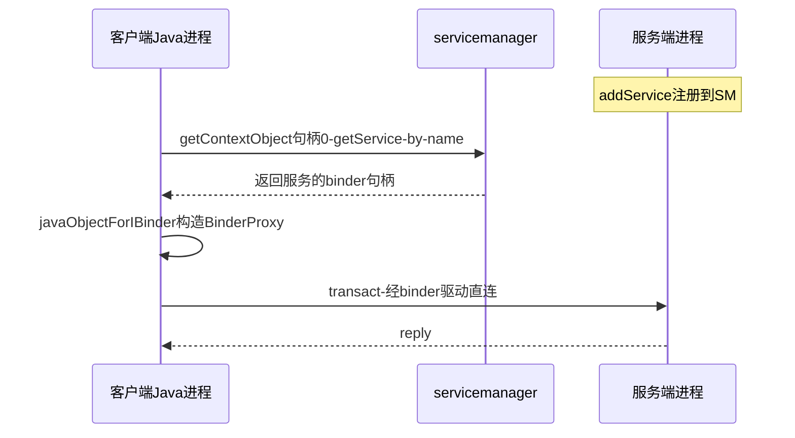
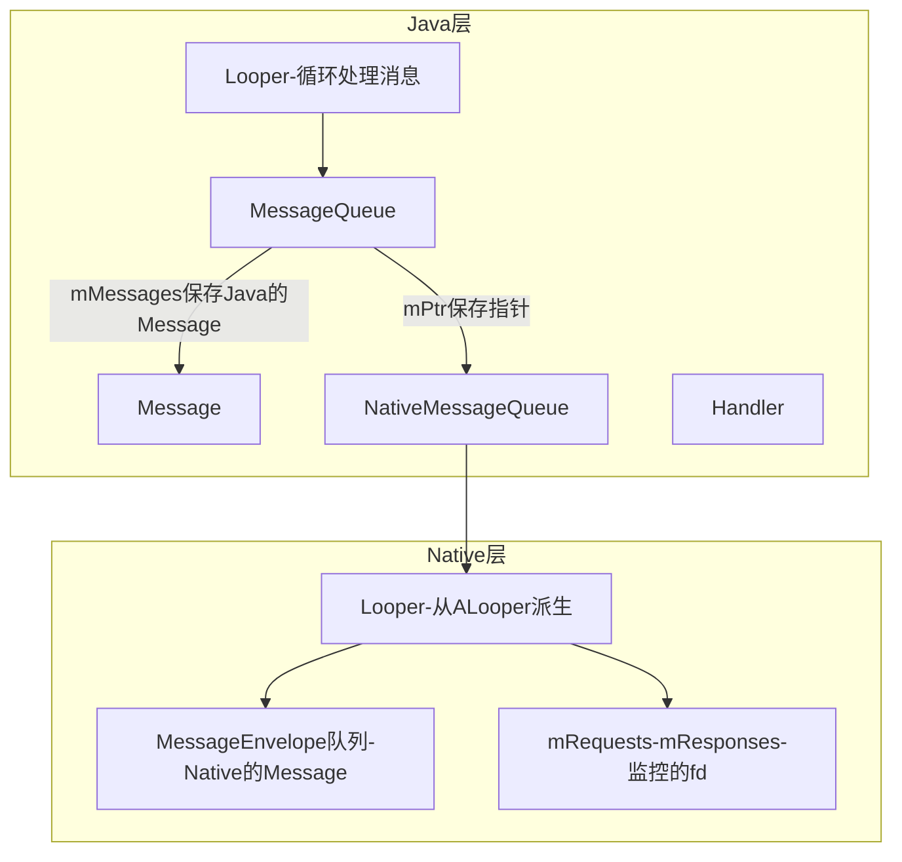

## 1.1 概述

作为全书 Android 分析之旅的开篇,本章关注两个基础知识点:

- **Binder 系统在 Java 层的布局和工作方式**:Java 层 Binder 是 Native 层 Binder 的一个"镜像",但镜像终归要借助 Native 层工作,二者关系在框架初始化和每次跨进程调用中都有体现
- **MessageQueue 的新职责**:Android 2.3 起 MessageQueue 的核心部分下移到 Native 层,从此它"心系两界"——不仅服务 Java 层的 Message,还处理 Native 层的 Message 与被监控文件句柄的事件

涉及的源码文件(均在 4.0 源码树中):

| 文件 | 位置 |
|---|---|
| IBinder.java / Binder.java / ServiceManager.java / ServiceManagerNative.java / MessageQueue.java | `frameworks/base/core/java/android/os/` |
| BinderInternal.java | `frameworks/base/core/java/com/android/internal/os/` |
| android_util_Binder.cpp | `frameworks/base/core/jni/` |
| android_os_MessageQueue.cpp | `frameworks/base/core/jni/` |
| Looper.cpp / Looper.h | `frameworks/base/native/android/`(Native Looper) |
| ActivityManagerService.java | `frameworks/base/services/java/com/android/server/` |

原书建议先读卷 I 第 6 章"深入理解 Binder"(Native 层)与卷 I 第 2 章(JNI),本章不重复展开 Native Binder 的驱动交互细节。

## 1.2 Java 层 Binder 架构分析

### 1.2.1 Binder 架构总览

Java 层 Binder 也是一个 C/S 架构,且类命名尽量与 Native 层保持一致——**Java 层 Binder 架构是 Native 层 Binder 架构的一个镜像**。家族成员如下:



- 系统定义了 **IBinder** 接口类与 **DeathRecipient** 接口(死亡通知,见 1.2.7)
- **Binder** 类与 **BinderProxy** 类分别实现 IBinder:Binder 是服务端 Bn 端的代表,BinderProxy 是客户端 Bp 端的代表
- **BinderInternal** 是仅供 Binder 框架内部使用的类,其中的 GcWatcher 专门处理与 Binder 相关的垃圾回收
- **Parcel** 承载通信数据

IBinder 接口中定义了一个重要的整型标志 **FLAG_ONEWAY**:普通 Binder 调用与普通函数调用一样,客户端阻塞直到服务端返回;而指定 FLAG_ONEWAY 后,**客户端只要把请求发送到 Binder 驱动即可返回,不必等服务端结果**。Native 层的 Binder 调用基本都是阻塞式的,但 Java 层 framework 中 FLAG_ONEWAY 的使用非常多。

> **思考:使用 FLAG_ONEWAY 的程序在设计上有什么特点?** 客户端发出请求后并不确定服务端何时处理完,所以客户端一般会向服务端注册一个回调(同样是跨进程 Binder 调用),服务端处理完后调用回调通知结果——这种回调也大多采用 FLAG_ONEWAY 方式。

### 1.2.2 初始化 Java 层 Binder 框架

Java 初创时期,系统会提前注册一批 JNI 函数,其中 `register_android_os_Binder` 专门负责搭建 Java Binder 与 Native Binder 的交互关系:

```cpp
// android_util_Binder.cpp :: register_android_os_Binder
int register_android_os_Binder(JNIEnv* env) {
    // 初始化 Java Binder 类和 Native 层的关系
    if (int_register_android_os_Binder(env) < 0)
        return -1;
    // 初始化 Java BinderInternal 类和 Native 层的关系
    if (int_register_android_os_BinderInternal(env) < 0)
        return -1;
    // 初始化 Java BinderProxy 类和 Native 层的关系
    if (int_register_android_os_BinderProxy(env) < 0)
        return -1;
    // 初始化 Java Parcel 类和 Native 层的关系
    if (int_register_android_os_Parcel(env) < 0)
        return -1;
    return 0;
}
```

#### 1. Binder 类的初始化

```cpp
// android_util_Binder.cpp :: int_register_android_os_Binder(节选)
static int int_register_android_os_Binder(JNIEnv* env) {
    jclass clazz;
    // kBinderPathName 为 Java 层 Binder 类的全路径名 "android/os/Binder"
    clazz = env->FindClass(kBinderPathName);
    // gBinderOffsets 是一个静态对象,保存 Binder 类在 JNI 层要用到的信息
    gBinderOffsets.mClass = (jclass) env->NewGlobalRef(clazz);
    // execTransact 函数的 methodID,native 层收到请求后要回调它
    gBinderOffsets.mExecTransact = env->GetMethodID(clazz, "execTransact", "(IIII)Z");
    // Binder 类中 mObject 成员的 fieldID,用来保存 Native 对象指针
    gBinderOffsets.mObject = env->GetFieldID(clazz, "mObject", "I");
    // 注册 Binder 类中 native 函数的实现
    return AndroidRuntime::registerNativeMethods(
            env, kBinderPathName, gBinderMethods, NELEM(gBinderMethods));
}
```

#### 2. BinderInternal 类的初始化

```cpp
// android_util_Binder.cpp :: int_register_android_os_BinderInternal(节选)
static int int_register_android_os_BinderInternal(JNIEnv* env) {
    jclass clazz;
    // 全路径名为 "com/android/internal/os/BinderInternal"
    clazz = env->FindClass(kBinderInternalPathName);
    gBinderInternalOffsets.mClass = (jclass) env->NewGlobalRef(clazz);
    // 获取静态方法 forceBinderGc 的 methodID,native 层可主动触发 Java GC
    gBinderInternalOffsets.mForceGc =
            env->GetStaticMethodID(clazz, "forceBinderGc", "()V");
    return AndroidRuntime::registerNativeMethods(env, kBinderInternalPathName,
            gBinderInternalMethods, NELEM(gBinderInternalMethods));
}
```

#### 3. BinderProxy 类的初始化

```cpp
// android_util_Binder.cpp :: int_register_android_os_BinderProxy(节选)
static int int_register_android_os_BinderProxy(JNIEnv* env) {
    jclass clazz;
    clazz = env->FindClass("java/lang/ref/WeakReference");
    // gWeakReferenceOffsets 用来和 WeakReference 类打交道
    gWeakReferenceOffsets.mClass = (jclass) env->NewGlobalRef(clazz);
    gWeakReferenceOffsets.mGet = env->GetMethodID(clazz, "get", "()Ljava/lang/Object;");
    clazz = env->FindClass("java/lang/Error");
    // gErrorOffsets 用来和 Error 类打交道(抛异常用)
    gErrorOffsets.mClass = (jclass) env->NewGlobalRef(clazz);
    clazz = env->FindClass(kBinderProxyPathName);
    // gBinderProxyOffsets 用来和 BinderProxy 类打交道
    gBinderProxyOffsets.mClass = (jclass) env->NewGlobalRef(clazz);
    gBinderProxyOffsets.mConstructor = env->GetMethodID(clazz, "<init>", "()V");
    // ...... 获取 BinderProxy 的 mObject/mSelf/mOrgue 等 fieldID
    clazz = env->FindClass("java/lang/Class");
    // gClassOffsets 用来和 Class 类打交道
    gClassOffsets.mGetName = env->GetMethodID(clazz, "getName", "()Ljava/lang/String;");
    return AndroidRuntime::registerNativeMethods(env, kBinderProxyPathName,
            gBinderProxyMethods, NELEM(gBinderProxyMethods));
}
```

除了 BinderProxy 自身,这里还额外缓存了 WeakReference、Error、Class 三个类的信息——**BinderProxy 对象的生命周期会委托 WeakReference 管理**,所以 JNI 层需要 WeakReference.get 的 methodID。

初始化工作总结:**框架初始化就是提前获取 JNI 层要用的 methodID/fieldID 并注册 native 函数实现**。这项工作必不可少——每次使用时再去查询这些 ID 会浪费时间,Binder 调用频繁时累积开销不容小觑。

### 1.2.3 addService 实例分析:窥一斑而见全豹

本节以 AMS 为例揭示 Java 层 Binder 的工作原理,分两步:先分析 AMS 如何把自己注册到 ServiceManager,再分析它如何响应客户端请求。起点是 `setSystemProcess`:

```java
// ActivityManagerService.java :: setSystemProcess(节选)
public static void setSystemProcess() {
    try {
        ActivityManagerService m = mSelf;
        // 将 AMS 服务注册到 ServiceManager 中
        ServiceManager.addService("activity", m);
        ......
    }
    ......
}
```

Android 系统中有一个 Native 的 **ServiceManager**(下称 SM)进程,统筹管理所有 Service;成为 Service 的首要条件是在 SM 中注册。

#### 1. 创建 ServiceManagerProxy

```java
// ServiceManager.java(节选)
public static void addService(String name, IBinder service) {
    try {
        getIServiceManager().addService(name, service);  // 关键在 getIServiceManager 返回什么
    } ......
}

private static IServiceManager getIServiceManager() {
    ......
    // 调用 asInterface,传递的参数是 IBinder 类型
    sServiceManager = ServiceManagerNative.asInterface(
            BinderInternal.getContextObject());
    return sServiceManager;
}
```

`BinderInternal.getContextObject()` 是 native 函数:

```cpp
// android_util_Binder.cpp :: android_os_BinderInternal_getContextObject
static jobject android_os_BinderInternal_getContextObject(JNIEnv* env, jobject clazz) {
    /*
     * 下面这句代码返回一个 BpBinder 对象,其中 NULL(即 0,用于标识目的端)
     * 指定该 Proxy 的通信目的端是 ServiceManager(句柄 0)
     */
    sp<IBinder> b = ProcessState::self()->getContextObject(NULL);
    // 由 Native 对象创建一个 Java 对象
    return javaObjectForIBinder(env, b);
}
```

```cpp
// android_util_Binder.cpp :: javaObjectForIBinder(节选)
jobject javaObjectForIBinder(JNIEnv* env, const sp<IBinder>& val) {
    // mProxyLock 是一个全局的静态 CMutex 对象
    AutoMutex _l(mProxyLock);
    /*
     * Native 层的 BpBinder 中有一个 ObjectManager,管理在它之上创建的 Java
     * BinderProxy 对象。findObject 判断是否已有旧的 Java 对象挂在其上;
     * 如果有,通过 WeakReference.get 取回并删除旧的全局引用
     */
    jobject object = (jobject) val->findObject(&gBinderProxyOffsets);
    if (object != NULL) {
        jobject res = env->CallObjectMethod(object, gWeakReferenceOffsets.mGet);
        android_atomic_dec(&gNumProxyRefs);
        val->detachObject(&gBinderProxyOffsets);
        env->DeleteGlobalRef(object);
    }
    // 创建一个新的 BinderProxy 对象
    object = env->NewObject(gBinderProxyOffsets.mClass,
            gBinderProxyOffsets.mConstructor);
    // 把 BpBinder 指针保存到 BinderProxy 的 mObject 成员中
    env->SetIntField(object, gBinderProxyOffsets.mObject, (int) val.get());
    val->incStrong(object);
    // 把该 BinderProxy 的弱引用注册(attach)到 BpBinder 的 ObjectManager 中,
    // 并注册回收函数 proxy_cleanup——BinderProxy 撤销时释放资源
    jobject refObject = env->NewGlobalRef(
            env->GetObjectField(object, gBinderProxyOffsets.mSelf));
    val->attachObject(&gBinderProxyOffsets, refObject,
            jnienv_to_javavm(env), proxy_cleanup);
    // DeathRecipientList 保存用于死亡通知的 list,并与 BinderProxy 关联
    sp<DeathRecipientList> drl = new DeathRecipientList;
    drl->incStrong((void*) javaObjectForIBinder);
    env->SetIntField(object, gBinderProxyOffsets.mOrgue,
            reinterpret_cast<int>(drl.get()));
    // 创建的 Proxy 对象一旦超过 200 个,将调用 BinderInternal 的 forceBinderGc
    // 做一次垃圾回收
    incRefsCreated(env);
    return object;
}
```

该函数完成两件事:**创建一个 Java 层的 BinderProxy 对象;并通过 JNI 把它与一个 Native 的 BpBinder 对象挂钩**,该 BpBinder 的通信目标就是 ServiceManager。

Native 层有著名的 `interface_cast` 宏,Java 层没有宏,但定义了类似的 **asInterface** 函数:

```java
// ServiceManagerNative.java :: asInterface(节选)
static public IServiceManager asInterface(IBinder obj) {
    ......
    // 以 obj 为参数,创建一个 ServiceManagerProxy 对象
    return new ServiceManagerProxy(obj);
}
```

这与 `interface_cast<IServiceManager>(...)` 完全类似:以一个 BpBinder 对象为参数,构造一个与业务相关的 Proxy 对象。ServiceManagerProxy 的各业务函数将请求打包后交给 BpBinder,最终由 BpBinder(实际是 IPCThreadState)发给 Binder 驱动。

#### 2. addService 函数分析

```java
// ServiceManagerNative.java :: ServiceManagerProxy.addService
public void addService(String name, IBinder service) throws RemoteException {
    Parcel data = Parcel.obtain();
    Parcel reply = Parcel.obtain();
    data.writeInterfaceToken(IServiceManager.descriptor);
    data.writeString(name);
    // 注意 writeStrongBinder,后文详细分析
    data.writeStrongBinder(service);
    // mRemote 实际上就是 BinderProxy 对象,调用它的 transact 把请求发送出去
    mRemote.transact(ADD_SERVICE_TRANSACTION, data, reply, 0);
    reply.recycle();
    data.recycle();
}
```

`BinderProxy.transact` 是 native 函数:

```cpp
// android_util_Binder.cpp :: android_os_BinderProxy_transact(节选)
static jboolean android_os_BinderProxy_transact(JNIEnv* env, jobject obj,
        jint code, jobject dataObj, jobject replyObj, jint flags) {
    // 从 Java 的 Parcel 对象中得到 Native 的 Parcel 对象
    Parcel* data = parcelForJavaObject(env, dataObj);
    if (data == NULL) return JNI_FALSE;
    // 得到一个用于接收回复的 Parcel 对象
    Parcel* reply = parcelForJavaObject(env, replyObj);
    if (reply == NULL && replyObj != NULL) return JNI_FALSE;
    // 从 Java 的 BinderProxy 对象中得到之前创建好的那个 Native BpBinder 对象
    IBinder* target = (IBinder*)
            env->GetIntField(obj, gBinderProxyOffsets.mObject);
    ......
    // 通过 Native 的 BpBinder 对象,将请求发送给 ServiceManager
    status_t err = target->transact(code, *data, reply, flags);
    ......
    signalExceptionForError(env, obj, err);  // 出错时转换成 Java 异常
    return JNI_FALSE;
}
```

**Java 层的 Binder 最终还是要借助 Native 的 Binder 进行通信**。原书在此有一段架构体会:Binder 的目的是简单的——打开 binder 设备、读请求、写回复;架构是复杂的——各种接口类与封装类。ServiceManager 作为 Binder 的核心程序,甚至完全不走这套架构,直接读 `/dev/binder`。研究源码时要先搞清目的,脱离目的的实现如缘木求鱼。

#### 3. 三人行:Binder、JavaBBinderHolder 和 JavaBBinder

`writeStrongBinder` 特殊在哪?AMS 从 ActivityManagerNative 派生,而 ActivityManagerNative 又从 Binder 派生:

```java
// ActivityManagerNative.java(节选)
public abstract class ActivityManagerNative extends Binder implements IActivityManager {
    public ActivityManagerNative() {
        attachInterface(this, descriptor);  // 把自己保存为本地接口,供同进程查询
    }
    // 这是其父类 Binder 的构造函数
    public Binder() {
        init();  // native 函数
    }
}
```

```cpp
// android_util_Binder.cpp :: android_os_Binder_init
static void android_os_Binder_init(JNIEnv* env, jobject obj) {
    // 创建一个 JavaBBinderHolder 对象
    JavaBBinderHolder* jbh = new JavaBBinderHolder();
    jbh->incStrong((void*) android_os_Binder_init);
    // 将这个 JavaBBinderHolder 对象保存到 Java Binder 对象的 mObject 成员中
    env->SetIntField(obj, gBinderOffsets.mObject, (int) jbh);
}
```

```cpp
// android_util_Binder.cpp :: JavaBBinderHolder(骨架)
class JavaBBinderHolder : public RefBase {
public:
    sp<JavaBBinder> get(JNIEnv* env, jobject obj) {
        AutoMutex _l(mLock);
        sp<JavaBBinder> b = mBinder.promote();   // mBinder 是弱引用 wp
        if (b == NULL) {
            // 第一次调用:创建一个 JavaBBinder,obj 是 Java 层的 Binder 对象
            b = new JavaBBinder(env, obj);
            mBinder = b;
        }
        return b;
    }
private:
    Mutex mLock;
    wp<JavaBBinder> mBinder;   // 注意:弱引用
};
```

JavaBBinderHolder 仅从 RefBase 派生,**不属于 Binder 家族**——但它的 get 函数创建的 JavaBBinder 正是从 BBinder(即 Bn 端基类)派生的。get 函数的调用点就在 writeStrongBinder 中:

```cpp
// android_util_Binder.cpp :: android_os_Parcel_writeStrongBinder
static void android_os_Parcel_writeStrongBinder(JNIEnv* env,
        jobject clazz, jobject object) {
    // parcel 是 Native 对象,真正写入 Parcel 的是 ibinderForJavaObject 的返回值
    const status_t err = parcel->writeStrongBinder(
            ibinderForJavaObject(env, object));
}

// android_util_Binder.cpp :: ibinderForJavaObject
sp<IBinder> ibinderForJavaObject(JNIEnv* env, jobject obj) {
    // 如果 obj 是 Binder 类:先取得 JavaBBinderHolder,再调用其 get 得到 JavaBBinder
    if (env->IsInstanceOf(obj, gBinderOffsets.mClass)) {
        JavaBBinderHolder* jbh = (JavaBBinderHolder*)
                env->GetIntField(obj, gBinderOffsets.mObject);
        return jbh != NULL ? jbh->get(env, obj) : NULL;
    }
    // 如果 obj 是 BinderProxy 类:直接返回 Native 的 BpBinder 对象
    if (env->IsInstanceOf(obj, gBinderProxyOffsets.mClass)) {
        return (IBinder*) env->GetIntField(obj, gBinderProxyOffsets.mObject);
    }
    return NULL;
}
```

**addService 实际添加到 Parcel 的并不是 AMS 本身,而是一个 JavaBBinder 对象**——是它最终被传递到 Binder 驱动。三者关系:



- Java 层的 Binder 通过 `mObject` 指向 Native 层的 JavaBBinderHolder
- JavaBBinderHolder 通过 `mBinder` 指向 JavaBBinder
- JavaBBinder 又通过自己的 `mObject` 指回 Java 层的 Binder 对象

为什么不让 Binder 直接指向 JavaBBinder?原书的推测是**与垃圾回收有关**——mBinder 被定义成弱引用 `wp<JavaBBinder>`,没有强引用阻拦,JavaBBinder(以及它持有的 Java 对象引用)可按 GC 规则正常回收。

### 1.2.4 AMS 响应请求:JavaBBinder 是个传声筒

Native 层的 Binder 架构中,Bn 端对象本身就是业务对象(如 MediaPlayerService);而 JavaBBinder 却**与业务完全无关**。它如何实现不同业务?看它的 onTransact:

```cpp
// android_util_Binder.cpp :: JavaBBinder::onTransact(节选)
virtual status_t onTransact(uint32_t code, const Parcel& data,
        Parcel* reply, uint32_t flags = 0) {
    JNIEnv* env = javavm_to_jnienv(mVM);
    IPCThreadState* thread_state = IPCThreadState::self();
    ......
    // 调用 Java 层 Binder 对象的 execTransact 函数,mObject 即 AMS
    jboolean res = env->CallBooleanMethod(mObject,
            gBinderOffsets.mExecTransact, code,
            (int32_t) &data, (int32_t) reply, flags);
    ......
    return res != JNI_FALSE ? NO_ERROR : UNKNOWN_TRANSACTION;
}
```

```java
// Binder.java :: execTransact
private boolean execTransact(int code, int dataObj, int replyObj, int flags) {
    // 用两个 int 型指针构造 Java 层的 Parcel
    Parcel data = Parcel.obtain(dataObj);
    Parcel reply = Parcel.obtain(replyObj);
    boolean res;
    try {
        // 调用 onTransact,派生类可以重载这个函数以完成业务功能
        res = onTransact(code, data, reply, flags);
    } ......
    reply.recycle();
    data.recycle();
    return res;
}
```

```java
// ActivityManagerNative.java :: onTransact(节选)
public boolean onTransact(int code, Parcel data, Parcel reply, int flags)
        throws RemoteException {
    switch (code) {
        case START_ACTIVITY_TRANSACTION: {
            data.enforceInterface(IActivityManager.descriptor);
            IBinder b = data.readStrongBinder();
            ......
            // 再由 ActivityManagerService 实现业务函数 startActivity
            int result = startActivity(app, intent, resolvedType, ...);
            reply.writeNoException();
            reply.writeInt(result);
            return true;
        }
    ......
}
```

**JavaBBinder 仅是一个传声筒**:收到请求 → 调用所绑定的 Java Binder 对象的 `execTransact` → `execTransact` 调用子类重载的 `onTransact` → 子类把业务派发给真正的实现(AMS.startActivity)。注意其中的多层继承关系:



注意 `execTransact` 运行在**Binder 线程池的线程**上(不是主线程),所以 `onTransact` 里若要操作 UI 必须自己切线程。

### 1.2.5 Java 层 Binder 架构总结

| Java 端 | Native 端对应物 | 职责 |
|---|---|---|
| `IBinder` 接口 + `DeathRecipient` 接口 | `IBinder` | 跨进程标识一个对象 |
| `Binder` | `JavaBBinder`(继承 `BBinder`) | Bn 端代表,业务服务端继承它 |
| `BinderProxy` | `BpBinder` | Bp 端代表,客户端持有的代理 |
| `BinderInternal` | — | 框架内部类,GcWatcher 处理 Binder 相关 GC |
| `Parcel` | `android::Parcel` | 承载 IPC 数据的容器 |
| `IInterface`/Stub/Proxy | `IInterface`/BnInterface/BpInterface | 业务接口与 AIDL 生成骨架 |
| `ServiceManager`/`ServiceManagerNative` | servicemanager 守护进程 | 按名字注册/查询服务 |



- 客户端:Java 层 BinderProxy 在 Native 层对应一个 BpBinder。凡是从 Java 层发出的请求,先从 BinderProxy 传递到 BpBinder,再由 BpBinder(实际是 IPCThreadState)发送到 Binder 驱动
- 服务端:Java 层的 Binder 在 Native 层对应一个 JavaBBinder,它仅起中转作用——把来自客户端的请求从 Native 层传递到 Java 层的 `execTransact`/`onTransact`
- 系统中依然只有一个 Native 的 ServiceManager

**关键认知:Java 层 Binder 非常依赖 Native 层 Binder,真正的通信始终由 Native 层完成。**

### 1.2.6 ServiceManager 的 Java 接口与服务获取

注册的对称操作是获取:

```java
// ServiceManager.java(节选)
public static IBinder getService(String name) {
    try {
        IBinder service = sCache.get(name);   // 4.0 已带缓存
        if (service != null) return service;
        return getIServiceManager().getService(name);
    } catch (RemoteException e) { ...... }
    return null;
}

// ServiceManagerNative.java :: ServiceManagerProxy.getService(节选)
public IBinder getService(String name) throws RemoteException {
    Parcel data = Parcel.obtain();
    Parcel reply = Parcel.obtain();
    data.writeInterfaceToken(IServiceManager.descriptor);
    data.writeString(name);
    mRemote.transact(GET_SERVICE_TRANSACTION, data, reply, 0);
    reply.readException();
    // 读取返回的 binder——驱动已把它翻译成本进程的引用(句柄)
    IBinder binder = reply.readStrongBinder();
    reply.recycle();
    data.recycle();
    return binder;
}
```



注意:**查询走 servicemanager,但后续业务调用不经过 servicemanager**——客户端凭句柄直连服务端,路由只发生一次,之后是端到端通信。这是 Binder 相比传统"总线式"IPC 的高效之处。

### 1.2.7 AIDL、Parcel 与死亡通知

#### 1. Stub 与 Proxy

手写 `enforceInterface`/`writeInterfaceToken` 配对繁琐且易错,AIDL 工具从 `.aidl` 接口描述自动生成 Stub(服务端骨架)与 Proxy(客户端代理),其套路与 ServiceManagerNative 完全一致:

```java
// IHelloService.aidl 生成的代码结构(节选)
public interface IHelloService extends android.os.IInterface {
    public static abstract class Stub extends Binder implements IHelloService {
        private static final String DESCRIPTOR = "com.example.IHelloService";
        static final int TRANSACTION_hello = IBinder.FIRST_CALL_TRANSACTION + 0;

        // asInterface:本地对象直接返回,远端返回代理——与 1.2.3 的 asInterface 同构
        public static IHelloService asInterface(IBinder obj) {
            if (obj == null) return null;
            IInterface iin = obj.queryLocalInterface(DESCRIPTOR);
            if (iin != null) return (IHelloService) iin;  // 同进程:就是原对象
            return new Proxy(obj);                        // 跨进程:包代理
        }

        @Override
        protected boolean onTransact(int code, Parcel data, Parcel reply, int flags) {
            switch (code) { /* 解参 → 调用真实实现 → 写返回,同 1.2.4 */ }
        }
    }

    private static class Proxy implements IHelloService {
        private IBinder mRemote;
        public String hello(String name) throws RemoteException {
            Parcel data = Parcel.obtain();
            Parcel reply = Parcel.obtain();
            try {
                data.writeInterfaceToken(DESCRIPTOR);
                data.writeString(name);
                mRemote.transact(TRANSACTION_hello, data, reply, 0);
                reply.readException();        // 服务端异常在此重放
                return reply.readString();
            } finally {
                data.recycle(); reply.recycle();
            }
        }
    }
}
```

`queryLocalInterface` 分支体现了 Binder 的**同进程优化**:同进程时 binder 对象在本进程内传递,驱动直接传指针,方法调用退化为普通 Java 调用。这个分支让系统代码在"服务与调用方可能在也可能不在同一进程"时无需写两套逻辑。

AIDL 只支持有限类型:基础类型、`String`/`CharSequence`、`List`/`Map`、`Parcelable`、其他 AIDL 接口及它们的数组;`in`/`out`/`inout` 定方向。

#### 2. Parcel:不只是序列化容器

`Parcel` 不是通用序列化框架,而是**专为 Binder 设计的二进制协议缓冲**,它还能传两类特殊资源:

- **binder 对象**:`writeStrongBinder`(即 1.2.3 分析的链路)把一个 Binder 实体放进 Parcel,驱动在传递时做"实体→引用"的翻译,接收方 `readStrongBinder` 得到 BinderProxy——1.2.6 中 getService 正是这样把服务的 binder 交给客户端的
- **文件描述符**:`writeFileDescriptor` 借助驱动的 fd 偏移数组,把一个打开的 FD"复制"到目标进程。SharedMemory/MemoryFile(基于 Ashmem,Anonymous Shared Memory,匿名共享内存)、图形缓冲区句柄、`ParcelFileDescriptor` 都建立在它之上

由此还可以理解**匿名 Binder**:binder 实体并非只能通过 ServiceManager 发布——任何 Parcel 都能携带它。典型例子是 `registerReceiver`:客户端把 `InnerReceiver`(LoadedApk.ReceiverDispatcher 的内部类)通过 `writeStrongBinder` 直接递给 AMS,这个 binder 服务从未在 SM 注册过,只有 AMS 拿得到它的引用。

Parcel 未附带长度前缀的结构必须严格按写入顺序读出——这是跨版本接口兼容问题的根源之一(见 1.4)。

#### 3. 死亡通知:DeathRecipient

```java
// IBinder.java(节选)
public interface DeathRecipient {
    void binderDied();   // 服务端进程死亡时被回调
}

// 使用方式
binder.linkToDeath(new IBinder.DeathRecipient() {
    @Override
    public void binderDied() {
        // 服务端进程已死,做重连等清理
    }
}, 0);   // flags=0,保留参数
```

native 侧的落点正是 1.2.3 中挂在 BinderProxy `mOrgue` 字段上的 **DeathRecipientList**:`linkToDeath` 经 JNI 创建 JavaDeathRecipient 存入该 list,并向驱动发 `BC_REQUEST_DEATH_NOTIFICATION`;服务端进程退出时驱动投递死亡通知,native 层回调 `sendDeathNotification` → Java 层的 `binderDied`。三个实战要点:

- `binderDied` 回调发生在 binder 线程,不能直接操作 UI
- 服务端死后,该 BinderProxy 的后续 `transact` 抛 `DeadObjectException`(`RemoteException` 子类)
- 这是 AMS 感知应用进程死亡(AppDeathRecipient)、ServiceConnection 断线重连、`RemoteCallbackList` 自动清理失效监听者的共同基础

#### 4. binder 线程池与同步调用代价

每个使用 binder 的进程在首次打开 `/dev/binder` 时由 ProcessState 初始化线程池(默认上限 15 + 1 主 binder 线程)。两个推论:服务端并发 `onTransact` 占满线程池、且实现内部又同步调回正在等它的客户端时,会形成**跨进程死锁**;同步 `transact` 阻塞调用线程,在主线程做远程调用是 ANR 的经典成因。规避手段是 `FLAG_ONEWAY` 异步调用 + 回调接口(`RemoteCallbackList` 管理),这也是 AIDL 里 `oneway` 关键字的用途。

## 1.3 心系两界的 MessageQueue

Android 2.3 以前,只有 Java 世界的居民有资格向 MessageQueue 添加消息;从 2.3 开始,**MessageQueue 的核心部分下移至 Native 层**,Native 世界也能利用消息循环处理自己世界的事情。从此 MessageQueue 心系 Native 和 Java 两个世界。

### 1.3.1 MessageQueue 的创建

```java
// MessageQueue.java(节选)
private int mPtr;   // 保存 NativeMessageQueue 的指针

MessageQueue() {
    nativeInit();   // 构造函数调用 nativeInit,该函数由 Native 层实现
}
```

```cpp
// android_os_MessageQueue.cpp :: android_os_MessageQueue_nativeInit(节选)
static void android_os_MessageQueue_nativeInit(JNIEnv* env, jobject obj) {
    // NativeMessageQueue 是 MessageQueue 在 Native 层的代表
    NativeMessageQueue* nativeMessageQueue = new NativeMessageQueue();
    ......
    // 将这个 NativeMessageQueue 对象设置到 Java 层保存(即 mPtr)
    android_os_MessageQueue_setNativeMessageQueue(env, obj, nativeMessageQueue);
}

// android_os_MessageQueue.cpp :: NativeMessageQueue 构造函数
NativeMessageQueue::NativeMessageQueue() {
    /*
     * 根据消息驱动的知识,一个线程会有一个 Looper 来循环处理消息队列中的消息。
     * 下面一行是取得保存在线程本地存储空间(Thread Local Storage,TLS)中的 Looper
     */
    mLooper = Looper::getForThread();
    if (mLooper == NULL) {
        // 第一次进来:创建一个 Looper 并保存到 TLS——以线程为单位的单例模式
        mLooper = new Looper(false);
        Looper::setForThread(mLooper);
    }
}
```

Native 的 Looper 是 Native 世界参与消息循环的重要角色。**它的类名与 Java 层的 Looper 类一样,但二者并无任何关系**。

### 1.3.2 提取消息:next 与投递消息:enqueueMessage

消息循环中,Looper 在循环里调用 `MessageQueue.next()` 提取消息,队列为空时 next 阻塞:

```java
// MessageQueue.java :: next(4.0 节选)
final Message next() {
    int pendingIdleHandlerCount = -1;
    int nextPollTimeoutMillis = 0;
    for (;;) {
        // mPtr 保存了 NativeMessageQueue 的指针,无消息则阻塞在 native 层
        nativePollOnce(mPtr, nextPollTimeoutMillis);
        synchronized (this) {
            final long now = SystemClock.uptimeMillis();
            Message prevMsg = null;
            Message msg = mMessages;      // mMessages 是消息链表头
            if (msg != null && msg.target == null) {
                // 同步屏障:target 为 null 的消息是屏障,
                // 跳过所有同步消息,找第一条异步消息
                do { prevMsg = msg; msg = msg.next; }
                while (msg != null && !msg.isAsynchronous());
            }
            if (msg != null) {
                if (now < msg.when) {
                    // 还没到执行时间:计算下次等待的时长
                    nextPollTimeoutMillis = (int) Math.min(msg.when - now,
                            Integer.MAX_VALUE);
                } else {
                    // 取出该消息,从链表摘除
                    mBlocked = false;
                    if (prevMsg != null) prevMsg.next = msg.next;
                    else mMessages = msg.next;
                    msg.next = null;
                    msg.markInUse();
                    return msg;
                }
            } else {
                nextPollTimeoutMillis = -1;   // 无消息,无限期阻塞
            }
            if (mQuiting) { dispose(); return null; }
            // 处理注册的 IdleHandler:队列空闲时做一些工作(如垃圾回收)
            if (pendingIdleHandlerCount < 0)
                pendingIdleHandlerCount = mIdleHandlers.size();
            if (pendingIdleHandlerCount <= 0) {
                mBlocked = true;      // 没有 IdleHandler,继续阻塞
                continue;
            }
            ...... // 逐个执行 IdleHandler 的 queueIdle
        }
        pendingIdleHandlerCount = 0;
    }
}
```

这段代码引出两个问题:

- `nativePollOnce` 返回后,next 从 mMessages 中提取消息——要让 nativePollOnce 返回,至少要有一个消息进队,否则它就是做了一次无用功
- Message 类和 Native 层没有建立任何关系,**nativePollOnce 到底在等什么?**

答案是:nativePollOnce 不仅等待 Java 层的 Message,**它还在 Native 层做了大量工作**(1.3.3 节展开)。先看 Java 层投递消息、触发它返回的路径:

```java
// MessageQueue.java :: enqueueMessage(节选)
final boolean enqueueMessage(Message msg, long when) {
    ......
    boolean needWake;
    synchronized (this) {
        if (mQuiting) {
            return false;
        }
        msg.when = when;
        Message p = mMessages;
        if (p == null || when == 0 || when < p.when) {
            // 新消息插到链表头:队列原先为空且线程已阻塞时,才需要唤醒
            msg.next = p;
            mMessages = msg;
            needWake = mBlocked;
        } else {
            // 队列中还有剩余消息:按时间排序插到中间,
            // 最早到期时间没变,无需唤醒
            Message prev = null;
            while (p != null && p.when <= when) {
                prev = p;
                p = p.next;
            }
            msg.next = prev.next;
            prev.next = msg;
            needWake = false;
        }
    }
    if (needWake) {
        nativeWake(mPtr);   // 触发 nativePollOnce 结束等待
    }
    return true;
}
```

小小的 `mBlocked` 是一个精致的优化细节:只有"线程真的睡了、且新消息成了链表头"才多花一次系统调用去唤醒。

```cpp
// android_os_MessageQueue.cpp(节选)
static void android_os_MessageQueue_nativeWake(JNIEnv* env, jobject obj, jint ptr) {
    NativeMessageQueue* nativeMessageQueue =   // 取出 NativeMessageQueue 对象
            reinterpret_cast<NativeMessageQueue*>(ptr);
    return nativeMessageQueue->wake();         // 调用它的 wake 函数
}

void NativeMessageQueue::wake() {
    mLooper->wake();   // 层层调用,转到 Native Looper 的 wake
}

// Looper.cpp :: Looper::wake
void Looper::wake() {
    ssize_t nWrite;
    do {
        // 向管道的写端写入一个字符 "W"
        nWrite = write(mWakeWritePipeFd, "W", 1);
    } while (nWrite == -1 && errno == EINTR);
    if (nWrite != 1) {
        if (errno != EAGAIN) {
            LOGW("Could not write wake signal (errno=%d)", errno);
        }
    }
}
```

wake 函数非常简单:**向管道写端写入一个字符 "W"**,管道读端因有数据可读而从等待状态中醒来。

### 1.3.3 nativePollOnce 与 epoll

nativePollOnce 的实现一路转调到 Native Looper 的 `pollOnce`:

```cpp
// android_os_MessageQueue.cpp(节选)
static void android_os_MessageQueue_nativePollOnce(JNIEnv* env, jobject obj,
        jint ptr, jint timeoutMillis) {
    NativeMessageQueue* nativeMessageQueue =
            reinterpret_cast<NativeMessageQueue*>(ptr);
    nativeMessageQueue->pollOnce(timeoutMillis);   // 重任传递到 Looper 的 pollOnce
}

// Looper.h(节选)
inline int pollOnce(int timeoutMillis) {
    return pollOnce(timeoutMillis, NULL, NULL, NULL);
}
```

四参数版 `pollOnce(int timeoutMillis, int* outFd, int* outEvents, void** outData)` 中:timeoutMillis 为 -1 表示无限等待直到有事件,为 0 表示立即返回;outFd/outEvents/outData 用于返回发生事件的文件描述符(file descriptor,文件句柄)、事件类型(可读/可写/错误/中断,由 epoll 事件转化而来)与用户上下文。返回值含义:

| 返回值 | 含义 |
|---|---|
| `ALOOPER_POLL_WAKE` | 由 wake 函数触发,即管道写端的那次写事件 |
| `ALOOPER_POLL_TIMEOUT` | 等待超时 |
| `ALOOPER_POLL_ERROR` | 等待过程中发生错误 |
| `ALOOPER_POLL_CALLBACK` | 某个被监听的句柄被触发 |

#### 1. epoll 基础知识

epoll 是 Linux 平台上最高效的 I/O 复用机制,用法与 select/poll 类似,作用是在一个地方等待多个文件句柄的 I/O 事件:

```c
// epoll 工作流程示例(骨架)
// ① epoll_create 创建 epoll 句柄;参数 10 是初始缓存大小,2.6.8 以后内核可动态扩展,已无实际意义
int epollHandle = epoll_create(10);

// ② epoll_ctl 把感兴趣的 fd 加入监听;事件有 EPOLLIN/EPOLLOUT/EPOLLERR/EPOLLHUP 四类
struct epoll_event listenEvent;
listenEvent.events = EPOLLIN;          // 只监听可读事件
listenEvent.data.fd = listener;        // data 联合体携带上下文数据
// EPOLL_CTL_ADD 加入,EPOLL_CTL_DEL 移除,EPOLL_CTL_MOD 修改监听事件
epoll_ctl(epollHandle, EPOLL_CTL_ADD, listener, &listenEvent);

// ③ epoll_wait 等待事件
struct epoll_event resultEvents[10];
while (1) {
    int nfds = epoll_wait(epollHandle, resultEvents, 10, timeout);
    // nfds>0:有事件发生;nfds==0:超时;nfds<0:出错
    // 通过 event.data 联合体判断是哪个句柄发生了事件
}
```

epoll 为什么比 select 高效?调用方法上,每次调 select 都要把感兴趣的事件复制到内核,而 **epoll 只在 epoll_ctl 加入时复制一次**;数据结构上,epoll 内部用红黑树保存事件,查找快,而 select 用数组,一次能等待的句柄个数有限且查找慢。另外 epoll 的触发有水平触发与边缘触发(EPOLLET,Edge Trigger)两种条件,细节可 `man epoll`。

> 原书留了一个思考题:为什么 Android 用 pipe 做线程间通讯?写端写入的数据读端并不感兴趣,只是为了唤醒——POSIX 不是也有线程同步函数吗?关键在于**唤醒的目标是 `epoll_wait`,只有 fd 事件能同时唤醒它并与超时机制统一在一个等待点上**,互斥锁/条件变量无法参与 I/O 多路复用。

#### 2. pollOnce 与 pollInner 分析

```cpp
// Looper.cpp :: Looper::pollOnce(节选)
int Looper::pollOnce(int timeoutMillis, int* outFd, int* outEvents, void** outData) {
    int result = 0;
    for (;;) {   // 一个无限循环
        // mResponses 是一个 Vector,首先处理 response
        while (mResponseIndex < mResponses.size()) {
            const Response& response = mResponses.itemAt(mResponseIndex++);
            ALooper_callbackFunc callback = response.request.callback;
            if (!callback) {
                // 对于没有 callback 的 Response,pollOnce 只是返回它的 ident,
                // 并没有实际做什么处理——没有 callback,系统也不知道如何处理
                int ident = response.request.ident;
                ......
                return ident;
            }
        }
        if (result != 0) {
            ......
            return result;
        }
        result = pollInner(timeoutMillis);   // 注意:它在 for 循环内部
    }
}
```

真正的重头戏在 `pollInner`(去掉调试和统计代码):

```cpp
// Looper.cpp :: Looper::pollInner(节选)
int Looper::pollInner(int timeoutMillis) {
    if (timeoutMillis != 0 && mNextMessageUptime != LLONG_MAX) {
        // 根据 Native Message 的信息计算此次真正需要等待的时间
        nsecs_t now = systemTime(SYSTEM_TIME_MONOTONIC);
        ......  // timeoutMillis = messageTimeoutMillis
    }
    int result = ALOOPER_POLL_WAKE;
    mResponses.clear();
    mResponseIndex = 0;
#ifdef LOOPER_USES_EPOLL   // 只讨论使用 epoll 进行 I/O 复用的方式
    struct epoll_event eventItems[EPOLL_MAX_EVENTS];
    // 调用 epoll_wait,等待感兴趣的事件或超时发生
    int eventCount = epoll_wait(mEpollFd, eventItems, EPOLL_MAX_EVENTS,
            timeoutMillis);
#else
    ......  // 使用别的方式进行 I/O 复用
#endif
    // 从 epoll_wait 返回,这时候一定发生了什么事情
    mLock.lock();
    if (eventCount < 0) {              // 返回值小于零:发生错误
        if (errno == EINTR) goto Done;
        result = ALOOPER_POLL_ERROR;
        goto Done;
    }
    if (eventCount == 0) {             // 为零:超时
        result = ALOOPER_POLL_TIMEOUT;
        goto Done;
    }
#ifdef LOOPER_USES_EPOLL
    // eventCount 表示发生事件的个数,逐个处理
    for (int i = 0; i < eventCount; i++) {
        int fd = eventItems[i].data.fd;
        uint32_t epollEvents = eventItems[i].events;
        if (fd == mWakeReadPipeFd) {
            // 管道读端有可读事件:说明是控制命令(nativeWake 写的 "W"),
            // awoken 直接读取并清空管道数据
            if (epollEvents & EPOLLIN) {
                awoken();
            }
        } else {
            /*
             * mRequests 与 mResponses 对应,是一个 KeyedVector,
             * 存储 fd 和对应的 Request 结构体(封装回调函数等上下文信息)
             */
            ssize_t requestIndex = mRequests.indexOfKey(fd);
            if (requestIndex >= 0) {
                int events = 0;
                // 将 epoll 事件转换成 Looper 使用的事件
                if (epollEvents & EPOLLIN)  events |= ALOOPER_EVENT_INPUT;
                if (epollEvents & EPOLLOUT) events |= ALOOPER_EVENT_OUTPUT;
                if (epollEvents & EPOLLERR) events |= ALOOPER_EVENT_ERROR;
                if (epollEvents & EPOLLHUP) events |= ALOOPER_EVENT_HANGUP;
                // 每处理一个 Request,就相应构造一个 Response
                pushResponse(events, mRequests.valueAt(requestIndex));
            }
        }
    }
Done: ;
    // Done 标志处:除了 Request,还处理 Native 的 Message
    mNextMessageUptime = LLONG_MAX;
    while (mMessageEnvelopes.size() != 0) {
        nsecs_t now = systemTime(SYSTEM_TIME_MONOTONIC);
        const MessageEnvelope& messageEnvelope = mMessageEnvelopes.itemAt(0);
        if (messageEnvelope.uptime <= now) {
            {
                sp<MessageHandler> handler = messageEnvelope.handler;
                Message message = messageEnvelope.message;
                mMessageEnvelopes.removeAt(0);
                mSendingMessage = true;
                mLock.unlock();
                // 调用 Native 的 handler 处理 Native 的 Message。
                // 从这里也可看出,Native Message 和 Java 层的 Message 没有任何关系
                handler->handleMessage(message);
            }
            mLock.lock();
            mSendingMessage = false;
            result = ALOOPER_POLL_CALLBACK;
        } else {
            mNextMessageUptime = messageEnvelope.uptime;
            break;
        }
    }
    mLock.unlock();
    // 处理那些带回调函数的 Response
    for (size_t i = 0; i < mResponses.size(); i++) {
        Response& response = mResponses.editItemAt(i);
        ALooper_callbackFunc callback = response.request.callback;
        if (callback) {
            int fd = response.request.fd;
            int events = response.events;
            void* data = response.request.data;
            // 调用回调函数处理所发生的事件
            int callbackResult = callback(fd, events, data);
            if (callbackResult == 0) {
                // 返回 0 表明不需要再次监视该文件句柄
                removeFd(fd);
            }
            result = ALOOPER_POLL_CALLBACK;
        }
    }
    return result;
}
```

pollInner 的关键流程:

1. 先计算真正需要等待的时间(综合调用方超时与 Native Message 的到期时间)
2. `epoll_wait` 等待;返回后有三种情况——错误/超时直接 goto Done;有事件则逐个处理
3. 事件分类:**管道读端有事件是控制命令,直接读走清空;其他 fd 的事件根据 Request 构造 Response,压入 mResponses 数组**
4. Done 处依次处理:先 Native Message(调 Native Handler 的 handleMessage),再处理带 callback 的 Response

#### 3. 添加监控请求:addFd 与 Request/Response

mRequests 的真实用户是 Native 代码,例如 NativeActivity:

```cpp
// android_app_NativeActivity.cpp :: loadNativeCode_native(节选)
static jint loadNativeCode_native(JNIEnv* env, jobject clazz, ......) {
    ......
    /*
     * 调用 Looper 的 addFd:第一个参数是监听的 fd;第二个参数为 ident;
     * 第三个参数是监听的事件,这里只监听可读;第四个参数为回调函数,
     * 该 fd 发生指定事件时 Looper 回调它;第五个参数 code 为回调函数的参数
     */
    code->looper->addFd(code->mainWorkRead, 0,
            ALOOPER_EVENT_INPUT, mainWorkCallback, code);
    ......
}
```

```cpp
// Looper.cpp :: Looper::addFd(节选)
int Looper::addFd(int fd, int ident, int events,
        ALooper_callbackFunc callback, void* data) {
    if (!callback) {
        // 该 Looper 是否支持不带回调函数的句柄添加。一般不支持——
        // 没有 callback,Looper 也不知道如何处理该句柄上的事件
        if (! mAllowNonCallbacks) {
            return -1;
        }
    }
#ifdef LOOPER_USES_EPOLL
    int epollEvents = 0;
    // 把用户事件转换成 epoll 使用的值
    if (events & ALOOPER_EVENT_INPUT) epollEvents |= EPOLLIN;
    if (events & ALOOPER_EVENT_OUTPUT) epollEvents |= EPOLLOUT;
    {
        AutoMutex _l(mLock);
        Request request;         // 创建一个 Request 对象,封装监听上下文
        request.fd = fd;
        request.ident = ident;
        request.callback = callback;
        request.data = data;
        struct epoll_event eventItem;
        memset(& eventItem, 0, sizeof(epoll_event));
        eventItem.events = epollEvents;
        eventItem.data.fd = fd;
        // mRequests 以 fd 作为 key,判断该 Request 是否已存在
        ssize_t requestIndex = mRequests.indexOfKey(fd);
        if (requestIndex < 0) {
            // 新的文件句柄:为 epoll 增加该 fd
            int epollResult = epoll_ctl(mEpollFd, EPOLL_CTL_ADD, fd, & eventItem);
            ......
            mRequests.add(fd, request);
        } else {
            // 之前加过:修改该监听句柄的信息
            int epollResult = epoll_ctl(mEpollFd, EPOLL_CTL_MOD, fd, & eventItem);
            ......
            mRequests.replaceValueAt(requestIndex, request);
        }
    }
#endif
    return 1;
}
```

事件发生后,`pushResponse(events, request)` 只是简单地把"所发生的事情 + 对应的 Request"打包成 Response 存进 mResponses,**等 Native Message 处理完之后再统一处理**——这表明在处理逻辑上 Native Message 的优先级高于监控 fd 的优先级。

#### 4. Native 的 sendMessage

Android 2.2 中只有 Java 层能 sendMessage;从 4.0 开始 Native 层也支持了:

```cpp
// Looper.cpp(节选)
void Looper::sendMessage(const sp<MessageHandler>& handler, const Message& message) {
    // Native 的 sendMessage 必须同时传递一个 Handler
    nsecs_t now = systemTime(SYSTEM_TIME_MONOTONIC);
    sendMessageAtTime(now, handler, message);   // 调用 sendMessageAtTime
}

void Looper::sendMessageAtTime(nsecs_t uptime,
        const sp<MessageHandler>& handler, const Message& message) {
    size_t i = 0;
    {
        AutoMutex _l(mLock);
        size_t messageCount = mMessageEnvelopes.size();
        // 按时间排序,将消息插入到正确的位置上
        while (i < messageCount && uptime >= mMessageEnvelopes.itemAt(i).uptime) {
            i += 1;
        }
        MessageEnvelope messageEnvelope(uptime, handler, message);
        mMessageEnvelopes.insertAt(messageEnvelope, i, 1);
        // mSendingMessage 与 Java 层的 mBlocked 一样,是一个小小的优化措施
        if (mSendingMessage) {
            return;
        }
    }
    // 插到了队头才唤醒,让 epoll_wait 去处理消息
    if (i == 0) {
        wake();
    }
}
```

与 Java 层 enqueueMessage 的设计如出一辙:按时间插入 + 只在队头变化时唤醒。

### 1.3.4 MessageQueue 总结

#### 1. 消息处理大家族的合照



- Java 层提供 Looper 与 MessageQueue 类:Looper 提供循环处理消息的机制,MessageQueue 提供消息队列及插入、删除、提取消息的函数接口;Handler 是 Java 层常用的投递入口
- MessageQueue 内部通过 `mPtr` 保存 Native 层的 NativeMessageQueue,`mMessages` 保存来自 Java 层的 Message
- NativeMessageQueue 保存一个 Native 的 Looper,提供 pollOnce 与 addFd 等函数
- Java 层有 Message 和 Handler 类;Native 层对应也有 Message 类和 MessageHandler 抽象类(编码时一般用其派生类 WeakMessageHandler)

> 注意:include/media/stagefright/foundation 目录下还定义了一个 ALooper 类,供 stagefright 使用——这种同名类的产生,估计是两个事先未做交流的 Group 的人写的。

#### 2. 处理优先级与一个经典疑惑

MessageQueue 核心逻辑下移 Native 层后,处理范围极大拓展:

| 优先级 | 处理对象 | 说明 |
|---|---|---|
| 1 | Native Message | mMessageEnvelopes 中到期的消息,由 Native MessageHandler 处理 |
| 2 | Native Request(fd 事件) | mRequests 监控的句柄事件,由 addFd 注册的 callback 处理 |
| 3 | Java Message | 回到 Java 层 next(),从 mMessages 取出交给 Handler |

原书记录了一个经典疑惑:**"CPU 并不忙,为什么 sendMessage 的消息很久后才执行?"** 对只了解 Java 层的开发者来说这个问题无法回答——因为 Native 层可能正在处理一个 Native Message 或一个耗时的 fd 回调,而 Java 的调用堆栈又打印不出 Native 层的活动。理解 MessageQueue 必须心系两界。

#### 3. Looper 与 Handler 的关系补充

三者职责:

- **Looper**:`prepare()` 用 `ThreadLocal` 把 Looper 与当前线程绑定,一个线程只有一个 MessageQueue;`loop()` 是死循环,不断调 `MessageQueue.next()` 取消息,没有消息时阻塞在 native 层的 epoll 上。主线程的 Looper 由 `Looper.prepareMainLooper()` 预先创建(ActivityThread.main 里)
- **Handler**:发送与处理的统一入口,`sendMessage`/`post` 最终都调 `enqueueMessage`;处理时按消息的 target(即发送它的 Handler)回调
- **MessageQueue**:按 when(uptimeMillis)排序的单链表,头节点最早到期

主线程 Looper.loop() 是死循环却不清 CPU,因为**阻塞发生在内核的 epoll_wait 上,线程处于睡眠态**。`Handler.dispatchMessage` 的分发优先级固定:①`msg.callback`(post 的 Runnable)直接执行;②`mCallback`(Handler.Callback)返回 true 则截断;③才走 `handleMessage`。

#### 4. Message 的回收与复用

Message 内部维护 `sPool`(MAX_POOL_SIZE = 50 的单链表空闲池):`obtain()` 优先从池头取,`recycle()` 清空字段后挂回池头(消息被 Looper 消费后由框架自动调用)。这就是"尽量用 `Message.obtain()` 而不是 `new Message()`"建议的由来。回收后字段全部清零,**recycle 之后继续持有/读取该 Message 是未定义行为**。

#### 5. 串起两界:主线程的消息从哪来

把 1.2 与 1.3 串起来看 ActivityThread:AMS 通过 ApplicationThread(IApplicationThread,App 进程暴露给 system_server 的 Binder 服务端)驱动四大组件生命周期,ApplicationThread 的每个方法都把参数打包成 message 发到主线程 mH(Handler),最终在主线程 Looper.loop() 里执行——**"AMS 远程调用 Binder + Handler 线程切换"是整个 Framework 的基础范式**:Binder 负责"跨进程把调用送达本进程的 binder 线程",MessageQueue 负责"把工作从 binder 线程转投到主线程"。

## 1.4 后续演进:4.0 机制 vs 现代 Android

本章两个主角在 2012 年后的演化方向截然不同:MessageQueue 的**语义原封不动地活到今天**,Binder 则经历了几次结构性翻新。逐项对比:

### Binder:从"系统内部私有 RPC"到"版本化公共契约"

| 维度 | Android 4.0(原书) | 现代 Android(12~15) | 展开说明 |
|---|---|---|---|
| 服务命名 | servicemanager 字符串表,任何人可 addService | 按域名分区(manager、activity…),非特权进程无法注册 | servicemanager 在 Android 8~9 被 C++ 重写,注册方受 SELinux 与 binder.call 约束;Java 层 ServiceManager API 形态未变,但应用基本只能 getService 不能 addService |
| 接口稳定性 | 内部 AIDL,随系统版本随意改,应用不得直接用 | Stable AIDL(aidl_interface),带版本号(@1/@2)可跨大版本演进 | Treble 的核心:vendor 与 system 分区独立升级,二者间 binder 调用必须版本化。Stable AIDL 的 Parcel 写入带类型/版本前缀,新增字段不破坏老客户端——直接回应 1.2.7 说的"顺序读写的脆弱性" |
| NDK 支持 | 无,应用只能 Java Binder | NDK stable AIDL(binder_ndk)、Rust 后端 | 同一接口可由 C++/Rust/Java 三端实现 |
| 线程池 | 15+1,静态 | 仍是 15+1 上限,但引入优先级继承、同步 transaction 实验支持 | Android 15 的 Binder Mailbox 允许内核排队同步请求,缓解 binder 线程耗尽死锁 |
| Parcel | obtain/recycle 对象池 | 池已删除,obtain 退化为 new | recycle() 变为空操作,业务代码的 obtain/recycle 配对负担消失;内存靠 ART GC |
| 死亡通知 | DeathRecipient | 语义不变,另有 binder.dump/shell 命令管道 | RemoteCallbackList 仍是标准用法,机制与 4.0 一致 |

### MessageQueue / Handler:API 换壳,内核不变

| 维度 | Android 4.0 | 现代 Android | 展开说明 |
|---|---|---|---|
| 阻塞实现 | pipe + epoll | eventfd + epoll(5.0 起) | eventfd 比 pipe 省一个 FD、无缓冲区语义,nativeWake 写 8 字节即可唤醒 |
| Handler 构造 | new Handler() 隐式绑当前线程 Looper | new Handler(Looper.getMainLooper()) 必须显式传;Handler.createAsync() | Android 11 废弃隐式构造(易绑错线程);createAsync 发出的消息天然异步,配合同步屏障使用更安全 |
| 同步屏障 API | MessageQueue.postSyncBarrier 隐藏 | 仍 @hide,但 Handler.createAsync + ViewRootImpl 内部用法延续 | Choreographer 的 doFrame 抢占机制至今没变,面试高频 |
| 消息池 | 50 条链表 | 相同(sPool 仍在) | ART 分配便宜后,obtain 的收益变小但保留 |
| 观测手段 | Looper.setMessageLogging | Perfetto 的 Handler 跟踪、Looper trace 点 | setMessageLogging 每条消息两行字符串拼接,本身拖慢队列,已被系统 trace 取代 |
| Native 层消息 | Native Message/fd 监控混在同一线程等待点 | 模型不变,输入系统仍靠 addFd 监控输入设备 | 1.3.3 的 pollInner 结构(计算超时→epoll_wait→Native Message→fd 回调)延续至今 |
| 消息级别的异步化扩展 | 无 | MessageQueue 增加 idle、barrier 的可观测事件(IoBootTest 等内部钩子) | 上层趋势是 ViewModel 协程化,但**所有 UI 仍最终回到主线程 MessageQueue 执行**,Looper/Handler 模型未被替代 |

一句话总结:写应用时,第 1.2 节的 Binder 心智模型(Stub/Proxy、DeathRecipient、同进程优化)今天完全适用,但 API 层要按新签名写;第 1.3 节的 MessageQueue 原理(epoll 阻塞、两界消息、分发优先级)几乎是 Android 史上最稳定的部分,值得原样掌握。
